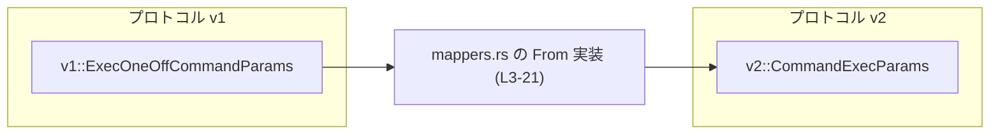
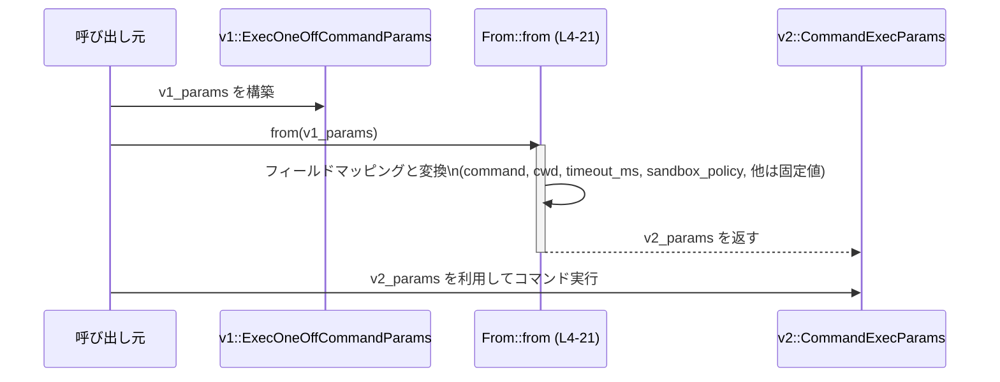

# app-server-protocol/src/protocol/mappers.rs コード解説

## 0. ざっくり一言

v1 プロトコルの `ExecOneOffCommandParams` を、v2 プロトコルの `CommandExecParams` に変換するための `From` 実装だけを持つモジュールです（`mappers.rs:L3-21`）。

---

## 1. このモジュールの役割

### 1.1 概要

- このモジュールは、**プロトコル v1 で定義された一時的なコマンド実行パラメータ**を、**プロトコル v2 のコマンド実行パラメータ構造体**に変換する役割を持ちます（`mappers.rs:L1-3`）。
- Rust の `From` トレイトを実装することで、`into()` などを使った自然な型変換を可能にしています（`mappers.rs:L3-4`）。

### 1.2 アーキテクチャ内での位置づけ

このモジュールは `crate::protocol::v1` と `crate::protocol::v2` の間に位置し、両者の型を橋渡しするコンポーネントになっています（`mappers.rs:L1-3`）。



### 1.3 設計上のポイント

コードから読み取れる特徴は次のとおりです。

- **`From` トレイト実装**  
  - `From<v1::ExecOneOffCommandParams> for v2::CommandExecParams` を実装し、`v1` → `v2` の一方向変換を提供しています（`mappers.rs:L3-4`）。
- **所有権の移動による変換**  
  - 引数は値として受け取るため、`v1::ExecOneOffCommandParams` の所有権は変換時に消費されます（`mappers.rs:L4`）。
- **フィールドごとの明示的なマッピングとデフォルト値**  
  - `command` や `cwd` は v1 からコピーし（`mappers.rs:L6, L17`）、その他多くのフィールドは `None` や `false` に固定されています（`mappers.rs:L7-13, L18-19`）。
- **安全な数値変換とデフォルトフォールバック**  
  - `timeout_ms` は `i64::try_from(...)` で変換し、変換に失敗した場合でも panic せず `60_000`（60秒と推測されますが、コードからは単位は断定できません）を使用します（`mappers.rs:L14-16`）。
- **ポリシーの型変換に `Into` を利用**  
  - `sandbox_policy` は `map(std::convert::Into::into)` で v1 → v2 の対応型に変換されますが、具体的な型はこのチャンクには現れません（`mappers.rs:L20`）。

---

## 2. 主要な機能一覧（コンポーネントインベントリー）

このファイルで定義されている主要コンポーネントは 1 つです。

| 名前 | 種別 | 定義位置 | 役割 / 用途 |
|------|------|----------|-------------|
| `From<v1::ExecOneOffCommandParams> for v2::CommandExecParams` | トレイト実装 (`impl From<...> for ...`) | `mappers.rs:L3-21` | v1 の一時コマンド実行パラメータを v2 のコマンド実行パラメータへ変換する |

参考として、このファイル内で登場する外部型も示します（定義は他モジュール）。

| 名前 | 種別 | 定義位置（参照のみ） | 役割 / 用途 |
|------|------|----------------------|-------------|
| `v1::ExecOneOffCommandParams` | 構造体（と推測される） | `mappers.rs:L3-4` | v1 プロトコル側の「一時的なコマンド実行」のパラメータ型。詳細なフィールド構成はこのチャンクには現れません。 |
| `v2::CommandExecParams` | 構造体（と推測される） | `mappers.rs:L3-5` | v2 プロトコル側の一般的なコマンド実行パラメータ型。詳細なフィールド構成はこのチャンクには現れません。 |

---

## 3. 公開 API と詳細解説

### 3.1 型一覧

このファイル自身には新しい構造体や列挙体の定義はありません（`mappers.rs:L1-23`）。  
利用しているのは、`crate::protocol::v1` および `crate::protocol::v2` モジュール内の型です（`mappers.rs:L1-2`）。

### 3.2 関数詳細

#### `impl From<v1::ExecOneOffCommandParams> for v2::CommandExecParams`

```rust
impl From<v1::ExecOneOffCommandParams> for v2::CommandExecParams { // mappers.rs:L3
    fn from(value: v1::ExecOneOffCommandParams) -> Self {          // mappers.rs:L4
        Self {
            command: value.command,                                 // L6
            process_id: None,                                       // L7
            tty: false,                                             // L8
            stream_stdin: false,                                    // L9
            stream_stdout_stderr: false,                            // L10
            output_bytes_cap: None,                                 // L11
            disable_output_cap: false,                              // L12
            disable_timeout: false,                                 // L13
            timeout_ms: value                                       // L14
                .timeout_ms                                         // L15
                .map(|timeout| i64::try_from(timeout).unwrap_or(60_000)), // L16
            cwd: value.cwd,                                         // L17
            env: None,                                              // L18
            size: None,                                             // L19
            sandbox_policy: value.sandbox_policy.map(std::convert::Into::into), // L20
        }
    }
}
```

**概要**

- v1 の `ExecOneOffCommandParams` を受け取り、v2 の `CommandExecParams` インスタンスを構築して返します（`mappers.rs:L3-5`）。
- いくつかのフィールドは v1 からコピーされ、その他は固定値（`None` や `false`）で初期化されます（`mappers.rs:L6-13, L17-19`）。
- `timeout_ms` と `sandbox_policy` は、型変換やデフォルト値を伴う少し複雑な変換を行います（`mappers.rs:L14-16, L20`）。

**引数**

| 引数名 | 型 | 説明 | 根拠 |
|--------|----|------|------|
| `value` | `v1::ExecOneOffCommandParams` | 変換対象となる v1 側の一時コマンド実行パラメータ。所有権ごと受け取ります。 | `mappers.rs:L3-4` |

- 所有権（Ownership）：  
  - 関数シグネチャが `fn from(value: v1::ExecOneOffCommandParams)` であり、参照ではなく値を取るため、`value` の所有権はこの関数に移動します（`mappers.rs:L4`）。
  - `command` や `cwd` など一部のフィールドはそのまま `Self` にムーブされます（`mappers.rs:L6, L17`）。

**戻り値**

- 型: `v2::CommandExecParams`（`mappers.rs:L3, L5`）
- 説明: v1 から変換された v2 用のコマンド実行パラメータです。  
  - v1 からコピーされたフィールドと、固定値が混在する構造になっています（`mappers.rs:L6-13, L17-20`）。

**内部処理の流れ（アルゴリズム）**

1. `Self { ... }` で v2::CommandExecParams のインスタンスを構築し始めます（`mappers.rs:L5`）。
2. `command` フィールドに v1 の `value.command` をそのまま移動します（`mappers.rs:L6`）。
3. `process_id` は常に `None` に設定されます（`mappers.rs:L7`）。
4. `tty`, `stream_stdin`, `stream_stdout_stderr` は全て `false` に固定されます（`mappers.rs:L8-10`）。
5. `output_bytes_cap` は `None`、`disable_output_cap` と `disable_timeout` は `false` で初期化されます（`mappers.rs:L11-13`）。
6. `timeout_ms` について:
   - まず v1 側の `value.timeout_ms`（おそらく `Option<...>` と推測されますが、このチャンクには型定義はありません）を取り出します（`mappers.rs:L14-15`）。
   - それが `Some(timeout)` の場合、`i64::try_from(timeout)` で `i64` に変換を試みます（`mappers.rs:L16`）。
   - 変換に失敗した場合（`try_from` が `Err` を返した場合）は `unwrap_or(60_000)` により `60_000` を使用します（`mappers.rs:L16`）。
   - `None` の場合はそのまま `None` が返り、v2 側も `None` になります（`mappers.rs:L15-16`）。
7. `cwd` は v1 の `value.cwd` をそのまま移動します（`mappers.rs:L17`）。
8. `env` と `size` はいずれも `None` に固定されます（`mappers.rs:L18-19`）。
9. `sandbox_policy` は `value.sandbox_policy` に対して `map(std::convert::Into::into)` を呼び出し、`Some(policy)` の場合は `policy` を v2 側の対応型へ変換して `Some(...)` として設定します（`mappers.rs:L20`）。

**Examples（使用例）**

`From` 実装を利用した典型的な使用例です。ここでは v1 / v2 の詳細定義がないため、フィールド初期化は仮のコメントにとどめます。

```rust
use crate::protocol::v1;
use crate::protocol::v2;

fn use_mapper() {
    // v1 側のパラメータを構築する（フィールドは例示）
    let v1_params = v1::ExecOneOffCommandParams {
        // command: ...,
        // timeout_ms: Some(30_000),  // 例: 30秒
        // cwd: ...,
        // sandbox_policy: Some(...),
        // 残りのフィールドは、このファイルには現れません
    };

    // From 実装により、into() で v2 側の型に変換できる
    let v2_params: v2::CommandExecParams = v1_params.into();

    // v2_params を使って v2 プロトコルのコマンド実行を行う想定
    // run_command(v2_params);
}
```

ポイント:

- `.into()` を呼ぶことで、コンパイラが `From<v1::ExecOneOffCommandParams>` 実装を利用します。
- `v1_params` は所有権ごと `into()` に渡されるため、その後 `v1_params` は使用できなくなります（所有権移動）。

**Errors / Panics（エラー／パニック）**

コードから読み取れる限り、この変換処理は panic を発生させません。

- `i64::try_from(timeout).unwrap_or(60_000)`  
  - ここで `unwrap_or` を呼んでいる対象は `Result<i64, _>` と考えられます（`try_from` の戻り値）であり、`Result::unwrap_or` はエラー時にも panic せずデフォルト値 (`60_000`) を返します（`mappers.rs:L16`）。
  - したがって、`timeout` が `i64` に変換できない場合でも panic ではなく `60_000` が使われます。
- その他のフィールド設定は単純な代入のみで、`unwrap` や I/O などの失敗要因は含まれていません（`mappers.rs:L6-13, L17-20`）。

**Edge cases（エッジケース）**

- `value.timeout_ms` が `None` の場合（`mappers.rs:L14-16`）:
  - `map(...)` は呼ばれず、v2 側の `timeout_ms` も `None` のままです。
- `value.timeout_ms` が `Some(timeout)` だが `i64::try_from(timeout)` が失敗する場合（型や値の範囲はこのチャンクには現れません）:
  - v2 側の `timeout_ms` は `Some(60_000)` になります（`mappers.rs:L16`）。
  - これは「変換不能な値は固定値 `60_000` に丸める」という動作です。
- `value.sandbox_policy` が `None` の場合:
  - `map(Into::into)` は実行されず、v2 側も `None` になります（`mappers.rs:L20`）。
- `value.sandbox_policy` が `Some(policy)` の場合:
  - `policy` は対応する v2 側の型に `Into::into` で変換され、`Some(...)` として設定されます（`mappers.rs:L20`）。

**使用上の注意点（契約・セキュリティ・並行性を含む）**

- **所有権に関する契約**  
  - `From` 実装は値を取るシグネチャであり、`v1::ExecOneOffCommandParams` の所有権は変換時に消費されます（`mappers.rs:L4`）。
  - 変換後も元の v1 値を使いたい場合は、`Clone` 実装の有無などを確認し、必要に応じてコピーする必要があります。この点はこのチャンクからは分かりません。
- **タイムアウト値の意味**  
  - 変換不能な `timeout_ms` が `60_000` にフォールバックされるため（`mappers.rs:L16`）、極端に大きい値などが指定されても、v2 側では 60,000 という値で扱われます。
  - これを「エラー扱い」にしたい仕様であれば、現状の実装とは異なるので注意が必要です。
- **env / size / process_id / tty などのデフォルト値**  
  - `process_id`, `env`, `size` はいずれも `None` に設定されています（`mappers.rs:L7, L18-19`）。
  - `tty`, `stream_stdin`, `stream_stdout_stderr`, `disable_output_cap`, `disable_timeout` はすべて `false` に固定されています（`mappers.rs:L8-10, L12-13`）。
  - もし v1 側にこれらに相当する情報が存在しても、この変換では使用されません。仕様として問題にならないかは、このファイルだけでは判断できません。
- **並行性（スレッドセーフティ）**  
  - この関数は純粋なデータ変換であり、グローバル状態や I/O にアクセスしていません（`mappers.rs:L4-21`）。
  - したがって、この関数自体はスレッドセーフに呼び出せると考えられます（データ競合が発生する要素は見当たりません）。
- **セキュリティ上の観点**  
  - `sandbox_policy` の変換に `Into::into` を用いており（`mappers.rs:L20`）、ポリシー情報が v1 → v2 へ引き継がれます。
  - 実際にどのようなポリシーが定義されているかはこのチャンクからは分かりませんが、変換時にフィールドを落としていないかどうかは、v1/v2 の型定義側で確認する必要があります。

### 3.3 その他の関数

このファイルには、補助的な関数や他のトレイト実装は存在しません（`mappers.rs:L1-23`）。

---

## 4. データフロー

v1 のパラメータから v2 のパラメータへの変換フローは次のようになります。



要点:

- 入力は v1 の `ExecOneOffCommandParams` インスタンスです。
- `from` 実装内（`mappers.rs:L4-21`）で、フィールドごとのコピーや変換、デフォルト値付与が行われます。
- 出力は v2 の `CommandExecParams` インスタンスで、これを使ってコマンド実行処理に進むことが想定されます（コマンド実行処理自体はこのファイルには現れません）。

---

## 5. 使い方（How to Use）

### 5.1 基本的な使用方法

`From` 実装により、`into()` を使って自然に型変換できるのが基本的な利用方法です。

```rust
use crate::protocol::v1;
use crate::protocol::v2;

fn main() {
    // v1 側のパラメータを用意する
    let v1_params = v1::ExecOneOffCommandParams {
        // command: ...,
        // timeout_ms: Some(10_000),
        // cwd: ...,
        // sandbox_policy: None,
    };

    // From 実装により、所有権を移動させながら v2 の型へ変換
    let v2_params: v2::CommandExecParams = v1_params.into();

    // ここでは v1_params は所有権を失っているので使用不可
    // v2_params を使って v2 プロトコルの API を呼び出す
}
```

### 5.2 よくある使用パターン

1. **型を明示しない `.into()`**

   ```rust
   let v2_params = v1_params.into(); // コンパイラが v2::CommandExecParams を推論できる場合
   ```

   - 変数の型や関数の引数型が `v2::CommandExecParams` である場合、型注釈なしでも問題なく動作します。

2. **`From::from` を明示的に使う**

   ```rust
   let v2_params = v2::CommandExecParams::from(v1_params);
   ```

   - `into()` が分かりづらい場面では、`From::from` を直接呼び出す書き方も可能です（`mappers.rs:L3-4`）。

### 5.3 よくある間違い

- **参照からの変換を試みる**

  このファイルでは `From<&v1::ExecOneOffCommandParams>` の実装は定義されていません（`mappers.rs:L1-23`）。したがって、次のようなコードはコンパイルエラーになる可能性があります。

  ```rust
  let v1_params = /* ... */;
  // 間違い例（このファイルだけから見ると、From<&v1::...> は定義されていない）
  // let v2_params: v2::CommandExecParams = (&v1_params).into();
  ```

  正しいパターン（所有権を移動してよい場合）は次のとおりです。

  ```rust
  let v1_params = /* ... */;
  let v2_params: v2::CommandExecParams = v1_params.into(); // 所有権をムーブ
  ```

  もし `v1_params` をその後も使いたい場合は、`Clone` などの実装があるかどうかを別途確認する必要があります。この情報はこのチャンクにはありません。

### 5.4 使用上の注意点（まとめ）

- `v1::ExecOneOffCommandParams` は所有権ごと `into()` に渡されるため、変換後に元の値は使えません。
- タイムアウト値の変換失敗時に「エラー」ではなく `60_000` が使われる点は、呼び出し側の仕様と合っているか確認が必要です（`mappers.rs:L16`）。
- `env`, `size`, `process_id`, 各種フラグ類は、この変換経由では固定値になります（`mappers.rs:L7-13, L18-19`）。これらを外部から制御したい場合は、変換後に別途上書きするか、変換ロジックを拡張する必要があります。

---

## 6. 変更の仕方（How to Modify）

### 6.1 新しい機能を追加する場合

例: v1 の別種パラメータを v2 に変換したい場合。

1. **新しい From 実装を追加**  
   - 同じ `mappers.rs` に `impl From<v1::OtherParams> for v2::CommandExecParams { ... }` のようなブロックを追加するのが自然です。
2. **フィールドマッピングを明示的に記述**  
   - 今回の `ExecOneOffCommandParams` のように、`Self { ... }` 内で v1 → v2 の対応関係を明示します（`mappers.rs:L5-20` を参考）。
3. **タイムアウトやポリシーの変換方針を合わせるか検討**  
   - 一貫性のために、`timeout_ms` やポリシーの変換ルールを同様にするかどうかを決める必要があります。

### 6.2 既存の機能を変更する場合

`ExecOneOffCommandParams` → `CommandExecParams` の変換仕様を変更する場合の注意点です。

- **影響範囲の確認**  
  - `From<v1::ExecOneOffCommandParams>` を利用している箇所（`.into()` や `CommandExecParams::from(...)`）がどこかを検索し、仕様変更の影響を確認する必要があります。
- **契約の変更に注意**  
  - 例: `timeout_ms` の変換失敗時にエラーを返すように仕様を変更すると、現在「必ず成功する」前提で呼び出しているコードに影響します。
- **テストの追加・更新**  
  - このファイルにはテストコードが含まれていません（`mappers.rs:L1-23`）。
  - 特にタイムアウトの境界値や `sandbox_policy` の有無など、エッジケースを含むテストを追加することが有用です。

---

## 7. 関連ファイル

このモジュールと直接関係するモジュール／ファイルは次のとおりです。

| パス / モジュール | 役割 / 関係 |
|-------------------|------------|
| `crate::protocol::v1` | `ExecOneOffCommandParams` を定義しているモジュール。`use crate::protocol::v1;` としてインポートされています（`mappers.rs:L1`）。具体的なファイルパスや中身はこのチャンクには現れません。 |
| `crate::protocol::v2` | `CommandExecParams` を定義しているモジュール。`use crate::protocol::v2;` としてインポートされています（`mappers.rs:L2`）。具体的なファイルパスや中身はこのチャンクには現れません。 |
| `app-server-protocol/src/protocol/mappers.rs` | 本レポートの対象ファイル。v1 → v2 への変換ロジックをまとめた場所です。 |

以上が、このチャンクから読み取れる範囲での `mappers.rs` の機能とデータフロー、および使用上の注意点です。このチャンクに現れない型定義や利用箇所については、別ファイルの内容を確認する必要があります。
