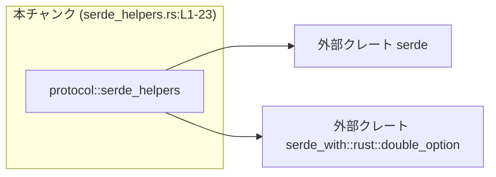
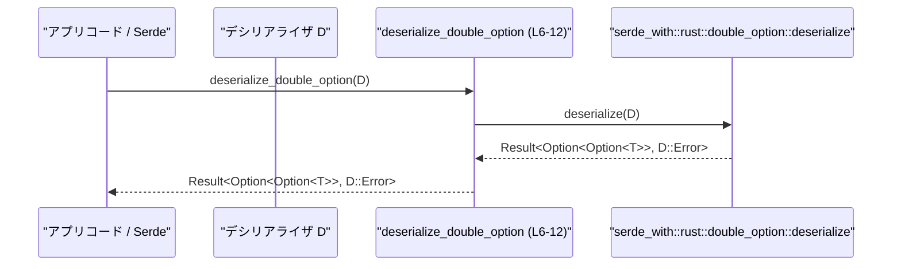

# app-server-protocol/src/protocol/serde_helpers.rs

## 0. ざっくり一言

`serde_with::rust::double_option` による `Option<Option<T>>` 型のシリアライズ／デシリアライズをラップする、小さなヘルパー関数を提供するモジュールです。（根拠: `serde_helpers.rs:L6-12`, `L14-23`）

---

## 1. このモジュールの役割

### 1.1 概要

- このモジュールは、`Option<Option<T>>`（二重の `Option`）をシリアライズ／デシリアライズするためのヘルパー関数を公開します。（根拠: `Result<Option<Option<T>>, D::Error>` と `&Option<Option<T>>` のシグネチャ `serde_helpers.rs:L6-7`, `L14-17`）
- 実際の処理は `serde_with::rust::double_option::{deserialize, serialize}` に委譲し、自前のロジックは持ちません。（根拠: `serde_helpers.rs:L11`, `L22`）

### 1.2 アーキテクチャ内での位置づけ

このモジュールから見える依存関係は、`serde` と外部クレート `serde_with` のみです。（根拠: `serde_helpers.rs:L1-4`, `L11`, `L22`）  
逆方向（どのモジュールから呼ばれているか）は、このチャンクには現れません。



### 1.3 設計上のポイント

- **薄いラッパー**  
  - 2つの公開関数は、いずれも 1 行で `serde_with::rust::double_option` の関数を呼び出すだけの構造になっています。（根拠: `serde_helpers.rs:L11`, `L22`）
- **ステートレス**  
  - グローバル変数や内部状態は一切持たず、引数のシリアライザ／デシリアライザに対して純粋な関数呼び出しを行います。（根拠: ファイル全体に状態を持つ要素がない `serde_helpers.rs:L1-23`）
- **エラーハンドリング**  
  - 戻り値のエラー型は `D::Error`／`S::Error` のままで、`serde_with` 側のエラーをそのまま呼び出し元へ伝搬します。（根拠: `Result<..., D::Error>` / `Result<..., S::Error>` シグネチャと、戻り値をそのまま返している実装 `serde_helpers.rs:L6-7`, `L14-17`, `L11`, `L22`）
- **Rust の安全性**  
  - `unsafe` ブロックや生ポインタは使われておらず、メモリ安全性は Rust の安全なサブセットに委ねられています。（根拠: `serde_helpers.rs:L1-23` に `unsafe` が存在しない）

---

## 2. 主要な機能一覧

- `deserialize_double_option`: `Option<Option<T>>` をデシリアライズするヘルパー。（根拠: `serde_helpers.rs:L6-12`）
- `serialize_double_option`: `Option<Option<T>>` をシリアライズするヘルパー。（根拠: `serde_helpers.rs:L14-23`）

### コンポーネント一覧（インポート／関数）

| 種別 | 名前 | 役割 / 用途 | 定義位置（根拠） |
|------|------|------------|------------------|
| import | `serde::Deserialize` | ジェネリック型 `T` のデシリアライズ制約に使用 | `serde_helpers.rs:L1`, `L8` |
| import | `serde::Deserializer` | ジェネリック型 `D` が実装すべきデシリアライザトレイト | `serde_helpers.rs:L2`, `L9` |
| import | `serde::Serialize` | ジェネリック型 `T` のシリアライズ制約に使用 | `serde_helpers.rs:L3`, `L19` |
| import | `serde::Serializer` | ジェネリック型 `S` が実装すべきシリアライザトレイト | `serde_helpers.rs:L4`, `L20` |
| 関数 | `deserialize_double_option` | `Option<Option<T>>` のデシリアライズを `serde_with` に委譲 | `serde_helpers.rs:L6-12` |
| 関数 | `serialize_double_option` | `Option<Option<T>>` のシリアライズを `serde_with` に委譲 | `serde_helpers.rs:L14-23` |

---

## 3. 公開 API と詳細解説

### 3.1 型一覧（構造体・列挙体など）

このファイル内で新たに定義されている構造体・列挙体はありません。（根拠: `serde_helpers.rs:L1-23`）

---

### 3.2 関数詳細

#### `deserialize_double_option<'de, T, D>(deserializer: D) -> Result<Option<Option<T>>, D::Error>`

**概要**

- 渡されたデシリアライザ `deserializer` を使って、`Option<Option<T>>` 型の値をデシリアライズします。（根拠: 戻り値型とパラメータ `serde_helpers.rs:L6-7`）
- 実装は `serde_with::rust::double_option::deserialize` の呼び出し 1 行のみです。（根拠: `serde_helpers.rs:L11`）

**シグネチャと引数**

```rust
pub fn deserialize_double_option<'de, T, D>(             // serde_helpers.rs:L6
    deserializer: D,                                     // serde_helpers.rs:L6
) -> Result<Option<Option<T>>, D::Error>                 // serde_helpers.rs:L6-7
where
    T: Deserialize<'de>,                                 // serde_helpers.rs:L8
    D: Deserializer<'de>,                                // serde_helpers.rs:L9
{
    serde_with::rust::double_option::deserialize(deserializer) // serde_helpers.rs:L11
}
```

**ジェネリクスと引数**

| 名前 | 型 | 説明 | 根拠 |
|------|----|------|------|
| `'de` | ライフタイム | デシリアライズ対象データのライフタイム | `serde_helpers.rs:L6`, `L8`, `L9` |
| `T` | ジェネリック型 | 実際にデシリアライズされる要素型 | `serde_helpers.rs:L6`, `L8` |
| `D` | ジェネリック型 | `serde::Deserializer<'de>` を実装するデシリアライザ型 | `serde_helpers.rs:L6`, `L9` |
| `deserializer` | `D` | データソースに紐づくデシリアライザインスタンス | `serde_helpers.rs:L6` |

**戻り値**

- 型: `Result<Option<Option<T>>, D::Error>`（根拠: `serde_helpers.rs:L6-7`）
  - `Ok(value)`: デシリアライズに成功した場合の `Option<Option<T>>`。
  - `Err(err)`: デシリアライズに失敗した場合のエラー。型は `D::Error` で、具体的な内容はデシリアライザ／`serde_with` 実装に依存します。

**内部処理の流れ**

1. 受け取った `deserializer` を、そのまま `serde_with::rust::double_option::deserialize` に渡します。（根拠: `serde_helpers.rs:L11`）
2. その戻り値（`Result<Option<Option<T>>, D::Error>`）を何も加工せずに呼び出し元へ返します。（根拠: 戻り値に対する追加処理がない `serde_helpers.rs:L11-12`）

この関数自身には条件分岐やループは存在しません。

**Examples（想定される使用例）**

このファイルから直接は利用箇所が分かりませんが、シグネチャから、Serde のカスタムデシリアライザとして使うことが想定されます。以下はその一例です（リポジトリ外の例であり、このチャンクには現れません）。

```rust
use serde::{Deserialize, Serialize};                          // Serde の基本トレイトをインポート
use app_server_protocol::protocol::serde_helpers::deserialize_double_option;
use app_server_protocol::protocol::serde_helpers::serialize_double_option;

#[derive(Serialize, Deserialize)]                             // 構造体をシリアライズ／デシリアライズ可能にする
struct Example {
    #[serde(
        deserialize_with = "deserialize_double_option",       // フィールド用のカスタムデシリアライザとして指定
        serialize_with = "serialize_double_option"            // 同じくカスタムシリアライザ
    )]
    value: Option<Option<String>>,                            // 二重の Option フィールド
}
```

**Errors / Panics**

- **Errors**
  - `serde_with::rust::double_option::deserialize` が返す `D::Error` が、そのまま呼び出し元に返されます。（根拠: ラッパー内でエラー変換がないこと `serde_helpers.rs:L11-12`）
  - どのような入力でエラーになるかは `serde_with` と `D` の実装に依存し、このチャンクからは判別できません。
- **Panics**
  - この関数内で `panic!` を直接呼び出したり、`unwrap` を使用している箇所はありません。（根拠: `serde_helpers.rs:L6-12`）
  - 内部で呼び出す `serde_with::rust::double_option::deserialize` がパニックを起こす可能性については、このチャンクからは不明です。

**Edge cases（エッジケース）**

関数本体は単なる委譲のため、エッジケースの挙動も `serde_with` に依存します。

ここでは、型レベルから推測できる範囲のみを整理します（挙動自体は不明）:

- `Option<Option<T>>` という型により、少なくとも次の 3 通りの状態を区別できるインターフェースになっています。
  - `None`
  - `Some(None)`
  - `Some(Some(value))`  
  （根拠: 戻り値の型 `Option<Option<T>>` `serde_helpers.rs:L6-7`）
- これらが外部フォーマット（JSON など）でどのように表現されるかは、`serde_with::rust::double_option::deserialize` に依存し、このチャンクには現れません。

**使用上の注意点**

- **型の整合性**  
  - フィールド型や変数型は `Option<Option<T>>` である必要があります。そうでない場合、コンパイルエラーになります。（根拠: 関数シグネチャ `serde_helpers.rs:L6-7`）
- **エラー処理**  
  - エラー型が `D::Error` のまま透過されるため、呼び出し側は `serde` の通常のエラー処理（`Result` の扱い）に従う必要があります。
- **並行性**  
  - 関数自体はステートレスで、引数にのみ依存するため、同一プロセス内の複数スレッドから同時に呼び出しても、関数レベルではデータ競合を生じません。（根拠: グローバル状態がない `serde_helpers.rs:L1-23`）  
    実際のスレッド安全性は、`D`（デシリアライザ）実装に依存します。

---

#### `serialize_double_option<T, S>(value: &Option<Option<T>>, serializer: S) -> Result<S::Ok, S::Error>`

**概要**

- `Option<Option<T>>` 型の値を、与えられたシリアライザ `serializer` を用いてシリアライズします。（根拠: 引数と戻り値のシグネチャ `serde_helpers.rs:L14-17`）
- 実装は `serde_with::rust::double_option::serialize` の呼び出し 1 行のみです。（根拠: `serde_helpers.rs:L22`）

**シグネチャと引数**

```rust
pub fn serialize_double_option<T, S>(                     // serde_helpers.rs:L14
    value: &Option<Option<T>>,                            // serde_helpers.rs:L15
    serializer: S,                                        // serde_helpers.rs:L16
) -> Result<S::Ok, S::Error>                              // serde_helpers.rs:L17
where
    T: Serialize,                                         // serde_helpers.rs:L19
    S: Serializer,                                        // serde_helpers.rs:L20
{
    serde_with::rust::double_option::serialize(value, serializer) // serde_helpers.rs:L22
}
```

**ジェネリクスと引数**

| 名前 | 型 | 説明 | 根拠 |
|------|----|------|------|
| `T` | ジェネリック型 | シリアライズされる要素型 | `serde_helpers.rs:L14`, `L19` |
| `S` | ジェネリック型 | `serde::Serializer` を実装するシリアライザ型 | `serde_helpers.rs:L14`, `L20` |
| `value` | `&Option<Option<T>>` | シリアライズ対象の二重 `Option` 値 | `serde_helpers.rs:L15` |
| `serializer` | `S` | 出力先フォーマットに応じたシリアライザインスタンス | `serde_helpers.rs:L16` |

**戻り値**

- 型: `Result<S::Ok, S::Error>`（根拠: `serde_helpers.rs:L17`）
  - `Ok(res)`: シリアライズ成功時の結果。具体的な型は各 `Serializer` の関連型 `S::Ok` に依存します。
  - `Err(err)`: シリアライズ失敗時のエラー。型は `S::Error` で、内容は `serializer`／`serde_with` 実装に依存します。

**内部処理の流れ**

1. 引数 `value` と `serializer` を、そのまま `serde_with::rust::double_option::serialize` に渡します。（根拠: `serde_helpers.rs:L22`）
2. その戻り値（`Result<S::Ok, S::Error>`）を何も加工せずに返します。（根拠: `serde_helpers.rs:L22-23`）

**Examples（想定される使用例）**

先ほどのデシリアライズ例と同じ構造体に対して、シリアライズ側として利用するケースを示します。

```rust
use serde::{Deserialize, Serialize};
use app_server_protocol::protocol::serde_helpers::{
    deserialize_double_option,
    serialize_double_option,
};

#[derive(Serialize, Deserialize)]
struct Example {
    #[serde(
        deserialize_with = "deserialize_double_option",
        serialize_with = "serialize_double_option"
    )]
    value: Option<Option<String>>,
}
```

このように、Serde の属性 `serialize_with` に関数名を指定すると、`value` フィールドのシリアライズ時に `serialize_double_option` が呼び出される形になります（これは Serde の一般的な利用パターンに基づく例であり、このファイルからは直接は読み取れません）。

**Errors / Panics**

- **Errors**
  - 内部の `serde_with::rust::double_option::serialize` が返す `S::Error` が、そのまま呼び出し元へ返ります。（根拠: エラー変換処理がない `serde_helpers.rs:L22-23`）
  - どのような条件でエラーになるかは、`serializer` と `serde_with` の実装に依存し、このチャンクからは不明です。
- **Panics**
  - この関数の本体にはパニックを起こし得るコードは含まれていません。（根拠: `serde_helpers.rs:L14-23` に `panic` や `unwrap` 等がない）
  - 内部呼び出し先がパニックを起こすかどうかは、このチャンクからは判断できません。

**Edge cases（エッジケース）**

- `value` が `None`／`Some(None)`／`Some(Some(...))` のとき、それぞれをどのように出力フォーマットへ変換するかは、`serde_with::rust::double_option::serialize` に依存します。（根拠: 関数が完全に委譲であること `serde_helpers.rs:L22`）
- 値 `T` がシリアライズ不可能（`T: Serialize` 制約を満たさない）な場合は、そもそもこの関数をコンパイル時に利用できません。（根拠: `T: Serialize` 制約 `serde_helpers.rs:L19`）

**使用上の注意点**

- **型の整合性**  
  - `value` は `&Option<Option<T>>` であり、`Option<T>` や `T` を直接渡すことはできません。（根拠: シグネチャ `serde_helpers.rs:L15`）
- **エラー処理**  
  - エラーは `S::Error` として返されるため、呼び出し側は対象の `Serializer` に応じた `Result` の処理を行う必要があります。
- **並行性**  
  - 関数自体はステートレスかつスレッドローカルな引数のみを扱うため、同一プロセス内の複数スレッドから同時に呼び出しても、関数自体によるデータレースは発生しません。（根拠: グローバル可変状態なし `serde_helpers.rs:L1-23`）  
    実際に並列に使用できるかどうかは、`S`（シリアライザ）実装のスレッド安全性に依存します。

---

### 3.3 その他の関数

このファイルには、上記 2 つ以外の関数は定義されていません。（根拠: `serde_helpers.rs:L1-23`）

---

## 4. データフロー

ここでは、`deserialize_double_option` が呼び出される典型的な流れを、抽象的なコンポーネント間のやりとりとして示します。呼び出し元（Serde やアプリケーションコード）は、このチャンクには現れません。



- シリアライズ側も同様に、`serialize_double_option` から `serde_with::rust::double_option::serialize` へ値とシリアライザが渡され、その結果がそのまま返却されるデータフローになっています。（根拠: `serde_helpers.rs:L22-23`）

---

## 5. 使い方（How to Use）

### 5.1 基本的な使用方法（想定パターン）

シグネチャから、Serde のフィールド単位のカスタム（デ）シリアライザとして使うパターンが自然です。以下はその想定例です。

```rust
use serde::{Deserialize, Serialize};                             // Serde トレイト
use app_server_protocol::protocol::serde_helpers::{
    deserialize_double_option,
    serialize_double_option,
};

#[derive(Serialize, Deserialize)]
struct Config {
    #[serde(
        deserialize_with = "deserialize_double_option",          // デシリアライズ時にこの関数を使用
        serialize_with = "serialize_double_option"               // シリアライズ時にこの関数を使用
    )]
    flag: Option<Option<String>>,                                // 二重 Option フィールド
}

fn main() -> Result<(), Box<dyn std::error::Error>> {
    let json = r#"{ "flag": "value" }"#;                         // 例: JSON 入力
    let cfg: Config = serde_json::from_str(json)?;               // Config をデシリアライズ
    let out = serde_json::to_string(&cfg)?;                      // 再度 JSON にシリアライズ
    println!("{out}");
    Ok(())
}
```

※ この利用パターンは、Serde の一般的なカスタム関数シグネチャに基づく例であり、このチャンクには具体的な呼び出しは現れていません。

### 5.2 よくある使用パターン（想定）

- **プロトコルフィールドで「未指定」と「明示的な null」を区別したい場合**
  - `Option<Option<T>>` によって 3 状態（未指定／明示的 null／値あり）を表現したいフィールドに対し、本ヘルパーを割り当てる想定が考えられます。
  - ただし、その表現が実際のフォーマット内でどうエンコードされるかは、このチャンクからは分かりません。

### 5.3 よくある間違い（起こり得る誤用）

型シグネチャから推測できる、起こり得る誤用例を挙げます。

```rust
// 誤り例: フィールド型が Option<T> なのに二重 Option 用のヘルパーを指定している
#[derive(Serialize, Deserialize)]
struct Wrong {
    #[serde(deserialize_with = "deserialize_double_option")] // 二重 Option 用
    value: Option<String>,                                  // 単一 Option 型
}

// この場合、シグネチャ (Option<Option<T>>) と一致しないためコンパイルエラーになる。
```

```rust
// 正しい例: ヘルパーのシグネチャに合わせてフィールドも Option<Option<T>> にする
#[derive(Serialize, Deserialize)]
struct Correct {
    #[serde(deserialize_with = "deserialize_double_option")]
    #[serde(serialize_with = "serialize_double_option")]
    value: Option<Option<String>>,
}
```

### 5.4 使用上の注意点（まとめ）

- 本ヘルパーは **二重の `Option` 専用** であり、`T` や `Option<T>` を直接扱うものではありません。（根拠: シグネチャ `serde_helpers.rs:L6-7`, `L14-17`）
- エラーは `serde_with` と `serde` 側の実装に依存しており、この関数内では追加情報を付加しません。
- 並行実行時でも本関数自身は共有状態を持たないため、再入可能です。ただし、同一のシリアライザ／デシリアライザを複数スレッドから共有して使う場合の安全性は、それらの実装に依存します。

---

## 6. 変更の仕方（How to Modify）

### 6.1 新しい機能を追加する場合

このモジュールに類似のヘルパーを追加する場合の一例です。

1. **新しいヘルパー関数の追加**
   - `serde_helpers.rs` に、新しいシグネチャを持つ関数を追加します。
   - 例えば `Option<T>` 用に別の挙動を持つヘルパーを追加する場合は、`T: Serialize/Deserialize<'de>` 制約と `D: Deserializer<'de>`／`S: Serializer` 制約を再利用できます。
2. **必要に応じて別の `serde_with` ヘルパーを利用**
   - 現在は `serde_with::rust::double_option` を利用していますが、別のモジュール関数を使う場合は、同様に 1 行の委譲関数としてラップする構成にできます。
3. **呼び出し側（構造体フィールドの `serde` 属性など）から、新ヘルパーを参照できるようにする**
   - 具体的な呼び出し場所はこのチャンクには現れませんが、`pub` 関数であれば外部モジュールから指定可能です。（根拠: `pub fn` 定義 `serde_helpers.rs:L6`, `L14`）

### 6.2 既存の機能を変更する場合

- **シグネチャの変更に注意**
  - 戻り値型や引数型（特に `Option<Option<T>>`）を変更すると、既存の呼び出し箇所がすべて影響を受けます。
  - Serde の `serialize_with` / `deserialize_with` に合わせたシグネチャになっている可能性が高く、その契約を壊すとコンパイルエラーやランタイムエラーが起こり得ます（この点は、シグネチャからの推測であり、このチャンクには具体的な使用箇所はありません）。
- **内部実装の変更**
  - 現状は `serde_with` に完全委譲しているため、内部実装を別のロジックに差し替えると、シリアライズフォーマットやエラー挙動が変わる可能性があります。
  - プロトコル互換性が重要な場合、過去との互換を事前に確認する必要があります。

---

## 7. 関連ファイル

このチャンクから直接参照できる「関連ファイル」は以下の外部クレートのみです。  
同一リポジトリ内でこのヘルパーを使用しているファイルは、このチャンクには現れません。

| パス / クレート | 役割 / 関係 | 根拠 |
|-----------------|------------|------|
| `serde` クレート | `Deserialize`, `Deserializer`, `Serialize`, `Serializer` トレイトを提供し、本モジュールのジェネリック制約として利用される | `serde_helpers.rs:L1-4`, `L8-9`, `L19-20` |
| `serde_with::rust::double_option` | `Option<Option<T>>` 用のシリアライズ／デシリアライズ実装を提供し、本モジュールから直接呼び出される | `serde_helpers.rs:L11`, `L22` |

テストコードやこのヘルパーの呼び出し元となる他モジュールは、このチャンクには現れず、不明です。
