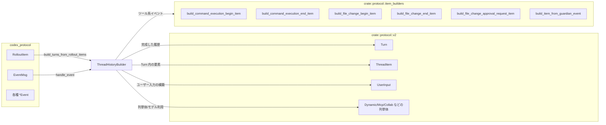
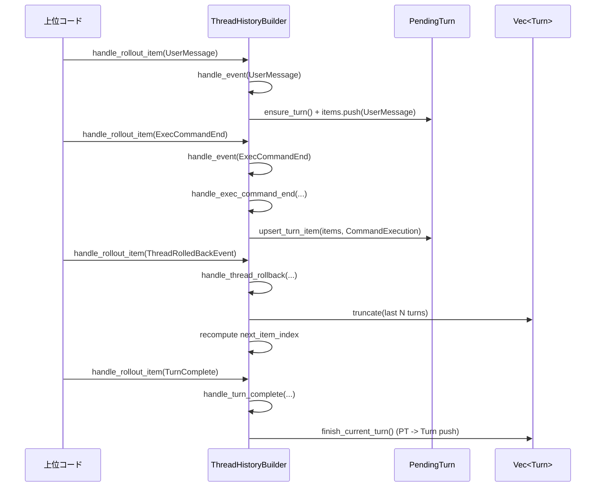

app-server-protocol/src/protocol/thread_history.rs

---

## 0. ざっくり一言

`codex_protocol::protocol::RolloutItem`/`EventMsg` から、UI 向けの `Turn` / `ThreadItem` ベースの「スレッド履歴」を構築・更新するためのビルダーです。  
永続化されたロールアウトの再生や、実行中スレッドの「現在のターン表示」に使われます。

---

## 1. このモジュールの役割

### 1.1 概要

- このモジュールは **Codex のコアイベントストリーム（`RolloutItem` / `EventMsg`）** を、フロントエンド表示向けの高レベル履歴フォーマット **`Vec<Turn>`** に変換する役割を持ちます。
- ユーザーメッセージ、エージェントメッセージ、ツール呼び出し、レビュー、コンテキスト圧縮、コラボエージェント等、多数のイベントを **`ThreadItem` の各種バリアント** に集約します。
- 永続化ロールアウトの「一括再構築」と、実行中スレッドの「インクリメンタル更新」の両方を同じロジックで扱います。

### 1.2 アーキテクチャ内での位置づけ

主要な依存関係を図示すると、概ね以下のような関係になります（行番号はこのチャットからは特定できないため省略しています）。



- 上位コードは `build_turns_from_rollout_items` または `ThreadHistoryBuilder` を使って、`RolloutItem` を順に流し込みます。
- ビルダー内部では、イベント種別ごとの `handle_*` メソッドで `ThreadItem` を生成/更新し、`PendingTurn` に蓄積した後 `Turn` に確定します。

### 1.3 設計上のポイント

コードから読み取れる特徴を列挙します。

- **状態管理**
  - 内部に可変な `PendingTurn`（現在のターン）を 1 つだけ保持し、確定したターンは `Vec<Turn>` に積み上げる構造です。
  - `TurnStarted` / `TurnComplete` が明示的に来ない旧ロールアウトへの後方互換性のため、ユーザーメッセージを受け取ったタイミングで暗黙的にターンを開始するロジックを持ちます（`handle_user_message`）。
  - 圧縮のみが行われたターンや、明示的に開かれたがアイテムが無いターンを捨てないためのフラグ `opened_explicitly` / `saw_compaction` を持ちます。

- **エラーハンドリング方針**
  - `ErrorEvent` すべてがターン失敗になるわけではなく、`ErrorEvent::affects_turn_status()` が真のものだけを `TurnStatus::Failed` にします（`handle_error`）。  
    → テスト `rollback_failed_error_does_not_mark_turn_failed` / `out_of_turn_error_does_not_create_or_fail_a_turn` で確認されています。
  - いったん `Failed` になったターンは、後続の `TurnComplete` でも `Completed` に戻さず `Failed` のまま維持します（`error_then_turn_complete_preserves_failed_status`）。

- **ID / アイテム管理**
  - `next_item_index` により `"item-1"`, `"item-2"` … という一意な id を順に採番します（ツール呼び出しなど、外部 id を持つものはその id をそのまま使う）。
  - `upsert_turn_item` により、同一 id の `ThreadItem` は「追加」ではなく「更新」されます。  
    → Begin/End イベントや Guardian の InProgress→Denied などを 1 アイテムに集約。

- **順序と整合性**
  - `ExecCommandEnd` は、イベントに含まれる `turn_id` を優先して対象ターンに割り当てます。これにより「元のターンが終わった後の遅延完了」でも、正しいターンに紐づけられます（`assigns_late_exec_completion_to_original_turn`）。
  - 逆に、未知の `turn_id` に対するツール完了イベントは警告ログを出して破棄します（`upsert_item_in_turn_id` 内の `tracing::warn!`）。

- **言語固有の安全性**
  - 外部からは `&mut self` 経由でしか状態を書き換えないため、スレッド間で同じ `ThreadHistoryBuilder` を同時に共有しない限りデータ競合は起きにくい設計になっています。
  - `unreachable!` は `ensure_turn` の論理的不変条件が崩れた場合のみ発火しますが、通常の使用ではそこに到達しないように防御的に記述されています。

---

## 2. 主要な機能一覧

このモジュールが提供する主な機能です。

- `build_turns_from_rollout_items`: 永続化された `RolloutItem` 列を `Vec<Turn>` に変換するユーティリティ関数。
- `ThreadHistoryBuilder`:
  - ロールアウト再生や実行中スレッドの履歴構築に使う状態付きビルダー。
  - `handle_event` / `handle_rollout_item` により、イベントごとに内部の `PendingTurn` / `Turn` を更新。
  - `active_turn_snapshot` により、実行中のターンのスナップショットを取得。
- イベント種別ごとのハンドラ群:
  - `handle_user_message`, `handle_agent_message`, `handle_agent_reasoning*`: 会話テキストと推論ログの構築。
  - `handle_web_search_*`, `handle_exec_command_*`, `handle_dynamic_tool_call_*`, `handle_mcp_tool_call_*`: 各種ツール呼び出し結果を `ThreadItem` に集約。
  - `handle_patch_apply_*`, `handle_apply_patch_approval_request`, `handle_guardian_assessment`: ファイル変更や Guardian 評価を `FileChange` / `CommandExecution` アイテムとして再構築。
  - `handle_collab_*`: コラボエージェントの spawn / send_input / wait / close / resume の状態を `CollabAgentToolCall` として構築。
  - `handle_turn_started`, `handle_turn_complete`, `handle_turn_aborted`, `handle_thread_rollback`, `handle_compacted`: ターン境界やロールバック、圧縮の管理。
  - `handle_context_compacted`, `handle_entered_review_mode`, `handle_exited_review_mode`: 文脈圧縮とレビュー・モードの開始/終了を記録。
  - `handle_response_item`: ロールアウト中の `ResponseItem::Message` から Hook Prompt を復元。
- 補助関数
  - `build_user_inputs`: `UserMessageEvent` から `Vec<UserInput>` を生成。
  - `render_review_output_text`: レビュー結果出力の文字列化。
  - `convert_dynamic_tool_content_items`: コアの dynamic tool 出力アイテムを v2 モデルに変換。
  - `upsert_turn_item`: `ThreadItem` を id で upsert。

---

## 3. 公開 API と詳細解説

### 3.1 型一覧（構造体・列挙体など）

このファイルで定義されている主要な型と、密接に利用されている外部型です。

| 名前 | 種別 | 公開可否 | 役割 / 用途 |
|------|------|----------|-------------|
| `ThreadHistoryBuilder` | 構造体 | `pub` | ロールアウトイベントから `Turn` 履歴を構築する状態付きビルダー。 |
| `PendingTurn` | 構造体 | `pub(crate)` ではなく `struct`（非公開） | ビルダー内部でのみ使う「構築中ターン」の表現。`Turn` に変換される。 |
| `Turn` | 構造体（`crate::protocol::v2`） | 外部定義 | 1 回のユーザー入力とその応答・ツール利用を表す単位。フィールドとして `id, status, error, started_at, completed_at, duration_ms, items` を持つことがテストから分かります。 |
| `ThreadItem` | enum（`crate::protocol::v2`） | 外部定義 | ターン内の個々の要素。`UserMessage`, `AgentMessage`, `Reasoning`, `WebSearch`, `CommandExecution`, `FileChange`, `ImageGeneration`, `DynamicToolCall`, `McpToolCall`, `CollabAgentToolCall`, `HookPrompt`, `ContextCompaction`, `EnteredReviewMode`, `ExitedReviewMode` 等のバリアントがあります（テスト・マッチ対象より）。 |
| `UserInput` | enum（`crate::protocol::v2`） | 外部定義 | ユーザー入力の 1 要素。テキスト、リモート画像 URL、ローカル画像パスなど。 |
| `CollabAgentState` | 構造体（`crate::protocol::v2`） | 外部定義 | コラボエージェントの状態（ステータスとメッセージ）を表現。 |
| `TurnStatus` | enum（`crate::protocol::v2`） | 外部定義 | `Completed`, `InProgress`, `Failed`, `Interrupted` などのターン状態。 |
| `TurnError` / `V2TurnError` | 構造体（`crate::protocol::v2`） | 外部定義 | ターン失敗のエラー内容（メッセージと `CodexErrorInfo`）を保持。 |
| `DynamicToolCallStatus` / `McpToolCallStatus` / `CollabAgentToolCallStatus` | enum（`crate::protocol::v2`） | 外部定義 | 各種ツール呼び出しの状態（`InProgress` / `Completed` / `Failed` など）。 |

※ 外部型はこのファイルのコードとテストで利用されているフィールド/バリアントのみ説明しています。他の詳細は別ファイルになります。

### 3.2 関数詳細（主要 7 件）

#### `build_turns_from_rollout_items(items: &[RolloutItem]) -> Vec<Turn>`

**概要**

- 永続化されたロールアウト（`RolloutItem` の列）から、**全ターンの履歴 (`Vec<Turn>`) を一括で再構築**するユーティリティです。
- 内部的には `ThreadHistoryBuilder` を生成して、全アイテムを順に `handle_rollout_item` に流し込み、最後に `finish()` で `Turn` を取り出します。

**引数**

| 引数名 | 型 | 説明 |
|--------|----|------|
| `items` | `&[RolloutItem]` | 再生対象のロールアウト項目列。`EventMsg` / `Compacted` / `ResponseItem` / `TurnContext` / `SessionMeta` のいずれか。 |

**戻り値**

- `Vec<Turn>`: 与えられたロールアウトから構築されたターン履歴。  
  ユーザー・エージェントメッセージやツール実行、レビュー等が `Turn.items` 内の `ThreadItem` として並びます。

**内部処理の流れ**

- 新しい `ThreadHistoryBuilder` を作成。
- `items` の各要素に対して `builder.handle_rollout_item(item)` を呼び出し、ビルダー内部の状態を更新。
- 最後に `builder.finish()` を呼び出して、未確定の `PendingTurn` を必要に応じて `Turn` に変換して返します。

**Examples（使用例）**

ロールアウト再生時に、過去スレッドを UI に表示する例です。

```rust
use codex_protocol::protocol::{RolloutItem, EventMsg};
use app_server_protocol::protocol::thread_history::build_turns_from_rollout_items;

fn rebuild_history(items: Vec<RolloutItem>) -> Vec<crate::protocol::v2::Turn> {
    // 永続化されていたロールアウトをそのまま渡して履歴を構築する
    let turns = build_turns_from_rollout_items(&items);
    // ここで turns[0].items[0] が最初のユーザーメッセージなどになる
    turns
}
```

**Errors / Panics**

- この関数自体は `Result` を返さず、panic も発生させません。
- 内部で使用している `ThreadHistoryBuilder` も、正常系では panic を起こさないよう記述されています。

**Edge cases**

- `items` が空の場合: 空の `Vec<Turn>` を返します（テスト `thread_rollback_clears_all_turns_when_num_turns_exceeds_history` などから推測）。
- ターンを全てロールバックするような `ThreadRolledBackEvent` が最後にある場合、結果が空になる可能性があります。
- `TurnContext` や `SessionMeta` など、スレッド履歴に直接影響しない `RolloutItem` は無視されます（`handle_rollout_item` 参照）。

**使用上の注意点**

- `items` は通常 **記録された順序で** 渡される前提です。順序を入れ替えると、`ThreadRolledBackEvent` や `TurnStarted`/`TurnComplete` などの意味が変わります。
- 実行中スレッドの「途中までの履歴」を扱う場合は、この関数よりも `ThreadHistoryBuilder` を使ったインクリメンタル更新が向きます。

---

#### `impl ThreadHistoryBuilder::handle_event(&mut self, event: &EventMsg)`

**概要**

- コアの `EventMsg` を 1 つ受け取り、その種類に応じて適切な内部ハンドラ（`handle_user_message`, `handle_exec_command_*` など）にディスパッチします。
- 「ロールアウト再生」と「実行中スレッドの追跡」の両方で共通の reducer として機能します。

**引数**

| 引数名 | 型 | 説明 |
|--------|----|------|
| `event` | `&EventMsg` | Codex のコアイベント。ユーザー/エージェントメッセージ、ツール呼び出し、ターン境界、エラーなど多数のバリアントがあります。 |

**戻り値**

- 戻り値はありません。`self` の内部状態（`current_turn`, `turns`）を更新します。

**内部処理の流れ**

- `match event { ... }` で `EventMsg` のバリアントごとに分岐します。
- 各バリアントに対して、対応する `handle_*` メソッドを呼び出します。
  - 例: `EventMsg::UserMessage(payload) => self.handle_user_message(payload)`
  - ツール系・コラボ系などは別の専用ハンドラに委譲。
- 未サポート、またはロールアウトに persist されないイベントについては `_ => {}` で無視します。

**Examples（使用例）**

実行中ストリームを逐次処理するコード例です。

```rust
use codex_protocol::protocol::EventMsg;
use app_server_protocol::protocol::thread_history::ThreadHistoryBuilder;

fn process_stream(events: impl Iterator<Item = EventMsg>) {
    let mut builder = ThreadHistoryBuilder::new();

    for event in events {
        builder.handle_event(&event); // 各イベントを順次適用
        if let Some(snapshot) = builder.active_turn_snapshot() {
            // UI に現在のターンの状態を表示するなど
            println!("Active turn id = {}", snapshot.id);
        }
    }

    let final_turns = builder.finish();
    println!("Total turns: {}", final_turns.len());
}
```

**Errors / Panics**

- `handle_event` 自体は `Result` を返さず、通常の入力では panic を発生させません。
- 内部で `unreachable!` が使われているのは `ensure_turn` だけで、ロジック上そこに到達しないようにガードされています。

**Edge cases**

- `EventMsg::Error` は、`ErrorEvent::affects_turn_status()` が真の場合のみ現在のターンを `Failed` にします。
- `TurnStarted` / `TurnComplete` / `TurnAborted` の組み合わせが通常と異なる順序で到着した場合でも、テストでカバーされているシナリオ（遅延完了・遅延中断など）については安定した挙動になるよう実装されています。
- 未知のまたは無視されるべきイベントは、状態を変えません（`HookStarted`/`HookCompleted`/`TokenCount`/`UndoCompleted` など）。

**使用上の注意点**

- イベントは **発生順に** 渡す必要があります。順序が逆転するとロールバックやターン境界の解釈が変わります。
- スレッドセーフではないため、1 インスタンスを複数スレッドから同時に呼び出す場合は外側で排他制御が必要です。

---

#### `impl ThreadHistoryBuilder::handle_rollout_item(&mut self, item: &RolloutItem)`

**概要**

- 永続化ロールアウトの 1 要素（`RolloutItem`）を受け取り、内部状態を更新します。
- `RolloutItem::EventMsg` / `RolloutItem::Compacted` / `RolloutItem::ResponseItem` などを、それぞれ適切な形で履歴に反映します。

**引数**

| 引数名 | 型 | 説明 |
|--------|----|------|
| `item` | `&RolloutItem` | ロールアウトの 1 ステップ。イベント、圧縮マーカー、レスポンスアイテムなど。 |

**戻り値**

- 戻り値はありません。ビルダー内部の `current_rollout_index` / `next_rollout_index` と `turns` / `current_turn` を更新します。

**内部処理の流れ**

- `self.current_rollout_index` を `self.next_rollout_index` に設定し、`next_rollout_index` をインクリメントします。
- `match item` でバリアントごとに処理:
  - `RolloutItem::EventMsg(event)` → `self.handle_event(event)`
  - `RolloutItem::Compacted(payload)` → `self.handle_compacted(payload)` （ターンに `saw_compaction = true` フラグを立てる）
  - `RolloutItem::ResponseItem(item)` → `self.handle_response_item(item)` （Hook Prompt の復元）
  - `RolloutItem::TurnContext(_)` / `SessionMeta(_)` → 無視（このビルダーでは使わない）

**Examples（使用例）**

`build_turns_from_rollout_items` 内部と同様ですが、ストリームを自前で管理する例です。

```rust
use codex_protocol::protocol::RolloutItem;
use app_server_protocol::protocol::thread_history::ThreadHistoryBuilder;

fn rebuild_from_rollout(items: &[RolloutItem]) {
    let mut builder = ThreadHistoryBuilder::new();

    for item in items {
        builder.handle_rollout_item(item);
    }

    let turns = builder.finish();
    // turns を UI に渡すなど
}
```

**Errors / Panics**

- `usize::try_from(payload.num_turns)` などの `try_from` は、変換に失敗した場合 `usize::MAX` などにフォールバックするよう `unwrap_or` が使われているため、panic は発生しません。
- その他のロジックも panic を想定していません。

**Edge cases**

- `RolloutItem::Compacted` のみからなるターンは、`saw_compaction = true` によって `finish_current_turn` で削除されず保持されます（テスト `preserves_compaction_only_turn`）。
- `ResponseItem::Message` であっても、Hook Prompt 形式でないものは無視されます（テスト `ignores_plain_user_response_items_in_rollout_replay`）。

**使用上の注意点**

- `handle_event` と異なり、`RolloutItem` は `TurnContext` や `SessionMeta` なども含む可能性がありますが、これらはここでは解釈されません。必要であれば別のレイヤーで処理する必要があります。
- `current_rollout_index` / `active_turn_start_index` により、「このターンがロールアウトの何個目のアイテムから始まったか」を知ることができます。

---

#### `impl ThreadHistoryBuilder::active_turn_snapshot(&self) -> Option<Turn>`

**概要**

- 現在アクティブなターンのスナップショット（`Turn`）を返します。
- アクティブターンがない場合は、最後に完了したターンを返します。どちらも存在しない場合は `None` です。

**引数**

- 引数はありません（`&self` のみ）。

**戻り値**

- `Option<Turn>`:
  - `Some(Turn)` … 現在のターン、または最後のターン。
  - `None` … まだ一度もターンが存在しない場合。

**内部処理の流れ**

- `self.current_turn.as_ref().map(Turn::from)` により、構築中の `PendingTurn` を `Turn` にクローン変換して返します。
- もし `current_turn` が `None` なら、`self.turns.last().cloned()` を返します。
- どちらも `None` の場合は `None` を返します。

**Examples（使用例）**

UI 更新用に定期的に呼び出す例です。

```rust
fn maybe_render(builder: &ThreadHistoryBuilder) {
    if let Some(turn) = builder.active_turn_snapshot() {
        // 画面に現在のターン情報を表示する
        println!("Turn {}: status = {:?}", turn.id, turn.status);
    } else {
        println!("No turn yet");
    }
}
```

**Errors / Panics**

- 単純な参照読み取りとクローンのため、エラーも panic も発生しません。

**Edge cases**

- `current_turn` が存在せず、確定済みターンもない場合は `None` になります。
- `current_turn` がある場合は、未完了のツール呼び出しやメッセージも含めた「途中経過」がそのまま `Turn` として返されます。

**使用上の注意点**

- 戻り値の `Turn` は **スナップショットのコピー** であり、これを書き換えてもビルダー内部状態は変わりません。
- 高頻度で呼び出しても安全ですが、`items` のクローンコストは考慮が必要です（大量の履歴を持つターンで頻繁に呼び出すと、メモリアロケーションが増えます）。

---

#### `impl ThreadHistoryBuilder::handle_turn_started(&mut self, payload: &TurnStartedEvent)`

**概要**

- 明示的なターン開始イベントを処理し、新しい `PendingTurn` を作成します。
- 既存の `current_turn` があれば、それを `finish_current_turn` で確定させたうえで新しいターンに切り替えます。

**引数**

| 引数名 | 型 | 説明 |
|--------|----|------|
| `payload` | `&TurnStartedEvent` | 開始するターンの id や開始時刻、モデルなどを含むイベント。 |

**戻り値**

- 戻り値はありません。`self.current_turn` を新しい `PendingTurn` に置き換えます。

**内部処理の流れ**

- `self.finish_current_turn()` を呼び出して、アクティブなターンがあれば確定します（空ターンであれば条件に応じて破棄）。
- `self.new_turn(Some(payload.turn_id.clone()))` で新しい `PendingTurn` を作成。
- `with_status(TurnStatus::InProgress)` と `with_started_at(payload.started_at)` をチェーンして初期状態を設定。
- `opened_explicitly()` を呼んで `opened_explicitly = true` にし、明示的なターンであることを記録。
- その `PendingTurn` を `self.current_turn = Some(...)` に格納します。

**Examples（使用例）**

```rust
fn on_turn_started(builder: &mut ThreadHistoryBuilder, event: &TurnStartedEvent) {
    builder.handle_turn_started(event);
    // 以後の UserMessage/Tool イベントはこのターンに紐づく
}
```

**Errors / Panics**

- `finish_current_turn` 内で脆弱な操作は行っておらず、panic は想定されていません。

**Edge cases**

- 明示的な `TurnStarted` をまったく使わない旧ロールアウトでは、この関数は呼ばれず、代わりに `handle_user_message` が暗黙的にターンを開きます。
- すでに `current_turn` が `InProgress` であっても、新しい `TurnStarted` が来た時点で前のターンは `finish_current_turn` 経由で確定されます。

**使用上の注意点**

- 明示的なターン境界を使うストリームでは、`UserMessageEvent` とセットで必ず `TurnStartedEvent` / `TurnCompleteEvent` を発行する前提で設計されています。  
  中途半端な組合せにすると、「暗黙ターン」と「明示ターン」が混在する可能性があります。

---

#### `impl ThreadHistoryBuilder::handle_turn_complete(&mut self, payload: &TurnCompleteEvent)`

**概要**

- ターン完了イベントを処理し、対象ターンのステータスや完了時刻を更新します。
- 現在のターンに対する完了なら、ターンを確定して `self.turns` に移動します。

**引数**

| 引数名 | 型 | 説明 |
|--------|----|------|
| `payload` | `&TurnCompleteEvent` | 完了ターンの id・完了時刻・所要時間などを含むイベント。 |

**戻り値**

- なし。`self.current_turn` または `self.turns` 内の該当ターンが更新されます。

**内部処理の流れ**

- クロージャ `mark_completed` を定義し、渡された `PendingTurn` に対して:
  - `status` が `Completed` または `InProgress` の場合に `Completed` を設定。
  - `completed_at` と `duration_ms` を `payload` からコピー。
- まず `self.current_turn` の id が `payload.turn_id` と一致するか確認:
  - 一致すれば `mark_completed` を適用し、その後 `finish_current_turn()` で確定して終了。
- 次に `self.turns.iter_mut()` から id 一致の既存ターンを探す:
  - 見つかれば、そのターンの `status` / `completed_at` / `duration_ms` を更新して終了。
- 最後に、どちらにも一致しない場合:
  - `self.current_turn` があれば `mark_completed` を適用し、`finish_current_turn()` で確定。

**Examples（使用例）**

```rust
fn on_turn_complete(builder: &mut ThreadHistoryBuilder, event: &TurnCompleteEvent) {
    builder.handle_turn_complete(event);
    // これ以降、このターンはアクティブではなく、履歴内の Completed ターンとして扱われる
}
```

**Errors / Panics**

- 見つからないターン id に対しても安全にフォールバックします（最後の `if let Some(current_turn)` 分岐）。
- panic する可能性は見当たりません。

**Edge cases**

- `ErrorEvent` によって `status = Failed` になっているターンに対して `TurnCompleteEvent` が来た場合:
  - `mark_completed` は `status` が `Failed` の場合には `Completed` に変更しないため、`Failed` のまま完了時間だけ更新されます（テスト `error_then_turn_complete_preserves_failed_status`）。
- 「遅れて届いた `TurnComplete`」:
  - 既に `current_turn` が別ターンに切り替わっている状況で古い `TurnComplete` が来た場合でも、上記の手順で id が一致する既存ターンに対してだけ適用され、アクティブターンは閉じられません（`late_turn_complete_does_not_close_active_turn` テスト）。

**使用上の注意点**

- `TurnCompleteEvent` の発行順が前後しても、id が正しければ元のターンに紐づきます。ただし、意図せず別ターンに適用されないよう、`turn_id` の一貫性は重要です。

---

#### `impl ThreadHistoryBuilder::handle_thread_rollback(&mut self, payload: &ThreadRolledBackEvent)`

**概要**

- スレッドロールバックイベントを処理し、履歴末尾のターンを指定数だけ巻き戻します。
- `next_item_index` も再計算し、ロールバック後の状態から連番が継続するよう調整します。

**引数**

| 引数名 | 型 | 説明 |
|--------|----|------|
| `payload` | `&ThreadRolledBackEvent` | ロールバックするターン数 (`num_turns`) を含むイベント。 |

**戻り値**

- なし。`self.turns` と `self.next_item_index` を更新します。

**内部処理の流れ**

- まず `self.finish_current_turn()` を呼び出し、アクティブなターンがあれば確定させます。
- `let n = usize::try_from(payload.num_turns).unwrap_or(usize::MAX);` でロールバック数を `usize` に変換。失敗時は `usize::MAX` にフォールバック。
- `n >= self.turns.len()` の場合は `self.turns.clear()`（全削除）、そうでなければ `self.turns.truncate(self.turns.len().saturating_sub(n))` で末尾 n 個を削ります。
- 残った全ターンの `items.len()` を合計し、一つ進めた値を `next_item_index` に設定します。
  - これにより、ロールバック後に新規で追加される `item-*` ID が重複しません。

**Examples（使用例）**

```rust
fn on_thread_rollback(builder: &mut ThreadHistoryBuilder, event: &ThreadRolledBackEvent) {
    builder.handle_thread_rollback(event);
    // 直近 n ターン分の履歴が消え、その後のアイテム ID も詰めて採番し直される
}
```

**Errors / Panics**

- `try_from` 失敗時は `usize::MAX` を使うため、ここで panic は発生しません。
- `saturating_sub` により、`len() < n` の場合でもオーバーフローせず安全です。

**Edge cases**

- `num_turns` が履歴数以上（または非常に大きい）場合: 履歴は完全にクリアされます（テスト `thread_rollback_clears_all_turns_when_num_turns_exceeds_history`）。
- ロールバック後の `next_item_index` は、残っている全ターンのアイテム数 + 1 に再設定されます。  
  → ロールバック前に存在した `item-*` ID 番号にギャップが生じることはありますが、**新規に追加される ID との重複は防がれます**。

**使用上の注意点**

- ロールバックは **ターン単位** であり、ターン内の一部アイテムだけを消すことはしません。
- `ThreadRolledBackEvent` 前のイベントによって既にロールバックが行われている場合、`num_turns` が期待するターン数より大きくなりうるため、呼び出し元の設計側で一貫性を保つ必要があります。

---

#### `fn upsert_turn_item(items: &mut Vec<ThreadItem>, item: ThreadItem)`

**概要**

- `ThreadItem` の id に基づいて、既存アイテムを「更新」するか、新たに「追加」するかを決めるユーティリティ関数です。
- Begin / End イベントや Guardian InProgress / Denied 等、同じ id の複数イベントを 1 アイテムに統合するために使われます。

**引数**

| 引数名 | 型 | 説明 |
|--------|----|------|
| `items` | `&mut Vec<ThreadItem>` | ターン内のアイテム配列。 |
| `item` | `ThreadItem` | 追加または更新したいアイテム。`item.id()` がキーになります。 |

**戻り値**

- なし。`items` が破壊的に更新されます。

**内部処理の流れ**

- `items.iter_mut().find(|existing_item| existing_item.id() == item.id())` で id が一致する既存アイテムを探します。
- 見つかった場合: その要素を `*existing_item = item;` で置き換え、終了。
- 見つからない場合: `items.push(item)` で末尾に追加。

**Examples（使用例）**

`ThreadHistoryBuilder` 内部からのみ呼び出されますが、使い方は以下のようなイメージです。

```rust
fn update_tool_item(items: &mut Vec<ThreadItem>, new_state: ThreadItem) {
    // 同じ id のアイテムがあれば上書き、なければ追加
    upsert_turn_item(items, new_state);
}
```

**Errors / Panics**

- 反復と比較・代入のみで、panic 要因はありません。

**Edge cases**

- 同じ id のアイテムが複数存在することは、この関数を経由している限り起こりません（常に最初の一致に上書き）。
- `item.id()` がユニークであることを前提としており、その保証自体は呼び出し側（ビルダー）の責務です。

**使用上の注意点**

- `items` の順序は、最初の挿入位置のまま維持されます（更新時）ので、Begin / End の順に挿入した後に End で更新しても時系列順を壊しません。
- `ThreadItem::id()` 実装に依存しているため、ID 仕様を変更する場合はこの関数の前提も見直す必要があります。

---

### 3.3 その他の関数・メソッド（インベントリ）

数が多いため、機能グループごとにまとめます。

#### メッセージ / 推論関連

| 関数名 | 役割 |
|--------|------|
| `handle_user_message` | `UserMessageEvent` を受け取り、暗黙ターン開始処理と `ThreadItem::UserMessage` 追加を行う。空メッセージは無視。 |
| `handle_agent_message` | エージェントメッセージ（`AgentMessageEvent`）を `ThreadItem::AgentMessage` に変換。空テキストは無視。 |
| `handle_agent_reasoning` | `AgentReasoningEvent` を `ThreadItem::Reasoning` の `summary` に追加（直前が Reasoning なら追記、そうでなければ新規作成）。 |
| `handle_agent_reasoning_raw_content` | `AgentReasoningRawContentEvent` を `ThreadItem::Reasoning` の `content` に追加（同上）。 |

#### アイテムライフサイクル / プラン関連

| 関数名 | 役割 |
|--------|------|
| `handle_item_started` | `ItemStartedEvent` のうち `TurnItem::Plan` のみを `ThreadItem` に反映（他種別は無視）。 |
| `handle_item_completed` | `ItemCompletedEvent` のうち `TurnItem::Plan` のみを反映。 |

#### Web 検索 / コマンド / パッチ / Guardian

| 関数名 | 役割 |
|--------|------|
| `handle_web_search_begin` / `handle_web_search_end` | Web 検索ツール呼び出しの開始/終了を `ThreadItem::WebSearch` に upsert。 |
| `handle_exec_command_begin` / `handle_exec_command_end` | シェルコマンド実行の開始/終了を `ThreadItem::CommandExecution` に upsert。後者は `build_command_execution_end_item` に委譲し、ターン id に基づいて元ターンに割り当てる。 |
| `handle_guardian_assessment` | Guardian 評価（許可/拒否）の状態を `CommandExecutionStatus` に変換し、該当コマンドの `ThreadItem::CommandExecution` を作成/更新。 |
| `handle_apply_patch_approval_request` | パッチ適用の承認要求を `ThreadItem::FileChange` に反映（InProgress 状態）。 |
| `handle_patch_apply_begin` / `handle_patch_apply_end` | パッチ適用開始/終了を `ThreadItem::FileChange` に upsert。 |

#### Dynamic Tool / MCP Tool

| 関数名 | 役割 |
|--------|------|
| `handle_dynamic_tool_call_request` / `handle_dynamic_tool_call_response` | 動的ツール呼び出しの開始/応答を `ThreadItem::DynamicToolCall` に集約。 |
| `handle_mcp_tool_call_begin` / `handle_mcp_tool_call_end` | MCP ツール呼び出しの開始/終了を `ThreadItem::McpToolCall` に集約。成功時は `McpToolCallResult`、失敗時は `McpToolCallError` を構築。 |
| `convert_dynamic_tool_content_items` | コア側の dynamic tool 出力アイテムを v2 側の `DynamicToolCallOutputContentItem` に変換。 |

#### コラボエージェント関連

| 関数名 | 役割 |
|--------|------|
| `handle_collab_agent_spawn_begin` / `handle_collab_agent_spawn_end` | エージェント spawn の開始/終了を `ThreadItem::CollabAgentToolCall` に集約。receiver thread id やモデル情報、`CollabAgentState` を構築。 |
| `handle_collab_agent_interaction_begin` / `handle_collab_agent_interaction_end` | `send_input` 系の開始/終了。終了時の `AgentStatus` に応じて `CollabAgentToolCallStatus` を設定しつつも、Interrupted でも Completed として扱う（テスト `reconstructs_interrupted_send_input_as_completed_collab_call` 参照）。 |
| `handle_collab_waiting_begin` / `handle_collab_waiting_end` | 複数エージェントに対する待機状態を 1 つの `CollabAgentToolCall` に集約。全体の成功/失敗を決定。 |
| `handle_collab_close_begin` / `handle_collab_close_end` | エージェント終了の開始/終了を管理。 |
| `handle_collab_resume_begin` / `handle_collab_resume_end` | エージェント再開の開始/終了を管理。 |

#### レビュー / コンテキスト圧縮 / エラー

| 関数名 | 役割 |
|--------|------|
| `handle_context_compacted` | コンテキスト圧縮マーカーを `ThreadItem::ContextCompaction` として記録。 |
| `handle_entered_review_mode` | レビューモードに入ったことを、ユーザー向けヒントまたはデフォルト文言付きの `EnteredReviewMode` アイテムとして記録。 |
| `handle_exited_review_mode` | レビューモード終了を `ExitedReviewMode` アイテムとして記録。出力が空の場合はフォールバックメッセージを使用（`render_review_output_text`）。 |
| `handle_error` | `ErrorEvent` のうち `affects_turn_status()` が真のものに対して、現在のターンを `Failed` にし、`TurnError` を設定。 |

#### ターン管理 / 補助

| 関数名 | 役割 |
|--------|------|
| `handle_turn_aborted` | ターン中断イベント処理。id 明示の場合は該当ターンを `Interrupted` にし、なければアクティブターンを中断。 |
| `finish_current_turn` | 現在の `PendingTurn` を `Turn` に変換して push。アイテムがなく、暗黙ターンで、かつ圧縮もされていない場合は捨てる。 |
| `new_turn` | 新しい `PendingTurn` を生成。id が `Some` ならそれを使い、`None` なら `Uuid::now_v7()` による新規 id を採番。 |
| `ensure_turn` | アクティブターンがなければ新しい `PendingTurn` を作成し、必ず `&mut PendingTurn` を返す。 |
| `upsert_item_in_turn_id` / `upsert_item_in_current_turn` | ターン id 指定または現在ターンへの `ThreadItem` upsert。未知の turn id への upsert では `warn!` を発行して破棄。 |
| `next_item_id` | `"item-<n>"` 形式の新しいアイテム id を採番し、カウンタをインクリメント。 |
| `build_user_inputs` | `UserMessageEvent` から `Vec<UserInput>` を生成。空白のみのメッセージは無視し、画像 URL・ローカル画像パスも要素として追加。 |
| `render_review_output_text` | `ReviewOutputEvent` の全体説明をトリムし、空ならフォールバック文言を返す。 |

---

## 4. データフロー

代表的なシナリオとして、「ユーザーのメッセージと、続くツール呼び出し、ロールバック」がどのように流れるかを示します。

1. 上位レイヤーが `RolloutItem::EventMsg(EventMsg::UserMessage(...))` を `ThreadHistoryBuilder::handle_rollout_item` に渡す。
2. `handle_rollout_item` が内部で `handle_event` を呼び、`handle_user_message` が実行される。
3. `handle_user_message` が暗黙的にターンを開きつつ、`ThreadItem::UserMessage` を `PendingTurn.items` に追加。
4. 続くツールイベント（例: `ExecCommandEnd`, `DynamicToolCallResponse`）も同様に `handle_event`→各 `handle_*` に流れ、`ThreadItem` として upsert。
5. 途中で `ThreadRolledBackEvent` が来た場合、`handle_thread_rollback` が最後の N ターンを削除し、`next_item_index` を調整。
6. 最後に `TurnCompleteEvent` が来たとき、`handle_turn_complete` がターンを `Completed` にして `finish_current_turn` が呼ばれる。

これを sequence diagram で表すと次のようになります。



**ポイント**

- `handle_event` はすべての `EventMsg` の入口であり、実際のアイテム生成は各 `handle_*` に委譲されています。
- `handle_rollout_item` は `EventMsg` だけでなく `Compacted` や `ResponseItem` も扱うため、「ロールアウト再生の入口」として利用されます。
- `active_turn_snapshot` はこの途中経過の `PendingTurn` を `Turn` に変換した一時ビューを返します。

---

## 5. 使い方（How to Use）

### 5.1 基本的な使用方法

永続化ロールアウトからスレッド履歴を再構築する典型的なコードフローです。

```rust
use codex_protocol::protocol::RolloutItem;
use app_server_protocol::protocol::thread_history::build_turns_from_rollout_items;

fn load_thread_history(stored_items: Vec<RolloutItem>) -> Vec<crate::protocol::v2::Turn> {
    // ロールアウトを読み込み、履歴に変換する
    let turns = build_turns_from_rollout_items(&stored_items);

    // 必要ならここでフィルタリングや整形を行って UI へ渡す
    turns
}
```

実行中スレッドをインクリメンタルに追跡する場合:

```rust
use codex_protocol::protocol::EventMsg;
use app_server_protocol::protocol::thread_history::ThreadHistoryBuilder;

fn stream_thread(events: impl Iterator<Item = EventMsg>) {
    let mut builder = ThreadHistoryBuilder::new();

    for event in events {
        builder.handle_event(&event);

        // 適宜スナップショットを取って UI を更新
        if let Some(turn) = builder.active_turn_snapshot() {
            println!("Active turn {} has {} items", turn.id, turn.items.len());
        }
    }

    // ストリーム終了時に最終履歴を取得
    let final_turns = builder.finish();
    println!("Total turns: {}", final_turns.len());
}
```

### 5.2 よくある使用パターン

1. **ロールアウトのフルリプレイ**
   - `build_turns_from_rollout_items` を 1 回呼ぶだけで履歴全体を復元。
   - テスト・デバッグ、既存スレッドの読み込みに適します。

2. **ライブ UI 更新**
   - WebSocket や SSE などで `EventMsg` を受信するたびに `ThreadHistoryBuilder::handle_event` を呼び、`active_turn_snapshot` で表示更新。
   - コマンド実行やツール呼び出しの InProgress → Completed 遷移をリアルタイムに反映できます。

3. **ターン境界を明示的に扱うケース**
   - ミッドターン・ステアリング（途中でユーザーが追加入力して方針転換するようなケース）では、`TurnStarted` / `TurnComplete` を明示的に扱い、`handle_turn_started` / `handle_turn_complete` の挙動に頼る（テスト `uses_explicit_turn_boundaries_for_mid_turn_steering`）。

### 5.3 よくある間違い

```rust
// 誤り例: builder.finish() を呼び忘れている
let mut builder = ThreadHistoryBuilder::new();
for event in events {
    builder.handle_event(&event);
}
let turns = builder.turns; // current_turn が確定されていない

// 正しい例: finish() を通じて current_turn を確定する
let mut builder = ThreadHistoryBuilder::new();
for event in events {
    builder.handle_event(&event);
}
let turns = builder.finish(); // これで最後のターンも Vec<Turn> に含まれる
```

```rust
// 誤り例: 明示的な TurnStarted/TurnComplete を出さずに turn_id 付きツールイベントだけを送る
EventMsg::ExecCommandEnd(ExecCommandEndEvent {
    turn_id: "turn-1".into(),
    // ...
});

// 正しい例: turn_id を使うなら、事前に TurnStarted を発行しておく
EventMsg::TurnStarted(TurnStartedEvent {
    turn_id: "turn-1".into(),
    // ...
});
EventMsg::UserMessage(...);           // このターンのメッセージ
EventMsg::ExecCommandEnd(...);        // turn_id="turn-1"
EventMsg::TurnComplete(...);          // ターン完了
```

### 5.4 使用上の注意点（まとめ）

- **順序の前提**: イベントおよびロールアウトアイテムは基本的に生成順で渡す必要があります。特にロールバックや遅延完了イベントとの整合性に影響します。
- **スレッド安全性**: `ThreadHistoryBuilder` は内部に可変状態を持つため、1 インスタンスを複数スレッドから同時に操作する場合は外側で同期プリミティブ（`Mutex` など）を使う必要があります。
- **エラーイベントの解釈**: すべての `ErrorEvent` がターン失敗を意味するわけではありません。`affects_turn_status()` が真のものだけが `Failed` に反映されます。
- **ID の一貫性**:
  - ツール呼び出しや Guardian 評価は `call_id` / `target_item_id` を使って upsert されるため、これらの id が一貫していることが重要です。
  - `ThreadRolledBackEvent` 後に同じ id を再利用すると、履歴上は別物として扱われる可能性があります。

---

## 6. 変更の仕方（How to Modify）

### 6.1 新しい機能を追加する場合（新しい EventMsg バリアントなど）

1. **EventMsg レベルでバリアントが追加された場合**
   - `codex_protocol::protocol::EventMsg` に新しいバリアントが追加されたら、本ファイルの `handle_event` にそのパターンを追加します。
   - 例: `EventMsg::NewToolEvent(payload) => self.handle_new_tool_event(payload),`

2. **専用ハンドラの追加**
   - 対応する `fn handle_new_tool_event(&mut self, payload: &NewToolEvent)` を `ThreadHistoryBuilder` に追加します。
   - ここで `ThreadItem` のどのバリアントとして表現するかを決めます。必要なら `crate::protocol::v2::ThreadItem` に新しいバリアントを追加し、このビルダーからそれを生成します。

3. **ロールアウト再生への統合**
   - そのイベントが `RolloutItem::EventMsg` として永続化される場合、`handle_rollout_item` 側の変更は不要です（`EventMsg` に任せるため）。
   - 永続化されないメタ情報の場合は `RolloutItem` バリアントの設計を見直す必要がありますが、このファイル単独では判断できません。

4. **テストの追加**
   - 新しいイベントが履歴にどのように反映されるべきかを示すテストを `mod tests` に追加します。
   - 既存テストは、ツール呼び出しや Guardian、コラボエージェントなどの良い参考になります。

### 6.2 既存の機能を変更する場合

- **影響範囲の確認**
  - 変更したい関数（例: `handle_exec_command_end`）を検索し、その呼び出し元（`handle_event`, テストなど）を確認します。
  - 関連する `ThreadItem` バリアントの定義と、そのバリアントを利用している UI 層のコード（別ファイル）も確認する必要があります。

- **守るべき契約（前提条件・返り値の意味）**
  - `ThreadItem` の id が、Begin / End イベントで一貫していること。
  - `TurnStatus` の遷移: `InProgress` → `Completed` / `Failed` / `Interrupted` の意味を崩さないこと。
  - `ErrorEvent` がターン状態に与える影響は、`affects_turn_status` の仕様と整合させること。

- **テスト・使用箇所の再確認**
  - 関連するテスト（例えば Guardian 処理なら `reconstructs_declined_guardian_command_item` など）が失敗しないか確認します。
  - 変更により、新たなエッジケースが生まれた場合はテストを追加します。

---

## 7. 関連ファイル

このモジュールと密接に関係する他ファイル・モジュールです。

| パス / モジュール | 役割 / 関係 |
|-------------------|------------|
| `crate::protocol::v2` | `Turn`, `ThreadItem`, `UserInput`, 各種 Tool/Collab 用 enum・構造体を定義。`thread_history.rs` はそれらを生成する役割を持つ。 |
| `crate::protocol::item_builders` | `build_command_execution_*` や `build_file_change_*`, `build_item_from_guardian_event` など、コマンド実行・ファイル変更・Guardian イベントから `ThreadItem` を構築するユーティリティ関数群。 |
| `codex_protocol::protocol` | `EventMsg`, `RolloutItem`, 各種 `*Event` 型（`UserMessageEvent`, `ExecCommandEndEvent`, `ThreadRolledBackEvent` 等）を定義。`thread_history.rs` はこれを入力として消費する。 |
| `codex_protocol::models` | `MessagePhase`, `ResponseItem` 等のモデル型。Hook Prompt 復元やエージェントメッセージのフェーズ情報に利用。 |
| `codex_protocol::dynamic_tools` | Dynamic tool 呼び出し関連の型。`handle_dynamic_tool_call_*` と `convert_dynamic_tool_content_items` で利用。 |
| `codex_protocol::ThreadId` | コラボエージェント関連イベントのスレッド id 型。`handle_collab_*` 系で `String` に変換して保存。 |

---

### Bugs / Security / Contracts 補足（本ファイルから読み取れる範囲）

- **既知のバグを示すコードは見当たりません。** ただし、このファイル単体では UI 層や他モジュールとの整合性までは確認できません。
- **セキュリティ面**
  - 主にイベント → モデル変換のみを行っており、ファイル I/O やネットワーク I/O を直接扱いません。
  - シェルコマンド文字列やファイルパスなどの「危険な操作そのもの」は、上位レイヤー（コマンド実行エンジンなど）で取り扱われる前提です。
- **契約 / エッジケース**
  - 空テキストのメッセージ・推論は無視される（`handle_user_message`, `handle_agent_message`, `handle_agent_reasoning*`）。
  - Guardian や Patch Apply の InProgress 状態は、後続イベントによって同じ id のアイテムに上書きされる（upsert ロジック）。
  - 遅延した `TurnComplete` / `TurnAborted` は、id が一致するターンのみに適用され、アクティブターンを誤って閉じたり中断させない（テストで明示的に確認済み）。

この範囲で、コードに直接書かれていない推測は避けています。
