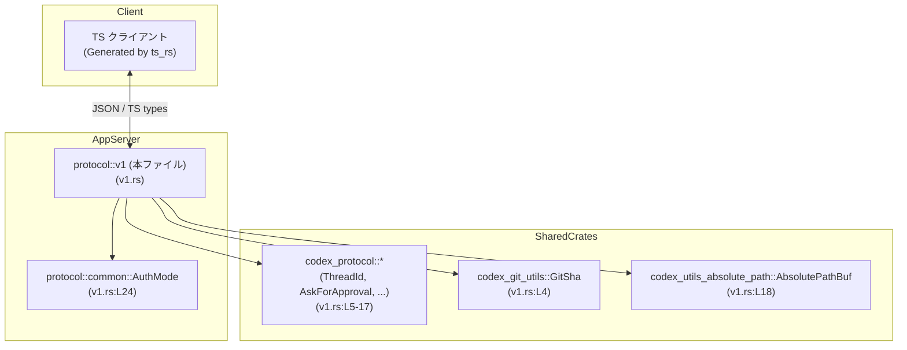
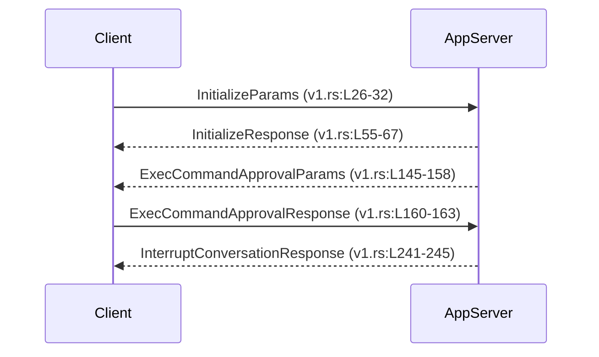

# app-server-protocol/src/protocol/v1.rs

---

## 0. ざっくり一言

このモジュールは、アプリケーションサーバーとクライアント間でやり取りされる **v1 プロトコルのメッセージ型（リクエスト／レスポンス／設定）** を定義したものです。  
すべての型は `serde`・`schemars`・`ts_rs` に対応しており、JSON / JSON Schema / TypeScript 定義を一元的に生成できるようになっています（例: `v1.rs:L19-22`, `v1.rs:L26-27` など）。

---

## 1. このモジュールの役割

### 1.1 概要

- このモジュールは **クライアントと app-server 間の API プロトコル v1** を型として定義するために存在し、以下の機能を提供します。
  - セッション初期化・クライアント能力交渉 (`Initialize*` 型, `v1.rs:L26-40`, `v1.rs:L42-53`, `v1.rs:L55-67`)
  - 会話サマリ取得 (`GetConversationSummary*`, `ConversationSummary*`, `v1.rs:L69-101`, `v1.rs:L103-109`)
  - パッチ適用・コマンド実行の承認フロー (`ApplyPatchApproval*`, `ExecCommandApproval*`, `v1.rs:L124-143`, `v1.rs:L145-163`)
  - 認証状態・API キー関連 (`LoginApiKeyParams`, `GetAuthStatus*`, `v1.rs:L111-115`, `v1.rs:L171-176`, `v1.rs:L187-193`)
  - 一度きりのコマンド実行 (`ExecOneOffCommandParams`, `v1.rs:L178-185`)
  - ユーザー保存設定・プロファイル・サンドボックス設定 (`UserSavedConfig`, `Profile`, `Tools`, `SandboxSettings`, `v1.rs:L195-239`)
  - 会話中断レスポンス (`InterruptConversationResponse`, `v1.rs:L241-245`)

### 1.2 アーキテクチャ内での位置づけ

- このモジュールは `crate::protocol` 配下にあり（`v1.rs:L24`）、プロトコルのバージョン別型定義の一部であると解釈できます。
- 外部クレートの型を多く利用している点から、**共通プロトコル定義 (`codex_protocol`) と app-server 固有の拡張の橋渡し**を担っていると考えられます（`v1.rs:L4-17`）。
- 生成される TypeScript 型や JSON Schema を通じて、フロントエンドや CLI など他言語クライアントと整合した通信を行う位置づけです（`v1.rs:L19-22`）。



※ 他モジュールの詳細実装はこのチャンクには現れません。

### 1.3 設計上のポイント

- **純粋なデータ型のみ**  
  すべて `struct` / `enum` の定義であり、メソッドや関数は存在しません（`functions=0` メタ情報、およびコード上に `fn` がない）。
- **シリアライズの一貫性**
  - 全ての型が `Serialize` / `Deserialize` を derive しており、JSON との変換が型安全に行えます（例: `v1.rs:L26`, `v1.rs:L34`, `v1.rs:L55` など）。
  - `#[serde(rename_all = "camelCase")]` や `#[serde(rename_all = "snake_case")]` により、JSON のフィールド命名規則を統一しています（`v1.rs:L27`, `v1.rs:L35`, `v1.rs:L89`, `v1.rs:L104`）。
  - `GetConversationSummaryParams` は `#[serde(untagged)]` を利用し、構造によってバリアントを判別する設計です（`v1.rs:L69-80`）。
- **スキーマ・多言語連携**
  - `JsonSchema` の derive により JSON Schema を生成可能（`v1.rs:L19`, `v1.rs:L26`, `v1.rs:L34` など）。
  - `ts_rs::TS` の derive により TypeScript 型を生成可能（`v1.rs:L22`, `v1.rs:L26` など）。
- **オプショナルなフィールドと後方互換性**
  - 設定系やレスポンスの多くで `Option<T>` を使用しており（例: `UserSavedConfig`, `Profile`, `GetAuthStatusResponse`, `v1.rs:L195-210`, `v1.rs:L214-221`, `v1.rs:L189-193`）、プロトコルの拡張をしやすい設計です。
  - 一部フィールドに `#[serde(default)]` を付与し、欠損時のデフォルト挙動を明示しています（`InitializeCapabilities.experimental_api`, `SandboxSettings.writable_roots`, `v1.rs:L47`, `v1.rs:L234`）。

---

## 2. 主要な機能一覧

このモジュールが提供する主要な「機能」（メッセージ種類）を整理します。

- セッション初期化: `InitializeParams`, `ClientInfo`, `InitializeCapabilities`, `InitializeResponse`（`v1.rs:L26-40`, `v1.rs:L42-53`, `v1.rs:L55-67`）
- 会話サマリ取得: `GetConversationSummaryParams`, `GetConversationSummaryResponse`, `ConversationSummary`, `ConversationGitInfo`（`v1.rs:L69-109`）
- 認証・API キー: `LoginApiKeyParams`, `GetAuthStatusParams`, `GetAuthStatusResponse`（`v1.rs:L111-115`, `v1.rs:L171-176`, `v1.rs:L187-193`）
- Git 差分取得: `GitDiffToRemoteParams`, `GitDiffToRemoteResponse`（`v1.rs:L165-169`, `v1.rs:L117-122`）
- パッチ適用承認: `ApplyPatchApprovalParams`, `ApplyPatchApprovalResponse`（`v1.rs:L124-143`）
- コマンド実行承認・一回限り実行:  
  `ExecCommandApprovalParams`, `ExecCommandApprovalResponse`, `ExecOneOffCommandParams`（`v1.rs:L145-163`, `v1.rs:L178-185`）
- ユーザー保存設定・プロファイル・ツール・サンドボックス:  
  `UserSavedConfig`, `Profile`, `Tools`, `SandboxSettings`（`v1.rs:L195-239`）
- 会話中断レスポンス: `InterruptConversationResponse`（`v1.rs:L241-245`）

---

## 3. 公開 API と詳細解説

### 3.1 型一覧（構造体・列挙体など）

このファイルで公開されている主な型の一覧です。

| 名前 | 種別 | 役割 / 用途 | 根拠 |
|------|------|-------------|------|
| `InitializeParams` | 構造体 | 初期化リクエスト。クライアント情報と能力をサーバに伝える。 | `v1.rs:L26-32` |
| `ClientInfo` | 構造体 | クライアント名・タイトル・バージョンを持つメタ情報。 | `v1.rs:L34-40` |
| `InitializeCapabilities` | 構造体 | 初期化時にクライアントが宣言する機能サポート情報。通知の opt-out など。 | `v1.rs:L42-53` |
| `InitializeResponse` | 構造体 | 初期化レスポンス。ユーザーエージェント、Codex ホーム、プラットフォーム情報を返す。 | `v1.rs:L55-67` |
| `GetConversationSummaryParams` | 列挙体（untagged） | 会話サマリ取得リクエスト。ロールアウトパスまたは会話 ID で指定。 | `v1.rs:L69-80` |
| `GetConversationSummaryResponse` | 構造体 | 会話サマリ取得レスポンス。本体は `ConversationSummary`。 | `v1.rs:L82-86` |
| `ConversationSummary` | 構造体 | 会話 ID, パス, プレビュー, タイムスタンプ, モデル等のサマリ情報。 | `v1.rs:L88-101` |
| `ConversationGitInfo` | 構造体 | 会話に紐づく Git の SHA / ブランチ / origin URL。 | `v1.rs:L103-109` |
| `LoginApiKeyParams` | 構造体 | API キーログイン用のパラメータ。 | `v1.rs:L111-115` |
| `GitDiffToRemoteResponse` | 構造体 | リモートとの差分の SHA と diff テキスト。 | `v1.rs:L117-122` |
| `ApplyPatchApprovalParams` | 構造体 | パッチ適用に対するユーザ承認用のパラメータ。 | `v1.rs:L124-137` |
| `ApplyPatchApprovalResponse` | 構造体 | パッチ適用承認の結果（レビュー決定）。 | `v1.rs:L139-143` |
| `ExecCommandApprovalParams` | 構造体 | コマンド実行に対する承認リクエストのパラメータ。 | `v1.rs:L145-158` |
| `ExecCommandApprovalResponse` | 構造体 | コマンド実行承認の結果（レビュー決定）。 | `v1.rs:L160-163` |
| `GitDiffToRemoteParams` | 構造体 | Git diff 取得時のカレントディレクトリ指定。 | `v1.rs:L165-169` |
| `GetAuthStatusParams` | 構造体 | 認証状態取得のオプション（トークンの含有／リフレッシュ）。 | `v1.rs:L171-176` |
| `ExecOneOffCommandParams` | 構造体 | 一度きりのコマンド実行リクエスト。タイムアウトやサンドボックスポリシーを含む。 | `v1.rs:L178-185` |
| `GetAuthStatusResponse` | 構造体 | 現在の認証方法・トークン・OpenAI 認証要否の情報。 | `v1.rs:L187-193` |
| `UserSavedConfig` | 構造体 | ユーザ保存設定の集合。モデル・サンドボックス設定・プロフィール等を含む。 | `v1.rs:L195-210` |
| `Profile` | 構造体 | 個別プロファイル設定。モデルや承認ポリシーなど。 | `v1.rs:L212-221` |
| `Tools` | 構造体 | Web 検索・画像閲覧などツール使用可否。 | `v1.rs:L224-229` |
| `SandboxSettings` | 構造体 | サンドボックスの書き込み可能ディレクトリやネットワーク許可など。 | `v1.rs:L231-239` |
| `InterruptConversationResponse` | 構造体 | 会話中断の理由を返すレスポンス。 | `v1.rs:L241-245` |

### 3.2 主要メッセージ型の詳細

本ファイルには関数は定義されていないため、代わりに **プロトコル上特に重要と思われるメッセージ型** について、関数テンプレートに準じた形で詳細を記述します。

---

#### `InitializeParams`

**概要**

- セッション開始時にクライアントがサーバへ送る初期化パラメータです（`v1.rs:L26-32`）。
- クライアント自身の情報 (`ClientInfo`) と、サーバとの間で交渉したい能力 (`InitializeCapabilities`) を含みます。

**フィールド**

| フィールド名 | 型 | 説明 | 根拠 |
|-------------|----|------|------|
| `client_info` | `ClientInfo` | クライアントの名前・タイトル・バージョン情報。 | `v1.rs:L28-29`, `v1.rs:L34-40` |
| `capabilities` | `Option<InitializeCapabilities>` | クライアントがサポートする機能。`None` の場合はデフォルト能力のみ。`skip_serializing_if` により `None` は JSON に出力されません。 | `v1.rs:L30-31`, `v1.rs:L42-53` |

**戻り値 / 利用結果の意味**

- リクエスト型なので直接の戻り値はありませんが、通常は `InitializeResponse` と組になって使用されると考えられます（`v1.rs:L55-67`）。
- サーバ側はこの情報をもとに、提供する機能や通知の振る舞いを調整すると推測できます。ただし、実際のロジックはこのチャンクには現れません。

**安全性・エラーに関するポイント**

- Rust 側ではフィールドがすべて必須/オプションとして型で表現されており、不正な構造の JSON は `serde` のデシリアライズ時点でエラーになります。
- `capabilities` を省略した場合でも `InitializeCapabilities` 側の `experimental_api` は `#[serde(default)]` により `false` 相当で扱われる設計です（`v1.rs:L47-48`）。

**Examples（使用例）**

```rust
use crate::protocol::v1::{InitializeParams, ClientInfo, InitializeCapabilities}; // パスは実際のクレート構成に依存
use serde_json;

// 初期化リクエストを構築して JSON にシリアライズする例
let params = InitializeParams {
    client_info: ClientInfo {
        name: "my-client".to_string(),
        title: Some("My Client".to_string()),
        version: "1.2.3".to_string(),
    },
    capabilities: Some(InitializeCapabilities {
        experimental_api: true,
        opt_out_notification_methods: Some(vec!["thread/started".to_string()]),
    }),
};

let json = serde_json::to_string(&params)?; // 型安全に JSON へ変換
```

**Edge cases（エッジケース）**

- `capabilities == None` の場合  
  - JSON からフィールド自体が欠損した形になり、サーバ実装側で「能力情報未指定」として解釈されます（`skip_serializing_if`, `v1.rs:L30-31`）。
- `opt_out_notification_methods` が `Some(vec![])` の場合  
  - JSON では空配列として送られ、クライアントが特定通知を opt-out していないことを明示する形になります（`v1.rs:L51-52`）。

**使用上の注意点**

- 新しい能力フラグを `InitializeCapabilities` に追加する場合は、既存クライアントとの互換性のため `Option` + `#[serde(default)]` の利用が推奨されます（このファイルの既存パターンからの推測）。

---

#### `GetConversationSummaryParams`

**概要**

- 会話のサマリを取得するリクエストパラメータです（`v1.rs:L69-80`）。
- `#[serde(untagged)]` により、**2 つの異なる JSON 形状** のどちらかとして解釈されます。

**バリアント**

| バリアント名 | フィールド | 説明 | 根拠 |
|-------------|-----------|------|------|
| `RolloutPath` | `rollout_path: PathBuf`（JSON 名: `"rolloutPath"`） | ロールアウトパスで会話を指定する形式。 | `v1.rs:L72-75` |
| `ThreadId` | `conversation_id: ThreadId`（JSON 名: `"conversationId"`） | 会話 ID（おそらくスレッド ID）で指定する形式。 | `v1.rs:L76-79` |

**内部処理の流れ（デシリアライズ時）**

1. `serde` は JSON オブジェクトを受け取り、まず `RolloutPath` バリアントとして解釈可能かを試みます。
2. `rolloutPath` フィールドが適切に存在すれば `RolloutPath` として扱われます。
3. そうでなければ `ThreadId` バリアントとして解釈を試みます。
4. いずれのバリアントにも合致しない場合、デシリアライズエラーになります。  
   （具体的な優先順位やエラーメッセージは `serde` の仕様に依存し、このチャンクには記載がありません。）

**Examples（使用例: JSON）**

ロールアウトパスで指定する例:

```json
{
  "rolloutPath": "/path/to/rollout"
}
```

会話 ID で指定する例:

```json
{
  "conversationId": "thread-1234"
}
```

※ `ThreadId` の具体的な表現形式は `codex_protocol::ThreadId` の定義に依存し、このチャンクには現れません。

**Edge cases（エッジケース）**

- `rolloutPath` と `conversationId` の両方を含む JSON  
  - `#[serde(untagged)]` の仕様上、どちらか一方のバリアントにマッチした時点で確定します。どのように扱われるかは `serde` のマッチ順に依存し、このファイル単体からは断定できません。
- 両方が欠損している JSON  
  - どのバリアントにもマッチしないため、デシリアライズエラーとなる可能性が高いです。

**使用上の注意点**

- 新しい指定方法のバリアントを追加する場合、既存バリアントとの **フィールド衝突により曖昧にならないようにする** 必要があります（`#[serde(untagged)]` の一般的な注意点）。

---

#### `ApplyPatchApprovalParams`

**概要**

- ファイル変更の適用（パッチ適用）に対して、ユーザー承認を得るためのパラメータです（`v1.rs:L124-137`）。
- コメントから、`PatchApplyBeginEvent` / `PatchApplyEndEvent` と `call_id` で紐付くことが意図されています（`v1.rs:L128-130`）。

**フィールド**

| フィールド名 | 型 | 説明 | 根拠 |
|-------------|----|------|------|
| `conversation_id` | `ThreadId` | この承認が関係する会話 ID。 | `v1.rs:L127-127` |
| `call_id` | `String` | パッチ適用イベントと相関を取るための呼び出し ID。 | `v1.rs:L128-131` |
| `file_changes` | `HashMap<PathBuf, FileChange>` | 対象となるファイルとその変更内容のマップ。 | `v1.rs:L131-131` |
| `reason` | `Option<String>` | 追加説明（例: 特別な書き込み権限の要求）。 | `v1.rs:L132-133` |
| `grant_root` | `Option<PathBuf>` | セッション中の残り時間にわたり、このルート以下への書き込み許可を要求するルートパス。 | `v1.rs:L134-136` |

**関連レスポンス**

- 対応するレスポンス型は `ApplyPatchApprovalResponse` であり、`decision: ReviewDecision` を返します（`v1.rs:L139-143`）。

**Examples（使用例）**

```rust
use crate::protocol::v1::ApplyPatchApprovalParams;
use std::collections::HashMap;
use std::path::PathBuf;
use codex_protocol::protocol::FileChange; // 実際のパスは依存クレートに従う

let mut changes = HashMap::new();
changes.insert(
    PathBuf::from("src/main.rs"),
    FileChange { /* 具体内容はこのチャンクには不明 */ },
);

let params = ApplyPatchApprovalParams {
    conversation_id: /* ThreadId 値 */,
    call_id: "call-123".to_string(),
    file_changes: changes,
    reason: Some("Need to update main entry point".to_string()),
    grant_root: Some(PathBuf::from("src")),
};
```

**安全性・セキュリティの観点**

- この型自体は単なるデータ定義ですが、`grant_root` により **ディレクトリ単位での書き込み許可拡張** を要求できる設計になっています（`v1.rs:L134-136`）。
- 実際のセキュリティ検証・パス検証はサーバ側実装に依存しており、このチャンクには現れません。特に、`PathBuf` は絶対パスか相対パスかなどの制約が型では表現されていません。

**Edge cases**

- `file_changes` が空のマップの場合  
  - どのように扱うか（即許可 / 無視 / エラー）はサーバ実装依存で、このファイルからは分かりません。
- `grant_root` に `..` 等を含むパスが指定された場合  
  - サーバ側での正規化・検証が行われないと、意図しない範囲への権限拡大が起こりうるため、利用時には注意が必要です（一般的なセキュリティ観点からの注意であり、このファイルに直接の記述はありません）。

---

#### `ExecCommandApprovalParams` & `ExecOneOffCommandParams`

**概要**

- `ExecCommandApprovalParams` は、既に計画されたコマンド実行についてユーザー承認を得るためのパラメータです（`v1.rs:L145-158`）。
- `ExecOneOffCommandParams` は、その場限りのコマンド実行を要求するためのパラメータです（`v1.rs:L178-185`）。

**フィールド（`ExecCommandApprovalParams`）**

| フィールド名 | 型 | 説明 | 根拠 |
|-------------|----|------|------|
| `conversation_id` | `ThreadId` | 関連する会話 ID。 | `v1.rs:L148-148` |
| `call_id` | `String` | `ExecCommandBeginEvent` / `ExecCommandEndEvent` と紐付けるための ID。 | `v1.rs:L149-151` |
| `approval_id` | `Option<String>` | この承認コールバック自体の識別子。 | `v1.rs:L152-153` |
| `command` | `Vec<String>` | 実行予定のコマンドと引数のリスト。 | `v1.rs:L154-154` |
| `cwd` | `PathBuf` | コマンドの実行ディレクトリ。 | `v1.rs:L155-155` |
| `reason` | `Option<String>` | 実行理由などの説明。 | `v1.rs:L156-156` |
| `parsed_cmd` | `Vec<ParsedCommand>` | パース済みコマンド表現。 | `v1.rs:L157-157` |

**フィールド（`ExecOneOffCommandParams`）**

| フィールド名 | 型 | 説明 | 根拠 |
|-------------|----|------|------|
| `command` | `Vec<String>` | 実行するコマンドと引数。 | `v1.rs:L181-181` |
| `timeout_ms` | `Option<u64>` | 実行タイムアウト（ミリ秒）。`None` の場合の扱いはサーバ実装依存。 | `v1.rs:L182-182` |
| `cwd` | `Option<PathBuf>` | 実行ディレクトリ。省略時のデフォルトは不明。 | `v1.rs:L183-183` |
| `sandbox_policy` | `Option<SandboxPolicy>` | サンドボックスポリシー。`None` 時はサーバ既定。 | `v1.rs:L184-184` |

**安全性・セキュリティの観点**

- どちらも **任意コマンド実行に直結する情報** を保持する型であるため、実装側では以下のような点に注意が必要です（一般的な観点であり、このファイルにはロジックはありません）。
  - `command` の内容の検証（危険なコマンドの拒否など）
  - `cwd` の検証（意図しないディレクトリからの実行の防止）
  - `timeout_ms` 未指定時のデフォルトタイムアウト設定
- 型定義はすべて所有権を持つ `String` / `PathBuf` / `Vec<T>` なので、Rust 側ではデータ破棄時にメモリ安全性が自動的に担保されます。

**Edge cases**

- `command` が空のベクタの場合  
  - 実際のコマンドが指定されず、サーバ実装側でエラーになる可能性があります。
- 非 ASCII の文字列や環境依存のパス区切りなど  
  - `PathBuf` は OS に応じた表現を許容しますが、クライアント・サーバ間で OS が異なる場合の扱いはプロトコル全体の設計に依存します。

---

#### `UserSavedConfig`

**概要**

- ユーザーが保存した設定（モデル選択、サンドボックス設定、ツール使用可否、プロファイル群など）をまとめて表す型です（`v1.rs:L195-210`）。

**フィールド**

| フィールド名 | 型 | 説明 | 根拠 |
|-------------|----|------|------|
| `approval_policy` | `Option<AskForApproval>` | ユーザーの承認ポリシー。 | `v1.rs:L198-198` |
| `sandbox_mode` | `Option<SandboxMode>` | サンドボックスモード。 | `v1.rs:L199-199` |
| `sandbox_settings` | `Option<SandboxSettings>` | 詳細なサンドボックス設定。 | `v1.rs:L200-200`, `v1.rs:L233-239` |
| `forced_chatgpt_workspace_id` | `Option<String>` | 強制的に利用する ChatGPT ワークスペース ID。 | `v1.rs:L201-201` |
| `forced_login_method` | `Option<ForcedLoginMethod>` | 強制ログイン方法。 | `v1.rs:L202-202` |
| `model` | `Option<String>` | 既定で使用するモデル名。 | `v1.rs:L203-203` |
| `model_reasoning_effort` | `Option<ReasoningEffort>` | 推論強度の設定。 | `v1.rs:L204-204` |
| `model_reasoning_summary` | `Option<ReasoningSummary>` | 推論要約の設定。 | `v1.rs:L205-205` |
| `model_verbosity` | `Option<Verbosity>` | 応答の冗長性レベル。 | `v1.rs:L206-206` |
| `tools` | `Option<Tools>` | ツール利用設定（Web 検索・画像閲覧）。 | `v1.rs:L207-207`, `v1.rs:L224-229` |
| `profile` | `Option<String>` | 現在有効なプロファイル名。 | `v1.rs:L208-208` |
| `profiles` | `HashMap<String, Profile>` | プロファイル名から `Profile` へのマッピング。 | `v1.rs:L209-209`, `v1.rs:L214-221` |

**Examples（使用例：設定のロードと保存）**

```rust
use crate::protocol::v1::UserSavedConfig;
use std::fs;

// JSON ファイルから設定を読み込む例
let json = fs::read_to_string("config.json")?;
let config: UserSavedConfig = serde_json::from_str(&json)?;

// 設定を変更して保存する例
let mut new_config = config.clone();
new_config.model = Some("gpt-4.1".to_string());

let json = serde_json::to_string_pretty(&new_config)?;
fs::write("config.json", json)?;
```

**安全性・エッジケース**

- 多くのフィールドが `Option` であるため、「設定されていない状態」を型レベルで表現できます。
- `profiles` が空のマップの場合や、`profile` が `profiles` に存在しない場合の扱いはサーバ／クライアント実装に依存します。このファイル単体には制約は記述されていません。

---

#### `InterruptConversationResponse`

**概要**

- 会話を中断するレスポンスであり、その理由を `TurnAbortReason` として伝えます（`v1.rs:L241-245`）。

**フィールド**

| フィールド名 | 型 | 説明 | 根拠 |
|-------------|----|------|------|
| `abort_reason` | `TurnAbortReason` | 会話が中断された理由（ユーザーキャンセル、エラーなどと思われる）。 | `v1.rs:L243-244` |

`TurnAbortReason` の具体的なバリアントは `codex_protocol::protocol` 側の定義であり、このチャンクには現れません。

---

### 3.3 その他の型（補助的な定義）

上記で詳細説明していない補助的な型です。いずれも単純なフィールドの集合であり、派生トレイトからシリアライズ可能なことが確認できます。

| 型名 | 役割（1 行） | 根拠 |
|------|--------------|------|
| `ClientInfo` | クライアント名・タイトル・バージョン情報。 | `v1.rs:L34-40` |
| `InitializeCapabilities` | 初期化時のクライアント能力宣言。 | `v1.rs:L42-53` |
| `InitializeResponse` | 初期化レスポンス（Codex ホームとプラットフォーム情報）。 | `v1.rs:L55-67` |
| `GetConversationSummaryResponse` | 会話サマリ取得のラッパーレスポンス。 | `v1.rs:L82-86` |
| `ConversationSummary` | 会話サマリの詳細情報。 | `v1.rs:L88-101` |
| `ConversationGitInfo` | 会話に紐づく Git 情報。 | `v1.rs:L103-109` |
| `LoginApiKeyParams` | API キーログイン用パラメータ。 | `v1.rs:L111-115` |
| `GitDiffToRemoteParams` | Git 差分取得用のカレントディレクトリパラメータ。 | `v1.rs:L165-169` |
| `GetAuthStatusParams` | 認証状態取得オプション。 | `v1.rs:L171-176` |
| `GetAuthStatusResponse` | 認証方法・トークン・OpenAI 認証要否。 | `v1.rs:L187-193` |
| `Profile` | 単一プロファイルの設定。 | `v1.rs:L214-221` |
| `Tools` | ツール利用可否設定。 | `v1.rs:L224-229` |
| `SandboxSettings` | サンドボックスの詳細設定。 | `v1.rs:L231-239` |

---

## 4. データフロー

このファイルには実際の処理ロジックは含まれていませんが、型名とコメントから想定される **典型的なやり取りの流れ** を、あくまで例として示します（方向や順序はプロトコル全体の設計に依存し、このチャンクだけでは厳密には確定できません）。

### 代表的シナリオ: 初期化 → コマンド承認 → 中断



この図が表しているのは、以下のような抽象的なデータフローです。

1. クライアントが `InitializeParams` を送り、セッションを開始します。
2. サーバが `InitializeResponse` で環境情報を返します。
3. 何らかの操作の結果としてサーバが `ExecCommandApprovalParams` をクライアントに送り、コマンド実行の承認を求めます。
4. クライアントは `ExecCommandApprovalResponse` で許可／拒否を返します。
5. エラーやキャンセルなどにより会話が中断される場合、サーバが `InterruptConversationResponse` でその理由を通知します。

※ 実際の呼び出し方向（リクエスト／通知／レスポンス）は、`codex_protocol` 側の RPC 定義や transport 層の設計に依存し、このチャンクには現れません。

---

## 5. 使い方（How to Use）

### 5.1 基本的な使用方法

このモジュールの型は、主に **以下の 2 パターン** で利用されると考えられます。

1. Rust サーバ／クライアント内で構築し、`serde` を使って JSON と相互変換する。
2. `ts_rs::TS` により生成された TypeScript 型をフロントエンド側で利用し、JSON スキーマを通じて検証する。

Rust サーバ側で初期化リクエストを受けてデシリアライズする例:

```rust
use crate::protocol::v1::InitializeParams;
use serde_json;

// 受信した JSON 文字列を InitializeParams に変換
fn handle_initialize(json_str: &str) -> Result<InitializeParams, serde_json::Error> {
    let params: InitializeParams = serde_json::from_str(json_str)?; // 不正な JSON はここで Err
    Ok(params)
}
```

### 5.2 よくある使用パターン

#### パターン 1: Git 差分のリクエストとレスポンス

```rust
use crate::protocol::v1::{GitDiffToRemoteParams, GitDiffToRemoteResponse};
use std::path::PathBuf;

// リクエスト生成
let params = GitDiffToRemoteParams {
    cwd: PathBuf::from("/path/to/repo"),
};

// サーバ側でレスポンス生成（diff 内容の取得ロジックは別モジュール）
let response = GitDiffToRemoteResponse {
    sha: /* GitSha 値 */,
    diff: "diff --git ...".to_string(),
};
```

#### パターン 2: ユーザー設定の操作

```rust
use crate::protocol::v1::{UserSavedConfig, Tools};

let mut config = UserSavedConfig {
    approval_policy: None,
    sandbox_mode: None,
    sandbox_settings: None,
    forced_chatgpt_workspace_id: None,
    forced_login_method: None,
    model: Some("gpt-4.1".to_string()),
    model_reasoning_effort: None,
    model_reasoning_summary: None,
    model_verbosity: None,
    tools: Some(Tools {
        web_search: Some(true),
        view_image: Some(false),
    }),
    profile: None,
    profiles: Default::default(),
};
```

### 5.3 よくある間違い（起こり得る誤用）

このファイル単体に誤用例は書かれていませんが、型定義から推測できる誤用パターンを挙げます。

```rust
// 誤り例: GetConversationSummaryParams を直接構造体として作ろうとする
// let params = GetConversationSummaryParams {
//     rollout_path: PathBuf::from("..."),
// };

// 正しい例: 列挙体のバリアントとして生成する
use crate::protocol::v1::GetConversationSummaryParams;
use std::path::PathBuf;

let params = GetConversationSummaryParams::RolloutPath {
    rollout_path: PathBuf::from("/path/to/rollout"),
};
```

```rust
// 誤り例: JSON を手で組み立てて camelCase 規約を守らない
// {"conversation_id": "thread-123"}

// 正しい例: Rust の型を通してシリアライズすることで、rename_all = "camelCase" に従った JSON になる
use crate::protocol::v1::ConversationSummary;
use codex_protocol::ThreadId; // 実際の型定義は別モジュール

let summary = ConversationSummary {
    conversation_id: /* ThreadId */,
    path: PathBuf::from("..."),
    preview: "preview".to_string(),
    timestamp: None,
    updated_at: None,
    model_provider: "openai".to_string(),
    cwd: PathBuf::from("..."),
    cli_version: "1.0.0".to_string(),
    source: /* SessionSource */,
    git_info: None,
};

let json = serde_json::to_string(&summary)?; // 自動的に camelCase でシリアライズ
```

### 5.4 使用上の注意点（まとめ）

- **シリアライズ／デシリアライズ**
  - すべての型が `serde` の derive に対応しているため、**直接 JSON を組み立てず、必ず型を通す** ことでフィールド名や必須フィールドの不整合を防げます。
- **オプションフィールドの扱い**
  - `Option<T>` フィールドは、`None` の場合に「フィールド欠損」か「null」として送るかが属性によって変わります。  
    例: `InitializeParams.capabilities` は `skip_serializing_if` により欠損になります（`v1.rs:L30-31`）。
- **未定義の挙動**
  - このファイルはデータ型のみを定義しており、**値に対する制約やエラー条件は別モジュールに委ねられています**。  
    たとえば、`timeout_ms = Some(0)` をどう扱うかは、このチャンクからは分かりません。
- **並行性**
  - 内部に `Rc` や `RefCell` のような非スレッドセーフなフィールドは見当たらず、基本的には所有されたデータ (`String`, `PathBuf`, `Vec`, `HashMap` 等) のみを保持しています。  
    フィールド型が `Send + Sync` であれば構造体も同様になる設計ですが、実際に `Send` / `Sync` を実装しているかどうかはこのチャンクには明示されていません。

---

## 6. 変更の仕方（How to Modify）

### 6.1 新しい機能を追加する場合

1. **新しいメッセージ型を追加する場所**
   - プロトコル v1 に属する型であれば、このファイル `protocol/v1.rs` に新しい `struct` / `enum` を追加するのが自然です。
2. **既存の属性に合わせる**
   - JSON/TS との整合性のため、以下を既存の型に揃えるのが一貫した設計になります。
     - `#[derive(Serialize, Deserialize, Debug, Clone, PartialEq, JsonSchema, TS)]`
     - `#[serde(rename_all = "camelCase")]` などの命名規約（`v1.rs:L26-27` などを参照）
3. **互換性の確保**
   - 既存の型にフィールドを追加する場合は `Option<T>` と `#[serde(default)]` を利用することで、古いクライアントから送られる JSON にフィールドがなくても受け入れられるようにできます（`v1.rs:L47`, `v1.rs:L234` の用法が参考になります）。
4. **untagged enum へのバリアント追加**
   - `GetConversationSummaryParams` のような `#[serde(untagged)]` enum にバリアントを追加する場合は、既存バリアントと JSON 形状が衝突しないことを確認する必要があります（`v1.rs:L69-80`）。

### 6.2 既存の機能を変更する場合

- **フィールド名変更**
  - `#[serde(rename_all = "...")]` を利用しているため、Rust 側のフィールド名だけを変えると JSON 名が変わる可能性があります。  
    クライアントとの互換性に影響するため、変更前後の JSON 名を確認する必要があります。
- **フィールド型変更**
  - 例: `String` → `PathBuf` のような変更は、既存 JSON のデシリアライズに失敗する可能性があります。
- **削除**
  - フィールドや型を削除する場合、`ts_rs` や `JSON Schema` にも影響し、対応する TypeScript クライアントを含めた全体的な更新が必要になります。
- **関連するテスト**
  - このチャンクにはテストコードは含まれていませんが、実プロジェクトでは RPC ハンドラやシリアライズ部分のテストでこれらの型が利用されている可能性が高く、影響範囲の確認が必要です。

---

## 7. 関連ファイル

このモジュールと密接に関係すると思われるファイル・クレートを列挙します（いずれもインポート元として現れています）。

| パス / クレート | 役割 / 関係 | 根拠 |
|-----------------|------------|------|
| `crate::protocol::common::AuthMode` | 認証方法を表す列挙体（と推測される）。`GetAuthStatusResponse.auth_method` で利用。 | `v1.rs:L24`, `v1.rs:L190-190` |
| `codex_protocol::ThreadId` | 会話（スレッド）を識別する型。`conversation_id` フィールドで使用。 | `v1.rs:L5`, `v1.rs:L77-79`, `v1.rs:L91-91`, `v1.rs:L127-127`, `v1.rs:L148-148` |
| `codex_protocol::protocol::{AskForApproval, FileChange, ReviewDecision, SandboxPolicy, SessionSource, TurnAbortReason}` | 承認ポリシー、ファイル変更、レビュー結果、サンドボックスポリシー、セッション種別、中断理由などの共通プロトコル型。 | `v1.rs:L12-17`, `v1.rs:L90-100`, `v1.rs:L126-143`, `v1.rs:L178-185`, `v1.rs:L241-245` |
| `codex_protocol::config_types::{ForcedLoginMethod, ReasoningSummary, SandboxMode, Verbosity}` | 設定用の列挙体群。`UserSavedConfig`, `Profile` で利用。 | `v1.rs:L6-9`, `v1.rs:L195-210`, `v1.rs:L214-221` |
| `codex_protocol::openai_models::ReasoningEffort` | モデルの推論強度設定。`UserSavedConfig`, `Profile` で利用。 | `v1.rs:L10`, `v1.rs:L204-204`, `v1.rs:L218-218` |
| `codex_protocol::parse_command::ParsedCommand` | コマンド行のパース結果。`ExecCommandApprovalParams.parsed_cmd` で使用。 | `v1.rs:L11`, `v1.rs:L157-157` |
| `codex_git_utils::GitSha` | Git のコミット SHA を表す型。`GitDiffToRemoteResponse.sha` で使用。 | `v1.rs:L4`, `v1.rs:L120-120` |
| `codex_utils_absolute_path::AbsolutePathBuf` | 絶対パスを表す `PathBuf` ラッパー。`InitializeResponse.codex_home`, `SandboxSettings.writable_roots` 等で利用。 | `v1.rs:L18`, `v1.rs:L60-60`, `v1.rs:L235-235` |
| `schemars::JsonSchema` | JSON Schema 生成用トレイト。全型で derive。 | `v1.rs:L19`, `v1.rs:L26`, `v1.rs:L34`, ほか |
| `ts_rs::TS` | TypeScript 型生成用トレイト。全型で derive。 | `v1.rs:L22`, `v1.rs:L26`, `v1.rs:L34`, ほか |

これらの関連ファイルの実装内容は、このチャンクには含まれておらず、詳細な挙動や制約についてはそれぞれの定義を参照する必要があります。
