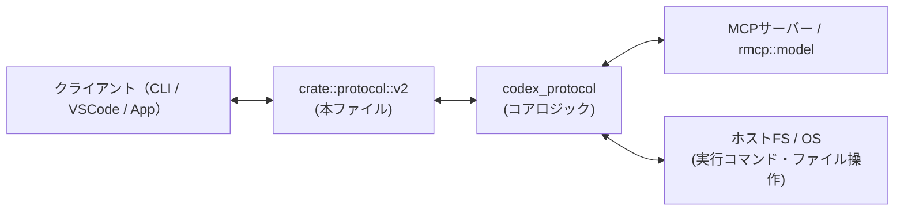
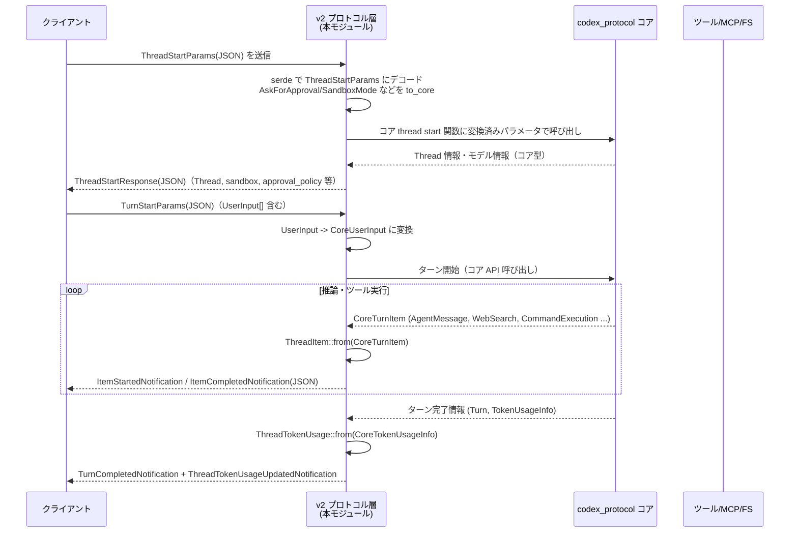
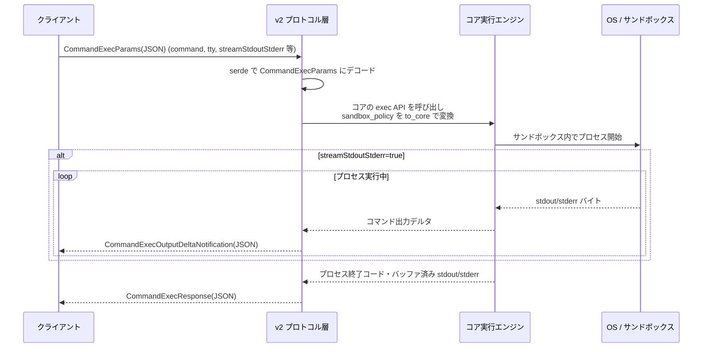

# app-server-protocol/src/protocol/v2.rs コード解説

## 0. ざっくり一言

このファイルは、`codex_protocol` のコア型を「App Server API v2」の JSON／TypeScript 向け公開スキーマに変換する **プロトコル定義とトランスレーション層** です。  
リクエスト・レスポンス・通知・設定・権限・MCP・プラグイン・リアルタイムなど、ほぼ全ての API 形状がここで定義されています。

> ※与えられたコードには行番号情報が含まれていないため、正確な `L開始-終了` は付与できません。根拠は型名／関数名／テスト名で示します。

---

## 1. このモジュールの役割

### 1.1 概要

- このモジュールは **コアロジック（`codex_protocol`）の型** と **App Server が公開する v2 JSON API** を橋渡しするために存在し、以下を提供します。
  - v2 用の構造体・列挙体・エラー型・通知型などの **公開スキーマ**
  - コア型との相互変換 (`From`, `Into`, `to_core` など) による **トランスレーションロジック**
  - Serde／schemars／ts-rs を用いた **シリアライズ形式（キャメルケース・スネークケース・タグ付き enum など）の固定**
  - 一部については `ExperimentalApi` による **実験的フィールドのマーキングとテスト**

### 1.2 アーキテクチャ内での位置づけ

本ファイルは「JSON-RPC/websocket で話す v2 プロトコル」と「内部の `codex_protocol` コアロジック」の境界に位置します。



典型的なフロー例（Thread/Turn）:

1. クライアントが `ThreadStartParams` / `TurnStartParams` の JSON を送る。
2. 本モジュールで `ThreadStartParams` などにデシリアライズし、`AskForApproval`, `SandboxMode`, `UserInput` 等を `to_core` / `Into` でコア型に変換。
3. `codex_protocol` 側で推論処理・ツール実行が行われる。
4. コアが `CoreTurnItem`, `CoreTokenUsageInfo` などを返却。
5. 本モジュールで `ThreadItem`, `ThreadTokenUsage` などの v2 型に変換し、通知としてクライアントへ送出。

### 1.3 設計上のポイント

- **責務分割**
  - コアとの変換はほぼ全て小さな `impl From` / `to_core` / `into_core` に分割されています。
  - ドメイン毎に型群がまとまっており（Config, Thread/Turn, FS, Exec, MCP, Plugins/Skills, Approval/Guardian, Realtime など）、片方向の変換は基本的に 1 個所に集約されています。
- **状態を持たない**
  - 全ての型は純粋なデータコンテナであり、内部状態やキャッシュは持ちません。
  - メソッドはほぼ全て **純粋関数**（入力に対して決定的な出力）です。
- **エラーハンドリングの方針**
  - 通常の変換は `impl From` で実装し、**失敗しない前提**（対応する variant が 1:1 で存在する）になっています。
  - 例外的に JSON Schema 変換などは `TryFrom<CoreElicitationRequest> for McpServerElicitationRequest` のように **`Result` ベース**で失敗を表現します（`serde_json::Error`）。
  - プロトコルレベルのエラーは `CodexErrorInfo`, `TurnError`, `ConfigWriteErrorCode` などの enum で表現します。
- **安全性／スキーマ厳格さ**
  - `AbsolutePathBuf` による絶対パスのみ許可（追加権限パスなど）。
  - `#[serde(deny_unknown_fields)]` による未知フィールドの拒否（例: `RequestPermissionProfile`, MCP elicitation schema）。
  - ダブル `Option`（`Option<Option<T>>`）を使って「フィールドの非指定」と「明示的な `null` 上書き」を区別（`service_tier` 関連）。
- **並行性**
  - 本ファイル自身はスレッド／async を扱いませんが、`command/exec` や Realtime 系のコメントで「接続スコープ」「ストリーミング通知」の挙動をプロトコルレベルで規定しています。

---

## 2. 主要な機能一覧

- コア enum を v2 API の enum に写像するマクロ `v2_enum_from_core!` と各種 enum 定義
- エラー表現
  - `CodexErrorInfo`, `TurnError`, `ErrorNotification`, `ConfigWriteErrorCode` など
- approval／権限・サンドボックス設定
  - `AskForApproval`, `ApprovalsReviewer`, `SandboxMode`, `SandboxPolicy`, `ReadOnlyAccess`
  - `AdditionalFileSystemPermissions`, `AdditionalNetworkPermissions`
  - `RequestPermissionProfile`, `GrantedPermissionProfile`, `PermissionGrantScope`
- コンフィグ API
  - `Config`, `ProfileV2`, `AppsConfig` ほか設定スキーマ
  - `ConfigLayerSource` と `ConfigLayer*`、`ConfigRead*` / `ConfigWrite*`
  - `ConfigRequirements`, `NetworkRequirements` とそのサブ型
- アカウント・レート制限
  - `Account`, `LoginAccountParams/Response`, `GetAccount*`
  - `RateLimitSnapshot`, `RateLimitWindow`, `CreditsSnapshot` と更新通知
- モデル・コラボレーション・実験フラグ
  - `Model*`, `CollaborationModeMask`, `ExperimentalFeature*`
- MCP サーバー・MCP ツール
  - MCP server ステータス/リソース/ツール実行 (`McpServerStatus*`, `McpServerToolCall*`)
  - MCP elicitation (`McpServerElicitation*` と JSON Schema 群)
- アプリ／プラグイン／スキル
  - `AppInfo`, `AppsList*`, `AppConfig*`
  - `SkillsList*`, `Skill*`、`Plugin*` 各種
- ホストファイルシステム・コマンド実行
  - `Fs*` 系の read/write/copy/watch など
  - `CommandExec*` 系のパラメータ／レスポンス／ストリーミング通知
  - Thread 経由の `ThreadShellCommand*`
- スレッド／ターン／アイテム
  - `Thread*`, `Turn*`, `ThreadItem` と各種ステータス
  - `UserInput` と `TextElement`／`ByteRange`
  - 各種ライフサイクル通知 (`ThreadStartedNotification`, `TurnCompletedNotification` 等)
- リアルタイム音声・テキスト
  - `ThreadRealtime*` 系パラメータ・通知
- Guardian / Approval / Permissions
  - `Guardian*` 系のリスク評価・アクション
  - `CommandExecutionRequestApprovalParams/Response`, `FileChangeRequestApproval*`
  - `PermissionsRequestApproval*`
- その他の通知
  - Windows サンドボックス設定通知、Deprecation/ConfigWarning 通知など

---

## 3. 公開 API と詳細解説

### 3.1 型一覧（構造体・列挙体など：主要コンポーネントインベントリー）

主な型をドメインごとに抜粋して一覧化します（実際には 400 以上の型があります）。

| グループ | 名前（代表例） | 種別 | 役割 / 用途 |
|---------|----------------|------|-------------|
| 共通基盤 | `v2_enum_from_core!` | マクロ | コア enum を v2 enum にミラーしつつ、camelCase/snake_case などのシリアライズ規則を付与 |
| エラー | `CodexErrorInfo` | enum | コア `CoreCodexErrorInfo` を camelCase で公開。HTTP ステータスや非ステアラブルターン種別を含む |
| エラー | `TurnError` | struct (Error) | 1ターンの失敗内容（メッセージ＋`CodexErrorInfo` 等）を表現し、`ErrorNotification` 等で送信 |
| 設定/Approval | `AskForApproval` | enum | 承認ポリシー（`UnlessTrusted`, `OnFailure`, `Granular` 等）を表現しコアと相互変換 |
| 設定/Approval | `ApprovalsReviewer` | enum | 承認レビュー先 (`User`, `GuardianSubagent`) を指定 |
| 設定/サンドボックス | `SandboxMode`, `SandboxWorkspaceWrite` | enum / struct | ユーザー設定レベルのサンドボックスモード・書き込み設定 |
| 設定/サンドボックス | `ReadOnlyAccess`, `SandboxPolicy` | enum | 実行時サンドボックスポリシー（読み取り制限、WorkspaceWrite、外部サンドボックス等） |
| 設定/Configレイヤ | `ConfigLayerSource`, `ConfigLayer`, `ConfigLayerMetadata` | enum / struct | Config レイヤのソース（MDM, User, Project, SessionFlags 等）とそのメタデータ |
| 設定/Config本体 | `Config`, `ProfileV2`, `AnalyticsConfig`, `ToolsV2`, `AppsConfig` | struct | `config.toml` 等の論理モデル。モデル・ツール・apps 等の設定を保持 |
| 設定/Config要件 | `ConfigRequirements`, `NetworkRequirements`, `ResidencyRequirement` | struct / enum | 管理側からの設定要件・ネットワーク制限など |
| 権限/サンドボックス | `AdditionalFileSystemPermissions`, `AdditionalNetworkPermissions` | struct | 追加のファイル／ネットワーク権限。`AbsolutePathBuf` を用い絶対パスのみ許可 |
| 権限/サンドボックス | `RequestPermissionProfile`, `AdditionalPermissionProfile`, `GrantedPermissionProfile` | struct | 権限プロファイルやリクエスト内容の v2 表現（`CoreRequestPermissionProfile` 等と相互変換） |
| 権限/Approval | `CommandExecutionApprovalDecision`, `FileChangeApprovalDecision` | enum | ユーザーが行う実行／ファイル変更の承認決定 |
| 権限/Approval | `CommandExecutionRequestApprovalParams/Response` | struct | コマンド実行の承認プロンプトに使うパラメータと応答 |
| アカウント | `Account`, `LoginAccountParams/Response`, `GetAccount*` | enum / struct | API key / ChatGPT アカウントログイン、トークン更新、アカウント情報取得 |
| レート制限 | `RateLimitSnapshot`, `RateLimitWindow`, `CreditsSnapshot` | struct | 利用制限・クレジット残高情報（コア型と相互変換） |
| モデル | `ModelListParams`, `Model`, `ModelUpgradeInfo`, `ReasoningEffortOption` | struct | 利用可能モデルとそのメタデータの列挙・説明 |
| コラボ/実験 | `CollaborationModeMask`, `ExperimentalFeature*` | struct / enum | コラボレーションモードのプリセット、実験的機能フラグとその状態 |
| MCP | `McpServerStatus*`, `McpServerToolCall*`, `McpResourceRead*` | struct / enum | MCP サーバーのツール・リソース実行・ステータス表示 |
| MCP/elicitation | `McpServerElicitationRequest*`, `McpElicitation*` | enum / struct | MCP からの `request_user_input` 相当のフォーム/URL 要求と JSON Schema モデル |
| Apps/Plugins | `AppInfo`, `AppsList*`, `AppSummary`, `App*Config` | struct | 外部アプリ／コネクタの一覧・メタデータ・設定 |
| Plugins/Skills | `SkillsList*`, `SkillMetadata`, `Plugin*` | struct | スキル・プラグインのメタデータ、マーケットプレイス情報、インストールフロー |
| FS操作 | `Fs*` 系 (`FsReadFileParams` など) | struct | ホストファイルシステムの read/write/copy/watch 等のパラメータ・レスポンス |
| コマンド実行 | `CommandExec*`, `CommandExecOutputDeltaNotification` | struct / enum | `command/exec` リクエストと PTY サイズ／ストリーミング出力通知 |
| Thread/Turn | `ThreadStart*`, `ThreadResume*`, `ThreadFork*`, `ThreadRollback*` | struct | スレッドの開始／再開／フォーク／ロールバック API パラメータとレスポンス |
| Thread/Turn | `Thread`, `Turn`, `ThreadStatus`, `TurnStatus` | struct / enum | スレッドとターンの状態＋メタデータ |
| Thread Items | `ThreadItem` とサブ型 (`AgentMessage`, `CommandExecution`, `FileChange` 等) | enum | 1ターン中の「ユーザーメッセージ／エージェントメッセージ／ツール呼び出し」などの単位要素 |
| User Input | `UserInput`, `TextElement`, `ByteRange` | enum / struct | ユーザー入力（テキスト／画像／スキル／メンション）とテキスト内要素 |
| Realtime | `ThreadRealtime*` 系 | struct / enum | スレッドに紐づいたリアルタイム音声・テキストセッションの開始・入力・通知 |
| Guardian | `Guardian*` 系 | enum / struct | Guardian による自動承認レビュー（リスクレベル・ユーザー権限・対象アクションなど） |
| 通知全般 | `*Notification` 群 | struct | Thread/Turn/Item ライフサイクル、プラグイン更新、Windows サンドボックス、Config 警告など |

---

### 3.2 関数詳細（主要 7 件）

#### 1. `ConfigLayerSource::precedence(&self) -> i16`

**概要**

- 設定レイヤ（MDM, System, User, Project, SessionFlags, Legacy…）の **優先順位値** を返します。
- `PartialOrd` 実装で利用され、優先度の低いレイヤは高いレイヤの値で上書きされます。

**引数**

| 引数名 | 型 | 説明 |
|--------|----|------|
| `&self` | `&ConfigLayerSource` | レイヤのソース種別 |

**戻り値**

- `i16`: 小さいほど低優先度。例えば `Mdm`=0, `System`=10, `User`=20, `Project`=25, `SessionFlags`=30 … という固定値。

**内部処理の流れ**

- `match self` で variant ごとに固定の数値を返しています。
  - 例: `ConfigLayerSource::Mdm { .. } => 0`
  - `SessionFlags` のようなセッションフラグは最高優先度寄り（30）になっています。
- `PartialOrd::partial_cmp` は単に `self.precedence().cmp(&other.precedence())` を返します。

**Examples（使用例）**

```rust
// レイヤの優先順位を比較してソートする例
let mut layers = vec![
    ConfigLayerSource::User { file: some_user_file },
    ConfigLayerSource::System { file: some_system_file },
    ConfigLayerSource::SessionFlags,
];

layers.sort_by(|a, b| a.partial_cmp(b).unwrap());

// => System(10), User(20), Project(25), SessionFlags(30) の順
```

**Errors / Panics**

- エラーや panic は発生しません（単純な `match` のみ）。

**Edge cases（エッジケース）**

- 新しい variant を追加した場合、`precedence` と `PartialOrd` の両方に追記しないと `PartialOrd` が意図通りに動きません。

**使用上の注意点**

- 優先度の値自体は外部仕様の一部とみなされるため、変更すると設定のマージ結果が変わります。
- レイヤ追加時はテスト側の期待値も合わせて更新する必要があります。

---

#### 2. `impl<'de> Deserialize<'de> for DynamicToolSpec`

**概要**

- `DynamicToolSpec` のカスタムデシリアライズ実装です。
- レガシーな `exposeToContext` フィールドを解釈して、新しい `defer_loading` ブール値に変換します。

**引数**

| 引数名 | 型 | 説明 |
|--------|----|------|
| `deserializer` | `D` (where `D: Deserializer<'de>`) | Serde デシリアライザ |

**戻り値**

- `Result<DynamicToolSpec, D::Error>`: 正常なら `DynamicToolSpec`、不正な JSON なら Serde エラー。

**内部処理の流れ**

1. 中間型 `DynamicToolSpecDe` に一旦デシリアライズ（`defer_loading: Option<bool>`, `expose_to_context: Option<bool>` を持つ）。
2. `defer_loading` が `Some` ならその値を採用。
3. `defer_loading` が `None` の場合、`expose_to_context` を見て `defer_loading = !visible` として決定。
   - `expose_to_context == false` → `defer_loading == true`。
   - `expose_to_context == true` → `defer_loading == false`。
4. どちらも無い場合は `defer_loading = false` をデフォルトとする。
5. `DynamicToolSpec { name, description, input_schema, defer_loading }` を返却。

**Examples（使用例）**

```rust
// 現行フィールド deferLoading を使う JSON
let json = r#"
{
  "name": "lookup_ticket",
  "description": "Fetch a ticket",
  "inputSchema": { "type": "object", "properties": { "id": { "type": "string" } } },
  "deferLoading": true
}
"#;
let spec: DynamicToolSpec = serde_json::from_str(json)?;
// spec.defer_loading == true

// レガシー exposeToContext を使う JSON
let legacy = r#"
{
  "name": "lookup_ticket",
  "description": "Fetch a ticket",
  "inputSchema": { "type": "object", "properties": {} },
  "exposeToContext": false
}
"#;
let legacy_spec: DynamicToolSpec = serde_json::from_str(legacy)?;
// exposeToContext=false → defer_loading=true に変換される
assert!(legacy_spec.defer_loading);
```

**Errors / Panics**

- JSON 形式が期待と合わない場合は Serde デコードエラーになります。
- panic はありません。

**Edge cases**

- `deferLoading` と `exposeToContext` が両方指定された場合、**`deferLoading` が優先**されます（コード上は `defer_loading.unwrap_or_else(|| …)`）。
- `inputSchema` は任意の `serde_json::Value` なので、スキーマの正当性は別レイヤで検証する必要があります。

**使用上の注意点**

- 新しいクライアントは `deferLoading` を使うべきで、`exposeToContext` は互換性用です。
- 将来的に `exposeToContext` が廃止される可能性があるため、このロジックに依存した挙動は避けるのが安全です。

---

#### 3. `SandboxPolicy::to_core(&self) -> codex_protocol::protocol::SandboxPolicy` と `impl From<core::SandboxPolicy> for SandboxPolicy`

**概要**

- v2 側のサンドボックスポリシーとコア側の `codex_protocol::protocol::SandboxPolicy` を相互変換します。
- ファイルシステムアクセス、ネットワークアクセス、テンポラリディレクトリ除外設定などを橋渡しします。

**引数（to_core）**

| 引数名 | 型 | 説明 |
|--------|----|------|
| `&self` | `&SandboxPolicy` | v2 側のポリシー |

**戻り値**

- `codex_protocol::protocol::SandboxPolicy`: コア側のポリシー enum。

**内部処理の流れ（to_core）**

- `match self` で variant ごとにコア型を生成:
  - `DangerFullAccess` → そのままコアの `DangerFullAccess`
  - `ReadOnly { access, network_access }` → `CoreReadOnlyAccess` に変換して埋める
  - `ExternalSandbox { network_access }` → `NetworkAccess` を `CoreNetworkAccess` にマップ
  - `WorkspaceWrite { writable_roots, read_only_access, ... }` → 各フィールドを clone / `to_core` してコア側に渡す

**Examples（使用例）**

```rust
let v2_policy = SandboxPolicy::ReadOnly {
    access: ReadOnlyAccess::Restricted {
        include_platform_defaults: false,
        readable_roots: vec![absolute_root],
    },
    network_access: true,
};

let core_policy = v2_policy.to_core();
// core_policy は CoreReadOnlyAccess::Restricted を含む

let round_trip = SandboxPolicy::from(core_policy);
assert_eq!(round_trip, v2_policy);
```

**Errors / Panics**

- いずれも単純な `match` による変換であり、panic やエラーはありません。

**Edge cases**

- JSON デシリアライズ時、レガシー形式を許容するテストがあります:
  - `type: "readOnly"` だけ指定された場合 → `access = ReadOnlyAccess::FullAccess`, `network_access = false` として補完。
  - `WorkspaceWrite` で `readOnlyAccess` が無い場合 → `ReadOnlyAccess::FullAccess` を自動採用。
- これにより古いクライアントとの互換性が維持されます。

**使用上の注意点**

- 実際のサンドボックス実装（ファイルシステム制御・プロセス制御）はコア側にあり、本モジュールは **宣言的な設定** だけを扱います。
- ネットワークアクセスフラグは `NetworkAccess::Restricted/Enabled` によって表現され、ExternalSandbox のみ別 enum で制御されます。

---

#### 4. `UserInput::into_core(self) -> CoreUserInput` と `impl From<CoreUserInput> for UserInput`

**概要**

- クライアントから送られてくるユーザー入力 (`UserInput` の Text/Image/Skill/Mention など) とコア側 `CoreUserInput` の相互変換を行います。
- 将来 variant が増えた場合の安全性には注意が必要です。

**引数（into_core）**

| 引数名 | 型 | 説明 |
|--------|----|------|
| `self` | `UserInput` | v2 側のユーザー入力 |

**戻り値**

- `CoreUserInput`: コア側で処理するための入力型。

**内部処理の流れ**

- `match` で variant ごとに構造を変換:
  - `Text { text, text_elements }` → `CoreUserInput::Text { text, text_elements: ... }`
  - `Image { url }` → `CoreUserInput::Image { image_url: url }`
  - `LocalImage { path }` → `CoreUserInput::LocalImage { path }`
  - `Skill { name, path }` → `CoreUserInput::Skill { name, path }`
  - `Mention { name, path }` → `CoreUserInput::Mention { name, path }`
- 逆方向の `From<CoreUserInput> for UserInput` も同様に変換しますが、未知の variant については `unreachable!` が書かれています。

**Examples（使用例）**

```rust
// v2 -> core 変換
let v2_input = UserInput::Text {
    text: "hello".to_string(),
    text_elements: vec![],
};
let core_input: CoreUserInput = v2_input.into_core();

// core -> v2 変換
let core_input = CoreUserInput::Image {
    image_url: "https://example.com/img.png".into(),
};
let v2_input = UserInput::from(core_input);
```

**Errors / Panics**

- `into_core` 自体は失敗しません。
- `From<CoreUserInput> for UserInput` では `match` の最後に `unreachable!("unsupported user input variant")` があり、
  - コア側で新しい variant が追加され、本モジュールが未更新のままその variant を受け取ると **panic** します。

**Edge cases**

- `UserInput::text_char_count` は `text.chars().count()` を使っており、**バイト数ではなく Unicode スカラ値数** を返します（絵文字 1 文字は 1 カウント）。
- `TextElement` の `byte_range` はバイトオフセットであり、`text_char_count` の結果とは単位が異なります。

**使用上の注意点**

- コアの `CoreUserInput` に新しい variant を追加する場合、本モジュールの `From` 実装を**必ず更新**して panic を防ぐ必要があります。
- UI 側で `TextElement` の `byte_range` を計算する際は UTF-8 バイトオフセットであることに注意する必要があります。

---

#### 5. `impl From<CoreTurnItem> for ThreadItem`

**概要**

- コア側のターン内アイテム `CoreTurnItem`（ユーザーメッセージ、エージェントメッセージ、プラン、Reasoning、WebSearch、ImageGeneration、ContextCompaction）を v2 公開型の `ThreadItem` に一括変換します。
- ストリーミングではなく、**完成したアイテムのスナップショット** を表現する用途です。

**引数**

| 引数名 | 型 | 説明 |
|--------|----|------|
| `value` | `CoreTurnItem` | コア側のターンアイテム |

**戻り値**

- `ThreadItem`: v2 API で流れるアイテム。

**内部処理の流れ**

- `match value` で variant ごとに対応する `ThreadItem` variant を構築:

  - `UserMessage(UserMessageItem)` → `ThreadItem::UserMessage { id, content: Vec<UserInput> }`  
    コアの `CoreUserInput` を `UserInput::from` で変換。

  - `HookPrompt` → `ThreadItem::HookPrompt { id, fragments }`

  - `AgentMessage(AgentMessageItem)` →
    - `content: Vec<CoreAgentMessageContent>` をループで走査し、`Text` variant の `text` を連結して 1 つの `String` にまとめる。
    - `phase` と `memory_citation` はそのまま v2 型 (`MessagePhase`, `MemoryCitation`) に変換して保持。

  - `Plan` → `ThreadItem::Plan { id, text }`

  - `Reasoning` → `ThreadItem::Reasoning { id, summary_text, raw_content }`

  - `WebSearch(WebSearchItem)` → `ThreadItem::WebSearch { id, query, action: Some(WebSearchAction::from(search.action)) }`

  - `ImageGeneration` → `ThreadItem::ImageGeneration { ... }`

  - `ContextCompaction` → `ThreadItem::ContextCompaction { id }`

**Examples（使用例）**

```rust
use codex_protocol::items::{TurnItem as CoreTurnItem, UserMessageItem};
use codex_protocol::user_input::UserInput as CoreUserInput;

// ユーザーメッセージを変換する例
let core_item = CoreTurnItem::UserMessage(UserMessageItem {
    id: "user-1".into(),
    content: vec![CoreUserInput::Text { text: "hello".into(), text_elements: vec![] }],
});

let thread_item = ThreadItem::from(core_item);
if let ThreadItem::UserMessage { id, content } = thread_item {
    assert_eq!(id, "user-1");
    assert!(matches!(content[0], UserInput::Text { .. }));
}
```

**Errors / Panics**

- 現在の範囲では全ての `CoreTurnItem` variant を明示的に扱っており、panic はありません。
- 将来 `CoreTurnItem` に新しい variant が追加された場合、ここがコンパイルエラーになるので、**未対応のままビルドされることはありません**（Rust の exhaustiveness チェック）。

**Edge cases**

- `AgentMessage` の `content` が複数の Text セグメントに分かれている場合、単純に文字列連結されます。
  - 元の境界情報やリッチコンテンツ情報は失われます（コメントでも「lossy」と明示）。
- `WebSearch` の `action` は必ず `Some` で入れており、`None` は利用していません（`CoreWebSearchAction::Other` は `WebSearchAction::Other` に写像）。

**使用上の注意点**

- クライアント視点では `ThreadItem::AgentMessage.text` は「プレーンテキストとしての統合結果」であり、元の構造化コンテンツが必要なら別経路（Responses API の raw items など）の利用が必要になります。
- `ThreadItem::id()` メソッドが全 variant で ID を返すため、ID をキーにアイテムを管理する場合にはこの関数を使うのが一貫しています。

---

#### 6. `CommandExecutionRequestApprovalParams::strip_experimental_fields(&mut self)`

**概要**

- コマンド実行承認要求 (`CommandExecutionRequestApprovalParams`) から **実験的フィールドを削除**し、後方互換性のないクライアントへの送信時にスキーマ整合性を保つためのヘルパーです。
- 現在は `additional_permissions` のみを `None` に書き換えます。

**引数**

| 引数名 | 型 | 説明 |
|--------|----|------|
| `&mut self` | `&mut CommandExecutionRequestApprovalParams` | 承認パラメータ |

**戻り値**

- なし（インプレース変更）。

**内部処理の流れ**

- 単に `self.additional_permissions = None;` と代入しています。
- TODO コメントで「実験的フィールドの汎用処理にしたい」旨が記載されています。

**Examples（使用例）**

```rust
let mut params = CommandExecutionRequestApprovalParams {
    thread_id: "thr_1".into(),
    turn_id: "turn_1".into(),
    item_id: "item_1".into(),
    approval_id: None,
    reason: None,
    network_approval_context: None,
    command: Some("rm -rf /tmp".into()),
    cwd: None,
    command_actions: None,
    additional_permissions: Some(AdditionalPermissionProfile {
        network: Some(AdditionalNetworkPermissions { enabled: Some(true) }),
        file_system: None,
    }),
    proposed_execpolicy_amendment: None,
    proposed_network_policy_amendments: None,
    available_decisions: None,
};

params.strip_experimental_fields();
// 以後、additional_permissions は None になる
assert!(params.additional_permissions.is_none());
```

**Errors / Panics**

- ありません。

**Edge cases**

- 現時点では `additional_permissions` だけが対象です。
- 他の `#[experimental]` フィールド（例: `available_decisions`）は strip されません。

**使用上の注意点**

- 「実験機能を無効化したいクライアント」に送るときにのみ呼ぶべきで、内部処理では元の情報が失われます。
- TODO コメントにもある通り、実験フラグに応じて動的にフィールドを処理できる汎用メカニズムが将来導入される可能性があります。

---

#### 7. `impl TryFrom<CoreElicitationRequest> for McpServerElicitationRequest`

**概要**

- コアの MCP elicitation リクエスト (`CoreElicitationRequest`) を v2 型の `McpServerElicitationRequest` に変換します。
- `Form` variant では JSON Schema を v2 専用の `McpElicitationSchema` にデコードし、無効なスキーマのときはエラーを返します。

**引数**

| 引数名 | 型 | 説明 |
|--------|----|------|
| `value` | `CoreElicitationRequest` | コア側の elicitation 要求 |

**戻り値**

- `Result<McpServerElicitationRequest, serde_json::Error>`:
  - 正常時: `Form { … }` または `Url { … }`
  - スキーマが `null` であったり、サポート外の型（例: `"type": "object"` の中に更に `type: "object"` がネストされているなど）の場合は `Err`。

**内部処理の流れ**

- `match value`:
  - `CoreElicitationRequest::Url { meta, message, url, elicitation_id }` → そのままフィールドをコピーして `McpServerElicitationRequest::Url` を生成。
  - `CoreElicitationRequest::Form { meta, message, requested_schema }` →
    1. `serde_json::from_value::<McpElicitationSchema>(requested_schema)` を呼び、構造化型へ変換。
    2. 成功すれば `Form { meta, message, requested_schema: parsed }` を返す。
    3. 失敗すれば `serde_json::Error` を返す（これが `TryFrom` の `Error` 型）。

**Examples（使用例）**

```rust
use codex_protocol::approvals::ElicitationRequest as CoreElicitationRequest;
use serde_json::json;

// URL モードの変換
let core = CoreElicitationRequest::Url {
    meta: None,
    message: "Finish sign-in".into(),
    url: "https://example.com/complete".into(),
    elicitation_id: "elicitation-123".into(),
};
let v2 = McpServerElicitationRequest::try_from(core)?;
if let McpServerElicitationRequest::Url { url, .. } = v2 {
    assert_eq!(url, "https://example.com/complete");
}

// Form モードの変換
let core_form = CoreElicitationRequest::Form {
    meta: None,
    message: "Allow this request?".into(),
    requested_schema: json!({
        "type": "object",
        "properties": { "confirmed": { "type": "boolean" } },
        "required": ["confirmed"],
    }),
};
let v2_form = McpServerElicitationRequest::try_from(core_form)?;
```

**Errors / Panics**

- `Form` variant の `requested_schema` が `null` またはサポートされない JSON Schema の場合、`serde_json::from_value` が `Err` を返し、そのまま呼び出し元に伝播します。
- panic はありません。

**Edge cases**

- テストでは以下のケースがエラーとして扱われることが確認されています。
  - `requested_schema: JsonValue::Null`
  - サポート外の型（例: プロパティに `"type": "object"` が来るが、`McpElicitationPrimitiveSchema` は boolean/number/string/enum のみ対応）
- JSON Schema のバージョン URI (`$schema`) は `Option<String>` として任意で扱われます。

**使用上の注意点**

- `TryFrom` を使う側（コールサイト）は `?` 演算子等で `serde_json::Error` を取り扱う必要があります。
- スキーマ検証は構造レベルに限られ、ビジネスロジックに依存する制約（値の整合性など）は別途行う必要があります。

---

### 3.3 その他の関数・変換

本ファイルには上記以外にも多数の単純な変換ヘルパーが存在します。代表的なものをグループごとに列挙します。

| 関数/実装 | 役割（1 行） |
|-----------|--------------|
| `AskForApproval::to_core`, `impl From<CoreAskForApproval>` | 承認ポリシーの双方向変換。Granular は `CoreGranularApprovalConfig` にマップ |
| `ApprovalsReviewer::to_core`, `impl From<CoreApprovalsReviewer>` | レビュアー種別の 1:1 対応 |
| `AdditionalFileSystemPermissions` / `AdditionalNetworkPermissions` の `From` 実装 | 追加権限プロファイルとコア権限型の相互変換 |
| `ExecPolicyAmendment::into_core`, `impl From<CoreExecPolicyAmendment>` | コマンド argv の持続的許可設定を v2 / コア間で変換 |
| `NetworkPolicyAmendment::into_core`, `impl From<CoreNetworkPolicyAmendment>` | ネットワークポリシーの allow/deny 設定変換 |
| `CommandAction::into_core`, `impl From<CoreParsedCommand>` | シェルコマンドの解析結果（Read / ListFiles / Search / Unknown）の相互変換 |
| `CollabAgentState::from(CoreAgentStatus)` | コラボレーションエージェントの状態（Running, Interrupted 等）を v2 表現へ変換 |
| 各種 `v2_enum_from_core!` 生成 enum（`ReviewDelivery`, `McpAuthStatus` など）の `to_core` / `From` | コアと v2 の enum を 1:1 でマッピング |

---

## 4. データフロー

ここでは代表的な 2 つのシナリオのデータフローを示します。

### 4.1 Thread/Turn ベースの会話フロー

クライアントがスレッドを開始し、ターンを開始して応答を受け取る流れです。



要点:

- v2 層は pure な変換のみ行い、状態管理や実際の実行（モデル推論やツール呼び出し）はコア側。
- `UserInput`, `ThreadItem`, `Thread` などはすべて v2 専用の外部向けスキーマで、コアの型を隠蔽します。
- エラーが発生した場合は、コアの `CoreCodexErrorInfo` → v2 `CodexErrorInfo` → `TurnError` → `ErrorNotification` という経路でクライアントに伝達されます。

### 4.2 `command/exec` によるスタンドアロンコマンド実行



要点:

- コメントで「これらの通知は接続スコープであり、接続が閉じるとプロセスを終了する」と明記されています（`CommandExecOutputDeltaNotification` 周辺）。
- `CommandExecParams` の `disable_timeout` / `timeout_ms` や `disable_output_cap` / `output_bytes_cap` は **プロトコルレベルで「禁止の組み合わせ」がコメントのみで示されており、型レベルでは強制されません**。実際の検証は実行側コードが行う前提です。

---

## 5. 使い方（How to Use）

### 5.1 基本的な使用方法：Turn を開始してレスポンスを受け取る

Rust クライアントから直接これらの型を使うときの簡単な例です（実際には JSON 経由になることが多いです）。

```rust
use app_server_protocol::protocol::v2::{
    ThreadStartParams, ThreadStartResponse, TurnStartParams, TurnStartResponse,
    UserInput, AskForApproval,
};
use serde_json::json;

// スレッド開始パラメータの構築
let thread_params = ThreadStartParams {
    model: Some("gpt-4.1".into()),
    model_provider: Some("openai".into()),
    approval_policy: Some(AskForApproval::UnlessTrusted),
    cwd: Some("/workspace".into()),
    ..Default::default()
};

// JSON にシリアライズしてサーバーへ送信
let thread_req_json = serde_json::to_value(&thread_params)?;

// サーバー側で thread/start を処理した結果を受信
let thread_resp_json = /* ... HTTP/WebSocket で受信 ... */;
let thread_resp: ThreadStartResponse = serde_json::from_value(thread_resp_json)?;

// 得られた thread_id で turn/start を呼ぶ
let turn_params = TurnStartParams {
    thread_id: thread_resp.thread.id.clone(),
    input: vec![
        UserInput::Text {
            text: "Hello!".into(),
            text_elements: Vec::new(),
        }
    ],
    ..Default::default()
};

let turn_req_json = serde_json::to_value(&turn_params)?;
// turn/start を送信し、TurnStartResponse / TurnCompletedNotification などを受け取る
```

### 5.2 よくある使用パターン

#### (1) 追加ファイルシステム権限のリクエスト

`PermissionsRequestApprovalParams` でユーザーに追加権限を求める。

```rust
use app_server_protocol::protocol::v2::{
    PermissionsRequestApprovalParams, RequestPermissionProfile,
    AdditionalNetworkPermissions, AdditionalFileSystemPermissions,
};
use codex_utils_absolute_path::AbsolutePathBuf;
use std::path::PathBuf;

// 絶対パスだけが許可される (AbsolutePathBuf)
let read_only = AbsolutePathBuf::try_from(PathBuf::from("/workspace/read-only"))?;
let read_write = AbsolutePathBuf::try_from(PathBuf::from("/workspace/read-write"))?;

let params = PermissionsRequestApprovalParams {
    thread_id: "thr_123".into(),
    turn_id: "turn_1".into(),
    item_id: "item_1".into(),
    reason: Some("Select a workspace root".into()),
    permissions: RequestPermissionProfile {
        network: Some(AdditionalNetworkPermissions { enabled: Some(true) }),
        file_system: Some(AdditionalFileSystemPermissions {
            read: Some(vec![read_only]),
            write: Some(vec![read_write]),
        }),
    },
};
```

テストでは `AbsolutePathBuf` が相対パスのデシリアライズを拒否することが確認されており、安全性が担保されています。

#### (2) MCP elicitation の受け取りとレスポンス

```rust
use app_server_protocol::protocol::v2::{
    McpServerElicitationRequest, McpServerElicitationRequestResponse,
    McpServerElicitationAction,
};

// コアから渡された CoreElicitationRequest を v2 型に変換
let core_req = /* CoreElicitationRequest from core */;
let v2_req = McpServerElicitationRequest::try_from(core_req)?;

// ユーザー入力に応じてレスポンスを構築
let resp = McpServerElicitationRequestResponse {
    action: McpServerElicitationAction::Accept,
    content: Some(serde_json::json!({ "confirmed": true })),
    meta: None,
};

// rmcp::model に変換して MCP サーバーへ返却
let rmcp_result: rmcp::model::CreateElicitationResult = resp.into();
```

### 5.3 よくある間違い

```rust
use app_server_protocol::protocol::v2::CommandExecParams;

// 間違い例: timeoutMs と disableTimeout の両方を指定している
let invalid = CommandExecParams {
    command: vec!["sleep".into(), "10".into()],
    disable_timeout: true,
    timeout_ms: Some(10_000),
    ..Default::default()
};
// 型としては作れてしまうが、コメント上「両立不可」とされており、
// 実行側でエラーになる可能性が高い。

// 正しい例: どちらか一方のみ指定
let valid = CommandExecParams {
    command: vec!["sleep".into(), "10".into()],
    disable_timeout: true,
    timeout_ms: None,
    ..Default::default()
};
```

### 5.4 使用上の注意点（まとめ）

- 絶対パスが要求されるフィールド（`AbsolutePathBuf`）に相対パスを渡すと Serde デシリアライズ時にエラーになります。
- 一部の型には `#[serde(deny_unknown_fields)]` が付与されており、未知フィールド（例: RequestPermissionProfile に `macos`）はエラーとして拒否されます。
- `Option<Option<T>>` を使うフィールド（`service_tier` など）は
  - `None` → フィールド非指定（既存値を保持）
  - `Some(None)` → 明示的に `null` を上書き
  という意味になるため、JSON 側で `null` を送るかどうかに注意が必要です。
- コアの enum や struct に新しい variant/フィールドが追加された場合、本モジュール側の `From` 実装（特に `unreachable!` を含む箇所）を更新しないと panic や情報欠落の原因になります。

---

## 6. 変更の仕方（How to Modify）

### 6.1 新しい機能を追加する場合

例: コアに新しい `CoreTurnItem` variant や新しい approval 種別を追加したい場合。

1. **コアの型拡張**
   - `codex_protocol` 側で新しい variant / フィールドを追加。
2. **v2 型の追加**
   - 本ファイルに v2 用の struct/enum を追加。
   - シリアライズ規則（`#[serde(rename_all = "camelCase")]` など）と TS エクスポート属性（`#[ts(export_to = "v2/")]`）を揃える。
3. **変換ロジックの追加**
   - `impl From<CoreX> for V2X` と `impl From<V2X> for CoreX`（必要な方向）を追加。
   - 既存の `match` が exhaustive でコンパイルエラーになっている箇所（`CoreTurnItem` など）に新しい分岐を追加。
4. **テスト追加**
   - `#[cfg(test)] mod tests` 内に round-trip や JSON 形状のテストを追加。
   - 特にシリアライズ時のフィールド名（camelCase/snake_case）、既存クライアントとの互換性（optional / default）の動作を確認。

### 6.2 既存の機能を変更する場合

- **影響範囲の確認**
  - 該当型の `From` 実装と、関連する通知・リクエスト／レスポンス型を検索します。
  - コア側の同名型（例: `CoreAskForApproval`）との対応がずれていないか確認します。
- **契約の注意点**
  - 型に付いている `#[serde(deny_unknown_fields)]` や `#[serde(tag = "type")]` は外部 API 契約の一部です。
  - JSON フィールド名の変更（`rename`, `rename_all`）はクライアント互換性に直接影響するため慎重に扱う必要があります。
- **テストと互換性**
  - 既存テストが壊れた場合、それが意図した仕様変更なのか、単なる回 regres sかを判断します。
  - 仕様変更の場合は、互換性を保つためのレガシー・パス（例: NetworkRequirements の legacy field）を残すかどうか検討します。

---

## 7. 関連ファイル・モジュール

このモジュールと密接に関係するモジュール／外部クレートを挙げます。

| パス / モジュール | 役割 / 関係 |
|-------------------|------------|
| `crate::protocol::v2`（本ファイル） | v2 API の公開スキーマとコア型との変換層 |
| `crate::protocol::common::AuthMode` | アカウント関連通知 (`AccountUpdatedNotification`) で利用する認証モード |
| `crate::RequestId` | 各種リクエスト／通知で使うリクエスト ID 型 |
| `codex_protocol::protocol::*` | Threads/Turns/Config/Approvals/Sandbox などのコア型定義。v2 からの `to_core` 先 |
| `codex_protocol::items::*` | `CoreTurnItem`, `AgentMessageContent` などコアのアイテム表現 |
| `codex_protocol::user_input::*` | `CoreUserInput`, `TextElement`, `ByteRange` 等 |
| `codex_protocol::approvals::*` | Guardian / Network / MCP elicitation 関連のコア型 |
| `codex_protocol::config_types::*` | `ServiceTier`, `WebSearchMode`, `CollaborationMode` など設定系のコア型 |
| `codex_protocol::mcp::*` | MCP リソース／ツール／呼び出し結果 |
| `rmcp::model` | MCP `CreateElicitationResult` など、MCP プロトコル標準モデル |
| `codex_utils_absolute_path::AbsolutePathBuf` | 絶対パスのみを許可する安全なパス型。追加権限・FS API の安全性に寄与 |
| `crate::experimental_api::ExperimentalApi` | `#[derive(ExperimentalApi)]` された型から実験的フィールドの理由文字列を抽出。テストで利用 |

---

### 安全性・エラー・並行性のまとめ（横断的な補足）

- **Rust の型安全性**
  - 多くの API 型は `Option` と `#[serde(default)]` を組み合わせ、**必須／任意／デフォルト** を明示的に表現しています。
  - パス系フィールドに `AbsolutePathBuf` を用いることで、相対パスの混入を防ぎ、セキュリティ・バグを減らしています（テストで検証済み）。
- **エラー処理**
  - プロトコルレベルのエラーは `CodexErrorInfo`, `TurnError`, `ConfigWriteErrorCode` 等で表現し、クライアントはこれをもとにユーザー表示やリトライ制御を行います。
  - 型変換の失敗は原則としてコンパイル時（exhaustive match）に検出されますが、MCP elicitation のように動的 JSON Schema を扱う箇所だけ `Result` になっています。
- **並行性**
  - 本モジュールにはスレッド・`async` のコードは一切なく、全てのメソッドは純粋変換です。
  - `command/exec` や Realtime 系のコメントで、**接続単位のライフサイクル管理**（接続切断時にプロセス終了など）が仕様として定義されており、実装は別レイヤ（サーバーの実行ループ）に委ねられています。

このファイルを理解すると、App Server の公開 API 形状と、コアロジックとの境界が明確になり、新しい API の追加や既存 API の変更を安全に行いやすくなります。
