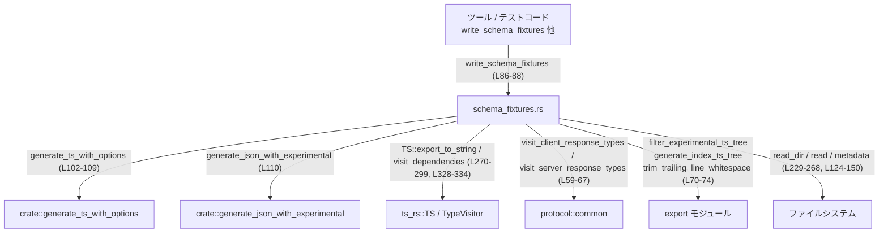
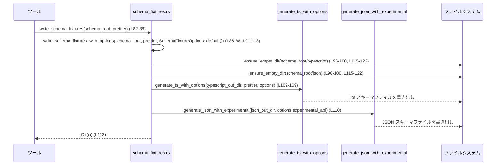
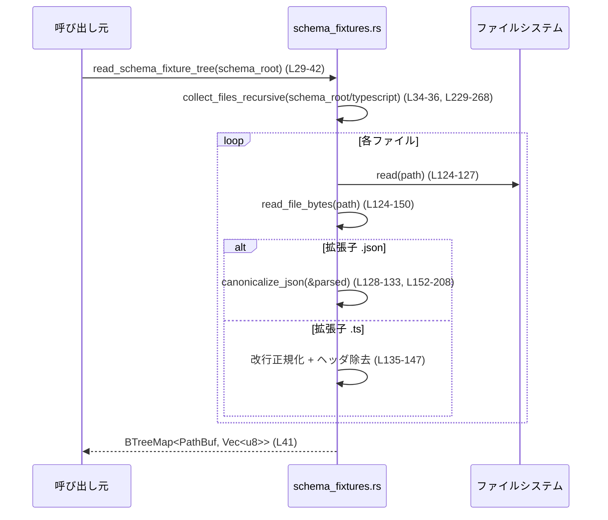

# app-server-protocol/src/schema_fixtures.rs

## 0. ざっくり一言

スキーマ（TypeScript / JSON）のフィクスチャ（生成済みファイル一式）を読み書きし、比較しやすいように正規化（JSONのソートや改行・ヘッダ削除）するためのユーティリティ群です（`schema_fixtures.rs:L24-27, L29-42, L82-113, L124-150, L152-208`）。

---

## 1. このモジュールの役割

### 1.1 概要

- このモジュールは、アプリケーションサーバーのプロトコルスキーマに関する **ファイルツリーの生成・読込・正規化** を行います。
- 具体的には、次の二系統の機能を提供します。
  - `schema/` 配下の `typescript/` と `json/` ディレクトリへ **スキーマを再生成して書き出す**（`write_schema_fixtures*` 系、`schema_fixtures.rs:L82-113, L115-122`）。
  - 既存のスキーマフィクスチャを **再帰的に読み取り、JSON構造や改行を正規化して比較用のバイト列として返す**（`read_schema_fixture_tree`, `read_schema_fixture_subtree`, `read_file_bytes`, `canonicalize_json`, `schema_fixtures.rs:L29-42, L44-51, L124-150, L152-208`）。
- さらに、TypeScript スキーマフィクスチャをテスト用にオンザフライで生成する API も含まれます（`generate_typescript_schema_fixture_subtree_for_tests`, `schema_fixtures.rs:L53-80`）。

### 1.2 アーキテクチャ内での位置づけ

このファイルは、「スキーマ生成ロジック」と「テスト／検証ロジック」の間に位置する **I/O ヘルパー** です。

主な依存関係は以下です。

- crate 内のスキーマ生成関数：
  - `crate::generate_ts_with_options`（TypeScript スキーマ生成、`schema_fixtures.rs:L102-109`）
  - `crate::generate_json_with_experimental`（JSON スキーマ生成、`schema_fixtures.rs:L110`）
- `ts_rs` クレート（`TS` トレイトと `TypeVisitor` による TypeScript 型定義生成、`schema_fixtures.rs:L21-22, L270-299, L322-335`）
- プロトコル型集合：
  - `ClientRequest`, `ClientNotification`, `ServerRequest`, `ServerNotification`（`schema_fixtures.rs:L1-4`）
  - `visit_client_response_types`, `visit_server_response_types`（レスポンスタイプ集合の列挙、`schema_fixtures.rs:L9-10, L59-67`）
- TypeScript 用のツリー後処理：
  - `filter_experimental_ts_tree`, `generate_index_ts_tree`, `trim_trailing_line_whitespace`（`schema_fixtures.rs:L6-8, L70-74`）

これを簡略な依存関係図で表すと次のようになります。



※ 行番号は `schema_fixtures.rs:Lxx-yy` を指します。

### 1.3 設計上のポイント

- **責務の分割**
  - 「ディレクトリを空にしてから生成」部分を `ensure_empty_dir` に切り出し（`schema_fixtures.rs:L115-122`）。
  - 「ファイル読み込みと内容正規化」を `read_file_bytes` に集約し、その下で JSON 正規化 (`canonicalize_json`) と TypeScript 正規化を行います（`schema_fixtures.rs:L124-150, L152-208`）。
  - TypeScript 依存関係の再帰収集は `TypeScriptFixtureCollector` + `collect_typescript_fixture_file` に分離しています（`schema_fixtures.rs:L270-299, L322-335`）。
- **状態管理**
  - ファイル生成時の重複防止には `HashSet<TypeId>` を使い、型ごとの処理を一度だけにしています（`schema_fixtures.rs:L56-57, L270-279`）。
  - それ以外にグローバル状態は持たず、関数は全て引数ベースで動作します。
- **エラーハンドリング**
  - すべての I/O 関数は `anyhow::Result` を返し、`with_context` で追加情報を付与しています（`schema_fixtures.rs:L11-12, L49-51, L115-121, L124-133, L235-245, L252-261, L281`）。
  - TypeScript の依存関係収集中に一度エラーが発生したら、それ以降の visit を無視し、最初のエラーを返す設計です（`schema_fixtures.rs:L322-335`）。
- **並行性**
  - このモジュール自体はスレッドローカルな状態しか持たず、`unsafe` も使用していません。
  - ただしファイルシステムの書き換えを行うため、同じディレクトリに対して複数スレッド／プロセスから同時に `write_schema_fixtures*` を呼ぶと競合の可能性があります（`schema_fixtures.rs:L115-122, L102-110`）。

### 1.4 コンポーネント一覧（関数・型インベントリ）

| 名前 | 種別 | 公開範囲 | 役割 | 行範囲 |
|------|------|----------|------|--------|
| `SchemaFixtureOptions` | 構造体 | `pub` | スキーマ生成時のオプション（現在は `experimental_api` フラグのみ） | `schema_fixtures.rs:L24-27` |
| `read_schema_fixture_tree` | 関数 | `pub` | `schema_root/typescript` と `schema_root/json` 以下のファイルを再帰的に読み込み、正規化したバイト列として返す | `schema_fixtures.rs:L29-42` |
| `read_schema_fixture_subtree` | 関数 | `pub` | `schema_root/label` 以下のファイルのみを読み込む簡易版 | `schema_fixtures.rs:L44-51` |
| `generate_typescript_schema_fixture_subtree_for_tests` | 関数 | `pub`（`#[doc(hidden)]`） | クライアント/サーバーのリクエスト・レスポンス型から TypeScript スキーマフィクスチャをテスト用に生成 | `schema_fixtures.rs:L53-80` |
| `write_schema_fixtures` | 関数 | `pub` | `schema/typescript/` と `schema/json/` を再生成するシンプルなエントリポイント | `schema_fixtures.rs:L82-88` |
| `write_schema_fixtures_with_options` | 関数 | `pub` | オプション付きでスキーマフィクスチャを再生成 | `schema_fixtures.rs:L91-113` |
| `ensure_empty_dir` | 関数 | `fn` | 対象ディレクトリを削除 → 再作成し、空にする | `schema_fixtures.rs:L115-122` |
| `read_file_bytes` | 関数 | `fn` | 単一ファイルを読み込み、拡張子に応じて JSON / TS を正規化 | `schema_fixtures.rs:L124-150` |
| `canonicalize_json` | 関数 | `fn` | JSON 値をオブジェクトキー順・一部配列要素順で正規化 | `schema_fixtures.rs:L152-208` |
| `schema_array_item_sort_key` | 関数 | `fn` | JSON 配列要素のソートキー（$ref や title を優先）を生成 | `schema_fixtures.rs:L210-227` |
| `collect_files_recursive` | 関数 | `fn` | ディレクトリ配下の全ファイルを再帰的に集め、`read_file_bytes` 済みの内容を返す | `schema_fixtures.rs:L229-268` |
| `collect_typescript_fixture_file` | 関数 | `fn` | 単一 TS 型とその依存型の TypeScript フィクスチャを収集 | `schema_fixtures.rs:L270-299` |
| `normalize_relative_fixture_path` | 関数 | `fn` | 相対パスのコンポーネント正規化 | `schema_fixtures.rs:L301-302` |
| `visit_typescript_fixture_dependencies` | 関数 | `fn` | 外部から渡された visitor クロージャで TS 依存型を収集 | `schema_fixtures.rs:L305-320` |
| `TypeScriptFixtureCollector` | 構造体 | `struct` | `ts_rs::TypeVisitor` 実装。visit された型を `collect_typescript_fixture_file` に委譲 | `schema_fixtures.rs:L322-325, L328-335` |
| `canonicalize_json_sorts_string_arrays` | テスト関数 | `#[test]` | 文字列配列がソートされることの確認 | `schema_fixtures.rs:L342-347` |
| `canonicalize_json_sorts_schema_ref_arrays` | テスト関数 | `#[test]` | `$ref` を含むオブジェクト配列がソートされることの確認 | `schema_fixtures.rs:L349-360` |

---

## 2. 主要な機能一覧

- スキーマツリー読込: `read_schema_fixture_tree` — TypeScript と JSON のスキーマフィクスチャをまとめて読み込む（`schema_fixtures.rs:L29-42`）。
- サブツリー読込: `read_schema_fixture_subtree` — 任意サブディレクトリ配下のみを読み込む（`schema_fixtures.rs:L44-51`）。
- TypeScript フィクスチャ生成（テスト用）: `generate_typescript_schema_fixture_subtree_for_tests` — プロトコル型から TS フィクスチャ一式を構成（`schema_fixtures.rs:L53-80`）。
- スキーマフィクスチャ再生成（シンプル版）: `write_schema_fixtures` — デフォルトオプションで schema ディレクトリを再生成（`schema_fixtures.rs:L82-88`）。
- スキーマフィクスチャ再生成（オプション付き）: `write_schema_fixtures_with_options` — 実験的 API の有無などを制御可能（`schema_fixtures.rs:L91-113`）。
- ディレクトリ初期化: `ensure_empty_dir` — 既存ディレクトリの削除と再作成（`schema_fixtures.rs:L115-122`）。
- ファイル内容の正規化読込: `read_file_bytes` — JSON/TS/その他ファイルの読み込みと正規化（`schema_fixtures.rs:L124-150`）。
- JSON 正規化: `canonicalize_json` / `schema_array_item_sort_key` — JSON 値（特に schema）の安定ソート（`schema_fixtures.rs:L152-208, L210-227`）。
- ディレクトリ再帰スキャン: `collect_files_recursive` — ファイルシステムからのフィクスチャツリー構築（`schema_fixtures.rs:L229-268`）。
- TypeScript フィクスチャ依存関係解決: `collect_typescript_fixture_file`, `visit_typescript_fixture_dependencies`, `TypeScriptFixtureCollector`（`schema_fixtures.rs:L270-299, L305-320, L322-335`）。

---

## 3. 公開 API と詳細解説

### 3.1 型一覧（構造体・列挙体など）

| 名前 | 種別 | 役割 / 用途 | 主な利用箇所 |
|------|------|-------------|--------------|
| `SchemaFixtureOptions` | 構造体 | スキーマ生成時のオプション。現在は `experimental_api: bool` のみを持ち、実験的 API をスキーマに含めるかどうかを制御します（`schema_fixtures.rs:L24-27`）。 | `write_schema_fixtures_with_options` から `GenerateTsOptions` や JSON 生成関数へ伝播（`schema_fixtures.rs:L91-113`）。 |

### 3.2 関数詳細（主要 7 件）

#### `read_schema_fixture_tree(schema_root: &Path) -> Result<BTreeMap<PathBuf, Vec<u8>>>`

**概要**

- `schema_root/typescript` および `schema_root/json` 配下のファイルを再帰的に探索し、正規化済みの内容をバイト列として返します（`schema_fixtures.rs:L29-42`）。
- 返されるキーは `typescript/foo.ts` や `json/bar.json` のような **root からの相対パス** です。

**引数**

| 引数名 | 型 | 説明 |
|--------|----|------|
| `schema_root` | `&Path` | `typescript/` と `json/` ディレクトリを含むスキーマルートディレクトリへのパス（`schema_fixtures.rs:L29-31`）。 |

**戻り値**

- `Result<BTreeMap<PathBuf, Vec<u8>>>`  
  - `Ok(map)` のとき、キーは `PathBuf`（例: `"typescript/foo.ts"`）、値は正規化済みのバイト列です（`schema_fixtures.rs:L33-41`）。
  - `Err(e)` のとき、ファイルシステムや JSON/UTF-8 パースなどのエラー情報が `anyhow::Error` として含まれます。

**内部処理の流れ**

1. `typescript_root = schema_root.join("typescript")` と `json_root = schema_root.join("json")` を構成（`schema_fixtures.rs:L29-31`）。
2. 空の `BTreeMap<PathBuf, Vec<u8>>` を作成（`schema_fixtures.rs:L33`）。
3. `collect_files_recursive(&typescript_root)?` を呼び出し、得られた `(rel, bytes)` に `PathBuf::from("typescript").join(rel)` を付与して `all` に挿入（`schema_fixtures.rs:L34-36`）。
4. 同様に `collect_files_recursive(&json_root)?` を呼び出し、`PathBuf::from("json").join(rel)` として挿入（`schema_fixtures.rs:L37-39`）。
5. `Ok(all)` で map を返す（`schema_fixtures.rs:L41`）。

※ 実際のファイル読み込みと正規化は `collect_files_recursive` → `read_file_bytes` → `canonicalize_json` などで行われます（`schema_fixtures.rs:L229-268, L124-150, L152-208`）。

**Examples（使用例）**

```rust
use std::path::Path;
use app_server_protocol::schema_fixtures::read_schema_fixture_tree;

fn compare_schema_tree(schema_root: &Path) -> anyhow::Result<()> {
    // 既存のフィクスチャツリーを読み込む
    let fixtures = read_schema_fixture_tree(schema_root)?; // schema_fixtures.rs:L29-42

    // 例: TypeScript スキーマの数を表示
    let ts_count = fixtures.keys().filter(|p| p.starts_with("typescript")).count();
    println!("TypeScript schema files: {}", ts_count);

    Ok(())
}
```

**Errors / Panics**

- `collect_files_recursive` 内で起こりうるエラーをそのまま返します（`schema_fixtures.rs:L34-39, L229-268`）。
  - 例:
    - `typescript_root` / `json_root` が存在しない or 読み取り不可 → `std::fs::read_dir` のエラーにコンテキストが付与されて返る（`schema_fixtures.rs:L235-245`）。
    - JSON ファイルのパース失敗 → `"failed to parse JSON in ..."` というメッセージ付きエラー（`schema_fixtures.rs:L128-133`）。
    - TypeScript ファイルが UTF-8 でない → `"expected UTF-8 TypeScript in ..."` エラー（`schema_fixtures.rs:L136-140`）。
- 明示的な `panic!` や `unwrap()` は使用していません。

**Edge cases（エッジケース）**

- `typescript/` や `json/` ディレクトリが存在しない場合  
  → 最初の `read_dir` でエラーが発生し、`Err` が返ります（`schema_fixtures.rs:L235-245`）。
- ディレクトリ配下にシンボリックリンクが存在する場合  
  → `std::fs::metadata` を用いてリンク先の種別（ファイル/ディレクトリ）で扱います（`schema_fixtures.rs:L240-244`）。循環リンクがある場合の挙動については後述の注意点を参照してください。
- JSON/TS 以外の拡張子ファイルは、バイト列をそのまま返します（`schema_fixtures.rs:L147-149`）。

**使用上の注意点**

- **前提条件**: `schema_root/typescript` と `schema_root/json` は存在し、スキーマフィクスチャが格納されていることを前提としています。
- **パフォーマンス**: ディレクトリ配下のすべてのファイルを読み込み、JSON はすべてパース → 再シリアライズするため、大規模スキーマでは処理時間とメモリ使用量が増えます（`schema_fixtures.rs:L124-133, L152-208`）。
- **並行性**: 読み取り専用の処理なので、複数スレッドから同じ `schema_root` を同時に読むこと自体は、ファイルシステム側の通常の制約を除き問題ありません。

---

#### `read_schema_fixture_subtree(schema_root: &Path, label: &str) -> Result<BTreeMap<PathBuf, Vec<u8>>>`

**概要**

- `schema_root/label` 以下のファイルのみを再帰的に読み込み、相対パスと正規化済みバイト列のマップを返します（`schema_fixtures.rs:L44-51`）。

**引数**

| 引数名 | 型 | 説明 |
|--------|----|------|
| `schema_root` | `&Path` | スキーマルートディレクトリ。 |
| `label` | `&str` | サブディレクトリ名。例: `"typescript"` や `"json"`（`schema_fixtures.rs:L44-48`）。 |

**戻り値**

- `Result<BTreeMap<PathBuf, Vec<u8>>>`  
  - キーは `schema_root/label` からの **相対パス**（`foo.ts` など）になります（`schema_fixtures.rs:L48-51, L229-268`）。

**内部処理**

1. `subtree_root = schema_root.join(label)` を作成（`schema_fixtures.rs:L48`）。
2. `collect_files_recursive(&subtree_root)` を呼び、結果に `"read schema fixture subtree <path>"` というコンテキストを付けて返します（`schema_fixtures.rs:L49-51`）。

**Examples**

```rust
use std::path::Path;
use app_server_protocol::schema_fixtures::read_schema_fixture_subtree;

fn load_ts_only(schema_root: &Path) -> anyhow::Result<()> {
    let ts_files = read_schema_fixture_subtree(schema_root, "typescript")?; // schema_fixtures.rs:L44-51
    for (rel_path, bytes) in ts_files {
        println!("TS: {:?}, {} bytes", rel_path, bytes.len());
    }
    Ok(())
}
```

**Errors / Panics**

- `read_schema_fixture_tree` と同様に、ディレクトリアクセスや JSON/TS パースエラーを `Err` として返します。
- エラーには `"read schema fixture subtree <path>"` という追加コンテキストが含まれます（`schema_fixtures.rs:L49-51`）。

**Edge cases**

- `label` に存在しないディレクトリを指定した場合 → `read_dir` 失敗によりエラー（`schema_fixtures.rs:L235-245`）。
- 返されるキーが `typescript/foo.ts` ではなく `foo.ts` である点に注意が必要です（`schema_fixtures.rs:L252-261` 参照）。

**使用上の注意点**

- 複数種別のファイルを混在させず、特定サブツリーだけを比較したいときに有用です。
- `read_schema_fixture_tree` と返り値パス形式が異なるため、両者を同一マップとして扱う場合はパスプレフィックスの有無に注意します。

---

#### `generate_typescript_schema_fixture_subtree_for_tests() -> Result<BTreeMap<PathBuf, Vec<u8>>>`

**概要**

- クライアント/サーバー間のリクエスト・レスポンス・通知型から、対応する TypeScript 型定義ファイル一式を生成し、テスト用にメモリ上のツリーとして返します（`schema_fixtures.rs:L53-80`）。
- `#[doc(hidden)]` でドキュメントには出ないことから、主にテストや内部検証用と考えられます（実態はコードからのみ判断可能です）。

**引数**

- なし。

**戻り値**

- `Result<BTreeMap<PathBuf, Vec<u8>>>`  
  - キー: TypeScript ファイルの相対パス（`PathBuf`、`TS::output_path()` に基づく、`schema_fixtures.rs:L270-283`）。
  - 値: 改行やバナーなどを正規化した TypeScript ソースの UTF-8 バイト列（`schema_fixtures.rs:L281-286, L76-79`）。

**内部処理の流れ**

1. `BTreeMap<PathBuf, String>` の `files` と `HashSet<TypeId>` の `seen` を初期化（`schema_fixtures.rs:L56-57`）。
2. 以下の順序で TypeScript フィクスチャファイルを収集（すべて `collect_typescript_fixture_file` 経由、`schema_fixtures.rs:L59-68`）。
   - `ClientRequest`
   - そのレスポンス型: `visit_client_response_types(visitor)` を経由（`schema_fixtures.rs:L60-62`）。
   - `ClientNotification`
   - `ServerRequest`
   - そのレスポンス型: `visit_server_response_types(visitor)`（`schema_fixtures.rs:L65-67`）。
   - `ServerNotification`
3. `filter_experimental_ts_tree(&mut files)?` で実験的 API に関するファイルを除去または調整（`schema_fixtures.rs:L70`）。
4. `generate_index_ts_tree(&mut files)` でインデックスファイル（`index.ts` 等）の生成やツリー整形（`schema_fixtures.rs:L71`）。
5. 各ファイルの内容から末尾の空白を削除（`trim_trailing_line_whitespace`、`schema_fixtures.rs:L72-74`）。
6. `String` → `Vec<u8>` に変換して返却（`schema_fixtures.rs:L76-79`）。

**Examples**

テストコード側からの典型的な利用イメージです（実際の関数名はこのファイル以外に依存するため擬似的な例です）。

```rust
use app_server_protocol::schema_fixtures::generate_typescript_schema_fixture_subtree_for_tests;

#[test]
fn generated_ts_matches_fixture() -> anyhow::Result<()> {
    // 実行時に生成される TS スキーマツリー
    let generated = generate_typescript_schema_fixture_subtree_for_tests()?; // schema_fixtures.rs:L53-80

    // 既存の schema/typescript フィクスチャツリーと比較（読み込み側は他 API から取得）
    // let fixture = read_schema_fixture_subtree(schema_root, "typescript")?;
    // assert_eq!(generated, fixture);

    Ok(())
}
```

**Errors / Panics**

- `collect_typescript_fixture_file::<T>` が返すエラー（TS 生成失敗など）をまとめて返します（`schema_fixtures.rs:L270-299, L328-335`）。
- `filter_experimental_ts_tree` / `trim_trailing_line_whitespace` などが失敗した場合も `Err` になります（`schema_fixtures.rs:L70, L72-74`）。
- パニックを起こすコードは含まれていません。

**Edge cases**

- ある型 `T: TS` の `T::output_path()` が `None` を返す場合、その型に対応するファイルは生成されません（`schema_fixtures.rs:L274-276`）。
- 同じ `TypeId` の型が再度 visit されても、`seen.insert(TypeId::of::<T>())` が `false` となり、再生成されません（`schema_fixtures.rs:L277-279`）。
- 依存関係の visit 中に最初のエラーが発生すると、それ以降の visit は無視され、最初のエラーのみが返されます（`schema_fixtures.rs:L322-335`）。

**使用上の注意点**

- 主にテスト用関数であるため、本番コードからの呼び出しは想定されていないと考えられます（`#[doc(hidden)]` が付与、`schema_fixtures.rs:L53-55`）。
- 生成されたツリーは、`write_schema_fixtures` で生成した TypeScript ファイル群と比較することで、スキーマ生成ロジックの回帰テストに利用できます。

---

#### `write_schema_fixtures(schema_root: &Path, prettier: Option<&Path>) -> Result<()>`

**概要**

- `schema_root/typescript` と `schema_root/json` ディレクトリを **一度削除して空にし**、新たにスキーマフィクスチャを生成する高レベルなエントリポイントです（`schema_fixtures.rs:L82-88`）。
- デフォルトの `SchemaFixtureOptions`（= 現時点では `experimental_api: false`）を使用します。

**引数**

| 引数名 | 型 | 説明 |
|--------|----|------|
| `schema_root` | `&Path` | `schema/` ディレクトリのルートパス（`schema_fixtures.rs:L82-87`）。 |
| `prettier` | `Option<&Path>` | TypeScript フォーマッタ（prettier）のパスまたは `None`。`crate::generate_ts_with_options` にそのまま渡されます（`schema_fixtures.rs:L102-109`）。 |

**戻り値**

- `Result<()>`  
  - 成功時は `Ok(())`（`schema_fixtures.rs:L112`）。
  - 失敗時はディレクトリ操作やスキーマ生成のエラーが返ります。

**内部処理の流れ**

1. `SchemaFixtureOptions::default()`（`experimental_api: false`）を構築（`schema_fixtures.rs:L24-27`）。
2. `write_schema_fixtures_with_options(schema_root, prettier, options)` を呼び出して結果をそのまま返します（`schema_fixtures.rs:L86-88`）。

**Examples**

```rust
use std::path::Path;
use app_server_protocol::schema_fixtures::write_schema_fixtures;

fn main() -> anyhow::Result<()> {
    let schema_root = Path::new("schema");

    // prettier を使わず、スキーマフィクスチャを再生成
    write_schema_fixtures(schema_root, None)?; // schema_fixtures.rs:L82-88

    Ok(())
}
```

**Errors / Panics**

- 具体的なエラー条件は `write_schema_fixtures_with_options` に準じます（次節参照）。
- `write_schema_fixtures` 自体は panic を含まず、単純な委譲関数です。

**Edge cases**

- `schema_root` 配下に既存の `typescript` / `json` ディレクトリがない場合でも、`write_schema_fixtures_with_options` 内で新規作成されます（`schema_fixtures.rs:L115-122`）。

**使用上の注意点**

- ディレクトリを **削除してから再生成** するため、`schema_root` 配下に不要なファイルが残っていると、それらを含めて削除されます（`schema_fixtures.rs:L115-122`）。
- 同じディレクトリに対して複数プロセスが同時に実行すると競合する可能性があります。

---

#### `write_schema_fixtures_with_options(schema_root: &Path, prettier: Option<&Path>, options: SchemaFixtureOptions) -> Result<()>`

**概要**

- `write_schema_fixtures` の下位関数であり、`SchemaFixtureOptions` を明示的に指定してスキーマフィクスチャを再生成します（`schema_fixtures.rs:L91-113`）。

**引数**

| 引数名 | 型 | 説明 |
|--------|----|------|
| `schema_root` | `&Path` | スキーマルートディレクトリ。 |
| `prettier` | `Option<&Path>` | TypeScript フォーマッタへのパス（任意）。 |
| `options` | `SchemaFixtureOptions` | 実験的 API を含めるかなどの生成オプション（`schema_fixtures.rs:L94-113`）。 |

**戻り値**

- `Result<()>` — 生成成功時は `Ok(())`、失敗時はエラー情報を含む `Err`。

**内部処理の流れ**

1. `typescript_out_dir = schema_root.join("typescript")` と `json_out_dir = schema_root.join("json")` を決定（`schema_fixtures.rs:L96-97`）。
2. `ensure_empty_dir(&typescript_out_dir)?` と `ensure_empty_dir(&json_out_dir)?` で両ディレクトリを空にする（`schema_fixtures.rs:L99-100, L115-122`）。
3. `crate::generate_ts_with_options(&typescript_out_dir, prettier, crate::GenerateTsOptions { experimental_api: options.experimental_api, ..crate::GenerateTsOptions::default() })?` を実行（`schema_fixtures.rs:L102-109`）。
4. `crate::generate_json_with_experimental(&json_out_dir, options.experimental_api)?` を実行（`schema_fixtures.rs:L110`）。
5. 成功したら `Ok(())` を返します（`schema_fixtures.rs:L112`）。

**Examples**

```rust
use std::path::Path;
use app_server_protocol::schema_fixtures::{write_schema_fixtures_with_options, SchemaFixtureOptions};

fn regen_with_experimental(schema_root: &Path) -> anyhow::Result<()> {
    let options = SchemaFixtureOptions {
        experimental_api: true, // 実験的 API を含める
    };

    write_schema_fixtures_with_options(schema_root, None, options)?; // schema_fixtures.rs:L91-113
    Ok(())
}
```

**Errors / Panics**

- `ensure_empty_dir` のエラー（ディレクトリ削除/作成失敗）をそのまま返します（`schema_fixtures.rs:L99-100, L115-121`）。
- `crate::generate_ts_with_options` および `crate::generate_json_with_experimental` の内部エラーも `Err` として返されます（`schema_fixtures.rs:L102-110`）。
- panic はありません。

**Edge cases**

- `schema_root` が存在しない場合でも、`join` されたパスは `ensure_empty_dir` 内で `create_dir_all` によって作成されます（`schema_fixtures.rs:L115-122`）。
- `experimental_api` を `true` にした場合、TypeScript / JSON の生成ロジックがどう変わるかは、このファイル外（`crate::GenerateTsOptions`, `generate_json_with_experimental`）の実装依存であり、このチャンクからは不明です。

**使用上の注意点**

- 生成されたファイルは、`read_schema_fixture_tree` などで読み込むと JSON/TS 正規化された形で比較できます。
- 実験的 API を含めて生成した結果と、含めない結果が混在しないよう、オプションの使い分けに注意が必要です。

---

#### `canonicalize_json(value: &Value) -> Value`

**概要**

- JSON 値（`serde_json::Value`）を、**オブジェクトキー順**および一部の配列要素順にソートして正規化します（`schema_fixtures.rs:L152-208`）。
- 目的は「スキーマフィクスチャ比較の安定性向上」であり、意味上等価だが順序が異なる JSON を同一として扱えるようにすることです（コメントより、`schema_fixtures.rs:L155-173`）。

**引数**

| 引数名 | 型 | 説明 |
|--------|----|------|
| `value` | `&Value` | 元の JSON 値。配列・オブジェクト・プリミティブいずれも可（`schema_fixtures.rs:L152-153`）。 |

**戻り値**

- `Value` — 正規化された JSON 値。元の入力とは structurally 等価ですが、オブジェクトのキー順や一部配列の要素順が変わります（`schema_fixtures.rs:L195-205`）。

**内部処理の流れ**

1. `match value` で型ごとに分岐（`schema_fixtures.rs:L152-153`）。
2. **配列 (`Value::Array`) の場合**（`schema_fixtures.rs:L154-196`）:
   - 各要素に再帰的に `canonicalize_json` を適用し、新しい `items: Vec<Value>` を作る（`schema_fixtures.rs:L174-175`）。
   - 各要素に対して `schema_array_item_sort_key` を呼び、ソートキーを求める（`schema_fixtures.rs:L176-182`）。
   - 一つでも `None` を返す要素があれば、元の順序を保ったまま `Value::Array(items)` を返す（`schema_fixtures.rs:L177-179`）。
   - 全要素にソートキーがある場合、`(key, stable_string)` のタプルとペアにして `items` と zip し、ソート（`schema_fixtures.rs:L175-186`）。
   - ソート条件は、まず `key_left.cmp(key_right)`、等しい場合は JSON 文字列表現 (`serde_json::to_string`) での順比較（`schema_fixtures.rs:L186-193`）。
3. **オブジェクト (`Value::Object`) の場合**（`schema_fixtures.rs:L197-205`）:
   - `map.iter()` の結果を `(key, value)` のベクタにし、`key` でソート（`schema_fixtures.rs:L198-199`）。
   - 新しい `Map` に対し、ソート順に `key.clone()` と `canonicalize_json(child)` を挿入（`schema_fixtures.rs:L200-203`）。
4. **その他（数値・文字列・null など）**は、そのまま `clone()` して返します（`schema_fixtures.rs:L206-207`）。

**Examples**

テストで使用されている例（`schema_fixtures.rs:L342-347, L349-360`）をもとにしたサンプルです。

```rust
use serde_json::json;
use app_server_protocol::schema_fixtures::canonicalize_json;

fn demo() {
    let value = json!(["b", "a"]);
    let normalized = canonicalize_json(&value); // schema_fixtures.rs:L152-196

    assert_eq!(normalized, json!(["a", "b"])); // 文字列配列がソートされる
}
```

**Errors / Panics**

- 内部で `serde_json::to_string(item).unwrap_or_default()` を使用していますが、`Value` のシリアライズは通常失敗しないため、この `unwrap_or_default` はエラー発生時に空文字列を使うだけでパニックにはなりません（`schema_fixtures.rs:L180-181`）。
- その他、パニックを起こすコードは含まれていません。

**Edge cases**

- 配列にソートキーを持たない要素（例: ネストした配列、`$ref` も `title` もないオブジェクト）が含まれている場合、その配列は **元の順序のまま** 保持されます（`schema_fixtures.rs:L176-179, L210-227`）。
- オブジェクトはすべてキー順にソートされるため、元のフィールド順序は失われます（`schema_fixtures.rs:L197-205`）。
- JSON スキーマにおいて順序が意味を持つ配列（例: tuple 検証の `prefixItems`）については、ソートキーが取れないように設計し、順序を変えないようになっています（コメント、`schema_fixtures.rs:L170-173`）。

**使用上の注意点**

- JSON Schema の検証意味を変えない範囲でのみ配列をソートするよう配慮されていますが、「どの配列がソート対象か」は `schema_array_item_sort_key` の実装に依存します（`schema_fixtures.rs:L210-227`）。
- この関数は、主にフィクスチャ比較の安定性のために使われており、一般用途での JSON 変換としては、「フィールド順」などを失うことに注意が必要です。

---

#### `collect_files_recursive(root: &Path) -> Result<BTreeMap<PathBuf, Vec<u8>>>`

**概要**

- 与えられたディレクトリ `root` 以下のファイルを再帰的に探索し、`root` からの相対パスをキー、`read_file_bytes` で正規化されたバイト列を値とする `BTreeMap` を返します（`schema_fixtures.rs:L229-268`）。

**引数**

| 引数名 | 型 | 説明 |
|--------|----|------|
| `root` | `&Path` | 再帰探索を開始するディレクトリ。 |

**戻り値**

- `Result<BTreeMap<PathBuf, Vec<u8>>>`  
  - キー: `root` からの相対パス（`path.strip_prefix(root)` の結果、`schema_fixtures.rs:L252-261`）。
  - 値: `read_file_bytes` によって正規化されたファイル内容（`schema_fixtures.rs:L263-264`）。

**内部処理の流れ**

1. 空の `BTreeMap` を作成し、`stack` に `root.to_path_buf()` を積む（`schema_fixtures.rs:L230-233`）。
2. `stack.pop()` でディレクトリを取り出しつつ、`std::fs::read_dir(&dir)` で中身を列挙（`schema_fixtures.rs:L233-236`）。
3. 各エントリに対して:
   - `entry.path()` を取得（`schema_fixtures.rs:L237-239`）。
   - `std::fs::metadata(&path)` でシンボリックリンクを辿った種別を判定（`schema_fixtures.rs:L240-244`）。
   - ディレクトリなら `stack.push(path)` し、ファイルでなければスキップ（`schema_fixtures.rs:L245-250`）。
4. ファイルであれば:
   - `path.strip_prefix(root)` によって相対パス `rel` を得る（`schema_fixtures.rs:L252-261`）。
   - `files.insert(rel, read_file_bytes(&path)?);` でマップに追加（`schema_fixtures.rs:L263-264`）。
5. すべてのスタックが空になったら `Ok(files)` を返す（`schema_fixtures.rs:L267`）。

**Examples**

```rust
use std::path::Path;
use app_server_protocol::schema_fixtures::read_schema_fixture_subtree;

// collect_files_recursive は非公開なので、公開API経由の使用例
fn list_json_files(schema_root: &Path) -> anyhow::Result<()> {
    let json_files = read_schema_fixture_subtree(schema_root, "json")?;
    for (rel, _) in json_files {
        println!("JSON: {:?}", rel);
    }
    Ok(())
}
```

**Errors / Panics**

- `read_dir`, `metadata`, `strip_prefix`, `read_file_bytes` いずれかが失敗した場合に `Err` を返します（`schema_fixtures.rs:L235-245, L252-264`）。
- 失敗箇所には `"failed to read dir ..."`, `"failed to stat ..."`, `"failed to strip prefix ..."` などのコンテキストが付与されます。

**Edge cases**

- ディレクトリにファイル以外（ソケット、デバイスなど）が存在する場合は無視されます（`metadata.is_file()` 判定、`schema_fixtures.rs:L245-250`）。
- ディレクトリのシンボリックリンクはリンク先を辿って再帰探索されます（`std::fs::metadata` 使用、`schema_fixtures.rs:L240-244`）。
  - その結果、**循環シンボリックリンク** が存在する場合、無限ループや極端に深い再帰になる可能性があります。  
    → この点はコード上特に検出していないため、信頼されたツリーに対してのみ使用することが前提と考えられます。

**使用上の注意点**

- `BTreeMap` を使っているため、最終的なキー順は辞書順に安定します（`schema_fixtures.rs:L230-231`）。
- ルートパスの指定を誤ると、`strip_prefix` 失敗によりエラーになる可能性があります（`schema_fixtures.rs:L252-261`）。

---

### 3.3 その他の関数

| 関数 / 型名 | 種別 | 役割（1 行） | 行範囲 |
|-------------|------|--------------|--------|
| `ensure_empty_dir(dir: &Path) -> Result<()>` | 関数 | ディレクトリが存在すれば削除し、改めて空ディレクトリを作成する（`std::fs::remove_dir_all` と `create_dir_all` を使用） | `schema_fixtures.rs:L115-122` |
| `read_file_bytes(path: &Path) -> Result<Vec<u8>>` | 関数 | 単一ファイルを読み込み、拡張子 `.json` の場合は JSON を正規化して pretty-print、`.ts` の場合は改行正規化とヘッダ除去を行う | `schema_fixtures.rs:L124-150` |
| `schema_array_item_sort_key(item: &Value) -> Option<String>` | 関数 | JSON 配列要素のソートキーを生成し、`canonicalize_json` で配列をソートする際に利用 | `schema_fixtures.rs:L210-227` |
| `collect_typescript_fixture_file<T: TS + 'static + ?Sized>(...) -> Result<()>` | 関数 | 特定の TS 型 `T` について、ファイルパスと内容を生成し、依存型を `TypeScriptFixtureCollector` で再帰的に収集 | `schema_fixtures.rs:L270-299` |
| `normalize_relative_fixture_path(path: &Path) -> PathBuf` | 関数 | `Path::components().collect()` による相対パスの正規化 | `schema_fixtures.rs:L301-302` |
| `visit_typescript_fixture_dependencies(...) -> Result<()>` | 関数 | 外部から渡された関数に `TypeScriptFixtureCollector` を渡し、訪問された TS 型のフィクスチャを収集する | `schema_fixtures.rs:L305-320` |
| `TypeScriptFixtureCollector<'a>` | 構造体 | `ts_rs::TypeVisitor` を実装し、`visit` された型ごとに `collect_typescript_fixture_file` を呼び出す | `schema_fixtures.rs:L322-325, L328-335` |

---

## 4. データフロー

ここでは典型的な処理シナリオとして、「スキーマフィクスチャの再生成」を取り上げ、関数呼び出しとデータの流れを示します。

### 4.1 スキーマフィクスチャ再生成フロー

1. ツール（例: `just write-app-server-schema`）が `write_schema_fixtures` を呼ぶ（`schema_fixtures.rs:L82-88`）。
2. `write_schema_fixtures` は `SchemaFixtureOptions::default()` を用いて `write_schema_fixtures_with_options` を呼ぶ（`schema_fixtures.rs:L86-88, L24-27`）。
3. `write_schema_fixtures_with_options` は `typescript_out_dir` と `json_out_dir` を決定し、それぞれ `ensure_empty_dir` で空ディレクトリにする（`schema_fixtures.rs:L96-100, L115-122`）。
4. `crate::generate_ts_with_options` にオプションを渡して TypeScript スキーマファイルを生成（`schema_fixtures.rs:L102-109`）。
5. `crate::generate_json_with_experimental` に `experimental_api` フラグを渡して JSON スキーマを生成（`schema_fixtures.rs:L110`）。



### 4.2 フィクスチャ読込と JSON/TS 正規化

`read_schema_fixture_tree` の内部では、`collect_files_recursive` → `read_file_bytes` → `canonicalize_json` の流れで正規化が行われます（`schema_fixtures.rs:L29-42, L229-268, L124-150, L152-208`）。



---

## 5. 使い方（How to Use）

### 5.1 基本的な使用方法

#### 5.1.1 スキーマフィクスチャの再生成

```rust
use std::path::Path;
use app_server_protocol::schema_fixtures::write_schema_fixtures;

fn main() -> anyhow::Result<()> {
    // schema ディレクトリルート
    let schema_root = Path::new("schema");

    // TypeScript / JSON のスキーマフィクスチャを再生成する
    // 既存の schema/typescript, schema/json は一度削除されます
    write_schema_fixtures(schema_root, None)?; // schema_fixtures.rs:L82-88

    Ok(())
}
```

#### 5.1.2 フィクスチャの読み込みと比較

```rust
use std::path::Path;
use app_server_protocol::schema_fixtures::read_schema_fixture_tree;

fn check_schema_fixtures(schema_root: &Path) -> anyhow::Result<()> {
    // 既存フィクスチャを読み込んで正規化済みバイト列として取得
    let fixture_tree = read_schema_fixture_tree(schema_root)?; // schema_fixtures.rs:L29-42

    // 例: TypeScript スキーマだけをフィルタ
    let ts_files: Vec<_> = fixture_tree
        .into_iter()
        .filter(|(path, _)| path.starts_with("typescript"))
        .collect();

    println!("TS schema files: {}", ts_files.len());
    Ok(())
}
```

### 5.2 よくある使用パターン

1. **テストで「生成結果」と「コミット済みフィクスチャ」の一致を確認する**

   - 生成側: `generate_typescript_schema_fixture_subtree_for_tests` または crate 全体の生成ロジック。
   - フィクスチャ側: `read_schema_fixture_tree` / `read_schema_fixture_subtree`。
   - 比較: `assert_eq!(generated_tree, fixture_tree)`。

2. **実験的 API 付き / なしのスキーマを別々に生成する**

   ```rust
   use app_server_protocol::schema_fixtures::{write_schema_fixtures_with_options, SchemaFixtureOptions};

   fn regen_both(schema_root: &std::path::Path) -> anyhow::Result<()> {
       // 安定版のみ
       write_schema_fixtures_with_options(
           schema_root,
           None,
           SchemaFixtureOptions { experimental_api: false },
       )?;

       // 実験的APIを含めた別ディレクトリに生成したい場合は、schema_root を変える
       // （このファイルからは別ディレクトリ運用の有無は分かりません）

       Ok(())
   }
   ```

### 5.3 よくある間違い

```rust
use std::path::Path;
use app_server_protocol::schema_fixtures::read_schema_fixture_subtree;

// 間違い例: read_schema_fixture_tree と read_schema_fixture_subtree のキー形式の違いを無視
fn bad_compare(schema_root: &Path) -> anyhow::Result<()> {
    let full = read_schema_fixture_tree(schema_root)?;         // キー: "typescript/foo.ts" など
    let ts_only = read_schema_fixture_subtree(schema_root, "typescript")?; // キー: "foo.ts" だけ

    // NG: キー形式が異なるため、単純な比較は一致しない
    // assert_eq!(full, ts_only); // 期待した結果にならない

    Ok(())
}

// 正しい例: プレフィックスを意識して比較する
fn good_compare(schema_root: &Path) -> anyhow::Result<()> {
    let full = read_schema_fixture_tree(schema_root)?;
    let ts_only = read_schema_fixture_subtree(schema_root, "typescript")?;

    let full_ts_only: std::collections::BTreeMap<_, _> = full
        .into_iter()
        .filter_map(|(path, bytes)| {
            path.strip_prefix("typescript")
                .ok()
                .map(|rel| (rel.to_path_buf(), bytes))
        })
        .collect();

    assert_eq!(full_ts_only, ts_only); // キー形式を揃えて比較
    Ok(())
}
```

### 5.4 使用上の注意点（まとめ）

- **ディレクトリ操作**
  - `write_schema_fixtures*` は対象ディレクトリを削除して再生成します。`schema_root/typescript` / `json` に他のファイルを置いている場合、それらも削除されます（`schema_fixtures.rs:L96-100, L115-122`）。
- **循環シンボリックリンク**
  - `collect_files_recursive` は `std::fs::metadata` を使ってシンボリックリンクをディレクトリとして辿るため、循環リンクがあると無限再帰の可能性があります（`schema_fixtures.rs:L240-247`）。一般的には信頼されたビルド成果物ディレクトリを前提として使用する必要があります。
- **並行実行**
  - このモジュールは内部状態を持たないため関数はスレッドセーフですが、同じディレクトリに対して複数プロセス／スレッドから同時に `write_schema_fixtures*` を実行すると、ファイル削除・生成レースが発生しえます。
- **JSON/TS の正規化**
  - `read_file_bytes` は JSON の pretty-print とオブジェクトキー／一部配列のソートを行うため、元ファイルの整形やフィールド順は保持されません（`schema_fixtures.rs:L124-133, L152-205`）。
  - TypeScript ファイルは改行コードの正規化と固定ヘッダの削除を行うため、元ファイルと完全に一致しない点に注意します（`schema_fixtures.rs:L135-147`）。

---

## 6. 変更の仕方（How to Modify）

### 6.1 新しい機能を追加する場合

例: 新しいスキーマ形式（例: YAML）をフィクスチャとして扱いたい場合。

1. **ファイル読込パスの拡張**
   - `read_file_bytes` に `.yaml` / `.yml` の拡張子を判定して、専用の正規化処理を追加するのが自然です（`schema_fixtures.rs:L124-150`）。
2. **ディレクトリ構造の拡張**
   - `read_schema_fixture_tree` や `write_schema_fixtures_with_options` に、新しいサブディレクトリ（例: `"yaml"`）を追加する（`schema_fixtures.rs:L29-39, L91-100`）。
3. **依存グラフの確認**
   - 新しい形式が TypeScript / JSON 生成ロジックとどう関係するかは crate 全体の設計に依存するため、このチャンク以外のファイル（`generate_*` 系関数）を確認する必要があります。

### 6.2 既存の機能を変更する場合

- **契約の確認**
  - `read_schema_fixture_tree` / `read_schema_fixture_subtree` の返すキー形式（プレフィックスの有無）は、テストなどで前提にされている可能性があります。変更する場合は、呼び出し側のパス処理コードをすべて確認します（`schema_fixtures.rs:L29-39, L48-51`）。
  - `canonicalize_json` のソートポリシーを変更すると、スキーマフィクスチャ比較の結果が変わるため、既存テスト（`schema_fixtures.rs:L342-360`）や CI の挙動に影響します。
- **エラー文言・コンテキスト**
  - `with_context` のメッセージはデバッグ時に重要です。一貫性のため、既存の `"failed to ..."` / `"read schema fixture subtree ..."` といった形式を踏襲するのが無難です（`schema_fixtures.rs:L49-51, L115-121, L124-133, L235-245, L252-261, L281`）。
- **テスト追加**
  - 新しいエッジケース（例: `$ref` と `title` 両方を持つオブジェクト配列）に対して挙動を変えた場合は、`mod tests` 内にテストを追加して再現可能にすることが望まれます（`schema_fixtures.rs:L337-361`）。

---

## 7. 関連ファイル

このチャンクには他ファイルの実装は含まれていませんが、`use` 文および関数呼び出しから、密接に関係するモジュールを列挙します。

| パス / シンボル | 役割 / 関係 | 根拠 |
|----------------|------------|------|
| `crate::export::{GENERATED_TS_HEADER, filter_experimental_ts_tree, generate_index_ts_tree, trim_trailing_line_whitespace}` | TypeScript フィクスチャ生成後のツリー加工や標準ヘッダの定義を提供します。`read_file_bytes` でヘッダを削除し、テスト用生成ではツリーをフィルタ・整形します。 | `schema_fixtures.rs:L5-8, L70-74, L141-146` |
| `crate::protocol::common::{visit_client_response_types, visit_server_response_types}` | TypeScript フィクスチャ生成時に、クライアント/サーバーのレスポンス型集合を `TypeVisitor` 経由で列挙します。 | `schema_fixtures.rs:L9-10, L59-62, L65-67` |
| `crate::generate_ts_with_options` | TypeScript スキーマファイルの生成を行う外部関数。ここでは出力ディレクトリ・prettier・`GenerateTsOptions` を渡して呼び出します。 | `schema_fixtures.rs:L102-109` |
| `crate::generate_json_with_experimental` | JSON スキーマファイルの生成を行う外部関数。ここでは出力ディレクトリと `experimental_api` フラグを渡します。 | `schema_fixtures.rs:L110` |
| `ts_rs::TS`, `ts_rs::TypeVisitor` | Rust 型から TypeScript 型定義を生成するためのトレイトと visitor インタフェース。TypeScript フィクスチャ生成ロジックの基盤です。 | `schema_fixtures.rs:L21-22, L270-299, L322-335` |
| `pretty_assertions::assert_eq` | `canonicalize_json` の挙動を検証するテストで使用されるアサートマクロ。 | `schema_fixtures.rs:L339-340, L343-347, L349-360` |

このチャンク以外のファイル（`generate_ts_with_options` など）の実装詳細は未提示のため、「どのような JSON/TS を生成しているか」といった点はこのチャンクからは分かりません。
