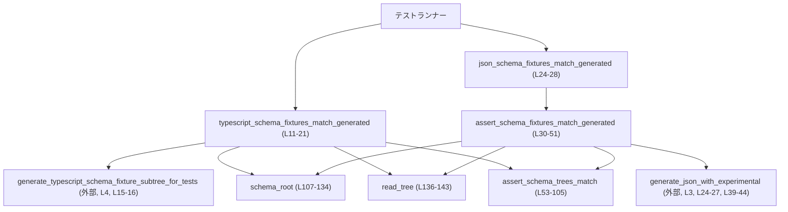
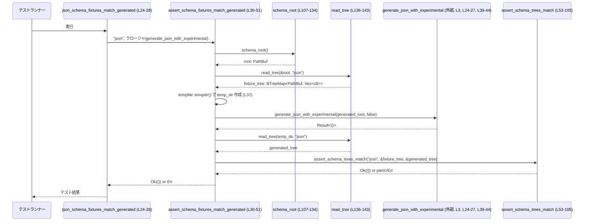

# app-server-protocol/tests/schema_fixtures.rs コード解説

## 0. ざっくり一言

ローカルにベンダリングされた JSON / TypeScript スキーマ「フィクスチャ」が、現在のスキーマ生成ロジックから得られる最新の出力と一致しているかを検証するテストモジュールです（`schema_fixtures.rs:L11-28, L30-51, L53-105`）。

---

## 1. このモジュールの役割

### 1.1 概要

- このモジュールは、**スキーマ生成コードと、リポジトリ内にコミットされているスキーマファイル群が乖離していないこと**をテストで保証するために存在します（`schema_fixtures.rs:L11-28, L30-51`）。
- TypeScript スキーマはメモリ上で直接生成されたツリーと比較し（`schema_fixtures.rs:L11-21`）、JSON スキーマは一時ディレクトリに生成されたファイル群と比較します（`schema_fixtures.rs:L24-28, L30-51`）。
- 比較は、ファイル集合（パスの集合）と各ファイル内容の両方について行い、不一致があれば unified diff を含むメッセージ付きでテストを失敗させます（`schema_fixtures.rs:L53-105`）。

### 1.2 アーキテクチャ内での位置づけ

このモジュールは **テストコード** であり、プロダクションコードの生成関数を呼び出して検証を行います。

主な依存関係:

- `codex_app_server_protocol` クレート  
  - `generate_json_with_experimental`（JSON スキーマ生成; 定義はこのチャンクには現れません。`schema_fixtures.rs:L3, L24-27, L39-44`）
  - `generate_typescript_schema_fixture_subtree_for_tests`（TS スキーマ生成; 定義はこのチャンクには現れません。`schema_fixtures.rs:L4, L15-16`）
  - `read_schema_fixture_subtree`（既存フィクスチャツリーの読み取り; 定義はこのチャンクには現れません。`schema_fixtures.rs:L5, L136-142`）
- `codex_utils_cargo_bin::find_resource!` マクロで、ビルド成果物に同梱されたスキーマファイルのパスを解決します（`schema_fixtures.rs:L110-111, L120-121`）。
- ファイル集合は `BTreeMap<PathBuf, Vec<u8>>` で表現されます（`schema_fixtures.rs:L55-56, L136-142`）。

依存関係の概要を Mermaid 図で示します。



### 1.3 設計上のポイント

- **テストはすべて `anyhow::Result<()>` を返すスタイル**  
  - `#[test]` 関数が `Result<()>` を返すことで、`?` によるエラー伝播が使いやすくなっています（`schema_fixtures.rs:L11-12, L23-24`）。
- **スキーマフォーマットごとの差異を「ラベル」で抽象化**  
  - JSON / TypeScript のような形式の違いは `label: &str` や `&'static str` で表現し、共通処理は `assert_schema_fixtures_match_generated` / `assert_schema_trees_match` にまとめています（`schema_fixtures.rs:L30-35, L53-56, L136-140`）。
- **ファイル集合の比較を 2 段階で実施**  
  1. ファイルパス集合の一致確認（`BTreeMap` のキーを `String` に変換して比較）（`schema_fixtures.rs:L58-65, L67-79`）。
  2. パス集合が一致する場合のみ、各ファイル内容を文字列として diff する（`schema_fixtures.rs:L81-101`）。
- **わかりやすい失敗メッセージを重視**  
  - unified diff を `similar::TextDiff` で生成し、`panic!` メッセージに含めています（`schema_fixtures.rs:L70-73, L91-96, L75-78, L97-101`）。
  - 「`just write-app-server-schema` を実行せよ」という具体的な対処法もメッセージに含まれています（`schema_fixtures.rs:L75-78, L97-100`）。
- **スキーマルートの一貫性チェック**  
  - TypeScript と JSON のスキーマが同一のルートディレクトリ配下にあることを `anyhow::ensure!` で検証します（`schema_fixtures.rs:L107-134`）。

---

## 2. 主要な機能一覧

- TypeScript スキーマフィクスチャと生成結果の一致テスト  
  （`typescript_schema_fixtures_match_generated`：`schema_fixtures.rs:L11-21`）
- JSON スキーマフィクスチャと生成結果の一致テスト  
  （`json_schema_fixtures_match_generated`：`schema_fixtures.rs:L23-28`）
- 任意ラベル（フォーマット）のスキーマフィクスチャ検証共通処理  
  （`assert_schema_fixtures_match_generated`：`schema_fixtures.rs:L30-51`）
- メモリ上の 2 つのスキーマファイルツリー（`BTreeMap<PathBuf, Vec<u8>>`）の厳密比較  
  （`assert_schema_trees_match`：`schema_fixtures.rs:L53-105`）
- TypeScript / JSON 両形式のスキーマルートディレクトリの解決と整合性チェック  
  （`schema_root`：`schema_fixtures.rs:L107-134`）
- 指定ルート配下からのスキーマフィクスチャツリー読み取りヘルパー  
  （`read_tree`：`schema_fixtures.rs:L136-143`）

### 2.1 コンポーネントインベントリー（関数・外部依存）

| 名前 | 種別 | 役割 / 概要 | 定義 / 使用位置 |
|------|------|-------------|-----------------|
| `typescript_schema_fixtures_match_generated` | テスト関数 | TypeScript スキーマフィクスチャと生成結果の一致を確認するトップレベルテスト | `schema_fixtures.rs:L11-21` |
| `json_schema_fixtures_match_generated` | テスト関数 | JSON スキーマフィクスチャと生成結果の一致を確認するトップレベルテスト | `schema_fixtures.rs:L23-28` |
| `assert_schema_fixtures_match_generated` | ローカル関数 | 任意ラベルのスキーマを「既存フィクスチャ vs 一時ディレクトリへの生成結果」で比較する共通処理 | `schema_fixtures.rs:L30-51` |
| `assert_schema_trees_match` | ローカル関数 | 2 つの `BTreeMap<PathBuf, Vec<u8>>` を比較し、不一致があれば diff 付きで panic する | `schema_fixtures.rs:L53-105` |
| `schema_root` | ローカル関数 | TypeScript / JSON スキーマからスキーマルートディレクトリを解決し、一貫性を検証する | `schema_fixtures.rs:L107-134` |
| `read_tree` | ローカル関数 | `read_schema_fixture_subtree` にエラーメッセージを付与したラッパー | `schema_fixtures.rs:L136-143` |
| `generate_json_with_experimental` | 外部関数（別クレート） | JSON スキーマフィクスチャを指定ディレクトリに生成する関数と推測されますが、定義はこのチャンクには現れません | インポート: `schema_fixtures.rs:L3` / 呼出し: `L24-27, L39-44` |
| `generate_typescript_schema_fixture_subtree_for_tests` | 外部関数（別クレート） | TypeScript スキーマフィクスチャの BTreeMap を生成する関数と推測されますが、定義はこのチャンクには現れません | インポート: `schema_fixtures.rs:L4` / 呼出し: `L15-16` |
| `read_schema_fixture_subtree` | 外部関数（別クレート） | 既存スキーマフィクスチャツリーを読み取る関数と推測されますが、定義はこのチャンクには現れません | インポート: `schema_fixtures.rs:L5` / 呼出し: `L136-142` |
| `codex_utils_cargo_bin::find_resource!` | 外部マクロ | ビルド成果物に同梱されたファイルのパスを解決する。実装はこのチャンクには現れません | 使用: `schema_fixtures.rs:L110-111, L120-121` |

---

## 3. 公開 API と詳細解説

### 3.1 型一覧（構造体・列挙体など）

このファイル内で **新しく定義されている構造体・列挙体はありません**。

利用している主な型は以下の通りです。

| 名前 | 種別 | 役割 / 用途 | 定義位置 |
|------|------|-------------|----------|
| `BTreeMap<PathBuf, Vec<u8>>` | 標準ライブラリのマップ型 | スキーマファイルツリーを「パス → ファイル内容（バイト列）」の形で表現する | 使用: `schema_fixtures.rs:L55-56, L136-142` |
| `Path`, `PathBuf` | 標準ライブラリのパス型 | スキーマルートディレクトリやスキーマファイルのパスを表現する | 使用: `schema_fixtures.rs:L8-9, L32, L38-39, L55-56, L107-116, L122-125, L136-140` |
| `Result<T>` (`anyhow::Result`) | エラー伝播用の戻り値型 | テストおよびヘルパー関数でエラーを `?` で伝播するために使用 | 使用: `schema_fixtures.rs:L2, L11-12, L23-24, L30-33, L53-57, L107, L136` |

### 3.2 関数詳細

#### `typescript_schema_fixtures_match_generated() -> Result<()>`

**概要**

- TypeScript スキーマフィクスチャ（ディスク上のファイル群）と、`generate_typescript_schema_fixture_subtree_for_tests` が返すメモリ上の生成結果を比較するテスト関数です（`schema_fixtures.rs:L11-21`）。

**引数**

- なし（テストランナーから直接呼ばれます）。

**戻り値**

- `Result<()>` (`anyhow::Result<()>`)  
  - エラーがなければ `Ok(())` を返し、テストは成功します（`schema_fixtures.rs:L20`）。
  - 途中で `?` によるエラーが発生した場合は `Err(anyhow::Error)` が返され、テストは失敗扱いになります（`schema_fixtures.rs:L13-16, L18`）。

**内部処理の流れ**

1. `schema_root()` を呼び出してスキーマルートディレクトリを取得します（`schema_fixtures.rs:L13` → `L107-134`）。
2. そのルートと `"typescript"` というラベルから、既存の TypeScript スキーマフィクスチャツリー（`BTreeMap<PathBuf, Vec<u8>>`）を読み取ります（`schema_fixtures.rs:L14, L136-143`）。
3. `generate_typescript_schema_fixture_subtree_for_tests()` を呼び出して、メモリ上に生成された TypeScript スキーマツリーを取得します（`schema_fixtures.rs:L15-16`）。
   - エラー時には `"generate in-memory typescript schema fixtures"` というコンテキストを付与します（`schema_fixtures.rs:L16`）。
4. `assert_schema_trees_match("typescript", &fixture_tree, &generated_tree)` で 2 つのツリーを比較し、不一致があれば panic または Err を発生させます（`schema_fixtures.rs:L18, L53-105`）。
5. すべて成功した場合は `Ok(())` を返します（`schema_fixtures.rs:L20`）。

**Examples（使用例）**

他のテストから同様のパターンで再利用する場合のイメージです。

```rust
// 別のテストから TypeScript スキーマ整合性検証を再利用する例
#[test]
fn my_typescript_schema_still_matches() -> anyhow::Result<()> {
    // 既存テスト関数をそのまま呼び出して OK / Err を利用する
    crate::schema_fixtures::typescript_schema_fixtures_match_generated()?;
    Ok(())
}
```

※ 実際のモジュールパスはプロジェクト構成によります。このチャンクからは `schema_fixtures.rs` のモジュールパスは分かりません。

**Errors / Panics**

- **Errors**
  - `schema_root()` が TypeScript / JSON のスキーマルート整合性チェックで失敗した場合（`anyhow::ensure!`）（`schema_fixtures.rs:L126-131`）。
  - `read_tree()` 経由で `read_schema_fixture_subtree` が失敗した場合（`schema_fixtures.rs:L14, L136-142`）。
  - `generate_typescript_schema_fixture_subtree_for_tests()` が失敗した場合。エラーメッセージには `"generate in-memory typescript schema fixtures"` が付与されます（`schema_fixtures.rs:L15-16`）。
  - `assert_schema_trees_match()` 内で `generated_tree` に対応するキーが存在せず `anyhow::anyhow!` が `Err` を返した場合（`schema_fixtures.rs:L83-85`）。
- **Panics**
  - ファイル集合（パスの集合）が一致しない場合に diff 付きメッセージで `panic!` します（`schema_fixtures.rs:L67-79`）。
  - ファイル集合は一致するが、ファイル内容が一致しない場合も diff 付きで `panic!` します（`schema_fixtures.rs:L81-101`）。

**Edge cases（エッジケース）**

- スキーマファイルが 1 つも存在しない場合  
  - `read_schema_fixture_subtree` の挙動に依存しますが、このチャンクでは不明です（`schema_fixtures.rs:L5, L136-142`）。
- TypeScript と JSON のスキーマルートディレクトリが異なる場合  
  - `schema_root()` 内の `anyhow::ensure!` により `Err` が返され、テストが失敗します（`schema_fixtures.rs:L126-131`）。
- `generate_typescript_schema_fixture_subtree_for_tests()` が一部のファイルを生成しなかった場合  
  - ファイル集合比較で不一致となり、panic します（`schema_fixtures.rs:L67-79`）。

**使用上の注意点**

- テスト専用の関数であり、ライブラリコードから呼ぶと panic を含む挙動（`assert_schema_trees_match` 内）が不都合な場合があります（`schema_fixtures.rs:L75-78, L97-101`）。
- 失敗時メッセージには `just write-app-server-schema` を実行してフィクスチャを更新するよう案内が含まれていますが、このターゲットの定義はこのチャンクには現れません（`schema_fixtures.rs:L75-78, L97-100`）。
- 並行性に関する特別な処理（共有状態やロック等）は行っておらず、通常の単一スレッドのテストとして振る舞います。

---

#### `json_schema_fixtures_match_generated() -> Result<()>`

**概要**

- JSON スキーマフィクスチャと `generate_json_with_experimental` が出力する JSON スキーマファイル群を比較するテスト関数です（`schema_fixtures.rs:L23-28`）。

**引数**

- なし。

**戻り値**

- `Result<()>` (`anyhow::Result<()>`)  
  - 内部で `assert_schema_fixtures_match_generated("json", ...)` を呼び、その結果をそのまま返します（`schema_fixtures.rs:L24-27`）。

**内部処理の流れ**

1. `assert_schema_fixtures_match_generated` に `"json"` というラベルと、`generate_json_with_experimental` を呼び出すクロージャを渡します（`schema_fixtures.rs:L24-27, L30-33`）。
2. クロージャ内で `generate_json_with_experimental(output_dir, false)` を呼び出し、指定ディレクトリに JSON スキーマを生成します（`schema_fixtures.rs:L24-27`）。
3. 以降の処理（フィクスチャとの比較等）は `assert_schema_fixtures_match_generated` に委譲されます（`schema_fixtures.rs:L30-51`）。

**Examples（使用例）**

```rust
#[test]
fn json_schema_fixtures_match_generated_with_current_generator() -> anyhow::Result<()> {
    // 既存の JSON スキーマフィクスチャと生成結果の整合性を検証
    crate::schema_fixtures::json_schema_fixtures_match_generated()?;
    Ok(())
}
```

**Errors / Panics**

- `assert_schema_fixtures_match_generated` 内で生じる全ての `Err` / `panic!` がそのままテスト結果になります（`schema_fixtures.rs:L30-51, L53-105`）。
- JSON 生成関数 `generate_json_with_experimental` が失敗した場合、そのエラーに `"generate {label} schema fixtures into ..."` という文脈が付与されます（`schema_fixtures.rs:L39-44`）。

**Edge cases**

- `experimental_api` フラグは常に `false` 固定で呼び出されています（`schema_fixtures.rs:L26`）。将来的に実験的 API を含むスキーマも検証したい場合は、別テストやパラメータ追加が必要になります。

**使用上の注意点**

- この関数もテスト専用であり、panic による失敗を前提としています。
- `generate_json_with_experimental` の第 2 引数の意味（実験的 API の有効/無効）は関数名とコメントから推測されますが、定義はこのチャンクには現れません（`schema_fixtures.rs:L3, L26`）。

---

#### `assert_schema_fixtures_match_generated(label: &'static str, generate: impl FnOnce(&Path) -> Result<()>) -> Result<()>`

**概要**

- 任意のスキーマ形式（`label`）について、**既存フィクスチャ（ベンダリングファイル）** と **実際に生成したスキーマ** を比較するための共通処理です（`schema_fixtures.rs:L30-51`）。
- JSON についてはこの関数が利用されており（`schema_fixtures.rs:L24-27`）、同様に他形式にも転用可能です。

**引数**

| 引数名 | 型 | 説明 |
|--------|----|------|
| `label` | `&'static str` | スキーマ形式を表すラベル。`"json"` や `"typescript"` などのディレクトリ名と一致することが想定されます（`schema_fixtures.rs:L30-32, L35, L38-43, L46, L48`）。 |
| `generate` | `impl FnOnce(&Path) -> Result<()>` | 指定ディレクトリにスキーマフィクスチャを生成する関数。実装は呼び出し元が提供します（`schema_fixtures.rs:L31-32, L39-44`）。 |

**戻り値**

- `Result<()>`  
  - 生成・読み取り・比較の全工程が成功すれば `Ok(())`（`schema_fixtures.rs:L50`）。
  - どこかでエラーや panic が発生した場合はテスト失敗となります。

**内部処理の流れ**

1. `schema_root()` でスキーマルートを解決し（`schema_fixtures.rs:L34, L107-134`）、そこから `label` 配下の既存フィクスチャツリーを `read_tree(&schema_root, label)` で読み取ります（`schema_fixtures.rs:L35, L136-143`）。
2. `tempfile::tempdir()` で一時ディレクトリを作成し、エラー時には `"create temp dir"` という文脈を追加します（`schema_fixtures.rs:L37`）。
3. 一時ディレクトリ配下に `label` 名のサブディレクトリパスを組み立て、`generate(&generated_root)` を実行してスキーマを生成します（`schema_fixtures.rs:L38-44`）。
4. `generate` 実行時のエラーには `"generate {label} schema fixtures into ..."` というメッセージを付与します（`schema_fixtures.rs:L39-44`）。
5. 生成されたスキーマツリーを `read_tree(temp_dir.path(), label)` で読み取り（`schema_fixtures.rs:L46, L136-143`）、既存フィクスチャツリーと `assert_schema_trees_match(label, &fixture_tree, &generated_tree)` で比較します（`schema_fixtures.rs:L48, L53-105`）。
6. 問題がなければ `Ok(())` を返します（`schema_fixtures.rs:L50`）。

**Examples（使用例）**

新しい形式（例えば `"yaml"`）のスキーマ生成を検証したい場合の利用イメージです。

```rust
fn generate_yaml_schema(output_dir: &std::path::Path) -> anyhow::Result<()> {
    // YAML スキーマを output_dir 配下に生成する関数（実装はこのチャンクには現れません）
    // ...
    Ok(())
}

#[test]
fn yaml_schema_fixtures_match_generated() -> anyhow::Result<()> {
    // label "yaml" に対応するフィクスチャと生成結果を比較する
    assert_schema_fixtures_match_generated("yaml", |output_dir| {
        generate_yaml_schema(output_dir)
    })
}
```

※ 上記はパターンを示す例であり、`generate_yaml_schema` の具体的な実装は存在しません。

**Errors / Panics**

- **Errors**
  - `schema_root()` の失敗（ルート解決や整合性チェック）（`schema_fixtures.rs:L34, L107-134`）。
  - `read_tree()` → `read_schema_fixture_subtree` の読み取り失敗（`schema_fixtures.rs:L35, L46, L136-143`）。
  - `tempfile::tempdir()` の失敗（`schema_fixtures.rs:L37`）。
  - `generate` クロージャ内のエラー（コンテキスト `"generate {label} schema fixtures into ..."` 付き）（`schema_fixtures.rs:L39-44`）。
  - `assert_schema_trees_match` 内での `anyhow::anyhow!` による `Err`（`schema_fixtures.rs:L83-85`）。
- **Panics**
  - `assert_schema_trees_match` でファイル集合や内容が一致しないときに発生します（`schema_fixtures.rs:L67-79, L81-101`）。

**Edge cases**

- `generate` が `label` と異なるディレクトリ階層にファイルを出力した場合、`read_tree(temp_dir.path(), label)` で読み取れず、空ツリーやエラーになる可能性があります（`schema_fixtures.rs:L46`）。
- 一時ディレクトリの作成に失敗した場合（権限、ディスクフルなど）、`"create temp dir"` 付きのエラーになります（`schema_fixtures.rs:L37`）。

**使用上の注意点**

- `generate` は **`output_dir` 以下にフィクスチャを生成する** という契約を守る必要があります。この点はコードから推測されますが、明示的なコメントはこのチャンクにはありません（`schema_fixtures.rs:L38-44, L46`）。
- この関数もテスト前提の設計であり、不一致時には panic を利用する `assert_schema_trees_match` を呼び出します。ライブラリコード等での再利用時には挙動に注意が必要です。

---

#### `assert_schema_trees_match(label: &str, fixture_tree: &BTreeMap<PathBuf, Vec<u8>>, generated_tree: &BTreeMap<PathBuf, Vec<u8>>) -> Result<()>`

**概要**

- 2 つのスキーマツリー（`fixture_tree` と `generated_tree`）が完全に一致するか検査し、不一致があれば unified diff を含む `panic!` を発生させる検証関数です（`schema_fixtures.rs:L53-105`）。

**引数**

| 引数名 | 型 | 説明 |
|--------|----|------|
| `label` | `&str` | スキーマ形式を示すラベル。エラーメッセージに含められます（`schema_fixtures.rs:L53-54, L75-78, L97-100`）。 |
| `fixture_tree` | `&BTreeMap<PathBuf, Vec<u8>>` | 既存フィクスチャのファイルツリー。キーはパス、値はファイル内容です（`schema_fixtures.rs:L55, L58-61, L82`）。 |
| `generated_tree` | `&BTreeMap<PathBuf, Vec<u8>>` | 生成したスキーマのファイルツリー。比較対象となります（`schema_fixtures.rs:L56, L62-65, L83-85`）。 |

**戻り値**

- `Result<()>`  
  - 不一致時のほとんどのケースは `panic!` で表現されるため、正常終了時のみ `Ok(())` が返ります（`schema_fixtures.rs:L104`）。
  - 例外的に「`generated_tree` にパスが存在しない」ケースでは `Err(anyhow::Error)` が返されます（`schema_fixtures.rs:L83-85`）。

**内部処理の流れ**

1. `fixture_tree.keys()` と `generated_tree.keys()` をそれぞれ `String` に変換し、ベクタとして収集します（`schema_fixtures.rs:L58-65`）。
2. 2 つのパスベクタを比較し、異なる場合は unified diff を生成して panic します（`schema_fixtures.rs:L67-79`）。
3. パス集合が一致している場合、`fixture_tree` をイテレートし、各 `path` に対して `generated_tree.get(path)` で対応する内容 `actual` を取得します（`schema_fixtures.rs:L82-85`）。
   - `generated_tree` にキーが無ければ `anyhow::anyhow!` から `Err` を返します（`schema_fixtures.rs:L83-85`）。
4. `expected`（フィクスチャ側）と `actual`（生成側）のバイト列を比較し、一致すれば次のファイルへ進みます（`schema_fixtures.rs:L87-88`）。
5. 一致しない場合は `String::from_utf8_lossy` で文字列に変換し、`TextDiff::from_lines` で unified diff を作成して panic します（`schema_fixtures.rs:L91-101`）。
6. すべてのファイルで一致が確認された場合に `Ok(())` を返します（`schema_fixtures.rs:L104`）。

**Examples（使用例）**

別のテストコードから、任意の 2 つのスキーマツリーを比較する例です。

```rust
use std::collections::BTreeMap;
use std::path::PathBuf;

// fixture_tree と generated_tree は、どこかで構築された BTreeMap とする
fn compare_two_trees(
    fixture_tree: &BTreeMap<PathBuf, Vec<u8>>,
    generated_tree: &BTreeMap<PathBuf, Vec<u8>>,
) -> anyhow::Result<()> {
    // "custom" ラベルで diff メッセージを区別
    crate::schema_fixtures::assert_schema_trees_match("custom", fixture_tree, generated_tree)
}
```

**Errors / Panics**

- **Errors**
  - `generated_tree.get(path)` が `None` の場合、`anyhow::anyhow!("missing generated file: {}", path.display())` により `Err` が返ります（`schema_fixtures.rs:L83-85`）。
- **Panics**
  - ファイルパス集合が異なる場合  
    - unified diff に「`fixture` vs `generated`」としてパス一覧の差分が表示されます（`schema_fixtures.rs:L67-79`）。
  - ファイル内容が異なる場合  
    - 該当ファイルごとに unified diff が表示されます（`schema_fixtures.rs:L91-101`）。

**Edge cases**

- バイナリファイルや非 UTF-8 テキスト  
  - `String::from_utf8_lossy` を使用しているため、無効な UTF-8 バイト列は置換文字に変換されます（`schema_fixtures.rs:L91-92`）。その結果、diff は実際のバイト列と完全には一致しない可能性があります。
- ファイル集合が一致していても、`generated_tree` 側に一部キーが欠けている場合  
  - `BTreeMap` のキー集合は一致している前提なので、この状況は通常発生しませんが、もし `fixture_tree` / `generated_tree` が別の手段で構築された場合は `Err` になります（`schema_fixtures.rs:L58-65, L83-85`）。

**使用上の注意点**

- 不一致時に panic を用いるため、テストなどの「プロセス全体のクラッシュが許容される」文脈での使用が前提と考えられます。
- 一致判定は「全ファイルパスと内容が完全一致」かどうかであり、順序や余分なファイルも検出されます。
- diff 生成はファイル数・ファイルサイズに比例してコストがかかるため、大量の巨大スキーマではテスト実行時間に影響する可能性があります。

---

#### `schema_root() -> Result<PathBuf>`

**概要**

- TypeScript スキーマ (`schema/typescript/index.ts`) と JSON スキーマ (`schema/json/codex_app_server_protocol.schemas.json`) の両方からスキーマルートディレクトリを導き出し、それらが同じディレクトリであることを確認して返す関数です（`schema_fixtures.rs:L107-134`）。

**引数**

- なし。

**戻り値**

- `Result<PathBuf>`  
  - スキーマルートディレクトリのパスを含む `PathBuf` を `Ok` で返します（`schema_fixtures.rs:L113-116, L133`）。
  - いずれかのリソース解決や `parent()` 取得、ルート整合性チェックに失敗すると `Err(anyhow::Error)` になります（`schema_fixtures.rs:L110-115, L120-125, L126-131`）。

**内部処理の流れ**

1. `codex_utils_cargo_bin::find_resource!("schema/typescript/index.ts")` で TypeScript スキーマの index ファイルパスを解決します（`schema_fixtures.rs:L110-111`）。
2. その `parent()`（`schema/typescript`）と、さらにその `parent()`（`schema`）を辿ってスキーマルートを求めます（`schema_fixtures.rs:L112-116`）。
3. 同様に、`codex_utils_cargo_bin::find_resource!("schema/json/codex_app_server_protocol.schemas.json")` で JSON スキーマバンドルのパスを解決します（`schema_fixtures.rs:L120-121`）。
4. `parent()`（`schema/json`）とさらに `parent()`（`schema`）を辿って JSON 側のスキーマルートを求めます（`schema_fixtures.rs:L122-125`）。
5. `anyhow::ensure!(schema_root == json_root, ...)` で両者が一致することを確認し、異なればエラーとします（`schema_fixtures.rs:L126-131`）。
6. 一致していれば `Ok(schema_root)` を返します（`schema_fixtures.rs:L133`）。

**Examples（使用例）**

```rust
fn load_some_schema_file() -> anyhow::Result<std::path::PathBuf> {
    // スキーマルートディレクトリを得る
    let root = crate::schema_fixtures::schema_root()?;
    // 例: ルート配下の特定ファイルへのパスを組み立てる
    Ok(root.join("json").join("codex_app_server_protocol.schemas.json"))
}
```

**Errors / Panics**

- **Errors**
  - Bazel runfiles 経由で TypeScript index や JSON バンドルが見つからない場合（`schema_fixtures.rs:L110-111, L120-121`）。
  - `parent()` / `parent().parent()` に失敗した場合（`schema_fixtures.rs:L112-115, L122-125`）。
  - TypeScript 側と JSON 側のルートディレクトリが異なる場合（`schema_fixtures.rs:L126-131`）。
- **Panics**
  - この関数内では `panic!` は使用されていません。

**Edge cases**

- Bazel の manifest-only モードなどでディレクトリ解決が不安定な環境を考慮し、「ファイルから親ディレクトリを辿る」戦略が採用されています（コメント, `schema_fixtures.rs:L108-109`）。
- どちらか一方の形式だけが存在する構成は想定しておらず、その場合はエラーになります。

**使用上の注意点**

- `codex_utils_cargo_bin::find_resource!` の実装はこのチャンクには現れず、どのような検索パスを使うかは依存先に依存します。
- スキーマディレクトリ構成を変更した場合（パス変更・リネームなど）、この関数とそれを利用するテストの更新が必要です。

---

#### `read_tree(root: &Path, label: &str) -> Result<BTreeMap<PathBuf, Vec<u8>>>`

**概要**

- `read_schema_fixture_subtree(root, label)` を呼び出し、エラーに `"read {label} schema fixture subtree from {root}"` という文脈を追加する軽量なラッパー関数です（`schema_fixtures.rs:L136-143`）。

**引数**

| 引数名 | 型 | 説明 |
|--------|----|------|
| `root` | `&Path` | スキーマルートディレクトリ等の基準となるパス（`schema_fixtures.rs:L136, L139-140`）。 |
| `label` | `&str` | スキーマ形式を表すラベル。`root` 配下のサブツリー名と一致していることが想定されます（`schema_fixtures.rs:L136-140`）。 |

**戻り値**

- `Result<BTreeMap<PathBuf, Vec<u8>>>`  
  - 指定ルートとラベルに対応するフィクスチャツリーを `Ok` で返します（`schema_fixtures.rs:L136-143`）。
  - 読み取りに失敗した場合はエラーに上記コンテキスト文字列が付与されます。

**内部処理の流れ**

1. `read_schema_fixture_subtree(root, label)` を呼び出します（`schema_fixtures.rs:L137`）。
2. `.with_context(|| format!("read {label} schema fixture subtree from {}", root.display()))` で、エラー時に補足メッセージを付けます（`schema_fixtures.rs:L137-141`）。
3. 結果をそのまま返します（`schema_fixtures.rs:L136-143`）。

**Examples（使用例）**

```rust
fn load_json_fixture_tree() -> anyhow::Result<std::collections::BTreeMap<std::path::PathBuf, Vec<u8>>> {
    let root = crate::schema_fixtures::schema_root()?;
    // "json" サブツリーを読み取る
    crate::schema_fixtures::read_tree(&root, "json")
}
```

**Errors / Panics**

- **Errors**
  - `read_schema_fixture_subtree` の失敗。例えば、指定パスが存在しない、権限がないなどの場合が想定されますが、詳細はこのチャンクには現れません（`schema_fixtures.rs:L5, L137`）。
- **Panics**
  - この関数内では `panic!` は使用されていません。

**Edge cases**

- `label` と実際のディレクトリ名が一致していない場合、エラーになる可能性があります（`schema_fixtures.rs:L136-140`）。

**使用上の注意点**

- ルートとラベルの組み合わせがスキーマディレクトリ構成と一致していることが前提です。
- エラーメッセージには `root.display()` の結果が含まれるため、パスが長い場合メッセージも長くなります。

---

### 3.3 その他の関数

- このファイル内の関数はすべて上記で詳細解説済みであり、「単純なラッパー関数」のみに分類できるものはありません（`read_tree` はラッパーですが重要な API として既に解説しています）。

---

## 4. データフロー

ここでは、JSON スキーマフィクスチャ検証の典型的なデータフローを示します（`schema_fixtures.rs:L23-28, L30-51, L53-105, L107-134, L136-143`）。

1. テストランナーが `json_schema_fixtures_match_generated` を起動します（`schema_fixtures.rs:L23-24`）。
2. `assert_schema_fixtures_match_generated("json", generate_json_with_experimental)` が呼ばれます（`schema_fixtures.rs:L24-27, L30-33`）。
3. `schema_root()` がスキーマルートディレクトリ `root` を返します（`schema_fixtures.rs:L34, L107-134`）。
4. `read_tree(&root, "json")` が既存 JSON フィクスチャツリー `fixture_tree` を構築します（`schema_fixtures.rs:L35, L136-143`）。
5. 一時ディレクトリ `temp_dir` が作成され、その配下の `generated_root = temp_dir/label` が生成先となります（`schema_fixtures.rs:L37-38`）。
6. `generate_json_with_experimental(generated_root, false)` が JSON スキーマを生成します（`schema_fixtures.rs:L24-27, L39-44`）。
7. `read_tree(temp_dir.path(), "json")` が生成結果ツリー `generated_tree` を構築します（`schema_fixtures.rs:L46, L136-143`）。
8. `assert_schema_trees_match("json", &fixture_tree, &generated_tree)` が 2 つのツリーを比較します（`schema_fixtures.rs:L48, L53-105`）。

Mermaid のシーケンス図で表すと次のようになります。



---

## 5. 使い方（How to Use）

### 5.1 基本的な使用方法

このモジュールはテスト専用ですが、「新しいスキーマ形式のフィクスチャ検証」を追加する際の利用パターンが想定されます。

```rust
use anyhow::Result;
use std::path::Path;

// 新しいスキーマ形式 "yaml" の生成関数（イメージ）
fn generate_yaml_schema(output_dir: &Path) -> Result<()> {
    // output_dir 配下に YAML スキーマを生成する
    // ...
    Ok(())
}

#[test]
fn yaml_schema_fixtures_match_generated() -> Result<()> {
    // 既存フィクスチャと生成結果の整合性を検証
    crate::schema_fixtures::assert_schema_fixtures_match_generated("yaml", |output_dir| {
        generate_yaml_schema(output_dir)
    })
}
```

- 上記のように、`label` と `generate` 関数を差し替えることで、任意のスキーマ形式に対して同じ検証ロジックを再利用できます（`schema_fixtures.rs:L30-33, L39-44`）。

### 5.2 よくある使用パターン

1. **メモリ上のツリー同士の比較（TypeScript のようなケース）**  
   - 生成関数が `BTreeMap<PathBuf, Vec<u8>>` を直接返す場合、`assert_schema_trees_match` を直接利用します（`schema_fixtures.rs:L11-21, L53-105`）。

   ```rust
   #[test]
   fn my_ts_tree_matches() -> anyhow::Result<()> {
       let root = crate::schema_fixtures::schema_root()?;
       let fixture_tree = crate::schema_fixtures::read_tree(&root, "typescript")?;
       let generated_tree = codex_app_server_protocol::generate_typescript_schema_fixture_subtree_for_tests()?;
       crate::schema_fixtures::assert_schema_trees_match("typescript", &fixture_tree, &generated_tree)?;
       Ok(())
   }
   ```

2. **ディスクへの生成 → 読み取り → 比較（JSON のようなケース）**  
   - 生成関数が「ディレクトリを受け取り、その中にファイルを書き出す」スタイルの場合は、`assert_schema_fixtures_match_generated` を利用します（`schema_fixtures.rs:L24-27, L30-51`）。

### 5.3 よくある間違い

```rust
// 間違い例: label とディレクトリ構成が一致していない
#[test]
fn wrong_label_causes_error() -> anyhow::Result<()> {
    // 実際のディレクトリ構成が schema/xml/... なのに "yaml" としている
    crate::schema_fixtures::assert_schema_fixtures_match_generated("yaml", |output_dir| {
        generate_xml_schema(output_dir) // 定義はこのチャンクには現れない仮の関数
    })
}

// 正しい例: label とディレクトリ構成を揃える
#[test]
fn xml_schema_fixtures_match_generated() -> anyhow::Result<()> {
    crate::schema_fixtures::assert_schema_fixtures_match_generated("xml", |output_dir| {
        generate_xml_schema(output_dir)
    })
}
```

- `read_tree(root, label)` は `label` 名をディレクトリ名として使うことが想定されるため（`schema_fixtures.rs:L35, L46, L136-140`）、ラベルと実際のディレクトリ構成が食い違うとエラーや不正な比較を招く可能性があります。

### 5.4 使用上の注意点（まとめ）

- **panic と Err の両方を使った失敗表現**  
  - `assert_schema_trees_match` は不一致時に panic する設計であり、`Result` でのエラー表現と混在しています（`schema_fixtures.rs:L67-79, L81-101, L83-85, L104`）。  
    ライブラリから再利用する場合は、この点を理解した上で使う必要があります。
- **入出力のスケール**  
  - スキーマファイル数やサイズが増えると、`BTreeMap` の構築や diff 生成コストも増加します（`schema_fixtures.rs:L58-65, L91-96`）。テスト時間の増大が気になる場合は、必要に応じて範囲を限定するなどの調整が必要です。
- **並行性**  
  - このモジュールには共有可変状態やマルチスレッド処理は登場せず、スレッド安全性に関する特別な配慮は不要です。

---

## 6. 変更の仕方（How to Modify）

### 6.1 新しい機能を追加する場合

例: 新しいスキーマ形式（例: `"yaml"`）のフィクスチャ検証を追加する場合。

1. **生成関数を用意する**
   - 形式 `"yaml"` に対応するスキーマ生成関数を用意し、`impl FnOnce(&Path) -> Result<()>` のシグネチャに合わせます（`schema_fixtures.rs:L31-32`）。
2. **テスト関数を追加する**
   - `json_schema_fixtures_match_generated` と同様に、テスト関数から `assert_schema_fixtures_match_generated("yaml", ...)` を呼び出します（`schema_fixtures.rs:L23-28, L30-51`）。
3. **ディレクトリ構成を整える**
   - `schema_root()` が解決するルート配下に `yaml` 用フィクスチャディレクトリを用意し、`read_tree(root, "yaml")` が期待通り読み取れるようにします（`schema_fixtures.rs:L34-35, L136-140`）。
4. **必要ならルート整合性の検証を拡張**
   - 現状 `schema_root()` は TypeScript と JSON のみを整合性チェックしています（`schema_fixtures.rs:L107-134`）。他形式も同じルートを共有している前提であれば、特別な変更は不要です。

### 6.2 既存の機能を変更する場合

- **比較方法を変更したい場合**
  - ファイル集合の比較ロジックや diff 表示の方法は `assert_schema_trees_match` に集中しています（`schema_fixtures.rs:L53-105`）。ここを変更すると JSON/TS 両方のテストに影響します。
- **ルートディレクトリの構成を変えたい場合**
  - ディレクトリ構成を変える際は、`schema_root()` 内の `find_resource!` 引数と `parent()` の回数を更新する必要があります（`schema_fixtures.rs:L110-116, L120-125`）。
- **エラーメッセージを見直したい場合**
  - `with_context` や `panic!` メッセージを変更することで、デバッグ情報の粒度を調整できます（`schema_fixtures.rs:L16, L37, L39-44, L70-73, L91-96`）。
- **Contracts / Edge Cases を保つための注意**
  - `assert_schema_trees_match` の契約（「完全一致でなければ panic または Err」）を変更すると、他テストの期待に影響する可能性があります。変更時は呼び出し元のテストコードも併せて確認する必要があります。

---

## 7. 関連ファイル

| パス / シンボル | 役割 / 関係 |
|----------------|------------|
| `codex_app_server_protocol::generate_json_with_experimental` | JSON スキーマフィクスチャを生成する関数と推測されます。`schema_fixtures.rs` から JSON テストの生成関数として呼び出されていますが、実装はこのチャンクには現れません（`schema_fixtures.rs:L3, L24-27, L39-44`）。 |
| `codex_app_server_protocol::generate_typescript_schema_fixture_subtree_for_tests` | TypeScript スキーマツリーを生成するテスト用関数と推測されます。`typescript_schema_fixtures_match_generated` から使用されています（`schema_fixtures.rs:L4, L15-16`）。 |
| `codex_app_server_protocol::read_schema_fixture_subtree` | スキーマフィクスチャツリーを読み取る関数。`read_tree` ラッパー経由で使用されています（`schema_fixtures.rs:L5, L136-142`）。 |
| `codex_utils_cargo_bin::find_resource!` | Bazel runfiles から特定のリソースファイルを見つけるマクロ。`schema_root` で TypeScript / JSON スキーマの基準ファイルパスを解決するために使用されています（`schema_fixtures.rs:L110-111, L120-121`）。 |
| `schema/typescript/index.ts` | TypeScript スキーマのエントリーポイントとなるファイル。`schema_root` でスキーマルートを導出するために使用されます（`schema_fixtures.rs:L110-116`）。 |
| `schema/json/codex_app_server_protocol.schemas.json` | JSON スキーマバンドルファイル。`schema_root` でスキーマルートを導出するために使用されます（`schema_fixtures.rs:L120-125`）。 |
| `just write-app-server-schema`（Justfile ターゲット名） | スキーマフィクスチャを更新するためのコマンドとして panic メッセージ中で案内されていますが、その定義はこのチャンクには現れません（`schema_fixtures.rs:L75-78, L97-100`）。 |

このモジュールは、これらの生成・読み取りロジックの「正しさ」を担保するテストとして機能しており、スキーマ関連コードの変更が行われた際に、コミット済みフィクスチャとの不整合を検出する役割を果たします。
