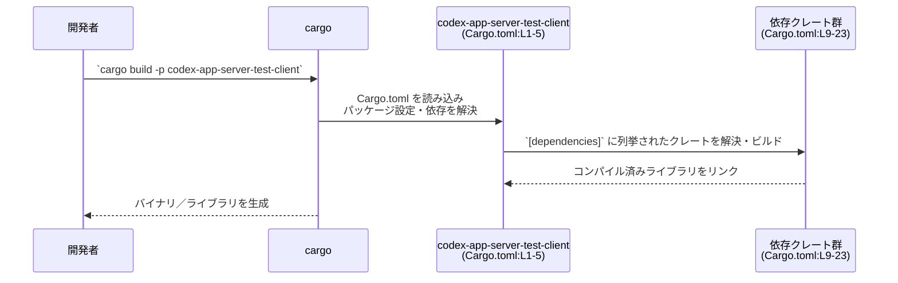

# app-server-test-client/Cargo.toml コード解説

## 0. ざっくり一言

`app-server-test-client/Cargo.toml` は、クレート `codex-app-server-test-client` の **パッケージ情報と依存クレート構成を定義するマニフェスト** です（Cargo.toml:L1-5, L8-23）。  
このファイル自体には Rust の関数・型・ロジックは含まれていません。

---

## 1. このモジュールの役割

### 1.1 概要

- `[package]` セクションでクレート名やバージョン・edition・ライセンスを「ワークスペース共有設定」として定義しています（Cargo.toml:L1-5）。
- `[lints]` セクションにより、リント設定もワークスペース側に一元化されています（Cargo.toml:L6-7）。
- `[dependencies]` セクションでエラー処理、CLI、非同期実行、シリアライズ、トレース、WebSocket などの依存クレートを宣言しています（Cargo.toml:L8-23）。
- これにより、`codex-app-server-test-client` クレートを **ワークスペースのポリシーに従ってビルドするためのメタ情報** を提供します。

このファイルからは、実際の公開 API や具体的な機能内容（どの関数があるかなど）は分かりません。

### 1.2 アーキテクチャ内での位置づけ

この Cargo.toml から分かるのは、「`codex-app-server-test-client` クレートがどのクレートに依存しているか」です。  
依存関係を役割ごとにグループ化した概略図は次のようになります。

```mermaid
graph LR
  A["codex-app-server-test-client<br/>(Cargo.toml:L1-5)"]

  subgraph CLI・ユーティリティ系 (Cargo.toml:L9-10, L15)
    C_anyhow["anyhow"]
    C_clap["clap (features: derive, env)"]
    C_utils["codex-utils-cli"]
  end

  subgraph シリアライズ系 (Cargo.toml:L16-17)
    S_serde["serde (feature: derive)"]
    S_json["serde_json"]
  end

  subgraph 非同期・並行処理系 (Cargo.toml:L18)
    T_tokio["tokio (feature: rt)"]
  end

  subgraph 観測・トレース系 (Cargo.toml:L19-20, L13)
    O_tr["tracing"]
    O_trsub["tracing-subscriber"]
    O_otel["codex-otel"]
  end

  subgraph 通信・プロトコル系 (Cargo.toml:L11, L14, L21-22)
    P_app["codex-app-server-protocol"]
    P_proto["codex-protocol"]
    P_ws["tungstenite"]
    P_url["url"]
  end

  subgraph ID系 (Cargo.toml:L23)
    U_uuid["uuid (feature: v4)"]
  end

  A --> C_anyhow
  A --> C_clap
  A --> C_utils
  A --> S_serde
  A --> S_json
  A --> T_tokio
  A --> O_tr
  A --> O_trsub
  A --> O_otel
  A --> P_app
  A --> P_proto
  A --> P_ws
  A --> P_url
  A --> U_uuid
```

> 図はあくまで **依存クレートの分類** を示すものであり、  
> どのクレートのどの API が呼ばれているか、どのようなデータが流れているかは、このファイルだけからは分かりません。

### 1.3 設計上のポイント

コードではなく設定ファイルですが、次のような方針が読み取れます。

- **ワークスペース一元管理**
  - `version.workspace = true` / `edition.workspace = true` / `license.workspace = true` により、バージョン・edition・ライセンスをワークスペース共通設定に委ねています（Cargo.toml:L3-5）。
  - `[lints]` の設定も `workspace = true` となっており、警告や禁止事項のルールをワークスペースで共通化しています（Cargo.toml:L6-7）。
  - 依存クレートもすべて `workspace = true` で宣言されており、バージョンや一部設定がワークスペース側で集中管理されます（Cargo.toml:L9-23）。

- **採用している技術スタック（推測を含む）**
  - `anyhow` に依存しているため、**エラー処理には動的エラー型 (`anyhow::Error`) による伝播** が使われている可能性があります（Cargo.toml:L9）。
  - `clap`（features: `derive`, `env`）から、**CLI 引数定義を構造体の derive で行い、環境変数でも設定を受け取れる CLI ツール**であることが想定されます（Cargo.toml:L10）。ただし具体的なオプション内容は不明です。
  - `tokio` の `rt` feature が有効なため、**Tokio ベースの非同期実行ランタイム**を利用するコードが含まれている可能性が高いですが、シングルスレッド／マルチスレッドなどの詳細は分かりません（Cargo.toml:L18）。
  - `tracing` / `tracing-subscriber` / `codex-otel` により、**構造化ログ・トレース・OpenTelemetry 連携**といった観測性の仕組みが使われる可能性があります（Cargo.toml:L13, L19-20）。

- **通信プロトコル**
  - `tungstenite` と `url` 依存から、WebSocket 通信や URL パースが行われることが想定されますが、具体的なエンドポイントやプロトコル詳細は `codex-*` クレート側に依存しており、このファイルからは分かりません（Cargo.toml:L21-22）。

---

## 2. 主要な機能一覧

このファイル（Cargo.toml）は **設定のみ** を記述しており、関数・型・メソッドなどの実装は含みません。

- 従って、「このクレートが提供する具体的な公開 API（関数・構造体など）」は、このチャンクからは特定できません。
- クレート名や依存関係から機能を推測することは可能ですが、コードとコメントがないため、ここでは **機能一覧を確定的には列挙しません**。

> 例:  
> クレート名 `codex-app-server-test-client` からは「app-server をテストするクライアントツール」であることが想像されますが、  
> これは命名からの推測であり、このファイルだけでは断定できません。

---

## 3. 公開 API と詳細解説

### 3.1 型・コンポーネント一覧（コンポーネントインベントリー）

このファイル自体には Rust の型定義はありませんが、**クレートと依存コンポーネント**を一覧化します。

| 名前 | 種別 | 役割 / 用途 | 定義位置（根拠） |
|------|------|------------|------------------|
| `codex-app-server-test-client` | パッケージ / クレート | 本ファイルで定義されるクレート。具体的な API や機能は不明。 | Cargo.toml:L1-2 |
| `anyhow` | 依存クレート | 一般的なエラー型 `anyhow::Error` による柔軟なエラー伝播を行うためのクレート。 | Cargo.toml:L9 |
| `clap`（features: `derive`, `env`） | 依存クレート | コマンドライン引数のパースと、構造体へのマッピングを derive で行う CLI フレームワーク。`env` で環境変数読み取りも可能。 | Cargo.toml:L10 |
| `codex-app-server-protocol` | 依存クレート | `codex` 系プロトコル関連クレートと推測されますが、このファイルから具体的な役割は分かりません。 | Cargo.toml:L11 |
| `codex-core` | 依存クレート | `codex` プロジェクトのコア機能を提供するクレートと推測されますが、役割は不明です。 | Cargo.toml:L12 |
| `codex-otel` | 依存クレート | OpenTelemetry 連携など観測性機能を担うクレートと名前からは想定されますが、詳細は不明です。 | Cargo.toml:L13 |
| `codex-protocol` | 依存クレート | `codex` 全体で利用する共通プロトコル定義と推測されますが、詳細は不明です。 | Cargo.toml:L14 |
| `codex-utils-cli` | 依存クレート | CLI 関連のユーティリティを集めたクレートと推測されますが、このファイルからは具体的な API は分かりません。 | Cargo.toml:L15 |
| `serde`（feature: `derive`） | 依存クレート | シリアライズ／デシリアライズのためのライブラリ。`derive` により構造体・列挙体に `Serialize` / `Deserialize` を自動実装可能。 | Cargo.toml:L16 |
| `serde_json` | 依存クレート | JSON 形式のシリアライズ／デシリアライズを行うライブラリ。 | Cargo.toml:L17 |
| `tokio`（feature: `rt`） | 依存クレート | 非同期 I/O ランタイム。`rt` feature により基本的なランタイム機能が有効化される。`macros` 等はこのファイルでは有効化されていません。 | Cargo.toml:L18 |
| `tracing` | 依存クレート | 構造化ログ／トレース発行のためのインストルメンテーションフレームワーク。 | Cargo.toml:L19 |
| `tracing-subscriber` | 依存クレート | `tracing` イベントのフィルタリング・フォーマット・出力先制御を行うサブスクライバ実装。 | Cargo.toml:L20 |
| `tungstenite` | 依存クレート | WebSocket クライアント／サーバー実装。どの機能（TLS 等）を使うかはこのファイルからは不明。 | Cargo.toml:L21 |
| `url` | 依存クレート | URL のパース・操作を行うライブラリ。 | Cargo.toml:L22 |
| `uuid`（feature: `v4`） | 依存クレート | UUID の生成・操作ライブラリ。`v4` feature によりランダムベースの UUID v4 を生成可能。 | Cargo.toml:L23 |

> この表は、**クレート間の依存関係**のみを示します。  
> 各クレートの中にどのような関数・型があり、どのように使われているかは、このチャンクには現れません。

### 3.2 関数詳細

このファイルは Cargo のマニフェストであり、**Rust の関数・メソッドは一切定義されていません**。

- したがって、「関数シグネチャ」「戻り値」「エラー型」といった API の詳細を、このチャンクから説明することはできません。
- エラー処理方針や並行性モデルは、`anyhow`・`tokio` などの採用から一定程度は想定できますが、実際にどの関数でどう使われているかはソースコード側の確認が必要です。

### 3.3 その他の関数

- このファイルには補助関数・ラッパー関数等も存在しません。

---

## 4. データフロー

### 4.1 ビルド時の依存解決フロー

実行時の詳細なデータフローは不明なため、**Cargo がこのファイルを用いて依存を解決するフロー**を示します。



要点:

- **入力データ** はこの Cargo.toml（パッケージ設定と依存クレート名）です（Cargo.toml:L1-5, L8-23）。
- Cargo はワークスペース設定にしたがって、各依存クレートのバージョンや feature を決定します（`workspace = true` が多数設定されているため、バージョンはワークスペース側で定義されます。Cargo.toml:L3-5, L7, L9-23）。
- 実際のアプリケーションにおける「リクエスト → レスポンス」等のデータフローは、ソースコードに依存しており、このファイルからは分かりません。

---

## 5. 使い方（How to Use）

### 5.1 基本的な使用方法（ビルド・実行）

このファイルは通常、**ワークスペースの一部として**利用されます（`version.workspace = true` 等から判断。Cargo.toml:L3-5, L9-23）。

一般的な使い方の例（実際のリポジトリ構成によっては異なる場合があります）:

```bash
# ワークスペースのルートディレクトリで、クレートをビルドする例
cargo build -p codex-app-server-test-client

# 実行可能クレートであれば、次のように実行できることが多いです
cargo run -p codex-app-server-test-client -- --help
#   └ Cargo がこの Cargo.toml を読み、依存クレートをビルドした上で
#     `codex-app-server-test-client` のエントリポイント（通常は src/main.rs）を実行
```

> 上記コマンドは、典型的なバイナリクレートの例であり、  
> 実際にこのクレートがバイナリかライブラリかは、このチャンクからは確定できません。

### 5.2 よくある使用パターン（workspace = true の活用）

このファイルでは、依存とパッケージ情報に `workspace = true` が多用されています（Cargo.toml:L3-5, L7, L9-23）。

典型的なパターン:

- **バージョン管理の一元化**
  - 新たな依存を追加する場合、多くのプロジェクトではまずワークスペースルートの `[workspace.dependencies]` にバージョンを追加し、その後このクレート側で `foo = { workspace = true }` のように参照します。
- **複数クレートで同一バージョンを共有**
  - `tokio` や `serde` を複数クレートで使う場合も、ワークスペース側にバージョンを 1 か所で書くことで依存の一貫性を保ちやすくなります。

### 5.3 よくある間違いと注意点

Cargo.toml レベルで起きやすい誤りを、この設定に即して挙げます。

```toml
# よくある誤り例（workspace 依存を上書きしようとする）
[dependencies]
tokio = "1.38"                    # ← version.workspace = true を使っている場合、
                                  #    ここで別バージョンを書くと方針と矛盾する

# 正しい例（ワークスペース方針を守る）
[dependencies]
tokio = { workspace = true }      # バージョンはルートの [workspace.dependencies] で統一
```

- **Tokio の feature 不足**
  - このファイルでは `tokio = { workspace = true, features = ["rt"] }` のみが指定されています（Cargo.toml:L18）。
  - `#[tokio::main]` マクロなどを使うコードを書く場合は、通常 `macros` feature などが必要になります。  
    この設定のまま `tokio::main` を使うと、**コンパイルエラー**になる可能性があります。
- **serde / derive の対応**
  - このファイルでは `serde` の `derive` feature が明示されているため（Cargo.toml:L16）、コード側で `#[derive(Serialize, Deserialize)]` を利用できる前提になっていると考えられます。
  - 逆に言えば、この feature を削除すると、既存コードの derive がコンパイルできなくなる可能性があります。

### 5.4 使用上の注意点（まとめ）

- **ワークスペースとの整合性**
  - `version.workspace = true` 等により、パッケージ情報はワークスペースルート側の設定に依存しています（Cargo.toml:L3-5）。
  - バージョンやライセンスを変更したい場合、このファイルではなく **ワークスペースの Cargo.toml** を変更する必要がある可能性が高いです（ワークスペース定義ファイルのパスはこのチャンクには現れません）。

- **依存の feature 変更時の影響**
  - `tokio` / `serde` / `uuid` などで feature が明示されているため（Cargo.toml:L16, L18, L23）、feature を増減すると、  
    コード側の利用可能 API や挙動が変わる可能性があります。変更時には必ずビルド・テストで確認する必要があります。

- **Bugs / Security 観点**
  - このファイル自体に直接的なセキュリティホール（ハードコードされた秘密情報など）は含まれていません。
  - ただし、`tungstenite`・`url`・`uuid` などの依存クレートのバージョンや feature によるセキュリティ影響は、  
    ワークスペース側の `workspace.dependencies` の設定に依存し、このチャンクからは確認できません。
  - セキュリティ上の保証や既知の脆弱性への対応状況は、各依存クレートのバージョン情報とリリースノートを参照する必要があります。

---

## 6. 変更の仕方（How to Modify）

### 6.1 新しい機能を追加する場合（依存追加）

新しい機能をクレートに追加し、それに伴い依存クレートを増やす場合、Cargo.toml レベルでは次のような手順になります。

1. **ワークスペース側に依存を追加するか確認**
   - 既にワークスペースのどこかで利用しているクレートであれば、`[workspace.dependencies]` にバージョン定義がある可能性があります（このチャンクにはその定義は現れません）。
2. **このファイルに `workspace = true` で追記**

   ```toml
   [dependencies]
   # 既存
   tokio = { workspace = true, features = ["rt"] }   # Cargo.toml:L18

   # 追加（例）：HTTP クライアントが必要になった場合
   reqwest = { workspace = true, features = ["json"] }
   ```

   - 実際に `reqwest` が workspace で定義されているかは、ワークスペースルートの Cargo.toml を確認する必要があります。
3. **ソースコードでクレートを利用**
   - その上で、`src/` 以下の Rust コードで `use` して機能を実装します（ソースファイルの場所はこのチャンクには現れません）。

### 6.2 既存の機能を変更する場合（依存や feature の調整）

クレートの挙動変更に伴い、既存依存の feature や有無を変えたい場合の注意点です。

- **依存削除時**
  - 例: `tungstenite` を削除する場合は、まずソースコード内で `tungstenite` が使われている箇所すべてを別実装に置き換える必要があります（Cargo.toml:L21）。
  - その上で Cargo.toml から該当行を削除し、`cargo build` で未使用を確認します。

- **feature 変更時の契約**
  - `uuid` の `v4` feature を外すと、UUID v4 生成 API が利用できなくなります（Cargo.toml:L23）。
  - `tokio` の feature を追加／削除すると、利用できるモジュールやマクロが変わるため、  
    **`tokio` を使用するすべてのコードを確認**する必要があります。

- **Tests / CI**
  - このファイルには `[dev-dependencies]` や `[features]`（任意機能フラグ）の記述がないため、  
    テスト用の依存構成や feature フラグは不明です（Cargo.toml:L1-23 に存在しません）。
  - 依存変更時は、ワークスペース全体のテスト（`cargo test --workspace` 等）を実行して影響範囲を確認することが望ましいです。

---

## 7. 関連ファイル

この Cargo.toml から推測される、関連の強いファイル・設定は次のとおりです。

| パス | 役割 / 関係 |
|------|------------|
| （ワークスペースルートの `Cargo.toml`。パスはこのチャンクには現れません） | `version.workspace = true` / `edition.workspace = true` / `license.workspace = true` / 各 `workspace` 依存の設定元と考えられるファイルです（Cargo.toml:L3-5, L7, L9-23）。このファイルで `[workspace]` や `[workspace.dependencies]` が定義されている可能性があります。 |
| `app-server-test-client/Cargo.toml`（本ファイル） | `codex-app-server-test-client` クレートのパッケージ設定と依存クレートの一覧を提供します（Cargo.toml:L1-23）。 |
| （`codex-app-server-test-client` のソースコード: 例 `app-server-test-client/src/main.rs` または `src/lib.rs`） | この Cargo.toml で宣言された依存クレートの API を実際に利用し、公開 API やコアロジックを定義するファイル群です。正確なファイル構成はこのチャンクからは分かりません。 |

> 実際に公開 API・コアロジック・エッジケース・並行性制御などを把握するには、  
> 上記の「ソースコード」側のファイルを読む必要があります。  
> この Cargo.toml は、その前提となる依存グラフとビルド設定のみを提供しています。
