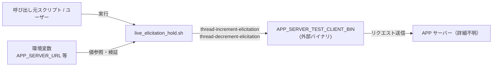
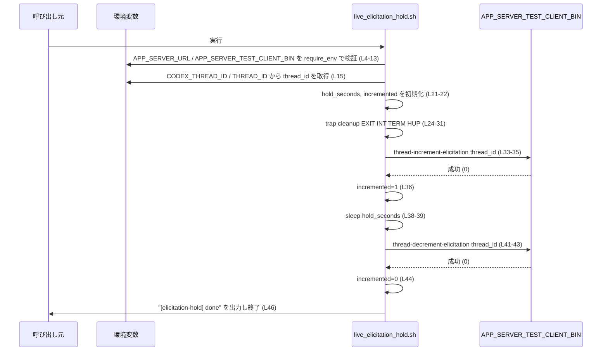
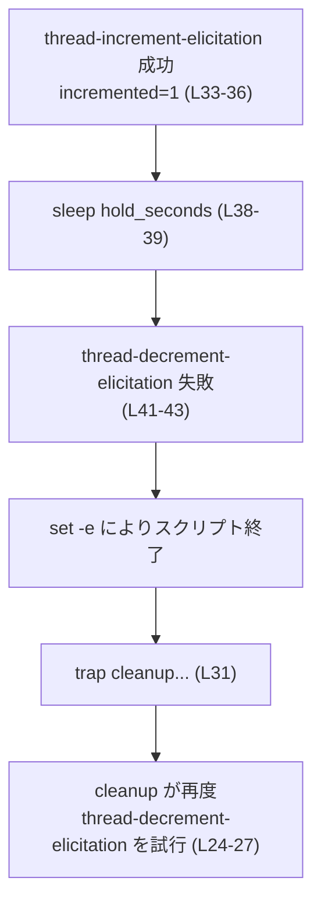

# app-server-test-client/scripts/live_elicitation_hold.sh

## 0. ざっくり一言

スレッドの「elicitation」状態を一定時間だけ保持するために、外部クライアントバイナリを使ってスレッドのカウンタを増減し、異常終了時もカウンタが整合するよう後始末するシェルスクリプトです（app-server-test-client/scripts/live_elicitation_hold.sh:L1-46）。

---

## 1. このモジュールの役割

### 1.1 概要

- このスクリプトは、指定されたスレッド ID に対して「elicitation をインクリメント → 指定秒数スリープ → デクリメント」という一連の操作を行います（L33-44）。
- APP サーバーとは、`APP_SERVER_TEST_CLIENT_BIN` という外部バイナリを通じて HTTP などのプロトコルで通信していると考えられますが、詳細な通信内容はこのファイルからは分かりません（L26-27, L34-35, L42-43）。
- 異常終了やシグナル受信時にも、必要に応じてデクリメントを実行するためのクリーンアップ処理を `trap` で登録しています（L24-31）。

### 1.2 アーキテクチャ内での位置づけ

このスクリプトを中心にした依存関係を示します。



- 呼び出し元は環境変数を設定したうえで、このスクリプトを実行します（L12-15, L21）。
- スクリプトは環境変数を検証し（L4-13, L15-19）、APP サーバーテストクライアント（`APP_SERVER_TEST_CLIENT_BIN`）を呼び出してスレッドの状態を変更します（L26-27, L34-35, L42-43）。
- APP サーバーとの実際の通信ロジックは、`APP_SERVER_TEST_CLIENT_BIN` 側にあり、このチャンクには現れません。

### 1.3 設計上のポイント

- **厳格なエラーハンドリング**  
  - `set -eu` により、コマンド失敗時や未定義変数アクセス時にスクリプト全体を即時終了する設定になっています（L2）。
- **必須環境変数の明示的な検証**  
  - `require_env` 関数で `APP_SERVER_URL` と `APP_SERVER_TEST_CLIENT_BIN` の存在を起動直後にチェックし、未設定または空の場合はエラーメッセージを表示して終了します（L4-10, L12-13）。
  - スレッド ID は `CODEX_THREAD_ID` または `THREAD_ID` のどちらかから取得し、最終的に空であれば明示的にエラー終了します（L15-19）。
- **クリーンアップ処理の一元化**  
  - `cleanup` 関数を `trap cleanup EXIT INT TERM HUP` で登録し、正常終了・エラー終了・割り込みシグナルに対して共通の後処理パスを用意しています（L24-31）。
  - 内部フラグ `incremented` によって、まだデクリメントが必要かどうかを判定します（L22, L25, L36, L44）。
- **「ベストエフォート」な後片付け**  
  - `cleanup` 内のデクリメント呼び出しは標準出力を捨て、エラーを無視する (`|| true`) ことで、トラップ処理自体が新たな失敗原因にならないようにしています（L26-27）。
- **並行性**  
  - スクリプト自身は単一プロセスで直列に処理を実行しており、並行処理は行っていません。並行性が関係するのは APP サーバー側の実装ですが、このチャンクには現れません。

---

## 2. 主要な機能一覧

- 環境変数検証: 必須環境変数の存在をチェックし、未設定なら即座に終了します（L4-10, L12-13, L15-19）。
- スレッドの elicitation インクリメント: 外部バイナリ経由で指定スレッドの elicitation をインクリメントします（L33-36）。
- 指定秒数の保持（スリープ）: 環境変数 `ELICITATION_HOLD_SECONDS` またはデフォルト 15 秒だけスリープします（L21, L38-39）。
- スレッドの elicitation デクリメント: 終了時に必ず（少なくとも 1 回）デクリメントを試みる構造になっています（L24-29, L41-44）。
- 異常終了・シグナル時のクリーンアップ: `trap` を用いて EXIT/INT/TERM/HUP 時にクリーンアップを行います（L24-31）。

### 2.1 コンポーネントインベントリー

#### シェル関数・内部コンポーネント

| 名前 | 種別 | 役割 / 用途 | 定義位置 |
|------|------|------------|----------|
| `require_env` | シェル関数 | 指定した環境変数が設定されておりかつ空でないことを検証し、満たさない場合はエラー終了する | app-server-test-client/scripts/live_elicitation_hold.sh:L4-10 |
| `cleanup` | シェル関数 | `incremented` フラグに応じて、必要な場合にスレッドの elicitation をデクリメントする。`trap` から呼ばれる | app-server-test-client/scripts/live_elicitation_hold.sh:L24-29 |
| メイン処理 | スクリプト本体 | 環境変数検証 → スレッド ID 取得 → trap 設定 → インクリメント → スリープ → デクリメント → 終了 | app-server-test-client/scripts/live_elicitation_hold.sh:L1-46 |

#### 外部コマンド・依存コンポーネント

| コンポーネント | 種別 | 役割 / 用途 | 使用位置 |
|----------------|------|-------------|----------|
| `/bin/sh` | シェル | スクリプト実行インタプリタ | L1 |
| `APP_SERVER_TEST_CLIENT_BIN` | 外部バイナリ（パスは環境変数で指定） | APP サーバーと通信し、`thread-increment-elicitation` / `thread-decrement-elicitation` 操作を実行する | L26-27, L34-35, L42-43 |
| `sleep` | 外部コマンド（通常コアユーティリティ） | 指定秒数スリープして elicitation を保持する | L39 |

#### 環境変数

| 環境変数名 | 必須/任意 | 用途 | デフォルト / 取得方法 | 使用位置 |
|-----------|-----------|------|------------------------|----------|
| `APP_SERVER_URL` | 必須 | APP サーバーの URL を指定する | `require_env` で未設定・空を拒否 | L12, L26 |
| `APP_SERVER_TEST_CLIENT_BIN` | 必須 | APP サーバーテストクライアントバイナリのパスを指定する | `require_env` で未設定・空を拒否 | L13, L26-27, L34-35, L42-43 |
| `CODEX_THREAD_ID` | 条件付き必須 | 対象スレッド ID。存在すればこちらを優先 | `${CODEX_THREAD_ID:-${THREAD_ID-}}` で取得 | L15 |
| `THREAD_ID` | 条件付き必須 | `CODEX_THREAD_ID` が未設定のときのフォールバック | 同上 | L15 |
| `ELICITATION_HOLD_SECONDS` | 任意 | スリープする秒数。省略時は 15 秒 | `"${ELICITATION_HOLD_SECONDS:-15}"` | L21, L38-39 |

---

## 3. 公開 API と詳細解説

このスクリプトはライブラリではなく CLI として利用されるため、「公開 API」は主に環境変数契約と外部バイナリ呼び出しになります。スクリプト内のシェル関数は外部から呼ばれる想定ではありません。

### 3.1 型一覧（構造体・列挙体など）

- このファイルには、構造体・列挙体などの型定義は存在しません（シェルスクリプトであるため）。

### 3.2 関数詳細（最大 7 件）

#### `require_env VAR_NAME`

**概要**

指定された名前の環境変数が設定されており、かつ値が空文字列でないことを検証します。条件を満たさない場合はエラーを標準エラー出力に表示し、スクリプトを終了します（L4-10）。

- 定義位置: app-server-test-client/scripts/live_elicitation_hold.sh:L4-10
- 利用箇所: `APP_SERVER_URL` と `APP_SERVER_TEST_CLIENT_BIN` の検証に使用（L12-13）

**引数**

| 引数名 | 型（シェル上の概念） | 説明 |
|--------|----------------------|------|
| `$1` (`VAR_NAME`) | 文字列 | チェック対象の環境変数名（例: `"APP_SERVER_URL"`） |

**戻り値**

- 成功時: 正常終了（return 0）。明示的な `return` はありませんが、最後まで到達すれば成功です。
- 失敗時: `exit 1` が呼ばれ、スクリプト全体が終了します（L8）。

**内部処理の流れ（アルゴリズム）**

1. `eval "value=\${$1-}"` により、`$1` で指定された名前の環境変数の値を `value` 変数に展開します（L5）。  
   - `\${VAR-}` 形式を使うことで、`set -u` 下でも未定義変数を空文字として扱います。
2. `if [ -z "$value" ]; then` で、値が空文字列かどうかを判定します（L6）。
3. 空の場合は、`missing required env var: <VAR_NAME>` というメッセージを標準エラー出力に表示します（L7）。
4. その後 `exit 1` でスクリプト全体を終了します（L8）。
5. 値が空でない場合は何もせずに関数を抜けます（成功）。

**Examples（使用例）**

```sh
# 必須環境変数を検証してから処理を続行する例           # app-server-test-client/scripts/live_elicitation_hold.sh:L12-13 相当
require_env APP_SERVER_URL                                # APP_SERVER_URL が空/未定義ならメッセージを出して exit 1
require_env APP_SERVER_TEST_CLIENT_BIN                    # APP_SERVER_TEST_CLIENT_BIN も同様に検証
```

この例では、2 つの環境変数がどちらも非空でない限り、その後の処理に進みません。

**Errors / Panics**

- 対象の環境変数が未定義または空文字列の場合:
  - 標準エラー出力に `missing required env var: <VAR_NAME>` を出力し（L7）、
  - `exit 1` でスクリプトを終了します（L8）。
- `set -e` の影響:
  - `exit 1` は明示的な終了なので `set -e` との組み合わせでも問題なく即時終了となります（L2, L8）。

**Edge cases（エッジケース）**

- 環境変数が定義済みだが空 (`VAR=""`) の場合:
  - `value` は空文字列になり、`-z` 判定が真になって **エラー扱い** になります（L5-7）。
- 未定義の環境変数:
  - `\${$1-}` の `-` 修飾により空文字列として扱われ、同様にエラー扱いになります（L5-7）。
- このスクリプト内では、`require_env ""` のような空の変数名は渡していません（L12-13）。空の変数名を渡した場合の挙動は、このチャンクからは実際には利用されていません。

**使用上の注意点**

- 引数にはシェルの有効な変数名を渡す必要があります。無効な名前を渡した場合の挙動は、`eval` を使っているため実行環境に依存し、このチャンクだけからは安全性を評価できません（L5）。
- このスクリプトでは `require_env` に与える引数はコード上で固定されており、ユーザー入力が直接渡されることはありません（L12-13）。

---

#### `cleanup`

**概要**

スクリプト終了時（正常・異常問わず）や特定シグナル受信時に呼び出され、`incremented` フラグが 1 の場合にスレッドの elicitation をデクリメントする後処理を行います（L24-29, L31）。

- 定義位置: app-server-test-client/scripts/live_elicitation_hold.sh:L24-29
- トラップ登録: app-server-test-client/scripts/live_elicitation_hold.sh:L31

**引数**

- なし（トラップから呼び出される無引数関数です）。

**戻り値**

- 常に成功 (`return 0` 相当) を意図した構造になっています。  
  内部のデクリメントコマンドが失敗しても `|| true` によって無視されます（L27）。

**内部処理の流れ（アルゴリズム）**

1. `if [ "$incremented" -eq 1 ]; then` で、内部フラグ `incremented` が 1 かどうかをチェックします（L25）。
2. 1 の場合のみ、`APP_SERVER_TEST_CLIENT_BIN` に対して `thread-decrement-elicitation "$thread_id"` を実行します（L26-27）。  
   - `--url "$APP_SERVER_URL"` によってサーバー URL を指定しています（L26）。
   - 出力は `/dev/null` に捨て、標準エラーも標準出力にリダイレクトしています（L27）。
   - コマンドが失敗しても `|| true` により、関数としては成功扱いにします（L27）。
3. `incremented` が 0 の場合は何もせずに終了します（L25-28）。

**Examples（使用例）**

```sh
cleanup() {                                                # app-server-test-client/scripts/live_elicitation_hold.sh:L24
  if [ "$incremented" -eq 1 ]; then                        # まだインクリメント済みなら
    "$APP_SERVER_TEST_CLIENT_BIN" --url "$APP_SERVER_URL" \ # デクリメントを試みる
      thread-decrement-elicitation "$thread_id" >/dev/null 2>&1 || true
  fi
}

trap cleanup EXIT INT TERM HUP                             # 終了・シグナル時に必ず cleanup を呼ぶ（L31）
```

この構造により、明示的なデクリメントが実行される前にエラーが発生した場合などでも、可能な限りデクリメントを試みることができます。

**Errors / Panics**

- `cleanup` 内のデクリメントコマンドが非ゼロ終了コードを返しても、`|| true` によってエラーは無視されます（L27）。
  - これにより `set -e` の影響を受けず、トラップの中でスクリプトがさらに異常終了することを防いでいます（L2, L27）。
- `incremented` の値が `0` または `1` 以外になった場合の考慮は、このスクリプト内にはありませんが、実際の代入箇所は 0 と 1 のみです（L22, L36, L44）。

**Edge cases（エッジケース）**

- `APP_SERVER_TEST_CLIENT_BIN` が未定義または空のまま cleanup が呼ばれるケース:
  - このスクリプトでは、`require_env` によって事前に検証されているため、その状態で `incremented` が 1 になることは想定されていません（L12-13, L22, L36）。
- `thread-increment-elicitation` が失敗した場合:
  - その直後に `incremented=1` が実行される前に `set -e` によりスクリプトが終了するため、`incremented` は 0 のままです（L34-36）。
  - その結果、cleanup 内の `if [ "$incremented" -eq 1 ]` は偽となり、デクリメントは呼ばれません（L25-27）。  
    これは「インクリメントに成功していないならデクリメントしない」という整合性に対応しています。
- 明示的なデクリメント（メイン処理）が失敗した場合:
  - `thread-decrement-elicitation` の明示呼び出しが失敗すると、`incremented=0` に到達する前にスクリプトが終了します（L42-44）。
  - その場合、トラップからの `cleanup` 呼び出しでは `incremented` が 1 のままなので、再度デクリメントを試みます（L25-27）。

**使用上の注意点**

- `cleanup` は `trap cleanup EXIT INT TERM HUP` によって自動的に呼び出される前提で定義されており、通常は手動で呼び出す必要はありません（L31）。
- `cleanup` 内のコマンドは静かに失敗を無視するため、デクリメント操作が実際に成功したかどうかをログから確認することはできません（L27）。  
  可観測性の観点では、必要なら `>/dev/null` や `|| true` の扱いを別途検討する余地がありますが、このファイルからは変更方針までは分かりません。

---

### 3.3 その他の処理（メインフロー）

補助関数ではないメイン処理の流れをまとめます。

| 処理名 | 役割（1 行） | 位置 |
|--------|--------------|------|
| 環境変数検証とスレッド ID 取得 | 必須環境変数とスレッド ID をチェックし、足りない場合は終了する | L4-10, L12-19 |
| hold 秒数とフラグ初期化 | スリープ秒数と `incremented` フラグを初期化する | L21-22 |
| trap 登録 | 終了・シグナル時のクリーンアップを登録する | L24-31 |
| インクリメント実行 | スレッドの elicitation をインクリメントし、成功したら `incremented=1` にする | L33-36 |
| スリープ | `hold_seconds` 秒だけ待機する | L38-39 |
| デクリメント実行 | スレッドの elicitation をデクリメントし、`incremented=0` にする | L41-44 |
| 終了ログ出力 | 完了メッセージを出力する | L46 |

---

## 4. データフロー

典型的な正常系シナリオについて、データと制御の流れを示します。

### 4.1 正常系のデータフロー



### 4.2 異常系（途中でエラーが発生する場合）の制御フロー

例として、スリープ後の明示的なデクリメントが失敗した場合の流れを簡略図で示します。



- 明示的なデクリメントが失敗すると、`set -e` によりスクリプトが終了します（L2, L41-43）。
- EXIT トラップとして `cleanup` が呼ばれ、`incremented` は 1 のままなので再度 `thread-decrement-elicitation` を試みます（L24-27）。
- このトラップ内の呼び出しは `|| true` で保護されており、失敗してもスクリプトの終了ステータスをさらに変更しません（L27）。

---

## 5. 使い方（How to Use）

### 5.1 基本的な使用方法

このスクリプトは、必要な環境変数を設定したうえで実行する前提になっています。

```sh
# 必須の環境変数を設定する例                            # 設定例（テスト環境）
export APP_SERVER_URL="https://example.com"               # サーバーの URL（L12, L26 で使用）
export APP_SERVER_TEST_CLIENT_BIN="/usr/local/bin/app-server-test-client" # テストクライアントバイナリ（L13）

# 対象スレッド ID を指定（どちらか一方でよい）          # L15 で参照される
export CODEX_THREAD_ID="12345"
# export THREAD_ID="12345" でも可（CODEX_THREAD_ID が優先）

# ホールド秒数を指定（省略すると 15 秒）                # L21, L38-39
export ELICITATION_HOLD_SECONDS="30"

# スクリプトを実行                                     # L1 以降が順次実行される
./scripts/live_elicitation_hold.sh
```

この呼び出しにより、スレッド ID `12345` の elicitation が 30 秒間インクリメントされた状態に保たれたあと、デクリメントされます（L33-44）。

### 5.2 よくある使用パターン

1. **デフォルト 15 秒だけ保持する簡単な利用**

```sh
export APP_SERVER_URL="https://example.com"
export APP_SERVER_TEST_CLIENT_BIN="/usr/local/bin/app-server-test-client"
export THREAD_ID="12345"                      # CODEX_THREAD_ID がない場合はこちら（L15）

./scripts/live_elicitation_hold.sh           # ELICITATION_HOLD_SECONDS 未設定 → 15 秒（L21）
```

1. **別スクリプトからのラップ**

```sh
#!/bin/sh
set -eu

# 他の処理で thread_id を決定してから渡す
thread_id="12345"

APP_SERVER_URL="https://example.com" \
APP_SERVER_TEST_CLIENT_BIN="/usr/local/bin/app-server-test-client" \
THREAD_ID="$thread_id" \
ELICITATION_HOLD_SECONDS="60" \
  ./scripts/live_elicitation_hold.sh
```

このように、環境変数を一時的に指定して呼び出すこともできます。

### 5.3 よくある間違い

```sh
# 間違い例: 必須環境変数を設定せずに実行している
# APP_SERVER_URL を未設定のまま実行
export APP_SERVER_TEST_CLIENT_BIN="/usr/local/bin/app-server-test-client"
export THREAD_ID="12345"
./scripts/live_elicitation_hold.sh
# → require_env APP_SERVER_URL により
#   "missing required env var: APP_SERVER_URL" と表示して exit 1（L4-10, L12）

# 正しい例: すべての必須環境変数を設定してから実行
export APP_SERVER_URL="https://example.com"
export APP_SERVER_TEST_CLIENT_BIN="/usr/local/bin/app-server-test-client"
export THREAD_ID="12345"
./scripts/live_elicitation_hold.sh
```

```sh
# 間違い例: スレッド ID を設定せずに実行
export APP_SERVER_URL="https://example.com"
export APP_SERVER_TEST_CLIENT_BIN="/usr/local/bin/app-server-test-client"
# CODEX_THREAD_ID も THREAD_ID も未設定
./scripts/live_elicitation_hold.sh
# → thread_id="" となり、"missing required env var: CODEX_THREAD_ID" と表示して exit 1（L15-19）
```

### 5.4 使用上の注意点（まとめ）

- **環境変数の必須条件**
  - `APP_SERVER_URL` と `APP_SERVER_TEST_CLIENT_BIN` は必須で、未設定または空の場合、スクリプトは開始直後に終了します（L4-10, L12-13）。
  - スレッド ID は `CODEX_THREAD_ID` または `THREAD_ID` のいずれか一方が設定されている必要があります。`CODEX_THREAD_ID` が優先されます（L15-19）。
  - エラーメッセージには `CODEX_THREAD_ID` しか出てきませんが、実際には `THREAD_ID` によるフォールバックも行っています（L15-19）。
- **ELICITATION_HOLD_SECONDS の値**
  - 数値として解釈できない文字列を設定した場合、`sleep` コマンドがエラーになり、`set -e` によりスクリプトが終了します（L2, L21, L38-39）。  
    その場合でも EXIT トラップによるクリーンアップが動作します（L31）。
- **再入・並行実行**
  - スクリプトは再入可能な状態を前提として設計されているように見えますが、同一スレッド ID に対する複数プロセスの並行実行時の挙動は APP サーバー側の実装に依存し、このチャンクからは分かりません。
- **終了ステータス**
  - インクリメントや明示的なデクリメントが失敗した場合、`set -e` によってスクリプトは非ゼロコードで終了します（L2, L33-36, L41-43）。
  - いっぽう、`cleanup` 内でのデクリメント失敗は無視され、終了ステータスには反映されません（L24-27）。

---

## 6. 変更の仕方（How to Modify）

### 6.1 新しい機能を追加する場合

このスクリプトに機能を追加する場合の主な着眼点を整理します。

- **別の「保持動作」を追加したい場合**
  - インクリメント直後とデクリメント直前の間（現在は `sleep` のみ）に処理を挿入するのが自然です（L36-44）。
  - その処理でエラーが発生したときにデクリメントをどうするかは、`incremented` フラグと `cleanup` の挙動に合わせて検討する必要があります（L22, L24-29）。
- **ホールド時間の条件分岐を追加したい場合**
  - `hold_seconds` 計算ロジック（L21）を変更・拡張し、例えばスレッド ID に応じて時間を変えるなどのロジックを追加できます。  
  - 変更時は `sleep "$hold_seconds"` が依然として適切な値を受け取ることを確認する必要があります（L38-39）。

### 6.2 既存の機能を変更する場合

- **影響範囲の確認**
  - `require_env` の仕様を変えると、`APP_SERVER_URL` と `APP_SERVER_TEST_CLIENT_BIN` のチェック方法が変わるため、このスクリプト全体の前提条件が変化します（L4-13）。
  - `cleanup` や `incremented` フラグの扱いを変えると、異常終了時にデクリメントが実行される条件が変わります（L22, L24-29, L36, L44）。
- **前提条件・契約**
  - 「インクリメントに成功した場合のみデクリメントする」「明示的なデクリメントが失敗した場合は EXIT トラップで再試行する」という現在の挙動を変える場合、その変更が外部システム（APP サーバー側）に与える影響を検討する必要があります（L33-36, L41-43）。
- **テスト**
  - このチャンクにはテストコードは現れません。変更後は、少なくとも以下のパスについて手動または自動テストを用意するのが望ましいです（推奨、コード外情報）:
    - 正常系（インクリメント→スリープ→デクリメント成功）
    - インクリメント失敗時
    - スリープ中のシグナル受信時（INT/TERM/HUP）
    - デクリメント失敗時

---

## 7. 関連ファイル

このスクリプトと密接に関係すると考えられるコンポーネントをまとめます。  
実際のファイルパスはこのチャンクには現れないため、分かる範囲のみを記載します。

| パス / 名称 | 役割 / 関係 |
|-------------|------------|
| `APP_SERVER_TEST_CLIENT_BIN`（環境変数で指定されるバイナリ） | `thread-increment-elicitation` および `thread-decrement-elicitation` コマンドを提供し、本スクリプトから呼び出されています（app-server-test-client/scripts/live_elicitation_hold.sh:L26-27, L34-35, L42-43）。バイナリのソースコードや配置パスはこのチャンクには現れません。 |
| APP サーバー本体 | `APP_SERVER_URL` で指定されるサーバーであり、`APP_SERVER_TEST_CLIENT_BIN` を通じて操作されます（L12, L26）。このチャンクにはサーバー側の実装は含まれていません。 |

このチャンク以外で、本スクリプトを呼び出している他のスクリプト・サービスが存在する可能性がありますが、具体的なファイル名・場所はこのチャンクには現れません。
