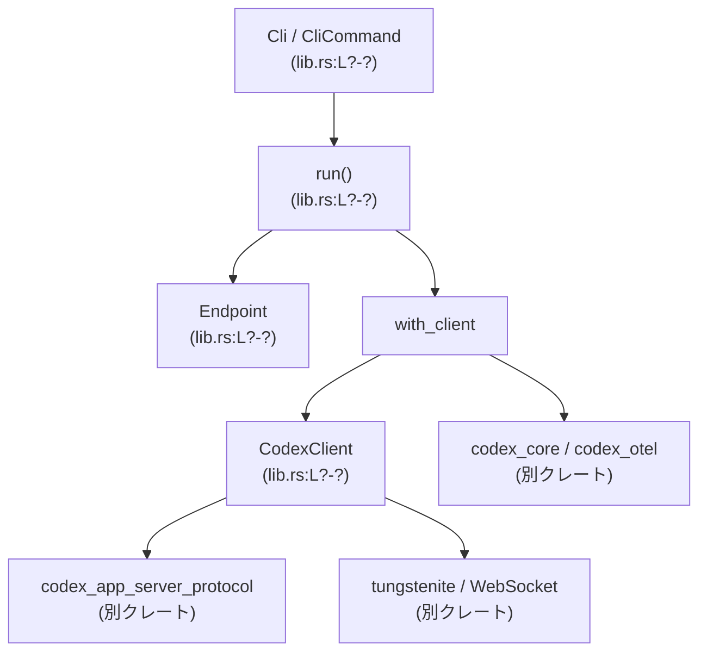
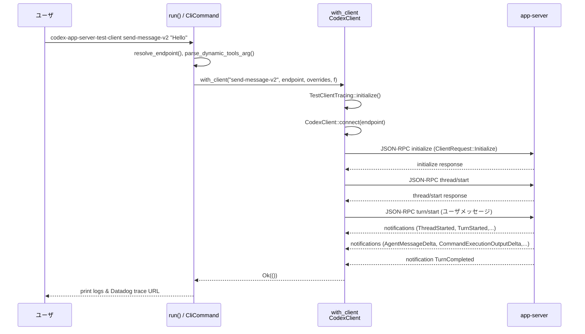

# app-server-test-client/src/lib.rs

## 0. ざっくり一言

Codex の app-server に対して、CLI から各種 JSON-RPC / WebSocket 操作を行う **テストクライアント兼ハーネス** を実装したモジュールです。  
子プロセスとして `codex app-server` を起動するモードと、既存の WebSocket app-server に接続するモードの両方をサポートします。

> 注: この回答では行番号情報が提供されていないため、指定フォーマット `lib.rs:L開始-終了` は `lib.rs:L?-?` のように「行番号不明」を示す形で記載します。

---

## 1. このモジュールの役割

### 1.1 概要

このモジュールは **Codex app-server の動作を CLI から検証・デバッグするためのテストクライアント** を提供します。

- Clap を用いた CLI (`Cli`, `CliCommand`) で多数のサブコマンドを定義し、app-server の各 API（スレッド/ターン、ログイン、モデル一覧、レートリミット等）を叩きます。
- `Endpoint` と `CodexClient` により、  
  - `codex` バイナリを子プロセスとして起動し stdio で通信するモード  
  - 既存の WebSocket app-server に JSON-RPC で接続するモード  
  の 2 つの接続形態を抽象化します。
- `live_elicitation_timeout_pause` など、特定の振る舞い（エリシテーション一時停止とタイムアウト）の **回帰テスト用ハーネス** も含まれます。
- OpenTelemetry / Datadog トレース連携（`TestClientTracing`, `TraceSummary`）により、各コマンドごとのトレース URL を出力します。

### 1.2 アーキテクチャ内での位置づけ

主な構成要素と依存関係は以下の通りです（すべて `lib.rs` 内に定義されています）。

- **CLI フロントエンド**
  - `Cli`, `CliCommand`, `run()`  
    → ユーザ引数を解釈し、各サブコマンドのロジック関数を呼び出します。
- **接続先の抽象化**
  - `Endpoint`（`SpawnCodex` / `ConnectWs`）  
    → codex バイナリ子プロセス or WebSocket URL のどちらを使うかを表現します。
- **クライアント本体**
  - `CodexClient`, `ClientTransport`  
    → JSON-RPC メッセージの送受信、通知処理、承認フロー処理を行います。
- **トレース/ログ**
  - `TestClientTracing`, `TraceSummary`, `print_trace_summary`, `print_multiline_with_prefix`  
    → OpenTelemetry + Datadog 向けトレース初期化と、JSON-RPC メッセージの整形出力を行います。
- **テストハーネス**
  - `live_elicitation_timeout_pause`, `trigger_zsh_fork_multi_cmd_approval` など  
    → app-server の特定機能を検証する高レベルシナリオを実装します。

依存関係の概略図です（モジュール外のクレートはノード名のみで表記しています）。



> 図は本ファイル `lib.rs` の構造のみを対象とし、外部クレート内部の詳細実装は「不明（このチャンクには現れない）」です。

### 1.3 設計上のポイント

- **責務分割**
  - CLI パース (`Cli`, `CliCommand`, `run`) と実際の app-server 通信ロジック（`CodexClient`）を分離しています。
  - 動作シナリオ（例: `live_elicitation_timeout_pause`, `trigger_cmd_approval`）は、`CodexClient` のメソッドを組み合わせた高レベル関数として実装されています。
- **接続形態の抽象化**
  - `Endpoint` + `ClientTransport` によって、「子プロセス経由の stdio IPC」と「WebSocket」の 2 つのトランスポートを同一 API で扱えるようになっています。
- **エラーハンドリング方針**
  - すべて `anyhow::Result<T>` を返し、`?` 演算子と `bail!`, `context` によって  
    エラーを早期リターンしつつ、メッセージにコンテキストを付与する構造になっています。
  - JSON-RPC レスポンス側のエラーは `JSONRPCMessage::Error` を検出し、`bail!` で `Err` を返します（`CodexClient::wait_for_response`）。
- **並行性・非同期性**
  - 公開関数の多くは `async fn` ですが、内部で利用しているネットワーク/WebSocket/プロセス I/O は **ブロッキング I/O** です（`tungstenite` / `std::process` / `std::io::BufRead` など）。
  - `async` はあくまで「上位から await しやすくするため」のラッパーであり、内部で複数タスクを並列実行することはありません。
- **リソース管理**
  - `CodexClient` と `BackgroundAppServer` は `Drop` 実装を持ち、子プロセスの **グレースフルシャットダウン**（タイムアウト付き）を行います。
- **観測性**
  - すべての JSON-RPC メッセージを pretty-print し、`>` / `<` 接頭辞を付けて標準出力にログします。
  - OpenTelemetry / Datadog トレース ID を `go/trace/<id>` 形式で出力し、トレース有効/無効を明示します。

---

## 2. 主要な機能一覧

このモジュールが提供する主要機能を箇条書きで示します（コード上の根拠はいずれも `lib.rs:L?-?` 内にあります）。

- **CLI 起動 (`run`)**
  - Clap ベースの CLI を初期化し、各サブコマンドを実行します。
- **app-server のバックグラウンド起動 (`serve`, `BackgroundAppServer`)**
  - `codex app-server --listen <url>` を `nohup` 経由でバックグラウンド起動し、ログをファイルに書き出します。
- **エンドポイント解決 (`resolve_endpoint`, `resolve_shared_websocket_url`)**
  - `--codex-bin` と `--url` の組み合わせから、子プロセス起動か WebSocket 接続かを決定します。
- **メッセージ送信 / スレッド・ターン操作**
  - `send_message`, `send_message_v2`, `send_message_v2_with_policies`
  - `resume_message_v2`, `send_follow_up_v2`, `thread_resume_follow`, `watch`
- **承認フロー検証**
  - `trigger_cmd_approval`, `trigger_patch_approval`, `no_trigger_cmd_approval`
  - `trigger_zsh_fork_multi_cmd_approval`（複数コマンド承認の挙動確認）
- **アカウント関連**
  - `test_login`（ブラウザ/デバイスコード方式 ChatGPT ログイン）
  - `get_account_rate_limits`
- **メタデータ取得**
  - `model_list`
  - `thread_list`
- **エリシテーション（elicitation）制御**
  - `thread_increment_elicitation`, `thread_decrement_elicitation`
  - `live_elicitation_timeout_pause`（タイムアウト一時停止を実証するハーネス）
- **クライアント基盤 (`CodexClient`)**
  - JSON-RPC リクエスト送受信（`send_request`, `wait_for_response`, `next_notification`）
  - サーバ通知ストリーム処理（`stream_turn`, `stream_notifications_forever`）
  - サーバからの承認リクエストの処理（コマンド実行 / ファイル変更）

---

## 3. 公開 API と詳細解説

### 3.1 型一覧（構造体・列挙体など）

> 行番号は不明のため、すべて `lib.rs:L?-?` と表記します。

| 名前 | 種別 | 役割 / 用途 | 定義位置 |
|------|------|-------------|----------|
| `Cli` | 構造体 (`derive(Parser)`) | Clap による CLI オプション/サブコマンド定義。`run()` 冒頭で `Cli::parse()` により使用。 | `lib.rs:L?-?` |
| `CliCommand` | `enum` (`Subcommand`) | サブコマンドの列挙。`Serve`, `SendMessage`, `SendMessageV2` など多数。 | `lib.rs:L?-?` |
| `Endpoint` | `enum` | app-server への接続形態を表現。`SpawnCodex(PathBuf)` or `ConnectWs(String)`。 | `lib.rs:L?-?` |
| `BackgroundAppServer` | 構造体 | 一時的にバックグラウンド起動した app-server 子プロセスを表し、`Drop` で終了処理を行う。 | `lib.rs:L?-?` |
| `SendMessagePolicies<'a>` | 構造体 | `send_message_v2_with_policies` 用のポリシー集（コマンド名・experimental API フラグ・承認/サンドボックス/動的ツール設定）。 | `lib.rs:L?-?` |
| `ClientTransport` | `enum` | `CodexClient` の内部で使用するトランスポート種別。`Stdio`（子プロセス）か `WebSocket`。 | `lib.rs:L?-?` |
| `CodexClient` | 構造体 | JSON-RPC クライアントの本体。トランスポート、通知キュー、承認/コマンド状態などの内部状態を保持。 | `lib.rs:L?-?` |
| `CommandApprovalBehavior` | `enum` | コマンド実行承認時の振る舞い（常に許可 / N 回目でキャンセル）。 | `lib.rs:L?-?` |
| `TestClientTracing` | 構造体 | OpenTelemetry/Datadog トレース設定のラッパー。`initialize` で設定を構築。 | `lib.rs:L?-?` |
| `TraceSummary` | `enum` | トレース URL の有無を表す（`Enabled { url }` / `Disabled`）。`with_client` → `print_trace_summary` で使用。 | `lib.rs:L?-?` |

### 3.2 関数詳細（最大 7 件）

ここでは公開 API とコアロジックに関わる重要な関数・メソッドを 7 件選び、詳細に説明します。

#### 1. `pub async fn run() -> Result<()>`

**概要**

- このライブラリのエントリポイントです。  
  CLI 引数をパースし、選択されたサブコマンドに応じて app-server への操作を実行します。

**引数**

- なし（`Cli::parse()` により `std::env::args` から取得します）。

**戻り値**

- `Result<()>` (`anyhow::Result`)  
  正常終了なら `Ok(())`、CLI 実行中のエラー時は `Err(anyhow::Error)` を返します。

**内部処理の流れ**

1. `Cli::parse()` で CLI 引数を構造体にパース。
2. `parse_dynamic_tools_arg` で `--dynamic-tools` 引数を `Option<Vec<DynamicToolSpec>>` に変換。
3. `match command` で `CliCommand` の各バリアントに分岐。
4. 各サブコマンドで:
   - `ensure_dynamic_tools_unused` により「動的ツールがサポートされないコマンド」で指定されていないか検証。
   - `resolve_endpoint` または `resolve_shared_websocket_url` で接続先を決定。
   - 対応する高レベル関数（例: `send_message`, `trigger_cmd_approval`, `live_elicitation_timeout_pause`）を呼び出し。
5. 各関数の `Result` をそのまま呼び出し元に返却。

**Examples（使用例）**

CLI バイナリから利用する典型例です（バイナリ crate 側）:

```rust
// main.rs 側の想定コード例
#[tokio::main] // tokio ランタイムを使う想定
async fn main() -> anyhow::Result<()> {
    app_server_test_client::run().await
}
```

**Errors / Panics**

- `Cli::parse()` が内部でエラー時にプロセス終了を行う可能性があります（clap の標準挙動）。
- 各分岐先関数が `Err` を返した場合、そのまま `run` も `Err` を返します。
  - 例: `resolve_endpoint` で `--codex-bin` と `--url` が同時指定されている場合、`bail!` によりエラー。
  - 各コマンドで app-server との通信に失敗した場合（接続不可、JSON-RPC エラーなど）。

**Edge cases（エッジケース）**

- `--codex-bin` と `--url` の両方を指定するとエラー。
- `--dynamic-tools` をサポートしていないサブコマンドで指定するとエラー（`ensure_dynamic_tools_unused`）。
- app-server 未起動で `--url` のみ指定した場合、接続関数内でタイムアウトエラーになります。

**使用上の注意点**

- `run` 自体は非同期関数なので、呼び出し側は `tokio` などの非同期ランタイム上で実行する必要があります。
- 内部でブロッキング I/O（プロセス起動、WebSocket 接続）を行うため、大規模な非同期サーバ内で直接使用する場合は、専用スレッドプール等にオフロードした方が安全です（CLI 用途では問題になりにくいです）。

---

#### 2. `async fn with_client<T>(command_name: &'static str, endpoint: &Endpoint, config_overrides: &[String], f: impl FnOnce(&mut CodexClient) -> Result<T>) -> Result<T>`

**概要**

- トレース初期化・トレース span 開始・`CodexClient` の生成・クリーンアップを共通化する **高階関数** です。
- 多くのサブコマンドが、この関数にクロージャを渡す形で実装されています。

**引数**

| 引数名 | 型 | 説明 |
|--------|----|------|
| `command_name` | `&'static str` | サブコマンド名。トレース属性に埋め込まれます。 |
| `endpoint` | `&Endpoint` | `SpawnCodex` or `ConnectWs`。`CodexClient::connect` に渡されます。 |
| `config_overrides` | `&[String]` | `--config key=value` オプション群。Config/otel 読み込みと子プロセス起動に使われます。 |
| `f` | `impl FnOnce(&mut CodexClient) -> Result<T>` | クライアントを使って実際の操作を行うユーザロジック。 |

**戻り値**

- `Result<T>`  
  - `T`: ユーザロジックの戻り値。
  - トレース初期化、接続、ユーザロジックのいずれかでエラーがあれば `Err`。

**内部処理の流れ**

1. `TestClientTracing::initialize(config_overrides).await` で OpenTelemetry/Datadog 設定をロード。
2. `info_span!` で `app_server_test_client.command` span を開始（属性 `otel.kind="client"`, `otel.name=command_name` など）。
3. span 内で `TraceSummary::capture(tracing.traces_enabled)` を呼び出し、トレース URL を取得（可能な場合）。
4. span 内で `CodexClient::connect(endpoint, config_overrides)` を呼び出し、クライアントを作成。
5. ユーザクロージャ `f(&mut client)` を実行し、結果を受け取る。
6. span 外で `print_trace_summary(&trace_summary)` を呼び出し、トレース URL または「Not enabled」を標準出力に表示。
7. ユーザクロージャの結果を返す。

**Examples（使用例）**

`send_message_v2_with_policies` 内での利用（簡略化）:

```rust
with_client("send-message-v2", endpoint, config_overrides, |client| {
    let initialize = client.initialize_with_experimental_api(true)?;
    println!("< initialize response: {initialize:?}");

    let thread_response = client.thread_start(Default::default())?;
    let turn_response = client.turn_start(/* ... */)?;
    client.stream_turn(&thread_response.thread.id, &turn_response.turn.id)?;

    Ok(())
}).await?;
```

**Errors / Panics**

- `TestClientTracing::initialize` が失敗するケース:
  - `--config` オーバーライドのパース失敗。
  - 設定ファイル読み込み失敗。
  - OpenTelemetry 設定の不正など。
- `CodexClient::connect` が失敗するケース:
  - `SpawnCodex` の場合: 子プロセス起動失敗・stdin/stdout 取得失敗など。
  - `ConnectWs` の場合: WebSocket 接続タイムアウト。
- ユーザクロージャ `f` 内で `Err` が返された場合、ラップせずそのまま `Err` になります。
- `TraceSummary::capture` / `print_trace_summary` はトレース情報が無い場合でもパニックはしません。

**Edge cases（エッジケース）**

- トレースは **必須ではない** ため、OpenTelemetry 設定が存在しなくても `with_client` 自体は成功します（`TraceSummary::Disabled`）。
- トレースレイヤーの初期化 `try_init()` がすでに初期化済みで失敗した場合も、エラーは無視されます。

**使用上の注意点**

- `with_client` は `async` ですが、内部の `CodexClient` 操作は同期的（ブロッキング I/O）です。
- 複数スレッドから同じ `CodexClient` インスタンスを共有する設計にはなっていません（クロージャは `FnOnce` で、ローカルに所有されます）。

---

#### 3. `impl CodexClient { fn connect(endpoint: &Endpoint, config_overrides: &[String]) -> Result<Self> }`

**概要**

- `Endpoint` に応じて
  - `codex` 子プロセス + stdio 接続
  - WebSocket 接続  
  のどちらかを確立し、`CodexClient` インスタンスを生成します。

**引数**

| 引数名 | 型 | 説明 |
|--------|----|------|
| `endpoint` | `&Endpoint` | `SpawnCodex(codex_bin)` または `ConnectWs(url)`。 |
| `config_overrides` | `&[String]` | `--config` オプション群。子プロセス起動時に引き渡されます。 |

**戻り値**

- `Result<CodexClient>`  
  - 成功時: 適切な `ClientTransport` を内包した `CodexClient`。
  - 失敗時: プロセス起動失敗・接続タイムアウトなどの `anyhow::Error`。

**内部処理の流れ**

1. `match endpoint` で分岐:
   - `Endpoint::SpawnCodex(codex_bin)` → `Self::spawn_stdio(codex_bin, config_overrides)` を呼び出し。
   - `Endpoint::ConnectWs(url)` → `Self::connect_websocket(url)` を呼び出し。
2. それぞれの関数で `ClientTransport` を構築し、共通の内部状態を初期化した `CodexClient` を返します。

**spawn_stdio の要点**

- `Command::new(codex_bin).arg("app-server")` で子プロセスを起動。
- `stdin` / `stdout` を `Stdio::piped` とし、`BufReader` にラップして行単位で JSONRPC をやり取り。
- 親プロセスの PATH に codex_bin のディレクトリを先頭に追加。

**connect_websocket の要点**

- `Url::parse(url)` で検証。
- 最大 10 秒間、`tungstenite::connect` をリトライ（50ms スリープ付き）。
- 成功したら `WebSocket` インスタンスを `ClientTransport::WebSocket` に格納。

**Examples（使用例）**

```rust
let endpoint = Endpoint::ConnectWs("ws://127.0.0.1:4222".to_string());
let mut client = CodexClient::connect(&endpoint, &[])?;

// initialize してから API 呼び出し
let init = client.initialize()?;
println!("Initialized: {:?}", init);
```

**Errors / Panics**

- `spawn_stdio`:
  - `Command::spawn()` 失敗（バイナリが見つからない/実行権限なし等）。
  - `stdin`/`stdout` を `take()` できない（理論上は spawn 時のエラー）。
- `connect_websocket`:
  - URL パース失敗 → 即 `Err`。
  - 10 秒以内に接続確立できない → 最後の `tungstenite` エラーにコンテキストを付けて `Err`。
- いずれもパニックは使わず `Result` 経由でエラーを返しています。

**Edge cases（エッジケース）**

- WebSocket で一時的に接続できない場合、10 秒以内であればリトライし続けます。  
  短時間のサーバ起動待ちに耐えられますが、それ以上は失敗と見なされます。
- `SpawnCodex` モードでは、app-server のログはこのファイルでは扱わず、stderr を親プロセスに継承しているだけです。

**使用上の注意点**

- `CodexClient::connect` はブロッキング関数です。非同期コンテキストから呼ぶ場合でも、専用スレッドで実行するか、CLI 用途にとどめるのが安全です。
- `CodexClient` は Drop 実装を持つため、所有権がスコープから外れると子プロセスをシャットダウンします。長時間保持する場合はその点を意識する必要があります。

---

#### 4. `impl CodexClient { fn send_request<T>(&mut self, request: ClientRequest, request_id: RequestId, method: &str) -> Result<T> }`

**概要**

- 型付きの `ClientRequest` を JSON-RPC 形式に変換して送信し、対応するレスポンスを待ち受けて、目的の型 `T` にデシリアライズして返すコア関数です。

**引数**

| 引数名 | 型 | 説明 |
|--------|----|------|
| `request` | `ClientRequest` | codex_app_server_protocol で定義されたクライアントリクエスト列挙体。 |
| `request_id` | `RequestId` | JSON-RPC の id。`self.request_id()` で生成した値を渡すのが前提です。 |
| `method` | `&str` | メトリクス用のメソッド名文字列（例: `"thread/start"`）。トレース属性やエラーメッセージに使用。 |

**戻り値**

- `Result<T>` (`T: DeserializeOwned`)  
  - 成功: レスポンス JSON の `result` 部分を `T` へデコードした値。
  - 失敗: JSON-RPC エラーやネットワークエラー、デシリアライズ失敗など。

**内部処理の流れ**

1. `info_span!` で `app_server_test_client.request` span を開始し、`rpc.system="jsonrpc"` などの属性を付与。
2. span 内で:
   1. `self.write_request(&request)?` を呼び出し、JSON-RPC 形式でメッセージを送信。
   2. `self.wait_for_response(request_id, method)` を呼び出し、対応するレスポンスを待機。
3. `wait_for_response`:
   - `read_jsonrpc_message` でループしながら JSON-RPC メッセージを受信。
   - `Response`:
     - `id == request_id` の場合: `result` フィールドを `T` にデコードし、返却。
   - `Error`:
     - `id == request_id` の場合: `bail!("{method} failed: {err:?}")`。
   - `Notification`: `pending_notifications` キューに保存。
   - `Request`: `handle_server_request` で処理（承認リクエスト等）。

**Examples（使用例）**

内部利用の典型例（`thread_start` メソッド内）:

```rust
fn thread_start(&mut self, params: ThreadStartParams) -> Result<ThreadStartResponse> {
    let request_id = self.request_id();
    let request = ClientRequest::ThreadStart { request_id: request_id.clone(), params };
    self.send_request(request, request_id, "thread/start")
}
```

**Errors / Panics**

- JSON 変換エラー:
  - `serde_json::to_value(request)` / `serde_json::from_value` / `serde_json::from_str` で不正な JSON に対して `Err` を返します。
- JSON-RPC プロトコルエラー:
  - サーバが `JSONRPCMessage::Error` を返し、かつ `id` が一致した場合、`bail!` で `Err`。
- I/O エラー:
  - `write_payload` / `read_payload` が I/O エラーを返した場合、`context` 付きで `Err` となります。
- パニックは使用していません。

**Edge cases（エッジケース）**

- サーバが当該 `request_id` に対応しないレスポンスを返した場合（id 不一致）は、無視され、次のメッセージを待ち続けます。
- サーバが通知・別リクエストを多数送ってくる場合でも、それらはキュー/ハンドラに回され、要求したレスポンスが来るまでブロックし続けます。

**使用上の注意点**

- `send_request` は **同期・ブロッキング** です。多数のリクエストを同時に飛ばす用途には向きません。
- `T` の型は JSON スキーマと一致する必要があります。プロトコル変更時にはここでデコードエラーが発生します。

---

#### 5. `impl CodexClient { fn stream_turn(&mut self, thread_id: &str, turn_id: &str) -> Result<()> }`

**概要**

- 特定の `thread_id` と `turn_id` に対する **ターンの進行状況をストリームとして受信・表示** し、`TurnCompleted` 通知が来るまでブロックする関数です。
- 同時に、コマンド実行状態やヘルパースクリプト出力などを追跡するための内部状態を更新します。

**引数**

| 引数名 | 型 | 説明 |
|--------|----|------|
| `thread_id` | `&str` | 対象スレッド ID。 |
| `turn_id` | `&str` | 対象ターン ID。`TurnCompleted` 判定に使用。 |

**戻り値**

- `Result<()>`  
  - 正常: `TurnCompleted` が届き、処理終了。
  - 異常: 通信エラー、JSON 解析エラーなど。

**内部処理の流れ**

1. 無限ループで `self.next_notification()?` を呼び出し、次の通知を取得。
2. `ServerNotification::try_from(notification)` でクライアントプロトコル型に変換できたものだけを扱う。
3. `match server_notification` で種類ごとに処理:
   - `ThreadStarted`: 対象 thread の場合のみログ出力。
   - `TurnStarted`: 対象 turn の場合のみログ出力。
   - `AgentMessageDelta`: delta テキストをそのまま `print!`。
   - `CommandExecutionOutputDelta`:
     - `self.note_helper_output(&delta.delta)` でヘルパー出力ストリームに追記。
     - 同時に標準出力にも表示。
   - `TerminalInteraction`: ユーザ stdin 送信内容をログ表示。
   - `ItemStarted`:
     - `ThreadItem::CommandExecution` の開始を検知し、`command_item_started` フラグや `unexpected_items_before_helper_done` を更新。
   - `ItemCompleted`:
     - コマンド実行アイテムの場合、`status` と `aggregated_output` を記録。
   - `TurnCompleted`:
     - 対象 turn の場合:
       - `last_turn_status`, `last_turn_error_message` を更新。
       - ヘルパー完了前に turn が終わっていれば `turn_completed_before_helper_done = true`。
       - ログ出力後 `break` してループを抜ける。
   - `McpToolCallProgress`: 進捗メッセージをログ。
   - その他: 未知の通知としてログに出す。

4. ループを抜けたら `Ok(())` を返す。

**Examples（使用例）**

`send_message_v2_with_policies` からの使用（要約）:

```rust
let thread_response = client.thread_start(/* ... */)?;
let turn_response = client.turn_start(/* ... */)?;
client.stream_turn(&thread_response.thread.id, &turn_response.turn.id)?;
```

**Errors / Panics**

- `next_notification` 内での I/O エラーや JSON パースエラーが `Err` として返されます。
- `ServerNotification::try_from` に失敗した通知は無視されるため、それ自体がエラーにはなりません。
- パニックはありません。

**Edge cases（エッジケース）**

- サーバが `TurnCompleted` を送らない限り、この関数は戻りません（接続が閉じられた場合は `read_payload` がエラーを返して終了します）。
- コマンド実行が複数回行われた場合、`command_execution_statuses` と `command_execution_outputs` に順次蓄積されます。
- `live_elicitation_timeout_pause` などでは、この関数後に `client` の内部状態を検査して期待条件を確認します。

**使用上の注意点**

- この関数は「1 ターン分のストリーミングを最後まで見る」用途を想定しており、ストリーミング中に別のリクエストを同一クライアントで並列に投げる設計にはなっていません。
- CLI の標準出力に大量のログが出るため、テストランナー等で使う場合はログ扱いに注意が必要です。

---

#### 6. `fn live_elicitation_timeout_pause(...) -> Result<()>`

シグネチャ（簡略）:

```rust
fn live_elicitation_timeout_pause(
    codex_bin: Option<PathBuf>,
    url: Option<String>,
    config_overrides: &[String],
    model: String,
    workspace: PathBuf,
    script: Option<PathBuf>,
    hold_seconds: u64,
) -> Result<()>
```

**概要**

- 「エリシテーション一時停止により、10 秒の unified exec タイムアウトを超えても 15 秒のヘルパースクリプトを殺さずに完了できる」ことを実証する **ライブテストハーネス** です。
- app-server 上で `exec_command` ツールを使ってシェルスクリプトを実行し、その完了タイミングとターン/コマンド完了タイミングを検証します。

**引数**

| 引数名 | 型 | 説明 |
|--------|----|------|
| `codex_bin` | `Option<PathBuf>` | 子プロセスとして app-server を起動する `codex` バイナリパス。`None` の場合は `url` を使用。 |
| `url` | `Option<String>` | 既存 WebSocket app-server の URL。 |
| `config_overrides` | `&[String]` | `--config` オーバーライド。子プロセス起動時に使用。 |
| `model` | `String` | `thread/start` 時に指定するモデル名。 |
| `workspace` | `PathBuf` | `cwd` として使うワークスペースディレクトリ。 |
| `script` | `Option<PathBuf>` | 実行するヘルパースクリプトパス。`None` なら `scripts/live_elicitation_hold.sh` を利用。 |
| `hold_seconds` | `u64` | スクリプト内で `sleep` する秒数。10秒超が要求されます。 |

**戻り値**

- `Result<()>`  
  - 成功: 条件をすべて満たし、タイムアウト一時停止が機能していると判断できた場合。
  - 失敗: 事前条件違反、接続失敗、期待する通知や出力が得られないなど。

**内部処理の流れ（概要）**

1. プラットフォームチェック:
   - `cfg!(windows)` の場合は `bail!` でエラー（POSIX シェル必須）。
   - `hold_seconds <= 10` の場合もエラー（10 秒の unified exec timeout を超える必要があるため）。
2. `codex_bin` / `url` の組合せから WebSocket URL を決定:
   - 両方 `Some` → エラー。
   - `codex_bin` のみ → `BackgroundAppServer::spawn` で一時的な app-server を起動し、その URL を使用。
   - `url` のみ or 両方 `None` → 既定 (`ws://127.0.0.1:4222`) など。
3. スクリプトパス決定:
   - `script` が `Some` → それを使用。
   - `None` → `env!("CARGO_MANIFEST_DIR")/scripts/live_elicitation_hold.sh` を使用。
   - `is_file()` で存在確認、なければエラー。
4. `workspace.canonicalize()` で絶対パスに変換。
5. `std::env::current_exe()` で自身（app-server-test-client バイナリ）のパスを取得。
6. `CodexClient` で app-server に接続し、`initialize` → `thread_start(model=Some(model))`。
7. 実行すべきシェルコマンド文字列 `command` を構成:
   - `APP_SERVER_URL=... APP_SERVER_TEST_CLIENT_BIN=... ELICITATION_HOLD_SECONDS=... sh <script_path>`  
     （すべて `shell_quote` で適切にクォート）。
8. モデルへのプロンプト:
   - 「`exec_command` ツールをちょうど一度だけ使い、この `command` をそのまま実行し、終わったら `DONE` と返答せよ」といった趣旨のテキストを構築。
9. `started_at = Instant::now()` で開始時刻を記録。
10. `turn_start` を呼び出し、`approval_policy=AskForApproval::Never`, `sandbox_policy=SandboxPolicy::DangerFullAccess`, `effort=High`, `cwd=workspace` を指定。
11. `client.stream_turn(&thread_id, &turn_id)` を呼び、ターンの完了までストリーム受信。
12. 経過時間 `elapsed = started_at.elapsed()` を取得。
13. 内部クロージャ `validation_result` で検証:
    - `stream_result?` でストリーミング自体が成功したことを確認。
    - `command_execution_outputs` から `"[elicitation-hold]"` を含む出力を探す（ヘルパースクリプトのログマーカー）。
    - `last_turn_status == TurnStatus::Completed` であること。
    - `command_execution_statuses` に `CommandExecutionStatus::Completed` が含まれること。
    - `helper_done_seen == true` かつ出力に `"[elicitation-hold] done"` を含むこと。
    - `unexpected_items_before_helper_done` が空であること。
    - `turn_completed_before_helper_done == false` であること。
    - `elapsed >= hold_seconds - 1` 秒であること（十分に時間がかかったこと）。
14. その後、クリーンアップとして `thread_decrement_elicitation` を呼び、成功/失敗問わずログに出力。
15. すべての検証に成功した場合に `Ok(())` を返し、サマリーログを出力。

**Errors / Panics**

- 事前条件違反:
  - Windows 環境 → `bail!("... requires a POSIX shell")`。
  - `hold_seconds <= 10` → `bail!`.
  - スクリプトファイル未存在 → `bail!`.
- I/O / 接続エラー:
  - app-server 起動/接続失敗、JSON-RPC エラー、スクリプト出力が期待通りでない等。
- 検証条件不一致:
  - 上記いずれかの検証が失敗すると `bail!` で詳細なメッセージを含む `Err` を返します。

**Edge cases（エッジケース）**

- モデルがプロンプト通りに振る舞わず、`exec_command` を使わない/コマンドを改変する場合、検証は失敗し `Err` になります。
- app-server の実装変更により、通知の順序や内容が変わると、`unexpected_items_before_helper_done` 等のチェックで失敗する可能性があります。

**使用上の注意点**

- この関数はテストハーネス用途であり、本番プロダクトコードから呼ぶことは想定されていません。
- 実行には POSIX シェルと `sh`、およびヘルパースクリプトが必要です。
- モデルおよび app-server の振る舞いに依存するため、環境が変わると失敗する可能性があります。

---

#### 7. `impl TestClientTracing { async fn initialize(config_overrides: &[String]) -> Result<Self> }`

**概要**

- Codex 環境の設定ファイル ＋ CLI オーバーライドから OpenTelemetry/Datadog トレース設定を構築し、トレースが有効かどうかを判定する初期化関数です。

**引数**

| 引数名 | 型 | 説明 |
|--------|----|------|
| `config_overrides` | `&[String]` | `--config key=value` 形式のオーバーライド。`CliConfigOverrides` に渡されます。 |

**戻り値**

- `Result<TestClientTracing>`  
  - 成功: `traces_enabled` フラグと `OtelProvider` を持つ `TestClientTracing`。
  - 失敗: コンフィグ読み込みや otel 設定に関するエラー。

**内部処理の流れ**

1. `CliConfigOverrides { raw_overrides: config_overrides.to_vec() }.parse_overrides()` を呼び出し、CLI オーバーライドを内部表現に変換。
2. `Config::load_with_cli_overrides(cli_kv_overrides).await` で設定ファイル + オーバーライドを読み込み。
3. `codex_core::otel_init::build_provider(&config, env!("CARGO_PKG_VERSION"), Some(OTEL_SERVICE_NAME), DEFAULT_ANALYTICS_ENABLED)` を呼び出し、OpenTelemetry provider を構築。
4. `traces_enabled` を  
   `otel_provider.as_ref().and_then(|p| p.tracer_provider.as_ref()).is_some()` によって判定。
5. `if let Some(provider) = otel_provider.as_ref() && traces_enabled` ブロック内で:
   - `tracing_subscriber::registry().with(provider.tracing_layer()).try_init()` を試行（すでに初期化済みの場合はエラーだが無視）。
6. `Ok(Self { traces_enabled, _otel_provider: otel_provider })` を返却。

**Examples（使用例）**

`with_client` 内での利用:

```rust
let tracing = TestClientTracing::initialize(config_overrides).await?;
if tracing.traces_enabled {
    // TraceSummary::capture で URL が取得できる場合あり
}
```

**Errors / Panics**

- オーバーライドパース失敗 → `anyhow!("error parsing -c overrides: {e}")`。
- 設定ロード失敗 → `context("error loading config")`。
- otel provider 構築失敗 → `anyhow!("error loading otel config: {e}")`。
- `try_init()` の失敗は無視されるため、ここではエラー扱いされません。
- パニックはありません。

**Edge cases（エッジケース）**

- トレースを無効化した設定の場合、`traces_enabled` は `false` となり、以降の `TraceSummary::capture` も `Disabled` を返します。
- 他のライブラリがすでに `tracing_subscriber` を初期化している場合、`try_init()` は失敗しますが、このコードでは無視します（トレース自体は provider 経由で有効なまま）。

**使用上の注意点**

- CLI オプション `--config` の形式が `key=value` でない場合、ここでエラーとなり CLI 全体が終了します。
- OpenTelemetry のエンドポイントや Datadog 連携など、外部サービスへの依存があるため、ネットワークや認証設定に注意が必要です（このファイルからは詳細不明）。

---

### 3.3 その他の関数（概要インベントリ）

> 数が多いため、ここでは役割ごとに主な関数をグループ分けして列挙します（すべて `lib.rs:L?-?`）。

| 関数名 | 役割（1 行） |
|--------|--------------|
| `resolve_endpoint` | `--codex-bin` / `--url` から `Endpoint` を決定する。 |
| `resolve_shared_websocket_url` | 共有 WebSocket app-server 用 URL を決定する（`--codex-bin` は許可しない）。 |
| `serve` | `nohup sh -c ...` 経由で app-server をバックグラウンド起動し、ログファイルへ出力する。 |
| `kill_listeners_on_same_port` | `lsof` と `kill` を使って指定ポートの LISTEN プロセスを終了する。 |
| `shell_quote` | POSIX シェル向けの単純なシングルクォートエスケープ。 |
| `send_message` | v1 風の単純なメッセージ送信を v2 API へ委譲するラッパー。 |
| `send_message_v2` | `Endpoint::SpawnCodex` で app-server を起動し、v2 メッセージ送信を行う公開 API。 |
| `send_message_v2_endpoint` | 既存 `Endpoint` (spawn / ws) を使って v2 メッセージを送信。 |
| `trigger_zsh_fork_multi_cmd_approval` | zsh fork マルチコマンド承認パターンを検証するハーネス。 |
| `resume_message_v2` | 既存 thread を `thread_resume` してから v2 メッセージを送信。 |
| `thread_resume_follow` | `thread/resume` して通知を永続的にストリームする。 |
| `watch` | initialize の後、すべての通知をストリームし続ける。 |
| `trigger_cmd_approval` | コマンド実行の承認を発生させるテストプロンプトを送信。 |
| `trigger_patch_approval` | apply_patch の承認を発生させるテストプロンプトを送信。 |
| `no_trigger_cmd_approval` | 承認が発生しないことを確認するプロンプトを送信。 |
| `send_message_v2_with_policies` | approval/sandbox/dynamic tools ポリシーをまとめて指定して v2 メッセージを送信。 |
| `send_follow_up_v2` | 同一 thread に 2 連続のターンを送り、追従挙動を観測。 |
| `test_login` | ChatGPT ログインフロー（ブラウザ/デバイスコード）を実行し、completion を待機。 |
| `get_account_rate_limits` | `account/rateLimits/read` を呼び出してレートリミットを取得。 |
| `model_list` | `model/list` を呼び出してモデル一覧を取得。 |
| `thread_list` | `thread/list` を呼び出してスレッド一覧を取得。 |
| `thread_increment_elicitation` | WebSocket で接続して `thread/increment_elicitation` を呼び出す（同期関数）。 |
| `thread_decrement_elicitation` | 同様に `thread/decrement_elicitation` を呼び出す。 |
| `ensure_dynamic_tools_unused` | サポートしないコマンドで `--dynamic-tools` が指定されていないか検証。 |
| `parse_dynamic_tools_arg` | `--dynamic-tools` 引数（JSON / @file）を `Vec<DynamicToolSpec>` に変換。 |
| `item_started_before_helper_done_is_unexpected` | ヘルパー完了前に開始されるべきでない `ThreadItem` を判定。 |
| `print_multiline_with_prefix` | 複数行文字列の各行にプレフィックスを付けて標準出力に出す。 |
| `trace_url_from_context` | `W3cTraceContext` から `go/trace/<trace_id>` 形式の URL を生成。 |
| `print_trace_summary` | トレース URL か「Not enabled」メッセージを標準出力に表示。 |

`CodexClient` には他にも多くのメソッドがありますが、役割は概ね以下です。

- プロトコル API メソッド群: `initialize`, `initialize_with_experimental_api`, `thread_start`, `thread_resume`, `turn_start`, `login_account_*`, `get_account_rate_limits`, `model_list`, `thread_list`, `thread_{increment,decrement}_elicitation`, `wait_for_account_login_completion`
- JSON-RPC 基盤: `request_id`, `handle_server_request`, `handle_command_execution_request_approval`, `approve_file_change_request`, `send_server_request_response`, `write_jsonrpc_message`, `write_payload`, `read_payload`, `read_jsonrpc_message`, `next_notification`
- ヘルパー: `note_helper_output`

---

## 4. データフロー

代表的なシナリオとして、`send_message_v2_with_policies` を通じてユーザメッセージが app-server へ送られ、レスポンスが返ってくるまでのデータフローを説明します。

1. ユーザが CLI で `send-message-v2` コマンドを実行し、`run()` が呼ばれます。
2. `run()` は `resolve_endpoint` で `Endpoint` を決定し、`send_message_v2_endpoint` → `send_message_v2_with_policies` を呼び出します。
3. `send_message_v2_with_policies` は `with_client` にポリシーとクロージャを渡します。
4. `with_client` はトレースを初期化し、`CodexClient::connect` で app-server に接続します。
5. クロージャ内で:
   1. `client.initialize_with_experimental_api(...)` で初期化リクエストを送信し、レスポンスを受信。
   2. `client.thread_start(...)` で新しいスレッドを作成。
   3. `client.turn_start(...)` でターンを開始し、ユーザメッセージを送信。
   4. `client.stream_turn(...)` で `TurnCompleted` まで通知を受信し続けます。
6. すべて成功すると、`with_client` から `Ok(())` が返り、`run()` も成功します。

これをシーケンス図で表します（関数名とファイルは `lib.rs`、行番号は不明のため省略）。



このデータフロー全体は `CodexClient` の JSON-RPC 基盤 (`send_request`, `wait_for_response`, `stream_turn`) を中心に実現されています。

---

## 5. 使い方（How to Use）

### 5.1 基本的な使用方法

もっとも単純な利用形態は、専用バイナリから CLI として起動する方法です。  
ここでは、`run()` を呼び出すバイナリ crate の例を示します。

```rust
// src/main.rs の想定例
use anyhow::Result;

#[tokio::main] // tokio ランタイムを使用する想定
async fn main() -> Result<()> {
    // 環境変数やコマンドライン引数は Clap により run() 内で解釈されます
    app_server_test_client::run().await
}
```

実行例:

```bash
# 既存の app-server に接続してメッセージを送る
codex-app-server-test-client send-message "Hello Codex"

# codex バイナリを指定して v2 thread/turn API を使う
codex-app-server-test-client --codex-bin /usr/local/bin/codex send-message-v2 --experimental-api "Hello"
```

### 5.2 よくある使用パターン

1. **既存 WebSocket app-server への接続**

   ```bash
   # app-server が ws://127.0.0.1:4222 で起動している場合
   codex-app-server-test-client --url ws://127.0.0.1:4222 send-message "Hi"
   ```

   - `Endpoint::ConnectWs` が選択され、`CodexClient::connect_websocket` で接続します。

2. **`codex` 子プロセスとして app-server を起動**

   ```bash
   codex-app-server-test-client --codex-bin ./target/debug/codex send-message-v2 --experimental-api "Hi"
   ```

   - `Endpoint::SpawnCodex` が選択され、`CodexClient::spawn_stdio` で `codex app-server` が起動します。
   - `CodexClient` の `Drop` で app-server がシャットダウンします。

3. **承認フローのテスト**

   ```bash
   # コマンド実行の承認を発生させる
   codex-app-server-test-client trigger-cmd-approval

   # apply_patch の承認を発生させる
   codex-app-server-test-client trigger-patch-approval
   ```

   - いずれも `send_message_v2_with_policies` に `approval_policy = Some(AskForApproval::OnRequest)` を渡しています。

### 5.3 よくある間違い

```rust
// 間違い例: --codex-bin と --url を同時指定してしまう
// 実行: codex-app-server-test-client --codex-bin ./codex --url ws://... send-message "Hi"
// resolve_endpoint 内でエラーになります。

// 正しい例: どちらか片方だけ指定する
// 子プロセスモード
codex-app-server-test-client --codex-bin ./codex send-message "Hi"

// 共有 WebSocket モード
codex-app-server-test-client --url ws://127.0.0.1:4222 send-message "Hi"
```

```bash
# 間違い例: dynamic tools をサポートしないコマンドで --dynamic-tools を指定
codex-app-server-test-client --dynamic-tools tools.json watch
# → ensure_dynamic_tools_unused() でエラー

# 正しい例: v2 thread/start を使う send-message-v2 で experimental_api とともに使用
codex-app-server-test-client \
  --dynamic-tools @tools.json \
  send-message-v2 --experimental-api "Use this tool"
```

### 5.4 使用上の注意点（まとめ）

- **前提条件**
  - 多くのサブコマンドは app-server が利用可能であることを前提とします。
    - `SpawnCodex` モードでは `codex app-server` が実行可能であること。
    - `ConnectWs` モードでは指定 URL に app-server が起動していること。
- **OS 依存**
  - `serve` や `live_elicitation_timeout_pause` などは `nohup`, `sh` 等の POSIX ツールに依存しており、Windows ネイティブ環境では動作しません（後者は明示的に `cfg!(windows)` でエラー化）。
- **スレッド安全性**
  - `CodexClient` は単一スレッドでの利用を前提とした設計であり、`with_client` も `FnOnce` クロージャを取るため、1 回限りの使用となります。
- **ブロッキング I/O**
  - `tungstenite` ベースの WebSocket と `std::process` ベースの子プロセス I/O はすべて同期的です。  
    大規模非同期アプリケーションでライブラリとして再利用する場合は注意が必要です。
- **セキュリティ上の注意**
  - `shell_quote` によりコマンドライン引数は POSIX シェル向けにエスケープされていますが、モデルが指示に従わずコマンドを書き換える可能性はテストシナリオ側で制御できません。
  - `kill_listeners_on_same_port` は指定ポートの LISTEN プロセスを問答無用で `SIGTERM` / `SIGKILL` します。利用時は対象ポートを十分に確認する必要があります。

---

## 6. 変更の仕方（How to Modify）

### 6.1 新しい機能を追加する場合

1. **新しい CLI サブコマンドを追加**
   - `CliCommand` enum に新しいバリアントを追加します（`#[command(name = "...")]` を必要に応じて付与）。
   - `Cli` 構造体に必要なフラグや引数フィールドを追加します。
2. **`run()` の `match command` に分岐を追加**
   - 新バリアントに対する分岐を追加し、適切な `resolve_endpoint` / `resolve_shared_websocket_url` / `with_client` の組み合わせでロジック関数を呼び出します。
3. **必要に応じて `CodexClient` にメソッドを追加**
   - 新しい app-server API を叩く場合は、`ClientRequest` の対応するバリアントを使ってメソッドを追加し、`send_request` を呼びます。
4. **テストハーネスの追加**
   - 既存の `trigger_*` や `live_elicitation_timeout_pause` を参考に、高レベルシナリオ用関数を作成します。
   - `with_client` を使うとトレースや JSON-RPC ログが自動的に付与されます。

### 6.2 既存の機能を変更する場合

- **影響範囲の確認**
  - 変更対象の関数が `run()` からどのサブコマンド経由で呼ばれているかを確認します。
  - `CodexClient` のメソッドを変更する場合、すべての呼び出し元（`send_message_*`, `trigger_*` 等）を検索して影響範囲を把握します。
- **契約（前提条件・返り値）の維持**
  - `send_request` / `stream_turn` のようなコアメソッドは多くのシナリオに利用されているため、  
    - 成功時の挙動（ブロック/非ブロック）
    - エラー時の `bail!` メッセージ  
    などの契約を大きく変える場合は、テストやドキュメントの更新が必要です。
- **トレース/ログの一貫性**
  - `with_client` / `send_request` は OpenTelemetry トレースと JSON-RPC ログ出力の中心にあるため、ログフォーマットを大きく変更すると既存の解析ツールに影響が出る可能性があります。
- **テスト**
  - このファイル内にはテストコードは含まれていません（「このチャンクには現れない」）。  
    変更後は実際に CLI を使って各コマンドを手動/自動テストする必要があります。

---

## 7. 関連ファイル

このモジュールは、外部クレートに定義された型・機能に大きく依存しています。  
具体的なパスはこのチャンクからは分かりませんが、クレート名と役割を整理します。

| パス/クレート | 役割 / 関係 |
|---------------|------------|
| `codex_app_server_protocol` | `ClientRequest`, `ServerNotification`, `Thread*Params/Response` など app-server の JSON-RPC プロトコル型を提供。`CodexClient` のリクエスト/レスポンス定義に必須。 |
| `codex_core::config::Config` | Codex 全体の設定ロードを行い、`TestClientTracing::initialize` で利用される。 |
| `codex_core::otel_init` | OpenTelemetry/Datadog 用 `OtelProvider` の構築を行う。 |
| `codex_otel` | `OtelProvider` 型と `current_span_w3c_trace_context` 関数を提供し、トレースコンテキスト付与に利用。 |
| `codex_protocol::protocol::W3cTraceContext` | W3C Trace Context 表現。`trace_url_from_context` で Datadog トレース URL 生成に使用。 |
| `codex_utils_cli::CliConfigOverrides` | `--config` CLI オーバーライドを内部表現に変換。 |
| `tungstenite` / `url` | WebSocket クライアント・URL パース。`CodexClient::connect_websocket` で使用。 |
| `tracing`, `tracing_subscriber` | OpenTelemetry と連携した構造化ログ/トレースのための基盤。 |
| `uuid` | JSON-RPC `RequestId` として利用する一意な ID を生成。 |

これらの外部クレートの内部実装は「このチャンクには現れない」ため、詳細な契約やエッジケースはそれぞれのクレートのドキュメントを参照する必要があります。

---

以上が `app-server-test-client/src/lib.rs` の公開 API・コアロジック・コンポーネント構成・データフローのまとめです。
