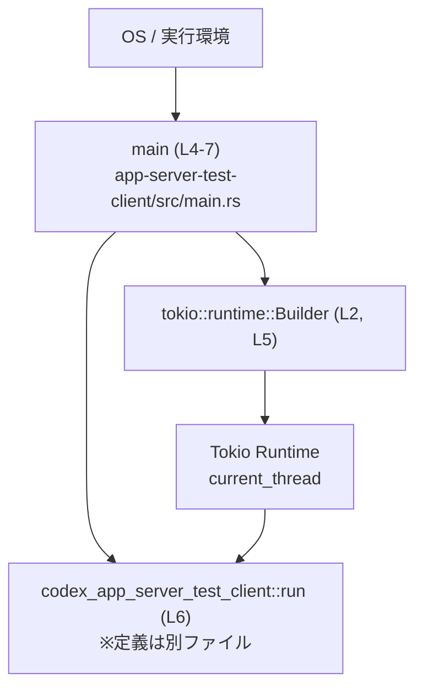
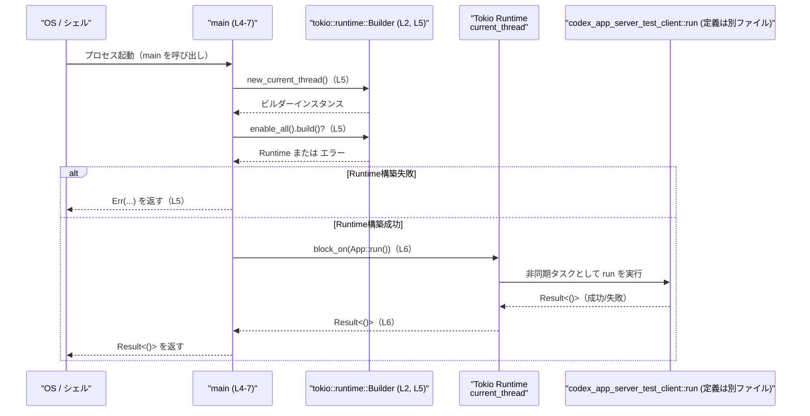

# app-server-test-client/src/main.rs コード解説

## 0. ざっくり一言

Tokio のシングルスレッドランタイムを初期化し、`codex_app_server_test_client` クレートの非同期エントリポイント `run` を同期的な `main` 関数から実行するための、最小限のバイナリエントリポイントです（`app-server-test-client/src/main.rs:L1-7`）。

---

## 1. このモジュールの役割

### 1.1 概要

- このファイルはバイナリクレートの `main` 関数を定義し、**非同期コードしか書けないメイン処理（`codex_app_server_test_client::run`）** を実行できるようにするための **Tokio ランタイムの立ち上げ** を行います（`L1-2, L4-6`）。
- エラー型には `anyhow::Result<()>` を使い、Tokio ランタイムの構築失敗や `run` の失敗を **1つの `Result` として OS に返す**構成になっています（`L1, L4-6`）。

### 1.2 アーキテクチャ内での位置づけ

このファイルは、プロセス開始時に呼び出される最上位レイヤーであり、アプリケーション本体（`codex_app_server_test_client` クレート）への橋渡しを行います。



- `OS` から呼び出される唯一の関数が `main` です（Rust の規約）。
- `main` は `tokio::runtime::Builder` を用いて `current_thread`（単一スレッド）ランタイムを生成します（`L2, L5`）。
- 生成したランタイムで `codex_app_server_test_client::run` を `block_on` し、**非同期処理を最後まで待ち合わせ**ます（`L6`）。
- `codex_app_server_test_client::run` の中身やファイル位置はこのチャンクには現れません（`L6` の呼び出しからのみ存在が分かります）。

### 1.3 設計上のポイント

コードから読み取れる設計上の特徴は次のとおりです。

- **責務の分割**
  - `main` は「ランタイム初期化とトップレベル呼び出し」のみに責務を限定しており、ビジネスロジックは `codex_app_server_test_client::run` に委譲しています（`L4-6`）。
- **状態管理**
  - `main` 自身は永続的な状態を持たず、一時的なローカル変数 `runtime` のみを扱います（`L5`）。
- **エラーハンドリング方針**
  - `Builder::build` の失敗や `run` の失敗を `?` 演算子でそのまま上位（OS）に伝搬する構造です（`L4-6`）。
  - `anyhow::Result<()>` を用いているため、詳細なエラー型は隠蔽され、**人間向けのエラーメッセージ中心**の扱いが想定されます（`L1, L4`）。
- **並行性モデル**
  - `Builder::new_current_thread()` を利用しているため、Tokio の **current-thread runtime**（単一スレッドランタイム）を使用します（`L5`）。
    - 非同期タスクは協調的にスケジューリングされますが、OS スレッドは 1 つに限定されます。
- **同期・非同期の橋渡し**
  - Rust の `main` は同期関数ですが、内部で `runtime.block_on(...)` を呼び出すことで **非同期関数 `run` を同期コンテキストから利用**しています（`L6`）。

---

## 2. 主要な機能一覧（コンポーネントインベントリー）

このファイル内のコンポーネント（関数）を一覧にします。

| 種別 | 名前 | 役割 / 用途 | 定義位置 |
|------|------|-------------|----------|
| 関数 | `main` | Tokio の current-thread ランタイムを構築し、`codex_app_server_test_client::run` を `block_on` で実行するバイナリエントリポイント | `app-server-test-client/src/main.rs:L4-7` |

このファイルには構造体や列挙体などの型定義は存在しません（コードからは確認できません）。

---

## 3. 公開 API と詳細解説

このファイル自体はバイナリクレートであり、外部からインポートして使う API は提供していません。  
ただし、プロセス起動時に OS から呼び出される `main` 関数は、このクレートの「公開エントリポイント」とみなせます。

### 3.1 型一覧（構造体・列挙体など）

このファイルには公開・非公開を問わず、構造体・列挙体などのユーザー定義型は定義されていません。

| 名前 | 種別 | 役割 / 用途 | 定義位置 |
|------|------|-------------|----------|
| （なし） | - | - | - |

### 3.2 関数詳細

#### `main() -> Result<()>`

**概要**

- Rust プログラム全体のエントリポイントです（`L4`）。
- Tokio の current-thread ランタイムを構築し（`L5`）、その上で `codex_app_server_test_client::run` を非同期タスクとして実行して終了まで待機します（`L6`）。
- ランタイム構築や `run` 内で発生したエラーを `anyhow::Result<()>` として OS に返します（`L1, L4-6`）。

**引数**

- 引数は取りません（Rust の通常の `fn main()` と同様）（`L4`）。

| 引数名 | 型 | 説明 |
|--------|----|------|
| （なし） | -  | この関数は引数を取りません。必要な設定・環境は `codex_app_server_test_client::run` 側で取得すると考えられます（コードからは詳細不明）。 |

**戻り値**

- 型: `anyhow::Result<()>`（`L1, L4`）
  - `Ok(())` の場合: プログラムが正常終了したことを意味します。
  - `Err(anyhow::Error)` の場合: ランタイム構築、または `codex_app_server_test_client::run` の内部でエラーが発生したことを意味します。

Rust のランタイムは `main` の戻り値を OS の終了コードに変換するため、`Err` の場合は通常非 0 の終了コードになります。

**内部処理の流れ（アルゴリズム）**

1. `tokio::runtime::Builder` を `use` しておきます（`L2`）。
2. `Builder::new_current_thread()` を呼び出し、current-thread ランタイムのビルダーを作成します（`L5`）。
3. `enable_all()` を呼び出して、タイマー・I/O ドライバなど Tokio の全機能を有効化します（`L5`）。
4. `build()?` を呼び、ランタイムを構築します。ここでエラーが出た場合、`?` により即座に `Err` を返して `main` を終了します（`L5`）。
5. 生成されたランタイムを `runtime` というローカル変数に束縛します（`L5`）。
6. `runtime.block_on(codex_app_server_test_client::run())` を呼び出し、非同期関数 `run` を完了するまで待機します（`L6`）。
   - `run` の戻り値は `Result<()>` 互換であると推測できますが、具体的なシグネチャはこのチャンクには現れません。
7. `block_on` の結果（`Result<()>`）を `main` の戻り値としてそのまま返します（`L6`）。

**処理フロー図（main (L4-7)）**

```mermaid
flowchart TD
    A["start main (L4)"] --> B["Builder::new_current_thread()（L5）"]
    B --> C["enable_all()（L5）"]
    C --> D["build()?（L5）"]
    D -->|Ok(runtime)| E["runtime.block_on(run())（L6）"]
    D -->|Err(e)| F["return Err(e) from main（L5, 暗黙）"]
    E --> G["return Result<()> from main（L6）"]
```

**Examples（使用例）**

`main` 自体は OS から呼ばれるため、通常は直接呼び出しませんが、**非同期関数を同期コンテキストで実行するパターン**のサンプルとして、似た構造を持つ関数を例示します。

```rust
use anyhow::Result;                                   // anyhow::Result を利用
use tokio::runtime::Builder;                          // Tokio ランタイムのビルダーを利用

async fn async_task() -> Result<()> {                 // 非同期関数（アプリ本体と同様の位置づけ）
    // ここで何らかの非同期処理を行う
    Ok(())                                            // 正常終了
}

fn main() -> Result<()> {                             // 同期な main 関数
    let runtime = Builder::new_current_thread()       // current-thread ランタイムを作成
        .enable_all()                                 // タイマーや I/O を有効化
        .build()?;                                    // 構築に失敗すると Err を返す

    runtime.block_on(async_task())                    // 非同期関数を最後まで実行し、その Result を返す
}
```

この例は、本ファイルの `main` が行っていることの簡略版です（`L4-6`）。

**Errors / Panics**

- `Result::Err` を返すケース
  - `Builder::build()` が失敗した場合（例: ランタイムの内部リソース確保失敗）  
    → `build()?` によって `Err(anyhow::Error)` が `main` の戻り値になります（`L5`）。
  - `codex_app_server_test_client::run()` が `Err` を返した場合  
    → `block_on` の戻り値として `Err` が返り、それが `main` の戻り値になります（`L6`）。
- `panic!` の可能性
  - このファイルに `panic!` を直接呼ぶコードはありません（`L1-7` からは確認できません）。
  - 間接的に、Tokio や `codex_app_server_test_client::run` 内部で `panic!` が発生する可能性はありますが、このチャンクからは判断できません。

**Edge cases（エッジケース）**

この `main` の挙動に関する代表的なエッジケースは次のとおりです。

- **ランタイム構築エラー**
  - 何らかの理由で `Builder::build()` が失敗した場合、`codex_app_server_test_client::run` は一切呼ばれません（`L5`）。
- **`run` 側のエラー**
  - `run` が `Err` を返した場合、そのまま `main` の戻り値になり、プロセスはエラー終了します（`L6`）。
- **`run` が長時間ブロックする場合**
  - `current_thread` ランタイムのため、`run` 内で CPU を占有するブロッキング処理があると、他の非同期タスク実行に影響が出ます。  
    ただし、`run` の実装はこのチャンクにはないため、具体的な影響は不明です。

**使用上の注意点**

- **非同期メインとの役割分担**
  - アプリの本体ロジックは `codex_app_server_test_client::run` 側に集中させ、この `main` にはランタイム構築以外の処理を増やしすぎないほうが構造が単純になります（`L4-6` のシンプルさから読み取れます）。
- **ランタイム種類の変更**
  - `new_current_thread()` は単一スレッドランタイムです。多コアを活用したい場合は `new_multi_thread()` に変更する選択肢がありますが、その場合はアプリ全体の並行性設計を確認する必要があります（Tokio の一般仕様）。
- **エラーの取り扱い**
  - `anyhow::Result` により、具体的なエラー型情報は `anyhow::Error` に包まれます。呼び出し元（OS やシェル）からは主に終了コードとログメッセージによってエラーを把握することになります。

### 3.3 その他の関数

このファイルには `main` 以外の関数は存在しません（`L1-7`）。

| 関数名 | 役割（1 行） | 定義位置 |
|--------|--------------|----------|
| （なし） | - | - |

---

## 4. データフロー

ここでは、プロセス起動からアプリ本体の非同期処理が完了するまでの **代表的なシナリオ** を示します。

1. OS がバイナリを実行し、`main` が呼び出されます（`L4`）。
2. `main` は Tokio の current-thread ランタイムを構築します（`L5`）。
3. 構築したランタイム上で `codex_app_server_test_client::run` を `block_on` し、非同期処理が完了するまで待機します（`L6`）。
4. `run` が返した `Result<()>` を OS に返してプロセスを終了します（`L6`）。

### シーケンス図（main (L4-7) を中心とした呼び出し）



`codex_app_server_test_client::run` 内部の詳細なデータフローは、このチャンクには現れません。

---

## 5. 使い方（How to Use）

### 5.1 基本的な使用方法

このファイルはバイナリエントリポイントなので、利用者は通常 **バイナリとして実行**します。

- ビルドと実行の例（バイナリ名やパッケージ名は `Cargo.toml` に依存するため、このチャンクからは不明）:

```bash
# 例: パッケージ名やバイナリ名を指定して実行する想定
cargo run --bin <バイナリ名>
```

コードレベルでの「使い方」は、**同期コードから非同期関数を呼び出すテンプレート**として参照できます。

```rust
use anyhow::Result;
use tokio::runtime::Builder;

fn main() -> Result<()> {
    // current-thread ランタイムの初期化
    let runtime = Builder::new_current_thread()
        .enable_all()
        .build()?;                               // 構築に失敗すると Err を返して終了

    // 任意の非同期関数を実行（ここでは run に相当）
    runtime.block_on(async {
        // 非同期処理をここに書く
        Ok(()) as Result<()>                     // anyhow::Result<()> を返却
    })
}
```

### 5.2 よくある使用パターン

この構造を利用した、代表的なパターンを挙げます。

1. **非同期ライブラリのサンプルバイナリ**
   - ライブラリクレート側に `async fn run(...) -> anyhow::Result<()>` を定義し、この `main` と同じパターンで呼び出す。
2. **テスト用クライアント**
   - ファイル名 `app-server-test-client/src/main.rs` から、アプリケーションサーバーをテストするクライアントとして利用される可能性がありますが、
     具体的な役割は `codex_app_server_test_client::run` の実装がないため断定できません。

### 5.3 よくある間違い

Tokio ランタイムと非同期関数呼び出しに関する、よくある誤用例と正しい例を示します。

```rust
// 誤り例: ランタイムを作らずに非同期関数を呼ぼうとしている
fn main() {
    // コンパイルエラー: async fn は Future を返すだけで、ここでは実行されない
    // codex_app_server_test_client::run();
}

// 正しい例: Tokio ランタイムを明示的に構築し、block_on で実行
use anyhow::Result;
use tokio::runtime::Builder;

fn main() -> Result<()> {
    let runtime = Builder::new_current_thread()
        .enable_all()
        .build()?;
    runtime.block_on(codex_app_server_test_client::run())
}
```

### 5.4 使用上の注意点（まとめ）

- **単一スレッドランタイム**
  - `new_current_thread()` により、すべての非同期タスクが 1 つの OS スレッド上で実行されます（`L5`）。  
    CPU 集約的な処理を多数走らせる用途には向きません。
- **ブロッキング処理の扱い**
  - `run` 内でブロッキング I/O や重い計算を直接実行すると、他の非同期タスクが進まなくなる可能性があります。  
    一般的には `tokio::task::spawn_blocking` の利用が推奨されますが、本チャンクから `run` の内容は分かりません。
- **エラーの伝播**
  - ランタイム構築や `run` の失敗は `Err` として OS に返されます（`L5-6`）。  
    ユーザーに分かりやすいエラーメッセージやログ出力は、`run` 側で行う必要があります。

---

## 6. 変更の仕方（How to Modify）

### 6.1 新しい機能を追加する場合

このファイルは最小限のエントリポイントなので、新機能の多くは **`codex_app_server_test_client` クレート側**に追加するのが自然です。  
それでもこのファイルを変更する場合の典型的なパターンを示します。

1. **異なるランタイム設定を使いたい場合**
   - 例: マルチスレッドランタイムを使う。

   ```rust
   let runtime = tokio::runtime::Builder::new_multi_thread()
       .enable_all()
       .build()?;
   ```

   - 変更箇所: `Builder::new_current_thread()` の部分（`L5`）。
2. **コマンドライン引数に応じて挙動を変えたい場合**
   - `main` 内で `std::env::args()` を取得し、それを `codex_app_server_test_client::run` に渡すように API を変更する、などが考えられます。
   - ただし、`run` のシグネチャがこのチャンクから分からないため、具体的な変更手順は不明です。

### 6.2 既存の機能を変更する場合

- **エラー型を変更したい**
  - 現在は `anyhow::Result<()>` を返します（`L1, L4`）。アプリケーションに特化したエラー型に変えたい場合は、戻り値型と `run` の戻り値型を揃える必要があります。
- **並行性の設計を変えたい**
  - `current_thread` から `multi_thread` に変えると、同時に多くのタスクを並列実行できますが、スレッド安全性の前提が変わるため、`run` 内部の設計を含めて再確認する必要があります。
- **影響範囲の確認**
  - このファイルから直接依存しているのは `tokio::runtime::Builder` と `codex_app_server_test_client::run` だけです（`L2, L5-6`）。  
    変更時は、`codex_app_server_test_client` 側のエクスポート API（`run` のシグネチャ）との整合性を確認することが重要です。

---

## 7. 関連ファイル

このモジュールと密接に関係するコンポーネントを一覧にします。

| パス / 名前 | 種別 | 役割 / 関係 |
|-------------|------|-------------|
| `codex_app_server_test_client::run` | クレート（lib）内関数 | `main` から `block_on` されるアプリケーション本体の非同期エントリポイント（`app-server-test-client/src/main.rs:L6` より呼び出しのみ確認可能。定義ファイルパスはこのチャンクには現れません） |
| `Cargo.toml` | 設定ファイル | このバイナリクレートのパッケージ名・バイナリ名・依存関係（`anyhow`, `tokio` など）を定義していると考えられますが、内容はこのチャンクには現れません。 |

---

### 参考: 根拠行番号の要約

- `anyhow::Result` の利用: `use anyhow::Result;`（`app-server-test-client/src/main.rs:L1`）
- Tokio ランタイムビルダーの利用: `use tokio::runtime::Builder;`（`L2`）
- `main` 関数の定義: `fn main() -> Result<()> { ... }`（`L4-7`）
- current-thread ランタイム + enable_all + build:  
  `let runtime = Builder::new_current_thread().enable_all().build()?;`（`L5`）
- 非同期エントリポイント `run` の実行:  
  `runtime.block_on(codex_app_server_test_client::run())`（`L6`）

この範囲外の挙動や実装については、このチャンクからは分かりません。
