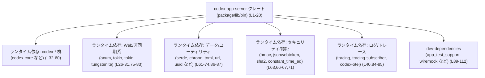
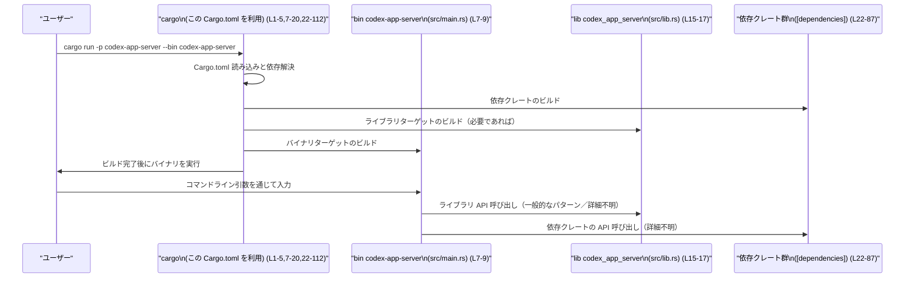

# app-server/Cargo.toml コード解説

## 0. ざっくり一言

`app-server/Cargo.toml` は、ワークスペース内のクレート `codex-app-server` の **ライブラリ 1つとバイナリ 2つのビルドターゲット**、およびそれらが利用する **実行時・テスト用の依存クレート** を定義するマニフェストファイルです（`Cargo.toml:L1-5,7-20,22-112`）。

---

## 1. このモジュールの役割

### 1.1 概要

- このファイルは Rust のビルドツール Cargo 用のマニフェストであり、このクレートの
  - パッケージ情報（名前・バージョン・エディション・ライセンス）  
  - ビルドターゲット（ライブラリ・バイナリ）
  - 実行時依存 (`[dependencies]`)
  - テストなど開発時専用依存 (`[dev-dependencies]`)  
  を定義します（`Cargo.toml:L1-5,7-20,22-112`）。
- バージョン・エディション・ライセンス・依存バージョン・リント設定はすべてワークスペース側で一元管理されており、ここでは `workspace = true` として参照だけを行っています（`Cargo.toml:L3-4,20,23-24,32-87,89-111`）。

※ このファイル自体には **関数・構造体・ロジックは一切定義されていません**。Rust コードは `src/lib.rs` や `src/main.rs` 側に存在します（`Cargo.toml:L9,13,17`）。

### 1.2 アーキテクチャ内での位置づけ

この Cargo.toml から読み取れる範囲では、`codex-app-server` クレートは次のような位置づけになります。

- ワークスペース `codex-*` 群の一員であり、複数の `codex-` 系クレート（`codex-core`, `codex-protocol`, `codex-app-server-protocol` など）に依存しています（`Cargo.toml:L32-60`）。
- Web サーバーや WebSocket を扱うための依存（`axum`, `tokio`, `tokio-tungstenite`）を持ち、非同期サーバーアプリケーションであることが示唆されます（`Cargo.toml:L26-31,75-83`）。
- ログ・トレース・メトリクス用の依存（`tracing`, `tracing-subscriber`, `codex-otel`, `opentelemetry`, `opentelemetry_sdk`, `tracing-opentelemetry`）が設定されており、観測性が考慮された構成になっています（`Cargo.toml:L40,84-85,99-100,110`）。

依存関係の観点から見た高レベルな位置づけを Mermaid で表すと次のようになります。



ここでの矢印は「Cargo.toml 上で依存が宣言されている」ことのみを表し、実際にどの関数がどのクレートを呼び出すかといった **コードレベルの呼び出し関係は、このファイルだけでは分かりません**。

### 1.3 設計上のポイント（このファイルから読み取れる範囲）

- **ライブラリ + 複数バイナリ構成**  
  - ライブラリ `codex_app_server`（`Cargo.toml:L15-17`）と、バイナリ `codex-app-server` / `codex-app-server-test-notify-capture`（`Cargo.toml:L7-13`）を同一クレート内で定義しています。  
  - 一般的には、共通ロジックをライブラリに置き、バイナリはエントリポイントとしてライブラリを利用する構成が多いですが、実際のコード構造はこのファイルからは分かりません。
- **ワークスペースによる一元管理**  
  - ほぼすべての依存で `workspace = true` を使っており、バージョンや一部の feature 設定をワークスペース側に委ねています（`Cargo.toml:L3-4,20,23-24,32-87,89-111`）。
- **非同期・並行処理を前提とした構成**  
  - `tokio` に `rt-multi-thread` feature を有効化しており、マルチスレッドランタイム上での非同期処理を前提としていることが分かります（`Cargo.toml:L75-80`）。
  - `axum` で `http1`, `json`, `tokio`, `ws` feature を有効化しているため、HTTP/1 サーバーと WebSocket、JSON を扱う Web アプリケーションを構築するための準備がされています（`Cargo.toml:L26-31`）。  
    ただし、実際にどのエンドポイントが存在するかなどの詳細は不明です。
- **観測性・テレメトリへの配慮**  
  - ランタイム依存として `tracing`, `tracing-subscriber`, `codex-otel`、開発時依存として `opentelemetry`, `opentelemetry_sdk`, `tracing-opentelemetry` が設定されており（`Cargo.toml:L40,84-85,99-100,110`）、ログやトレース、メトリクスの出力が想定されますが、どの程度の計測が行われているかは不明です。
- **セキュリティ関連の依存**  
  - `hmac`, `jsonwebtoken`, `sha2`, `constant_time_eq` などのクレートが依存に含まれており（`Cargo.toml:L63,66-67,71`）、認証・署名・ハッシュなどの処理を行う可能性があります。  
    ただし、具体的な鍵管理やアルゴリズムの使い方はコードを見ないと分かりません。

---

## 2. 主要な機能一覧（コンポーネントインベントリー）

このファイル自身には関数や構造体はありませんが、「ビルドターゲット」および「依存クレート」をコンポーネントとして整理します。

### 2.1 ビルドターゲット一覧

| コンポーネント名 | 種別 | 役割（このファイルから分かる範囲） | 根拠 |
|------------------|------|--------------------------------------|------|
| `codex_app_server` | ライブラリクレート (`[lib]`) | このクレートのライブラリターゲット。Rust コードは `src/lib.rs` に存在します。中身の API やロジックはこのファイルからは分かりません。 | `Cargo.toml:L15-17` |
| `codex-app-server` | バイナリターゲット (`[[bin]]`) | メインバイナリ。エントリポイントは `src/main.rs`。通常、このファイルが実行可能アプリケーションの `main` 関数を持ちますが、実際の処理内容は不明です。 | `Cargo.toml:L7-9` |
| `codex-app-server-test-notify-capture` | バイナリターゲット (`[[bin]]`) | テストや通知関連の補助バイナリであることが名前から推測されますが、用途はコードからは確認できません。エントリポイントは `src/bin/notify_capture.rs`。 | `Cargo.toml:L11-13` |

> ※ バイナリ名やパスから用途を推測できますが、**実際に何をするかは Rust コード側を見ないと確定できません**。

### 2.2 実行時依存クレート一覧（[dependencies]）

> 種別「外部」は一般的な crates.io 由来クレートを指し、「ワークスペース」は `codex-*` などワークスペース内/共通管理の依存を指します（`workspace = true` の有無に基づきますが、実際に自前実装かどうかはルートの Cargo.toml を見ないと断定できません）。

| クレート名 | 種別 | おおまかな用途（クレート自体の一般的な役割）※利用箇所は不明 | 根拠 |
|-----------|------|------------------------------------------------|------|
| `anyhow` | 外部 | エラーをまとめて扱うための汎用エラー型・ユーティリティ。 | `Cargo.toml:L23` |
| `async-trait` | 外部 | 非同期関数を含むトレイトを定義するためのマクロ。 | `Cargo.toml:L24` |
| `base64` | 外部 | Base64 エンコード／デコード。 | `Cargo.toml:L25` |
| `axum` | 外部 | 非同期 HTTP サーバー／Web フレームワーク。`http1`,`json`,`tokio`,`ws` feature が有効。 | `Cargo.toml:L26-31` |
| `codex-analytics` | ワークスペース | 分析・トラッキング関連の内部機能を提供している可能性がありますが、具体的用途は不明です。 | `Cargo.toml:L32` |
| `codex-arg0` | ワークスペース | 詳細不明（名前からはプロセス名関連が想定されますが、断定不可）。 | `Cargo.toml:L33` |
| `codex-cloud-requirements` | ワークスペース | 詳細不明。クラウド要件管理に関係する可能性がありますが、このファイルだけでは分かりません。 | `Cargo.toml:L34` |
| `codex-config` | ワークスペース | 設定管理機能を持つと推測されますが、詳細不明。 | `Cargo.toml:L35` |
| `codex-core` | ワークスペース | プロジェクトのコアドメインロジックを含む可能性がありますが、未確認。 | `Cargo.toml:L36` |
| `codex-exec-server` | ワークスペース | 「exec server」という名前からコード実行関連のサーバー機能と推測されますが、詳細不明。 | `Cargo.toml:L37` |
| `codex-features` | ワークスペース | フィーチャーフラグ管理の可能性がありますが、断定できません。 | `Cargo.toml:L38` |
| `codex-git-utils` | ワークスペース | Git 操作用ユーティリティと推測されますが、詳細不明。 | `Cargo.toml:L39` |
| `codex-otel` | ワークスペース | OpenTelemetry 連携を提供すると思われますが、実装詳細は不明。 | `Cargo.toml:L40` |
| `codex-shell-command` | ワークスペース | シェルコマンドの実行ラッパーと推測されますが、未確認。 | `Cargo.toml:L41` |
| `codex-utils-cli` | ワークスペース | CLI 用ユーティリティと推測されますが、未確認。 | `Cargo.toml:L42` |
| `codex-utils-pty` | ワークスペース | 擬似端末(PTY)操作支援と推測されますが、未確認。 | `Cargo.toml:L43` |
| `codex-backend-client` | ワークスペース | バックエンド通信クライアントと推測されますが、未確認。 | `Cargo.toml:L44` |
| `codex-file-search` | ワークスペース | ファイル検索機能と推測されますが、未確認。 | `Cargo.toml:L45` |
| `codex-chatgpt` | ワークスペース | ChatGPT 連携機能と推測されますが、未確認。 | `Cargo.toml:L46` |
| `codex-login` | ワークスペース | ログイン認証機能と推測されますが、未確認。 | `Cargo.toml:L47` |
| `codex-mcp` | ワークスペース | 「MCP」に関連する機能（具体内容は不明）と推測されます。 | `Cargo.toml:L48` |
| `codex-models-manager` | ワークスペース | モデル管理機能と推測されますが、未確認。 | `Cargo.toml:L49` |
| `codex-protocol` | ワークスペース | 共通プロトコル定義と推測されますが、未確認。 | `Cargo.toml:L50` |
| `codex-app-server-protocol` | ワークスペース | アプリサーバー固有のプロトコル定義と推測されますが、未確認。 | `Cargo.toml:L51` |
| `codex-feedback` | ワークスペース | フィードバック管理機能と推測されますが、未確認。 | `Cargo.toml:L52` |
| `codex-rmcp-client` | ワークスペース | `rmcp` 関連クライアント機能と推測されますが、未確認。 | `Cargo.toml:L53` |
| `codex-rollout` | ワークスペース | 機能ロールアウト管理と推測されますが、未確認。 | `Cargo.toml:L54` |
| `codex-sandboxing` | ワークスペース | サンドボックス実行機能と推測されますが、未確認。 | `Cargo.toml:L55` |
| `codex-state` | ワークスペース | 状態管理機能と推測されますが、未確認。 | `Cargo.toml:L56` |
| `codex-tools` | ワークスペース | 各種ツール群と推測されますが、未確認。 | `Cargo.toml:L57` |
| `codex-utils-absolute-path` | ワークスペース | 絶対パス操作ユーティリティと推測されますが、未確認。 | `Cargo.toml:L58` |
| `codex-utils-json-to-toml` | ワークスペース | JSON→TOML 変換ユーティリティと推測されますが、未確認。 | `Cargo.toml:L59` |
| `codex-utils-rustls-provider` | ワークスペース | Rustls 関連のユーティリティと推測されますが、未確認。 | `Cargo.toml:L60` |
| `chrono` | 外部 | 日時・時刻操作ライブラリ。 | `Cargo.toml:L61` |
| `clap` | 外部 | コマンドライン引数パーサー。`derive` feature が有効。 | `Cargo.toml:L62` |
| `constant_time_eq` | 外部 | タイミング攻撃対策のための定数時間比較。 | `Cargo.toml:L63` |
| `futures` | 外部 | Future/Stream 等の非同期ユーティリティ。 | `Cargo.toml:L64` |
| `gethostname` | 外部 | ホスト名取得。 | `Cargo.toml:L65` |
| `hmac` | 外部 | HMAC 実装。 | `Cargo.toml:L66` |
| `jsonwebtoken` | 外部 | JSON Web Token(JWT) 処理。 | `Cargo.toml:L67` |
| `owo-colors` | 外部 | カラフルなターミナル出力。 | `Cargo.toml:L68` |
| `serde` | 外部 | シリアライズ／デシリアライズ。`derive` feature が有効。 | `Cargo.toml:L69` |
| `serde_json` | 外部 | JSON のシリアライズ／デシリアライズ。 | `Cargo.toml:L70` |
| `sha2` | 外部 | SHA-2 系ハッシュ関数。 | `Cargo.toml:L71` |
| `tempfile` | 外部 | 一時ファイル操作。 | `Cargo.toml:L72` |
| `time` | 外部 | 日時・時間操作ライブラリ。 | `Cargo.toml:L73` |
| `toml` | 外部 | TOML のシリアライズ／デシリアライズ。 | `Cargo.toml:L74` |
| `tokio` | 外部 | 非同期ランタイム。`io-std`,`macros`,`process`,`rt-multi-thread`,`signal` feature が有効。 | `Cargo.toml:L75-80` |
| `tokio-util` | 外部 | Tokio 用ユーティリティ。 | `Cargo.toml:L82` |
| `tokio-tungstenite` | 外部 | WebSocket (tungstenite) を Tokio で扱うためのクレート。 | `Cargo.toml:L83` |
| `tracing` | 外部 | 構造化ログ／トレース。`log` feature 有効。 | `Cargo.toml:L84` |
| `tracing-subscriber` | 外部 | `tracing` 用サブスクライバ（ログ出力など）。`env-filter`,`fmt`,`json` feature 有効。 | `Cargo.toml:L85` |
| `url` | 外部 | URL パース・操作。 | `Cargo.toml:L86` |
| `uuid` | 外部 | UUID 生成・操作。`serde`,`v7` feature 有効。 | `Cargo.toml:L87` |

### 2.3 開発時依存クレート一覧（[dev-dependencies]）

| クレート名 | 種別 | 一般的な用途（テスト・開発補助） | 根拠 |
|-----------|------|-----------------------------------|------|
| `app_test_support` | ワークスペース | アプリケーションテスト向け共通ユーティリティと推測されますが、詳細不明。 | `Cargo.toml:L90` |
| `base64` | 外部 | テストでの Base64 処理。 | `Cargo.toml:L91` |
| `axum` | 外部 | テストで HTTP サーバー/クライアント動作を検証する際に使用される可能性があります。 | `Cargo.toml:L92-96` |
| `core_test_support` | ワークスペース | コアロジック用テストユーティリティと推測されますが、詳細不明。 | `Cargo.toml:L97` |
| `codex-utils-cargo-bin` | ワークスペース | Cargo バイナリのテストラッパーと推測されますが、詳細不明。 | `Cargo.toml:L98` |
| `opentelemetry` | 外部 | OpenTelemetry API。テストでトレース・メトリクスの検証に使用される可能性があります。 | `Cargo.toml:L99` |
| `opentelemetry_sdk` | 外部 | OpenTelemetry SDK 実装。 | `Cargo.toml:L100` |
| `pretty_assertions` | 外部 | アサーション失敗時の見やすい差分表示。 | `Cargo.toml:L101` |
| `reqwest` | 外部 | HTTP クライアント。`rustls-tls` feature 有効。 | `Cargo.toml:L102` |
| `rmcp` | 外部 | 「rmcp」プロトコルのサーバー/クライアント実装。ここでは `elicitation`,`server`,`transport-streamable-http-server` feature が有効。 | `Cargo.toml:L103-107` |
| `serial_test` | 外部 | テストを直列実行にするためのヘルパー。 | `Cargo.toml:L108` |
| `tokio-tungstenite` | 外部 | WebSocket テスト用。 | `Cargo.toml:L109` |
| `tracing-opentelemetry` | 外部 | `tracing` と OpenTelemetry の連携。 | `Cargo.toml:L110` |
| `wiremock` | 外部 | HTTP モックサーバーによるテスト。 | `Cargo.toml:L111` |
| `shlex` | 外部 | シェル風コマンドライン文字列のパース。テストでのコマンド生成などに使用される可能性があります。 | `Cargo.toml:L112` |

---

## 3. 公開 API と詳細解説

### 3.1 型一覧（構造体・列挙体など）

- このファイルは Cargo の設定ファイルであり、**Rust の型定義（構造体・列挙体など）は一切含まれていません**。
- 型や API は `src/lib.rs` やその他の `.rs` ファイル内に定義されますが、その内容はこのチャンクには現れません。

### 3.2 関数詳細（最大 7 件）

- `Cargo.toml` 自体は関数を定義しないため、詳細解説すべき関数は **存在しません**。
- 「公開 API とコアロジック」は、ライブラリクレート `codex_app_server` の Rust コード側にありますが、ここでは参照できないため説明できません。

### 3.3 その他の関数

- 同様の理由で、補助的な関数の一覧もこのファイルからは作成できません。

---

## 4. データフロー（ビルド・実行の観点）

アプリケーション内部のデータフローはコードがないと分かりませんが、この `Cargo.toml` から読み取れる **ビルド〜実行までの一般的なフロー** を示します。

- ユーザーが `cargo run -p codex-app-server --bin codex-app-server` のようなコマンドを実行すると、Cargo はこの `Cargo.toml` を読み込み、依存クレートを解決・ビルドしてから `src/main.rs` のバイナリを起動します（`Cargo.toml:L1-5,7-9,22-87`）。
- バイナリ側のコードは、必要に応じてライブラリ `codex_app_server`（`src/lib.rs`）や各種依存クレートの API を利用しますが、どのようなデータがどのクレートを経由するかはここからは分かりません。

このビルド・実行の流れを簡略化したシーケンス図を示します。



> 図中の「Lib→Deps」などの呼び出しは **一般的な Rust クレート構成に基づくパターン** を示したものであり、`codex-app-server` が実際に同じ構成であるかは、このファイルからは確認できません。

---

## 5. 使い方（How to Use）

### 5.1 基本的な使用方法（ビルド・実行）

このクレートをビルド・実行するときの典型的なコマンド例を示します。

```bash
# パッケージ codex-app-server のメインバイナリを実行する          # Cargo に対して、codex-app-server パッケージの
cargo run -p codex-app-server --bin codex-app-server -- <args>   # bin ターゲット "codex-app-server" を実行するよう指示する

# テスト用バイナリ codex-app-server-test-notify-capture を実行する例
cargo run -p codex-app-server --bin codex-app-server-test-notify-capture -- <args>
```

- `-p codex-app-server` はパッケージ名（`Cargo.toml:L2`）、`--bin` はバイナリ名（`Cargo.toml:L7-13`）に対応します。
- 実際にどのような引数を受け付けるかは、`clap` とバイナリ側のコードの実装に依存します（`Cargo.toml:L62`）。

### 5.2 ライブラリとしての利用（他クレートから）

他のクレートから `codex_app_server` ライブラリを利用する場合の例です。ここでは一般的な Cargo の書き方を示します。

```toml
# 他クレート側の Cargo.toml 例
[dependencies]
codex-app-server = { path = "../app-server" }  # 実際のパスはプロジェクト構成によって異なる
```

```rust
// 他クレート側の Rust コード例（擬似的な例）                    // codex-app-server ライブラリを利用する側のコード例
use codex_app_server;                                              // Cargo.toml で指定した名前でライブラリクレートを参照する

fn main() {                                                        // 自クレートのエントリポイント
    // ライブラリ内の API を呼ぶ（具体的な関数名はこのチャンクからは不明）  // 実際には codex_app_server 内の公開関数を呼び出す
    // codex_app_server::run_server(...);                          // ※ ここはイメージであり、実在関数名ではありません
}
```

> 上記の Rust コードは **利用イメージ** であり、`codex_app_server` 内にどのような関数があるかはこのチャンクでは分からないため、関数名などは仮です。

### 5.3 テストの実行

開発時依存 (`[dev-dependencies]`) が多数登録されているため、テストでは HTTP 通信・WebSocket・トレース・モックサーバーなどを利用している可能性があります（`Cargo.toml:L89-112`）。

一般的なテスト実行コマンドは次の通りです。

```bash
# パッケージ codex-app-server のテストを実行                 # Cargo に対して codex-app-server パッケージのテスト実行を指示
cargo test -p codex-app-server

# 特定のテストターゲットやフィーチャーを付けることも可能
cargo test -p codex-app-server -- --nocapture
```

テストコードがどこにあるか（`tests/` ディレクトリや `src/` 配下など）は、このファイルからは分かりません。

### 5.4 使用上の注意点（このファイルに関するもの）

- **ワークスペース依存に注意**  
  - ほとんどの依存が `workspace = true` で定義されているため（`Cargo.toml:L3-4,20,23-24,32-87,89-111`）、バージョン変更や feature 変更はルートのワークスペース設定に影響します。  
    個別クレートだけの挙動を変えたい場合、ワークスペース設定との整合性を意識する必要があります。
- **並行性・非同期ランタイムの前提**  
  - `tokio` を `rt-multi-thread` で利用しているため（`Cargo.toml:L75-80`）、コード側では Tokio 非同期ランタイム上で安全に動作するような設計（`Send`/`Sync` 制約など）が必要になりますが、その遵守状況はこのファイルからは確認できません。
- **セキュリティ関連のライブラリ利用**  
  - `hmac`, `sha2`, `jsonwebtoken`, `constant_time_eq` などが含まれているため（`Cargo.toml:L63,66-67,71`）、コード側では鍵管理やアルゴリズム選択を慎重に行う必要があります。  
    ただし、具体的なバグや脆弱性の有無はコードがないと評価できません。
- **Bugs / Security 観点（このファイルに限った話）**  
  - この `Cargo.toml` の記述だけからは、明らかな設定ミス（例: 同一クレートの矛盾したバージョン指定など）は見当たりません。  
  - ただし、多数の依存クレートを利用しているため、サプライチェーンの観点ではそれぞれのクレートのバージョン・既知の脆弱性をワークスペース側で継続的にチェックする必要があります（ここではバージョン情報自体が見えないため、詳細は不明です）。
- **Contracts / Edge Cases（このファイルレベル）**  
  - `[lib]` や `[[bin]]` で指定された `path` が実際に存在しない場合、ビルドエラーになります（`Cargo.toml:L7-9,11-13,15-17`）。  
    このチャンクでは、該当 `.rs` ファイルの存在有無までは確認できません。
  - `[dependencies]` で宣言されているクレートがワークスペースや crates.io に存在しない場合もビルドエラーとなりますが、ここからは存在確認はできません。

---

## 6. 変更の仕方（How to Modify）

### 6.1 新しい機能を追加する場合（Cargo.toml 観点）

このファイルに対して行う、代表的な変更パターンと注意点です。

1. **新しいバイナリを追加する**
   - `[[bin]]` セクションを追加し、`name` と `path` を指定します（`Cargo.toml:L7-13` を参考にします）。
   - 対応する `src/bin/<name>.rs` などのファイルを作成する必要があります。  
   - `path` が既存ファイルと衝突しないか、ワークスペース内の命名規則に沿っているかを確認する必要があります。

   ```toml
   [[bin]]
   name = "codex-app-server-new-tool"   # 新バイナリ名
   path = "src/bin/new_tool.rs"         # エントリポイントファイルのパス
   ```

2. **依存クレートを追加する**
   - 新しい機能に必要なクレートを `[dependencies]` セクションに追加します（`Cargo.toml:L22-87`）。
   - 既にワークスペースレベルで管理されているクレートであれば `workspace = true` を使い、それ以外は `version = "..."` を明示するなど、ワークスペースのルールに合わせる必要があります（ルート設定はこのチャンクには現れません）。

3. **dev-dependencies を追加してテストを強化する**
   - HTTP モックやスナップショットテストなどが必要な場合は、`[dev-dependencies]` に新しいクレートを追加します（`Cargo.toml:L89-112`）。
   - 本番コードからは参照しないように、`dev-dependencies` に留める点に注意が必要です。

### 6.2 既存の機能を変更する場合（Cargo.toml 観点）

- **依存クレートの削除・変更**
  - あるクレートを削除する場合、そのクレートを参照しているすべての Rust ファイルを修正する必要があります。  
    どこで参照されているかはこのファイルだけでは分からないため、IDE や `rg`, `cargo tree` などで検索する必要があります。
- **Tokio ランタイム設定の変更**
  - `tokio` の feature を変更（例: `rt-multi-thread` を外す）すると、コード側で `#[tokio::main(flavor = "multi_thread")]` を使っているかどうかなどとの整合性が問題になります（`Cargo.toml:L75-80`）。  
    コード側とランタイム設定の契約（前提条件）を崩さないよう注意が必要です。
- **観測性（tracing/otel）設定の変更**
  - `tracing` や `codex-otel`, `opentelemetry` の依存構成を変更すると、ログやトレース出力の形式が変わったり使えなくなったりします（`Cargo.toml:L40,84-85,99-100,110`）。  
    これらを前提にしている監視基盤が存在する場合、変更の影響範囲を事前に確認する必要があります。

#### テストとの関係

- `rmcp`, `wiremock`, `reqwest`, `tokio-tungstenite` などはおそらく自動テストで使われているため（`Cargo.toml:L102-103,109,111`）、削除・バージョン変更時には対象テストの動作確認が必須です。
- このファイルからは具体的なテストケースは分かりませんが、「HTTP 通信・WebSocket・テレメトリ」を扱う統合テストが存在する可能性があります。

#### パフォーマンス・スケーラビリティへの影響（Cargo.toml レベル）

- 依存クレートや有効化する feature を増やすほど、バイナリサイズやビルド時間、潜在的なランタイムオーバーヘッドが大きくなります。
- `tokio` の `rt-multi-thread` を利用しているため、スレッド数やスケジューリングはコード側またはランタイムの設定に依存しますが、シングルスレッド構成よりも複雑な並行性を持つことになります（`Cargo.toml:L75-80`）。

#### リファクタリングの方向性（このファイルに限って）

- `codex-*` 系クレートが多いため、責務ごとにクレート分割されている構成と推測されますが、どの境界で分かれているかは不明です（`Cargo.toml:L32-60`）。
- Cargo.toml レベルでのリファクタリングとしては、機能ごとに依存クレートを feature で切り分ける（`features` セクションの追加）などが考えられますが、現時点では feature 定義はこのファイルには現れていません。

#### 観測性（Observability）

- ランタイム依存の `tracing`, `tracing-subscriber`, `codex-otel` と dev-dependency の `opentelemetry`, `opentelemetry_sdk`, `tracing-opentelemetry` から、ログ・トレース・メトリクスの導入が想定されます（`Cargo.toml:L40,84-85,99-100,110`）。
- しかし、実際にどのスパンがどのように記録されているか、どこまでカバレッジがあるかはコードを見ないと評価できません。

---

## 7. 関連ファイル

この Cargo.toml から直接参照されているファイル、および関連しうる設定ファイルをまとめます。

| パス | 役割 / 関係 | 根拠 |
|------|-------------|------|
| `src/main.rs` | バイナリターゲット `codex-app-server` のエントリポイント。`main` 関数が定義されていると考えられますが、実際の中身は不明です。 | `Cargo.toml:L7-9` |
| `src/bin/notify_capture.rs` | バイナリターゲット `codex-app-server-test-notify-capture` のエントリポイント。用途は名前から推測されますが、コードはこのチャンクには現れません。 | `Cargo.toml:L11-13` |
| `src/lib.rs` | ライブラリクレート `codex_app_server` のルート。公開 API やコアロジックが定義されていると推測されますが、詳細は不明です。 | `Cargo.toml:L15-17` |
| （ワークスペースルートの `Cargo.toml` など） | このファイルで `workspace = true` が多用されていることから、ワークスペースルートでバージョンや共通依存が定義されていると分かりますが、ファイルパスや内容はこのチャンクには現れません。 | `Cargo.toml:L3-4,20,23-24,32-87,89-111` |

> テストコードや追加の設定ファイル（`tests/` ディレクトリ、`build.rs` など）が存在するかどうかは、このチャンクからは分かりません。
