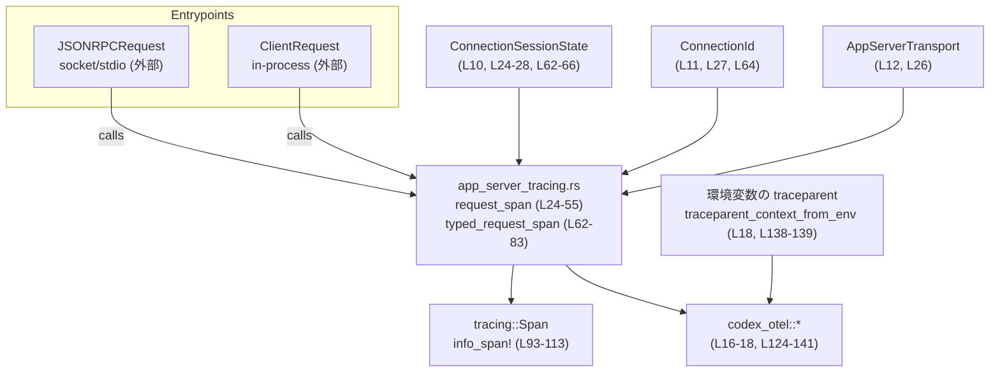
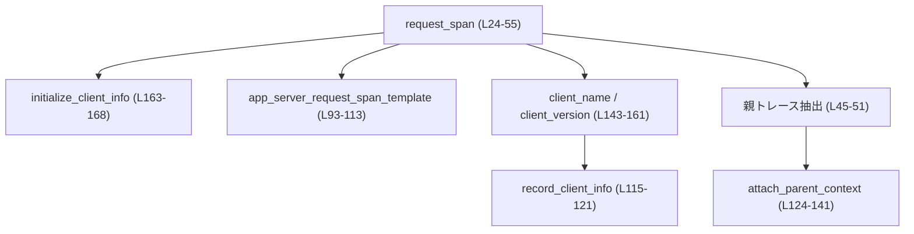
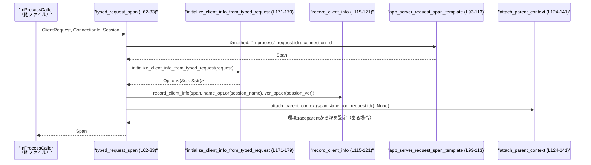

# app-server/src/app_server_tracing.rs コード解説

## 0. ざっくり一言

- JSON-RPC 経由・インプロセス経由の両方のリクエストに対して、**同じ形の tracing span** を生成し、クライアント情報と親トレースコンテキストを付与するためのヘルパー関数群です（`request_span`, `typed_request_span` など, app_server_tracing.rs:L24-55, L62-83）。

---

## 1. このモジュールの役割

### 1.1 概要

- このモジュールは、**アプリケーションサーバーが受け取るリクエストのトレース情報（span）を一元的に構築する**ために存在し、次の機能を提供します。
  - JSON-RPC メッセージから span を構築 (`request_span`, app_server_tracing.rs:L24-55)。
  - 型付きの in-process リクエストから span を構築 (`typed_request_span`, app_server_tracing.rs:L62-83)。
  - span にクライアント名・バージョン・接続 ID などの属性を一貫した形で設定（`app_server_request_span_template`, `record_client_info`, app_server_tracing.rs:L93-113, L115-121）。
  - W3C Trace Context を用いた親トレースコンテキストの設定（`attach_parent_context`, app_server_tracing.rs:L124-141）。

### 1.2 アーキテクチャ内での位置づけ

このモジュールは「エントリポイント」と「tracing / OpenTelemetry インフラ」の間に位置する薄いアダプタです。

- 上流:
  - JSON-RPC 経由のエントリポイント（ソケット / stdio）から `JSONRPCRequest` が渡されます（app_server_tracing.rs:L24-28）。
  - インプロセス呼び出しから `ClientRequest` が渡されます（app_server_tracing.rs:L62-65）。
  - 接続状態 `ConnectionSessionState` と接続 ID `ConnectionId` が付随します（app_server_tracing.rs:L24-28, L62-65）。
- 下流:
  - `tracing::info_span!` で `Span` を生成し（app_server_tracing.rs:L93-113）、`codex_otel` のヘルパーで親コンテキストを設定します（app_server_tracing.rs:L124-141）。

このチャンク（L1-179）における主な依存関係を図示すると次のようになります。



> 図中の関数はすべて本チャンク `app_server_tracing.rs:L1-179` 内に定義されています。

### 1.3 設計上のポイント

- **span 形状の統一**  
  - JSON-RPC と in-process の両方で `app_server.request` という同じ span 名と OTEL 属性セットを使用しています（app_server_tracing.rs:L93-113）。
- **クライアント情報の一貫した解決**  
  - `initialize` リクエストのパラメータからクライアント名・バージョンを取得し（app_server_tracing.rs:L163-168）、なければ接続セッション状態から補完します（`client_name`, `client_version`, app_server_tracing.rs:L143-161）。
- **トレース親コンテキストの二段階取得**  
  - まずリクエストに埋め込まれた W3C Trace Context を優先し（app_server_tracing.rs:L45-51, L124-137）、なければ環境変数から取得します（app_server_tracing.rs:L138-139）。
- **エラー時はフェイルソフト**  
  - 不正なトレースコンテキストは `warn` ログを出して無視し（app_server_tracing.rs:L131-137）、初期化パラメータの JSON パース失敗も `None` として扱います（app_server_tracing.rs:L167-168）。パニックにはなりません。
- **状態を持たない純粋なヘルパー群**  
  - グローバル状態や可変な共有状態はなく、すべての関数は引数のみから結果を返す純粋なヘルパーとして実装されています（全体的に `&T` 参照のみを受け取り、`&mut` や `static mut` が存在しないことから確認できます）。

---

## 2. 主要な機能一覧（コンポーネントインベントリー）

### 2.1 機能概要

- JSON-RPC リクエストからの span 構築: `request_span`（app_server_tracing.rs:L24-55）
- 型付き in-process リクエストからの span 構築: `typed_request_span`（app_server_tracing.rs:L62-83）
- トランスポート種別から OTEL 用文字列への変換: `transport_name`（app_server_tracing.rs:L85-91）
- 共通 span テンプレートの生成: `app_server_request_span_template`（app_server_tracing.rs:L93-113）
- クライアント情報属性の記録: `record_client_info`（app_server_tracing.rs:L115-121）
- 親トレースコンテキストの設定: `attach_parent_context`（app_server_tracing.rs:L124-141）
- クライアント名・バージョンの解決: `client_name`, `client_version`（app_server_tracing.rs:L143-161）
- `initialize` パラメータからのクライアント情報抽出:
  - JSON 値から `InitializeParams` へパース: `initialize_client_info`（app_server_tracing.rs:L163-168）
  - 型付きリクエストからの抽出: `initialize_client_info_from_typed_request`（app_server_tracing.rs:L171-179）

### 2.2 関数インベントリー表

| 名前 | 種別 | 概要 | 定義位置 |
|------|------|------|----------|
| `request_span` | 関数（pub(crate)） | JSON-RPC リクエストから span を構築し、親トレース・クライアント情報を設定して返す | app_server_tracing.rs:L24-55 |
| `typed_request_span` | 関数（pub(crate)） | 型付き in-process リクエストから span を構築し、クライアント情報を設定して返す | app_server_tracing.rs:L62-83 |
| `transport_name` | 関数（private） | `AppServerTransport` を OTEL の `rpc.transport` 用文字列に変換 | app_server_tracing.rs:L85-91 |
| `app_server_request_span_template` | 関数（private） | 共通の OTEL 属性を持つ `Span` を生成するテンプレート | app_server_tracing.rs:L93-113 |
| `record_client_info` | 関数（private） | span にクライアント名・バージョン属性を記録 | app_server_tracing.rs:L115-121 |
| `attach_parent_context` | 関数（private） | W3C Trace Context または環境変数から親トレースコンテキストを設定 | app_server_tracing.rs:L124-141 |
| `client_name` | 関数（private） | `InitializeParams` またはセッション状態からクライアント名を取得 | app_server_tracing.rs:L143-151 |
| `client_version` | 関数（private） | `InitializeParams` またはセッション状態からクライアントバージョンを取得 | app_server_tracing.rs:L153-161 |
| `initialize_client_info` | 関数（private） | JSON-RPC の `initialize` リクエストの `params` から `InitializeParams` をパース | app_server_tracing.rs:L163-168 |
| `initialize_client_info_from_typed_request` | 関数（private） | 型付き `ClientRequest::Initialize` からクライアント名・バージョンを取り出す | app_server_tracing.rs:L171-179 |

---

## 3. 公開 API と詳細解説

### 3.1 型一覧（構造体・列挙体など）

このファイル内で新たに定義される型はありませんが、関数シグネチャで使用される主要な外部型は次のとおりです。

| 名前 | 種別 | 定義元（推測できる範囲） | 役割 / 用途 | 参照箇所 |
|------|------|--------------------------|-------------|----------|
| `JSONRPCRequest` | 構造体 | `codex_app_server_protocol` | JSON-RPC リクエストメッセージ。`method`, `id`, `params`, `trace` にアクセスしています（app_server_tracing.rs:L24-27, L30-36, L45-51, L163-168）。 | L24-27, L30-36, L45-51, L163-168 |
| `ClientRequest` | 列挙体 | `codex_app_server_protocol` | 型付きクライアントリクエスト。`method()`, `id()`, `Initialize` バリアントが使われています（app_server_tracing.rs:L62-68, L81, L171-177）。 | L62-68, L81, L171-177 |
| `InitializeParams` | 構造体 | `codex_app_server_protocol` | `initialize` リクエストのパラメータ。`client_info.name`, `client_info.version` を参照（app_server_tracing.rs:L143-151, L153-161, L163-168, L173-175）。 | L143-151, L153-161, L163-168, L173-175 |
| `ConnectionSessionState` | 構造体 | `crate::message_processor` | 接続ごとのセッション状態。`app_server_client_name`, `client_version` を参照（app_server_tracing.rs:L28, L65, L75-78, L145-146, L155-156）。 | L28, L65, L75-78, L145-146, L155-156 |
| `ConnectionId` | 型（構造体/別名） | `crate::outgoing_message` | 接続 ID。span 属性 `app_server.connection_id` に記録（app_server_tracing.rs:L27, L64, L97-107）。 | L27, L64, L97-107 |
| `AppServerTransport` | 列挙体 | `crate::transport` | トランスポート種別（`Stdio`, `WebSocket`, `Off`）。`rpc.transport` に反映（app_server_tracing.rs:L26, L85-90, L33-35, L105）。 | L26, L33-35, L85-90, L105 |
| `W3cTraceContext` | 構造体 | `codex_protocol::protocol` | W3C Trace Context（traceparent + tracestate）。親コンテキストとして利用（app_server_tracing.rs:L19, L45-51, L124-129）。 | L19, L45-51, L124-129 |
| `Span` | 構造体 | `tracing` | トレース span。`info_span!` で生成し、`record` でフィールド更新（app_server_tracing.rs:L20, L93-113, L115-121）。 | L20, L93-113, L115-121 |

※ これらの型の詳細な定義はこのチャンクには含まれていません。

---

### 3.2 関数詳細（重要な 7 件）

#### `request_span(request: &JSONRPCRequest, transport: AppServerTransport, connection_id: ConnectionId, session: &ConnectionSessionState) -> Span` （L24-55）

**概要**

- JSON-RPC の `JSONRPCRequest` から、アプリサーバー用の `Span` を生成します。
- span にはメソッド名、トランスポート種別、リクエスト ID、接続 ID、クライアント名・バージョン、親トレースコンテキストが設定されます（app_server_tracing.rs:L30-43, L45-52）。

**引数**

| 引数名 | 型 | 説明 |
|--------|----|------|
| `request` | `&JSONRPCRequest` | JSON-RPC リクエスト本体。メソッド名、ID、トレース情報、初期化パラメータを参照します（L24-27, L30-36, L45-51, L163-168）。 |
| `transport` | `AppServerTransport` | リクエストに使用されたトランスポート（stdio, WebSocket, off）。`rpc.transport` 属性に反映されます（L26, L33-35, L85-90, L105）。 |
| `connection_id` | `ConnectionId` | 接続ごとの識別子。span の `app_server.connection_id` に記録されます（L27, L97-107）。 |
| `session` | `&ConnectionSessionState` | 接続セッション状態。クライアント情報の補完に使用されます（L28, L41-42, L143-161）。 |

**戻り値**

- `Span`（`tracing::Span`）  
  - `info_span!` により生成された、新しいサーバー側リクエスト span（L93-113）が返されます。

**内部処理の流れ**

1. `initialize_client_info(request)` で、`initialize` リクエストの場合のみ `InitializeParams` をパースします（L30, L163-168）。
2. `request.method.as_str()` でメソッド名を取り出します（L31）。
3. 共通テンプレート `app_server_request_span_template` を呼び出し、基本属性を持つ span を生成します（L32-37, L93-113）。
4. `client_name` / `client_version` を使ってクライアント名・バージョンを決定し、`record_client_info` で span に記録します（L39-43, L143-161, L115-121）。
5. `request.trace` フィールドから W3C Trace Context を構築し、`attach_parent_context` に渡します（L45-52, L124-141）。
6. 最終的な span を返します（L54）。

**簡易フローチャート**



**Examples（使用例）**

JSON-RPC エントリポイントからの典型的な呼び出し例です。

```rust
use crate::app_server_tracing::request_span;                  // 本モジュールの関数
use crate::transport::AppServerTransport;                     // トランスポート種別
use crate::outgoing_message::ConnectionId;                    // 接続ID
use crate::message_processor::ConnectionSessionState;         // セッション状態
use codex_app_server_protocol::JSONRPCRequest;                // リクエスト型

fn handle_jsonrpc_request(
    req: &JSONRPCRequest,                                     // 受信したJSON-RPCリクエスト
    conn_id: ConnectionId,                                    // 接続ID
    session: &ConnectionSessionState,                         // セッション状態
) {
    // トランスポート種別を決定（例: WebSocket）
    let transport = AppServerTransport::WebSocket { /* ... */ };

    // リクエスト用の span を生成
    let span = request_span(req, transport, conn_id, session); // L24-55

    // span のコンテキストで処理を実行
    let _guard = span.enter();                               // tracing の標準的な使い方
    // ここでリクエスト処理...
}
```

**Errors / Panics**

- この関数内部では `unwrap` や `expect`、インデックスアクセスなどのパニック要因は使用していません（L24-55, L163-168）。
- 初期化パラメータの JSON パース失敗時は `None` として扱い、クライアント情報はセッションから補完されるか、未設定のままになります（L163-168, L39-43）。

**Edge cases（エッジケース）**

- `request.method != "initialize"` の場合  
  - `initialize_client_info` が `None` を返し（L164-165）、`client_name` / `client_version` はセッションからのみ取得されます（L143-161）。
- `request.params` が `None`、あるいは `InitializeParams` へのデコードに失敗する場合  
  - `initialize_client_info` が `None` になり、上記と同様の挙動になります（L167-168）。
- `request.trace` が `None`、または `trace.traceparent` が `None` の場合  
  - `parent_trace` は `None` となり（L45-51）、`attach_parent_context` によって環境変数 `traceparent` ベースのコンテキストがあればそれを親として使用します（L138-139）。
- 不正な W3C Trace Context の場合  
  - `set_parent_from_w3c_trace_context` が `false` を返し、`warn` ログを出して親コンテキストは設定されません（L131-137）。

**使用上の注意点**

- **セキュリティ・信頼境界**:  
  - 親トレースコンテキストは外部から渡される `request.trace` あるいは環境変数から取り込みます（L45-51, L138-139）。これらは信頼できない入力である可能性があるため、このモジュールでは `warn` を出して無視するように実装されています（L131-137）。トレース ID の偽装がビジネスロジックに影響しない設計であることが前提です。
- **並行性**:  
  - この関数は外部状態を持たず、引数およびローカル変数だけを扱うため、複数スレッドから同時に呼び出しても共有ミュータブル状態はありません。`Span` は `tracing` がスレッドセーフに扱う設計です。
- **パフォーマンス**:  
  - `request.params.clone()` と JSON デコード（`serde_json::from_value`）が走るため、`initialize` メソッドへの初回リクエストだけに限定されている点が前提になっています（L163-168）。`initialize` 以外のメソッドではこのコストは発生しません。

---

#### `typed_request_span(request: &ClientRequest, connection_id: ConnectionId, session: &ConnectionSessionState) -> Span` （L62-83）

**概要**

- 型付き `ClientRequest` から span を構築する in-process 用のヘルパーです。
- `rpc.transport` を `"in-process"` に固定し、クライアント情報は `ClientRequest::Initialize` から、なければセッション状態から取得します（L67-79, L171-177）。

**引数**

| 引数名 | 型 | 説明 |
|--------|----|------|
| `request` | `&ClientRequest` | 型付きクライアントリクエスト。`method()`, `id()` および `Initialize` バリアントが使われます（L63, L67-68, L81, L171-177）。 |
| `connection_id` | `ConnectionId` | 接続 ID。span 属性に記録されます（L64, L97-107）。 |
| `session` | `&ConnectionSessionState` | セッション状態。クライアント情報の補完に使用されます（L65, L75-78）。 |

**戻り値**

- `Span`：`app_server_request_span_template` に基づいて構築された span（L68, L93-113）。

**内部処理の流れ**

1. `request.method()` でメソッド名を取得します（L67）。
2. `app_server_request_span_template` を `"in-process"` トランスポートで呼び出し、span を生成します（L68, L93-113）。
3. `initialize_client_info_from_typed_request` で `ClientRequest::Initialize` からクライアント名・バージョンのタプルを取得します（L70, L171-177）。
4. `record_client_info` で、`client_info` があればそれを、なければ `session.app_server_client_name` / `session.client_version` を span に記録します（L71-79, L115-121）。
5. `attach_parent_context` を、親トレース `None` 固定で呼び出し、環境変数から親コンテキストがあればそれを使用します（L81, L124-141）。
6. span を返します（L82）。

**Examples（使用例）**

インプロセスで `ClientRequest` を処理する場合の使用例です。

```rust
use crate::app_server_tracing::typed_request_span;        // 本モジュールの関数
use crate::outgoing_message::ConnectionId;                // 接続ID
use crate::message_processor::ConnectionSessionState;     // セッション状態
use codex_app_server_protocol::ClientRequest;             // 型付きリクエスト

fn handle_inprocess_request(
    req: &ClientRequest,                                  // in-process リクエスト
    conn_id: ConnectionId,
    session: &ConnectionSessionState,
) {
    // in-process 用の span を生成（rpc.transport = "in-process"）
    let span = typed_request_span(req, conn_id, session); // L62-83

    let _guard = span.enter();
    // ここで in-process リクエスト処理...
}
```

**Errors / Panics**

- `initialize_client_info_from_typed_request` は単なるパターンマッチであり、パニック要因はありません（L171-177）。
- 親トレースコンテキストは常に `None` を渡しており、`traceparent_context_from_env` が `None` の場合は何もしません（L81, L138-139）。

**Edge cases**

- `ClientRequest` が `Initialize` でない場合  
  - `initialize_client_info_from_typed_request` が `None` を返し（L171-178）、セッション側のクライアント情報（あれば）だけが使われます（L75-78）。
- セッションにクライアント情報が保存されていない場合  
  - `record_client_info` に `None` が渡され、クライアント名・バージョンは span に設定されません（L71-79, L115-121）。

**使用上の注意点**

- JSON-RPC の `request_span` と異なり、**リクエスト本体に埋め込まれた W3C Trace Context は見ていません**。親コンテキストは環境変数ベースのものだけが対象です（L81, L138-139）。
- in-process 呼び出し側がすでに適切なトレースコンテキストを環境に反映している（または tracing の親 span を設定している）前提になります。

---

#### `app_server_request_span_template(method: &str, transport: &'static str, request_id: &impl Display, connection_id: ConnectionId) -> Span` （L93-113）

**概要**

- アプリサーバーのリクエスト span に共通する OTEL/JSON-RPC 属性を設定した `Span` を生成するテンプレート関数です。
- `request_span` と `typed_request_span` の両方から呼び出されます（L32-37, L68）。

**引数**

| 引数名 | 型 | 説明 |
|--------|----|------|
| `method` | `&str` | JSON-RPC または in-process のメソッド名（L94, L101-104）。 |
| `transport` | `&'static str` | `"stdio"`, `"websocket"`, `"off"`, `"in-process"` などのトランスポート名（L95, L105）。 |
| `request_id` | `&impl Display` | リクエスト ID。`%request_id` で文字列化して span フィールドに記録します（L96, L106）。 |
| `connection_id` | `ConnectionId` | 接続 ID。`%connection_id` として文字列化されます（L97, L107）。 |

**戻り値**

- `Span`：`info_span!` マクロで生成された span（L99-112）。

**内部処理の流れ**

- `info_span!` マクロにより、以下のフィールドを持つ span を生成します（L99-112）。
  - `otel.kind = "server"`
  - `otel.name = method`
  - `rpc.system = "jsonrpc"`
  - `rpc.method = method`
  - `rpc.transport = transport`
  - `rpc.request_id = %request_id`
  - `app_server.connection_id = %connection_id`
  - `app_server.api_version = "v2"`
  - `app_server.client_name = field::Empty`
  - `app_server.client_version = field::Empty`
  - `turn.id = field::Empty`

**Examples（使用例）**

この関数は通常直接は使わず、`request_span` / `typed_request_span` 経由で利用されますが、簡略化した直接使用例を示します。

```rust
use tracing::Span;
use crate::outgoing_message::ConnectionId;
use crate::app_server_tracing::app_server_request_span_template;

fn make_custom_span(method: &str, conn_id: ConnectionId) -> Span {
    app_server_request_span_template(method, "stdio", &123, conn_id) // L93-113
}
```

**Errors / Panics**

- フィールド指定はすべて静的または安全な参照であり、このマクロ呼び出しによるパニック要因は見当たりません（L99-112）。
- `Display` 実装がパニックを起こす可能性はありますが、それは `request_id` / `connection_id` の実装依存であり、このチャンクからは判断できません。

**Edge cases**

- `method` が空文字列でも、そのまま `otel.name` や `rpc.method` に設定されます。特別な扱いはしていません（L94, L101-104）。
- `transport` に `"off"` が渡された場合でも、`rpc.transport` は `"off"` として記録されます（L105）。意味づけは上位設計に依存します。

**使用上の注意点**

- この関数は **フィールド形状の一貫性** を保証するためのテンプレートです。新しいフィールドを追加・変更する場合は、この関数のみを変更することで、呼び出し元のコードを変えずに反映できます。
- `client_name` / `client_version` は空で初期化されるため、呼び出し元で `record_client_info` を必ず併用する前提になっています（L109-111, L115-121）。

---

#### `attach_parent_context(span: &Span, method: &str, request_id: &impl Display, parent_trace: Option<&W3cTraceContext>)` （L124-141）

**概要**

- span に対して親トレースコンテキストを設定します。
- 優先順位は「`parent_trace` 引数 > 環境変数 `traceparent`」です（L130-140）。

**引数**

| 引数名 | 型 | 説明 |
|--------|----|------|
| `span` | `&Span` | 親コンテキストを設定する対象の span（L125）。 |
| `method` | `&str` | ログ用のメソッド名。警告ログに `rpc_method` として出力されます（L126, L133）。 |
| `request_id` | `&impl Display` | ログ用のリクエスト ID。`rpc_request_id` として出力されます（L127, L134）。 |
| `parent_trace` | `Option<&W3cTraceContext>` | 優先的に使用する W3C Trace Context。`None` の場合は環境変数から取得を試みます（L128-129, L138-139）。 |

**戻り値**

- なし。`span` に対して副作用として親コンテキストを設定します。

**内部処理の流れ**

1. `parent_trace` が `Some` の場合（L130）:
   - `set_parent_from_w3c_trace_context(span, trace)` を呼び、`trace` を親コンテキストとして設定しようとします（L131）。
   - これが `false` を返した場合、`tracing::warn!` で「invalid inbound request trace carrier」というメッセージをログ出力します（L131-137）。
2. `parent_trace` が `None` の場合かつ `traceparent_context_from_env()` が `Some(context)` を返した場合（L138-139）:
   - `set_parent_from_context(span, context)` を呼び、環境由来のコンテキストを親に設定します（L139-140）。
3. いずれのコンテキストも利用できない場合は、何もせずに終了します（L124-141）。

**Examples（使用例）**

通常は `request_span` / `typed_request_span` 内部で呼ばれますが、補助的な使用例を示します。

```rust
use tracing::Span;
use codex_protocol::protocol::W3cTraceContext;
use crate::app_server_tracing::attach_parent_context;

fn attach_custom_parent(span: &Span, trace: &W3cTraceContext) {
    attach_parent_context(span, "custom_method", &"req-1", Some(trace)); // L124-141
}
```

**Errors / Panics**

- 不正なコンテキストは `set_parent_from_w3c_trace_context` の戻り値で検出され、警告ログに記録されるだけで、パニックやエラーは返しません（L131-137）。
- 環境変数の内容が不正な場合の挙動は `traceparent_context_from_env` / `set_parent_from_context` の実装に依存し、このチャンクからは分かりません（L138-140）。

**Edge cases**

- `parent_trace` が `Some` だが内容が不正な場合  
  - 親コンテキストは設定されず、環境変数からもフォールバックしません（`if !... { warn }` の後に `else if` へ進まないため, L130-139）。この点は仕様として明確に読み取れます。
- `parent_trace` が `None` で、環境にも有効な `traceparent` が存在しない場合  
  - 親コンテキストなしの span になります（L138-140）。

**使用上の注意点**

- 親コンテキストの優先順位（引数 > 環境）が固定されているため、環境変数を強制的に使いたい場合でも、`parent_trace` に `None` を渡す必要があります。
- ログの `rpc_method` / `rpc_request_id` はデバッグ用途であり、ビジネスロジックに依存させない設計が想定されます（L133-135）。

---

#### `client_name<'a>(initialize_client_info: Option<&'a InitializeParams>, session: &'a ConnectionSessionState) -> Option<&'a str>` （L143-151）

**概要**

- 初期化パラメータまたはセッション状態からクライアント名を取得するヘルパーです。
- `initialize_client_info` が `Some` の場合はそちらを優先し、なければセッションの `app_server_client_name` を返します（L147-151）。

**引数**

| 引数名 | 型 | 説明 |
|--------|----|------|
| `initialize_client_info` | `Option<&InitializeParams>` | `initialize` リクエストのパラメータ（あれば）。`None` の場合はセッションから取得します（L144-148）。 |
| `session` | `&ConnectionSessionState` | セッション状態。`app_server_client_name` フィールドを参照します（L145-146, L150）。 |

**戻り値**

- `Option<&str>`：クライアント名。どこにも情報がない場合は `None` が返されます（L147-151）。

**内部処理の流れ**

1. `initialize_client_info` が `Some(params)` であれば、その `params.client_info.name.as_str()` を返します（L147-148）。
2. そうでなければ `session.app_server_client_name.as_deref()` を返します（L150）。

**Examples（使用例）**

```rust
fn example_client_name(
    init: Option<&InitializeParams>,
    session: &ConnectionSessionState,
) -> Option<&str> {
    crate::app_server_tracing::client_name(init, session) // L143-151
}
```

**Errors / Panics**

- 単純なパターンマッチとフィールドアクセスのみで、パニック要因は見当たりません（L147-151）。

**Edge cases**

- 両方とも `None` の場合  
  - `initialize_client_info` が `None` かつ `session.app_server_client_name` も `None` のとき、`None` が返ります（L147-151）。
- `InitializeParams` にクライアント名が空文字列の場合  
  - 空文字列を返します。特別な扱いはしていません（L147-148）。

**使用上の注意点**

- 返り値のライフタイム `'a` は引数に依存しており、関数の外側で格納する場合は、元の `InitializeParams` / `ConnectionSessionState` が生存している必要があります（所有権・借用の観点）。

---

#### `client_version<'a>(initialize_client_info: Option<&'a InitializeParams>, session: &'a ConnectionSessionState) -> Option<&'a str>` （L153-161）

**概要**

- `client_name` と同様に、クライアントバージョンを取得するヘルパーです（L157-160）。

**引数 / 戻り値**

- 引数・戻り値は `client_name` と同様ですが、参照するフィールドが `client_info.version` / `session.client_version` に変わります（L153-161）。

**内部処理の流れ**

1. `initialize_client_info` が `Some(params)` であれば、`params.client_info.version.as_str()` を返します（L157-158）。
2. そうでなければ `session.client_version.as_deref()` を返します（L160）。

**その他**

- エラー処理・エッジケース・注意点は `client_name` と同様の構造です（L157-160）。

---

#### `initialize_client_info(request: &JSONRPCRequest) -> Option<InitializeParams>` （L163-168）

**概要**

- JSON-RPC の `initialize` リクエストの `params` から `InitializeParams` をパースします。
- メソッド名が `"initialize"` の場合のみ処理を行い、それ以外は即座に `None` を返します（L164-165）。

**引数**

| 引数名 | 型 | 説明 |
|--------|----|------|
| `request` | `&JSONRPCRequest` | JSON-RPC リクエスト。`method` と `params` を参照します（L163-168）。 |

**戻り値**

- `Option<InitializeParams>`：パースに成功すれば `Some(params)`、そうでなければ `None` です（L164-168）。

**内部処理の流れ**

1. `request.method != "initialize"` であれば `None` を返します（L164-165）。
2. `let params = request.params.clone()?;` により、`request.params` が `Some` であればクローンを取り、`None` なら早期 return します（L167）。
3. `serde_json::from_value(params).ok()` で JSON から `InitializeParams` へのデコードを試み、成功なら `Some`, 失敗なら `None` を返します（L168）。

**Examples（使用例）**

```rust
use codex_app_server_protocol::JSONRPCRequest;
use crate::app_server_tracing::initialize_client_info;

fn extract_init_params(req: &JSONRPCRequest) {
    if let Some(params) = initialize_client_info(req) {    // L163-168
        // params.client_info.name / version にアクセス
    }
}
```

**Errors / Panics**

- `serde_json::from_value` は `Result` を返し、`.ok()` により失敗時は `None` に変換されるため、パニックにはなりません（L168）。
- `request.params.clone()?` の `?` は `Option` に対する早期リターンであり、パニックは発生しません（L167）。

**Edge cases**

- `request.method` が `"initialize"` でない場合  
  - `params` の存在に関わらず `None` を返します（L164-165）。
- `request.params` が `None` の場合  
  - `clone()?` により `None` を返します（L167）。
- JSON のフォーマットが `InitializeParams` と一致しない場合  
  - `serde_json::from_value` が `Err` を返し、`.ok()` によって `None` になります（L168）。

**使用上の注意点**

- あくまで `Option<InitializeParams>` を返すヘルパーであり、**必ずしも `initialize` リクエストが正しく構成されているとは限らない**前提で扱う必要があります。
- 呼び出し側（`request_span`）は `None` の場合にセッションからクライアント情報を補完する設計になっています（L30-43, L143-161）。

---

### 3.3 その他の関数

より単純なヘルパー関数の一覧です。

| 関数名 | 役割（1 行） | 定義位置 |
|--------|--------------|----------|
| `transport_name(transport: AppServerTransport) -> &'static str` | `AppServerTransport` を `"stdio"`, `"websocket"`, `"off"` のような文字列に変換します（L85-90）。 | app_server_tracing.rs:L85-91 |
| `record_client_info(span: &Span, client_name: Option<&str>, client_version: Option<&str>)` | `Option` 値が `Some` の場合のみ、span にクライアント名・バージョンを `record` します（L115-121）。 | app_server_tracing.rs:L115-121 |
| `initialize_client_info_from_typed_request(request: &ClientRequest) -> Option<(&str, &str)>` | `ClientRequest::Initialize` バリアントからクライアント名・バージョンを参照として取り出します（L171-177）。 | app_server_tracing.rs:L171-179 |

---

## 4. データフロー

ここでは、代表的な 2 つのシナリオ（JSON-RPC 経由 / in-process 経由）におけるデータフローを示します。

### 4.1 JSON-RPC 経由のリクエスト (`request_span`)

JSON-RPC リクエストを処理する際の主要な関数間フローです。

```mermaid
sequenceDiagram
  participant EP as "Entrypoint<br/>（他ファイル）"
  participant RS as "request_span (L24-55)"
  participant INIT as "initialize_client_info (L163-168)"
  participant CN as "client_name / client_version (L143-161)"
  participant RC as "record_client_info (L115-121)"
  participant TEMP as "app_server_request_span_template (L93-113)"
  participant PAR as "attach_parent_context (L124-141)"

  EP ->> RS: JSONRPCRequest, AppServerTransport, ConnectionId, Session
  RS ->> INIT: initialize_client_info(request)
  RS ->> TEMP: method, transport_name(transport), &request.id, connection_id
  TEMP -->> RS: Span
  RS ->> CN: client_name / client_version
  RS ->> RC: record_client_info(span, name_opt, version_opt)
  RS ->> PAR: attach_parent_context(span, method, &request.id, parent_trace_opt)
  PAR -->> RS: 親コンテキスト設定（副作用）
  RS -->> EP: Span
```

- `initialize_client_info` が `Some` を返す場合は `InitializeParams` に基づいてクライアント情報が決定され、それ以外の場合はセッションからの情報に依存します（L30-43, L143-161）。
- 親トレースコンテキストはリクエストの `trace` から優先的に取得し、なければ環境変数から取得します（L45-52, L124-141）。

### 4.2 In-process リクエスト (`typed_request_span`)

型付き in-process リクエストのフローです。



- in-process の場合、親トレースは常に環境（あるいは既存の tracing コンテキスト）からのみ取得されます（L81, L138-139）。
- クライアント情報は型付きの `ClientRequest::Initialize` バリアントから取得できるため、JSON デコードは不要です（L70-78, L171-177）。

---

## 5. 使い方（How to Use）

### 5.1 基本的な使用方法

#### JSON-RPC 経由での使用

```rust
use crate::app_server_tracing::request_span;                 // 本モジュール
use crate::transport::AppServerTransport;
use crate::outgoing_message::ConnectionId;
use crate::message_processor::ConnectionSessionState;
use codex_app_server_protocol::JSONRPCRequest;

fn handle_jsonrpc(
    req: &JSONRPCRequest,                                    // 受信したJSON-RPC
    conn_id: ConnectionId,
    session: &ConnectionSessionState,
) {
    let transport = AppServerTransport::WebSocket { /* ... */ };

    // リクエスト span を生成（L24-55）
    let span = request_span(req, transport, conn_id, session);

    // span コンテキストで処理
    let _guard = span.enter();
    // ここで実際のハンドラ処理...
}
```

#### In-process 呼び出しでの使用

```rust
use crate::app_server_tracing::typed_request_span;           // 本モジュール
use crate::outgoing_message::ConnectionId;
use crate::message_processor::ConnectionSessionState;
use codex_app_server_protocol::ClientRequest;

fn handle_inprocess(
    req: &ClientRequest,
    conn_id: ConnectionId,
    session: &ConnectionSessionState,
) {
    // in-process 用の span を生成（L62-83）
    let span = typed_request_span(req, conn_id, session);

    let _guard = span.enter();
    // in-process での処理...
}
```

### 5.2 よくある使用パターン

1. **初期化リクエスト (`initialize`) を特別扱いするパターン**

   - 初回の `initialize` リクエストでのみクライアント名・バージョンが取得され、その後はセッションに保存して再利用される構成が想定されます。
   - 本モジュール側は、`initialize` のときは `InitializeParams` から、その他のメソッドではセッションからクライアント情報を取得します（L30-43, L143-161, L163-168）。

2. **トレースコンテキストの伝播**

   - JSON-RPC 経由では、クライアントが付与した W3C Trace Context を尊重し、無効な場合は警告ログのみ出して無視します（L45-52, L131-137）。
   - in-process では、呼び出し側がすでに適切な親 span を設定しておき、`typed_request_span` がそれを引き継ぐことが前提の設計になっています（L81, L138-139）。

### 5.3 よくある間違い

```rust
// 間違い例: transport を適切に指定していない
fn bad_handle(req: &JSONRPCRequest, conn_id: ConnectionId, session: &ConnectionSessionState) {
    // トランスポートが WebSocket なのに Stdio を渡してしまう
    let span = request_span(req, AppServerTransport::Stdio, conn_id, session);
    // これにより rpc.transport 属性が不正確になります
}

// 正しい例: 実際のトランスポートに合わせて渡す
fn good_handle(req: &JSONRPCRequest, conn_id: ConnectionId, session: &ConnectionSessionState) {
    let transport = AppServerTransport::WebSocket { /* ... */ };
    let span = request_span(req, transport, conn_id, session);   // L24-55
}
```

```rust
// 間違い例: initialize 以外のメソッドでセッションにクライアント情報が保存されていない
fn handle_without_session_update(req: &JSONRPCRequest, session: &ConnectionSessionState, conn_id: ConnectionId) {
    // initialize リクエストのときにセッションへ client_name / version を保存しない場合、
    // 次の呼び出しで span にクライアント情報が入らない可能性があります。
    let _span = request_span(req, AppServerTransport::Stdio, conn_id, session);
}
```

### 5.4 使用上の注意点（まとめ）

- **前提条件**
  - `ConnectionSessionState` にクライアント情報を保存するロジック（別モジュール）が正しく動作していることが前提になります。そうでないと、`initialize` 以外のリクエストではクライアント属性が空のままになります（L143-161）。
- **エラー時の挙動**
  - JSON パースエラーや不正なトレースコンテキストは静かに（または `warn` ログのみで）無視されるため、アプリケーションの動作には影響しませんが、トレース上の情報が不足する可能性があります（L131-137, L167-168）。
- **並行性**
  - すべての関数は共有ミュータブル状態を持たず、`Span` への操作も外部ライブラリに委譲しているため、このモジュール自身はスレッドセーフな設計になっています。

---

## 6. 変更の仕方（How to Modify）

### 6.1 新しい機能を追加する場合

例: span に追加の属性（例: `user.id` や `workspace.id`）を付与したい場合。

1. **属性の定義場所を決める**
   - span 生成直後に一括して設定したい場合は、`app_server_request_span_template`（L93-113）にフィールドを追加します。
   - クライアント情報のように、条件によって値が変わる場合は、新たなヘルパー関数（`record_user_info` など）を `record_client_info`（L115-121）と同様の位置に追加するのが自然です。

2. **既存の関数から呼び出す**
   - `request_span` / `typed_request_span` から、新しいヘルパーを呼び出して属性を設定します（L39-43, L71-79 に類似）。

3. **テスト・動作確認**
   - 追加した属性が期待通りに span に記録されているかを確認するには、tracing のサブスクライバー（例えば OTEL エクスポータ）側で出力を確認するテストが有効です。このチャンクにはテストコードは含まれていません。

### 6.2 既存の機能を変更する場合

- **影響範囲の確認**
  - `request_span` / `typed_request_span` はアプリサーバーのすべてのリクエストトレースに関わるため、フィールド名・値の変更はダッシュボードやアラートルールにも影響します。
  - `app_server_request_span_template` を変更すると、両方のエントリポイントに影響します（L93-113, L32-37, L68）。

- **契約（前提条件・返り値の意味）**
  - `initialize_client_info` が `Option` を返す契約（「パースに失敗してもパニックしない」）は、上位の `request_span` のロジック前提になっています（L30, L163-168）。
  - `attach_parent_context` は「不正なコンテキストを無視する」前提で使われているため、ここを変えてエラーを返すようにする場合は呼び出し元すべての処理フローを見直す必要があります（L124-141）。

- **関連するテストや使用箇所**
  - このチャンクにはテストは含まれませんが、トレース属性を検証するテスト（JSON-RPC / in-process 双方）を追加することが望ましいです。
  - 上位モジュールでの `request_span` / `typed_request_span` 呼び出し箇所（エントリポイント）を検索し、影響有無を確認する必要があります。

---

## 7. 関連ファイル

このモジュールと密接に関係すると思われるファイル・モジュールをまとめます（定義はこのチャンクには含まれません）。

| パス / モジュール | 役割 / 関係 |
|-------------------|------------|
| `crate::message_processor::ConnectionSessionState` | セッション状態を保持し、クライアント名・バージョンを提供する。`client_name` / `client_version` で参照されます（L10, L28, L65, L143-161）。 |
| `crate::outgoing_message::ConnectionId` | 接続 ID。span の `app_server.connection_id` 属性に記録されます（L11, L27, L64, L97-107）。 |
| `crate::transport::AppServerTransport` | トランスポート種別（stdio, WebSocket, off）。`transport_name` で文字列化され、`rpc.transport` として記録されます（L12, L26, L85-90, L105）。 |
| `codex_app_server_protocol::JSONRPCRequest` | JSON-RPC リクエスト型。`request_span` と `initialize_client_info` で使用されます（L15, L24-27, L30-36, L45-51, L163-168）。 |
| `codex_app_server_protocol::ClientRequest` | 型付きクライアントリクエスト。`typed_request_span` と `initialize_client_info_from_typed_request` で使用されます（L13, L62-68, L171-177）。 |
| `codex_app_server_protocol::InitializeParams` | 初期化リクエストのパラメータ。クライアント名・バージョンのソースとして使われます（L14, L143-161, L163-168, L173-175）。 |
| `codex_otel::{set_parent_from_context, set_parent_from_w3c_trace_context, traceparent_context_from_env}` | OTEL コンテキスト操作のヘルパー。`attach_parent_context` から呼び出されます（L16-18, L124-141）。 |
| `codex_protocol::protocol::W3cTraceContext` | W3C Trace Context の表現。JSON-RPC リクエストの `trace` から構築され、親コンテキストとして利用されます（L19, L45-51, L124-129）。 |
| `tracing::{Span, info_span, field}` | span の生成とフィールド記録に使用されるトレースライブラリ。全体の observability の基盤です（L20-22, L93-113, L115-121）。 |

このレポートは本チャンク `app_server_tracing.rs:L1-179` に基づいており、他ファイルの実装詳細については不明です。
