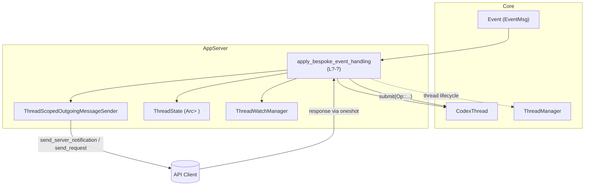
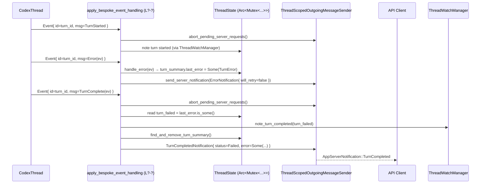
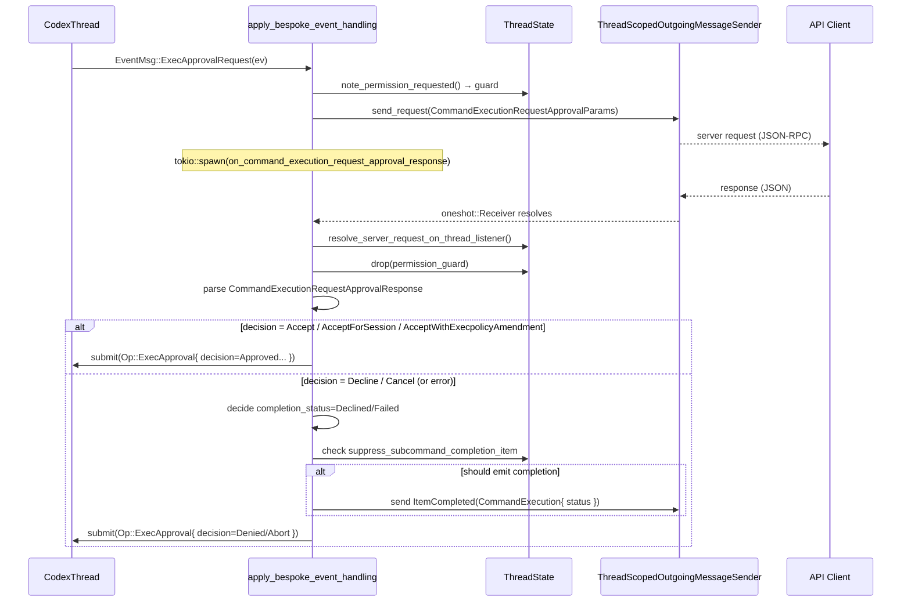

# app-server/src/bespoke_event_handling.rs コード解説

> 注: 提供されたコードには行番号情報が含まれていないため、本レポート中の根拠表記は  
> `app-server/src/bespoke_event_handling.rs:L?-?` のように「行番号不明」としています。

---

## 0. ざっくり一言

Codex コアから届く各種 `Event` を受け取り、API バージョンごとの仕様に沿って

- クライアント向け通知 (`ServerNotification`)
- クライアントへの要求 (`ServerRequestPayload` 経由のリクエスト)
- コアへの応答 (`CodexThread::submit(Op::...)`)

をまとめて扱う「イベントブリッジ／オーケストレータ」です。  
スレッド状態や権限要求、コマンド実行、パッチ適用、MCP・Dynamic Tool・コラボエージェント等のライフサイクルをここで調整します。

---

## 1. このモジュールの役割

### 1.1 概要

このモジュールは、Codex コアからの `Event` ストリームをアプリサーバー側プロトコルに変換するために存在しています。

- **解決する問題**  
  - コアの内部イベント (`codex_protocol::protocol::EventMsg`) の粒度・表現はそのままではクライアント API とは合致しない。
  - 権限リクエストやユーザー入力待ちなど、「クライアントとの対話を伴う非同期処理」を、ターン開始／終了・中断などのライフサイクルと整合的に扱う必要がある。

- **提供する機能**  
  - `apply_bespoke_event_handling` で全ての `EventMsg` を受け、  
    - 適切な `ServerNotification` を送信  
    - 必要に応じて `send_request` でクライアントに問いかけ  
    - クライアントからのレスポンスを `on_..._response` 系ヘルパーでコア (`CodexThread`) に返す  
  - `ThreadState` と `ThreadWatchManager` を通じて、  
    - ターンごとの要約（エラー有無／開始・終了時刻、進行中アイテムなど）  
    - 「権限待ち」「ユーザー入力待ち」「システムエラー」等の監視状態  
    を一元管理します。

### 1.2 アーキテクチャ内での位置づけ

おおまかな依存関係は次のようになります。



- `apply_bespoke_event_handling` が唯一の外向き API（crate 内向け）です。  
- `ThreadState` は 1 スレッド単位で共有され、進行中のコマンドやファイル変更の開始済みフラグ、最後のエラーなどを持ちます。  
- クライアントとの往復は `ThreadScopedOutgoingMessageSender` の
  - `send_server_notification`
  - `send_request`（戻り値: `RequestId` と `oneshot::Receiver<ClientRequestResult>`）
 で行われ、レスポンスは `tokio::spawn` したハンドラで処理されます。  
- `ThreadWatchManager` は「権限待ち」「ユーザー入力待ち」など、スレッドの観測状態をガードオブジェクト (`ThreadWatchActiveGuard`) で管理します。

### 1.3 設計上のポイント

コードから読み取れる特徴を列挙します（いずれも `app-server/src/bespoke_event_handling.rs:L?-?`）。

- **責務の集中**
  - すべての `EventMsg` バリアントを 1 つの `match` で処理し、ここからのみクライアント通知・要求を発行する構造になっています（`apply_bespoke_event_handling`）。
- **API バージョン分岐**
  - `ApiVersion::V1` / `V2` ごとに処理を分岐し、未サポート機能はログ出力とフォールバックレスポンス（例: 権限リクエストを空レスポンスで返す）で扱われます。
- **状態管理**
  - `ThreadState.turn_summary` に
    - `last_error`
    - `file_change_started` / `command_execution_started`（セット）
    - `pending_interrupts` / `pending_rollbacks`
    などを保持し、ヘルパー関数 (`start_command_execution_item`, `complete_command_execution_item`, `complete_file_change_item` 等) を通じて一貫して更新します。
- **エラーハンドリング方針**
  - クライアントレスポンスの JSON は `serde_json::from_value(...).unwrap_or_else(...)` でデコードし、失敗時はログ出力と「保守的なデフォルト」（例: `ReviewDecision::Denied` や空の権限）にフォールバックします。
  - ネットワークエラーや「ターンが変わったために破棄されたリクエスト」(`is_turn_transition_server_request_error`) は、コア側に安全な状態を保つために、
    - 多くの場合は「何もしない（コアは既にターン遷移済み）」  
    - もしくは「エラーとして扱い、拒否系レスポンスを送る」
    として扱われています。
- **並行性**
  - すべての共有状態は `Arc<Mutex<ThreadState>>` 経由でアクセスされ、通知送信前に `drop(state)` してロックを解放するパターンが徹底されています。
  - クライアントとのラウンドトリップは `tokio::spawn` したタスクで処理し、各タスクが必要な `Arc` と ID をクローンして所有します。
- **重複通知の防止**
  - `command_execution_started` や `file_change_started` のセットを使い、
    - 同じ item_id での二重 `ItemStarted` 通知
    - 完了済みアイテムの再完了通知
    を抑止するロジックがあります（`start_command_execution_item`, `complete_command_execution_item`, `complete_file_change_item`）。

---

## 2. 主要な機能一覧

このモジュールが提供する主な機能をまとめます。

- ターンライフサイクル管理
  - `TurnStarted` / `TurnComplete` / `TurnAborted` / `ShutdownComplete` を受けて
    - ペンディングリクエストの中断 (`abort_pending_server_requests`)
    - `ThreadWatchManager` への開始・終了・中断通知
    - `TurnCompletedNotification` の送信
    を行います。
- エラー処理とターンステータス更新
  - `EventMsg::Error` / `StreamError` を `TurnError` として記録し、Turn の `status`・`error` に反映します。
- コマンド実行とガーディアンレビュー連携
  - `ExecApprovalRequest`・`ExecCommandBegin/OutputDelta/End` イベントから
    - `CommandExecution...` アイテムの `ItemStarted` / `OutputDelta` / `ItemCompleted` 通知
    - 実行許可リクエスト (`CommandExecutionRequestApprovalParams`) の送信
    - ガーディアン (`GuardianAssessmentEvent`) による自動レビューに応じた完了ステータス更新
    を行います。
- ファイル変更（パッチ適用）フロー
  - `ApplyPatchApprovalRequest` / `PatchApplyBegin/End` を
    - V1: `ApplyPatchApprovalParams` 経由の単純な承認フロー
    - V2: `FileChange...` アイテムの開始・出力・完了と、`FileChangeRequestApprovalParams` による承認フロー
    として扱います。
- 権限リクエスト・ユーザー入力
  - `RequestPermissions` → `PermissionsRequestApprovalParams` → `Op::RequestPermissionsResponse`
  - `RequestUserInput` → `ToolRequestUserInputParams` → `Op::UserInputAnswer`
  - MCP Elicitation (`EventMsg::ElicitationRequest`) → `McpServerElicitationRequestParams` → `Op::ResolveElicitation`
- Dynamic Tool / MCP Tool 呼び出し
  - `DynamicToolCallRequest/Response` を V2 の `ThreadItem::DynamicToolCall` として表現し、V1 では失敗レスポンスを返します。
  - `McpToolCallBegin/End` から `ThreadItem::McpToolCall` の `ItemStarted` / `ItemCompleted` 通知を構築します。
- コラボレーションエージェント関連
  - `CollabAgentSpawn*`, `CollabAgentInteraction*`, `CollabWaiting*`, `CollabClose*`, `CollabResume*` をそれぞれ `ThreadItem::CollabAgentToolCall` として開始・完了通知に変換します。
- Realtime 会話関連
  - Realtime セッション開始／SDP／音声出力／トランスクリプト・アイテム追加／ハンドオフ・エラーなどを V2 の realtime 通知に変換します。
- レビュー・フック・画像表示などの補助イベント
  - View Image, Entered/ExitedReviewMode, HookStarted/Completed, RawResponseItem から
    - 画像閲覧アイテム
    - レビューモード入退場アイテム
    - Hook プロンプトアイテム (`ThreadItem::HookPrompt`)
    などを構築します。
- トークン使用量・レートリミット通知
  - `TokenCountEvent` から `ThreadTokenUsageUpdatedNotification` と `AccountRateLimitsUpdatedNotification` を送信します。
- ロールバック完了処理
  - `ThreadRolledBack` と `ThreadState.pending_rollbacks` をもとに、ロールアウトファイルからスレッド全体を再構築し `ThreadRollbackResponse` を返します。

---

## 3. 公開 API と詳細解説

### 3.1 型一覧（構造体・列挙体など）

| 名前 | 種別 | 公開 | 役割 / 用途 | 根拠 |
|------|------|------|-------------|------|
| `JsonValue` | 型エイリアス (`serde_json::Value`) | private | MCP ツール呼び出しの引数など汎用 JSON を表現するための別名 | `...:L?-?` |
| `CommandExecutionApprovalPresentation` | enum | private | コマンド承認リクエストをクライアントに「ネットワーク承認」か「コマンドテキスト」としてどう提示するかを表現 | `...:L?-?` |
| `CommandExecutionCompletionItem` | struct | private | コマンド実行アイテム完了時に必要な情報（コマンド文字列・作業ディレクトリ・解析済みアクション）を束ねるヘルパー | `...:L?-?` |
| `TurnCompletionMetadata` | struct | private | ターン完了通知を構築するためのメタデータ（status, error, started_at, completed_at, duration_ms） | `...:L?-?` |
| `REVIEW_FALLBACK_MESSAGE` | const `&'static str` | private | レビュアー出力が空だったときの代替メッセージ | `...:L?-?` |

### 3.2 関数詳細（主要 7 件）

#### `apply_bespoke_event_handling(...) -> impl Future<Output=()>`

```rust
#[allow(clippy::too_many_arguments)]
pub(crate) async fn apply_bespoke_event_handling(
    event: Event,
    conversation_id: ThreadId,
    conversation: Arc<CodexThread>,
    thread_manager: Arc<ThreadManager>,
    outgoing: ThreadScopedOutgoingMessageSender,
    thread_state: Arc<tokio::sync::Mutex<ThreadState>>,
    thread_watch_manager: ThreadWatchManager,
    api_version: ApiVersion,
    fallback_model_provider: String,
    codex_home: &Path,
)
```

**概要**

- コアから受け取った単一の `Event` をパターンマッチし、その内容に応じて
  - スレッド状態の更新
  - クライアントへの通知／リクエスト
  - コアへの応答 (`CodexThread::submit`)
  を行うメインハンドラです（`...:L?-?`）。

**引数**

| 引数名 | 型 | 説明 |
|--------|----|------|
| `event` | `Event` | `id`（turn_id）と `msg: EventMsg` を含むコアイベント |
| `conversation_id` | `ThreadId` | 対象となる会話スレッド ID |
| `conversation` | `Arc<CodexThread>` | コア側スレッドハンドル（`Op::...` を submit するため） |
| `thread_manager` | `Arc<ThreadManager>` | スレッド管理。コラボエージェント close 時の後片付け等で使用 |
| `outgoing` | `ThreadScopedOutgoingMessageSender` | クライアントへの通知＆リクエスト送信用スコープ付き送信機 |
| `thread_state` | `Arc<Mutex<ThreadState>>` | スレッド固有の状態（ターン要約・ペンディングリクエストなど） |
| `thread_watch_manager` | `ThreadWatchManager` | 権限要求やユーザー入力待ち等のウォッチ状態管理 |
| `api_version` | `ApiVersion` | V1 / V2 に応じて処理を分岐 |
| `fallback_model_provider` | `String` | ロールバック時にモデル情報を補完するためのフォールバックプロバイダ名 |
| `codex_home` | `&Path` | ロールアウトファイル等を探すための Codex ホームディレクトリ |

**戻り値**

- 戻り値は `()`（副作用のみ）。  
  - クライアントとの通信エラーなどは内部でログ出力し、`Result` としては返しません。

**内部処理の流れ（概要）**

1. `let Event { id: event_turn_id, msg } = event;` でターン ID と本文を取り出す。
2. `match msg { ... }` で `EventMsg` のバリアントごとに処理を分岐。
   - ターンイベント (`TurnStarted` / `TurnComplete` / `TurnAborted`):
     - `abort_pending_server_requests` でペンディングリクエストを中断。
     - `ThreadWatchManager` に開始／完了／中断を通知。
     - `handle_turn_complete` / `handle_turn_interrupted` を呼んで `TurnCompletedNotification` を構築・送信。
   - 権限・ユーザー入力・MCP Elicitation:
     - `ThreadWatchManager::note_permission_requested` / `note_user_input_requested` でガードを取得。
     - `send_request(...)` でクライアントにリクエストを送り、`tokio::spawn` で `on_..._response` を起動。
   - コマンド・ファイル変更:
     - `start_command_execution_item` / `complete_command_execution_item` / `complete_file_change_item` を通じて、`ThreadItem` の開始・完了通知を送信。
     - ガーディアン評価 (`GuardianAssessment`) 結果に応じてステータスを更新。
   - Dynamic Tool / MCP / Collab:
     - それぞれ専用の `ThreadItem` と通知 (`ItemStarted` / `ItemCompleted`) を組み立てる。
   - エラー・トークン使用量:
     - `handle_error`, `handle_token_count_event` を呼び出して状態更新と通知送信。
   - ロールバック:
     - `ThreadState.pending_rollbacks` の `RequestId` を取り出し、ロールアウトファイルからスレッドを構成し直してレスポンス。
3. API バージョンによってサポートされないイベント（例: V1 での `DynamicToolCallRequest`）は
   - `error!` ログを出しつつ、コアへ安全な失敗レスポンスを返します。

**Examples（使用例）**

> 以下は使用イメージであり、このファイル外のコードを簡略化した擬似例です。

```rust
use app_server::bespoke_event_handling::apply_bespoke_event_handling;

async fn event_loop_for_thread(
    conversation_id: ThreadId,
    conversation: Arc<CodexThread>,
    thread_manager: Arc<ThreadManager>,
    outgoing: ThreadScopedOutgoingMessageSender,
    thread_state: Arc<Mutex<ThreadState>>,
    thread_watch_manager: ThreadWatchManager,
    api_version: ApiVersion,
    fallback_model_provider: String,
    codex_home: &Path,
) {
    while let Some(event) = conversation.next_event().await {
        apply_bespoke_event_handling(
            event,
            conversation_id,
            conversation.clone(),
            thread_manager.clone(),
            outgoing.clone(),
            thread_state.clone(),
            thread_watch_manager.clone(),
            api_version,
            fallback_model_provider.clone(),
            codex_home,
        ).await;
    }
}
```

**Errors / Panics**

- パニックを起こしうる箇所は、コードからは確認できません（`unwrap_or_else` でフォールバックしており、`unwrap`/`expect` はテスト内のみ）。
- 外部 I/O（クライアントレスポンス、ロールアウト読み込み等）の失敗は
  - ログ（`error!`, `warn!`）を出した上で
  - コアには「保守的な」レスポンス（拒否・空レスポンス・JSONRPC エラー）を返す
  方針になっています。

**Edge cases（エッジケース）**

- API V1 で V2 専用イベントが来た場合
  - `RequestUserInput` / `RequestPermissions` / `DynamicToolCallRequest` などは
    - ログを出し
    - コアには空の応答 or 失敗レスポンスを即座に返す
- `EventMsg::Error` で `CoreCodexErrorInfo::ThreadRollbackFailed` の場合
  - 通常のエラー通知は送信せず、`handle_thread_rollback_failed` を通じてペンディングのロールバックリクエストを失敗として完了させます。
- 同一 `item_id` に対して重複した `Begin` / `End` イベントが来た場合
  - `ThreadState.turn_summary` のセットを確認し、重複する `ItemStarted` / `ItemCompleted` は抑止します。

**使用上の注意点**

- `thread_state` は会話スレッドごとに 1 つを共有する前提で設計されています。別スレッドのイベントで同じ `ThreadState` を使い回すと、ターン要約が衝突します。
- `apply_bespoke_event_handling` 自体は非同期関数ですが、同一スレッド内でのイベント処理順序に依存するロジック（Begin→Delta→End 等）が多いため、上位でイベントが順序通りに流れる前提になっています。

---

#### `start_command_execution_item(...) -> bool`

**概要**

- コマンド実行アイテムの「開始」を記録し、まだ開始済みでない場合のみ `ItemStarted` 通知を送信するヘルパーです（`...:L?-?`）。

**引数**

| 引数名 | 型 | 説明 |
|--------|----|------|
| `conversation_id` | `&ThreadId` | 対象スレッド ID |
| `turn_id` | `String` | ターン ID |
| `item_id` | `String` | コマンドアイテム ID（call_id など） |
| `command` | `String` | 表示用のシェルコマンド文字列 |
| `cwd` | `PathBuf` | 実行ディレクトリ |
| `command_actions` | `Vec<V2ParsedCommand>` | パース済みコマンドアクション列 |
| `source` | `CommandExecutionSource` | コマンドの出自（エージェント等） |
| `outgoing` | `&ThreadScopedOutgoingMessageSender` | 通知送信に使用 |
| `thread_state` | `&Arc<Mutex<ThreadState>>` | `command_execution_started` を更新するための状態 |

**戻り値**

- `bool` — この呼び出しが **初回開始** であれば `true`、既に開始済みなら `false`。

**内部処理**

1. `thread_state` をロックし、`command_execution_started.insert(item_id.clone())` を呼ぶ。
2. 戻り値 `first_start` が `true` のときのみ、
   - `ThreadItem::CommandExecution { .. InProgress .. }` を構築。
   - `ItemStartedNotification` 経由で `ServerNotification::ItemStarted` を送信。
3. `first_start` を返す。

**Examples**

テスト `command_execution_started_helper_emits_once` が典型例です（`tests` モジュール内）。

**Errors / Panics**

- ロック取得や通知送信はいずれも `await` で失敗を返さない API を用いており、この関数内にパニック要因は見当たりません。

**Edge cases**

- 同じ `item_id` で 2 回呼ばれた場合
  - 2 回目は `false` が返り、通知は送信されません（テストで検証済み）。

**使用上の注意点**

- コマンド実行フローで `ItemStarted` を手動で送信するのではなく、必ずこのヘルパー経由にすることで、重複送信を防げます。

---

#### `complete_command_execution_item(...) -> ()`

**概要**

- コマンド実行アイテムの完了（成功・失敗・拒否等）を表す `ItemCompleted` 通知を、一度だけ送信するヘルパーです（`...:L?-?`）。

**引数（抜粋）**

| 引数名 | 型 | 説明 |
|--------|----|------|
| `conversation_id` | `&ThreadId` | 対象スレッド |
| `turn_id` | `String` | ターン ID |
| `item_id` | `String` | アイテム ID |
| `command` | `String` | コマンド文字列 |
| `cwd` | `PathBuf` | 実行ディレクトリ |
| `process_id` | `Option<String>` | プロセス ID（存在すれば） |
| `source` | `CommandExecutionSource` | コマンドの出自 |
| `command_actions` | `Vec<V2ParsedCommand>` | パース済みアクション |
| `status` | `CommandExecutionStatus` | 最終ステータス |
| `outgoing`, `thread_state` | 前述と同様 |

**内部処理**

1. `thread_state` をロックし、`command_execution_started.remove(&item_id)` を呼ぶ。
2. `should_emit` が `true` のときのみ
   - `ThreadItem::CommandExecution { status, ... }` を構築。
   - `ItemCompletedNotification` を送信。
3. `should_emit == false` の場合は何もせず return。

**Edge cases**

- `start_command_execution_item` を通らずに直接呼ばれた場合
  - `command_execution_started` に `item_id` が無いため `should_emit` は `false` となり、完了通知も送信されません。
- 同じ `item_id` で二度完了させようとした場合
  - 最初の呼び出しのみ通知が送られ、二回目以降は無視されます（テスト `complete_command_execution_item_emits_declined_once_for_pending_command`）。

**使用上の注意点**

- サブコマンド（zsh-fork など）の承認フローにおいては、`on_command_execution_request_approval_response` 内で `suppress_subcommand_completion_item` により、このヘルパーをスキップするロジックがあります。

---

#### `handle_turn_complete(...) -> ()`

**概要**

- ターン完了イベント (`TurnCompleteEvent`) を受け取り、
  - `ThreadState.turn_summary` から最後のエラーなどを取得してリセットし
  - 適切な `TurnStatus`（Completed / Failed）とともに `TurnCompletedNotification` を送信する関数です（`...:L?-?`）。

**引数**

| 引数名 | 型 | 説明 |
|--------|----|------|
| `conversation_id` | `ThreadId` | 会話 ID |
| `event_turn_id` | `String` | ターン ID |
| `turn_complete_event` | `TurnCompleteEvent` | 完了時刻・所要時間などを含むイベント |
| `outgoing` | `&ThreadScopedOutgoingMessageSender` | 通知送信 |
| `thread_state` | `&Arc<Mutex<ThreadState>>` | ターン要約を保持 |

**内部処理**

1. `find_and_remove_turn_summary` で `TurnSummary` を取得し、`thread_state` 内のサマリを空にする。
2. `turn_summary.last_error` が `Some` なら
   - `status = TurnStatus::Failed`
   - `error = Some(last_error)`
   それ以外は `status = Completed`, `error = None`。
3. `TurnCompletionMetadata` を組み立て、`emit_turn_completed_with_status` を呼び出して通知を送信。

**Edge cases**

- ターン中にエラーが一度も記録されていない場合
  - `status` は `Completed` となり、`error` は `None` になる（テスト `test_handle_turn_complete_emits_completed_without_error`）。
- 複数ターンが同一 `ThreadState` を共有している場合
  - この関数自身は `conversation_id` を使いませんが、テストで確認されているように
    - A のターン1 → エラーあり → Failed
    - B のターン1 → エラーあり → Failed
    - A のターン2 → エラーなし → Completed
    のように、「最後に `handle_error` された内容」が反映される挙動になります（実際の運用ではスレッドごとに `ThreadState` を分離する想定）。

**使用上の注意点**

- `handle_error` を通じて `TurnError` を記録しておく前提です。  
  `apply_bespoke_event_handling` では `EventMsg::Error` 分岐内で必ず `handle_error` を呼んだあとにこの関数を使っています。

---

#### `handle_turn_interrupted(...) -> ()`

**概要**

- ターン中断イベント (`TurnAbortedEvent`) を受け取り、`TurnStatus::Interrupted` として `TurnCompletedNotification` を送信します（`...:L?-?`）。

**特徴**

- `TurnError` は通知に含めません（テスト `test_handle_turn_interrupted_emits_interrupted_with_error` で、事前に `handle_error` されていても `error` は `None` であることが確認されています）。
- これは「中断されたターンは結果として失敗ではなく、中断（Interrupted）として扱う」というプロトコル上の仕様を反映しています。

---

#### `on_file_change_request_approval_response(...) -> ()`

**概要**

- V2 の `FileChangeRequestApprovalParams` に対するクライアントレスポンスを受け取り、
  - パッチ apply の承認／却下／キャンセルに応じて
    - コアへの `Op::PatchApproval`
    - 必要に応じて `FileChange` アイテムの完了通知
  を行う非同期ハンドラです（`...:L?-?`）。

**引数（抜粋）**

| 引数名 | 型 | 説明 |
|--------|----|------|
| `event_turn_id` | `String` | ターン ID |
| `conversation_id` | `ThreadId` | 会話 ID |
| `item_id` | `String` | ファイル変更アイテム ID |
| `changes` | `Vec<FileUpdateChange>` | パッチの変更内容 |
| `pending_request_id` | `RequestId` | クライアントへのリクエスト ID |
| `receiver` | `oneshot::Receiver<ClientRequestResult>` | クライアントレスポンス |
| `codex` | `Arc<CodexThread>` | コアへの submit 用 |
| `outgoing` | `ThreadScopedOutgoingMessageSender` | 通知送信 |
| `thread_state` | `Arc<Mutex<ThreadState>>` | `file_change_started` 管理 |
| `permission_guard` | `ThreadWatchActiveGuard` | 権限待ち状態のガード |

**内部処理の流れ**

1. `receiver.await` でクライアントレスポンスを待つ。
2. `resolve_server_request_on_thread_listener` でペンディングリクエスト状態を解消し、`permission_guard` を drop。
3. レスポンス結果に応じて `decision` と `completion_status` を決定:
   - 正常レスポンス → `FileChangeRequestApprovalResponse` にデコードし `map_file_change_approval_decision` で変換。
   - クライアントエラー／受信エラー → ログ出力の上で `ReviewDecision::Denied` と `PatchApplyStatus::Failed`。
   - ターン遷移エラー（`is_turn_transition_server_request_error`） → 何もせず return。
4. `completion_status` が `Some(...)` の場合のみ、
   - `ThreadItem::FileChange { id: item_id, changes, status }` を構築し、
   - `complete_file_change_item` を呼び出して `ItemCompleted` 通知を送信。
5. 最後に `codex.submit(Op::PatchApproval { id: item_id, decision })` を送信。

**Edge cases**

- クライアントがレスポンスを返さなかった／チャネルがクローズした場合
  - `Err(err)` 分岐となり、`PatchApplyStatus::Failed` として扱われます。
- `Accept` / `AcceptForSession` の場合
  - `completion_status` は `None` になり、この関数では `ItemCompleted` を送信しません。
  - 実際のパッチ適用完了時に `EventMsg::PatchApplyEnd` → `complete_file_change_item` で完了通知が送られます。

**使用上の注意点**

- 「承認／拒否」と「パッチの実際の適用完了」は分離されています。  
  パッチ適用が成功するまでは `FileChange` アイテムは InProgress のままです。

---

#### `on_command_execution_request_approval_response(...) -> ()`

**概要**

- V2 の `CommandExecutionRequestApprovalParams` に対するクライアントレスポンスを処理し、
  - コアへの `Op::ExecApproval`
  - 必要に応じた `CommandExecution` アイテムの完了通知
  を行う複雑なハンドラです（`...:L?-?`）。

**引数（抜粋）**

| 引数名 | 型 | 説明 |
|--------|----|------|
| `event_turn_id` | `String` | ターン ID |
| `conversation_id` | `ThreadId` | 会話 ID |
| `approval_id` | `Option<String>` | 承認 ID（サブコマンドの場合に使用） |
| `item_id` | `String` | 親コマンドアイテム ID |
| `completion_item` | `Option<CommandExecutionCompletionItem>` | 完了通知用情報（コマンド・cwd 等） |
| `pending_request_id` | `RequestId` | クライアントへのリクエスト ID |
| `receiver` | `oneshot::Receiver<ClientRequestResult>` | クライアントレスポンス |
| `conversation` | `Arc<CodexThread>` | コアへの submit 用 |
| `outgoing`, `thread_state`, `permission_guard` | 前述同様 |

**内部処理（要約）**

1. レスポンス取得と `resolve_server_request_on_thread_listener` 呼び出し、`permission_guard` の drop。
2. レスポンスを `CommandExecutionRequestApprovalResponse` にデコードし、`CommandExecutionApprovalDecision` に応じて
   - `ReviewDecision`（コアへ返すもの）
   - `completion_status: Option<CommandExecutionStatus>`（UI アイテム完了ステータス）
   を決定。
   - `Accept` / `AcceptForSession` / `AcceptWithExecpolicyAmendment` → `completion_status = None`
   - `ApplyNetworkPolicyAmendment` → NetworkPolicy の内容に応じて Declined or None
   - `Decline` / `Cancel` → Declined
3. サブコマンド用承認 (`approval_id.is_some()`) の場合は
   - 親コマンドアイテム (`item_id`) が進行中かどうかを確認し、
   - 親が開始されている場合は **サブコマンド用の完了アイテムを抑止**（`suppress_subcommand_completion_item`）します。
4. `completion_status` が `Some` かつ `suppress_subcommand_completion_item == false` かつ `completion_item` が `Some` のときだけ、
   - `complete_command_execution_item` を呼び出して完了通知を送信。
5. `conversation.submit(Op::ExecApproval { id, turn_id: Some(event_turn_id), decision })` を送信。
   - `id` は `approval_id.unwrap_or_else(|| item_id.clone())` で決定。

**Edge cases**

- クライアントレスポンスが JSON として不正な場合
  - ログ出力のうえ `CommandExecutionApprovalDecision::Decline` とみなされ、`ReviewDecision::Denied` と `CommandExecutionStatus::Failed` が使われます。
- ターン遷移エラー (`turnTransition`) の場合
  - `is_turn_transition_server_request_error` により検出され、以後何もしません（ターンは既に遷移済みなので安全）。

**使用上の注意点**

- zsh-fork サブコマンド承認のようなケースで、`approval_id` が設定されているときは、`CommandExecution` の UI アイテムを二重に完了させないための抑止ロジックが入っています。  
  新しい種類の承認ロジックを追加する際は、この挙動との整合性に注意が必要です。

---

#### `on_request_permissions_response(...) -> ()`（概要のみ）

**概要**

- `PermissionsRequestApprovalParams` に対するクライアントレスポンスから
  - 実際に付与する権限を `intersect_permission_profiles(requested, granted)` で「要求された範囲との積」として計算し、
  - `Op::RequestPermissionsResponse` としてコアに返します。
- `request_permissions_response_from_client_result` が多くのロジックを担っており、ターン遷移エラーを無視し、その他のエラー時には「空の権限」「Turn スコープ」で応答する安全なデフォルトを採用しています。

---

### 3.3 その他の関数・ヘルパー（コンポーネントインベントリ）

非公開ヘルパーを含む主な関数の一覧です（テスト用関数は省略し、テストの概要は後述します）。

| 名前 | 種別 | 公開 | 役割（1 行） | 根拠 |
|------|------|------|--------------|------|
| `handle_turn_diff` | async fn | private | V2 の `TurnDiffEvent` を `TurnDiffUpdatedNotification` に変換して送信 | `...:L?-?` |
| `handle_turn_plan_update` | async fn | private | `UpdatePlanArgs` を `TurnPlanUpdatedNotification` に変換して送信 | `...:L?-?` |
| `emit_turn_completed_with_status` | async fn | private | `TurnCompletionMetadata` から `TurnCompletedNotification` を構築して送信 | `...:L?-?` |
| `complete_file_change_item` | async fn | private | `file_change_started` セットから item を除去し、`ItemCompleted(FileChange)` を送信 | `...:L?-?` |
| `maybe_emit_raw_response_item_completed` | async fn | private | V2 かつ RawResponseItem のとき `RawResponseItemCompletedNotification` を送信 | `...:L?-?` |
| `maybe_emit_hook_prompt_item_completed` | async fn (`pub(crate)`) | crate | Hook プロンプトを含む RawResponseItem を `ThreadItem::HookPrompt` として完了通知 | `...:L?-?` |
| `find_and_remove_turn_summary` | async fn | private | `ThreadState.turn_summary` を `mem::take` で取り出し、リセットして返す | `...:L?-?` |
| `handle_thread_rollback_failed` | async fn | private | ペンディングロールバックがある場合に JSONRPC エラーで失敗させる | `...:L?-?` |
| `handle_token_count_event` | async fn | private | `TokenCountEvent` からトークン使用量とレートリミット通知を送信 | `...:L?-?` |
| `handle_error` | async fn | private | `TurnError` を `ThreadState.turn_summary.last_error` に記録 | `...:L?-?` |
| `on_patch_approval_response` | async fn | private | V1 のパッチ承認レスポンスを処理し、`Op::PatchApproval` を送信 | `...:L?-?` |
| `on_exec_approval_response` | async fn | private | V1 のコマンド承認レスポンスを処理し、`Op::ExecApproval` を送信 | `...:L?-?` |
| `on_request_user_input_response` | async fn | private | ユーザー入力レスポンスを Core 型 (`CoreRequestUserInputResponse`) に変換して `Op::UserInputAnswer` を送信 | `...:L?-?` |
| `on_mcp_server_elicitation_response` | async fn | private | MCP Elicitation レスポンスを `Op::ResolveElicitation` としてコアに返す | `...:L?-?` |
| `mcp_server_elicitation_response_from_client_result` | fn | private | クライアントレスポンス → `McpServerElicitationRequestResponse` への変換とエラー時フォールバック | `...:L?-?` |
| `request_permissions_response_from_client_result` | fn | private | クライアントレスポンス → `CoreRequestPermissionsResponse` への変換と権限の intersection | `...:L?-?` |
| `render_review_output_text` | fn | private | `ReviewOutputEvent` から人間向けテキストを組み立てる（説明＋findings ブロック） | `...:L?-?` |
| `map_file_change_approval_decision` | fn | private | `FileChangeApprovalDecision` を `ReviewDecision` と `PatchApplyStatus` にマッピング | `...:L?-?` |
| `collab_resume_begin_item` | fn | private | `CollabResumeBeginEvent` を `ThreadItem::CollabAgentToolCall(ResumeAgent, InProgress)` に変換 | `...:L?-?` |
| `collab_resume_end_item` | fn | private | `CollabResumeEndEvent` を `ThreadItem::CollabAgentToolCall(ResumeAgent, Completed/Failed)` に変換 | `...:L?-?` |
| `construct_mcp_tool_call_notification` | async fn | private | `McpToolCallBeginEvent` を `ItemStartedNotification(McpToolCall)` に変換 | `...:L?-?` |
| `construct_mcp_tool_call_end_notification` | async fn | private | `McpToolCallEndEvent` を `ItemCompletedNotification(McpToolCall)` に変換 | `...:L?-?` |

テストモジュール内には、多数の `#[test]` / `#[tokio::test]` 関数があり、上記ロジックの動作（重複通知抑止、エラー時フォールバック、権限 intersection、MCP 呼び出しマッピング等）を細かくカバーしています。

---

## 4. データフロー

### 4.1 ターン開始〜エラー〜完了までのフロー（V2）

ターン内でエラーが発生し、その後 `TurnComplete` が来た場合のフローです。



ポイント:

- エラー発生時に `handle_error` が `last_error` を記録し、`handle_turn_complete` がそれを参照して `status=Failed` を決めます。
- ストリームエラー (`StreamError`) の場合は `last_error` を更新せず、`will_retry=true` の通知のみ送ります。

### 4.2 コマンド実行承認フロー（V2, ネットワーク承認を含む）



ポイント:

- `ThreadWatchManager` のガードはレスポンス処理の早い段階で drop され、スレッドがもはや「権限待ち」ではないことを示します。
- 承認フローと UI アイテムの完了は分離されており、ネットワーク政策の変更など一部の決定では UI アイテムを完了させないこともあります。

---

## 5. 使い方（How to Use）

### 5.1 基本的な使用方法

このモジュールは通常、「1 スレッドごとのイベントループ」から利用されます。

```rust
use app_server::bespoke_event_handling::apply_bespoke_event_handling;

async fn run_thread(
    conversation_id: ThreadId,
    conversation: Arc<CodexThread>,
    thread_manager: Arc<ThreadManager>,
    outgoing: ThreadScopedOutgoingMessageSender,
    thread_state: Arc<Mutex<ThreadState>>,
    thread_watch_manager: ThreadWatchManager,
    api_version: ApiVersion,
    fallback_model_provider: String,
    codex_home: &Path,
) {
    while let Some(event) = conversation.next_event().await {
        apply_bespoke_event_handling(
            event,
            conversation_id,
            conversation.clone(),
            thread_manager.clone(),
            outgoing.clone(),
            thread_state.clone(),
            thread_watch_manager.clone(),
            api_version,
            fallback_model_provider.clone(),
            codex_home,
        ).await;
    }
}
```

- `conversation.next_event()` の実装はこのファイルには現れませんが、「コアが生成するイベントストリーム」と考えれば良いです。
- すべての副作用（通知送信・コアへの応答・スレッド状態更新）は `apply_bespoke_event_handling` 内で完結します。

### 5.2 よくある使用パターン

- **V1 / V2 切り替え**
  - 新しい機能（Dynamic Tool, RequestUserInput, RequestPermissions, Realtime など）は V2 専用です。
  - ランタイム構成で `api_version` を切り替えることで、仕様に応じた動作に自動的に分岐します。
- **承認フロー拡張**
  - 新しい種類の承認（たとえば新しいツールの承認）を追加する場合、既存の
    - `on_request_permissions_response`
    - `on_file_change_request_approval_response`
    - `on_command_execution_request_approval_response`
    のパターンを参考に、`send_request` → `tokio::spawn` → `resolve_server_request_on_thread_listener` → `CodexThread::submit` の流れを踏襲します。

### 5.3 よくある間違い

```rust
// 間違い例: ThreadState をスレッド間で共有してしまう
let shared_state = Arc::new(Mutex::new(ThreadState::default()));
run_thread(thread_id_1, ..., shared_state.clone(), ...);
run_thread(thread_id_2, ..., shared_state.clone(), ...);
// -> TurnSummary や pending_rollbacks が会話 A/B で衝突し得る

// 正しい例: スレッドごとに別々の ThreadState を持つ
let state1 = Arc::new(Mutex::new(ThreadState::default()));
let state2 = Arc::new(Mutex::new(ThreadState::default()));
run_thread(thread_id_1, ..., state1, ...);
run_thread(thread_id_2, ..., state2, ...);
```

```rust
// 間違い例: CommandExecution の ItemStarted を手動で送る
outgoing.send_server_notification(ServerNotification::ItemStarted(
    ItemStartedNotification { /* ... */ }
)).await;

// 正しい例: 必ずヘルパー経由で開始する
start_command_execution_item(
    &conversation_id,
    turn_id.clone(),
    item_id.clone(),
    command.clone(),
    cwd.clone(),
    actions.clone(),
    CommandExecutionSource::Agent,
    &outgoing,
    &thread_state,
).await;
```

### 5.4 使用上の注意点（まとめ）

- **並行性**
  - 共有状態アクセスは必ず `Arc<Mutex<ThreadState>>` を通じて行われており、ロック保持中に `.await` を挟むことは避けられています（`drop(state)` してから通知送信）。類似のヘルパーを追加する場合も、このパターンを守るとデッドロックのリスクを下げられます。
- **エラー処理**
  - クライアントレスポンスの JSON 形式は「信頼できない入力」として扱われ、デコード失敗時は一貫して「拒否・空のレスポンス」にフォールバックします。これにより、想定外の形式でもコアの状態が壊れにくくなっています。
- **API バージョン**
  - V1 で V2 専用イベントを流した場合は、ログと保守的フォールバックで処理されるため致命的エラーにはなりませんが、期待した UI 挙動にはなりません。クライアント側と API バージョンの整合を取ることが重要です。

---

## 6. 変更の仕方（How to Modify）

### 6.1 新しい機能を追加する場合

1. **Event 定義**
   - 新しいコアイベントを `codex_protocol::protocol::EventMsg` に追加する（このファイルには定義はありません）。
2. **分岐の追加**
   - `apply_bespoke_event_handling` の `match msg` に新しいバリアントの分岐を追加する。
3. **通知／リクエスト構築**
   - 必要に応じて
     - `codex_app_server_protocol` の新しい Notification/Params 型
     - `ThreadItem` の拡張
     を定義し、この分岐で構築する。
4. **レスポンスハンドラ**
   - クライアントへのラウンドトリップが必要な場合は
     - `send_request` の戻り値（`RequestId`, `oneshot::Receiver<ClientRequestResult>`）を受け取り、
     - 専用の `on_xxx_response` 関数を `tokio::spawn` する。
   - その関数内で `resolve_server_request_on_thread_listener` と `ThreadWatchActiveGuard` の drop を忘れない。
5. **テスト追加**
   - `tests` モジュールに `#[tokio::test]` を追加し、期待される `OutgoingMessage` が送信されることを検証する。

### 6.2 既存の機能を変更する場合

- **影響範囲**
  - 対象のヘルパー関数だけでなく、
    - `apply_bespoke_event_handling` の該当バリアント分岐
    - 関連するテスト（`tests` モジュール）
    - 関連する `codex_app_server_protocol` の型
  を合わせて確認する必要があります。
- **契約（前提条件・返り値の意味）への注意**
  - 例えば `on_request_permissions_response` の契約は「要求された権限より広い権限を付与しない」ことです。この前提を崩さないよう、必ず `intersect_permission_profiles` を利用するか、同様の制約を維持する必要があります。
  - `start_command_execution_item` / `complete_command_execution_item` は重複開始・重複完了を抑止する契約を持っています。
- **テストの再確認**
  - 本ファイルには振る舞いをかなり細かく検証するテストが多数含まれているため、変更後は該当テストの成功を確認するのが安全です。

---

## 7. 関連ファイル

このモジュールと密接に関連するコンポーネントをまとめます（いずれも別ファイル）。

| パス / モジュール | 役割 / 関係 |
|------------------|------------|
| `crate::codex_message_processor` | ロールアウトファイルからのサマリ・アイテム読み込みや、`build_turns_from_rollout_items` などロールバック関連ユーティリティを提供。`EventMsg::ThreadRolledBack` の処理で利用。 |
| `crate::outgoing_message` | `ThreadScopedOutgoingMessageSender`, `OutgoingMessageSender`, `ClientRequestResult` を定義し、クライアントへの通知・リクエスト送信およびレスポンス受信チャネルを提供。 |
| `crate::thread_state::ThreadState` | ターンごとのサマリ (`TurnSummary`)、進行中アイテムのフラグ、ペンディングロールバック・割込みなどを保持。`Arc<Mutex<ThreadState>>` として本モジュールに渡される。 |
| `crate::thread_status::ThreadWatchManager` | `note_turn_started` / `note_permission_requested` / `note_user_input_requested` / `note_thread_shutdown` などを通じて、「スレッドが今どのような待機状態にあるか」をトラッキングする。`ThreadWatchActiveGuard` がスコープ終了で自動的に解除を行う。 |
| `crate::server_request_error::is_turn_transition_server_request_error` | JSONRPC エラーが「ターン遷移に伴うクライアントリクエストの終了」であるかどうかを判定し、レスポンスハンドラがそれを無害に無視できるようにする。 |
| `codex_core::CodexThread` / `ThreadManager` | コアのスレッドとそのライフサイクルを管理。ここからの `Event` を本モジュールが受け取り、再び `Op::...` を通じて応答を返す。 |
| `codex_app_server_protocol` | クライアントとやり取りする JSON-RPC のリクエスト／レスポンス／通知型を定義。本モジュールはこれらの型を使って通知やリクエストを構築する。 |
| `codex_protocol` | コア側のイベント型 (`EventMsg`, `TurnCompleteEvent` など) や各種ツール用プロトコル、権限要求型 (`CoreRequestPermissionProfile` など) を定義。 |

このモジュールは、これらのコンポーネントの「接着剤」として機能し、並行性とエラーハンドリングを意識しつつ、コアとクライアントの間のデータフローを一元的に制御する位置づけになっています。
