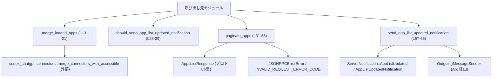
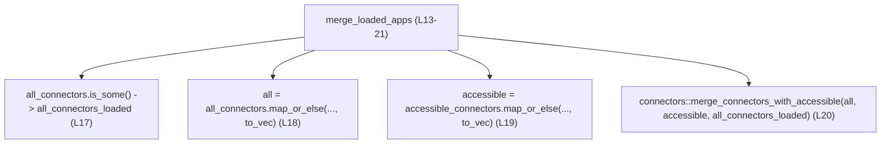
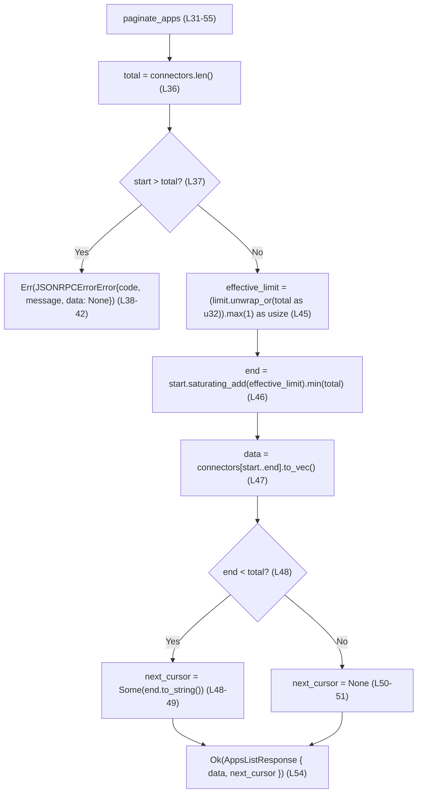
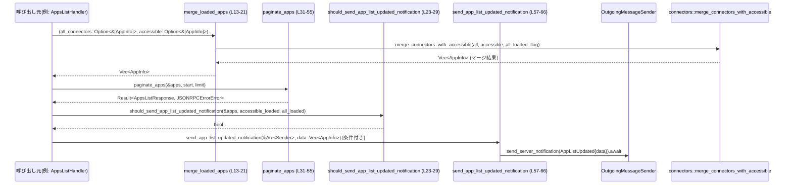

# app-server/src/codex_message_processor/apps_list_helpers.rs コード解説

## 0. ざっくり一言

アプリ（コネクタ）一覧を扱うための小さなヘルパーモジュールで、  
一覧のマージ・通知送信要否の判定・ページネーション・通知送信を行います。  
（apps_list_helpers.rs:L13-66）

---

## 1. このモジュールの役割

### 1.1 概要

このモジュールは、**アプリ一覧の状態管理とレスポンス生成を補助するヘルパ関数群**を提供します。

- すべてのアプリ一覧とアクセス可能なアプリ一覧を統合する（`merge_loaded_apps`）（L13-21）
- アプリ一覧更新通知を送るべきかどうかを判定する（`should_send_app_list_updated_notification`）（L23-29）
- アプリ一覧をカーソル＋件数でページングし、JSON-RPC レスポンス用の構造体に詰める（`paginate_apps`）（L31-55）
- 「アプリ一覧更新」サーバ通知を実際に送信する（`send_app_list_updated_notification`）（L57-66）

### 1.2 アーキテクチャ内での位置づけ

このモジュールは「アプリ一覧メッセージ処理」の内部ヘルパとして、  
プロトコル定義（`codex_app_server_protocol`）や送信コンポーネント（`OutgoingMessageSender`）と連携します。

主な依存関係（このファイルに現れる範囲）:

- `codex_app_server_protocol::{AppInfo, AppsListResponse, AppListUpdatedNotification, ServerNotification, JSONRPCErrorError}`（L3-7）
- `codex_chatgpt::connectors::merge_connectors_with_accessible`（L20）
- `crate::outgoing_message::OutgoingMessageSender`（L11, L57-65）
- `crate::error_code::INVALID_REQUEST_ERROR_CODE`（L10, L38-40）

依存関係のイメージです（このファイル内に現れる範囲に限定）:



※ 「呼び出し元モジュール」はこのチャンクには現れないため、名称は抽象化しています。

### 1.3 設計上のポイント

コードから読み取れる特徴は次のとおりです。

- **純粋関数と副作用関数の分離**
  - データ変換・判定系 (`merge_loaded_apps`, `should_send_app_list_updated_notification`, `paginate_apps`) は純粋関数です（外部状態を書き換えない）（L13-55）。
  - 通知送信 (`send_app_list_updated_notification`) はネットワーク I/O と思われる副作用をまとめています（L57-66）。
- **エラーハンドリング**
  - ページネーションにおいて、カーソルが範囲外の場合は `JSONRPCErrorError` でエラーを返します（L36-43）。
  - インデックス計算には `saturating_add` と `min` を使い、オーバーフローや範囲外アクセスを防いでいます（L45-47）。
- **共有オブジェクトの非同期利用**
  - 通知送信には `Arc<OutgoingMessageSender>` の参照を受け取り、共有送信器を非同期に利用します（L57-60）。
- **コピーではなくクローン**
  - スライス (`&[AppInfo]`) を `Vec<AppInfo>` に変換する際に `to_vec` を利用しており、`AppInfo: Clone` が前提になっています（L18-19, L47）。

---

## 2. コンポーネント一覧（インベントリ）

### 2.1 関数一覧

| 名前 | 種別 | 可視性 | 役割 / 用途 | 定義位置 |
|------|------|--------|-------------|----------|
| `merge_loaded_apps` | 関数 | `pub(super)` | 全アプリ一覧とアクセス可能アプリ一覧をマージし、単一の `Vec<AppInfo>` を返す | apps_list_helpers.rs:L13-21 |
| `should_send_app_list_updated_notification` | 関数 | `pub(super)` | アプリ一覧更新通知を送るかどうかの真偽値を判定する | apps_list_helpers.rs:L23-29 |
| `paginate_apps` | 関数 | `pub(super)` | アプリ一覧をカーソルと上限件数でページングし、`AppsListResponse` または JSON-RPC エラーを返す | apps_list_helpers.rs:L31-55 |
| `send_app_list_updated_notification` | 非同期関数 | `pub(super)` | アプリ一覧更新のサーバ通知を非同期で送信する | apps_list_helpers.rs:L57-66 |

### 2.2 外部型・モジュール利用

| 名前 | 種別 | 役割 / 用途 | 参照位置 |
|------|------|-------------|----------|
| `AppInfo` | 構造体（外部定義） | 個々のアプリ/コネクタ情報。`is_accessible` フィールドを持つことが分かります。 | インポート L3, 使用 L14-19, L24, L32, L47, L59, L63 |
| `AppsListResponse` | 構造体（外部定義） | ページングされたアプリ一覧レスポンス。`data` と `next_cursor` フィールドを持ちます。 | インポート L5, 使用 L35, L54 |
| `JSONRPCErrorError` | 構造体（外部定義） | JSON-RPC エラー表現。`code`, `message`, `data` フィールドを持ちます。 | インポート L6, 使用 L35, L38-42 |
| `AppListUpdatedNotification` | 構造体（外部定義） | アプリ一覧更新通知のペイロード。`data` フィールドを持ちます。 | インポート L4, 使用 L63 |
| `ServerNotification` | 列挙体（外部定義） | サーバからクライアントへの通知の種類。`AppListUpdated` バリアントを持ちます。 | インポート L7, 使用 L62 |
| `connectors` | モジュール（外部） | `merge_connectors_with_accessible` 関数を提供します。 | インポート L8, 使用 L20 |
| `OutgoingMessageSender` | 構造体（外部定義） | サーバ通知を実際に送信するコンポーネント。`send_server_notification` メソッドを持ちます。 | インポート L11, 使用 L57-65 |
| `INVALID_REQUEST_ERROR_CODE` | 定数（外部定義） | 不正リクエストに対する JSON-RPC エラーコード | インポート L10, 使用 L38-40 |
| `Arc` | スマートポインタ | 送信器をスレッド安全に共有するための参照カウントポインタ | インポート L1, 使用 L58 |

---

## 3. 公開 API と詳細解説

### 3.1 型一覧（このモジュール内で定義される型）

このファイル内で新しく定義される構造体・列挙体などはありません。  
すべて外部モジュールで定義された型 (`AppInfo`, `AppsListResponse` など) を利用しています（L3-7）。

### 3.2 関数詳細

#### `merge_loaded_apps(all_connectors: Option<&[AppInfo]>, accessible_connectors: Option<&[AppInfo]>) -> Vec<AppInfo>`

**概要**

- 全コネクタ一覧とアクセス可能コネクタ一覧（いずれも `Option<&[AppInfo]>`）から、新しい `Vec<AppInfo>` を構築し、`connectors::merge_connectors_with_accessible` に委譲してマージした結果を返します（apps_list_helpers.rs:L13-21）。

**引数**

| 引数名 | 型 | 説明 |
|--------|----|------|
| `all_connectors` | `Option<&[AppInfo]>` | 「すべてのコネクタ一覧」のスライス。まだロードされていなければ `None`。 |
| `accessible_connectors` | `Option<&[AppInfo]>` | 「アクセス可能なコネクタ一覧」のスライス。まだロードされていなければ `None`。 |

**戻り値**

- `Vec<AppInfo>`: マージ済みのアプリ一覧。具体的なマージ戦略（優先順位・重複の扱いなど）は `connectors::merge_connectors_with_accessible` の実装に依存します（L20）。

**内部処理の流れ**

1. `all_connectors` が `Some` かどうかを `all_connectors_loaded` フラグに格納します（L17）。
2. `all_connectors` を `Vec<AppInfo>` に変換します。
   - `Some(slice)` の場合: `<[AppInfo]>::to_vec` でクローンしてベクタを作成します（L18）。
   - `None` の場合: `Vec::new()` で空のベクタを作成します（L18）。
3. `accessible_connectors` についても同様に `Vec<AppInfo>` に変換します（L19）。
4. 得られた 2 つのベクタと `all_connectors_loaded` フラグを `connectors::merge_connectors_with_accessible` に渡し、その戻り値をそのまま返します（L20）。



**Examples（使用例）**

```rust
use std::sync::Arc;
use codex_app_server_protocol::AppInfo;

// apps_list_helpers モジュールは同じ crate 内の codex_message_processor 下にある想定
use crate::codex_message_processor::apps_list_helpers::merge_loaded_apps;

fn example_merge(
    all_opt: Option<&[AppInfo]>,      // すべてのアプリ一覧（なければ None）
    accessible_opt: Option<&[AppInfo]> // アクセス可能アプリ一覧（なければ None）
) -> Vec<AppInfo> {
    // 2 つの一覧からマージ済みの一覧を作成
    let merged = merge_loaded_apps(all_opt, accessible_opt);
    // ここで merged をページングなどに利用する
    merged
}
```

※ `AppInfo` の具体的なフィールド構成や生成方法はこのチャンクには現れないため、上記では外部から渡される前提にしています。

**Errors / Panics**

- この関数自身は `Result` を返さず、`panic!` を直接呼んでいません。
- スライスからの `to_vec` 変換（L18-19）は標準ライブラリの機能で、インデックス範囲外アクセスは行わないため安全です。
- 例外的な挙動がある場合は `connectors::merge_connectors_with_accessible` の内部実装に依存しますが、このチャンクからは不明です（L20）。

**Edge cases（エッジケース）**

- `all_connectors == None` かつ `accessible_connectors == None` の場合（L17-19）:
  - 両方とも空の `Vec<AppInfo>` となり、`connectors::merge_connectors_with_accessible` に渡されます（結果はその実装に依存）。
- `all_connectors` または `accessible_connectors` が空スライス（`Some(&[])`）の場合:
  - `to_vec` により空ベクタが生成されます。

**使用上の注意点**

- `AppInfo` は `Clone` 実装が必要です。`<[T]>::to_vec` は `T: Clone` を要求するためです（L18-19）。
- この関数はベクタを新規作成するので、入力スライスが大きい場合にはメモリ確保とクローンコストが発生します。
- マージの具体的なルール（例: 同じ ID を持つ要素の扱い）は `connectors::merge_connectors_with_accessible` によります。このモジュール側からは制御しません。

---

#### `should_send_app_list_updated_notification(connectors: &[AppInfo], accessible_loaded: bool, all_loaded: bool) -> bool`

**概要**

- アプリ一覧更新通知をクライアントに送るべきかどうかを判定する純粋関数です（apps_list_helpers.rs:L23-29）。

**引数**

| 引数名 | 型 | 説明 |
|--------|----|------|
| `connectors` | `&[AppInfo]` | 現在のアプリ一覧。`AppInfo` には少なくとも `is_accessible: bool` が存在します（L28）。 |
| `accessible_loaded` | `bool` | アクセス可能アプリ一覧がロード済みであることを示すフラグ。 |
| `all_loaded` | `bool` | 全アプリ一覧がロード済みであることを示すフラグ。 |

**戻り値**

- `bool`: 通知を送るべきなら `true`、送らなくてよいなら `false` を返します（L27-29）。

**内部処理の流れ**

1. `connectors` 内に、`is_accessible` が `true` の要素が 1 つでもあるかを `iter().any(...)` で調べます（L28）。
2. その結果が `true` であれば、フラグに関係なく `true` を返します（論理和の左側）。
3. 1 が `false` の場合は、`accessible_loaded && all_loaded` の結果を返します（論理和の右側）（L28）。

式としては:

```rust
connectors.iter().any(|connector| connector.is_accessible) || (accessible_loaded && all_loaded)
```

**Examples（使用例）**

```rust
use codex_app_server_protocol::AppInfo;
use crate::codex_message_processor::apps_list_helpers::should_send_app_list_updated_notification;

fn decide_notify(connectors: &[AppInfo], accessible_loaded: bool, all_loaded: bool) -> bool {
    // 一覧やロード状態に基づいて通知要否を決定
    should_send_app_list_updated_notification(connectors, accessible_loaded, all_loaded)
}
```

**Errors / Panics**

- スライスの単純なイテレーションとフィールドアクセスのみであり、この関数自体から panics を引き起こす要素は見当たりません（L24-29）。

**Edge cases（エッジケース）**

- `connectors` が空スライスの場合:
  - `.any(...)` は `false` を返すため、結果は `accessible_loaded && all_loaded` に等しくなります（L28）。
- 全ての `AppInfo` で `is_accessible == false` の場合:
  - やはり `accessible_loaded && all_loaded` が結果となります（L28）。

**使用上の注意点**

- この関数は **あくまで判定ロジックのみ** を提供し、通知を実際に送るかどうかの最終決定・実際の送信は呼び出し側の責務です。
- 「何をもって通知すべき状態と見なすか」はこの式にハードコードされています。仕様変更（例: ロード状態に関係なく常に通知する等）が必要な場合はこの式を変更することになります（L28）。

---

#### `paginate_apps(connectors: &[AppInfo], start: usize, limit: Option<u32>) -> Result<AppsListResponse, JSONRPCErrorError>`

**概要**

- アプリ一覧スライスを、カーソル（開始インデックス）と最大件数に基づいてページングし、`AppsListResponse` を返します（apps_list_helpers.rs:L31-55）。
- カーソルが範囲外の場合は `JSONRPCErrorError` を返し、JSON-RPC の「不正リクエスト」扱いにします（L36-43）。

**引数**

| 引数名 | 型 | 説明 |
|--------|----|------|
| `connectors` | `&[AppInfo]` | ページング対象のアプリ一覧です。 |
| `start` | `usize` | ページング開始位置（0 起点インデックス）。「カーソル」として利用されます（エラーメッセージにも埋め込まれています）（L37-41）。 |
| `limit` | `Option<u32>` | 1 ページあたりの最大件数。`None` の場合は一覧全体の長さをデフォルトとし、必ず 1 以上になります（L45）。 |

**戻り値**

- `Ok(AppsListResponse)`:
  - `data: Vec<AppInfo>` に `connectors[start..end]` の要素（クローン済み）が入ります（L47, L54）。
  - `next_cursor: Option<String>` には、次ページ開始位置（`end` の値を文字列化したもの）が、さらに要素が残っている場合のみ `Some` として入ります（L48-52）。
- `Err(JSONRPCErrorError)`:
  - `start > total`（`total = connectors.len()`）で範囲外の場合に返されます（L36-43）。
  - `code` は `INVALID_REQUEST_ERROR_CODE`、`message` には「cursor {start} exceeds total apps {total}」というメッセージが設定されます（L38-41）。

**内部処理の流れ**

1. 全体件数 `total = connectors.len()` を取得します（L36）。
2. カーソル `start` が `total` より大きい（**strictly greater**）場合は、`JSONRPCErrorError` を返します（L37-43）。
   - このとき `code` に `INVALID_REQUEST_ERROR_CODE` を設定（L38-40）。
3. 有効な最大件数 `effective_limit` を算出します（L45）。
   - `limit.unwrap_or(total as u32)`:
     - `limit` が `Some(n)` なら `n` を、
     - `None` なら `total` を `u32` にキャストした値を使用します。
   - `.max(1)` により、0 が指定されても最低 1 件は返すようにします（L45）。
   - 最後に `as usize` で `usize` に変換します。
4. 終端インデックス `end` を計算します（L46）。
   - `start.saturating_add(effective_limit)` で加算します。オーバーフローしても `usize::MAX` に丸められます。
   - `.min(total)` により `end` が `total` を超えないようにします。
5. `connectors[start..end]` のスライスを取り、`to_vec` で `Vec<AppInfo>` にクローンします（L47）。
6. `next_cursor` を決定します（L48-52）。
   - `end < total` なら `Some(end.to_string())`、そうでなければ `None`。
7. `AppsListResponse { data, next_cursor }` を `Ok(...)` で返します（L54）。



**Examples（使用例）**

```rust
use codex_app_server_protocol::{AppInfo, AppsListResponse};
use crate::codex_message_processor::apps_list_helpers::paginate_apps;

fn list_apps_page(connectors: &[AppInfo], cursor: usize, limit: Option<u32>) {
    match paginate_apps(connectors, cursor, limit) {
        Ok(AppsListResponse { data, next_cursor }) => {
            // data にはカーソル位置から最大 limit 件のアプリが入る
            println!("apps on this page: {}", data.len());
            // next_cursor が Some のときは次ページが存在
            if let Some(next) = next_cursor {
                println!("next cursor: {}", next);
            } else {
                println!("no more pages");
            }
        }
        Err(err) => {
            // カーソルが範囲外など不正なリクエスト
            eprintln!("pagination error: code={}, message={}", err.code, err.message);
        }
    }
}
```

**Errors / Panics**

- **エラー（`Err`）になる条件**（L36-43）:
  - `start > connectors.len()` の場合。
  - つまり、許される `start` は `0..=len` の範囲です（`start == len` は空ページとして許容されます）。
- **パニック回避のための工夫**:
  - インデックス計算は `saturating_add` と `min` を併用しており、`start + effective_limit` のオーバーフローや `end > len` によるスライス panics を防いでいます（L45-47）。
- この関数自体からの明示的な `panic!` 呼び出しはありません。

**Edge cases（エッジケース）**

- `start == connectors.len()` の場合（空の末尾カーソル）:
  - エラーにはなりません (`start > total` ではないため)（L37）。
  - `end` も `total` になり、`connectors[total..total]` から空の `Vec<AppInfo>` が返されます（L46-47）。
  - `next_cursor` は `None` になります（L48-52）。
- `limit == Some(0)` の場合:
  - `.max(1)` により `effective_limit` は 1 となるため、最低 1 件は返されます（L45）。
- `limit == None` の場合:
  - `total as u32` が使われるため、カーソル位置から「残りすべて」を返す動作になります（L45-47）。
- `start` が極端に大きく、`start + effective_limit` が `usize` の最大値を超える場合:
  - `saturating_add` によって `usize::MAX` に丸められ、その後 `.min(total)` で `total` 以下に抑えられます（L46）。

**使用上の注意点**

- **カーソルの意味**:
  - `next_cursor` は `end.to_string()` で生成されているため、「次ページの `start` にそのまま使えるインデックス」を文字列化したものと解釈できます（L48-49）。
  - 呼び出し側では、この文字列を数値に戻して `start` として再利用する想定が自然ですが、その処理はこのモジュールには含まれていません。
- **大規模データ時のスケーラビリティ**:
  - `connectors[start..end].to_vec()` でページ分の要素をクローンしており、ページサイズに比例したメモリ確保・クローンコストが発生します（L47）。
- **`total as u32` のキャスト**（L45）:
  - `total` が理論上 `u32::MAX` を超える場合、値が切り詰められます。
  - 実際にそのような巨大な件数を扱うかどうかはシステム全体の設計次第で、このチャンクからは不明です。

---

#### `send_app_list_updated_notification(outgoing: &Arc<OutgoingMessageSender>, data: Vec<AppInfo>)`

**概要**

- `OutgoingMessageSender` を用いて、`ServerNotification::AppListUpdated` を非同期に送信するユーティリティ関数です（apps_list_helpers.rs:L57-66）。

**引数**

| 引数名 | 型 | 説明 |
|--------|----|------|
| `outgoing` | `&Arc<OutgoingMessageSender>` | 共有された送信器への参照。複数タスク間で共有されることを想定した `Arc` です（L57-58）。 |
| `data` | `Vec<AppInfo>` | 通知として送るアプリ一覧データ。所有権がこの関数に移動します（L59, L63）。 |

**戻り値**

- `()`（暗黙の単位型）: 戻り値はありません。送信結果を呼び出し元に返さない設計になっています（L61-65）。

**内部処理の流れ**

1. `ServerNotification::AppListUpdated(AppListUpdatedNotification { data })` を構築します（L62-63）。
2. それを `OutgoingMessageSender::send_server_notification` に渡し、その Future を `.await` します（L61-65）。
3. `.await` の結果はどこにも束縛されず、そのまま破棄されます（L61-65）。

```mermaid
sequenceDiagram
    participant Caller as 呼び出し元
    participant H as send_app_list_updated_notification (L57-66)
    participant S as OutgoingMessageSender
    Caller->>H: (outgoing, data: Vec<AppInfo>)
    H->>S: send_server_notification(ServerNotification::AppListUpdated{data})
    activate S
    S-->>H: (Future 完了; 戻り値は破棄) (L61-65)
    deactivate S
    H-->>Caller: ()
```

**Examples（使用例）**

```rust
use std::sync::Arc;
use codex_app_server_protocol::AppInfo;
use crate::outgoing_message::OutgoingMessageSender;
use crate::codex_message_processor::apps_list_helpers::send_app_list_updated_notification;

async fn notify_apps_updated(outgoing: Arc<OutgoingMessageSender>, data: Vec<AppInfo>) {
    // Arc を &Arc にして渡す
    send_app_list_updated_notification(&outgoing, data).await;
    // この関数自体は結果を返さないため、ここではエラー処理などは行われません
}
```

**Errors / Panics**

- この関数自身は `Result` を返さず、エラーを呼び出し元に伝播しません（L57-66）。
- `send_server_notification(...).await` の戻り値型はこのチャンクからは不明ですが、いずれにせよ戻り値は破棄されています（L61-65）。
  - もし `Result` など `#[must_use]` な型であれば、コンパイラ警告や lints の対象になる可能性がありますが、動作としては無視されます。

**Edge cases（エッジケース）**

- `data` が空のベクタであっても、そのまま通知として送られます（L63）。
  - 空一覧をどう扱うかは受信側の仕様に依存します。
- `OutgoingMessageSender` の内部状態（接続断など）による送信失敗が起こりうるかどうかは、このチャンクからは分かりません。

**使用上の注意点**

- この関数を使うと **送信失敗時のリカバリやログ出力などは一切行われません**。必要に応じて `OutgoingMessageSender` を直接利用し、結果を検査する必要があります。
- `Arc<OutgoingMessageSender>` の参照を受け取るため、複数の非同期タスクから同じ送信器を共有する用途に適しています（L57-58）。
- 非同期コンテキスト（`async fn` 内）から `.await` 付きで呼び出す必要があります。

---

### 3.3 その他の関数

このファイル内の関数は上記 4 つのみであり、補助的な小関数は定義されていません。

---

## 4. データフロー

ここでは、このモジュールの関数群を「アプリ一覧取得〜通知送信」という一連の流れで**組み合わせて使う典型例**を示します。  
実際の呼び出し順序はこのチャンクからは確定できないため、**一例としてのイメージ**であることに注意してください。



この図が示すポイント:

- 一覧データの生成・整形（`merge_loaded_apps`, `paginate_apps`）と、通知関連（`should_send_app_list_updated_notification`, `send_app_list_updated_notification`）が緩く結合されています。
- ページング後に、必要であれば同じ `AppInfo` データを通知としても再利用できます。
- 実際のハンドラは `Result<AppsListResponse, JSONRPCErrorError>` をクライアントへのレスポンスとして返しつつ、別途通知を送る設計が想定できますが、これはこのチャンクからの推測です。

---

## 5. 使い方（How to Use）

### 5.1 基本的な使用方法の例

ここでは、外部で取得したアプリ一覧をマージし、ページングし、必要であれば通知するという一連の流れを**疑似コード**として示します。

```rust
use std::sync::Arc;
use codex_app_server_protocol::{AppInfo, AppsListResponse};
use crate::outgoing_message::OutgoingMessageSender;
use crate::codex_message_processor::apps_list_helpers::{
    merge_loaded_apps,
    paginate_apps,
    should_send_app_list_updated_notification,
    send_app_list_updated_notification,
};

async fn handle_apps_list(
    outgoing: Arc<OutgoingMessageSender>,        // 通知送信用
    all_opt: Option<&[AppInfo]>,                // すべてのアプリ一覧（なければ None）
    accessible_opt: Option<&[AppInfo]>,         // アクセス可能なアプリ一覧（なければ None）
    start: usize,
    limit: Option<u32>,
    accessible_loaded: bool,
    all_loaded: bool,
) -> Result<AppsListResponse, codex_app_server_protocol::JSONRPCErrorError> {

    // 1. 一覧をマージ
    let merged = merge_loaded_apps(all_opt, accessible_opt);

    // 2. ページング
    let response = paginate_apps(&merged, start, limit)?;

    // 3. 通知を送るべきか判定
    if should_send_app_list_updated_notification(&merged, accessible_loaded, all_loaded) {
        // 4. 通知送信（結果は無視される設計）
        send_app_list_updated_notification(&outgoing, merged.clone()).await;
    }

    Ok(response)
}
```

※ `merged.clone()` により通知用とレスポンス用に別々の `Vec<AppInfo>` を渡しています。このコストが問題であれば、設計側で共有方法を検討する必要があります。

### 5.2 よくある使用パターン

1. **単純なページングのみ**

   通知やマージを行わず、すでに用意された `&[AppInfo]` をページングするだけの利用。

   ```rust
   let page = paginate_apps(&apps, cursor, Some(20))?;
   ```

2. **ロード完了のタイミングでのみ通知**

   `accessible_loaded` と `all_loaded` の両方が `true` になったタイミングで通知を送る（`connectors` が空であっても通知）。

   ```rust
   if should_send_app_list_updated_notification(&apps, accessible_loaded, all_loaded) {
       send_app_list_updated_notification(&outgoing, apps.to_vec()).await;
   }
   ```

### 5.3 よくある間違い

```rust
// 間違い例: start を len より大きく設定してしまう
let total = apps.len();
// start を total + 10 などにすると、paginate_apps は Err を返す
let result = paginate_apps(&apps, total + 10, Some(10));
// result.unwrap(); // ← ここでパニックになる可能性

// 正しい例: start は 0..=len の範囲に収める
let safe_start = total; // 末尾カーソル（空ページ）として許容される
let result = paginate_apps(&apps, safe_start, Some(10))?;
```

```rust
// 間違い例: 非同期コンテキスト外で .await を使おうとする
// send_app_list_updated_notification(&outgoing, apps.to_vec()).await;

// 正しい例: async 関数内で await
async fn do_notify(outgoing: Arc<OutgoingMessageSender>, apps: Vec<AppInfo>) {
    send_app_list_updated_notification(&outgoing, apps).await;
}
```

### 5.4 使用上の注意点（まとめ）

- **インデックス範囲**:
  - `paginate_apps` に渡す `start` は `0..=connectors.len()` に収める必要があります（L36-37）。
- **ページサイズ 0 は無効**:
  - `limit` に `Some(0)` を渡しても、自動的に 1 に補正されます（L45）。
- **エラー処理**:
  - ページングエラーは `JSONRPCErrorError` で返されるため、呼び出し側で `match` などによりハンドリングする必要があります（L35-43）。
- **通知送信の結果は無視される**:
  - `send_app_list_updated_notification` は送信結果を返さないので、送信失敗時の再試行やログ出力を行いたい場合は別途設計が必要です（L57-66）。
- **クローンコスト**:
  - `merge_loaded_apps` と `paginate_apps` の両方で `Vec<AppInfo>` を新規作成しているため、大規模データではメモリと CPU コストを考慮する必要があります（L18-19, L47）。

---

## 6. 変更の仕方（How to Modify）

### 6.1 新しい機能を追加する場合

例: ページングに「ソート順」や「フィルタ条件」を導入したい場合。

1. **どのファイルに追加するか**
   - 既存のページングロジックに密接に関係するため、この `apps_list_helpers.rs` に新しいヘルパ関数を追加するのが自然です。

2. **既存のどの関数・型に依存すべきか**
   - フィルタやソート対象は `AppInfo` のフィールド（このチャンクでは `is_accessible` のみが確認できます）に基づくことになります（L28）。
   - ページング自体は `paginate_apps` を再利用し、フィルタ後のスライスを渡す構成が考えられます。

3. **どこから呼び出すか**
   - 実際のリクエストハンドラ（このチャンクには登場しません）で、新しいヘルパ関数 → `paginate_apps` の順で呼び出す構成が分かりやすいです。

### 6.2 既存の機能を変更する場合

- **`paginate_apps` の仕様変更**
  - 例: `limit == Some(0)` を許容して空ページを返したい場合、`.max(1)` を変更する必要があります（L45）。
  - 影響範囲:
    - この関数の呼び出し側は、「0 は 1 に補正される」という現在の前提に依存しているかもしれません。
    - JSON-RPC レスポンスのフォーマット（`next_cursor` の解釈）に影響します（L48-52）。
- **`send_app_list_updated_notification` のエラー伝播**
  - `send_server_notification(...).await` の戻り値を `Result` として呼び出し元に返したい場合、関数シグネチャと戻り値型を変更する必要があります（L61-65）。
  - 呼び出し元の `await` 側でエラー処理を追加することになります。

変更時の注意点:

- インデックス条件やエラーコード (`INVALID_REQUEST_ERROR_CODE`) は外部仕様（JSON-RPC プロトコル）と結びついている可能性が高いため、変更前にプロトコル定義の確認が必要です（L10, L38-40）。
- `AppInfo` フィールドや `AppsListResponse` の構造は `codex_app_server_protocol` に定義されているため、その仕様との整合性を保つ必要があります（L3-7, L35, L54）。

---

## 7. 関連ファイル

このモジュールと密接に関連するファイル（このチャンクから参照できるもの）は次のとおりです。

| パス | 役割 / 関係 |
|------|------------|
| `codex_app_server_protocol::AppInfo` | アプリ/コネクタ情報のデータ構造。`is_accessible` フィールドが `should_send_app_list_updated_notification` で利用されています（L24, L28）。 |
| `codex_app_server_protocol::AppsListResponse` | ページング結果をクライアントに返すためのレスポンス型です（L5, L35, L54）。 |
| `codex_app_server_protocol::AppListUpdatedNotification` | 「アプリ一覧更新」通知のペイロード型で、`data: Vec<AppInfo>` を持ちます（L4, L63）。 |
| `codex_app_server_protocol::ServerNotification` | サーバからクライアントへの通知の列挙体。`AppListUpdated` バリアントが本モジュールから使用されています（L7, L62）。 |
| `codex_app_server_protocol::JSONRPCErrorError` | JSON-RPC エラーを表す型で、ページング時の不正カーソルに対するエラーとして利用されています（L6, L35, L38-42）。 |
| `codex_chatgpt::connectors` | `merge_connectors_with_accessible` を提供するモジュールで、アプリ一覧のマージロジックの実体を持ちます（L8, L20）。 |
| `crate::error_code::INVALID_REQUEST_ERROR_CODE` | JSON-RPC の「不正リクエスト」エラーコードで、ページングエラーに使用されています（L10, L38-40）。 |
| `crate::outgoing_message::OutgoingMessageSender` | サーバ通知を実際に送信するコンポーネント。`send_app_list_updated_notification` から利用されます（L11, L57-65）。 |

このチャンクにはテストコードやログ用ユーティリティは現れないため、テストや観測性（ログ・メトリクス）については他ファイルを参照する必要があります。
