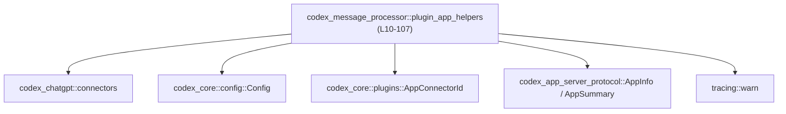
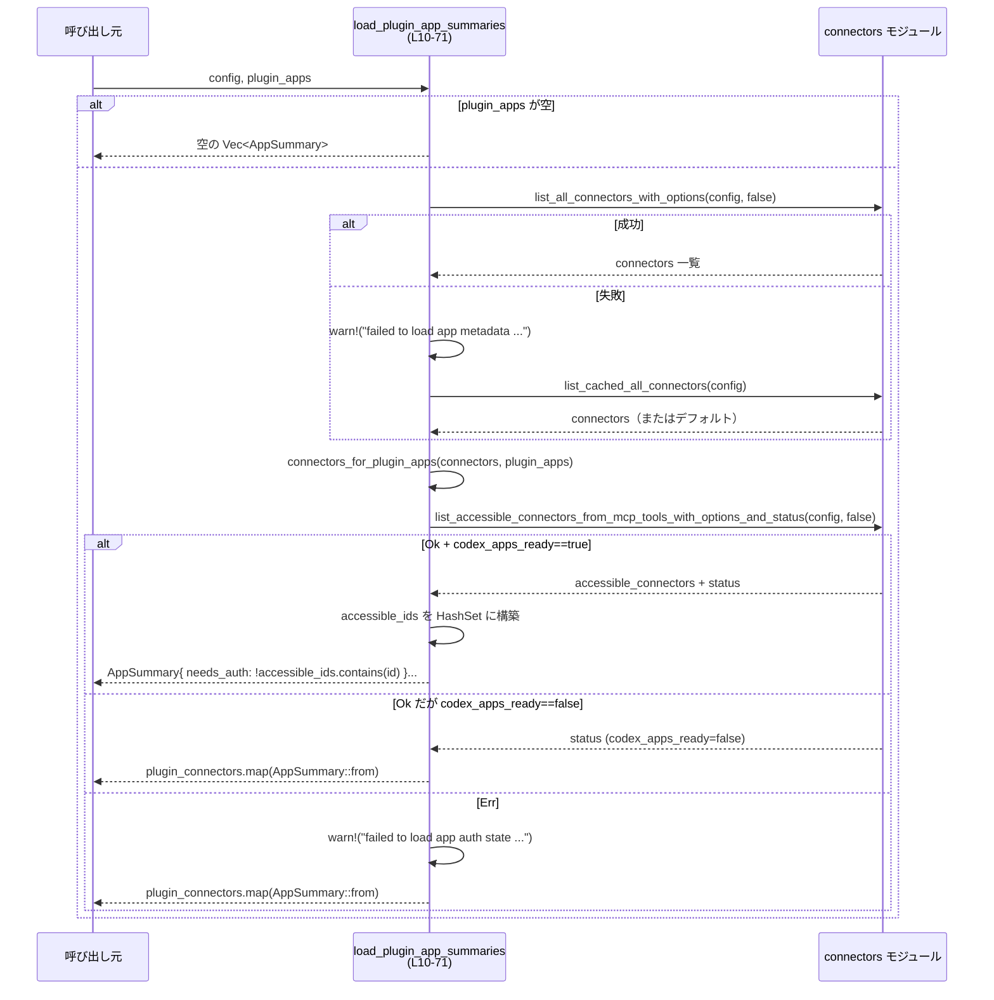
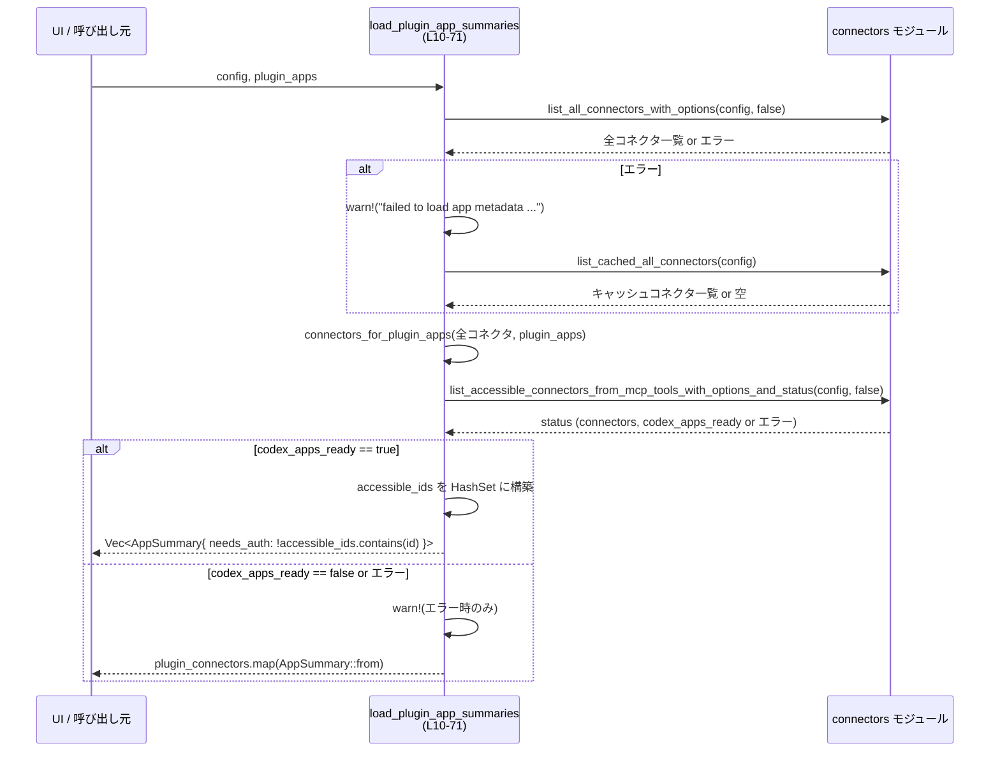

# app-server/src/codex_message_processor/plugin_app_helpers.rs

## 0. ざっくり一言

ChatGPT プラグイン（`plugin_apps`）向けのコネクタ一覧から、  
「アプリのサマリ情報」と「認証が必要なアプリ」を計算するヘルパー関数を提供するモジュールです  
（`plugin_app_helpers.rs:L10-71`, `plugin_app_helpers.rs:L73-106`）。

---

## 1. このモジュールの役割

### 1.1 概要

- このモジュールは、**プラグインアプリのメタデータと認証状態を扱いやすい形に変換する**ために存在し、次の機能を提供します。
  - 設定とプラグイン ID の一覧から、`AppSummary` の一覧を非同期に構築する（`load_plugin_app_summaries`）。  
    `plugin_app_helpers.rs:L10-71`
  - 既に読み込まれた `AppInfo` 群から、「認証がまだ済んでいないプラグインアプリ」のみを抽出する（`plugin_apps_needing_auth`）。  
    `plugin_app_helpers.rs:L73-106`

### 1.2 アーキテクチャ内での位置づけ

- 依存関係の概要は以下のとおりです。
  - 設定情報として `Config` を受け取り、`codex_chatgpt::connectors` モジュールの各種関数を呼び出してコネクタ情報を取得します。  
    `plugin_app_helpers.rs:L18-27`, `plugin_app_helpers.rs:L31-51`
  - ドメインオブジェクトとして `AppInfo` / `AppSummary` を扱います。  
    `plugin_app_helpers.rs:L3-4`, `plugin_app_helpers.rs:L58-70`, `plugin_app_helpers.rs:L92-105`, `plugin_app_helpers.rs:L119-133`
  - プラグインを識別する ID として `AppConnectorId` を使用します。  
    `plugin_app_helpers.rs:L7`, `plugin_app_helpers.rs:L12`, `plugin_app_helpers.rs:L76-77`, `plugin_app_helpers.rs:L87-90`
  - エラーは返さず、`tracing::warn!` でログを出してフォールバック処理に切り替えます。  
    `plugin_app_helpers.rs:L21-26`, `plugin_app_helpers.rs:L44-50`



この図は、本モジュールが設定 (`Config`) とプラグイン ID (`AppConnectorId`) を入力に、  
`connectors` モジュールを通じて `AppInfo` を取得し、`AppSummary` を生成する位置づけを表しています。

### 1.3 設計上のポイント

- **ステートレスなヘルパー**  
  - どちらの関数も状態を保持せず、引数と外部 API の結果から `Vec<AppSummary>` を構築するだけです。  
    `plugin_app_helpers.rs:L10-16`, `plugin_app_helpers.rs:L73-81`
- **エラーは Result ではなくフォールバックで処理**  
  - コネクタ一覧が取得できなかった場合はキャッシュへフォールバックします。  
    `plugin_app_helpers.rs:L18-27`
  - アクセス可能コネクタの取得に失敗した場合は、ログを出した上で、  
    事前計算した `plugin_connectors` を `AppSummary::from` でマッピングして返却します。  
    `plugin_app_helpers.rs:L31-51`
- **準備状態フラグ `codex_apps_ready` による分岐**  
  - `load_plugin_app_summaries` では、`status.codex_apps_ready` が true の場合のみ  
    「アクセス可能コネクタに基づく `needs_auth` 計算」を行います。  
    `plugin_app_helpers.rs:L37-42`, `plugin_app_helpers.rs:L53-68`
  - `plugin_apps_needing_auth` では、`codex_apps_ready` が false の場合は常に空のベクタを返却します。  
    `plugin_app_helpers.rs:L79-81`
- **効率性を意識した判定**  
  - `HashSet<&str>` を用いた ID の集合判定で、認証済みかどうかを高速に判定しています。  
    `plugin_app_helpers.rs:L53-56`, `plugin_app_helpers.rs:L83-90`, `plugin_app_helpers.rs:L94-97`
- **Rust の安全性**  
  - `HashSet<&str>` は、元データの `String` が生存しているスコープ内でのみ使用されており、  
    参照のライフタイムがコンパイラによって保証されています。  
    例: `accessible_connectors` から `accessible_ids` を生成し、その後すぐに使用している。  
    `plugin_app_helpers.rs:L31-56`, `plugin_app_helpers.rs:L58-68`

---

## 2. 主要な機能一覧（コンポーネントインベントリー）

### 2.1 機能の箇条書き

- `load_plugin_app_summaries`: プラグインアプリ ID と設定から、`AppSummary` 一覧を非同期に生成する。
- `plugin_apps_needing_auth`: 既に取得済みの `AppInfo` から、認証が必要なプラグインアプリの `AppSummary` を同期的に抽出する。
- `plugin_apps_needing_auth_returns_empty_when_codex_apps_is_not_ready`: `codex_apps_ready` が false の場合に空を返すことをテストするユニットテスト。

### 2.2 コンポーネント一覧表

| 名前 | 種別 | 公開範囲 | 行 | 役割 / 用途 |
|------|------|----------|----|-------------|
| `load_plugin_app_summaries` | 非同期関数 | `pub(super)` | `plugin_app_helpers.rs:L10-71` | 設定とプラグイン ID の一覧から、必要に応じてコネクタ情報を取得し、`AppSummary` の一覧を構築する。 |
| `plugin_apps_needing_auth` | 関数 | `pub(super)` | `plugin_app_helpers.rs:L73-106` | 既に取得済みの `AppInfo` 群から、認証が必要なプラグインアプリだけを `AppSummary` として抽出する。 |
| `tests` モジュール | モジュール | `#[cfg(test)]` | `plugin_app_helpers.rs:L109-145` | テスト専用モジュール。`plugin_apps_needing_auth` の挙動を検証する。 |
| `plugin_apps_needing_auth_returns_empty_when_codex_apps_is_not_ready` | テスト関数 | `#[test]` | `plugin_app_helpers.rs:L117-144` | `codex_apps_ready = false` の場合に空ベクタを返すことを確認するユニットテスト。 |

---

## 3. 公開 API と詳細解説

### 3.1 型一覧（構造体・列挙体など）

このモジュール自身は新しい型を定義していませんが、以下の外部定義型を主要に扱います。

| 名前 | 種別 | 定義元 | 行 | 役割 / 用途 |
|------|------|--------|----|-------------|
| `Config` | 構造体 | `codex_core::config::Config` | `plugin_app_helpers.rs:L6`, `plugin_app_helpers.rs:L11`, `plugin_app_helpers.rs:L33` | コネクタ取得 API に渡される設定。ネットワークやキャッシュの挙動を制御する設定値を含むと考えられます（詳細フィールドはこのファイルには現れません）。 |
| `AppConnectorId` | タプル構造体 | `codex_core::plugins::AppConnectorId` | `plugin_app_helpers.rs:L7`, `plugin_app_helpers.rs:L12`, `plugin_app_helpers.rs:L76-77`, `plugin_app_helpers.rs:L87-90`, `plugin_app_helpers.rs:L139` | プラグインアプリを一意に識別する ID。`.0` フィールドに `String` が入っていることがコードから分かります。 |
| `AppInfo` | 構造体 | `codex_app_server_protocol::AppInfo` | `plugin_app_helpers.rs:L3`, `plugin_app_helpers.rs:L74-75`, `plugin_app_helpers.rs:L111`, `plugin_app_helpers.rs:L119-133` | コネクタの詳細情報。`id`, `name`, `description`, `install_url`, `is_accessible`, `is_enabled` など、多数のメタデータを持ちます。 |
| `AppSummary` | 構造体 | `codex_app_server_protocol::AppSummary` | `plugin_app_helpers.rs:L4`, `plugin_app_helpers.rs:L13`, `plugin_app_helpers.rs:L58-70`, `plugin_app_helpers.rs:L92-105` | UI 向けの簡略化されたアプリ情報。`id`, `name`, `description`, `install_url`, `needs_auth` を含むことがコードから分かります。 |

> `AppInfo` のフィールド一覧はテストコードから読み取れる範囲のみです（`plugin_app_helpers.rs:L119-133`）。その他のフィールドが存在する可能性については、このチャンクからは分かりません。

---

### 3.2 関数詳細

#### `load_plugin_app_summaries(config: &Config, plugin_apps: &[AppConnectorId]) -> Vec<AppSummary>`

**概要**

- プラグインアプリ ID の一覧と設定 (`Config`) を受け取り、  
  内部でコネクタ一覧と認証状態を非同期に取得して、`AppSummary` の一覧を返す関数です。  
  `plugin_app_helpers.rs:L10-13`, `plugin_app_helpers.rs:L18-27`, `plugin_app_helpers.rs:L31-51`, `plugin_app_helpers.rs:L58-70`

**引数**

| 引数名 | 型 | 説明 |
|--------|----|------|
| `config` | `&Config` | コネクタ情報を取得するために `connectors` モジュールへ渡す設定。`plugin_app_helpers.rs:L11`, `plugin_app_helpers.rs:L18`, `plugin_app_helpers.rs:L23`, `plugin_app_helpers.rs:L32-33` |
| `plugin_apps` | `&[AppConnectorId]` | 対象とするプラグインアプリの ID 一覧。空の場合は即座に空ベクタを返します。`plugin_app_helpers.rs:L12`, `plugin_app_helpers.rs:L14-16`, `plugin_app_helpers.rs:L29` |

**戻り値**

- `Vec<AppSummary>`  
  - 各プラグインアプリに対応する `AppSummary` のベクタです。  
  - ベクタの要素順序は `connectors::connectors_for_plugin_apps` の戻り値の順序に依存します（この関数では順序変更を行っていません）。  
    `plugin_app_helpers.rs:L29`, `plugin_app_helpers.rs:L58-70`

**内部処理の流れ（アルゴリズム）**

1. **入力検証: プラグイン一覧が空なら早期リターン**  
   - `plugin_apps` が空の場合は、外部 API を呼び出さずに空のベクタを返します。  
     `plugin_app_helpers.rs:L14-16`

2. **全コネクタ一覧の取得（オンライン／キャッシュ）**  
   - `connectors::list_all_connectors_with_options(config, false).await` を呼び出し、全コネクタ一覧を取得します。  
     `plugin_app_helpers.rs:L18-20`
   - 失敗した場合は `warn!` でログを出し、  
     `connectors::list_cached_all_connectors(config).await.unwrap_or_default()` にフォールバックします。  
     `plugin_app_helpers.rs:L21-26`
   - エラーを呼び出し元には返さず、あくまで空またはキャッシュからのデータとして扱います。

3. **プラグイン対象コネクタだけを抽出**  
   - 取得した全コネクタから `plugin_apps` に対応するものだけを  
     `connectors::connectors_for_plugin_apps(connectors, plugin_apps)` で抽出します。  
     `plugin_app_helpers.rs:L29`

4. **アクセス可能コネクタと準備状態の取得**  
   - `connectors::list_accessible_connectors_from_mcp_tools_with_options_and_status(config, false).await` を呼び出し、  
     アクセス可能なコネクタ一覧と `codex_apps_ready` を含むステータスを取得します。  
     `plugin_app_helpers.rs:L31-37`
   - 分岐:
     - `Ok(status)` かつ `status.codex_apps_ready == true` の場合のみ、`status.connectors` を `accessible_connectors` として使用します。  
       `plugin_app_helpers.rs:L37`
     - `Ok(_)`（`codex_apps_ready` が false）の場合は、`plugin_connectors` を `AppSummary::from` で変換して返し、処理を終了します。  
       `plugin_app_helpers.rs:L38-43`
     - `Err(err)` の場合は `warn!` を出し、やはり `plugin_connectors` を `AppSummary::from` で変換して返します。  
       `plugin_app_helpers.rs:L44-50`

5. **アクセス可能 ID の集合を構築**  
   - `accessible_connectors` の ID から `HashSet<&str>` を構築し、  
     「認証済みかどうか」を高速に問い合わせられるようにします。  
     `plugin_app_helpers.rs:L53-56`

6. **プラグインアプリごとに `needs_auth` を計算して `AppSummary` を生成**  
   - 各 `plugin_connectors` について、`accessible_ids` に存在するかをチェックし、  
     `needs_auth = !accessible_ids.contains(connector.id.as_str())` として `AppSummary` を構築します。  
     `plugin_app_helpers.rs:L58-67`
   - これらを `collect()` して `Vec<AppSummary>` として返します。  
     `plugin_app_helpers.rs:L58-70`



**Examples（使用例）**

`async` コンテキストからこの関数を使って、プラグインアプリの一覧を取得する例です。

```rust
use codex_core::config::Config;                           // Config 型をインポートする
use codex_core::plugins::AppConnectorId;                  // プラグイン ID 型をインポートする
use codex_app_server_protocol::AppSummary;                // 結果として受け取る型
use crate::codex_message_processor::plugin_app_helpers::  // 同一クレート内のモジュールから
    load_plugin_app_summaries;                            // 関数をインポートする

async fn list_plugin_apps(config: &Config) -> Vec<AppSummary> {
    // プラグインアプリ ID の一覧を用意する（例として2件）
    let plugin_apps = vec![
        AppConnectorId("alpha".to_string()),              // "alpha" という ID のアプリ
        AppConnectorId("beta".to_string()),               // "beta" という ID のアプリ
    ];

    // 非同期に AppSummary の一覧を取得する
    // エラーはこの関数内でログ出力・フォールバックされるため、Result ではなく
    // 直接 Vec<AppSummary> が返ってくる
    load_plugin_app_summaries(config, &plugin_apps).await
}
```

> `Config` の具体的な初期化方法やランタイム（`tokio` など）は、このファイルには現れないため不明です。

**Errors / Panics**

- この関数は `Result` ではなく `Vec<AppSummary>` を返すため、  
  外部 API 呼び出しの失敗は **すべて内部で処理** されています。
  - 全コネクタ取得が失敗した場合: キャッシュにフォールバックし、さらに失敗した場合は `unwrap_or_default()` により空のリストとして扱われます。  
    `plugin_app_helpers.rs:L18-27`
  - アクセス可能コネクタの取得失敗: `warn!` ログを出し、`plugin_connectors` を `AppSummary::from` で変換して返します。  
    `plugin_app_helpers.rs:L44-50`
- このファイル内には `unwrap` や `panic!` は登場せず、明示的なパニックはありません。  
  ただし、呼び出している外部関数（`connectors::*`）が内部でパニックを起こすかどうかは、このチャンクからは分かりません。

**Edge cases（エッジケース）**

- `plugin_apps` が空 (`[]`) の場合:
  - 即座に `Vec::new()` を返し、外部 API は呼び出されません。  
    `plugin_app_helpers.rs:L14-16`
- 全コネクタ取得（オンライン）が失敗する場合:
  - キャッシュにフォールバックし、それも失敗した場合は空の `connectors` になります。  
    この場合 `plugin_connectors` も空となり、結果は空の `Vec<AppSummary>` になります。  
    `plugin_app_helpers.rs:L18-27`, `plugin_app_helpers.rs:L29`
- `codex_apps_ready` が false の場合:
  - アクセス可能コネクタ情報に基づく `needs_auth` 判定は行わず、  
    `plugin_connectors` を `AppSummary::from` でそのまま変換して返します。  
    `plugin_app_helpers.rs:L37-42`
  - `needs_auth` の値がどのように決まるかは、`AppSummary::from` の実装に依存します（このファイルからは不明です）。
- アクセス可能コネクタ取得がエラーになる場合:
  - `codex_apps_ready` が false と同様、`plugin_connectors` を `AppSummary::from` で返します。  
    `plugin_app_helpers.rs:L44-50`
- 同じ ID のプラグインが `plugin_apps` に重複して含まれている場合:
  - `connectors::connectors_for_plugin_apps` の振る舞いによりますが、  
    この関数側では重複 ID を除去・検出する処理は行っていません。  
    `plugin_app_helpers.rs:L29`

**使用上の注意点**

- **非同期関数であること**  
  - `async fn` のため、`tokio` や `async-std` などの非同期ランタイム上で `.await` して使う必要があります。  
    `plugin_app_helpers.rs:L10`
- **エラー情報の取得**  
  - ネットワークエラーや認証エラーなどは呼び出し元に `Result` としては返ってこないため、  
    詳細な失敗理由が必要な場合は `tracing` のログ（`warn!`）を別途集約する必要があります。  
    `plugin_app_helpers.rs:L21-23`, `plugin_app_helpers.rs:L44-45`
- **パフォーマンス上の注意**  
  - `connectors::list_all_connectors_with_options` や  
    `connectors::list_accessible_connectors_from_mcp_tools_with_options_and_status` は  
    ネットワークや外部システムへの I/O を伴う可能性が高く、頻繁な呼び出しは全体のレスポンスに影響する可能性があります。  
    `plugin_app_helpers.rs:L18-20`, `plugin_app_helpers.rs:L31-37`
- **`needs_auth` の意味の差異**  
  - `codex_apps_ready == true` の場合は、本関数内で「アクセス可能 ID の集合」に基づいて `needs_auth` を設定します。  
  - それ以外の場合は `AppSummary::from` に委ねており、このモジュールからは詳細が分かりません。  
    `plugin_app_helpers.rs:L37-42`, `plugin_app_helpers.rs:L44-49`

---

#### `plugin_apps_needing_auth(all_connectors: &[AppInfo], accessible_connectors: &[AppInfo], plugin_apps: &[AppConnectorId], codex_apps_ready: bool) -> Vec<AppSummary>`

**概要**

- 既に取得済みの `AppInfo` 一覧とアクセス可能なコネクタ一覧、プラグインアプリ ID の一覧を受け取り、  
  「認証が必要なプラグインアプリ」だけを `AppSummary` の一覧として返す関数です。  
  `plugin_app_helpers.rs:L73-78`, `plugin_app_helpers.rs:L92-105`

**引数**

| 引数名 | 型 | 説明 |
|--------|----|------|
| `all_connectors` | `&[AppInfo]` | すべてのアプリ（コネクタ）の情報一覧。ここからプラグインアプリに対応するものを選び出します。`plugin_app_helpers.rs:L74`, `plugin_app_helpers.rs:L92-99` |
| `accessible_connectors` | `&[AppInfo]` | 現在アクセス可能なアプリの一覧。`id` から `HashSet` を作って「認証済みかどうか」を判定します。`plugin_app_helpers.rs:L75`, `plugin_app_helpers.rs:L83-86` |
| `plugin_apps` | `&[AppConnectorId]` | プラグインアプリの ID 一覧。`AppConnectorId.0` の `String` を ID として扱います。`plugin_app_helpers.rs:L76-77`, `plugin_app_helpers.rs:L87-90` |
| `codex_apps_ready` | `bool` | Codex 側のアプリ情報が「準備完了」かどうかを示すフラグ。false の場合は常に空ベクタを返します。`plugin_app_helpers.rs:L77-81` |

**戻り値**

- `Vec<AppSummary>`  
  - `all_connectors` のうち、  
    1. `plugin_apps` の ID 集合に含まれ、かつ  
    2. `accessible_connectors` の ID 集合に含まれていない  
    ものを対象とした `AppSummary` のベクタです。  
    `plugin_app_helpers.rs:L92-105`
  - `codex_apps_ready` が false の場合は常に空ベクタを返します。  
    `plugin_app_helpers.rs:L79-81`

**内部処理の流れ（アルゴリズム）**

1. **準備完了フラグのチェック**  
   - `codex_apps_ready` が false の場合、即座に `Vec::new()` を返し、以降の処理は行いません。  
     `plugin_app_helpers.rs:L79-81`

2. **アクセス可能 ID の集合を構築**  
   - `accessible_connectors` の ID を `HashSet<&str>` に変換し、  
     「すでにアクセス可能（＝認証済み）」なアプリの集合を作ります。  
     `plugin_app_helpers.rs:L83-86`

3. **プラグインアプリ ID の集合を構築**  
   - `plugin_apps` の `AppConnectorId.0` を `&str` に変換し、`HashSet<&str>` を作ります。  
     `plugin_app_helpers.rs:L87-90`

4. **条件に合致する `AppInfo` をフィルタリング**  
   - `all_connectors` をイテレートし、以下の条件を満たすものだけを残します。  
     `plugin_app_helpers.rs:L92-97`
     - `plugin_app_ids` に ID が含まれていること（プラグインアプリである）。  
     - `accessible_ids` に ID が含まれていないこと（まだアクセス不可＝認証が必要）。

5. **`AppSummary` への変換**  
   - 条件に合致した `AppInfo` を `cloned()` でコピーしたあと、  
     `AppSummary { id, name, description, install_url, needs_auth: true }` に変換します。  
     `plugin_app_helpers.rs:L98-105`
   - `needs_auth` はこの関数では必ず `true` に設定されます。  
     `plugin_app_helpers.rs:L104-105`

**Examples（使用例）**

簡単なデータを用いて、認証が必要なプラグインアプリを抽出する例です。

```rust
use codex_app_server_protocol::AppInfo;                   // AppInfo 型をインポート
use codex_app_server_protocol::AppSummary;                // 結果として使用
use codex_core::plugins::AppConnectorId;                  // プラグイン ID 型
use crate::codex_message_processor::plugin_app_helpers::  // 同一クレート内の関数
    plugin_apps_needing_auth;

fn example_needing_auth() -> Vec<AppSummary> {
    // 全コネクタ一覧（テストコードと同様の構造）
    let all_connectors = vec![
        AppInfo {
            id: "alpha".to_string(),                      // プラグイン "alpha"
            name: "Alpha".to_string(),
            description: Some("Alpha connector".to_string()),
            logo_url: None,
            logo_url_dark: None,
            distribution_channel: None,
            branding: None,
            app_metadata: None,
            labels: None,
            install_url: Some("https://chatgpt.com/apps/alpha/alpha".to_string()),
            is_accessible: false,                         // まだアクセス不可
            is_enabled: true,
            plugin_display_names: Vec::new(),
        },
        // ここに他の AppInfo を追加してもよい
    ];

    // すでにアクセス可能なコネクタ一覧（この例では空）
    let accessible_connectors: Vec<AppInfo> = Vec::new();

    // 対象とするプラグイン ID 一覧
    let plugin_apps = vec![AppConnectorId("alpha".to_string())];

    // codex_apps_ready が true の場合のみ計算される
    plugin_apps_needing_auth(
        &all_connectors,
        &accessible_connectors,
        &plugin_apps,
        /*codex_apps_ready*/ true,
    )
}
```

**Errors / Panics**

- 関数シグネチャは `Result` ではなく `Vec<AppSummary>` であり、  
  この関数内では I/O を行っていないため、通常の呼び出しでエラーになることはありません。  
  `plugin_app_helpers.rs:L73-106`
- `HashSet` への `collect` などでパニックを起こす要素は見当たりません。  
  パニックの可能性は主に `AppInfo` や `AppSummary` の実装に依存しますが、  
  このチャンクにはその情報は含まれていません。

**Edge cases（エッジケース）**

- `codex_apps_ready` が false の場合:
  - 無条件に `Vec::new()` が返され、他の引数は無視されます。  
    `plugin_app_helpers.rs:L79-81`
- `accessible_connectors` が空の場合:
  - `accessible_ids` が空の `HashSet` になるため、  
    `plugin_apps` に含まれる ID はすべて「認証が必要」と判定されます（`needs_auth = true`）。  
    `plugin_app_helpers.rs:L83-86`, `plugin_app_helpers.rs:L94-97`, `plugin_app_helpers.rs:L104-105`
- `plugin_apps` が空の場合:
  - `plugin_app_ids` が空の `HashSet` となり、  
    `filter` 条件 `plugin_app_ids.contains(connector.id.as_str())` を満たす要素が存在しないため、結果は空ベクタになります。  
    `plugin_app_helpers.rs:L87-90`, `plugin_app_helpers.rs:L92-97`
- `all_connectors` に `plugin_apps` に含まれる ID が存在しない場合:
  - 該当する `AppInfo` が見つからないため、その ID は結果に含まれません。  
    これは `all_connectors` のカバレッジに依存する挙動です。  
    `plugin_app_helpers.rs:L92-97`

**使用上の注意点**

- **`codex_apps_ready` の意味**  
  - この関数は `codex_apps_ready` が true のときのみ意味のある結果を返します。  
    false を渡すと常に空ベクタが返るため、呼び出し側でフラグを適切に設定する必要があります。  
    `plugin_app_helpers.rs:L79-81`
- **ID の一致条件**  
  - `AppInfo.id` と `AppConnectorId.0` の文字列が完全一致することを前提にフィルタリングしています。  
    大文字・小文字の違いや末尾のスラッシュなどがある場合は別 ID とみなされます。  
    `plugin_app_helpers.rs:L87-90`, `plugin_app_helpers.rs:L94-97`
- **パフォーマンス**  
  - `HashSet` による集合演算を使っているため、典型的には O(n) で動作します。  
    大量のコネクタを扱う場合も比較的効率的ですが、`AppInfo` の `clone()` コストが高い場合は影響があります。  
    `plugin_app_helpers.rs:L83-86`, `plugin_app_helpers.rs:L87-90`, `plugin_app_helpers.rs:L98-99`
- **並行性**  
  - この関数自体は同期関数であり、共有状態を持ちません。  
    同じ `&[AppInfo]` を複数スレッドから参照していても、`&` 参照のみ（読み取り専用）のため、  
    Rust の所有権・借用ルールによりデータ競合は発生しません。

---

### 3.3 その他の関数

| 関数名 | 役割（1 行） | 行 |
|--------|--------------|----|
| `plugin_apps_needing_auth_returns_empty_when_codex_apps_is_not_ready` | `codex_apps_ready` が false の場合に `plugin_apps_needing_auth` が空ベクタを返すことを検証するテスト。 | `plugin_app_helpers.rs:L117-144` |

---

## 4. データフロー

代表的なシナリオとして、「プラグインアプリ一覧と認証状態を UI に表示する」場合のデータフローを示します。

1. 呼び出し元は、設定 (`Config`) とプラグインアプリ ID (`AppConnectorId` の一覧) を用意して、  
   `load_plugin_app_summaries` を `await` します。  
   `plugin_app_helpers.rs:L10-13`
2. 関数内でコネクタ一覧とアクセス可能コネクタ一覧が取得され、`needs_auth` を計算した `AppSummary` が返されます。  
   `plugin_app_helpers.rs:L18-27`, `plugin_app_helpers.rs:L31-51`, `plugin_app_helpers.rs:L53-68`
3. 呼び出し元は `AppSummary` の一覧を UI や他のロジックに渡します。



- `plugin_apps_needing_auth` は、同様のフィルタロジックを **既に取得済みの `AppInfo`** に対して適用する純粋な関数です。  
  この場合、外部 I/O は発生せず、上図の「connectors モジュール」を利用する部分が事前に終わっているイメージになります。  
  `plugin_app_helpers.rs:L73-106`

---

## 5. 使い方（How to Use）

### 5.1 基本的な使用方法

#### 非同期にプラグインアプリ一覧を取得する（`load_plugin_app_summaries`）

```rust
use codex_core::config::Config;                           // Config 型
use codex_core::plugins::AppConnectorId;                  // プラグイン ID 型
use codex_app_server_protocol::AppSummary;                // 戻り値の型
use crate::codex_message_processor::plugin_app_helpers::  // モジュールから関数をインポート
    load_plugin_app_summaries;

#[tokio::main]                                            // tokio ランタイムを使う場合の例
async fn main() {
    // Config の具体的な生成方法はこのファイルにはないため、仮のコードとします。
    let config: Config = /* 設定のロードや初期化 */ todo!();

    // 対象とするプラグインアプリ ID 一覧
    let plugin_apps = vec![
        AppConnectorId("alpha".to_string()),
        AppConnectorId("beta".to_string()),
    ];

    // 非同期に AppSummary の一覧を取得
    let summaries: Vec<AppSummary> =
        load_plugin_app_summaries(&config, &plugin_apps).await;

    // 取得したサマリを利用する（例: ログに出力）
    for summary in summaries {
        println!(
            "id={}, name={}, needs_auth={}",
            summary.id, summary.name, summary.needs_auth
        );
    }
}
```

#### 既存のコネクタ情報から「認証が必要なプラグイン」だけを抽出する（`plugin_apps_needing_auth`）

```rust
use codex_app_server_protocol::AppInfo;                   // 全コネクタ情報
use codex_app_server_protocol::AppSummary;                // 結果
use codex_core::plugins::AppConnectorId;                  // プラグイン ID
use crate::codex_message_processor::plugin_app_helpers::  // 関数インポート
    plugin_apps_needing_auth;

fn main() {
    // 全コネクタ一覧（簡略化された例。実際には外部から取得している想定）
    let all_connectors = vec![
        AppInfo {
            id: "alpha".to_string(),
            name: "Alpha".to_string(),
            description: Some("Alpha connector".to_string()),
            logo_url: None,
            logo_url_dark: None,
            distribution_channel: None,
            branding: None,
            app_metadata: None,
            labels: None,
            install_url: Some("https://chatgpt.com/apps/alpha/alpha".to_string()),
            is_accessible: false,                         // まだアクセス不可
            is_enabled: true,
            plugin_display_names: Vec::new(),
        },
        // 他の AppInfo もここに追加可能
    ];

    // 現在アクセス可能なコネクタ一覧（この例では空）
    let accessible_connectors: Vec<AppInfo> = vec![];

    // プラグインアプリ ID 一覧
    let plugin_ids = vec![AppConnectorId("alpha".to_string())];

    // Codex 側が「準備完了」の状態であれば true を渡す
    let codex_apps_ready = true;

    // 認証が必要なプラグインアプリのサマリ一覧を取得
    let needing_auth: Vec<AppSummary> = plugin_apps_needing_auth(
        &all_connectors,
        &accessible_connectors,
        &plugin_ids,
        codex_apps_ready,
    );

    for app in needing_auth {
        println!("{} needs authentication", app.name);
    }
}
```

### 5.2 よくある使用パターン

1. **フル自動取得パターン**  
   - コネクタ情報の取得から `needs_auth` 判定までを一括で行いたい場合は、  
     `load_plugin_app_summaries` を使います。
   - この場合、内部でネットワーク／キャッシュへのアクセスや `codex_apps_ready` 判定が行われるため、  
     呼び出し元は `Config` とプラグイン ID 一覧だけ用意すればよいです。

2. **事前取得済みデータ再利用パターン**  
   - すでに `all_connectors` や `accessible_connectors` を別の場所で取得・保持している場合は、  
     `plugin_apps_needing_auth` を使って二次的な絞り込みだけを行うことができます。  
     - 外部 I/O を伴わないため、高頻度で呼び出しやすいです。  
       `plugin_app_helpers.rs:L73-106`

3. **`codex_apps_ready` による制御**  
   - Codex 側の状態が未準備（`false`）の場合は、  
     - `load_plugin_app_summaries`: `AppSummary::from` を使ったフォールバック結果を返す。  
       `plugin_app_helpers.rs:L38-43`
     - `plugin_apps_needing_auth`: 空ベクタを返す。  
       `plugin_app_helpers.rs:L79-81`  
   - 呼び出し元はこの差異を理解した上で、UI 表示やロジックを設計する必要があります。

### 5.3 よくある間違い

```rust
use crate::codex_message_processor::plugin_app_helpers::plugin_apps_needing_auth;
use codex_app_server_protocol::AppInfo;
use codex_core::plugins::AppConnectorId;

// 間違い例: codex_apps_ready が false なのに結果を期待している
fn wrong_usage(all: &[AppInfo], accessible: &[AppInfo]) {
    let plugin_ids = vec![AppConnectorId("alpha".to_string())];

    // codex_apps_ready に false を渡しているため、
    // 結果は必ず空 Vec になる
    let result = plugin_apps_needing_auth(all, accessible, &plugin_ids, false);

    // ここで result に要素が入っていると期待するとバグになります
    assert!(!result.is_empty(), "このアサーションは失敗する");
}

// 正しい例: codex_apps_ready が true のときのみ結果を利用する
fn correct_usage(all: &[AppInfo], accessible: &[AppInfo], codex_apps_ready: bool) {
    let plugin_ids = vec![AppConnectorId("alpha".to_string())];

    if !codex_apps_ready {
        // 準備完了前は「認証が必要なアプリ一覧」は利用できない前提で扱う
        return;
    }

    let result = plugin_apps_needing_auth(all, accessible, &plugin_ids, codex_apps_ready);
    // ここで初めて result の中身を利用する
    println!("認証が必要なプラグイン数: {}", result.len());
}
```

### 5.4 使用上の注意点（まとめ）

- **非同期／同期の違い**  
  - コネクタ取得を含む `load_plugin_app_summaries` は `async fn`、  
    絞り込みのみの `plugin_apps_needing_auth` は同期関数です。  
    両者を混同しないようにする必要があります。
- **`codex_apps_ready` の扱い**  
  - `plugin_apps_needing_auth` は `codex_apps_ready` に強く依存し、false なら常に空結果になります。  
    状態フラグを集中管理する設計が望ましいです（どこで true/false を決めるかはこのファイルには現れません）。
- **エラーとログ**  
  - エラーはすべて内部で `warn!` ログとして記録されるため、監視やトラブルシュートの際は  
    `tracing` のログ出力を確認する必要があります。
- **ID の一貫性**  
  - `AppInfo.id` と `AppConnectorId.0` の文字列が完全一致している必要があります。  
    どこかで ID を正規化・検証する処理が必要かどうかは、このモジュール外の設計に依存します。

---

## 6. 変更の仕方（How to Modify）

### 6.1 新しい機能を追加する場合

例: `AppSummary` に別のフラグ（例: `is_enabled`）を含めたい場合。

1. **`AppSummary` の定義を確認・変更**  
   - `codex_app_server_protocol::AppSummary` の定義ファイルを確認し、新しいフィールドを追加します（このファイルには定義はありません）。
2. **生成ロジックの更新**  
   - `load_plugin_app_summaries` の `AppSummary` 初期化部分を修正し、新フィールドを設定します。  
     `plugin_app_helpers.rs:L62-67`
   - `plugin_apps_needing_auth` の `AppSummary` 初期化部分も同様に更新します。  
     `plugin_app_helpers.rs:L100-104`
3. **関連テストの追加・修正**  
   - 既存のテスト `plugin_apps_needing_auth_returns_empty_when_codex_apps_is_not_ready` に加え、  
     新フィールドの値を検証するテストを同じ `tests` モジュールに追加します。  
     `plugin_app_helpers.rs:L109-145`

### 6.2 既存の機能を変更する場合

- **影響範囲の確認**  
  - `load_plugin_app_summaries` と `plugin_apps_needing_auth` はどちらも `pub(super)` であり、  
    同一モジュール階層内の他ファイルからも呼び出されている可能性があります。  
    呼び出し側をすべて検索し、期待する挙動との整合性を確認する必要があります。
- **前提条件・返り値の契約**  
  - `plugin_apps_needing_auth` が「`codex_apps_ready` が false なら必ず空を返す」という契約は、  
    テストで明示的に検証されています。  
    この前提を変更する場合は、テストの意図とあわせて慎重に検討する必要があります。  
    `plugin_app_helpers.rs:L79-81`, `plugin_app_helpers.rs:L117-144`
  - `load_plugin_app_summaries` はエラーを返さないという設計になっているため、  
    ここで `Result` を返すように変えると、上位呼び出しコードの大幅な変更が必要になる可能性があります。
- **テストの再確認**  
  - 変更後は、既存テスト（`tests` モジュール）を実行し、  
    少なくとも `codex_apps_ready` 関連の挙動が意図通りであることを確認する必要があります。  
    `plugin_app_helpers.rs:L117-144`

---

## 7. 関連ファイル

| パス / モジュール | 役割 / 関係 |
|------------------|------------|
| `codex_chatgpt::connectors` | コネクタ一覧やアクセス可能コネクタ一覧を取得する外部モジュール。`load_plugin_app_summaries` から呼び出されます。`plugin_app_helpers.rs:L5`, `plugin_app_helpers.rs:L18-20`, `plugin_app_helpers.rs:L23-26`, `plugin_app_helpers.rs:L29`, `plugin_app_helpers.rs:L31-37` |
| `codex_core::config::Config` | コネクタ取得に必要な設定情報を保持する構造体。`load_plugin_app_summaries` の引数として使われます。`plugin_app_helpers.rs:L6`, `plugin_app_helpers.rs:L11`, `plugin_app_helpers.rs:L18`, `plugin_app_helpers.rs:L23`, `plugin_app_helpers.rs:L32-33` |
| `codex_core::plugins::AppConnectorId` | プラグインアプリ ID を表すタプル構造体。両関数の入力として使用されます。`plugin_app_helpers.rs:L7`, `plugin_app_helpers.rs:L12`, `plugin_app_helpers.rs:L76-77`, `plugin_app_helpers.rs:L87-90`, `plugin_app_helpers.rs:L139` |
| `codex_app_server_protocol::AppInfo` | コネクタの詳細メタデータ。`plugin_apps_needing_auth` の入力やテストデータとして使用されています。`plugin_app_helpers.rs:L3`, `plugin_app_helpers.rs:L74-75`, `plugin_app_helpers.rs:L111`, `plugin_app_helpers.rs:L119-133` |
| `codex_app_server_protocol::AppSummary` | UI などで使いやすいアプリサマリ。両関数の戻り値として生成されます。`plugin_app_helpers.rs:L4`, `plugin_app_helpers.rs:L13`, `plugin_app_helpers.rs:L58-70`, `plugin_app_helpers.rs:L92-105` |
| `tracing::warn` | 外部 API 呼び出しの失敗をログに記録するために使用されるマクロ。`plugin_app_helpers.rs:L8`, `plugin_app_helpers.rs:L21-23`, `plugin_app_helpers.rs:L44-45` |

---

### Bugs / Security・契約・テストに関する補足（このファイルから読み取れる範囲）

- **潜在的なバグの可能性（観察のみ）**
  - `plugin_apps_needing_auth` は `codex_apps_ready == false` の場合に空を返す一方、  
    `load_plugin_app_summaries` はその場合でも `AppSummary::from` による値を返します。  
    両者の挙動の違いが意図されたものかどうかは、このファイルからは分かりませんが、  
    呼び出し側で統一的に扱う必要があります。  
    `plugin_app_helpers.rs:L37-43`, `plugin_app_helpers.rs:L79-81`
- **セキュリティ観点**
  - このモジュール自身は外部入力の直接処理や危険なシステムコールを行っていません。  
    主なセキュリティ上の関心は、外部モジュール `connectors` 側の認証・認可に委ねられていると考えられます。
- **契約（Contracts）**
  - `plugin_apps_needing_auth` が「準備完了フラグが false なら常に空を返す」という契約は、  
    テストで明示的に固定されています。  
    `plugin_app_helpers.rs:L117-144`
- **テストカバレッジ**
  - 現在のテストは `codex_apps_ready == false` のパスのみをカバーしており、  
    他の分岐（プラグインが実際にフィルタされるケースなど）はこのファイルにはテストが見当たりません。  
    `plugin_app_helpers.rs:L117-144`  
  - 追加のテスト（例えば `codex_apps_ready == true` かつ一部プラグインのみ `accessible_connectors` に含まれるケース）は、  
    挙動を確認する上で有用です。
