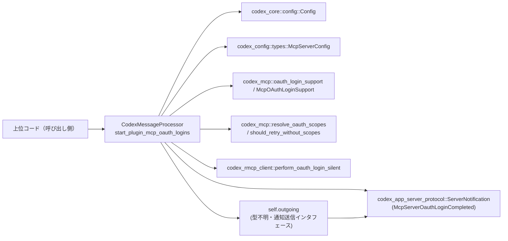
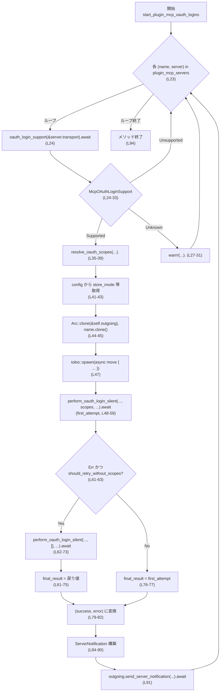

# app-server/src/codex_message_processor/plugin_mcp_oauth.rs コード解説

---

## 0. ざっくり一言

- プラグイン用 MCP サーバーに対して **OAuth ログイン処理を並行に開始し、完了結果を通知メッセージとして送信する** メソッドを定義しているファイルです（`start_plugin_mcp_oauth_logins`。plugin_mcp_oauth.rs:L18-94）。

このファイルは 1 チャンクのみ（1/1）です。

---

## 1. このモジュールの役割

### 1.1 概要

- このモジュールは **プラグイン MCP サーバーごとの OAuth ログインを非同期に実行**し、その結果をアプリケーション側に通知する役割を持ちます（plugin_mcp_oauth.rs:L18-94）。
- 各サーバーについて
  - OAuth ログインがサポートされているかを検出し（`oauth_login_support`）、  
  - スコープの解決（`resolve_oauth_scopes`）、スコープ付き／スコープ無しでのログイン試行（`perform_oauth_login_silent`）、  
  - リトライ条件の判定（`should_retry_without_scopes`）  
  を行ったうえで、
- 結果を `ServerNotification::McpServerOauthLoginCompleted` として送信します（plugin_mcp_oauth.rs:L84-91）。

### 1.2 アーキテクチャ内での位置づけ

このファイル内のメソッドが、どのコンポーネントとどのように連携するかを図示します。



- 呼び出し元は `CodexMessageProcessor::start_plugin_mcp_oauth_logins` を呼び出します（plugin_mcp_oauth.rs:L17-22）。
- メソッド内部で MCP サーバー設定（`McpServerConfig`）とアプリ設定（`Config`）を参照します（plugin_mcp_oauth.rs:L20-21, L23, L35-43）。
- 各種 OAuth 関連ユーティリティ関数（`oauth_login_support`, `resolve_oauth_scopes`, `should_retry_without_scopes`, `perform_oauth_login_silent`）に処理を委譲します（plugin_mcp_oauth.rs:L24-39, L48-58, L62-73）。
- ログイン結果は `ServerNotification::McpServerOauthLoginCompleted` 経由で `self.outgoing` に送られます（plugin_mcp_oauth.rs:L44, L84-91）。

### 1.3 設計上のポイント

コードから読み取れる設計上の特徴を整理します。

- **サーバーごとの完全非同期実行**
  - MCP サーバーごとのログイン処理は `tokio::spawn` 内で行われ、メソッド呼び出し元は **ログイン完了を待ちません**（fire-and-forget）（plugin_mcp_oauth.rs:L47-52, L59, L75, L92）。
- **OAuth サポート状況に応じた分岐**
  - `oauth_login_support` の結果に応じて
    - `Supported(config)` の場合のみログインを試行（plugin_mcp_oauth.rs:L24-26）。
    - `Unsupported` ならそのサーバーはスキップ（plugin_mcp_oauth.rs:L26）。
    - `Unknown(err)` は warn ログを出してスキップ（plugin_mcp_oauth.rs:L27-32）。
- **スコープ付き → スコープ無しの二段階リトライ**
  - 最初は解決済みスコープを付けて静かにログインを試行し（plugin_mcp_oauth.rs:L35-39, L48-58）、
  - エラー内容とスコープを見て `should_retry_without_scopes` が真なら、スコープ無しでもう一度だけ試行します（plugin_mcp_oauth.rs:L61-75）。
- **結果を bool + エラーメッセージで表現**
  - 成功時は `success = true, error = None`、失敗時は `success = false, error = Some(err.to_string())` として通知します（plugin_mcp_oauth.rs:L79-82, L84-90）。
- **スレッド安全な共有のための `Arc` 使用**
  - `self.outgoing` への参照は `Arc::clone` でクローンされ、`tokio::spawn` したタスク間で安全に共有されます（plugin_mcp_oauth.rs:L44, L47-52, L91）。

---

## 2. 主要な機能一覧（コンポーネントインベントリー）

### 2.1 関数・メソッド一覧

| 種別 | 名前 / シグネチャ | 役割（1 行） | 根拠 |
|------|-------------------|--------------|------|
| メソッド | `pub(super) async fn start_plugin_mcp_oauth_logins(&self, config: &Config, plugin_mcp_servers: HashMap<String, McpServerConfig>)` | MCP プラグインサーバー群に対する OAuth ログイン処理を並行に開始し、結果を通知として送信する | plugin_mcp_oauth.rs:L17-22, L23-94 |

### 2.2 外部コンポーネント・型・関数一覧

このファイル内で利用される主要な外部コンポーネントを列挙します。

| 種別 | 名前 | 役割 / 用途 | 根拠 |
|------|------|-------------|------|
| 構造体 | `codex_core::config::Config` | OAuth コールバック URL / ポート / 資格情報保存モードなど、アプリ全体の設定を提供する | plugin_mcp_oauth.rs:L7, L20, L41-43 |
| 構造体 | `codex_config::types::McpServerConfig` | 各 MCP サーバーの設定（transport, scopes, oauth_resource など）を保持する | plugin_mcp_oauth.rs:L6, L21, L23, L35-38, L55, L70 |
| 列挙体 | `codex_mcp::McpOAuthLoginSupport` | MCP サーバーが OAuth ログインをサポートするかどうかを表す（Supported/Unsupported/Unknown） | plugin_mcp_oauth.rs:L8, L24-27 |
| 関数 | `codex_mcp::oauth_login_support` | MCP サーバーの transport 設定から OAuth ログインサポートの有無/詳細を問い合わせる非同期関数 | plugin_mcp_oauth.rs:L9, L24 |
| 関数 | `codex_mcp::resolve_oauth_scopes` | 明示スコープ・サーバー設定のスコープ・ディスカバリ済スコープから、実際に使用するスコープ一覧を決定する | plugin_mcp_oauth.rs:L10, L35-39 |
| 関数 | `codex_mcp::should_retry_without_scopes` | 初回ログインエラーとスコープ情報に基づき、スコープ無しでのリトライを行うべきか判定する | plugin_mcp_oauth.rs:L11, L61-63 |
| 関数 | `codex_rmcp_client::perform_oauth_login_silent` | ユーザーへの対話を行わずに OAuth ログインフローを実行し、資格情報を保存する非同期関数 | plugin_mcp_oauth.rs:L12, L48-58, L62-73 |
| 型 | `codex_app_server_protocol::ServerNotification` | サーバーからクライアントへ送られる通知メッセージの列挙体。ここでは OAuth ログイン完了通知のバリアントを使用 | plugin_mcp_oauth.rs:L5, L84-90 |
| 構造体 | `codex_app_server_protocol::McpServerOauthLoginCompletedNotification` | MCP サーバーの OAuth ログイン完了結果（name, success, error）を表す通知ペイロード | plugin_mcp_oauth.rs:L4, L84-90 |
| 構造体（推定） | `resolve_oauth_scopes` の戻り値 | `scopes` フィールドを持ち、使用すべき OAuth スコープの集合を保持する | plugin_mcp_oauth.rs:L35-39, L54-55, L62 |
| ロガー | `tracing::warn` | OAuth サポート状況が `Unknown` の場合に警告ログを出す | plugin_mcp_oauth.rs:L13, L27-31 |
| フィールド（型不明） | `self.outgoing` | `send_server_notification` メソッドを持つ通知送信用オブジェクト。`Arc` で共有される | plugin_mcp_oauth.rs:L15, L44, L91 |

※ resolve_oauth_scopes の戻り値の具体的な型名・フィールド構成は、このチャンクには現れないため不明です。`scopes` フィールドが存在することのみコードから読み取れます（plugin_mcp_oauth.rs:L54, L62）。

---

## 3. 公開 API と詳細解説

### 3.1 型一覧（このファイル内で定義される型）

- このファイル内で **新しく定義される構造体・列挙体・型エイリアスはありません**。
- すべて外部クレートの型および `super::CodexMessageProcessor`（別ファイル定義）を利用しています（plugin_mcp_oauth.rs:L4-15, L17）。

### 3.2 関数詳細

#### `start_plugin_mcp_oauth_logins(&self, config: &Config, plugin_mcp_servers: HashMap<String, McpServerConfig>) -> impl Future<Output = ()>`

※ Rust 的には `async fn` の戻り値は `impl Future<Output = ()>` ですが、ここでは便宜上「`() を返す async メソッド」として説明します。

**概要**

- 与えられた複数の MCP サーバー設定に対して、**OAuth ログイン処理を並行に開始**します（plugin_mcp_oauth.rs:L18-23）。
- 各サーバーごとに
  - OAuth 対応状況の確認→スコープ解決→ログイン→必要ならスコープ無しで再ログイン  
  を行い、その結果を `McpServerOauthLoginCompletedNotification` として `self.outgoing` 経由で送信します（plugin_mcp_oauth.rs:L24-32, L35-39, L47-58, L61-82, L84-91）。
- メソッド自体は `tokio::spawn` したタスクを **待たずに返る** ため、呼び出し側はログイン完了を待機しません（plugin_mcp_oauth.rs:L47, L92）。

**引数**

| 引数名 | 型 | 説明 | 根拠 |
|--------|----|------|------|
| `&self` | `&CodexMessageProcessor` | メソッドレシーバ。`self.outgoing` 経由で通知を送信するために使用する | plugin_mcp_oauth.rs:L17-18, L44, L91 |
| `config` | `&Config` | OAuth 資格情報の保存モード、コールバックポート、コールバック URL などのグローバル設定を提供する | plugin_mcp_oauth.rs:L20, L41-43 |
| `plugin_mcp_servers` | `HashMap<String, McpServerConfig>` | プラグイン用 MCP サーバー名をキーとし、各サーバーの設定（transport, scopes, oauth_resource 等）を値とするマップ。消費されてループで使用される | plugin_mcp_oauth.rs:L21, L23 |

**戻り値**

- 戻り値の型は明示されていませんが、`async fn` なので `Future<Output = ()>` を返します。
- この Future が `await` されたときの意味：
  - すべての `tokio::spawn` 呼び出しが完了するまで（= すべてのサーバーのタスクを起動し終わるまで）を待ちます。
  - ただし **個々のログインタスクの完了までは待ちません**。`tokio::spawn` で起動されたタスクは、`start_plugin_mcp_oauth_logins` の Future 完了後もバックグラウンドで動作します（plugin_mcp_oauth.rs:L47, L92）。

**内部処理の流れ（アルゴリズム）**

1. **サーバーごとのループ**
   - `for (name, server) in plugin_mcp_servers { ... }` で、サーバー名とその設定を順に取り出します（plugin_mcp_oauth.rs:L23）。
2. **OAuth サポート問い合わせ**
   - `oauth_login_support(&server.transport).await` を呼び出し、`McpOAuthLoginSupport` を取得します（plugin_mcp_oauth.rs:L24）。
   - `match` で分岐（plugin_mcp_oauth.rs:L24-33）:
     - `Supported(config)` → `oauth_config` として使用。
     - `Unsupported` → `continue` して次のサーバーへ（plugin_mcp_oauth.rs:L26）。
     - `Unknown(err)` → `warn!` ログ出力の後に `continue`（plugin_mcp_oauth.rs:L27-32）。
3. **スコープの解決**
   - `resolve_oauth_scopes(None, server.scopes.clone(), oauth_config.discovered_scopes.clone())` でスコープを決定します（plugin_mcp_oauth.rs:L35-39）。
   - `None` が explicit_scopes として渡されているため、ここでは「明示指定はなし」として扱われます（plugin_mcp_oauth.rs:L36）。
4. **設定値と共有オブジェクトの準備**
   - `config` から `store_mode`, `callback_port`, `callback_url` を取得（plugin_mcp_oauth.rs:L41-43）。
   - `self.outgoing` を `Arc::clone` で共有用に複製（plugin_mcp_oauth.rs:L44）。
   - `notification_name = name.clone()` を作成し、後の通知用に保持（plugin_mcp_oauth.rs:L45）。
5. **サーバーごとのタスク生成**
   - `tokio::spawn(async move { ... })` で、サーバーごとのログイン処理を新しいタスクとして起動します（plugin_mcp_oauth.rs:L47）。
6. **（タスク内）第一回ログイン試行**
   - `perform_oauth_login_silent` をスコープ付きで呼び出し、`first_attempt` を取得（plugin_mcp_oauth.rs:L48-59）。
     - 引数にはサーバー名、OAuth URL、保存モード、HTTP ヘッダー、環境変数由来のヘッダー、解決済スコープ、オプションの `oauth_resource`、コールバックポート、コールバック URL を渡します（plugin_mcp_oauth.rs:L48-57）。
7. **（タスク内）リトライ判定と第二回ログイン試行**
   - `match first_attempt` で判定（plugin_mcp_oauth.rs:L61-77）:
     - `Err(err)` かつ `should_retry_without_scopes(&resolved_scopes, &err)` が真なら：
       - スコープを `&[]`（空）として、再度 `perform_oauth_login_silent` を呼び出し（plugin_mcp_oauth.rs:L62-73）。
       - 戻り値を `final_result` とする（plugin_mcp_oauth.rs:L61-75）。
     - それ以外は `first_attempt` をそのまま `final_result` とする（plugin_mcp_oauth.rs:L76-77）。
8. **（タスク内）結果の bool + メッセージ化**
   - `match final_result` で `success` と `error` を決定（plugin_mcp_oauth.rs:L79-82）:
     - `Ok(())` → `(true, None)`。
     - `Err(err)` → `(false, Some(err.to_string()))`。
9. **（タスク内）通知の生成と送信**
   - `ServerNotification::McpServerOauthLoginCompleted(McpServerOauthLoginCompletedNotification { name: notification_name, success, error })` を構築（plugin_mcp_oauth.rs:L84-90）。
   - `outgoing.send_server_notification(notification).await` で通知を送信（plugin_mcp_oauth.rs:L91）。

**処理フロー図（メソッド内部）**



**Examples（使用例）**

このファイルには使用例コードは含まれていないため、ここでは **概念的なサンプル** を示します。型やモジュール構造は簡略化されており、実際のコードと完全には一致しない可能性があります。

```rust
use std::collections::HashMap;
use codex_core::config::Config;
use codex_config::types::McpServerConfig;
use app_server::codex_message_processor::CodexMessageProcessor; // 実際のパスはこのチャンクからは不明

#[tokio::main]
async fn main() {
    // アプリケーション全体の設定（例）
    let config: Config = load_config_somehow(); // 実際の取得方法はこのチャンクからは不明

    // MCP プラグインサーバー一覧（例）
    let mut servers: HashMap<String, McpServerConfig> = HashMap::new();
    servers.insert("my-mcp".to_string(), McpServerConfig { /* フィールドは別定義 */ });

    // CodexMessageProcessor の初期化（詳細は別ファイル）
    let processor: CodexMessageProcessor = make_processor_somehow();

    // OAuth ログイン処理の開始
    // この await は「タスクを起動し終わるまで」を待つだけで、
    // 各ログインの完了までは待たない点に注意
    processor
        .start_plugin_mcp_oauth_logins(&config, servers)
        .await;
}
```

**Errors / Panics**

このメソッド自身は `Result` を返さず、戻り値の型は `()` です（plugin_mcp_oauth.rs:L18）。エラーは以下のように扱われます。

- **`oauth_login_support` のエラー**
  - `Unknown(err)` として表現され、`warn!` ログに出力された後、そのサーバーについてはログイン処理を行わず次のサーバーに進みます（plugin_mcp_oauth.rs:L24, L27-32）。
  - このケースでは **通知も送られません**。
- **`perform_oauth_login_silent` のエラー**
  - `Err(err)` が返った場合、
    - `should_retry_without_scopes` が真ならスコープ無しで再試行（plugin_mcp_oauth.rs:L61-73）。
    - 再試行後の結果または最初の結果を `final_result` とし、`(success = false, error = Some(err.to_string()))` に変換されます（plugin_mcp_oauth.rs:L79-82）。
  - その後、必ず `McpServerOauthLoginCompletedNotification` が送信されます（plugin_mcp_oauth.rs:L84-91）。
- **panic の可能性**
  - このチャンク内には明示的な `panic!` や `unwrap` / `expect` は存在しません。
  - `tokio::spawn`・`Arc::clone`・`HashMap` の通常使用で panic が発生する条件はコードからは読み取れず、ここでは不明です。
- **非同期タスク内のエラー伝播**
  - `tokio::spawn` の `JoinHandle` は保持も `.await` もされていないため、タスク内でのパニックがあった場合にそれを呼び出し元が検出できる仕組みは、このファイルからは読み取れません（plugin_mcp_oauth.rs:L47, L92）。

**Edge cases（エッジケース）**

- **`plugin_mcp_servers` が空**
  - `for` ループが一度も実行されず、`tokio::spawn` も呼び出されないまま即座に終了します（plugin_mcp_oauth.rs:L23）。
- **OAuth が `Unsupported` のサーバー**
  - そのサーバーに対してはログイン処理を行わず、通知も送られません（plugin_mcp_oauth.rs:L26）。
- **OAuth サポートが `Unknown(err)` のサーバー**
  - `warn!` でログを出力した上でログイン処理をスキップし、通知も送られません（plugin_mcp_oauth.rs:L27-32）。
- **スコープが空の場合**
  - `resolve_oauth_scopes` の結果として `resolved_scopes.scopes` が空になる可能性がありますが、その場合もそのまま `perform_oauth_login_silent` に渡されます（plugin_mcp_oauth.rs:L35-39, L54-55）。
  - どのようなスコープが有効かは `resolve_oauth_scopes` の仕様に依存し、このチャンクからは分かりません。
- **`should_retry_without_scopes` が偽の場合の失敗**
  - 最初の試行がエラーでも、`should_retry_without_scopes` が偽なら再試行は行われず、そのまま失敗として通知が送られます（plugin_mcp_oauth.rs:L61-63, L76-82）。
- **`self.outgoing` が通知送信に失敗する場合**
  - `send_server_notification` がどのように失敗を表現するか（`Result` を返すかどうか）はこのチャンクには現れず、不明です。呼び出しは `.await` のみで結果は変数に束縛されていません（plugin_mcp_oauth.rs:L91）。

**使用上の注意点**

- **同期性に関する契約**
  - このメソッドを `await` しても、**ログイン処理の完了を待つわけではない** ことが重要です（plugin_mcp_oauth.rs:L47, L92）。
  - 呼び出し側がログイン完了を待ちたい場合は、`McpServerOauthLoginCompleted` 通知を別の箇所で受信・待機する必要があります。
- **通知が送られないケース**
  - `oauth_login_support` が `Unsupported` または `Unknown` を返したサーバーについては、ログイン試行も結果通知も行われません（plugin_mcp_oauth.rs:L26-32）。
  - 仕様としてこれで問題ないかどうかは、このチャンクからは判断できません。クライアント側は「通知が来ない可能性」を考慮する必要があります。
- **エラー情報の扱い（セキュリティ的観点）**
  - 失敗時の `error` には `err.to_string()` がそのまま入るため、内部エラー詳細がクライアントに露出する可能性があります（plugin_mcp_oauth.rs:L81-82, L84-89）。
  - OAuth エラーに含まれる情報次第では、環境依存情報などが含まれうるため、運用ポリシーに応じて妥当性を検討する必要があります。
- **並行性とリソース使用**
  - MCP サーバー数が多い場合、サーバーごとに `tokio::spawn` でタスクが作られるため、同時に多くの OAuth ログインが走ります（plugin_mcp_oauth.rs:L23, L47）。
  - ネットワークや認可サーバー側への負荷を考慮し、必要に応じて同時実行数を制限するような仕組みが別途必要になる可能性があります（このファイルには制御はありません）。
- **Rust 特有の安全性**
  - `Arc::clone` により `self.outgoing` の所有権が共有されますが、コンパイラが `Send + Sync` 等の制約をチェックするため、**スレッド越しのメモリアクセスは型システムにより安全性が保証されます**（plugin_mcp_oauth.rs:L44, L47-52）。
  - `tokio::spawn` のクロージャは `async move` であるため、キャプチャされた値はタスクにムーブされ、ライフタイムは `'static` として扱われます。これにより、タスク終了までに解放されてしまう参照を持ち込むことはコンパイル時に禁止されます（plugin_mcp_oauth.rs:L47-52）。

### 3.3 その他の関数

- このファイルには上記以外の関数・メソッド定義はありません。

---

## 4. データフロー

ここでは、1 つの MCP サーバーに対してログイン処理がどのように流れるかをシーケンス図で示します。

```mermaid
%% app-server/src/codex_message_processor/plugin_mcp_oauth.rs:start_plugin_mcp_oauth_logins (L18-94)
sequenceDiagram
  participant Caller as 呼び出し側
  participant CMP as CodexMessageProcessor
  participant Mcp as codex_mcp<br/>oauth_login_support / resolve_oauth_scopes<br/>should_retry_without_scopes
  participant Rmcp as codex_rmcp_client<br/>perform_oauth_login_silent
  participant Out as self.outgoing
  participant Client as クライアント側受信者<br/>(詳細不明)

  Caller->>CMP: start_plugin_mcp_oauth_logins(&config, plugin_mcp_servers).await
  loop 各 MCP サーバー (plugin_mcp_oauth.rs:L23)
    CMP->>Mcp: oauth_login_support(&server.transport).await
    Mcp-->>CMP: McpOAuthLoginSupport::{Supported/Unsupported/Unknown}

    alt Supported(config)
      CMP->>Mcp: resolve_oauth_scopes(None, server.scopes, discovered_scopes)
      Mcp-->>CMP: resolved_scopes

      CMP->>CMP: tokio::spawn(async move { ... })
      activate CMP
      CMP->>Rmcp: perform_oauth_login_silent(..., scopes, ...).await
      Rmcp-->>CMP: Result<(), E> = first_attempt

      CMP->>Mcp: should_retry_without_scopes(&resolved_scopes, &err)? (Err の場合)
      Mcp-->>CMP: bool

      alt リトライ要
        CMP->>Rmcp: perform_oauth_login_silent(..., [], ...).await
        Rmcp-->>CMP: Result<(), E> = final_result
      else リトライ不要
        CMP->>CMP: final_result = first_attempt
      end

      CMP->>CMP: (success, error) に変換
      CMP->>Out: send_server_notification(McpServerOauthLoginCompleted { name, success, error }).await
      Out-->>Client: 通知配信（詳細は別モジュール）
      deactivate CMP

    else Unsupported/Unknown
      CMP->>CMP: continue; // ログイン試行・通知なし
    end
  end
  CMP-->>Caller: ()
```

要点：

- 各サーバーに対するログイン処理は **独立したタスク** として走り、`Caller` はタスク起動までを待つだけです（plugin_mcp_oauth.rs:L23, L47, L92）。
- OAuth ログインの実体は `perform_oauth_login_silent` に委譲され、このファイルからはその詳細なフロー（ブラウザ起動の有無など）は分かりません（plugin_mcp_oauth.rs:L48-58, L62-73）。
- 結果は `self.outgoing` 経由で外部に通知され、クライアント側で処理されます（plugin_mcp_oauth.rs:L44, L84-91）。

---

## 5. 使い方（How to Use）

### 5.1 基本的な使用方法

このメソッドは、**プラグイン MCP サーバーの OAuth ログインをまとめて開始したいタイミング**で呼び出す想定のメソッドです。例えば（あくまで概念的な例として）、「プラグインをインストールする前に必要なログインを済ませておく」場面などが考えられますが、そのタイミングはこのファイル単独からは決定できません。

基本的な呼び出しフローは以下のようになります。

```rust
use std::collections::HashMap;
use codex_core::config::Config;
use codex_config::types::McpServerConfig;
// CodexMessageProcessor の実際のモジュールパスはこのチャンクからは不明
use app_server::codex_message_processor::CodexMessageProcessor;

async fn start_logins_example(
    processor: &CodexMessageProcessor,
    config: &Config,
    plugin_mcp_servers: HashMap<String, McpServerConfig>,
) {
    // MCP プラグインサーバーごとの OAuth ログインを非同期で開始する
    processor
        .start_plugin_mcp_oauth_logins(config, plugin_mcp_servers)
        .await;

    // ここに到達した時点で:
    // - 各サーバーごとのタスクは起動済み
    // - ただしログインが完了しているとは限らない
}
```

### 5.2 よくある使用パターン（推測を含む）

このチャンクには呼び出し側コードが含まれていないため、実際の使用箇所は不明です。ただし、メソッド名と処理内容から、一般的にありえるパターンを挙げます（あくまで推測であり、このコードベースで実際にそうなっているかは分かりません）。

- アプリケーション起動時またはユーザーがプラグインを有効化したタイミングで呼び出し、必要な OAuth ログインを先行して行う。
- プラグインの設定画面などから「ログインを再試行」ボタン押下時に呼び出し、結果を `McpServerOauthLoginCompleted` 通知経由で UI に伝える。

推測であることを再度強調すると、このファイルからは **呼び出しタイミング・頻度・UI 連携は分かりません**。

### 5.3 よくある間違いと正しい使い方

#### 1. 完了を待つと思い込む

```rust
// 間違い例: この await で「ログイン完了」まで待てると誤解している
processor
    .start_plugin_mcp_oauth_logins(&config, plugin_mcp_servers)
    .await;

// この直後に「すべてログイン済み」と仮定する処理を書くと危険
enable_plugins_assuming_logged_in(); // 想定通りに動かない可能性がある
```

```rust
// 正しい認識の例: この await は「タスク起動まで」を待つだけ
processor
    .start_plugin_mcp_oauth_logins(&config, plugin_mcp_servers)
    .await;

// ログイン完了は、別途 McpServerOauthLoginCompleted 通知を待ち合わせて判断する必要がある
// 具体的な待ち方・通知受信処理は別モジュールの責務
```

#### 2. `plugin_mcp_servers` を後から再利用しようとする

```rust
// 間違い例: plugin_mcp_servers を move で渡してから再利用しようとする
let servers: HashMap<String, McpServerConfig> = build_servers();
processor
    .start_plugin_mcp_oauth_logins(&config, servers)
    .await;

// ここで servers を使おうとするとコンパイルエラー（所有権が move 済み）
println!("{}", servers.len());
```

```rust
// 正しい例: 必要なら clone するか、先に別の処理を済ませる
let servers: HashMap<String, McpServerConfig> = build_servers();

do_something_before_logins(&servers); // 参照で使用

// ここで所有権を move してログイン開始
processor
    .start_plugin_mcp_oauth_logins(&config, servers)
    .await;
// 以降 servers は使用できないが、これは仕様
```

### 5.4 使用上の注意点（まとめ）

- **非同期タスクは fire-and-forget**
  - `tokio::spawn` の `JoinHandle` を保持していないため、タスクの成功・失敗を呼び出し側から直接確認することはできません（plugin_mcp_oauth.rs:L47, L92）。
- **通知に依存した状態管理が前提**
  - ログイン結果を知る唯一の手段は `McpServerOauthLoginCompleted` 通知であると解釈できます（plugin_mcp_oauth.rs:L84-91）。
- **OAuth サポートが不確実なサーバーの扱い**
  - `Unknown` の場合は warn ログのみで通知は出ないため、運用上「なぜログインされないのか」が通知だけでは分からない可能性があります（plugin_mcp_oauth.rs:L27-32）。
- **スケーラビリティ**
  - MCP サーバー数が増えると、その数だけ `perform_oauth_login_silent` が同時に走る可能性があります（plugin_mcp_oauth.rs:L23, L47-58）。大量のプラグインを扱う場合、外部 OAuth プロバイダへの負荷やレート制限を考慮する必要があります。

---

## 6. 変更の仕方（How to Modify）

### 6.1 新しい機能を追加する場合

このメソッドの振る舞いを拡張したい場合の入口を整理します。

1. **ログイン前後の追加処理を入れたい場合**
   - 対象: `tokio::spawn` 内のクロージャ（plugin_mcp_oauth.rs:L47-92）。
   - 例:
     - ログイン開始時・成功時・失敗時のログ出力を増やしたい → `perform_oauth_login_silent` 呼び出し前後、`match final_result` の周辺に `tracing` ログを追加する（plugin_mcp_oauth.rs:L48-59, L61-82）。
2. **通知ペイロードを増やしたい場合**
   - 対象: `McpServerOauthLoginCompletedNotification` 構築部分（plugin_mcp_oauth.rs:L84-90）。
   - 追加したいフィールドがある場合は、まず `codex_app_server_protocol` 側の定義を変更し、本メソッド内の構築箇所に新フィールドを渡す必要があります。
3. **同時実行数の制限などを入れたい場合**
   - 現在は各サーバーに対して無制限に `tokio::spawn` を行っています（plugin_mcp_oauth.rs:L23, L47）。
   - 同時実行数を制限する仕組みを入れる場合、`for` ループの手前で `Semaphore` などの同期プリミティブを用意し、各タスク内で acquire/release するように変更するのが自然です。

### 6.2 既存の機能を変更する場合（契約と注意点）

- **通知契約**
  - 現在は「`perform_oauth_login_silent` を試行したサーバーについては、成功・失敗に関わらず必ず 1 回通知が送られる」挙動になっています（plugin_mcp_oauth.rs:L48-59, L61-82, L84-91）。
  - この契約を変える（例: 特定のエラー時に通知しない）場合は、通知を待っている側の実装（別ファイル）も同時に見直す必要があります。
- **`Unsupported` / `Unknown` の扱い**
  - 現状では「ログインを試みていないサーバーには通知は送らない」という設計です（plugin_mcp_oauth.rs:L26-32）。
  - これを「試みていないこと自体を通知する」に変える場合は、`for` ループ内の `match` で `Unsupported` / `Unknown` のケースにも `ServerNotification` を送る処理を追加するのが自然です。
- **スコープ解決のロジック**
  - `resolve_oauth_scopes` の呼び出し方を変える（例: explicit_scopes を受け取れるようにする）場合は、メソッド引数に明示スコープを追加し、`resolve_oauth_scopes` の第 1 引数を `None` 以外に変更する必要があります（plugin_mcp_oauth.rs:L35-37）。
- **エラーメッセージの整形**
  - 現在は `err.to_string()` をそのまま通知に載せています（plugin_mcp_oauth.rs:L80-82）。
  - セキュリティや UX の観点からメッセージをマッピング・マスクしたい場合は、この部分を共通のエラーハンドリング関数に切り出して利用する形に変更すると、再利用性・一貫性が高まります。

---

## 7. 関連ファイル・モジュール

このファイルと密接に関連する外部モジュール／クレートを一覧にします。実際のファイルパス（.rs ファイル名）はこのチャンクからは分からないため、モジュールパスと役割のみ記載します。

| パス（モジュールパス） | 役割 / 関係 |
|------------------------|------------|
| `super::CodexMessageProcessor` | 本メソッドを定義している型。`self.outgoing` フィールドを通じて通知送信を行う（plugin_mcp_oauth.rs:L15, L17, L44, L91）。 |
| `codex_core::config::Config` | OAuth 関連のグローバル設定値（コールバック URL/ポート、資格情報保存モードなど）を提供し、`start_plugin_mcp_oauth_logins` の引数として使用される（plugin_mcp_oauth.rs:L7, L20, L41-43）。 |
| `codex_config::types::McpServerConfig` | 各 MCP サーバーごとの設定を表す。transport, scopes, oauth_resource などが含まれる（plugin_mcp_oauth.rs:L6, L21, L23, L35-38, L55, L70）。 |
| `codex_mcp::oauth_login_support` / `codex_mcp::McpOAuthLoginSupport` | MCP サーバーが OAuth ログインをサポートしているか、またその設定を問い合わせるための API（plugin_mcp_oauth.rs:L8-9, L24-27）。 |
| `codex_mcp::resolve_oauth_scopes` / `codex_mcp::should_retry_without_scopes` | OAuth スコープの最終決定と、エラー時にスコープ無しで再試行すべきかの判定ロジックを提供する（plugin_mcp_oauth.rs:L10-11, L35-39, L61-63）。 |
| `codex_rmcp_client::perform_oauth_login_silent` | 実際の OAuth ログインフローの実装。ユーザーとの対話なしにログインを行い、資格情報の保存などを行うと推定される（plugin_mcp_oauth.rs:L12, L48-58, L62-73）。 |
| `codex_app_server_protocol::ServerNotification` / `McpServerOauthLoginCompletedNotification` | サーバーからクライアントへ送る通知の型。ここでは OAuth ログイン完了結果を表現するために使用（plugin_mcp_oauth.rs:L4-5, L84-90）。 |

**テストコードについて**

- このチャンクにはテストモジュール（`#[cfg(test)] mod tests { ... }`）やテスト関数は含まれません。
- `start_plugin_mcp_oauth_logins` のテストが存在するかどうかは、このファイル単独からは分かりません。
