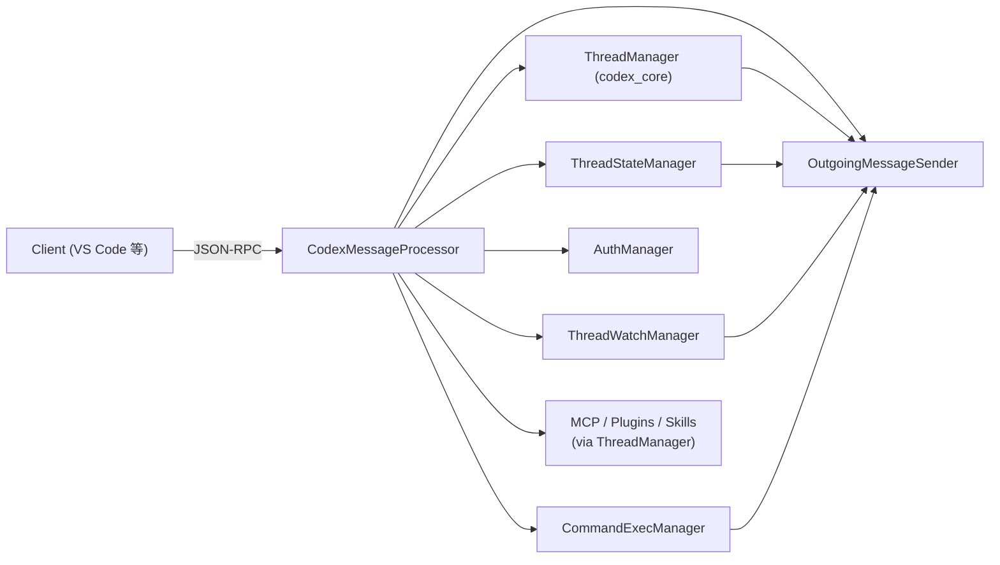
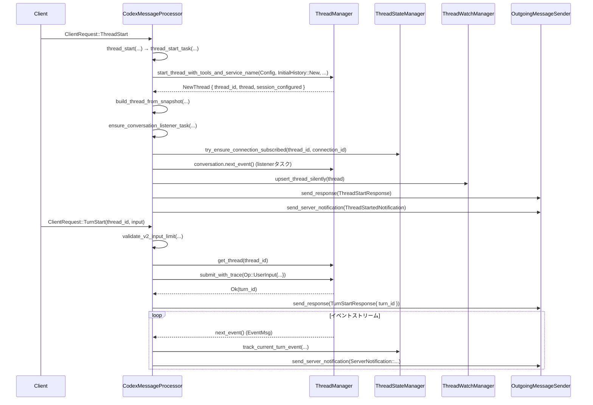

# app-server/src/codex_message_processor.rs コード解説

## 0. ざっくり一言

Codex のアプリサーバー側で JSON‑RPC メッセージを受信し、**スレッド/ターン・ログイン・プラグイン/MCP・コマンド実行・フィードバック等の機能に振り分けて処理する中核メッセージハンドラ**です。  
`ThreadManager` が管理するコアスレッドと、クライアントとの間の橋渡しを行います。

> ※ 元ファイルのチャンクには行番号が含まれていないため、本解説では  
> `codex_message_processor.rs:L開始-終了` 形式の正確な行番号は付与できません。  
> 代わりに「関数名・型名」を根拠として参照します。

---

## 1. このモジュールの役割

### 1.1 概要

このモジュールは、Codex アプリサーバーに届く JSON‑RPC の `ClientRequest` を受け取り、

- 認証（ログイン/ログアウト/トークン更新/アカウント情報）
- スレッドのライフサイクル（作成・再開・フォーク・アーカイブ・一覧・読み取り）
- ターンのライフサイクル（開始・ステア・中断・レビュー・リアルタイム会話）
- 外部コマンド実行（`command/exec`）
- プラグイン・MCP サーバー・スキル・アプリ一覧/操作
- フィードバック送信、Git diff 取得、ファジー検索、Windows sandbox セットアップ

といった機能に振り分け、コアライブラリ（`codex_core` など）を呼び出して結果を `OutgoingMessageSender` 経由でクライアントへ返すために存在します。

### 1.2 アーキテクチャ内での位置づけ

主要コンポーネント間の関係を概略で示します。



- クライアントからのすべての v2 リクエストは、最終的に `CodexMessageProcessor::process_request` に入り、そこで上記コンポーネントへ振り分けられます。
- スレッドごとのストリーミングイベントは `ensure_conversation_listener_task` によって監視され、`OutgoingMessageSender` を通じてクライアントへ送信されます。

### 1.3 設計上のポイント

コードから読み取れる設計上の特徴をまとめます。

- **責務の分割**
  - リクエスト種別ごとにメソッドを分割（`thread_start`, `thread_read`, `turn_start`, `login_v2`, `plugin_list` 等）。
  - スレッドの状態管理（ペンディングのロールバック・中断など）は `ThreadStateManager` に委譲。
  - スレッドのロード状況や実行中ターン数の監視は `ThreadWatchManager` に委譲。
  - 外部コマンド実行は `CommandExecManager` に委譲。
  - MCP/プラグイン/スキル関連は `ThreadManager` 配下のマネージャに委譲。

- **状態の扱い**
  - プロセス全体で共有される設定・オーバーライド・クラウド要件・ログイン状態などは `Arc<RwLock<...>>` や `Arc<Mutex<...>>` で保持。
  - 各スレッドごとの一時的状態（アクティブなターン、ペンディングのロールバック/中断など）は `ThreadStateManager` が内部で保持。
  - ログイン試行状態（ブラウザ/デバイスコード）は `ActiveLogin` として一元管理。

- **非同期/並行性**
  - すべての I/O は `async` / `await` で行い、長時間かかる処理は `tokio::spawn` や `spawn_blocking` で別タスク化 (`apps_list_task`, MCP ステータス取得, フィードバックアップロードなど)。
  - スレッドごとのイベントループ（`ensure_listener_task_running_task`）は `tokio::select!` で
    - コアからのイベント (`conversation.next_event`)
    - リスナーコマンド (`listener_command_rx`)
    - キャンセル通知 (`cancel_rx`)
    を監視する長寿命タスクとして実行。

- **エラーハンドリング**
  - アプリサーバープロトコルの `JSONRPCErrorError` を使用し、  
    `INVALID_REQUEST_ERROR_CODE` / `INVALID_PARAMS_ERROR_CODE` / `INTERNAL_ERROR_CODE` などを明確に使い分け。
  - 一部のエラーでは `data` フィールドに構造化情報を付与（例: 入力文字数超過、cloud requirements 読み込み失敗時のコードとアクション）。
  - コア層からの `CodexErr` や MCP/マーケットプレイス固有エラーをプロトコル用のエラーにマッピング。

- **安全性 / セキュリティ**
  - スレッドのアーカイブ/アンアーカイブ時、ロールアウトファイルのパスは `canonicalize` とディレクトリ検証でセッションディレクトリ配下か確認。
  - ファイル名とスレッド ID の一致、拡張子 `.jsonl` をチェックして誤ったファイル移動を防止。
  - `command/exec` はサンドボックスポリシー・ネットワークプロキシ・出力上限・タイムアウト等を明示的に設定。
  - いくつかの API（例: `GetConversationSummaryParams::RolloutPath` や `ThreadResumeParams.path`）ではクライアントがローカルファイルパスを直接指定できる仕様になっており、  
    ローカル CLI 用途である前提ですが「任意のファイル読み取りが走りうる」ことは前提条件として理解しておく必要があります。

---

## 2. 主要な機能一覧

このモジュールが提供する主な機能を列挙します。

- **JSON‑RPC リクエストディスパッチ**
  - `process_request`: すべての `ClientRequest` を対応するメソッドへ振り分け。
- **スレッドライフサイクル管理**
  - `thread_start`, `thread_resume`, `thread_fork`, `thread_archive`, `thread_unarchive`, `thread_rollback`, `thread_background_terminals_clean`, `thread_compact_start` など。
- **スレッド一覧/読み取り**
  - `thread_list`, `thread_loaded_list`, `thread_read`, `get_thread_summary`。
- **ターンライフサイクル管理**
  - `turn_start`, `turn_steer`, `turn_interrupt`, `review_start`。
- **リアルタイム会話機能**
  - `thread_realtime_start`, `thread_realtime_append_audio`, `thread_realtime_append_text`, `thread_realtime_stop`, `thread_realtime_list_voices`。
- **認証/アカウント管理**
  - `login_v2`（API key / ChatGPT / device code / auth tokens）、`logout_v2`, `cancel_login_v2`, `get_auth_status`, `get_account`, `get_account_rate_limits`。
- **外部コマンド実行**
  - `exec_one_off_command`, `command_exec_write`, `command_exec_resize`, `command_exec_terminate`。
- **MCP サーバー / プラグイン / スキル / アプリ**
  - MCP: `mcp_server_refresh`, `mcp_server_oauth_login`, `list_mcp_server_status`, `read_mcp_resource`, `call_mcp_server_tool`。
  - プラグイン: `plugin_list`, `plugin_read`, `plugin_install`, `plugin_uninstall`。
  - スキル: `skills_list`, `skills_config_write`。
  - アプリ: `apps_list` + `apps_list_task`。
- **モデル/コラボレーションモード/実験機能**
  - `list_models`, `list_collaboration_modes`, `experimental_feature_list`, `mock_experimental_method`。
- **ファイル/Git 関連**
  - `git_diff_to_origin`, ファジーファイル検索 (`fuzzy_file_search` + セッション版)。
- **フィードバック送信**
  - `upload_feedback`。
- **Windows サンドボックスセットアップ**
  - `windows_sandbox_setup_start`。
- **スレッドイベントリスナ管理**
  - `ensure_conversation_listener` / `ensure_listener_task_running_task` と、補助関数群 (`handle_thread_listener_command`, `handle_pending_thread_resume_request` 等)。

---

## 3. 公開 API と詳細解説

### 3.1 型一覧（構造体・列挙体など）

このファイルで公開（`pub(crate)`）されている、またはモジュール内で中心的に使われる主な型です。

| 名前 | 種別 | 役割 / 用途 |
|------|------|------------|
| `CodexMessageProcessor` | 構造体 | JSON‑RPC `ClientRequest` を受け取り、各種処理へ振り分ける中核コンポーネント。スレッド/ターン/認証/プラグイン等のエントリポイント。 |
| `CodexMessageProcessorArgs` | 構造体 | `CodexMessageProcessor::new` への依存注入用引数（AuthManager, ThreadManager, OutgoingMessageSender, Config 等）。 |
| `ApiVersion` | enum | API バージョン（現在は主に `V2`）。イベントハンドリング等でバージョンごとの分岐に使用。 |
| `ListenerTaskContext` | 構造体 | スレッドイベントリスナタスクに渡す文脈（ThreadManager, ThreadStateManager, Outgoing, Analytics, WatchManager など）をまとめたもの。 |
| `EnsureConversationListenerResult` | enum | リスナをアタッチしようとした結果（`Attached` / `ConnectionClosed`）。 |
| `RefreshTokenRequestOutcome` | enum | トークンリフレッシュ要求の結果（試行せず/成功扱い、Transient 失敗、Permanent 失敗）。 |
| `ThreadListFilters` | 構造体 | `list_threads_common` 用のフィルタ（モデルプロバイダ・ソース種別・アーカイブ/非アーカイブ・cwd・検索語）。 |
| `ActiveLogin` | enum | 進行中のログイン状態（ブラウザログイン or デバイスコードログイン）を表現。`Drop` 時にキャンセルされる。 |
| `CancelLoginError` | enum | ログインキャンセル時のエラー種別（`NotFound` のみ）。 |
| `AppListLoadResult` | enum | アプリ一覧ロード結果の一時的な表現（アクセス可能なアプリ/全アプリ、成功 or 文字列エラー）。 |
| `ThreadShutdownResult` | enum | スレッドシャットダウン結果（完了/Submit 失敗/タイムアウト）。 |
| `ThreadTurnSource<'a>` | enum | スレッドターンの生成元（ロールアウトのパス or 既に読み込まれた履歴アイテム）を表現。 |
| `ThreadTurnSource` 以外の多数の free 関数 | 関数 | サマリ読み出し、タイトル解決、ターンマージ、コンフィグ派生、dynamic tools 検証などのユーティリティ。 |

### 3.2 関数詳細（代表 7 件）

#### 1. `CodexMessageProcessor::process_request(&self, connection_id, request, app_server_client_name, app_server_client_version, request_context)`

**概要**

クライアントからの単一の `ClientRequest` を受け取り、そのバリアントごとに適切なメソッドへディスパッチするメインエントリポイントです。  
スレッド/ターン API、プラグイン操作、認証、MCP、ファイル検索などほぼすべての機能の入り口となります。

**引数**

| 引数名 | 型 | 説明 |
|--------|----|------|
| `connection_id` | `ConnectionId` | このリクエストを送ってきたクライアント接続の識別子。返信や通知に利用。 |
| `request` | `ClientRequest` | プロトコル定義されたリクエスト列挙型。`ThreadStart`, `TurnStart`, `LoginAccount` 等のバリアントを持つ。 |
| `app_server_client_name` | `Option<String>` | クライアント名（VS Code 拡張名など）。一部でスレッドにメタ情報として保存。 |
| `app_server_client_version` | `Option<String>` | クライアントバージョン。 |
| `request_context` | `RequestContext` | トレースコンテキストや `tracing` の span を含む、リクエスト単位の文脈情報。 |

**戻り値**

- `async fn` であり戻り値は `()`。結果は `OutgoingMessageSender` を通じてクライアントへ送信されます。

**内部処理の流れ**

1. ローカルクロージャ `to_connection_request_id` で `RequestId` と `ConnectionId` を組み合わせた `ConnectionRequestId` を生成。
2. `match request` により `ClientRequest` の各バリアントに応じて対応するメソッドを呼び出す。
   - 例: `ClientRequest::ThreadStart` → `self.thread_start(...)`
   - `ModelList` や `CollaborationModeList` のように重いものは `tokio::spawn` で別タスクに移譲。
3. ファイルシステム・コンフィグ系のリクエストがここに届いた場合は、想定外として `warn!` ログを出すのみ（処理はしない）。
4. 明示的にエラーを返す必要がある場合は、各サブメソッドの中で `send_response` / `send_error` を呼ぶ。

**Errors / Panics**

- `ClientRequest::Initialize` が到達した場合は `panic!` します（初期化は別の `MessageProcessor` で扱う前提）。
- その他のエラーは各メソッド側で `JSONRPCErrorError` として `send_error` されます。

**使用上の注意点**

- `CodexMessageProcessor` を使う側（上位の WebSocket/HTTP サーバー）は、各接続ごとに到着した `ClientRequest` をそのまま渡せばよい設計です。
- リクエストごとの結果は `OutgoingMessageSender` 経由で非同期に送られるため、この関数自体の戻り値を待っても「レスポンス本体」は得られません。

---

#### 2. `thread_start` / `thread_start_task`

```rust
async fn thread_start(
    &self,
    request_id: ConnectionRequestId,
    params: ThreadStartParams,
    app_server_client_name: Option<String>,
    app_server_client_version: Option<String>,
    request_context: RequestContext,
)
```

**概要**

新しい v2 スレッド（会話）を開始する API の実装です。  
パラメータから `ConfigOverrides` を構成し、`ThreadManager::start_thread_with_tools_and_service_name` を呼び出して新しいコアスレッドを生成し、  
自動的にリスナをアタッチしてから `ThreadStartResponse` と `ThreadStartedNotification` をクライアントへ送信します。

内部では重い処理を `thread_start_task` という別の async 関数に切り出し、`TaskTracker` 経由でバックグラウンドタスクとして管理します。

**主な引数**

| 引数名 | 型 | 説明 |
|--------|----|------|
| `request_id` | `ConnectionRequestId` | レスポンスを紐づけるための ID。 |
| `params` | `ThreadStartParams` | モデル、プロバイダ、サービスティア、cwd、サンドボックス、指示文、dynamic tools 等を含む。 |
| `app_server_client_name` | `Option<String>` | クライアント名。 |
| `app_server_client_version` | `Option<String>` | クライアントバージョン。 |
| `request_context` | `RequestContext` | トレース用 span など。 |

**戻り値**

- どちらも `()`。結果はレスポンス/通知として送信。

**内部処理（簡略）**

1. `ThreadStartParams` から `build_thread_config_overrides` で `ConfigOverrides` を構築し、`ephemeral` フラグも設定。
2. `ListenerTaskContext`（ThreadManager などを内包）を作成。
3. `request_context` から W3C トレースコンテキストを取得。
4. `thread_start_task` を `self.background_tasks.spawn(...)` で起動。
5. `thread_start_task` 内では:
   1. `derive_config_from_params` で CLI オーバーライド・リクエストオーバーライド・typesafe オーバーライドをマージして `Config` を構築。
   2. 必要に応じてプロジェクトの trust level を `Trusted` に上げ、再度 Config を再構成。
   3. dynamic tools 用の仕様を検証 (`validate_dynamic_tools`) し、コア用 `CoreDynamicToolSpec` に変換。
   4. `ThreadManager::start_thread_with_tools_and_service_name` を呼び出して新スレッドを作成。
   5. `set_app_server_client_info` でスレッドにクライアント情報を記録。
   6. `config_snapshot` を取得し、`build_thread_from_snapshot` で API 用の `Thread` オブジェクトを構築。
   7. `ensure_conversation_listener_task` を呼んでリスナを自動アタッチ。
   8. `ThreadWatchManager` にスレッドを登録し、`resolve_thread_status` でステータスを決定。
   9. `ThreadStartResponse` を送信し、必要なら `AnalyticsEventsClient::track_response` で分析イベントを送信。
   10. `ThreadStartedNotification` をサーバ通知として送信。

**Examples（使用例）**

```rust
// すでに CodexMessageProcessor を持っている前提
let params = ThreadStartParams {
    model: Some("gpt-4.1".to_string()),
    model_provider: None,
    service_tier: None,
    cwd: None,
    approval_policy: None,
    approvals_reviewer: None,
    sandbox: None,
    config: None,
    service_name: None,
    base_instructions: None,
    developer_instructions: None,
    dynamic_tools: None,
    mock_experimental_field: None,
    experimental_raw_events: false,
    personality: None,
    ephemeral: false,
    session_start_source: None,
    persist_extended_history: false,
};
processor
    .thread_start(
        ConnectionRequestId { connection_id, request_id },
        params,
        Some("codex-vscode".to_string()),
        Some("1.2.3".to_string()),
        request_context,
    )
    .await;
```

**Errors / Panics**

- Config 構築 (`derive_config_from_params`) 失敗時や dynamic tools 検証失敗時には `JSONRPCErrorError` を返し、レスポンスとして `ThreadStart` エラーを送信。
- スレッド作成 (`start_thread_with_tools_and_service_name`) 失敗は `INTERNAL_ERROR_CODE` として返却。

**Edge cases**

- `dynamic_tools` が空 or `None` の場合は tools なしでスレッド開始。
- `sandbox_mode` により trust level の自動昇格処理が走るケースがある（Windows など環境依存）。
- `session_start_source` が `Clear` の場合、新規履歴ではなく「クリア済み」の状態で開始。

**使用上の注意点**

- `thread_start` 自体は短時間で戻り、実際の重い処理はバックグラウンドタスクで行われます。
- スレッド生成直後に `turn_start` を送ることは可能ですが、リスナがアタッチされていないとイベントが届かないため、本モジュール内で自動アタッチされている点が重要です。

---

#### 3. `turn_start(&self, request_id, params, app_server_client_name, app_server_client_version)`

**概要**

既存スレッド上で新しいターン（ユーザー入力）を開始する API です。  
入力文字数制限をチェックし、必要に応じてターンコンテキスト（モデル・cwd・サンドボックス等）を上書きした上で、`Op::UserInput` をコアスレッドに送信します。

**主な引数**

| 引数名 | 型 | 説明 |
|--------|----|------|
| `request_id` | `ConnectionRequestId` | JSON‑RPC レスポンスに紐づく ID。 |
| `params` | `TurnStartParams` | `thread_id`, `input`（`Vec<V2UserInput>`）, 各種 override, 出力スキーマなど。 |
| `app_server_client_name` | `Option<String>` | クライアント名。 |
| `app_server_client_version` | `Option<String>` | クライアントバージョン。 |

**戻り値**

- 成功時は `TurnStartResponse`（`Turn { id, status: InProgress, items: [] ... }`）を送信。

**内部処理**

1. `validate_v2_input_limit` で `params.input` に含まれるテキストの総文字数を計算し、`MAX_USER_INPUT_TEXT_CHARS` を超えた場合はエラー（`INVALID_PARAMS_ERROR_CODE`）。
2. `load_thread(params.thread_id)` でコアスレッドを取得。見つからなければ `INVALID_REQUEST_ERROR_CODE`。
3. `set_app_server_client_info` によりスレッドにクライアント情報を記録。
4. `CollaborationModesConfig` を構成し、`params.collaboration_mode` があれば `normalize_turn_start_collaboration_mode` でプリセットから developer instructions を補完。
5. `params.input` を `CoreInputItem` にマッピング。
6. CWD やモデル等に override が含まれている場合、`Op::OverrideTurnContext` を送信してターンコンテキストを更新。
7. `Op::UserInput` を `submit_core_op` で送信し、その戻り値（サブミッション ID）を `turn_id` として受け取る。
8. `OutgoingMessageSender::record_request_turn_id` で request_id ↔ turn_id を紐付け。
9. `TurnStartResponse` を送信。

**Errors**

- 入力文字数超過 → `input_error_code` を含むエラー (`input_too_large_error`)。
- スレッド未存在 → `INVALID_REQUEST_ERROR_CODE`。
- コアへの `Op::UserInput` 送信失敗 → `INTERNAL_ERROR_CODE`。

**Edge cases**

- `input` が空ベクタでも `validate_v2_input_limit` は通りますが、意味のあるターンではないためクライアント側で防ぐべきです。
- override で指定した sandbox / model 等が `OverrideTurnContext` 送信時に無視される可能性（コア側のバリデーション）がありますが、ここではエラーにしません。

**使用上の注意点**

- 大きな入力を扱う場合、`MAX_USER_INPUT_TEXT_CHARS` 以内に分割して複数ターンに分ける必要があります。
- `TurnStartResponse` の `Turn` 内の `items` は空であり、実際のモデル応答はイベントストリーム側で届きます。

---

#### 4. `thread_read(&self, request_id, params: ThreadReadParams)`

**概要**

指定したスレッド ID のメタデータと、必要に応じてターン履歴（rollout）を読み出して返す API です。  
SQLite の state DB → ロールアウトファイル → ロード済みスレッドの順に情報源を切り替えます。

**主な引数**

| 引数名 | 型 | 説明 |
|--------|----|------|
| `request_id` | `ConnectionRequestId` | レスポンス送信用 ID。 |
| `params` | `ThreadReadParams` | `thread_id` と `include_turns: bool`。 |

**戻り値**

- 成功時: `ThreadReadResponse { thread }`  
  `thread.turns` は `include_turns` が `true` の場合のみ埋められます。

**内部処理**

1. `ThreadId::from_string` で ID をパース。失敗時は `invalid thread id` エラー。
2. ロード済みスレッド (`ThreadManager::get_thread`) と、その `state_db` ハンドルを取得（ある場合）。
3. state DB から `ConversationSummary` を試しに取得 (`read_summary_from_state_db_context_by_thread_id` or `read_summary_from_state_db_by_thread_id`)。
4. `rollout_path` を
   - state DB の summary から
   - あるいは `find_thread_path_by_id_str` から
   のどちらかで求める。
5. `include_turns` が `true` なのに rollout_path がない or 読み込めない場合はエラー（ephemeral スレッドでは `includeTurns` 不可）。
6. サマリがある場合は `summary_to_thread` で `Thread` を生成。なければロールアウトから `read_summary_from_rollout` を使って生成。
7. `forked_from_id` をロールアウトから補完 (`forked_from_id_from_rollout`)。
8. タイトルは state DB → レガシーインデックスの順に取得し、`set_thread_name_from_title` でスレッド名に反映。
9. `include_turns` が `true` の場合は `read_rollout_items_from_rollout` で全アイテムを読み、`build_turns_from_rollout_items` でターン配列を構築。
10. 実行中ターンがあるかどうかを `AgentStatus::Running` でチェックし、`set_thread_status_and_interrupt_stale_turns` でステータスとターンの中断処理を行う。
11. `ThreadReadResponse` を送信。

**Errors**

- スレッド ID パース失敗 / ロールアウト未作成なのに `includeTurns` 指定 → `INVALID_REQUEST_ERROR_CODE`。
- ロールアウト読み込み I/O エラー → `INTERNAL_ERROR_CODE`。

**Edge cases**

- ロールアウトが空またはヘッダのみの場合、`read_summary_from_rollout` はプレビューを空文字にして返します（テストで検証済み）。
- ephemeral スレッドは `include_turns` が禁止で、適切なエラーが返ります。

**使用上の注意点**

- クライアントが古いスレッドを読み取るとき、state DB とロールアウトの両方から情報を合成することを理解しておくと、タイトルや git 情報がどこから来ているか追いやすくなります。

---

#### 5. `thread_resume` / `resume_running_thread`

```rust
async fn thread_resume(&self, request_id: ConnectionRequestId, params: ThreadResumeParams)
```

**概要**

既存の会話履歴（スレッド ID or ロールアウトパス or 履歴アイテム）から、新しいスレッドを再開する処理です。  
すでに同じ ID のスレッドがロード済みであれば、そのスレッドを「再開」する特別なパス（`resume_running_thread`）を取り、  
そうでなければ `ThreadManager::resume_thread_with_history` を呼んで新しいスレッドプロセスとして再開します。

**主な引数**

| 引数名 | 型 | 説明 |
|--------|----|------|
| `params.thread_id` | `String` | 再開対象の論理スレッド ID。 |
| `params.history` | `Option<Vec<ResponseItem>>` | フォーク元履歴（あればこちらが優先）。 |
| `params.path` | `Option<PathBuf>` | 明示的に指定されたロールアウトパス。 |
| その他 | 各種 override | モデル/サービスティア/cwd/サンドボックス等のオーバーライド。 |

**戻り値**

- 成功時は `ThreadResumeResponse` を送信（新スレッドのメタデータと設定）。

**内部処理（要点）**

1. `pending_thread_unloads` に対象 thread_id が含まれていれば、「クローズ中のスレッド」としてエラー（再試行を促す）。
2. `resume_running_thread` を呼び出し、すでにロード済みスレッドがある場合の特別処理を試みる。
   - ロールアウトパスの整合性検証（指定された path と実際の path が一致するか）。
   - `collect_resume_override_mismatches` で、既存スナップショットとリクエストの override 差分をログに警告として残す（ただしエラーにはしない）。
   - リスナーを強制的に立ち上げ、`ThreadListenerCommand::SendThreadResumeResponse` をキューに投入。
   - ここで `true` を返した場合、この関数としてはすでに処理済み。
3. 履歴読み込み:
   - `params.history` があれば `resume_thread_from_history` → `InitialHistory::Forked` として詰める。
   - そうでなければ `resume_thread_from_rollout` でロールアウトから `InitialHistory` を読み出す。
4. `load_and_apply_persisted_resume_metadata` により state DB の `ThreadMetadata` を読み出し、モデルや reasoning effort の persisted 値を overrides にマージ（ただし明示的な override がある場合は優先）。
5. `derive_config_for_cwd` で履歴 CWD と overrides から Config を組み立て。
6. `ThreadManager::resume_thread_with_history` を呼び出し、新しい `NewThread` を作る。
7. `load_thread_from_resume_source_or_send_internal` でレスポンス用の `Thread` を構築し、ターン履歴を埋める。
8. `ThreadWatchManager` に登録し、ステータスを設定。
9. `ThreadResumeResponse` を送信、必要に応じて analytics を送信。

**Errors**

- `num_turns == 0` のロールバック要求など、一部の検証失敗で `INVALID_REQUEST_ERROR_CODE`。
- ロールアウト読み込みエラーやコア層のエラーは `INTERNAL_ERROR_CODE`。

**Edge cases**

- すでにスレッドが走っている状態で `history` を指定するとエラーになります（テストあり）。
- `model`, `model_provider`, `service_tier`, `cwd`, `approval_policy` 等の override が、実際のスナップショットと違う場合は**警告ログのみ**で黙って無視されるので、クライアント側で整合性を取る必要があります。

**使用上の注意点**

- `ThreadResumeParams` で path を指定する場合、現在のスレッドロールアウトパスと一致していないとエラーになります。
- セキュリティ上、`resume_thread_from_rollout` で明示的な `path` を渡すと、そのパスが `codex_home` 配下にあるかどうかを追加チェックしていないことに注意が必要です（CLI ローカル前提の設計）。

---

#### 6. `exec_one_off_command(&self, request_id, params: CommandExecParams)`

**概要**

単発の外部コマンド（シェル）をサンドボックス付きで実行する API です。  
TTY/タイムアウト/出力バイト上限/環境変数/ネットワークプロキシ/Windows sandbox など、多数のパラメータを検証・設定した上で  
`CommandExecManager::start` に実行要求を渡します。

**主な引数**

| 引数名 | 型 | 説明 |
|--------|----|------|
| `request_id` | `ConnectionRequestId` | レスポンス紐付け用。 |
| `params` | `CommandExecParams` | コマンド・cwd・環境変数・sandbox ポリシーなどを含む。 |

**内部処理（要点）**

1. `params.command` が空なら `INVALID_REQUEST_ERROR_CODE`。
2. `size` が Some で `tty == false` の場合、`INVALID_PARAMS_ERROR_CODE`（TTY でないのにサイズ指定があるのは不正）。
3. `disable_output_cap` と `output_bytes_cap` の併用禁止チェック。
4. `disable_timeout` と `timeout_ms` の併用禁止チェック。
5. `cwd` を `config.cwd` を基準としたパスに解決。
6. `create_env` でベースの環境変数マップを作成し、`env_overrides` を適用（`Some` で設定、`None` で削除）。
7. `timeout_ms` を `u64` に変換（負値などはエラー）。
8. ネットワークプロキシの起動:
   - `config.permissions.network` が Some であれば `start_proxy` を await。
   - 失敗すれば `INTERNAL_ERROR_CODE`。
9. `WindowsSandboxLevel::from_config` や `SandboxPermissions::UseDefault` により sandbox 設定を決定。
10. 出力上限とタイムアウトポリシーから `ExecExpiration` と `ExecCapturePolicy` を選択。
11. サンドボックスポリシー:
    - リクエスト側で `sandbox_policy` 指定があれば `can_set` で許可/不許可をチェックし、許可なら `file_system_sandbox_policy` / `network_sandbox_policy` を派生。
    - なければ Config の既定値を使用。
12. `codex_core::exec::build_exec_request` で OS レベル実行要求を組み立て。
13. `command_exec_manager.start(StartCommandExecParams { ... })` を await。
14. 失敗時にはエラーを `send_error`。

**Errors**

- パラメータ整合性エラー → `INVALID_PARAMS_ERROR_CODE`。
- ネットワークプロキシ起動や exec リクエスト構築失敗 → `INTERNAL_ERROR_CODE`。

**Edge cases**

- `disable_output_cap == true` の場合、`ExecCapturePolicy::FullBuffer` となり、大量出力でメモリ使用量が増える可能性があります。
- `disable_timeout == true` の場合、プロセスはキャンセルトークンによる明示キャンセルのみで終了します（長時間実行に注意）。

**使用上の注意点**

- 高頻度で呼び出すとシステムリソース（プロセス数・ファイルディスクリプタ）を圧迫します。  
  外部コマンドを多用する場合は `CommandExecManager` の設計と合わせて利用パターンを検討する必要があります。
- サンドボックスポリシーの変更をクライアント側から許可するかどうかは `config.permissions.sandbox_policy.can_set` で制御されるため、  
  運用ポリシーに応じて設定ファイル側で制限します。

---

#### 7. `ensure_conversation_listener` / `ensure_listener_task_running_task`

```rust
async fn ensure_conversation_listener(
    &self,
    conversation_id: ThreadId,
    connection_id: ConnectionId,
    raw_events_enabled: bool,
    api_version: ApiVersion,
) -> Result<EnsureConversationListenerResult, JSONRPCErrorError>
```

**概要**

指定スレッドに対する**イベントリスナ（会話ストリーム）を、接続に対してアタッチする**ための関数群です。  
内部でリスナタスク（`ensure_listener_task_running_task`）を起動し、コアスレッドからのイベントを受け取りつつ、  
`OutgoingMessageSender` を用いて各クライアントに対して適切なサーバ通知を送ります。

**主な引数**

| 引数名 | 型 | 説明 |
|--------|----|------|
| `conversation_id` | `ThreadId` | 対象スレッド ID。 |
| `connection_id` | `ConnectionId` | サブスクライブしたい接続 ID。 |
| `raw_events_enabled` | `bool` | `EventMsg::RawResponseItem` をそのまま送るかどうか。false の場合、一部はフックイベントに変換。 |
| `api_version` | `ApiVersion` | V2 等。フック処理の挙動に影響。 |

**戻り値**

- `Ok(EnsureConversationListenerResult::Attached)`:
  - サブスクリプションが成功し、リスナタスクが起動済み。
- `Ok(EnsureConversationListenerResult::ConnectionClosed)`:
  - connection が既にクローズされているため何も行わない。
- `Err(JSONRPCErrorError)`:
  - スレッド未存在などのエラー。

**内部処理（listener タスク側）**

1. `ThreadManager::get_thread` で会話ハンドルを取得。
2. `ThreadStateManager::try_ensure_connection_subscribed` で
   - 接続をこのスレッドにサブスクライブし
   - スレッド状態 (`ThreadState`) を取得（新規作成 or 既存共有）。
3. `ThreadState::set_listener` で
   - 古い listener があればキャンセル用 `cancel_tx` を発行し、世代番号を更新。
   - 新しい `listener_command_rx` と世代番号を返す。
4. `tokio::spawn` でリスナループを起動。`select!` で以下を待つ:
   - `cancel_rx`: リスナキャンセル通知。
   - `conversation.next_event()`: コアスレッドからのイベント。
   - `listener_command_rx.recv()`: リスナへの制御コマンド（再開レスポンス生成など）。
5. イベント受信時:
   - `ThreadState::track_current_turn_event` で現在のターン状態を更新。
   - サブスクライブしている connection ID の集合を `ThreadStateManager` から取得。
   - その集合を使って `ThreadScopedOutgoingMessageSender` を作成。
   - `EventMsg::RawResponseItem` かつ rawEvents 無効なら `maybe_emit_hook_prompt_item_completed` を呼び出してフックイベントのみにする。
   - それ以外のイベントは `apply_bespoke_event_handling` に委譲して、スレッド状態・ウォッチャ・Outgoing を更新/送信。
6. `listener_command_rx` 経由で来る `ThreadListenerCommand`（再開レスポンス・ServerRequestResolved）を `handle_thread_listener_command` で処理。
7. ループ終了後、世代番号が一致する場合のみ `ThreadState::clear_listener` でリスナ情報をクリア。

**使用上の注意点**

- リスナはスレッドごとに1つだけ動作するようになっており、スレッド再開や auto‑attach により入れ替わる設計です。
- `raw_events_enabled` を `true` にするとフック変換が行われず、より低レベルのイベントストリームがクライアントに届きます。  
  それに合わせてクライアント側もプロトコルの raw イベントを扱う必要があります。

---

### 3.3 その他の関数（グルーピング）

すべてを個別に列挙すると膨大になるため、役割ごとに主要関数をまとめます。

| グループ | 関数例 | 役割 |
|----------|--------|------|
| 認証・アカウント | `login_v2`, `login_api_key_common`, `login_chatgpt_v2`, `login_chatgpt_device_code_v2`, `login_chatgpt_auth_tokens`, `logout_v2`, `get_auth_status`, `get_account`, `get_account_rate_limits`, `refresh_token_if_requested` | OAuth / API key / ChatGPT トークンを用いたログインフローと、稼働中セッションのトークン更新・アカウント情報取得。 |
| スレッド管理 | `thread_archive`, `thread_unarchive`, `archive_thread_common`, `thread_list`, `thread_loaded_list`, `thread_set_name`, `thread_metadata_update`, `ensure_thread_metadata_row_exists` | スレッドのアーカイブ/復元、一覧取得、名前や Git メタデータの更新、state DB との整合性維持。 |
| ターン管理 | `thread_increment_elicitation`, `thread_decrement_elicitation`, `turn_steer`, `turn_interrupt`, `set_thread_status_and_interrupt_stale_turns`, `merge_turn_history_with_active_turn` | out-of-band エリシテーションカウンタ・ steer 入力・中断要求・ターン状態のマージ。 |
| ロールアウト/サマリ | `read_summary_from_rollout`, `read_rollout_items_from_rollout`, `summary_to_thread`, `read_history_cwd_from_state_db`, `load_thread_summary_for_rollout` | ロールアウト（JSONL）や state DB から会話サマリ/ターン履歴を読み出して `Thread` 型へ変換。 |
| プラグイン/MCP/スキル | `plugin_list`, `plugin_read`, `plugin_install`, `plugin_uninstall`, `skills_list`, `skills_config_write`, `mcp_server_refresh`, `mcp_server_oauth_login`, `list_mcp_server_status`, `read_mcp_resource`, `call_mcp_server_tool` | マーケットプレイスや MCP サーバー設定の読み書き、OAuth ログイン、スキルの有効/無効化。 |
| アプリ/モデル/実験機能 | `apps_list` / `apps_list_task`, `list_models`, `list_collaboration_modes`, `experimental_feature_list`, `mock_experimental_method` | アプリ一覧（MCP tools ベース）、利用可能モデル一覧、コラボレーションモード・実験機能フラグの列挙。 |
| フィードバック | `upload_feedback`, `resolve_rollout_path` | 会話ログや追加ログファイルを添付して CodexFeedback へアップロード。 |
| ファイル検索/Git | `fuzzy_file_search`, `fuzzy_file_search_session_*`, `git_diff_to_origin` | ファジーファイル検索（単発/セッション）と Git diff の取得。 |
| Windows sandbox | `windows_sandbox_setup_start` | Windows サンドボックスのセットアップコマンドを走らせ、完了通知を送信。 |
| Config 生成 | `derive_config_from_params`, `derive_config_for_cwd`, `config_load_error`, `replace_cloud_requirements_loader`, `sync_default_client_residency_requirement` | CLI/リクエスト/typesafe オーバーライドを統合して Config を構築し、クラウド要件や residency requirement を同期。 |

---

## 4. データフロー

### 4.1 代表シナリオ: スレッド開始 → ターン開始 → ストリーミングイベント

新しい会話を開始し、ユーザーがメッセージを送ってモデルの応答を受け取るまでのデータの流れを示します。



要点:

- `ThreadStart` 処理中にリスナタスクが起動し、完了後も会話イベントを受け取り続けます。
- `TurnStart` は入力を送信するだけで、応答はイベントストリームを通じて送信されます。
- `ThreadStateManager` は「どの connection がどの thread を購読しているか」を管理し、`ThreadScopedOutgoingMessageSender` が通知の配信先を制限します。

---

## 5. 使い方（How to Use）

### 5.1 基本的な使用方法

サーバー側で `CodexMessageProcessor` を組み立て、WebSocket/JSON‑RPC ループから呼び出す想定の簡略例です。

```rust
use std::sync::Arc;
use codex_app_server_protocol::{ClientRequest, RequestId};
use crate::outgoing_message::{OutgoingMessageSender, ConnectionId, RequestContext};
use crate::codex_message_processor::{CodexMessageProcessor, CodexMessageProcessorArgs};

async fn run_server_loop(...) {
    // 依存コンポーネントを構築（詳細は省略）
    let auth_manager = Arc::new(AuthManager::new(...));
    let thread_manager = Arc::new(ThreadManager::new(...));
    let outgoing = Arc::new(OutgoingMessageSender::new(...));
    let analytics = AnalyticsEventsClient::new(...);
    let config = Arc::new(Config::load(...)?);

    let processor = CodexMessageProcessor::new(CodexMessageProcessorArgs {
        auth_manager,
        thread_manager,
        outgoing: outgoing.clone(),
        analytics_events_client: analytics,
        arg0_paths: Arg0DispatchPaths { /* ... */ },
        config,
        cli_overrides: Arc::new(RwLock::new(Vec::new())),
        runtime_feature_enablement: Arc::new(RwLock::new(BTreeMap::new())),
        cloud_requirements: Arc::new(RwLock::new(CloudRequirementsLoader::default())),
        feedback: CodexFeedback::new(...),
        log_db: None,
    });

    // WebSocket 等からの JSON-RPC メッセージループ
    loop {
        let (connection_id, client_request, ctx) = recv_client_request().await?;
        let app_name = Some("codex-vscode".to_string());
        let app_version = Some("1.0.0".to_string());

        processor
            .process_request(
                ConnectionId(connection_id),
                client_request,
                app_name.clone(),
                app_version.clone(),
                ctx,
            )
            .await;
    }
}
```

### 5.2 よくある使用パターン

1. **スレッドを新規作成してからメッセージを送る**

   - `ClientRequest::ThreadStart` を送り、レスポンスの `thread.id` を保持。
   - 続けて `ClientRequest::TurnStart` に同じ `thread_id` とユーザー入力を渡す。
   - レスポンスの `TurnStartResponse.turn.id` を保持し、以後のステア/中断に利用。

2. **既存会話を再開する**

   - 過去のスレッド ID が分かっている場合は `ClientRequest::ThreadResume` に ID を指定。
   - ロールアウトファイルパスや履歴アイテムを直接指定する advanced モードもあり。

3. **外部コマンドを一時的に実行する**

   - `ClientRequest::OneOffCommandExec` でコマンド/タイムアウト/サンドボックスを指定。
   - 出力はコマンド実行イベントストリームを通じて受け取る（`CommandExecManager` 側の仕様による）。

### 5.3 よくある間違い

```rust
// 間違い例 1: 存在しない thread_id で TurnStart を呼ぶ
let params = TurnStartParams {
    thread_id: "non-existent".to_string(),
    input: vec![ /* ... */ ],
    ..Default::default()
};
// -> load_thread() で INVALID_REQUEST_ERROR_CODE エラーになる

// 正しい例: まず ThreadStart で thread.id を取得してから使う
let thread_start_resp = /* ThreadStart を送信して受け取る */;
let thread_id = thread_start_resp.thread.id.clone();

let params = TurnStartParams {
    thread_id,
    input: vec![ /* ... */ ],
    ..Default::default()
};
```

```rust
// 間違い例 2: 大量のテキストを 1 回の TurnStart で送る
let very_long = "a".repeat(MAX_USER_INPUT_TEXT_CHARS * 2);
let params = TurnStartParams { /* input に very_long を詰める */ };
// -> validate_v2_input_limit() により INVALID_PARAMS_ERROR_CODE + input_error_code

// 正しい例: 複数のターンに分割する、あるいは MAX_USER_INPUT_TEXT_CHARS 以内に切り詰める
```

### 5.4 使用上の共通注意点

- **非同期/並行性**
  - すべてのメソッドは `&self` を取り内部で `Arc` やロックを使用しているため、同一 `CodexMessageProcessor` を複数タスクから安全に共有できます。
  - ただし、外部から `cli_overrides` や `runtime_feature_enablement` を直接書き換える場合は `RwLock` のロック粒度に注意。

- **エラーコード契約**
  - 入力値が不正 → ほぼ `INVALID_REQUEST_ERROR_CODE` / `INVALID_PARAMS_ERROR_CODE`。
  - 内部 I/O やコア層の予期しない失敗 → `INTERNAL_ERROR_CODE`。
  - クライアント側はこれらをもとにリトライ/ユーザーへのメッセージ表示方針を決める必要があります。

- **ファイルパス / セキュリティ**
  - `thread_archive` / `thread_unarchive` ではセッション/アーカイブディレクトリ配下にあることを厳密に検証しており、  
    意図しないパス移動を防いでいます。
  - `GetConversationSummaryParams::RolloutPath` や `ThreadResumeParams.path` など一部の API では、クライアントが任意のパス（特に絶対パス）を指定でき、  
    そのままファイル読み取りが行われます。このサーバーが「ローカルユーザー自身の CLI/エディタからのみアクセスされる」前提かどうかを確認して運用する必要があります。

---

## 6. 変更の仕方（How to Modify）

### 6.1 新しい ClientRequest を追加する場合

1. **プロトコル定義の更新**
   - `codex_app_server_protocol::ClientRequest` に新しいバリアントとパラメータ型を追加。

2. **ディスパッチの追加**
   - 本ファイル内 `process_request` の `match request` に新バリアントを追加し、新しいメソッド（例: `self.my_new_feature(...)`) を呼び出す。

3. **処理メソッドの実装**
   - `impl CodexMessageProcessor` ブロック内に `async fn my_new_feature(&self, request_id: ConnectionRequestId, params: MyParams)` を追加。
   - 必要なら `ThreadManager`, `AuthManager`, `OutgoingMessageSender` 等を利用。
   - 失敗時は `send_invalid_request_error` / `send_internal_error` / 独自 `JSONRPCErrorError` を使う。

4. **イベントループ/リスナが必要な場合**
   - 会話イベントとして流したい場合は `apply_bespoke_event_handling` にも対応を追加し、`EventMsg` を適切な `ServerNotification` に変換。

5. **テストの追加**
   - 既存のテストスタイル（assert_eq, pretty_assertions）に倣って、新バリアントの挙動やエラーパスを検証するテストを追加。

### 6.2 既存機能を変更する場合の注意点

- **スレッド/ターン関連**
  - `thread_read`, `thread_resume`, `thread_fork` などは **state DB / ロールアウト / ロード済みスレッド** の3種類の情報源を組み合わせているため、  
    どこに手を入れるとどのケースに影響するかを事前に整理する必要があります。
- **エラー契約**
  - クライアントはエラーコードに依存している可能性が高いため、`INVALID_REQUEST_ERROR_CODE` と `INTERNAL_ERROR_CODE` の切り替えを変更する場合は慎重に検討します。
- **ログイン/クラウド要件**
  - 認証フローを変える場合、`replace_cloud_requirements_loader` や `sync_default_client_residency_requirement` との連携を確認します（ログイン後にクラウド要件が差し替わる前提）。
- **リスナタスク**
  - `ensure_listener_task_running_task` の `select!` に新たなケースを追加する場合は、「キャンセルと世代管理」が正しく動作するかを確認します（古い listener を止める必要がある）。

---

## 7. 関連ファイル

| パス | 役割 / 関係 |
|------|-------------|
| `app-server/src/outgoing_message.rs` | `OutgoingMessageSender`, `ThreadScopedOutgoingMessageSender`, `ConnectionId` などを定義。レスポンス/通知の送信と、ペンディングリクエスト管理を担当。 |
| `app-server/src/thread_state.rs` | `ThreadStateManager`, `ThreadState`, `ThreadListenerCommand`, `PendingThreadResumeRequest` など。スレッドごとの接続サブスクリプション状態と、リスナとの間の制御メッセージを管理。 |
| `app-server/src/bespoke_event_handling.rs` | `apply_bespoke_event_handling`, `maybe_emit_hook_prompt_item_completed` を提供。`EventMsg` を App Server プロトコルの通知に変換するロジック。 |
| `app-server/src/command_exec.rs` | `CommandExecManager`, `StartCommandExecParams`, `terminal_size_from_protocol` 等。外部コマンドの起動・入出力処理を担当。 |
| `app-server/src/apps_list_helpers.rs` | `apps_list_task` から利用されるヘルパー。アプリ一覧マージ・通知判定・ページネーションなど。 |
| `app-server/src/plugin_app_helpers.rs` | プラグイン定義からアプリ情報を読み出し、App Server プロトコル用構造体に変換するヘルパー。 |
| `app-server/src/plugin_mcp_oauth.rs` | プラグイン由来 MCP サーバーと OAuth ログインフローを橋渡しする補助モジュール（詳細はこのチャンクからは不明）。 |
| `codex_core::*`（別クレート） | スレッド (`CodexThread`), `ThreadManager`, Config 関連, ロールアウト (`RolloutRecorder`), Windows sandbox, skills, plugins 等のコアロジック。 |
| `codex_state::StateRuntime` / `codex_rollout::state_db` | SQLite ベースの state DB とのやり取りと、ロールアウトからメタデータをリコンシルするロジック。 |

---

### テストについての補足

ファイル末尾の `#[cfg(test)] mod tests` では、次のような観点がカバーされています。

- dynamic tools の input schema 検証ロジック（受理/拒否パターン）。
- cloud requirements 読み込み失敗時の `config_load_error` の `data` フィールド構造。
- `collect_resume_override_mismatches` のメッセージ内容。
- `merge_persisted_resume_metadata` が model / reasoning_effort の override 優先順位を正しく扱うか。
- `extract_conversation_summary` / `read_summary_from_rollout` が preview や agent_nickname / forked_from_id を適切に抽出するか。
- `OutgoingMessageSender` と `ThreadStateManager` を組み合わせた、ペンディングリクエストの中断・削除挙動。
- `ThreadStateManager` の接続/スレッド状態管理（接続クローズ時にリスナキャンセル & 状態クリアされるか）。

これらのテストから、仕様として意図されている挙動（特に**resume 時の override マージ**や**プレビュー/タイトルの扱い**、**リスナとペンディングリクエストのクリーンアップ**）を読み取ることができます。
