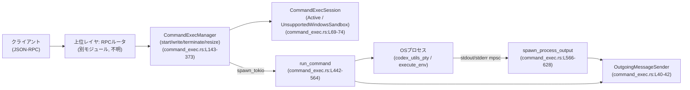
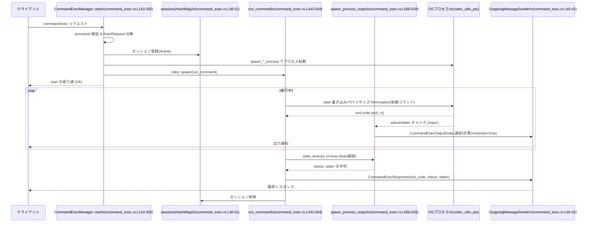
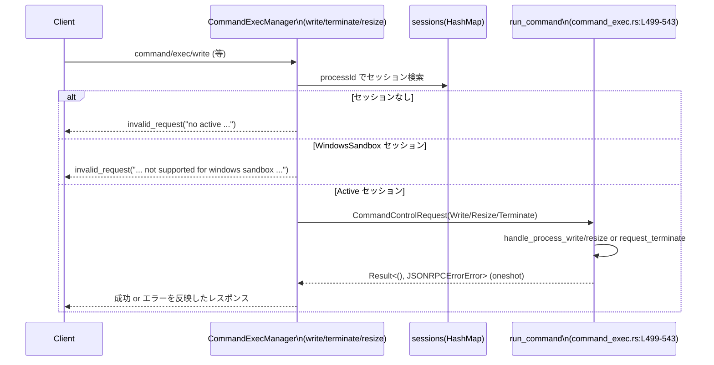

# app-server/src/command_exec.rs コード解説

## 0. ざっくり一言

このモジュールは、クライアントからの `command/exec` 系リクエストに対応して OS プロセスを起動し、  
標準入出力のストリーミング・タイムアウト・終了処理を管理する「コマンド実行マネージャ」です（`CommandExecManager`、`command_exec.rs:L47-51`）。

---

## 1. このモジュールの役割

### 1.1 概要

- このモジュールは、**接続単位・プロセスID単位のコマンド実行セッション管理**を行います（`CommandExecManager.sessions`、`command_exec.rs:L48-51`）。
- クライアントからの以下の JSON-RPC 相当の操作を処理します（いずれも外側でマッピングされていると推測されます）:
  - コマンド開始: `command/exec` → `CommandExecManager::start`（`command_exec.rs:L143-305`）
  - 標準入力書き込み: `command/exec/write` → `CommandExecManager::write`（`command_exec.rs:L308-340`）
  - 終了要求: `command/exec/terminate` → `CommandExecManager::terminate`（`command_exec.rs:L342-354`）
  - 端末サイズ変更: `command/exec/resize` → `CommandExecManager::resize`（`command_exec.rs:L356-373`）
- プロセスからの標準出力・標準エラーをストリーミングまたはバッファリングし、  
  `OutgoingMessageSender` を通じてレスポンスや通知としてクライアントに返します（`command_exec.rs:L478-497`, `L554-562`）。

### 1.2 アーキテクチャ内での位置づけ

主なコンポーネントと依存関係は次の通りです。

- フロント側:
  - `OutgoingMessageSender`: JSON-RPC レスポンス・通知の送信（`command_exec.rs:L40-42`, `L148-149`, `L478-487`）
  - `ConnectionId` / `ConnectionRequestId`: 接続とリクエストの識別子（`command_exec.rs:L40-41`）
- 実行制御:
  - `CommandExecManager`: セッション管理、API エントリポイント（`command_exec.rs:L47-51`, `L143-373`）
  - `CommandExecSession`: セッション状態（Active / UnsupportedWindowsSandbox）（`command_exec.rs:L69-74`）
  - `CommandControlRequest` + `mpsc::Sender/Receiver`: プロセス制御（write/resize/terminate）のチャネル（`command_exec.rs:L76-85`, `L243-244`, `L404-439`）
- プロセス実行:
  - `ExecRequest` / `SandboxType`: 実行内容とサンドボックス種別（`command_exec.rs:L25`, `L27`, `L231-239`）
  - `codex_utils_pty::spawn_*`: 実 OS プロセスの起動（`command_exec.rs:L266-281`）
  - `SpawnedProcess` / `ProcessHandle`: プロセスハンドルと I/O チャネル（`command_exec.rs:L29-30`, `L468-473`）
- 出力処理:
  - `spawn_process_output`: stdout/stderr の読み出しと通知（`command_exec.rs:L566-628`）
  - `bytes_to_string_smart`: バイト列から文字列への変換（`command_exec.rs:L26`, `L626`）

これを図示すると次のようになります。



### 1.3 設計上のポイント

- **セッションの一意性とスコープ**
  - セッションキーは `(ConnectionId, InternalProcessId)` の組み合わせです（`ConnectionProcessId`、`command_exec.rs:L63-66`）。
  - `InternalProcessId` はクライアント指定文字列か、サーバ生成整数のいずれかです（`command_exec.rs:L123-127`, `L164-172`）。
  - 同じキーで複数のアクティブセッションが存在しないように、開始時に重複チェックを行っています（`command_exec.rs:L191-195`, `L255-259`）。

- **状態管理**
  - `CommandExecSession` は `Active`（制御可能）と `UnsupportedWindowsSandbox`（Windows サンドボックス用の予約状態）の 2 種類です（`command_exec.rs:L69-74`）。
  - Windows サンドボックスの非ストリーミング実行では、書き込み・リサイズ・終了 API をエラーにするために `UnsupportedWindowsSandbox` を使っています（`command_exec.rs:L189-201`, `L422-425`）。

- **並行性**
  - セッションテーブルは `Arc<Mutex<HashMap<...>>>` で共有され、`async` コンテキストから安全にアクセスされます（`command_exec.rs:L48-51`）。
  - 各プロセスの制御コマンド（write/resize/terminate）は `mpsc::channel` を介して `run_command` タスクへ伝達されます（`command_exec.rs:L243-244`, `L404-439`, `L499-543`）。
  - プロセス終了後も一定時間 I/O の「排水(drain)」を待つために `watch::channel<bool>` とタイマーを用いています（`command_exec.rs:L476-477`, `L545-548`）。

- **エラーハンドリング**
  - クライアント向けのエラーは `JSONRPCErrorError` で表現し、`invalid_request` / `invalid_params` / `internal_error` の 3 種のヘルパーでコードを付与しています（`command_exec.rs:L684-706`）。
  - プロセスが既に終了している場合などは、`command_no_longer_running_error` で明確なメッセージを返します（`command_exec.rs:L677-682`, `L435-438`）。

- **タイムアウトと終了コード**
  - 実行期限は `ExecExpiration` で指定され、タイムアウト時には `EXEC_TIMEOUT_EXIT_CODE(124)` を exit code として返します（`command_exec.rs:L22-24`, `L44-45`, `L457-465`, `L531-538`）。

---

## 2. 主要な機能一覧（コンポーネントインベントリー）

### 2.1 型（構造体・列挙体・トレイト）

| 名前 | 種別 | 役割 / 用途 | 定義位置 |
|------|------|-------------|----------|
| `CommandExecManager` | 構造体 | コマンド実行セッションの管理者。開始・書き込み・終了・リサイズ API を提供。 | `command_exec.rs:L47-51` |
| `ConnectionProcessId` | 構造体 | `(ConnectionId, InternalProcessId)` のペア。セッションのキー。 | `command_exec.rs:L63-66` |
| `CommandExecSession` | enum | セッション状態 (`Active` / `UnsupportedWindowsSandbox`)。 | `command_exec.rs:L69-74` |
| `CommandControl` | enum | 実行中プロセスへの制御命令 (`Write`/`Resize`/`Terminate`)。 | `command_exec.rs:L76-80` |
| `CommandControlRequest` | 構造体 | 制御命令と、完了結果を返すための `oneshot` 送信口。 | `command_exec.rs:L82-85` |
| `StartCommandExecParams` | 構造体 | `start` API の入力パラメータ束。 | `command_exec.rs:L87-98` |
| `RunCommandParams` | 構造体 | `run_command` 内部タスクのパラメータ束。 | `command_exec.rs:L100-110` |
| `SpawnProcessOutputParams` | 構造体 | `spawn_process_output` に渡す stdout/stderr 処理パラメータ。 | `command_exec.rs:L112-121` |
| `InternalProcessId` | enum | プロセスIDの内部表現（生成済み整数 or クライアント文字列）。 | `command_exec.rs:L123-127` |
| `InternalProcessIdExt` | トレイト | `InternalProcessId` をエラーメッセージ用の文字列に変換。 | `command_exec.rs:L129-131`, `L133-140` |

### 2.2 関数・メソッド一覧（要約）

| 名前 | 種別 | 概要 | 定義位置 |
|------|------|------|----------|
| `CommandExecManager::start` | メソッド | コマンドを起動し、必要に応じてストリーミングセッションを開始。 | `command_exec.rs:L143-305` |
| `CommandExecManager::write` | メソッド | Base64 デコードされた標準入力データを実行中プロセスに送信。 | `command_exec.rs:L308-340` |
| `CommandExecManager::terminate` | メソッド | プロセスに終了要求を送る。 | `command_exec.rs:L342-354` |
| `CommandExecManager::resize` | メソッド | TTY サイズ変更要求を送る。 | `command_exec.rs:L356-373` |
| `CommandExecManager::connection_closed` | メソッド | 接続切断時に関連するすべてのプロセスを終了方向へ誘導。 | `command_exec.rs:L375-402` |
| `CommandExecManager::send_control` | 非公開メソッド | セッションに対して制御コマンドを送り、結果を待つ。 | `command_exec.rs:L404-439` |
| `run_command` | 非公開関数 | 1 プロセスのライフサイクル制御（制御コマンド・タイムアウト・exit 取得）。 | `command_exec.rs:L442-564` |
| `spawn_process_output` | 非公開関数 | stdout/stderr を読み、ストリーミング通知 or バッファリングして文字列化。 | `command_exec.rs:L566-628` |
| `handle_process_write` | 非公開関数 | stdin ストリーム設定を確認し、データ送信と close 処理を行う。 | `command_exec.rs:L630-652` |
| `handle_process_resize` | 非公開関数 | PTY サイズ変更を行う。 | `command_exec.rs:L654-661` |
| `terminal_size_from_protocol` | 公開（crate 内）関数 | プロトコル型のターミナルサイズを検証・変換。 | `command_exec.rs:L663-675` |
| `command_no_longer_running_error` | 非公開関数 | 「コマンドは既に実行されていない」エラーメッセージ生成。 | `command_exec.rs:L677-682` |
| `invalid_request` / `invalid_params` / `internal_error` | 非公開関数 | `JSONRPCErrorError` をコード別に構築。 | `command_exec.rs:L684-706` |
| 各種テスト関数 | テスト | Windows サンドボックスやキャンセル・エラーパスの検証。 | `command_exec.rs:L708-1022` |

---

## 3. 公開 API と詳細解説

### 3.1 型一覧（公開インターフェース中心）

crate 外部から利用されるのは主に `CommandExecManager` と `StartCommandExecParams`、`terminal_size_from_protocol` です（シグネチャが `pub(crate)` のため同クレート内公開）。

| 名前 | 種別 | 役割 / 用途 | フィールド（要約） | 定義位置 |
|------|------|-------------|--------------------|----------|
| `CommandExecManager` | 構造体 | コマンド実行セッション管理。`start`/`write`/`terminate`/`resize`/`connection_closed` を提供。 | `sessions: Arc<Mutex<HashMap<ConnectionProcessId, CommandExecSession>>>`, `next_generated_process_id: Arc<AtomicI64>` | `command_exec.rs:L47-51` |
| `StartCommandExecParams` | 構造体 | `start` 呼び出し時の全パラメータを束ねる。 | `outgoing`, `request_id`, `process_id`, `exec_request`, `started_network_proxy`, `tty`, `stream_stdin`, `stream_stdout_stderr`, `output_bytes_cap`, `size` | `command_exec.rs:L87-98` |
| `TerminalSize` | 構造体（外部 crate） | 端末サイズ。`terminal_size_from_protocol` で生成される。 | `rows`, `cols` | `codex_utils_pty`（インポートのみ） |
| `CommandExecTerminalSize` | 構造体（プロトコル） | JSON-RPC プロトコル側のターミナルサイズ表現。 | `rows`, `cols` | `command_exec.rs:L14`（インポート） |
| `terminal_size_from_protocol` | 関数 | プロトコルのターミナルサイズを検証し `TerminalSize` に変換。 | rows/cols > 0 チェック | `command_exec.rs:L663-675` |

### 3.2 重要関数 詳細

#### `CommandExecManager::start(&self, params: StartCommandExecParams) -> Result<(), JSONRPCErrorError>`

**概要**

- 新しいコマンド実行セッションを開始するメインエントリーポイントです。
- Windows サンドボックスかどうか、TTY/ストリーミングの有無に応じて分岐し、プロセス起動とセッション登録を行います（`command_exec.rs:L143-305`）。

**引数**

| 引数名 | 型 | 説明 |
|--------|----|------|
| `self` | `&CommandExecManager` | セッション管理オブジェクト。`sessions` を共有しています。 |
| `params` | `StartCommandExecParams` | 実行パラメータ一式。接続情報・ExecRequest・ストリーミング設定を含みます（`command_exec.rs:L147-158`）。 |

`StartCommandExecParams` の主なフィールド:

| フィールド | 型 | 説明 |
|-----------|----|------|
| `outgoing` | `Arc<OutgoingMessageSender>` | レスポンス・通知送信用（`command_exec.rs:L88`）。 |
| `request_id` | `ConnectionRequestId` | この実行を識別するリクエストID（`command_exec.rs:L89`）。 |
| `process_id` | `Option<String>` | クライアント指定のプロセスID。省略時は内部で整数ID生成（ただしストリーミング時は必須）（`command_exec.rs:L90`, `L159-172`）。 |
| `exec_request` | `ExecRequest` | 実行するコマンドや環境、サンドボックス情報（`command_exec.rs:L91`, `L231-239`）。 |
| `started_network_proxy` | `Option<StartedNetworkProxy>` | ネットワークプロキシ（ここでは単にスコープ保持のみ、`command_exec.rs:L152`, `L204`, `L290`）。 |
| `tty` | `bool` | PTY を使うかどうか（`command_exec.rs:L93`, `L266-275`）。 |
| `stream_stdin` | `bool` | stdin ストリーミングを行うか（`command_exec.rs:L94`, `L241`, `L276-281`）。 |
| `stream_stdout_stderr` | `bool` | stdout/stderr ストリーミングを行うか（`command_exec.rs:L95`, `L242`, `L478-497`）。 |
| `output_bytes_cap` | `Option<usize>` | 出力のバイト上限。`Some` の場合、超過分は切り詰め（`command_exec.rs:L96`, `L452`, `L594-604`）。 |
| `size` | `Option<TerminalSize>` | TTY 使用時の初期端末サイズ（`command_exec.rs:L97`, `L272-274`）。 |

**戻り値**

- 成功: `Ok(())`
- 失敗: `Err(JSONRPCErrorError)` — クライアントに返すべきエラー情報（`invalid_request` / `internal_error` など）。

**内部処理の流れ**

1. `params` を分解してローカル変数に取り出す（`command_exec.rs:L147-158`）。
2. **ストリーミング時の processId 要件**:
   - `process_id.is_none()` かつ `tty` or `stream_stdin` or `stream_stdout_stderr` の場合は `invalid_request` を返す（`command_exec.rs:L159-163`）。  
     → ストリーミングにはクライアント指定のプロセスIDが必須。
3. `InternalProcessId` の決定:
   - `Some(pid)` の場合: `InternalProcessId::Client(pid)`
   - `None` の場合: `next_generated_process_id` から整数IDを採番して `InternalProcessId::Generated(id)`（`command_exec.rs:L164-172`）。
4. `ConnectionProcessId` を組み立てる（`command_exec.rs:L173-176`）。
5. **Windows サンドボックスの特別扱い**（`matches!(exec_request.sandbox, SandboxType::WindowsRestrictedToken)`、`command_exec.rs:L178-229`）:
   - ストリーミング（`tty || stream_stdin || stream_stdout_stderr`）が有効ならエラー（`command_exec.rs:L179-183`）。
   - `output_bytes_cap` が `Some(DEFAULT_OUTPUT_BYTES_CAP)` 以外ならエラー（`command_exec.rs:L184-188`）。
   - クライアント指定 processId がある場合、`sessions` に `UnsupportedWindowsSandbox` として登録（`command_exec.rs:L189-201`）。
   - `tokio::spawn` で `codex_core::sandboxing::execute_env` を非同期実行し、成功時は `CommandExecResponse`、失敗時は `send_error` を送信（`command_exec.rs:L203-224`）。終了後にセッション削除（`command_exec.rs:L226-227`）。
   - この分岐では OS プロセスごとロングランのセッションは張らず、単発実行のモデル。
6. **非 Windows サンドボックス経路**（`command_exec.rs:L231-305`）:
   - `ExecRequest` を分解し、`command`, `cwd`, `env`, `expiration`, `arg0` などを取り出す（`command_exec.rs:L231-239`）。
   - TTY/ストリーミングフラグを改めて統合（`stream_stdin = tty || stream_stdin`、`stream_stdout_stderr = tty || stream_stdout_stderr`、`command_exec.rs:L241-242`）。
   - 制御チャネル (`mpsc::channel`) を作成し、クライアント通知用の `notification_process_id` を決定（server-generated の場合は `None`）（`command_exec.rs:L243-247`）。
   - `sessions` に対して重複チェックの上、`CommandExecSession::Active { control_tx }` として登録（`command_exec.rs:L249-265`）。
   - `command` の先頭要素を `program`、残りを `args` として取り出す。空なら `invalid_request("command must not be empty")`（`command_exec.rs:L250-252`）。
   - `tty` や `stream_stdin` に応じて、`spawn_pty_process` / `spawn_pipe_process` / `spawn_pipe_process_no_stdin` のいずれかでプロセス起動（`command_exec.rs:L266-281`）。
   - 起動失敗時はセッションを削除し、`internal_error("failed to spawn command: ...")` を返す（`command_exec.rs:L282-287`）。
   - 起動成功時は、`run_command` を実行するタスクを `tokio::spawn` で起動し、終了後にセッションを削除する（`command_exec.rs:L289-304`）。

**Examples（使用例）**

簡略化した例です。実際には `ExecRequest` 生成は別のヘルパーが担っている想定です。

```rust
// CommandExecManager を生成する（セッションテーブルを初期化）
let manager = CommandExecManager::default(); // command_exec.rs:L53-59

// JSON-RPC 層から渡されるリクエストID
let request_id = ConnectionRequestId {
    connection_id: ConnectionId(1),
    request_id: codex_app_server_protocol::RequestId::Integer(1),
};

// ExecRequest を構築する（ここでは疑似コード）
let exec_request: ExecRequest = /* コマンドや環境の設定 */;

// 非TTY・非ストリーミングで1回だけ実行する例
let params = StartCommandExecParams {
    outgoing: Arc::new(OutgoingMessageSender::new(/* mpsc::Sender */)),
    request_id,
    process_id: Some("my-proc-1".to_string()), // ストリーミングする場合は必須
    exec_request,
    started_network_proxy: None,
    tty: false,
    stream_stdin: false,
    stream_stdout_stderr: false,
    output_bytes_cap: Some(DEFAULT_OUTPUT_BYTES_CAP),
    size: None,
};

manager.start(params).await?; // 成功するとすぐ Ok(())
// 結果は OutgoingMessageSender 経由でクライアントへ送信される
```

**Errors / Panics**

- `Err(invalid_request)` になる主な条件:
  - processId が指定されておらず、`tty` または任意のストリーミングフラグが有効（`command_exec.rs:L159-163`）。
  - Windows サンドボックスかつストリーミングを要求した場合（`command_exec.rs:L179-183`）。
  - Windows サンドボックスで `output_bytes_cap` が `Some(DEFAULT_OUTPUT_BYTES_CAP)` 以外（`command_exec.rs:L184-188`）。
  - 既に同じ `(ConnectionId, InternalProcessId)` のセッションが存在する場合（`command_exec.rs:L191-195`, `L255-259`）。
  - `command` ベクタが空で `program` を取り出せない場合（`command_exec.rs:L250-252`）。
- `Err(internal_error)` になる条件:
  - 非 Windows 経路でプロセス起動が失敗した場合（`command_exec.rs:L282-287`）。
  - Windows サンドボックス経路で `execute_env` がエラーを返した場合は、`start` 自体は `Ok(())` を返しますが、  
    クライアントには `send_error` で `internal_error("exec failed: ...")` が送信されます（`command_exec.rs:L221-223`）。
- パニック:
  - `serde_json::to_string` の `unwrap_or_else` 以外に `unwrap` は見当たらないため、この関数内ではパニック条件はありません（`error_repr`、`command_exec.rs:L137-139`）。

**Edge cases（エッジケース）**

- `command` が空: 明示的に `invalid_request("command must not be empty")`（`command_exec.rs:L250-252`）。
- Windows サンドボックス:
  - ストリーミング、TTY、カスタム出力上限はすべて不許可（`command_exec.rs:L179-188`）。
  - processId がサーバ生成（`Generated(_)`）の場合はセッション登録されず、  
    後続の write/terminate/resize はそもそも行えません（`command_exec.rs:L189-201` の条件）。
- プロセス起動後の異常終了:
  - 実際の終了コードは `run_command` 内で決定され、`CommandExecResponse.exit_code` に反映されます（`command_exec.rs:L499-543`, `L554-561`）。

**使用上の注意点**

- TTY または任意のストリーミング機能を利用したい場合、**必ずクライアント側で一意な `processId` を指定する必要**があります（`command_exec.rs:L159-163`）。
- `output_bytes_cap` を `None` にすると、非ストリーミング時には出力を無制限にバッファリングする可能性があり、  
  大量出力コマンドではメモリ使用量が増加します（`command_exec.rs:L594-604`）。
- Windows サンドボックス経路はプラットフォーム固有の `execute_env` に依存しており、非 Windows 環境では常にエラーになる可能性がありますが、  
  その挙動はテストで検証されています（`windows_sandbox_non_streaming_exec_uses_execution_path`、`command_exec.rs:L784-828`）。

---

#### `CommandExecManager::write(&self, request_id: ConnectionRequestId, params: CommandExecWriteParams) -> Result<CommandExecWriteResponse, JSONRPCErrorError>`

**概要**

- 実行中プロセスの stdin に対してデータを書き込む、または stdin をクローズする API です（`command_exec.rs:L308-340`）。
- `deltaBase64` で渡された Base64 文字列をバイト列にデコードし、対応するセッションに制御コマンドとして送ります。

**引数**

| 引数名 | 型 | 説明 |
|--------|----|------|
| `request_id` | `ConnectionRequestId` | 呼び出し元接続とリクエストID。`connection_id` をセッションキーに利用（`command_exec.rs:L310`, `L327-328`）。 |
| `params` | `CommandExecWriteParams` | プロトコル定義の書き込みパラメータ。`process_id`、`delta_base64`、`close_stdin` を含む（`command_exec.rs:L311`, `L313-324`）。 |

**戻り値**

- 成功: `Ok(CommandExecWriteResponse {})`（空の応答構造体）（`command_exec.rs:L339-340`）。
- 失敗: `Err(JSONRPCErrorError)`。

**内部処理**

1. `delta_base64` も `close_stdin` も指定されていない場合は不正パラメータとして `invalid_params` を返す（`command_exec.rs:L313-317`）。
2. `delta_base64` があれば Base64 デコードし、なければ空ベクタを作成（`command_exec.rs:L319-324`）。
3. `ConnectionProcessId` を `(request_id.connection_id, InternalProcessId::Client(params.process_id))` から構築（`command_exec.rs:L326-329`）。
4. `send_control` を用いて該当セッションに `CommandControl::Write { delta, close_stdin }` を送信し、結果を待つ（`command_exec.rs:L330-337`）。
5. 成功時には空の `CommandExecWriteResponse` を返す（`command_exec.rs:L339-340`）。

**Errors / Panics**

- `Err(invalid_params)`:
  - `deltaBase64` も `closeStdin` も指定されていない（`command_exec.rs:L313-317`）。
  - Base64 デコードに失敗（`map_err` により `invalid_params("invalid deltaBase64: ...")`、`command_exec.rs:L319-323`）。
- `Err(invalid_request)`:
  - `send_control` 側で以下の場合に返される（`command_exec.rs:L404-439` 参照）:
    - 対象セッションが存在しない（`"no active command/exec for process id ..."`、`command_exec.rs:L409-421`）。
    - 対象セッションが `UnsupportedWindowsSandbox` の場合（`command_exec.rs:L422-425`）。
    - `CommandControlRequest` が処理される前にチャネルがクローズされた場合（`command_exec.rs:L432-438` → `command_no_longer_running_error`）。

**Edge cases**

- Windows サンドボックス用の processId に対して呼び出した場合、  
  `send_control` が `invalid_request("command/exec/write, command/exec/terminate, and command/exec/resize are not supported for windows sandbox processes")` を返すことがテストされています（`command_exec.rs:L916-950`, `L422-425`）。
- プロセスが既に終了していて、`run_command` 側が `oneshot` の応答を返さずに sender をドロップした場合、  
  「no longer running」エラーになります（`command_exec.rs:L677-682`, `L435-438`, テスト `dropped_control_request_is_reported_as_not_running`、`command_exec.rs:L986-1022`）。

**使用上の注意点**

- この API はあくまで **クライアント指定の processId**（`InternalProcessId::Client`）を対象とします。  
  サーバ生成のプロセスIDはクライアントからは参照できません（`command_exec.rs:L326-329`, `L244-247`）。
- stdin ストリーミングが無効なコマンドに対して write を送ると、`run_command` → `handle_process_write` 経由でエラーになります（`command_exec.rs:L505-512`, `L630-640`）。

---

#### `CommandExecManager::terminate(&self, request_id: ConnectionRequestId, params: CommandExecTerminateParams) -> Result<CommandExecTerminateResponse, JSONRPCErrorError>`

**概要**

- 実行中プロセスに対して「終了」をリクエストする API です（`command_exec.rs:L342-354`）。
- プロセスには `session.request_terminate()` が呼ばれ、アプリケーションレベルの終了コードは `run_command` 側で決定されます（`command_exec.rs:L516-519`, `L499-543`）。

**引数 / 戻り値**

- 構造は `write` と同様で、違いは送る `CommandControl` が `Terminate` である点のみです（`command_exec.rs:L347-352`）。

**内部処理**

1. `ConnectionProcessId` を `(request_id.connection_id, InternalProcessId::Client(params.process_id))` から構築（`command_exec.rs:L347-350`）。
2. `send_control` に `CommandControl::Terminate` を渡して実行（`command_exec.rs:L351-352`）。
3. 成功時は空の `CommandExecTerminateResponse` を返す（`command_exec.rs:L353-354`）。

**Edge cases / 注意点**

- セッションが Windows サンドボックスの場合や既にプロセスが存在しない場合のエラーメッセージは `write` と同様です（`command_exec.rs:L422-425`, `L435-438`, テスト `windows_sandbox_process_ids_reject_terminate_requests`、`command_exec.rs:L952-984`）。

---

#### `CommandExecManager::resize(&self, request_id: ConnectionRequestId, params: CommandExecResizeParams) -> Result<CommandExecResizeResponse, JSONRPCErrorError>`

**概要**

- TTY を使用しているセッションに対して、端末サイズ変更を要求する API です（`command_exec.rs:L356-373`）。
- サイズ値はまず `terminal_size_from_protocol` で検証・変換されます。

**内部処理**

1. `ConnectionProcessId` を構築（`command_exec.rs:L361-364`）。
2. `terminal_size_from_protocol(params.size)` で `TerminalSize` に変換。  
   行・列どちらかが 0 の場合は `invalid_params` を返します（`command_exec.rs:L368-369`, `L666-670`）。
3. `send_control` に `CommandControl::Resize { size }` を送り、結果を待つ（`command_exec.rs:L365-371`）。
4. 成功時は空の `CommandExecResizeResponse` を返す（`command_exec.rs:L372-373`）。

**Edge cases / 使用上の注意点**

- TTY を使っていないセッションに対して `resize` を送った場合、`handle_process_resize` 内で `session.resize(size)` がエラーを返せば `invalid_request("failed to resize PTY: ...")` になります（`command_exec.rs:L654-661`）。
- Windows サンドボックスセッションは `send_control` レベルで拒否されます（`command_exec.rs:L422-425`）。

---

#### `CommandExecManager::connection_closed(&self, connection_id: ConnectionId)`

**概要**

- ネットワーク接続が切断された際に呼ばれ、該当接続に紐づく全セッションを `Terminate` 方向へ進めるクリーンアップ処理です（`command_exec.rs:L375-402`）。

**内部処理**

1. `sessions` をロックし、指定 `connection_id` を持つ `ConnectionProcessId` をすべて抽出（`command_exec.rs:L377-383`）。
2. それらのキーを `sessions` から削除し、対応する `CommandExecSession` をローカル `controls` ベクタに退避（`command_exec.rs:L383-389`）。
3. ロックを解放した後、`controls` を走査し、`Active` なセッションに対して `CommandControl::Terminate` を非同期で送信する（レスポンスは待たない）（`command_exec.rs:L392-401`）。

**使用上の注意点**

- この関数は **プロセス終了を待ちません**。`run_command` 内の制御ループで `Terminate` が処理され、最終的なレスポンスは OutgoingMessageSender 経由で送信されます（`command_exec.rs:L499-543`, `L554-561`）。
- `connection_closed` の呼び出し後、同じ `processId` を使って新規 `start` を呼ぶと、重複チェックに引っかからず新たなセッションとして扱われます（`command_exec.rs:L255-259`）。

---

#### `run_command(params: RunCommandParams)`

**概要**

- 1 つの OS プロセスに対して、そのライフサイクル（制御コマンド処理・実行期限・終了コード確定・出力収集）を管理するバックグラウンドタスクです（`command_exec.rs:L442-564`）。

**引数**

`RunCommandParams` には `outgoing`, `request_id`, `process_id`, `SpawnedProcess`, `control_rx`, `stream_stdin`, `stream_stdout_stderr`, `expiration`, `output_bytes_cap` が含まれます（`command_exec.rs:L100-110`, `L443-453`）。

**内部処理の流れ**

1. `params` を分解し、`SpawnedProcess` から `session`, `stdout_rx`, `stderr_rx`, `exit_rx` を取得（`command_exec.rs:L443-453`, `L468-473`）。
2. `ExecExpiration` に応じた **期限用 Future** を構築し、`tokio::pin!` でピン留め（`command_exec.rs:L456-467`）。
3. stdout/stderr 出力処理用に `watch::channel(false)` を作成し、  
   それを使って `spawn_process_output` を stdout/stderr 用に 2 つ起動（`command_exec.rs:L476-477`, `L478-497`）。
4. メインループで `tokio::select!` を用いて以下を同時待ち（`command_exec.rs:L499-543`）:
   - **制御コマンド** (`control_rx.recv()`):
     - `Write`: `handle_process_write` で stdin 書き込み／close を行い結果を `response_tx` に送る（`command_exec.rs:L505-512`, `L630-652`）。
     - `Resize`: `handle_process_resize` を呼び出し結果を返す（`command_exec.rs:L513-515`, `L654-661`）。
     - `Terminate`: `session.request_terminate()` を呼び、`Ok(())` を返す（`command_exec.rs:L516-519`）。
     - `control_rx` がクローズされた場合: `control_open = false` にし、`session.request_terminate()` を呼ぶ（`command_exec.rs:L525-528`）。
   - **期限到達** (`expiration`):
     - 一度だけ処理されるよう `if !timed_out` 条件付き。
     - 到達時に `timed_out = true` とし、`session.request_terminate()` を呼ぶ（`command_exec.rs:L531-534`）。
   - **プロセス終了** (`exit_rx`):
     - `timed_out == true` なら `EXEC_TIMEOUT_EXIT_CODE`（124）を `exit_code` に採用（`command_exec.rs:L536-538`）。
     - そうでなければ、実際の exit code を `exit.unwrap_or(-1)` から取得（`command_exec.rs:L538-540`）。
5. ループ脱出後、`IO_DRAIN_TIMEOUT_MS` 後に `stdio_timeout_tx` を `true` にセットするタイマータスクを起動（`command_exec.rs:L545-548`）。
6. stdout/stderr 出力タスクを `await` してそれぞれ文字列に変換し（`command_exec.rs:L550-551`, `L566-628`）、タイマーを `abort`（`command_exec.rs:L552`）。
7. 最終的な `CommandExecResponse` を `outgoing.send_response` で送信（`command_exec.rs:L554-562`）。

**Errors / Edge cases**

- `handle_process_write` / `handle_process_resize` が返した `JSONRPCErrorError` は、  
  `response_tx` を通じて `CommandExecManager::send_control` に戻され、クライアントに伝播します（`command_exec.rs:L520-523`, `L427-438`）。
- exit code が `None`（`exit_rx` から None）だった場合、`unwrap_or(-1)` により `-1` が採用されます（`command_exec.rs:L539`）。
- `ExecExpiration::Cancellation` の場合、キャンセルトークンが `cancelled()` されるまで `expiration` future は完了せず、  
  それまではタイムアウト処理は起きません（`command_exec.rs:L462-465`）。  
  テスト `cancellation_expiration_keeps_process_alive_until_terminated` は、  
  キャンセルされない限りプロセスが生き続けることを確認しています（`command_exec.rs:L830-914`）。

**使用上の注意点**

- 期限 (`ExecExpiration`) と `terminate` の双方から `session.request_terminate()` が呼ばれうるため、  
  プロセス側は idempotent な終了を行う設計が望ましいです（コードからは `request_terminate` の詳細は不明ですが、重複呼び出しを許す設計が前提と考えられます）。
- stdout/stderr が大量に出る場合でも、`spawn_process_output` が `OUTPUT_CHUNK_SIZE_HINT` に基づいてチャンクをまとめるため、通知数はある程度抑制されます（`command_exec.rs:L588-593`）。

---

#### `spawn_process_output(params: SpawnProcessOutputParams) -> tokio::task::JoinHandle<String>`

**概要**

- `mpsc::Receiver<Vec<u8>>` から stdout/stderr を読み取り、  
  - ストリーミングモードでは Base64 でエンコードして通知を送信しつつ、  
  - 非ストリーミングモードではバッファに溜めて最終的な文字列として返します（`command_exec.rs:L566-628`）。
- 出力上限 `output_bytes_cap` に達した場合はそれ以上読み取らず終了します（`command_exec.rs:L594-604`, `L622-624`）。

**内部処理**

1. `SpawnProcessOutputParams` を分解（`command_exec.rs:L567-576`）。
2. `buffer` と `observed_num_bytes` を初期化（`command_exec.rs:L578-579`）。
3. ループ内で `tokio::select!`:
   - `output_rx.recv()` からチャンクを受信。`None` なら EOF としてループ終了（`command_exec.rs:L581-585`）。
   - `stdio_timeout_rx.wait_for(|&v| v)` が成立した場合もループ終了（`command_exec.rs:L586-587`）。
4. 受信したチャンクに対し、サイズが `OUTPUT_CHUNK_SIZE_HINT` 未満なら `try_recv` で追加チャンクを取り込みまとめる（`command_exec.rs:L588-593`）。
5. `output_bytes_cap` を考慮してチャンクを切り詰め、`observed_num_bytes` を更新（`command_exec.rs:L594-601`）。
6. `cap_reached` を `Some(observed_num_bytes) == output_bytes_cap` で判断（`command_exec.rs:L604`）。
7. ストリーミングモードかつ `process_id` が存在する場合:
   - `CommandExecOutputDeltaNotification` を生成し、Base64 エンコードしたチャンクと `cap_reached` を含めて送信（`command_exec.rs:L605-618`）。
8. 非ストリーミングモードでは `buffer` にチャンクをそのまま追加（`command_exec.rs:L619-621`）。
9. `cap_reached` が `true` ならループ終了（`command_exec.rs:L622-624`）。
10. ループ終了後、`bytes_to_string_smart(&buffer)` で文字列を返す（`command_exec.rs:L626`）。

**注意点**

- ストリーミングモードでは、**クライアント指定の processId がない場合は通知が送られず、バッファリングも行われません**。  
  ただし `start` 側で「ストリーミングに processId 必須」という制約を置いているため（`command_exec.rs:L159-163`）、  
  実運用ではこのケースは発生しない前提です。
- `output_bytes_cap` が `Some(limit)` の場合、stdout/stderr **それぞれに対して** 上限が適用されます（`command_exec.rs:L452`, `L594-604`）。

---

### 3.3 その他の関数（要約）

| 関数名 | 役割（1 行） | 定義位置 |
|--------|--------------|----------|
| `CommandExecManager::send_control` | セッションを検索し、制御コマンドを `mpsc`/`oneshot` 経由で送るヘルパー。Windows サンドボックスや終了済みセッションの検出も行う。 | `command_exec.rs:L404-439` |
| `handle_process_write` | stdin ストリーミングが有効か検証し、データ送信と close 処理を行う。 | `command_exec.rs:L630-652` |
| `handle_process_resize` | PTY サイズ変更を行い、失敗時に `invalid_request` を返す。 | `command_exec.rs:L654-661` |
| `terminal_size_from_protocol` | プロトコルのターミナルサイズを検証し、0 行・0 列を禁止する。 | `command_exec.rs:L663-675` |
| `command_no_longer_running_error` | 「既に走っていないコマンド」に対する `invalid_request` エラーを組み立てる。 | `command_exec.rs:L677-682` |
| `invalid_request` / `invalid_params` / `internal_error` | エラーコード付き `JSONRPCErrorError` を生成するユーティリティ。 | `command_exec.rs:L684-706` |
| テスト用 `windows_sandbox_exec_request` | Windows サンドボックス設定の `ExecRequest` を構築するヘルパー。 | `command_exec.rs:L732-752` |

---

## 4. データフロー

### 4.1 コマンド実行 ～ 終了までの流れ

`start` から `run_command`／`spawn_process_output` を経由してレスポンスが返るまでをシーケンス図で示します。



### 4.2 write/terminate/resize の制御フロー

`write`／`terminate`／`resize` は共通して `send_control` → `run_command` の経路を通ります。



---

## 5. 使い方（How to Use）

### 5.1 基本的な使用方法

典型的なフローは「マネージャ初期化 → コマンド開始 → 必要に応じて write/terminate/resize → 接続切断時に connection_closed」です。

```rust
use std::collections::HashMap;
use std::sync::Arc;
use codex_core::sandboxing::ExecRequest;
use codex_sandboxing::SandboxType;
use codex_core::exec::{ExecExpiration, ExecCapturePolicy};
use codex_utils_absolute_path::AbsolutePathBuf;
use tokio::sync::mpsc;

async fn run_example(manager: CommandExecManager) -> Result<(), JSONRPCErrorError> {
    // OutgoingMessageSender 用のチャネルを準備する
    let (tx, mut rx) = mpsc::channel(8); // アプリ全体で共有されることが多い
    let outgoing = Arc::new(OutgoingMessageSender::new(tx)); // command_exec.rs:L88

    // コマンド実行リクエストID
    let request_id = ConnectionRequestId {
        connection_id: ConnectionId(1),
        request_id: codex_app_server_protocol::RequestId::Integer(1),
    };

    // ExecRequest を構築する（例: "echo hello"）
    let exec_request = ExecRequest::new(
        vec!["echo".to_string(), "hello".to_string()],      // command_exec.rs:L231-233
        AbsolutePathBuf::current_dir().unwrap(),
        HashMap::new(),
        None,
        ExecExpiration::DefaultTimeout,
        ExecCapturePolicy::ShellTool,
        SandboxType::None,
        codex_protocol::config_types::WindowsSandboxLevel::Disabled,
        false,
        /* sandbox policies 省略 */,
        /* network policy 省略 */,
        None, // arg0
    );

    // 非TTY・非ストリーミングで実行
    manager.start(StartCommandExecParams {
        outgoing: outgoing.clone(),
        request_id: request_id.clone(),
        process_id: Some("echo-1".to_string()),
        exec_request,
        started_network_proxy: None,
        tty: false,
        stream_stdin: false,
        stream_stdout_stderr: false,
        output_bytes_cap: Some(DEFAULT_OUTPUT_BYTES_CAP),
        size: None,
    }).await?; // command_exec.rs:L143-305

    // どこかで OutgoingMessageSender からレスポンスを受信
    if let Some(envelope) = rx.recv().await {
        // envelope をクライアントへ転送する処理は別モジュールが担当
    }

    Ok(())
}
```

### 5.2 よくある使用パターン

1. **非ストリーミング一括実行**
   - `tty = false`, `stream_stdin = false`, `stream_stdout_stderr = false`。
   - 出力は `spawn_process_output` でバッファリングされ、`CommandExecResponse` の `stdout` / `stderr` にまとめて乗ります（`command_exec.rs:L619-621`, `L554-561`）。

2. **TTY + 双方向ストリーミング**
   - `tty = true`, `stream_stdin = true`, `stream_stdout_stderr = true`, `process_id = Some("...")`。
   - `write` で stdin を逐次送信し、`CommandExecOutputDeltaNotification` で出力差分の通知を受け取る形になります（`command_exec.rs:L241-242`, `L605-618`）。

3. **キャンセルベースの長時間実行**
   - `ExecExpiration::Cancellation(token)` を使い、外部から `token.cancel()` するまで `run_command` の期限は発火しません（`command_exec.rs:L462-465`）。
   - テストでは、終了には明示的な `terminate` を用いています（`command_exec.rs:L830-914`）。

### 5.3 よくある間違い

```rust
// 間違い例: ストリーミングしたいのに processId を指定していない
let params = StartCommandExecParams {
    // ...
    process_id: None,                    // ❌
    tty: false,
    stream_stdin: true,                  // stdin ストリーミング
    stream_stdout_stderr: true,
    // ...
};
// 結果: invalid_request("command/exec tty or streaming requires a client-supplied processId")
// command_exec.rs:L159-163

// 正しい例: ストリーミング時には必ずクライアント側で一意な processId を決める
let params = StartCommandExecParams {
    // ...
    process_id: Some("session-1".to_string()), // ✅
    tty: false,
    stream_stdin: true,
    stream_stdout_stderr: true,
    // ...
};
```

```rust
// 間違い例: stdin ストリーミングを無効にして start したのに write を呼ぶ
manager.start(StartCommandExecParams {
    // ...
    process_id: Some("proc-1".to_string()),
    stream_stdin: false, // stdin streaming 無効
    // ...
}).await?;

manager.write(
    request_id.clone(),
    CommandExecWriteParams {
        process_id: "proc-1".to_string(),
        delta_base64: Some(STANDARD.encode("hello")),
        close_stdin: false,
    },
).await?; // ❌ 実行時に "stdin streaming is not enabled" エラー
// command_exec.rs:L630-640

// 正しい例: stdin を書き込みたい場合は stream_stdin = true で開始する
manager.start(StartCommandExecParams {
    // ...
    process_id: Some("proc-1".to_string()),
    stream_stdin: true, // ✅
    // ...
}).await?;
```

### 5.4 使用上の注意点（まとめ）

- **セッション管理**
  - 同一 `(ConnectionId, processId)` で並行して複数の `start` を呼ぶことはできません。  
    既にアクティブな場合は `invalid_request("duplicate active command/exec process id: ...")` になります（`command_exec.rs:L191-195`, `L255-259`）。
- **Windows サンドボックス**
  - Windows サンドボックス (`SandboxType::WindowsRestrictedToken`) では、TTY やストリーミング、カスタム `outputBytesCap` はすべて禁止です（`command_exec.rs:L178-188`）。
  - そのようなセッションに対する `write` / `terminate` / `resize` は一括して拒否されます（`command_exec.rs:L422-425`）。
- **リソース消費**
  - `output_bytes_cap` を `None` にすると、非ストリーミングモードで非常に大きな出力をすべてメモリに保持する危険があります（`command_exec.rs:L594-604`）。
- **タイムアウトとキャンセル**
  - `ExecExpiration::Timeout` / `DefaultTimeout` が発火すると exit code は 124（`EXEC_TIMEOUT_EXIT_CODE`）に上書きされます（`command_exec.rs:L457-461`, `L531-538`）。
  - `Cancellation` の挙動はキャンセルトークンの使い方に依存し、本モジュールだけではキャンセルが発生しません（`command_exec.rs:L462-465`）。

---

## 6. 変更の仕方（How to Modify）

### 6.1 新しい機能を追加する場合

例: `command/exec/signal` のような新しい制御コマンドを追加したい場合。

1. **制御コマンドの追加**
   - `CommandControl` に新しいバリアント（例: `Signal { sig: i32 }`）を追加（`command_exec.rs:L76-80`）。
   - `CommandControlRequest` は変更不要（任意の `CommandControl` を保持できるため、`command_exec.rs:L82-85`）。

2. **制御コマンドの処理**
   - `run_command` の `match control` に新しいパターンを追加し、`ProcessHandle` に対応するメソッドを呼ぶ（`command_exec.rs:L504-520`）。

3. **外部 API の追加**
   - `CommandExecManager` に `signal(...)` のような新しいメソッドを追加し、`send_control` で新バリアントを送信（`command_exec.rs:L404-439`）。

4. **プロトコルとテスト**
   - `codex_app_server_protocol` 側に対応するパラメータ・レスポンス型を追加。
   - `tests` モジュールにシナリオを追加して挙動を確認（`command_exec.rs:L708-1022`）。

### 6.2 既存の機能を変更する場合

- **影響範囲の確認**
  - `start` の挙動を変更する場合は、`run_command`, `spawn_process_output`, テスト群（特に Windows サンドボックスとキャンセル系）への影響が大きいです（`command_exec.rs:L143-305`, `L442-564`, `L566-628`, `L754-782`, `L784-828`, `L830-914`）。
- **契約（前提条件）の維持**
  - `processId` 必須条件や Windows サンドボックスの制約は、プロトコル仕様に近い部分なので変更には注意が必要です（`command_exec.rs:L159-163`, `L178-188`）。
  - `terminal_size_from_protocol` の rows/cols > 0 制約を緩めると、下位の `TerminalSize` 利用コード側で新たなバリデーションが必要になります（`command_exec.rs:L666-670`）。
- **テストの更新**
  - エラーメッセージやエラーコードを変更した場合は、`pretty_assertions::assert_eq` を使っているテストが失敗するため、必ず合わせて修正します（`command_exec.rs:L777-781`, `L826-827`, `L945-949`, `L979-983`, `L1020-1021`）。

---

## 7. 関連ファイル

| パス | 役割 / 関係 |
|------|------------|
| `codex_app_server_protocol::*` | `CommandExec*Params/Response` や `CommandExecOutputDeltaNotification` など、JSON-RPC プロトコル上の型定義。`command_exec.rs` の公開 API との橋渡しをする（`command_exec.rs:L9-20`）。 |
| `codex_core::sandboxing::ExecRequest` | 実コマンドやサンドボックス設定を表現するコア構造体。`start` の入力として使用（`command_exec.rs:L25`, `L231-239`）。 |
| `codex_utils_pty::*` | 実 OS プロセスの起動 (`spawn_*_process`)、プロセスハンドル (`ProcessHandle`)、TTY サイズ (`TerminalSize`) を提供（`command_exec.rs:L28-31`, `L266-281`, `L630-661`）。 |
| `crate::outgoing_message` | `OutgoingMessageSender`, `OutgoingEnvelope`, `OutgoingMessage` など、クライアントへのメッセージ送信を担うモジュール。テストでも利用（`command_exec.rs:L40-42`, `L784-828`）。 |
| `crate::error_code` | `INTERNAL_ERROR_CODE` / `INVALID_PARAMS_ERROR_CODE` / `INVALID_REQUEST_ERROR_CODE` を定義し、`JSONRPCErrorError` の `code` 値として使用（`command_exec.rs:L37-39`, `L684-706`）。 |

### テストコードの概要

- `windows_sandbox_streaming_exec_is_rejected`（`command_exec.rs:L754-782`）  
  → Windows サンドボックス + ストリーミングが `INVALID_REQUEST_ERROR_CODE` で拒否されることを検証。
- `windows_sandbox_non_streaming_exec_uses_execution_path`（非 Windows 限定、`command_exec.rs:L784-828`）  
  → 非ストリーミング Windows サンドボックス経路で `execute_env` が使われ、失敗が `Error` として報告されることを検証。
- `cancellation_expiration_keeps_process_alive_until_terminated`（非 Windows 限定、`command_exec.rs:L830-914`）  
  → `ExecExpiration::Cancellation` を使った場合、明示的な `terminate` があるまで終了しないことを検証。
- `windows_sandbox_process_ids_reject_write_requests` / `...terminate_requests`（`command_exec.rs:L916-950`, `L952-984`）  
  → `UnsupportedWindowsSandbox` セッションに対する write/terminate が拒否されることを検証。
- `dropped_control_request_is_reported_as_not_running`（`command_exec.rs:L986-1022`）  
  → `CommandControlRequest` が処理されずドロップされた場合、「no longer running」エラーが返ることを検証。

これらのテストにより、本モジュールのエラー・並行性・サンドボックス関連の重要な契約が自動的に検証されています。
