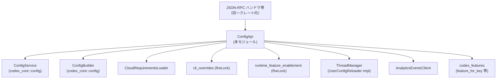
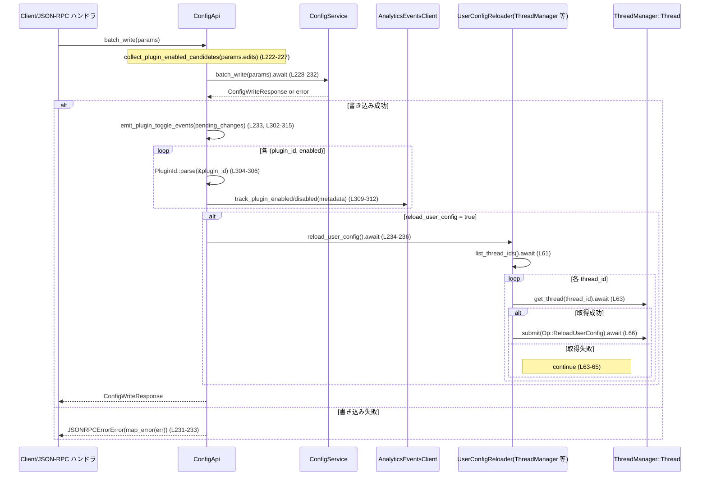

# app-server/src/config_api.rs コード解説

## 0. ざっくり一言

- App サーバー内部で **設定の読み書きと実行時のフラグ制御** を行うための API をまとめたモジュールです。
- JSON-RPC 用のエラー型にマッピングしつつ、`codex_core::config` の `ConfigService` / `ConfigBuilder` をラップし、**プラグイン有効化イベント** や **クラウド要件** も統合します。

---

## 1. このモジュールの役割

### 1.1 概要

- このモジュールは **ユーザー設定の読み取り・書き込み・要件確認・実験的機能の有効化** を行うために存在し、App サーバー内向けの Config API を提供します。
- コア設定サービス (`ConfigService`) と JSON-RPC 層の間に入り、**エラー変換・ランタイム feature enablement・プラグイン有効／無効イベント送出** を担当します。
- さらに `ConfigRequirementsToml` から JSON-RPC プロトコルの `ConfigRequirements` 型への **変換ロジック** を持ち、ネットワーク要件などの構造変換も行います。

### 1.2 アーキテクチャ内での位置づけ

このモジュールが依存する主なコンポーネントの関係を示します（実装根拠: 全体の `use` 群と `ConfigApi` メソッドの呼び出し, L1-43, L84-315, L361-515）。



### 1.3 設計上のポイント

- **責務分割**
  - 設定ファイルの実際の読み書きは `ConfigService` に委譲し、本モジュールは **API 表面・エラー変換・周辺処理（イベント・リロード・feature の上書き）** に集中しています（L105-112, L156-187, L202-215, L217-238）。
- **状態管理**
  - CLI 上書き・クラウド要件・実行時 feature enablement は `Arc<RwLock<...>>` で共有されます（L76-80）。
  - `ConfigApi` 自体は `Clone` 可能であり、複数タスク／スレッドから共有されることを前提にしています（L73-82）。
- **エラーハンドリング**
  - コアの `ConfigServiceError` を JSON-RPC 用の `JSONRPCErrorError` に変換する `map_error` / `config_write_error` を提供します（L495-515）。
  - コンフィグ構築 (`ConfigBuilder`) 失敗時は `INTERNAL_ERROR_CODE` を返し、ユーザーエラー（書き込み検証失敗等）は `INVALID_REQUEST_ERROR_CODE` ＋ `config_write_error_code` で返します（L147-151, L495-515）。
- **並行性**
  - 読み取り系は `RwLock::read()` を用いており、ロックが poison されている場合は **デフォルト値にフォールバック** します（L114-133）。
  - 書き込み系 (`set_experimental_feature_enablement`) は `RwLock::write()` のエラーを JSON-RPC エラーとして返します（L280-288）。
  - 設定書き込み後にスレッドごとの `Op::ReloadUserConfig` を投げる仕組み（`UserConfigReloader`）があり、設定変更の伝播を行います（L53-71, L217-238, L814-875）。

---

## 2. 主要な機能一覧

このモジュールが提供する主な機能です（公開範囲はいずれも `pub(crate)`）。

- `ConfigApi::read`: 設定の読み取り＋実験的機能の有効／無効状態をレスポンスに埋め込む（L156-187）。
- `ConfigApi::config_requirements_read`: TOML ベースの要件定義を API 用 `ConfigRequirements` に変換して返す（L189-200, L361-399）。
- `ConfigApi::write_value`: 単一キーの設定書き込みと、プラグイン有効化イベントの送出（L202-215, L302-315）。
- `ConfigApi::batch_write`: 複数編集の一括書き込み＋プラグイントグルイベント＋必要に応じて user config リロード（L217-238, L53-71）。
- `ConfigApi::set_experimental_feature_enablement`: 実行時のみ有効な実験的機能フラグの検証・保存・リロード（L240-300）。
- `apply_runtime_feature_enablement`: `Config` に実行時 feature enablement を適用するが、**保護された feature**（CLI / cloud 要件など）は変更しない（L339-359）。
- `protected_feature_keys`: ランタイム上書きから保護すべき feature キー集合を計算する（L318-337）。
- `map_requirements_toml_to_api` + 付随関数: `ConfigRequirementsToml` → `ConfigRequirements` の変換（承認ポリシー・sandbox・web 検索・ネットワーク要件など）（L361-467, L469-493）。
- `map_error` / `config_write_error`: `ConfigServiceError` を JSON-RPC エラーにマッピング（L495-515）。
- `UserConfigReloader` / その `ThreadManager` 実装: 各スレッドに `Op::ReloadUserConfig` を投げることで設定リロードを要求（L53-71）。

---

## 3. 公開 API と詳細解説

### 3.1 型一覧（構造体・列挙体など）

| 名前 | 種別 | 役割 / 用途 | 定義位置 |
|------|------|-------------|----------|
| `UserConfigReloader` | トレイト | ユーザー設定のリロード要求を抽象化する非同期インターフェイス。`ThreadManager` やテスト用実装がこれを実装します。 | `config_api.rs:L53-56` |
| `ConfigApi` | 構造体 | 設定の読み書き／要件読み取り／実行時 feature enablement API をまとめたファサード。App サーバー内部から JSON-RPC ハンドラ経由で利用されます。 | `config_api.rs:L73-82` |
| `RecordingUserConfigReloader` | 構造体（テスト用） | `UserConfigReloader` を実装し、呼び出し回数をカウントするテストダブル。 | `config_api.rs:L537-546` |

### 3.2 関数詳細（主要 7 件）

#### `trait UserConfigReloader` / `impl UserConfigReloader for ThreadManager`

**定義**

- トレイト: `config_api.rs:L53-56`
- 実装: `config_api.rs:L58-71`

**概要**

- ユーザー設定を再読込させるための抽象インターフェイスです。
- `ThreadManager` 実装では、全スレッドに `Op::ReloadUserConfig` を送ることで、各スレッドに設定リロード処理をさせます。

**メソッド**

| シグネチャ | 説明 |
|-----------|------|
| `async fn reload_user_config(&self)` | 実装ごとに、アクティブな処理コンテキストへ「設定をリロードせよ」というシグナルを送ります。 |

**内部処理（`ThreadManager` 実装）**

1. `ThreadManager::list_thread_ids().await` でスレッド ID 一覧を取得（L61）。
2. 各 ID について `get_thread(thread_id).await` でスレッドハンドルを取得。失敗したスレッドはスキップ（L62-65）。
3. 成功したスレッドに対して `thread.submit(Op::ReloadUserConfig).await` を送信し、エラー時には `warn!` ログを出して継続（L66-67）。

**Errors / Panics**

- メソッド自体は `Result` を返さず、エラーは `tracing::warn!` ログに記録されるのみです（L66-67）。
- `ThreadManager` 側の API が panic するかどうかはこのファイルからは分かりません。

**Edge cases**

- スレッド一覧取得後に一部スレッドが消えていて `get_thread` が `Err` を返すケースでは、該当スレッドだけスキップされます（L63-65）。
- 1 つでも成功したら他は影響を受けません。

**使用上の注意点**

- `UserConfigReloader` は `Send + Sync` 制約付きのトレイトオブジェクトとして `ConfigApi` に格納されるため、**スレッドセーフに実装する必要があります**（L53-56, L80）。
- 実装側で重い I/O や長時間ブロックする処理を行うと、`set_experimental_feature_enablement` や `batch_write` の完了が遅延します（L217-238, L296-297, L814-875）。

---

#### `ConfigApi::read(&self, params: ConfigReadParams) -> Result<ConfigReadResponse, JSONRPCErrorError>`

**定義**

- `config_api.rs:L156-187`

**概要**

- `ConfigService::read` を呼び出して設定を読み取り、さらに **実験的機能の有効／無効状態** をレスポンスの `config.additional["features"]` に埋め込みます。
- JSON-RPC 用のエラー型に変換して返します。

**引数**

| 引数名 | 型 | 説明 |
|--------|----|------|
| `params` | `ConfigReadParams` | 読み取り対象（カレントディレクトリ `cwd` 等）を含むリクエストパラメータ。`cwd` は `PathBuf` に変換され、`ConfigService` と `ConfigBuilder` の `fallback_cwd` に使われます（L160, L135-144）。 |

**戻り値**

- `Ok(ConfigReadResponse)`:
  - `ConfigService::read` の結果に加え、`SUPPORTED_EXPERIMENTAL_FEATURE_ENABLEMENT` に列挙された feature の有効／無効を `config.additional["features"][feature_key]` に boolean で埋め込んだレスポンス（L167-185）。
- `Err(JSONRPCErrorError)`:
  - `ConfigService::read` 内のエラーを `map_error` で包んだもの（L161-166）。
  - あるいは `load_latest_config` 内のコンフィグ構築失敗を `INTERNAL_ERROR_CODE` として返したもの（L166, L135-151）。

**内部処理の流れ**

1. `params.cwd` を `Option<PathBuf>` に変換して `fallback_cwd` とする（L160）。
2. `self.config_service().read(params).await` で基本設定を読み取る（L161-165）。
3. `self.load_latest_config(fallback_cwd).await?` で、CLI 上書き・クラウド要件・ランタイム feature enablement を統合した最新 `Config` を取得（L166, L135-153）。
4. `SUPPORTED_EXPERIMENTAL_FEATURE_ENABLEMENT` に列挙された各 `feature_key` について:
   - `feature_for_key(feature_key)` で canonical feature を取得できたものだけを対象とし（L167-170）、
   - `response.config.additional["features"]` を `serde_json::Value::Object` として確保し（L171-178）、
   - `config.features.enabled(feature)` の結果を JSON boolean として挿入（L179-183）。
5. 更新済み `ConfigReadResponse` を返す（L186）。

**Errors / Panics**

- `ConfigService::read` が返す `ConfigServiceError` はすべて `map_error` で `JSONRPCErrorError` に変換されます（L165, L495-505）。
- `load_latest_config` 内で `ConfigBuilder::build().await` が失敗した場合も `JSONRPCErrorError`（`INTERNAL_ERROR_CODE`）に変換されます（L147-151）。
- 明示的な `panic!` はなく、この関数自体は panic しない設計です。

**Edge cases**

- `params.cwd` が `None` の場合: `fallback_cwd` も `None` になり、`ConfigBuilder` は `codex_home` やその他設定から解決します（L135-144, L160）。
- `config.additional["features"]` がすでに存在し、かつオブジェクトでない場合（例: 文字列など）は、一度空オブジェクト `{}` に上書きされます（L176-178）。
- `SUPPORTED_EXPERIMENTAL_FEATURE_ENABLEMENT` の中に `feature_for_key` から見つからない key がある場合、その key はスキップされます（L167-170）。

**使用上の注意点**

- feature enablement の値は **runtime enablement と CLI / cloud 要件を統合した最終決定値** であり、単に config.toml の値とは限りません（L135-153, L339-359）。
- JSON-RPC レイヤーからは、このメソッドのエラーをそのまま JSON-RPC エラーとしてクライアントに返す想定です。

---

#### `ConfigApi::batch_write(&self, params: ConfigBatchWriteParams) -> Result<ConfigWriteResponse, JSONRPCErrorError>`

**定義**

- `config_api.rs:L217-238`

**概要**

- 複数の設定編集（`edits`）を一括で書き込みます。
- 変更の中にプラグインの有効／無効を示す設定が含まれている場合、`AnalyticsEventsClient` を通じて対応する **トラッキングイベント** を送出します。
- `params.reload_user_config` が `true` の場合、書き込み成功後に `UserConfigReloader::reload_user_config()` を呼び、ユーザー設定リロードを促します。

**引数**

| 引数名 | 型 | 説明 |
|--------|----|------|
| `params` | `ConfigBatchWriteParams` | 編集対象キーの集合、対象ファイルパス、期待バージョン、`reload_user_config` フラグなどを含む構造体（L219-221）。 |

**戻り値**

- `Ok(ConfigWriteResponse)`:
  - `ConfigService::batch_write` の結果をそのまま返します（L228-233）。
- `Err(JSONRPCErrorError)`:
  - `ConfigServiceError` を `map_error` で変換した JSON-RPC エラー（L231-233）。

**内部処理の流れ**

1. `reload_user_config` フラグを保持（L221）。
2. `collect_plugin_enabled_candidates` に `params.edits` の `(key_path, value)` のペアを渡し、プラグイン有効化／無効化候補のマップ `pending_changes` を生成（L222-227）。
3. `self.config_service().batch_write(params).await` で設定を書き込み、エラーは `map_error` で変換（L228-233）。
4. `self.emit_plugin_toggle_events(pending_changes)` でプラグインごとの enabled/disabled イベントを送出（L233, L302-315）。
5. `reload_user_config` が `true` の場合、`self.user_config_reloader.reload_user_config().await` を呼び出し、各スレッドに `Op::ReloadUserConfig` を送る（L234-236, L58-71）。
6. `ConfigWriteResponse` を返す（L237）。

**Errors / Panics**

- `ConfigService::batch_write` 起因の失敗は JSON-RPC エラーで返されます（L231-233, L495-515）。
- `user_config_reloader.reload_user_config()` の内部エラーは、このモジュールでは扱われておらず、テスト実装では失敗しません（L538-546, L814-875）。
- `emit_plugin_toggle_events` 内で `PluginId::parse` に失敗した場合、該当エントリをスキップするだけです（L304-306）。

**Edge cases**

- `params.edits` にプラグイン関連のキーが含まれない場合、`pending_changes` は空で、イベント送出は何も行われません（`collect_plugin_enabled_candidates` の仕様はこのファイルからは不明ですが、空マップのケースに対応しています。L206-207, L222-227, L302-315）。
- `reload_user_config = false` のときは、書き込み後も user config リロードは実行されません（L221, L234-236）。

**使用上の注意点**

- ファイルのバージョン管理を行う場合は、`params.expected_version` を適切に設定する必要があります（テストコードより: L844-853）。詳細な動作は `ConfigService::batch_write` に依存します。
- 設定ファイルのパスは `params.file_path` に文字列で渡され、`ConfigService` 側で扱われます（L844-852, L860-867）。

---

#### `ConfigApi::set_experimental_feature_enablement(&self, params: ExperimentalFeatureEnablementSetParams) -> Result<ExperimentalFeatureEnablementSetResponse, JSONRPCErrorError>`

**定義**

- `config_api.rs:L240-300`

**概要**

- 実行時のみ有効な「実験的機能」の enabled フラグを受け取り、検証のうえ `runtime_feature_enablement` に保存します。
- 対応する `Config` を再構築し、ユーザー設定のリロードを要求します。
- **サポート対象外の feature キーやエイリアス／存在しない feature キーを厳格に拒否** します。

**引数**

| 引数名 | 型 | 説明 |
|--------|----|------|
| `params` | `ExperimentalFeatureEnablementSetParams` | `enablement: BTreeMap<String, bool>` を含むパラメータ。キーが feature 名、値が有効／無効です（L244）。 |

**戻り値**

- `Ok(ExperimentalFeatureEnablementSetResponse { enablement })`:
  - 検証・適用の完了後に、受け取った `enablement` マップをそのまま返します（L276-278, L299）。
- `Err(JSONRPCErrorError)`:
  - 無効な feature キーに対する `INVALID_REQUEST_ERROR_CODE` のエラー（L251-258, L269-273）。
  - `RwLock::write()` に失敗した場合の `INTERNAL_ERROR_CODE` エラー（L280-288）。
  - `load_latest_config` 失敗時の `INTERNAL_ERROR_CODE` エラー（L296-297）。

**内部処理の流れ**

1. `params` から `enablement` マップを取り出す（L244）。
2. 各キー `key` について検証（L245-274）:
   - `canonical_feature_for_key(key).is_some()` の場合:
     - `SUPPORTED_EXPERIMENTAL_FEATURE_ENABLEMENT` に含まれていれば OK（L246-248）。
     - 含まれていなければ `"unsupported feature enablement"` エラーを返す（L251-258）。
   - `canonical_feature_for_key(key).is_none()` の場合:
     - `feature_for_key(key)` が見つかれば、「canonical feature key を使え」というメッセージでエラー（L261-265, L269-273）。
     - 見つからなければ単に `"invalid feature enablement"` エラー（L266-268, L269-273）。
   - 最初に見つかった無効キーで即座に `Err` を返すため、以降のキーは検証されません（L251-258, L269-273）。
3. `enablement.is_empty()` なら、設定は変更せずそのまま OK を返す（L276-278）。
4. そうでない場合:
   - `runtime_feature_enablement` の `RwLock::write()` を取得し、取得失敗（poison）の場合はエラーを返す（L280-288）。
   - `extend()` で既存マップに `(name.clone(), *enabled)` を追加／上書きする（L289-293）。
5. `self.load_latest_config(None).await?` を呼び、実行時 enablement を含めた最新 Config を構築する（L296-297, L135-153）。
6. `self.user_config_reloader.reload_user_config().await` で設定リロードを通知する（L297, L58-71）。
7. 成功レスポンスを返す（L299）。

**Errors / Panics**

- 無効な feature キーはすべて `INVALID_REQUEST_ERROR_CODE` としてクライアントに返されます（L251-258, L269-273）。
- RwLock 書き込みロック取得失敗（poison）は `INTERNAL_ERROR_CODE` で返されます（L280-288）。
- `load_latest_config` の内部エラーも `INTERNAL_ERROR_CODE` です（L296-297, L147-151）。

**Edge cases**

- `enablement` が空の場合、**検証・ロック・リロードは何も行われず** 即座に OK を返します（L276-278）。
- 同じ feature キーに対する複数回の呼び出しでは、`extend` により最後の値が有効になります（L289-293）。
- すでに `runtime_feature_enablement` に登録済みのキーも `extend` によって上書き可能です。

**使用上の注意点**

- 実行時 enablement は `ConfigBuilder` による構築時に `apply_runtime_feature_enablement` で適用されますが、**protected な feature（ファイル config やクラウド要件により固定されているもの）は変更されません**（L339-359, L754-812）。
- キーは **canonical な feature key かつ `SUPPORTED_EXPERIMENTAL_FEATURE_ENABLEMENT` 内にあるもの**のみ受け付けられます。エイリアス名は常に拒否されます（L245-273）。

---

#### `ConfigApi::load_latest_config(&self, fallback_cwd: Option<PathBuf>) -> Result<Config, JSONRPCErrorError>`

**定義**

- `config_api.rs:L135-154`

**概要**

- `ConfigBuilder` を用いて最新の `Config` オブジェクトを構築します。
- CLI 上書き・ローダ上書き・クラウド要件・指定された `fallback_cwd` を反映した上で、**実行時 feature enablement を適用** します。

**引数**

| 引数名 | 型 | 説明 |
|--------|----|------|
| `fallback_cwd` | `Option<PathBuf>` | 設定解決に用いる「フォールバックのカレントディレクトリ」。`ConfigApi::read` から渡されることがあります（L137, L160）。 |

**戻り値**

- `Ok(Config)`:
  - すべての情報を反映した `Config`（L139-145, L152-153）。
- `Err(JSONRPCErrorError)`:
  - `ConfigBuilder::build().await` 失敗時に `INTERNAL_ERROR_CODE` 付きで返されるエラー（L147-151）。

**内部処理の流れ**

1. `ConfigBuilder::default()` からビルダーを作成（L139）。
2. `codex_home`, `cli_overrides`, `loader_overrides`, `fallback_cwd`, `cloud_requirements` を設定（L139-144）。
3. `.build().await` で非同期に `Config` を構築し、エラーを JSON-RPC エラーに変換（L145-151）。
4. `apply_runtime_feature_enablement` を呼び、実行時 enablement を適用（L152, L339-359）。
5. `Config` を返す（L153）。

**Errors / Panics**

- `ConfigBuilder::build()` 起因のエラーはすべて `INTERNAL_ERROR_CODE` になります（L147-151）。
- その後の `apply_runtime_feature_enablement` 内では、feature 設定に失敗しても warn ログを出すだけで処理を継続します（L351-357）。

**Edge cases**

- `cli_overrides` / `cloud_requirements` の `RwLock` が poison されている場合、`current_cli_overrides` / `current_cloud_requirements` がデフォルト値（空）を返すため、意図した上書きが効かない可能性があります（L114-133）。
- 実行時 enablement が空の場合でも、`apply_runtime_feature_enablement` は単にループをスキップします（L343-358）。

**使用上の注意点**

- このメソッドは `read` や `set_experimental_feature_enablement` から呼ばれ、**常に最新の runtime enablement を反映した `Config` を再構築する**用途で使用されます（L166, L296-297）。
- ビルドが重い場合、頻繁な呼び出しはパフォーマンスに影響する可能性があります。

---

#### `apply_runtime_feature_enablement(config: &mut Config, runtime_feature_enablement: &BTreeMap<String, bool>)`

**定義**

- `config_api.rs:L339-359`

**概要**

- 実行時に変更可能な feature enablement を `Config` に適用します。
- ただし、`protected_feature_keys` で得られる「保護された feature」は上書きせず、既存の値を維持します。

**引数**

| 引数名 | 型 | 説明 |
|--------|----|------|
| `config` | `&mut Config` | 既にファイル・CLI・クラウドなどを反映済みの設定。`config.config_layer_stack` にアクセスされます（L343）。 |
| `runtime_feature_enablement` | `&BTreeMap<String, bool>` | feature 名 → enabled フラグのマップ。`set_experimental_feature_enablement` によりセットされた値です（L341, L289-293）。 |

**戻り値**

- 戻り値はなく、副作用として `config.features` を更新します（L351-357）。

**内部処理の流れ**

1. `protected_feature_keys(&config.config_layer_stack)` を呼び出し、保護対象 feature の集合を取得（L343, L318-337）。
2. `for (name, enabled) in runtime_feature_enablement` で各 feature を走査（L344）。
3. `protected_features.contains(name)` ならスキップ（L345-347）。
4. `feature_for_key(name)` で対応する feature が見つからなければスキップ（L348-350）。
5. `config.features.set_enabled(feature, *enabled)` を呼び、エラー時には warn ログを出して継続（L351-357）。

**Tests / Contracts**

- `apply_runtime_feature_enablement_keeps_cli_overrides_above_config_and_runtime`（L754-780）:
  - CLI override `features.apps = true` が設定されている場合、実行時で `apps = false` を指定しても、`config.features.enabled(Feature::Apps)` は `true` のままであることを確認。
- `apply_runtime_feature_enablement_keeps_cloud_pins_above_cli_and_runtime`（L782-812）:
  - クラウド要件で `apps = false` が pin されている場合、CLI override と runtime で `true` を指定しても、最終的に `false` のままであることを確認。

**Errors / Panics**

- `config.features.set_enabled` が `Err` を返した場合、`warn!` ログを出力するのみで処理を続行します（L351-357）。
- panic は明示的にはありません。

**Edge cases**

- `runtime_feature_enablement` に `feature_for_key` で解決できないキーが含まれていても、単に無視されます（L348-350）。
- `protected_feature_keys` により CLI 上書きやクラウド要件で固定された feature は runtime から変更できません（L321-336, L343-347）。

**使用上の注意点**

- 「protected feature」を追加したい場合は、`ConfigLayerStack` の `features` セクションか `feature_requirements` にキーを追加する必要があります（L321-336）。
- runtime enablement はあくまで「最後のレイヤー」であり、上書きできない feature があることに注意が必要です。

---

#### `protected_feature_keys(config_layer_stack: &ConfigLayerStack) -> BTreeSet<String>`

**定義**

- `config_api.rs:L318-337`

**概要**

- ランタイムでの上書きから保護すべき feature 名の集合を算出します。
- 具体的には:
  - `effective_config()["features"]` テーブルのキー
  - `requirements_toml().feature_requirements.entries` のキー
  を合わせた集合です。

**引数 / 戻り値**

| 項目 | 型 | 説明 |
|------|----|------|
| `config_layer_stack` | `&codex_core::config_loader::ConfigLayerStack` | 各レイヤー（ファイル・CLI・クラウド要件など）を保持するスタック。`effective_config` と `requirements_toml` にアクセスされます（L319-331）。 |
| 戻り値 | `BTreeSet<String>` | 保護対象の feature キーの集合（L321-336）。 |

**内部処理の流れ**

1. `effective_config().get("features")` から `toml::Value::as_table` でテーブルを取得し、そのキーを `BTreeSet` に収集（L321-326）。
2. `requirements_toml().feature_requirements.as_ref()` があれば、その `entries.keys()` をセットに追加（L328-333）。
3. 結果の `BTreeSet` を返す（L336）。

**使用上の注意点**

- `effective_config` は「最終的な TOML 表現」であり、CLI 上書きなども反映済みです。
- ここで返されるキーが多いほど、`runtime_feature_enablement` の効き目は限定されます。

---

#### `map_requirements_toml_to_api(requirements: ConfigRequirementsToml) -> ConfigRequirements`

**定義**

- `config_api.rs:L361-399`

**概要**

- コア側の TOML ベースの要件定義 (`ConfigRequirementsToml`) を、JSON-RPC プロトコル層の `ConfigRequirements` に変換します。
- enum 値の変換・不要値のフィルタリング・「Disabled を必ず含める」などの正規化を行います。

**主なフィールド変換**

- `allowed_approval_policies`: `Vec<CoreAskForApproval>` → `Vec<codex_app_server_protocol::AskForApproval>`（L363-368）。
- `allowed_approvals_reviewers`: `Vec<CoreApprovalsReviewer>` → `Vec<ApprovalsReviewer>`（L369-374）。
- `allowed_sandbox_modes`: `Vec<CoreSandboxModeRequirement>` → `Vec<SandboxMode>` だが、`ExternalSandbox` は除外（L375-380, L401-407）。
- `allowed_web_search_modes`: `Vec<WebSearchModeRequirement>` → `Vec<WebSearchMode>` に変換後、`Disabled` が含まれていなければ追加（L381-389）。
- `feature_requirements`: `FeatureRequirementsToml.entries` をそのままマップとしてコピー（L391-393）。
- `enforce_residency`: `CoreResidencyRequirement` → プロトコル側 enum （L394-396, L410-415）。
- `network`: `NetworkRequirementsToml` → `NetworkRequirements`（L397-398, L418-467）。

**Tests / Contracts**

- `map_requirements_toml_to_api_converts_core_enums`（L549-668）:
  - enum 変換、sandbox 外部モード除外、web search modes に `Disabled` が追加されること、network の変換（domains, unix_sockets, allowed/denied/allow_unix_sockets）が確認されています。
- `map_requirements_toml_to_api_omits_unix_socket_none_entries_from_legacy_network_fields`（L671-727）:
  - unix_sockets に `None` が含まれている場合、`allow_unix_sockets`（レガシーフィールド）は空扱いとし、`None` エントリは `allow_unix_sockets` に反映されないことを確認。
- `map_requirements_toml_to_api_normalizes_allowed_web_search_modes`（L730-752）:
  - `allowed_web_search_modes` が空のときでも、`Some(vec![WebSearchMode::Disabled])` になることを確認。

**使用上の注意点**

- 新しい要件フィールドを `ConfigRequirementsToml` に追加した場合、プロトコル側に露出させるならこの関数に変換処理を追加する必要があります。
- `ExternalSandbox` のように API レイヤーでサポートしない sandbox モードは `None` にマップされ、結果のベクタから自動的に除外されます（L375-380, L401-407）。

---

#### `map_network_requirements_to_api(network: NetworkRequirementsToml) -> NetworkRequirements`

**定義**

- `config_api.rs:L418-467`

**概要**

- コア側の `NetworkRequirementsToml` をプロトコル用の `NetworkRequirements` に変換します。
- ドメインと Unix ソケットの **詳細マップ** に加え、利便性のための「allowed_domains / denied_domains / allow_unix_sockets」のレガシーフィールドも埋めます。

**主な変換**

1. `allowed_domains` / `denied_domains`:
   - `network.domains.as_ref()` から `NetworkDomainPermissionsToml::allowed_domains` / `denied_domains` を呼び出してベクタを取得（L421-428）。
2. `allow_unix_sockets`:
   - `network.unix_sockets.as_ref()` から `NetworkUnixSocketPermissionsToml::allow_unix_sockets` を呼び出し、空でない場合のみ `Some(vec)` にする（L429-433）。
3. `domains` マップ:
   - `(pattern, permission)` のマップを `(pattern, NetworkDomainPermission)` に変換（L442-449, L469-478）。
4. `unix_sockets` マップ:
   - `(path, permission)` のマップを `(path, NetworkUnixSocketPermission)` に変換（L455-463, L482-491）。
5. その他のブール／ポート類はフィールド名を保ったままコピー（L435-452, L465-466）。

**使用上の注意点**

- `allow_unix_sockets` は **`Allow` のみを集約した利便フィールド** であり、`None` パーミッションのエントリは含まれません。テストでは `None` しかない場合に `allow_unix_sockets: None` であることが確認されています（L671-727）。
- `dangerously_` が付くフィールド（例: `dangerously_allow_all_unix_sockets`）は、その名のとおり危険な設定であることを示しますが、このモジュールは単に値を素通ししているだけです（L440-441）。

---

### 3.3 その他の関数・メソッド一覧

生産コード部分の関数・メソッドのインベントリーです（テスト関数は割愛）。行番号は `app-server/src/config_api.rs:L開始-終了` 形式です。

| 名前 | 種別 | 役割（1 行） | 位置 |
|------|------|-------------|------|
| `ConfigApi::new` | メソッド | 依存オブジェクト（RwLock や `AnalyticsEventsClient` など）を受け取って `ConfigApi` を構築するコンストラクタです。 | `config_api.rs:L85-103` |
| `ConfigApi::config_service` | メソッド | 現在の CLI オーバライド・ローダオーバライド・クラウド要件を使って `ConfigService` を生成します。 | `config_api.rs:L105-112` |
| `ConfigApi::current_cli_overrides` | メソッド | `cli_overrides` RwLock からベクタを読み出し、poison 時はデフォルト値を返します。 | `config_api.rs:L114-119` |
| `ConfigApi::current_runtime_feature_enablement` | メソッド | 実行時 feature enablement マップを RwLock から取得し、poison 時は空マップを返します。 | `config_api.rs:L121-126` |
| `ConfigApi::current_cloud_requirements` | メソッド | クラウド要件ローダを RwLock から取得し、poison 時はデフォルトを返します。 | `config_api.rs:L128-133` |
| `ConfigApi::config_requirements_read` | メソッド | `ConfigService::read_requirements` を呼び、`map_requirements_toml_to_api` で変換した結果を返します。 | `config_api.rs:L189-200` |
| `ConfigApi::write_value` | メソッド | 単一キーの書き込みと、プラグイン有効化イベント送出を行います。 | `config_api.rs:L202-215` |
| `ConfigApi::emit_plugin_toggle_events` | メソッド | プラグイン ID 文字列→`PluginId` に変換し、enabled/disabled に応じて分析イベントを送出します。 | `config_api.rs:L302-315` |
| `map_sandbox_mode_requirement_to_api` | 関数 | コア側の Sandbox 要件 enum を API 用の `SandboxMode` に変換し、未サポートモードは `None` にします。 | `config_api.rs:L401-407` |
| `map_residency_requirement_to_api` | 関数 | `CoreResidencyRequirement` を API 用 `ResidencyRequirement` に変換します（現在は `Us` のみ）。 | `config_api.rs:L410-415` |
| `map_network_domain_permission_to_api` | 関数 | ドメイン単位の Network パーミッションを API 用 enum に変換します。 | `config_api.rs:L469-478` |
| `map_network_unix_socket_permission_to_api` | 関数 | Unix ソケット単位の Network パーミッションを API 用 enum に変換します。 | `config_api.rs:L482-491` |
| `map_error` | 関数 | `ConfigServiceError` に書き込みエラーコードが含まれる場合は `config_write_error` に委譲し、それ以外は `INTERNAL_ERROR_CODE` で包みます。 | `config_api.rs:L495-505` |
| `config_write_error` | 関数 | `ConfigWriteErrorCode` を `JSONRPCErrorError.data["config_write_error_code"]` に格納した JSON-RPC エラーを構築します。 | `config_api.rs:L507-515` |

---

## 4. データフロー

### 4.1 代表的シナリオ: batch_write → プラグインイベント → ユーザー設定リロード

`ConfigApi::batch_write` 呼び出しから、プラグインの enabled/disabled イベント送出・ユーザー設定リロードまでの流れです（対応コード: `L217-238`, `L302-315`, `L53-71`, `L814-875`）。



このシナリオから分かる要点:

- 設定ファイル書き込みは **ConfigService が責務** を持ち、本モジュールはその前後でイベント・リロードを行います。
- プラグイン関連の設定変更があれば、必ず Analytics イベントが送出されます（`PluginId::parse` 失敗時はスキップ）。
- `reload_user_config` が `true` のときだけ、実際のスレッドへのリロード要求が行われます。

---

## 5. 使い方（How to Use）

### 5.1 基本的な使用方法

`ConfigApi` は内部向け API ですが、テストコードのパターンに倣った典型的な利用例は以下のようになります（参考: `batch_write_reloads_user_config_when_requested`, L814-875）。

```rust
use std::sync::{Arc, RwLock};
use std::collections::BTreeMap;
use std::path::PathBuf;
use codex_analytics::AnalyticsEventsClient;
use codex_core::config_loader::{CloudRequirementsLoader, LoaderOverrides};
use app_server::config_api::{ConfigApi, UserConfigReloader};

async fn example_usage() -> Result<(), codex_app_server_protocol::JSONRPCErrorError> {
    // codex_home ディレクトリを決める
    let codex_home = PathBuf::from("/path/to/codex_home");

    // 依存オブジェクトを準備する
    let cli_overrides = Arc::new(RwLock::new(Vec::new()));            // CLI 上書きなし（L76, L114-119）
    let runtime_feature_enablement = Arc::new(RwLock::new(BTreeMap::new())); // 実行時フラグなし（L77, L121-126）
    let loader_overrides = LoaderOverrides::default();                // ローダ上書き（L78）
    let cloud_requirements = Arc::new(RwLock::new(CloudRequirementsLoader::default())); // クラウド要件なし（L79, L128-133）

    // UserConfigReloader の実装（ThreadManager など）を用意する
    let user_config_reloader: Arc<dyn UserConfigReloader> = /* ThreadManager 等を Arc で包む */ unimplemented!();

    // AnalyticsEventsClient を初期化する
    let analytics_client: AnalyticsEventsClient = /* AuthManager 等から作成 */ unimplemented!();

    // ConfigApi を構築する（L85-103）
    let config_api = ConfigApi::new(
        codex_home,
        cli_overrides,
        runtime_feature_enablement,
        loader_overrides,
        cloud_requirements,
        user_config_reloader,
        analytics_client,
    );

    // 設定を読み取る（L156-187）
    let read_response = config_api
        .read(codex_app_server_protocol::ConfigReadParams {
            cwd: Some("/workspace".to_string()),
            ..Default::default()
        })
        .await?;

    // 特定キーを書き込む（L202-215）
    let _write_response = config_api
        .write_value(codex_app_server_protocol::ConfigValueWriteParams {
            key_path: "model".to_string(),
            value: serde_json::json!("gpt-5"),
            // 他のフィールドは省略
            ..Default::default()
        })
        .await?;

    Ok(())
}
```

### 5.2 よくある使用パターン

1. **要件の読み取りだけを行う**

```rust
// ConfigRequirements を取得してクライアントに返す（L189-200, L361-399）
let requirements_response = config_api.config_requirements_read().await?;
// requirements_response.requirements を JSON-RPC レスポンスに載せる
```

1. **複数の設定を一括で更新し、ユーザー設定をリロードする**

```rust
use serde_json::json;
use codex_app_server_protocol::{ConfigBatchWriteParams, ConfigEdit, MergeStrategy};

// 設定ファイルに複数のキーを書き込み、その後リロードを要求する（L217-238）
let resp = config_api
    .batch_write(ConfigBatchWriteParams {
        edits: vec![
            ConfigEdit {
                key_path: "model".to_string(),
                value: json!("gpt-5"),
                merge_strategy: MergeStrategy::Replace,
            },
            ConfigEdit {
                key_path: "features.apps".to_string(),
                value: json!(true),
                merge_strategy: MergeStrategy::Replace,
            },
        ],
        file_path: Some("/path/to/config.toml".into()),
        expected_version: None,
        reload_user_config: true,
    })
    .await?;
```

1. **実行時の実験的機能を切り替える**

```rust
use std::collections::BTreeMap;
use codex_app_server_protocol::ExperimentalFeatureEnablementSetParams;

// 「apps」と「tool_search」を実行時に有効化する（L240-300）
let mut enablement = BTreeMap::new();
enablement.insert("apps".to_string(), true);
enablement.insert("tool_search".to_string(), true);

let resp = config_api
    .set_experimental_feature_enablement(ExperimentalFeatureEnablementSetParams {
        enablement,
    })
    .await?;
```

`SUPPORTED_EXPERIMENTAL_FEATURE_ENABLEMENT` に含まれるキーのみ受け付けられる点に注意してください（L45-51, L245-258）。

### 5.3 よくある間違い

```rust
// 間違い例: canonical でない feature key を使う
let mut enablement = BTreeMap::new();
enablement.insert("apps_beta".to_string(), true); // 仮のエイリアス名

// これは INVALID_REQUEST_ERROR_CODE で失敗する（L261-273）
let resp = config_api
    .set_experimental_feature_enablement(ExperimentalFeatureEnablementSetParams { enablement })
    .await?;
```

```rust
// 正しい例: canonical な feature key かつサポート対象のキーだけを使う（L45-51, L245-258）
let mut enablement = BTreeMap::new();
enablement.insert("apps".to_string(), true);

let resp = config_api
    .set_experimental_feature_enablement(ExperimentalFeatureEnablementSetParams { enablement })
    .await?;
```

```rust
// 間違い例: batch_write で reload_user_config を期待しているのに false のまま
let resp = config_api
    .batch_write(ConfigBatchWriteParams {
        edits: vec![/* ... */],
        file_path: Some("config.toml".into()),
        expected_version: None,
        reload_user_config: false, // ← リロードが実行されない（L221, L234-236）
    })
    .await?;
```

```rust
// 正しい例: 設定変更を即座にスレッドへ反映したい場合は true にする
let resp = config_api
    .batch_write(ConfigBatchWriteParams {
        edits: vec![/* ... */],
        file_path: Some("config.toml".into()),
        expected_version: None,
        reload_user_config: true,  // L221, L234-236
    })
    .await?;
```

### 5.4 使用上の注意点（まとめ）

- **スレッド安全性**
  - `ConfigApi` は `Clone` 可能であり、内部状態は `Arc<RwLock<...>>` で共有されているため、複数タスクから安全に共有できます（L73-82）。
  - ただし、`RwLock` が poison された場合、読み取り側はデフォルト値にフォールバックするため、**設定が予期せず初期状態に戻る**可能性があります（L114-133）。これは設計上「安全側に倒す」振る舞いですが、原因調査のためには周辺の panic ログ確認が必要です。
- **エラーハンドリング**
  - 書き込みエラーは `config_write_error_code` を data フィールドに含む JSON-RPC エラーとして返されるので、クライアント側でこのコードを見てリカバリできます（L495-515）。
- **feature enablement の優先順位**
  - クラウド要件 > CLI / config ファイル > runtime enablement の順で優先されます。runtime は上位レイヤーを上書きできません（テスト L754-812）。
- **ネットワーク要件**
  - `dangerously_*` なフラグはセキュリティ上敏感な設定を表しますが、本モジュールでは値をそのまま透過させています。実際の制御は下位層の実装に依存します（L435-466）。

---

## 6. 変更の仕方（How to Modify）

### 6.1 新しい機能を追加する場合

1. **新しい設定 API を追加したい場合**
   - `impl ConfigApi` ブロックに新しいメソッドを追加し、その中で `self.config_service()` を通じて `ConfigService` を利用するのが自然です（L84-315）。
   - JSON-RPC エラー型へ変換する必要がある場合は、`map_error` や `config_write_error` を再利用します（L495-515）。

2. **Config 要件にフィールドを追加したい場合**
   - コア側の `ConfigRequirementsToml` にフィールドが追加されたら、その変換は `map_requirements_toml_to_api` に実装します（L361-399）。
   - ネットワーク関連であれば `map_network_requirements_to_api` にフィールド追加・変換も必要です（L418-467）。
   - 新しい enum 変換が必要なら、`map_***_to_api` スタイルの補助関数を追加します。

3. **新しい実験的 feature を runtime enablement の対象にしたい場合**
   - `SUPPORTED_EXPERIMENTAL_FEATURE_ENABLEMENT` に canonical feature key を追加します（L45-51）。
   - `codex_features` 側で `canonical_feature_for_key` / `feature_for_key` が対応していることを確認します（L32-33, L245-265）。

### 6.2 既存の機能を変更する場合

- **影響範囲の確認**
  - `ConfigApi` の各メソッドはテストで検証されているので、変更前に該当メソッド名を検索し、関連テスト（`mod tests` 内）と他モジュールからの呼び出し箇所を確認します（L517-875）。
- **契約の保持**
  - `apply_runtime_feature_enablement` は「protected feature は上書きしない」という契約をテストで保証しているため（L754-812）、この挙動を変える場合はテストの更新と契約の再定義が必要です。
  - `map_requirements_toml_to_api` の正規化挙動（web search modes に必ず `Disabled` を含めるなど）もテストで固定化されています（L549-668, L730-752）。
- **エラーコード**
  - `map_error` / `config_write_error` のエラーコードはクライアント実装に依存する可能性が高いため、変更時はクライアント側との互換性を確認する必要があります（L495-515）。

---

## 7. 関連ファイル

このモジュールと密接に関係する主なファイル・クレートです（`use` 句および関数呼び出しから読み取れる範囲）。

| パス / クレート | 役割 / 関係 |
|-----------------|------------|
| `crate::error_code` | `INTERNAL_ERROR_CODE`, `INVALID_REQUEST_ERROR_CODE` を定義し、JSON-RPC エラーコードとして利用します（L1-2, L147-151, L251-258, L269-273, L495-515）。 |
| `codex_core::config` | `Config`, `ConfigService`, `ConfigServiceError`, `ConfigBuilder` を提供し、実際の設定読み書きロジックを担います（L21-23, L105-112, L135-153）。 |
| `codex_core::config_loader` | `ConfigRequirementsToml`, `CloudRequirementsLoader`, `LoaderOverrides`, ネットワーク設定関連 TOML 型を提供し、本モジュールの変換関数で利用されます（L24-28, L418-467, L521-525）。 |
| `codex_core::plugins` | `PluginId`, `collect_plugin_enabled_candidates`, `installed_plugin_telemetry_metadata` を提供し、プラグインの有効化／無効化検出とイベントメタデータ解決に使用します（L29-31, L206-207, L222-227, L302-315）。 |
| `codex_features` | `canonical_feature_for_key`, `feature_for_key`, `Feature` enum を提供し、feature enablement とテストで利用されます（L32-33, L167-183, L245-266, L754-812）。 |
| `codex_analytics::AnalyticsEventsClient` | プラグインの enabled/disabled イベントを送出するクライアントです（L4, L81, L308-312, L520, L820-841）。 |
| `codex_app_server_protocol` | JSON-RPC レベルのパラメータ／レスポンス型 (`ConfigReadParams` など) とエラー型 (`JSONRPCErrorError`) を定義し、本モジュールの入力・出力インターフェイスに相当します（L5-19, L15, L361-399）。 |
| `codex_protocol::protocol::Op` | スレッドに送信する操作種別 `Op::ReloadUserConfig` を定義し、`UserConfigReloader` 実装で使用されます（L35, L66）。 |

---

以上が、`app-server/src/config_api.rs` の構造・主な API・データフロー・エッジケース・テストで保証されている契約の整理です。
