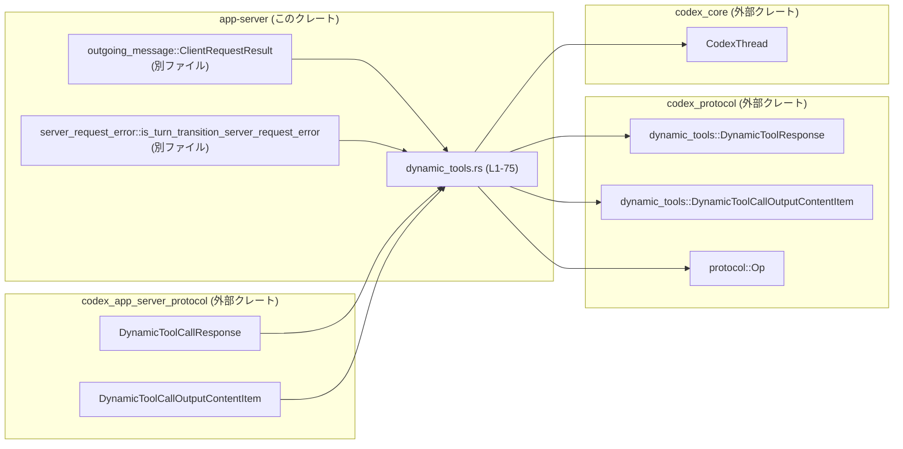
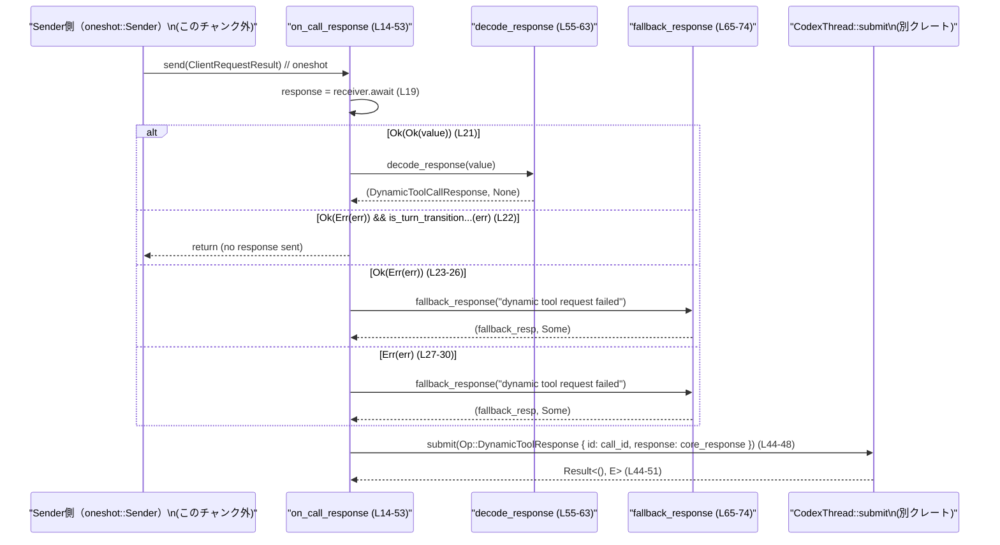

# app-server/src/dynamic_tools.rs コード解説

## 0. ざっくり一言

動的ツール呼び出し（dynamic tool call）の**クライアント側レスポンスを受け取り、コアの `CodexThread` に渡すためのブリッジ処理**を行うモジュールです（`dynamic_tools.rs:L14-53`）。

---

## 1. このモジュールの役割

### 1.1 概要

- クライアントから返ってきた JSON 形式の動的ツールレスポンスを受け取る  
  （`ClientRequestResult` 経由で `serde_json::Value` として渡される前提）（`dynamic_tools.rs:L14-21`）。
- それを `codex_app_server_protocol::DynamicToolCallResponse` へデコードし、必要に応じてフォールバックレスポンスを生成します（`dynamic_tools.rs:L20-31,55-63,65-74`）。
- 最終的に `codex_protocol` の `CoreDynamicToolResponse` へ変換して、`CodexThread` に `Op::DynamicToolResponse` として送信します（`dynamic_tools.rs:L33-48`）。

### 1.2 アーキテクチャ内での位置づけ

このモジュールは「アプリサーバのプロトコル層」と「コアのプロトコル層」の間の変換・中継を担当しています。



- `ClientRequestResult` と `oneshot::Receiver` からレスポンスを受け取るインバウンド側の窓口が `on_call_response` です（`dynamic_tools.rs:L14-21`）。
- `CodexThread::submit` に対して `Op::DynamicToolResponse` を送るアウトバウンド側の窓口にもなっています（`dynamic_tools.rs:L44-51`）。

### 1.3 設計上のポイント

- **非同期・ワンショットなレスポンス処理**  
  - `tokio::sync::oneshot::Receiver` を使い、1 回限りのレスポンスを待ち受ける設計です（`dynamic_tools.rs:L16,19`）。
- **エラーをログとフォールバックレスポンスで扱う**  
  - JSON デコード失敗やクライアントエラー時はログに詳細を出力しつつ、ユーザー向けには汎用的なフォールバックメッセージを返します（`dynamic_tools.rs:L23-30,55-63,65-74`）。
- **プロトコル変換の明確な境界**  
  - app-server プロトコルの `DynamicToolCallResponse`/`DynamicToolCallOutputContentItem` から、core プロトコルの対応する型への変換をこのモジュールで一括して行います（`dynamic_tools.rs:L33-43`）。
- **パニックを避けるエラーハンドリング**  
  - `unwrap` や `expect` は使わず、すべて `Result`/`Err` を分岐して扱うため、このモジュール内には明示的な panic 経路はありません（`dynamic_tools.rs:L20-31,55-63,44-52`）。

### 1.4 コンポーネント一覧（インベントリー）

#### 関数

| 名前 | シグネチャ（簡略） | 役割 | 行範囲 |
|------|--------------------|------|--------|
| `on_call_response` | `async fn on_call_response(call_id, receiver, conversation)` | oneshot 経由でクライアントレスポンスを受信し、コアへ送信するメイン処理 | `dynamic_tools.rs:L14-53` |
| `decode_response` | `fn decode_response(value)` | JSON 値を `DynamicToolCallResponse` にデコードし、失敗時はフォールバック生成 | `dynamic_tools.rs:L55-63` |
| `fallback_response` | `fn fallback_response(message)` | 汎用的なエラーメッセージを持つ `DynamicToolCallResponse` を生成 | `dynamic_tools.rs:L65-74` |

#### このファイル内で定義される型

- 新規に定義される構造体・列挙体・トレイトはありません。

---

## 2. 主要な機能一覧

- 動的ツールレスポンス受信処理: `on_call_response` で oneshot チャネルから `ClientRequestResult` を受信し、エラー種別に応じて処理を分岐します（`dynamic_tools.rs:L19-31`）。
- レスポンス JSON のデコード: `decode_response` で `serde_json::Value` を `DynamicToolCallResponse` に変換します（`dynamic_tools.rs:L55-57`）。
- フォールバックレスポンス生成: `fallback_response` で `success=false` のレスポンスとユーザー向けエラーメッセージを生成します（`dynamic_tools.rs:L65-74`）。
- プロトコル変換と送信: `DynamicToolCallResponse` から `CoreDynamicToolResponse` に変換し、`CodexThread::submit` へ送信します（`dynamic_tools.rs:L33-48`）。

---

## 3. 公開 API と詳細解説

### 3.1 型一覧（主に外部依存）

このファイル内で新しく定義される型はありませんが、関数シグネチャで重要な外部型が使われています。

| 名前 | 種別 | 役割 / 用途 | 根拠 |
|------|------|-------------|------|
| `DynamicToolCallResponse` | 構造体（外部クレート） | クライアント側の動的ツールレスポンス表現 | `dynamic_tools.rs:L2,33-36,55-57,65-72` |
| `DynamicToolCallOutputContentItem` | 列挙体（外部クレート） | レスポンスの各コンテンツ要素（テキスト等） | `dynamic_tools.rs:L1,68-70` |
| `CoreDynamicToolResponse` | 構造体（外部クレート） | コアプロトコル側の動的ツールレスポンス | `dynamic_tools.rs:L5,37-43` |
| `CoreDynamicToolCallOutputContentItem` | 列挙体（外部クレート） | コアプロトコル側のコンテンツ要素 | `dynamic_tools.rs:L4,38-41` |
| `CodexThread` | 構造体（外部クレート） | コアスレッド上のコンテキスト。`submit` メソッドで `Op` を受け付ける | `dynamic_tools.rs:L3,17,44-51` |
| `Op` | 列挙体（外部クレート） | コアプロトコルの操作種別。ここでは `DynamicToolResponse` バリアントを使用 | `dynamic_tools.rs:L6,45-48` |
| `ClientRequestResult` | 型エイリアス or 型（クレート内） | クライアントリクエスト処理の結果（成功時は JSON 値を含むと推測される） | `dynamic_tools.rs:L11,16,20-27` |
| `oneshot::Receiver<T>` | 非同期チャネル | 一回限りの値を非同期に受信するためのチャネル | `dynamic_tools.rs:L8,16,19` |
| `Arc<CodexThread>` | スレッドセーフな共有ポインタ | `CodexThread` を複数タスクから共有するために使用 | `dynamic_tools.rs:L7,17` |

> 補足: 上記外部型の内部構造やメソッドは、このチャンクには現れないため詳細不明です。

---

### 3.2 関数詳細

#### `on_call_response(call_id: String, receiver: oneshot::Receiver<ClientRequestResult>, conversation: Arc<CodexThread>)`

**概要**

- oneshot チャネルからクライアントレスポンスを受信し、JSON をデコードして `CodexThread` に `Op::DynamicToolResponse` として送信する非同期関数です（`dynamic_tools.rs:L14-21,33-48`）。

**引数**

| 引数名 | 型 | 説明 | 根拠 |
|--------|----|------|------|
| `call_id` | `String` | このツール呼び出しを識別する ID。`Op::DynamicToolResponse` の `id` フィールドに転送されます。 | `dynamic_tools.rs:L15,45-47` |
| `receiver` | `oneshot::Receiver<ClientRequestResult>` | クライアントとの通信結果を受信するチャネルの受信側です。 | `dynamic_tools.rs:L16,19-30` |
| `conversation` | `Arc<CodexThread>` | コアスレッドへの送信先コンテキスト。`submit` メソッド経由でレスポンスを流し込みます。 | `dynamic_tools.rs:L17,44-51` |

**戻り値**

- 戻り値の型は `()`（暗黙）で、値は返しません。副作用として `CodexThread::submit` を呼び出します（`dynamic_tools.rs:L44-51`）。

**内部処理の流れ**

1. `receiver.await` で `ClientRequestResult` を待ち受けます（`dynamic_tools.rs:L19`）。  
2. 受信結果に応じて `match` で分岐します（`dynamic_tools.rs:L20-31`）。
   - `Ok(Ok(value))`: 正常に JSON 値が得られた場合、`decode_response(value)` でデコードします（`dynamic_tools.rs:L21,55-57`）。
   - `Ok(Err(err))` かつ `is_turn_transition_server_request_error(&err)` が真: この場合は何も送信せず早期 return します（`dynamic_tools.rs:L22`）。
   - `Ok(Err(err))` のその他: クライアントエラーとしてログ出力し、`fallback_response("dynamic tool request failed")` でフォールバックレスポンスを生成します（`dynamic_tools.rs:L23-26,65-74`）。
   - `Err(err)`: oneshot チャネル自体のエラー（送信側 drop 等）としてログ出力し、同じフォールバックレスポンスを生成します（`dynamic_tools.rs:L27-30,65-74`）。
3. 得られた `DynamicToolCallResponse` を分解し、`content_items` と `success` を取り出します（`dynamic_tools.rs:L33-36`）。
4. `content_items` を core プロトコルの `CoreDynamicToolCallOutputContentItem` に 1 要素ずつ変換して `CoreDynamicToolResponse` を構築します（`dynamic_tools.rs:L37-43`）。
5. `conversation.submit(Op::DynamicToolResponse { id: call_id.clone(), response: core_response })` を `await` し、失敗した場合はエラーログを出力します（`dynamic_tools.rs:L44-51`）。

**Examples（使用例）**

この関数を呼び出す典型的な非同期コード例です。  
送信側の詳細はこのチャンクには現れないためコメントで抽象化しています。

```rust
use std::sync::Arc;
use tokio::sync::oneshot;
use codex_core::CodexThread;
use crate::outgoing_message::ClientRequestResult;
use crate::dynamic_tools::on_call_response; // 同クレート内想定

async fn handle_dynamic_tool(conversation: Arc<CodexThread>) {
    // call_id をアプリ側で生成する
    let call_id = "tool-call-123".to_string();

    // クライアントリクエスト処理との間で oneshot チャネルを作成する
    let (tx, rx) = oneshot::channel::<ClientRequestResult>();

    // レスポンス処理をバックグラウンドタスクとして起動する
    tokio::spawn(on_call_response(call_id.clone(), rx, conversation.clone()));

    // ここで別の処理が tx に ClientRequestResult を送信する想定
    // tx.send(result)?; // この部分はこのチャンクには現れません
}
```

> 上記例はシグネチャに基づく利用イメージであり、実際の呼び出し元の構造はこのチャンクには現れません。

**Errors / Panics**

- `receiver.await` は `Result<ClientRequestResult, _>` を返し、`Err` 場合はログ出力とフォールバックレスポンスで処理されます（`dynamic_tools.rs:L19-20,27-30`）。
- `ClientRequestResult` が `Err` だった場合も、ログ出力とフォールバックレスポンスで処理されます（`dynamic_tools.rs:L23-26`）。
- `decode_response` 内での JSON デコードエラーもフォールバックレスポンスとして扱われます（`dynamic_tools.rs:L55-63`）。
- `conversation.submit(...).await` が `Err` を返した場合、ログに出力されるだけで、さらにエラーを上位へ伝播したり panic したりはしません（`dynamic_tools.rs:L44-52`）。
- この関数内で panic を誘発する `unwrap`/`expect` 等は使用されていません。

**Edge cases（エッジケース）**

- **送信側が先に drop された場合**  
  - `receiver.await` は `Err(err)` になり、`"request failed: {err:?}"` としてログ出力された後、フォールバックレスポンスが生成されます（`dynamic_tools.rs:L27-30`）。
- **クライアントからの結果がエラーで、かつ turn transition エラーの場合**  
  - `is_turn_transition_server_request_error(&err)` が true の場合は即 return し、コアへは何も送信されません（`dynamic_tools.rs:L22`）。このエラーの具体的な意味はこのチャンクには現れません。
- **デコード不能な JSON**  
  - `decode_response` が内部で `fallback_response("dynamic tool response was invalid")` を返し、その内容がコアへ送信されます（`dynamic_tools.rs:L55-63`）。

**使用上の注意点**

- **非同期コンテキストでのみ使用可能**  
  - `async fn` であり、`.await` を含むため、tokio などの非同期ランタイム上から呼び出す必要があります（`dynamic_tools.rs:L14,19,44-50`）。
- **oneshot チャネルのライフサイクル**  
  - 送信側がレスポンスを送らずに drop すると、自動的にフォールバックレスポンスが送信されます。意図せずこの挙動が起きないよう、送信側のエラーパス設計が重要です（`dynamic_tools.rs:L27-30`）。
- **`call_id` の一貫性**  
  - `call_id` は `Op::DynamicToolResponse` の `id` としてそのまま使用されるため、呼び出し元でユニーク性やトレース可能性を確保する必要があります（`dynamic_tools.rs:L15,45-47`）。
- **セキュリティ面**  
  - ユーザー向けレスポンスには `"dynamic tool request failed"` や `"dynamic tool response was invalid"` といった一般的な文言のみが含まれ、具体的なエラー内容はログにのみ出力されます（`dynamic_tools.rs:L23-30,55-63,65-74`）。これにより内部エラー情報の漏洩を抑制しています。

---

#### `decode_response(value: serde_json::Value) -> (DynamicToolCallResponse, Option<String>)`

**概要**

- JSON 値から `DynamicToolCallResponse` をデシリアライズし、失敗した場合はフォールバックレスポンスとエラーメッセージを返す関数です（`dynamic_tools.rs:L55-63`）。

**引数**

| 引数名 | 型 | 説明 | 根拠 |
|--------|----|------|------|
| `value` | `serde_json::Value` | クライアントから受け取った動的ツールレスポンスの JSON 値 | `dynamic_tools.rs:L55` |

**戻り値**

- `(DynamicToolCallResponse, Option<String>)`
  - 第 1 要素: デコードされたレスポンス、またはフォールバックレスポンス（`dynamic_tools.rs:L56-57,60-61`）。
  - 第 2 要素: エラーメッセージ。成功時は `None`、失敗時は `"dynamic tool response was invalid"` を含む `Some`（`dynamic_tools.rs:L56-57,60-61`）。
  - この第 2 要素は `on_call_response` 内では `_error` として未使用です（`dynamic_tools.rs:L20`）。

**内部処理の流れ**

1. `serde_json::from_value::<DynamicToolCallResponse>(value)` でデコードを試みます（`dynamic_tools.rs:L56`）。
2. 成功した場合は `(response, None)` を返します（`dynamic_tools.rs:L56-57`）。
3. 失敗した場合はログにエラーを出力し（`dynamic_tools.rs:L59`）、`fallback_response("dynamic tool response was invalid")` を返します（`dynamic_tools.rs:L60-61,65-74`）。

**Examples（使用例）**

`on_call_response` からの呼び出し以外で使うとすると、次のような形になります。

```rust
use codex_app_server_protocol::DynamicToolCallResponse;
use serde_json::json;

fn try_decode_example() {
    // 正常な JSON 例（実際のフィールドは DynamicToolCallResponse の定義に依存します）
    let value = json!({
        "content_items": [],
        "success": true
    });

    let (resp, error) = decode_response(value); // dynamic_tools.rs 内の関数（同モジュールから呼び出す前提）

    match error {
        None => {
            // デコード成功時の処理
            assert!(resp.success);
        }
        Some(msg) => {
            // フォールバックが返された場合
            eprintln!("fallback used: {}", msg);
        }
    }
}
```

> 上記はインターフェースに基づく例であり、実際には `on_call_response` 以外から呼び出されているかどうかはこのチャンクには現れません。

**Errors / Panics**

- `serde_json::from_value` の失敗は `Err(err)` として扱われ、ログ出力後にフォールバックレスポンスを返します（`dynamic_tools.rs:L56-61`）。
- panic を誘発する処理は含まれていません。

**Edge cases（エッジケース）**

- **JSON のフィールド不足/型不一致**  
  - `DynamicToolCallResponse` の構造と合致しない場合、`from_value` が失敗し、フォールバックレスポンス（`success=false`）が返されます（`dynamic_tools.rs:L56-61,65-72`）。
- **非常に大きな JSON**  
  - この関数内では単に `from_value` を呼び出すだけで、サイズに応じた特別な制限や最適化はありません（`dynamic_tools.rs:L55-63`）。サイズ制限が必要かどうかは呼び出し元や serde 側の設定に依存します。

**使用上の注意点**

- 戻り値の `Option<String>` は、呼び出し元でエラー通知やログ補助に利用できますが、このファイル内の `on_call_response` では無視されています（`dynamic_tools.rs:L20`）。
- デコード失敗時も必ず `DynamicToolCallResponse` 相当の構造を返すため、呼び出し元は「レスポンスがない」ケース（`None` など）を扱う必要はありません（`dynamic_tools.rs:L60-61,65-72`）。

---

#### `fallback_response(message: &str) -> (DynamicToolCallResponse, Option<String>)`

**概要**

- 与えられたメッセージを含むエラー用の `DynamicToolCallResponse` を生成するヘルパー関数です（`dynamic_tools.rs:L65-74`）。

**引数**

| 引数名 | 型 | 説明 | 根拠 |
|--------|----|------|------|
| `message` | `&str` | レスポンスに含めるエラーメッセージ | `dynamic_tools.rs:L65,69,73` |

**戻り値**

- `(DynamicToolCallResponse, Option<String>)`
  - レスポンス: `content_items` に `DynamicToolCallOutputContentItem::InputText { text: message.to_string() }` を 1 要素だけ含み、`success` は `false` に設定されます（`dynamic_tools.rs:L67-72`）。
  - エラー: `Some(message.to_string())` を返します（`dynamic_tools.rs:L73`）。

**内部処理の流れ**

1. `DynamicToolCallResponse` 構造体を生成し、`content_items` に単一の `InputText` 要素を格納します（`dynamic_tools.rs:L67-71`）。
2. `success` フィールドを `false` に設定します（`dynamic_tools.rs:L71`）。
3. 上記レスポンスと、同じ `message` を `String` に変換した `Some(message.to_string())` をタプルで返します（`dynamic_tools.rs:L73`）。

**Examples（使用例）**

```rust
use codex_app_server_protocol::DynamicToolCallOutputContentItem;
use codex_app_server_protocol::DynamicToolCallResponse;

fn example_fallback() {
    let (resp, error) = fallback_response("dynamic tool request failed");

    assert!(!resp.success);
    assert_eq!(error.as_deref(), Some("dynamic tool request failed"));

    // content_items に InputText が 1 つ入っていることを確認
    match &resp.content_items[..] {
        [DynamicToolCallOutputContentItem::InputText { text }] => {
            assert_eq!(text, "dynamic tool request failed");
        }
        _ => panic!("unexpected content_items layout"),
    }
}
```

**Errors / Panics**

- 文字列のコピーやベクタ生成のみであり、通常の使用ではエラーや panic を起こしません（`dynamic_tools.rs:L67-73`）。
- メモリ不足などランタイムレベルのエラーはここからは検出できません。

**Edge cases（エッジケース）**

- **空文字列メッセージ**  
  - `message` が空文字列でも、そのまま `InputText` の `text` として使われます（`dynamic_tools.rs:L69`）。
- **非常に長いメッセージ**  
  - 長さによる制限や切り詰め処理はありません。長いメッセージはそのまま `String` として格納されます（`dynamic_tools.rs:L69,73`）。

**使用上の注意点**

- この関数は「ユーザーに見せるメッセージ」をそのままレスポンスに載せるため、内部情報やセンシティブな情報を `message` に含めないようにすることが推奨されます（`dynamic_tools.rs:L23-30` では汎用メッセージのみ使用）。
- `success=false` で固定されるため、「エラーだが成功扱いにしたい」ケースにはそのまま利用できません（`dynamic_tools.rs:L71`）。

---

### 3.3 その他の関数

- このファイルには上記 3 つ以外の関数は定義されていません。

---

## 4. データフロー

ここでは、`on_call_response` を中心としたレスポンス処理のデータフローを示します。

### 4.1 シーケンス図



**要点**

- `ClientRequestResult` は oneshot チャネル経由で `on_call_response` に届きます（`dynamic_tools.rs:L16,19-21`）。
- JSON デコードが成功した場合も失敗した場合も、最終的には `DynamicToolCallResponse` 相当の構造が `CodexThread` に送られます（`dynamic_tools.rs:L33-48,55-63,65-74`）。
- 特別な `turn_transition` エラーのみ、何も送信せずに処理が終了します（`dynamic_tools.rs:L22`）。

---

## 5. 使い方（How to Use）

### 5.1 基本的な使用方法

典型的なフローは次のようになります。

1. 別のコンポーネントがクライアントに動的ツールリクエストを送り、結果を `ClientRequestResult` として oneshot の送信側から送る（この部分は別モジュールで実装されていると推測されます）。
2. 本モジュールの `on_call_response` に `call_id`、oneshot の受信側 `receiver`、`Arc<CodexThread>` を渡して起動する。
3. `on_call_response` が JSON デコードとプロトコル変換を行い、`CodexThread` にレスポンスを送る。

```rust
use std::sync::Arc;
use tokio::sync::oneshot;
use codex_core::CodexThread;
use crate::outgoing_message::ClientRequestResult;
use crate::dynamic_tools::on_call_response;

async fn start_dynamic_tool_flow(conversation: Arc<CodexThread>) {
    let call_id = "example-call-id".to_string();

    // クライアント処理との間の oneshot チャネル
    let (tx, rx) = oneshot::channel::<ClientRequestResult>();

    // レスポンス処理をバックグラウンドで実行
    tokio::spawn(on_call_response(call_id.clone(), rx, conversation.clone()));

    // 別の処理で tx に結果を送る想定
    // tx.send(client_result)?;
}
```

### 5.2 よくある使用パターン

- **バックグラウンドタスクとして起動**  
  - `tokio::spawn` などで `on_call_response` を別タスクとして起動し、呼び出し元は非同期にレスポンス処理を任せるパターン（`dynamic_tools.rs:L14-21,44-50`）。
- **同期的に待つ（テストや小規模処理）**  
  - 必要であれば `on_call_response(...).await` として直接待ち合わせることもできます。ただし、実運用では他の I/O と並列に動かすために `spawn` が使われることが多いと考えられます。

### 5.3 よくある間違い

推測される誤用と、その修正例です。

```rust
use std::sync::Arc;
use tokio::sync::oneshot;
use codex_core::CodexThread;
use crate::outgoing_message::ClientRequestResult;
use crate::dynamic_tools::on_call_response;

// 誤り例: oneshot::Sender を drop してしまい、意図せずフォールバックレスポンスが送られる
async fn wrong_usage(conversation: Arc<CodexThread>) {
    let call_id = "bad-call-id".to_string();
    let (_tx, rx) = oneshot::channel::<ClientRequestResult>();

    // _tx を使わないまま drop
    tokio::spawn(on_call_response(call_id, rx, conversation));
    // → receiver.await は Err になり、"dynamic tool request failed" のフォールバックが送られる（dynamic_tools.rs:L27-30）
}

// 正しい例: 送信側で必ず結果を send する
async fn correct_usage(conversation: Arc<CodexThread>) {
    let call_id = "good-call-id".to_string();
    let (tx, rx) = oneshot::channel::<ClientRequestResult>();

    tokio::spawn(on_call_response(call_id.clone(), rx, conversation.clone()));

    // 何らかの処理の結果を必ず送る
    let result: ClientRequestResult = /* ... */; // このチャンクには現れません
    let _ = tx.send(result); // エラー時にはログなどで検知
}
```

### 5.4 使用上の注意点（まとめ）

- **非同期ランタイム依存**  
  - `async fn` と `tokio::sync::oneshot` を使用しており、tokio などの非同期ランタイム上で動作させる前提です（`dynamic_tools.rs:L8,14,19,44-50`）。
- **エラー情報の扱い**  
  - 詳細なエラー内容は `tracing::error!` でログに出力され、ユーザー向けレスポンスには汎用メッセージのみが含まれます（`dynamic_tools.rs:L23-30,59-60,65-74`）。  
    セキュリティ上、機密情報をユーザーに漏らさない設計になっています。
- **テストについて**  
  - このファイル内にテストコード（`#[cfg(test)]` ブロックなど）は存在しません（`dynamic_tools.rs:L1-75`）。  
    振る舞いを変える場合は、別ファイルのテストや上位レベルの統合テストで検証する必要があります。
- **パフォーマンス / スケーラビリティ**  
  - 処理内容は JSON デコードと小さなオブジェクトの変換のみであり、CPU 負荷は小さい構造です（`dynamic_tools.rs:L33-43,55-63,65-74`）。  
  - ただし、`receiver.await` と `conversation.submit(...).await` は I/O 待ちやキュー待ちを伴う可能性があるため、多数のツール呼び出しが同時に行われる場合は tokio タスク数やキュー容量に注意が必要です（`dynamic_tools.rs:L19,44-50`）。

---

## 6. 変更の仕方（How to Modify）

### 6.1 新しい機能を追加する場合

例として、「フォールバックレスポンスにエラーコードを含める」ような機能を追加する場合の観点です。

1. **レスポンスの形を拡張する**  
   - `DynamicToolCallResponse` や `DynamicToolCallOutputContentItem` の定義は外部クレートにあるため、このファイルから直接フィールド追加はできません（`dynamic_tools.rs:L1-2,67-71`）。  
   - 代わりに `InputText` の `text` にエラーコードを含めるなど、既存表現の範囲で拡張することになります（`dynamic_tools.rs:L68-70`）。
2. **フォールバックメッセージのバリエーション追加**  
   - 追加のパスを `on_call_response` の `match` 式に増やし、状況に応じて `fallback_response` に渡すメッセージを変えることができます（`dynamic_tools.rs:L20-31,65-74`）。
3. **ログレベルや内容の調整**  
   - `tracing::error!` マクロのメッセージを変更したり、`warn` を追加する場合は該当箇所（`dynamic_tools.rs:L24,28,51,59`）を編集します。

### 6.2 既存の機能を変更する場合

- **`turn_transition` エラー時の挙動を変える**  
  - 現在は単に `return` してレスポンスを送っていません（`dynamic_tools.rs:L22`）。  
    ここでフォールバックレスポンスを送るように変更する場合、`fallback_response` 呼び出しと `CodexThread::submit` 呼び出しを追加する必要があります。
- **エラーメッセージの文言変更**  
  - `"dynamic tool request failed"` や `"dynamic tool response was invalid"` の文字列は直接ハードコーディングされています（`dynamic_tools.rs:L25,29,60`）。  
    ここを変更するとユーザー向けメッセージが変わります。
- **プロトコル変換ロジックの変更**  
  - core への変換は `content_items.into_iter().map(CoreDynamicToolCallOutputContentItem::from).collect()` の一行で行われています（`dynamic_tools.rs:L37-41`）。  
    変換ルールの変更が必要な場合は、通常は `From` 実装側（このチャンク外）を変更するのが自然です。  
    このファイル内で個別に条件分岐することも可能ですが、責務が分散する点には注意が必要です。
- **影響範囲の確認**  
  - このモジュールの外から `on_call_response` を呼び出している箇所や、`CoreDynamicToolResponse` を受け取る側（`CodexThread` 内部など）はこのチャンクには現れないため、クレート全体を `rg "on_call_response"` などで検索して影響範囲を確認する必要があります。

---

## 7. 関連ファイル

| パス / クレート | 役割 / 関係 |
|-----------------|------------|
| `crate::outgoing_message::ClientRequestResult` | クライアントリクエスト処理の結果型。`on_call_response` が oneshot 経由で受け取る値の中身です（`dynamic_tools.rs:L11,16,20-27`）。具体的な定義はこのチャンクには現れません。 |
| `crate::server_request_error::is_turn_transition_server_request_error` | 特定のエラー（turn transition）を判別する関数。該当エラーの場合はレスポンス送信を行わずに return するため、エラー分類ロジック上重要です（`dynamic_tools.rs:L12,22`）。 |
| `codex_app_server_protocol` クレート | アプリサーバー側の通信プロトコル定義を提供し、本モジュールは `DynamicToolCallResponse` および `DynamicToolCallOutputContentItem` を利用します（`dynamic_tools.rs:L1-2,33-36,67-71`）。 |
| `codex_protocol` クレート | コアプロトコル定義。`CoreDynamicToolResponse` や `CoreDynamicToolCallOutputContentItem`、`Op::DynamicToolResponse` の定義を提供し、本モジュールから呼び出されます（`dynamic_tools.rs:L4-6,37-43,45-48`）。 |
| `codex_core::CodexThread` | コアの会話スレッドコンテキスト。`submit` メソッドで `Op` を受け取り、実際のコア処理へとデータを流す役割を持つと解釈できます（`dynamic_tools.rs:L3,17,44-51`）。 |

> これらの関連ファイル・クレートの内部実装はこのチャンクには含まれていないため、詳細はそれぞれのソースコードやドキュメントを参照する必要があります。
