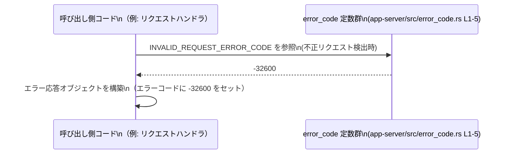

# app-server/src/error_code.rs コード解説

## 0. ざっくり一言

このファイルは、サーバー内で使用するエラーコードを数値および文字列の `const` として定義し、再利用しやすく中央集約しているモジュールです（`app-server/src/error_code.rs:L1-5`）。

---

## 1. このモジュールの役割

### 1.1 概要

- サーバー内で共通して用いるエラーコードを `const` として定義し、**ハードコードされた数値や文字列（マジックナンバー）の散在を防ぐ**役割を持っています（`app-server/src/error_code.rs:L1-5`）。
- 数値のエラーコードは `i64` 型で統一されており、1 つだけ文字列のエラーコード `&str` が定義されています（`app-server/src/error_code.rs:L1-5`）。
- 可視性として、外部クレートには公開せずクレート内に限定するもの（`pub(crate)`）と、クレート外からも利用できるもの（`pub`）が区別されています（`app-server/src/error_code.rs:L1-5`）。

### 1.2 アーキテクチャ内での位置づけ

このファイル自体はエラーコード定数のみを持ち、他モジュールから参照される「定数定義モジュール」として振る舞うと解釈できます（利用元はこのチャンクには現れません）。


> 図は、`error_code` モジュールが他の処理モジュールから参照される「下位ユーティリティ」として使われる典型的な構図を示しています。実際にどのモジュールが参照しているかは、このチャンクからは分かりません。

### 1.3 設計上のポイント

コードから読み取れる特徴は次の通りです。

- **責務の分割**
  - このファイルはエラーコード定義だけに専念しており、ロジックや関数は一切含みません（`app-server/src/error_code.rs:L1-5`）。
- **状態管理**
  - すべて `const` 定数であり、保持されるのは不変の値だけで、ミュータブルな状態は持ちません（`app-server/src/error_code.rs:L1-5`）。
- **エラーハンドリング方針（の一部）**
  - エラーを識別するために「数値コード」と「文字列コード」が使い分けられていることが分かります（`i64` と `&str` の 2 種類、`app-server/src/error_code.rs:L1-5`）。
- **公開範囲の明確化**
  - クレート内に閉じたエラーコード（`pub(crate)`）と、外部 API として公開するエラーコード（`pub`）を分けています（`app-server/src/error_code.rs:L1-5`）。

---

## 2. 主要な機能一覧

このファイルには関数やメソッドはなく、「機能」としては以下の定数定義のみが提供されています。

- `INVALID_REQUEST_ERROR_CODE`: 不正なリクエストを表す数値エラーコードを定義（`app-server/src/error_code.rs:L1`）
- `INVALID_PARAMS_ERROR_CODE`: 不正なパラメータを表す数値エラーコードを定義（`app-server/src/error_code.rs:L2`）
- `INTERNAL_ERROR_CODE`: 内部エラーを表す数値エラーコードを定義（`app-server/src/error_code.rs:L3`）
- `OVERLOADED_ERROR_CODE`: サーバー過負荷状態を表す数値エラーコードを定義（`app-server/src/error_code.rs:L4`）
- `INPUT_TOO_LARGE_ERROR_CODE`: 入力サイズが大きすぎる場合の文字列エラーコードを定義（`app-server/src/error_code.rs:L5`）

名称から上記のような用途が想定されますが、**実際にどの条件でどのコードが使われるかは、このチャンクだけでは分かりません**。

---

## 3. 公開 API と詳細解説

### 3.1 型一覧（構造体・列挙体など）

このファイルには、構造体・列挙体などの「型定義」は存在しません（`app-server/src/error_code.rs:L1-5`）。

代わりに、**定数の一覧**を以下に整理します。

#### 定数一覧（コンポーネントインベントリー）

| 名前 | 種別 | 型 | 可視性 | 定義行 | 役割 / 用途（名前からの推測） |
|------|------|----|--------|--------|------------------------------|
| `INVALID_REQUEST_ERROR_CODE` | 定数 | `i64` | `pub(crate)` | L1 | 「リクエストそのものが不正」であるエラーコード（`app-server/src/error_code.rs:L1`） |
| `INVALID_PARAMS_ERROR_CODE`  | 定数 | `i64` | `pub`        | L2 | 「パラメータが不正」であるエラーコード（`app-server/src/error_code.rs:L2`） |
| `INTERNAL_ERROR_CODE`        | 定数 | `i64` | `pub(crate)` | L3 | 「サーバー内部エラー」を表すエラーコード（`app-server/src/error_code.rs:L3`） |
| `OVERLOADED_ERROR_CODE`      | 定数 | `i64` | `pub(crate)` | L4 | 「サーバー過負荷」状態を表すエラーコード（`app-server/src/error_code.rs:L4`） |
| `INPUT_TOO_LARGE_ERROR_CODE` | 定数 | `&'static str` | `pub` | L5 | 「入力が大きすぎる」ことを表す文字列コード（`app-server/src/error_code.rs:L5`） |

> 「役割 / 用途」は名称と値からの推測であり、実際の利用条件・プロトコル仕様はこのチャンクには現れません。

数値コードはいずれも負の値で、値の組み合わせは JSON-RPC 2.0 で定義されている標準エラーコードと一致していますが、**このファイル内には JSON-RPC という語は登場しないため、プロトコルとして何を採用しているかは断定できません**（`app-server/src/error_code.rs:L1-4`）。

### 3.2 関数詳細（最大 7 件）

このファイルには関数・メソッドが 1 つも定義されていません（`app-server/src/error_code.rs:L1-5`）。  
したがって、関数の詳細解説セクションは対象がありません。

### 3.3 その他の関数

補助的な関数やラッパー関数も存在しません（`app-server/src/error_code.rs:L1-5`）。

---

## 4. データフロー

このファイル自体はデータの変換処理を行いませんが、**典型的な利用シナリオ**として「呼び出し側がエラー発生時に定数を参照し、エラー応答オブジェクトを構築する」流れが想定されます（利用コードはこのチャンクには含まれません）。



> 図は、**どのように定数が参照されるか**の概念図であり、実際のエラー応答型や JSON 生成などの処理はこのチャンクには存在しません。

---

## 5. 使い方（How to Use）

### 5.1 基本的な使用方法

ここでは、外部コードがエラー応答を組み立てる際にこれらの定数を利用する例を示します。  
実際のエラー応答型はこのチャンクに定義されていないため、例として簡易的な構造体を仮定します。

```rust
// 別モジュール側のコード例（概念的なもの）
use crate::error_code::{
    INVALID_PARAMS_ERROR_CODE,          // pub 定数（L2）
    INPUT_TOO_LARGE_ERROR_CODE,         // pub 定数（L5）
}; // app-server/src/error_code.rs:L2,L5 に基づく

// エラー応答を表す簡易構造体の例
struct ErrorResponse {
    code: i64,      // 数値エラーコード
    message: String // メッセージ
}

// パラメータ不正時にエラー応答を返す例
fn invalid_params_error() -> ErrorResponse {
    ErrorResponse {
        code: INVALID_PARAMS_ERROR_CODE,         // L2: -32602 を使用
        message: "invalid params".to_string(),   // 実際のメッセージは仕様に依存
    }
}

// 入力が大きすぎる場合にエラー応答を返す例
fn input_too_large_error() -> String {
    // ここでは JSON 文字列を返す例とする（JSON フォーマットは仮）
    format!(r#"{{"error": "{}"}}"#, INPUT_TOO_LARGE_ERROR_CODE)
    // L5: "input_too_large" を利用
}
```

この例はあくまで利用イメージであり、実際のレスポンス型・フォーマットはこのチャンクからは分かりません。

### 5.2 よくある使用パターン

このファイルの内容から予想できる典型的な使い方は次の通りです。

- **リクエスト検証フェーズ**
  - リクエスト全体の形が仕様を満たさない場合に `INVALID_REQUEST_ERROR_CODE` を使用する（`app-server/src/error_code.rs:L1`）。
- **パラメータ検証フェーズ**
  - 必須フィールド欠如や型不一致などのときに `INVALID_PARAMS_ERROR_CODE` を使用する（`app-server/src/error_code.rs:L2`）。
- **サーバー内部処理フェーズ**
  - ハンドラ内で予期しないエラーが発生した場合に `INTERNAL_ERROR_CODE` を用いる（`app-server/src/error_code.rs:L3`）。
- **負荷制御**
  - 同時処理数などの制限超過時に `OVERLOADED_ERROR_CODE` を返す（`app-server/src/error_code.rs:L4`）。
- **入力サイズ制限**
  - ボディサイズやバッチ件数が閾値を超えた場合に `INPUT_TOO_LARGE_ERROR_CODE` を返す（`app-server/src/error_code.rs:L5`）。

これらは名前からの推測であり、**実際の利用条件・閾値・エラー形式はコード上には現れていません**。

### 5.3 よくある間違い（起こりうる誤用）

このファイルの設計から起こりうる誤用例と、その修正例を挙げます。

```rust
// 誤り例: マジックナンバーを直接書いてしまう
fn build_error_response() -> i64 {
    -32602  // 何のコードかがコードから読み取れない
}

// 正しい利用例: 定数を利用して意味を明示する
use crate::error_code::INVALID_PARAMS_ERROR_CODE; // app-server/src/error_code.rs:L2

fn build_error_response() -> i64 {
    INVALID_PARAMS_ERROR_CODE // 「パラメータ不正」であることが一目で分かる
}
```

別の誤用として、**クレート外から `pub(crate)` な定数にアクセスしようとするケース**が考えられます。

```rust
// クレート外のコード（別 crate）からの誤った利用例
use app_server::error_code::INVALID_REQUEST_ERROR_CODE;
// ↑ INVALID_REQUEST_ERROR_CODE は pub(crate) なので、クレート外からはコンパイルエラーになる（L1）

// クレート外から利用したい場合は、pub な定数（例えば INVALID_PARAMS_ERROR_CODE）を使う必要があります。
```

### 5.4 使用上の注意点（まとめ）

- **可視性の違いに注意**
  - `INVALID_PARAMS_ERROR_CODE` と `INPUT_TOO_LARGE_ERROR_CODE` は `pub` であり、クレート外からも参照可能です（`app-server/src/error_code.rs:L2,L5`）。
  - 他の 3 つは `pub(crate)` のため、同一クレート内からのみ利用できます（`app-server/src/error_code.rs:L1,L3,L4`）。
- **値の変更は慎重に**
  - 数値・文字列の値が外部 API の仕様と結び付いている可能性が高いため、値の変更は互換性に影響する可能性があります（`app-server/src/error_code.rs:L1-5`）。
- **スレッド安全性**
  - すべて `const` であり、読み取り専用かつグローバルに共有されるため、マルチスレッド環境でも競合状態は生じません（Rust の `const` は不変であり、`Sync` を満たします）。

---

## 6. 変更の仕方（How to Modify）

### 6.1 新しい機能を追加する場合（新しいエラーコードの追加）

新しいエラーコードを追加したい場合、基本的には **このファイルに `const` を追加する**形になると考えられます（`app-server/src/error_code.rs:L1-5`）。

ステップの例:

1. **エラーの性質を決める**
   - 例: 「認可エラー」「タイムアウト」など。
2. **数値か文字列かを選ぶ**
   - 他のコードとの整合性のため、既存の形式（`i64` か `&str`）に合わせるのが自然です（`app-server/src/error_code.rs:L1-5`）。
3. **可視性を決める**
   - クレート外にも公開する必要があれば `pub`、クレート内だけでよいなら `pub(crate)` を付与します。
4. **命名規則に合わせて定数を追加する**
   - 既存の命名（すべて大文字＋ `_ERROR_CODE` サフィックス）に合わせると、コードの一貫性が保たれます（`app-server/src/error_code.rs:L1-5`）。

```rust
// 例: 認可エラー用の新しいコードを追加する場合のイメージ
pub const UNAUTHORIZED_ERROR_CODE: i64 = -32002; // ライン番号は追加位置によって変わる
```

この変更を行った場合は、**利用側のコード（ハンドラやサービスなど）にも対応するロジックを追加**する必要がありますが、それらはこのチャンクには含まれません。

### 6.2 既存の機能を変更する場合（既存コードの修正）

既存の定数を変更する際に注意すべき点:

- **影響範囲の確認**
  - どこでその定数が使用されているかを検索し、すべての呼び出し元を確認する必要があります。  
    このファイルだけでは使用箇所は分からないため、プロジェクト全体の検索が前提となります（`app-server/src/error_code.rs:L1-5`）。
- **契約（Contract）の確認**
  - 外部クライアントや他サービスと「このエラーコード値で通信する」という取り決めがある場合、値の変更は互換性を壊す可能性があります。
  - このチャンクには契約内容は書かれていないため、別のドキュメントや仕様書の確認が必要です。
- **テストの更新**
  - エラーコードの値を前提にしたテスト（例: 「-32602 が返ること」）がある場合、値変更に合わせてテストも更新する必要があります。
  - テストコードはこのチャンクには含まれていません。

---

## 7. 関連ファイル

このチャンクから直接分かる関連ファイルはありませんが、論理的に次のようなファイルが存在している可能性があります（**あくまで推測です**）。

| パス | 役割 / 関係 |
|------|------------|
| （不明） | `INVALID_*_ERROR_CODE` などを実際に使用してエラー応答を生成するハンドラやサービス層のコード。場所はこのチャンクからは特定できません。 |
| （不明） | エラーコードの値や意味を説明するドキュメントや仕様書が存在する可能性がありますが、このチャンクには現れません。 |

---

## Bugs / Security / Contracts / Edge Cases / Tests / Performance まとめ

このファイルに関する補足事項を簡潔にまとめます。

- **Bugs**
  - コードは単純な定数定義のみであり、コンパイルエラー・ランタイムエラーの原因となるようなロジックは含まれていません（`app-server/src/error_code.rs:L1-5`）。
- **Security**
  - 直接的なセキュリティリスク（入力処理や認証処理など）は含まれていません。
  - ただし、どのエラーコードを外部に露出させるか（`pub` vs `pub(crate)`）は API の設計・情報露出範囲に影響する点には留意が必要です（`app-server/src/error_code.rs:L1-5`）。
- **Contracts / Edge Cases**
  - このファイルは「値の定義」だけであり、「どの条件でどのコードが使われるか」という契約やエッジケースの扱いは他のコード側に委ねられています。
  - 数値のオーバーフローや文字列の変化といったランタイム上のエッジケースはありません（`const` のため）。
- **Tests**
  - テストコードはこのチャンクには存在しません。
  - 値や公開範囲が重要であれば、「定数の値が期待通りか」「`pub`/`pub(crate)` が意図通りか」を検証する簡易テストを用意することが考えられます（一般論）。
- **Performance / Scalability**
  - `const` 参照は非常に軽量で、パフォーマンス・スケーラビリティへの影響は無視できるレベルです（`app-server/src/error_code.rs:L1-5`）。
  - 多数のスレッドから同時に参照しても競合やロックは発生しません（不変であるため）。

以上が、`app-server/src/error_code.rs` に関して、このチャンクから客観的に読み取れる内容と、その実務上の使い方の整理です。
