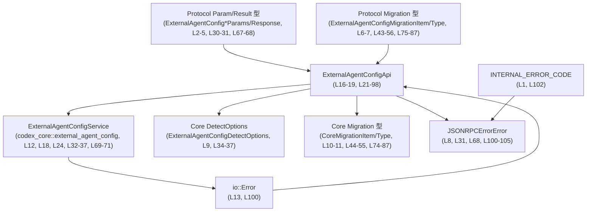
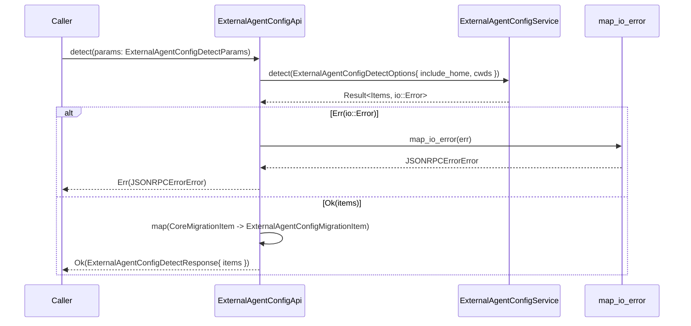
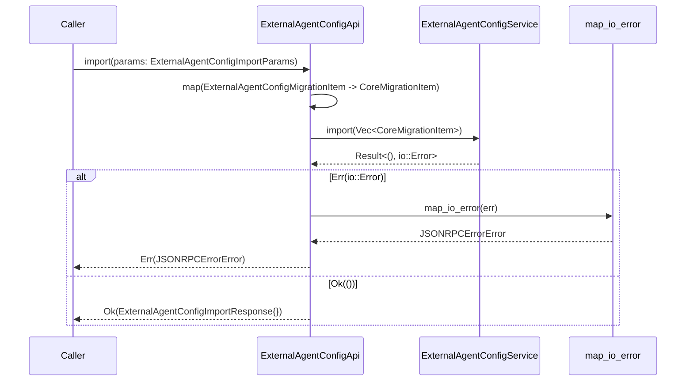
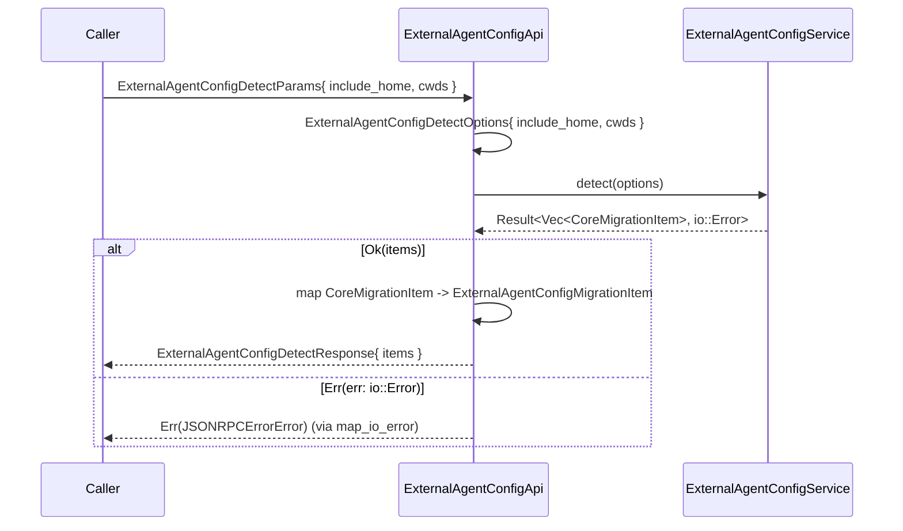
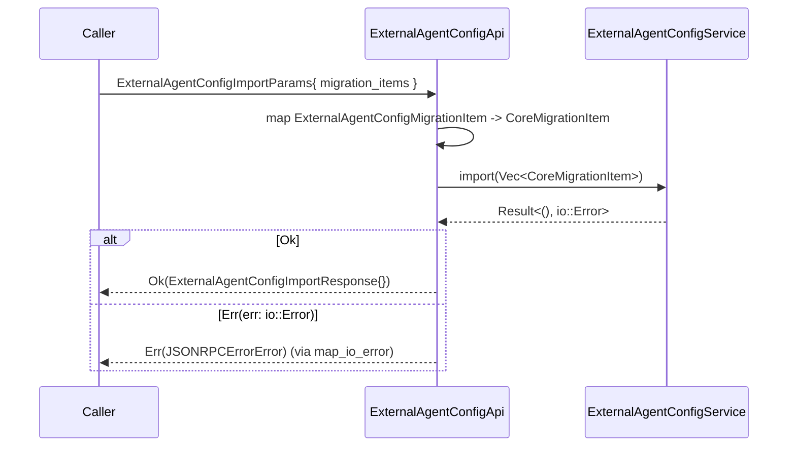

# app-server/src/external_agent_config_api.rs コード解説

## 0. ざっくり一言

`ExternalAgentConfigApi` は、コア層の `ExternalAgentConfigService` をラップし、外部公開用プロトコルの型（JSON-RPC 向けと思われる）との橋渡しを行う非同期 API です（app-server/src/external_agent_config_api.rs:L16-19, L21-23, L28-31, L65-68）。

---

## 1. このモジュールの役割

### 1.1 概要

- このモジュールは、外部エージェント設定（External Agent Config）の **検出（detect）** と **インポート（import）** を行う API を提供します（L28-63, L65-97）。
- コアロジックは `codex_core::external_agent_config::ExternalAgentConfigService` に委譲しつつ、I/O エラーを JSON-RPC 形式のエラー型 `JSONRPCErrorError` に変換します（L12, L32-38, L69-71, L94, L100-105）。
- プロトコル層（`codex_app_server_protocol`）とコア層（`codex_core`）の **型変換（migration item の種別など）** を行うアダプタとして機能します（L6-7, L10-11, L40-62, L72-92）。

### 1.2 アーキテクチャ内での位置づけ

このファイル内の依存関係を簡略化すると、次のようになります。



- `ExternalAgentConfigApi` は、プロトコル層のパラメータ／レスポンス型とコア層のサービス・オプション・マイグレーション型の間に位置する **サービスアダプタ** です（L16-19, L21-98）。
- エラーは `io::Error` から `JSONRPCErrorError` にマッピングされ、共通の `INTERNAL_ERROR_CODE` を付与して返されます（L1, L13, L38, L94, L100-105）。

### 1.3 設計上のポイント

- **責務分割**
  - コアな検出・インポート処理は `ExternalAgentConfigService` に委譲し、このモジュールは **型変換とエラーマッピング** に専念しています（L32-38, L69-71, L40-62, L72-92, L100-105）。
- **状態管理**
  - `ExternalAgentConfigApi` は `ExternalAgentConfigService` を1フィールドとして保持するだけの状態を持ちます（L17-18）。
  - `#[derive(Clone)]` により、API 全体をクローン可能にし、内部のサービスもクローンされます（L16, L17-18）。
- **エラーハンドリング方針**
  - コアサービスからの `io::Error` を `map_err(map_io_error)?` で即座に JSON-RPC 用エラーに変換し、`Result<..., JSONRPCErrorError>` として呼び出し元に返します（L38, L94, L31, L68, L100-105）。
  - すべての I/O エラーは同一の `INTERNAL_ERROR_CODE` でラベル付けされます（L1, L102）。
- **非同期と同期処理**
  - `detect` / `import` は `async fn` として宣言されていますが、内部では同期メソッド `migration_service.detect/import` を直接呼び出しており、`await` は使用していません（L28, L65, L32-38, L69-94）。
  - そのため、これらの関数は「非同期コンテキストで呼び出されるが、中身の処理は同期的に実行される」構造になっています。

---

## 2. 主要な機能一覧

- 外部エージェント設定の検出: 指定された条件に基づき、マイグレーション対象となる設定項目を列挙する（L28-63）。
- 外部エージェント設定のインポート: 指定されたマイグレーション項目をコアサービスに渡し、実際のインポート処理を実行する（L65-97）。
- I/O エラーの JSON-RPC エラー型への変換: `io::Error` を `INTERNAL_ERROR_CODE` を持つ `JSONRPCErrorError` に変換する（L100-105）。

---

## 3. 公開 API と詳細解説

### 3.1 型一覧（構造体・列挙体など）

このモジュール内で定義されている主要な型は次の 1 つです。

| 名前 | 種別 | 行範囲 | 役割 / 用途 |
|------|------|--------|-------------|
| `ExternalAgentConfigApi` | 構造体 | app-server/src/external_agent_config_api.rs:L16-19 | 外部エージェント設定の検出・インポート API。内部で `ExternalAgentConfigService` を保持し、プロトコル型との橋渡しとエラーマッピングを行います。 |

※ 列挙体や追加の構造体定義は、このファイルには存在しません。

### 3.2 関数詳細

#### `ExternalAgentConfigApi::new(codex_home: PathBuf) -> Self`

**概要**

- コアサービス `ExternalAgentConfigService` の新しいインスタンスを生成し、それを内部に保持する `ExternalAgentConfigApi` を構築します（L22-25）。

**引数**

| 引数名 | 型 | 説明 |
|--------|----|------|
| `codex_home` | `PathBuf` | コアサービスに渡されるパス。名前から、Codex のホームディレクトリであることが想定されますが、このチャンクからは用途の詳細は分かりません（L22, L24）。 |

**戻り値**

- `ExternalAgentConfigApi`  
  内部フィールド `migration_service` が `ExternalAgentConfigService::new(codex_home)` で初期化されたインスタンスです（L23-25）。

**内部処理の流れ**

1. `ExternalAgentConfigService::new(codex_home)` を呼び出し、コアサービスのインスタンスを生成します（L24）。
2. 生成したサービスを `migration_service` フィールドに格納し、`ExternalAgentConfigApi` を返します（L23-25）。

**Examples（使用例）**

```rust
use std::path::PathBuf;

// codex_home パスを用意する
let codex_home = PathBuf::from("/path/to/codex_home");

// ExternalAgentConfigApi を初期化する
let api = ExternalAgentConfigApi::new(codex_home); // L22-25

// 以降、api.detect(...), api.import(...) を呼び出せる
```

※ モジュールパスや具体的な `codex_home` の場所は、このチャンクには現れないため例では仮の値を置いています。

**Errors / Panics**

- この関数自身は `Result` を返しておらず、関数本体にも明示的な panic 呼び出しはありません（L22-26）。
- ただし内部で呼び出している `ExternalAgentConfigService::new` の挙動はこのファイルにはないため、そこから panic が発生するかどうかは不明です（L24）。

**Edge cases（エッジケース）**

- `codex_home` が存在しないパス、読み取り権限のないパスなどの場合の挙動は、このチャンクからは分かりません（`ExternalAgentConfigService::new` の実装に依存します）。
- `codex_home` が相対パスか絶対パスかによる違いも、このファイルからは判別できません。

**使用上の注意点**

- エラー情報が `Result` として返ってこないため、`ExternalAgentConfigService::new` の初期化時エラーがどう扱われるかは別途確認が必要です（L24）。
- `ExternalAgentConfigApi` は `Clone` 可能なため、複数箇所で共有して使う場合は、内部サービスがどういう状態を持つかを考慮する必要があります（L16, L17-18）。

---

#### `ExternalAgentConfigApi::detect(&self, params: ExternalAgentConfigDetectParams) -> Result<ExternalAgentConfigDetectResponse, JSONRPCErrorError>`

（非同期関数：`async fn`、L28-31）

**概要**

- 外部エージェント設定の「検出」を行う API です。  
  コアサービスから返されたマイグレーション項目（コア型）を、プロトコル定義のレスポンス型に変換して返します（L32-38, L40-62）。

**引数**

| 引数名 | 型 | 説明 |
|--------|----|------|
| `&self` | `&ExternalAgentConfigApi` | 内部の `migration_service` にアクセスするための参照。ミュータブルではなく共有参照です（L28-32）。 |
| `params` | `ExternalAgentConfigDetectParams` | 検出条件を表すパラメータ。`include_home` フィールドと `cwds` フィールドが存在することが、この関数内から読み取れます（L35-36）。 |

**戻り値**

- `Result<ExternalAgentConfigDetectResponse, JSONRPCErrorError>`  
  - `Ok(ExternalAgentConfigDetectResponse)` の場合: 検出されたマイグレーション項目の一覧が `items` フィールドに格納されています（L40-62）。
  - `Err(JSONRPCErrorError)` の場合: コアサービス呼び出し時の `io::Error` が `INTERNAL_ERROR_CODE` 付きの JSON-RPC エラーへ変換されたものです（L38, L100-105）。

**内部処理の流れ（アルゴリズム）**

1. `ExternalAgentConfigDetectOptions` を構築し、`include_home` と `cwds` を `params` からコピーします（L34-37）。
2. 内部の `migration_service.detect` に上記オプションを渡して実行します（L32-37）。
3. `detect` が `io::Error` で失敗した場合、`map_err(map_io_error)?` により `JSONRPCErrorError` に変換され、そのまま `Err` として呼び出し元に返されます（L38, L100-105）。
4. 成功時には、`Vec<CoreMigrationItem>` のようなコア側のマイグレーション項目リストが `items` に入っていると読めます（具体型はこのチャンク外ですが、`into_iter()` されていることからイテレータ可能なコレクションであることが分かります, L41-42）。
5. 各 `migration_item` について以下を行います（L43-60）:
   - `CoreMigrationItemType` を `ExternalAgentConfigMigrationItemType` に 1:1 で対応させる `match` を行い、`item_type` を変換します（L44-56）。
   - `description` と `cwd` をそのままコピーします（L58-59）。
6. 変換結果を `collect()` し、`ExternalAgentConfigDetectResponse { items: ... }` として `Ok` で返します（L41-42, L60-62）。

**処理フロー図**



**Examples（使用例）**

この関数を用いて検出結果を取得する最低限の例です。  
パラメータの詳細な型はこのチャンクには現れないため、コメントで示しています。

```rust
// 非同期コンテキスト内での使用例
async fn run_detect(api: &ExternalAgentConfigApi) -> Result<(), JSONRPCErrorError> {
    // detect 用パラメータ（実際のフィールド型はこのチャンク外）
    let params = ExternalAgentConfigDetectParams {
        include_home: true, // L35 で参照されているフィールド
        cwds: vec![
            /* 適切な型のカレントディレクトリ情報 */
        ], // L36
    };

    let resp = api.detect(params).await?; // L28-31

    for item in resp.items {
        // item.item_type は ExternalAgentConfigMigrationItemType（L43-56）
        // item.description, item.cwd も利用可能（L58-59）
        println!("type: {:?}, cwd: {:?}", item.item_type, item.cwd);
    }

    Ok(())
}
```

**Errors / Panics**

- `ExternalAgentConfigService::detect` が `io::Error` を返した場合:
  - `map_err(map_io_error)?` によって `JSONRPCErrorError` へ変換され、`Err` として呼び出し元に伝播します（L38, L100-105）。
  - エラーコードは常に `INTERNAL_ERROR_CODE` になります（L1, L102）。
- `detect` 関数内には明示的な `panic!` 呼び出しはなく、エラーはすべて `Result` 経由で処理されています（L28-63）。
- `match migration_item.item_type` は全てのバリアント（Config, Skills, AgentsMd, McpServerConfig）を列挙しており、デフォルトケース `_` は存在しないため、現時点では網羅的です（L44-56）。新しいバリアントが追加された場合はコンパイルエラーで検知されます。

**Edge cases（エッジケース）**

- `params.cwds` が空の場合:  
  - `ExternalAgentConfigDetectOptions` に空の `cwds` が渡されますが、その扱いはコアサービスに依存し、このチャンクからは分かりません（L34-37）。
- `params.include_home` が `false` の場合:  
  - ホームディレクトリを含めるかどうかの挙動もコア側に依存し、このチャンクだけでは詳細は不明です（L35）。
- 検出結果 `items` が空の場合:  
  - `items.into_iter().map(...).collect()` により、空の `Vec` が `ExternalAgentConfigDetectResponse.items` に入るだけで、エラーにはなりません（L41-42, L60-62）。
- 各 `migration_item.description` や `cwd` に null や不正な形式が入りうるかどうかは、このチャンクからは分かりませんが、単純なフィールドコピーのみ行っています（L58-59）。

**使用上の注意点**

- **非同期コンテキスト**  
  - 関数シグネチャは `async fn` であるため、呼び出し側は `.await` が必要です（L28）。  
  - 関数内部に `await` は含まれておらず、`migration_service.detect` が同期処理である可能性があります（L32-38）。もしそれがブロッキング I/O を含む場合、非同期ランタイムのスレッドをブロックする可能性がある点に注意が必要です。
- **エラー情報の扱い**  
  - `map_io_error` で `err.to_string()` をメッセージとしてそのまま返しているため、OS 依存のファイルパスや詳細な I/O エラー情報がクライアントへ露出する可能性があります（L103）。  
    セキュリティ・情報漏えいの観点から、この仕様が意図されたものか確認すべき箇所です。
- **型の変換の整合性**  
  - 新たな `CoreMigrationItemType` または `ExternalAgentConfigMigrationItemType` のバリアントを追加する場合、`detect` の `match` にも対応を追加する必要があります（L44-56）。

---

#### `ExternalAgentConfigApi::import(&self, params: ExternalAgentConfigImportParams) -> Result<ExternalAgentConfigImportResponse, JSONRPCErrorError>`

（非同期関数：`async fn`、L65-68）

**概要**

- 検出された外部エージェント設定のマイグレーション項目をコアサービスへ渡し、「インポート」処理を実行させる API です（L69-94）。
- プロトコル層のマイグレーション型をコア層のマイグレーション型に変換し、そのリストを `migration_service.import` に渡します（L72-92）。

**引数**

| 引数名 | 型 | 説明 |
|--------|----|------|
| `&self` | `&ExternalAgentConfigApi` | 内部の `migration_service` にアクセスするための共有参照です（L65-69）。 |
| `params` | `ExternalAgentConfigImportParams` | インポート対象のマイグレーション項目を含むパラメータ。`migration_items` フィールドが存在することが、この関数から分かります（L72-73）。 |

**戻り値**

- `Result<ExternalAgentConfigImportResponse, JSONRPCErrorError>`  
  - 成功時: 空の構造体 `ExternalAgentConfigImportResponse {}` が返されます（L96）。
  - 失敗時: `JSONRPCErrorError` が返されます。`migration_service.import` からの `io::Error` を `map_io_error` で変換したものです（L94, L100-105）。

**内部処理の流れ（アルゴリズム）**

1. `params.migration_items` を `into_iter()` でイテレートし、各要素（プロトコル側の `ExternalAgentConfigMigrationItem`）をコア側の `CoreMigrationItem` に変換します（L72-75, L88-91）。
2. `item_type` は `ExternalAgentConfigMigrationItemType` から `CoreMigrationItemType` への 1:1 対応の `match` で変換します（L75-87）。
3. `description` と `cwd` はそのままコピーします（L89-90）。
4. 変換された `CoreMigrationItem` のコレクションを `migration_service.import(...)` に渡して呼び出します（L69-71, L72-93）。
5. `import` が `io::Error` を返した場合、`map_err(map_io_error)?` により `JSONRPCErrorError` に変換され、そのまま `Err` として伝播されます（L94, L100-105）。
6. 成功時には `Ok(ExternalAgentConfigImportResponse {})` を返します（L96）。

**処理フロー図**



**Examples（使用例）**

検出結果から選択した項目をインポートすることを想定した例です。  
プロトコル型の詳細はこのチャンクにないため、構造体リテラルはコメントを交えて記述します。

```rust
async fn run_import(api: &ExternalAgentConfigApi) -> Result<(), JSONRPCErrorError> {
    // 仮のマイグレーション項目
    let items = vec![
        ExternalAgentConfigMigrationItem {
            item_type: ExternalAgentConfigMigrationItemType::Config, // L75-77
            description: "Import main config".to_string(),           // L89
            cwd: /* 適切な型のカレントディレクトリ */,               // L90
        },
        // 必要に応じて他の項目も追加
    ];

    let params = ExternalAgentConfigImportParams {
        migration_items: items, // L72-73
    };

    // import を実行
    api.import(params).await?; // L65-68

    Ok(())
}
```

**Errors / Panics**

- `migration_service.import` が `io::Error` を返した場合:
  - `map_err(map_io_error)?` により `JSONRPCErrorError` に変換されます（L94, L100-105）。
  - エラーコードは常に `INTERNAL_ERROR_CODE` です（L1, L102）。
- 関数本体内に明示的な `panic!` 呼び出しはありません（L65-97）。
- `match migration_item.item_type` で扱っているバリアントは `Config`, `Skills`, `AgentsMd`, `McpServerConfig` の 4 つで、デフォルト分岐 `_` は存在せず、現時点では網羅的です（L75-87）。

**Edge cases（エッジケース）**

- `params.migration_items` が空のベクタの場合:
  - `params.migration_items.into_iter().map(...).collect()` により空のコレクションが `import` に渡されます（L72-93）。
  - 空の入力に対するコアサービス側の挙動はこのファイルからは不明ですが、この関数内で特別な分岐は行っていません。
- `migration_items` 内で `description` や `cwd` が空文字列・ルートディレクトリなど特別な値をとる場合も、ここでは検証せずそのまま渡します（L89-90）。
- `migration_items` に重複項目が含まれている場合の扱いもコアサービスに依存します。

**使用上の注意点**

- **非同期コンテキスト**  
  - `async fn` のため呼び出しには `.await` が必要であり（L65）、内部処理は同期的に `migration_service.import` を呼び出している点は `detect` と同様です（L69-94）。
- **型対応の維持**  
  - プロトコル側 `ExternalAgentConfigMigrationItemType` とコア側 `CoreMigrationItemType` の対応は `match` で明示されているため、新しい種別が追加された場合はこの `match` を更新する必要があります（L75-87）。
- **セキュリティ/権限**  
  - 実際のインポート処理（ファイル操作など）は `ExternalAgentConfigService::import` によって行われると推測されますが、このチャンクからは内容が分かりません（L69-71）。  
    権限チェックやパス検証がどこで行われるかを確認する必要があります。

---

#### `map_io_error(err: io::Error) -> JSONRPCErrorError`

（L100-105）

**概要**

- 標準ライブラリの `io::Error` を、JSON-RPC プロトコル用のエラー型 `JSONRPCErrorError` に変換するユーティリティ関数です。
- エラーコードには一律 `INTERNAL_ERROR_CODE` が設定されます（L1, L102）。

**引数**

| 引数名 | 型 | 説明 |
|--------|----|------|
| `err` | `io::Error` | コアサービスから返された I/O エラー（L100）。 |

**戻り値**

- `JSONRPCErrorError`  
  - `code`: `INTERNAL_ERROR_CODE`（L102）。  
  - `message`: `err.to_string()` によるエラーメッセージ文字列（L103）。  
  - `data`: `None`（追加のエラー情報は付与されません, L104）。

**内部処理の流れ**

1. `JSONRPCErrorError` 構造体リテラルを生成します（L101-105）。
2. `code` フィールドに `INTERNAL_ERROR_CODE` を設定します（L102）。
3. `message` に `err.to_string()` の結果を設定します（L103）。
4. `data` に `None` を設定します（L104）。
5. 生成した `JSONRPCErrorError` を返します（L101-105）。

**Examples（使用例）**

`detect` / `import` で `map_err(map_io_error)` として使用されている例がこのファイルに含まれます（L38, L94）。

単体利用のイメージ:

```rust
use std::io;

fn example() -> JSONRPCErrorError {
    // 仮の io::Error を生成
    let err = io::Error::new(io::ErrorKind::Other, "something went wrong");

    // JSONRPCErrorError に変換
    let rpc_error = map_io_error(err); // L100-105

    rpc_error
}
```

**Errors / Panics**

- 関数内部で panic を引き起こす処理はなく、`err.to_string()` も通常はパニックしません（L100-105）。
- したがって、この関数は引数さえ受け取れれば常に正常に `JSONRPCErrorError` を返します。

**Edge cases（エッジケース）**

- `err` のメッセージが空文字列の場合でも、そのまま `message` として使われます（L103）。
- `err.to_string()` が環境依存の文字列（ロケール・OS・ファイルパスなど）を含む可能性があります。

**使用上の注意点**

- すべての `io::Error` に対して同一の `INTERNAL_ERROR_CODE` を使用するため、クライアント側からはエラーの種類をコードで区別しにくくなります（L1, L102）。
- `message` に OS 由来のエラーメッセージがそのまま載るため、ファイルパスなど内部情報が露出しうる点には注意が必要です（L103）。必要に応じてメッセージをマスクしたり、ログ側にのみ詳細を残す設計も検討対象となります。

---

### 3.3 その他の関数

- 上記以外の補助関数やラッパー関数は、このファイルには存在しません。

---

## 4. データフロー

ここでは代表的な「検出 → インポート」のフローにおけるデータの流れを整理します。

### 4.1 検出フロー（detect）

`detect` 実行時のデータフローは以下のようになります。



- 入力: `ExternalAgentConfigDetectParams`（L28-31）。
- コアサービス入力: `ExternalAgentConfigDetectOptions`（L34-37）。
- コアサービス出力: `items: Result<_, io::Error>`（L32-38）。
- API 出力: `Result<ExternalAgentConfigDetectResponse, JSONRPCErrorError>`（L40-62）。

### 4.2 インポートフロー（import）

検出された項目をインポートする際のデータフローです。



- 入力: `ExternalAgentConfigImportParams`（L65-68, L72-73）。
- コアサービス入力: `Vec<CoreMigrationItem>`（L74-92）。
- コアサービス出力: `Result<_, io::Error>`（L69-71, L94）。
- API 出力: `Result<ExternalAgentConfigImportResponse, JSONRPCErrorError>`（L65-68, L96）。

---

## 5. 使い方（How to Use）

### 5.1 基本的な使用方法

モジュール全体としての典型的な利用フローは次のようになります。

1. `ExternalAgentConfigApi::new` で API インスタンスを作成する（L22-25）。
2. `detect` でマイグレーション対象を検出する（L28-63）。
3. 検出結果から必要な項目を選択し、`import` でインポートする（L65-97）。

```rust
use std::path::PathBuf;

// 非同期コンテキストを前提とした例
async fn migrate_external_agent_configs() -> Result<(), JSONRPCErrorError> {
    // 1. API の初期化
    let codex_home = PathBuf::from("/path/to/codex_home");
    let api = ExternalAgentConfigApi::new(codex_home); // L22-25

    // 2. 検出
    let detect_params = ExternalAgentConfigDetectParams {
        include_home: true,    // L35
        cwds: vec![/* ... */], // L36
    };
    let detect_resp = api.detect(detect_params).await?; // L28-31

    // 3. 必要な項目だけを選別（ここでは単純に全件）
    let migration_items = detect_resp.items;

    let import_params = ExternalAgentConfigImportParams {
        migration_items, // L72-73
    };

    // 4. インポート
    api.import(import_params).await?; // L65-68

    Ok(())
}
```

### 5.2 よくある使用パターン

- **検出のみ行い、実際のインポートは別プロセス・別タイミングで行う**
  - `detect` のレスポンス `items` を別途シリアライズ・保存し、後で `import` の `migration_items` として再利用するパターンが考えられます。
- **条件付きのインポート**
  - `detect` 結果の各 `ExternalAgentConfigMigrationItem` を見て、`item_type` や `cwd` に応じてフィルタしてから `import` に渡すパターン。

```rust
async fn import_only_config(api: &ExternalAgentConfigApi) -> Result<(), JSONRPCErrorError> {
    let params = ExternalAgentConfigDetectParams {
        include_home: true,
        cwds: vec![/* ... */],
    };
    let resp = api.detect(params).await?;

    // Config タイプのみ選択
    let selected: Vec<_> = resp
        .items
        .into_iter()
        .filter(|item| item.item_type == ExternalAgentConfigMigrationItemType::Config)
        .collect();

    let import_params = ExternalAgentConfigImportParams {
        migration_items: selected,
    };

    api.import(import_params).await?;
    Ok(())
}
```

### 5.3 よくある間違い

```rust
// 間違い例: async コンテキスト外で .await を使わずに呼び出す
fn wrong_usage(api: &ExternalAgentConfigApi, params: ExternalAgentConfigDetectParams) {
    // コンパイルエラー: async fn detect の返り値は Future なので .await が必要
    // let resp = api.detect(params);
}

// 正しい例: async 関数の中で .await を使う
async fn correct_usage(api: &ExternalAgentConfigApi, params: ExternalAgentConfigDetectParams)
    -> Result<(), JSONRPCErrorError>
{
    let resp = api.detect(params).await?; // L28-31
    println!("items = {}", resp.items.len());
    Ok(())
}
```

```rust
// 間違い例: 型変換ロジックを呼び出し元で重複実装する
// （detect/import は既に Core 型と Protocol 型の変換を行っている）
async fn wrong_manual_mapping(api: &ExternalAgentConfigApi, core_items: Vec<CoreMigrationItem>) {
    // ここで CoreMigrationItem -> ExternalAgentConfigMigrationItem を手書きするのは重複
}

// 正しい例: detect の返却値をそのまま使う
async fn correct_use_detect(api: &ExternalAgentConfigApi) -> Result<(), JSONRPCErrorError> {
    let params = /* ... */;
    let resp = api.detect(params).await?;
    // resp.items をそのまま UI などに渡す
    Ok(())
}
```

### 5.4 使用上の注意点（まとめ）

- **前提条件**
  - `detect` / `import` は `async fn` であるため、非同期ランタイム（Tokio など）の中から `.await` 付きで呼び出す前提になっています（L28, L65）。
  - `ExternalAgentConfigApi::new` に渡す `codex_home` は、`ExternalAgentConfigService` が期待する形式のパスである必要があります（詳細はこのチャンクには現れません, L22-25）。
- **エラーハンドリング**
  - すべての I/O エラーは `JSONRPCErrorError` に変換され、コードは一律 `INTERNAL_ERROR_CODE` です（L38, L94, L100-103）。
  - 呼び出し側は `.await?` などで `Result` を伝播させるか、`match` で `Err` を明示的に処理することが必要です。
- **性能面の注意**
  - `detect` / `import` 内部では `ExternalAgentConfigService` のメソッドが同期的に呼び出されており、関数内に `await` はありません（L32-38, L69-94）。
  - もし `ExternalAgentConfigService` がブロッキング I/O を行う実装である場合、これらの async 関数を高頻度で呼び出すと、非同期ランタイムのワーカースレッドがブロックされる可能性があります。
- **セキュリティ観点（Bugs/Security）**
  - `map_io_error` は `err.to_string()` をそのままクライアントへ返すため、環境によっては内部パスやシステム情報が露出するリスクがあります（L103）。
  - エラーコードがすべて `INTERNAL_ERROR_CODE` であるため、クライアントからはエラーの種類を区別しづらく、エラー分類をコード側で行うことはできません（L1, L102）。
- **テスト観点**
  - このファイル内にテストコードは含まれていません。
  - テストとしては、次のような観点が考えられます（コードから推奨できる範囲）:
    - `CoreMigrationItemType` と `ExternalAgentConfigMigrationItemType` のマッピングが 1:1 であることの確認（L44-56, L75-87）。
    - `io::Error` から `JSONRPCErrorError` への変換が期待どおりであること（コードとメッセージ、data が None であること, L100-105）。
    - 空の `cwds` / `migration_items` 入力時にパニックせず動作すること（L34-37, L72-93）。

---

## 6. 変更の仕方（How to Modify）

### 6.1 新しい機能を追加する場合

このモジュールに機能を追加する際の典型的なパターンを整理します。

1. **新しい API メソッドを追加する場所**
   - `impl ExternalAgentConfigApi` ブロック内に新しい `pub(crate) async fn` などを追加します（L21-98）。
2. **コアサービスへの委譲**
   - 既存の `detect` / `import` と同様、コア層の `ExternalAgentConfigService` に処理を委譲するメソッドを設計すると整合性が取れます（L32-38, L69-71）。
3. **プロトコル型との変換**
   - 新しい API がプロトコル層の型を扱う場合、`codex_app_server_protocol` の型と `codex_core::external_agent_config` の型との間で必要なマッピングを、このモジュール内で行うのが一貫した構造になります（L6-7, L10-11, L40-62, L72-92）。
4. **エラーハンドリング**
   - I/O やコアサービスで発生しうるエラーは、既存と同様に `map_err(map_io_error)?` で `JSONRPCErrorError` に変換して返す設計を踏襲すると、クライアント側の扱いを共通化できます（L38, L94, L100-105）。

### 6.2 既存の機能を変更する場合

- **マイグレーション種別の追加**
  - `CoreMigrationItemType` や `ExternalAgentConfigMigrationItemType` に新しいバリアントを追加する場合:
    - `detect` 内の `match migration_item.item_type`（L44-56）と、
    - `import` 内の `match migration_item.item_type`（L75-87）
    の両方に対応分岐を追加する必要があります。
- **エラーコードポリシーの変更**
  - I/O エラーの分類を細かく行いたい場合は、`map_io_error` を修正し、`err.kind()` などに応じて `code` や `data` を変えるべき場所です（L100-105）。
  - それに伴い、`detect` / `import` の `map_err(map_io_error)` の使用箇所（L38, L94）は変更点の影響を受けます。
- **性能・非同期性の改善**
  - `ExternalAgentConfigService::detect` / `import` がブロッキング I/O である場合、非同期版のサービスメソッドを用意し、`await` を使って呼び出すことで、非同期ランタイムのブロッキングを避けることができます（既存コードには `await` がない点に注意, L32-38, L69-94）。
- **Observability（観測性）**
  - このモジュール内にはロギングやメトリクス送出は記述されていません。
  - エラーや重要な処理（インポート実行など）に対してログを追加する場合は、`detect` / `import` 内のコアサービス呼び出し前後が挿入ポイントになります（L32-38, L69-94）。

---

## 7. 関連ファイル・モジュール

このモジュールと密接に関係する外部モジュール・型をまとめます。

| パス / モジュール | 役割 / 関係 |
|-------------------|------------|
| `crate::error_code::INTERNAL_ERROR_CODE` | JSON-RPC エラーに使用する内部エラーコード定数。`map_io_error` を通じて、すべての I/O エラーに適用されます（L1, L102）。 |
| `codex_app_server_protocol::ExternalAgentConfigDetectParams` | `detect` の入力パラメータ。`include_home` と `cwds` フィールドが使用されています（L2, L30, L35-36）。 |
| `codex_app_server_protocol::ExternalAgentConfigDetectResponse` | `detect` のレスポンス型。`items` フィールドにマイグレーション項目のリストが格納されます（L3, L40-62）。 |
| `codex_app_server_protocol::ExternalAgentConfigImportParams` | `import` の入力パラメータ。`migration_items` フィールドが使用されています（L4, L67, L72-73）。 |
| `codex_app_server_protocol::ExternalAgentConfigImportResponse` | `import` のレスポンス型。成功時に空の構造体インスタンスが返されます（L5, L68, L96）。 |
| `codex_app_server_protocol::ExternalAgentConfigMigrationItem` / `ExternalAgentConfigMigrationItemType` | プロトコル層のマイグレーション項目およびその種別。`detect` の出力と `import` の入力で使用されています（L6-7, L43-56, L75-87, L89-90）。 |
| `codex_app_server_protocol::JSONRPCErrorError` | JSON-RPC 用のエラー型。`detect` / `import` と `map_io_error` のエラー型として利用されています（L8, L31, L68, L100-105）。 |
| `codex_core::external_agent_config::ExternalAgentConfigService` | 外部エージェント設定の検出・インポートのコアロジックを提供するサービス。`ExternalAgentConfigApi` が内部に保持し、`detect` / `import` で使用します（L12, L18, L24, L32-37, L69-71）。 |
| `codex_core::external_agent_config::ExternalAgentConfigDetectOptions` | `detect` 呼び出し時に渡されるオプション型。`include_home` と `cwds` が設定されています（L9, L34-37）。 |
| `codex_core::external_agent_config::ExternalAgentConfigMigrationItem` / `ExternalAgentConfigMigrationItemType`（別名 `CoreMigrationItem` / `CoreMigrationItemType`） | コア層のマイグレーション項目とその種別。プロトコル型との間の相互変換で利用されています（L10-11, L44-55, L74-87）。 |

このチャンクにはテストコードや、`ExternalAgentConfigService` およびプロトコル型の実装詳細は含まれていないため、それらの挙動についてはここでは「不明」となります。
