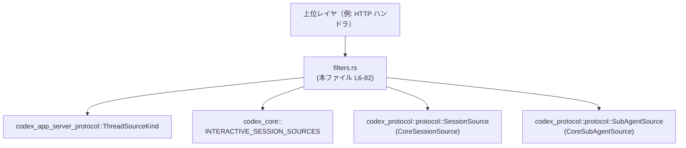
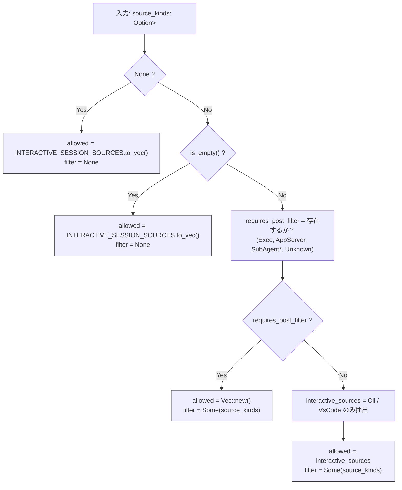

# app-server/src/filters.rs コード解説

## 0. ざっくり一言

- スレッドの「ソース種別」フィルタ（`ThreadSourceKind`）から、コアプロトコル側の `SessionSource` フィルタを計算し、必要に応じて追加のポストフィルタリングに使うためのヘルパー関数をまとめたモジュールです（`compute_source_filters`, `source_kind_matches`）（filters.rs:L6-82）。

---

## 1. このモジュールの役割

### 1.1 概要

- このモジュールは、**スレッドの発生源（CLI, VSCode, SubAgent など）でセッションをフィルタリングしたい**という問題を解決するために存在し、次の機能を提供します。
  - アプリケーション層の列挙型 `ThreadSourceKind` から、コア層の `SessionSource` に対応するフィルタ条件を計算する（filters.rs:L6-51）。
  - 実際の `SessionSource` が、与えられた `ThreadSourceKind` フィルタ配列と一致するかどうかを判定する（filters.rs:L53-82）。

### 1.2 アーキテクチャ内での位置づけ

このモジュールは、**app-server プロトコル層とコアプロトコル層のあいだの変換・フィルタロジック**を担います。

- 入力側:
  - `codex_app_server_protocol::ThreadSourceKind`（filters.rs:L1）
- コア側:
  - `codex_core::INTERACTIVE_SESSION_SOURCES`（通常の対話的ソースの集合）（filters.rs:L2,10,14）
  - `codex_protocol::protocol::SessionSource`（別名 `CoreSessionSource`）（filters.rs:L3,37-38,55-59,132-133）
  - `codex_protocol::protocol::SubAgentSource`（別名 `CoreSubAgentSource`）（filters.rs:L4,63-64,69-70,74-75,78-79,133-139）

主要な依存関係は次のようになります。



> 図: filters.rs (L6-82) の位置づけ。app-server 側の種別をコア側のセッションソースに橋渡しします。

### 1.3 設計上のポイント

- **純粋関数のみ**  
  - グローバルな可変状態は持たず、入力引数だけから結果を計算する純粋関数になっています（filters.rs:L6-51,53-82）。
- **事前フィルタ / ポストフィルタの二段構成**  
  - `compute_source_filters` は、まず `CoreSessionSource` ベースの事前フィルタ（DB クエリなどに使える）を返し、サブエージェントなど細かい種別向けに `ThreadSourceKind` 配列をそのまま「ポストフィルタ条件」として返します（filters.rs:L17-33,34-50）。
- **Option と空ベクタの扱いを明示**  
  - フィルタが指定されない場合（`None`）や空配列の場合は、`INTERACTIVE_SESSION_SOURCES` をデフォルトとして使用するという明確なポリシーがコード化されています（filters.rs:L9-15）。
- **エラーではなくデフォルト/ブールで表現**  
  - 想定外の入力に対して `Result` によるエラーではなく、`Option`・`Vec`・`bool` の値の組み合わせで挙動を表現しています。
- **並行性**  
  - すべての処理はローカル変数とイミュータブルな定数（`INTERACTIVE_SESSION_SOURCES`）に対する読み取りのみで構成され、`unsafe` やスレッド共有状態はありません（filters.rs 全体）。

---

## 2. 主要な機能一覧

- `compute_source_filters`: `Option<Vec<ThreadSourceKind>>` から、事前フィルタ用の `Vec<CoreSessionSource>` と、ポストフィルタ用の `Option<Vec<ThreadSourceKind>>` を計算します（filters.rs:L6-51）。
- `source_kind_matches`: 単一の `CoreSessionSource` が、`ThreadSourceKind` の配列のいずれかと一致するかを判定します（filters.rs:L53-82）。
- テスト群（`mod tests`）:
  - デフォルト挙動（フィルタ無し/空）の確認（filters.rs:L91-105）。
  - 対話的ソースのみ指定時の挙動確認（filters.rs:L107-117）。
  - SubAgent 系種別を含む場合にポストフィルタが必要になることの確認（filters.rs:L119-126）。
  - SubAgent のバリアントごとのマッチ判定の差異確認（filters.rs:L128-157）。

---

## 3. 公開 API と詳細解説

※ ここでの「公開」は crate 内公開（`pub(crate)`）を指します。

### 3.1 型一覧（構造体・列挙体など）

このファイル自身は新しい型を定義しませんが、API に関わる重要な外部型・定数を整理します。

| 名前 | 種別 | 定義場所/由来 | 役割 / 用途 | 使用箇所 |
|------|------|---------------|-------------|----------|
| `ThreadSourceKind` | 列挙体（外部） | `codex_app_server_protocol::ThreadSourceKind`（filters.rs:L1） | app-server レベルでのスレッド発生源の種別（Cli, VsCode, Exec, SubAgent* など）を表します。`compute_source_filters` の入力と、`source_kind_matches` のフィルタ条件に使われます。 | filters.rs:L6-8,17-27,36-46,54-81,109-110,121,143-155 |
| `CoreSessionSource` | 列挙体（外部） | `codex_protocol::protocol::SessionSource`（filters.rs:L3） | コアプロトコル側でのセッション発生源の種別。Cli, VSCode, Exec, Mcp, SubAgent(...) などを表します。 | filters.rs:L37-38,55-59,63-64,69-70,74-75,78-79,112-115,132-133 |
| `CoreSubAgentSource` | 列挙体（外部） | `codex_protocol::protocol::SubAgentSource`（filters.rs:L4） | SubAgent セッションの詳細な種別（Review, Compact, ThreadSpawn, Other）を表します。 | filters.rs:L63-64,69-70,74-75,78-79,133-139 |
| `INTERACTIVE_SESSION_SOURCES` | 定数（外部） | `codex_core::INTERACTIVE_SESSION_SOURCES`（filters.rs:L2） | 対話的なセッションソース（Cli, VSCode など）のデフォルト集合。フィルタ未指定または空指定時に使用します。 | filters.rs:L10,14,95,103 |

テスト専用ですが、次の型も利用されています:

| 名前 | 種別 | 役割 / 用途 | 使用箇所 |
|------|------|-------------|----------|
| `ThreadId` | 構造体（外部） | SubAgent の ThreadSpawn で親スレッド ID を作るために使用（テスト用）。 | filters.rs:L87,130-131 |
| `Uuid` | 構造体（外部） | ランダムな UUID から `ThreadId` を生成（テスト用）。 | filters.rs:L89,130-131 |

### 3.2 関数詳細

#### `compute_source_filters(source_kinds: Option<Vec<ThreadSourceKind>>) -> (Vec<CoreSessionSource>, Option<Vec<ThreadSourceKind>>)`

**定義**

- 場所: filters.rs:L6-51

**概要**

- アプリケーション層から渡された `ThreadSourceKind` のオプション値を元に、
  - コア層の `CoreSessionSource` で表現された「事前フィルタ用」のソース一覧、
  - および「ポストフィルタ用」の `ThreadSourceKind` 配列（または `None`）
  の 2 つを計算して返します。
- SubAgent など、`CoreSessionSource` だけでは表現しきれない細かい条件が含まれる場合は、事前フィルタを空にし、後段で `source_kind_matches` による詳細フィルタを行う前提の結果を返します（filters.rs:L17-33）。

**引数**

| 引数名 | 型 | 説明 |
|--------|----|------|
| `source_kinds` | `Option<Vec<ThreadSourceKind>>` | フィルタ対象とするスレッドソース種別の一覧。`None` は「フィルタ指定なし」、`Some(vec)` で vec が空の場合は「空指定（=フィルタ無しと同等）」として扱われます（filters.rs:L6-8,9-15）。 |

**戻り値**

戻り値は 2 要素のタプルです。

1. `Vec<CoreSessionSource>`（事前フィルタ用）
   - DB やストレージに対するクエリで、`SessionSource` のフィールドに対して直接使えるフィルタ条件です。
   - SubAgent 系や Unknown などが含まれて「ポストフィルタが必要」と判断された場合は空ベクタになります（filters.rs:L31-33）。
2. `Option<Vec<ThreadSourceKind>>`（ポストフィルタ用）
   - `Some(vec)` の場合: 呼び出し元が `source_kind_matches` を用いて、個々のセッションソースと `vec` のいずれかが一致するかどうかを判定できるようにします（filters.rs:L32-33,49）。
   - `None` の場合: フィルタが指定されていない（`None` または空配列）ため、デフォルトの `INTERACTIVE_SESSION_SOURCES` 以外でのフィルタは行わないことを意味します（filters.rs:L9-15）。

**内部処理の流れ（アルゴリズム）**

1. **フィルタ未指定/空指定の扱い**  
   - `source_kinds` が `None` の場合、`INTERACTIVE_SESSION_SOURCES.to_vec()` と `None` を返します（filters.rs:L9-11）。  
   - `Some(vec)` だが `vec.is_empty()` の場合も同様の返り値になります（filters.rs:L13-15）。

2. **ポストフィルタが必要かの判定**  
   - `source_kinds.iter().any(...)` で、次のいずれかが含まれているかをチェックします（filters.rs:L17-29）。
     - `Exec`, `AppServer`, `SubAgent`, `SubAgentReview`, `SubAgentCompact`, `SubAgentThreadSpawn`, `SubAgentOther`, `Unknown`  
   - 上記のいずれかを含む場合、`requires_post_filter` が `true` になります（filters.rs:L17-29）。

3. **ポストフィルタが必要な場合**  
   - `requires_post_filter == true` のとき、事前フィルタは空ベクタ `Vec::new()`、ポストフィルタ条件として `Some(source_kinds)` を返します（filters.rs:L31-33）。

4. **ポストフィルタが不要（対話的ソースのみ）の場合**  
   - それ以外の場合（主に `Cli` と `VsCode` のみを含むケース）には、`source_kinds` から `CoreSessionSource` のみを抽出します（filters.rs:L34-48）。
     - `ThreadSourceKind::Cli` → `Some(CoreSessionSource::Cli)`（filters.rs:L37）。
     - `ThreadSourceKind::VsCode` → `Some(CoreSessionSource::VSCode)`（filters.rs:L38）。
     - その他の種別は `None` にマップされ、事前フィルタからは除外されます（filters.rs:L39-46）。
   - 収集した `interactive_sources` と、元の `source_kinds` を `Some` で包んで返します（filters.rs:L48-49）。

この流れを簡略図にすると次のようになります。



> 図: `compute_source_filters` の処理フロー（filters.rs:L6-51）。

**Examples（使用例）**

1. フィルタ指定なし（デフォルト: 対話的ソースのみ）

```rust
use codex_app_server_protocol::ThreadSourceKind;
use codex_protocol::protocol::SessionSource as CoreSessionSource;
use codex_core::INTERACTIVE_SESSION_SOURCES;

// 同じクレート内から呼び出す想定
let (allowed_sources, post_filter) = compute_source_filters(None);

// allowed_sources は INTERACTIVE_SESSION_SOURCES と同じ
assert_eq!(allowed_sources, INTERACTIVE_SESSION_SOURCES.to_vec());
// post_filter は None（追加の ThreadSourceKind フィルタは無し）
assert!(post_filter.is_none());
```

1. Cli と VSCode のみを許可（ポストフィルタは理論上不要なケース）

```rust
use codex_app_server_protocol::ThreadSourceKind;
use codex_protocol::protocol::SessionSource as CoreSessionSource;

let kinds = vec![ThreadSourceKind::Cli, ThreadSourceKind::VsCode];

let (allowed_sources, post_filter) = compute_source_filters(Some(kinds.clone()));

assert_eq!(
    allowed_sources,
    vec![CoreSessionSource::Cli, CoreSessionSource::VSCode]
);
// 呼び出し元で必要なら、元の ThreadSourceKind フィルタも利用可能
assert_eq!(post_filter, Some(kinds));
```

1. SubAgent の特定バリアントを指定（ポストフィルタ必須ケース）

```rust
use codex_app_server_protocol::ThreadSourceKind;

let kinds = vec![ThreadSourceKind::SubAgentReview];

let (allowed_sources, post_filter) = compute_source_filters(Some(kinds.clone()));

// 事前フィルタは空（SubAgent は CoreSessionSource::SubAgent(...) で詳細が必要なため）
assert!(allowed_sources.is_empty());
// 呼び出し元は post_filter と source_kind_matches を組み合わせて詳細フィルタを行う前提
assert_eq!(post_filter, Some(kinds));
```

**Errors / Panics**

- この関数内で `panic!` や `unwrap` は使用されておらず、通常の入力に対してパニックは発生しません（filters.rs:L6-51）。
- 戻り値に `Result` は用いられておらず、エラー状態は
  - フィルタ未指定/空 → `filter: None`
  - SubAgent や Unknown などポストフィルタが必要な条件 → `allowed_sources.is_empty()` かつ `filter: Some(...)`
  といった値の組み合わせで表現されます。

**Edge cases（エッジケース）**

- `source_kinds == None`  
  - `allowed_sources = INTERACTIVE_SESSION_SOURCES.to_vec()`、`filter = None`（filters.rs:L9-11）。
- `Some(vec)` だが `vec.is_empty()`  
  - 上と同じ扱い（filters.rs:L13-15）。
- `vec` に `Cli` と `SubAgentReview` が混在  
  - `requires_post_filter == true` → `allowed_sources = Vec::new()`、`filter = Some(vec)`（filters.rs:L17-33）。
- `vec` に `Unknown` のみ  
  - `requires_post_filter == true` → 同上（filters.rs:L17-28,31-33）。
- `Cli` が複数回含まれる  
  - `interactive_sources` には重複した `CoreSessionSource::Cli` がそのまま含まれます。重複排除は行われません（filters.rs:L34-48）。

**使用上の注意点**

- **事前フィルタが空のケースの扱い**  
  - `allowed_sources.is_empty()` かつ `filter.is_some()` の場合、**事前フィルタだけでは何も絞り込めない** ことを意味します。  
    この状況でセッションをクエリする場合は、呼び出し元で `source_kind_matches` などによるポストフィルタを合わせて行う必要がある設計です（filters.rs:L31-33）。
- **`filter: None` の意味**  
  - 「フィルタ指定なし」または「空指定＝デフォルト許可のみ」を表し、それ以上の絞り込み条件がないことを示します（filters.rs:L9-15）。  
  - この場合に呼び出し元が追加のフィルタリングを行うと、仕様意図と異なる可能性があります。
- **並行性**  
  - 関数は引数とイミュータブルな定数の読み取りだけから結果を返す純粋関数です。  
    複数スレッドから同時に呼び出してもデータ競合は発生しません（filters.rs:L2,10,14）。

---

#### `source_kind_matches(source: &CoreSessionSource, filter: &[ThreadSourceKind]) -> bool`

**定義**

- 場所: filters.rs:L53-82

**概要**

- 1 つの `CoreSessionSource` が、与えられた `ThreadSourceKind` のいずれかと一致するかどうかを判定します。
- SubAgent 系の詳細なバリアント（Review, Compact, ThreadSpawn, Other）については、対応する `CoreSubAgentSource` との一致を個別に判定します（filters.rs:L60-79）。

**引数**

| 引数名 | 型 | 説明 |
|--------|----|------|
| `source` | `&CoreSessionSource` | 判定対象となるセッションソース。`Session` レコードなどから得られるものを想定します。 |
| `filter` | `&[ThreadSourceKind]` | 許可したいソース種別の配列。これらのどれか 1 つでも `source` にマッチすれば `true` になります（filters.rs:L53-55）。 |

**戻り値**

- `bool`  
  - `true`: `source` が `filter` のいずれかと一致した場合。  
  - `false`: `filter` が空、またはどの要素とも一致しなかった場合。

**内部処理の流れ（アルゴリズム）**

1. `filter.iter().any(|kind| ...)` で、配列内のいずれかの `ThreadSourceKind` にマッチするかどうかを確認します（filters.rs:L53-55）。
2. 各 `ThreadSourceKind` ごとに `matches!` マクロで対応する `CoreSessionSource` パターンを記述します（filters.rs:L55-80）。
   - `Cli` → `CoreSessionSource::Cli`（filters.rs:L55）。
   - `VsCode` → `CoreSessionSource::VSCode`（filters.rs:L56）。
   - `Exec` → `CoreSessionSource::Exec`（filters.rs:L57）。
   - `AppServer` → `CoreSessionSource::Mcp`（filters.rs:L58）。
   - `SubAgent`（大分類） → `CoreSessionSource::SubAgent(_)`（すべての SubAgent バリアントにマッチ）（filters.rs:L59）。
   - `SubAgentReview` → `CoreSessionSource::SubAgent(CoreSubAgentSource::Review)`（filters.rs:L60-64）。
   - `SubAgentCompact` → `CoreSessionSource::SubAgent(CoreSubAgentSource::Compact)`（filters.rs:L66-70）。
   - `SubAgentThreadSpawn` → `CoreSessionSource::SubAgent(CoreSubAgentSource::ThreadSpawn { .. })`（filters.rs:L72-75）。
   - `SubAgentOther` → `CoreSessionSource::SubAgent(CoreSubAgentSource::Other(_))`（filters.rs:L76-79）。
   - `Unknown` → `CoreSessionSource::Unknown`（filters.rs:L80）。

**Examples（使用例）**

1. SubAgent Review に対するフィルタ

```rust
use codex_app_server_protocol::ThreadSourceKind;
use codex_protocol::protocol::{
    SessionSource as CoreSessionSource,
    SubAgentSource as CoreSubAgentSource,
};

let review_source = CoreSessionSource::SubAgent(CoreSubAgentSource::Review);

// SubAgentReview であれば true
assert!(source_kind_matches(
    &review_source,
    &[ThreadSourceKind::SubAgentReview],
));

// SubAgentThreadSpawn フィルタでは false
assert!(!source_kind_matches(
    &review_source,
    &[ThreadSourceKind::SubAgentThreadSpawn],
));

// より粗い SubAgent フィルタなら true（すべての SubAgent 系を許可）
assert!(source_kind_matches(
    &review_source,
    &[ThreadSourceKind::SubAgent],
));
```

1. 複数種別の OR 条件としての利用

```rust
use codex_app_server_protocol::ThreadSourceKind;
use codex_protocol::protocol::SessionSource as CoreSessionSource;

let src = CoreSessionSource::VSCode;

// VSCode または Cli を許可するフィルタ
let filter = [
    ThreadSourceKind::Cli,
    ThreadSourceKind::VsCode,
];

assert!(source_kind_matches(&src, &filter)); // VSCode にマッチするため true

// Exec のみを許可するフィルタでは false
assert!(!source_kind_matches(
    &src,
    &[ThreadSourceKind::Exec],
));
```

**Errors / Panics**

- この関数も `panic!`・`unwrap` などを使用していません（filters.rs:L53-82）。
- `filter` が空配列の場合は単に `false` を返すだけで、エラーにはなりません（`iter().any(...)` の仕様による）。

**Edge cases（エッジケース）**

- `filter` が空配列 `&[]`  
  - `any(...)` が一度も実行されず、`false` を返します。
- `filter` に `SubAgent` と `SubAgentReview` が両方含まれる  
  - `SubAgent` はすべての SubAgent バリアントにマッチするため、SubAgent 系の `source` であれば必ず `true` になります（filters.rs:L59）。
- `source` が `CoreSessionSource::SubAgent(CoreSubAgentSource::ThreadSpawn { .. })` の場合  
  - `ThreadSourceKind::SubAgentThreadSpawn` で `true`、`ThreadSourceKind::SubAgentReview` では `false` です（filters.rs:L72-75）。  
  - テスト `source_kind_matches_distinguishes_subagent_variants` で検証されています（filters.rs:L128-157）。

**使用上の注意点**

- **フィルタは OR 条件**  
  - 配列内のいずれか 1 つにマッチした時点で `true` になるため、「いずれかのソースを許可」という解釈になります（filters.rs:L53-55）。
- **`SubAgent` と個別バリアントの使い分け**  
  - `ThreadSourceKind::SubAgent` を使うと、すべての SubAgent 系をまとめて許可する挙動になるため、より細かく制限したい場合は `SubAgentReview` などのバリアントを用いる必要があります（filters.rs:L59-79）。
- **AppServer → Mcp のマッピング**  
  - `ThreadSourceKind::AppServer` は `CoreSessionSource::Mcp` として扱われます（filters.rs:L58）。  
    呼び出し元で命名の違いに注意が必要です。

---

### 3.3 その他の関数（テスト）

| 関数名 | 種別 | 役割（1 行） | 定義位置 |
|--------|------|--------------|----------|
| `compute_source_filters_defaults_to_interactive_sources` | テスト | `None` 指定時に `INTERACTIVE_SESSION_SOURCES` と `filter = None` になることを確認します。 | filters.rs:L91-97 |
| `compute_source_filters_empty_means_interactive_sources` | テスト | 空ベクタ指定時の挙動が `None` と同じになることを確認します。 | filters.rs:L99-105 |
| `compute_source_filters_interactive_only_skips_post_filtering` | テスト | `Cli` と `VsCode` のみ指定時に、事前フィルタが `Cli/VSCode` のみになることを確認します。 | filters.rs:L107-117 |
| `compute_source_filters_subagent_variant_requires_post_filtering` | テスト | `SubAgentReview` を含む場合に、事前フィルタが空でポストフィルタが必要になることを確認します。 | filters.rs:L119-126 |
| `source_kind_matches_distinguishes_subagent_variants` | テスト | `SubAgentReview` と `SubAgentThreadSpawn` を互いに区別してマッチングすることを確認します。 | filters.rs:L128-157 |

---

## 4. データフロー

ここでは、「フィルタ指定からセッション一覧取得・ポストフィルタリングまで」の典型的なデータフローを想定して説明します。

1. 上位レイヤ（例: HTTP ハンドラ）が、リクエストから `Option<Vec<ThreadSourceKind>>` を構築する。
2. その値を `compute_source_filters` に渡し、  
   - 事前フィルタ用 `allowed_sources: Vec<CoreSessionSource>`  
   - ポストフィルタ用 `post_filter: Option<Vec<ThreadSourceKind>>`  
   を受け取る（filters.rs:L6-51）。
3. ストレージ層（セッションストアなど）で、`allowed_sources` を用いて `SessionSource` フィールドで事前フィルタする。
4. 必要に応じて、取得した各セッションの `SessionSource` に対して `source_kind_matches(source, &post_filter[..])` を実行し、より細かい条件で絞り込む（filters.rs:L53-82）。

これをシーケンス図で表すと次のようになります。

```mermaid
sequenceDiagram
    participant Client as クライアント
    participant Handler as 上位レイヤ（ハンドラ）
    participant Filters as filters.rs(L6-82)
    participant Store as セッションストア（例）

    Client->>Handler: ThreadSourceKind フィルタを含むリクエスト
    Handler->>Filters: compute_source_filters(source_kinds)
    Filters-->>Handler: (allowed_sources, post_filter)

    alt allowed_sources が非空
        Handler->>Store: allowed_sources で SessionSource を事前フィルタ
        Store-->>Handler: 候補セッション一覧
    else 空だが post_filter が Some(...)
        Note over Handler,Store: 事前フィルタは行わないか、別条件で実施
        Handler->>Store: 全体または別条件で取得
        Store-->>Handler: 候補セッション一覧
    end

    opt post_filter が Some(kinds)
        loop 各セッション
            Handler->>Filters: source_kind_matches(session.source, &kinds)
            Filters-->>Handler: bool（許可 / 不許可）
        end
        Handler-->>Client: 絞り込んだセッション一覧を返却
    else post_filter が None
        Handler-->>Client: allowed_sources のみで絞り込んだ結果を返却
    end
```

> 図: filters.rs (L6-82) を中心としたフィルタリングの典型的なデータフロー。

---

## 5. 使い方（How to Use）

### 5.1 基本的な使用方法

`compute_source_filters` と `source_kind_matches` を組み合わせて、簡易的なセッションリストをフィルタする例です。

```rust
use codex_app_server_protocol::ThreadSourceKind;
use codex_protocol::protocol::{
    SessionSource as CoreSessionSource,
    SubAgentSource as CoreSubAgentSource,
};

// 仮のセッションデータ（source のみを持つタプルとして表現）
let sessions = vec![
    (CoreSessionSource::Cli, "s1"),
    (CoreSessionSource::VSCode, "s2"),
    (CoreSessionSource::SubAgent(CoreSubAgentSource::Review), "s3"),
];

// 例: Cli と SubAgentReview の両方を許可したい
let requested = Some(vec![
    ThreadSourceKind::Cli,
    ThreadSourceKind::SubAgentReview,
]);

// filters.rs (L6-51) のロジックを呼び出す
let (allowed_sources, post_filter) = compute_source_filters(requested);

// ここでは簡単のため、allowed_sources による事前フィルタと
// post_filter によるポストフィルタを単一のフィルタ処理にまとめる
let filtered: Vec<_> = sessions
    .into_iter()
    .filter(|(source, _)| {
        // 事前フィルタにマッチするか？
        let pre_ok = !allowed_sources.is_empty() && allowed_sources.contains(source);

        // ポストフィルタ（ThreadSourceKind）のいずれかにマッチするか？
        let post_ok = post_filter
            .as_ref()
            .map(|kinds| source_kind_matches(source, kinds))
            .unwrap_or(true); // post_filter が None の場合は制限なしと解釈

        pre_ok || post_ok
    })
    .collect();

// この例では s1 (Cli) と s3 (SubAgentReview) が残る想定
assert_eq!(filtered.len(), 2);
```

### 5.2 よくある使用パターン

1. **対話的ソースだけを許可する**

```rust
let (allowed_sources, post_filter) = compute_source_filters(None);

// allowed_sources = INTERACTIVE_SESSION_SOURCES.to_vec()
// post_filter = None
// → DB クエリなどで allowed_sources だけを使って絞り込むパターン
```

1. **SubAgent だけに絞りたい**

```rust
use codex_app_server_protocol::ThreadSourceKind;

// すべての SubAgent 系を対象にしたい場合
let (allowed_sources, post_filter) =
    compute_source_filters(Some(vec![ThreadSourceKind::SubAgent]));

// allowed_sources は空になる（filters.rs:L31-33）
// post_filter = Some([...]) なので、呼び出し元は source_kind_matches を使って
// 「SubAgent 系のみ」を選別する必要がある
```

1. **SubAgent の特定バリアントだけに絞りたい**

```rust
use codex_app_server_protocol::ThreadSourceKind;

// Review のみを許可
let (allowed_sources, post_filter) =
    compute_source_filters(Some(vec![ThreadSourceKind::SubAgentReview]));

// allowed_sources は空
// post_filter: Some(vec![SubAgentReview])

// セッションごとに:
if let Some(kinds) = post_filter.as_ref() {
    let ok = source_kind_matches(&session.source, kinds);
    // ok が true のセッションのみ採用
}
```

### 5.3 よくある間違いと正しい使い方

```rust
use codex_app_server_protocol::ThreadSourceKind;
use codex_protocol::protocol::SessionSource as CoreSessionSource;

// 間違い例: allowed_sources が空のとき、フィルタは不要と誤解する
let (allowed_sources, post_filter) =
    compute_source_filters(Some(vec![ThreadSourceKind::SubAgentReview]));

// ここで allowed_sources.is_empty() だからといって、
// 「すべてのセッションを許可」と解釈してしまうのは危険
// （SubAgentReview のみを許可したい意図が失われる）

// 正しい例: post_filter を使ってフィルタリングする
let sessions: Vec<(CoreSessionSource, String)> = /* セッション一覧 */ vec![];

let filtered: Vec<_> = sessions
    .into_iter()
    .filter(|(source, _)| {
        post_filter
            .as_ref()
            .map(|kinds| source_kind_matches(source, kinds))
            .unwrap_or(true)
    })
    .collect();
```

### 5.4 使用上の注意点（まとめ）

- **`allowed_sources.is_empty()` の解釈**  
  - SubAgent など「ポストフィルタ前提」の条件を含む場合、意図的に空ベクタが返されます（filters.rs:L31-33）。  
    「フィルタ不要」ではなく「このままでは絞り込めないので、別の条件（`ThreadSourceKind` ベース）でフィルタする必要がある」状態と解釈するのが妥当です。
- **`filter: Option<Vec<ThreadSourceKind>>` の役割**  
  - `None` は追加フィルタ条件がないことを表し、`Some(vec)` は呼び出し元が `source_kind_matches` を使ってポストフィルタを行うための情報です（filters.rs:L9-11,13-15,31-33,49）。
- **SubAgent バリアントのマッチング**  
  - `SubAgent`（大分類）と `SubAgentReview` などのバリアントでマッチ範囲が異なる点に注意が必要です（filters.rs:L59-79,128-157）。
- **並行性と安全性**  
  - このモジュールはすべて安全な Rust（`unsafe` なし）で書かれています。  
    グローバルな可変状態を持たないため、マルチスレッド環境で同時に呼び出してもデータ競合やレースコンディションは発生しません。

---

## 6. 変更の仕方（How to Modify）

### 6.1 新しいソース種別を追加する場合

`ThreadSourceKind` や `CoreSessionSource` に新しいバリアントを追加した場合、このモジュールでの対応は次のステップになります。

1. **`compute_source_filters` の更新**（filters.rs:L17-29,36-46）
   - 新しい種別が「ポストフィルタが必要」かどうかを判断し、必要なら `requires_post_filter` の `matches!` 式にバリアントを追加します。
   - 対話的ソースとして `CoreSessionSource` に直接マップできる場合は、`filter_map` の `match` 式に対応する `Some(CoreSessionSource::...)` を追加します。

2. **`source_kind_matches` の更新**（filters.rs:L55-80）
   - 新しい `ThreadSourceKind` に対応する `CoreSessionSource`（および必要なら `CoreSubAgentSource`）のパターンを追加します。

3. **テストの追加・更新**（filters.rs:L91-157）
   - 新しい種別について、`compute_source_filters` の挙動と `source_kind_matches` のマッチングが期待通りであることを確認するテストを追加します。

### 6.2 既存の機能を変更する場合

- **仕様変更時の影響範囲**
  - `compute_source_filters` と `source_kind_matches` は、他モジュールから crate 内公開で参照されるヘルパーの可能性が高いです（filters.rs:L6,53）。  
    仕様を変えると、これらを使用しているすべての箇所に影響が及びます。
- **前提条件・戻り値の意味を確認するポイント**
  - 「`filter = None` が意味する状態」と「`allowed_sources.is_empty()` が意味する状態」は、仕様上の契約として重要です（filters.rs:L9-15,31-33,49）。
  - 変更前後でこの契約が変わる場合、呼び出し元のロジック（特にセッションストア周り）をあわせて修正する必要があります。
- **テストの再確認**
  - 既存のテスト（filters.rs:L91-157）は主に代表的なパターンをカバーしています。  
    仕様変更に伴って期待値が変わる場合は、テストの期待値も合わせて修正し、新しいエッジケース（複数種別の混在など）を追加することが望ましいです。

---

## 7. 関連ファイル・モジュール

このモジュールと密接に関係する外部モジュール／クレートを整理します。

| パス / モジュール | 役割 / 関係 |
|------------------|------------|
| `codex_app_server_protocol::ThreadSourceKind` | スレッドのソース種別を表す app-server 側の列挙体。`compute_source_filters` の入力と `source_kind_matches` のフィルタ条件として使用されます（filters.rs:L1,6-8,17-27,36-46,54-81,109-110,121,143-155）。 |
| `codex_core::INTERACTIVE_SESSION_SOURCES` | 対話的セッションソースのデフォルト集合。フィルタ未指定／空指定時のデフォルトとして使用されます（filters.rs:L2,10,14,95,103）。 |
| `codex_protocol::protocol::SessionSource` (`CoreSessionSource`) | コアプロトコル層のセッション発生源種別。`compute_source_filters` の戻り値と `source_kind_matches` の判定対象として使用されます（filters.rs:L3,37-38,55-59,63-64,69-70,74-75,78-79,112-115,132-133）。 |
| `codex_protocol::protocol::SubAgentSource` (`CoreSubAgentSource`) | SubAgent セッションの詳細種別（Review, Compact, ThreadSpawn, Other）を表す列挙体。`source_kind_matches` の SubAgent 系判定に使用されます（filters.rs:L4,63-64,69-70,74-75,78-79,133-139）。 |
| `codex_protocol::ThreadId` | テスト内で、SubAgent の ThreadSpawn 用の `parent_thread_id` を生成するために使用されています（filters.rs:L87,130-131）。 |
| `uuid::Uuid` | テスト用にランダムな UUID から `ThreadId` を生成するために使用されています（filters.rs:L89,130-131）。 |
| `pretty_assertions::assert_eq` | テストアサーションを見やすくするためのマクロ。`compute_source_filters` の戻り値検証に使用されています（filters.rs:L88,95-96,103-104,112-116,124-125）。 |

このモジュールは、小規模ながら **ソース種別フィルタリングの中心的な変換ロジック** を担っており、app-server からコアへの橋渡し部分として重要な位置を占めています。
