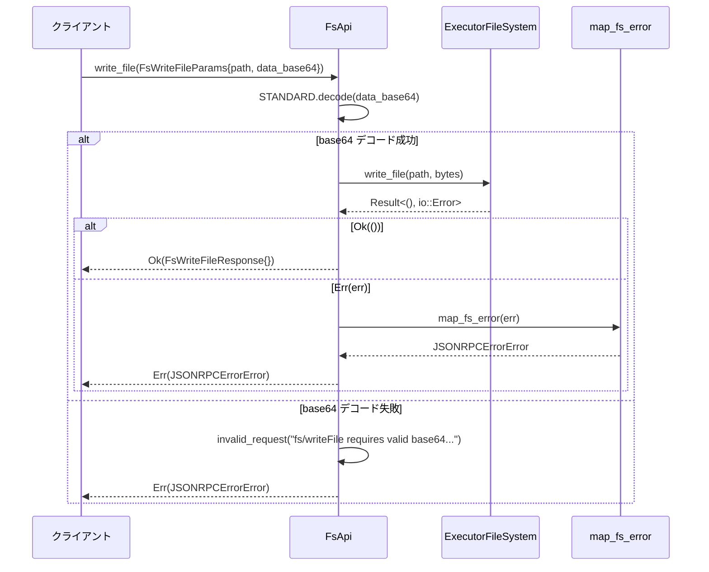

# app-server\src\fs_api.rs コード解説

## 0. ざっくり一言

- JSON-RPC プロトコル用のファイルシステム API です。  
- `codex_exec_server::ExecutorFileSystem` をバックエンドとして、読み書き・ディレクトリ操作・コピー・削除などを非同期で実行し、プロトコル用のリクエスト／レスポンス型に変換します（app-server\src\fs_api.rs:L29-159）。

---

## 1. このモジュールの役割

### 1.1 概要

- このモジュールは **アプリケーションサーバーからのファイル操作要求を、実際の実行環境ファイルシステムに橋渡しする** ために存在します。  
- `codex_app_server_protocol` の `Fs*Params` / `Fs*Response` 型と、`codex_exec_server::ExecutorFileSystem` のメソッド群をつなぎます（L5-25, L29-32, L42-159）。  
- エラーを `JSONRPCErrorError` に変換し、エラーコードを `INVALID_REQUEST_ERROR_CODE` と `INTERNAL_ERROR_CODE` にマッピングします（L1-2, L20, L162-179）。

### 1.2 アーキテクチャ内での位置づけ

このモジュールは、次のような依存関係で構成されています。

```mermaid
graph LR
%% app-server\src\fs_api.rs:L1-180
    subgraph AppServer
        FsApi
    end

    subgraph Protocol
        FsParams[Fs*Params]
        FsResponses[Fs*Response / FsReadDirectoryEntry]
        JsonError[JSONRPCErrorError]
    end

    subgraph ExecServer
        Env[Environment]
        FS[ExecutorFileSystem]
        CopyOpt[CopyOptions]
        MkdirOpt[CreateDirectoryOptions]
        RmOpt[RemoveOptions]
    end

    subgraph Util
        Base64[base64::STANDARD]
        ErrCode[error_code::{INVALID,INTERNAL}]
    end

    FsApi --> FsParams
    FsApi --> FsResponses
    FsApi --> JsonError

    FsApi --> Env
    Env --> FS

    FsApi --> FS
    FsApi --> CopyOpt
    FsApi --> MkdirOpt
    FsApi --> RmOpt

    FsApi --> Base64
    FsApi --> ErrCode
```

- `FsApi` は `ExecutorFileSystem` を保持し（L29-32）、各 API メソッド内でそのメソッド（`read_file`, `write_file`, `create_directory` など）を呼び出します（L47-51, L66-69, L77-85, L93-97, L110-114, L131-139, L148-157）。  
- プロトコル層のパラメータ／レスポンス型は、メソッドの引数・戻り値として用いられます（L43-46, L57-60, L73-76, L89-92, L106-109, L127-130, L144-147）。  
- エラー変換は共通関数 `map_fs_error` と `invalid_request` を通じて行われます（L51,69,85,97,114,139,157, L162-179）。

### 1.3 設計上のポイント

コードから読み取れる設計上の特徴は次の通りです。

- **責務の分割**  
  - `FsApi` は「プロトコル型 ↔ 実ファイルシステム」の変換に限定され、ファイルシステムの具体的な実装は `ExecutorFileSystem` に委譲しています（L29-32, L47-51, L66-69 他）。
- **状態管理**  
  - 内部状態は `Arc<dyn ExecutorFileSystem>` 1 つのみで、クローン可能 (`#[derive(Clone)]`) な軽量ハンドルになっています（L29-32）。  
  - 実際の状態（カレントディレクトリ、ルート制限など）がどこまで保持されているかは `ExecutorFileSystem` の実装側で決まります（このチャンクには実装が現れません）。
- **非同期・並行性**  
  - すべてのファイル操作メソッドは `async fn` で定義されており、非ブロッキングな I/O を前提としています（L42-55, L57-71, L73-87, L89-104, L106-125, L127-142, L144-159）。  
  - `Arc` によって `FsApi` インスタンスを複数のタスクで共有できる設計です（L29-32）。  
  - `ExecutorFileSystem` が `Send`/`Sync` かどうかはこのチャンクからは分かりません。
- **エラーハンドリング方針**  
  - `std::io::ErrorKind::InvalidInput` はクライアント側のリクエストエラー（`INVALID_REQUEST_ERROR_CODE`）として扱い、それ以外の I/O エラーは内部エラー（`INTERNAL_ERROR_CODE`）としてラップします（L170-178）。  
  - base64 デコードエラーも `invalid_request` として扱われます（L61-65, L162-167）。
- **デフォルト値の扱い**  
  - `recursive` や `force` のようなオプション引数が `None` の場合は `true` をデフォルトとするため、操作は「より強い」モードで実行されます（L81-82, L135-137）。

### 1.4 コンポーネント一覧（インベントリ）

| 名前 | 種別 | 役割 / 用途 | 定義位置 |
|------|------|-------------|----------|
| `FsApi` | 構造体 | ファイルシステム操作の高レベル API。`ExecutorFileSystem` を内部に保持するラッパー | `app-server\src\fs_api.rs:L29-32` |
| `impl Default for FsApi` | 実装 | デフォルトの環境からファイルシステムを取得して `FsApi` を生成 | `app-server\src\fs_api.rs:L34-40` |
| `FsApi::read_file` | メソッド (async) | ファイルの内容を読み取り base64 文字列として返す | `app-server\src\fs_api.rs:L42-55` |
| `FsApi::write_file` | メソッド (async) | base64 文字列をデコードしてファイルへ書き込む | `app-server\src\fs_api.rs:L57-71` |
| `FsApi::create_directory` | メソッド (async) | ディレクトリを作成（必要に応じて再帰的） | `app-server\src\fs_api.rs:L73-87` |
| `FsApi::get_metadata` | メソッド (async) | パスのメタデータ（種別・タイムスタンプ）を取得 | `app-server\src\fs_api.rs:L89-104` |
| `FsApi::read_directory` | メソッド (async) | ディレクトリ内エントリの一覧を取得 | `app-server\src\fs_api.rs:L106-125` |
| `FsApi::remove` | メソッド (async) | ファイル／ディレクトリを削除（再帰・強制オプションあり） | `app-server\src\fs_api.rs:L127-142` |
| `FsApi::copy` | メソッド (async) | ファイル／ディレクトリをコピー（必要に応じて再帰的） | `app-server\src\fs_api.rs:L144-159` |
| `invalid_request` | 関数 | クライアントリクエストの不正を表す JSON-RPC エラーを生成 | `app-server\src\fs_api.rs:L162-168` |
| `map_fs_error` | 関数 | `io::Error` を JSON-RPC エラーにマッピング | `app-server\src\fs_api.rs:L170-179` |

---

## 2. 主要な機能一覧

- ファイル読み込み: `read_file` — パスで指定されたファイルを読み取り、base64 文字列として返します（L42-55）。
- ファイル書き込み: `write_file` — base64 文字列を指定パスに書き込みます（L57-71）。
- ディレクトリ作成: `create_directory` — パスにディレクトリを作成し、必要に応じて親ディレクトリも再帰的に作成します（L73-87）。
- メタデータ取得: `get_metadata` — 指定パスの種別（ファイル／ディレクトリ）やタイムスタンプを返します（L89-104）。
- ディレクトリ一覧取得: `read_directory` — ディレクトリ内のエントリ名と種別を列挙します（L106-125）。
- 削除: `remove` — ファイル／ディレクトリを削除します。デフォルトでは再帰かつ強制です（L127-142）。
- コピー: `copy` — ファイル／ディレクトリを、必要に応じて再帰的にコピーします（L144-159）。
- エラー生成・変換ユーティリティ: `invalid_request`, `map_fs_error` — I/O エラーやパラメータエラーを JSON-RPC エラーへ変換します（L162-179）。

---

## 3. 公開 API と詳細解説

### 3.1 型一覧（構造体・列挙体など）

| 名前 | 種別 | フィールド | 役割 / 用途 | 定義位置 |
|------|------|-----------|-------------|----------|
| `FsApi` | 構造体 | `file_system: Arc<dyn ExecutorFileSystem>` | 実際のファイル操作を行う `ExecutorFileSystem` への共有ハンドルを保持します。`Clone` 実装により複数タスク間で共有可能です。 | `app-server\src\fs_api.rs:L29-32` |

※ `ExecutorFileSystem` 自体の詳細はこのチャンクには現れません。

### 3.2 関数詳細（主要 7 件）

#### `FsApi::read_file(&self, params: FsReadFileParams) -> Result<FsReadFileResponse, JSONRPCErrorError>`

**概要**

- 指定されたパスのファイルを読み込み、その内容を base64 エンコードした文字列として返します（L42-55）。

**引数**

| 引数名 | 型 | 説明 |
|--------|----|------|
| `self` | `&FsApi` | 内部で保持している `ExecutorFileSystem` を用いてファイルを読み込みます。 |
| `params` | `FsReadFileParams` | 少なくとも `path` フィールドを持ち、そのパスのファイルを読み取ります（L45,49）。 |

**戻り値**

- `Ok(FsReadFileResponse)`  
  - `FsReadFileResponse` の `data_base64` フィールドに、ファイル内容を base64 エンコードした文字列が入ります（L52-54）。
- `Err(JSONRPCErrorError)`  
  - ファイル読み込みに失敗した場合、`map_fs_error` によって変換された JSON-RPC エラーを返します（L51, L170-178）。

**内部処理の流れ**

1. `self.file_system.read_file(&params.path)` を非同期で呼び出し、結果を `bytes` に格納します（L47-50）。
2. `read_file` が返した `Result<Vec<u8>, io::Error>` に対して `map_err(map_fs_error)` を適用し、`io::Error` を JSON-RPC エラーに変換します（L51, L170-178）。
3. 正常終了時、戻り値のバイト列を `STANDARD.encode(bytes)` で base64 エンコードし（L53）、`FsReadFileResponse { data_base64 }` に詰めて返します（L52-54）。

**Examples（使用例）**

```rust
// FsApi をデフォルト環境で初期化する
let api = FsApi::default(); // app-server\src\fs_api.rs:L34-40

// 読み取り対象のパスを指定したパラメータを構築する
let params = FsReadFileParams {
    path: "/tmp/example.txt".into(), // 実際のフィールド型はこのチャンクからは不明だが、&str から変換可能と想定される
};

// 非同期コンテキスト内でファイルを読み取る
let resp = api.read_file(params).await?;

// base64 文字列として取得した内容を表示する
println!("base64 data: {}", resp.data_base64);
```

※ 上記は概念的な例であり、`FsReadFileParams` の完全な定義はこのチャンクには現れません。

**Errors / Panics**

- `read_file` メソッドで発生した `io::Error` は `map_fs_error` によって次のように変換されます（L47-51, L170-178）。
  - `io::ErrorKind::InvalidInput` の場合: `INVALID_REQUEST_ERROR_CODE` を持つエラーを返します（L171-173, L162-167）。
  - それ以外の `io::Error` の場合: `INTERNAL_ERROR_CODE` を持つエラーを返します（L174-178）。
- この関数自身は `unwrap` や `panic!` を使用しておらず、ソース上からはパニックを起こさない構造になっています。

**Edge cases（エッジケース）**

- 存在しないパス・権限不足など: `io::Error` が発生し、`INTERNAL_ERROR_CODE` でクライアントに返されます（詳細なエラー種別は `io::Error` の `Display` 文字列に含まれます: L176-177）。
- 非正規なパス文字列: `ExecutorFileSystem::read_file` が `InvalidInput` を返した場合は `INVALID_REQUEST_ERROR_CODE` として扱われます（L170-173）。

**使用上の注意点**

- 大きなファイルを読み込む場合、すべてをメモリ上の `Vec<u8>` に読み込んでから base64 エンコードするため、メモリ消費が増加します（L47-54）。
- base64 エンコード済み文字列は元のバイナリよりサイズが増えるため、ネットワーク経由で転送する場合は帯域にも影響します。

---

#### `FsApi::write_file(&self, params: FsWriteFileParams) -> Result<FsWriteFileResponse, JSONRPCErrorError>`

**概要**

- base64 文字列として受け取ったデータをデコードし、指定パスへ書き込みます（L57-71）。

**引数**

| 引数名 | 型 | 説明 |
|--------|----|------|
| `self` | `&FsApi` | 内部の `ExecutorFileSystem` を用いてファイルを書き込みます。 |
| `params` | `FsWriteFileParams` | 少なくとも `path` と `data_base64` フィールドを持ちます。`data_base64` は base64 エンコードされた内容です（L61, L67）。 |

**戻り値**

- `Ok(FsWriteFileResponse)` — 空のレスポンス構造体で、成功したことだけを示します（L70）。
- `Err(JSONRPCErrorError)` — base64 デコード失敗またはファイル書き込みエラーを JSON-RPC エラーとして返します（L61-65, L69, L170-178）。

**内部処理の流れ**

1. `STANDARD.decode(params.data_base64)` で base64 をデコードしようとします（L61）。
2. デコード失敗時はクロージャ内で `invalid_request` を呼び出し、`"fs/writeFile requires valid base64 dataBase64: {err}"` というメッセージ付きのエラーに変換します（L61-65, L162-167）。
3. デコード成功時は得られたバイト列を `self.file_system.write_file(&params.path, bytes)` に渡し、非同期で書き込みます（L66-69）。
4. 書き込み時の `io::Error` は `map_fs_error` で JSON-RPC エラーに変換されます（L69, L170-178）。
5. 成功時は空の `FsWriteFileResponse {}` を返します（L70）。

**Examples（使用例）**

```rust
// FsApi を初期化する
let api = FsApi::default(); // app-server\src\fs_api.rs:L34-40

// 書き込みたい内容をバイト列として定義する
let content = b"Hello, world!".to_vec();

// content を base64 文字列に変換する
let data_base64 = base64::engine::general_purpose::STANDARD.encode(content);

// 書き込み用のパラメータを構築する
let params = FsWriteFileParams {
    path: "/tmp/hello.txt".into(),
    data_base64,
};

// 非同期に書き込む
let _resp = api.write_file(params).await?;
```

**Errors / Panics**

- base64 デコードエラー:
  - `STANDARD.decode` がエラーを返した場合、`invalid_request` を使って `INVALID_REQUEST_ERROR_CODE` を持つエラーを返します（L61-65, L162-167）。
- 書き込み時の `io::Error`:
  - `map_fs_error` によって `InvalidInput` ならリクエストエラー、それ以外は内部エラーになります（L69, L170-178）。
- パニック要因となる `unwrap` や `expect` は使用されていません。

**Edge cases（エッジケース）**

- `data_base64` が空文字列の場合:
  - `STANDARD.decode` の挙動に依存しますが、正しい base64 の空列なら空バイト列として書き込みが行われます（L61-69）。
- base64 として不正な文字を含む場合:
  - `invalid_request` により、クライアントに「fs/writeFile requires valid base64 dataBase64: ...」メッセージ付きで返されます（L61-65）。
- パスが存在しないディレクトリ配下の場合:
  - `ExecutorFileSystem::write_file` の挙動に依存し、通常は `io::Error` を通じてエラーとなり、`map_fs_error` によって内部エラーとして返されます（L66-69, L170-178）。

**使用上の注意点**

- クライアントは **必ず base64 として正しい文字列** を送る必要があります。そうでないとクライアント側入力エラーとして扱われます（L61-65）。
- 大きなファイルを base64 文字列にして送るとサイズが増加し、メモリ・ネットワークに負荷がかかります。

---

#### `FsApi::create_directory(&self, params: FsCreateDirectoryParams) -> Result<FsCreateDirectoryResponse, JSONRPCErrorError>`

**概要**

- 指定したパスにディレクトリを作成します。`recursive` オプションにより、親ディレクトリを含めて再帰的に作成するかどうかを制御します（L73-87）。

**引数**

| 引数名 | 型 | 説明 |
|--------|----|------|
| `self` | `&FsApi` | 内部の `ExecutorFileSystem` を用いてディレクトリを作成します。 |
| `params` | `FsCreateDirectoryParams` | 少なくとも `path` と `recursive` フィールドを持ちます。`recursive` は `Option<bool>` と推測され、`unwrap_or(true)` が呼ばれています（L81-82）。 |

**戻り値**

- `Ok(FsCreateDirectoryResponse)` — 空のレスポンス構造体で、成功を示します（L86）。
- `Err(JSONRPCErrorError)` — ディレクトリ作成中の `io::Error` を JSON-RPC エラーとして返します（L77-85, L170-178）。

**内部処理の流れ**

1. `CreateDirectoryOptions { recursive: params.recursive.unwrap_or(true) }` を構築します（L80-82）。
   - `params.recursive` が `Some(false)` の場合のみ非再帰、それ以外 (`Some(true)` または `None`) は再帰的作成になります。
2. `self.file_system.create_directory(&params.path, options)` を待ち、エラーを `map_fs_error` で変換します（L77-85）。
3. 成功時は空の `FsCreateDirectoryResponse {}` を返します（L86）。

**Examples（使用例）**

```rust
// FsApi を初期化する
let api = FsApi::default();

// 非再帰でディレクトリを作成するパラメータ
let params = FsCreateDirectoryParams {
    path: "/tmp/non_recursive".into(),
    recursive: Some(false),
};

// 非同期にディレクトリを作成する
let _resp = api.create_directory(params).await?;
```

**Errors / Panics**

- 既に同名のファイルやディレクトリが存在する場合などで `io::Error` が発生すると、`map_fs_error` によりリクエストエラーまたは内部エラーになります（L77-85, L170-178）。
- `unwrap_or(true)` は `Option<bool>` 固有のメソッドであり、パニックを発生させません（L81-82）。

**Edge cases（エッジケース）**

- `recursive` が `None` の場合:
  - `unwrap_or(true)` により、再帰的作成が有効になります（L81-82）。
- パスの一部がすでにファイルである場合:
  - `ExecutorFileSystem::create_directory` の挙動により `io::ErrorKind::InvalidInput` などが発生する可能性があり、その場合は `INVALID_REQUEST_ERROR_CODE` になります（L77-85, L170-173）。

**使用上の注意点**

- デフォルト（`recursive` が `None`）では再帰的にディレクトリが作成されるため、意図せず深いディレクトリ構造が作られる可能性があります。

---

#### `FsApi::get_metadata(&self, params: FsGetMetadataParams) -> Result<FsGetMetadataResponse, JSONRPCErrorError>`

**概要**

- 指定パスのメタデータを取得し、種別（ファイル／ディレクトリ）と作成・更新タイムスタンプを返します（L89-104）。

**引数**

| 引数名 | 型 | 説明 |
|--------|----|------|
| `self` | `&FsApi` | 内部の `ExecutorFileSystem` を用いてメタデータを取得します。 |
| `params` | `FsGetMetadataParams` | 少なくとも `path` フィールドを持ちます（L91,95）。 |

**戻り値**

- `Ok(FsGetMetadataResponse)` — 以下のフィールドを含む構造体です（L98-103）。
  - `is_directory`: ディレクトリかどうか。
  - `is_file`: ファイルかどうか。
  - `created_at_ms`: 作成時刻（ミリ秒単位と推測されますが、このチャンクでは型のみからは詳細不明）。
  - `modified_at_ms`: 更新時刻。
- `Err(JSONRPCErrorError)` — メタデータ取得時のエラーを JSON-RPC エラーとして返します（L93-97, L170-178）。

**内部処理の流れ**

1. `self.file_system.get_metadata(&params.path)` を呼び出し、メタデータを取得します（L93-97）。
2. 取得したメタデータから必要なフィールドを `FsGetMetadataResponse` にコピーして返します（L98-103）。

**Examples（使用例）**

```rust
// パスのメタデータを取得する
let params = FsGetMetadataParams {
    path: "/tmp/hello.txt".into(),
};

let resp = api.get_metadata(params).await?;

// 種別を判定する
if resp.is_directory {
    println!("directory");
} else if resp.is_file {
    println!("file");
}
```

**Errors / Panics**

- `get_metadata` 呼び出しで `io::Error` が発生した場合は `map_fs_error` によって変換されます（L93-97, L170-178）。
- パニック要因となるコードは含まれていません。

**Edge cases（エッジケース）**

- 存在しないパスやアクセス権限不足の場合:
  - `io::Error` として扱われ、内部エラーまたはリクエストエラーに変換されます（L93-97, L170-178）。
- シンボリックリンク等の扱い:
  - `metadata` 構造体の仕様はこのチャンクには現れないため、リンク解決の有無は不明です。

**使用上の注意点**

- `is_directory` と `is_file` が双方とも `false` になるような特殊なファイル種別が存在するかどうかは、このチャンクだけでは判断できません。

---

#### `FsApi::read_directory(&self, params: FsReadDirectoryParams) -> Result<FsReadDirectoryResponse, JSONRPCErrorError>`

**概要**

- 指定ディレクトリ内のエントリ一覧を取得し、ファイル名と種別（ファイル／ディレクトリ）を返します（L106-125）。

**引数**

| 引数名 | 型 | 説明 |
|--------|----|------|
| `self` | `&FsApi` | 内部の `ExecutorFileSystem` を用いてディレクトリを読み取ります。 |
| `params` | `FsReadDirectoryParams` | 少なくとも `path` フィールドを持ちます（L108,112）。 |

**戻り値**

- `Ok(FsReadDirectoryResponse)` — `entries` フィールドに `Vec<FsReadDirectoryEntry>` を持ちます（L115-124）。
  - 各 `FsReadDirectoryEntry` には `file_name`, `is_directory`, `is_file` が含まれます（L118-121）。
- `Err(JSONRPCErrorError)` — ディレクトリ読み取り中の `io::Error` を JSON-RPC エラーとして返します（L110-114, L170-178）。

**内部処理の流れ**

1. `self.file_system.read_directory(&params.path)` を呼び出し、エントリ一覧を取得します（L110-113）。
2. 返ってきたエントリの `file_name`, `is_directory`, `is_file` を `FsReadDirectoryEntry` に写し替え、`collect()` でベクタにします（L115-123）。
3. `FsReadDirectoryResponse { entries }` として返します（L115-124）。

**Examples（使用例）**

```rust
// ディレクトリ内の一覧を取得する
let params = FsReadDirectoryParams {
    path: "/tmp".into(),
};

let resp = api.read_directory(params).await?;

for entry in resp.entries {
    println!(
        "{} (dir: {}, file: {})",
        entry.file_name, entry.is_directory, entry.is_file
    );
}
```

**Errors / Panics**

- ディレクトリが存在しない、権限がない、などの理由で `io::Error` が発生すると `map_fs_error` によりエラーが返されます（L110-114, L170-178）。
- パニック要因となるコードは含まれていません。

**Edge cases（エッジケース）**

- 空ディレクトリ:
  - `entries` が空のベクタとして返されます（L115-124）。
- ファイルを指すパスを渡した場合:
  - `ExecutorFileSystem::read_directory` の挙動に依存して `io::Error` が返されることがあり、その場合はエラーになります（L110-114, L170-178）。

**使用上の注意点**

- `file_name` はフルパスではなく、ディレクトリ内の名前のみが格納されているように見えますが、実際の仕様はこのチャンクだけでは断定できません（L119）。

---

#### `FsApi::remove(&self, params: FsRemoveParams) -> Result<FsRemoveResponse, JSONRPCErrorError>`

**概要**

- 指定パスのファイルまたはディレクトリを削除します。`recursive` や `force` により削除の強さを制御します（L127-142）。

**引数**

| 引数名 | 型 | 説明 |
|--------|----|------|
| `self` | `&FsApi` | 内部の `ExecutorFileSystem` を用いて削除を行います。 |
| `params` | `FsRemoveParams` | 少なくとも `path`, `recursive`, `force` フィールドを持ちます（L133,135,136）。`recursive` と `force` は `Option<bool>` と推測され、`unwrap_or(true)` が呼ばれます。 |

**戻り値**

- `Ok(FsRemoveResponse)` — 空のレスポンス構造体で、成功を示します（L141）。
- `Err(JSONRPCErrorError)` — 削除中の `io::Error` を JSON-RPC エラーとして返します（L131-139, L170-178）。

**内部処理の流れ**

1. `RemoveOptions { recursive: params.recursive.unwrap_or(true), force: params.force.unwrap_or(true) }` を構築します（L134-137）。
2. `self.file_system.remove(&params.path, options)` を非同期で呼び出し、`map_fs_error` でエラーを変換します（L131-139）。
3. 成功時は空の `FsRemoveResponse {}` を返します（L141）。

**Examples（使用例）**

```rust
// 再帰・強制削除を行う（デフォルト動作）
let params = FsRemoveParams {
    path: "/tmp/to_delete".into(),
    recursive: None, // None → unwrap_or(true) により true とみなされる
    force: None,
};

let _resp = api.remove(params).await?;
```

**Errors / Panics**

- 権限不足や存在しないパスなどにより `io::Error` が発生すると、`map_fs_error` によって JSON-RPC エラーになります（L131-139, L170-178）。
- `unwrap_or(true)` を用いているため、オプション値の欠如によりパニックすることはありません（L135-137）。

**Edge cases（エッジケース）**

- `recursive = Some(false)` でディレクトリを削除しようとした場合:
  - 中身があるディレクトリについての挙動は `ExecutorFileSystem::remove` に依存しますが、一般的にはエラーになる可能性があります（L134-137）。
- `force = Some(false)` の場合:
  - 権限や属性によって削除できないケースがそのままエラーとして表出する可能性があります（L134-137）。

**使用上の注意点**

- `recursive` と `force` のデフォルトがともに `true` のため、何も指定しないと「再帰かつ強制削除」という強い操作になります（L135-137）。  
  意図せぬ範囲の削除を防ぎたい場合は明示的に `Some(false)` を指定する必要があります。
- セキュリティ上、この API を外部クライアントに直接公開する場合は、削除可能なパスを何らかの形で制限する必要があります。この制限は本ファイル内では行われていません（パスはそのまま `ExecutorFileSystem::remove` に渡されます: L133）。

---

#### `FsApi::copy(&self, params: FsCopyParams) -> Result<FsCopyResponse, JSONRPCErrorError>`

**概要**

- ファイルまたはディレクトリを、別のパスへコピーします。`recursive` フラグによりディレクトリコピーの挙動を制御します（L144-159）。

**引数**

| 引数名 | 型 | 説明 |
|--------|----|------|
| `self` | `&FsApi` | 内部の `ExecutorFileSystem` を用いてコピーを行います。 |
| `params` | `FsCopyParams` | 少なくとも `source_path`, `destination_path`, `recursive` フィールドを持ちます（L150-153）。 |

**戻り値**

- `Ok(FsCopyResponse)` — 空のレスポンス構造体で、成功を示します（L158）。
- `Err(JSONRPCErrorError)` — コピー中の `io::Error` を JSON-RPC エラーとして返します（L148-157, L170-178）。

**内部処理の流れ**

1. `CopyOptions { recursive: params.recursive }` を構築します（L152-153）。
2. `self.file_system.copy(&params.source_path, &params.destination_path, options)` を非同期で実行し、`map_fs_error` でエラー変換します（L148-157）。
3. 成功時は空の `FsCopyResponse {}` を返します（L158）。

**Examples（使用例）**

```rust
// ディレクトリを再帰的にコピーする
let params = FsCopyParams {
    source_path: "/tmp/src_dir".into(),
    destination_path: "/tmp/dst_dir".into(),
    recursive: true,
};

let _resp = api.copy(params).await?;
```

**Errors / Panics**

- 存在しないソースパスや権限不足、既存のデスティネーションなどによる `io::Error` は `map_fs_error` により変換されます（L148-157, L170-178）。
- パニック要因となるコードは含まれていません。

**Edge cases（エッジケース）**

- `recursive = false` でディレクトリをコピーしようとした場合:
  - その挙動は `ExecutorFileSystem::copy` に依存します。一般的にはエラーになるか、空ディレクトリのみコピーされる可能性があります（L152-153）。
- 自己コピー（同じパスをソースとデスティネーションに指定）:
  - このケースはコード上で特別扱いしておらず、`ExecutorFileSystem::copy` 次第です（L150-151）。

**使用上の注意点**

- `recursive` の意味と、ディレクトリに対する挙動は `ExecutorFileSystem` の仕様に依存します。クライアント側ではそれを前提にパラメータを設定する必要があります。

---

### 3.3 その他の関数

| 関数名 | 役割（1 行） | 定義位置 |
|--------|--------------|----------|
| `FsApi::default() -> FsApi` | デフォルトの `Environment` から `ExecutorFileSystem` を取得し、`FsApi { file_system }` を生成します（L34-40）。 | `app-server\src\fs_api.rs:L34-40` |
| `invalid_request(message: impl Into<String>) -> JSONRPCErrorError` | `INVALID_REQUEST_ERROR_CODE` を持ち、指定メッセージと `data: None` を持つ JSON-RPC エラーを生成します（L162-167）。 | `app-server\src\fs_api.rs:L162-168` |
| `map_fs_error(err: io::Error) -> JSONRPCErrorError` | `io::ErrorKind::InvalidInput` を `invalid_request` に、その他のエラーを `INTERNAL_ERROR_CODE` にマッピングします（L170-178）。 | `app-server\src\fs_api.rs:L170-179` |

---

## 4. データフロー

代表的なフローとして、`write_file` のデータフローを示します。

1. クライアントは書き込みたいデータを base64 文字列として `FsWriteFileParams.data_base64` に入れ、`FsApi::write_file` を呼び出します（L57-61）。
2. `FsApi::write_file` は base64 をデコードし、成功すればバイト列を `ExecutorFileSystem::write_file` に渡します（L61-69）。
3. `ExecutorFileSystem` はファイルシステムに対して実際の書き込みを行い、結果を返します（このチャンクには実装が現れません）。
4. エラーがあれば `map_fs_error` によって JSON-RPC エラーへ変換され、クライアントに返されます（L69, L170-178）。



他のメソッド（`read_file`, `create_directory`, `remove`, `copy` など）も同様に、

- `FsApi` がプロトコルパラメータ → `ExecutorFileSystem` 呼び出し
- `io::Error` → `map_fs_error` → `JSONRPCErrorError`

という基本パターンで動作します（L42-55, L73-87, L89-104, L106-125, L127-142, L144-159, L170-179）。

---

## 5. 使い方（How to Use）

### 5.1 基本的な使用方法

`FsApi` は `Default` 実装で初期化し、各メソッドを async コンテキストから呼び出す形で利用します。

```rust
use app_server::fs_api::FsApi; // 実際のパスはプロジェクト構成に依存

// 非同期ランタイム（例: tokio）上で動作する main 関数
#[tokio::main]
async fn main() -> Result<(), Box<dyn std::error::Error>> {
    // FsApi をデフォルト環境で初期化する
    let api = FsApi::default(); // app-server\src\fs_api.rs:L34-40

    // 1. ファイルを書き込む
    let content = b"Hello, world!".to_vec();
    let data_base64 = base64::engine::general_purpose::STANDARD.encode(content);
    let write_params = FsWriteFileParams {
        path: "/tmp/hello.txt".into(),
        data_base64,
    };
    api.write_file(write_params).await?; // L57-71

    // 2. 書き込んだファイルを読み込む
    let read_params = FsReadFileParams {
        path: "/tmp/hello.txt".into(),
    };
    let read_resp = api.read_file(read_params).await?; // L42-55

    println!("base64: {}", read_resp.data_base64);

    Ok(())
}
```

- すべてのメソッドが `async` のため、`tokio` などの非同期ランタイム上で `await` する必要があります。

### 5.2 よくある使用パターン

1. **ディレクトリを作成してからファイルを書き込む**

```rust
// ディレクトリを（再帰的に）作成
let mkdir_params = FsCreateDirectoryParams {
    path: "/tmp/nested/dir".into(),
    recursive: None, // None → 再帰的作成 (unwrap_or(true)) L81-82
};
api.create_directory(mkdir_params).await?;

// そのディレクトリ内にファイルを書き込む
let write_params = FsWriteFileParams {
    path: "/tmp/nested/dir/file.txt".into(),
    data_base64: base64::engine::general_purpose::STANDARD.encode(b"data".as_ref()),
};
api.write_file(write_params).await?;
```

1. **ディレクトリ内の一覧を取得して削除する**

```rust
// ディレクトリ一覧の取得
let rd_params = FsReadDirectoryParams {
    path: "/tmp/to_clean".into(),
};
let rd_resp = api.read_directory(rd_params).await?;

// 各エントリを削除
for entry in rd_resp.entries {
    let rm_params = FsRemoveParams {
        path: format!("/tmp/to_clean/{}", entry.file_name),
        recursive: None, // デフォルトで再帰 + 強制削除 (L135-137)
        force: None,
    };
    api.remove(rm_params).await?;
}
```

### 5.3 よくある間違い

```rust
// 間違い例: data_base64 に生データを渡してしまう
let params = FsWriteFileParams {
    path: "/tmp/raw.bin".into(),
    data_base64: String::from("not-base64-binary-data"),
};
// これは STANDARD.decode で失敗し、invalid_request エラーになる (L61-65)
let result = api.write_file(params).await;

// 正しい例: 事前に base64 エンコードしてから渡す
let raw = vec![0, 1, 2, 3];
let data_base64 = base64::engine::general_purpose::STANDARD.encode(raw);
let params = FsWriteFileParams {
    path: "/tmp/raw.bin".into(),
    data_base64,
};
let result = api.write_file(params).await; // 成功すれば Ok(FsWriteFileResponse{})
```

```rust
// 間違い例: 危険なデフォルトの理解不足
let params = FsRemoveParams {
    path: "/important/data".into(),
    recursive: None, // None → true
    force: None,     // None → true
};
// 意図せず再帰 + 強制削除となる可能性がある (L135-137)
api.remove(params).await?;

// より安全な例: 明示的に false を指定する
let params = FsRemoveParams {
    path: "/important/data".into(),
    recursive: Some(false),
    force: Some(false),
};
api.remove(params).await?;
```

### 5.4 使用上の注意点（まとめ）

- **パスの検証**  
  - このモジュールはパス文字列をそのまま `ExecutorFileSystem` に渡しています（L49,67,79,95,112,133,150）。  
    「どのパスを操作してよいか」の制御は上位レイヤーで行う必要があります。
- **強いデフォルト値**  
  - `create_directory` の `recursive`、`remove` の `recursive` / `force` は、`None` のとき `true` になります（L81-82, L135-137）。  
    安全性重視の場合は `Some(false)` を明示することが重要です。
- **大容量データとパフォーマンス**  
  - `read_file` / `write_file` はメモリ上にファイル内容全体を保持し、さらに base64 エンコード／デコードを行います（L47-54, L61-69）。  
    大きなファイルに対して多用するとメモリ使用量・CPU 負荷が増加します。
- **非同期コンテキスト**  
  - 各メソッドは async であり、ブロッキング I/O を行うコードは見当たりません（L42-55 他）。  
    適切な非同期ランタイム上で `await` することが前提です。
- **ロギング・監査**  
  - このファイル内にはログ出力や監査用の記録処理は含まれていません。  
    操作履歴の記録が必要な場合は上位レイヤーや `ExecutorFileSystem` 側で対応する必要があります（コードからは不明）。

---

## 6. 変更の仕方（How to Modify）

### 6.1 新しい機能を追加する場合

たとえば「ファイル移動（rename / move）」 API を追加する場合の一般的な流れは以下の通りです。

1. **パラメータ／レスポンス型の準備**  
   - `codex_app_server_protocol` 側に `FsMoveParams`, `FsMoveResponse` のような型を追加する（このチャンクには定義がないため想定ベースです）。
2. **`ExecutorFileSystem` 側のサポート確認**  
   - `ExecutorFileSystem` に対応するメソッド（例: `move` や `rename`）があるか確認し、なければそちらに追加します（このチャンクには現れません）。
3. **`FsApi` にメソッドを追加**  
   - `impl FsApi` 内に `pub(crate) async fn move(&self, params: FsMoveParams) -> Result<FsMoveResponse, JSONRPCErrorError>` のようなメソッドを追加し、既存メソッドと同様に:
     - パラメータ → `ExecutorFileSystem` 呼び出し
     - `Result` → `map_fs_error` によるエラー変換
   - というパターンで実装します（L42-55, L57-71 などを参考にできます）。
4. **エラーコードとの整合性**  
   - 新しい I/O エラーも既存の `map_fs_error` で適切に変換できるか確認します。必要であれば `map_fs_error` 自体を拡張します（L170-179）。

### 6.2 既存の機能を変更する場合

変更時に注意する点は次の通りです。

- **影響範囲の確認**
  - 変更するメソッドがどこから呼び出されているかはこのチャンクだけでは分からないため、リポジトリ全体で検索して呼び出し元を確認する必要があります。
- **契約（前提条件・戻り値）の維持**
  - たとえば `write_file` が「base64 文字列を受け取る」という契約を変える場合、クライアント側・プロトコル定義・他の実装とも整合を取る必要があります（L61-65）。
  - エラーコード割り当て (`INVALID_REQUEST_ERROR_CODE` vs `INTERNAL_ERROR_CODE`) を変更する場合は、クライアントのエラーハンドリングにも影響します（L162-167, L170-178）。
- **テストと検証**
  - このチャンクにはテストコードは含まれていません。変更後は別途用意されているテスト（あるいは新規テスト）で次の点を確認する必要があります。
    - 正常系: ファイル操作が期待通りに行われるか。
    - エラー系: base64 不正、存在しないパス、権限不足などで適切な JSON-RPC エラーが返るか。
- **並行性・スレッド安全性**
  - `FsApi` 自体は `Clone` であり `Arc` を保持するため、複数タスクからの同時利用を前提とした設計に見えます（L29-32）。  
    `ExecutorFileSystem` に排他制御やスレッド安全性の考慮が必要な変更を行う場合は、その側面も確認が必要です（このチャンクには情報がありません）。

---

## 7. 関連ファイル

このモジュールと密接に関係する外部コンポーネント（インポートから推測できる範囲）は次の通りです。

| パス / モジュール | 役割 / 関係 |
|-------------------|------------|
| `crate::error_code` | `INTERNAL_ERROR_CODE`, `INVALID_REQUEST_ERROR_CODE` を提供し、`JSONRPCErrorError` の `code` に使用されています（L1-2, L162-167, L174-176）。 |
| `codex_app_server_protocol` | `Fs*Params`, `Fs*Response`, `FsReadDirectoryEntry`, `JSONRPCErrorError` など、JSON-RPC プロトコルに対応する型を提供しています（L5-20）。 |
| `codex_exec_server::Environment` | デフォルト環境を構築し、`get_filesystem()` で `Arc<dyn ExecutorFileSystem>` を取得します（L23, L37）。 |
| `codex_exec_server::ExecutorFileSystem` | 実際のファイル操作（read/write/create/remove/copy など）を提供するトレイト／型です（L24, L47, L66, L77, L93, L110, L131, L148）。詳細実装はこのチャンクには現れません。 |
| `codex_exec_server::{CopyOptions, CreateDirectoryOptions, RemoveOptions}` | 各ファイル操作のオプション（再帰・強制など）を指定するための型で、本モジュールから構築されて渡されています（L21-22, L25, L80-82, L134-137, L152-153）。 |
| `base64::engine::general_purpose::STANDARD` | ファイル内容を base64 エンコード／デコードするために使用されます（L3-4, L53, L61）。 |

以上の情報は、すべて `app-server\src\fs_api.rs` 内のコード（L1-180）から読み取れる範囲に基づいています。それ以外の挙動や仕様（`ExecutorFileSystem` の実装詳細、プロトコルの全文仕様など）はこのチャンクには現れないため、「不明」となります。
