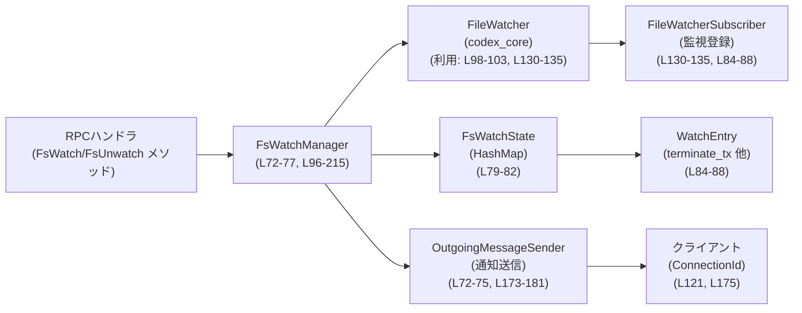
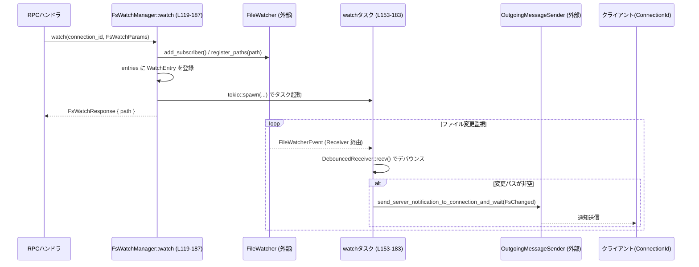
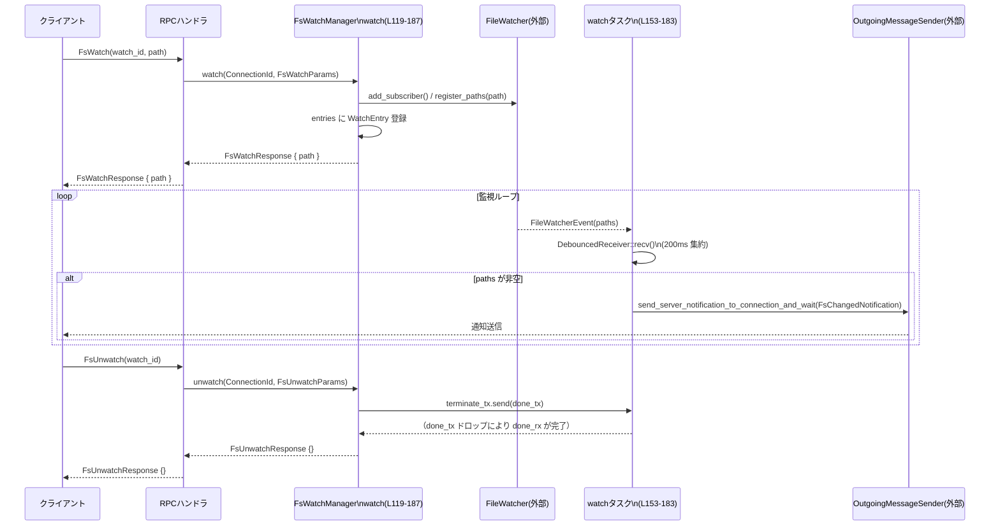

# app-server/src/fs_watch.rs コード解説

## 0. ざっくり一言

このモジュールは、クライアントごとのファイルシステム監視を管理し、変更イベントをデバウンスしつつ JSON-RPC 通知としてクライアントへ送信する「監視マネージャ」を提供する実装です。`FsWatchManager` が公開 API（crate 内）に相当します。`fs_watch.rs:L72-77, L96-215`

---

## 1. このモジュールの役割

### 1.1 概要

- このモジュールは **クライアントごとの watch ID 付きファイル監視** を扱い、変更があったファイルパスをクライアントに通知します。`fs_watch.rs:L72-77, L119-187`
- 監視ごとに非同期タスクを立ち上げ、`codex_core::file_watcher::FileWatcher` からのイベントを **200ms 単位でまとめて送るデバウンス処理** を行います。`fs_watch.rs:L32, L34-69, L153-183`
- 監視は `(ConnectionId, watch_id)` の組み合わせで管理され、クライアントからの `watch` / `unwatch` リクエストと接続終了 (`connection_closed`) に応じて追加・削除されます。`fs_watch.rs:L90-94, L79-82, L119-207, L209-215`

### 1.2 アーキテクチャ内での位置づけ

主なコンポーネント間の関係（このファイル内に現れる範囲）を示します。



- RPC ハンドラ（別モジュール、ここには定義なし）が `FsWatchManager::watch` / `unwatch` / `connection_closed` を呼び出します。`fs_watch.rs:L119-187, L189-207, L209-215`
- `FsWatchManager` は `FileWatcher` にサブスクライブし、受け取った変更イベントを `OutgoingMessageSender` を通して該当 `ConnectionId` のクライアントに送信します。`fs_watch.rs:L97-105, L130-135, L153-183`
- 監視状態は `FsWatchState` の `entries: HashMap<WatchKey, WatchEntry>` に保持されます。`fs_watch.rs:L79-82`

### 1.3 設計上のポイント（コードから読み取れる範囲）

- **責務分割**
  - `FsWatchManager`: クライアントごとの監視のライフサイクル管理（watch/unwatch/connection_closed）。`fs_watch.rs:L72-77, L96-215`
  - `DebouncedReceiver`: `FileWatcher` からの生イベントをデバウンスしてまとめる補助レイヤ。`fs_watch.rs:L34-69`
  - `FsWatchState` / `WatchEntry` / `WatchKey`: 監視の内部状態（ハンドル類と識別キー）の保持。`fs_watch.rs:L79-88, L90-94`
- **状態管理と並行性**
  - 監視状態は `Arc<AsyncMutex<FsWatchState>>` で保護され、非同期コンテキストから安全に更新できるようになっています。`fs_watch.rs:L72-77, L115-116`
  - 各 watch につき 1 つのタスクを `tokio::spawn` で起動し、ファイル変更の受信と通知送信を担当します。`fs_watch.rs:L153-184`
- **監視範囲とスコープ**
  - 監視は `(ConnectionId, watch_id)` で一意に識別され、同じ接続内で `watch_id` が重複するとエラーになります。`fs_watch.rs:L124-128, L138-143`
  - 他の接続からの `unwatch` は何も行わず成功として扱われます（テストで確認）。`fs_watch.rs:L194-205, L275-318`
- **エラーハンドリング**
  - `FileWatcher::new()` に失敗した場合はログを出しつつ `FileWatcher::noop()` にフォールバックします。`fs_watch.rs:L97-105`
  - 既存の watchId に対する `watch` は JSON-RPC の `invalid_request` エラーを返します。`fs_watch.rs:L138-143`
  - `unwatch` は対象が存在しなくてもエラーにはせず、常に `Ok(FsUnwatchResponse {})` を返します。`fs_watch.rs:L194-207`
- **通知のデバウンス**
  - ファイル変更イベントは 200ms の間に来たものをまとめて 1 つの通知にします（`FS_CHANGED_NOTIFICATION_DEBOUNCE`）。`fs_watch.rs:L32, L155-169`
  - デバウンス開始時刻には `Instant::now()` を使用し、Tokio の `sleep_until` で待機しています。`fs_watch.rs:L55-63`

---

## 2. 主要な機能一覧

- ファイルシステム監視の開始 (`watch`): 接続 ID と watchId とパスを受け取り、監視を開始します。`fs_watch.rs:L119-187`
- ファイルシステム監視の停止 (`unwatch`): 指定した接続＆watchId の監視を停止し、関連タスクの終了を待ちます。`fs_watch.rs:L189-207`
- 接続クローズ時のクリーンアップ (`connection_closed`): 指定接続に紐づく全ての監視を一度に削除します。`fs_watch.rs:L209-215`
- ファイル変更イベントのデバウンス (`DebouncedReceiver`): `FileWatcherEvent` を一定時間内でまとめて 1 回の通知に変換します。`fs_watch.rs:L34-69`
- `FileWatcher` 生成とフォールバック: 実 FS watcher 生成に失敗した場合に noop watcher に切り替えます。`fs_watch.rs:L97-105`

---

## 3. 公開 API と詳細解説

### 3.1 型一覧（構造体・列挙体など）

モジュール内の主な型と役割です（行番号付き）。

| 名前 | 種別 | 可視性 | 行範囲 | 役割 / 用途 |
|------|------|--------|--------|-------------|
| `DebouncedReceiver` | 構造体 | モジュール内 private | `fs_watch.rs:L34-39` | `FileWatcher` からの `Receiver` をラップし、変更パスを一定時間集約して返す補助型 |
| `FsWatchManager` | 構造体 | `pub(crate)` | `fs_watch.rs:L72-77` | crate 内から利用されるファイル監視マネージャ。`watch` / `unwatch` / `connection_closed` を提供 |
| `FsWatchState` | 構造体 | private | `fs_watch.rs:L79-82` | すべての監視エントリを保持する内部状態 (`HashMap<WatchKey, WatchEntry>`) |
| `WatchEntry` | 構造体 | private | `fs_watch.rs:L84-88` | 個々の監視に対応するタスク制御用 oneshot 送信側と watcher ハンドルを格納 |
| `WatchKey` | 構造体 | private (`Clone, Debug, Eq, Hash, PartialEq`) | `fs_watch.rs:L90-94` | `(ConnectionId, watch_id)` をまとめた Map のキー。接続スコープ付き watch 識別子 |

### 3.2 関数詳細（重要な 6 件）

#### `FsWatchManager::new(outgoing: Arc<OutgoingMessageSender>) -> Self`

**概要**

- `OutgoingMessageSender` を受け取り、実際の `FileWatcher` を初期化して `FsWatchManager` インスタンスを構築します。`fs_watch.rs:L97-106`
- `FileWatcher::new()` が失敗した場合は警告ログを出しつつ noop watcher にフォールバックします。

**引数**

| 引数名 | 型 | 説明 |
|--------|----|------|
| `outgoing` | `Arc<OutgoingMessageSender>` | JSON-RPC 通知をクライアントに送るための送信オブジェクト（共有ポインタ） |

**戻り値**

- `FsWatchManager` インスタンス（`Arc<AsyncMutex<FsWatchState>>` を内部に持つ）を返します。`fs_watch.rs:L112-116`

**内部処理の流れ**

1. `FileWatcher::new()` を呼び出し、実際のファイル監視バックエンドを作成しようとします。`fs_watch.rs:L98-99`
2. 成功した場合はそれを `Arc` に包みます。失敗した場合は `warn!` ログを出力し、`FileWatcher::noop()` を `Arc` に包みます。`fs_watch.rs:L100-103`
3. 内部ヘルパー `new_with_file_watcher` を呼び、`FsWatchManager` を構築します。`fs_watch.rs:L105`

**Examples（使用例）**

```rust
use std::sync::Arc;
use app_server::outgoing_message::OutgoingMessageSender;
use app_server::fs_watch::FsWatchManager; // 実際のパスは crate 構成に依存

fn create_manager(outgoing: OutgoingMessageSender) -> FsWatchManager {
    let outgoing = Arc::new(outgoing);                     // 共有ポインタに包む
    FsWatchManager::new(outgoing)                          // マネージャを構築
}
```

**Errors / Panics**

- `FileWatcher::new()` が Err を返しても、この関数自体はパニックせず、noop watcher にフォールバックします。`fs_watch.rs:L98-103`
- この関数は `Result` を返さないため、呼び出し側にはエラーは伝播しません。

**Edge cases（エッジケース）**

- ファイル監視がサポートされない環境などで `FileWatcher::new()` が失敗すると、実際にはファイル変更通知は発生しない可能性があります（`FileWatcher::noop()` の挙動による）。`fs_watch.rs:L100-103`
- その場合でも `FsWatchManager::watch` などは成功として動作します。

**使用上の注意点**

- `FsWatchManager::new` 自体は非同期ではないため、通常の同期コードから呼び出して問題ありません。
- 実際に監視イベントが飛んでくるかどうかは `FileWatcher` 実装に依存するため、テスト環境では `new_with_file_watcher` を使って明示的に noop watcher を注入しています。`fs_watch.rs:L234-241`

---

#### `FsWatchManager::watch(&self, connection_id: ConnectionId, params: FsWatchParams) -> Result<FsWatchResponse, JSONRPCErrorError>`

**概要**

- 指定された接続 ID と `watch_id` とパスに対してファイル監視を開始し、監視エントリを内部状態に登録します。`fs_watch.rs:L119-187`
- 監視ごとにバックグラウンドタスクを起動し、ファイル変更イベントを受け取ってクライアントへ通知します。

**引数**

| 引数名 | 型 | 説明 |
|--------|----|------|
| `&self` | `&FsWatchManager` | 監視マネージャ本体（`Clone` されたインスタンスも同じ内部状態を共有） |
| `connection_id` | `ConnectionId` | クライアント接続を識別する ID。監視はこの接続にスコープされます。`fs_watch.rs:L121` |
| `params` | `FsWatchParams` | `watch_id` と監視するパス (`path`) を含む JSON-RPC パラメータ。`fs_watch.rs:L122-123` |

**戻り値**

- 成功時: `Ok(FsWatchResponse { path: params.path })` を返します。返されるパスはリクエストで指定されたものと同じです。`fs_watch.rs:L186-187`
- 失敗時: `Err(JSONRPCErrorError)`。特に、同一接続内で `watch_id` が重複している場合に `invalid_request` エラーを返します。`fs_watch.rs:L138-143`

**内部処理の流れ**

1. `params.watch_id` と `connection_id` から `WatchKey` を生成します。`fs_watch.rs:L124-128`
2. `FileWatcher::add_subscriber()` を呼び、監視用の `FileWatcherSubscriber` と `Receiver` を取得します。`fs_watch.rs:L130`
3. `subscriber.register_paths()` により、`params.path` を監視対象パスとして登録します（非再帰）。`fs_watch.rs:L131-135`
4. `oneshot::channel()` でタスク終了制御用の `terminate_tx` / `terminate_rx` を生成します。`fs_watch.rs:L136`
5. 内部状態の `entries` に対して `entry(watch_key)` を呼び出し:
   - 既にエントリが存在する場合 (`Entry::Occupied`) は `"watchId already exists: {watch_id}"` メッセージの JSON-RPC エラーを返して終了。`fs_watch.rs:L138-143`
   - 空いている場合 (`Entry::Vacant`) は `WatchEntry` を挿入します。`WatchEntry` には `terminate_tx` と `_subscriber` と `_registration` が含まれます。`fs_watch.rs:L144-150`
6. 非同期タスクを `tokio::spawn` で起動し、以下を行います。`fs_watch.rs:L153-184`
   - `DebouncedReceiver::new(rx, FS_CHANGED_NOTIFICATION_DEBOUNCE)` を作成し、監視イベントをデバウンスします。`fs_watch.rs:L155`
   - `terminate_rx` を `tokio::pin!` して select で待てるようにします。`fs_watch.rs:L156`
   - ループ内で `tokio::select!` を使い、以下のどちらかが発生するまで待ちます。`fs_watch.rs:L158-165`
     - `terminate_rx` が完了（`unwatch` または `connection_closed` による） → ループを抜けてタスク終了。`fs_watch.rs:L159-160`
     - `rx.recv()` が `Some(event)` を返す → イベントを処理。`fs_watch.rs:L161-163`
     - `rx.recv()` が `None`（チャネルクローズ） → ループを抜けてタスク終了。`fs_watch.rs:L161-164`
   - `event.paths` を `AbsolutePathBuf::resolve_path_against_base(&path, &watch_root)` でベースパスに対して解決し、絶対パス化したベクタに変換してソートします。`fs_watch.rs:L166-171`
   - `changed_paths` が空でなければ `OutgoingMessageSender::send_server_notification_to_connection_and_wait` を呼び、`ServerNotification::FsChanged` 通知を送信して完了まで待機します。`fs_watch.rs:L172-181`
7. 最後に `FsWatchResponse { path: params.path }` を返します。`fs_watch.rs:L186-187`

**処理フロー図（watch とタスク部分）**



**Examples（使用例）**

RPC ハンドラからの典型的な呼び出し例です（擬似コード）。

```rust
use std::sync::Arc;
use codex_app_server_protocol::{FsWatchParams, FsWatchResponse};
use crate::outgoing_message::ConnectionId;
use crate::fs_watch::FsWatchManager;

async fn handle_fs_watch(
    manager: Arc<FsWatchManager>,      // 共有マネージャ
    conn_id: ConnectionId,
    params: FsWatchParams,
) -> Result<FsWatchResponse, JSONRPCErrorError> {
    manager.watch(conn_id, params).await
}
```

**Errors / Panics**

- `Entry::Occupied(_)` の場合に `invalid_request` エラー（`JSONRPCErrorError` 型）を返します。`fs_watch.rs:L138-143`
- `FileWatcher` 周辺のエラー（例: `Receiver` が早期に `None` を返すなど）は、内部でタスクが終了するトリガーとなりますが、`watch` の呼び出し結果には直接影響しません（`watch` の戻り時点では監視登録に成功しているため）。`fs_watch.rs:L161-164`
- `watch` 自体はパニックするコードは含んでいません。

**Edge cases（エッジケース）**

- **重複 watch_id**: 同じ `connection_id` かつ同じ `watch_id` で再度 `watch` を呼ぶと `"watchId already exists: <id>"` というエラーになります（テストで確認）。`fs_watch.rs:L138-143, L320-352`
- **他接続との watch_id 衝突**: `WatchKey` は `ConnectionId` を含むため、異なる接続で同じ `watch_id` を使用しても問題ありません。`fs_watch.rs:L90-94`
- **ファイル監視バックエンドが noop の場合**: 監視は成功しますが、変更通知は届かない可能性があります（`FileWatcher::noop()` の挙動による）。`fs_watch.rs:L97-105`
- **ファイルイベントが多数発生**: デバウンス間隔内に複数イベントが来た場合、一つの通知にまとめられます。`fs_watch.rs:L155-169`

**使用上の注意点**

- `watch` は非同期関数なので、必ず `.await` で待つ必要があります。
- 同じ接続の中で `watch_id` はユニークであることが前提です（テストで保証）。`fs_watch.rs:L320-352`
- 監視タスクの終了タイミングと `unwatch` / `connection_closed` の関係を前提条件として利用する場合は、後述の `unwatch` / `connection_closed` の挙動（特に oneshot チャネルによる終了シグナル）を理解しておく必要があります。`fs_watch.rs:L136, L155-160, L194-205`

---

#### `FsWatchManager::unwatch(&self, connection_id: ConnectionId, params: FsUnwatchParams) -> Result<FsUnwatchResponse, JSONRPCErrorError>`

**概要**

- 指定された `(connection_id, watch_id)` に対応する監視を停止します。存在しない場合や他接続が作成した監視の場合は何もせず成功とします。`fs_watch.rs:L189-207`
- 対象監視のバックグラウンドタスクに終了シグナルを送り、タスク側が oneshot チャネルをドロップするまで待機することで、「`unwatch` 応答後に通知が飛ばない」ことを保証する設計です。`fs_watch.rs:L199-205`

**引数**

| 引数名 | 型 | 説明 |
|--------|----|------|
| `&self` | `&FsWatchManager` | マネージャ |
| `connection_id` | `ConnectionId` | 監視を作成した接続 ID を期待する（他接続 ID でも呼べるが no-op） |
| `params` | `FsUnwatchParams` | `watch_id` を保持する JSON-RPC パラメータ |

**戻り値**

- 常に `Ok(FsUnwatchResponse {})` を返します（監視が存在しない場合も含む）。`fs_watch.rs:L206-207`

**内部処理の流れ**

1. `connection_id` と `params.watch_id` から `WatchKey` を生成します。`fs_watch.rs:L194-197`
2. `state.entries.remove(&watch_key)` でエントリを削除し、削除された場合は `Some(WatchEntry)` を取得します。`fs_watch.rs:L198`
3. エントリが存在した場合:
   - 新たに `oneshot::channel()` を生成し、`done_tx` / `done_rx` を得ます。`fs_watch.rs:L202`
   - 元の監視タスクに渡してある `terminate_tx: oneshot::Sender<oneshot::Sender<()>>` に `done_tx` を送ります。`fs_watch.rs:L203`
   - `done_rx.await` で待ち、`done_tx` がタスク側でドロップされる（= タスクが終了する）までブロックします。`fs_watch.rs:L204`
4. 最後に `FsUnwatchResponse {}` を返します。`fs_watch.rs:L206-207`

タスク側では、`terminate_rx` がクローズまたは送信を受け取ると `tokio::select!` の終了分岐に入り、ループを抜けてタスクを終了します。`fs_watch.rs:L158-160`

**Examples（使用例）**

```rust
use codex_app_server_protocol::FsUnwatchParams;
use crate::outgoing_message::ConnectionId;
use crate::fs_watch::FsWatchManager;

async fn handle_fs_unwatch(
    manager: &FsWatchManager,
    conn_id: ConnectionId,
    watch_id: String,
) -> Result<FsUnwatchResponse, JSONRPCErrorError> {
    manager.unwatch(conn_id, FsUnwatchParams { watch_id }).await
}
```

**Errors / Panics**

- この関数は `Result` を返しますが、現行コードでは常に `Ok` を返しており、`Err` は発生しません。`fs_watch.rs:L189-207`
- `done_rx.await` は oneshot チャネルがクローズされたとき `Err` を返しますが、`let _ = done_rx.await;` としているため、エラーは無視されます。`fs_watch.rs:L204`
- パニックを引き起こすコードパスはありません。

**Edge cases（エッジケース）**

- **他接続からの unwatch**: `(connection_id, watch_id)` が存在しない場合（例: 別の接続が作成した監視に対する unwatch）は、エントリ削除は行われず、`FsUnwatchResponse {}` が返るだけです（テストで確認）。`fs_watch.rs:L198-205, L275-318`
- **二重 unwatch**: 一度 unwatch した後に同じ `(connection_id, watch_id)` で再度 unwatch を呼んでも、エントリが既に存在しないため、単に no-op になります。
- **監視タスクが既に終了している場合**: `terminate_tx.send(done_tx)` が失敗する場合がありますが、戻り値を `let _ =` で無視しているため、呼び出し側には影響しません。`fs_watch.rs:L203`

**使用上の注意点**

- `unwatch` は、`watch` を呼んだ接続 ID と同じ `ConnectionId` を使って呼ぶことが前提です。テストでは、このスコープが守られていることを確認しています。`fs_watch.rs:L275-318`
- `unwatch` の完了後は、その監視に対する通知が送られないことを前提にできる設計になっています（タスク終了を待っているため）。`fs_watch.rs:L199-205`
- 高頻度で多数の `unwatch` を行う場合、各 `unwatch` がタスクの終了を待つため、レスポンス時間がタスク側の終了速度に依存する点に注意が必要です。

---

#### `FsWatchManager::connection_closed(&self, connection_id: ConnectionId)`

**概要**

- 指定された接続 ID に紐づいている全ての監視エントリを削除します。`fs_watch.rs:L209-215`
- `unwatch` と異なり、タスク終了の完了を待たずに関数自体はすぐに戻りますが、`terminate_tx` のドロップによってタスク側は順次終了する動きになります。`fs_watch.rs:L84-88, L155-160`

**引数**

| 引数名 | 型 | 説明 |
|--------|----|------|
| `&self` | `&FsWatchManager` | マネージャ |
| `connection_id` | `ConnectionId` | クローズされた接続の ID |

**戻り値**

- 返り値はなく、副作用として内部状態を変更します。`fs_watch.rs:L209-215`

**内部処理の流れ**

1. `state` のロックを取得します。`fs_watch.rs:L210`
2. `HashMap::extract_if` を用いて `key.connection_id == connection_id` を満たすすべてのエントリを削除します。`fs_watch.rs:L212-214`
3. 戻り値の `.count()` は結果を捨てています（削除された件数を利用していません）。`fs_watch.rs:L213-214`

`WatchEntry` がドロップされることで、内部の `terminate_tx` もドロップされ、対応するタスク側の `terminate_rx` がクローズし、`tokio::select!` の終了分岐が実行されます。`fs_watch.rs:L84-88, L158-160`

**Examples（使用例）**

```rust
use crate::outgoing_message::ConnectionId;
use crate::fs_watch::FsWatchManager;

async fn handle_connection_closed(manager: &FsWatchManager, conn_id: ConnectionId) {
    manager.connection_closed(conn_id).await;
}
```

**Errors / Panics**

- エラーやパニックになるパスはありません。`extract_if` のクロージャも副作用は `bool` 返却のみです。`fs_watch.rs:L212-214`

**Edge cases（エッジケース）**

- **監視が一つもない接続 ID**: 該当エントリがなければ何もせずに終わります。
- **複数監視のある接続 ID**: 指定接続 ID に関連するすべての監視が削除されます（テストで確認）。`fs_watch.rs:L355-414`
- **タスク終了待機**: `unwatch` と異なり、タスクが完全に終了するのを待ちません。そのため、`connection_closed` 直後に短時間だけイベント通知が試行される可能性がありますが、`ConnectionId` が無効になっていれば送信側で処理されることが期待されます（詳細は他モジュールの実装に依存し、このチャンクからは不明です）。

**使用上の注意点**

- 接続が明示的にクローズされたタイミングで必ず呼び出すことで、監視エントリおよび監視タスクをクリーンアップできます。`fs_watch.rs:L355-414`
- 監視停止をクライアント側で明示的に行っている場合でも、接続クローズ時の保険として `connection_closed` を呼び出す設計にするのが自然です。

---

#### `DebouncedReceiver::recv(&mut self) -> Option<FileWatcherEvent>`

**概要**

- `FileWatcher` からの `Receiver` をラップし、複数のイベントを一定時間（`interval`）集約して 1 つの `FileWatcherEvent` として返します。`fs_watch.rs:L34-69`
- チャネルがクローズされた場合は `None` を返して終了します。

**引数**

| 引数名 | 型 | 説明 |
|--------|----|------|
| `&mut self` | `&mut DebouncedReceiver` | 内部で `changed_paths` や `next_allowance` を更新するため可変参照 |

**戻り値**

- `Some(FileWatcherEvent)`：期間中に集約した全てのパスを 1 つのイベントとして返します。`fs_watch.rs:L66-68`
- `None`：基礎となる `Receiver` がクローズされた場合。`fs_watch.rs:L52-54, L61-62`

**内部処理の流れ**

1. `changed_paths` が空である間、`self.rx.recv().await?` を繰り返し呼び、受け取ったイベントの `paths` を `changed_paths` に追加します。`fs_watch.rs:L51-54`
   - `?` により、`Option<FileWatcherEvent>` が `None` の場合、この関数も `None` を返します。
2. `next_allowance` が未設定なら `Instant::now() + self.interval` をセットし、その値を `next_allowance` ローカル変数にコピーします。`fs_watch.rs:L55-57`
3. ループに入り、以下を `tokio::select!` で待ちます。`fs_watch.rs:L59-63`
   - `event = self.rx.recv()`：新しいイベントを受け取り、その `paths` を `changed_paths` に追加。
   - `_ = tokio::time::sleep_until(next_allowance)`：`next_allowance` までスリープし、到達したらループを抜ける。
4. ループを抜けたら、`changed_paths` を `drain().collect()` して `FileWatcherEvent { paths }` を生成し、`Some(...)` で返します。`fs_watch.rs:L66-68`

**Examples（使用例）**

この型はモジュール内部でのみ使用され、外部 API には露出しません。`FsWatchManager::watch` のタスク内使用例です。`fs_watch.rs:L155-162`

```rust
let mut rx = DebouncedReceiver::new(rx, FS_CHANGED_NOTIFICATION_DEBOUNCE); // L155
loop {
    let event = match rx.recv().await {                                      // L161
        Some(event) => event,
        None => break,                                                      // Receiver クローズ時に終了
    };
    // event.paths を処理 ...
}
```

**Errors / Panics**

- `recv` 自体はパニックを起こしません。
- `self.rx.recv().await?` の `?` により、基礎 `Receiver` が `None` を返せばこの関数も `None` を返します。`fs_watch.rs:L52-54`
- `tokio::time::sleep_until(next_allowance)` に過去時刻が指定された場合、Tokio の仕様としてすぐに完了します（本コードでは `next_allowance` が更新されないため、後述のような動きになります）。

**Edge cases（エッジケース）**

- **Receiver がすぐクローズされる**: 最初の `self.rx.recv().await?` が `None` になると `recv` も `None` を返し、呼び出し側タスクはループを終了します。`fs_watch.rs:L52-54, L161-164`
- **イベントの paths が空**: `changed_paths` が空のまま `recv` を抜ける条件はなく、空イベントが続く限り `while` ループで追加受信を続けます。`fs_watch.rs:L51-54`
- **next_allowance の更新タイミング**:
  - `next_allowance` は初回呼び出しで設定され、その後の呼び出しでは `get_or_insert_with` により再利用されるため、デバウンスウィンドウは最初のイベント時刻基準の固定値として動作します。`fs_watch.rs:L55-57`
  - そのため、`next_allowance` 経過後の呼び出しでは `sleep_until(next_allowance)` が即時に完了し、ほぼデバウンスせずに 1 イベントごとに返る動作になります。これはコードから読み取れる事実であり、意図かどうかはこのチャンクからは分かりません。

**使用上の注意点**

- `DebouncedReceiver` は内部状態を持つため、同一インスタンスを複数タスクから共有して使用しない前提です（`&mut self` 要求がその前提を表現）。`fs_watch.rs:L51`
- デバウンスの時間窓が初回呼び出し時刻に固定される挙動を前提に設計する必要があります。一般的な「イベントごとにリセットされるデバウンス」とは異なる可能性があります。

---

#### `FsWatchManager::new_with_file_watcher(outgoing: Arc<OutgoingMessageSender>, file_watcher: Arc<FileWatcher>) -> Self`

**概要**

- 任意の `FileWatcher` 実装を注入して `FsWatchManager` を構築する内部用コンストラクタです。テストで noop watcher を使うために利用されています。`fs_watch.rs:L108-117, L234-241`

**引数**

| 引数名 | 型 | 説明 |
|--------|----|------|
| `outgoing` | `Arc<OutgoingMessageSender>` | 通知送信用オブジェクト |
| `file_watcher` | `Arc<FileWatcher>` | 実際のファイル監視バックエンド、あるいは noop 実装 |

**戻り値**

- 指定された `file_watcher` を使用する `FsWatchManager`。`fs_watch.rs:L112-116`

**内部処理**

- フィールド `outgoing`, `file_watcher`, `state: Arc<AsyncMutex<FsWatchState::default()>>` を設定して構造体リテラルを返すだけです。`fs_watch.rs:L112-116`

**使用上の注意点**

- この関数は `pub(crate)` ではなく private ですが、同一モジュール内のテストから利用されています。`fs_watch.rs:L234-241`
- 実運用コードで異なる `FileWatcher` 実装を差し替える場合も、この関数が拡張ポイントとして利用できる構造になっています。

---

### 3.3 その他の関数（ヘルパー・テスト）

モジュール内のその他の関数一覧です。

| 関数名 | 行範囲 | 役割（1 行） |
|--------|--------|--------------|
| `DebouncedReceiver::new` | `fs_watch.rs:L42-49` | `DebouncedReceiver` のフィールドを初期化する単純コンストラクタ |
| `absolute_path` (tests) | `fs_watch.rs:L225-232` | `PathBuf` が絶対パスであることを検証しつつ `AbsolutePathBuf` に変換するテスト用ヘルパー |
| `manager_with_noop_watcher` (tests) | `fs_watch.rs:L234-241` | noop watcher を注入した `FsWatchManager` を作るテスト用ヘルパー |
| `watch_uses_client_id_and_tracks_the_owner_scoped_entry` | `fs_watch.rs:L243-273` | 監視エントリが `(ConnectionId, watch_id)` で管理されることのテスト |
| `unwatch_is_scoped_to_the_connection_that_created_the_watch` | `fs_watch.rs:L275-318` | `unwatch` が監視作成接続にスコープされることのテスト |
| `watch_rejects_duplicate_id_for_the_same_connection` | `fs_watch.rs:L320-353` | 同一接続内の watchId 重複がエラーになることのテスト |
| `connection_closed_removes_only_that_connections_watches` | `fs_watch.rs:L355-414` | `connection_closed` が指定接続の監視のみ削除することのテスト |

---

## 4. データフロー

ここでは「クライアントがファイル監視を開始し、変更通知を受け取り、その後監視を停止する」一連の流れを示します。

### 4.1 概要

- クライアントは JSON-RPC の `FsWatch` メソッドで `watch_id` とパスを送信。
- `FsWatchManager::watch` が内部に監視エントリを登録し、バックグラウンドタスクを起動。
- `FileWatcher` がファイル変更を検知し、タスクにイベントを送信。
- タスクは 200ms デバウンスしたうえで `FsChanged` 通知をクライアントへ送信。
- クライアントが `FsUnwatch` を呼ぶと、監視タスクに終了シグナルが送られ、タスク終了後に `FsUnwatchResponse` が返されます。

### 4.2 シーケンス図



この図は `FsWatchManager::watch`（`fs_watch.rs:L119-187`）、バックグラウンドタスク部分（`fs_watch.rs:L153-183`）、`FsWatchManager::unwatch`（`fs_watch.rs:L189-207`）の流れを表しています。

---

## 5. 使い方（How to Use）

### 5.1 基本的な使用方法

典型的な使用フローは以下のようになります。

```rust
use std::sync::Arc;
use codex_app_server_protocol::{FsWatchParams, FsUnwatchParams};
use crate::outgoing_message::{ConnectionId, OutgoingMessageSender};
use crate::fs_watch::FsWatchManager;

// アプリケーション起動時などにマネージャを作成する
fn init_fs_watch_manager(tx: OutgoingMessageSender) -> Arc<FsWatchManager> {
    Arc::new(FsWatchManager::new(Arc::new(tx)))          // fs_watch.rs:L97-106
}

// RPCハンドラ: watch リクエストを処理
async fn handle_fs_watch(
    manager: Arc<FsWatchManager>,
    conn_id: ConnectionId,
    watch_id: String,
    path: codex_utils_absolute_path::AbsolutePathBuf,
) -> Result<codex_app_server_protocol::FsWatchResponse, JSONRPCErrorError> {
    let params = FsWatchParams { watch_id, path };       // プロトコル側の型
    manager.watch(conn_id, params).await                 // fs_watch.rs:L119-187
}

// RPCハンドラ: unwatch リクエストを処理
async fn handle_fs_unwatch(
    manager: Arc<FsWatchManager>,
    conn_id: ConnectionId,
    watch_id: String,
) -> Result<codex_app_server_protocol::FsUnwatchResponse, JSONRPCErrorError> {
    let params = FsUnwatchParams { watch_id };
    manager.unwatch(conn_id, params).await               // fs_watch.rs:L189-207
}
```

接続クローズ時には `connection_closed` を呼び出して監視を一括削除します。

```rust
async fn on_connection_closed(manager: Arc<FsWatchManager>, conn_id: ConnectionId) {
    manager.connection_closed(conn_id).await;            // fs_watch.rs:L209-215
}
```

### 5.2 よくある使用パターン

1. **同一接続上の複数パス監視**

   同じ `ConnectionId` で異なる `watch_id` とパスを指定して複数監視を持つことができます。テストでもこのパターンが確認されています。`fs_watch.rs:L365-385`

   ```rust
   // 1つ目の監視
   manager.watch(
       ConnectionId(1),
       FsWatchParams { watch_id: "watch-head".into(), path: path1 },
   ).await?;

   // 2つ目の監視
   manager.watch(
       ConnectionId(1),
       FsWatchParams { watch_id: "watch-fetch-head".into(), path: path2 },
   ).await?;
   ```

2. **接続をまたいだ監視**

   別の接続 ID で同じ `watch_id` を使っても独立した監視として扱われます。`WatchKey` に `ConnectionId` が含まれているためです。`fs_watch.rs:L90-94, L355-414`

### 5.3 よくある間違い

```rust
// 間違い例: 同じ connection_id で同じ watch_id を再利用してしまう
let res1 = manager.watch(
    ConnectionId(1),
    FsWatchParams { watch_id: "watch-head".into(), path: path1 },
).await?;

let res2 = manager.watch(
    ConnectionId(1),
    FsWatchParams { watch_id: "watch-head".into(), path: path2 },
).await?; // ← ここで invalid_request エラーになる (fs_watch.rs:L138-143)

// 正しい例: watch_id をユニークにする
let res1 = manager.watch(
    ConnectionId(1),
    FsWatchParams { watch_id: "watch-head".into(), path: path1 },
).await?;

let res2 = manager.watch(
    ConnectionId(1),
    FsWatchParams { watch_id: "watch-fetch-head".into(), path: path2 },
).await?;
```

```rust
// 間違い例: 別の接続IDで unwatch しても監視が外れると思ってしまう
manager.unwatch(
    ConnectionId(2),
    FsUnwatchParams { watch_id: "watch-head".into() },
).await?;
// 実際には no-op で、監視はまだ残っている (fs_watch.rs:L198-205, L275-318)

// 正しい例: 監視を作成した接続 ID で unwatch する
manager.unwatch(
    ConnectionId(1),
    FsUnwatchParams { watch_id: "watch-head".into() },
).await?;
```

### 5.4 使用上の注意点（まとめ）

- **watchId の一意性**: 同一 `ConnectionId` 内で `watch_id` はユニークにする必要があります。重複すると `invalid_request` エラーになります。`fs_watch.rs:L124-128, L138-143, L320-352`
- **接続スコープ**: 監視は `(ConnectionId, watch_id)` で管理されているため、`unwatch` は必ず監視を作成した接続 ID で呼ぶ必要があります。`fs_watch.rs:L90-94, L275-318`
- **終了の保証**:
  - `unwatch` は監視タスクの終了を待ってからレスポンスを返すため、`unwatch` 完了後に通知が飛ばないことを前提にできます。`fs_watch.rs:L199-205`
  - `connection_closed` はタスクの終了を待ちませんが、内部的には `terminate_tx` がドロップされてタスクは順次終了します。`fs_watch.rs:L84-88, L158-160, L209-215`
- **ログとフォールバック**: `FileWatcher::new()` に失敗した場合、警告ログのみ出力され、noop watcher に切り替わります。ログを監視することで、ファイル監視が有効に動作しているかどうかを把握できます。`fs_watch.rs:L97-105`

---

## 6. 変更の仕方（How to Modify）

### 6.1 新しい機能を追加する場合

1. **監視オプションの追加（例: 再帰監視フラグ）**

   - プロトコル側の `FsWatchParams` に新しいフィールド（例: `recursive: bool`）を追加する必要があります（このファイル外の定義）。  
   - `watch` 内で `WatchPath { recursive: false }` を `params.recursive` などに差し替えます。`fs_watch.rs:L132-135`
   - テストでは、再帰フラグの有無に応じた挙動を確認するテストケースを追加します。

2. **デバウンス間隔を外から指定可能にする**

   - `FS_CHANGED_NOTIFICATION_DEBOUNCE` は現在固定の `const` ですが、`FsWatchManager` にフィールドを追加し、コンストラクタ引数から受け取る形に変更する余地があります。`fs_watch.rs:L32, L155`
   - その場合、`DebouncedReceiver::new` 呼び出し箇所を新フィールドを参照するように変更します。`fs_watch.rs:L155`

3. **通知フォーマットの変更**

   - `FsChangedNotification { watch_id, changed_paths }` の構造が変わる場合は、ここでの構築部分を修正します。`fs_watch.rs:L176-179`
   - プロトコル定義 (`codex_app_server_protocol`) の変更との整合性が必要です。

### 6.2 既存の機能を変更する場合

- **監視のライフサイクル変更（例: connection_closed でもタスク終了を待ちたい）**

  - `connection_closed` で `unwatch` と同様の待機を行うには、削除した各 `WatchEntry` に対して `terminate_tx` を使った完了待ちを追加する必要があります。現状は `extract_if` で一括削除しているだけです。`fs_watch.rs:L209-215`
  - その際、削除パターンや待機パターンが `unwatch` の契約（終了保証）と矛盾しないように注意します。`fs_watch.rs:L199-205`

- **デバウンスロジックの変更**

  - より典型的な「イベントごとにタイマをリセットするデバウンス」に変更したい場合は、`DebouncedReceiver::recv` 内の `next_allowance` の扱いを調整する必要があります。`fs_watch.rs:L55-57, L59-63`
  - 変更後は通知頻度やテストの期待値が変わりうるため、挙動を明確に文書化しておく必要があります。

- **エラー処理方針の変更**

  - 現在、`unwatch` は監視が存在しなくてもエラーを返しません。これをエラーにしたい場合は、`entries.remove` の結果 `None` のときに `Err(JSONRPCErrorError)` を返し、プロトコル側のエラー契約を更新する必要があります。`fs_watch.rs:L198-207`

変更時には以下を必ず確認することが実務的に重要です。

- 関連するテスト（特に `tests` モジュールの 4 つの tokio テスト）が通るか。`fs_watch.rs:L243-414`
- `FsWatchManager` を呼び出している他モジュール（RPC ハンドラなど）とのインターフェース整合性。
- エラーの種類やメッセージが JSON-RPC クライアントの期待と一致しているか。

---

## 7. 関連ファイル

このモジュールと密接に関係する外部モジュールや型です（このチャンクに使用箇所のみ現れ、定義は別ファイルにあります）。

| パス / 型 | 役割 / 関係 |
|-----------|------------|
| `crate::fs_api::invalid_request` | JSON-RPC の `invalid_request` エラーを構築する関数。重複 watchId のエラーで使用。`fs_watch.rs:L1, L138-143` |
| `crate::outgoing_message::ConnectionId` | クライアント接続識別子。`WatchKey` と API 引数に使用。`fs_watch.rs:L2, L90-94, L119-207` |
| `crate::outgoing_message::OutgoingMessageSender` | サーバ側からクライアントへの JSON-RPC メッセージ送信に使用。`FsWatchManager` のフィールド。`fs_watch.rs:L3, L72-75, L173-181` |
| `codex_app_server_protocol::FsWatchParams` / `FsWatchResponse` | `watch` RPC のリクエスト／レスポンス型。`fs_watch.rs:L7-8, L119-123, L186-187` |
| `codex_app_server_protocol::FsUnwatchParams` / `FsUnwatchResponse` | `unwatch` RPC のリクエスト／レスポンス型。`fs_watch.rs:L5-6, L189-193, L206-207` |
| `codex_app_server_protocol::FsChangedNotification` / `ServerNotification` | ファイル変更通知の JSON-RPC メッセージ型。`fs_watch.rs:L4, L10, L176-179` |
| `codex_app_server_protocol::JSONRPCErrorError` | JSON-RPC エラー表現型。`watch` / `unwatch` のエラー型。`fs_watch.rs:L9, L119-123, L189-193` |
| `codex_core::file_watcher::{FileWatcher, FileWatcherEvent, FileWatcherSubscriber, Receiver, WatchPath, WatchRegistration}` | ファイルシステム監視の抽象 API。`FsWatchManager` が利用し、`DebouncedReceiver` の入力ソース。`fs_watch.rs:L11-16, L34-39, L97-105, L130-135` |
| `codex_utils_absolute_path::AbsolutePathBuf` | 絶対パスを表すユーティリティ型。監視パス指定や通知パスの解決に使用。`fs_watch.rs:L17, L166-170, L221, L225-232` |
| `tokio` (`AsyncMutex`, `mpsc`, `oneshot`, `Instant`, `sleep_until`, `spawn`, `select!`) | 非同期並行処理の基盤。状態保護・タスク管理・タイマー処理に利用。`fs_watch.rs:L25, L27-29, L51-63, L136, L153-160` |
| `tracing::warn` | `FileWatcher` 生成失敗時の警告ログ出力に使用。`fs_watch.rs:L30, L100-103` |

---

### テストの観点（まとめ）

`#[cfg(test)] mod tests` 内のテストは、本モジュールの契約（Contracts）とエッジケースの一部を明示的に確認しています。`fs_watch.rs:L218-415`

- `watch_uses_client_id_and_tracks_the_owner_scoped_entry`  
  → `WatchKey` が `(ConnectionId, watch_id)` のペアであること、`watch` 後に `state.entries` に期待するキーのみが存在することを確認。`fs_watch.rs:L243-273`
- `unwatch_is_scoped_to_the_connection_that_created_the_watch`  
  → 他接続からの `unwatch` が no-op であり、監視作成接続からの `unwatch` でのみ削除されることを確認。`fs_watch.rs:L275-318`
- `watch_rejects_duplicate_id_for_the_same_connection`  
  → 同一接続で同一 `watch_id` を二度 `watch` するとエラーになること、および `state.entries` が 1 件のままであることを確認。`fs_watch.rs:L320-352`
- `connection_closed_removes_only_that_connections_watches`  
  → 複数接続が存在する状況で `connection_closed` を呼ぶと、指定接続の監視のみ削除されることを確認。`fs_watch.rs:L355-414`

これらのテストは、本モジュールの **スコープ管理（ConnectionId と watch_id）** と **クリーンアップ動作** がコード通りに機能していることの根拠になっています。
