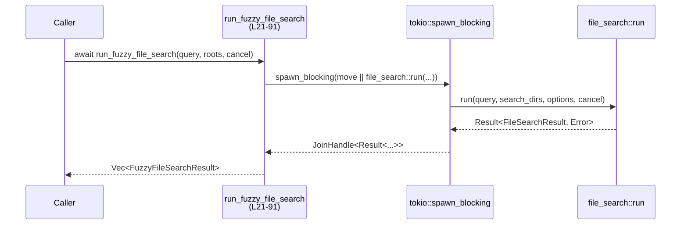
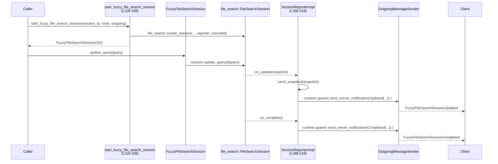

# app-server/src/fuzzy_file_search.rs

※ 行番号は、このファイル内容の先頭行を 1 としたローカル行番号です（例: `fuzzy_file_search.rs:L21-91`）。

---

## 0. ざっくり一言

- `codex_file_search` クレートを利用して、ファジーなファイル検索を行う **一括検索関数** と、インクリメンタル検索用の **セッション管理・通知連携** を提供するモジュールです。

---

## 1. このモジュールの役割

### 1.1 概要

- このモジュールは、**ファジーなファイルパス検索**を行い、その結果を
  - 一度に `Vec<FuzzyFileSearchResult>` として返す API（ワンショット検索）と
  - 検索結果のスナップショットを逐次 `ServerNotification` として送信するセッション API
- として提供します。  
  外部クレート `codex_file_search` の検索エンジンと、`codex_app_server_protocol` のプロトコル型の間を橋渡しする役割です。

### 1.2 アーキテクチャ内での位置づけ

- 主な依存関係は以下です（行番号は代表的な定義場所）:
  - `run_fuzzy_file_search` → `codex_file_search::run` を `tokio::task::spawn_blocking` で呼び出し（L21-82）
  - セッション API (`FuzzyFileSearchSession`, `start_fuzzy_file_search_session`) → `file_search::create_session` と `file_search::SessionReporter` 実装（L93-158, L168-228）
  - 通知送信 → `OutgoingMessageSender` 経由で `ServerNotification` を送信（L192-202, L211-215）

```mermaid
graph TD
    A[run_fuzzy_file_search<br/>(L21-91)] --> B[codex_file_search::run]
    C[start_fuzzy_file_search_session<br/>(L118-158)] --> D[file_search::FileSearchSession]
    D --> E[SessionReporterImpl<br/>(L168-218)]
    E --> F[OutgoingMessageSender<br/>(crate::outgoing_message)]
    F --> G[クライアント<br/>(codex_app_server_protocol)]
```

### 1.3 設計上のポイント

- **ワンショット検索とセッション検索の分離**  
  - ワンショット: `run_fuzzy_file_search` が `codex_file_search::run` を一度だけ実行（L21-82）
  - セッション: `start_fuzzy_file_search_session` で `FileSearchSession` を作成し、`SessionReporterImpl` で更新通知を受け取る（L118-158, L172-218）
- **キャンセル制御の共有**  
  - 検索のキャンセルに `Arc<AtomicBool>` を使用（L24, L132-140, L160-166）  
  - `FuzzyFileSearchSession` の `Drop` でフラグを立てることでセッション終了を伝える（L112-115）
- **スレッド／並列数の決定**  
  - 使用コア数からスレッド数を決定し、`MAX_THREADS` で上限をかけ、`NonZero<usize>` で 0 を避ける（L33-38, L124-130）
- **結果ソートの一元化**  
  - スコア降順→パス昇順のソートを `file_search::cmp_by_score_desc_then_path_asc` に委譲し、ワンショットとセッションで共通利用（L84-88, L250-254）
- **スナップショットのフィルタリング**  
  - `SessionReporterImpl::send_snapshot` 内で「最新のクエリと一致するスナップショットだけ送信」することで古い検索結果を抑制（L178-185）

---

## 2. コンポーネント一覧（インベントリー）

### 2.1 定数

| 名前 | 型 | 値 / 役割 | 定義位置 |
|------|----|-----------|----------|
| `MATCH_LIMIT` | `usize` | 返却するマッチ数の上限（最大 50 件） | `fuzzy_file_search.rs:L18` |
| `MAX_THREADS` | `usize` | 検索に使うスレッド数の上限（最大 12） | `fuzzy_file_search.rs:L19` |

### 2.2 型（構造体）

| 名前 | 可視性 | 役割 / 用途 | 主なフィールド | 定義位置 |
|------|--------|-------------|----------------|----------|
| `FuzzyFileSearchSession` | `pub(crate)` | ファジー検索セッションを表すハンドル。クエリ更新と Drop 時のキャンセルを管理。 | `session: file_search::FileSearchSession`, `shared: Arc<SessionShared>` | `fuzzy_file_search.rs:L93-96` |
| `SessionShared` | private | セッション共有状態。セッション ID, 最新クエリ, 送信チャネル, Tokio ランタイムハンドル, キャンセルフラグを保持。 | `session_id`, `latest_query: Mutex<String>`, `outgoing`, `runtime`, `canceled` | `fuzzy_file_search.rs:L160-166` |
| `SessionReporterImpl` | private | `file_search::SessionReporter` 実装。スナップショットからプロトコル用通知を生成・送信。 | `shared: Arc<SessionShared>` | `fuzzy_file_search.rs:L168-170` |

### 2.3 関数・メソッド

| 名前 | 種別 | 概要 | 定義位置 |
|------|------|------|----------|
| `run_fuzzy_file_search` | `pub(crate) async fn` | ワンショットでファジーファイル検索を実行し、結果をソートして返す。 | `fuzzy_file_search.rs:L21-91` |
| `FuzzyFileSearchSession::update_query` | `pub(crate) fn` | セッションの検索クエリを更新し、共有状態にも保存する。 | `fuzzy_file_search.rs:L98-109` |
| `Drop for FuzzyFileSearchSession::drop` | `impl Drop` | セッション破棄時にキャンセルフラグを立てる。 | `fuzzy_file_search.rs:L112-115` |
| `start_fuzzy_file_search_session` | `pub(crate) fn` | 新しいファジー検索セッションを開始し、`FuzzyFileSearchSession` を返す。 | `fuzzy_file_search.rs:L118-158` |
| `SessionReporterImpl::send_snapshot` | `fn` | スナップショットを検査し、必要に応じて `FuzzyFileSearchSessionUpdated` 通知を送る。 | `fuzzy_file_search.rs:L172-203` |
| `SessionReporterImpl::send_complete` | `fn` | セッション完了時に `FuzzyFileSearchSessionCompleted` 通知を送る。 | `fuzzy_file_search.rs:L205-217` |
| `file_search::SessionReporter::on_update` | trait impl | `send_snapshot` を呼び出すトリガー。 | `fuzzy_file_search.rs:L220-223` |
| `file_search::SessionReporter::on_complete` | trait impl | `send_complete` を呼び出すトリガー。 | `fuzzy_file_search.rs:L225-227` |
| `collect_files` | `fn` | `FileSearchSnapshot` から `Vec<FuzzyFileSearchResult>` を生成しソートする。 | `fuzzy_file_search.rs:L230-255` |

---

## 3. 公開 API と詳細解説

### 3.1 型一覧（公開視点）

| 名前 | 種別 | 可視性 | 役割 / 用途 |
|------|------|--------|-------------|
| `FuzzyFileSearchSession` | 構造体 | `pub(crate)` | 他モジュールからセッションベースのファジー検索を操作するためのハンドル。`update_query` と Drop によるキャンセルを提供。 |

内部型 `SessionShared`, `SessionReporterImpl` はこのモジュール内限定です。

---

### 3.2 重要関数・メソッド詳細（テンプレート適用）

#### `run_fuzzy_file_search(query: String, roots: Vec<String>, cancellation_flag: Arc<AtomicBool>) -> Vec<FuzzyFileSearchResult>` （L21-91）

**概要**

- 指定されたルートディレクトリ群 `roots` に対して、文字列 `query` を用いたファジーファイル検索を実行し、最大 `MATCH_LIMIT` 件までの結果をスコア順に返します（L21-28, L30-88）。
- 検索処理は `tokio::task::spawn_blocking` でブロッキングスレッド上にオフロードされます（L41-55）。

**引数**

| 引数名 | 型 | 説明 |
|--------|----|------|
| `query` | `String` | 検索クエリ文字列。`codex_file_search` にそのまま渡されます（L42-43）。 |
| `roots` | `Vec<String>` | 検索対象ルートディレクトリのパス文字列リスト。空の場合は即座に空ベクタを返します（L26-28）。 |
| `cancellation_flag` | `Arc<AtomicBool>` | `file_search::run` に渡されるキャンセルフラグ（L51）。`true` にされると検索側でキャンセルされる想定です。 |

**戻り値**

- `Vec<FuzzyFileSearchResult>`  
  - 各要素は `root`, `path`, `match_type`, `file_name`, `score`, `indices` を含みます（L60-71）。
  - 検索失敗や Join エラーが起きた場合は空ベクタが返され、`tracing::warn!` でログが出ます（L74-81）。

**内部処理の流れ**

1. `roots` が空なら即 `Vec::new()` を返す（L26-28）。
2. `MATCH_LIMIT` を `NonZero<usize>` に変換（L30-31）。
3. 使用可能コア数を取得し、`MAX_THREADS` を上限としてスレッド数を決定し、`NonZero<usize>` に変換（L33-38）。
4. `roots` を `PathBuf` に変換して `search_dirs` を構築（L39）。
5. `tokio::task::spawn_blocking` でクロージャを実行し、その中で `file_search::run` を呼び出す（L41-53）。
6. `spawn_blocking` の結果を `match` で分岐:
   - `Ok(Ok(res))`: `res.matches` を `FuzzyFileSearchResult` にマッピング（L56-73）。
   - `Ok(Err(err))`: エラーを `warn!` ログし、空ベクタ（L74-77）。
   - `Err(err)`: Join エラーを `warn!` ログし、空ベクタ（L78-81）。
7. 結果ベクタを `cmp_by_score_desc_then_path_asc` でソート（L84-88）。
8. ソート済みベクタを返す（L90）。

**Examples（使用例）**

```rust
use std::sync::{Arc, atomic::{AtomicBool, Ordering}};

// 非同期コンテキスト内での利用例
async fn search_example() {
    let query = "main.rs".to_string();                    // 検索クエリ
    let roots = vec!["/workspace".to_string()];           // ルートディレクトリ
    let cancel = Arc::new(AtomicBool::new(false));        // キャンセルフラグ（初期値 false）

    let results = run_fuzzy_file_search(query, roots, cancel.clone()).await;

    for r in results {
        println!("{} (score={})", r.path, r.score);       // パスとスコアを表示
    }

    // 必要ならどこかでキャンセル
    cancel.store(true, Ordering::Relaxed);
}
```

**Errors / Panics**

- この関数自体は `Result` を返さず、エラー時は空ベクタを返します。
  - `file_search::run` からのエラー → ログ出力のみ（L74-77）。
  - `spawn_blocking` の Join エラー（パニックなど） → ログ出力のみ（L78-81）。
- `NonZero::new(...).expect(...)` により、`MATCH_LIMIT` またはスレッド数が 0 だった場合はパニックします（L30-31, L37-38）。  
  現状の定数値（50, 12）と `threads.max(1)` により実行時には 0 にならない設計です。
- `file_name` 抽出には `file_name().unwrap_or_default()` を使っているため（L60）、ここでパニックは発生しません。

**Edge cases（エッジケース）**

- `roots.is_empty()` → 検索を行わず即座に `Vec::new()`（L26-28）。
- `query` が空文字列の場合
  - そのまま `file_search::run` に渡されます（L42-43）。
  - `codex_file_search` 側での扱いはこのチャンクからは不明です。
- `cancellation_flag` が検索途中で `true` になる場合
  - フラグは `file_search::run` に `Some(cancellation_flag)` として渡されるだけで（L51）、実際にどのようにキャンセルされるかは `codex_file_search` に依存します。

**使用上の注意点**

- この関数はブロッキング I/O を内部で `spawn_blocking` にオフロードしますが、検索対象ディレクトリが多い・深い場合は **処理時間が長くなる可能性** があります。
- エラー時に空ベクタを返すため、呼び出し側で「結果が空＝エラー」なのか「本当にマッチがない」のか判別できません。  
  監視用途には `tracing` のログを併用する必要があります（L74-81）。
- `cancellation_flag` は **共有される可能性がある** ため、複数の検索呼び出しで同じフラグを使う設計の場合、そのライフサイクルに注意が必要です。

---

#### `FuzzyFileSearchSession::update_query(&self, query: String)` （L98-109）

**概要**

- セッションベースのファジー検索に対し、新しい検索クエリを設定します。
- 共有状態 `latest_query` にクエリを保存し、基盤の `file_search::FileSearchSession` にも更新を伝えます（L104-108）。

**引数**

| 引数名 | 型 | 説明 |
|--------|----|------|
| `query` | `String` | 新しい検索クエリ文字列。内部でクローンされ `latest_query` に保存されます（L104-107）。 |

**戻り値**

- なし (`()` を暗黙に返す)。

**内部処理の流れ**

1. `shared.canceled` が `true` なら何もせず return（L100-102）。
2. `latest_query` の `Mutex` をロックし、新しいクエリを上書き（L104-107）。
3. `session.update_query(&query)` を呼び出し、`file_search::FileSearchSession` にクエリ更新を伝える（L108）。

**Examples（使用例）**

```rust
fn update_query_example(session: &FuzzyFileSearchSession) {
    // ユーザー入力などから新しいクエリを取得
    let new_query = "lib.rs".to_string();
    session.update_query(new_query);                      // セッションにクエリを反映
}
```

**Errors / Panics**

- `latest_query.lock().unwrap()` が `unwrap` を使用しているため、`Mutex` がポイズン状態（別スレッドでパニック済み）だとパニックします（L104-105）。
- `session.update_query` の内部挙動やエラー有無は `codex_file_search` 次第であり、このチャンクからは不明です。

**Edge cases**

- セッションがすでにキャンセル済みの場合（`canceled == true`）は、クエリは更新されず、`FileSearchSession` への更新も行われません（L100-102）。
- 空文字列のクエリもそのまま受け付けます。後段でどう扱われるかは `codex_file_search` / `SessionReporterImpl` 依存（`send_snapshot` 内で空クエリ時は空ベクタ送信: L186-190）。

**使用上の注意点**

- `update_query` は **非同期ではなく同期メソッド** なので、呼び出し側スレッドで `Mutex` ロックが発生します。頻繁な更新が想定される場合はロック競合に留意が必要です。
- セッションのライフタイム終了直前に呼び出した場合、`Drop` のキャンセルとレースになる可能性はありますが、`AtomicBool` を用いた単純なフラグであり、重大な整合性問題にはなりにくい設計です（L112-115）。

---

#### `start_fuzzy_file_search_session(session_id: String, roots: Vec<String>, outgoing: Arc<OutgoingMessageSender>) -> anyhow::Result<FuzzyFileSearchSession>` （L118-158）

**概要**

- ファジー検索用のセッションを初期化し、`FuzzyFileSearchSession` を返します。
- 内部で `file_search::create_session` を呼び出し、`SessionReporterImpl` をレポーターとして設定します（L145-155）。

**引数**

| 引数名 | 型 | 説明 |
|--------|----|------|
| `session_id` | `String` | セッション識別子。通知メッセージに含められます（L135, L194）。 |
| `roots` | `Vec<String>` | 検索対象ルートディレクトリのリスト（L120-121, L131）。 |
| `outgoing` | `Arc<OutgoingMessageSender>` | サーバーからクライアントへ通知を送るための送信オブジェクト（L121, L137）。 |

**戻り値**

- `anyhow::Result<FuzzyFileSearchSession>`  
  - 成功時: セッションハンドル。`update_query` でクエリを更新できます（L157-158）。
  - 失敗時: `file_search::create_session` などから伝播したエラー（L145-155）。

**内部処理の流れ**

1. `MATCH_LIMIT` を `NonZero` に変換（L123-124）。
2. コア数からスレッド数を決定し、`NonZero` に変換（L125-130）。
3. `roots` を `PathBuf` に変換（L131）。
4. `canceled` フラグ用に `Arc<AtomicBool>` を作成（L132）。
5. `SessionShared` を構築し、`Arc` で包む（L134-140）。
   - `runtime` には `tokio::runtime::Handle::current()` を保存（L138）。
6. `SessionReporterImpl` を `Arc` で作成（L142-144）。
7. `file_search::create_session` に `search_dirs`, `FileSearchOptions`, `reporter`, `Some(canceled)` を渡し、`FileSearchSession` を作成（L145-155）。
8. `FuzzyFileSearchSession { session, shared }` を返す（L157-158）。

**Examples（使用例）**

```rust
async fn start_session_example(
    outgoing: Arc<OutgoingMessageSender>,
) -> anyhow::Result<FuzzyFileSearchSession> {
    let session_id = "session-1".to_string();            // セッションID
    let roots = vec!["/workspace".to_string()];          // 検索ルート

    // セッション開始
    let session = start_fuzzy_file_search_session(session_id, roots, outgoing)?;

    // 例: 最初のクエリを設定
    session.update_query("Cargo.toml".to_string());

    Ok(session)
}
```

**Errors / Panics**

- `create_session` 呼び出し（L145-155）でエラーが発生した場合は `?` 演算子によりそのまま `Err` として返ります。
- スレッド数と `MATCH_LIMIT` に関する `NonZero::new(...).expect(...)` は 0 の場合にパニックしますが、`threads.max(1)` および定数値により通常は 0 になりません（L123-130）。

**Edge cases**

- `roots` が空の場合も、そのまま `create_session` に渡されます（L131）。  
  空ルートの扱いは `codex_file_search` 側に依存し、このチャンクからは不明です。
- `session_id` が空文字列でも特にチェックはなく、そのまま通知に使用されます（L194, L213）。

**使用上の注意点**

- この関数を呼び出すスレッド（通常は Tokio ランタイム上）で `tokio::runtime::Handle::current()` を取得しているため（L138）、**Tokio ランタイム外から呼び出すとパニック** します。
- 返された `FuzzyFileSearchSession` の Drop によりキャンセルフラグが立つので、所有権とライフタイムの管理が重要です（L112-115, L132-140）。

---

#### `SessionReporterImpl::send_snapshot(&self, snapshot: &file_search::FileSearchSnapshot)` （L172-203）

**概要**

- `file_search` から渡された `FileSearchSnapshot` を検査し、
  - セッションがキャンセルされていない
  - スナップショットの `query` が最新のクエリと一致している
- という条件を満たす場合に `FuzzyFileSearchSessionUpdated` 通知を送信します（L174-198）。

**引数**

| 引数名 | 型 | 説明 |
|--------|----|------|
| `snapshot` | `&file_search::FileSearchSnapshot` | 現在の検索状態とマッチ結果のスナップショット（L173）。 |

**戻り値**

- なし (`()` を返す)。

**内部処理の流れ**

1. `canceled` フラグが `true` なら何もせず return（L174-176）。
2. `latest_query` を `Mutex` 経由で読み取り、そのクローンを `query` として使用（L178-181）。
3. `snapshot.query != query` の場合、古いクエリに対するスナップショットなので return（L182-184）。
4. `query.is_empty()` なら `files` を空ベクタに、それ以外は `collect_files(snapshot)` で結果一覧を構築（L186-190）。
5. `FuzzyFileSearchSessionUpdatedNotification` を生成し（L192-197）、`ServerNotification::FuzzyFileSearchSessionUpdated` に包む（L192）。
6. `OutgoingMessageSender` をクローンし、`runtime.spawn(async move { ... })` で非同期タスクとして通知送信を行う（L199-202）。

**Examples（使用例）**

※ 通常は `file_search` が内部から呼び出すため、外部コードから直接使うことはありません。挙動理解のための疑似例です。

```rust
fn reporter_example(reporter: &SessionReporterImpl, snapshot: &file_search::FileSearchSnapshot) {
    // file_search::SessionReporter::on_update から呼ばれる想定
    reporter.send_snapshot(snapshot);                    // 条件が合えば通知が送信される
}
```

**Errors / Panics**

- `latest_query.lock().unwrap()` で `Mutex` がポイズンされているとパニックします（L178-180）。
- `OutgoingMessageSender::send_server_notification` の内部エラーはここでは捕捉されず、`async` タスク内で処理されます（L200-202）。この関数からは見えません。
- `runtime.spawn` 自体は一般にパニックしませんが、有効な Tokio ランタイムハンドルが必要です（L200-202）。

**Edge cases**

- キャンセル済みセッション (`canceled == true`) では、スナップショットは無視されます（L174-176）。
- スナップショットの `query` が最新のクエリと異なる場合（古い検索リクエストの結果）も無視されます（L182-184）。  
  これにより、クエリを高速に更新した際に古い結果がクライアントに届くのを防いでいます。
- 空クエリ時に `files` を空ベクタとして送るため、UI に「空クエリ＝結果なし」と明確に伝えられます（L186-190）。

**使用上の注意点**

- `Mutex` ロック+`clone()` によるオーバーヘッドがあるため、スナップショット頻度が高い場合は多少のコストになります。
- `runtime.spawn` は「火&忘れ」型であり、通知送信タスクの完了を待ちません。通知キューの輻輳・失敗検知などは `OutgoingMessageSender` 側の責務です。

---

#### `collect_files(snapshot: &file_search::FileSearchSnapshot) -> Vec<FuzzyFileSearchResult>` （L230-255）

**概要**

- `file_search::FileSearchSnapshot` の `matches` を `FuzzyFileSearchResult` に変換し、スコア降順／パス昇順でソートして返します（L231-248, L250-254）。
- セッション通知用に `SessionReporterImpl::send_snapshot` から利用されます（L189-190）。

**引数**

| 引数名 | 型 | 説明 |
|--------|----|------|
| `snapshot` | `&file_search::FileSearchSnapshot` | マッチ結果を含むスナップショット（L230-233）。 |

**戻り値**

- `Vec<FuzzyFileSearchResult>`  
  - 各要素は `root`, `path`, `match_type`, `file_name`, `score`, `indices.clone()` を含みます（L235-246）。

**内部処理の流れ**

1. `snapshot.matches` をイテレート（L231-233）。
2. 各マッチ `m` について:
   - ファイル名を `m.path.file_name().unwrap_or_default()` から取得（L235）。
   - `FuzzyFileSearchResult` を構築（L236-246）。
3. ベクタを `cmp_by_score_desc_then_path_asc` でソート（L250-254）。
4. ソート済みベクタを返却（L255）。

**Examples（使用例）**

```rust
fn snapshot_to_results(snapshot: &file_search::FileSearchSnapshot) -> Vec<FuzzyFileSearchResult> {
    collect_files(snapshot)                               // そのまま変換関数として利用
}
```

**Errors / Panics**

- `file_name().unwrap_or_default()` により `Option<OsStr>` が `None` の場合もデフォルトで処理され、パニックしません（L235）。
- `indices.clone()` は `m.indices` の型に応じた `Clone` 実装が使われます（L245）。ここでのエラー発生可能性は低いです。

**Edge cases**

- `snapshot.matches` が空の場合は空ベクタを返します（L231-248）。
- `m.path` にファイル名がない（ルートディレクトリなど）場合、`file_name` は空文字列になります（L235-243）。

**使用上の注意点**

- 検索結果数が多い場合でも、`MATCH_LIMIT` による上限は `file_search` 側で制御されているため、この関数自体はその前提で動作します。
- `indices.clone()` によるデータコピーがあるため、インデックス情報が大きい場合はメモリアロケーションコストに留意が必要です。

---

### 3.3 その他の関数・メソッド

| 関数名 | 役割（1 行） | 定義位置 |
|--------|--------------|----------|
| `impl Drop for FuzzyFileSearchSession::drop` | セッション破棄時に `canceled` フラグを `true` にし、それ以上の更新・通知を抑制するトリガーとなります。 | `fuzzy_file_search.rs:L112-115` |
| `SessionReporterImpl::send_complete` | セッション完了時に `FuzzyFileSearchSessionCompleted` 通知を送信します。 | `fuzzy_file_search.rs:L205-217` |
| `file_search::SessionReporter::on_update` | `send_snapshot` を呼び出すためのコールバック実装です。 | `fuzzy_file_search.rs:L220-223` |
| `file_search::SessionReporter::on_complete` | `send_complete` を呼び出すためのコールバック実装です。 | `fuzzy_file_search.rs:L225-227` |

---

## 4. データフロー / 呼び出しフロー

### 4.1 ワンショット検索のフロー

- 呼び出し側（例えば RPC ハンドラ）から `run_fuzzy_file_search` が呼ばれ、`codex_file_search::run` で検索が実行されます。



- 途中で `cancel` フラグが立つと、`file_search::run` 側の実装に応じて早期終了が発生する想定です（L51）。

### 4.2 セッション検索・通知のフロー

- セッション開始から通知送信までの流れです。



- `Drop` によるキャンセル（SS 破棄 → `canceled` true）は、`FS` と `R` の挙動に影響し、以後の更新・通知が抑制されます（L112-115, L174-176, L206-207）。

---

## 5. 使い方（How to Use）

### 5.1 基本的な使用方法

#### ワンショット検索

```rust
use std::sync::{Arc, atomic::AtomicBool};
use app_server::fuzzy_file_search::run_fuzzy_file_search; // 実際のパスはクレート構成に依存

#[tokio::main]
async fn main() {
    let query = "mod.rs".to_string();                    // 検索クエリ
    let roots = vec!["/workspace".to_string()];          // 検索ルート
    let cancel = Arc::new(AtomicBool::new(false));       // キャンセルフラグ

    let results = run_fuzzy_file_search(query, roots, cancel).await;

    for r in results {
        println!("{} ({:?}) score={}", r.path, r.match_type, r.score);
    }
}
```

#### セッション検索

```rust
use std::sync::Arc;
use app_server::fuzzy_file_search::{
    start_fuzzy_file_search_session, FuzzyFileSearchSession
};
use app_server::outgoing_message::OutgoingMessageSender; // 実際のパスはモジュール構成による

async fn use_session(outgoing: Arc<OutgoingMessageSender>) -> anyhow::Result<()> {
    let session = start_fuzzy_file_search_session(
        "session-123".to_string(),
        vec!["/workspace".to_string()],
        outgoing,
    )?;                                                  // セッション開始

    session.update_query("foo.rs".to_string());          // 初回クエリ
    session.update_query("bar.rs".to_string());          // すぐに別クエリに更新

    // ここで file_search 側がバックグラウンドで検索し、
    // SessionReporterImpl を通じて Updated/Completed 通知が送信されます。

    // 関数を抜けると session が Drop され、キャンセルフラグが立ちます。
    Ok(())
}
```

### 5.2 よくある使用パターン

- **LSP 風のインクリメンタル検索 UI**
  - フロントエンドがキー入力ごとにクエリを送り、バックエンドでは単一の `FuzzyFileSearchSession` を保持し `update_query` を呼ぶ。
  - クエリが頻繁に変わる場合でも `send_snapshot` が古いクエリのスナップショットを破棄するため、最新の結果のみがクライアントに届きます（L182-184）。

- **バッチ処理用のワンショット検索**
  - CLI や一度だけの検索には `run_fuzzy_file_search` を使う。
  - エラーも空ベクタになるため、単純なユースケースではエラーハンドリングを簡略化できます（L74-81）。

### 5.3 よくある間違いと正しい使い方

```rust
// 誤り例: Tokio ランタイム外からセッションを開始
fn wrong_start_session(outgoing: Arc<OutgoingMessageSender>) {
    // tokio::runtime::Handle::current() が利用できずパニックの可能性
    let _ = start_fuzzy_file_search_session("id".to_string(), vec![], outgoing);
}

// 正しい例: Tokio ランタイム内で実行
#[tokio::main]
async fn correct_start_session(outgoing: Arc<OutgoingMessageSender>) {
    let session = start_fuzzy_file_search_session("id".to_string(), vec![], outgoing).unwrap();
    session.update_query("query".to_string());
}
```

```rust
// 誤り例: セッションを即座に Drop してしまう
fn wrong_lifetime(outgoing: Arc<OutgoingMessageSender>) -> anyhow::Result<()> {
    let session = start_fuzzy_file_search_session("id".to_string(), vec![], outgoing)?;
    session.update_query("query".to_string());
    // ここで関数を抜けると session が Drop され、キャンセルされてしまう
    Ok(())
}

// 正しい例: セッションを保持している間だけ検索を続けたい
struct SearchController {
    session: FuzzyFileSearchSession,
}

impl SearchController {
    fn new(outgoing: Arc<OutgoingMessageSender>) -> anyhow::Result<Self> {
        let session = start_fuzzy_file_search_session("id".to_string(), vec![], outgoing)?;
        Ok(Self { session })
    }

    fn update(&self, query: String) {
        self.session.update_query(query);
    }
}
```

### 5.4 使用上の注意点（まとめ）

- **Tokio ランタイム前提**  
  - `start_fuzzy_file_search_session` 内で `tokio::runtime::Handle::current()` を取得するため、Tokio ランタイム外での呼び出しは避ける必要があります（L138）。
- **キャンセルフラグのライフサイクル**  
  - `FuzzyFileSearchSession` の Drop でキャンセルされる設計のため、セッションハンドルの所有権管理が重要です（L112-115, L132-140）。
- **エラー検知**  
  - ワンショット検索はエラー時に空ベクタを返します。エラー検知には `tracing::warn` ログを監視する必要があります（L74-81）。
- **スレッド数・負荷**  
  - スレッド数はコア数と `MAX_THREADS` に依存します（L33-38, L125-130）。検索負荷が高い環境では、`MAX_THREADS` の変更や `codex_file_search` 側の設定が必要になる可能性があります。

---

## 6. 変更の仕方（How to Modify）

### 6.1 新しい機能を追加する場合

- **検索オプションの拡張**
  - 例: ファイルタイプフィルタや除外パターンを追加したい場合
    1. `file_search::FileSearchOptions` に必要なフィールドがあるか確認し（外部クレート）、なければそちらの拡張が必要です。
    2. このモジュールでは `run_fuzzy_file_search` と `start_fuzzy_file_search_session` 内の `FileSearchOptions { ... }` 初期化部（L45-50, L147-152）に新フィールドを渡すよう変更します。
- **通知内容の拡張**
  - 例: 結果に追加メタデータを含めたい場合
    1. `codex_app_server_protocol::FuzzyFileSearchResult` にフィールドを追加。
    2. `run_fuzzy_file_search` および `collect_files` でマッピングを拡張（L60-71, L235-246）。
    3. クライアント側の処理も併せて変更する必要があります。

### 6.2 既存の機能を変更する場合

- **ソート順の変更**
  - 現在は `score` 降順→`path` 昇順（L84-88, L250-254）。  
    ソート基準を変える場合は `cmp_by_score_desc_then_path_asc` 呼び出しを見直すか、新しい比較関数を導入します。
- **キャンセルポリシーの変更**
  - 現在は `Drop` 時に `canceled` を `true` にするだけです（L112-115）。
  - より強制的なキャンセルや時間切れ（タイムアウト）を導入したい場合は:
    - `SessionShared` にタイムスタンプやデッドラインを追加（L160-166）。
    - `send_snapshot` / `send_complete` で時間条件をチェックする、などの拡張が考えられます。
- **エラーハンドリングの詳細化**
  - ワンショット検索のエラーを呼び出し側で識別したい場合は、
    - `run_fuzzy_file_search` の戻り値を `Result<Vec<_>, Error>` に変更し、`Ok(Err(err))` や `Err(err)` を適切なエラーにマッピングする変更が必要です（L56-81）。

変更時には、`SessionReporterImpl` と `FuzzyFileSearchSession` の間で共有しているフィールド（`SessionShared`）の契約が保たれているかを確認することが重要です。

---

## 7. 関連ファイル・外部モジュール

| パス / モジュール | 役割 / 関係 |
|-------------------|------------|
| `crate::outgoing_message::OutgoingMessageSender` | サーバーからクライアントへの `ServerNotification` を送信するためのチャネル型です（L16, L137, L199-202, L210-215）。実ファイルパスはこのチャンクからは不明ですが、`crate::outgoing_message` モジュールに定義されています。 |
| `codex_app_server_protocol` | `FuzzyFileSearchResult`, `FuzzyFileSearchMatchType`, `FuzzyFileSearchSessionUpdatedNotification`, `FuzzyFileSearchSessionCompletedNotification`, `ServerNotification` など、プロトコル上の型を提供します（L8-12, L192-197, L211-214）。 |
| `codex_file_search` (`use codex_file_search as file_search`) | 実際のファジーファイル検索エンジン。`run`, `create_session`, `FileSearchOptions`, `FileSearchSession`, `FileSearchSnapshot`, `MatchType`, `SessionReporter`, 比較関数 `cmp_by_score_desc_then_path_asc` を提供します（L13, L42-52, L145-155, L220-223, L231-254）。 |

---

## 補足: Bugs / Security / Tests / Performance / Observability の観点

### 潜在的な問題・安全性

- `Mutex::lock().unwrap()` を複数箇所で使用しており（L104-105, L178-180）、`Mutex` ポイズン時にパニックします。  
  実運用でパニックを避ける場合は `unwrap` の代わりに `lock().ok()` 等でフォールバックする設計も検討余地があります。
- 検索対象 `roots` や `query` は信頼された入力である前提で扱っており、特別なサニタイズは行っていません（L22-24, L120-121, L39, L131）。  
  ユーザー入力を直接渡す場合は、呼び出し側でパス制限・正規化などを行う必要があります。

### コントラクト / エッジケース（まとめ）

- `run_fuzzy_file_search`
  - `roots.is_empty()` → 空結果保証（L26-28）。
  - エラーでも空結果になる（L74-81）。
- セッション関連
  - `FuzzyFileSearchSession` を Drop するとキャンセルフラグが立ち、`send_snapshot` / `send_complete` は以後何もしない（L112-115, L174-176, L206-207）。
  - スナップショットの `query` が最新クエリと一致しない場合は通知されない（L182-184）。
  - 空クエリの場合は空 `files` を通知（L186-190）。

### テストに関する情報

- このファイルにはテストコード（`#[cfg(test)]` など）は含まれていません。  
  動作確認は上位レイヤーの統合テストや `codex_file_search` / `codex_app_server_protocol` のテストに依存していると推測されますが、このチャンクからは詳細不明です。

### パフォーマンス / スケーラビリティ

- 並列性:
  - `available_parallelism()` に基づいてスレッド数を決定しつつ `MAX_THREADS` で上限をかけるため（L33-38, L125-130）、コア数が多い環境でも過剰なスレッド増加を抑えています。
  - `spawn_blocking` を用いてブロッキング I/O を分離し、Tokio ランタイムスレッドを塞がない設計です（L41-55）。
- 制限:
  - `MATCH_LIMIT` により返却件数を制限しており、クライアント側 UI の負荷やネットワーク帯域を抑制します（L18, L31, L46, L148）。

### 観測性（Observability）

- `tracing::warn!` によるエラーログ:
  - `file_search::run` の失敗（L74-77）。
  - `spawn_blocking` の Join 失敗（L78-81）。
- 通知ベース:
  - 検索進捗や完了は `FuzzyFileSearchSessionUpdated` / `Completed` 通知としてクライアントに見える形で提供されます（L192-197, L211-215）。

以上が、`fuzzy_file_search.rs` の構造と主な振る舞いの整理です。
