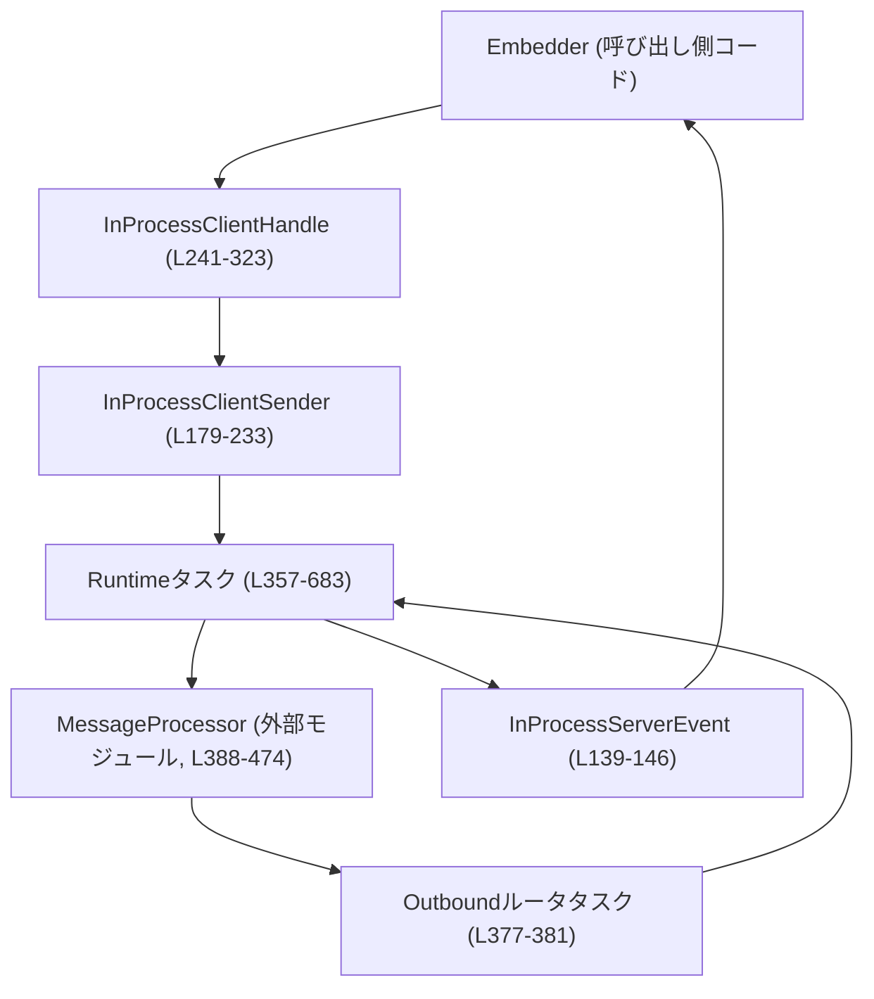
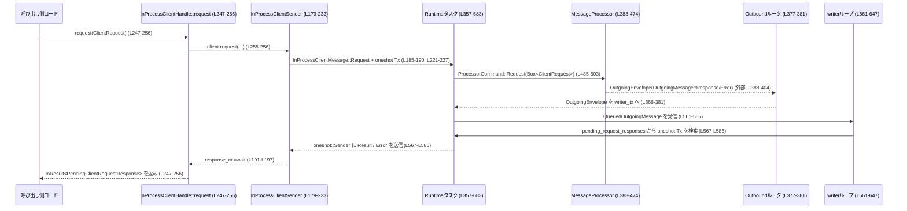

app-server/src/in_process.rs

---

## 0. ざっくり一言

このモジュールは、`MessageProcessor` を別プロセスではなく **同一プロセス内（in-process）** で動かすためのランタイムを提供し、`ClientRequest` / `ServerRequest` を Tokio のタスクとメモリ内チャネルで橋渡しするホストです（根拠: app-server/src/in_process.rs:L1-L39）。

---

## 1. このモジュールの役割

### 1.1 概要

- このモジュールは **CLI や TUI などが app-server を同一プロセス内で利用する** 場面向けに、インプロセス版の app-server ランタイムを提供します（L1-L6）。
- ソケットや stdio の代わりに、**bounded（上限付き）な Tokio mpsc チャネル**を使って、`ClientRequest`/`ClientNotification` と `ServerRequest`/`ServerNotification` をやり取りします（L3-L5, L64-L66, L354-L356）。
- 外部とのプロトコルは従来通り JSON-RPC のエンベロープに乗った app-server プロトコルのままであり、プロセス境界だけを取り除いた形になっています（L20-L24）。

### 1.2 アーキテクチャ内での位置づけ

インプロセス・クライアントと `MessageProcessor` / 送信経路の関係を図示します。



- 呼び出し側は `start` で `InProcessClientHandle` を取得し（L325-L350）、  
  `request` / `notify` / `next_event` / `shutdown` を通じてランタイムと対話します（L247-L323）。
- `InProcessClientHandle` は内部で `InProcessClientSender`（mpsc::Sender を保持）を使い、  
  `InProcessClientMessage` を **in-process runtime タスク**に送信します（L179-L183, L185-L221, L357-L361）。
- runtime タスクは `MessageProcessor` とアウトバウンドルータ（`route_outgoing_envelope`）を起動し、  
  `OutgoingMessage` を `InProcessServerEvent` に変換してクライアントに返します（L366-L381, L476-L683）。

### 1.3 設計上のポイント

- **責務分割**
  - `InProcessClientHandle` / `InProcessClientSender`: 呼び出し側 API と backpressure を IoError として報告（L179-L233, L247-L285）。
  - runtime タスク: リクエスト ID の管理・`MessageProcessor` への命令送信・サーバからのレスポンス/イベントの中継（L357-L683）。
  - `MessageProcessor`: ビジネスロジック（外部）、本モジュールはそのホスト（L388-L404）。
- **状態管理**
  - セッション状態や通知オプトアウト状態は `ConnectionSessionState` と `RwLock<HashSet<_>>` で管理（L405-L406, L364-L365, L423-L429）。
  - 初期化状態・実験的 API 有効フラグは `AtomicBool` で管理（L362-L363, L432-L433）。
- **エラーハンドリング方針**
  - トランスポート層エラーは `IoError`（`WouldBlock`/`BrokenPipe`/`InvalidData` など）で返却（L44-L46, L221-L231, L331-L347）。
  - アプリケーション層エラーは JSON-RPC の `JSONRPCErrorError` として返却し、エラーコードを `INVALID_REQUEST` / `OVERLOADED` / `INTERNAL_ERROR` から選択（L53-L55, L492-L526, L507-L513, L519-L525, L593-L618）。
- **並行性**
  - 主要コンポーネントはすべて Tokio のタスクとして実行され、間は mpsc チャネルと oneshot チャネルで接続されています（L357-L361, L377-L381, L387-L475）。
  - イベントストリームは単一の `mpsc::Receiver`（`event_rx`）で受信するため、**イベント消費者は 1 つ**を前提とした設計です（L241-L243, L291-L293, L355-L356）。
  - クライアントからの送信側は `InProcessClientSender` のクローンを複数タスクで共有可能な構造です（L179-L183, L320-L322）。

---

## 2. 主要な機能一覧

- インプロセス・ランタイムの起動と初期化ハンドシェイク（`start` / `InProcessStartArgs`）（L102-L132, L325-L350）。
- クライアントから app-server への JSON-RPC リクエスト送信（`InProcessClientHandle::request`）（L247-L256）。
- クライアント通知送信（`InProcessClientHandle::notify`）（L258-L264）。
- サーバからの `ServerRequest` をイベントとして受信し、応答/失敗を返す（`InProcessServerEvent`, `respond_to_server_request`, `fail_server_request`）（L139-L146, L266-L285, L542-L551）。
- サーバ通知（`ServerNotification`）をイベントとして受信し、重要な通知だけは必達にする（`server_notification_requires_delivery` + writer ループ）（L98-L100, L621-L641）。
- バックプレッシャー:
  - クライアント送信キュー溢れは `IoError(WouldBlock)` として返却（L221-L227）。
  - `MessageProcessor` 側キュー溢れは JSON-RPC `OVERLOADED` エラーとして応答（L501-L513）。
  - サーバ側リクエストキュー溢れはサーバへ JSON-RPC エラー返却（L587-L618）。
  - サーバ通知キュー溢れは重要通知のみ必達、それ以外はドロップ＆ログ（L621-L641）。
- ランタイムのクリーンなシャットダウンとタイムアウト後の強制中断（`InProcessClientHandle::shutdown` + runtime 終了処理）（L295-L318, L651-L682）。

---

## 3. 公開 API と詳細解説

### 3.1 コンポーネント一覧

#### 公開コンポーネント

| 名前 | 種別 | 役割 / 用途 | 定義位置 |
|------|------|-------------|----------|
| `InProcessStartArgs` | 構造体 | ランタイム起動に必要な設定・依存オブジェクト一式。`start` に渡す。 | app-server/src/in_process.rs:L102-L132 |
| `InProcessServerEvent` | 列挙体 | ランタイムからクライアントに送られるイベント（サーバリクエスト・サーバ通知・Lagged マーカー）。 | L134-L146 |
| `InProcessClientSender` | 構造体 | クライアント側からランタイムにメッセージを送る送信専用ハンドル。`InProcessClientHandle::sender` から取得。 | L179-L183, L320-L322 |
| `InProcessClientHandle` | 構造体 | クライアントから app-server を呼び出し、イベントを消費し、シャットダウンを行うメインハンドル。 | L235-L244 |
| `DEFAULT_IN_PROCESS_CHANNEL_CAPACITY` | 定数 | インプロセスランタイムのデフォルトチャネル容量。テスト等で利用。 | L93-L94 |
| `PendingClientRequestResponse` | 型エイリアス | 1 つのクライアントリクエストに対する JSON-RPC 成功 or エラー。`Result<Result, JSONRPCErrorError>` の別名。 | L96-L96 |
| `start` | 関数 | ランタイムを起動し、initialize/initialized ハンドシェイク済みの `InProcessClientHandle` を返す。 | L325-L350 |

#### 内部コンポーネント（参考）

| 名前 | 種別 | 役割 / 用途 | 定義位置 |
|------|------|-------------|----------|
| `InProcessClientMessage` | 列挙体 | `InProcessClientSender` から runtime タスクへの内部メッセージ。リクエスト・通知・サーバリクエスト応答・シャットダウンなど。 | L148-L172 |
| `ProcessorCommand` | 列挙体 | runtime から `MessageProcessor` への命令（クライアントリクエスト or 通知）。 | L174-L177 |
| `server_notification_requires_delivery` | 関数 | どの `ServerNotification` を必達扱いにするかを判定（現状 `TurnCompleted` のみ）。 | L98-L100 |
| `start_uninitialized` | 関数 | initialize/initialized をまだ送っていない状態で runtime を起動し、`InProcessClientHandle` を返す内部関数。 | L352-L690 |

---

### 3.2 主要関数・メソッドの詳細

#### `start(args: InProcessStartArgs) -> IoResult<InProcessClientHandle>`

**概要**

- インプロセス app-server ランタイムを起動し、`initialize` → `initialized` のハンドシェイクを **内部で完了した状態** の `InProcessClientHandle` を返します（L325-L350）。
- `initialize` が JSON-RPC エラーで失敗した場合はランタイムをシャットダウンし、`IoError(InvalidData)` を返します（L340-L347）。

**引数**

| 引数名 | 型 | 説明 |
|--------|----|------|
| `args` | `InProcessStartArgs` | 構成・依存オブジェクト・初期化パラメータ・チャネル容量など（L102-L132）。 |

**戻り値**

- `IoResult<InProcessClientHandle>`  
  - Ok: initialize/initialized ハンドシェイク済みのハンドル。すぐに `request` / `next_event` を呼び出せます（L325-L350）。
  - Err: トランスポートレベルのエラー、または initialize フェーズの論理エラー（`InvalidData`）が発生した場合。

**内部処理の流れ**

1. `args.initialize` をコピーして `initialize` パラメータを保存（L331）。
2. `start_uninitialized(args)` を呼び出し、未初期化の runtime と `InProcessClientHandle` を構築（L332, L352-L690）。
3. `ClientRequest::Initialize` を ID=0 で送り、レスポンスを待機（L334-L339）。
4. レスポンスが `Err(JSONRPCErrorError)` の場合、`client.shutdown().await` で runtime を停止し、`IoError(InvalidData, メッセージ)` に変換して返す（L340-L347）。
5. 成功時は `ClientNotification::Initialized` を送信し（L347）、その後ハンドルを Ok として返却（L349）。

**Examples（使用例）**

```rust
// ランタイム起動に必要な引数を組み立てる（簡略版）
let args = InProcessStartArgs {
    arg0_paths: Arg0DispatchPaths::default(),          // コマンド実行用の argv0 パス
    config: Arc::new(my_config),                       // 共有設定
    cli_overrides: Vec::new(),                         // CLI からの設定オーバーライド
    loader_overrides: LoaderOverrides::default(),      // 設定ローダのオーバーライド
    cloud_requirements: CloudRequirementsLoader::default(),
    feedback: CodexFeedback::new(),                    // テレメトリ・ログ出力先
    environment_manager: Arc::new(EnvironmentManager::new(None)),
    config_warnings: Vec::new(),                       // 初期化時の警告通知
    session_source: SessionSource::Cli,                // セッション種別
    enable_codex_api_key_env: false,                   // CODEX_API_KEY 環境変数の扱い
    initialize: InitializeParams {                     // initialize リクエストの中身
        client_info: ClientInfo {
            name: "my-client".to_string(),
            title: None,
            version: "0.1.0".to_string(),
        },
        capabilities: None,
    },
    channel_capacity: DEFAULT_IN_PROCESS_CHANNEL_CAPACITY,
};

// ランタイムを起動し、ハンドシェイク済みハンドルを取得する
let client = start(args).await?;                       // 失敗時は IoError を返す
```

（根拠: L102-L132, L325-L350）

**Errors / Panics**

- Errors
  - `client.request(...)` の返り値の `IoError` をそのまま伝播します（例えば runtime が既に落ちているなど）（L334-L339）。
  - initialize の JSON-RPC レスポンスが `Err(e)` のとき、`IoError(InvalidData, "in-process initialize failed: ...")` を返します（L340-L347）。
  - `client.notify(ClientNotification::Initialized)` の送信に失敗した場合も `IoError` を返します（L347）。
- Panics
  - この関数自身には `panic!` 呼び出しはありません。

**Edge cases（エッジケース）**

- `args.channel_capacity` が 0 の場合でも `start_uninitialized` 内で 1 にクランプされるため、起動自体は可能です（L352-L354, テスト L795-L820）。
- initialize がタイムアウトするケースは、このモジュールでは管理しておらず、`MessageProcessor` 側の実装に依存します（コードからは不明）。

**使用上の注意点**

- `start` は initialize/initialized を **内部で**送信するので、呼び出し側は二重に initialize を送るべきではありません（仕様コメントより, L325-L330）。
- initialize の `request_id` は 0 で固定されるため、後続のクライアントコードでは 0 を再利用しない方が混乱を避けやすいです（`InProcessClientHandle::request` のコメントも参照, L247-L254）。

---

#### `InProcessClientHandle::request(&self, request: ClientRequest) -> IoResult<PendingClientRequestResponse>`

**概要**

- 型付き `ClientRequest` を runtime へ送り、その JSON-RPC 成功結果（`Result`）または JSON-RPC エラー（`JSONRPCErrorError`）を受け取ります（L247-L256）。
- トランスポート層の問題（キュー満杯・runtime 終了など）は `IoError` として報告されます（L185-L197, L221-L231）。

**引数**

| 引数名 | 型 | 説明 |
|--------|----|------|
| `request` | `ClientRequest` | JSON-RPC ベースの app-server クライアントリクエスト。ID は呼び出し側が一意に管理する必要があります（L247-L254）。 |

**戻り値**

- `IoResult<PendingClientRequestResponse>`  
  - Ok(Ok(`Result`)): JSON-RPC 成功ペイロード（通常は JSON 値）を表す（L567-L570）。
  - Ok(Err(`JSONRPCErrorError`)): JSON-RPC エラー（アプリケーションレベルのエラー、`INVALID_REQUEST` や `OVERLOADED` など）（L492-L497, L507-L513, L579-L585）。
  - Err(`IoError`): トランスポート層の問題。`WouldBlock`（キュー満杯）または `BrokenPipe`（runtime 側のチャネルが閉じている）など（L221-L231）。

**内部処理の流れ**

1. `InProcessClientSender::request` に処理を委譲するだけの薄いラッパーです（L255-L256）。
2. `InProcessClientSender::request` 内では:
   1. oneshot チャネルを生成し、レスポンス用 `Sender` を `InProcessClientMessage::Request` に同梱（L185-L190）。
   2. `client_tx.try_send` で runtime にメッセージを送信。キューが満杯なら `IoError( WouldBlock )` を返す（L221-L227）。
   3. runtime 側で `MessageProcessor` がレスポンスを生成すると、writer ループが `OutgoingMessage::Response` / `Error` を受け取り、pending マップから該当の `Sender` を取り出して送信する（L476-L478, L567-L586）。
   4. oneshot レシーバ `response_rx.await` でレスポンスを待つ。sender がドロップされた場合は `IoError( BrokenPipe )` に変換されます（L191-L197）。

（根拠: L179-L197, L247-L256, L476-L478, L567-L586）

**Examples（使用例）**

```rust
// 既に start() 済みのクライアントハンドルがあると仮定する
let response = client
    .request(ClientRequest::ConfigRequirementsRead {
        request_id: RequestId::Integer(1),           // 呼び出し側で一意に管理する
        params: None,
    })
    .await
    .map_err(|io_err| {                              // IoError: トランスポート層エラー
        eprintln!("transport error: {io_err}");
        io_err
    })?
    .map_err(|rpc_err| {                             // JSONRPCErrorError: アプリレイヤのエラー
        eprintln!("rpc error: {} ({})", rpc_err.message, rpc_err.code);
        rpc_err
    })?;                                             // 最終的に JSON 値 (Result) を取り出す

// 返ってきた JSON 値を型にデシリアライズ
let parsed: ConfigRequirementsReadResponse =
    serde_json::from_value(response)?;
```

（テストの使用例を簡略化, L747-L761）

**Errors / Panics**

- Errors
  - `client_tx.try_send` が Full → `IoError( WouldBlock, "client queue is full" )`（L221-L227）。
  - `client_tx.try_send` が Closed → `IoError( BrokenPipe, "runtime is closed" )`（L227-L231）。
  - runtime 内でレスポンス oneshot がドロップ → `IoError( BrokenPipe, "...channel closed" )`（L191-L197）。
  - runtime 側で重複 ID と判断された場合、JSON-RPC エラー `code = INVALID_REQUEST_ERROR_CODE` が返却されます（L492-L497）。
  - `MessageProcessor` キュー溢れ時は `code = OVERLOADED_ERROR_CODE`（L507-L513）。
  - runtime 終了時は `code = INTERNAL_ERROR_CODE` などで一括キャンセルされることがあります（L519-L526, L653-L669）。
- Panics
  - このメソッド自体には panic はありません。

**Edge cases（エッジケース）**

- **重複 request_id**: まだ完了していない ID を再利用すると、`INVALID_REQUEST` エラーが即座に返され、リクエスト本体は `MessageProcessor` に送られません（L485-L499, L492-L497）。
- **キュー満杯**:
  - 外側の client キューが満杯 → `IoError( WouldBlock )` が返されるため、呼び出し側でリトライや backoff を実装できます（L221-L227）。
  - 内側の processor キューが満杯 → リクエストごとに `OVERLOADED` エラーを返却し、APP レイヤに過負荷を伝えます（L501-L513）。
- **runtime シャットダウン中**:
  - 送信後に runtime が落ちると、レスポンス oneshot がクローズされ、`IoError( BrokenPipe )` に変換されます（L191-L197）。

**使用上の注意点**

- リクエスト ID は **同時進行のリクエスト間で一意**になるように管理する必要があります（コメント, L247-L254）。
- `WouldBlock` を受け取った場合は、すぐにパニックせず、`tokio::task::yield_now()` などで間をおいてリトライするパターンがテストでも使われています（L797-L813）。
- JSON-RPC エラーはアプリケーションレイヤのエラーなので、トランスポートエラー (`IoError`) とは分けて扱うと挙動が明確になります。

---

#### `InProcessClientHandle::notify(&self, notification: ClientNotification) -> IoResult<()>`

**概要**

- 応答を期待しないクライアント通知を runtime に送信します（L258-L264）。
- キュー満杯・runtime 終了などのトランスポートエラーだけを `IoError` として報告します（L199-L202, L221-L231）。

**引数**

| 引数名 | 型 | 説明 |
|--------|----|------|
| `notification` | `ClientNotification` | 応答不要のクライアントからの通知。 |

**戻り値**

- `IoResult<()>`  
  - Ok: 通知が client キューに入ったことを意味します。`MessageProcessor` で処理される保証は、runtime の正常動作に依存します。
  - Err: `WouldBlock` または `BrokenPipe` などのトランスポートエラー（L221-L231）。

**内部処理の流れ**

1. `self.client.notify(notification)` に処理を委譲（L262-L264）。
2. `InProcessClientSender::notify` が `try_send_client_message` を呼び出し、`client_tx.try_send` のエラー種別に応じて `IoError` に変換（L199-L202, L221-L231）。

**Errors / Edge cases / 使用上の注意点**

- `WouldBlock`（client キュー満杯）は呼び出し側の制御（リトライ・ドロップ）に任されています（L221-L227）。
- `MessageProcessor` 側のキュー溢れ時は、通知はドロップされ、`warn!("dropping ... (queue full)")` だけが出力されます（L531-L537）。呼び出し側には通知されません。
- 応答不要の通知であるため、エラーをトランスポートレベルでしか検出できない点に注意が必要です。

---

#### `InProcessClientHandle::next_event(&mut self) -> Option<InProcessServerEvent>`

**概要**

- app-server からのイベント（`ServerRequest` / `ServerNotification` / `Lagged`）を 1 件受信します（L287-L293）。
- ランタイムタスクが終了し、イベントがこれ以上来ない場合は `None` を返します。

**引数**

| 引数名 | 型 | 説明 |
|--------|----|------|
| `&mut self` | `&mut InProcessClientHandle` | イベント用 `mpsc::Receiver` を内部に持つため、同時に複数タスクから呼べない設計です（L241-L243, L291-L293）。 |

**戻り値**

- `Option<InProcessServerEvent>`  
  - Some(event): 1 件のイベント。
  - None: runtime が終了し、イベントチャネルがクローズされた状態。

**内部処理の流れ**

1. `self.event_rx.recv().await` を呼び、mpsc チャネルから次のイベントを待ちます（L291-L293）。
2. runtime の writer ループが `OutgoingMessage` から `InProcessServerEvent` を組み立てて `event_tx` に送信することで、ここに届きます（L561-L642）。
   - サーバからのリクエスト → `InProcessServerEvent::ServerRequest`（L587-L592）。
   - サーバ通知 → `InProcessServerEvent::ServerNotification`（L621-L641）。
   - `Lagged` イベントはこのモジュール内では生成されておらず、上位レイヤでの利用が想定されます（定義のみ, L139-L146）。

**Errors / Edge cases / 使用上の注意点**

- `next_event` 自体は `IoError` を返さず、チャネルクローズを `None` で表現します。
- writer 側が `event_tx.send(...).await` でエラーになった場合（受信側がドロップされたなど）は runtime ループを終了するため、以降 `next_event` は `None` を返すようになります（L623-L629, L624-L629）。
- イベントは 1 コンシューマ向け設計のため、**複数タスクから同時に `next_event` を呼ぶべきではありません**（`&mut self` シグネチャと単一の `mpsc::Receiver` が根拠, L241-L243, L291-L293）。

---

#### `InProcessClientHandle::respond_to_server_request(&self, request_id: RequestId, result: Result)`

#### `InProcessClientHandle::fail_server_request(&self, request_id: RequestId, error: JSONRPCErrorError)`

まとめて説明します。

**概要**

- `next_event` で受信した `InProcessServerEvent::ServerRequest` に対する応答／拒否をサーバに送り返します（L266-L285）。
- これらは app-server 側の承認フローなどを解決するためのメソッドです。応答しないとターンが進行しない可能性があります（コメント, L275-L282）。

**引数**

| メソッド | 引数名 | 型 | 説明 |
|---------|--------|----|------|
| respond | `request_id` | `RequestId` | 対応する `ServerRequest` の ID（イベントからそのまま渡す必要があります）。 |
| respond | `result` | `Result` | サーバ要求に対する成功結果。 |
| fail | `request_id` | `RequestId` | 同上。 |
| fail | `error` | `JSONRPCErrorError` | サーバ要求を満たせない理由を JSON-RPC エラーとして表現したもの。 |

**戻り値**

- いずれも `IoResult<()>`。client キューへの送信に成功すれば Ok、満杯・クローズ時には `IoError` です（L203-L219, L221-L231）。

**内部処理の流れ**

1. どちらのメソッドも `InProcessClientSender` に処理を委譲（L271-L285）。
2. `InProcessClientSender` は `InProcessClientMessage::ServerRequestResponse` または `ServerRequestError` を生成し、`client_tx.try_send` で runtime に送信（L203-L219, L221-L231）。
3. runtime 側ループで受信されると、`OutgoingMessageSender::notify_client_response` または `notify_client_error` が呼び出され、サーバ側の pending リクエストに紐づいた応答として返却されます（L542-L551）。

**Errors / Edge cases / 使用上の注意点**

- `request_id` は **イベントから受け取ったもの**をそのまま使うべきであり、任意の ID を指定してもサーバ側でマッチせず意味のない応答になります（コメント, L266-L272）。
- `IoError( WouldBlock )` の場合は、サーバリクエスト応答キューが満杯であることを意味します。runtime 内ではこの経路への backpressure 専用処理はないため、呼び出し側でリトライ处理を検討する必要があります（L221-L227, L542-L551）。
- サーバ側で既にタイムアウト・キャンセル済みのリクエストに対して応答を送ると、`OutgoingMessageSender` 側で無視される可能性があります（この挙動は `OutgoingMessageSender` 実装依存で、本モジュールからは不明）。

---

#### `InProcessClientHandle::shutdown(self) -> IoResult<()>`

**概要**

- ランタイムにシャットダウン要求を送り、`MessageProcessor`・アウトバウンドルータ・内部タスクの終了を待ちます（L295-L318, L651-L682）。
- 各タスクの終了待ちには 5 秒のタイムアウトが設定されており、超過した場合は強制中断（`abort()`）します（L92-L92, L313-L317, L671-L678）。

**引数 / 戻り値**

- `self` を値として消費します。シャットダウン後にこのハンドルは使えません（L295-L300）。
- 戻り値は `IoResult<()>` ですが、内部タイムアウトや abort は `Ok(())` のまま返され、エラーにはなっていません（L317-L318, L671-L678）。  
  トランスポートレベルのエラーは、`Shutdown` メッセージ送信時の `send(...).await` のみが影響します（L303-L311）。

**内部処理の流れ**

1. `runtime_handle` を取り出し、クライアント→runtime 用 oneshot チャネル（`done_tx`, `done_rx`）を生成（L295-L302）。
2. `InProcessClientMessage::Shutdown { done_tx }` を `client_tx.send(...).await` で送信：
   - 成功した場合のみ、`SHUTDOWN_TIMEOUT` まで `done_rx` の完了を待機（L303-L311）。
3. `runtime_handle` 自体を `SHUTDOWN_TIMEOUT` まで待機し、タイムアウトしたら `abort()` してから再度 `await`（L313-L317）。
4. runtime 側では、`Shutdown` メッセージを受け取ると `shutdown_ack = Some(done_tx)` に保存し、メインループを抜けた後、クリーンアップを実行し、最後に `done_tx.send(())` を呼びます（L552-L555, L651-L682）。

**Errors / Edge cases / 使用上の注意点**

- `client_tx.send` に失敗（すでに runtime が終了済み）した場合、`done_rx` は待機されず、そのまま `runtime_handle` の join 待ちに進みます（L303-L311）。
- 内部で使用する `timeout` によるタイムアウトは `IoError` に変換されず、ログなども出していないため、**シャットダウン完了可否を厳密に知ることはできません**（L313-L317, L671-L678）。
- シャットダウン後、残っている pending クライアントリクエストには `INTERNAL_ERROR_CODE` を付けてエラーを返します（L653-L669）。

---

### 3.3 その他の関数・内部ロジック一覧

| 関数 / ロジック | 役割 | 定義位置 |
|-----------------|------|----------|
| `server_notification_requires_delivery` | どの `ServerNotification` を「必達」とするかを判定。現在は `TurnCompleted` のみ true（テストで確認, L98-L100, L822-L837）。 | L98-L100 |
| `start_uninitialized` | initialize/initialized を送らずに runtime を起動する内部関数。`start` からのみ使用。タスク・チャネル・`MessageProcessor` を初期化し、メインループとクリーンアップを実装。 | L352-L690 |
| runtime メインループ | `client_rx` と `writer_rx` からの入力を `tokio::select!` で multiplex し、リクエスト ID 管理・キュー溢れ時の JSON-RPC エラー返却・イベント転送を行うコアロジック。 | L480-L649 |
| `MessageProcessor` シャットダウンシーケンス | thread リスナー解除、ログインキャンセル、バックグラウンドタスク drain、スレッド停止などを順に呼び出す。 | L469-L474 |
| `server_notification_requires_delivery` に対するテスト | `TurnCompleted` 通知が必達対象であることを保証するユニットテスト。 | L822-L837 |

---

## 4. データフロー

### 4.1 典型的なリクエスト〜レスポンスの流れ

クライアントが `request()` を呼び、`MessageProcessor` がレスポンスを返すまでの処理を示します。



**要点**

- リクエストにはアプリケーションレベルのレスポンス用に **oneshot チャネル**が紐付き、runtime の `pending_request_responses` マップで ID → Sender として管理されます（L476-L478, L485-L499）。
- `OutgoingMessage::Response` / `Error` 到着時に ID をキーにマップから削除し、oneshot に結果を送ることで `request().await` が完了します（L567-L586）。
- マップに存在しない ID のレスポンスは警告ログを出してドロップされます（L571-L575, L579-L585）。これは主にタイムアウトやキャンセル後の遅延レスポンス対策です。

### 4.2 ServerRequest / ServerNotification の流れ

サーバからクライアントへの問い合わせや通知は `OutgoingMessage::Request` / `AppServerNotification` として出力され、runtime でイベントに変換されます。

- `OutgoingMessage::Request`:
  - `event_tx.try_send(InProcessServerEvent::ServerRequest(request))` を試みる（L587-L592）。
  - キューが Full/Closed の場合は JSON-RPC エラーをサーバ側に返却（`OVERLOADED` / `INTERNAL_ERROR`）（L593-L618）。
- `OutgoingMessage::AppServerNotification`:
  - `server_notification_requires_delivery` が true（現在は `TurnCompleted` のみ）の通知は必達扱いで、`event_tx.send(...).await` に失敗すると runtime を終了（break）（L621-L629）。
  - それ以外の通知は `try_send` し、Full 時はドロップ＆警告ログ、Closed 時は runtime 終了（L630-L641）。

これにより、サーバリクエストは必ず成功かエラーのいずれかで決着し、承認フローがハングしないように設計されています（コメント, L28-L32, 実装 L587-L618）。

### 4.3 並行性と安全性

- **タスク構成**
  - runtime メインタスク（`start_uninitialized` 内で spawn, L357-L361）。
  - outbound ルータタスク（`route_outgoing_envelope` を連続実行, L377-L381）。
  - `MessageProcessor` タスク（L387-L475）。
- **共有状態**
  - `OutboundConnectionState` 関連の状態は `Arc` + `RwLock` + `AtomicBool` で共有し、Mutex ロック中に `.await` している箇所はありません（L362-L365, L423-L433）。
  - `session` は `MessageProcessor` タスク内ローカルの `ConnectionSessionState` で、`process_client_request` 呼び出し前後でのみ使用されています（L405-L421）。
- **Rust の安全性**
  - 本ファイル内に `unsafe` ブロックは存在せず、所有権・借用規則に従って `Arc` やチャネルが利用されています。
  - `unreachable!` に相当するパスは 1 箇所のみで、`TrySendError` から返される値が必ず `ServerRequest` であることに依存しています（L605-L608）。これは同じ場所で直前に生成された値のみが `inner` として返される設計から来ています（L590-L592）。

---

## 5. 使い方（How to Use）

### 5.1 基本的な使用方法

テストと同様の最小パターンを簡略化して示します。

```rust
use std::sync::Arc;
use codex_app_server_protocol::{
    ClientRequest, ClientNotification, RequestId, InitializeParams, ClientInfo,
};
use codex_core::config::Config;
use codex_core::config_loader::{CloudRequirementsLoader, LoaderOverrides};
use codex_exec_server::EnvironmentManager;
use codex_feedback::CodexFeedback;
use codex_arg0::Arg0DispatchPaths;
use codex_protocol::protocol::SessionSource;
use app_server::in_process::{InProcessStartArgs, InProcessClientHandle, start};

#[tokio::main]
async fn main() -> std::io::Result<()> {
    // 1. 基本設定を用意する（ここでは既に Config がある前提）
    let config: Config = load_my_config().await;             // 独自の設定ローダ

    // 2. InProcessStartArgs を組み立てる
    let args = InProcessStartArgs {
        arg0_paths: Arg0DispatchPaths::default(),
        config: Arc::new(config),
        cli_overrides: Vec::new(),
        loader_overrides: LoaderOverrides::default(),
        cloud_requirements: CloudRequirementsLoader::default(),
        feedback: CodexFeedback::new(),
        environment_manager: Arc::new(EnvironmentManager::new(None)),
        config_warnings: Vec::new(),
        session_source: SessionSource::Cli,
        enable_codex_api_key_env: false,
        initialize: InitializeParams {
            client_info: ClientInfo {
                name: "my-in-process-client".to_string(),
                title: None,
                version: "0.0.1".to_string(),
            },
            capabilities: None,
        },
        channel_capacity: DEFAULT_IN_PROCESS_CHANNEL_CAPACITY,
    };

    // 3. ランタイムを起動（initialize/initialized ハンドシェイク込み）
    let mut client: InProcessClientHandle = start(args).await?;

    // 4. 代表的なリクエストを送る
    let response = client
        .request(ClientRequest::ConfigRequirementsRead {
            request_id: RequestId::Integer(1),
            params: None,
        })
        .await?
        .map_err(|rpc_err| {
            eprintln!("RPC error: {}", rpc_err.message);
            rpc_err
        })?;

    println!("Config requirements: {response}");

    // 5. 必要に応じてイベントループを回す
    while let Some(event) = client.next_event().await {
        match event {
            InProcessServerEvent::ServerRequest(req) => {
                // サーバからの要求に応答する
                // client.respond_to_server_request(req.id().clone(), ok_result)?;
                // or client.fail_server_request(...)?;
            }
            InProcessServerEvent::ServerNotification(note) => {
                println!("Server notification: {:?}", note);
            }
            InProcessServerEvent::Lagged { skipped } => {
                eprintln!("Event lagged, dropped {skipped} events");
            }
        }
    }

    // 6. シャットダウン
    client.shutdown().await?;

    Ok(())
}
```

（根拠: テストの流れ L714-L745, L747-L765）

### 5.2 よくある使用パターン

1. **同期的な 1 リクエスト/1レスポンス（イベント無視）**
   - `start` → `request` → `shutdown` のみを使う（L747-L765）。
   - イベントストリームを無視する場合、`next_event` を呼ばなくても構いませんが、TurnCompleted などの通知を利用したい場合はイベントループが必要です。

2. **イベント駆動 + サーバリクエスト応答**
   - 別タスクで `while let Some(event) = client.next_event().await` を回し、`ServerRequest` に対して `respond_to_server_request` / `fail_server_request` を呼ぶ設計が想定されます（L139-L146, L266-L285）。

3. **高頻度呼び出しでの backpressure 考慮**
   - `channel_capacity` を小さくした環境で `WouldBlock` を受けた際に、`tokio::task::yield_now().await` でバックオフしつつリトライするパターンがテストで使われています（L795-L813）。

```rust
loop {
    match client.request(my_request()).await {
        Ok(resp) => { /* 正常処理 */ break; }
        Err(err) if err.kind() == std::io::ErrorKind::WouldBlock => {
            tokio::task::yield_now().await;          // キューに空きができるまで一時待機
        }
        Err(err) => return Err(err),                 // それ以外は致命的エラーとして扱う
    }
}
```

### 5.3 よくある間違いと正しい使い方

```rust
// 間違い例: request_id を使い回している
let r1 = client.request(ClientRequest::ConfigRequirementsRead {
    request_id: RequestId::Integer(1),
    params: None,
}).await;

let r2 = client.request(ClientRequest::ConfigRequirementsRead {
    request_id: RequestId::Integer(1),  // まだ r1 が完了していないのに再利用
    params: None,
}).await;

// → runtime 側で "duplicate request id" として INVALID_REQUEST が返される（L485-L499）。

// 正しい例: 同時進行のリクエスト間で ID を一意にする
let r1 = client.request(ClientRequest::ConfigRequirementsRead {
    request_id: RequestId::Integer(1),
    params: None,
}).await;

let r2 = client.request(ClientRequest::ConfigRequirementsRead {
    request_id: RequestId::Integer(2),
    params: None,
}).await;
```

```rust
// 間違い例: ServerRequest の request_id を適当な値で応答している
let fake_id = RequestId::Integer(999);
client.respond_to_server_request(fake_id, ok_result)?; // サーバ側でマッチせず意味がない

// 正しい例: イベントから取得した ID をそのまま使う
if let Some(InProcessServerEvent::ServerRequest(req)) = client.next_event().await {
    let id = req.id().clone();
    client.respond_to_server_request(id, ok_result)?;
}
```

### 5.4 使用上の注意点（まとめ）

- `InProcessClientHandle` は内部に `mpsc::Receiver` を保持するため、**イベントストリームは 1 つのタスクで消費**する前提です（L241-L243, L291-L293）。
- 複数タスクから同時にリクエストを投げたい場合は、`client.sender()` で `InProcessClientSender` をクローンして使う設計が自然です（L320-L322, L179-L183）。
- `WouldBlock` と JSON-RPC の `OVERLOADED` は別の層の backpressure です:
  - `WouldBlock`: client キュー溢れ（トランスポート）。リトライやバックオフで対応（L221-L227）。
  - `OVERLOADED`: `MessageProcessor` 側の処理キュー溢れ（アプリケーション）。リトライの前に負荷を下げる必要があります（L507-L513）。
- シャットダウンがタイムアウトしても `Ok(())` が返るため、「確実にグレースフルに終わったか」を検知したい場合は別途ログや状態管理が必要です（L313-L317, L671-L678）。

---

## 6. 変更の仕方（How to Modify）

### 6.1 新しい機能を追加する場合

1. **新しいイベント種別を追加したい場合**
   - `InProcessServerEvent` にバリアントを追加し（L139-L146）、writer ループ（`OutgoingMessage` マッチ部, L567-L642）で該当する `OutgoingMessage` から新バリアントに変換します。
   - そのイベントを生成する `OutgoingMessage` は `MessageProcessor` 側に追加する必要があります（本ファイル外）。

2. **必達通知の種類を増やしたい場合**
   - `server_notification_requires_delivery` に条件を追加し（L98-L100）、テスト `guaranteed_delivery_helpers_cover_terminal_server_notifications` を更新します（L822-L837）。
   - writer ループはこの関数を通じて必達かどうかを判断しているため、ここを変更すれば必達ポリシー全体が変わります（L621-L629）。

3. **新しいクライアントメッセージ種別を追加したい場合**
   - `InProcessClientMessage` にバリアントを追加（L148-L172）。
   - `InProcessClientSender` に対応するメソッドを追加し、`try_send_client_message` 経由で runtime に送信（L179-L233）。
   - runtime の `match message { ... }` に新バリアントの処理を追加（L482-L559）。

### 6.2 既存の機能を変更する場合の注意点

- **リクエスト ID の契約**
  - `pending_request_responses` は `RequestId` をキーにしており、1 ID につき 1 つの pending しか許容していません（L476-L478, L485-L499）。
  - この契約を変更する場合は、`Entry::Occupied` ケースのエラー処理（重複 ID エラー）を含めて見直す必要があります（L492-L497）。
- **backpressure の挙動**
  - `try_send` を `send` に変えたり、`WouldBlock` の扱いを変えると、上位クライアントのエラーハンドリングコード（テストを含む, L795-L813）にも影響します。
- **シャットダウンシーケンス**
  - runtime の終了処理は順序に意味があります（`clear_runtime_references` → `cancel_active_login` → 接続クローズ → バックグラウンドタスク drain → スレッド停止, L469-L474）。
  - 途中の順番を変えると、`MessageProcessor` 側の内部状態との整合性が崩れる可能性があります。

---

## 7. 関連ファイル

| パス | 役割 / 関係 |
|------|------------|
| `app-server/src/message_processor.rs`（推定パス） | `MessageProcessor` と `MessageProcessorArgs`、`ConnectionSessionState` を定義し、実際の JSON-RPC / プロトコル処理を行う（参照: L56-L58, L388-L404, L405-L474）。 |
| `app-server/src/outgoing_message.rs` | `ConnectionId`, `OutgoingEnvelope`, `OutgoingMessage`, `OutgoingMessageSender`, `QueuedOutgoingMessage` を定義し、サーバからのレスポンス/通知/リクエストを表現（L59-L63, L358-L361, L561-L647）。 |
| `app-server/src/transport.rs` | `CHANNEL_CAPACITY`, `OutboundConnectionState`, `route_outgoing_envelope` を定義。インプロセス接続を含むアウトバウンド接続の管理とルーティングを担当（L64-L66, L366-L381）。 |
| `app-server/src/error_code.rs` | JSON-RPC エラーコード `INTERNAL_ERROR_CODE`, `INVALID_REQUEST_ERROR_CODE`, `OVERLOADED_ERROR_CODE` を定義（L53-L55）。 |
| `codex_app_server_protocol` クレート | `ClientRequest`, `ClientNotification`, `ServerRequest`, `ServerNotification`, `RequestId`, `Result`, `JSONRPCErrorError` など、プロトコルの型定義（L68-L77）。 |
| `codex_login::AuthManager` | 認証管理を行い、`AuthManager::shared_from_config` によってインプロセスランタイム用の共有認証マネージャを構築（L83-L83, L384-L385）。 |
| `codex_core::config` / `config_loader` | `Config` と各種ロード/オーバーライド機構。`InProcessStartArgs` を介してランタイムに注入（L78-L80, L102-L132）。 |

---

### 補足: バグ・セキュリティ・テスト・パフォーマンスに関する観察

- **潜在的なバグ**
  - 明示的な `panic!` は `unreachable!` 相当の箇所のみで、`TrySendError` の `inner` が必ず `ServerRequest` である前提に依存しています（L605-L608）。`event_tx` の送信元が増えた場合、この前提が崩れないよう注意が必要です。
- **セキュリティ的観点**
  - 本モジュールはインプロセス間のチャネルのみ扱い、外部 I/O は `MessageProcessor` / 他モジュールに委ねています。そのため、入力検証・認証・認可などのセキュリティ機能はこのファイルには実装されていません（AuthManager の生成のみ, L384-L385）。
- **契約 / エッジケース**
  - 重複 request_id、キュー満杯、runtime シャットダウン時の挙動はコード内で明確にハンドリングされています（L485-L513, L651-L669, L795-L813）。
- **テスト**
  - 初期化と v2 リクエスト処理（L747-L765）。
  - `SessionSource` が API 上の `SessionSource` に正しく反映されること（L767-L793）。
  - `channel_capacity` が 0 のとき `max(1)` でクランプされることと、その条件での `WouldBlock` リトライパターン（L795-L820）。
  - 必達通知判定関数が終端通知（TurnCompleted）をカバーしていること（L822-L837）。
- **パフォーマンス / スケーラビリティ**
  - すべてのチャネルが **bounded** であるため、負荷が高いと `WouldBlock` や `OVERLOADED` が発生します（L352-L356, L221-L227, L501-L513, L593-L599）。
  - チャネル容量は `InProcessStartArgs::channel_capacity` で制御可能であり、大きくするとスループットは上がる反面、メモリ使用量とレイテンシが増加する可能性があります。
  - `thread_created_rx` に対する lagged エラーはログのみ出し、再同期はしていません（L458-L460）。大量のスレッド生成が行われる場合、この挙動の影響を検討する必要があります。

以上が、このファイルの公開 API・コアロジック・並行性とエラーハンドリング・データフローに関する解説です。
