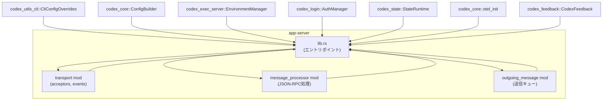
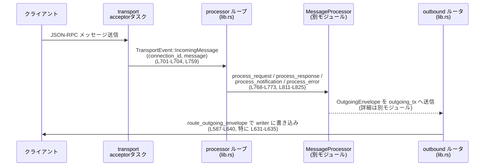

# app-server/src/lib.rs コード解説

## 0. ざっくり一言

`app-server/src/lib.rs` は、Codex アプリケーションサーバーの **エントリポイントとメイン制御ループ** を定義するモジュールです。  
設定読み込み・ロギング・トランスポート（stdio / WebSocket / リモートコントロール）の起動と、メッセージ処理ループ・シャットダウン制御を統括します（根拠: `run_main` / `run_main_with_transport`, app-server/src/lib.rs:L336-L885）。

---

## 1. このモジュールの役割

### 1.1 概要

このモジュールは **アプリケーションサーバーのプロセス全体ライフサイクルを管理する役割** を持ちます。

- CLI からの設定オーバーライドやクラウド要件を組み込んだ `Config` の構築（L370-L436）
- OpenTelemetry・フィードバック・SQLite ログ DB・`tracing` ロガーのセットアップ（L471-L524）
- stdio / WebSocket / リモートコントロール経由の接続受付（L535-L585）
- メッセージプロセッサタスクとアウトバウンドルータタスクの起動・連携（L587-L640, L642-L868）
- SIGINT / SIGTERM による **グレースフルリスタート** 制御（`ShutdownState`, `shutdown_signal`, L129-L210, L141-L158, L670-L686, L688-L700）

### 1.2 アーキテクチャ内での位置づけ

このファイルは crate の「調整役」として、内部モジュールと外部クレートを束ねます。



図は `run_main_with_transport` を中心とした依存関係を表しています（app-server/src/lib.rs:L354-L885）。

### 1.3 設計上のポイント

コードから読み取れる主な設計上の特徴です。

- **責務分割**
  - 設定構築と起動処理は `run_main_with_transport` に集約（L354-L585）
  - メッセージ処理は `MessageProcessor`（別モジュール）へ委譲（L642-L664, L759-L827）
  - 送信経路制御は専用タスク + `OutboundControlEvent` に分離（L104-L127, L587-L640）
- **状態管理**
  - 接続ごとの状態は `ConnectionState` / `OutboundConnectionState` に保持（定義は他モジュール、ここでは `HashMap<ConnectionId, ...>` として管理, L588, L667）
  - グレースフルリスタート状態は `ShutdownState` で明示的にトラッキング（L129-L139, L671-L686）
- **並行性**
  - Tokio の mpsc チャネルで transport / processor / outbound router を疎結合に接続（L364-L368, L587-L640, L642-L868）
  - `Arc<AtomicBool>` と `Arc<RwLock<...>>` を用いて、接続状態フラグを安全に共有（L119-L121, L711-L715, L737-L740）
  - `CancellationToken` により、acceptor やリモートコントロールタスクをキャンセル（L532, L555-L556, L580）
- **エラーハンドリング**
  - 公開 API は `IoResult<()>` を返し、`std::io::Error` にメッセージを詰めて伝播（L336-L352, L354-L885）
  - 設定エラーや exec policy エラーは JSON-RPC 通知用の `ConfigWarningNotification` に変換しつつ、ログにも出力（L212-L226, L438-L469, L525-L530）
- **ロギング・トレース**
  - `LOG_FORMAT` 環境変数で JSON / テキストログ切り替え（L94, L331-L334, L489-L501）
  - OpenTelemetry プロバイダ・状態 DB ログ・独自フィードバックレイヤーを `tracing` subscriber に統合（L471-L524）

---

## 2. 主要な機能一覧

- アプリサーバープロセスの起動 (`run_main`, `run_main_with_transport`)
- CLI / クラウド要件込みの `Config` 構築と警告生成
- OpenTelemetry・フィードバック・SQLite ログ DB・トレースサブスクライバの初期化
- stdio / WebSocket / リモートコントロールのトランスポート起動
- メッセージプロセッサタスクとアウトバウンドルータタスクの生成・連携
- シグナルベースのグレースフルリスタート（接続・実行中ターン数を見ながら停止）
- ログフォーマット（JSON/デフォルト）の切り替え

### 2.1 コンポーネントインベントリー（型・関数一覧）

| 名前 | 種別 | 概要 | 定義位置 |
|------|------|------|----------|
| `LogFormat` | enum | ログ出力形式（`Default` / `Json`）を表す | app-server/src/lib.rs:L96-L100 |
| `StderrLogLayer` | 型エイリアス | `tracing_subscriber` 用 stderr ログレイヤーの型 | L102 |
| `OutboundControlEvent` | enum | プロセッサ側からアウトバウンドルータタスクへの制御メッセージ | L104-L127 |
| `ShutdownState` | struct | グレースフルリスタートの状態 (`requested`, `forced` など) を保持 | L129-L134 |
| `ShutdownAction` | enum | シャットダウン判定結果（`Noop` / `Finish`） | L136-L139 |
| `shutdown_signal` | async fn | ctrl+c / SIGTERM を待機し、シャットダウントリガーを検出 | L141-L158 |
| `ShutdownState::requested` | fn | シャットダウン要求フラグの getter | L160-L163 |
| `ShutdownState::forced` | fn | 強制シャットダウンフラグの getter | L165-L167 |
| `ShutdownState::on_signal` | fn | シグナル受信時の状態更新とログ出力 | L169-L181 |
| `ShutdownState::update` | fn | 現在のターン数と接続数から `ShutdownAction` を決定 | L183-L209 |
| `config_warning_from_error` | fn | `std::io::Error` から `ConfigWarningNotification` を生成 | L212-L226 |
| `config_error_location` | fn | `ConfigLoadError` に埋め込まれた位置情報を抽出 | L228-L238 |
| `exec_policy_warning_location` | fn | `ExecPolicyError`（特に `ParsePolicy`）から位置情報を抽出 | L240-L259 |
| `app_text_range` | fn | `CoreTextRange` をプロトコル定義の `AppTextRange` に変換 | L262-L273 |
| `project_config_warning` | fn | 無効化済みプロジェクト `config.toml` の一覧から警告メッセージを生成 | L275-L320 |
| `LogFormat::from_env_value` | fn | 環境変数値から `LogFormat` を判別（JSON かどうか） | L322-L328 |
| `log_format_from_env` | fn | `LOG_FORMAT` 環境変数を読み `LogFormat` を返す | L331-L334 |
| `run_main` | `pub async fn` | VSCode + stdio 用のデフォルト起動ヘルパー | L336-L352 |
| `run_main_with_transport` | `pub async fn` | メインの起動関数。設定・トランスポート・タスクなど全体を構成 | L354-L885 |
| `analytics_rpc_transport` | fn | トランスポート種別を分析用 RPC トランスポート種にマップ | L887-L893 |
| `tests` モジュール | mod | `LogFormat::from_env_value` の動作を検証するユニットテスト | L896-L917 |

---

## 3. 公開 API と詳細解説

### 3.1 型一覧（構造体・列挙体など）

| 名前 | 種別 | 役割 / 用途 | 定義位置 |
|------|------|-------------|----------|
| `LogFormat` | enum | ログ出力の形式を表す (`Default` / `Json`) | L96-L100 |
| `OutboundControlEvent` | enum | アウトバウンドルータタスクへの制御イベント（接続オープン/クローズ/全切断） | L104-L127 |
| `ShutdownState` | struct | グレースフルシャットダウン状態を追跡 | L129-L134 |
| `ShutdownAction` | enum | シャットダウン処理の次のアクションを示す | L136-L139 |
| `StderrLogLayer` | 型エイリアス | stderr ログ用 `tracing` レイヤー型 | L102 |

### 3.2 重要な関数の詳細

#### `pub async fn run_main(...) -> IoResult<()>`

**概要**

VSCode + stdio を前提とした **標準的な起動パス** を提供するラッパーです。  
`run_main_with_transport` にデフォルト引数（stdio・VSCode・デフォルト WebSocket 認証設定）を渡して呼び出します（L336-L352）。

**引数**

| 引数名 | 型 | 説明 |
|--------|----|------|
| `arg0_paths` | `Arg0DispatchPaths` | 実行ファイルパスに基づく設定ディスパッチ情報 |
| `cli_config_overrides` | `CliConfigOverrides` | `-c` など CLI 経由の設定オーバーライド |
| `loader_overrides` | `LoaderOverrides` | 設定ローダに対する追加オーバーライド |
| `default_analytics_enabled` | `bool` | 分析（OpenTelemetry 等）をデフォルトで有効にするか |

**戻り値**

- サーバープロセスが正常に終了すれば `Ok(())`、起動や設定・トランスポートで問題があれば `Err(std::io::Error)`（L341-L352）。

**内部処理の流れ**

1. `run_main_with_transport` に引数をそのまま渡しつつ、トランスポートを `AppServerTransport::Stdio`、`session_source` を `SessionSource::VSCode`、WebSocket 認証設定を `AppServerWebsocketAuthSettings::default()` に固定（L342-L350）。
2. `run_main_with_transport` の完了を `.await` し、その結果をそのまま返却（L351-L352）。

**Examples（使用例）**

アプリケーションの `main.rs` から呼び出す典型例です。

```rust
use app_server::run_main;                           // lib.rs で公開された run_main をインポート
use codex_arg0::Arg0DispatchPaths;
use codex_utils_cli::CliConfigOverrides;
use codex_core::config_loader::LoaderOverrides;

#[tokio::main]                                      // Tokio ランタイム上で実行
async fn main() -> std::io::Result<()> {            // IoResult<()> を返す
    let arg0_paths = Arg0DispatchPaths::from_env(); // 実行パスから設定ディスパッチを構築（仮の例）
    let cli_overrides = CliConfigOverrides::from_env(); // CLI オプションからオーバーライド構築（仮）
    let loader_overrides = LoaderOverrides::default();  // ローダーオーバーライドの初期値

    run_main(                                       // app-server のメインエントリを呼び出す
        arg0_paths,
        cli_overrides,
        loader_overrides,
        /*default_analytics_enabled*/ true,
    ).await
}
```

**Errors / Panics**

- 実際のエラーはほぼ全て `run_main_with_transport` 内で生成された `std::io::Error` によるものです（L354-L885）。
- 本関数自身はパニックを起こすコードを含みません。

**Edge cases（エッジケース）**

- すべて `run_main_with_transport` に委譲されます（詳細はそちらを参照）。

**使用上の注意点**

- 非同期ランタイム（Tokio）が必要です。`#[tokio::main]` などのコンテキストから呼び出す必要があります。
- デフォルトでは VSCode + stdio 前提なので、別のトランスポート（WebSocket 等）を使う場合は `run_main_with_transport` を直接使用します。

---

#### `pub async fn run_main_with_transport(...) -> IoResult<()>`

**概要**

アプリケーションサーバーの **完全な起動・実行・終了までのライフサイクルを管理するメイン関数** です（L354-L885）。  
設定構築、トランスポートの選択、メッセージ処理タスクとアウトバウンドルータタスクの起動、シグナルベースのグレースフルシャットダウンを行います。

**引数**

| 引数名 | 型 | 説明 |
|--------|----|------|
| `arg0_paths` | `Arg0DispatchPaths` | 実行パスに応じたディスパッチ設定 |
| `cli_config_overrides` | `CliConfigOverrides` | CLI からの TOML オーバーライド |
| `loader_overrides` | `LoaderOverrides` | コンフィグローダの挙動オーバーライド |
| `default_analytics_enabled` | `bool` | OpenTelemetry 等をデフォルト有効にするか |
| `transport` | `AppServerTransport` | トランスポート種別（Stdio / WebSocket / Off） |
| `session_source` | `SessionSource` | セッションの起点（VSCode 等） |
| `auth` | `AppServerWebsocketAuthSettings` | WebSocket 認証設定 |

**戻り値**

- 正常終了時に `Ok(())`。  
- 設定パースエラー、トランスポート起動失敗、リモートコントロール起動失敗などで `Err(std::io::Error)` を返します（例: L372-L377, L429-L434, L479-L484, L569-L572, L575-L584）。

**内部処理の流れ（高レベル）**

1. **チャネル・環境の初期化**（L363-L368）
   - `EnvironmentManager::from_env()` を `Arc` で共有（L363）。
   - `transport_event_tx/rx`, `outgoing_tx/rx`, `outbound_control_tx/rx` という 3 組の mpsc チャネルを作成（L364-L368）。
2. **CLI オーバーライドとクラウド要件のプリロード**（L370-L415）
   - `CliConfigOverrides::parse_overrides()` を呼び、失敗した場合は `ErrorKind::InvalidInput` の `std::io::Error` にラップ（L372-L377）。
   - 一度 `ConfigBuilder` を使って設定を構築し、`cloud_requirements_loader` に渡すためのクラウド要件をプリロード（L378-L415）。失敗時は `CloudRequirementsLoader::default()` にフォールバック（L410-L414）。
3. **最終 Config の構築と警告収集**（L417-L469）
   - 再度 `ConfigBuilder` で `cloud_requirements` を含む設定を構築（L418-L423）。
   - 設定読み込みエラー時は `config_warning_from_error` で警告を生成しつつ、`Config::load_default_with_cli_overrides` でデフォルト設定にフォールバック（L425-L435）。
   - `check_execpolicy_for_warnings` により exec policy の警告を検査し、`exec_policy_warning_location` で位置情報を抽出（L438-L447）。
   - `project_config_warning` で無効なプロジェクト設定の警告（L449-L451）。
   - `config.startup_warnings` と sandbox policy の警告を `ConfigWarningNotification` 化して蓄積（L452-L469）。
4. **OpenTelemetry / ロガーのセットアップ**（L471-L524）
   - `CodexFeedback::new()` と `build_provider` でフィードバック・OTEL プロバイダを用意（L471-L485）。
   - `log_format_from_env` + `LOG_FORMAT` 環境変数により JSON / テキストの stderr ログレイヤーを構築（L486-L501）。
   - 状態 DB (`StateRuntime::init`) と `log_db::start` を組み合わせたログレイヤーを作成（L505-L514）。
   - `tracing_subscriber::registry()` に stderr, feedback, log_db, OTEL ロガー/トレースレイヤーを登録し `try_init()`（L517-L524）。
   - 収集済みの `config_warnings` を `error!` ログとして出力（L525-L530）。
5. **トランスポートとリモートコントロールの起動**（L532-L585）
   - `CancellationToken` と accept ループハンドルのベクタを用意（L532-L533）。
   - `AppServerTransport` の値に応じて stdio or WebSocket acceptor を起動（L540-L562）。
   - `remote_control_enabled` を `config.features.enabled(Feature::RemoteControl)` から判定（L567-L568）。
   - トランスポートもリモートコントロールも無効な場合、`ErrorKind::InvalidInput` エラーを返却（L568-L573）。
   - `start_remote_control` を呼び、受け入れタスクと制御ハンドルを取得（L575-L585）。
6. **アウトバウンドルータタスクの起動**（L587-L640）
   - 別タスクで `outbound_connections: HashMap<ConnectionId, OutboundConnectionState>` を管理（L587-L588）。
   - `OutboundControlEvent` を受信して接続を追加・削除・全切断、あるいは `OutgoingEnvelope` を受けて `route_outgoing_envelope` で送信（L590-L637）。
7. **メッセージプロセッサタスクの起動**（L642-L868）
   - `OutgoingMessageSender` や `MessageProcessor` を構築（L643-L664）。
   - 接続状態 `HashMap<ConnectionId, ConnectionState>` と `ShutdownState` を持つループを開始（L667-L672）。
   - ループ内で `ShutdownState::update` を呼び、`Finish` になれば `CancellationToken` をキャンセルし `OutboundControlEvent::DisconnectAll` を送信（L673-L686）。
   - `tokio::select!` で以下を同時待機（L688-L859）:
     - `shutdown_signal()` によるシグナル検出（UNIX: SIGINT/SIGTERM, Windows: ctrl+c）（L689-L695）。
     - `running_turn_count_rx.changed()` による実行中アシスタントターン数の変化通知（L696-L700）。
     - `transport_event_rx.recv()` による接続イベント（オープン/クローズ/メッセージ）処理（L701-L829）。
     - `thread_created_rx.recv()` による新スレッド作成通知とリスナーアタッチ処理（L831-L858）。
   - 接続オープン時に inbound/outbound で共有する `Arc<AtomicBool>` や `Arc<RwLock<...>>` を生成し、`OutboundControlEvent::Opened` を送信してから `connections` に `ConnectionState` を格納（L706-L741）。
   - 接続クローズ時は双方のマップから削除し、`processor.connection_closed` を呼んだ上で、single-client モードでは接続が空になったらループを終了（L743-L757）。
   - `TransportEvent::IncomingMessage` に対して JSON-RPC Request/Response/Notification/Error を `MessageProcessor` に委譲し、接続状態やアウトバウンドフラグを更新（L759-L827）。
   - スレッド作成通知に対して、初期化済み接続にのみリスナーをアタッチ（L833-L845）。
8. **終了処理**（L862-L885）
   - 強制シャットダウンでなければ `processor.drain_background_tasks()` と `processor.shutdown_threads()` を呼びバックグラウンド処理を停止（L862-L865）。
   - transport イベント送信用チャネルを drop し（L870）、プロセッサタスク・アウトバウンドタスク・accept タスクを `await`（L872-L878）。
   - OpenTelemetry プロバイダが存在すれば `shutdown()` を呼ぶ（L880-L881）。
   - `Ok(())` を返して終了（L884）。

**並行性・安全性**

- すべての外部 I/O と重い処理は async タスク内で行われ、`tokio::select!` により協調的にスケジューリングされます（L587-L640, L670-L859）。
- 接続に紐づくフラグは `Arc<AtomicBool>` / `Arc<RwLock<HashSet<String>>>` で共有され、**ロックとアトミックを組み合わせたスレッドセーフな更新** が行われます（L119-L121, L711-L715, L775-L783, L788-L804）。
- チャネルがクローズされた場合は `recv()` が `None` を返し、それを検出してループ終了する設計になっています（L592-L595, L632-L634, L702-L704）。

**Errors / Panics**

- 設定オーバーライドパース失敗時: `ErrorKind::InvalidInput`（L372-L377）。
- デフォルト設定のロード失敗時: `ErrorKind::InvalidData`（L429-L434）。
- OTEL 構築失敗時: `ErrorKind::InvalidData`（L479-L484）。
- トランスポートが一切ない & リモートコントロール無効: `ErrorKind::InvalidInput`（L568-L573）。
- WebSocket 認証設定パース失敗は `policy_from_settings(&auth)?` を通じて `?` で伝播（L552-L557）。
- コード中に明示的な `panic!` や `unwrap()` はありませんが、外部ライブラリ内部のパニックの可能性はコードからは判断できません。

**Edge cases（エッジケース）**

- 設定エラー発生時:
  - 警告を `ConfigWarningNotification` として送信するために記録しつつ（L425-L429）、デフォルト設定 + CLI オーバーライドにフォールバックします（L429-L435）。
- Exec policy の parse エラー:
  - 「`Error parsing rules; custom rules not applied.`」という警告を生成し、カスタムルールを無効化した状態で起動（L438-L446）。
- プロジェクト `config.toml` が無効化されている場合:
  - すべての無効フォルダを列挙した警告メッセージを生成（L275-L320, L449-L451）。
- シングルクライアント（stdio）モード:
  - 接続が 0 になった時点でメインループを終了するフラグ `shutdown_when_no_connections` が真になる（L535-L537, L755-L757）。
- `running_turn_count_rx` チャネルがクローズされた場合:
  - `changed.is_err()` を検出し、警告ログだけ出してループ継続（L697-L699）。

**使用上の注意点**

- **Tokio ランタイム必須**: async 関数なので `#[tokio::main]` などから呼び出す必要があります。
- **シグナル挙動**:
  - WebSocket 等の multi-client モードでは ctrl+c / SIGTERM による **グレースフルリスタート** が有効（`graceful_signal_restart_enabled`, L535-L538, L688-L700）。
  - すでに shutdown 要求済みの状態で再度シグナルを受信すると `forced` フラグが立ち、実行中ターンが残っていても強制的に再起動されます（L169-L181, L188-L199, L689-L695）。
- **高負荷時の注意**:
  - すべてのメッセージは mpsc チャネル（`CHANNEL_CAPACITY`）を通るため、容量超過時の挙動は `CHANNEL_CAPACITY` のサイズと `tokio::sync::mpsc` の仕様に依存します（L364-L368, L587-L640）。容量は別モジュールで定義されており、このチャンクからは値は不明です。

---

#### `async fn shutdown_signal() -> IoResult<()>`

**概要**

プラットフォームに応じて ctrl+c / SIGTERM を検出する、**非同期シグナル待ち関数** です（L141-L158）。

**引数**

- なし。

**戻り値**

- シグナル待ちが正常に完了すれば `Ok(())`。
- シグナルハンドラ初期化に失敗した場合は `Err(std::io::Error)`（UNIX の `signal()` 呼び出しに `?` を使っているため, L147-L151）。

**内部処理の流れ**

- UNIX の場合（`#[cfg(unix)]` 部分, L142-L152）:
  1. `tokio::signal::unix::signal(SignalKind::terminate())?` を呼び SIGTERM を待つストリームを構築（L144-L147）。
  2. `tokio::select!` で `tokio::signal::ctrl_c()` と `term.recv()` のどちらかを待ち、先に来た方に応じて `Ok(())` / `ctrl_c_result` を返す（L147-L151）。
- 非 UNIX の場合（L154-L157）:
  - `tokio::signal::ctrl_c().await` をそのまま返す。

**使用上の注意点**

- `run_main_with_transport` の内部でのみ使用されており、呼び出し側でループと組み合わせてグレースフルリスタート制御に利用されています（L688-L695）。

---

#### `fn project_config_warning(config: &Config) -> Option<ConfigWarningNotification>`

**概要**

`Config` 内に含まれる **無効化されたプロジェクト設定 (`config.toml`)** を走査し、ユーザ向け警告メッセージを組み立てます（L275-L320）。

**引数**

| 引数名 | 型 | 説明 |
|--------|----|------|
| `config` | `&Config` | 構築済み設定。`config_layer_stack` からレイヤ情報を取得 |

**戻り値**

- 無効なプロジェクト設定が存在しなければ `None`（L299-L301）。
- 一つ以上あれば、人間向けの説明メッセージを `summary` に含む `ConfigWarningNotification` を `Some(...)` で返す（L303-L319）。

**内部処理の流れ**

1. `config.config_layer_stack.get_layers(...)` で全レイヤ（無効レイヤも含む）を列挙（L278-L281）。
2. レイヤ名が `ConfigLayerSource::Project { .. }` かつ `disabled_reason.is_some()` のものだけを対象にする（L282-L285）。
3. `ConfigLayerSource::Project { dot_codex_folder }` からフォルダパスを文字列化し、`disabled_reason` の文字列表現を組み合わせて `disabled_folders` に保存（L287-L295）。
4. 集めたフォルダが空なら `None` 返却（L299-L301）。
5. 1..N の番号付きリスト形式で警告文を生成し、`ConfigWarningNotification` の `summary` に格納（L303-L319）。

**Edge cases**

- `disabled_reason` が `None` であればそのレイヤは警告対象外（L282-L285）。
- `disabled_reason` が存在しない場合のメッセージは `"config.toml is disabled."` にフォールバック（L291-L295）。

**使用上の注意点**

- 返却値は `run_main_with_transport` 内で `config_warnings` に追加され、起動時ログに出力されるほか、JSON-RPC を通じてクライアントに通知される前提と見られます（L449-L451, L525-L530）。
- `ConfigLayerStackOrdering::LowestPrecedenceFirst` を指定しているため、低優先度レイヤから順にメッセージに並びます（L279-L280）。

---

#### `fn config_warning_from_error(...) -> ConfigWarningNotification`

**概要**

`ConfigBuilder` などの設定読み込みエラー（`std::io::Error`）を、ユーザ向けの `ConfigWarningNotification` にラップするユーティリティです（L212-L226）。

**引数**

| 引数名 | 型 | 説明 |
|--------|----|------|
| `summary` | `impl Into<String>` | 警告概要メッセージ（人間向け） |
| `err` | `&std::io::Error` | 元となる IO エラー |

**戻り値**

- `ConfigWarningNotification`（`summary`, `details`, `path`, `range` を含む）。

**内部処理の流れ**

1. `config_error_location(err)` を呼び、`ConfigLoadError` が `err` 内部にネストされている場合のファイルパスとレンジ情報を抽出（L216-L219, L228-L238）。
2. 見つかった場合は `path` と `range` を `Some(...)` で埋め、なければ `None`（L216-L219）。
3. `details` フィールドには `err.to_string()` を入れる（L221-L223）。

**Edge cases**

- `err.get_ref()` が `None`、あるいは `ConfigLoadError` 型でない場合は位置情報が付与されません（L228-L238）。

---

#### `impl LogFormat { fn from_env_value(value: Option<&str>) -> Self }`

**概要**

文字列（主に環境変数値）から `LogFormat` を決定します。  
`"json"`（前後の空白や大小文字を無視）なら `LogFormat::Json`、それ以外は `LogFormat::Default` になります（L322-L328）。

**引数**

| 引数名 | 型 | 説明 |
|--------|----|------|
| `value` | `Option<&str>` | 環境変数値などの文字列。`None` も許容 |

**戻り値**

- `LogFormat::Json` または `LogFormat::Default`。

**内部処理の流れ**

1. `value.map(str::trim).map(str::to_ascii_lowercase)` で、`Some("  Json  ")` → `Some("json")` のように前後の空白除去 + 小文字化（L324）。
2. その結果が `Some("json")` なら `Self::Json`、それ以外（`None` / 空文字 / その他）は `Self::Default` を返す（L325-L327）。

**Tests**

- `log_format_from_env_value_matches_json_values_case_insensitively` で `"json"`, `"JSON"`, `"  Json  "` のすべてが `LogFormat::Json` になることを検証（L901-L905）。
- `log_format_from_env_value_defaults_for_non_json_values` で `None`, `""`, `"text"`, `"jsonl"` が `LogFormat::Default` になることを検証（L908-L916）。

**使用上の注意点**

- `"jsonl"` など `"json"` で始まる文字列も Default 扱いであり、JSON ログとしては認識されません（L325-L327, L914-L916）。
- 実際の使用は `log_format_from_env` を介して行われます（L331-L334, L489-L501）。

---

#### `fn log_format_from_env() -> LogFormat`

**概要**

環境変数 `LOG_FORMAT` から `LogFormat` を計算するヘルパーです（L331-L334）。

**内部処理**

1. `std::env::var(LOG_FORMAT_ENV_VAR).ok()` で `LOG_FORMAT` を取得（L332）。
2. `LogFormat::from_env_value(value.as_deref())` を呼び、`LogFormat` を返す（L333）。

**使用上の注意点**

- 未設定・空文字・`"json"` 以外の値はすべて `LogFormat::Default` になります（L322-L328, L909-L916）。
- `run_main_with_transport` 内のロギング設定でのみ使用されています（L489-L501）。

---

#### `fn analytics_rpc_transport(transport: AppServerTransport) -> AppServerRpcTransport`

**概要**

アプリケーションサーバーのトランスポート種別を、分析用 RPC トランスポート種にマッピングする関数です（L887-L893）。  
`Stdio` の場合は `AppServerRpcTransport::Stdio`、それ以外（WebSocket / Off）は `AppServerRpcTransport::Websocket` を返します。

**使用箇所**

- `MessageProcessor::new` の引数 `rpc_transport` として呼び出されています（L662-L663）。

**Edge cases**

- `AppServerTransport::Off` でも `AppServerRpcTransport::Websocket` として扱われます（L889-L893）。  
  これは「外向き RPC としては WebSocket モードと同様の扱い」をしている設計と解釈できますが、`Off` の意味や使用意図はこのチャンクからは完全には分かりません。

---

### 3.3 その他の関数

| 関数名 | 役割（1 行） | 定義位置 |
|--------|--------------|----------|
| `config_error_location` | `std::io::Error` の内部から `ConfigLoadError` を downcast し、パスとレンジに変換 | L228-L238 |
| `exec_policy_warning_location` | `ExecPolicyError::ParsePolicy` からファイルパスとレンジを抽出 | L240-L259 |
| `app_text_range` | `CoreTextRange` → `AppTextRange` の単純なフィールドコピー | L262-L273 |
| `ShutdownState::requested` / `forced` | フラグ getter | L160-L167 |
| `ShutdownState::on_signal` | シグナル受信時に `requested`/`forced`/ログを更新 | L169-L181 |
| `ShutdownState::update` | 実行中ターン数と接続数から `ShutdownAction` を算出し、必要に応じてログ | L183-L209 |

---

## 4. データフロー

ここでは、**外部クライアントからの JSON-RPC メッセージが処理され、レスポンスとして送り返されるまで** の典型的なフローを示します。



図は `processor_handle` タスクと `outbound_handle` タスクの協調動作を表します（app-server/src/lib.rs:L587-L640, L642-L868）。

- 入力: `TransportEvent::IncomingMessage`（L759-L827）
- 処理: `MessageProcessor` が JSON-RPC プロトコルに従ってリクエスト・レスポンス・通知・エラーを処理（詳細は別モジュール）
- 出力: `OutgoingEnvelope` が `outgoing_tx` 経由でアウトバウンドルータタスクに渡され、接続ごとの writer に送信されます（L587-L640）

---

## 5. 使い方（How to Use）

### 5.1 基本的な使用方法

このモジュールの主な公開 API は `run_main` と `run_main_with_transport` です。  
最もシンプルには、アプリケーションの `main.rs` から `run_main` を呼び出します。

```rust
use app_server::run_main;                               // lib.rs の公開関数
use codex_arg0::Arg0DispatchPaths;
use codex_utils_cli::CliConfigOverrides;
use codex_core::config_loader::LoaderOverrides;

#[tokio::main]                                          // Tokio ランタイム
async fn main() -> std::io::Result<()> {                // IoResult<()> を返す
    let arg0_paths = Arg0DispatchPaths::from_env();     // 実行ファイルパスから設定を決定（仮の例）
    let cli_overrides = CliConfigOverrides::from_env(); // CLI 引数からオーバーライド（仮）
    let loader_overrides = LoaderOverrides::default();  // デフォルトのローダー設定

    run_main(                                           // VSCode + stdio モードで app-server を起動
        arg0_paths,
        cli_overrides,
        loader_overrides,
        /*default_analytics_enabled*/ true,
    ).await
}
```

### 5.2 よくある使用パターン

1. **VSCode + stdio モード**
   - `run_main` をそのまま使用（L336-L352）。
   - `AppServerTransport::Stdio` と `SessionSource::VSCode` が選択されます。

2. **WebSocket リスニングサーバーとして使用**
   - 独自の `main` から `run_main_with_transport` を直接呼び出し、`AppServerTransport::WebSocket { bind_address }` を指定します（L354-L362, L551-L560）。

   ```rust
   use app_server::run_main_with_transport;
   use app_server::AppServerTransport;
   use codex_protocol::protocol::SessionSource;
   use codex_transport::auth::AppServerWebsocketAuthSettings;

   // Tokio ランタイムなどの前提は VSCode モードと同様
   ```

3. **トランスポートなし + リモートコントロールのみ**
   - `transport = AppServerTransport::Off` としつつ、設定側で `Feature::RemoteControl` を有効にするパターンが想定されます（L567-L573）。  
   - この場合でも `start_remote_control` が必ず起動され、トランスポートが 0 かつ remote_control 無効なパターンのみエラーになります（L568-L573）。

### 5.3 よくある間違い

```rust
// 間違い例: Tokio ランタイム外で async 関数を呼び出している
// fn main() {
//     let result = run_main(...); // コンパイルは通らない / 実行されない
// }

// 正しい例: Tokio ランタイム上から .await する
#[tokio::main]
async fn main() -> std::io::Result<()> {
    // 必要な引数を準備
    // ...
    run_main(arg0_paths, cli_overrides, loader_overrides, true).await
}
```

```rust
// 間違い例: トランスポートもリモートコントロールも無効
// → run_main_with_transport は InvalidInput エラーを返す（L568-L573）
let transport = AppServerTransport::Off;
// config.features で Feature::RemoteControl も無効なまま

// 正しい例: Off を使うなら RemoteControl を有効化する
// （有効化方法は Config の定義側に依存し、このチャンク単体からは不明）
```

### 5.4 使用上の注意点（まとめ）

- **シグナルと再起動**
  - WebSocket 等 multi-client モード (`!single_client_mode`) では、シグナルを受けるとまず `ShutdownState::requested = true` として「グレースフル再起動」フェーズに入り、新規リクエストを受け付けつつ実行中ターンが 0 になるまで待機します（L169-L181, L183-L209, L688-L700）。
  - 2 度目のシグナルでは `forced = true` にして、実行中ターンが残っていても即座に再起動（L170-L172, L188-L199, L689-L695）。
- **接続とメッセージの安全性**
  - 不明な `connection_id` からのメッセージは警告ログを出してドロップし、パニックや誤送信を防いでいます（L762-L765, L807-L809, L813-L817, L821-L823）。
- **並行性の前提**
  - 接続状態やアウトバウンド設定を共有するために `Arc<AtomicBool>` / `Arc<RwLock<_>>` を使用しており、複数タスクからの同時アクセスを想定した設計になっています（L119-L121, L711-L715, L775-L783, L788-L804）。
- **パフォーマンス上の注意**
  - 全てのメッセージが単一の `transport_event_rx` / `outgoing_rx` チャネルを通過するため、大量の接続や高頻度メッセージがある場合はチャネル容量 `CHANNEL_CAPACITY` の影響を受けます（L364-L368, L587-L637）。  
    チャネルサイズは別モジュール定義で、このチャンクからは値は分かりません。

---

## 6. 変更の仕方（How to Modify）

### 6.1 新しい機能を追加する場合

1. **新しいトランスポート種別を追加する**
   - `transport` モジュールに `AppServerTransport` の新 variant を追加（このチャンクには定義がないため詳細不明）。
   - `run_main_with_transport` 内の `match transport`（L540-L562）に新ケースを追加し、対応する acceptor 起動関数を呼び出す。
   - `analytics_rpc_transport` にも新 variant をマッピングする必要があります（L887-L893）。

2. **新しい起動モードを追加する**
   - 例えば「CLI 専用モード」を追加したい場合、`run_main` に新モード用のラッパー関数を追加し、適切な `transport` / `session_source` / `auth` を渡す形で `run_main_with_transport` を再利用すると一貫性を保てます（L336-L352, L354-L362）。

3. **新しい Config 警告ロジックを追加する**
   - `project_config_warning` 同様の関数を追加し、`run_main_with_transport` 内で `config_warnings` に push するフローに組み込む（L417-L469）。

### 6.2 既存の機能を変更する場合

- **`run_main_with_transport` の契約**
  - `IoResult<()>` を返すこと、および主なエラーが `std::io::Error` で表現されていることを前提に他コードが書かれている可能性があります（L336-L352, L354-L885）。
  - 返り値の意味（プロセス全体の成功/失敗）を変える場合は、呼び出し元のエラー処理も合わせて確認する必要があります。

- **シャットダウンロジックの変更**
  - `ShutdownState::update` の挙動は、`processor_handle` 内のループ制御と `graceful_signal_restart_enabled` のフラグに強く依存しています（L183-L209, L673-L686, L688-L700）。
  - ロジック変更時は、シグナルが連続で来るケースや、実行中ターン数が変化しないケースなどのエッジケースを確認する必要があります。

- **並行性に関わる変更**
  - `OutboundControlEvent` と `ConnectionState` / `OutboundConnectionState` の関係を変更する場合、processor と outbound router の両方のタスクに影響します（L113-L127, L587-L640, L706-L741）。
  - `Arc<AtomicBool>` や `Arc<RwLock<_>>` の共有の仕方を変える際は、どのタスクがどのタイミングで読み書きするのかを明確にし、データ競合が発生しないように注意が必要です。

- **テストの追加**
  - 現在のテストは `LogFormat::from_env_value` のみをカバーしています（L901-L916）。  
    シャットダウンやトランスポート周りの契約を変える場合は、integration test などで挙動を確認するのが望ましいです。

---

## 7. 関連ファイル

このモジュールと密接に連携している他ファイル（モジュール）です。中身はこのチャンクには含まれていません。

| パス | 役割 / 関係 |
|------|------------|
| `app-server/src/transport.rs` | `AppServerTransport`, `TransportEvent`, `ConnectionState`, `OutboundConnectionState`, `CHANNEL_CAPACITY` などトランスポート関連の型・関数を提供（L27-L35, L89-L92, L587-L640, L701-L757 で使用）。 |
| `app-server/src/message_processor.rs` | JSON-RPC リクエスト/レスポンス/通知/エラーのコア処理を実装。`MessageProcessor` と `MessageProcessorArgs` を定義（L21-L22, L642-L664, L759-L827 で使用）。 |
| `app-server/src/outgoing_message.rs` | `ConnectionId`, `OutgoingEnvelope`, `OutgoingMessageSender`, `QueuedOutgoingMessage` など、送信メッセージキュー関連を提供（L23-L26, L587-L640, L642-L644 で使用）。 |
| `app-server/src/error_code.rs` | `INPUT_TOO_LARGE_ERROR_CODE`, `INVALID_PARAMS_ERROR_CODE` の定義。lib.rs から再公開され、外部から利用可能（L72, L87-L88）。 |
| `app-server/src/app_server_tracing.rs` ほか各種 mod | `mod app_server_tracing;` などで宣言された多数のモジュール。トレース設定、ファイルシステム API、ダイナミックツール、フィルタなどを提供（L66-L85）。 |

このチャンクでは、これらモジュールの内部実装は確認できませんが、`lib.rs` はこれらコンポーネントの **起動・連携・ライフサイクル管理** を一手に引き受けていることが分かります（L66-L85, L587-L640, L642-L868）。
