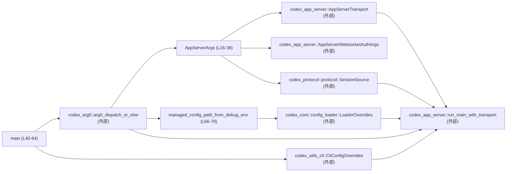
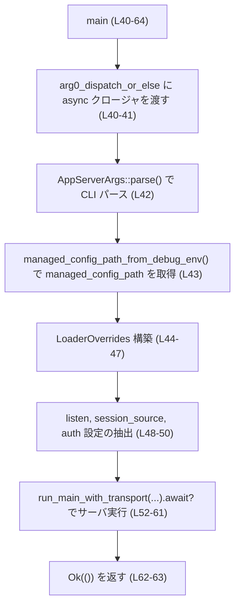
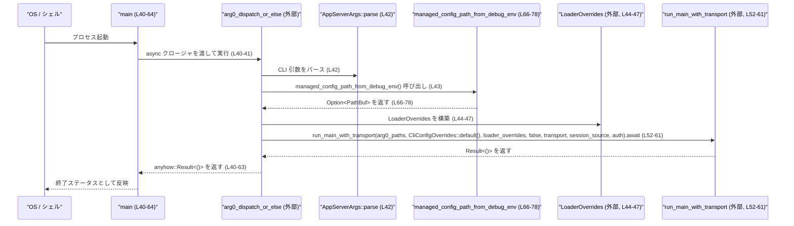

# app-server/src/main.rs コード解説

## 0. ざっくり一言

`app-server/src/main.rs` は、コマンドライン引数を `clap` でパースし、必要な設定オーバーライド（特にデバッグ時の managed config ファイルパス）を構成したうえで、アプリケーションサーバ本体のエントリ `run_main_with_transport` に委譲するバイナリエントリポイントです（根拠: `main` と引数構築処理: app-server/src/main.rs:L16-38, L40-63）。

---

## 1. このモジュールの役割

### 1.1 概要

- このモジュールは、アプリケーションサーババイナリの **プロセス起動時の挙動** を定義します（根拠: `fn main()`: app-server/src/main.rs:L40-64）。
- `clap::Parser` を利用して CLI 引数（トランスポート URL・セッションソース・WebSocket 認証設定）を構造体 `AppServerArgs` にパースします（根拠: `#[derive(Debug, Parser)]` とフィールド: L16-38, `AppServerArgs::parse()`: L42）。
- デバッグビルド時のみ、有効な環境変数から managed config ファイルパスを上書きするフックを提供します（根拠: コメント L12-13, 定数と関数: L14, L66-78）。
- 実際のサーバ処理は `codex_app_server::run_main_with_transport` に委譲され、このファイル自体は薄いラッパとして振る舞います（根拠: L52-60）。

### 1.2 アーキテクチャ内での位置づけ

このファイルは、複数のクレート間の「接着剤」の役割を果たします。

- コマンドライン → `AppServerArgs`（clap）
- Arg0 ディスパッチ → `codex_arg0::arg0_dispatch_or_else`
- 設定オーバーライド → `codex_core::config_loader::LoaderOverrides`
- セッションソース → `codex_protocol::protocol::SessionSource`
- CLI 設定オーバーライド → `codex_utils_cli::CliConfigOverrides`
- サーバ本体 → `codex_app_server::run_main_with_transport`

依存関係の概要は次の通りです。



（外部ノードの実装詳細はこのチャンクには現れません。）

### 1.3 設計上のポイント

- **CLI 定義とパースの一元化**  
  - `AppServerArgs` にすべての CLI オプションを集約し、`clap::Parser` 派生でパースロジックを自動生成しています（根拠: L16-38）。
- **非同期エントリポイントのラップ**  
  - `main` は同期関数ですが、内部で `arg0_dispatch_or_else` に `async move` クロージャを渡し、その中で `.await` を使用して非同期処理を実行します（根拠: L40-42, L52-61）。  
  - これにより、Rust の通常の `fn main` に非同期処理を組み込むパターンになっています。
- **デバッグ専用の設定オーバーライド**  
  - 環境変数による managed config パスの上書きは `#[cfg(debug_assertions)]` で条件コンパイルされており、リリースビルドでは無効になります（根拠: L66-77）。  
  - コメントに「Debug-only test hook」と明示されています（根拠: L12-13）。
- **エラー伝播の方針**  
  - `main` は `anyhow::Result<()>` を返し、内部の `try_into_settings()` や `run_main_with_transport(...).await` のエラーを `?` 演算子でそのまま上位に伝播します（根拠: L40, L50-51, L52-61）。
- **状態管理の最小化**  
  - このファイル内では自前の状態をほとんど持たず、構成情報を組み立てて外部関数に渡すだけの構造になっています（根拠: 変数定義は一時値のみ: L42-50, L44-47）。

---

## 2. 主要な機能・コンポーネント一覧

### 2.1 コンポーネントインベントリー

| 名前 | 種別 | 説明 | 定義位置 |
|------|------|------|----------|
| `MANAGED_CONFIG_PATH_ENV_VAR` | 定数 `&'static str` | デバッグ時に managed config ファイルパスを指定するための環境変数名 `"CODEX_APP_SERVER_MANAGED_CONFIG_PATH"` を保持します。統合テスト用のフックとコメントされています。 | app-server/src/main.rs:L12-14 |
| `AppServerArgs` | 構造体（`clap::Parser` 派生） | CLI 引数を表現する構造体です。トランスポート URL、セッションソース、および WebSocket 認証関連引数をまとめます。 | app-server/src/main.rs:L16-38 |
| `main` | 関数 `fn main() -> anyhow::Result<()>` | Arg0 ディスパッチと CLI パースを行い、設定オーバーライドとトランスポート等を組み立てた上で `run_main_with_transport` を非同期に実行します。 | app-server/src/main.rs:L40-64 |
| `managed_config_path_from_debug_env` | 関数 `fn managed_config_path_from_debug_env() -> Option<PathBuf>` | デバッグビルド時のみ、環境変数 `MANAGED_CONFIG_PATH_ENV_VAR` から `PathBuf` を取得し、`LoaderOverrides.managed_config_path` 用の値として返します。リリースビルドでは常に `None` を返します。 | app-server/src/main.rs:L66-78 |

### 2.2 主要な機能一覧

- CLI 引数定義とパース: `AppServerArgs` により `--listen`, `--session-source` などを定義し、`AppServerArgs::parse()` でパースします（根拠: L16-38, L42）。
- Arg0 ディスパッチのハンドリング: `arg0_dispatch_or_else` に非同期クロージャを渡し、Arg0 関連のパス情報 `Arg0DispatchPaths` を受け取ってからサーバ処理に進みます（根拠: L40-41, L52-53）。
- 設定ローダーのオーバーライド: `LoaderOverrides { managed_config_path, ..Default::default() }` で managed config パスのみを上書きできるようにしています（根拠: L44-47）。
- アプリケーションサーバの起動: `run_main_with_transport(...)` を `.await` し、トランスポート・セッションソース・認証設定を渡してサーバを起動します（根拠: L48-50, L52-61）。
- デバッグ用 config パスフック: `managed_config_path_from_debug_env()` で環境変数から `Option<PathBuf>` を取得し、統合テストなどから一時的な設定ファイルを指し示せるようにしています（根拠: L12-14, L43, L66-78）。

---

## 3. 公開 API と詳細解説

このファイル自体はライブラリではなくバイナリのエントリポイントであり、`pub` なアイテムはありません。しかし、CLI としての公開インターフェースやテストで利用される可能性のある関数を「事実上の公開 API」とみなして説明します。

### 3.1 型一覧（構造体など）

#### `AppServerArgs`

| 名前 | 種別 | 役割 / 用途 | フィールド概要 | 定義位置 |
|------|------|-------------|----------------|----------|
| `AppServerArgs` | 構造体（`Debug`, `Parser` 派生） | アプリケーションサーバの CLI 引数を保持します。`clap::Parser` により自動的に CLI オプションと紐付けられます。 | - `listen: AppServerTransport` – `--listen` で指定されるトランスポートエンドポイント URL。コメントによると `stdio://`（デフォルト）、`ws://IP:PORT`、`off` をサポートします（L18-25）。<br> - `session_source: SessionSource` – `--session-source` で指定されるセッションソース。デフォルトは `"vscode"` で、`SessionSource::from_startup_arg` で文字列から変換されます（L27-34）。<br> - `auth: AppServerWebsocketAuthArgs` – WebSocket 認証関連の引数群。`#[command(flatten)]` により、この構造体のフィールドが CLI オプションとしてフラットに展開されます（L36-37）。 | app-server/src/main.rs:L16-38 |

※ `AppServerTransport`, `SessionSource`, `AppServerWebsocketAuthArgs` の中身はこのチャンクには現れません。

---

### 3.2 関数詳細

#### `main() -> anyhow::Result<()>`

**概要**

- プロセスのエントリポイントです。  
- Arg0 ディスパッチ (`arg0_dispatch_or_else`) を通じて `Arg0DispatchPaths` を受け取り、CLI 引数と環境変数から設定オーバーライドを構築し、`run_main_with_transport` を非同期に起動します（根拠: L40-63）。

**引数**

- なし（通常の `fn main()` と同様に、OS からの起動で呼び出されます）。

**戻り値**

- `anyhow::Result<()>`  
  - 成功時: `Ok(())` – 正常終了を示します（根拠: L62-63）。  
  - 失敗時: `Err(anyhow::Error)` – CLI パース後の処理（認証設定変換やサーバ起動）で発生したエラーを集約して返すと解釈できます（`?` 使用のため、具体的なエラー型は外部の定義に依存します: L50-51, L52-61）。

**内部処理の流れ（アルゴリズム）**

1. `arg0_dispatch_or_else` を呼び出し、`Arg0DispatchPaths` を引数に取る `async move` クロージャを渡します（根拠: L40-41, L53）。  
2. クロージャ内で `AppServerArgs::parse()` を呼び出し、CLI 引数をパースして `args` に格納します（根拠: L42）。  
3. `managed_config_path_from_debug_env()` を呼び出して、（デバッグビルド時のみ）環境変数から managed config パスを取得します（根拠: L43, L66-78）。  
4. `LoaderOverrides { managed_config_path, ..Default::default() }` により、config ローダーのオーバーライド構造体を作成します（根拠: L44-47）。  
5. CLI で指定された `listen` と `session_source` を取り出し、それぞれ `transport` と `session_source` に束縛します（根拠: L48-49）。  
6. 認証引数 `args.auth` から `try_into_settings()` を呼び出して、サーバに渡す認証設定オブジェクトを生成します。ここでエラーが発生すると `?` によりクロージャから `Err` で早期リターンします（根拠: L50-51）。  
7. `run_main_with_transport(arg0_paths, CliConfigOverrides::default(), loader_overrides, false, transport, session_source, auth).await?` を呼び出し、サーバ処理の完了まで非同期に待機します。エラーがあれば同様に `?` で伝播します（根拠: L52-61）。  
8. サーバ処理が成功した場合、`Ok(())` を返してクロージャを終了し、それが `arg0_dispatch_or_else` を経由して `main` の戻り値になります（根拠: L62-63）。

このフローの概略は次のようになります。



**Examples（使用例）**

`main` 自体は OS から呼び出されるため、通常の Rust コードから直接呼び出すことはありません。ここでは、ビルドされたバイナリ名を便宜上 `app-server` と仮定した CLI 実行例を示します（実際のバイナリ名は Cargo 設定に依存し、このチャンクからは分かりません）。

```bash
# stdio トランスポート、デフォルトのセッションソース (vscode) で起動する例
app-server

# WebSocket トランスポートでポート 8080 を listen する例
app-server --listen ws://127.0.0.1:8080

# セッションソースを明示的に指定する例
app-server --session-source vscode
```

**Errors / Panics**

- `args.auth.try_into_settings()?`  
  - 認証引数の組み合わせが無効な場合などに `Err` を返し、そのまま `?` によりクロージャの戻り値としてエラーが返却されます（根拠: L50-51）。  
- `run_main_with_transport(...).await?`  
  - サーバ起動や実行中に発生したエラー（接続エラー、設定読み込みエラー等）は、この呼び出しを通じて `Err` として伝播すると考えられます（根拠: L52-61）。  
- CLI パース (`AppServerArgs::parse()`)  
  - clap の一般的な挙動として、引数が不正な場合はエラーメッセージを表示してプロセスを終了します。この挙動は clap ライブラリ側に依存し、このチャンクには具体的なハンドリングコードは現れません（根拠: L16-18, L42）。

この関数内には `unwrap` や明示的な `panic!` はなく、Rust の安全な標準 API だけを用いているため、パニックは主にライブラリ側の動作に依存します（根拠: 全体に `unsafe` や `unwrap` が存在しない: L1-79）。

**Edge cases（エッジケース）**

- CLI 引数欠如  
  - `--listen` と `--session-source` はデフォルト値が設定されているため、省略しても `AppServerArgs::parse()` が値を補います（根拠: `default_value` 属性: L20-24, L28-32）。
- Arg0 関連の特殊な起動パターン  
  - `arg0_dispatch_or_else` により、通常の起動と Arg0 経由の起動で挙動が変わる可能性がありますが、その詳細はこのチャンクには現れません（根拠: L5-6, L40-41）。
- デバッグ環境変数  
  - デバッグビルドで `MANAGED_CONFIG_PATH_ENV_VAR` が不正な値を持っていても、この関数内では `managed_config_path_from_debug_env()` が `Option<PathBuf>` を返すだけであり、パスの有効性検証やファイル存在確認はここでは行われません（根拠: L43, L66-78）。

**使用上の注意点**

- `main` のエラーは `anyhow::Result<()>` として集約されているため、呼び出し側（OS）には具体的なエラー型は見えません。詳細なエラー分類が必要であれば、内部の `run_main_with_transport` 側の設計に依存します（このチャンクには現れません）。
- 非同期処理の実行方法（どのランタイム上で `async` クロージャを駆動するか）は `arg0_dispatch_or_else` の実装に依存しており、このファイルからは分かりません（根拠: `async move { ... }.await` 使用のみ: L41, L52-61）。
- エラーが `?` で伝播されるため、`try_into_settings` や `run_main_with_transport` に新しいエラーケースを追加する場合は、プロセスの終了コードやログ出力の方針を考慮する必要があります（エラー処理の最終地点が `main` であるため）。

---

#### `managed_config_path_from_debug_env() -> Option<PathBuf>`

**概要**

- デバッグビルド時のみ有効なテスト用フックであり、環境変数 `CODEX_APP_SERVER_MANAGED_CONFIG_PATH` から managed config ファイルへのパスを取得して `Some(PathBuf)` として返します。  
- 環境変数が未設定、空文字、またはデバッグアサーションが無効なビルドでは `None` を返します（根拠: L12-14, L66-78）。

**引数**

- なし。

**戻り値**

- `Option<PathBuf>`  
  - `Some(path)` – デバッグビルドかつ、環境変数が存在し空でない場合。その文字列を `PathBuf` に変換したもの（根拠: L69-74）。  
  - `None` – 以下のいずれかの場合（根拠: L69-78）。  
    - デバッグビルドで環境変数が未設定、または `std::env::var` がエラーを返した場合。  
    - デバッグビルドで環境変数が空文字列だった場合（明示的に `None` にマップ）。  
    - リリースビルドなど `debug_assertions` が無効な場合。

**内部処理の流れ**

1. `#[cfg(debug_assertions)]` ブロック内でのみ、環境変数読み出しロジックがコンパイルされます（根拠: L66-77）。  
2. `std::env::var(MANAGED_CONFIG_PATH_ENV_VAR)` を呼び出して、環境変数の値取得を試みます（根拠: L69）。  
3. 取得に成功 (`Ok(value)`) した場合、次の条件分岐を行います（根拠: L69-74）。  
   - `value.is_empty()` が `true` の場合は `None` を返却します（環境変数が空文字列の場合）。（根拠: L70-71）  
   - それ以外の場合は `PathBuf::from(value)` でパスに変換し、`Some(...)` を返却します（根拠: L72-73）。  
4. `std::env::var` がエラー (`Err(_)`) の場合は何も返さず、`#[cfg]` ブロックを抜けた後の `None` にフォールバックします（根拠: L69, L77-78）。  
5. `#[cfg(debug_assertions)]` がオフの場合、ブロック全体がコンパイルから除外されるため、関数本体は `None` だけを返す実装になります（根拠: Rust の条件コンパイルの一般的な挙動）。

**Examples（使用例）**

統合テストなどで一時的な managed config ファイルにサーバを向けたい場合の例です（デバッグビルドが前提です）。

```rust
use std::path::PathBuf;

// テスト内の一例（仮想的なコード例）
fn prepare_managed_config_path() {
    // テンポラリディレクトリに仮の設定ファイルを生成したとする
    let temp_config_path = "/tmp/test-managed-config.json"; // 実際には tempfile などで生成する

    // デバッグ用環境変数を設定する（MANAGED_CONFIG_PATH_ENV_VAR の値を利用）
    std::env::set_var(
        "CODEX_APP_SERVER_MANAGED_CONFIG_PATH", // 定数と同じ文字列（L14）
        temp_config_path,
    );

    // 関数を呼び出すと Some(PathBuf) が返る
    let path_opt = managed_config_path_from_debug_env();
    assert_eq!(
        path_opt,
        Some(PathBuf::from(temp_config_path))
    );
}
```

リリースビルドでは `managed_config_path_from_debug_env()` は常に `None` になるため、上記のテストはデバッグビルドでのみ意味を持ちます。

**Errors / Panics**

- `std::env::var` が返すエラー（未設定、非 UTF-8 など）は、この関数内ではすべて無視され、`None` にフォールバックします（根拠: `if let Ok(value) = std::env::var(...)` と後続の `None`: L69, L77-78）。
- `PathBuf::from` は通常パニックしないため、この関数内でパニックが発生する可能性は低いです。
- `unsafe` ブロックや `unwrap` は使用していないため、Rust のメモリ安全性はコンパイル時に保証されています（根拠: L66-78 に該当コードなし）。

**Edge cases（エッジケース）**

- 環境変数が存在しない場合  
  - `std::env::var` が `Err` を返し、そのまま `None` を返却します（根拠: L69, L77-78）。  
- 環境変数が空文字列の場合  
  - `value.is_empty()` が `true` となり、`None` を返却します（根拠: L70-71）。  
- 環境変数が無効なパス文字列の場合  
  - この関数内では検証は行われず、そのまま `PathBuf` が生成されます。パスの存在確認やアクセス権チェックは、後続のファイル I/O を行うコード側に委ねられます（そのコードはこのチャンクには現れません）。  
- リリースビルド  
  - `debug_assertions` が無効のため、どのような環境変数の設定に関わらず常に `None` になります（根拠: `#[cfg(debug_assertions)]` ブロック外の `None`: L66-78）。

**使用上の注意点**

- この関数は **テストフック** として設計されており、コメントにも「Debug-only test hook」と明示されています（根拠: L12-13）。本番環境での設定変更に利用することは想定されていません。
- リリースビルドでは動作しないため、「環境変数で本番設定を切り替える」といった用途には使えません。
- デバッグ時に環境変数に誤ったパスを設定しても、この関数は単に `Some(PathBuf)` を返すだけであり、エラーは発生しません。実際のファイルアクセス時にエラーになる可能性があります。

---

### 3.3 その他の関数

このファイルには、上記 2 つ以外の自前定義関数は存在しません（根拠: L40-78）。

---

## 4. データフロー

ここでは、サーバ起動時の代表的なデータフローを示します。

1. OS / シェルがバイナリを起動し、`main()` が実行されます（根拠: L40）。  
2. `main` は `arg0_dispatch_or_else` に非同期クロージャを渡し、Arg0 パスなどの情報を引数として受け取ります（根拠: L40-41）。  
3. クロージャ内で `AppServerArgs::parse()` が CLI 引数を解析し、`listen`・`session_source`・`auth` を決定します（根拠: L42, L16-38）。  
4. `managed_config_path_from_debug_env()` で（デバッグ時のみ）環境変数から managed config パスを取得し、`LoaderOverrides` を構築します（根拠: L43-47, L66-78）。  
5. これらの情報に基づき `run_main_with_transport(...)` が呼ばれ、サーバのメインループやリクエスト処理が行われます（根拠: L52-61）。



並行性の観点では、このファイル内にはスレッド生成などは見られず、非同期処理は `async` / `.await` を通じて外部のランタイムに委ねられています（根拠: L41, L52-61）。

---

## 5. 使い方（How to Use）

### 5.1 基本的な使用方法

このモジュールはバイナリの `main` であり、通常は CLI から利用されます。以下は典型的な使用イメージです（バイナリ名は例示）。

```bash
# デフォルト設定で起動（listen=stdio://, session-source=vscode）
app-server

# WebSocket で待ち受けたい場合
app-server --listen ws://0.0.0.0:8080

# セッションソースを変更したい場合（SessionSource::from_startup_arg が対応している値）
app-server --session-source vscode
```

Rust コードからテストフックを利用する例（デバッグビルド前提）は 3.2 の `managed_config_path_from_debug_env` の例を参照してください。

### 5.2 よくある使用パターン

1. **標準入出力トランスポート**  
   - 明示的な引数なし、または `--listen stdio://` を指定するパターンです。コメントに「`stdio://` (default)」とあるため、これはデフォルトの通信方式と考えられます（根拠: L18-20, L23-25）。  

2. **WebSocket トランスポート**  
   - `--listen ws://IP:PORT` を指定します（根拠: L18-20）。  
   - 認証関連オプションは `AppServerWebsocketAuthArgs` によって追加されていると考えられますが、その詳細はこのチャンクには現れません（根拠: L36-37）。  

3. **トランスポート「off」状態**  
   - コメントに `off` というサポート値が含まれているため、サーバを外部トランスポートなしで動作させるか、起動を抑止するモードが存在する可能性があります（根拠: L18-20）。具体的な挙動は `AppServerTransport` の実装に依存し、このチャンクには現れません。

### 5.3 よくある間違い（想定される誤用）

**例 1: リリースビルドで環境変数フックを期待する**

```rust
// 誤った期待: リリースビルドでもこの環境変数で設定パスを変えられると思っている
std::env::set_var("CODEX_APP_SERVER_MANAGED_CONFIG_PATH", "/etc/app-server/config.json");
// しかし、managed_config_path_from_debug_env() はリリースビルドでは常に None を返す
```

**正しい理解:**

- `managed_config_path_from_debug_env()` は `#[cfg(debug_assertions)]` ブロック内でのみ環境変数を読むため、リリースビルドでは常に `None` になります（根拠: L66-78）。

**例 2: `AppServerArgs` にフィールドを追加したが、`main` で使用していない**

```rust
// AppServerArgs に新しい CLI オプションを追加したが
#[derive(Debug, Parser)]
struct AppServerArgs {
    // ...
    #[arg(long = "new-option")]
    new_option: String,
}

// main 内で取り出して run_main_with_transport に渡していない
```

- この場合、新しいオプションはパースされてもサーバ本体に伝播しません。`main` 内で変数を取り出して `run_main_with_transport` の引数に追加する必要があります（根拠: 現状は listen/session_source/auth しか取り出していない: L48-50, L52-60）。

### 5.4 使用上の注意点（まとめ）

- **ビルドモード依存の挙動**  
  - デバッグビルドとリリースビルドで `managed_config_path_from_debug_env()` の挙動が異なります。テスト用フックであり、本番設定に使えない点に注意が必要です（根拠: L12-14, L66-78）。
- **エラー処理**  
  - エラーは `anyhow::Result` で集約されるため、CLI から見たときにエラー種類を細かく判別することは難しい可能性があります。ログやエラーメッセージの詳細は外部関数に依存します（このチャンクには現れません）。
- **非同期実行の前提**  
  - `run_main_with_transport(...).await` を呼び出すための非同期ランタイム構成は `arg0_dispatch_or_else` に隠蔽されており、このファイルでは直接制御していません（根拠: L40-41, L52-61）。
- **スレッド安全性**  
  - このファイル内にはグローバルな可変状態や `static mut` は存在せず、`std::env::var` など標準ライブラリのスレッドセーフな API のみを利用しています（根拠: 全体コード L1-79）。並行性の問題は主に外部のサーバ実装側に依存します。

---

## 6. 変更の仕方（How to Modify）

### 6.1 新しい機能を追加する場合

**例: 新しい CLI オプションを追加し、サーバに渡したい場合**

1. **`AppServerArgs` にフィールドを追加**  
   - 例として、新しいオプション `--foo` を追加する場合:

   ```rust
   #[derive(Debug, Parser)]
   struct AppServerArgs {
       // 既存フィールド ...
       #[arg(long = "foo", value_name = "VALUE")]
       foo: Option<String>, // 例: 任意の文字列オプション
   }
   ```

   （既存構造体定義: app-server/src/main.rs:L16-38）

2. **`main` 内で値を取り出す**  
   - `let foo = args.foo.clone();` のようにローカル変数に束縛します（`foo` の型に応じて所有権/借用を適切に選択します）。

3. **`run_main_with_transport` のシグネチャに追加**  
   - `run_main_with_transport` に新しい引数を追加し、呼び出し側（このファイル）から `foo` を渡します（呼び出し箇所は L52-60）。  
   - 実際の関数定義は外部クレートにあるため、そのファイルを参照する必要があります（このチャンクには現れません）。

4. **テストの更新**  
   - 新しいオプションの CLI パースと、サーバ側での反映を確認するテストを追加します。コメントに示されているように統合テストが存在する可能性がありますが、そのコードはこのチャンクには現れません（根拠: L12-13）。

### 6.2 既存の機能を変更する場合

- **`listen` のデフォルト値を変えたい**  
  - `AppServerTransport::DEFAULT_LISTEN_URL` を変更するか、`#[arg(default_value = ...)]` の値を変更します（根拠: L21-24）。  
  - これにより、CLI で `--listen` を省略した場合の挙動が変わります。既存ユーザーへの影響が大きいため、ドキュメントとテストの更新が必要です。

- **セッションソースのデフォルトを変更したい**  
  - `default_value = "vscode"` を別の文字列に変更します（根拠: L28-32）。  
  - 同時に `SessionSource::from_startup_arg` がその文字列を受け付けることを確認する必要があります（このメソッド実装はこのチャンクには現れません）。

- **デバッグフックの挙動を変更したい**  
  - 例えば、リリースビルドでも環境変数を有効にしたい場合は、`#[cfg(debug_assertions)]` を削除するか条件を変更します（根拠: L66-77）。  
  - その場合、セキュリティ・運用面で「誰でも環境変数経由で設定ファイルパスを変えられる」ことになるため、影響範囲の検討が必要です。

- **影響範囲の確認**  
  - `run_main_with_transport` の引数リストが変わると、その実装ファイルや呼び出し元（他にもあれば）すべてを更新する必要があります。  
  - `LoaderOverrides` のフィールドに変更を加える場合は、`Default` 実装およびそれを利用している他の箇所も確認してください（呼び出しは L44-47 にありますが、定義は別ファイルです）。

---

## 7. 関連ファイル・モジュール

このモジュールと密接に関係する外部モジュール・クレートは、`use` 宣言から次のように読み取れます。

| パス / モジュール | 役割 / 関係 |
|-------------------|------------|
| `clap::Parser` | CLI 引数を構造体にマッピングするための derive マクロ。`AppServerArgs` がこれを利用してパーサを自動生成します（根拠: L1, L16）。 |
| `codex_app_server::AppServerTransport` | `--listen` オプションの型として使用されるトランスポート設定。デフォルト URL 定数 `DEFAULT_LISTEN_URL` を提供します（根拠: L2, L21-24）。 |
| `codex_app_server::AppServerWebsocketAuthArgs` | WebSocket 認証用の CLI 引数をまとめる構造体で、`AppServerArgs` 内でフラットに展開されています（根拠: L3, L36-37）。`try_into_settings()` を通じてサーバに渡す認証設定が生成されます（根拠: L50）。 |
| `codex_app_server::run_main_with_transport` | 実際のサーバ処理（イベントループやリクエストハンドリング）を行うメイン関数。`main` から非同期に呼び出されます（根拠: L4, L52-61）。 |
| `codex_arg0::Arg0DispatchPaths` | Arg0 ディスパッチに関連するパス情報を表す型で、`arg0_dispatch_or_else` のクロージャ引数として使用されます（根拠: L5, L41, L53）。 |
| `codex_arg0::arg0_dispatch_or_else` | Arg0 ディスパッチ処理をカプセル化し、`main` から渡された非同期クロージャを実行する関数です（根拠: L6, L40-41）。実装はこのチャンクには現れません。 |
| `codex_core::config_loader::LoaderOverrides` | 設定ローダーに渡すオーバーライド値を保持する構造体。ここでは `managed_config_path` のみを上書きしています（根拠: L7, L44-47）。 |
| `codex_protocol::protocol::SessionSource` | セッションソースを表す型で、文字列からの変換関数 `from_startup_arg` を CLI の `value_parser` として使用します（根拠: L8, L28-33）。 |
| `codex_utils_cli::CliConfigOverrides` | CLI からの設定オーバーライドを表す型。`CliConfigOverrides::default()` が `run_main_with_transport` に渡されています（根拠: L9, L54）。 |
| `std::path::PathBuf` | ファイルパスを表す標準ライブラリの型で、managed config パスに使用されます（根拠: L10, L66-78）。 |
| `std::env::var` | 環境変数を読み込む標準ライブラリ関数で、`managed_config_path_from_debug_env` 内で使用されています（根拠: L69）。 |

テストコードやその他のサポートユーティリティは、このチャンクには現れませんが、コメントから統合テストが存在することが示唆されています（根拠: L12-13）。
