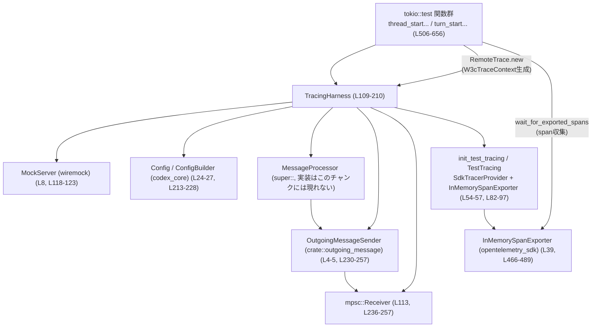
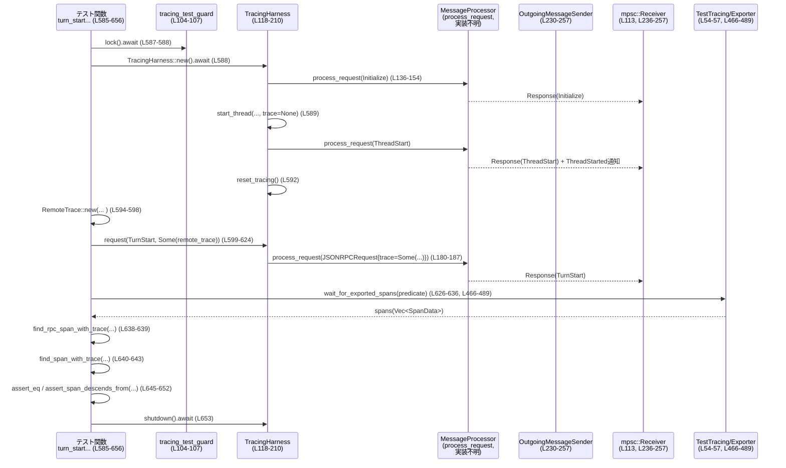

# app-server/src/message_processor/tracing_tests.rs コード解説

## 0. ざっくり一言

- `MessageProcessor` が JSON-RPC リクエストを処理するときの **OpenTelemetry トレース伝播と span の親子関係** を検証する非同期テスト群と、そのためのトレース／RPC テストハーネスを定義するファイルです。

---

## 1. このモジュールの役割

### 1.1 概要

- このモジュールは、`MessageProcessor` が
  - 外部から渡された W3C Trace Context（`W3cTraceContext`）を受け取り、
  - JSON-RPC サーバ span（`thread/start`, `turn/start`）の trace / parent span を適切に設定し、
  - 内部処理の span がその配下にぶら下がる  
 ことを検証するテストを提供します（`thread_start_jsonrpc_span_exports_server_span_and_parents_children`, `turn_start_jsonrpc_span_parents_core_turn_spans`、tracing_tests.rs:L506-583, L585-656）。

- そのために、モックサーバ・一時ディレクトリ・`MessageProcessor`・`OutgoingMessageSender`・OpenTelemetry の InMemory エクスポータを組み合わせた **`TracingHarness`** を構築し、リクエスト送信〜レスポンス受信〜span 収集までを一括で扱えるようにしています（tracing_tests.rs:L109-210, L466-504）。

### 1.2 アーキテクチャ内での位置づけ

このファイル単体の視点で、主要なコンポーネントの関係を示します。



- テストは `TracingHarness` を経由して `MessageProcessor` に JSON-RPC リクエストを送り、レスポンスと OpenTelemetry span を観測します（tracing_tests.rs:L118-210, L466-504）。
- 実際のビジネスロジック（ユーザ入力処理など）は `MessageProcessor` 側で実装されており、このチャンクには登場しません。

### 1.3 設計上のポイント

- **トレース初期化の一回性**
  - `init_test_tracing` は `OnceLock<TestTracing>` で OpenTelemetry provider と tracer/subscriber をプロセス内で一度だけ初期化します（tracing_tests.rs:L82-97）。
  - `TraceContextPropagator` をグローバルに設定し（L90）、`tracing_subscriber` に OpenTelemetry layer を積んでいます（L91-94）。
- **テスト間の並行実行制御**
  - `tracing_test_guard` が `OnceLock<tokio::sync::Mutex<()>>` を返し、各テストはそのロックを取ってから実行します（L104-107, L506-509, L585-588）。
  - これにより、トレース設定・InMemory エクスポータなどのグローバル状態への競合アクセスを直列化しています。
- **JSON-RPC ラッパ**
  - `TracingHarness::request` が `ClientRequest` を JSON-RPC の `JSONRPCRequest` に変換し（`request_from_client_request`、L99-102）、trace フィールドを差し込み、`MessageProcessor::process_request` を呼び出します（L169-189）。
- **トレース検証ユーティリティ**
  - span の属性取得・検索（`span_attr`, `find_rpc_span_with_trace`, `find_span_with_trace`）、親子関係チェック（`span_depth_from_ancestor`, `assert_span_descends_from`）、内部 span の存在確認（`assert_has_internal_descendant_at_min_depth`）といった汎用ユーティリティを定義し、テスト本体の記述を簡潔にしています（L259-387）。
- **非同期 + ポーリングによる span 収集**
  - `wait_for_exported_spans` / `wait_for_new_exported_spans` が、`force_flush`・`get_finished_spans` を繰り返しつつ条件を満たすまで待機する仕組みを提供します（L466-504）。
  - タイムアウト時には panic し、どの span が出ていたか文字列でダンプします（L485-488）。

---

## 2. 主要な機能一覧

### 2.1 コンポーネント一覧（構造体・関数・テスト）

| 名前 | 種別 | 役割 / 用途 | 定義位置 |
|------|------|-------------|----------|
| `TEST_CONNECTION_ID` | 定数 | テスト用の固定接続 ID（7） | tracing_tests.rs:L52 |
| `TestTracing` | 構造体 | In-memory span exporter と tracer provider をまとめたテスト用トレース環境 | tracing_tests.rs:L54-57 |
| `RemoteTrace` | 構造体 | リモートから渡されるトレース ID / 親 span ID と、それに対応する `W3cTraceContext` を保持 | tracing_tests.rs:L59-63 |
| `RemoteTrace::new` | 関数（impl） | 16進文字列から `TraceId` / `SpanId` を生成し、`W3cTraceContext` を組み立てる | tracing_tests.rs:L65-79 |
| `init_test_tracing` | 関数 | `OnceLock` を使って OpenTelemetry プロバイダと `TestTracing` を一度だけ初期化 | tracing_tests.rs:L82-97 |
| `request_from_client_request` | 関数 | `ClientRequest` を JSON シリアライズ経由で `JSONRPCRequest` に変換 | tracing_tests.rs:L99-102 |
| `tracing_test_guard` | 関数 | テスト間の排他制御用 `&'static tokio::sync::Mutex<()>` を返す | tracing_tests.rs:L104-107 |
| `TracingHarness` | 構造体 | モックサーバ・`MessageProcessor`・mpsc チャネル・セッション状態・トレース環境をまとめたテスト用ハーネス | tracing_tests.rs:L109-116 |
| `TracingHarness::new` | 関数（impl, async） | ハーネス構築と `Initialize` RPC 呼び出しにより、テスト用セッションを初期化 | tracing_tests.rs:L118-158 |
| `TracingHarness::reset_tracing` | 関数 | InMemory エクスポータの span をリセット | tracing_tests.rs:L160-162 |
| `TracingHarness::shutdown` | 関数（async） | `MessageProcessor` のスレッドとバックグラウンドタスクを終了 | tracing_tests.rs:L164-167 |
| `TracingHarness::request` | 関数（impl, async, ジェネリック） | 任意の `ClientRequest` を JSON-RPC に変換し、`MessageProcessor::process_request` を呼んでレスポンスをデシリアライズして返す | tracing_tests.rs:L169-189 |
| `TracingHarness::start_thread` | 関数（impl, async） | `ThreadStart` リクエストを送り、`ThreadStarted` 通知を待ってからレスポンスを返す | tracing_tests.rs:L191-210 |
| `build_test_config` | 関数（async） | モックレスポンス用 TOML を書き出し、`ConfigBuilder` からテスト用 `Config` を構築 | tracing_tests.rs:L213-228 |
| `build_test_processor` | 関数 | `MessageProcessor` と `OutgoingMessageSender` をテスト構成で生成 | tracing_tests.rs:L230-257 |
| `span_attr` | 関数 | `SpanData` から指定キーの string 属性値を取り出す | tracing_tests.rs:L259-267 |
| `find_rpc_span_with_trace` | 関数 | 指定 kind・method・trace ID を満たす RPC span を検索し、見つからない場合は panic | tracing_tests.rs:L269-289 |
| `find_span_with_trace` | 関数 | 指定 trace ID かつ任意の predicate を満たす span を検索し、見つからない場合は panic | tracing_tests.rs:L291-309 |
| `format_spans` | 関数 | span の概要（name, span_id, parent, trace, rpc.method）を文字列に整形 | tracing_tests.rs:L311-328 |
| `span_depth_from_ancestor` | 関数 | ある span が祖先 span の何世代下か（親子チェーンの深さ）を計算 | tracing_tests.rs:L330-353 |
| `assert_span_descends_from` | 関数 | 子 span が指定祖先の配下にいることを検証（違えば panic） | tracing_tests.rs:L355-365 |
| `assert_has_internal_descendant_at_min_depth` | 関数 | 祖先 span 配下に指定深さ以上の `SpanKind::Internal` span が存在することを検証 | tracing_tests.rs:L368-387 |
| `read_response` | 関数（async, ジェネリック） | mpsc 受信側から指定 request_id のレスポンス JSON を受け取り、型 `T` にデシリアライズ | tracing_tests.rs:L389-417 |
| `read_thread_started_notification` | 関数（async） | `ThreadStarted` 通知が届くまで `OutgoingEnvelope` を読み続ける | tracing_tests.rs:L420-463 |
| `wait_for_exported_spans` | 関数（async） | `force_flush` とエクスポータ取得を繰り返し、条件を満たす span 集合が得られるまで待つ | tracing_tests.rs:L466-489 |
| `wait_for_new_exported_spans` | 関数（async） | ベースライン長以降の新規 span が条件を満たすまで待ち、その部分だけを返す | tracing_tests.rs:L491-504 |
| `thread_start_jsonrpc_span_exports_server_span_and_parents_children` | テスト関数 | `thread/start` RPC のサーバ span がリモートトレースを親に取り、内部 span を持つことを検証 | tracing_tests.rs:L506-583 |
| `turn_start_jsonrpc_span_parents_core_turn_spans` | テスト関数 | `turn/start` RPC のサーバ span がリモートトレースを親に取り、`codex.op=user_input` span を子孫とすることを検証 | tracing_tests.rs:L585-656 |

### 2.2 機能サマリ

- トレース環境構築: OpenTelemetry SdkTracerProvider + InMemorySpanExporter のセットアップ（L82-97）。
- テスト用アプリサーバ起動: Wiremock モックサーバ、Config、`MessageProcessor` をまとめた `TracingHarness` の構築と初期化（L118-158, L213-257）。
- JSON-RPC 送受信: `ClientRequest` を JSON-RPC に変換し、`MessageProcessor::process_request` に送るヘルパ（L169-210）。
- span 検査ユーティリティ: span 属性の取得、特定条件の span 検索、親子関係検証（L259-387）。
- span ポーリング: エクスポータに溜まった finished span が条件を満たすまで非同期に待機（L466-504）。
- テスト: `thread/start` と `turn/start` のトレース伝播・親子関係・内部 span の存在を検証（L506-583, L585-656）。

---

## 3. 公開 API と詳細解説

このファイルはテストモジュールであり `pub` API はありませんが、他のテスト追加や理解に有用な「事実上のインターフェース」として主要メソッドを解説します。

### 3.1 型一覧（構造体・列挙体など）

| 名前 | 種別 | 役割 / 用途 | 主なフィールド | 定義位置 |
|------|------|-------------|----------------|----------|
| `TestTracing` | 構造体 | テスト用トレース環境（エクスポータ＋provider） | `exporter: InMemorySpanExporter`, `provider: SdkTracerProvider` | tracing_tests.rs:L54-57 |
| `RemoteTrace` | 構造体 | リモートトレース情報と W3C コンテキスト | `trace_id: TraceId`, `parent_span_id: SpanId`, `context: W3cTraceContext` | tracing_tests.rs:L59-63 |
| `TracingHarness` | 構造体 | テスト用のアプリサーバ・トレース・セッション状態をまとめたハーネス | `_server: MockServer`, `_codex_home: TempDir`, `processor: MessageProcessor`, `outgoing_rx: mpsc::Receiver<OutgoingEnvelope>`, `session: ConnectionSessionState`, `tracing: &'static TestTracing` | tracing_tests.rs:L109-116 |

### 3.2 関数詳細（重要 7 件）

#### `TracingHarness::new() -> Result<Self>`

**概要**

- テスト用にモックサーバと一時ディレクトリを用意し、`Config` と `MessageProcessor` を構築して `TracingHarness` を返します（tracing_tests.rs:L118-158）。
- さらに `Initialize` RPC を一度送信し、`ConnectionSessionState` を初期化済み状態にします（L136-155）。

**引数**

- なし（内部で必要なものをすべて構築）。

**戻り値**

- `Result<TracingHarness>`  
  - `Ok(harness)` : 初期化成功。
  - `Err(anyhow::Error)` : 一時ディレクトリ作成や設定構築に失敗した場合など。

**内部処理の流れ**

1. Wiremock のモックサーバを `create_mock_responses_server_repeating_assistant("Done")` で起動（L120）。
2. `TempDir::new()` で一時ディレクトリを作成（L121）。
3. `build_test_config` によりモック用設定ファイルを書きつつ `Config` を構築し、`Arc` で包む（L122, L213-228）。
4. `build_test_processor` により `MessageProcessor` と `OutgoingEnvelope` 用 mpsc 受信側を生成（L123, L230-257）。
5. `init_test_tracing` によりトレース環境を初期化し、エクスポータをリセットし、`callsite::rebuild_interest_cache()` を呼ぶ（L124-126）。
6. 以上を束ねて `TracingHarness` インスタンスを作成（L127-134）。
7. `ClientRequest::Initialize` を組み立てて `self.request` で送信し、`InitializeResponse` を受信（L136-153）。
8. `session.initialized` が真であることを `assert!` で確認（L155）。
9. `Ok(harness)` を返す（L157）。

**Examples（使用例）**

```rust
// テスト内での典型的な利用（tracing_tests.rs:L506-510）
let mut harness = TracingHarness::new().await?;
// 以降、harness.request や harness.start_thread を使ってリクエストを送る
```

**Errors / Panics**

- `TempDir::new()` や `build_test_config` 内部での I/O 失敗などにより `Err` を返します（L121-123, L213-228）。
- `Initialize` 呼び出し後に `harness.session.initialized` が `false` の場合、`assert!` により panic します（L155）。これはテスト失敗扱いです。

**Edge cases（エッジケース）**

- モックサーバ起動失敗や設定ファイル書き込み失敗時は early return の `Err` となり、テストが `?` で失敗します。
- `MessageProcessor::process_request` がレスポンスを返さない／異常終了した場合、`request` 内の `read_response` でタイムアウトやパースエラーにより panic します（詳細は後述）。

**使用上の注意点**

- テスト内で `TracingHarness` を作ったあと、最後に `harness.shutdown().await` を呼び、スレッド／タスクをクリーンアップしています（L580-580, L653-653）。
- `TracingHarness::new` はトレース環境初期化にも依存しますが、`init_test_tracing` は `OnceLock` で保護されているため、このモジュール内からは安全に複数回呼び出せます（L82-97）。

---

#### `TracingHarness::request<T>(&mut self, request: ClientRequest, trace: Option<W3cTraceContext>) -> T`

**概要**

- 高レベルな `ClientRequest` を JSON-RPC の `JSONRPCRequest` に変換し、`trace` フィールドを付与して `MessageProcessor::process_request` に送ります（L169-189）。
- 指定した request ID に対応するレスポンスを mpsc チャネルから受信して、任意型 `T` にデシリアライズして返します。

**引数**

| 引数名 | 型 | 説明 |
|--------|----|------|
| `request` | `ClientRequest` | 送信したいクライアントリクエスト（`Initialize`, `TurnStart` など） |
| `trace` | `Option<W3cTraceContext>` | トレースコンテキスト。`Some` の場合、JSON-RPC リクエストの `trace` フィールドに設定されます（L177-178）。 |

**戻り値**

- `T` : `OutgoingMessage::Response` の `result` を JSON デシリアライズした値。`T: DeserializeOwned` が必要です（L169-172, L415-416）。

**内部処理の流れ**

1. `request.id()` から `RequestId::Integer` であることを期待し、`i64` を取り出す。整数以外なら panic（L173-176）。
2. `request_from_client_request` で `ClientRequest` を JSON 経由で `JSONRPCRequest` に変換（L177, L99-102）。
3. `request.trace = trace;` で JSON-RPC リクエストへトレースコンテキストを設定（L178）。
4. `MessageProcessor::process_request` を await で呼び出し、`TEST_CONNECTION_ID`・`AppServerTransport::Stdio`・`&mut self.session` を渡す（L180-187）。
5. `read_response` に `&mut self.outgoing_rx` と `request_id` を渡して await し、目的のレスポンスを待ってデシリアライズ（L188-189, L389-417）。

**Examples（使用例）**

```rust
// TurnStart を送る例（tracing_tests.rs:L599-624 を簡略化）
let turn_start_response: TurnStartResponse = harness
    .request(
        ClientRequest::TurnStart {
            request_id: RequestId::Integer(3),
            params: TurnStartParams { /* ... */ },
        },
        Some(remote_trace), // RemoteTrace::new(...) から得た context
    )
    .await;
```

**Errors / Panics**

- `ClientRequest::id()` が `RequestId::Integer` 以外の場合、`panic!("expected integer request id ...")` になります（L173-176）。
- `request_from_client_request` 内のシリアライズ／デシリアライズ失敗時に `expect` により panic（L99-102）。
- `read_response` 内でタイムアウト（5 秒）した場合、`expect("timed out waiting for response")` により panic（L394-397）。
- チャネルがクローズされていた場合も `expect("outgoing channel closed")` により panic（L396-397）。
- レスポンス `result` の JSON を `T` に変換できなければ `expect("response payload should deserialize")` で panic（L415-416）。

**Edge cases（エッジケース）**

- 対象の `RequestId` に一致するレスポンスが来ない場合、`read_response` のループはタイムアウトまで継続し、その後 panic します（L389-417）。
- `trace` に `None` を渡した場合、リクエストの `trace` フィールドは未設定のままになり、`MessageProcessor` 側のトレースは新規に開始されると考えられますが、実際の挙動はこのチャンクには現れません。

**使用上の注意点**

- この関数はテスト用のヘルパであり、本番コードから直接呼び出されることは想定されていません。
- `T` はレスポンス JSON と完全に対応している必要があります。不一致があると test が panic します。

---

#### `TracingHarness::start_thread(&mut self, request_id: i64, trace: Option<W3cTraceContext>) -> ThreadStartResponse`

**概要**

- `ClientRequest::ThreadStart` を送信し、対応する `ThreadStartResponse` を受信します（L191-210）。
- さらに `ThreadStarted` サーバ通知が出るまで `read_thread_started_notification` で待機します（L208-209）。

**引数**

| 引数名 | 型 | 説明 |
|--------|----|------|
| `request_id` | `i64` | リクエスト ID。`RequestId::Integer(request_id)` に変換されます（L199）。 |
| `trace` | `Option<W3cTraceContext>` | リクエストに付与するトレースコンテキスト（L205）。 |

**戻り値**

- `ThreadStartResponse` : JSON-RPC レスポンスをデシリアライズした値（L196-210）。

**内部処理の流れ**

1. `ClientRequest::ThreadStart` を組み立てる。（`ephemeral: Some(true)` を設定し、その他は `default`）（L198-203）。
2. `self.request::<ThreadStartResponse>(...)` を呼んでレスポンスを取得（L196-207）。
3. `read_thread_started_notification(&mut self.outgoing_rx).await` で `ThreadStarted` 通知が来るまで待つ（L208-209, L420-463）。
4. 先に取得していた `response` を返す（L209）。

**Examples（使用例）**

```rust
// thread_start_jsonrpc_span_exports_server_span_and_parents_children での利用（L518-520）
let _: ThreadStartResponse = harness
    .start_thread(/*request_id*/ 20_002, /*trace*/ None)
    .await;
```

**Errors / Panics**

- 内部で `request` と `read_thread_started_notification` を使うため、それらに記載した panic 条件（タイムアウト、チャネルクローズ、デシリアライズエラーなど）がそのまま当てはまります（L196-209, L389-417, L420-463）。

**Edge cases（エッジケース）**

- `ThreadStarted` 通知が届かない場合、`read_thread_started_notification` が 5 秒タイムアウトで panic します（L424-427）。
- ブロードキャスト通知として届くケース（`OutgoingEnvelope::Broadcast`）にも対応しており、どちら経由でも `ThreadStarted` なら終了します（L428-461）。

**使用上の注意点**

- `start_thread` 呼び出し後に `thread.id` をテストで利用しているため（L589-590）、後続処理に使う場合はレスポンスから ID を必ず取得する前提になっています。

---

#### `read_response<T>(outgoing_rx: &mut mpsc::Receiver<OutgoingEnvelope>, request_id: i64) -> T`

**概要**

- mpsc チャネルから `OutgoingEnvelope` を受信し、
  - 接続 ID が `TEST_CONNECTION_ID`（7）で、
  - メッセージ種別が `OutgoingMessage::Response` で、
  - `response.id` が指定の `request_id`  
  に一致するものを探し、その `result` フィールドを JSON デシリアライズして返します（tracing_tests.rs:L389-417）。

**引数**

| 引数名 | 型 | 説明 |
|--------|----|------|
| `outgoing_rx` | `&mut mpsc::Receiver<OutgoingEnvelope>` | `MessageProcessor` からの送信メッセージ受信用チャネル。可変参照で継続利用されます。 |
| `request_id` | `i64` | 探索対象の JSON-RPC `RequestId::Integer` 値（L412）。 |

**戻り値**

- `T` : `response.result` を JSON デシリアライズしたもの（`T: DeserializeOwned`）（L415-416）。

**内部処理の流れ**

1. 無限ループを開始（`loop { ... }`、L393）。
2. 1 回のループごとに `tokio::time::timeout(Duration::from_secs(5), outgoing_rx.recv())` で 5 秒以内の受信を待つ（L394-397）。
   - タイムアウトで `expect("timed out waiting for response")` が panic（L394-397）。
   - チャネルクローズで `expect("outgoing channel closed")` が panic（L396-397）。
3. 受信メッセージが `OutgoingEnvelope::ToConnection { connection_id, message, .. }` でない場合は `continue`（L398-405）。
4. `connection_id != TEST_CONNECTION_ID` なら `continue`（L406-408）。
5. `message` が `OutgoingMessage::Response(response)` でない場合は `continue`（L409-411）。
6. `response.id != RequestId::Integer(request_id)` なら別リクエスト用とみなし `continue`（L412-414）。
7. 条件を満たしたら `serde_json::from_value(response.result)` で `T` にデシリアライズして返す（L415-416）。

**Examples（使用例）**

- `TracingHarness::request` 内でのみ呼ばれています（L188-189）。

**Errors / Panics**

- 5 秒以内に何も受信できない、または目的のレスポンスが来ない場合にタイムアウト panic（L394-397）。
- チャネルがクローズされた場合も panic（L396-397）。
- デシリアライズ失敗時に panic（L415-416）。

**Edge cases（エッジケース）**

- 同じ `TEST_CONNECTION_ID` で複数のリクエストが同時に飛ぶ場合、順不同にレスポンスが届いても ID マッチで選別されます。
- ただし、常に最新のメッセージを 1 つずつ消費していくため、誤った `request_id` を渡すと、目的外のレスポンスを読み飛ばし続けてタイムアウトする可能性があります。

**使用上の注意点**

- テストでは単一リクエストを順次処理する設計のため、複雑な同時リクエストには特に配慮していません。
- 本番コードで同様のロジックを用いる場合は、タイムアウト値やエラー処理を慎重に設計する必要があります。

---

#### `wait_for_exported_spans<F>(tracing: &TestTracing, predicate: F) -> Vec<SpanData>`

**概要**

- OpenTelemetry の `SdkTracerProvider` に `force_flush` を繰り返し要求しながら、InMemory エクスポータから取得できる span の集合が `predicate` 条件を満たすまで待ちます（tracing_tests.rs:L466-489）。
- 最大 200 回までループし、条件が満たされなければ panic します。

**引数**

| 引数名 | 型 | 説明 |
|--------|----|------|
| `tracing` | `&TestTracing` | `exporter` と `provider` を含むトレース環境（L54-57）。 |
| `predicate` | `F: Fn(&[SpanData]) -> bool` | 全 span のスライスに対して「条件を満たしたか」を判定する関数（L467-469）。 |

**戻り値**

- `Vec<SpanData>` : 条件を満たした時点の全 finished span のスナップショット（L480-481）。

**内部処理の流れ**

1. `last_spans` を空ベクタで初期化（L470）。
2. 最大 200 回のループ（L471）。
3. 各ループで `tokio::task::yield_now().await` により他タスクへ実行を譲る（L472）。
4. `tracing.provider.force_flush()` を呼び、span の flush を強制（L473-476）。
5. `tracing.exporter.get_finished_spans()` で現在の finished span を取得し、`last_spans` に clone（L477-478）。
6. `predicate(&spans)` が true なら、その `spans` を返す（L479-481）。
7. 条件未達なら `sleep(Duration::from_millis(50))` で 50ms 待つ（L482）。
8. 200 回終了しても条件未達なら panic し、`format_spans(&last_spans)` の結果をログに含める（L485-488）。

**Examples（使用例）**

```rust
// thread_start テスト内の利用（tracing_tests.rs:L521-527）
let untraced_spans = wait_for_exported_spans(harness.tracing, |spans| {
    spans.iter().any(|span| {
        span.span_kind == SpanKind::Server
            && span_attr(span, "rpc.method") == Some("thread/start")
    })
})
.await;
```

**Errors / Panics**

- `force_flush()` 失敗時に `expect("force flush should succeed")` で panic（L473-476）。
- 200 回の試行の間に `predicate` が一度も true を返さない場合に panic（L485-488）。

**Edge cases（エッジケース）**

- span が大量に発生した場合もすべて `Vec<SpanData>` として返されますが、テスト用途のためパフォーマンス最適化は特に行われていません。
- `predicate` が常に false を返すような設計ミスをすると、必ず panic に到達します。

**使用上の注意点**

- 本関数は **全 span を対象に条件を判定** するため、後述の `wait_for_new_exported_spans` と組み合わせて使うことで「新しい span だけ」に条件を課すことができます（L491-504）。
- テストの実行時間を短く保ちたい場合、タイムアウトやループ回数を調整する可能性がありますが、本チャンクでは固定値になっています（200 回 × 50ms ≒ 10 秒＋α）。

---

#### `wait_for_new_exported_spans<F>(tracing: &TestTracing, baseline_len: usize, predicate: F) -> Vec<SpanData>`

**概要**

- 既に存在する span 数 `baseline_len` を基準として、それ以降に追加された span に対して `predicate` 条件を課し、条件を満たすまで待機します（tracing_tests.rs:L491-504）。
- 条件を満たした時点で、新規 span 部分のみを `Vec<SpanData>` として返します。

**引数**

| 引数名 | 型 | 説明 |
|--------|----|------|
| `tracing` | `&TestTracing` | トレース環境。 |
| `baseline_len` | `usize` | 既に観測済みの span の数。`spans[0..baseline_len]` を既存とみなします（L493）。 |
| `predicate` | `F: Fn(&[SpanData]) -> bool` | 新規 span (`&spans[baseline_len..]`) に対して条件判定する関数（L499-501）。 |

**戻り値**

- `Vec<SpanData>` : 新規 span 部分（`spans.into_iter().skip(baseline_len)`）のみ（L503-504）。

**内部処理の流れ**

1. `wait_for_exported_spans(tracing, |spans| { spans.len() > baseline_len && predicate(&spans[baseline_len..]) })` を呼び出し、条件を満たすまで待機（L499-501）。
2. 返ってきた全 span を `into_iter().skip(baseline_len).collect()` して、新規の span のみを返す（L503-504）。

**Examples（使用例）**

```rust
// thread_start テストの「トレース付き」リクエストで利用（L555-569）
let spans = wait_for_new_exported_spans(harness.tracing, baseline_len, |spans| {
    spans.iter().any(|span| {
        span.span_kind == SpanKind::Server
            && span_attr(span, "rpc.method") == Some("thread/start")
            && span.span_context.trace_id() == remote_trace_id
    }) && spans.iter().any(|span| {
        span.name.as_ref() == "app_server.thread_start.notify_started"
            && span.span_context.trace_id() == remote_trace_id
    })
})
.await;
```

**Errors / Panics**

- `wait_for_exported_spans` と同じく、`force_flush` 失敗・条件未達で panic の可能性があります（L499-502, L466-489）。

**Edge cases（エッジケース）**

- `baseline_len` が現在の span 数以上で固定されたまま条件を見ているため、「新規 span が追加されない」状況では必ずタイムアウトに到達します。
- すでにある span に紐づく条件を誤って `predicate` に書くとテストが成立しません。

**使用上の注意点**

- `baseline_len` は **`wait_for_new_exported_spans` 呼び出し前に `get_finished_spans` でカウントした値** を渡す必要があります。このファイルでは、`untraced_spans.len()` を使っています（L555）。
- 既存 span に対しては条件を課していないため、テスト設計上どこまでを「新規」とみなすかを明確にすることが重要です。

---

#### `find_rpc_span_with_trace<'a>(spans: &'a [SpanData], kind: SpanKind, method: &str, trace_id: TraceId) -> &'a SpanData`

**概要**

- span 集合から、指定した
  - `span.span_kind == kind`
  - `"rpc.system" == "jsonrpc"`
  - `"rpc.method" == method`
  - `span.span_context.trace_id() == trace_id`  
  を全て満たす span を探し、見つからなければ panic します（tracing_tests.rs:L269-289）。

**引数**

| 引数名 | 型 | 説明 |
|--------|----|------|
| `spans` | `&[SpanData]` | 検索対象の span 一覧。 |
| `kind` | `SpanKind` | `Server` など、探したい span kind（L271）。 |
| `method` | `&str` | `"thread/start"` や `"turn/start"` などの RPC メソッド名（L272）。 |
| `trace_id` | `TraceId` | 対象とするトレース ID（L273）。 |

**戻り値**

- `&SpanData` : 条件を満たす最初の span。（見つからなければ panic）

**内部処理の流れ**

1. `spans.iter().find(|span| {...})` で条件を満たす span を探索（L275-282）。
2. 見つかれば参照を返す（L275-282）。
3. 見つからない場合は `unwrap_or_else` 内で panic し、`format_spans(spans)` による全 span の概要をメッセージに含める（L283-288, L311-328）。

**Examples（使用例）**

```rust
// thread_start テスト内での利用（L571-572）
let server_request_span =
    find_rpc_span_with_trace(&spans, SpanKind::Server, "thread/start", remote_trace_id);
```

**Errors / Panics**

- 条件に合致する span が存在しない場合、panic します（L283-288）。

**Edge cases（エッジケース）**

- 同じ `method`・`kind`・`trace_id` を持つ span が複数存在する場合、最初にマッチしたものだけが返ります。その中での選択基準（順序など）は `spans` の並び順に依存します。

**使用上の注意点**

- テストで使う場合、`wait_for_exported_spans` / `wait_for_new_exported_spans` により「そもそも条件を満たす span が吐かれている」ことを先に確かめてから呼ぶのが安全です。

---

### 3.3 その他の関数

| 関数名 | 役割（1 行） | 定義位置 |
|--------|--------------|----------|
| `RemoteTrace::new` | 16進文字列の trace / span ID をパースし、`W3cTraceContext` を構築するヘルパ | tracing_tests.rs:L65-79 |
| `init_test_tracing` | トレースプロバイダと OpenTelemetry layer をグローバルに設定するテスト用初期化処理 | tracing_tests.rs:L82-97 |
| `request_from_client_request` | `ClientRequest` を JSON-RPC の `JSONRPCRequest` に変換するラッパ | tracing_tests.rs:L99-102 |
| `tracing_test_guard` | テスト間で排他的にトレース関連のグローバル状態を扱うための Mutex を返す | tracing_tests.rs:L104-107 |
| `build_test_config` | モック用 TOML を書きながら `Config` を組み立てるテスト用設定生成関数 | tracing_tests.rs:L213-228 |
| `build_test_processor` | `MessageProcessor` や `OutgoingMessageSender`、`AuthManager` 等を束ねてテスト用プロセッサを作る | tracing_tests.rs:L230-257 |
| `span_attr` | `SpanData` の属性マップから string 値を抽出するユーティリティ | tracing_tests.rs:L259-267 |
| `find_span_with_trace` | 任意 predicate と trace ID で span を探索する汎用ヘルパ | tracing_tests.rs:L291-309 |
| `format_spans` | span 一覧を人間可読なテキストとして整形し、エラーメッセージに埋め込むために使用 | tracing_tests.rs:L311-328 |
| `span_depth_from_ancestor` | 子 span が祖先 span の何階層下かを探索する内部関数 | tracing_tests.rs:L330-353 |
| `assert_span_descends_from` | 指定した子 span が祖先を親チェーンに含むことを検証 | tracing_tests.rs:L355-365 |
| `assert_has_internal_descendant_at_min_depth` | 祖先 span の配下に十分な深さの `SpanKind::Internal` span があることを検証 | tracing_tests.rs:L368-387 |
| `read_thread_started_notification` | `ThreadStarted` 通知（ToConnection/Broadcast のどちらでも）を待つ | tracing_tests.rs:L420-463 |
| `thread_start_jsonrpc_span_exports_server_span_and_parents_children` | `thread/start` のサーバ span がリモート親 span を持ち、内部 span を子孫として持つことを検証するテスト | tracing_tests.rs:L506-583 |
| `turn_start_jsonrpc_span_parents_core_turn_spans` | `turn/start` のサーバ span と `codex.op=user_input` span の親子関係を検証するテスト | tracing_tests.rs:L585-656 |

---

## 4. データフロー

ここでは、`turn_start_jsonrpc_span_parents_core_turn_spans` テストにおける代表的なデータフローを示します（tracing_tests.rs:L585-656）。

1. テスト関数が `TracingHarness::new` でテスト環境を構築し、`start_thread` でスレッドを開始します（L587-590）。
2. `RemoteTrace::new` でリモートトレース ID / 親 span ID と `W3cTraceContext` を生成（L594-598）。
3. `TracingHarness::request` を用いて `ClientRequest::TurnStart` を送信し、`W3cTraceContext` を JSON-RPC の `trace` フィールドとして添付します（L599-624, L169-189）。
4. `MessageProcessor::process_request` がリクエストを処理し、OpenTelemetry に span を記録します（実装はこのチャンクには現れません）。
5. `wait_for_exported_spans` が InMemory エクスポータから span をポーリングし、`rpc.method="turn/start"` のサーバ span と `codex.op="user_input"` の span が同一 trace 内に現れるまで待機します（L626-636, L466-489）。
6. `find_rpc_span_with_trace` と `find_span_with_trace` で目的の span を取り出し、親子関係や属性（`turn.id`）を検証します（L638-652）。



この図から分かるとおり、このモジュールは:

- **リクエスト／レスポンスの経路（MP↔Rx）** と
- **トレースの経路（MP→OT exporter）**

を別々に観測し、整合性（trace ID・親子関係・属性）を検証しています。

---

## 5. 使い方（How to Use）

このファイルはテスト専用ですが、同様のパターンで新しいエンドポイントのトレーステストを追加する際の指針として整理します。

### 5.1 基本的な使用方法

新しい JSON-RPC メソッド（仮に `"foo/bar"`）のトレーステストを追加する場合の典型的な流れです。

```rust
// 1. テスト関数の枠組み（tokio::test + ガード取得）
#[tokio::test(flavor = "current_thread")]
async fn foo_bar_jsonrpc_span_is_parent_of_internal_spans() -> Result<()> {
    let _guard = tracing_test_guard().lock().await;      // tracing_tests.rs:L104-107 と同様

    // 2. ハーネスの初期化
    let mut harness = TracingHarness::new().await?;      // L118-158

    // 3. （必要なら）thread_start などで事前状態を作る
    let _thread_start_response = harness
        .start_thread(1234, None)                       // L191-210
        .await;

    // 4. RemoteTrace を作る（親トレースをシミュレート）
    let RemoteTrace { trace_id, parent_span_id, context } =
        RemoteTrace::new("...trace-id-hex...", "...span-id-hex..."); // L65-79

    // 5. 対象メソッドの ClientRequest を組み立て、request で送る
    let response: YourResponseType = harness
        .request(
            ClientRequest::YourMethod {
                request_id: RequestId::Integer(42),
                params: /* ... */
            },
            Some(context),
        )
        .await;

    // 6. wait_for_exported_spans / find_* 系で span を検証
    let spans = wait_for_exported_spans(harness.tracing, |spans| {
        spans.iter().any(|span| {
            span.span_kind == SpanKind::Server
                && span_attr(span, "rpc.method") == Some("your/method")
                && span.span_context.trace_id() == trace_id
        })
    })
    .await;

    // 7. 親子関係などの assert を記述
    let server_span = find_rpc_span_with_trace(&spans, SpanKind::Server, "your/method", trace_id);
    // ... assert 系

    harness.shutdown().await;                            // L164-167
    Ok(())
}
```

### 5.2 よくある使用パターン

- **トレースなし → トレースあり** の比較
  - `thread_start_jsonrpc_span_exports_server_span_and_parents_children` では、まず trace なしで `ThreadStart` を送り baseline の span を取得し（L518-527）、次に trace ありで送った際の新規 span だけを `wait_for_new_exported_spans` で取得します（L555-569）。
- **コア処理 span との親子関係検証**
  - `turn_start_jsonrpc_span_parents_core_turn_spans` では、`rpc.method="turn/start"` のサーバ span と `codex.op="user_input"` の span の親子関係を `assert_span_descends_from` で検証しています（L638-643, L652）。

### 5.3 よくある間違い

```rust
// 間違い例: tracing_test_guard を使わずにテストを走らせる
#[tokio::test(flavor = "current_thread")]
async fn missing_guard_may_conflict_with_other_tests() -> Result<()> {
    let mut harness = TracingHarness::new().await?;
    // ...
}

// 正しい例: 必ず最初にガードを取得してからハーネスを構築する（L506-510, L585-589）
#[tokio::test(flavor = "current_thread")]
async fn correct_with_guard() -> Result<()> {
    let _guard = tracing_test_guard().lock().await;
    let mut harness = TracingHarness::new().await?;
    // ...
}
```

- ガードを使わないと、他のテストと OpenTelemetry のグローバル状態（特に InMemory エクスポータの内容）を競合して読み書きする可能性があります。

```rust
// 間違い例: RequestId を Integer 以外にする
let req = ClientRequest::TurnStart {
    request_id: RequestId::String("id".into()), // L173-176 が panic する
    params: /* ... */,
};

// 正しい例: Integer を使う
let req = ClientRequest::TurnStart {
    request_id: RequestId::Integer(3),
    params: /* ... */,
};
```

### 5.4 使用上の注意点（まとめ）

- このモジュールの関数は**すべてテスト専用**であり、本番コードからの利用は想定されていません。
- 多くの関数が `expect` / `panic!` を用いており、失敗時に詳細な span ダンプとともにテストを即座に中断します（例: `find_rpc_span_with_trace`, `wait_for_exported_spans`）。
- `tokio::time::timeout` による 5 秒タイムアウトが複数個所に存在し、I/O などが極端に遅い環境では誤検出（テスト失敗）になる可能性があります（L394-397, L424-427）。
- グローバルな OpenTelemetry subscriber は `OnceLock` で一度だけセットされ、このモジュールからの再初期化は行われません（L82-97）。

---

## 6. 変更の仕方（How to Modify）

### 6.1 新しい機能を追加する場合（新規トレーステスト）

1. **対象メソッドの特定**
   - `ClientRequest` のバリアントに対応するメソッドが存在するか確認します（このチャンクには定義が現れませんが、`codex_app_server_protocol::ClientRequest` に依存しています：L12）。
2. **テスト関数の追加**
   - `#[tokio::test(flavor = "current_thread")]` を付けた非同期関数を新規追加し、先頭で `tracing_test_guard().lock().await` を呼びます（L506-509, L585-588）。
3. **ハーネス構築**
   - `let mut harness = TracingHarness::new().await?;` を使って共通の環境を準備します（L509-510, L588-589）。
4. **事前状態の構築（任意）**
   - `start_thread` などを呼んで、必要な前提条件（スレッド ID など）を用意します（L589-590）。
5. **RemoteTrace の生成**
   - `RemoteTrace::new(trace_hex, span_hex)` で任意のトレース ID / 親 span ID を構成します（L511-516, L594-598）。
6. **リクエスト送信**
   - `TracingHarness::request` もしくは `start_thread` を呼び、`Some(remote_trace.context)` を `trace` に渡します（L555-558, L599-624）。
7. **span 検証**
   - `wait_for_exported_spans` / `wait_for_new_exported_spans` と `find_*` / `assert_*` 系を使って、期待するトレース構造が生成されているかを検証します（L521-552, L559-579, L626-652）。
8. **クリーンアップ**
   - テスト末尾で `harness.shutdown().await;` を呼びます（L580, L653）。

### 6.2 既存の機能を変更する場合

- **トレース構造が契約している内容**
  - `thread_start` / `turn_start` テストは、以下を前提としています：
    - リモート trace ID が JSON-RPC サーバ span に引き継がれる（L572-577, L645-647）。
    - サーバ span の `parent_span_id` がリモートの親 span ID に等しい（L574, L645）。
    - サーバ span が `remote` 親を持つフラグ（`parent_span_is_remote`）を立てる（L575, L646）。
    - 内部処理の span がサーバ span の子孫になる（L578-579, L652）。
    - `turn/start` のサーバ span には `turn.id` 属性が付与される（L648-651）。
  - これらの契約を変更する場合は、該当テストを同時に更新する必要があります。
- **影響範囲の確認**
  - `TracingHarness::request` を変更すると、このファイル内のすべてのテストに影響します（L136-154, L196-207, L599-624）。
  - span 検証系ユーティリティ（`find_rpc_span_with_trace` など）を変更すると、エラーメッセージや検査条件が変わるため、テストの意図をよく確認する必要があります（L269-309, L355-387）。
- **非同期／並行性の注意**
  - タイムアウト値やポーリング間隔（5 秒, 50ms）を変更するとテスト全体の実行時間に影響します（L394-397, L424-427, L471-483）。
  - `tracing_test_guard` の挙動を変えると、テストの並行実行パターンが変わり、OpenTelemetry のグローバル状態競合の可能性が変化します（L104-107）。

---

## 7. 関連ファイル

このモジュールと特に関係が深い外部モジュール・クレート（ファイルパスはこのチャンクには現れませんが、モジュールパスとして判明しているもの）をまとめます。

| パス / モジュール | 役割 / 関係 |
|-------------------|------------|
| `super::MessageProcessor` | 実際の JSON-RPC リクエストを処理するアプリケーションサーバ本体。このテストハーネスから `process_request` が呼ばれます（tracing_tests.rs:L2, L180-187）。実装ファイルパスはこのチャンクには現れません。 |
| `super::ConnectionSessionState` | 接続ごとのセッション状態を表す型。`TracingHarness` が保持し、`MessageProcessor::process_request` に渡します（tracing_tests.rs:L1, L114-115, L181-186）。 |
| `super::MessageProcessorArgs` | `MessageProcessor::new` の引数構造体。テスト用構成を組み立てるために `build_test_processor` で使用されています（tracing_tests.rs:L3, L240-255）。 |
| `crate::outgoing_message` | `ConnectionId`, `OutgoingMessageSender`, `OutgoingEnvelope`, `OutgoingMessage` などの型を提供し、リクエスト／レスポンスの送受信に使われます（tracing_tests.rs:L4-5, L113-114, L236-257, L398-417, L428-461）。 |
| `crate::transport::AppServerTransport` | `MessageProcessor::process_request` に渡すトランスポート種別（ここでは `Stdio`）を提供します（tracing_tests.rs:L6, L184）。 |
| `codex_app_server_protocol` | `ClientRequest`, `ThreadStartParams`, `TurnStartParams`, `Initialize*` 型、`ServerNotification::ThreadStarted` など JSON-RPC プロトコル関連の型を提供します（tracing_tests.rs:L11-22, L443-445, L456-458）。 |
| `codex_core::config` / `config_loader` | テスト用 `Config` とクラウド要件ローダ (`CloudRequirementsLoader`) を提供します（tracing_tests.rs:L24-27, L213-228, L246-248）。 |
| `codex_analytics::AppServerRpcTransport` | RPC トランスポート種別（ここでは `Stdio`）を指定するために使用されています（tracing_tests.rs:L10, L253）。 |
| `app_test_support` | モックレスポンスサーバ (`create_mock_responses_server_repeating_assistant`) と設定ファイル書き込みヘルパ (`write_mock_responses_config_toml`) を提供します（tracing_tests.rs:L8-9, L118-123, L213-222）。 |
| `opentelemetry` / `opentelemetry_sdk` | OpenTelemetry のトレーサー、`SpanData`、InMemory エクスポータ、TraceContext 伝播などを提供し、テストで span の生成・検証に利用されます（tracing_tests.rs:L33-41, L82-97, L259-387, L466-504）。 |

このファイルは、上記の多くのコンポーネントを統合して「トレースが正しく伝播しているか」を確認するためのテスト専用モジュールとして機能しています。
