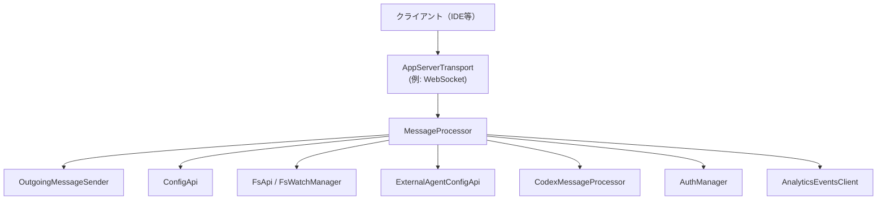
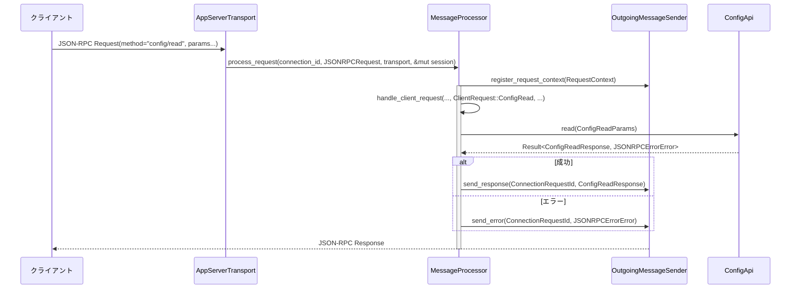

app-server/src/message_processor.rs コード解説
================================================

## 0. ざっくり一言

このモジュールは、アプリケーションサーバー側でクライアントからの JSON-RPC メッセージ（リクエスト／レスポンス／エラー／通知）を受け取り、`CodexMessageProcessor`・設定 API・ファイルシステム API などの各コンポーネントへ振り分ける中核のメッセージ処理レイヤーです。また、ChatGPT 認証トークンのリフレッシュ要求をクライアントへ橋渡しする外部認証ブリッジも提供します。

> ※提供されたコードには行番号情報が含まれていないため、本解説では厳密な `L開始-終了` 形式の行番号は付記できません。根拠は「`message_processor.rs` 内の該当型／関数定義」によって示します。

---

## 1. このモジュールの役割

### 1.1 概要

- このモジュールは **クライアントとの JSON-RPC プロトコル処理** を集約し、  
  - 初期化 (`initialize`) の状態管理  
  - 実験的 API の利用可否判定  
  - 設定・外部エージェント・ファイルシステム関連のリクエスト処理  
  - 残りの AI アシスタント関連リクエストを `CodexMessageProcessor` へ委譲  
  を行います。
- さらに、`AuthManager` から利用される **外部認証リフレッシュ橋渡し (`ExternalAuthRefreshBridge`)** を提供し、クライアントに ChatGPT トークン更新を JSON-RPC 経由で要求します。
- 追跡用の `RequestContext` を登録し、`tracing` によるスパンを付与することで、リクエストごとの観測性も担保しています。

### 1.2 アーキテクチャ内での位置づけ

このモジュールは、クライアントからみると「AppServer のフロントコントローラ」に相当し、内部の複数コンポーネントへ処理を振り分けます。



- クライアントからの JSON-RPC メッセージは `AppServerTransport` を経由して `MessageProcessor` に渡されます。
- `MessageProcessor` は `ClientRequest` のバリアントに応じて:
  - 設定関連 → `ConfigApi`
  - 外部エージェント設定関連 → `ExternalAgentConfigApi`
  - ファイル関連 → `FsApi` / `FsWatchManager`
  - それ以外 → `CodexMessageProcessor`
  へルーティングします。
- 応答・通知はすべて `OutgoingMessageSender` を通じてクライアント側へ送信されます。
- 認証やアナリティクスは `AuthManager` / `AnalyticsEventsClient` / `ThreadManager` と協調して動作します。

### 1.3 設計上のポイント

- **責務の分割**
  - プロトコル境界（JSON-RPC）と内部ロジックの橋渡しをこのモジュールに集約し、  
    設定・FS・外部エージェント・AI スレッド処理自体は他モジュール (`ConfigApi` 等) に委譲しています。
- **状態管理**
  - グローバルに近い状態は `MessageProcessor` のフィールド（`Arc<Config>`、`Arc<AuthManager>` など）として保持。
  - 接続単位の状態は `ConnectionSessionState`（初期化済みフラグ、実験 API 有効フラグなど）として、呼び出し元が `&mut` で管理します。
- **エラーハンドリング**
  - 入力検証・プロトコルレベルのエラーは `JSONRPCErrorError` とエラーコード（`INVALID_REQUEST_ERROR_CODE` / `INTERNAL_ERROR_CODE`）に正規化してクライアントへ返します。
  - 外部認証リフレッシュでは `std::io::Result` を使い、タイムアウトやチャネル閉塞を `std::io::Error::other` でラップして上位へ伝播します。
- **並行性**
  - 共有リソースは `Arc` と `RwLock` で共有し、非同期処理は `async fn` と `tokio::spawn` / `tokio::join!` / `timeout` で構成されています。
  - 大きな非同期処理（`CodexMessageProcessor::process_request`）は `.boxed()` することで、`handle_client_request` のステートマシンが肥大化しないようにしています（スタック使用量の抑制）。
- **観測性**
  - 各リクエストごとに `RequestContext` を登録し、`tracing::Instrument` でスパンに紐付けています。
  - 受信メッセージ・エラーは `tracing::trace!` / `info!` / `error!` / `warn!` でロギングしています。

---

## 2. 主要な機能一覧

- 外部認証ブリッジ: ChatGPT トークンリフレッシュ要求をクライアントへ JSON-RPC 経由で送信し、レスポンスから `ExternalAuthTokens` を構築する。
- メッセージ処理エントリポイント:
  - JSON-RPC ベース (`process_request`)
  - 型付きリクエストベース (`process_client_request`)
- 接続セッション状態管理: `ConnectionSessionState` による `initialize` 状態／実験 API 有効フラグ／通知オプトアウトの管理。
- 初期化リクエスト処理: `ClientRequest::Initialize` を解釈し、originator・User-Agent・residency 要件設定、`InitializeResponse` 返却を行う。
- 実験 API の利用制御: `experimental_reason()` を参照し、実験 API 未有効の場合はエラーを返す。
- 設定関連 API:
  - 読み取り (`ConfigRead`)
  - 単一値書き込み (`ConfigValueWrite`)
  - バッチ書き込み (`ConfigBatchWrite`)
  - 実験機能有効化設定 (`ExperimentalFeatureEnablementSet`)
  - 要件読み取り (`ConfigRequirementsRead`)
  - 設定変更後の副作用処理（リモートコントロール有効化更新等）
- 外部エージェント設定 API:
  - 自動検出 (`ExternalAgentConfigDetect`)
  - インポート (`ExternalAgentConfigImport`)
- ファイルシステム API:
  - 読み書き／ディレクトリ操作／メタデータ取得／コピー／削除
  - ウォッチ／アンウォッチ (`FsWatch` / `FsUnwatch`)
- スレッド関連:
  - スレッド生成通知の購読 (`thread_created_receiver`)
  - スレッドリスナのアタッチ／クリア、バックグラウンドタスクの drain、ログインキャンセル、スレッドシャットダウン
- 応答・エラー処理:
  - クライアントからの JSON-RPC `Response` / `Error` を `OutgoingMessageSender` に通知
- 設定警告通知:
  - 起動時に検出された設定警告を、全接続／特定接続へ通知

---

## 3. 公開 API と詳細解説

### 3.1 型一覧（構造体・列挙体など）

> ※行番号は不明なため、「`message_processor.rs` 内定義」で根拠を示します。

| 名前 | 種別 | 可視性 | 役割 / 用途 | 根拠 |
|------|------|--------|-------------|------|
| `ExternalAuthRefreshBridge` | 構造体 | 非公開 | `OutgoingMessageSender` を用いて ChatGPT トークンリフレッシュをクライアントに依頼し、レスポンスから `ExternalAuthTokens` を生成する外部認証ブリッジ | `ExternalAuthRefreshBridge` 定義と `impl ExternalAuth` |
| `MessageProcessor` | 構造体 | `pub(crate)` | AppServer の中核メッセージディスパッチャ。JSON-RPC メッセージを解析し、各種 API へルーティングする | `pub(crate) struct MessageProcessor { ... }` |
| `ConnectionSessionState` | 構造体 | `pub(crate)` | 接続ごとのセッション状態（`initialized`、実験 API 有効フラグ、通知オプトアウト、クライアント名／バージョン）を保持する | `#[derive(Clone, Debug, Default)] pub(crate) struct ConnectionSessionState { ... }` |
| `MessageProcessorArgs` | 構造体 | `pub(crate)` | `MessageProcessor::new` に渡す依存コンポーネント一式（`OutgoingMessageSender`、`Arg0DispatchPaths`、`Config`、`EnvironmentManager` など） | `pub(crate) struct MessageProcessorArgs { ... }` |
| `EXTERNAL_AUTH_REFRESH_TIMEOUT` | 定数 | 非公開 | 外部認証リフレッシュ要求のタイムアウト（10 秒） | `const EXTERNAL_AUTH_REFRESH_TIMEOUT: Duration = ...;` |

---

### 3.2 関数詳細（主要 7 件）

#### 1. `ExternalAuthRefreshBridge::refresh(&self, context: ExternalAuthRefreshContext) -> std::io::Result<ExternalAuthTokens>`

**概要**

- `AuthManager` から呼ばれる外部認証更新メソッドです。
- クライアントに `ChatgptAuthTokensRefresh` JSON-RPC リクエストを送り、新しい ChatGPT 認証トークン情報を取得して `ExternalAuthTokens` に変換します。
- 10 秒のタイムアウト付きで、チャネル閉塞や RPC エラーを `std::io::Error` として上位に伝えます。

**引数**

| 引数名 | 型 | 説明 |
|--------|----|------|
| `context` | `ExternalAuthRefreshContext` | リフレッシュ理由（`ExternalAuthRefreshReason`）と前回アカウント ID を含むコンテキスト |

**戻り値**

- `Ok(ExternalAuthTokens)`：クライアントから受け取ったトークン情報を ChatGPT 用 `ExternalAuthTokens::chatgpt(...)` に変換したもの。
- `Err(std::io::Error)`：以下のいずれかの失敗条件。

**内部処理の流れ**

1. `context.reason` を `ChatgptAuthTokensRefreshReason` にマッピングし、`ChatgptAuthTokensRefreshParams` を構築。
2. `OutgoingMessageSender::send_request(ServerRequestPayload::ChatgptAuthTokensRefresh(params))` を呼んで、`request_id` とレスポンス用の `rx`（oneshot レシーバ）を取得。
3. `tokio::time::timeout(EXTERNAL_AUTH_REFRESH_TIMEOUT, rx).await` で 10 秒待機:
   - タイムアウトした場合:
     - `OutgoingMessageSender::cancel_request(&request_id)` を呼んでリクエストをキャンセル。
     - `"auth refresh request timed out after ...s"` という `std::io::Error` を返す。
   - 成功した場合:
     - oneshot の受信に失敗した（送信側 drop）場合は `"auth refresh request canceled: {err}"` という `std::io::Error` を返す。
     - JSON-RPC 側のエラー（`Err(JSONRPCErrorError)`）の場合は `"auth refresh request failed: code=... message=..."` の `std::io::Error` を返す。
4. 正常な JSON 値を `serde_json::from_value::<ChatgptAuthTokensRefreshResponse>` でデシリアライズ。
5. `ExternalAuthTokens::chatgpt(response.access_token, response.chatgpt_account_id, response.chatgpt_plan_type)` を生成して `Ok(...)` を返す。

**Examples（使用例）**

`MessageProcessor::new` 内での利用例です（実際のコードそのものです）。

```rust
// MessageProcessorArgs から取得した outgoing と auth_manager を使って、
// 外部認証ブリッジを AuthManager に登録する
auth_manager.set_external_auth(Arc::new(ExternalAuthRefreshBridge {
    outgoing: outgoing.clone(), // OutgoingMessageSender を共有
}));
```

`AuthManager` は、このブリッジ経由で `refresh(...)` を呼び出し、トークンを更新します。

**Errors / Panics**

- `Err(std::io::Error)` が返る条件（panic は使用していません）:
  - タイムアウト: 10 秒以内にクライアントが応答しない。
  - oneshot チャネル閉塞: 送信側がドロップされ、レスポンス未送信。
  - JSON-RPC エラー: クライアント側が JSON-RPC エラーを返した（エラーコード・メッセージは `Error` メッセージに含まれる）。
  - JSON デコード失敗: クライアントのレスポンスが `ChatgptAuthTokensRefreshResponse` としてデコードできなかった。

**Edge cases（エッジケース）**

- クライアントがこのメソッドに対応する RPC を実装していない／バグで応答しない場合 → タイムアウトし、`cancel_request` が呼ばれた上で `Err` を返します。
- クライアントが JSON フォーマットを変更してしまった場合 → `serde_json::from_value` が失敗し、`Err(std::io::Error)` になります。
- `ExternalAuthRefreshReason` には現在 `Unauthorized` のみがマッピングされており、他のバリアントが追加された場合の挙動はこのコードだけからは分かりません。

**使用上の注意点**

- この関数は `AuthManager` の内部から呼び出される想定であり、利用者側が直接呼ぶ必要は通常ありません。
- エラーは `std::io::Error` として表現されるため、呼び出し側ではログ出力などで `error.to_string()` を確認すると原因が分かりやすくなります。
- タイムアウト値 (`EXTERNAL_AUTH_REFRESH_TIMEOUT`) を変更する場合は、クライアント側の挙動（UI での待ち時間など）への影響も考慮する必要があります。

---

#### 2. `MessageProcessor::new(args: MessageProcessorArgs) -> MessageProcessor`

**概要**

- AppServer 起動時に呼ばれるコンストラクタです。
- すべての依存コンポーネント（`OutgoingMessageSender`、`AuthManager`、`ThreadManager`、`ConfigApi` 等）を組み立て、`MessageProcessor` と関連サブシステムを初期化します。
- プラグインのウォームアップ処理やアナリティクスクライアント登録もここで行います。

**引数**

| 引数名 | 型 | 説明 |
|--------|----|------|
| `args` | `MessageProcessorArgs` | 外向き送信、設定、環境管理、クラウド要件、フィードバック、ログ DB、認証、RPC トランスポートなどの依存性一式 |

**戻り値**

- `MessageProcessor` インスタンス。内部に各種 API とマネージャを保持します。

**内部処理の流れ**

1. `MessageProcessorArgs` を分解し、各フィールドをローカル変数に展開。
2. `AuthManager` に `ExternalAuthRefreshBridge` を登録（外部認証リフレッシュの橋渡し）。
3. `AnalyticsEventsClient::new(...)` でアナリティクスクライアントを作成し、`ThreadManager::new(...)` に渡す。
4. `ThreadManager` から `plugins_manager()` を取得し、アナリティクスを設定 (`set_analytics_events_client`)。
5. CLI オーバーライド・実行時機能有効フラグ・クラウド要件を `RwLock` でラップし、`CodexMessageProcessor::new(...)` に渡す。
6. プラグインの事前起動タスクを `maybe_start_plugin_startup_tasks_for_config` で開始。
7. `ConfigApi::new(...)` を初期化。
8. `ExternalAgentConfigApi::new(...)`、`FsApi::default()`、`FsWatchManager::new(outgoing.clone())` を初期化。
9. 最後に `MessageProcessor` 構造体にこれらのオブジェクトを格納し、返却。

**Examples（使用例）**

依存オブジェクトの詳細な構築方法はこのファイルからは分かりませんが、典型的な呼び出しイメージは次のようになります。

```rust
use std::sync::Arc;

fn build_message_processor(...) -> MessageProcessor {
    let args = MessageProcessorArgs {
        outgoing: Arc::new(outgoing_sender),         // OutgoingMessageSender
        arg0_paths,                                  // Arg0DispatchPaths
        config: Arc::new(config),                    // Config
        environment_manager: Arc::new(env_manager),  // EnvironmentManager
        cli_overrides: Vec::new(),                   // CLI での上書き設定
        loader_overrides,                            // LoaderOverrides
        cloud_requirements,                          // CloudRequirementsLoader
        feedback,                                    // CodexFeedback
        log_db: None,                                // 任意の LogDbLayer
        config_warnings: Vec::new(),                 // 起動時設定警告
        session_source,                              // SessionSource
        auth_manager: Arc::new(auth_manager),        // AuthManager
        rpc_transport,                               // AppServerRpcTransport
        remote_control_handle: None,                 // Optional<RemoteControlHandle>
    };
    MessageProcessor::new(args)
}
```

**Errors / Panics**

- この関数は `Result` を返さず、内部でも `unwrap`／`expect` 等を使用していないため、コード上はパニックを起こさない設計です。
- ただし、呼び出しに使用される外部コンストラクタ (`ThreadManager::new` など) によるパニックの可能性については、このファイルからは分かりません。

**Edge cases**

- `config_warnings` が空の場合でも問題なく動作し、後続の通知処理 (`send_initialize_notifications*`) は単に何も送らないだけです。
- `log_db` が `None` の場合、`CodexMessageProcessor` によるログ DB 利用が無効になると推測されますが、詳細は他ファイルからは分かりません。

**使用上の注意点**

- `MessageProcessor::new` の呼び出しは通常 1 回で、サーバー全体のライフタイムにわたって再利用される前提です。
- `auth_manager` は `ExternalAuthRefreshBridge` によって `OutgoingMessageSender` に依存するようになるため、`auth_manager` のライフタイムは `MessageProcessor` と整合している必要があります。

---

#### 3. `MessageProcessor::process_request(&self, connection_id, request, transport, session)`

**概要**

- WebSocket 等から受信した **JSON-RPC 形式のリクエスト** を処理するメインエントリポイントです。
- JSON を `ClientRequest` 型にデコードし、`handle_client_request` に委譲します。
- リクエストスパンとトレースコンテキストを設定し、`OutgoingMessageSender` に `RequestContext` を登録します。

**引数**

| 引数名 | 型 | 説明 |
|--------|----|------|
| `connection_id` | `ConnectionId` | 接続を一意に識別する ID |
| `request` | `JSONRPCRequest` | プロトコル層の JSON-RPC リクエスト |
| `transport` | `AppServerTransport` | どのトランスポートで来たか（WebSocket など） |
| `session` | `&mut ConnectionSessionState` | 接続ごとのセッション状態（初期化フラグなど） |

**戻り値**

- `async fn` であり、戻り値は `()` です。  
  エラーはすべて JSON-RPC のエラーとしてクライアントへ返されます。

**内部処理の流れ**

1. `request.method` をログ出力用に取得し、トレースログ (`tracing::trace!`) を出力。
2. `ConnectionRequestId` を構築し、`app_server_tracing::request_span` を使ってトレーススパンを生成。
3. `request.trace` があれば `W3cTraceContext` に変換。
4. `RequestContext::new` で `request_id`・スパン・トレースコンテキストをまとめる。
5. `run_request_with_context(...)` を呼び出し、内部に `async` クロージャを渡す:
   - `serde_json::to_value(&request)` で JSON 値に変換。失敗した場合は `INVALID_REQUEST_ERROR_CODE` でエラーを返して終了。
   - その JSON 値を `serde_json::from_value::<ClientRequest>` で型付きリクエストに変換。失敗した場合も同様にエラーを返す。
   - 正常時は `handle_client_request(...)` に処理を委譲。

**Examples（使用例）**

サーバ側の受信ループ内での利用イメージです。

```rust
async fn handle_incoming_jsonrpc(
    processor: &MessageProcessor,
    connection_id: ConnectionId,
    transport: AppServerTransport,
) {
    let mut session = ConnectionSessionState::default(); // 接続ごとの状態

    while let Some(request) = receive_jsonrpc_request().await {
        processor
            .process_request(connection_id, request, transport, &mut session)
            .await;
    }
}
```

**Errors / Panics**

- JSON デコード／エンコード失敗時:
  - `serde_json::to_value`／`from_value::<ClientRequest>` が失敗すると、`INVALID_REQUEST_ERROR_CODE` を含む `JSONRPCErrorError` を構築し、`OutgoingMessageSender::send_error` でクライアントに通知します。
- 関数自体はパニックを起こすコードを含まず、エラーは JSON-RPC エラーとして外部に出ます。

**Edge cases**

- `request.trace` が `None` の場合、`RequestContext` のトレースコンテキストは `None` になり、分散トレーシングは引き継がれません。
- `session` が未初期化のまま非 `initialize` リクエストを送った場合は、この関数内ではなく後続の `handle_client_request` で `"Not initialized"` エラーが返されます。

**使用上の注意点**

- `session` は `&mut` 参照で渡されるため、同じ接続からの複数リクエストを同時にこの関数に渡すことはできません（コンパイル時に防止されます）。これは接続状態の整合性を保つための Rust の所有権／借用ルールによる安全性です。
- トレーススパンは `run_request_with_context` 内で設定されるため、この関数をバイパスして直接 `handle_client_request` を呼ぶとトレーシング情報が欠落します。

---

#### 4. `MessageProcessor::process_client_request(&self, connection_id, request, session, outbound_initialized)`

**概要**

- AppServer をライブラリとしてインプロセス利用するクライアント向けの、**型付きリクエスト** 用エントリポイントです。
- JSON デシリアライズを省略しつつ、`process_request` と同等のセマンティクス（`handle_client_request` へのディスパッチ、トレーシング等）を維持します。
- `initialize` 完了時に `outbound_initialized` を立てる経路を有効にします。

**引数**

| 引数名 | 型 | 説明 |
|--------|----|------|
| `connection_id` | `ConnectionId` | 接続 ID |
| `request` | `ClientRequest` | 既に型として構築されたクライアントリクエスト |
| `session` | `&mut ConnectionSessionState` | 接続状態 |
| `outbound_initialized` | `&AtomicBool` | 初期化完了を示すフラグ（インプロセスクライアントのみ使用） |

**戻り値**

- `async fn` で戻り値は `()` です。

**内部処理の流れ**

1. `ConnectionRequestId` とトレーススパン（`typed_request_span`）を構築し、`RequestContext` を生成。
2. `tracing::trace!` でログ出力。
3. `run_request_with_context(...)` を呼び、内部で `handle_client_request(...)` を `Some(outbound_initialized)` とともに呼び出す。

**Examples（使用例）**

```rust
use std::sync::atomic::AtomicBool;
use std::sync::atomic::Ordering;

async fn call_inprocess(
    processor: &MessageProcessor,
    connection_id: ConnectionId,
    request: ClientRequest,
) {
    let mut session = ConnectionSessionState::default();
    let outbound_initialized = AtomicBool::new(false);

    processor
        .process_client_request(connection_id, request, &mut session, &outbound_initialized)
        .await;

    if outbound_initialized.load(Ordering::Acquire) {
        // initialize が完了し、送信側も準備完了になった
    }
}
```

**Errors / Panics**

- エラー処理は `handle_client_request` に委譲され、JSON-RPC エラーとしてクライアントに送られます。
- 関数自体はパニックを起こすコードを含みません。

**Edge cases**

- `initialize` 以外のリクエストを最初に投げた場合の `"Not initialized"` エラーなど、`process_request` と同じ挙動になります。
- `outbound_initialized` はインプロセスクライアント用のみで、WebSocket 経由では `None` が渡されるため、この経路は利用されません。

**使用上の注意点**

- インプロセス利用では、`outbound_initialized` フラグを監視して「いつからレスポンス送信が可能か」を判断する契機にできます。
- JSON デシリアライズを自前で行ってから渡す前提なので、`ClientRequest` の構築時に型安全性は担保されます。

---

#### 5. `MessageProcessor::handle_client_request(&self, connection_request_id, codex_request, session, outbound_initialized, request_context)`

**概要**

- **このモジュールのコアロジック** であり、型付き `ClientRequest` を内容に応じて各サブシステムへルーティングする関数です。
- セッションの初期化状態や実験 API 有効フラグを検査し、不正な利用に対しては JSON-RPC エラーを返します。
- `Initialize` リクエストだけは特別扱いし、それ以外は `session.initialized == true` を前提とします。

**引数**

| 引数名 | 型 | 説明 |
|--------|----|------|
| `connection_request_id` | `ConnectionRequestId` | 接続 ID + リクエスト ID の組 |
| `codex_request` | `ClientRequest` | 型付きクライアントリクエスト |
| `session` | `&mut ConnectionSessionState` | 接続ごとの状態（初期化フラグ・実験 API フラグなど） |
| `outbound_initialized` | `Option<&AtomicBool>` | インプロセス用の初期化完了フラグ（WebSocket 経由では `None`） |
| `request_context` | `RequestContext` | トレーシング・トレースコンテキストなどの情報 |

**戻り値**

- `async fn` で戻り値は `()` です。  
  成否は JSON-RPC レスポンス／エラーとしてクライアントへ送信されます。

**内部処理の流れ（抜粋）**

1. **Initialize 特別処理**
   - `ClientRequest::Initialize { request_id, params }` の場合:
     - 既に `session.initialized == true` なら `"Already initialized"` エラーを返す。
     - `params.capabilities` から `experimental_api_enabled` と `opt_out_notification_methods` を抽出し、`session` に反映。
     - `params.client_info` から `name` / `version` を取得し、`session.app_server_client_name` / `client_version` を更新。
     - `set_default_originator(name.clone())` を呼び:
       - `InvalidHeaderValue` → `"Invalid clientInfo.name..."` エラーを返す。
       - `AlreadyInitialized` → 何もしない（期待されるケース）。
     - 特定の feature (`Feature::GeneralAnalytics`) が有効な場合、`analytics_events_client.track_initialize(...)` を呼ぶ。
     - `set_default_client_residency_requirement(...)` を設定。
     - `USER_AGENT_SUFFIX` をロックし、`"{name}; {version}"` をセット（`Mutex` が poison されている場合は何もしない）。
     - `get_codex_user_agent()` を取得。
     - `config.codex_home.clone().try_into()` に失敗した場合は `"Invalid CODEX_HOME: {err}"`（`INTERNAL_ERROR_CODE`）でエラーを返す。
     - 正常時は `InitializeResponse { user_agent, codex_home, platform_family, platform_os }` を返す。
     - `session.initialized = true` に設定。
     - `outbound_initialized` が `Some` の場合:
       - `outbound_initialized.store(true, Ordering::Release)`。
       - `CodexMessageProcessor::connection_initialized(connection_id)` を呼ぶ。
     - 処理終了（`return`）。

2. **Initialize 以外のリクエスト共通チェック**
   - `session.initialized == false` の場合:
     - `"Not initialized"`（`INVALID_REQUEST_ERROR_CODE`）エラーを返し、終了。

3. **実験 API 利用チェック**
   - `if let Some(reason) = codex_request.experimental_reason() && !session.experimental_api_enabled`:
     - `experimental_required_message(reason)` をメッセージとして含むエラーを返し、終了。

4. **リクエスト種別ごとのディスパッチ**
   - `ConfigRead` → `handle_config_read(...)`
   - `ConfigValueWrite` / `ConfigBatchWrite` → 各ハンドラ → `handle_config_mutation_result(...)`
   - `ExperimentalFeatureEnablementSet` → ハンドラ → apps 有効化時は `refresh_apps_list_after_experimental_feature_enablement_set()` を呼び出し。
   - `ConfigRequirementsRead` → `handle_config_requirements_read(...)`
   - 外部エージェント設定系 → `handle_external_agent_config_detect` / `import`
   - FS 系 → `handle_fs_*`（`FsWatch` / `FsUnwatch` は `FsWatchManager` 経由）
   - その他のリクエスト → `CodexMessageProcessor::process_request(...)` に委譲（`.boxed().await`）

**Examples（使用例）**

この関数はモジュール内のプライベート関数であり、直接の呼び出しは行わず `process_request` / `process_client_request` を経由します。利用イメージは前述の例の通りです。

**Errors / Panics**

- `Initialize` 関連:
  - 2 回目以降の `Initialize` → `"Already initialized"`（`INVALID_REQUEST_ERROR_CODE`）。
  - `clientInfo.name` が不正な HTTP ヘッダ値 → `"Invalid clientInfo.name: '{name}'. Must be a valid HTTP header value."`（`INVALID_REQUEST_ERROR_CODE`）。
  - `config.codex_home` が不正 → `"Invalid CODEX_HOME: {err}"`（`INTERNAL_ERROR_CODE`）。
- 非 `Initialize` で未初期化 → `"Not initialized"`（`INVALID_REQUEST_ERROR_CODE`）。
- 実験 API が必要なリクエストで `experimental_api_enabled == false` → `experimental_required_message(reason)` で説明付きエラー。
- 関数内には `panic!` などはなく、エラーは JSON-RPC エラーに正規化されます。

**Edge cases**

- `capabilities` が `None` の場合、`experimental_api_enabled` は `false`、オプトアウト通知メソッドは空になります。
- `SetOriginatorError::AlreadyInitialized` の場合は何も行わないため、環境変数によって originator が先に設定されているケースと整合性が保たれます。
- `USER_AGENT_SUFFIX.lock()` が失敗した（`Mutex` が poison）場合、ユーザーエージェントサフィックスは設定されませんが、そのまま処理は続行されます。

**使用上の注意点**

- 新しいリクエストタイプを追加する場合は、この `match codex_request { ... }` に分岐を追加し、必要に応じて:
  - `initialize` 後でのみ許可するか（現状は全てそうなっています）
  - 実験 API のフラグに従うべきか（`experimental_reason()` 実装側で制御）
  を検討する必要があります。
- エラーコードとして `INVALID_REQUEST_ERROR_CODE` と `INTERNAL_ERROR_CODE` を適切に使い分けることで、クライアントが再試行可能なエラーとサーバ内部エラーを区別できます。

---

#### 6. `MessageProcessor::refresh_apps_list_after_experimental_feature_enablement_set(&self)`

**概要**

- 実験機能有効化設定（`ExperimentalFeatureEnablementSet`）で `apps` が有効化された後に、アプリ一覧を再取得してクライアントへ通知する非同期処理です。
- 設定を再ロードし、認証状態と feature の組み合わせに基づいて apps 機能が利用可能な場合にのみ実行します。
- 実際のリスト取得と通知はバックグラウンドタスク (`tokio::spawn`) で行われます。

**引数・戻り値**

- 引数なし（`&self` のみ）。
- `async fn` で戻り値は `()` です。

**内部処理の流れ**

1. `config_api.load_latest_config(None).await` で最新の設定を読み込む。失敗した場合は `tracing::warn!` で警告をログ出力し、処理終了。
2. `auth_manager.auth().await` で現在の認証情報を取得。
3. `config.features.apps_enabled_for_auth(...)` で、apps 機能が現在の認証状態で有効かどうかを判定:
   - `auth.is_some_and(CodexAuth::is_chatgpt_auth)` を渡すことで ChatGPT 認証であるかどうかをチェック。
   - 無効であれば処理終了。
4. `outgoing` をクローンし、`config` とともに `tokio::spawn(async move { ... })` ブロックへ移動。
5. スポーンされたタスク内で:
   - `tokio::join!` により
     - `connectors::list_all_connectors_with_options(&config, /*force_refetch*/ true)`
     - `connectors::list_accessible_connectors_from_mcp_tools_with_options(&config, /*force_refetch*/ true)`
     を並列に実行。
   - いずれかの結果が `Err` の場合は `tracing::warn!` を出力し、処理終了。
   - 成功した場合は `connectors::merge_connectors_with_accessible(...)` で統合し、`connectors::with_app_enabled_state(..., &config)` で enabled 状態を付与。
   - `ServerNotification::AppListUpdated(AppListUpdatedNotification { data })` を `OutgoingMessageSender::send_server_notification` でクライアントへ通知。

**Examples（使用例）**

この関数自体は `handle_experimental_feature_enablement_set` からのみ呼び出されます。

```rust
if should_refresh_apps_list && is_ok {
    self.refresh_apps_list_after_experimental_feature_enablement_set().await;
}
```

**Errors / Panics**

- `config_api.load_latest_config` や `connectors::*` の内部エラーは `Result` として扱われ、`tracing::warn!` によるログ出力のみでクライアントには直接は伝えません。
- 関数内で `unwrap` 等は使用されておらず、明示的なパニックはありません。

**Edge cases**

- apps feature が無効な場合（認証状態や設定による）には、何も通知されません。
- `connectors` 系の呼び出しが失敗すると、アプリ一覧が更新されずに古い状態のままになる可能性がありますが、その場合もクライアントから見ると「更新が来なかった」だけです。

**使用上の注意点**

- この関数は設定変更後の副作用としてのみ呼び出す設計であり、直接呼び出すには慎重な設計意図が必要です（アプリ一覧のリフレッシュ頻度が高いと、外部サービスへの負荷が増える可能性があります）。
- `tokio::spawn` によってバックグラウンドで動くため、呼び出し元はこの処理の完了を待ちません。通知の到達タイミングは保証されません。

---

#### 7. `MessageProcessor::handle_config_mutation_result<T: serde::Serialize>(&self, request_id, result)`

**概要**

- 設定変更系 API の共通処理ヘルパーです。
- `ConfigApi` による変更結果 `Result<T, JSONRPCErrorError>` を受け取り、成功時は `handle_config_mutation` を呼び出した上でレスポンスを返し、失敗時はエラーをそのまま返します。

**引数**

| 引数名 | 型 | 説明 |
|--------|----|------|
| `request_id` | `ConnectionRequestId` | 応答先を識別する ID |
| `result` | `Result<T, JSONRPCErrorError>` | 設定変更処理の結果。成功時は任意のシリアライズ可能な型 |

**戻り値**

- `async fn` で戻り値は `()` です。

**内部処理の流れ**

1. `match result` で分岐。
2. `Ok(response)` の場合:
   - `self.handle_config_mutation().await` を呼び、設定変更後の副作用処理を実行。
     - `CodexMessageProcessor::handle_config_mutation()` 呼び出し。
     - `remote_control_handle` が `Some` なら、最新の設定を読み直して `Feature::RemoteControl` の有効／無効に応じてリモートコントロールを切り替え。
   - `OutgoingMessageSender::send_response(request_id, response).await` で成功レスポンスを返す。
3. `Err(error)` の場合:
   - `OutgoingMessageSender::send_error(request_id, error).await` でエラーをそのまま返す。

**Examples（使用例）**

`ConfigValueWrite` のハンドラでの利用です（実コード）。

```rust
async fn handle_config_value_write(
    &self,
    request_id: ConnectionRequestId,
    params: ConfigValueWriteParams,
) {
    let result = self.config_api.write_value(params).await;
    self.handle_config_mutation_result(request_id, result).await
}
```

**Errors / Panics**

- `result` が `Err(JSONRPCErrorError)` の場合、そのままクライアントへエラーとして返されます。
- `handle_config_mutation` の中で `load_latest_config` が失敗した場合は `tracing::warn!` を出力し、リモートコントロール有効状態の更新をスキップしますが、クライアントへのレスポンスには影響しません。
- パニックを起こすコードは含まれていません。

**Edge cases**

- `remote_control_handle` が `None` の場合、設定変更後のリモートコントロール有効化更新は行われません。
- `handle_config_mutation` 内の設定再読み込みに失敗した場合でも、クライアントには成功レスポンスが返ります（内部状態だけが最新にならない可能性があります）。

**使用上の注意点**

- 新しい設定変更 API を追加する場合は、この関数を経由させることで、設定変更後の共通副作用（スレッド側の通知、リモートコントロール更新など）を自動的に適用できます。
- 設定読み込み失敗時の扱い（クライアントには成功を返すかどうか）は、この関数の方針に従うことになります。

---

### 3.3 その他の関数（概要一覧）

> 代表的なもののみを列挙します。いずれも `MessageProcessor` のメソッドです。

| 関数名 | 役割（1 行） |
|--------|--------------|
| `clear_runtime_references` | `AuthManager` から外部認証ブリッジをクリアし、ランタイム参照の循環を解消する。 |
| `process_notification` / `process_client_notification` | クライアントからの通知（JSON-RPC/型付き）をログに記録する（現状は処理ロジックなし）。 |
| `run_request_with_context` | `RequestContext` を `OutgoingMessageSender` に登録し、与えられた Future をトレーススパン付きで実行するヘルパー。 |
| `thread_created_receiver` | `CodexMessageProcessor` のスレッド作成通知（`broadcast::Receiver<ThreadId>`）を返す。 |
| `send_initialize_notifications_to_connection` | 起動時設定警告を特定の接続に `ServerNotification::ConfigWarning` として送信。 |
| `connection_initialized` | 指定接続について `CodexMessageProcessor::connection_initialized` を呼ぶ。 |
| `send_initialize_notifications` | 起動時設定警告を全接続へブロードキャスト送信。 |
| `try_attach_thread_listener` | 特定スレッド ID に対して接続 ID 群をリスナとして紐付ける。 |
| `drain_background_tasks` | `CodexMessageProcessor` 側のバックグラウンドタスクが完了するまで待機。 |
| `cancel_active_login` | 進行中のログインフローをキャンセル。 |
| `clear_all_thread_listeners` | 全スレッドリスナを解除。 |
| `shutdown_threads` | 管理下のスレッドをシャットダウン。 |
| `connection_closed` | 接続クローズ時に、Outgoing 側と FS ウォッチ、`CodexMessageProcessor` へクローズ通知を送る。 |
| `subscribe_running_assistant_turn_count` | 実行中のアシスタントターン数の `watch::Receiver<usize>` を購読。 |
| `process_response` | クライアントからの JSON-RPC レスポンスを `OutgoingMessageSender::notify_client_response` に転送。 |
| `process_error` | クライアントからの JSON-RPC エラーを `notify_client_error` に転送。 |
| `handle_config_read` / `handle_config_requirements_read` | 設定読み取り API を呼び出し、成功時はレスポンス、失敗時はエラーを返す。 |
| `handle_external_agent_config_detect` / `import` | 外部エージェント設定の検出／インポート API をラップする。 |
| `handle_fs_read_file` / `write_file` / `create_directory` / `get_metadata` / `read_directory` / `remove` / `copy` | `FsApi` の各種ファイル操作メソッドをラップし、結果に応じてレスポンス／エラーを返す。 |
| `handle_fs_watch` / `handle_fs_unwatch` | `FsWatchManager` を用いて、接続ごとのファイルウォッチを追加／削除する。 |
| `handle_experimental_feature_enablement_set` | 実験機能の有効化設定を更新し、apps 有効化時にはアプリ一覧更新の副作用を起動する。 |
| `handle_config_mutation` | 設定変更後に `CodexMessageProcessor` と `RemoteControlHandle` に対する状態更新を行う。 |

---

## 4. データフロー

ここでは、典型的な「設定読み取り（`ConfigRead`）リクエスト」を例に、クライアントからレスポンスまでのデータフローを示します。

### 4.1 処理の要点

1. クライアントが JSON-RPC 形式で `ConfigRead` リクエストを送信。
2. `AppServerTransport` が `JSONRPCRequest` にパースし、`MessageProcessor::process_request` へ渡す。
3. `MessageProcessor` が JSON を `ClientRequest::ConfigRead` にデコードし、`handle_client_request` → `handle_config_read` と進む。
4. `ConfigApi::read` が設定値を読み取り、結果を `OutgoingMessageSender::send_response` でクライアントへ返す。

### 4.2 シーケンス図（ConfigRead の例）



同様に、他のリクエスト種別でも:

- `Config*` 系 → `ConfigApi`
- 外部エージェント系 → `ExternalAgentConfigApi`
- FS 系 → `FsApi` / `FsWatchManager`
- それ以外 → `CodexMessageProcessor`

というルートでデータが流れます。

---

## 5. 使い方（How to Use）

### 5.1 基本的な使用方法

AppServer の起動時に `MessageProcessor` を構築し、接続ごとに `ConnectionSessionState` を用意してリクエストを処理するパターンです。

```rust
use std::sync::Arc;
use app_server::message_processor::{MessageProcessor, MessageProcessorArgs, ConnectionSessionState};
use app_server::outgoing_message::OutgoingMessageSender;
use app_server::transport::AppServerTransport;
// 他の依存型は省略

async fn run_server(...) {
    // 依存オブジェクトの構築（詳細は他モジュール）
    let outgoing = Arc::new(OutgoingMessageSender::new(/* ... */));
    let auth_manager = Arc::new(AuthManager::new(/* ... */));
    let config = Arc::new(load_config()?);
    // 省略: environment_manager, arg0_paths, loader_overrides, cloud_requirements, feedback, log_db, session_source, rpc_transport, remote_control_handle...

    let args = MessageProcessorArgs {
        outgoing: outgoing.clone(),
        arg0_paths,
        config: config.clone(),
        environment_manager,
        cli_overrides: Vec::new(),
        loader_overrides,
        cloud_requirements,
        feedback,
        log_db: None,
        config_warnings: Vec::new(),
        session_source,
        auth_manager,
        rpc_transport,
        remote_control_handle: None,
    };

    let processor = MessageProcessor::new(args);        // 中核コンポーネント

    // 接続ごとの処理
    loop {
        let (connection_id, transport, request) = accept_jsonrpc_request().await;
        // 各接続ごとにセッション状態を保持する
        let mut session = ConnectionSessionState::default();

        processor
            .process_request(connection_id, request, transport, &mut session)
            .await;
    }
}
```

### 5.2 よくある使用パターン

1. **WebSocket 経由クライアント**

   - サーバ側: `process_request` を呼ぶ。
   - クライアント側: 最初に `Initialize` を送り、成功レスポンスを受け取ってから他のリクエストを送信。

2. **インプロセスクライアント**

   - ライブラリとして AppServer を組み込む場合、`ClientRequest` を直接構築し `process_client_request` を用いる。
   - `outbound_initialized` フラグで初期化完了を検知。

```rust
use std::sync::atomic::{AtomicBool, Ordering};

async fn use_inprocess(processor: &MessageProcessor, conn_id: ConnectionId) {
    let mut session = ConnectionSessionState::default();
    let outbound_initialized = AtomicBool::new(false);

    let init_req = ClientRequest::initialize(/* ... */); // 実際の構築方法はプロトコル定義参照
    processor
        .process_client_request(conn_id, init_req, &mut session, &outbound_initialized)
        .await;

    if outbound_initialized.load(Ordering::Acquire) {
        // Initialize 完了後に他のリクエストを送る
    }
}
```

1. **設定変更 API**

   - `ConfigValueWrite` / `ConfigBatchWrite` などを送ると、クライアントには通常のレスポンスに加え、内部的に:
     - `CodexMessageProcessor::handle_config_mutation()` 呼び出し
     - `RemoteControlHandle` によるリモートコントロール有効化状態の更新
     が行われます。

### 5.3 よくある間違い

```rust
// 間違い例: Initialize を送らずに ConfigRead を呼び出す
let mut session = ConnectionSessionState::default();
processor
    .process_request(conn_id, config_read_request, transport, &mut session)
    .await;
// → handle_client_request 内で "Not initialized" エラーが返る

// 正しい例: まず Initialize を行い、成功後に他のリクエストを送る
let init_request = jsonrpc_initialize_request();
processor
    .process_request(conn_id, init_request, transport, &mut session)
    .await;
// InitializeResponse を受け取った後に ConfigRead を送る
```

```rust
// 間違い例: 実験 API を利用するリクエストを送るが、Initialize で experimental_api を有効化しない
// capabilities.experimental_api = false または capabilities 自体を送らない
// → handle_client_request で experimental_required_message(reason) によるエラー

// 正しい例: Initialize の capabilities で experimental_api を true にする
// capabilities.experimental_api = true
```

### 5.4 使用上の注意点（まとめ）

- **初期化の必須性**:
  - `ClientRequest::Initialize` を成功させるまでは、他の全てのリクエストが `"Not initialized"` エラーになります。
- **実験 API の opt-in**:
  - 実験的な API は `Initialize` 時に `capabilities.experimental_api = true` を送った接続にのみ許可されます。
- **スレッド安全性**:
  - `MessageProcessor` 自体は `&self` で利用するため複数タスクから共有可能ですが、`ConnectionSessionState` は `&mut` で渡されるため、単一接続に対しては同時に複数リクエストを処理するような呼び出し方はできません（コンパイルエラーになります）。
- **バックグラウンド処理**:
  - apps リストの更新や一部プラグインの起動は `tokio::spawn` で非同期に行われるため、これらの完了はリクエスト・レスポンスのライフサイクルとは独立しています。

---

## 6. 変更の仕方（How to Modify）

### 6.1 新しい機能を追加する場合

1. **ClientRequest へのバリアント追加**
   - `codex_app_server_protocol::ClientRequest` に新しいリクエストバリアントを定義する（このファイルからは場所は分かりませんが、プロトコル定義側での追加が必要です）。

2. **handle_client_request への分岐追加**
   - `match codex_request { ... }` に新しいバリアントの `match` 分岐を追加し、適切なサブシステムに委譲するか、ここで直接処理する。
   - 実験 API に該当する場合は、`experimental_reason()` 実装側で `Some(reason)` を返すようにしておくと、既存の gating ロジックが利用できます。

3. **エラーコードとセマンティクスの設計**
   - 入力検証エラー → `INVALID_REQUEST_ERROR_CODE`。
   - サーバ内部エラー → `INTERNAL_ERROR_CODE`。
   - という既存の方針に合わせて、クライアントにとって分かりやすいエラーメッセージを設計する。

4. **必要に応じて ConfigApi / FsApi 等を拡張**
   - 新しい設定項目や FS 操作の場合は、対応する API モジュールを拡張し、このモジュールからはラッパーハンドラ関数を追加する。

### 6.2 既存の機能を変更する場合

- **影響範囲の確認**
  - 変更したいリクエストタイプがどの分岐で処理されているかを `handle_client_request` 内の `match` から特定。
  - その後に呼ばれる API（`ConfigApi`、`FsApi`、`CodexMessageProcessor` など）側の実装も確認する。

- **契約（前提条件・返り値）の維持**
  - `Initialize` の契約（1 回だけ成功／2 回目以降は `"Already initialized"` エラー）を変更する場合は、クライアント実装やテストが依存している可能性を考慮する必要があります。
  - 実験 API gating のルールを変更する場合は、`experimental_reason()` の実装と合わせて整合性を取る必要があります。

- **テスト・ロギングの確認**
  - ファイル末尾に `mod tracing_tests;` があり、トレーシング関連のテストが別モジュールに存在することが示唆されますが、内容はこのチャンクには含まれていません。
  - 変更後は、既存のテストを実行し、必要に応じて新しいテストケースを追加することが望ましいです。

---

## 7. 関連ファイル

このモジュールと密接に関係するモジュール／クレート（ファイルパスはこのチャンクからは特定できません）を列挙します。

| モジュール / クレート | 役割 / 関係 |
|-----------------------|------------|
| `crate::codex_message_processor` (`CodexMessageProcessor`) | AI スレッド管理やアシスタントリクエスト処理を担う中核コンポーネント。MessageProcessor は非設定系のリクエストをここへ委譲します。 |
| `crate::config_api` (`ConfigApi`) | 設定の読み書き・要件読み取り・実験機能有効化などを提供。Config 系リクエストはすべてここに委譲されます。 |
| `crate::external_agent_config_api` (`ExternalAgentConfigApi`) | 外部エージェント設定の検出・インポート機能を提供。 |
| `crate::fs_api` (`FsApi`) | ファイル読み書き／ディレクトリ操作／メタデータ取得／コピー／削除などの FS 操作を提供。 |
| `crate::fs_watch` (`FsWatchManager`) | 接続ごとのファイルウォッチ管理を行い、変更通知をクライアントへ送る。 |
| `crate::outgoing_message` (`OutgoingMessageSender`, `ConnectionId`, `ConnectionRequestId`, `RequestContext`) | サーバからクライアントへの JSON-RPC レスポンス・エラー・通知の送信、リクエストコンテキストの管理を行う。 |
| `crate::transport` (`AppServerTransport`, `RemoteControlHandle`) | トランスポート種別の情報と、リモートコントロール機能の有効化制御を提供。 |
| `crate::app_server_tracing` | JSON-RPC / 型付きリクエスト向けのトレーススパンを構築し、`RequestContext` に利用される。 |
| `codex_analytics` (`AnalyticsEventsClient`, `AppServerRpcTransport`) | アナリティクスイベント記録と RPC トランスポート情報を提供。Initialize などで使用。 |
| `codex_login` (`AuthManager`, `ExternalAuth` 系) | 認証管理を担い、`ExternalAuthRefreshBridge` はここから利用される。 |
| `codex_chatgpt::connectors` | apps（外部コネクタ）の一覧取得・統合・状態付与を行い、AppListUpdated 通知に利用される。 |
| `codex_core::ThreadManager` | スレッド管理とプラグイン起動タスク管理を行い、`CodexMessageProcessor` や `ConfigApi` と連携する。 |
| `codex_state::log_db::LogDbLayer` | ログ DB レイヤー。`MessageProcessorArgs` 経由で `CodexMessageProcessor` に渡されるオプション依存。 |

---

この解説は、`app-server/src/message_processor.rs` に含まれる情報のみに基づいています。  
他モジュールやテストコードの詳細な挙動については、それぞれの定義を参照する必要があります。
