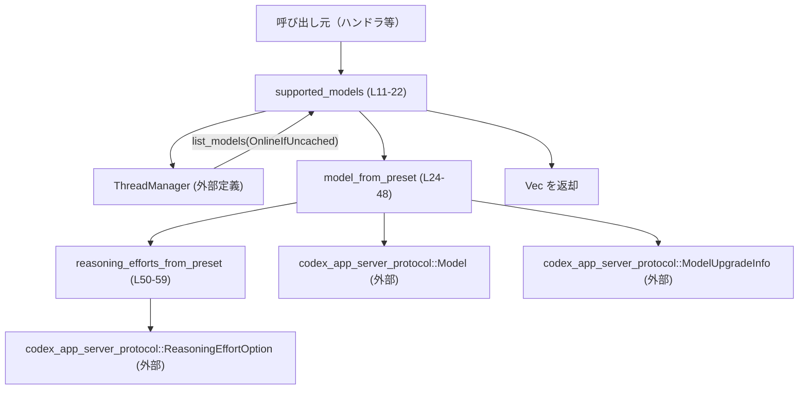
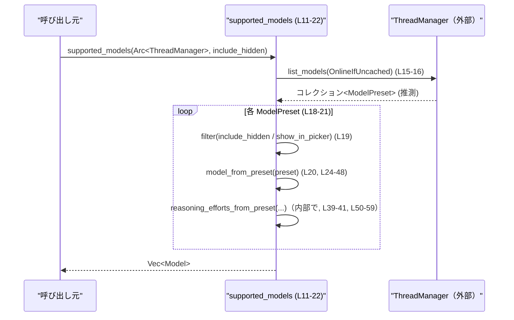
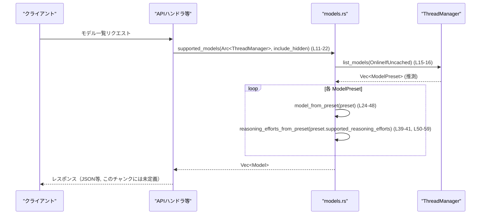

# app-server/src/models.rs

## 0. ざっくり一言

このファイルは、`ThreadManager` が管理するモデル一覧（`ModelPreset`）をアプリケーションプロトコル用の `Model` 型に変換し、クライアント向けの「利用可能モデル一覧」を生成するユーティリティを提供しています。

---

## 1. このモジュールの役割

### 1.1 概要

- このモジュールは、**モデル管理層の内部表現 (`ModelPreset`) を、アプリサーバプロトコル用の外部表現 (`Model`) に変換する**役割を持ちます。
- 具体的には、`ThreadManager` からモデル一覧を非同期に取得し、必要に応じて「非表示モデル」を除外した上で、プロトコル定義の `Model` 構造体にマッピングします（`supported_models` 関数, `app-server/src/models.rs:L11-22`）。
- 併せて、推論負荷設定（reasoning effort）のプリセットを `ReasoningEffortOption` に変換します（`reasoning_efforts_from_preset`, `L50-59`）。

### 1.2 アーキテクチャ内での位置づけ

このファイルに現れる依存関係を簡略化すると、次のような構造になっています。



- 上位レイヤ（HTTP ハンドラ等）から `supported_models` が呼ばれます。
- `supported_models` は `ThreadManager`（外部クレート `codex_core`）に対してモデル一覧取得を依頼します（`L15-17`）。
- 取得した `ModelPreset` のリストを、ローカルヘルパー `model_from_preset` / `reasoning_efforts_from_preset` でプロトコル用の型に変換し、`Vec<Model>` として返します。

### 1.3 設計上のポイント

コードから読める特徴を列挙します。

- **責務の分離**
  - 外部とのインターフェースは `pub async fn supported_models` のみで、データ変換の詳細は `model_from_preset` / `reasoning_efforts_from_preset` に分離されています（`L11-22`, `L24-48`, `L50-59`）。
- **状態の非保持**
  - このファイル内で状態（構造体やグローバル変数）は定義されておらず、すべて関数ベースの純粋な変換処理になっています。
- **非同期処理と共有**
  - モデル一覧取得は `async` 関数で行われ、`ThreadManager` は `Arc<ThreadManager>` として共有されます（`L11-13`）。
- **エラーハンドリング方針**
  - `thread_manager.list_models(...)` の戻り値は、そのまま `await` の後に `into_iter()` が呼ばれており（`L15-18`）、`Result` 等のエラー型ではないと推測されますが、このチャンクには戻り値の定義が現れないため詳細は不明です。
  - このファイル内には明示的なエラー処理（`Result` / `Option` のマッチや `?` 演算子）はありません。

### 1.4 コンポーネントインベントリー（関数一覧）

このチャンクに現れる関数の一覧と行番号です。

| 名前 | 種別 | 公開 | 行範囲 | 説明 |
|------|------|------|--------|------|
| `supported_models` | 関数（`async`） | `pub` | `app-server/src/models.rs:L11-22` | `ThreadManager` からモデル一覧を取得し、フィルタ・変換して `Vec<Model>` を返す |
| `model_from_preset` | 関数 | 非公開 | `app-server/src/models.rs:L24-48` | `ModelPreset` から `Model` へのフィールドマッピングを行う |
| `reasoning_efforts_from_preset` | 関数 | 非公開 | `app-server/src/models.rs:L50-59` | `Vec<ReasoningEffortPreset>` を `Vec<ReasoningEffortOption>` に変換する |

このファイルには構造体・列挙体などの新規定義はありません。

---

## 2. 主要な機能一覧

- モデル一覧取得と公開用形式への変換: `supported_models` が、`ThreadManager` からモデル一覧を取得し、`Model` 型のベクタに変換して返します（`L11-22`）。
- 単一モデルプリセットの変換: `model_from_preset` が、`ModelPreset` から `Model` へのフィールドコピー・変換を行います（`L24-48`）。
- 推論負荷プリセットの変換: `reasoning_efforts_from_preset` が、`ReasoningEffortPreset` を `ReasoningEffortOption` に変換します（`L50-59`）。

---

## 3. 公開 API と詳細解説

### 3.1 型一覧（このファイル内）

このファイル内で新たに定義される型はありません。

参考として、このファイルが利用している外部定義の主要な型を示します（詳細な定義はこのチャンクには現れません）。

| 名前 | 定義元 | 役割 / 用途（コードから読み取れる範囲） |
|------|--------|-----------------------------------------|
| `Model` | `codex_app_server_protocol`（`L3`） | クライアントに公開される「モデル」のプロトコル用表現 |
| `ModelUpgradeInfo` | 同上（`L4`） | モデルのアップグレードに関する情報（`upgrade_info` フィールドで使用, `L29-34`） |
| `ReasoningEffortOption` | 同上（`L5`） | 推論負荷オプションの公開用表現（`reasoning_efforts_from_preset` の戻り値, `L50-59`） |
| `ThreadManager` | `codex_core`（`L6`） | モデル一覧取得 API `list_models` を提供する管理コンポーネント（`L15-17`） |
| `RefreshStrategy` | `codex_models_manager::manager`（`L7`） | モデル一覧の更新戦略（`OnlineIfUncached` を使用, `L16`） |
| `ModelPreset` | `codex_protocol::openai_models`（`L8`） | モデル管理層で使われるモデルの内部表現 |
| `ReasoningEffortPreset` | 同上（`L9`） | 推論負荷の内部プリセット表現 |

### 3.2 関数詳細

#### `supported_models(thread_manager: Arc<ThreadManager>, include_hidden: bool) -> Vec<Model>`

**概要**

- 非同期関数です（`pub async fn`, `L11`）。
- `ThreadManager` からモデルプリセット一覧を取得し（`list_models`, `L15-17`）、`include_hidden` フラグに応じて非表示モデルをフィルタし（`L19`）、`Model` 型に変換して返します（`L20-21`）。

**引数**

| 引数名 | 型 | 説明 |
|--------|----|------|
| `thread_manager` | `Arc<ThreadManager>` | モデル一覧を取得するための管理コンポーネント。`Arc` により複数タスク間で共有されることが想定されます（`L11-12`）。 |
| `include_hidden` | `bool` | `true` の場合は非表示モデルも含めて返却し、`false` の場合は `preset.show_in_picker` が `true` のものだけを返します（`L19`）。 |

**戻り値**

- `Vec<Model>`: クライアント向けプロトコルで定義された `Model` 型のリストです（`L14`）。
- この関数は `Result` ではなく `Vec` を直接返しており、このファイル内にはエラー返却のコードはありません（`L11-22`）。

**内部処理の流れ（アルゴリズム）**

`app-server/src/models.rs:L15-21` を基にすると、次のようなステップです。

1. `thread_manager.list_models(RefreshStrategy::OnlineIfUncached)` を呼び出し、`await` で完了を待ちます（`L15-17`）。  
   - 返り値の具体的な型はこのチャンクには出てきませんが、直後に `into_iter()` が呼ばれているため、`Vec<ModelPreset>` 等のイテレータ化可能なコレクションと推測されます。
2. `into_iter()` でモデルプリセットのイテレータに変換します（`L18`）。
3. `.filter(|preset| include_hidden || preset.show_in_picker)` で、`include_hidden` が `false` であれば `preset.show_in_picker` が `true` のものだけに絞り込みます（`L19`）。
4. `.map(model_from_preset)` で、各 `ModelPreset` を `Model` に変換します（`L20`, `model_from_preset` は `L24-48`）。
5. `.collect()` で、すべての `Model` を `Vec<Model>` にまとめて返します（`L21`）。

**処理フロー図**



**Examples（使用例）**

> 注意: `ThreadManager` の生成方法はこのチャンクにはないため、サンプルではダミー関数で表現します。

```rust
use std::sync::Arc;
use codex_core::ThreadManager;
use codex_app_server_protocol::Model;

// ThreadManager を取得する方法は別モジュールの責務です。
// ここでは仮の関数として定義します。
fn get_thread_manager() -> Arc<ThreadManager> {
    unimplemented!("ThreadManager の生成・取得方法はこのチャンクには定義されていません");
}

#[tokio::main] // 例として tokio ランタイムを利用
async fn main() {
    let thread_manager = get_thread_manager(); // 共有用に Arc<ThreadManager> を取得

    // 非表示モデルを除外して取得
    let models: Vec<Model> = supported_models(thread_manager.clone(), false).await;

    // 非表示モデルも含めて取得
    let all_models: Vec<Model> = supported_models(thread_manager.clone(), true).await;

    println!("visible models: {}", models.len());
    println!("all models: {}", all_models.len());
}
```

**Errors / Panics**

- この関数自体は `Result` を返さず、明示的に `panic!` を呼んでいません（`L11-22`）。
- 潜在的なエラー発生源は `list_models` の実装ですが、その定義はこのチャンクには現れません。  
  したがって:
  - `list_models` が内部でエラー時に `panic!` する可能性はありますが、コードからは判断できません。
  - `list_models` がエラーではなく空のリストを返す実装であれば、この関数も単に空の `Vec<Model>` を返すだけです。

**Edge cases（エッジケース）**

コードから読み取れる範囲でのエッジケースです。

- モデルが 0 件の場合:
  - `list_models` が空のコレクションを返した場合、`filter` / `map` / `collect` により、空の `Vec<Model>` が返ります（`L18-21`）。
- すべてのモデルが非表示（`show_in_picker == false`）で `include_hidden == false` の場合:
  - `filter` がすべての要素を除外し、結果は空の `Vec<Model>` になります（`L19`）。
- `include_hidden == true` の場合:
  - `filter` の条件 `include_hidden || preset.show_in_picker` は常に `true` になるため、`show_in_picker` に関わらずすべてのモデルが返されます（`L19`）。
- `ThreadManager` が内部的に何らかの異常状態にある場合:
  - `list_models` の仕様がこのチャンクにはないため、戻り値や挙動は不明です。

**使用上の注意点**

- 非同期コンテキスト:
  - `supported_models` は `async fn` であるため、`.await` できる非同期コンテキスト（例えば `tokio` や `async-std` のランタイム上）から呼び出す必要があります（`L11`）。
- 共有オブジェクト:
  - `thread_manager` は `Arc<ThreadManager>` で渡されるため、**クローンは軽量な参照カウントの増加**であり、`ThreadManager` 自体の複製ではありません。
  - スレッド安全性 (`Send` / `Sync`) については `ThreadManager` の定義がこのチャンクにはないため不明ですが、`Arc` を使っていることから並列な利用が想定されていると考えられます。
- アクセス制御:
  - `include_hidden` を `true` にすると非表示モデルも返されます（`L19`）。非表示の意味（内部専用・実験中など）はコードからは分かりませんが、**どの呼び出し元が `true` を指定できるか**は、上位レイヤで適切に制御する必要があります。

---

#### `model_from_preset(preset: ModelPreset) -> Model`

**概要**

- `ModelPreset` から `codex_app_server_protocol::Model` へのフィールドマッピングを行う内部ヘルパー関数です（`L24-48`）。
- アップグレード情報や推論負荷オプションなど、複数のフィールドをまとめて変換します。

**引数**

| 引数名 | 型 | 説明 |
|--------|----|------|
| `preset` | `ModelPreset` | モデル管理層で定義されたモデルのプリセット情報（`L24`）。 |

**戻り値**

- `Model`: プロトコル層で使用される `Model` 型のインスタンスです（`L25-47`）。

**内部処理の概要**

すべてフィールドのコピー・変換です（`app-server/src/models.rs:L25-47`）。

- 文字列系:
  - `id`, `model`, `display_name`, `description` は `to_string()` で `String` に変換（`L26-27`, `L36-37`）。
- アップグレード関連:
  - `upgrade`: `preset.upgrade.as_ref().map(|upgrade| upgrade.id.clone())` で `Option` をマッピングし、`upgrade` が存在する場合はその `id` をコピー（`L28`）。
  - `upgrade_info`: `preset.upgrade.as_ref().map(|upgrade| ModelUpgradeInfo { ... })` で `ModelUpgradeInfo` 構造体にフィールドをコピー（`L29-34`）。
- 利用可能性:
  - `availability_nux`: `preset.availability_nux.map(Into::into)` で型変換（`L35`）。元・先の型はこのチャンクからは分かりません。
  - `hidden`: `!preset.show_in_picker` による反転で、表示フラグを「非表示フラグ」に変換（`L38`）。
- 推論負荷:
  - `supported_reasoning_efforts`: `reasoning_efforts_from_preset(preset.supported_reasoning_efforts)` で変換（`L39-41`）。
  - `default_reasoning_effort`: 値をそのままコピー（`L42`）。
- その他:
  - `input_modalities`, `supports_personality`, `additional_speed_tiers`, `is_default` はそのままコピー（`L43-46`）。

**使用上の注意点**

- 非公開関数であり、外部から直接呼び出されることを想定していません（`fn` で `pub` なし, `L24`）。
- `preset.upgrade` や `preset.availability_nux` が `None` の場合でも、`Option::map` を使っているため `None` のまま安全に伝播します（`L28-29`, `L35`）。

---

#### `reasoning_efforts_from_preset(efforts: Vec<ReasoningEffortPreset>) -> Vec<ReasoningEffortOption>`

**概要**

- 推論負荷プリセット (`ReasoningEffortPreset`) のリストを、公開用の `ReasoningEffortOption` のリストに変換するヘルパー関数です（`L50-59`）。

**引数**

| 引数名 | 型 | 説明 |
|--------|----|------|
| `efforts` | `Vec<ReasoningEffortPreset>` | 内部表現の推論負荷プリセット一覧（`L50-51`）。 |

**戻り値**

- `Vec<ReasoningEffortOption>`: プロトコル用の推論負荷オプション一覧（`L52`）。

**内部処理の概要**

`app-server/src/models.rs:L53-59` によると次の通りです。

1. `efforts.iter()` でイテレータを取得（借用）します（`L53-54`）。
2. `.map(|preset| ReasoningEffortOption { ... })` で、各 `ReasoningEffortPreset` を `ReasoningEffortOption` に変換します（`L55-57`）。
   - `reasoning_effort`: `preset.effort` をそのままコピー（`L56`）。
   - `description`: `preset.description.to_string()` で文字列をコピー（`L57`）。
3. `.collect()` で `Vec<ReasoningEffortOption>` を構築して返します（`L59`）。

**使用上の注意点**

- `efforts` は値として受け取っていますが、中身は `.iter()` で借用されているため、引数自体は消費される一方で、中身はコピー（またはクローンされたフィールド）になります（`L50-51`, `L53-57`）。
- 非公開関数であり、通常は `model_from_preset` 経由でのみ呼ばれます（`L39-41`）。

---

### 3.3 その他の関数

- このファイルには、上述の 3 関数以外の関数は定義されていません。

---

## 4. データフロー

典型的なシナリオとして、「クライアントからモデル一覧 API が呼ばれた場合」のデータフローを示します。

1. 上位レイヤ（HTTP ハンドラなど）が `supported_models(thread_manager.clone(), include_hidden)` を呼び出し `.await` します（`L11-22`）。
2. `supported_models` が `ThreadManager::list_models(RefreshStrategy::OnlineIfUncached)` を呼び出してモデルプリセット一覧を取得します（`L15-17`）。
3. 取得された各 `ModelPreset` について、`model_from_preset` が `Model` に変換します（`L18-21`, `L24-48`）。
4. 変換過程で、推論負荷プリセットは `reasoning_efforts_from_preset` により `Vec<ReasoningEffortOption>` に変換されます（`L39-41`, `L50-59`）。
5. 最終的に `Vec<Model>` が呼び出し元に返され、レスポンスボディなどにシリアライズされると考えられます（シリアライズ処理はこのチャンクには現れません）。



---

## 5. 使い方（How to Use）

### 5.1 基本的な使用方法

非同期コンテキストから `supported_models` を呼び出して、表示対象のモデル一覧を取得するパターンです。

```rust
use std::sync::Arc;
use codex_core::ThreadManager;
use codex_app_server_protocol::Model;

// ThreadManager をどのように初期化するかは、このチャンクには定義されていません。
fn get_thread_manager() -> Arc<ThreadManager> {
    unimplemented!("ThreadManager のセットアップは別モジュールを参照してください");
}

async fn list_visible_models() -> Vec<Model> {
    let tm = get_thread_manager();                 // Arc<ThreadManager> を取得
    let include_hidden = false;                    // 非表示モデルは除外

    // 非同期にモデル一覧を取得
    let models = supported_models(tm.clone(), include_hidden).await;

    models
}
```

### 5.2 よくある使用パターン

1. **UI 用の表示モデル取得（非表示除外）**

    ```rust
    async fn list_for_ui(tm: Arc<ThreadManager>) -> Vec<Model> {
        supported_models(tm, false).await          // show_in_picker が true のみ
    }
    ```

    - フロントエンドのモデル選択 UI 用など、「ユーザーに見せてよいモデルのみ」を取得する用途です（`L19`, `L38`）。

2. **管理画面などでの全モデル取得（非表示含む）**

    ```rust
    async fn list_for_admin(tm: Arc<ThreadManager>) -> Vec<Model> {
        supported_models(tm, true).await           // 非表示モデルも含めて取得
    }
    ```

    - 管理者向け画面など、非表示モデルも含めた一覧を必要とする場合に利用できます（`L19`）。

### 5.3 よくある間違い

```rust
use codex_core::ThreadManager;

// 間違い例: 非同期コンテキスト外で .await しようとしている
fn wrong_usage(tm: Arc<ThreadManager>) {
    // let models = supported_models(tm, false).await; // コンパイルエラー: .await は async コンテキストでのみ使用可能
}

// 正しい例: async 関数内またはランタイム上で .await する
async fn correct_usage(tm: Arc<ThreadManager>) {
    let models = supported_models(tm, false).await; // OK
}
```

```rust
// 間違い例: Arc ではなく生の ThreadManager を渡そうとする
async fn wrong_signature(tm: ThreadManager) {
    // supported_models(tm, false).await; // 型が合わないためコンパイルエラー（引数は Arc<ThreadManager> が必要）
}

// 正しい例: Arc<ThreadManager> を使用する
async fn correct_signature(tm: Arc<ThreadManager>) {
    let models = supported_models(tm.clone(), false).await;
}
```

### 5.4 使用上の注意点（まとめ）

- **非同期ランタイムが必要**: `supported_models` は `async fn` であり、`.await` できる環境（tokio など）が必要です（`L11`）。
- **ThreadManager の共有**: `Arc<ThreadManager>` で共有されることを前提としているため、呼び出し側でも `Arc` で管理する必要があります（`L11-12`）。
- **include_hidden の扱い**:
  - 非表示モデルの意味（内部向け、テスト用等）はこのチャンクには現れません。
  - 外部から任意に `true` を渡せるような API 設計にする場合は、アクセス制御や権限管理が別途必要です。

---

## 6. 変更の仕方（How to Modify）

### 6.1 新しい機能を追加する場合

例として、「モデル一覧に追加のフィルタ条件（例えば特定の `input_modalities` のみ）を導入する」場合を考えます。

1. **フィルタ条件を決める**
   - 例えば「テキスト入力に対応するモデルのみ」に絞る場合、`ModelPreset` または `Model` のどちらで判定するかを決めます。
2. **`supported_models` 内のイテレータ処理を拡張**
   - `filter` を追加するか、既存の `filter` に条件を加えます（`L19` 付近）。

   ```rust
   // 例: input_modalities に "text" を含むものだけを返す（実際の型・値はこのチャンクには現れません）
   .filter(|preset| include_hidden || preset.show_in_picker)
   .filter(|preset| preset.input_modalities.contains(&Text)) // Text などの値は他ファイル定義
   ```

3. **返り値に必要な情報が含まれているか確認**
   - `Model` 側にもフィルタに必要な情報を残しておきたい場合は、`model_from_preset` 内のフィールドコピーを確認します（`L24-48`）。

### 6.2 既存の機能を変更する場合

- **`hidden` の定義変更**
  - 現在は `hidden: !preset.show_in_picker` という単純な反転です（`L38`）。
  - `hidden` の意味が変わる場合は、この行と `supported_models` のフィルタ条件（`L19`）の両方を整合性を保って変更する必要があります。
- **推論負荷オプションの仕様変更**
  - `ReasoningEffortPreset` / `ReasoningEffortOption` のフィールドが変わる場合:
    - `reasoning_efforts_from_preset` のマッピング部分（`L55-57`）を更新します。
    - `Model` の `supported_reasoning_efforts` フィールドの扱い（`L39-41`）も確認します。
- **影響範囲の確認**
  - `supported_models` は `pub` かつシンプルな API であるため、他モジュールから広く呼ばれている可能性があります。
  - シグネチャ（引数や戻り値の型）を変更する場合は、クレート全体で参照箇所のコンパイルエラーを確認することが重要です。

---

## 7. 関連ファイル

このファイルと密接に関係しそうな外部コンポーネントです。実際の定義はこのチャンクには現れません。

| パス / モジュール | 役割 / 関係 |
|-------------------|------------|
| `codex_core::ThreadManager` | モデル一覧取得 API `list_models` を提供するコンポーネント。`supported_models` から呼び出されます（`L15-17`）。 |
| `codex_models_manager::manager::RefreshStrategy` | モデル一覧取得時のリフレッシュ戦略。ここでは `OnlineIfUncached` が使用されています（`L7`, `L16`）。 |
| `codex_protocol::openai_models::ModelPreset` | モデル管理層の内部表現。`ThreadManager::list_models` の戻り値に含まれ、`model_from_preset` で `Model` へ変換されます（`L8`, `L24-48`）。 |
| `codex_protocol::openai_models::ReasoningEffortPreset` | 推論負荷プリセットの内部表現。`reasoning_efforts_from_preset` で `ReasoningEffortOption` に変換されます（`L9`, `L50-59`）。 |
| `codex_app_server_protocol::Model` | クライアントに公開されるモデル情報のプロトコル型。`supported_models` の戻り値の要素型です（`L3`, `L14`, `L25-47`）。 |
| `codex_app_server_protocol::ModelUpgradeInfo` | モデルのアップグレード情報。`Model` の `upgrade_info` フィールド構築に使用されます（`L4`, `L29-34`）。 |
| `codex_app_server_protocol::ReasoningEffortOption` | 公開用の推論負荷オプション型。`reasoning_efforts_from_preset` の戻り値です（`L5`, `L55-57`）。 |

---

## Bugs / Security / Contracts / Edge Cases（まとめ）

コードから読み取れる範囲での注意点です。

- **潜在的なバグ**
  - 現状、明確なロジックバグは読み取れません。null/`None` の扱いも `Option::map` により安全に処理されています（`L28-29`, `L35`）。
- **セキュリティ上の観点**
  - `include_hidden` を `true` にすることで非表示モデルが返るため、呼び出し元の権限に応じてこのフラグの値を制御する必要があります（`L19`）。この制御は本ファイルの責務ではなく、上位レイヤで行われると考えられます。
- **コントラクト（前提条件）**
  - `ThreadManager::list_models` が有効なコレクションを返すことが前提です。空のコレクションであれば問題なく処理されますが、`None` を返すような API ではないことが暗黙の前提になっています（`L15-18`）。
- **エッジケース**
  - モデル 0 件 / すべて非表示 / 推論負荷プリセット 0 件など、コレクションが空の場合でも `collect()` により空のベクタが返るため、呼び出し側は空配列を扱う前提で作ると安全です（`L18-21`, `L53-59`）。

テストやパフォーマンス特性、観測性（ログなど）についての情報は、このチャンクには現れません。
