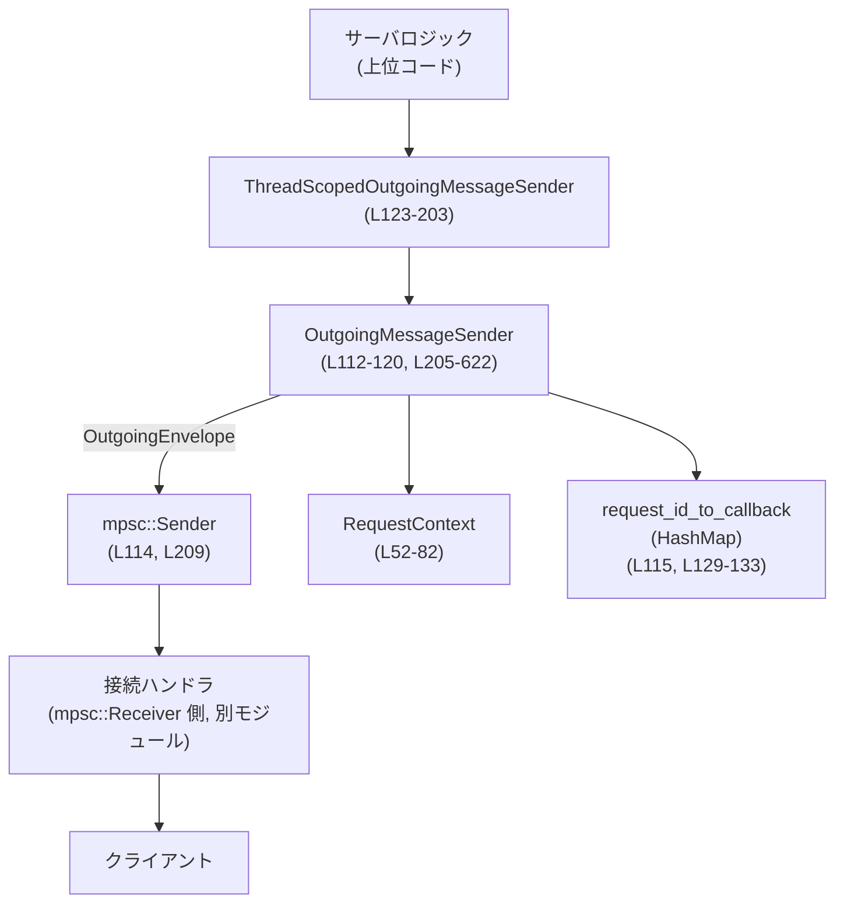
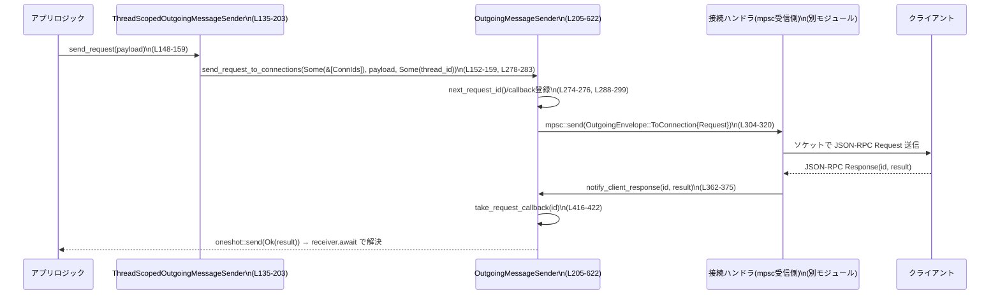

# app-server\src\outgoing_message.rs コード解説

## 0. ざっくり一言

このモジュールは、アプリケーションサーバからクライアントへの **JSON-RPC メッセージ送信と、それに対応するコールバック管理・トレース管理** を行うためのユーティリティ群です（リクエスト/レスポンス/エラー/通知の送信と、レスポンス待ちの管理を担当します）。  
（app-server\src\outgoing_message.rs:L30-L645）

---

## 1. このモジュールの役割

### 1.1 概要

- **解決する問題**  
  - 複数接続（ConnectionId）に対して JSON-RPC リクエスト・通知を送り、クライアントからのレスポンスを待つ必要がある。  
  - 各リクエストに対応したコールバック（oneshot チャンネル）やトレース情報（tracing::Span / W3cTraceContext）を安全に紐づけて管理する必要がある。
- **提供する機能**
  - サーバ側からクライアントへのリクエスト送信と、そのレスポンス/エラーを async で待ち受ける仕組み（`OutgoingMessageSender` / `ThreadScopedOutgoingMessageSender`）。  
  - 接続単位・スレッド単位のリクエストキャンセル／再送。  
  - JSON-RPC レスポンス/エラー/通知のシリアライズと送信。  
  - リクエストごとの tracing span を使ったトレースコンテキストの維持と付与。

### 1.2 アーキテクチャ内での位置づけ

このモジュールは、おおまかに以下のコンポーネント間の橋渡しをします:

- 「サーバアプリケーションロジック」  
- 「OutgoingMessageSender / ThreadScopedOutgoingMessageSender」  
- 「トランスポート層（mpsc チャネル経由で実装される接続ハンドラ）」  
- 「クライアント」  



（行番号は app-server\src\outgoing_message.rs）

- 上位コードは `ThreadScopedOutgoingMessageSender` または `OutgoingMessageSender` を通じて送信 API を利用します（L135-L203, L205-L622）。  
- `OutgoingMessageSender` は `mpsc::Sender<OutgoingEnvelope>` を介して、実際にソケットへ書き込む接続ハンドラへメッセージを渡します（L112-L115, L304-L308, L523-L528 など）。  
- `RequestContext` / `request_contexts` マップ（L52-L56, L116-L119, L215-L223）でトレース情報を、`request_id_to_callback` マップ（L115, L129-L133, L290-L299）でレスポンス待ちのコールバックを管理します。

### 1.3 設計上のポイント

- **責務の分割**
  - `OutgoingMessageSender` は **送信ロジックと状態管理（コールバック・トレース）** を担当します（L112-L120, L205-L622）。  
  - `ThreadScopedOutgoingMessageSender` は特定の `ThreadId` と複数の `ConnectionId` にスコープされた **薄いファサード** です（L123-L127, L135-L203）。  
  - 実際のソケット送信は別モジュール（mpsc 受信側）が担当し、このファイルには現れません。

- **状態管理と並行性**
  - リクエスト ID は `AtomicI64` で生成（`next_server_request_id`、L113, L274-L276）。  
  - コールバックやリクエストコンテキストの管理は `tokio::sync::Mutex<HashMap<...>>` で保護され、複数タスクからの同時アクセスに対して安全です（L115, L119, L215-L223, L290-L299 など）。
  - `Arc<OutgoingMessageSender>` によって複数タスクから共有されます（L3, L123-L127, L1053-L1059 など）。

- **エラーハンドリング方針**
  - クライアントへの送信に失敗した場合は `tracing::warn!` でログし、コールバックを削除するなどのクリーンアップを行います（例: L333-L337, L530-L531, L566-L567, L618-L620）。
  - レスポンスのシリアライズに失敗した場合は、元のレスポンスの代わりに JSON-RPC エラー（`INTERNAL_ERROR_CODE`）をクライアントに送ります（L472-L505）。
  - リクエストキャンセル時、エラーオブジェクトを持っている場合は受信側に `Err(JSONRPCErrorError)` として通知し、持っていない場合は oneshot 送信側を破棄することで受信側に「キャンセル」として伝わります（L397-L414, L439-L470）。

- **トレースと観測性**
  - 各リクエストに紐づく `Span` と W3C Trace Context を保持し、レスポンス/エラー送信時の mpsc 送信処理に `Instrument` で紐付けています（L49-L55, L71-L77, L600-L621）。
  - `RequestContext::record_turn_id` により、`turn.id` 属性を span に記録します（L79-L81）。

---

## 2. 主要な機能一覧

- 接続ごとのリクエスト ID / コネクション ID の管理（`ConnectionId`, `ConnectionRequestId`）。  
- リクエストごとのトレースコンテキスト管理（`RequestContext` と `request_contexts` マップ）。  
- サーバからクライアントへの JSON-RPC リクエストの送信とレスポンス待ち（`OutgoingMessageSender::send_request` 系）。  
- スレッドスコープ（ThreadId）に紐づくリクエスト送信・キャンセル・再送（`ThreadScopedOutgoingMessageSender` と `pending_requests_for_thread` / `cancel_requests_for_thread` / `replay_requests_to_connection_for_thread`）。  
- JSON-RPC レスポンス/エラー/通知のシリアライズと送信（`send_response`, `send_error`, `send_server_notification*`）。  
- 接続クローズ時のトレースコンテキストクリーンアップ（`connection_closed`）。

### 2.1 コンポーネントインベントリー（型・列挙体など）

| 名前 | 種別 | 役割 / 用途 | 定義位置 |
|------|------|------------|---------|
| `ClientRequestResult` | 型エイリアス | クライアントリクエストの結果を表す `Result`/`JSONRPCErrorError` の組み合わせ | app-server\src\outgoing_message.rs:L30-L30 |
| `ConnectionId` | 構造体(タプル) | トランスポート接続を一意に識別する ID。`Display` 実装あり | L34-L40 |
| `ConnectionRequestId` | 構造体 | 接続と JSON-RPC `RequestId` の組み合わせで、接続内でのリクエストを一意に識別 | L44-L47 |
| `RequestContext` | 構造体 | 各リクエストに紐づく `Span` と W3C Trace Context を保持し、最終レスポンス/エラー送信まで維持 | L52-L56, L58-L82 |
| `OutgoingEnvelope` | enum | 上位層→接続ハンドラの mpsc チャネル上のメッセージ。対象接続つき (`ToConnection`) またはブロードキャスト (`Broadcast`) | L84-L94 |
| `QueuedOutgoingMessage` | 構造体 | `OutgoingMessage` と任意の書き込み完了通知 oneshot をまとめたキュー用構造体 | L97-L109 |
| `OutgoingMessageSender` | 構造体 | リクエスト ID 採番、mpsc 送信、コールバック/トレースコンテキスト管理など、送信ロジックの中心 | L112-L120, L205-L622 |
| `ThreadScopedOutgoingMessageSender` | 構造体 | 特定の `ThreadId` と複数の `ConnectionId` にスコープされた `OutgoingMessageSender` のラッパー | L123-L127, L135-L203 |
| `PendingCallbackEntry` | 構造体 (非公開) | レスポンス待ちエントリ：oneshot 送信側、関連スレッド ID、`ServerRequest` を保持 | L129-L133 |
| `OutgoingMessage` | enum | クライアントへの送信メッセージ：`Request` / `AppServerNotification` / `Response` / `Error`。`serde(untagged)` でシリアライズ | L624-L634 |
| `OutgoingResponse` | 構造体 | JSON-RPC レスポンス形式 (`id`, `result`) | L637-L640 |
| `OutgoingError` | 構造体 | JSON-RPC エラー形式 (`id`, `error`) | L642-L645 |
| `tests` モジュール | モジュール | シリアライズ/ルーティング/キャンセルなどの挙動を検証するユニットテスト | L648-L1166 |

※ 他の型（`ServerRequestPayload`, `ServerNotification`, `Result`, `JSONRPCErrorError`, `ThreadId` など）は外部クレート由来で、このチャンクには定義がありません。

### 2.2 コンポーネントインベントリー（主な関数・メソッド）

代表的な API / コアロジックのみ列挙します。

| 関数名 | 役割（1 行） | 定義位置 |
|--------|--------------|---------|
| `RequestContext::new` | リクエスト ID・span・親トレースから `RequestContext` を構築 | L59-L69 |
| `RequestContext::request_trace` | span から W3C トレースを取得し、なければ親トレースを返す | L71-L73 |
| `RequestContext::span` | 保持している span をクローンして返す | L75-L77 |
| `RequestContext::record_turn_id` | span に `turn.id` 属性を記録 | L79-L81 |
| `QueuedOutgoingMessage::new` | `write_complete_tx` なしの `QueuedOutgoingMessage` を生成 | L102-L108 |
| `ThreadScopedOutgoingMessageSender::new` | スレッドスコープ送信者を初期化 | L136-L146 |
| `ThreadScopedOutgoingMessageSender::send_request` | 特定接続群/スレッド ID に紐づくリクエスト送信 | L148-L159 |
| `ThreadScopedOutgoingMessageSender::send_server_notification` | スレッドスコープの接続群へ通知を送信 | L161-L168 |
| `ThreadScopedOutgoingMessageSender::send_global_server_notification` | 全接続向けのサーバ通知を送信 | L170-L172 |
| `ThreadScopedOutgoingMessageSender::abort_pending_server_requests` | スレッドに紐づく全ペンディングリクエストを内部エラーでキャンセル | L174-L186 |
| `ThreadScopedOutgoingMessageSender::send_response` | 接続付きリクエスト ID へレスポンスを送信 | L188-L193 |
| `ThreadScopedOutgoingMessageSender::send_error` | 接続付きリクエスト ID へ JSON-RPC エラーを送信 | L196-L202 |
| `OutgoingMessageSender::new` | mpsc 送信者を受け取って初期化 | L206-L213 |
| `register_request_context` | リクエストコンテキストを登録し、同一キーがあれば警告 | L215-L223 |
| `connection_closed` | 指定接続に紐づくリクエストコンテキストを削除 | L225-L228 |
| `request_trace_context` | リクエスト ID から W3C トレースコンテキストを取得 | L230-L238 |
| `record_request_turn_id` | リクエストコンテキストに `turn_id` を記録 | L240-L248 |
| `send_request` | ブロードキャスト（全接続）向けリクエスト送信のエントリポイント | L264-L272 |
| `send_request_to_connections` | リクエスト ID 採番・コールバック登録・指定接続群への送信を行うコアロジック | L278-L339 |
| `replay_requests_to_connection_for_thread` | 指定スレッドのペンディングリクエストを一つの接続に再送 | L341-L359 |
| `notify_client_response` | クライアントからの正常レスポンスをコールバックへ転送 | L362-L375 |
| `notify_client_error` | クライアントからのエラー応答をコールバックへ転送 | L377-L390 |
| `cancel_request` | 指定リクエスト ID のコールバックをキャンセル（マップから削除） | L393-L395 |
| `cancel_all_requests` | 全コールバックを削除し、任意でエラーを通知 | L397-L414 |
| `pending_requests_for_thread` | スレッド ID に紐づくペンディングリクエストを ID 順に取得 | L424-L437 |
| `cancel_requests_for_thread` | 指定スレッド ID に紐づくコールバックを削除し、任意でエラーを通知 | L439-L470 |
| `send_response` (OMS) | レスポンスを JSON にシリアライズし、成功なら Response、失敗なら Error を送信 | L472-L505 |
| `send_server_notification` | 全接続向けサーバ通知のショートカット | L507-L510 |
| `send_server_notification_to_connections` | 指定接続または全接続へ通知を送信 | L512-L547 |
| `send_server_notification_to_connection_and_wait` | 指定接続へ通知を送り、書き込み完了 oneshot を待つ | L549-L569 |
| `send_error` | 指定リクエストへエラー送信（トレースコンテキストも処理） | L571-L578 |
| `send_outgoing_message_to_connection` | Request/Response/Error を実際の mpsc チャネルへ送信し、必要に応じて span を適用 | L600-L621 |

（`next_request_id`, `take_request_context`, `take_request_callback`, `send_error_inner` 等の内部ヘルパーは省略）

---

## 3. 公開 API と詳細解説

### 3.1 型一覧（構造体・列挙体など）

主に他モジュールから利用される型に絞って整理します。

| 名前 | 種別 | 役割 / 用途 | 関連関数 |
|------|------|-------------|---------|
| `ConnectionId` | 構造体 | 接続の安定 ID。`OutgoingEnvelope::ToConnection` などのルーティングキー | `fmt::Display` (L36-L40) |
| `ConnectionRequestId` | 構造体 | 接続 + JSON-RPC リクエスト ID の組。レスポンスやエラー送信の宛先指定に使用 | `OutgoingMessageSender::send_response` / `send_error` |
| `RequestContext` | 構造体 | リクエスト単位の span/トレース情報を管理 | `new`, `request_trace`, `span`, `record_turn_id` |
| `OutgoingEnvelope` | enum | mpsc チャネル上のメッセージ。ブロードキャストか接続指定。書き込み完了通知用 oneshot をオプションで含む | `send_request_to_connections`, `send_server_notification_to_connections`, `send_outgoing_message_to_connection` |
| `OutgoingMessageSender` | 構造体 | 送信ロジックとコールバック・トレース管理の中心 | 下記の各メソッド |
| `ThreadScopedOutgoingMessageSender` | 構造体 | 特定スレッド/接続群にスコープされた送信 API を提供 | `new`, `send_request`, `abort_pending_server_requests` など |
| `OutgoingMessage` | enum | JSON-RPC メッセージ（リクエスト/レスポンス/エラー/通知）を表現し、シリアライズ可能 | `serde_json::to_value` により JSON へ変換 |
| `OutgoingResponse` | 構造体 | `OutgoingMessage::Response` に格納される JSON-RPC レスポンス | `send_response` |
| `OutgoingError` | 構造体 | `OutgoingMessage::Error` に格納される JSON-RPC エラー | `send_error_inner` |

### 3.2 関数詳細（重要な 7 件）

#### 1. `ThreadScopedOutgoingMessageSender::send_request(&self, payload: ServerRequestPayload) -> (RequestId, oneshot::Receiver<ClientRequestResult>)`

**概要**

- 特定スレッド (`thread_id`) と、指定された接続群 (`connection_ids`) に対するクライアントリクエストを送信し、その結果を待ち受ける oneshot 受信側を返します（L148-L159）。

**引数**

| 引数名 | 型 | 説明 |
|--------|----|------|
| `&self` | `&ThreadScopedOutgoingMessageSender` | スレッドスコープ送信者 |
| `payload` | `ServerRequestPayload` | 送信したいサーバ→クライアントリクエストの内容（ID 未付与のペイロード） |

**戻り値**

- `(RequestId, oneshot::Receiver<ClientRequestResult>)`  
  - `RequestId`: 生成された JSON-RPC リクエスト ID。  
  - `oneshot::Receiver<ClientRequestResult>`: クライアントからのレスポンス/エラーを待ち受ける受信側。  

**内部処理の流れ**

1. `OutgoingMessageSender::send_request_to_connections` を呼び出し、`connection_ids.as_slice()` と `Some(self.thread_id)` を渡します（L152-L157）。  
2. 実際の ID 採番、コールバック登録、mpsc 送信は `send_request_to_connections` が行い、このメソッドはその戻り値をそのまま返します（L152-L159）。

**Examples（使用例）**

```rust
// ThreadId と接続 ID のリストを仮定する                                     // あらかじめ ThreadId と ConnectionId を用意していると仮定
let thread_id = ThreadId::new();                                          // スレッド ID を生成
let connections = vec![ConnectionId(1), ConnectionId(2)];                 // 2 つの接続に送る

// 送信器をセットアップ                                                     // OutgoingMessageSender を Arc で共有
let (tx, _rx) = mpsc::channel::<OutgoingEnvelope>(16);                    // mpsc チャネルを作成
let sender = Arc::new(OutgoingMessageSender::new(tx));                    // OutgoingMessageSender を構築
let thread_sender = ThreadScopedOutgoingMessageSender::new(               // スレッドスコープ送信者を生成
    sender.clone(),
    connections,
    thread_id,
);

// リクエストペイロードを作る                                               // 何らかの ServerRequestPayload を作成
let payload = ServerRequestPayload::ApplyPatchApproval( /* ... */ );      // 実際のパラメータは省略

// リクエストを送信し、レスポンスを待つ                                     // send_request で ID と受信側を取得
let (request_id, receiver) = thread_sender.send_request(payload).await;   // 非同期に送信

// 別タスクでクライアントからのレスポンスを待機                            // receiver.await でレスポンスまたはエラーを取得
tokio::spawn(async move {
    match receiver.await {
        Ok(Ok(result)) => { /* 成功レスポンス */ }                        // クライアント側 Result に相当するレスポンス
        Ok(Err(jsonrpc_err)) => { /* クライアントエラー */ }             // JSON-RPC エラー
        Err(_recv_err) => { /* キャンセル/送信側破棄 */ }                 // キャンセルされた場合など
    }
});
```

**Errors / Panics**

- この関数自体は `Result` を返さず、panic も行いません。  
- mpsc 送信に失敗した場合、内部の `send_request_to_connections` で `request_id_to_callback` からエントリが削除され、`receiver.await` は `Err(RecvError)` になります（L333-L337）。  

**Edge cases（エッジケース）**

- `connection_ids` が空の場合は、`ThreadScopedOutgoingMessageSender::send_request` を呼ぶ前に `ThreadScopedOutgoingMessageSender` の生成時に空ベクタを渡していることになるため、`send_request_to_connections` は `Some(&[])` として動作し、ループを回りますが実際には送信されません（L310-L329）。その後、エラーは発生しないため、呼び出し側は `receiver.await` がいつまでも返らない可能性があります。  
- 同じ `RequestId` が既に `request_id_to_callback` に存在するケースは `send_request_to_connections` の設計上発生しない想定です（ID は AtomicI64 で単調増加、L274-L276）。

**使用上の注意点**

- `receiver.await` は **必ず何らかの形で待機するかドロップ** する必要があります。ドロップすると送信側はエラーになるだけですが、待機しないと結果が無視されます。  
- 高頻度で呼び出す場合、`request_id_to_callback` マップのサイズに注意が必要です。レスポンスが来ない（あるいはキャンセルされない）リクエストが溜まるとメモリが増加します。

---

#### 2. `OutgoingMessageSender::send_request(&self, request: ServerRequestPayload) -> (RequestId, oneshot::Receiver<ClientRequestResult>)`

**概要**

- 全接続（ブロードキャスト）向けにクライアントリクエストを送り、レスポンス/エラー待ちの oneshot 受信側を返します（L264-L272）。

**引数**

| 引数名 | 型 | 説明 |
|--------|----|------|
| `&self` | `&OutgoingMessageSender` | 送信ロジック本体 |
| `request` | `ServerRequestPayload` | 送信するリクエストペイロード |

**戻り値**

- `ThreadScopedOutgoingMessageSender::send_request` と同様です。

**内部処理の流れ**

1. `send_request_to_connections(None, request, None)` を呼び出します（L268-L269）。  
2. `connection_ids = None` により、`OutgoingEnvelope::Broadcast` で送信されます（L302-L309）。  
3. それ以外の処理（ID 採番、コールバック登録）は `send_request_to_connections` と共通です（L278-L339）。

**Examples（使用例）**

```rust
let (tx, _rx) = mpsc::channel::<OutgoingEnvelope>(16);                 // mpsc チャネル
let sender = OutgoingMessageSender::new(tx);                           // 送信者を構築

let payload = ServerRequestPayload::DynamicToolCall(/* ... */);       // 何かのペイロード

// 全接続へブロードキャストリクエストを送信                             
let (request_id, receiver) = sender.send_request(payload).await;       // RequestId と Receiver を取得

// レスポンス待ち
let result = receiver.await;                                           // Ok(Ok(_)) / Ok(Err(_)) / Err(_)
```

**Errors / Panics**

- `send_request_to_connections` と同じです。送信エラー時はログを出し、マップからコールバックを削除します（L333-L337）。

**Edge cases**

- 接続が 0 件の場合、送信は `OutgoingEnvelope::Broadcast` で mpsc に投げられますが、実際には誰も受信しない構成であれば `receiver.await` はクライアントからの応答が来ないため永遠に待つ可能性があります。  

**使用上の注意点**

- ブロードキャスト用途であり、**レスポンスが必ず返る保証がない場合** に使うと待ち続けることになります。通知用途には `send_server_notification*` 系を使うほうが明確です。

---

#### 3. `OutgoingMessageSender::send_request_to_connections(&self, connection_ids: Option<&[ConnectionId]>, request: ServerRequestPayload, thread_id: Option<ThreadId>) -> (RequestId, oneshot::Receiver<ClientRequestResult>)`

**概要**

- リクエスト ID 採番、コールバック登録、指定された接続群またはブロードキャストへの送信までを一括で行う **コアロジック** です（L278-L339）。  
- スレッド ID を付与しておくことで、後からスレッド単位でキャンセル/再送することができます（L293-L296, L424-L437, L439-L470）。

**引数**

| 引数名 | 型 | 説明 |
|--------|----|------|
| `connection_ids` | `Option<&[ConnectionId]>` | `None` ならブロードキャスト、`Some(&[...])` なら指定接続群へ送信 |
| `request` | `ServerRequestPayload` | JSON-RPC リクエストペイロード |
| `thread_id` | `Option<ThreadId>` | このリクエストが属するスレッド ID。スレッドに紐づかない場合は `None` |

**戻り値**

- `(RequestId, oneshot::Receiver<ClientRequestResult>)`（前述と同じ）。

**内部処理の流れ**

1. **ID 採番**: `next_request_id` で `RequestId::Integer` を生成（L284-L286, L274-L276）。  
2. `request.request_with_id(outgoing_message_id.clone())` により、ID 付き `ServerRequest` を生成（L286）。  
3. oneshot チャンネルを作成し、`request_id_to_callback` マップに `PendingCallbackEntry` として登録（L288-L299）。  
4. `OutgoingMessage::Request(request)` を作り、`connection_ids` に応じて:
   - `None` の場合: `OutgoingEnvelope::Broadcast { message }` として mpsc 送信（L302-L309）。  
   - `Some(ids)` の場合: 各 `connection_id` について `OutgoingEnvelope::ToConnection` を送信（L310-L320）。一つでも失敗したらループを抜け、エラーを返す（L311-L324）。  
5. 送信に失敗した場合 (`send_result` が `Err`): 警告ログを出し、`request_id_to_callback` から当該エントリを削除（L333-L337）。  
6. 最終的に `(outgoing_message_id, rx_approve)` を返す（L338-L339）。

**Examples（使用例）**

通常は直接呼び出さず、`send_request` や `ThreadScopedOutgoingMessageSender::send_request` を経由して利用されます。

**Errors / Panics**

- mpsc 送信失敗時に `warn!` ログを出し、コールバックを解除しますが、panic はしません。  
- 送信失敗後に返される `oneshot::Receiver` は、送信側が削除されたため `Err(RecvError)` で完了します。

**Edge cases**

- `connection_ids = Some(&[])` の場合、ループ自体は回るものの送信は行われず、`send_error` も発生しないため `send_result = Ok(())` となります（L310-L329）。この場合もコールバックは登録されたままなので、レスポンスが来ない限り待ち続けます。  
- 複数接続に対し途中で一つの送信に失敗した場合、それ以前に送られた接続分は mpsc に乗っていますが、コールバックが削除されるため、クライアントからのレスポンスが届いてもそれに対応するコールバックは存在しません（L311-L337）。これは「全接続送信が成功しなかった場合は、リクエスト全体を失敗扱いにする」という設計と解釈できます。

**使用上の注意点**

- `connection_ids` を複数指定する設計は、「同一リクエストを複数接続に送る」特殊ケースです。レスポンスの扱い（どの接続からのレスポンスを採用するか）はこのモジュール外のポリシーに依存します。  
- ID 採番は `Ordering::Relaxed` の `AtomicI64` に依存しています（L274-L276）。マルチスレッド環境でも一意性は保証されますが、オーバーフロー対策はありません（極端な長時間稼働で理論上発生し得ます）。

---

#### 4. `OutgoingMessageSender::notify_client_response(&self, id: RequestId, result: Result)`

**概要**

- クライアントから受信した正常レスポンスを、対応するコールバック（oneshot 送信側）へ伝達します（L362-L375）。

**引数**

| 引数名 | 型 | 説明 |
|--------|----|------|
| `id` | `RequestId` | クライアントが返してきた JSON-RPC リクエスト ID |
| `result` | `Result` | プロトコル定義上の成功結果（`serde_json::Value` など） |

**戻り値**

- なし（`()`）。

**内部処理の流れ**

1. `take_request_callback(&id)` で `request_id_to_callback` から該当エントリを取り出します（L362-L363, L416-L422）。  
2. エントリが存在する場合:
   - `entry.callback.send(Ok(result))` を呼び出し、待機中のタスクに成功結果を渡します（L367-L369）。  
   - もし受信側が既にドロップされていれば `Err` となるため、その際は警告ログを出します。  
3. エントリが見つからなければ、警告ログ (`"could not find callback for {id:?}"`) を出します（L371-L373）。

**Examples（使用例）**

通常は **接続ハンドラ側（mpsc 受信側）** から呼び出される想定です。サーバロジックから直接使うことはあまりありません。

```rust
// mpsc 受信側の疑似コード                                               // 接続ハンドラがクライアントから JSON-RPC レスポンスを受信したとする
let (request_id, result) = decode_response_from_client(/* ... */);     // 受信データをパースして ID と result を得る

outgoing_message_sender                                            // OutgoingMessageSender のインスタンス
    .notify_client_response(request_id, result)                    // 対応するコールバックへ結果を通知
    .await;
```

**Errors / Panics**

- `callback.send` が失敗した場合（受信側ドロップ）は `warn!` ログのみで、panic はしません（L367-L369）。  
- コールバックが見つからない場合もログのみです（L371-L373）。

**Edge cases**

- クライアントが、サーバ側がもう忘れている `RequestId` でレスポンスを返した場合（例: タイムアウト後など）、ログだけ出力され、レスポンスは無視されます（L371-L373）。  
- 複数回同じ ID で `notify_client_response` が呼ばれた場合、最初の呼び出しでエントリは削除されるため 2 回目以降は「見つからない」というログが出ます。

**使用上の注意点**

- この関数は **外部から直接叩くのではなく、プロトコル受信側の「レスポンスディスパッチャ」からのみ振る** のが自然です。  
- サーバロジック側でこの関数を誤用すると、コールバック管理の整合性が崩れる可能性があります。

---

#### 5. `OutgoingMessageSender::cancel_requests_for_thread(&self, thread_id: ThreadId, error: Option<JSONRPCErrorError>)`

**概要**

- 指定したスレッド ID に紐づくすべてのペンディングリクエストをキャンセルし、必要に応じてエラーをクライアントレスポンスとして通知します（L439-L470）。  
- `ThreadScopedOutgoingMessageSender::abort_pending_server_requests` から利用されます（L174-L186）。

**引数**

| 引数名 | 型 | 説明 |
|--------|----|------|
| `thread_id` | `ThreadId` | キャンセル対象となるスレッド ID |
| `error` | `Option<JSONRPCErrorError>` | クライアントに渡すエラー内容。`Some` ならエラーを通知し、`None` なら通知せずコールバックを単にドロップ |

**戻り値**

- なし。

**内部処理の流れ**

1. `request_id_to_callback` をロックし、指定 `thread_id` に対応するリクエスト ID を収集（L445-L451）。  
2. その ID 群に対して `remove` を行い、対応する `PendingCallbackEntry` を `entries` ベクタに集める（L453-L459）。  
3. ロックを開放した後、`error` が `Some(err)` であれば各エントリに対し `callback.send(Err(err.clone()))` を実行し、失敗時は警告ログ（L462-L468）。

**Examples（使用例）**

```rust
// ThreadScopedOutgoingMessageSender 経由でのキャンセル                     // スレッドスコープ送信者からキャンセル
thread_scoped_outgoing.abort_pending_server_requests().await;          // L174-L186 で内部的に cancel_requests_for_thread を呼ぶ

// 直接呼ぶ場合（簡略化例）                                                 // ThreadId を直接指定しても良い
outgoing_message_sender
    .cancel_requests_for_thread(thread_id, Some(JSONRPCErrorError {
        code: INTERNAL_ERROR_CODE,
        message: "tracked request cancelled".to_string(),
        data: None,
    }))
    .await;
```

**Errors / Panics**

- `callback.send` 失敗時は `warn!` ログのみです（L462-L467）。  
- panic はありません。

**Edge cases**

- `error = None` の場合、コールバックは削除されますが、受信側には明示的なエラーは飛ばず、oneshot の送信側がドロップされたことによる `RecvError` でキャンセルとして伝達されます。  
- 指定スレッドにペンディングリクエストがない場合は何も行われません。

**使用上の注意点**

- 「ターン（thread/turn 状態）の遷移により、これ以上そのスレッドのクライアント応答を待つ意味がない」という状況で使用される想定です（L174-L186）。  
- エラーの内容はクライアントに返るため、外部に露出してよい情報に制限する必要があります（例: 内部実装詳細を含めない）。

---

#### 6. `OutgoingMessageSender::send_response<T: Serialize>(&self, request_id: ConnectionRequestId, response: T)`

**概要**

- サーバロジックからクライアントへの JSON-RPC レスポンス送信を行います（L472-L505）。  
- レスポンスのシリアライズに失敗した場合は、代わりに JSON-RPC エラーを送信します。

**引数**

| 引数名 | 型 | 説明 |
|--------|----|------|
| `request_id` | `ConnectionRequestId` | 接続 + リクエスト ID（レスポンスの宛先） |
| `response` | `T: Serialize` | JSON にシリアライズ可能なレスポンスボディ |

**戻り値**

- なし。

**内部処理の流れ**

1. `take_request_context(&request_id)` で `RequestContext` を取り出し、以降の送信で span に紐づけるために使用（L477-L477, L251-L257）。  
2. `serde_json::to_value(response)` を実行:
   - 成功 (`Ok(result)`) の場合:
     1. `OutgoingMessage::Response(OutgoingResponse { id, result })` を構築（L480-L483）。  
     2. `send_outgoing_message_to_connection` に渡して実送信（L484-L490）。  
   - 失敗 (`Err(err)`) の場合:
     1. `INTERNAL_ERROR_CODE` を用いた `JSONRPCErrorError` を作成し（L493-L500）、  
     2. `send_error_inner` を使ってエラー送信（L493-L502）。

**Examples（使用例）**

```rust
// 既に ConnectionRequestId が分かっていると仮定                         // 例えばハンドラ内で受け取った request_id を持っている
let request_id = ConnectionRequestId {
    connection_id: ConnectionId(42),
    request_id: RequestId::Integer(7),
};

// レスポンスボディを JSON 化可能な型で用意                               // ここでは serde_json::Value をそのまま使う
let body = serde_json::json!({ "ok": true });

// レスポンス送信                                                           // レスポンスを送信
outgoing_message_sender.send_response(request_id, body).await;
```

**Errors / Panics**

- シリアライズ失敗時は自動的に JSON-RPC エラーに変換されてクライアントに送信されるため、呼び出し元にはエラーは返りません（L492-L503）。  
- mpsc 送信失敗時は内部で `warn!` ログを出すのみです（`send_outgoing_message_to_connection`, L618-L620）。

**Edge cases**

- `RequestContext` が存在しない（すでに削除済み、または登録されていない）場合でも、そのまま送信されます。この場合は span を伴わない送信になります（L600-L616）。  
- 非シリアライズ可能な型（`T` が Serialize を実装していても、途中でエラーが出るケース）では、指定したレスポンスではなくエラーを返すことになります。

**使用上の注意点**

- レスポンス型 `T` は必ず `Serialize` を実装している必要があります。`serde_json::Value` やプロトコル定義のレスポンス型であれば問題ありません。  
- ビジネスロジック側で「レスポンスを返すつもりがない」場合は、この関数ではなく `send_error` を使うほうが意図が明確です。

---

#### 7. `OutgoingMessageSender::send_server_notification_to_connections(&self, connection_ids: &[ConnectionId], notification: ServerNotification)`

**概要**

- サーバからクライアントへの通知（JSON-RPC notification）を、特定の接続群または全接続へ送信します（L512-L547）。  
- 通知はレスポンスを期待しないメッセージです。

**引数**

| 引数名 | 型 | 説明 |
|--------|----|------|
| `connection_ids` | `&[ConnectionId]` | 対象接続群。空スライスなら全接続向けブロードキャストとして扱われる |
| `notification` | `ServerNotification` | 送信するサーバ通知 |

**戻り値**

- なし。

**内部処理の流れ**

1. `tracing::trace!` で対象接続数と通知内容をログ（L517-L520）。  
2. `OutgoingMessage::AppServerNotification(notification)` を構築（L521-L521）。  
3. `connection_ids.is_empty()` の場合:
   - `OutgoingEnvelope::Broadcast` で mpsc 送信（L523-L528）。  
4. そうでない場合:
   - 各 `connection_id` ごとに `OutgoingEnvelope::ToConnection` として mpsc 送信（L534-L542）。  
5. いずれのケースでも送信失敗時は `warn!` ログのみ（L529-L531, L543-L545）。

**Examples（使用例）**

```rust
// 全接続に対して ConfigWarning 通知を送る例                              // ConfigWarningNotification を全接続へ通知
let warning = ServerNotification::ConfigWarning(ConfigWarningNotification {
    summary: "Config error: using defaults".to_string(),
    details: Some("error loading config: bad config".to_string()),
    path: None,
    range: None,
});

outgoing_message_sender
    .send_server_notification_to_connections(&[], warning)              // 空スライスでブロードキャスト
    .await;
```

**Errors / Panics**

- mpsc 送信失敗時はログのみで、panic や戻り値でのエラー伝播はありません（L523-L531, L534-L545）。

**Edge cases**

- `connection_ids` に無効な接続 ID が含まれていても、このモジュール側では検知できません。実際にソケット側で送信失敗した場合に、別の層で扱われる想定です（このチャンクには現れません）。  
- 空スライスを渡すと「全接続向け」という意味になるため、誤って空を渡すと、意図せず全クライアントが対象になる可能性があります（L522-L523）。

**使用上の注意点**

- ブロードキャストと特定接続向けの両方を同じ API で扱うため、`connection_ids` が空かどうかで挙動が変わる点に注意が必要です。  
- 通知はレスポンスが期待されないため、レスポンス待ちのロジックと混同しないようにする必要があります。

---

### 3.3 その他の関数（概要）

| 関数名 | 役割（1 行） | 定義位置 |
|--------|--------------|---------|
| `OutgoingMessageSender::register_request_context` | リクエストごとの `RequestContext` を登録し、既に存在していれば警告 | L215-L223 |
| `OutgoingMessageSender::connection_closed` | 指定接続に紐づく `RequestContext` をすべて削除 | L225-L228 |
| `OutgoingMessageSender::request_trace_context` | `RequestContext` から W3C トレースコンテキストを取得 | L230-L238 |
| `OutgoingMessageSender::record_request_turn_id` | `RequestContext` の span にターン ID を記録 | L240-L248 |
| `OutgoingMessageSender::replay_requests_to_connection_for_thread` | スレッドに紐づくペンディングリクエストを特定接続に再送 | L341-L359 |
| `OutgoingMessageSender::notify_client_error` | クライアントエラーをコールバック側へ伝達 | L377-L390 |
| `OutgoingMessageSender::cancel_request` | 単一リクエストのコールバックを削除 | L393-L395 |
| `OutgoingMessageSender::cancel_all_requests` | 全コールバックを削除し、任意で共通エラーを通知 | L397-L414 |
| `OutgoingMessageSender::pending_requests_for_thread` | スレッドに紐づくペンディングリクエスト一覧を取得 | L424-L437 |
| `OutgoingMessageSender::send_server_notification` | 全接続向け通知のショートカット | L507-L510 |
| `OutgoingMessageSender::send_server_notification_to_connection_and_wait` | 接続向け通知を送信し、書き込み完了の oneshot を待つ | L549-L569 |
| `OutgoingMessageSender::send_error` | リクエストコンテキストを処理しつつ JSON-RPC エラーを送信 | L571-L578 |

---

## 4. データフロー

### 4.1 代表的シナリオ：スレッドスコープからリクエストを送り、クライアントレスポンスを受け取る

このシナリオでは、以下の流れでデータが流れます。

1. 上位ロジックが `ThreadScopedOutgoingMessageSender::send_request` を呼ぶ（L148-L159）。  
2. 内部で `OutgoingMessageSender::send_request_to_connections` が呼ばれ、リクエスト ID が採番され、コールバックが登録され、`OutgoingEnvelope` が mpsc に送信される（L278-L339）。  
3. 接続ハンドラ（別モジュール）が mpsc から `OutgoingEnvelope` を受信し、ソケット経由でクライアントへ送信する。  
4. クライアントが JSON-RPC レスポンスを返す。  
5. 接続ハンドラがレスポンスをパースし、`OutgoingMessageSender::notify_client_response` を呼ぶ（L362-L375）。  
6. `notify_client_response` が対応するコールバックへ `Ok(result)` を送信し、元の `send_request` 呼び出し側が `receiver.await` で結果を受け取る。



- トレースコンテキストを伴うレスポンス/エラー送信の場合、`send_outgoing_message_to_connection` 内で span が `Instrument` を通じて適用されます（L600-L616）。

---

## 5. 使い方（How to Use）

### 5.1 基本的な使用方法

1. 上位コードで `mpsc::channel<OutgoingEnvelope>` を作成し、送信側を `OutgoingMessageSender::new` に渡す。  
2. 各スレッド（または会話）ごとに `ThreadScopedOutgoingMessageSender` を作成。  
3. `send_request` / `send_server_notification*` でメッセージを送信し、必要に応じて oneshot 受信側でクライアントのレスポンスを待つ。  
4. 接続ハンドラ側では mpsc 受信側を監視し、`OutgoingEnvelope` をソケットに書き出す。  
5. クライアントからのレスポンスをパースしたら `notify_client_response` / `notify_client_error` を呼ぶ。

```rust
use std::sync::Arc;                                                        // Arc で共有
use tokio::sync::mpsc;
use codex_app_server_protocol::ServerRequestPayload;

async fn example_usage() {
    // 1. mpsc チャネルを作成する                                           
    let (tx, mut rx) = mpsc::channel::<OutgoingEnvelope>(16);              // OutgoingEnvelope 用のチャネル

    // 2. OutgoingMessageSender を作成する                                   
    let outgoing = Arc::new(OutgoingMessageSender::new(tx));               // Arc でラップして共有

    // 3. スレッドスコープ送信者を作成する                                  
    let thread_id = ThreadId::new();                                       // スレッド ID を生成
    let thread_sender = ThreadScopedOutgoingMessageSender::new(            // スレッドスコープ送信者
        outgoing.clone(),
        vec![ConnectionId(1)],                                             // 単一接続を対象
        thread_id,
    );

    // 4. リクエストを送信する                                               
    let payload = ServerRequestPayload::DynamicToolCall(/* ... */);        // 何らかのペイロード
    let (request_id, receiver) = thread_sender.send_request(payload).await;// リクエスト送信 + レシーバ取得

    // 5. 別タスクでクライアントレスポンスを待つ                             
    tokio::spawn(async move {
        match receiver.await {                                             // クライアント応答を待つ
            Ok(Ok(result)) => println!("ok: {result:?}"),                  // 成功
            Ok(Err(err)) => eprintln!("client error: {err:?}"),            // クライアント側エラー
            Err(_) => eprintln!("request was cancelled"),                  // キャンセル
        }
    });

    // 6. 簡易的な接続ハンドラ（mpsc 受信側）の例                             
    tokio::spawn(async move {
        while let Some(envelope) = rx.recv().await {                       // OutgoingEnvelope を受信
            match envelope {
                OutgoingEnvelope::ToConnection { connection_id, message, .. } => {
                    // connection_id ごとのソケットに message を送る処理を書く // 実際の送信処理は別モジュール
                    println!("send to {connection_id}: {message:?}");
                }
                OutgoingEnvelope::Broadcast { message } => {
                    // 全接続へ broadcast                                     // ブロードキャスト処理
                    println!("broadcast: {message:?}");
                }
            }
        }
    });
}
```

### 5.2 よくある使用パターン

- **スレッド終了時にペンディングリクエストをキャンセルする**  
  - `ThreadScopedOutgoingMessageSender::abort_pending_server_requests` を呼ぶと、そのスレッドに紐づくすべてのペンディングリクエストに対して共通の JSON-RPC エラーが返されます（L174-L186, L439-L470）。

- **接続の再接続時にペンディングリクエストを再送する**  
  - 新しい `ConnectionId` が割り当てられたときに `replay_requests_to_connection_for_thread` を呼ぶことで、同一スレッドに紐づくリクエストを再送できます（L341-L359）。

### 5.3 よくある間違い

```rust
// 間違い例: connection_ids が空の ThreadScopedOutgoingMessageSender を使う
let thread_sender = ThreadScopedOutgoingMessageSender::new(
    outgoing.clone(),
    vec![],                      // ← 対象接続が 0 件
    thread_id,
);

let (_id, receiver) = thread_sender.send_request(payload).await;
// どの接続にも送信されず、receiver.await も決して返らない可能性がある

// 正しい例: 少なくとも 1 つの接続を指定する
let thread_sender = ThreadScopedOutgoingMessageSender::new(
    outgoing.clone(),
    vec![ConnectionId(1)],       // 実際に存在する接続 ID
    thread_id,
);
```

```rust
// 間違い例: notify_client_response をアプリロジックから直接呼ぶ
// これにより、本来のクライアントレスポンスと矛盾する状態になりうる
outgoing_message_sender
    .notify_client_response(request_id, json!({"ok": true}))
    .await;

// 正しい例: notify_client_response は接続ハンドラからのみ呼び出し、
// アプリロジックは send_request の Receiver を通じて結果を受け取る
```

### 5.4 使用上の注意点（まとめ）

- **スレッド安全性**  
  - 内部状態（HashMap）は `tokio::Mutex` で保護されているため、`Arc<OutgoingMessageSender>` を複数タスクから共有しても安全です（L115, L119, L215-L223 など）。  
- **キャンセルの意味**  
  - `cancel_request` / `cancel_all_requests` に `error = None` を渡した場合、oneshot 受信側には `RecvError` として伝わります。アプリ側でこれを「キャンセル」として扱う必要があります。  
- **パフォーマンス**  
  - 各リクエスト送信・レスポンス処理時に `Mutex<HashMap<...>>` のロック/アンロックが発生します。ペンディングリクエストの数が増えると、`pending_requests_for_thread` や `cancel_requests_for_thread` などの処理は O(N) になります（L424-L437, L445-L459）。  
- **トレース**  
  - `RequestContext` を登録しておくと、レスポンス/エラー送信時に span が自動で適用されるため、分散トレース上でリクエストライフサイクルを追跡しやすくなります（L215-L223, L472-L505, L600-L616）。

---

## 6. 変更の仕方（How to Modify）

### 6.1 新しい機能を追加する場合

例: 新しい種類のサーバ通知を追加する場合。

1. プロトコル定義クレート（`codex_app_server_protocol`）側に新しい `ServerNotification` バリアントとそのペイロード構造体を追加する（このチャンクには定義がありません）。  
2. 既存の `OutgoingMessage::AppServerNotification(ServerNotification)` を流用できるため、このファイルにコード追加は不要です（L627-L633）。  
3. 上位ロジックから `OutgoingMessageSender::send_server_notification` または `ThreadScopedOutgoingMessageSender::send_server_notification` で新通知を送信します（L507-L510, L161-L168）。  
4. 必要であれば、テストモジュールにシリアライズ/ルーティング検証用のテストを追加します（既存テストを参考、L675-L838）。

### 6.2 既存の機能を変更する場合

- **リクエスト ID の生成方法を変えたい場合**
  - `next_request_id`（L274-L276）を修正します。  
  - 変更前提として、`request_id_to_callback` のキー型が `RequestId` であるため、重複しないようにする必要があります（L115, L290-L299）。

- **キャンセルポリシーを変更したい場合**
  - スレッド単位: `cancel_requests_for_thread`（L439-L470）  
  - 全体: `cancel_all_requests`（L397-L414）  
  これらのメソッド内で、`error` の扱いや `callback.send` のタイミングを変更します。  
  - 影響範囲として、`ThreadScopedOutgoingMessageSender::abort_pending_server_requests`（L174-L186）やテスト `cancel_requests_for_thread_cancels_all_thread_requests`（L1108-L1165）を確認する必要があります。

- **トレースの取り扱いを拡張したい場合**
  - `RequestContext`（L52-L56, L58-L82）にフィールドを追加し、`register_request_context` / `take_request_context` の挙動を確認します（L215-L223, L251-L257, L472-L505, L571-L578）。  
  - 既存のテスト `send_response_clears_registered_request_context` や `connection_closed_clears_registered_request_contexts`（L876-L899, L983-L1015）を更新・拡充します。

---

## 7. 関連ファイル

このモジュールが依存する主な外部コンポーネントは次の通りです。

| パス / クレート | 役割 / 関係 |
|----------------|------------|
| `codex_app_server_protocol` | `ServerRequest`, `ServerRequestPayload`, `ServerNotification`, `RequestId`, `Result`, `JSONRPCErrorError` など、JSON-RPC レベルの型定義を提供（L7-L12, L30, L362, L377, L472, L624-L640, L652-L665 など）。 |
| `codex_protocol` | `ThreadId` と W3C トレースコンテキスト（`W3cTraceContext`）の型を提供（L14-L15）。 |
| `codex_otel::span_w3c_trace_context` | `tracing::Span` から W3C トレースコンテキストを抽出するヘルパー関数（L13, L71-L72）。 |
| `crate::error_code` | `INTERNAL_ERROR_CODE` を提供し、内部エラー時の JSON-RPC エラーコードとして使用（L24, L178-L179, L497-L498, L909-L910, L1034-L1035, L1140-L1141）。 |
| `crate::server_request_error` | ターン状態変更によるペンディングリクエストキャンセル理由を JSON に埋め込むための定数 `TURN_TRANSITION_PENDING_REQUEST_ERROR_REASON` を提供（L25, L180-L183）。 |
| 接続ハンドラモジュール（別ファイル） | `mpsc::Receiver<OutgoingEnvelope>` を所有し、実際のソケット I/O を行う。具体的な実装はこのチャンクには現れません。 |

---

## 追加: テスト・安全性・エッジケースのまとめ

### テストの概要

テストモジュール（L648-L1166）は次の観点を検証します。

- 通知のシリアライズがプロトコル仕様どおりであること（L675-L838）。  
- `send_response` / `send_error` が正しい接続・ID へルーティングされること（L841-L937）。  
- `send_server_notification_to_connection_and_wait` が書き込み完了 oneshot を適切に待つこと（L939-L980）。  
- 接続クローズ時に `RequestContext` が適切にクリーンアップされること（L983-L1015）。  
- `notify_client_error` が待機側へエラーを伝えること（L1017-L1049）。  
- `pending_requests_for_thread` / `cancel_requests_for_thread` が期待どおり動作すること（L1051-L1165）。

### 言語固有の安全性 / 並行性

- Rust の所有権/借用により、`Arc<OutgoingMessageSender>` を通じて安全に共有しつつ、内部状態は `Mutex` で排他制御されています。  
- `AtomicI64` による ID 採番はロック不要で高速ですが、整合性のために `Mutex<HashMap<...>>` との組み合わせに注意が払われています（ID は一意であればよいので `Ordering::Relaxed` で十分、L274-L276）。  
- `tokio::sync::oneshot` を用いたキャンセル・エラー伝播により、非同期タスク間で明示的にエラー/キャンセルを表現しています。

### 潜在的なバグ/セキュリティ留意点（コードから読み取れる範囲）

- リクエスト ID のオーバーフロー対策は特に行っていません（`AtomicI64` の wrap-around）。長期稼働システムでは理論上のリスクがありますが、実際には極めて遠い将来の話です。  
- `JSONRPCErrorError` の `message` や `data` はログにも出力されるため（L382-L383など）、クライアントから渡される値をそのまま信頼してログに混在させるとログインジェクション等の懸念があります。ログ出力ポリシーはこのモジュール外での運用に依存します。  
- `cancel_all_requests` で `error = None` を指定すると、待機中のタスクは `RecvError` で失敗します。この振る舞いをアプリケーション側が正しくキャンセルとして扱っていないと、エラー処理漏れになる可能性があります（L397-L414）。

以上が、このファイルの公開 API・コアロジック・並行性・エラーハンドリング・データフローの整理です。
