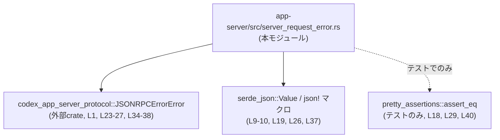
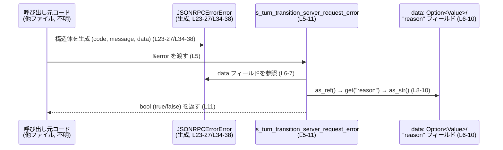

# app-server/src/server_request_error.rs コード解説

---

## 0. ざっくり一言

JSON-RPC エラーオブジェクト（`JSONRPCErrorError`）の `data.reason` が `"turnTransition"` かどうかを判定する、シンプルなユーティリティ関数と、そのための定数・テストを定義するモジュールです（`server_request_error.rs:L1-41`）。

---

## 1. このモジュールの役割

### 1.1 概要

- このモジュールは、JSON-RPC 形式のエラーのうち「ターン（turn）の状態遷移が原因のエラー」を識別するために存在し、  
  `is_turn_transition_server_request_error` 関数で判定ロジックを提供します（`server_request_error.rs:L3-11`）。
- 判定の基準は、エラーの `data` フィールド内 JSON の `"reason"` プロパティが `"turnTransition"` であるかどうかです（`server_request_error.rs:L3, L9-11, L26`）。

### 1.2 アーキテクチャ内での位置づけ

このファイルは、外部プロトコル定義 crate が提供する `JSONRPCErrorError` 型に依存し、それに対して純粋な判定を行うヘルパーです。



- どこからこの関数が呼び出されるか（アプリ全体のどの層で使っているか）は、このチャンクには現れず不明です。

### 1.3 設計上のポイント

- **原因文字列を定数で保持**  
  `"turnTransition"` という理由文字列を `TURN_TRANSITION_PENDING_REQUEST_ERROR_REASON` 定数として一箇所にまとめています（`server_request_error.rs:L3`）。
- **パニックしない判定ロジック**  
  `Option` と `and_then` チェーンで `data` や `"reason"` が存在しない・型が違う場合も安全に `false` へフォールバックします（`server_request_error.rs:L6-11`）。
- **状態を持たない純粋関数**  
  グローバル状態を一切持たず、引数から戻り値を計算するだけの関数になっています（`server_request_error.rs:L5-11`）。
- **エラーハンドリングの方針**  
  「認識できなかった／期待通りでない JSON 構造」はすべて「ターン遷移エラーではない」とみなして `false` を返す設計です（`server_request_error.rs:L6-11`）。
- **並行性**  
  関数は読み取り専用の参照 `&JSONRPCErrorError` を受け取り、副作用も共有可変状態も持たないため、このモジュールの観点では複数スレッドから同時に呼び出しても安全な構造になっています。

---

## 2. 主要な機能一覧（コンポーネントインベントリー）

### 2.1 コンポーネント一覧

| 名前 | 種別 | 可視性 | 役割 / 概要 | 根拠 |
|------|------|--------|------------|------|
| `TURN_TRANSITION_PENDING_REQUEST_ERROR_REASON` | 定数（`&'static str`） | `pub(crate)` | `"turnTransition"` というエラー理由文字列を一元管理する | `server_request_error.rs:L3` |
| `is_turn_transition_server_request_error` | 関数 | `pub(crate)` | `JSONRPCErrorError` が「turnTransition 理由のエラー」かどうかを判定する | `server_request_error.rs:L5-11` |
| `tests` モジュール | モジュール（`#[cfg(test)]`） | モジュール内限定 | 上記関数の判定ロジックをユニットテストで検証する | `server_request_error.rs:L14-41` |
| `turn_transition_error_is_detected` | テスト関数 | `pub` ではない | `"reason": "turnTransition"` のときに `true` が返ることを確認する | `server_request_error.rs:L21-30` |
| `unrelated_error_is_not_detected` | テスト関数 | `pub` ではない | `"reason": "other"` のときに `false` が返ることを確認する | `server_request_error.rs:L32-40` |

---

## 3. 公開 API と詳細解説

### 3.1 型一覧（構造体・列挙体など）

このファイル内で新たな型定義（構造体・列挙体など）は行っていません。

本モジュールが利用する主な外部型は次の通りです。

| 名前 | 種別 | 役割 / 用途 | 定義場所（推定） | 根拠 |
|------|------|-------------|------------------|------|
| `JSONRPCErrorError` | 構造体（外部 crate） | JSON-RPC エラーを表す。`code`, `message`, `data` フィールドを持つ形で利用されている | `codex_app_server_protocol` crate | インポートとフィールド初期化より（`server_request_error.rs:L1, L23-27, L34-38`） |
| `serde_json::Value` | 構造体（外部 crate） | `data` 内部の JSON を表し、`get` と `as_str` で `"reason"` を取り出す | `serde_json` crate | `serde_json::Value::as_str` の使用より（`server_request_error.rs:L10`） |

> `JSONRPCErrorError` の詳細な定義（エラーコードの意味など）は、このチャンクには現れません。

### 3.2 関数詳細

#### `is_turn_transition_server_request_error(error: &JSONRPCErrorError) -> bool`

**概要**

`JSONRPCErrorError` 型のエラーに対し、その `data` 部分の JSON に `"reason": "turnTransition"` が含まれているかを判定し、含まれていれば `true`、それ以外は `false` を返す関数です（`server_request_error.rs:L5-11`）。

**引数**

| 引数名 | 型 | 説明 | 根拠 |
|--------|----|------|------|
| `error` | `&JSONRPCErrorError` | 判定対象の JSON-RPC エラーオブジェクトへの参照。フィールド `data` から `"reason"` を参照する | 関数シグネチャと本体より（`server_request_error.rs:L5-11`） |

**戻り値**

- 型: `bool`（`server_request_error.rs:L5`）
- 意味:
  - `true`: `error.data` 内に `"reason": "turnTransition"` という文字列が存在するとき（`server_request_error.rs:L6-11, L26`）
  - `false`: 上記条件を満たさないすべての場合（`data` が `None`、`reason` キーがない、文字列以外、別の文字列など）

**内部処理の流れ（アルゴリズム）**

1. `error.data` にアクセスする（`Option<serde_json::Value>` として利用されている）（`server_request_error.rs:L6-7`）。
2. `as_ref()` を呼び出し、`Option<&Value>` に変換する。  
   これにより `data` フィールド自体を移動させず、参照として扱います（`server_request_error.rs:L8`）。
3. `and_then(|data| data.get("reason"))` で、JSON オブジェクト中の `"reason"` キーを `Option<&Value>` として取得する（`server_request_error.rs:L9`）。
4. `and_then(serde_json::Value::as_str)` で、得られた `Value` が文字列の場合のみ `Option<&str>` として取り出す（`server_request_error.rs:L10`）。
5. 最後に、その結果が `Some(TURN_TRANSITION_PENDING_REQUEST_ERROR_REASON)`（= `Some("turnTransition")`）かどうかを `==` で比較し、`bool` として返す（`server_request_error.rs:L11`）。

上記の `Option` チェーンにより、どこかの段階で `None` になった場合（`data` なし・`reason` なし・非文字列など）は、最終比較が `None == Some("turnTransition")` となり `false` になります。

**処理フロー図**

```mermaid
flowchart LR
    A["error: &JSONRPCErrorError<br/>(引数, L5)"]
    B["error.data: Option<Value><br/>(L6-7)"]
    C["as_ref(): Option<&Value><br/>(L8)"]
    D["get(\"reason\"): Option<&Value><br/>(L9)"]
    E["as_str(): Option<&str><br/>(L10)"]
    F["== Some(\"turnTransition\")<br/>(L11)"]
    G["bool を返す<br/>(L5, L11)"]

    A --> B --> C --> D --> E --> F --> G
```

**Examples（使用例）**

1. `"turnTransition"` エラーを検出する例（正常系）

```rust
use codex_app_server_protocol::JSONRPCErrorError; // エラー型のインポート（L1）
use serde_json::json;                             // JSON リテラル用（L19）

fn handle_error(error: &JSONRPCErrorError) {      // エラーを処理する仮の関数
    if is_turn_transition_server_request_error(error) { // ターン遷移エラーか判定（L5-11）
        // ターン変更が原因のエラーとして扱う
        // 例: リトライしない・特定のログメッセージを出す 等
    } else {
        // その他のエラーとして処理
    }
}

fn example() {
    let error = JSONRPCErrorError {
        code: -1,
        message: "client request resolved because the turn state was changed".to_string(),
        data: Some(json!({ "reason": "turnTransition" })), // L23-27 と同様
    };

    handle_error(&error);
}
```

この例では、`error.data.reason` が `"turnTransition"` なので、`is_turn_transition_server_request_error` は `true` を返します。

1. 関係ないエラーが `false` になる例

```rust
use codex_app_server_protocol::JSONRPCErrorError;
use serde_json::json;

fn example_unrelated() {
    let error = JSONRPCErrorError {
        code: -1,
        message: "boom".to_string(),
        data: Some(json!({ "reason": "other" })), // L34-38 と同様
    };

    assert!(!is_turn_transition_server_request_error(&error)); // false を期待
}
```

**Errors / Panics**

- この関数自体は `Result` を返さず、エラー型を使ったエラーハンドリングは行いません。
- 内部で `unwrap` やインデックスアクセスなどのパニックを起こしうる操作をしていません（`server_request_error.rs:L6-11`）。
- `serde_json::Value::as_str` の戻り値は `Option<&str>` であり、`None` 場合も安全に扱っています（`server_request_error.rs:L10-11`）。
- したがって、この関数がパニックする条件はコード上は存在しません。

**Edge cases（エッジケース）**

`error.data` や `"reason"` の有無・型に応じた挙動は次の通りです。

- `error.data == None` の場合  
  - `data.as_ref()` の時点で `None` となり、その後の `and_then` がスキップされます（`server_request_error.rs:L6-8`）。  
  - 比較が `None == Some("turnTransition")` となり、`false` を返します。
- `error.data` は `Some` だが `"reason"` キーが存在しない場合  
  - `data.get("reason")` が `None` を返し、それ以降も `None` のまま、結果 `false` になります（`server_request_error.rs:L9-11`）。
- `"reason"` があるが型が文字列でない場合（数値やオブジェクト等）  
  - `Value::as_str` が `None` を返し、最終的に `false` となります（`server_request_error.rs:L10-11`）。
- `"reason"` が `"turnTransition"` と異なる文字列の場合  
  - `Some("other") == Some("turnTransition")` となり `false` です（テスト `unrelated_error_is_not_detected` がこれを検証）（`server_request_error.rs:L32-40`）。
- `data` に `"reason": "turnTransition"` が含まれている場合  
  - `Some("turnTransition") == Some("turnTransition")` で `true` となります（テスト `turn_transition_error_is_detected` ）（`server_request_error.rs:L21-30`）。

**使用上の注意点**

- 判定は **`data.reason` のみ** に基づきます  
  - `code` や `message` の値は一切見ていません（`server_request_error.rs:L6-11, L23-27, L34-38`）。  
    これらを基にした判定が必要な場合は、この関数だけでは条件を満たしません。
- `"reason"` のキー名と `"turnTransition"` の文字列は **大文字小文字も含めて完全一致** で比較されます（`server_request_error.rs:L3, L9-11`）。  
  仕様変更でキー名や文字列が変わった場合は定数・関数の修正が必要です。
- `JSONRPCErrorError.data` に JSON オブジェクト以外（配列など）を入れてもパニックはしませんが、`false` しか返さなくなります（`server_request_error.rs:L9-11`）。
- 関数は純粋で副作用がなく、共有参照のみを受け取るため、この関数の呼び出し自体がスレッド安全性を損なうことはありません。

### 3.3 その他の関数・定数

補助的な定数・テスト関数をまとめます。

| 名前 | 種別 | 役割（1 行） | 根拠 |
|------|------|--------------|------|
| `TURN_TRANSITION_PENDING_REQUEST_ERROR_REASON` | 定数 | `"turnTransition"` という判定用の文字列を保持する | `server_request_error.rs:L3` |
| `turn_transition_error_is_detected` | テスト関数 | `"reason": "turnTransition"` の JSON を持つエラーで `true` になることを確認する | `server_request_error.rs:L21-30` |
| `unrelated_error_is_not_detected` | テスト関数 | `"reason": "other"` の JSON を持つエラーで `false` になることを確認する | `server_request_error.rs:L32-40` |

---

## 4. データフロー

このモジュール内での代表的なデータフローは、「エラーオブジェクトの生成 → 判定関数への参照渡し → `data.reason` の読み取り → 真偽値の返却」です。

### シーケンス図



- 呼び出し元がどの層（HTTP ハンドラ、RPC クライアントなど）かは、このチャンクには現れませんが、`JSONRPCErrorError` という型名から JSON-RPC 関連のコードであることが分かります（`server_request_error.rs:L1`）。

---

## 5. 使い方（How to Use）

### 5.1 基本的な使用方法

典型的には、JSON-RPC 呼び出しのエラー処理の中で「ターン遷移が原因のエラー」を特別扱いするために利用する形になります。

```rust
use codex_app_server_protocol::JSONRPCErrorError; // L1
use serde_json::json;
use crate::server_request_error::is_turn_transition_server_request_error; // モジュールパスはプロジェクト構成に依存

fn handle_rpc_error(error: &JSONRPCErrorError) {
    if is_turn_transition_server_request_error(error) {
        // ターン状態の変化に伴うエラーとして扱う
        // 例: クライアントに特定のステータスを返す など
    } else {
        // 通常のエラーとしてログ出力やリトライ処理などを行う
    }
}

fn example_usage() {
    let error = JSONRPCErrorError {
        code: -1,
        message: "client request resolved because the turn state was changed".to_string(),
        data: Some(json!({ "reason": "turnTransition" })), // L23-27 と同様
    };

    handle_rpc_error(&error);
}
```

> 上記の `crate::server_request_error` というモジュールパスは、`server_request_error.rs` が crate 直下のモジュールである場合の一般的な例です。実際のパスはプロジェクトの `mod` 構成に依存し、このチャンクからは断定できません。

### 5.2 よくある使用パターン

1. **エラー分類の一部として使う**

```rust
fn classify_error(error: &JSONRPCErrorError) -> &'static str {
    if is_turn_transition_server_request_error(error) {
        "turn_transition"
    } else {
        "other"
    }
}
```

このように分類文字列に変換して、ログやメトリクスのラベルとして利用できます。

1. **テストでエラーの種類を検証する**

既存のテストと同様に、エラーオブジェクトを構築して関数の戻り値を検証します（`server_request_error.rs:L21-30, L32-40`）。

```rust
#[test]
fn my_handler_returns_turn_transition_error() {
    // ... 何らかの処理を行い、JSONRPCErrorError を取得したと仮定
    let error = get_error_from_handler();

    assert!(is_turn_transition_server_request_error(&error));
}
```

### 5.3 よくある間違い

推測ではなくコードから起こりうる誤用例を挙げます。

```rust
use codex_app_server_protocol::JSONRPCErrorError;
use serde_json::json;

// 間違い例: キー名のスペルが異なる
let error = JSONRPCErrorError {
    code: -1,
    message: "client request resolved because the turn state was changed".to_string(),
    data: Some(json!({ "reasn": "turnTransition" })), // "reason" の綴りが間違い
};

assert_eq!(is_turn_transition_server_request_error(&error), false); // 常に false になる
```

- この関数は `"reason"` というキー名を前提にしており（`server_request_error.rs:L9`）、誤ったキー名では `false` となります。

```rust
// 正しい例: キー名と値が仕様通り
let error = JSONRPCErrorError {
    code: -1,
    message: "client request resolved because the turn state was changed".to_string(),
    data: Some(json!({ "reason": "turnTransition" })), // L26 と同じ構造
};

assert_eq!(is_turn_transition_server_request_error(&error), true);
```

### 5.4 使用上の注意点（まとめ）

- `"reason"` フィールドのキー名・値は、呼び出し側とこの関数の間の**契約**になっています。  
  仕様変更（例: `"turn_transition"` など別の文字列への変更）の際は、定数とテスト（`server_request_error.rs:L3, L21-30`）の更新が必要です。
- `code` や `message` など他のフィールドには依存していないため、これらの値だけを変更しても判定結果は変わりません（`server_request_error.rs:L6-11`）。
- 処理は非常に軽量（`Option` チェーンと文字列比較のみ）であり、頻繁に呼び出しても性能面で大きな問題になりにくい構造です。
- ログ出力やメトリクス送信などの観測用処理は、このモジュール内にはありません（`server_request_error.rs:L1-41`）。  
  観測が必要な場合は、呼び出し元側で `true`/`false` をもとにログを出すなどの対応が必要です。

---

## 6. 変更の仕方（How to Modify）

### 6.1 新しい機能を追加する場合

例として、別の `"reason"` を判定する関数を追加したい場合のステップです。

1. **新しい理由文字列用の定数を追加**

   ```rust
   pub(crate) const SOME_OTHER_REASON: &str = "someOtherReason";
   // server_request_error.rs の L3 に倣って定義
   ```

2. **その理由用の判定関数を実装**

   ```rust
   pub(crate) fn is_some_other_server_request_error(error: &JSONRPCErrorError) -> bool {
       error
           .data
           .as_ref()
           .and_then(|data| data.get("reason"))
           .and_then(serde_json::Value::as_str)
           == Some(SOME_OTHER_REASON)
   }
   ```

   - `is_turn_transition_server_request_error` と同じパターンで実装できます（`server_request_error.rs:L5-11`）。

3. **テストを追加**

   - 既存の `turn_transition_error_is_detected` / `unrelated_error_is_not_detected` を参考に、  
     新しい `"reason"` に対して `true` / `false` を確認するテストを `tests` モジュールに追加します（`server_request_error.rs:L21-40`）。

### 6.2 既存の機能を変更する場合

`is_turn_transition_server_request_error` の仕様を変更する際の注意点です。

- **影響範囲の確認**
  - この関数は `pub(crate)` なので、同一 crate 内のどこからでも呼び出される可能性があります（`server_request_error.rs:L5`）。
  - 実際にどこから呼ばれているかは、このチャンクには現れないため、不明です。  
    プロジェクト全体での検索が必要になります。
- **契約（前提条件・返り値）の維持**
  - 現在の契約: 「`data.reason == "turnTransition"` なら `true`、それ以外は `false`」  
    （`server_request_error.rs:L3, L6-11, L21-30, L32-40`）。
  - もし `code` も判定条件に加える等の変更を行うと、既存のテストや呼び出し元ロジックと整合しなくなる可能性があります。
- **テストの更新**
  - 挙動を変える場合は、既存テスト（`server_request_error.rs:L21-40`）の期待値や入力データを新仕様に合わせて更新する必要があります。

---

## 7. 関連ファイル・外部コンポーネント

このモジュールと密接に関係する外部コンポーネントをまとめます。

| パス / クレート | 役割 / 関係 | 根拠 |
|-----------------|------------|------|
| `codex_app_server_protocol`（crate） | `JSONRPCErrorError` 型を提供し、本モジュールの引数型として利用される | インポートと構造体リテラルより（`server_request_error.rs:L1, L23-27, L34-38`） |
| `serde_json`（crate） | `Value` 型と `json!` マクロを提供し、`data` 内の JSON 操作に使われる | `serde_json::Value::as_str` と `json!` の使用より（`server_request_error.rs:L9-10, L19, L26, L37`） |
| `pretty_assertions`（crate） | テストにおける `assert_eq!` の拡張を提供する（機能詳細はこのチャンクには現れません） | `use pretty_assertions::assert_eq;` より（`server_request_error.rs:L18`） |

> このファイル以外のアプリケーションコード（どこでこの関数が呼ばれているか、どのようなエラー処理フローに組み込まれているか）は、このチャンクには現れないため不明です。
