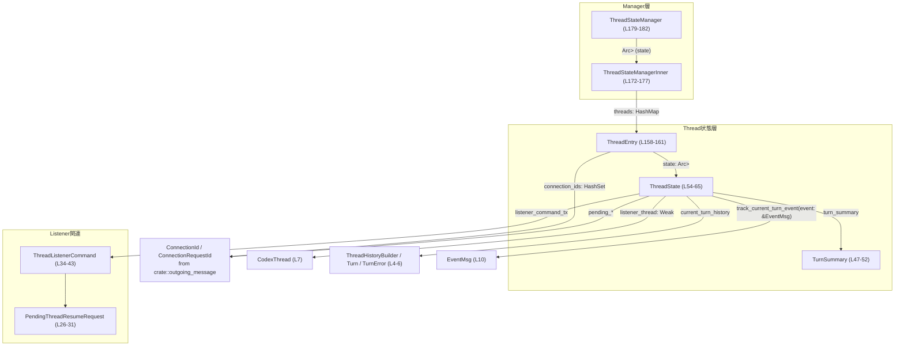
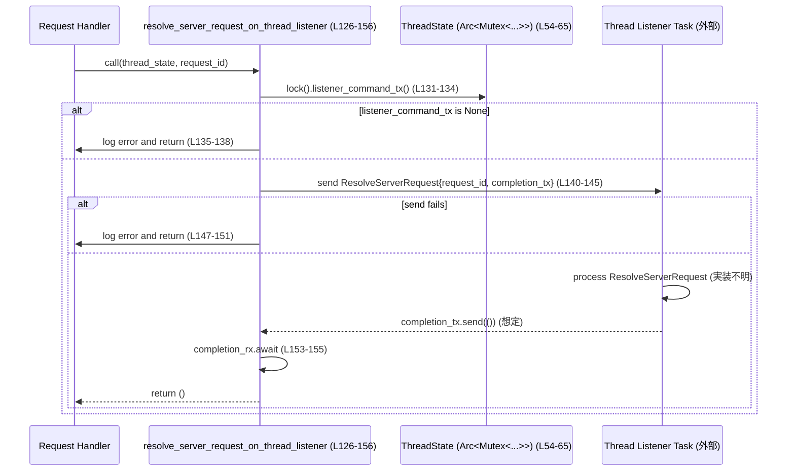
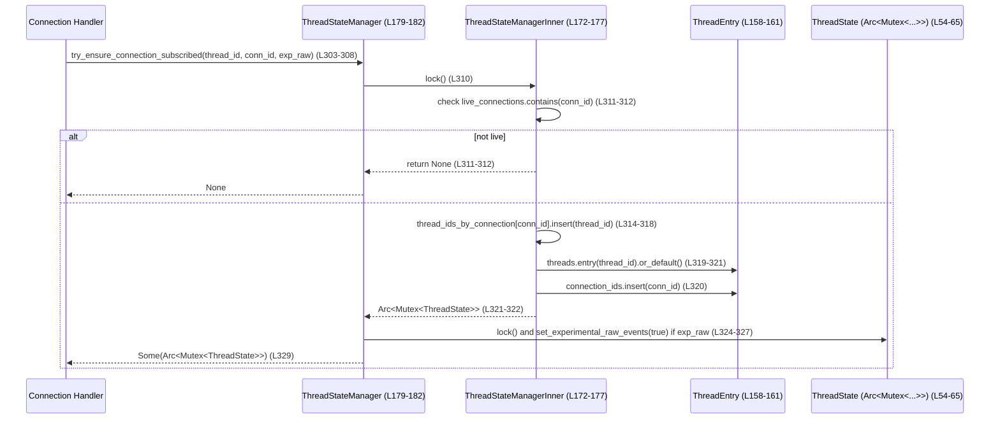

# app-server/src/thread_state.rs コード解説

## 0. ざっくり一言

このモジュールは、「会話スレッドごとの状態」と「接続（WebSocket 等）との紐づけ」を管理し、非同期タスク間で安全に共有するためのユーティリティを提供します（`thread_state.rs:L54-L65`, `thread_state.rs:L172-L182`）。  
同時に、スレッドごとの「リスナー（thread listener）」へのコマンド送信や、ターン履歴の管理も担っています。

---

## 1. このモジュールの役割

### 1.1 概要

- このモジュールは **スレッド単位の状態管理** と **接続とスレッドのサブスクリプション管理** を行います（`thread_state.rs:L54-L65`, `thread_state.rs:L172-L182`）。
- 個々のスレッドについて、ターンの履歴やエラー情報、リスナーのキャンセルチャンネルなどを `ThreadState` に保持します（`thread_state.rs:L54-L65`）。
- 複数接続と複数スレッドの関係（どの接続がどのスレッドを購読しているか）を `ThreadStateManager` が集中管理します（`thread_state.rs:L172-L177`, `thread_state.rs:L179-L182`）。
- スレッドリスナーに対して、履歴再送やリクエスト解決通知を **mpsc チャンネル + oneshot** でシリアライズして送る仕組みを提供します（`thread_state.rs:L33-L43`, `thread_state.rs:L126-L156`）。

### 1.2 アーキテクチャ内での位置づけ

主なコンポーネント間の依存関係を示します。



※ 外部型の詳細実装（`CodexThread` や `ThreadHistoryBuilder` など）は、このチャンクには現れません。

### 1.3 設計上のポイント

コードから読み取れる設計上の特徴です。

- **スレッド状態と接続管理の分離**  
  - 各スレッドの状態は `ThreadState` に集約（`thread_state.rs:L54-L65`）。  
  - 全体の接続とスレッドの対応関係は `ThreadStateManagerInner` が `HashMap` で保持（`thread_state.rs:L172-L177`）。
- **非同期・並行性の安全性**
  - `ThreadState` は `Arc<Mutex<ThreadState>>` で共有され、非同期タスク間での同時更新を `tokio::sync::Mutex` により同期します（`thread_state.rs:L16`, `thread_state.rs:L159`, `thread_state.rs:L181`）。
  - マネージャ本体も `Arc<Mutex<ThreadStateManagerInner>>` で保護され、全ての管理メソッドが `async fn` になっています（`thread_state.rs:L179-L182`, `thread_state.rs:L189-L378`）。
  - ロックを保持したまま `.await` するケースは避けられており、デッドロック回避の意図が見られます（例: `remove_thread_state` で manager のロックを解放してから `ThreadState` をロック, `thread_state.rs:L211-L223`, `thread_state.rs:L225-L227`）。
- **チャネルによるシリアライズされた操作**
  - スレッドリスナーとの通信は `mpsc::UnboundedSender<ThreadListenerCommand>` 経由で行われ、リスナー側で処理順序を保証しています（`thread_state.rs:L33-L43`, `thread_state.rs:L62`, `thread_state.rs:L126-L156`）。
  - リクエスト解決は oneshot チャンネルで完了通知を受ける設計です（`thread_state.rs:L126-L131`, `thread_state.rs:L140-L145`）。
- **接続のライフサイクル管理**
  - 接続が「ライブ」かどうかを `live_connections: HashSet<ConnectionId>` で管理し（`thread_state.rs:L174`）、購読操作はライブ接続のみを許可します（`try_ensure_connection_subscribed`, `thread_state.rs:L311-L312`）。
  - 接続が切断されたときに、関連するスレッドから接続を外し、必要ならスレッド自体のクリーンアップ候補を返す実装があります（`remove_connection`, `thread_state.rs:L355-L377`）。

---

## 2. 主要な機能一覧

このモジュールが提供する主な機能です。

- **スレッドリスナー管理**  
  - リスナーの登録・解除、キャンセル通知の送出（`ThreadState::set_listener`, `ThreadState::clear_listener`, `thread_state.rs:L75-L88`, `thread_state.rs:L90-L97`）。
- **ターン履歴とサマリの追跡**  
  - `EventMsg` を取り込み、現在のターン履歴と `TurnSummary` を更新（`track_current_turn_event`, `thread_state.rs:L113-L123`）。
- **スレッドリスナーへのコマンド送信**  
  - スレッド再開レスポンスやサーバーリクエスト解決通知を `ThreadListenerCommand` として送信（`thread_state.rs:L33-L43`, `thread_state.rs:L126-L156`）。
- **接続とスレッドのサブスクリプション管理**
  - どの接続がどのスレッドを購読しているかの登録・解除（`try_ensure_connection_subscribed`, `unsubscribe_connection_from_thread`, `try_add_connection_to_thread`, `thread_state.rs:L261-L292`, `thread_state.rs:L303-L330`, `thread_state.rs:L332-L352`）。
- **接続ライフサイクル対応**
  - 接続の初期化や切断時の状態更新と、購読者の有無確認（`connection_initialized`, `remove_connection`, `has_subscribers`, `thread_state.rs:L189-L195`, `thread_state.rs:L355-L377`, `thread_state.rs:L294-L301`）。
- **スレッド状態の生成・破棄**
  - `ThreadId` ごとの `ThreadState` の作成・取得・削除、および削除時のリスナークリーンアップ（`thread_state`, `remove_thread_state`, `thread_state.rs:L206-L209`, `thread_state.rs:L211-L236`）。

---

## 3. 公開 API と詳細解説

### 3.1 型一覧（構造体・列挙体など：コンポーネントインベントリー）

| 名前 | 種別 | 役割 / 用途 | 定義位置 |
|------|------|-------------|----------|
| `PendingInterruptQueue` | 型エイリアス | ペンディング中の割り込み要求を `(ConnectionRequestId, ApiVersion)` のベクタとして表現 | `thread_state.rs:L21-L24` |
| `PendingThreadResumeRequest` | 構造体 | スレッド再開レスポンスに必要な情報（リクエストID、ロールアウトパス、設定スナップショット、スレッド概要）を保持 | `thread_state.rs:L26-L31` |
| `ThreadListenerCommand` | 列挙体 | スレッドリスナーに対して送るコマンド。スレッド再開レスポンス送信とサーバーリクエスト解決通知を表現 | `thread_state.rs:L33-L43` |
| `TurnSummary` | 構造体 | 会話ターン中の最新状態（開始時刻、ファイル変更やコマンド実行の開始、最後のエラー）を保持 | `thread_state.rs:L45-L52` |
| `ThreadState` | 構造体 | 1スレッドに紐づく状態（割り込み・ロールバック待ち、ターンサマリ、リスナー情報、ターン履歴など）を管理 | `thread_state.rs:L54-L65` |
| `ThreadEntry` | 構造体 | `ThreadState` と、そのスレッドを購読している接続ID集合をまとめたエントリ | `thread_state.rs:L158-L161` |
| `ThreadStateManagerInner` | 構造体 | 全接続・全スレッドを横断的に管理する内部状態（ライブ接続、スレッドマップ、接続→スレッド集合マップ） | `thread_state.rs:L172-L177` |
| `ThreadStateManager` | 構造体 | `Arc<Mutex<ThreadStateManagerInner>>` をラップした公開インターフェイス。非同期APIを提供 | `thread_state.rs:L179-L182` |

### 3.2 関数詳細（主要 7 件）

#### `ThreadState::set_listener(&mut self, cancel_tx: oneshot::Sender<()>, conversation: &Arc<CodexThread>) -> (mpsc::UnboundedReceiver<ThreadListenerCommand>, u64)`（`thread_state.rs:L75-L88`）

**概要**

- 現在のスレッドリスナーを設定し、リスナーに対するコマンド受信用 `mpsc::UnboundedReceiver` とリスナーの世代番号（`listener_generation`）を返します。
- 既存のリスナーがある場合は、そのキャンセル用 oneshot に `()` を送ってリスナーの終了を促します（`thread_state.rs:L80-L82`）。

**引数**

| 引数名 | 型 | 説明 |
|--------|----|------|
| `cancel_tx` | `oneshot::Sender<()>` | 新しいリスナーに対してキャンセル通知を送るためのチャンネル送信側（`thread_state.rs:L77`） |
| `conversation` | `&Arc<CodexThread>` | リスナーが監視する `CodexThread` インスタンス。`Weak` 参照として保存されます（`thread_state.rs:L78`, `thread_state.rs:L86`） |

**戻り値**

- `(mpsc::UnboundedReceiver<ThreadListenerCommand>, u64)`  
  - 前者はリスナーがコマンドを受信するためのチャネル受信側（`thread_state.rs:L84-L87`）。  
  - 後者は更新後の `listener_generation`。`wrapping_add(1)` で単調に増加します（`thread_state.rs:L83`）。

**内部処理の流れ**

1. 既存の `cancel_tx` を `self.cancel_tx.replace(cancel_tx)` で置き換え、もし以前の値があれば `previous.send(())` を試みてキャンセル通知を送ります（`thread_state.rs:L80-L82`）。
2. `listener_generation` を `wrapping_add(1)` でインクリメントします（オーバーフロー時は0に戻る）（`thread_state.rs:L83`）。
3. `mpsc::unbounded_channel()` で新しいコマンドチャネルを作成し、送信側を `self.listener_command_tx` に保存、受信側をローカル変数に保持します（`thread_state.rs:L84-L86`）。
4. `listener_thread` に `Arc::downgrade(conversation)` を保存し、`Weak<CodexThread>` として保持します（`thread_state.rs:L86`）。
5. 受信側と世代番号を返します（`thread_state.rs:L87`）。

**Examples（使用例）**

```rust
// ThreadState を既に Arc<Mutex<ThreadState>> で保持していると仮定
async fn spawn_thread_listener(
    thread_state: Arc<tokio::sync::Mutex<ThreadState>>,       // スレッド状態
    conversation: Arc<CodexThread>,                           // 対象スレッド
) {
    let mut guard = thread_state.lock().await;                 // ThreadState をロック
    let (cancel_tx, cancel_rx) = tokio::sync::oneshot::channel::<()>(); // リスナー用キャンセルチャネル

    let (cmd_rx, generation) = guard.set_listener(cancel_tx, &conversation); // 新リスナーを登録

    // cmd_rx と cancel_rx を使ってリスナータスクを起動する、という利用が想定されます
    tokio::spawn(async move {
        // ThreadListenerCommand を受信して処理するループ
        tokio::pin!(cmd_rx);
        // 具体的な処理内容はこのチャンクには現れません
    });

    // generation をログ等に利用可能
    tracing::debug!(listener_generation = generation, "thread listener started");
}
```

**Errors / Panics**

- `previous.send(())` の戻り値は無視されており、失敗してもパニックしません（`thread_state.rs:L80-L82`）。
- `mpsc::unbounded_channel()` や `Arc::downgrade` によるパニックは通常発生しません。
- 明示的な `unwrap` / `expect` は使用していません。

**Edge cases（エッジケース）**

- 既にリスナーが存在する場合でも、新しいリスナーで上書きされ、古いリスナーにはキャンセル通知が送られます（`thread_state.rs:L80-L82`）。
- `listener_generation` は `u64` ですが、`wrapping_add` により `u64::MAX` から 0 に戻る挙動になります（`thread_state.rs:L83`）。

**使用上の注意点**

- 同じ `ThreadState` に対して複数回 `set_listener` を呼ぶと、古いリスナーを終了させる設計になっているため、リスナーは常に高々1つになる前提で使われます。
- `cancel_tx` を受け取ったリスナー側で、きちんとキャンセル処理（タスク終了等）を行う必要がありますが、その実装はこのファイルには現れません。

---

#### `ThreadState::clear_listener(&mut self)`（`thread_state.rs:L90-L97`）

**概要**

- 現在のリスナー設定をクリアし、キャンセル通知を送り、ターン履歴をリセットします。
- スレッドリスナーの明示的な終了処理で呼び出されます。

**引数**

- なし（`&mut self` のみ）。

**戻り値**

- なし（`()`）。

**内部処理の流れ**

1. `self.cancel_tx.take()` でキャンセル送信側を取り出し、存在する場合は `send(())` を試みます（`thread_state.rs:L91-L92`）。
2. `listener_command_tx` を `None` に設定し、以後リスナーへのコマンド送信は行えなくなります（`thread_state.rs:L94`）。
3. `current_turn_history.reset()` を呼んでターン履歴をリセットします（`thread_state.rs:L95`）。
4. `listener_thread` を `None` にして、関連付けられた `CodexThread` の弱参照を破棄します（`thread_state.rs:L96`）。

**Examples（使用例）**

```rust
async fn teardown_thread_state(thread_state: Arc<tokio::sync::Mutex<ThreadState>>) {
    let mut guard = thread_state.lock().await;
    guard.clear_listener(); // リスナーを明示的にクリーンアップ
}
```

**Errors / Panics**

- `cancel_tx.send(())` のエラーは無視され、ログにも出しません（`thread_state.rs:L91-L92`）。
- その他明示的なパニック要因はありません。

**Edge cases**

- すでに `cancel_tx` が `None` の場合は何もしません。
- `current_turn_history` をリセットするため、進行中のターン情報は失われます。

**使用上の注意点**

- `ThreadStateManager::remove_thread_state` や `clear_all_listeners` から呼ばれており、スレッドの破棄やサーバーシャットダウン時のクリーンアップ手段として使われます（`thread_state.rs:L225-L235`, `thread_state.rs:L248-L258`）。
- 呼び出し後は、新たに `set_listener` を呼ぶまでリスナーへのコマンド送信はできません。

---

#### `ThreadState::track_current_turn_event(&mut self, event: &EventMsg)`（`thread_state.rs:L113-L123`）

**概要**

- スレッドに届いた `EventMsg` をターン履歴ビルダーに渡して処理し、必要に応じて `TurnSummary` を更新します。
- ターン終了時には、アクティブなターンが残っていなければ履歴をリセットします。

**引数**

| 引数名 | 型 | 説明 |
|--------|----|------|
| `event` | `&EventMsg` | スレッドに関するイベント。`TurnStarted`, `TurnAborted`, `TurnComplete` 等を含む（`thread_state.rs:L10`, `thread_state.rs:L113-L119`） |

**戻り値**

- なし（`()`）。

**内部処理の流れ**

1. `event` が `EventMsg::TurnStarted(payload)` の場合、`self.turn_summary.started_at` に `payload.started_at` を設定します（`thread_state.rs:L114-L116`）。
2. `current_turn_history.handle_event(event)` を呼び出し、履歴ビルダーにイベントを渡します（`thread_state.rs:L117`）。
3. `event` が `TurnAborted` または `TurnComplete` であり、かつ `current_turn_history.has_active_turn()` が `false` の場合、`current_turn_history.reset()` を呼び出して履歴をリセットします（`thread_state.rs:L118-L121`）。

**Examples（使用例）**

```rust
async fn handle_thread_event(
    thread_state: Arc<tokio::sync::Mutex<ThreadState>>, // スレッド状態
    event: codex_protocol::protocol::EventMsg,          // 受信イベント
) {
    let mut guard = thread_state.lock().await;
    guard.track_current_turn_event(&event);             // ターン履歴・サマリを更新
}
```

**Errors / Panics**

- `handle_event` / `has_active_turn` / `reset` の内部実装はこのチャンクには現れないため、そこに依存するエラー可能性は不明です。
- この関数自体にはパニックを起こすようなコード（`unwrap` 等）はありません。

**Edge cases**

- `TurnAborted` もしくは `TurnComplete` が来たにもかかわらず、`has_active_turn()` が `true` のままの場合は、履歴リセットは行われません（`thread_state.rs:L118-L121`）。
- `TurnStarted` 以外のイベントでは `turn_summary.started_at` は変更されません。

**使用上の注意点**

- ターン開始時刻以外の `TurnSummary` フィールド（`file_change_started`, `command_execution_started`, `last_error`）は、この関数では更新されておらず、別のコードパスで更新される前提とみられます（`thread_state.rs:L48-L51`）。このチャンクにはそのコードは現れません。
- イベントの順序に依存するロジック（例: `TurnStarted`→`TurnComplete`）があるため、実際のイベントストリームは順序を保証する必要があります。

---

#### `resolve_server_request_on_thread_listener(thread_state: &Arc<Mutex<ThreadState>>, request_id: RequestId)`（`thread_state.rs:L126-L156`）

**概要**

- サーバー側で処理中のリクエストを「解決済み」としてスレッドリスナーに通知し、その通知が処理されるまで待機します。
- 通知は `ThreadListenerCommand::ResolveServerRequest` として送信されます（`thread_state.rs:L140-L144`）。

**引数**

| 引数名 | 型 | 説明 |
|--------|----|------|
| `thread_state` | `&Arc<Mutex<ThreadState>>` | 対象スレッドの状態共有オブジェクト。ここからリスナーへの送信チャネルを取得します（`thread_state.rs:L127`）。 |
| `request_id` | `RequestId` | 解決済みと通知したいリクエストID（`thread_state.rs:L128`）。 |

**戻り値**

- なし（`()`）。  
  成否は内部で `tracing::error!` によるログ出力のみで表現され、呼び出し側には戻りません（`thread_state.rs:L136-L137`, `thread_state.rs:L147-L151`, `thread_state.rs:L153-L155`）。

**内部処理の流れ**

1. `oneshot::channel()` で完了通知用の oneshot チャネルを作成します（`thread_state.rs:L130-L131`）。
2. `thread_state.lock().await` で `ThreadState` をロックし、`listener_command_tx()` で `Option<mpsc::UnboundedSender<_>>` を取得します（`thread_state.rs:L131-L134`）。この時点で `Mutex` のロックはスコープを抜けて解放されます。
3. `listener_command_tx` が `None` の場合、エラーログを出力して早期リターンします（`thread_state.rs:L135-L138`）。
4. `ThreadListenerCommand::ResolveServerRequest { request_id, completion_tx }` を `send` で送信し、`Err` の場合はエラーログを出力してリターンします（`thread_state.rs:L140-L151`）。
5. `completion_rx.await` でリスナー側からの完了通知を待機し、`Err`（送信側がドロップされたなど）の場合はエラーログを出力します（`thread_state.rs:L153-L155`）。

**Examples（使用例）**

```rust
async fn finalize_request(
    thread_state: Arc<tokio::sync::Mutex<ThreadState>>,
    request_id: codex_app_server_protocol::RequestId,
) {
    // リクエスト処理完了後に、スレッドリスナーへ「解決済み」通知を送る
    resolve_server_request_on_thread_listener(&thread_state, request_id).await;
    // エラー時は内部でログが出るのみで、ここには伝播しません
}
```

**Errors / Panics**

- リスナーが起動していない (`listener_command_tx` が `None`) 場合:
  - `"thread listener is not running"` とログ出力して即 return（`thread_state.rs:L135-L137`）。
- コマンドチャネルがクローズされている場合:
  - `"thread listener command channel is closed"` とログ出力して return（`thread_state.rs:L140-L151`）。
- リスナー側が `completion_tx` を送信せずにドロップした場合:
  - `completion_rx.await` が `Err` を返し、ログに `"failed to remove pending client request: {err}"` と出力（`thread_state.rs:L153-L155`）。
- いずれの場合もパニックはしません。

**Edge cases**

- リスナーが応答しない場合、`completion_rx.await` が完了しないため、この関数を待っているタスクはブロックされたままになります。
- エラー時に呼び出し側に `Result` を返さないため、上位でリトライやフォールバック処理を行うにはログに頼ることになります。

**使用上の注意点**

- この関数は `Mutex` ロックを取得した後、チャネル送信と `await` をロックの外で行うように設計されています（`thread_state.rs:L131-L134`）。これにより、ロックを保持したまま長時間待機することを避けています。
- 呼び出し側でエラー条件を検知したい場合は、現在の実装ではログを解析するか、別のシグナリング機構を追加する必要がありますが、このチャンクにはそのような追加処理はありません。

---

#### `ThreadStateManager::try_ensure_connection_subscribed(&self, thread_id: ThreadId, connection_id: ConnectionId, experimental_raw_events: bool) -> Option<Arc<Mutex<ThreadState>>>`（`thread_state.rs:L303-L330`）

**概要**

- 指定された接続IDとスレッドIDの組み合わせが購読状態になるように状態を更新し、そのスレッドの `ThreadState` を返します。
- 接続がライブでない場合は何もせず `None` を返します。

**引数**

| 引数名 | 型 | 説明 |
|--------|----|------|
| `thread_id` | `ThreadId` | 購読させたいスレッドのID（`thread_state.rs:L305`）。 |
| `connection_id` | `ConnectionId` | 購読させたい接続のID（`thread_state.rs:L306`）。 |
| `experimental_raw_events` | `bool` | `true` の場合、`ThreadState` に対して `experimental_raw_events` フラグを有効化します（`thread_state.rs:L307`, `thread_state.rs:L324-L327`）。 |

**戻り値**

- `Option<Arc<Mutex<ThreadState>>>`  
  - `Some(ThreadState)` : 接続がライブであり、購読状態の確保に成功した場合。  
  - `None` : 接続がライブでなかった場合（`live_connections` に存在しない, `thread_state.rs:L311-L312`）。

**内部処理の流れ**

1. `state.lock().await` で `ThreadStateManagerInner` をロックします（`thread_state.rs:L310`）。
2. `live_connections` に `connection_id` が含まれていなければ `None` を返して終了します（`thread_state.rs:L311-L312`）。
3. `thread_ids_by_connection.entry(connection_id).or_default().insert(thread_id)` で、接続→スレッド集合マップに追加します（`thread_state.rs:L314-L318`）。
4. `threads.entry(thread_id).or_default()` で `ThreadEntry` を取得（なければ作成）し、その `connection_ids` に `connection_id` を追加します（`thread_state.rs:L319-L321`）。
5. `ThreadEntry` に格納された `state: Arc<Mutex<ThreadState>>` をクローンしてロックの外に返します（`thread_state.rs:L321-L322`）。
6. 取得した `ThreadState` に対して `lock().await` を行い、`experimental_raw_events` が `true` の場合 `set_experimental_raw_events(true)` を呼びます（`thread_state.rs:L324-L327`）。
7. 最後に `Some(thread_state)` を返します（`thread_state.rs:L329`）。

**Examples（使用例）**

```rust
async fn subscribe_connection(
    manager: &ThreadStateManager,
    thread_id: codex_protocol::ThreadId,
    connection_id: crate::outgoing_message::ConnectionId,
) {
    // 事前に connection_initialized が呼ばれている必要があります
    if let Some(thread_state) = manager
        .try_ensure_connection_subscribed(thread_id, connection_id, true)
        .await
    {
        // thread_state を使って、スレッド固有の処理を行うことができます
        let mut guard = thread_state.lock().await;
        // ここで guard.turn_summary などにアクセス可能
    } else {
        // ライブでない接続に対する購読要求だった
        tracing::warn!("connection is not live; cannot subscribe");
    }
}
```

**Errors / Panics**

- `live_connections.contains` の判定失敗時は、単に `None` を返すのみでエラーにはなりません（`thread_state.rs:L311-L312`）。
- `HashMap` や `HashSet` 操作はパニックを起こさない標準的な操作のみです。
- 内部で呼び出している `set_experimental_raw_events` は単に bool フラグを代入するだけです（`thread_state.rs:L99-L101`）。

**Edge cases**

- 既に同じ `(connection_id, thread_id)` が登録済みの場合でも、`insert(thread_id)` や `insert(connection_id)` は冪等であり、特別な処理は行われません（`thread_state.rs:L314-L321`）。
- `experimental_raw_events` は `true` のときのみ設定され、`false` に戻すロジックはこのファイルには存在しません（`thread_state.rs:L324-L327`）。

**使用上の注意点**

- この関数を呼ぶ前に `connection_initialized(connection_id)` を呼び、`live_connections` に登録しておく必要があります（`thread_state.rs:L189-L195`, `thread_state.rs:L311-L312`）。
- 戻り値の `Arc<Mutex<ThreadState>>` を保持する場合、多数の場所から同じ `ThreadState` への参照が増えるので、ロック競合を避けるような運用が重要になります。

---

#### `ThreadStateManager::unsubscribe_connection_from_thread(&self, thread_id: ThreadId, connection_id: ConnectionId) -> bool`（`thread_state.rs:L261-L292`）

**概要**

- 特定の接続IDを特定のスレッドIDの購読リストから解除します。
- 双方向のマップ（`thread_ids_by_connection` と `threads[thread_id].connection_ids`）を一貫性を保ちながら更新します。

**引数**

| 引数名 | 型 | 説明 |
|--------|----|------|
| `thread_id` | `ThreadId` | 購読解除したいスレッドのID（`thread_state.rs:L263`）。 |
| `connection_id` | `ConnectionId` | 購読解除したい接続のID（`thread_state.rs:L264`）。 |

**戻り値**

- `bool`  
  - `true` : 購読解除処理が行われた（マップに存在しない等の理由でエラーなく終了したケースも含む）。  
  - `false` : 指定されたスレッドや接続の対応関係が存在しない場合（`thread_state.rs:L268-L270`, `thread_state.rs:L272-L278`）。

**内部処理の流れ**

1. `state.lock().await` で `ThreadStateManagerInner` をロックします（`thread_state.rs:L267`）。
2. `threads` に `thread_id` が存在しなければ `false` を返します（`thread_state.rs:L268-L270`）。
3. `thread_ids_by_connection` において `connection_id` に対応するスレッド集合に `thread_id` が含まれていなければ `false` を返します（`thread_state.rs:L272-L278`）。
4. `thread_ids_by_connection.get_mut(&connection_id)` でスレッド集合を取得し、`thread_ids.remove(&thread_id)` で削除します。集合が空になった場合は `thread_ids_by_connection.remove(&connection_id)` でエントリ自体を削除します（`thread_state.rs:L280-L285`）。
5. `threads.get_mut(&thread_id)` から `ThreadEntry` を取得し、その `connection_ids` から `connection_id` を削除します（`thread_state.rs:L286-L288`）。
6. ブロックを抜けてロックが解放された後、`true` を返します（`thread_state.rs:L289-L291`）。

**Examples（使用例）**

```rust
async fn unsubscribe(
    manager: &ThreadStateManager,
    thread_id: codex_protocol::ThreadId,
    connection_id: crate::outgoing_message::ConnectionId,
) {
    let removed = manager
        .unsubscribe_connection_from_thread(thread_id, connection_id)
        .await;
    if !removed {
        tracing::debug!("no subscription existed for given (thread, connection)");
    }
}
```

**Errors / Panics**

- 存在しないスレッド・接続の組み合わせには `false` で応答するのみで、パニックやログ出力はありません。
- `HashSet::remove` は常に安全で、パニックしません。

**Edge cases**

- 対象スレッドが `threads` に存在しない場合、`thread_ids_by_connection` は変更されません（`thread_state.rs:L268-L270`）。
- 対象接続に対する `thread_ids` があっても、その中に `thread_id` が含まれない場合は、双方向マップを一切変更せずに `false` を返します（`thread_state.rs:L272-L278`）。

**使用上の注意点**

- 戻り値 `true` は「購読が存在していた」ことを保証するわけではなく、「内部で一連の処理を行った」ことのみを表します。実際に削除が行われたか区別したい場合は、追加のロジックが必要です。
- サブスクリプション解除後、スレッドに購読者が残っているかどうかは `has_subscribers` で確認できます（`thread_state.rs:L294-L301`）。

---

#### `ThreadStateManager::remove_connection(&self, connection_id: ConnectionId) -> Vec<ThreadId>`（`thread_state.rs:L355-L377`）

**概要**

- ライブ接続一覧およびサブスクリプションマップから指定された接続IDを完全に削除し、「その接続の削除によって購読者がゼロになったスレッドID」の一覧を返します。
- 接続の切断時に呼び出されることを想定した処理です。

**引数**

| 引数名 | 型 | 説明 |
|--------|----|------|
| `connection_id` | `ConnectionId` | 切断された接続のID（`thread_state.rs:L355`）。 |

**戻り値**

- `Vec<ThreadId>`  
  - この接続の削除によって、`connection_ids` が空になったスレッドIDの集合（`thread_state.rs:L369-L376`）。

**内部処理の流れ**

1. `state.lock().await` で `ThreadStateManagerInner` をロックします（`thread_state.rs:L357`）。
2. `live_connections.remove(&connection_id)` でライブ接続集合から削除します（`thread_state.rs:L358`）。
3. `thread_ids_by_connection.remove(&connection_id).unwrap_or_default()` で、この接続が購読していたスレッドID集合を取得します（`thread_state.rs:L359-L362`）。
4. そのスレッドID集合をループし、各 `thread_id` に対して `threads.get_mut(thread_id)` から `ThreadEntry` を取得し、その `connection_ids` から `connection_id` を削除します（`thread_state.rs:L363-L366`）。
5. 最後に、先ほどの `thread_ids` を `into_iter()` し、それぞれに対して `threads.get(thread_id)` を確認し、`connection_ids` が空のものだけをフィルタして `Vec<ThreadId>` として返します（`thread_state.rs:L369-L376`）。

**Examples（使用例）**

```rust
async fn on_connection_closed(
    manager: &ThreadStateManager,
    connection_id: crate::outgoing_message::ConnectionId,
) {
    // この接続の削除によって購読者がいなくなったスレッドID一覧
    let orphan_threads = manager.remove_connection(connection_id).await;

    // 呼び出し側で orphan_threads に対して remove_thread_state を呼ぶ、などの後処理が想定されます
    for thread_id in orphan_threads {
        manager.remove_thread_state(thread_id).await;
    }
}
```

※ 上記の「remove_thread_state を呼ぶ」という利用パターンは、`remove_connection` がスレッドエントリ自体を削除していないこと（`thread_state.rs:L369-L376`）と、`remove_thread_state` が外部から呼び出せること（`thread_state.rs:L211-L236`）からの推測です。実際の呼び出し箇所はこのチャンクには現れません。

**Errors / Panics**

- `thread_ids_by_connection.remove(&connection_id)` が `None` の場合は空集合として扱われ、何も削除されません（`thread_state.rs:L359-L362`）。
- `threads.get_mut(thread_id)` が `None` の場合は、そのスレッドIDに対する接続削除はスキップされます（`thread_state.rs:L363-L366`）。
- いずれもパニックを起こさず、静かに無視する設計です。

**Edge cases**

- 接続がそもそも `live_connections` に存在しない場合でも `remove` は `false` を返すだけで、処理は継続します（`thread_state.rs:L358`）。ただし、`thread_ids_by_connection.remove` が `None` になり、結果として戻り値は空ベクタになります。
- `threads` にスレッドエントリが残っているにもかかわらず、`thread_ids_by_connection` には該当接続エントリがない場合も、何も削除されず、戻り値は空になります。

**使用上の注意点**

- 戻り値のスレッドIDについて、実際にスレッドを破棄する（`remove_thread_state` を呼ぶなど）かどうかは呼び出し側の責務です。この関数自体は `threads` マップを変更しません（`thread_state.rs:L369-L376`）。
- ロックは関数スコープ全体で保持されますが、その間に外部の `await` は行っておらず、ロック保持時間は `HashMap` 操作のみです。

---

#### `ThreadStateManager::remove_thread_state(&self, thread_id: ThreadId)`（`thread_state.rs:L211-L236`）

**概要**

- 特定スレッドIDの `ThreadState` エントリを `threads` マップから削除し、それに紐づいている接続→スレッド集合マップを整合的に更新します。
- 併せて該当 `ThreadState` のリスナーを `clear_listener` でクリーンアップします。

**引数**

| 引数名 | 型 | 説明 |
|--------|----|------|
| `thread_id` | `ThreadId` | 削除対象のスレッドID（`thread_state.rs:L211`）。 |

**戻り値**

- なし（`()`）。

**内部処理の流れ**

1. `state.lock().await` で `ThreadStateManagerInner` をロックします（`thread_state.rs:L213`）。
2. `threads.remove(&thread_id).map(|thread_entry| thread_entry.state)` で該当スレッドの `ThreadState` を取り出します（`thread_state.rs:L214-L217`）。
3. `thread_ids_by_connection.retain(|_, thread_ids| { thread_ids.remove(&thread_id); !thread_ids.is_empty() })` で、各接続→スレッド集合から `thread_id` を取り除き、集合が空になった接続エントリを削除します（`thread_state.rs:L218-L221`）。
4. ロックを解放した状態で、もし `ThreadState` が取得できていればそれを `lock().await` し、`tracing::debug!` で情報をログ出力した後、`clear_listener()` を呼びます（`thread_state.rs:L225-L235`）。

**Examples（使用例）**

上記 `remove_connection` の例を参照してください。

**Errors / Panics**

- `threads.remove` が `None` の場合（存在しないスレッドID）は、接続マップだけ更新され、`ThreadState` に対するクリーンアップは行われません（`thread_state.rs:L214-L223`）。
- `clear_listener` 内でのキャンセル送信エラーは無視されます（`thread_state.rs:L90-L93`）。

**Edge cases**

- すでに `ThreadState` が他の箇所で破棄されている場合（`threads` に存在しないとき）、接続マップに残っている `thread_id` はこの関数でクリーンアップされますが、リスナー側の状況は不明です。

**使用上の注意点**

- Manager のロックと `ThreadState` のロックを同時に保持しないように設計されており、デッドロックを避ける形になっています（`thread_state.rs:L211-L223`, `thread_state.rs:L225-L227`）。

---

### 3.3 その他の関数

その他の補助的関数・単純なラッパー関数一覧です。

| 関数名 | 役割（1 行） | 定義位置 |
|--------|--------------|----------|
| `ThreadState::listener_matches(&self, conversation: &Arc<CodexThread>) -> bool` | 登録済みリスナーが指定の `CodexThread` と同一かどうかを `Weak::upgrade` と `Arc::ptr_eq` で判定 | `thread_state.rs:L68-L73` |
| `ThreadState::set_experimental_raw_events(&mut self, enabled: bool)` | `experimental_raw_events` フラグを設定 | `thread_state.rs:L99-L101` |
| `ThreadState::listener_command_tx(&self) -> Option<mpsc::UnboundedSender<ThreadListenerCommand>>` | リスナーへのコマンド送信チャネルのクローンを返す | `thread_state.rs:L103-L107` |
| `ThreadState::active_turn_snapshot(&self) -> Option<Turn>` | `current_turn_history` からアクティブなターンのスナップショットを取得 | `thread_state.rs:L109-L111` |
| `ThreadEntry::default() -> Self` | 新しい `ThreadEntry` を `ThreadState::default()` と空の `connection_ids` で生成 | `thread_state.rs:L163-L170` |
| `ThreadStateManager::new() -> Self` | `Default` 実装を呼び出すだけのコンストラクタ | `thread_state.rs:L185-L187` |
| `ThreadStateManager::connection_initialized(&self, connection_id: ConnectionId)` | 接続IDを `live_connections` に追加し、「ライブ」な接続として記録 | `thread_state.rs:L189-L195` |
| `ThreadStateManager::subscribed_connection_ids(&self, thread_id: ThreadId) -> Vec<ConnectionId>` | 指定スレッドを購読している接続ID一覧を取得 | `thread_state.rs:L197-L204` |
| `ThreadStateManager::thread_state(&self, thread_id: ThreadId) -> Arc<Mutex<ThreadState>>` | 指定スレッドIDの `ThreadState` を取得（なければ生成） | `thread_state.rs:L206-L209` |
| `ThreadStateManager::clear_all_listeners(&self)` | すべてのスレッドのリスナーをデバッグログ出力とともに `clear_listener` でクリーンアップ | `thread_state.rs:L238-L259` |
| `ThreadStateManager::has_subscribers(&self, thread_id: ThreadId) -> bool` | 指定スレッドに購読者（接続ID）が1つ以上あるか確認 | `thread_state.rs:L294-L301` |
| `ThreadStateManager::try_add_connection_to_thread(&self, thread_id: ThreadId, connection_id: ConnectionId) -> bool` | ライブ接続に対して、購読関係（接続→スレッド、スレッド→接続）を作成する簡易版（`ThreadState` は返さない） | `thread_state.rs:L332-L352` |

---

## 4. データフロー

ここでは代表的な2つのシナリオのデータフローを示します。

### 4.1 サーバーリクエスト解決通知のフロー

`resolve_server_request_on_thread_listener` を中心にしたフローです（`thread_state.rs:L126-L156`）。



このフローから分かる要点：

- ThreadState の `listener_command_tx` 取得は `Mutex` ロック下で行われますが、その後の `send` と `await` はロックの外で行われ、競合を減らしています（`thread_state.rs:L131-L134`, `thread_state.rs:L140-L145`, `thread_state.rs:L153-L155`）。
- 完了通知が来ない場合、`completion_rx.await` は完了せず、ハンドラタスクがブロックされる設計です。

### 4.2 接続サブスクリプションのフロー

`try_ensure_connection_subscribed` を中心に、接続がスレッドを購読する流れです（`thread_state.rs:L303-L330`）。



要点：

- 「ライブ接続」であることが購読追加の前提条件になっています（`thread_state.rs:L311-L312`）。
- サブスクリプションの内部構造は、`thread_ids_by_connection` と `threads[thread_id].connection_ids` の **双方向マップ** として管理されています（`thread_state.rs:L174-L176`, `thread_state.rs:L280-L288`, `thread_state.rs:L314-L321`）。

---

## 5. 使い方（How to Use）

### 5.1 基本的な使用方法（ライフサイクルの一例）

典型的な利用フローを簡略化したコード例です。

```rust
use std::sync::Arc;
use tokio::sync::Mutex;
use app_server::thread_state::ThreadStateManager;
use crate::outgoing_message::ConnectionId;
use codex_protocol::ThreadId;

// 接続確立時
async fn on_connection_open(manager: &ThreadStateManager, conn_id: ConnectionId) {
    // 1. 接続を「ライブ」として登録 (L189-195)
    manager.connection_initialized(conn_id).await;
}

// クライアントがスレッド購読を開始したとき
async fn on_subscribe_thread(
    manager: &ThreadStateManager,
    thread_id: ThreadId,
    conn_id: ConnectionId,
) {
    // 2. 接続がライブであれば、thread_id への購読を追加し、ThreadState を取得 (L303-330)
    if let Some(thread_state) = manager
        .try_ensure_connection_subscribed(thread_id, conn_id, /* experimental_raw_events */ false)
        .await
    {
        // 必要に応じてスレッドリスナーの起動などを行う
        let mut ts = thread_state.lock().await;
        // 例: まだリスナーが設定されていなければ set_listener を呼ぶ、など
        // 実際の判定・起動ロジックはこのチャンクには現れません
    }
}

// スレッドにイベントが到着したとき
async fn on_thread_event(
    manager: &ThreadStateManager,
    thread_id: ThreadId,
    event: codex_protocol::protocol::EventMsg,
) {
    // 3. thread_state を取得し、イベントをターン履歴に反映 (L206-209, L113-123)
    let thread_state = manager.thread_state(thread_id).await;
    let mut ts = thread_state.lock().await;
    ts.track_current_turn_event(&event);
}

// サーバー側リクエストが完了したとき
async fn on_request_resolved(
    manager: &ThreadStateManager,
    thread_id: ThreadId,
    request_id: codex_app_server_protocol::RequestId,
) {
    // 4. リクエスト解決通知を thread listener に送信 (L126-156)
    let thread_state = manager.thread_state(thread_id).await;
    resolve_server_request_on_thread_listener(&thread_state, request_id).await;
}

// 接続切断時
async fn on_connection_closed(manager: &ThreadStateManager, conn_id: ConnectionId) {
    // 5. 接続を削除し、購読者がゼロになったスレッドID一覧を取得 (L355-377)
    let orphan_threads = manager.remove_connection(conn_id).await;

    // 6. 孤立スレッドについてスレッド状態も削除 (L211-236)
    for thread_id in orphan_threads {
        manager.remove_thread_state(thread_id).await;
    }
}
```

この例は、コード中のロジックに対応した典型的なライフサイクルを示しています。

### 5.2 よくある使用パターン

- **単に購読関係だけ追加したい場合**  
  `ThreadState` を触る必要がない場合は、`try_add_connection_to_thread` を利用できます（`thread_state.rs:L332-L352`）。

  ```rust
  let ok = manager
      .try_add_connection_to_thread(thread_id, conn_id)
      .await;
  if !ok {
      // ライブでない接続に対しては購読追加されない
  }
  ```

- **購読者の有無だけ確認したい場合**  
  `has_subscribers(thread_id)` を使うことで、スレッドに購読者がいるかどうかを簡便に確認できます（`thread_state.rs:L294-L301`）。

  ```rust
  if !manager.has_subscribers(thread_id).await {
      // 購読者がいないので、スレッドをクリーンアップしてもよい
  }
  ```

### 5.3 よくある間違いと注意点

```rust
// 間違い例: connection_initialized を呼ばずに購読しようとする
// live_connections に登録されていないため、None が返る (L311-312)
let thread_state = manager
    .try_ensure_connection_subscribed(thread_id, conn_id, false)
    .await;
// thread_state は None になり、以降の処理でパニックの原因になる可能性がある

// 正しい例: 先に connection_initialized で接続をライブ登録する
manager.connection_initialized(conn_id).await;
if let Some(thread_state) = manager
    .try_ensure_connection_subscribed(thread_id, conn_id, false)
    .await
{
    // 安全に ThreadState を利用できる
}
```

```rust
// 間違い例: remove_connection の戻り値を無視する
// 孤立スレッドが残っても ThreadState はクリーンアップされない (L369-376)
let _ = manager.remove_connection(conn_id).await;

// より適切な例: 戻り値の ThreadId に対して remove_thread_state を呼ぶ
let orphan_threads = manager.remove_connection(conn_id).await;
for thread_id in orphan_threads {
    manager.remove_thread_state(thread_id).await;
}
```

### 5.4 使用上の注意点（まとめ）

- **非同期コンテキストでの使用**  
  - `ThreadStateManager` の多くのメソッドは `async fn` であり、Tokio 等の非同期ランタイム内で `.await` する必要があります（`thread_state.rs:L189-L378`）。
- **ロックと待機の分離**  
  - `Mutex` ロックの取得後に長時間の `.await` を行わないように注意深く設計されており、この前提を崩す変更はデッドロックリスクを増やします（例: `remove_thread_state`, `thread_state.rs:L211-L223`, `thread_state.rs:L225-L227`）。
- **双方向マップの一貫性**  
  - 接続→スレッド (`thread_ids_by_connection`) と スレッド→接続 (`threads[thread_id].connection_ids`) は常に整合している前提で実装されています（`thread_state.rs:L174-L176`, `thread_state.rs:L280-L288`, `thread_state.rs:L359-L366`）。両方を更新することを忘れないことが重要です。
- **experimental_raw_events フラグ**  
  - `try_ensure_connection_subscribed` は `experimental_raw_events` を `true` に設定するだけで、`false` に戻すロジックはありません（`thread_state.rs:L324-L327`）。この挙動が想定通りかどうかは、他ファイル側の仕様確認が必要です。

---

## 6. 変更の仕方（How to Modify）

### 6.1 新しい機能を追加する場合

例: 接続ごとの追加メタ情報を追跡したい場合。

1. **データ構造の拡張**
   - 接続に紐づく情報を保持したい場合は、`ThreadStateManagerInner` に新しい `HashMap<ConnectionId, ...>` フィールドを追加するのが自然です（`thread_state.rs:L172-L177`）。
2. **API の追加**
   - 追加した情報に対する get/set 用の `async fn` を `ThreadStateManager` に実装し、`state: Arc<Mutex<_>>` を通じてアクセスします（`thread_state.rs:L179-L182` を参照）。
3. **既存ロジックとの整合**
   - 接続削除時の `remove_connection` で、この新しい情報もクリーンアップする必要があります（`thread_state.rs:L355-L377`）。
   - 同様に、スレッド削除時の `remove_thread_state` と矛盾が起きないようにします（`thread_state.rs:L211-L236`）。

### 6.2 既存の機能を変更する場合

- **契約・前提条件の確認**
  - `try_ensure_connection_subscribed` の「ライブ接続のみ許可」という前提を崩す場合、`connection_initialized` を呼ばないパスが増えます（`thread_state.rs:L311-L312`）。これに依存している呼び出し元の仕様を確認する必要があります。
  - `remove_connection` が返すスレッドIDの意味（「購読者ゼロになったスレッド」）を変更する場合、上位レイヤーのクリーンアップコードに影響します（`thread_state.rs:L369-L376`）。
- **テスト観点**
  - サブスクリプション双方向マップの整合性:
    - `try_ensure_connection_subscribed` → `unsubscribe_connection_from_thread` → `remove_connection` のシーケンスで、マップが矛盾しないことをテストします。
  - リスナーのライフサイクル:
    - `set_listener` → `clear_listener` の後に `listener_command_tx()` が `None` を返すこと（`thread_state.rs:L90-L97`, `thread_state.rs:L103-L107`）。
- **パフォーマンス上の注意**
  - 現在、全ての管理操作は単一の `Mutex<ThreadStateManagerInner>` にシリアライズされます（`thread_state.rs:L181`）。高負荷環境でボトルネックになる場合、シャーディング等の検討が必要ですが、変更時には双方向マップの一貫性維持が難しくなります。

---

## 7. 関連ファイル

このモジュールと密接に関係する外部型・モジュールです（中身はこのチャンクには現れません）。

| パス / 型 | 役割 / 関係 |
|-----------|------------|
| `crate::outgoing_message::ConnectionId` | 接続（おそらくクライアント接続）の識別子として使用。`ThreadStateManager` 内でライブ接続や購読者集合のキーになります（`thread_state.rs:L1`, `thread_state.rs:L174-L177`）。 |
| `crate::outgoing_message::ConnectionRequestId` | クライアントリクエストの識別子として使用。`PendingInterruptQueue` や `PendingThreadResumeRequest` で参照されます（`thread_state.rs:L2`, `thread_state.rs:L21-L24`, `thread_state.rs:L27`）。 |
| `crate::codex_message_processor::ApiVersion` | ペンディング割り込みキューの要素として使用される API バージョン。詳細な意味はこのチャンクには現れません（`thread_state.rs:L23`）。 |
| `codex_app_server_protocol::{RequestId, ThreadHistoryBuilder, Turn, TurnError, Thread}` | スレッド履歴管理やリクエスト識別子、ターン情報など、アプリケーションプロトコルレベルの型。`ThreadState` と `PendingThreadResumeRequest` で利用されます（`thread_state.rs:L3-L6`, `thread_state.rs:L29-L30`, `thread_state.rs:L63`, `thread_state.rs:L109-L111`）。 |
| `codex_core::{CodexThread, ThreadConfigSnapshot}` | コアレベルのスレッドオブジェクトおよび設定スナップショット。`ThreadState` から `Weak<CodexThread>` として参照され、再開リクエストにも使用されます（`thread_state.rs:L7-L8`, `thread_state.rs:L64`, `thread_state.rs:L29`）。 |
| `codex_protocol::protocol::EventMsg` | スレッドに関するイベントを表すプロトコル型。`track_current_turn_event` でターン履歴に反映されます（`thread_state.rs:L10`, `thread_state.rs:L113-L121`）。 |

このチャンク内には、これら外部型の具体的な構造や使用パターンは定義されていないため、詳細は当該モジュールのコード・ドキュメントを参照する必要があります。
