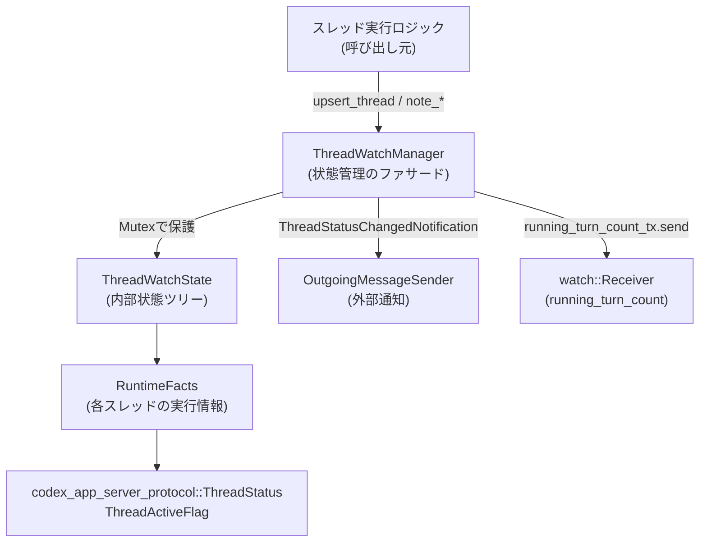
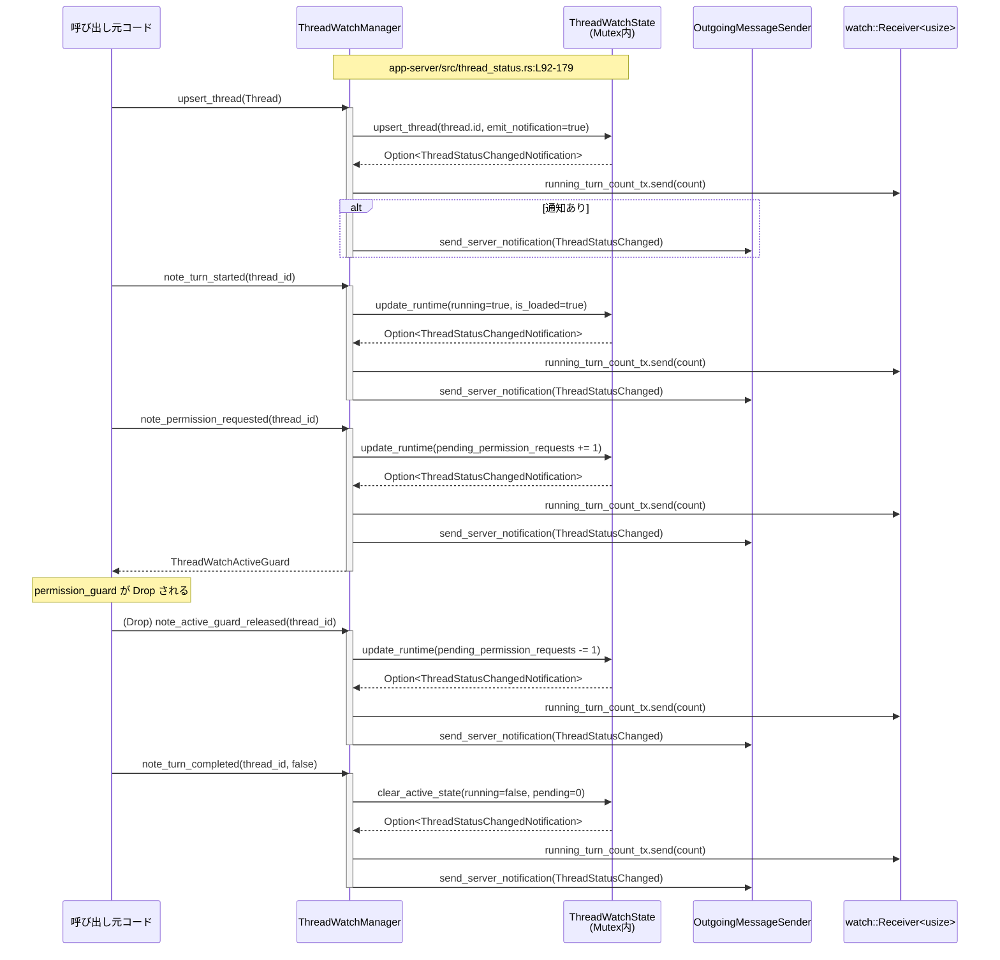

## app-server/src/thread_status.rs

---

## 0. ざっくり一言

スレッド（対話スレッド）の実行状態を集約管理し、  
「Active / Idle / NotLoaded / SystemError」などの `ThreadStatus` と、その変化通知を生成するモジュールです（app-server/src/thread_status.rs:L1-210）。

---

## 1. このモジュールの役割

### 1.1 概要

- このモジュールは、**アプリ内の各スレッドの実行状態を一元管理する**ために存在し、  
  次の情報を元に `ThreadStatus` を決定します（app-server/src/thread_status.rs:L1-210）。
  - スレッドがロードされているかどうか
  - 実行中のターン（turn）があるか
  - 権限承認待ち、ユーザー入力待ちのリクエスト数
  - システムエラーが発生しているか
- また、状態が変化した場合に `ThreadStatusChangedNotification` を発行し、  
  `OutgoingMessageSender` 経由で外部へ通知します（L57-87）。
- さらに、全スレッド合計で「実行中のターン数」を `tokio::sync::watch` でブロードキャストし、  
  他コンポーネントから監視できるようにします（L24-31, L89-105）。

※ 行番号は、このファイル断片の先頭行を 1 として概算しています。

### 1.2 アーキテクチャ内での位置づけ

主要な依存関係とデータの流れを簡略化した図です。



（図: app-server/src/thread_status.rs:L1-210 の依存関係）

- 他モジュールからは主に `ThreadWatchManager` が利用されます。
- `ThreadWatchManager` は `Arc<Mutex<ThreadWatchState>>` を通じて状態を書き換え、  
  必要に応じて `ThreadStatusChangedNotification` を組み立てます（L57-87, L146-179）。
- 通知は `OutgoingMessageSender::send_server_notification` を通じて外部に送信されます（L84-87）。
- 実行中ターン数は `watch::Sender<usize>` で配信され、複数の `watch::Receiver` が購読できます（L24-31, L89-105）。

### 1.3 設計上のポイント

- **責務分割**
  - `ThreadWatchManager`: 公開 API を提供するファサード。ロック取得・通知の発行・watch チャンネルの更新を担当（L24-131）。
  - `ThreadWatchState`: 実際の状態遷移ロジック（ステータス算出・通知要否判定）を担当（L183-236）。
  - `RuntimeFacts`: 個々のスレッドについての低レベル状態（フラグ・カウンタ）を保持（L238-244）。
- **状態管理**
  - `HashMap<String, RuntimeFacts>` にスレッド ID ごとの実行状態を保持（L181-186）。
  - 非存在スレッドに対する更新は `entry().or_default()` により動的にエントリを生成（L199-204）。
- **並行性**
  - 状態は `tokio::sync::Mutex` で保護された `ThreadWatchState` で一貫性を担保（L22-24, L146-154）。
  - 通知送出や watch 送信はロック解放後に行うことでロック保持時間を短くしています（L146-179）。
  - 権限/ユーザー入力待ちのカウンタは RAII ガード (`ThreadWatchActiveGuard`) により自動的に増減されます（L33-56, L114-132）。
- **エラー・安全性**
  - カウンタ操作は `saturating_add`/`saturating_sub` でオーバーフロー/アンダーフローを防止（L118-121, L171-178）。
  - watch チャンネル送信は `let _ = ...` で結果を破棄し、受信者がいない場合も問題なく動作（L158-160）。
  - `tokio::runtime::Handle::current()` を使うため、ガード生成は Tokio ランタイム上で行う前提（L42-53）。

---

## 2. 主要な機能一覧

このモジュールが提供する主な機能です（app-server/src/thread_status.rs:L24-179, L181-252）。

- スレッドの登録・削除:
  - `ThreadWatchManager::upsert_thread` / `upsert_thread_silently` / `remove_thread`
- スレッド状態の問い合わせ:
  - `ThreadWatchManager::loaded_status_for_thread`
  - `ThreadWatchManager::loaded_statuses_for_threads`
  - `resolve_thread_status`（実行中ターン情報との統合）
- 実行ターン/インタラクションの開始・終了トラッキング:
  - `note_turn_started` / `note_turn_completed` / `note_turn_interrupted`
  - `note_permission_requested` / `note_user_input_requested` と `ThreadWatchActiveGuard`
  - `note_thread_shutdown` / `note_system_error`
- 状態変化通知:
  - 内部で `ThreadStatusChangedNotification` を生成し、`OutgoingMessageSender` へ送出
- 実行中ターン数の監視:
  - `subscribe_running_turn_count` による `watch::Receiver<usize>` の配布
- 内部状態から `ThreadStatus` を決定するロジック:
  - `ThreadWatchState::status_for` / `loaded_status_for_thread`
  - `loaded_thread_status`（`RuntimeFacts` → `ThreadStatus` の変換）

---

## 3. 公開 API と詳細解説

### 3.1 型一覧（構造体・列挙体など）

| 名前 | 種別 | 役割 / 用途 | 定義位置 |
|------|------|-------------|----------|
| `ThreadWatchManager` | 構造体 | スレッド状態管理のファサード。状態更新 API と通知・watch をまとめて提供 | app-server/src/thread_status.rs:L24-31 |
| `ThreadWatchActiveGuard` | 構造体 | 権限要求・ユーザー入力要求の「保留中」カウンタを RAII で増減するガード | app-server/src/thread_status.rs:L33-56 |
| `ThreadWatchActiveGuardType` | enum | ガード種別を表す（Permission / UserInput） | app-server/src/thread_status.rs:L58-64 |
| `ThreadWatchState` | 構造体 | 全スレッドの内部状態 (`HashMap<thread_id, RuntimeFacts>`) を保持 | app-server/src/thread_status.rs:L181-186 |
| `RuntimeFacts` | 構造体 | 単一スレッドに関する低レベル状態フラグとカウンタ | app-server/src/thread_status.rs:L238-244 |

補助的な型:

- `ThreadStatus` / `ThreadActiveFlag` / `ThreadStatusChangedNotification` / `Thread` は外部クレート `codex_app_server_protocol` からインポートされています（L10-15, L260-316）。

### 3.2 重要関数の詳細

以下では、特に外部からの利用頻度が高そうな関数・メソッドと、コアロジックを 7 件選んで詳しく説明します。

#### 1. `ThreadWatchManager::upsert_thread(&self, thread: Thread)`

**概要**

- 指定された `Thread` を監視対象に登録または更新し、その結果としてスレッドのロード済み状態を `true` にします（L33-35, L92-99）。
- 状態が変化した場合は `ThreadStatusChangedNotification` を生成し、`OutgoingMessageSender` による外部通知を行います（L146-179）。

**引数**

| 引数名 | 型 | 説明 |
|--------|----|------|
| `thread` | `Thread` | 監視対象とするスレッド。`thread.id` がキーとして使用される |

**戻り値**

- `()`（非同期関数であり、副作用として内部状態と通知を更新するだけです）。

**内部処理の流れ**

1. クロージャで `thread.id` をキャプチャし、`state.upsert_thread(thread.id, /*emit_notification*/ true)` を呼び出す（L92-96）。
2. `mutate_and_publish` が `Mutex<ThreadWatchState>` をロックし、`upsert_thread` を実行（L146-154, L188-198）。
3. `ThreadWatchState::upsert_thread` は
   - 以前のステータス `previous_status` を計算（L188-191）。
   - 当該 `thread_id` の `RuntimeFacts` を取得（存在しなければ生成）し、`is_loaded = true` に設定（L192-196）。
   - 状態が変化していれば `ThreadStatusChangedNotification` を返す（L197-201）。
4. `mutate_and_publish` はロック解放後、`running_turn_count` を計算し `running_turn_count_tx.send` で送信（L155-160）。
5. 返された `ThreadStatusChangedNotification` があり、かつ `outgoing` が設定されていれば  
   `OutgoingMessageSender::send_server_notification(ServerNotification::ThreadStatusChanged(...))` を await する（L162-179）。

**Examples（使用例）**

スレッドを登録し、現在のステータスを取得する例です。

```rust
use std::sync::Arc;
use codex_app_server_protocol::{Thread, ThreadStatus};
use crate::thread_status::ThreadWatchManager; // 実際のパスに合わせて調整

#[tokio::main]
async fn main() {
    // スレッド状態マネージャを作成する              // 通知不要なら new() で十分
    let manager = ThreadWatchManager::new();             // app-server/src/thread_status.rs:L33-41

    // 仮の Thread オブジェクトを用意する             // id がキーとして使われる
    let thread = Thread {
        id: "thread-1".to_string(),
        status: ThreadStatus::NotLoaded,
        // ... 他のフィールドはテストコード test_thread と同様に埋める
        ..unimplemented!()
    };

    // スレッドを登録（初期通知あり）                 // 内部で is_loaded=true になる
    manager.upsert_thread(thread).await;

    // ステータスを問い合わせる                       // Idle のはず
    let status = manager.loaded_status_for_thread("thread-1").await;
    println!("status = {:?}", status);
}
```

**Errors / Panics**

- 関数自体は `Result` を返さず、通常はエラーになりません。
- ただし、内部で送信する `OutgoingMessageSender::send_server_notification` がエラーを返す可能性はありますが、ここではその戻り値は使用していません（L162-179）。
- `Mutex` ロック取得に失敗するといった状況は、Tokio の設計上通常は発生しません。

**Edge cases（エッジケース）**

- `thread.id` が空文字列や重複していても、そのままキーとして扱われます。入力検証は行っていません（L188-196）。
- すでに同じ `thread_id` が存在する場合、`RuntimeFacts` は再利用され `is_loaded` だけが確実に `true` になります。

**使用上の注意点**

- 最初の登録時に初回の `ThreadStatusChangedNotification` が発行されます。  
  初期通知を抑止したい場合は `upsert_thread_silently` を使用します（L101-109, L296-336 テスト参照）。
- `Thread` 本体の詳細状態（履歴や名前など）はここでは使われず、あくまで `id` だけがキーとして参照されます。

---

#### 2. `ThreadWatchManager::note_turn_started(&self, thread_id: &str)`

**概要**

- 指定スレッドで新しいターン（実行）が開始されたことを記録し、ステータスを `Active` に更新します（L107-114）。
- 同時に、システムエラー状態をクリアします。

**引数**

| 引数名 | 型 | 説明 |
|--------|----|------|
| `thread_id` | `&str` | 実行開始したスレッドの ID |

**戻り値**

- `()`（副作用のみ）。

**内部処理の流れ**

1. `update_runtime_for_thread` を呼び出し、指定 ID に対して `RuntimeFacts` を更新（L107-114, L173-179）。
2. 更新クロージャでは以下を行う（L108-113）。
   - `runtime.is_loaded = true;`
   - `runtime.running = true;`
   - `runtime.has_system_error = false;`
3. `update_runtime_for_thread` 内部で `ThreadWatchState::update_runtime` が実行され、  
   変更前・変更後のステータスを比較して通知が必要なら生成します（L199-205）。
4. `mutate_and_publish` が `running_turn_count` を再計算し、watch チャンネルと `OutgoingMessageSender` を更新します（L146-179）。

**Examples（使用例）**

```rust
// ターン開始前にスレッドを登録しておく                // Idle 状態になる
manager.upsert_thread(thread).await;

// ターン開始を記録                                    // status: Active { active_flags: [] }
manager.note_turn_started("thread-1").await;

// 状態を確認
let status = manager.loaded_status_for_thread("thread-1").await;
assert!(matches!(status, ThreadStatus::Active { .. }));
```

**Errors / Panics**

- 関数自体は `Result` を返さず、通常はエラーになりません。
- `thread_id` に対応するエントリが存在しない場合でも `entry().or_default()` で新たに `RuntimeFacts` を作ります（L199-204）。

**Edge cases**

- 事前に `upsert_thread` していない ID に対して呼び出した場合でも、  
  `RuntimeFacts` が作られ `is_loaded = true, running = true` となり `Active` として扱われます。
- `note_system_error` で `SystemError` に遷移したスレッドも、`note_turn_started` を呼ぶと `has_system_error` がクリアされ、  
  次の状態は `Active` になります（L107-114, L214-219, L334-365 テスト参照）。

**使用上の注意点**

- `note_turn_completed` / `note_turn_interrupted` を適切に呼ばないと `running` が `true` のままになり、  
  `running_turn_count` が過大にカウントされることに注意が必要です（L111-113, L302-333 テスト参照）。

---

#### 3. `ThreadWatchManager::note_permission_requested(&self, thread_id: &str) -> ThreadWatchActiveGuard`

**概要**

- スレッドがユーザーの「権限承認」を待っている状態になったことを記録し、  
  `ThreadActiveFlag::WaitingOnApproval` を付加するためのカウンタを 1 増やします（L124-131, L248-252）。
- 戻り値として RAII ガード `ThreadWatchActiveGuard` を返し、このガードが `Drop` されるとカウンタが自動的に 1 減ります（L33-56, L167-179）。

**引数**

| 引数名 | 型 | 説明 |
|--------|----|------|
| `thread_id` | `&str` | 権限要求を発行したスレッドの ID |

**戻り値**

- `ThreadWatchActiveGuard`  
  - ライフタイム中は「権限承認待ち」が 1 件増えた状態が維持されます。
  - `Drop` 時にカウンタをデクリメントする非同期タスクを spawn します（L47-56）。

**内部処理の流れ**

1. `note_pending_request(thread_id, ThreadWatchActiveGuardType::Permission)` を呼ぶ（L124-131）。
2. `note_pending_request` 内で `update_runtime_for_thread` を呼び出し、次の更新を行う（L133-144）。
   - `runtime.is_loaded = true;`
   - `pending_counter(runtime, Permission)` を取り出し（`pending_permission_requests` の可変参照）、
     `saturating_add(1)` で 1 増やす（L138-141）。
3. `update_runtime_for_thread` → `ThreadWatchState::update_runtime` → `mutate_and_publish` という流れで  
   状態変化判定と通知が行われる（L146-179, L199-205）。
4. 最後に `ThreadWatchActiveGuard::new(self.clone(), thread_id.to_string(), Permission)` を返す（L142-144, L37-53）。
5. ガードがスコープを抜けて `Drop` されると、保持している `tokio::runtime::Handle` 上で  
   `note_active_guard_released(thread_id, Permission)` を非同期タスクとして spawn する（L47-56）。
6. `note_active_guard_released` は `update_runtime_for_thread` を使い、該当カウンタを `saturating_sub(1)` する（L167-179）。

**Examples（使用例）**

権限承認待ち区間を RAII で管理する例です。

```rust
async fn run_with_permission(manager: &ThreadWatchManager, thread_id: &str) {
    // 権限要求を発行し、ガードを取得する           // active_flags に WaitingOnApproval が付く
    let permission_guard = manager.note_permission_requested(thread_id).await;

    // この間、ステータスは Active{active_flags: [WaitingOnApproval, ...] } となる
    // 実際の権限承認処理を行う
    // ...

    // permission_guard がスコープを抜ける or drop されると
    // pending_permission_requests が自動的に 1 減る
} // ここで Drop が走り、非同期でカウンタが更新される
```

**Errors / Panics**

- `note_permission_requested` 自体はエラーを返しません。
- `ThreadWatchActiveGuard::new` 内で `tokio::runtime::Handle::current()` を呼び出しているため、  
  **Tokio ランタイム外で呼ぶとパニックになる可能性があります**（Tokio の仕様に依存）（L42-48）。
- `Drop` 時に `handle.spawn` を呼び出しますが、ランタイムがすでに停止中の場合の挙動は Tokio に依存します（L47-56）。

**Edge cases**

- 同じスレッドで複数の権限ガードを並行して取得すると、その数だけカウンタが増えます。
- カウンタは `saturating_add` / `saturating_sub` を使用しており、  
  オーバーフロー/アンダーフローが起きても 0 または `u32::MAX` で止まります（L138-141, L171-178）。
- `remove_thread` 実行後にガードが Drop されると、新しい `RuntimeFacts` が再生成され `Idle` として復活する可能性があります（L193-204, L171-178）。  
  この挙動が意図通りかどうかはコードからは断定できませんが、**NotLoaded → Idle に戻る通知が発生しうる**ことに注意が必要です。

**使用上の注意点**

- 必ず RAII パターンを守る前提で設計されているため、ガードを `mem::forget` するなどして Drop を抑制すると、  
  カウンタが減らず永続的に「待ち」状態と判断されます。
- `ThreadWatchActiveGuard` の Drop は非同期タスクとして処理されるため、  
  状態反映にわずかな遅延が生じる可能性があります（テストではポーリングと `yield_now` で同期を取っています：L318-332）。

---

#### 4. `ThreadWatchManager::note_thread_shutdown(&self, thread_id: &str)`

**概要**

- 指定スレッドがシャットダウンしたことを記録し、ステータスを `NotLoaded` に戻します（L116-123, L214-219）。
- 実行中フラグや保留中カウンタをクリアします。

**引数**

| 引数名 | 型 | 説明 |
|--------|----|------|
| `thread_id` | `&str` | シャットダウンしたスレッドの ID |

**戻り値**

- `()`。

**内部処理の流れ**

1. `update_runtime_for_thread` を呼び、対象 `RuntimeFacts` に対して以下を設定（L116-123）。
   - `runtime.running = false;`
   - `runtime.pending_permission_requests = 0;`
   - `runtime.pending_user_input_requests = 0;`
   - `runtime.is_loaded = false;`
2. `ThreadWatchState::update_runtime` により以前のステータスと比較され、  
   `NotLoaded` への変化があれば通知が生成されます（L199-205）。
3. `mutate_and_publish` が通知と `running_turn_count` を外部に反映します（L146-179）。

**Examples（使用例）**

```rust
// 実行中スレッドをシャットダウンしたい場合
manager.note_turn_started(thread_id).await;
// ...
manager.note_thread_shutdown(thread_id).await;

// 状態は NotLoaded に戻る
let status = manager.loaded_status_for_thread(thread_id).await;
assert_eq!(status, ThreadStatus::NotLoaded);
```

**Edge cases**

- まだ一度も `upsert_thread` されていない ID に対して呼び出した場合でも、  
  `RuntimeFacts` が生成され `is_loaded = false` に設定されるため、結果ステータスは `NotLoaded` です（L199-205, L207-213）。
- `remove_thread` と異なり、`runtime_by_thread_id` からエントリを削除せず、`is_loaded=false` で残します（L192-196, L214-219）。

**使用上の注意点**

- スレッドを完全に「忘却」したい場合（監視マップからも除外したい場合）は `remove_thread` を使う必要があります（L203-212）。
- シャットダウン後に `note_turn_started` などを呼び出すと再びロード済みとして扱われます。

---

#### 5. `ThreadWatchManager::note_system_error(&self, thread_id: &str)`

**概要**

- 指定スレッドにシステムエラーが発生したことを記録し、ステータスを `SystemError` に変更します（L125-132, L214-219）。
- 実行中フラグおよび保留中カウンタはリセットされます。

**引数**

| 引数名 | 型 | 説明 |
|--------|----|------|
| `thread_id` | `&str` | システムエラーが発生したスレッドの ID |

**内部処理の流れ**

1. `update_runtime_for_thread` により以下の更新を行う（L125-132）。
   - `runtime.running = false;`
   - `runtime.pending_permission_requests = 0;`
   - `runtime.pending_user_input_requests = 0;`
   - `runtime.has_system_error = true;`
2. 結果として `loaded_thread_status` 内で
   - active_flags が空
   - `running == false`
   - `has_system_error == true`
   の条件を満たすため `ThreadStatus::SystemError` が返されます（L214-224）。
3. `mutate_and_publish` により通知が発行されます（L146-179）。

**Examples（使用例）**

```rust
manager.upsert_thread(thread).await;
manager.note_turn_started(thread_id).await;

// システムエラー発生
manager.note_system_error(thread_id).await;

let status = manager.loaded_status_for_thread(thread_id).await;
assert_eq!(status, ThreadStatus::SystemError);

// 次のターンが開始されるとエラーはクリアされる
manager.note_turn_started(thread_id).await;
let status = manager.loaded_status_for_thread(thread_id).await;
assert!(matches!(status, ThreadStatus::Active { .. }));
```

**Edge cases**

- `note_system_error` 呼び出し後も `is_loaded` は true のままなので、  
  ステータスは `NotLoaded` ではなく `SystemError` になります（L199-205, L214-224）。
- `note_turn_started` を呼ぶと `has_system_error` が false にされ、`Active` に戻ります（L107-113, L214-224）。

**使用上の注意点**

- SystemError 状態は **次のターン開始まで継続** します。クライアント側はこれを UI 等で明示する前提と考えられます（テスト: L334-365）。

---

#### 6. `ThreadWatchManager::subscribe_running_turn_count(&self) -> watch::Receiver<usize>`

**概要**

- 現在「実行中（`running == true`）」になっているスレッド数を監視するための `watch::Receiver<usize>` を返します（L101-105, L146-154）。
- `mutate_and_publish` が状態更新のたびに `running_turn_count` を再計算して送信します。

**戻り値**

- `tokio::sync::watch::Receiver<usize>`  
  - 初期値は 0。
  - `changed().await` 等で新しい値の到着を待つことができます。

**内部処理の流れ**

1. コンストラクタ `new` / `new_with_outgoing` で `watch::channel(0)` を生成し、  
   `running_turn_count_tx` を `ThreadWatchManager` に保持（L33-41）。
2. `subscribe_running_turn_count` 呼び出し時に `running_turn_count_tx.subscribe()` を返却（L101-105）。
3. `mutate_and_publish` は毎回 `runtime_by_thread_id.values().filter(|runtime| runtime.running).count()` でカウントし（L151-154）、  
   `running_turn_count_tx.send(running_turn_count)` を呼び出す（L155-160）。

**Examples（使用例）**

```rust
let manager = ThreadWatchManager::new();

// 実行中ターン数を監視するタスク
let mut rx = manager.subscribe_running_turn_count();
tokio::spawn(async move {
    while rx.changed().await.is_ok() {
        let count = *rx.borrow();
        println!("running turns = {}", count);
    }
});

// どこか別スレッドでターンを開始/終了
manager.note_turn_started("thread-1").await;
manager.note_turn_completed("thread-1", false).await;
```

**使用上の注意点**

- `watch` チャンネルは最新値だけを保持するため、複数の更新をまとめて受け取ることがあります。
- 初期値は 0 であり、まだ一度もターンが開始されていない状態でも値は取得できます。
- `send` 側のエラー（受信者が全てドロップされた場合）は `let _ =` で無視されます（L155-160）。

---

#### 7. `resolve_thread_status(status: ThreadStatus, has_in_progress_turn: bool) -> ThreadStatus`

**概要**

- 内部状態から算出された `ThreadStatus` と、「実際に進行中のターンが存在するか」の外部フラグを統合し、  
  クライアントに提示する最終的なステータスを決定します（L181-191）。

**引数**

| 引数名 | 型 | 説明 |
|--------|----|------|
| `status` | `ThreadStatus` | 内部状態から算出されたステータス |
| `has_in_progress_turn` | `bool` | 実行中ターンが存在するかどうかの情報（外部ソース） |

**戻り値**

- `ThreadStatus`  
  - `has_in_progress_turn == true` で、かつ `status` が `Idle` または `NotLoaded` の場合は、  
    `Active { active_flags: Vec::new() }` に上書きします。
  - それ以外の場合は `status` をそのまま返します。

**内部処理の流れ**

1. コメントで意図を明示：
   - 「Running-turn events が状態監視側より先に届く可能性があるので、その間は `Active` を優先する」（L181-187）。
2. `if has_in_progress_turn && matches!(status, ThreadStatus::Idle | ThreadStatus::NotLoaded)` の条件分岐（L187-189）。
3. 条件を満たす場合は `ThreadStatus::Active { active_flags: Vec::new() }` を返却、  
   そうでなければ元の `status` を返す（L188-191）。

**Examples（使用例）**

```rust
use codex_app_server_protocol::ThreadStatus;
use crate::thread_status::resolve_thread_status;

let internal = ThreadStatus::Idle;
let final_status = resolve_thread_status(internal, true);
// has_in_progress_turn が true のため Active に上書きされる
assert_eq!(final_status, ThreadStatus::Active { active_flags: Vec::new() });

let internal = ThreadStatus::SystemError;
let final_status = resolve_thread_status(internal, true);
// エラー状態はそのまま維持される
assert_eq!(final_status, ThreadStatus::SystemError);
```

**使用上の注意点**

- コメントにもある通り、「イベントの到着順序が前後する」ケース（例: 実行開始イベントが状態反映より先に届く）に対処するための補正関数です。
- `has_in_progress_turn` の真偽を誤って設定すると、ユーザーに誤った Active/Idle 表示を行う可能性があります。

---

### 3.3 その他の関数（概要）

モジュール内のその他の主な関数・メソッドを一覧でまとめます。

| 関数名 | 役割（1 行） | 定義位置 |
|--------|-------------|----------|
| `ThreadWatchManager::new` | 通知先未設定でマネージャを生成し、`running_turn_count` watch を初期化 | app-server/src/thread_status.rs:L33-41 |
| `ThreadWatchManager::new_with_outgoing` | `OutgoingMessageSender` を受け取り、通知有効なマネージャを生成 | app-server/src/thread_status.rs:L43-51 |
| `ThreadWatchManager::upsert_thread_silently` | 初期登録時の `ThreadStatusChangedNotification` を抑止してスレッドを登録 | app-server/src/thread_status.rs:L101-109 |
| `ThreadWatchManager::remove_thread` | `runtime_by_thread_id` からエントリを削除し、必要に応じて `NotLoaded` 通知を出す | app-server/src/thread_status.rs:L111-116, L203-212 |
| `ThreadWatchManager::loaded_status_for_thread` | 既知スレッドのステータスを取得。未知スレッドは `NotLoaded` として扱う | app-server/src/thread_status.rs:L118-122, L207-213 |
| `ThreadWatchManager::loaded_statuses_for_threads` | 複数 ID について `loaded_status_for_thread` をまとめて返す | app-server/src/thread_status.rs:L124-136 |
| `ThreadWatchManager::note_turn_completed` | ターン完了を記録し、`clear_active_state` で running / pending をリセット | app-server/src/thread_status.rs:L138-143 |
| `ThreadWatchManager::note_turn_interrupted` | ターン中断を記録し、`clear_active_state` を呼ぶ | app-server/src/thread_status.rs:L145-150 |
| `ThreadWatchManager::note_user_input_requested` | ユーザー入力待ちカウンタを増やすガードを返す | app-server/src/thread_status.rs:L152-159 |
| `ThreadWatchManager::clear_active_state` | `running` と pending カウンタを 0 にする内部ヘルパ | app-server/src/thread_status.rs:L160-168 |
| `ThreadWatchManager::note_pending_request` | Permission/UserInput 共通の pending カウンタ増加ロジック | app-server/src/thread_status.rs:L133-144 |
| `ThreadWatchManager::mutate_and_publish` | 状態変更と `running_turn_count` 再計算・通知送出を一元管理 | app-server/src/thread_status.rs:L146-179 |
| `ThreadWatchManager::note_active_guard_released` | ガード開放時に対応する pending カウンタを減らす | app-server/src/thread_status.rs:L167-179 |
| `ThreadWatchManager::update_runtime_for_thread` | 指定スレッドの `RuntimeFacts` を更新する共通ヘルパ | app-server/src/thread_status.rs:L173-179 |
| `ThreadWatchManager::pending_counter` | GuardType に応じて Permission / UserInput 用カウンタへの可変参照を返す | app-server/src/thread_status.rs:L181-188 |
| `ThreadWatchState::upsert_thread` | スレッドの存在を記録し、`is_loaded = true` にする | app-server/src/thread_status.rs:L188-198 |
| `ThreadWatchState::remove_thread` | マップからエントリを削除し、必要なら `NotLoaded` 通知を返す | app-server/src/thread_status.rs:L200-209 |
| `ThreadWatchState::update_runtime` | `RuntimeFacts` を更新し、状態変化があれば通知を返す | app-server/src/thread_status.rs:L199-205 |
| `ThreadWatchState::status_for` | `RuntimeFacts` から `ThreadStatus` を計算（ロード済みのみ） | app-server/src/thread_status.rs:L207-213 |
| `ThreadWatchState::loaded_status_for_thread` | 存在しなければ `NotLoaded` を返すラッパー | app-server/src/thread_status.rs:L215-219 |
| `ThreadWatchState::status_changed_notification` | 変化があった場合のみ `ThreadStatusChangedNotification` を作成 | app-server/src/thread_status.rs:L221-235 |
| `loaded_thread_status` | 単一 `RuntimeFacts` を `ThreadStatus` に変換するコアロジック | app-server/src/thread_status.rs:L238-252 |

---

## 4. データフロー

### 4.1 典型的な処理シナリオ

「インタラクティブなスレッドでターン開始 → 権限承認待ち → 承認 → ターン完了」という流れにおける  
データフローを sequence diagram で示します。



（図: app-server/src/thread_status.rs:L92-179 を中心とした処理フロー）

要点:

- すべての状態変更は `mutate_and_publish` 経由で行われ、  
  1. `Mutex` をロックして `ThreadWatchState` を変更  
  2. 実行中ターン数を再計算し watch に送信  
  3. 状態変化があれば `OutgoingMessageSender` で通知  
  という共通パターンで処理されます（L146-179）。
- RAII ガードの Drop も同じフローに乗るため、カウンタ変更が透過的に通知されます（L47-56, L167-179）。

---

## 5. 使い方（How to Use）

### 5.1 基本的な使用方法

代表的な利用フロー（スレッド登録 → ターン開始 → 権限/入力待ち → 完了）の例です。

```rust
use std::sync::Arc;
use codex_app_server_protocol::{Thread, ThreadStatus};
use crate::thread_status::ThreadWatchManager;

#[tokio::main]
async fn main() {
    // 1. マネージャの初期化                             // 通知が不要なら new() でOK
    let manager = ThreadWatchManager::new();                // L33-41

    // 2. 監視対象スレッドの登録                         // 初期状態は Idle
    let thread = Thread {
        id: "interactive-1".into(),
        status: ThreadStatus::NotLoaded,
        // 必要フィールドはテスト用 test_thread を参考に埋める（L365-405）
        ..unimplemented!()
    };
    manager.upsert_thread(thread).await;                    // L92-99

    // 3. ターン開始                                     // Active になる
    manager.note_turn_started("interactive-1").await;       // L107-114

    // 4. 権限承認待ち区間                               // WaitingOnApproval が付く
    let permission_guard = manager
        .note_permission_requested("interactive-1")
        .await;                                             // L124-131

    // 5. ユーザー入力待ち区間                           // WaitingOnUserInput も付く
    let user_input_guard = manager
        .note_user_input_requested("interactive-1")
        .await;                                             // L152-159

    // ステータス確認                                     // Active + 2つの active_flags
    let status = manager
        .loaded_status_for_thread("interactive-1")
        .await;                                             // L118-122
    println!("status = {:?}", status);

    // 6. 権限処理とユーザー入力処理が完了したらガードを解放
    drop(permission_guard);                                 // Drop -> カウンタ減少タスク spawn
    drop(user_input_guard);

    // 7. ターン完了                                     // running=false, pending=0 → Idle
    manager.note_turn_completed("interactive-1", false).await; // L138-143

    let status = manager
        .loaded_status_for_thread("interactive-1")
        .await;
    println!("status after turn = {:?}", status);           // Idle のはず
}
```

### 5.2 よくある使用パターン

- **通知付き / 通知なしの登録**
  - 初回登録で `thread/status/changed` を発行したくない場合は  
    `upsert_thread_silently` を使用します（L101-109, テスト L296-336）。
- **ランタイムの実行中ターン数監視**
  - サーバーの「忙しさ」を監視する用途で `subscribe_running_turn_count` を利用（L101-105, L302-333）。
- **SystemError ハンドリング**
  - ターン実行中に致命的エラーが発生したら `note_system_error` を呼び、  
    UI でエラー表示 → 次の `note_turn_started` でクリア、という流れ（L125-132, L334-365）。

### 5.3 よくある間違い

```rust
// 間違い例: Tokio ランタイム外で note_permission_requested を呼ぶ
fn bad() {
    let manager = ThreadWatchManager::new();
    // ここで tokio::runtime::Handle::current() がパニックする可能性がある
    let _guard = futures::executor::block_on(
        manager.note_permission_requested("thread-1")       // L124-131, L42-48
    );
}

// 正しい例: Tokio ランタイム内で呼び出す
#[tokio::main]
async fn good() {
    let manager = ThreadWatchManager::new();
    let _guard = manager.note_permission_requested("thread-1").await;
}
```

```rust
// 間違い例: ターン開始だけして完了を記録しない
async fn leak_running(manager: &ThreadWatchManager, thread_id: &str) {
    manager.note_turn_started(thread_id).await;
    // ... ここで関数終了（note_turn_completed を呼ばない）
    // running_turn_count が 1 のまま残り続ける
}

// 正しい例: 必ず完了/中断を記録する
async fn proper(manager: &ThreadWatchManager, thread_id: &str) {
    manager.note_turn_started(thread_id).await;
    // ... 実処理
    manager.note_turn_completed(thread_id, false).await;    // L138-143
}
```

### 5.4 使用上の注意点（まとめ）

- **Tokio ランタイム前提**
  - `ThreadWatchActiveGuard::new` が `tokio::runtime::Handle::current()` を呼ぶため、  
    `note_permission_requested` / `note_user_input_requested` は Tokio ランタイム上から実行する必要があります（L42-48）。
- **RAII ガードの Drop タイミング**
  - ガードの Drop によるカウンタ減少は別タスクで非同期に行われるため、  
    状態変化をすぐに前提せず、必要ならポーリングや `watch` で同期をとるべきです（L47-56, L318-332）。
- **remove_thread とガードの併用**
  - `remove_thread` によってエントリ削除後でも、後からガード Drop が走ると `RuntimeFacts` が再生成され `Idle` に戻り得ます（L200-209, L171-178）。  
    スレッド削除と未解放ガードの並行動作には注意が必要です。
- **エラー表示のクリア**
  - SystemError は `note_turn_started` でクリアされる設計のため、  
    エラー後にターンを開始しないとエラー状態が永続します（L107-113, L214-224）。

---

## 6. 変更の仕方（How to Modify）

### 6.1 新しい機能を追加する場合

例: 新しい「アクティブ状態フラグ」を追加したい場合。

1. **フラグの定義追加**
   - `codex_app_server_protocol::ThreadActiveFlag` に新しいバリアントを追加（このファイル外）。
2. **カウンタorフラグの追加**
   - `RuntimeFacts` に対応するフィールドを追加（例: `pending_network_io_requests: u32`）（L238-244）。
3. **状態更新 API の追加**
   - `ThreadWatchManager` に `note_network_io_requested` のようなメソッドを追加し、  
     `note_pending_request` と同様のパターンでカウンタ増減ロジックと RAII ガードを定義（L133-144, L181-188 を参考）。
4. **`loaded_thread_status` の拡張**
   - 新しいカウンタに応じて `active_flags` に新バリアントを push する処理を追加（L238-252）。
5. **テスト追加**
   - 既存テスト `status_updates_track_single_thread` などを参考に、新フラグの付与・解除が期待通りか確認するテストを `mod tests` に追加（L260-365）。

### 6.2 既存の機能を変更する場合

- **影響範囲の確認**
  - 対象関数の呼び出し元を検索し、テストコードも含めて実行パスを把握します（特に `note_*` 系）。
  - 状態遷移に関係するのは主に `RuntimeFacts` と `loaded_thread_status` なので、この 2 箇所の整合性を確認する必要があります（L238-252）。
- **契約（前提条件・返り値の意味）の保持**
  - `loaded_status_for_thread` が「未知スレッドは `NotLoaded`」という契約を変える場合、  
    それに依存している他コンポーネントがないか確認します（L207-213, L262-295 テスト）。
  - `resolve_thread_status` の「実行中ターンがあれば Active を優先」という仕様を変える場合は、  
    コメントとテスト `resolves_in_progress_turn_to_active_status` を更新する必要があります（L181-191, L322-343）。
- **テスト・通知との整合性**
  - 状態変化通知の条件は `status_changed_notification` に集約されているため、  
    通知タイミングを変える場合はここを更新し、`status_change_emits_notification` などのテストを調整します（L221-235, L336-365）。

---

## 7. 関連ファイル

### 7.1 関連ファイル一覧

| パス | 役割 / 関係 |
|------|------------|
| `codex_app_server_protocol::thread`（推定） | `Thread`, `ThreadStatus`, `ThreadActiveFlag`, `ThreadStatusChangedNotification` を定義し、本モジュールの状態表現に利用される（L10-15, L181-252） |
| `crate::outgoing_message` | `OutgoingMessageSender`, `OutgoingEnvelope`, `OutgoingMessage` を定義し、`ThreadStatusChangedNotification` を外部へブロードキャストする手段を提供（L1-9, L336-365 テスト） |
| `app-server/src/thread_status.rs`（本ファイル） | スレッド状態の集約管理と通知ロジックを実装 |

### 7.2 テストコード

本ファイル内の `mod tests` には、以下を検証するテストが含まれています（app-server/src/thread_status.rs:L260-405）。

- 未登録スレッドのデフォルト状態が `NotLoaded` になること（L262-271）。
- 非インタラクティブ / インタラクティブスレッドの状態遷移（`Active` → `Idle` → `NotLoaded`）が期待通りであること（L273-333）。
- `resolve_thread_status` が実行中ターンフラグを適切に反映すること（L322-343）。
- `SystemError` のライフサイクル（エラー発生 → 次ターン開始でクリア）が正しいこと（L334-365）。
- `silent_upsert` が初期通知を抑制すること（L365-336）。
- 通知が `OutgoingMessageSender` 経由で正しく送出されること（`status_change_emits_notification` テスト: L336-365）。

これらのテストは、状態遷移と通知契約の理解に有用な具体例となっています。
