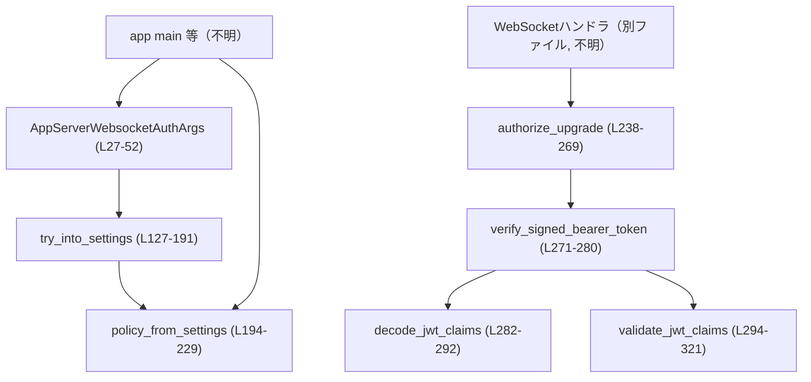
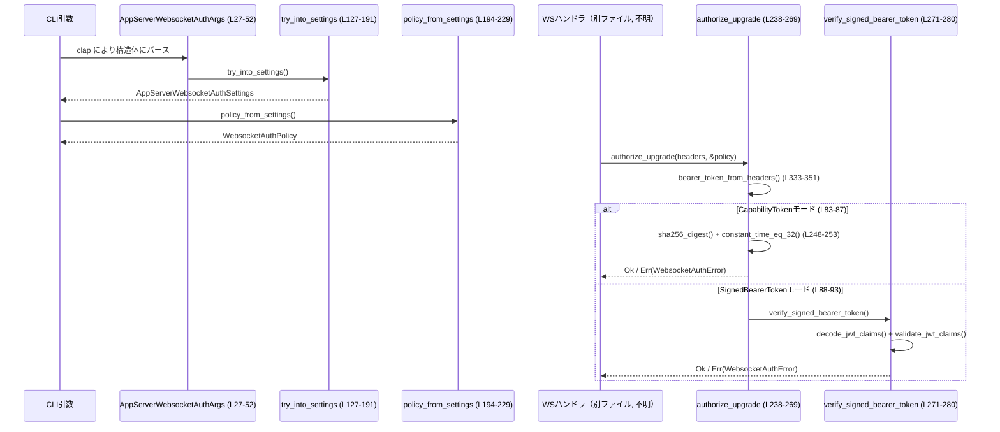

# app-server/src/transport/auth.rs

## 0. ざっくり一言

- WebSocket 用の認証設定（CLI 引数）と、その設定に基づく WebSocket 接続の認可（Authorization ヘッダ検証）を行うモジュールです。
- 「共有シークレット付き JWT（HS256）」または「任意文字列の capability token」の 2 モードをサポートします。

---

## 1. このモジュールの役割

### 1.1 概要

- このモジュールは **WebSocket リスナーの認証** を行うために存在し、次の機能を提供します。
  - CLI から受け取った WebSocket 認証関連フラグの整合性チェックと構造化設定への変換（`AppServerWebsocketAuthArgs::try_into_settings`）【auth.rs:L27-52, L127-191】
  - 設定から実行時ポリシー（トークンハッシュ・共有シークレット・検証パラメータ）への変換【auth.rs:L194-229】
  - 各 WebSocket 接続の Upgrade リクエストを Authorization ヘッダを元に認可する処理【auth.rs:L238-269】
  - JWT のデコードとクレーム検証により、署名付き Bearer Token を検証する処理【auth.rs:L271-321】

### 1.2 アーキテクチャ内での位置づけ

このモジュールは、以下のような位置づけと依存関係になっています（この図で `...?` とあるノードは、このチャンクには定義がない想定コンポーネントです）。



- 上位レイヤ（`AppMain` や WebSocket ハンドラ）は、このモジュールの型・関数だけを使って認証・認可を行う想定です（このチャンクには呼び出し側の実装はありません）。
- JWT 検証には `jsonwebtoken`、ハッシュと HMAC には `sha2` と `hmac`（テスト）を利用します【auth.rs:L9-15, L408-412】。
- HTTP ヘッダ処理には `axum::http` の `HeaderMap` および `StatusCode` を使用します【auth.rs:L2-4, L96-100】。

### 1.3 設計上のポイント

コードから読み取れる特徴をまとめます。

- **認証モードの明確な切り替え**
  - CLI 引数で `CapabilityToken` か `SignedBearerToken` を明示的に指定【auth.rs:L54-58】。
  - モードごとに利用可能なフラグが明確に検証され、不正な組み合わせは起動時エラーになります【auth.rs:L136-187】。

- **設定と実行時ポリシーの分離**
  - CLI 引数 → 設定構造体（`AppServerWebsocketAuthSettings`）→ 実行時ポリシー（`WebsocketAuthPolicy`）という 3 段階構造【auth.rs:L27-76, L78-81, L194-229】。
  - 起動時にファイルを読み、ハッシュや共有シークレットなどを準備しておき、リクエスト処理時は計算のみ行います。

- **エラーハンドリング**
  - CLI まわりは `anyhow::Result` を返し、エラーメッセージにコンテキスト文字列を追加【auth.rs:L127-191, L386-388】。
  - 認可処理は `WebsocketAuthError` を返し、HTTP ステータス（現在は常に 401）と短いメッセージを保持【auth.rs:L96-100, L396-400】。
  - ファイル I/O や設定変換は `io::Result` や `ErrorKind::InvalidInput` を用いて明示的にエラーを分類【auth.rs:L194-229, L353-364, L366-384】。

- **セキュリティ**
  - capability token は SHA-256 のハッシュを比較し、比較にはタイミング攻撃対策の `constant_time_eq_32` を利用【auth.rs:L85-87, L248-253】。
  - JWT はアルゴリズム HS256 を強制し、`alg=none` のようなトークンは拒否されることがテストで確認されています【auth.rs:L282-289, L561-580】。
  - 共有シークレットは最低 32 バイトという制約があり、短すぎる場合は設定エラー【auth.rs:L353-362】。

- **並行性**
  - 実行時ポリシーはイミュータブルなデータ（`Option`, `Vec<u8>`, `String` 等）を保持するだけで、内部で可変共有状態を持ちません【auth.rs:L78-93】。
  - 認可処理関数はすべて &参照で入力を受け取り、副作用はなく、複数スレッドから同時に呼び出しても安全に見えます（このチャンクでは同期原語は使われていません）。

---

## 2. 主要な機能一覧

モジュールが提供する主な機能です。

- WebSocket 認証 CLI フラグのパースと整合性検証（`AppServerWebsocketAuthArgs::try_into_settings`）【auth.rs:L27-52, L127-191】
- 設定から実行時 WebSocket 認証ポリシーへの変換（`policy_from_settings`）【auth.rs:L60-81, L194-229】
- 非ループバックアドレスに認証なしでバインドする場合の警告判定（`should_warn_about_unauthenticated_non_loopback_listener`）【auth.rs:L231-236】
- HTTP Upgrade リクエストの Authorization ヘッダに基づく接続許可／拒否（`authorize_upgrade`）【auth.rs:L238-269】
- JWT Bearer Token のデコードとクレーム検証（`verify_signed_bearer_token`, `decode_jwt_claims`, `validate_jwt_claims`）【auth.rs:L271-321】
- capability token / shared secret ファイルの読み込みとトリミング、値のバリデーション【auth.rs:L353-364, L366-384】
- シークレットの SHA-256 ハッシュ計算【auth.rs:L390-393】

---

## 3. 公開 API と詳細解説

### 3.1 型一覧（構造体・列挙体など）

公開・内部を含めた主要な型の一覧です。

| 名前 | 種別 | 可視性 | 役割 / 用途 | 定義位置 |
|------|------|--------|-------------|----------|
| `AppServerWebsocketAuthArgs` | 構造体 | `pub` | WebSocket 認証設定用の CLI フラグを保持し、`clap::Args` として利用される | auth.rs:L27-52 |
| `WebsocketAuthCliMode` | 列挙体 | `pub` | 認証モード（`CapabilityToken` / `SignedBearerToken`）を表す CLI の `value_enum` | auth.rs:L54-58 |
| `AppServerWebsocketAuthSettings` | 構造体 | `pub` | CLI から組み立てられた WebSocket 認証設定（有効な場合は `config` に格納） | auth.rs:L60-63 |
| `AppServerWebsocketAuthConfig` | 列挙体 | `pub` | `CapabilityToken` / `SignedBearerToken` 各モードごとの設定値（ファイルパスや issuer 等）を保持 | auth.rs:L65-76 |
| `WebsocketAuthPolicy` | 構造体 | `pub(crate)` | 実行時に利用される WebSocket 認証ポリシーで、現行モードと必要なシークレット/パラメータを保持 | auth.rs:L78-81 |
| `WebsocketAuthMode` | 列挙体 | `pub(crate)` | 実行時モード：capability token の SHA-256 ハッシュ or JWT 用共有シークレット＋検証パラメータを持つ | auth.rs:L83-93 |
| `WebsocketAuthError` | 構造体 | `pub(crate)` | 認可に失敗したときに使う HTTP ステータスと固定メッセージをまとめたエラー型 | auth.rs:L96-100 |
| `JwtClaims` | 構造体 | `private` | JWT の `exp`, `nbf`, `iss`, `aud` を表現するデシリアライズ用クレーム型 | auth.rs:L102-108 |
| `JwtAudienceClaim` | 列挙体 | `private` | `aud` クレームが単一文字列 or 文字列配列の両方を受け取るための補助型 (`#[serde(untagged)]`) | auth.rs:L110-115 |

`WebsocketAuthError` にはステータスコードとメッセージを返すメソッドがあります【auth.rs:L117-125】。

---

### 3.2 関数詳細（重要関数）

#### `AppServerWebsocketAuthArgs::try_into_settings(self) -> anyhow::Result<AppServerWebsocketAuthSettings>`【auth.rs:L127-191】

**概要**

- CLI 引数を `AppServerWebsocketAuthSettings` に変換しつつ、フラグの組み合わせが有効かどうかを検証します。
- 認証モードごとに許可されるオプションを厳密にチェックし、不正な組み合わせは起動時エラーにします。

**引数**

| 引数名 | 型 | 説明 |
|--------|----|------|
| `self` | `AppServerWebsocketAuthArgs` | clap によって構築された CLI 引数の集合 |

**戻り値**

- `Ok(AppServerWebsocketAuthSettings)`：有効な組み合わせの場合、対応する `AppServerWebsocketAuthConfig` を `config` に詰めて返します。
- `Err(anyhow::Error)`：フラグの不足や矛盾がある場合。エラーメッセージには具体的なフラグ名が含まれます【auth.rs:L143-145, L160-162, L182-184】。

**内部処理の流れ**

1. 文字列オプション `ws_issuer`, `ws_audience` の前後の空白を除去し、空文字列なら `None` にする `normalize` クロージャを定義【auth.rs:L129-134】。
2. `ws_auth` の値で `match` し、モードごとの処理を行う【auth.rs:L136-188】。
   - `CapabilityToken` モード:
     - JWT 関連のフラグ（`ws_shared_secret_file`, `ws_issuer`, `ws_audience`, `ws_max_clock_skew_seconds`）が指定されていないことを確認【auth.rs:L137-145】。
     - `ws_token_file` が必須であり、未指定であればエラー【auth.rs:L147-149】。
     - 絶対パスであることを `absolute_path_arg("--ws-token-file", token_file)` で検証【auth.rs:L150-152】。
   - `SignedBearerToken` モード:
     - `ws_token_file` が指定されていないことを確認【auth.rs:L154-158】。
     - `ws_shared_secret_file` が必須であることを検証【auth.rs:L160-162】。
     - 絶対パス変換と `issuer` / `audience` のトリミング、`max_clock_skew_seconds` のデフォルト適用（指定なければ 30 秒）【auth.rs:L163-173】。
   - `None`（モード未指定）:
     - いずれかの認証関連フラグが指定されていたらエラー【auth.rs:L175-185】。
3. 計算した `config` を `AppServerWebsocketAuthSettings { config }` として `Ok` で返す【auth.rs:L190-191】。

**Examples（使用例）**

CLI 引数から設定を得る基本的な例です（実際の clap の `Parser` はこのファイルには出てきませんが、利用イメージとして示します）。

```rust
use app_server::transport::auth::AppServerWebsocketAuthArgs; // 仮のパス

fn main() -> anyhow::Result<()> {
    // 実際には `clap` の Parser で構築されることが多い
    let args = AppServerWebsocketAuthArgs {
        ws_auth: Some(WebsocketAuthCliMode::SignedBearerToken), // JWT モード
        ws_shared_secret_file: Some(std::path::PathBuf::from("/etc/ws_shared_secret")), // 共有シークレットファイル
        ws_issuer: Some("issuer".to_string()),                  // iss クレーム期待値
        ws_audience: None,                                      // aud はチェックしない
        ws_token_file: None,
        ws_max_clock_skew_seconds: None,                        // デフォルト 30 秒
    };

    // CLI Args → Settings に変換
    let settings = args.try_into_settings()?;                   // 不整合があれば Err

    println!("{:?}", settings);                                 // 有効な設定が表示される
    Ok(())
}
```

**Errors / Panics**

- `CapabilityToken` なのに `ws_shared_secret_file` など JWT 用フラグが指定されているとエラー【auth.rs:L137-145】。
- `CapabilityToken` で `ws_token_file` が未指定の場合、エラー【auth.rs:L147-149】。
- `SignedBearerToken` で `ws_token_file` が指定されているとエラー【auth.rs:L155-158】。
- `SignedBearerToken` で `ws_shared_secret_file` が未指定の場合、エラー【auth.rs:L160-162】。
- モード未指定 (`ws_auth: None`) なのに関連フラグがある場合もエラー【auth.rs:L175-185】。
- Panic は使っておらず、すべて `anyhow::Error` として返却されます。

**Edge cases（エッジケース）**

- `ws_issuer` や `ws_audience` に空白のみが渡された場合、`None` 扱いになります【auth.rs:L129-134】。
- `ws_max_clock_skew_seconds` を指定しない場合、`DEFAULT_MAX_CLOCK_SKEW_SECONDS`（30 秒）が適用されます【auth.rs:L170-172, L23】。

**使用上の注意点**

- モードに対応しないフラグはすべてエラーになるため、新しいモードを追加する場合はこの関数の `match` に分岐を追加する必要があります。
- `absolute_path_arg` が絶対パスを要求するため、相対パスを渡すとエラーになります【auth.rs:L386-388】。

---

#### `policy_from_settings(settings: &AppServerWebsocketAuthSettings) -> io::Result<WebsocketAuthPolicy>`【auth.rs:L194-229】

**概要**

- 設定 (`AppServerWebsocketAuthSettings`) から、リクエスト処理時に利用する `WebsocketAuthPolicy` を構築します。
- ここで capability token や共有シークレットのファイルを読み込み、ハッシュやバイト列を準備します。

**引数**

| 引数名 | 型 | 説明 |
|--------|----|------|
| `settings` | `&AppServerWebsocketAuthSettings` | CLI から構築された WebSocket 認証設定 |

**戻り値**

- `Ok(WebsocketAuthPolicy)`：モードに応じた `WebsocketAuthMode` を `mode` に設定したポリシー【auth.rs:L218-223, L228-229】。
- `Err(io::Error)`：秘密ファイルの読み込み失敗や clock skew の i64 変換失敗など【auth.rs:L199-217】。

**内部処理の流れ**

1. `settings.config` を `match`【auth.rs:L197-226】。
   - `CapabilityToken`:
     - `token_file` から文字列を読み込み・トリミング（`read_trimmed_secret`）【auth.rs:L198-200, L366-384】。
     - SHA-256 ハッシュを計算し、`WebsocketAuthMode::CapabilityToken { token_sha256 }` を構築【auth.rs:L200-202, L390-393】。
   - `SignedBearerToken`:
     - `shared_secret_file` から文字列を読み込み・トリミング【auth.rs:L210】。
     - バイト列 (`Vec<u8>`) に変換【auth.rs:L210】。
     - シークレット長が 32 バイト以上であることを `validate_signed_bearer_secret` で検証【auth.rs:L211, L353-362】。
     - `max_clock_skew_seconds: u64` を `i64` に変換し、オーバーフローすれば `InvalidInput` エラー【auth.rs:L212-217】。
     - `WebsocketAuthMode::SignedBearerToken { ... }` を構築【auth.rs:L218-223】。
   - `None`:
     - 認証なしを表す `mode: None`【auth.rs:L225-226】。
2. `WebsocketAuthPolicy { mode }` を返す【auth.rs:L228-229】。

**Examples（使用例）**

```rust
use std::io;
use app_server::transport::auth::{AppServerWebsocketAuthSettings, policy_from_settings};

fn build_policy(settings: AppServerWebsocketAuthSettings) -> io::Result<()> {
    // Settings → Policy に変換
    let policy = policy_from_settings(&settings)?;          // ファイル読み込みや検証に失敗すると Err

    println!("{:?}", policy);                              // モードとシークレット情報が含まれる
    Ok(())
}
```

**Errors / Panics**

- シークレットファイルの読み込みに失敗した場合、`io::Error` としてラップされます【auth.rs:L366-375】。
- 読み込んだシークレットが空文字列の場合、`InvalidInput` エラー【auth.rs:L377-381】。
- JWT 共有シークレットが 32 バイト未満の場合、`InvalidInput` エラー【auth.rs:L353-362】。
- `max_clock_skew_seconds` が `i64` に収まらないほど大きいと `InvalidInput` エラー【auth.rs:L212-217】。
- Panic は使用していません。

**Edge cases**

- `settings.config` が `None` の場合、`mode: None` のポリシーが返り、認証なしとなります【auth.rs:L225-229】。
- capability token / shared secret ファイルに改行のみなどが書かれていると「空」とみなされエラーになります【auth.rs:L366-381】。

**使用上の注意点**

- この関数は I/O を行うため、本番環境では起動時などに一度だけ呼び、結果の `WebsocketAuthPolicy` を共有することが効率的です（コード自体にはキャッシュ機構はありません）。
- `WebsocketAuthPolicy` は clone 可能ではありませんが、単純なデータ構造なので `Arc<WebsocketAuthPolicy>` などで共有することが想定されます（このチャンクには実際の共有方法は現れません）。

---

#### `should_warn_about_unauthenticated_non_loopback_listener(bind_address: SocketAddr, policy: &WebsocketAuthPolicy) -> bool`【auth.rs:L231-236】

**概要**

- 非ループバックアドレス（例: `0.0.0.0`）にバインドしているのに認証ポリシーが未設定 (`mode: None`) の場合、警告を出すべきかどうかを判定します。

**引数**

| 引数名 | 型 | 説明 |
|--------|----|------|
| `bind_address` | `SocketAddr` | WebSocket サーバがバインドするアドレス |
| `policy` | `&WebsocketAuthPolicy` | 実行時認証ポリシー |

**戻り値**

- `true`: アドレスがループバックでなく、かつ `policy.mode.is_none()` の場合【auth.rs:L235】。
- `false`: それ以外（ループバックアドレス、または何らかの認証モードが有効）。

**内部処理の流れ**

- 単一式：`!bind_address.ip().is_loopback() && policy.mode.is_none()`【auth.rs:L235】。

**Examples（使用例）**

```rust
use std::net::SocketAddr;
use app_server::transport::auth::{WebsocketAuthPolicy, WebsocketAuthMode, should_warn_about_unauthenticated_non_loopback_listener};

fn check_warning() {
    let addr: SocketAddr = "0.0.0.0:8765".parse().unwrap(); // 全インターフェース
    let policy = WebsocketAuthPolicy { mode: None };        // 認証なし

    let warn = should_warn_about_unauthenticated_non_loopback_listener(addr, &policy);
    assert!(warn);                                          // 非ループバック + 認証なしなので true
}
```

**Errors / Panics**

- この関数はエラーを返さず、panic も利用しません。

**Edge cases**

- `127.0.0.1` のようなループバックアドレスでは、認証なしでも `false`（警告不要）になります【テスト: auth.rs:L424-443】。
- IPv6 のループバック (`::1`) も `is_loopback()` により適切に扱われます（標準ライブラリの仕様に依存）。

**使用上の注意点**

- 実際のログ出力や警告メッセージの表示はこの関数外で行う必要があります。
- 「警告するかどうか」の純粋なブール値のみを返すため、呼び出し側で一度だけ評価するか、環境に応じて制御する必要があります。

---

#### `authorize_upgrade(headers: &HeaderMap, policy: &WebsocketAuthPolicy) -> Result<(), WebsocketAuthError>`【auth.rs:L238-269】

**概要**

- WebSocket Upgrade リクエストの HTTP ヘッダから Bearer Token を取り出し、設定されたポリシーに基づいて接続を許可/拒否します。
- ポリシーが `None`（認証なし）の場合は常に許可します。

**引数**

| 引数名 | 型 | 説明 |
|--------|----|------|
| `headers` | `&HeaderMap` | Axum の HTTP ヘッダマップ |
| `policy` | `&WebsocketAuthPolicy` | 実行時認証ポリシー |

**戻り値**

- `Ok(())`: 認証不要、または Bearer Token が正しく検証された場合。
- `Err(WebsocketAuthError)`: トークンが欠けている、不正な形式、ハッシュ不一致、JWT 検証失敗などの場合。

**内部処理の流れ**

1. `policy.mode` が `None` の場合、すぐに `Ok(())` を返し、認証しない【auth.rs:L242-244】。
2. Authorization ヘッダから Bearer Token を取り出すため `bearer_token_from_headers` を呼ぶ【auth.rs:L246, L333-351】。
3. モードに応じた処理【auth.rs:L247-268】。
   - `CapabilityToken`:
     - リクエストのトークンから SHA-256 を計算【auth.rs:L249-250】。
     - 保存済みのハッシュと `constant_time_eq_32` で比較（タイミング攻撃対策）【auth.rs:L250-253】。
   - `SignedBearerToken`:
     - `verify_signed_bearer_token` で JWT を検証【auth.rs:L261-267, L271-280】。

**Examples（使用例）**

Axum ハンドラでの利用イメージです（ハンドラ自体はこのファイルにはありません）。

```rust
use axum::extract::State;
use axum::http::HeaderMap;
use axum::response::IntoResponse;
use axum::http::StatusCode;
use app_server::transport::auth::{WebsocketAuthPolicy, authorize_upgrade};

async fn ws_upgrade(
    State(policy): State<WebsocketAuthPolicy>,  // 事前に構築したポリシーを共有している想定
    headers: HeaderMap,                        // リクエストヘッダ
) -> impl IntoResponse {
    match authorize_upgrade(&headers, &policy) { // 認証/認可
        Ok(()) => {
            // ここで WebSocket への Upgrade を実行する（別モジュール）
            StatusCode::SWITCHING_PROTOCOLS
        }
        Err(err) => (err.status_code(), err.message()).into_response(),
    }
}
```

**Errors / Panics**

- エラーはすべて `WebsocketAuthError` として返され、ステータスコードは常に `StatusCode::UNAUTHORIZED`【auth.rs:L396-400】。
- Panic はありません（`expect`/`unwrap` は使われていません）。

**Edge cases**

- ポリシーが `None` の場合、Authorization ヘッダの有無に関わらず無条件に `Ok(())` となります【auth.rs:L242-244】。
- Capability token モードではトークン文字列そのものではなくハッシュを比較するため、サーバ側にプレーンなトークンは残りません【auth.rs:L200-202, L248-253】。

**使用上の注意点**

- `authorize_upgrade` は Token が無い/不正な場合も含めてすべて `WebsocketAuthError` で返し、理由をメッセージで区別しているため、呼び出し側でメッセージをクライアントに露出させるかどうかを検討する必要があります。
- ポリシーが `None` の場合に認証なしとなるため、運用で必ず認証を必須にしたい場合は、起動時に `should_warn_about_unauthenticated_non_loopback_listener` の結果をチェックしたり、別途構成で強制する必要があります。

---

#### `verify_signed_bearer_token(token: &str, shared_secret: &[u8], issuer: Option<&str>, audience: Option<&str>, max_clock_skew_seconds: i64) -> Result<(), WebsocketAuthError>`【auth.rs:L271-280】

**概要**

- 共有シークレットを用いて HS256 署名付き JWT Bearer Token を検証します。
- デコードとクレーム検証を分離し、失敗時には `UNAUTHORIZED` を返します。

**引数**

| 引数名 | 型 | 説明 |
|--------|----|------|
| `token` | `&str` | `Authorization: Bearer` から取り出した JWT 文字列 |
| `shared_secret` | `&[u8]` | HS256 用の共有シークレット |
| `issuer` | `Option<&str>` | `iss` クレームの期待値（`None` の場合チェックしない） |
| `audience` | `Option<&str>` | `aud` クレームの期待値（`None` の場合チェックしない） |
| `max_clock_skew_seconds` | `i64` | exp/nbf チェックに許容する時計のずれ |

**戻り値**

- `Ok(())`: JWT が正しく署名され、クレームも条件を満たす場合。
- `Err(WebsocketAuthError)`: デコード失敗・署名不正・クレーム不正のいずれか。

**内部処理の流れ**

1. `decode_jwt_claims(token, shared_secret)` で `JwtClaims` を取得【auth.rs:L278, L282-292】。
2. `validate_jwt_claims(&claims, issuer, audience, max_clock_skew_seconds)` で exp/nbf/iss/aud を検証【auth.rs:L279, L294-321】。

**Examples（使用例）**

```rust
use app_server::transport::auth::verify_signed_bearer_token;

fn verify_example(jwt: &str) {
    let shared_secret = b"0123456789abcdef0123456789abcdef"; // 32 バイトの共有シークレット

    let result = verify_signed_bearer_token(
        jwt,
        shared_secret,
        Some("issuer"),      // iss チェック
        Some("audience"),    // aud チェック
        30,                  // 30秒の時計ずれを許容
    );

    assert!(result.is_ok() || result.is_err()); // 実際の挙動はトークンに依存
}
```

**Errors / Panics**

- `decode_jwt_claims` 内で `jsonwebtoken::decode` が失敗した場合、`invalid websocket jwt` メッセージ付き `WebsocketAuthError` になります【auth.rs:L289-291】。
- クレームチェックに失敗した場合も、それぞれ専用メッセージ（expired / issuer mismatch / audience mismatch など）で `WebsocketAuthError` です【auth.rs:L301-317】。

**Edge cases**

- 署名を改ざんした JWT はテストで拒否されることが確認されています【auth.rs:L500-517】。
- `alg: none` かつ署名無しのトークンも拒否されるテストがあります【auth.rs:L561-580】。

**使用上の注意点**

- この関数単体は JWT を decode & validate するだけなので、実際には `authorize_upgrade` を通じて呼び出すのが前提になっています。
- `max_clock_skew_seconds` はすでに `i64` に変換済み（`policy_from_settings` 側）で渡される前提です【auth.rs:L212-217】。

---

#### `validate_jwt_claims(claims: &JwtClaims, issuer: Option<&str>, audience: Option<&str>, max_clock_skew_seconds: i64) -> Result<(), WebsocketAuthError>`【auth.rs:L294-321】

**概要**

- 事前にデコードされた JWT クレームに対して、有効期限や発行者などをチェックします。
- 時計のずれを考慮した exp / nbf チェックを手動で行います。

**引数**

| 引数名 | 型 | 説明 |
|--------|----|------|
| `claims` | `&JwtClaims` | JWT から読み取ったクレーム |
| `issuer` | `Option<&str>` | 期待する `iss`、`None` ならチェックしない |
| `audience` | `Option<&str>` | 期待する `aud`、`None` ならチェックしない |
| `max_clock_skew_seconds` | `i64` | 時刻ずれ許容秒数 |

**戻り値**

- `Ok(())`: すべてのチェックをパスした場合。
- `Err(WebsocketAuthError)`: exp / nbf / iss / aud のいずれかが条件を満たさない場合。

**内部処理の流れ**

1. 現在時刻 `now` を UNIX 秒で取得【auth.rs:L300】。
2. `now > claims.exp.saturating_add(max_clock_skew_seconds)` なら「期限切れ」【auth.rs:L301-302】。
3. `nbf` が存在し、`now < nbf.saturating_sub(max_clock_skew_seconds)` なら「まだ有効でない」【auth.rs:L304-307】。
4. `issuer` が Some で `claims.iss` と一致しなければ「issuer mismatch」【auth.rs:L309-312】。
5. `audience` が Some で、`audience_matches(claims.aud.as_ref(), expected)` が false なら「audience mismatch」【auth.rs:L314-317】。
6. いずれも問題なければ `Ok(())`【auth.rs:L320】。

**Errors / Panics**

- 返されるエラーメッセージはそれぞれ `"expired websocket jwt"`, `"websocket jwt is not valid yet"`, `"issuer mismatch"`, `"audience mismatch"` と固定文字列です【auth.rs:L301-317】。
- Panic はありません。

**Edge cases**

- `exp` のオーバーフローを避けるために `saturating_add` を利用しています【auth.rs:L301】。
- `nbf` チェックも `saturating_sub` を使い、負の方向へのオーバーフローを避けています【auth.rs:L304-305】。
- `issuer` / `audience` の期待値が `None` の場合、該当クレームは一切チェックされません（claim 側が `None` でも許容されます）。

**使用上の注意点**

- `JwtClaims` の `exp` は非 `Option` であり、JWT に `exp` が含まれていない場合はデコード段階で失敗します（テストで確認済み）【auth.rs:L102-105, L582-599】。
- `audience_matches` は `aud` が配列でも単一文字列でも扱えるように設計されています【auth.rs:L323-328, L541-558】。

---

#### `bearer_token_from_headers(headers: &HeaderMap) -> Result<&str, WebsocketAuthError>`【auth.rs:L333-351】

**概要**

- HTTP ヘッダから `Authorization: Bearer <token>` ヘッダを取り出し、トークン文字列を返します。
- ヘッダの欠如・不正形式・スキーム不一致・空トークンなどを明示的にチェックします。

**引数**

| 引数名 | 型 | 説明 |
|--------|----|------|
| `headers` | `&HeaderMap` | Axum の HTTP ヘッダマップ |

**戻り値**

- `Ok(&str)`: 正しくパースされた Bearer Token（trim 後で非空）【auth.rs:L346-350】。
- `Err(WebsocketAuthError)`: ヘッダ無し/非 UTF-8/形式エラーなど。

**内部処理の流れ**

1. `headers.get(AUTHORIZATION)` で Authorization ヘッダを取得。無ければ `"missing websocket bearer token"` で Unauthorized【auth.rs:L334-336】。
2. `to_str()` で UTF-8 文字列化。失敗したら `"invalid authorization header"` エラー【auth.rs:L337-339】。
3. `' '` で一度だけ分割し、`(scheme, token)` を取得。失敗したら同じく `"invalid authorization header"`【auth.rs:L340-342】。
4. `scheme.eq_ignore_ascii_case("Bearer")` でスキームが Bearer か確認【auth.rs:L343-345】。
5. `token.trim()` で前後の空白を除去し、空であればエラー【auth.rs:L346-348】。
6. トークン文字列を `Ok` で返す【auth.rs:L350】。

**Examples（使用例）**

```rust
use axum::http::{HeaderMap, header::AUTHORIZATION};
use app_server::transport::auth::bearer_token_from_headers;

fn header_example() {
    let mut headers = HeaderMap::new();                                  // 空のヘッダマップ
    headers.insert(AUTHORIZATION, "Bearer abc.def.ghi".parse().unwrap()); // JWT 風トークン

    let token = bearer_token_from_headers(&headers).unwrap();            // &str として取得
    assert_eq!(token, "abc.def.ghi");
}
```

**Errors / Panics**

- ヘッダが無い場合: `"missing websocket bearer token"`【auth.rs:L334-336】。
- 非 UTF-8 のヘッダ値: `"invalid authorization header"`【auth.rs:L337-339】。
- `"Bearer <token>"` 形式でない場合（スペース無しなど）: `"invalid authorization header"`【auth.rs:L340-342】。
- スキームが `Bearer` でない場合: 同上【auth.rs:L343-345】。
- トークン部が空文字列になる場合: 同上【auth.rs:L346-348】。

**Edge cases**

- `"Bearer    token"` のようにスペースが複数あっても、最初のスペースで分割した残りを `trim()` するため、問題なく扱えます【auth.rs:L340-348】。
- スキーム名の大文字小文字は無視されます（`bearer`, `BEARER` なども許可）【auth.rs:L343】。

**使用上の注意点**

- この関数はヘッダのパースのみを担当し、トークン自体の検証は行いません。検証は必ず `authorize_upgrade` / `verify_signed_bearer_token` で行う必要があります。
- エラーメッセージは固定文字列であり、ヘッダの具体的な内容は含まれません。

---

### 3.3 その他の関数

補助的な関数・内部関数の一覧です。

| 関数名 | 役割（1 行） | 定義位置 |
|--------|--------------|----------|
| `WebsocketAuthError::status_code(&self)` | HTTP ステータスコード（401）を返すゲッター | auth.rs:L117-121 |
| `WebsocketAuthError::message(&self)` | エラーメッセージ文字列を返すゲッター | auth.rs:L122-124 |
| `decode_jwt_claims(token, shared_secret)` | HS256 用 `Validation` 設定で JWT をデコードし `JwtClaims` を返す | auth.rs:L282-292 |
| `audience_matches(audience, expected_audience)` | `aud` クレームが単一/配列いずれでも期待値と一致するか判定 | auth.rs:L323-331 |
| `validate_signed_bearer_secret(path, shared_secret)` | 共有シークレットが 32 バイト以上であることを静的に検証 | auth.rs:L353-364 |
| `read_trimmed_secret(path)` | ファイルから文字列を読み取りトリミングし、空ならエラーにする | auth.rs:L366-384 |
| `absolute_path_arg(flag_name, path)` | 相対パスでないかをチェックし `AbsolutePathBuf` に変換 | auth.rs:L386-388 |
| `sha256_digest(input)` | 入力バイト列の SHA-256 ハッシュを `[u8; 32]` として返す | auth.rs:L390-393 |
| `unauthorized(message)` | `StatusCode::UNAUTHORIZED` とメッセージを持つ `WebsocketAuthError` を構築 | auth.rs:L396-400 |
| テスト用 `signed_token(shared_secret, claims)` | HS256 で署名された JWT を生成するテスト補助関数 | auth.rs:L414-422 |

---

## 4. データフロー

WebSocket 認証に関する典型的なデータフローを示します。

1. プロセス起動時に CLI 引数から `AppServerWebsocketAuthArgs` が構築され、`try_into_settings` により `AppServerWebsocketAuthSettings` へ変換されます【auth.rs:L27-52, L127-191】。
2. `policy_from_settings` によりシークレットファイルが読み込まれ、`WebsocketAuthPolicy` が構築されます【auth.rs:L194-229】。
3. 各 WebSocket Upgrade リクエストごとに `authorize_upgrade` が呼ばれ、Authorization ヘッダとポリシーから接続可否が判定されます【auth.rs:L238-269】。



---

## 5. 使い方（How to Use）

### 5.1 基本的な使用方法

起動時に CLI から設定を取り込み、ポリシーを作成し、それを WebSocket ハンドラで利用する一連の流れの例です（ハンドラの実装はこのファイルにはありません）。

```rust
use std::net::SocketAddr;
use std::sync::Arc;
use axum::{Router, extract::State};
use axum::http::{HeaderMap, StatusCode};
use app_server::transport::auth::{
    AppServerWebsocketAuthArgs,
    AppServerWebsocketAuthSettings,
    WebsocketAuthPolicy,
    policy_from_settings,
    authorize_upgrade,
    should_warn_about_unauthenticated_non_loopback_listener,
};

#[tokio::main]
async fn main() -> anyhow::Result<()> {
    // 1. CLI から Args を構築する（実際には clap の Parser を使う想定）
    let args = AppServerWebsocketAuthArgs::default();             // ここでは簡略化のためデフォルト

    // 2. Args → Settings
    let settings: AppServerWebsocketAuthSettings = args.try_into_settings()?; // 不整合があれば Err

    // 3. Settings → Policy（ファイル読み込みなど）
    let policy: WebsocketAuthPolicy = policy_from_settings(&settings)?;       // I/O エラーがあれば Err

    // 4. バインドアドレスに対する警告判定
    let addr: SocketAddr = "0.0.0.0:8765".parse().unwrap();      // 例として 0.0.0.0 で待受
    if should_warn_about_unauthenticated_non_loopback_listener(addr, &policy) {
        eprintln!("warning: websocket listener without auth on non-loopback address");
    }

    // 5. ポリシーを共有しつつ WebSocket ハンドラへ渡す
    let shared_policy = Arc::new(policy);

    let app = Router::new().route(
        "/ws",
        axum::routing::get({
            let shared_policy = shared_policy.clone();
            move |headers: HeaderMap| {
                let policy = shared_policy.clone();
                async move {
                    match authorize_upgrade(&headers, &policy) {        // 認証/認可を実行
                        Ok(()) => StatusCode::SWITCHING_PROTOCOLS,      // 実際はここで WebSocket を開始
                        Err(err) => (err.status_code(), err.message()).into(),
                    }
                }
            }
        }),
    );

    axum::Server::bind(&addr).serve(app.into_make_service()).await?;    // HTTP サーバ起動
    Ok(())
}
```

> 上記例のルータ構成や `Arc` の使い方は、このファイルの外の一般的な Axum の利用パターンに基づくイメージであり、このチャンクには実装が現れません。

### 5.2 よくある使用パターン

1. **認証なしでローカル開発**
   - `ws_auth` を指定せず、関連フラグも指定しない。
   - `policy_from_settings` により `mode: None` の `WebsocketAuthPolicy` が構築され、`authorize_upgrade` は常に `Ok(())` を返します【auth.rs:L225-229, L242-244】。
   - `should_warn_about_unauthenticated_non_loopback_listener` を使うことで、誤って公開環境で認証なしにしてしまった場合に警告できます【auth.rs:L231-236, L424-443】。

2. **capability token モード**
   - `--ws-auth capability-token` と `--ws-token-file /path/to/token` を指定（その他 JWT 関連フラグは未指定）【auth.rs:L136-152】。
   - トークンファイルに入れた文字列をトリミングし、SHA-256 のハッシュを `WebsocketAuthMode::CapabilityToken::token_sha256` として保持【auth.rs:L198-202】。
   - クライアントは `Authorization: Bearer <その文字列>` を送信し、サーバ側はハッシュを比較【auth.rs:L248-253】。

3. **署名付き Bearer Token (JWT) モード**
   - `--ws-auth signed-bearer-token --ws-shared-secret-file /path/to/secret` を必須指定【auth.rs:L154-167】。
   - 必要に応じて `--ws-issuer`, `--ws-audience`, `--ws-max-clock-skew-seconds` を指定。
   - トークンは HS256 で署名された JWT を期待し、`exp`/`nbf`/`iss`/`aud` を手動検証します【auth.rs:L282-321】。

### 5.3 よくある間違い

**モードとフラグの不整合**

```rust
// 間違い例: JWT 用フラグを指定しているのに ws_auth が capability-token
let args = AppServerWebsocketAuthArgs {
    ws_auth: Some(WebsocketAuthCliMode::CapabilityToken),
    ws_shared_secret_file: Some(PathBuf::from("/tmp/secret")), // capability-token では無効
    ..Default::default()
};
let _ = args.try_into_settings().unwrap(); // ← panic: 実際には Err になる
```

```rust
// 正しい例: capability-token モードでは token_file のみ指定
let args = AppServerWebsocketAuthArgs {
    ws_auth: Some(WebsocketAuthCliMode::CapabilityToken),
    ws_token_file: Some(PathBuf::from("/tmp/token")), // token ファイル
    ..Default::default()
};
let settings = args.try_into_settings().expect("valid capability-token args");
```

**Authorization ヘッダの形式ミス**

```rust
// 間違い例: "Token ..." というスキーム名
headers.insert(AUTHORIZATION, "Token abc.def.ghi".parse().unwrap());
let _ = bearer_token_from_headers(&headers).unwrap(); // ← Err になる
```

```rust
// 正しい例: "Bearer ..." スキーム名（大文字小文字は問わない）
headers.insert(AUTHORIZATION, "Bearer abc.def.ghi".parse().unwrap());
let token = bearer_token_from_headers(&headers).unwrap();
```

### 5.4 使用上の注意点（まとめ）

- **前提条件**
  - capability token / shared secret ファイルは絶対パスで指定する必要があります【auth.rs:L386-388】。
  - ファイルの中身は空文字列であってはいけません【auth.rs:L366-383】。
  - JWT モードでは共有シークレットは最低 32 バイト必要です【auth.rs:L353-362】。

- **セキュリティ面**
  - capability token モードではトークンのハッシュのみを保持し、平文トークンは保持しません【auth.rs:L198-202】。
  - トークンの比較には `constant_time_eq_32` を使用し、タイミング攻撃のリスクを軽減しています【auth.rs:L248-251】。
  - JWT 署名は HS256 に固定されており、`alg=none` トークンを拒否するテストがあります【auth.rs:L282-289, L561-580】。

- **エラーと契約（Contracts）**
  - モードごとの有効なフラグの組み合わせは `try_into_settings` 内で厳密に検証されるため、新しいフラグを追加する際はこの契約を壊さないよう注意が必要です【auth.rs:L136-187】。
  - `WebsocketAuthError` はステータスコードと短いメッセージのみを持ち、詳細な内部エラー情報は含みません【auth.rs:L96-100, L396-400】。

- **並行性と性能**
  - 認可処理 (`authorize_upgrade` 以下) は I/O を行わず計算のみで、副作用もありません【auth.rs:L238-321】。
  - シークレットファイルの読み込みは `policy_from_settings` に集約されているため、通常は起動時に一度だけ行う構造になっています【auth.rs:L194-229】。
  - JWT 検証はリクエストあたり 1 回の HMAC 検証とクレームチェックであり、一般的な負荷ではボトルネックになりにくい実装です（このチャンクにはベンチマーク情報はありません）。

- **テスト**
  - 認証警告、CLI 引数検証、JWT の tampering / alg=none / audience 配列 / exp 欠如 / 短いシークレットなど代表的なパスに対するテストが含まれています【auth.rs:L424-611】。
  - JWT 関連のエッジケースはテストでかなり網羅されているため、仕様変更時はこれらテストの更新が必要です。

---

## 6. 変更の仕方（How to Modify）

### 6.1 新しい機能を追加する場合

例として、「新しい WebSocket 認証モード」を追加する場合のステップを示します。

1. **CLI モードの追加**
   - `WebsocketAuthCliMode` に新しいバリアントを追加【auth.rs:L54-58】。
   - `AppServerWebsocketAuthArgs` に必要なフラグフィールドを追加【auth.rs:L27-51】。

2. **設定構造体への反映**
   - `AppServerWebsocketAuthConfig` に新モード用のバリアントを追加し、必要な設定項目をフィールドとして定義【auth.rs:L65-76】。
   - `AppServerWebsocketAuthArgs::try_into_settings` の `match self.ws_auth` に新しい分岐を追加し、フラグ整合性チェックと `AppServerWebsocketAuthConfig` の構築ロジックを書き足します【auth.rs:L136-188】。

3. **実行時ポリシーの対応**
   - `WebsocketAuthMode` に新モード用バリアントを追加【auth.rs:L83-93】。
   - `policy_from_settings` の `match settings.config` に新バリアントの生成ロジックを追加し、必要なら秘密ファイルの読み込みやバリデーション処理を実装します【auth.rs:L197-226】。

4. **認可処理の拡張**
   - `authorize_upgrade` の `match mode` に新バリアントの検証ロジックを追加します【auth.rs:L247-268】。
   - 必要であれば新しい検証関数を追加（`verify_*` 系）し、 `WebsocketAuthError` に適切なエラーメッセージを用意します【auth.rs:L396-400】。

5. **テストの追加**
   - `mod tests` に新モードに対する正常系・異常系のテストを追加し、既存テストが新モードの追加で失敗しないことを確認します【auth.rs:L403-611】。

### 6.2 既存の機能を変更する場合

- **CLI 契約の変更**
  - 例えば「SignedBearerToken モードで `ws_token_file` も許可したい」などの変更を行う場合、`try_into_settings` 内の `bail!` 条件を変更する必要があります【auth.rs:L155-158】。
  - 認証モードごとのフラグ意味が変わるため、すべての呼び出し側とドキュメント、テスト（`capability_token_args_require_token_file` など）を確認します【auth.rs:L445-471】。

- **JWT 検証仕様の変更**
  - 例えば `aud` を必須にしたい場合、`validate_jwt_claims` 内のロジックを変更し、`audience: None` でもエラーにするなどの契約変更が必要です【auth.rs:L314-317】。
  - `signed_bearer_token_verification_accepts_multiple_audiences` など既存テストを見直し、新仕様に沿う形で更新します【auth.rs:L541-558】。

- **エッジケースの扱い**
  - clock skew のデフォルト値を変更する場合は `DEFAULT_MAX_CLOCK_SKEW_SECONDS` 定数と、それに依存するテストを更新します【auth.rs:L23, L473-497】。
  - シークレット長制約やファイル読み込みエラーメッセージを変更する場合は、`validate_signed_bearer_secret` と `read_trimmed_secret` とそれらのテストを合わせて修正します【auth.rs:L353-364, L366-384, L603-611】。

---

## 7. 関連ファイル

このチャンクから直接参照されている他モジュール・クレートと、その役割をまとめます。

| パス / クレート | 役割 / 関係 |
|-----------------|------------|
| `axum::http` | `HeaderMap` と `StatusCode` を提供し、HTTP ヘッダ処理とレスポンスコードの設定に使用されます【auth.rs:L2-4, L96-100】。 |
| `clap` | `Args`, `ValueEnum` を通じて CLI 引数の定義・パースに使用されています【auth.rs:L5-6, L27-31, L54-58】。 |
| `codex_utils_absolute_path::AbsolutePathBuf` | CLI から渡されたパスが絶対パスであることを保証するために用いられます【auth.rs:L7, L65-72, L386-388】。 |
| `jsonwebtoken` | HS256 の JWT デコード (`decode`) と検証設定 (`Validation`, `DecodingKey`) を提供します【auth.rs:L9-12, L282-292】。 |
| `sha2`, `constant_time_eq` | SHA-256 ハッシュ計算とハッシュのタイミング安全な比較に利用されます【auth.rs:L14-15, L248-253, L390-393】。 |
| `time::OffsetDateTime` | 現在時刻を取得し JWT の `exp`/`nbf` を検証するために使用されます【auth.rs:L21, L300-301, L505-505, L526-527, L547-547, L565-565】。 |
| WebSocket ハンドラやサーバ起動部 | `WebsocketAuthPolicy` と `authorize_upgrade` を実際に利用するコンポーネントですが、このチャンクには定義が現れません（別ファイル）。 |

このファイル単体で CLI 引数のバリデーションから WebSocket 認証のコアロジックまでを完結しており、上位の HTTP サーバ実装はこれら公開 API に依存する形で認証機能を組み込む構造になっています。
