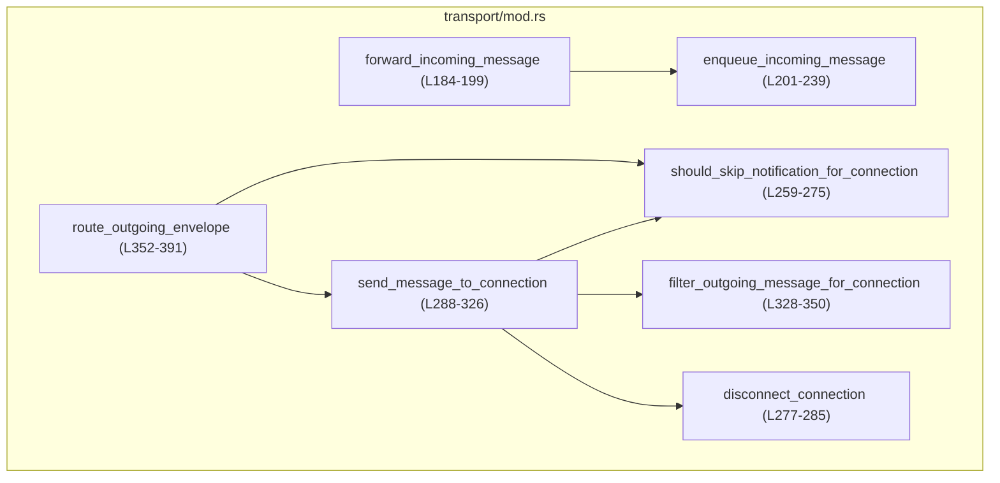
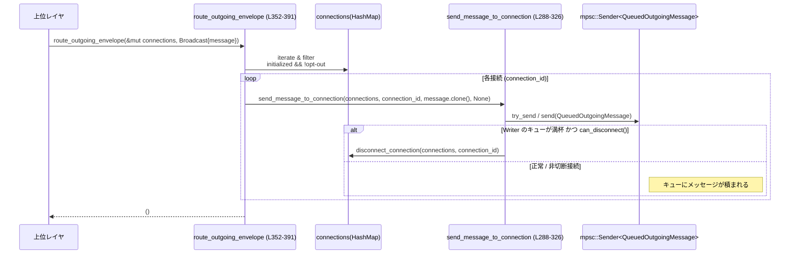

# app-server/src/transport/mod.rs コード解説

## 0. ざっくり一言

- JSON-RPC ベースの「アプリサーバ ↔ クライアント」間通信の **トランスポート層** をまとめるモジュールです。  
- 接続のオープン/クローズ・メッセージの入出力・過負荷時の制御・通知のフィルタリングなどを、プロトコル非依存な形で扱います。

---

## 1. このモジュールの役割

### 1.1 概要

このモジュールは、アプリサーバの「トランスポート層」を構成し、次のような問題を扱います。

- CLI の `--listen` 指定から、STDIO / WebSocket / Off の 3 種類のトランスポート設定を解釈する  
  (`AppServerTransport` / `AppServerTransportParseError`、`from_listen_url`  
  app-server/src/transport/mod.rs:L41-52, L71-93)
- 各接続ごとの状態・出力チャネルを管理し、JSON-RPC メッセージを入出力用キューに流す  
  (`TransportEvent`, `ConnectionState`, `OutboundConnectionState`  
  app-server/src/transport/mod.rs:L104-148)
- 入力側では、JSON 文字列 → `JSONRPCMessage` のデシリアライズと、  
  過負荷時の「オーバーロードエラー応答」生成を行う  
  (`forward_incoming_message`, `enqueue_incoming_message`  
  app-server/src/transport/mod.rs:L184-239)
- 出力側では、接続ごとのオプトアウト設定・実験的 API フラグを見ながらメッセージを送信し、  
  遅い接続を切断して全体のブロッキングを防ぎます  
  (`should_skip_notification_for_connection`, `filter_outgoing_message_for_connection`,  
  `send_message_to_connection`, `route_outgoing_envelope`  
  app-server/src/transport/mod.rs:L259-326, L328-391)

### 1.2 アーキテクチャ内での位置づけ

このファイルは、トランスポート層の「共通ロジック」を提供し、実際の I/O は別モジュールに委譲されています。

- 外側（依存しているモジュール）
  - `crate::outgoing_message`：接続 ID や `OutgoingMessage` / `OutgoingEnvelope` の定義  
    app-server/src/transport/mod.rs:L5-9
  - `crate::message_processor::ConnectionSessionState`：論理セッション状態  
    app-server/src/transport/mod.rs:L4, L120-125
  - `codex_app_server_protocol`：`JSONRPCMessage` / `ServerRequest` 等の JSON-RPC 型  
    app-server/src/transport/mod.rs:L10-12
- 内側（再エクスポートしているトランスポート実装）
  - `stdio::start_stdio_connection`（標準入出力トランスポート）  
    app-server/src/transport/mod.rs:L33, L38
  - `websocket::start_websocket_acceptor`（WebSocket アクセプタ）  
    app-server/src/transport/mod.rs:L34, L39
  - `remote_control::start_remote_control` / `RemoteControlHandle`（遠隔制御向け）  
    app-server/src/transport/mod.rs:L32, L36-37
- このファイル内のコア関数は、入出力キューと接続情報を扱う「中心ハブ」として振る舞います。

内部の呼び出し関係は次の通りです。



### 1.3 設計上のポイント

コードから読み取れる設計上の特徴は次の通りです。

- **トランスポート抽象化**
  - 実際の I/O 実装（stdio/websocket/remote_control）は別モジュールに分離し、このファイルは、
    - 接続 ID の採番 (`next_connection_id` app-server/src/transport/mod.rs:L178-182)
    - メッセージの入出力キュー制御
    - 過負荷時の挙動
    を一元的に扱っています。
- **スレッド安全な共有状態**
  - 接続単位の状態は `Arc<AtomicBool>` や `Arc<RwLock<…>>` で共有されています  
    (`ConnectionState`, `OutboundConnectionState`  
    app-server/src/transport/mod.rs:L120-147)。
- **エラーハンドリング方針**
  - JSON 変換失敗やロック失敗などは `tracing::error!` / `warn!` でログし、可能な限り動作継続を優先します  
    (例: app-server/src/transport/mod.rs:L195-197, L263-267, L246-255)。
  - 入力キューの過負荷時は、リクエストに対しては「オーバーロードエラー」を送り返し、レスポンスはブロックしてでも通す設計です  
    app-server/src/transport/mod.rs:L211-239 とテスト群 L421-549。
- **バックプレッシャと切断ポリシー**
  - 出力キューが満杯のとき、
    - 切断可能な接続 (`can_disconnect() == true`) は切断する  
      app-server/src/transport/mod.rs:L308-320
    - 切断してはいけない接続（例: stdio）は `.send().await` で空きができるまで待ちます  
      app-server/src/transport/mod.rs:L321-325, テスト L965-1037
- **機能フラグとフィルタリング**
  - 実験的 API を ON/OFF するフラグにより、特定のフィールドをストリップします  
    app-server/src/transport/mod.rs:L328-347, テスト L744-876。
  - 通知ごとにオプトアウト可能な機構 (`opted_out_notification_methods`) を持ちます  
    app-server/src/transport/mod.rs:L259-275, テスト L615-742。

---

## 2. 主要な機能一覧

- トランスポート設定パース: `AppServerTransport::from_listen_url` で `stdio://` / `ws://IP:PORT` / `off` を判定します。  
  app-server/src/transport/mod.rs:L71-93
- 接続イベント表現: `TransportEvent` で「接続オープン/クローズ/メッセージ受信」を表現します。  
  app-server/src/transport/mod.rs:L104-118
- 接続状態管理（入力側）: `ConnectionState` がセッション状態と outbound 設定への共有参照を保持します。  
  app-server/src/transport/mod.rs:L120-140
- 接続状態管理（出力側）: `OutboundConnectionState` が書き込みチャネルと、切断用トークン・フィルタ設定を保持します。  
  app-server/src/transport/mod.rs:L142-176
- 入力メッセージ処理: `forward_incoming_message` / `enqueue_incoming_message` が JSON 文字列をパースし、上流キューへ投入します。  
  app-server/src/transport/mod.rs:L184-239
- 出力メッセージシリアライズ: `serialize_outgoing_message` が `OutgoingMessage` を JSON 文字列に変換します。  
  app-server/src/transport/mod.rs:L242-257
- 通知のオプトアウト制御: `should_skip_notification_for_connection` が接続ごとに通知をスキップするか判定します。  
  app-server/src/transport/mod.rs:L259-275
- 接続切断処理: `disconnect_connection` と `OutboundConnectionState::request_disconnect` が切断トークン発火とマップからの削除を行います。  
  app-server/src/transport/mod.rs:L142-176, L277-285
- 出力ルーティング: `send_message_to_connection` / `route_outgoing_envelope` が、個別送信とブロードキャストを実装します。  
  app-server/src/transport/mod.rs:L288-326, L352-391
- 実験的フィールドのフィルタ: `filter_outgoing_message_for_connection` が、実験的 API 非対応クライアントから追加権限フィールドを削除します。  
  app-server/src/transport/mod.rs:L328-350

---

## 3. 公開 API と詳細解説

### 3.1 型一覧（構造体・列挙体など）

| 名前 | 種別 | 役割 / 用途 | 定義位置 |
|------|------|-------------|----------|
| `AppServerTransport` | 公開 enum | `--listen` オプションの解釈結果（Stdio / WebSocket / Off）を表します。 | app-server/src/transport/mod.rs:L41-46 |
| `AppServerTransportParseError` | 公開 enum | リッスン URL のパースエラー種別 (`UnsupportedListenUrl` / `InvalidWebSocketListenUrl`) を表現します。 | app-server/src/transport/mod.rs:L48-52 |
| `TransportEvent` | `pub(crate)` enum | トランスポート層で上流に送るイベント（接続オープン/クローズ/`JSONRPCMessage` 受信）。 | app-server/src/transport/mod.rs:L104-118 |
| `ConnectionState` | `pub(crate)` struct | 1 接続のセッション状態と outbound 側の共有設定（初期化済みフラグ等）をまとめます。 | app-server/src/transport/mod.rs:L120-139 |
| `OutboundConnectionState` | `pub(crate)` struct | 出力側から見た 1 接続の状態（初期化済み・実験 API フラグ・通知オプトアウト・writer・切断トークン）を保持します。 | app-server/src/transport/mod.rs:L142-176 |
| `RemoteControlHandle` | `pub(crate)` re-export | `remote_control` モジュールで定義されるハンドル型。詳細は別ファイルで定義されています（このチャンクには現れません）。 | app-server/src/transport/mod.rs:L32, L36 |
| `CancellationToken` | 外部型 | 切断要求を非同期タスクへ伝えるためのキャンセル用トークン（`tokio_util::sync`）。 | app-server/src/transport/mod.rs:L23, L142-148 |

補助的な定数・静的変数:

| 名前 | 種別 | 役割 / 用途 | 定義位置 |
|------|------|-------------|----------|
| `CHANNEL_CAPACITY` | `pub(crate) const usize` | トランスポート間の mpsc チャネルのバッファサイズを 128 に設定します。 | app-server/src/transport/mod.rs:L27-30 |
| `CONNECTION_ID_COUNTER` | `static AtomicU64` | 新規接続に一意な `ConnectionId` を割り当てるためのカウンタです。 | app-server/src/transport/mod.rs:L178-182 |

### 3.2 関数詳細（主要 7 件）

#### `AppServerTransport::from_listen_url(listen_url: &str) -> Result<AppServerTransport, AppServerTransportParseError>`  (L71-93)

**概要**

- CLI 等から渡される `--listen` URL 文字列を解釈し、`AppServerTransport` のいずれかに変換します。
- 対応する形式は `stdio://` / `ws://IP:PORT` / `off` の 3 種類です。

**引数**

| 引数名 | 型 | 説明 |
|--------|----|------|
| `listen_url` | `&str` | ユーザが指定したリッスン URL 文字列。 |

**戻り値**

- `Ok(AppServerTransport)`：解釈に成功した場合のトランスポート種別。
- `Err(AppServerTransportParseError)`：形式が不正または非対応だった場合のエラー種別。

**内部処理の流れ**

1. `listen_url == DEFAULT_LISTEN_URL ("stdio://")` なら `AppServerTransport::Stdio` を返す。  
   app-server/src/transport/mod.rs:L74-77
2. `"off"` の場合は `AppServerTransport::Off` を返す。  
   app-server/src/transport/mod.rs:L79-81
3. `ws://` プレフィックスが付いていれば、その後ろを `SocketAddr` としてパースし、`AppServerTransport::WebSocket { bind_address }` を返す。パース失敗時は `InvalidWebSocketListenUrl` エラー。  
   app-server/src/transport/mod.rs:L83-88
4. 上記いずれでもない場合は、`UnsupportedListenUrl` エラーで失敗する。  
   app-server/src/transport/mod.rs:L90-92

**Examples（使用例）**

```rust
use std::str::FromStr;
use app_server::transport::AppServerTransport;

// CLI の --listen 文字列を解析する例
fn parse_listen_arg(arg: &str) -> Result<AppServerTransport, AppServerTransportParseError> {
    // FromStr は from_listen_url を内部で呼び出す（L96-102）
    AppServerTransport::from_str(arg)
}

// 使用例
let t1 = parse_listen_arg("stdio://")?;           // Stdio
let t2 = parse_listen_arg("off")?;                // Off
let t3 = parse_listen_arg("ws://127.0.0.1:8080")?; // WebSocket { bind_address: 127.0.0.1:8080 }
```

**Errors / Panics**

- エラー (`Err`) になる条件:
  - `listen_url` が `stdio://` でも `off` でもなく、かつ `ws://` で始まらない場合 → `UnsupportedListenUrl`  
    app-server/src/transport/mod.rs:L90-92
  - `ws://` プレフィックスはあるが、その後ろが `SocketAddr` として不正な場合 → `InvalidWebSocketListenUrl`  
    app-server/src/transport/mod.rs:L83-86
- panic は発生しません（`?` ではなく `map_err` を使用し、`unwrap` 等もありません）。

**Edge cases（エッジケース）**

- 大文字小文字は区別されます。`"Stdio://"` などは `UnsupportedListenUrl` になります（コードから変換は行っていません）。
- `ws://` 後ろに IPv6 の表記（例: `ws://[::1]:8080`）も `SocketAddr` が対応していれば受け入れられます。
- 空文字 `""` は `UnsupportedListenUrl` です。

**使用上の注意点**

- ユーザ入力をそのままエラーメッセージに含めるため、ログ出力等では必要に応じてサニタイズが必要なケースもあります（エラーメッセージ自体はこのモジュールで定義）。  
  app-server/src/transport/mod.rs:L57-64
- CLI オプションのデフォルト値としては `DEFAULT_LISTEN_URL` を使うと、コードと挙動が一致しやすくなります。  
  app-server/src/transport/mod.rs:L72-76

---

#### `forward_incoming_message(transport_event_tx: &mpsc::Sender<TransportEvent>, writer: &mpsc::Sender<QueuedOutgoingMessage>, connection_id: ConnectionId, payload: &str) -> bool`  (L184-199)

**概要**

- 受信した JSON 文字列 `payload` を `JSONRPCMessage` にデシリアライズし、`TransportEvent::IncomingMessage` として上流キューに登録します。
- デシリアライズに失敗した場合はエラーログを出すのみで、接続は維持します。

**引数**

| 引数名 | 型 | 説明 |
|--------|----|------|
| `transport_event_tx` | `&mpsc::Sender<TransportEvent>` | 上流（メッセージ処理側）へのイベント送信用チャネル。 |
| `writer` | `&mpsc::Sender<QueuedOutgoingMessage>` | 過負荷時にオーバーロードエラーを返信するための出力チャネル。 |
| `connection_id` | `ConnectionId` | このメッセージの属する接続 ID。 |
| `payload` | `&str` | 生の JSON 文字列。 |

**戻り値**

- `true`：処理を継続してよい状態（主にキューがまだ開いていること）を表していると解釈できます。  
- `false`：`transport_event_tx` 側のチャネルがクローズされており、これ以上イベントを送れない状態。

（戻り値の意味は `enqueue_incoming_message` の実装から読み取れるものです  
app-server/src/transport/mod.rs:L201-239）

**内部処理の流れ**

1. `serde_json::from_str::<JSONRPCMessage>(payload)` で JSON をパースします。  
   app-server/src/transport/mod.rs:L190
2. 成功した場合は `enqueue_incoming_message` を呼び、その結果をそのまま返します。  
   app-server/src/transport/mod.rs:L191-193
3. パースに失敗した場合は `tracing::error!` ログを残し、`true` を返します（接続は維持）。  
   app-server/src/transport/mod.rs:L194-197

**Examples（使用例）**

※ 実際の呼び出し元（stdio / websocket）はこのチャンクには現れませんが、想定される使い方の例です。

```rust
use tokio::sync::mpsc;
use app_server::transport::{forward_incoming_message, TransportEvent};
use app_server::outgoing_message::QueuedOutgoingMessage;

// 受信した行ごとに forward_incoming_message を呼ぶ例
async fn on_line(
    transport_event_tx: &mpsc::Sender<TransportEvent>,
    writer: &mpsc::Sender<QueuedOutgoingMessage>,
    conn_id: ConnectionId,
    line: &str,
) -> bool {
    // JSON でなければ error ログを出して true を返す
    forward_incoming_message(transport_event_tx, writer, conn_id, line).await
}
```

**Errors / Panics**

- JSON パース失敗時は `error!("Failed to deserialize JSONRPCMessage: {err}")` をログ出力しますが、エラーを呼び出し元に返さず `true` で継続します。  
  app-server/src/transport/mod.rs:L194-197
- panic の可能性はありません（`unwrap` や `expect` を使用していません）。

**Edge cases**

- 極端に大きな JSON でも、`serde_json` が処理できる限りは問題なくパースを試みます（サイズ制限はこのモジュールでは行っていません）。
- `payload` が空文字や JSON でない文字列の場合、エラーがログされるだけで接続は維持されます。

**使用上の注意点**

- 戻り値 `bool` は「接続を継続すべきか」の判定に利用できますが、このモジュール内では使用されていません。呼び出し側が「`false` なら接続を閉じる」といったポリシーを実装することが想定されます。
- エラー時にもクライアントへエラーレスポンスを返さないため、入力フォーマットの検証やエラー通知を別レイヤで行う場合は注意が必要です。

---

#### `enqueue_incoming_message(transport_event_tx: &mpsc::Sender<TransportEvent>, writer: &mpsc::Sender<QueuedOutgoingMessage>, connection_id: ConnectionId, message: JSONRPCMessage) -> bool`  (L201-239)

**概要**

- 既にパース済みの `JSONRPCMessage` を `TransportEvent::IncomingMessage` として `transport_event_tx` キューに投入します。
- キューが満杯のときの挙動がメッセージ種別（リクエストか、それ以外か）によって異なります。
  - リクエスト: ドロップしつつオーバーロードエラーをクライアントへ送信
  - レスポンスなど: キューが空くまで `await` してから投入

**引数**

| 引数名 | 型 | 説明 |
|--------|----|------|
| `transport_event_tx` | `&mpsc::Sender<TransportEvent>` | 上流へのイベント送信チャネル。 |
| `writer` | `&mpsc::Sender<QueuedOutgoingMessage>` | オーバーロードエラーを返すための出力チャネル。 |
| `connection_id` | `ConnectionId` | 対象接続の ID。 |
| `message` | `JSONRPCMessage` | すでにパースされた JSON-RPC メッセージ。 |

**戻り値**

- `true`：イベントを正常にキューへ投入できた、あるいはオーバーロードエラーを正常に（またはキュー満杯で諦めて）送れた。  
- `false`：`transport_event_tx` または `writer` がクローズされているなどで、これ以上通信を継続できない状態。

**内部処理の流れ**

1. `TransportEvent::IncomingMessage` を作成し、`try_send` で送信を試みる。  
   app-server/src/transport/mod.rs:L207-213
2. 結果の分岐:
   - `Ok(())` → 即座に `true` を返す（正常）。  
     app-server/src/transport/mod.rs:L211-212
   - `Err::Closed(_)` → `false` を返す（上流が終了）。  
     app-server/src/transport/mod.rs:L213
   - `Err::Full` かつ、そのイベントが `JSONRPCMessage::Request(request)` の場合:
     1. `OutgoingMessage::Error` を構築し、`OVERLOADED_ERROR_CODE` を設定。  
        app-server/src/transport/mod.rs:L218-225
     2. `writer.try_send` でオーバーロードエラーを送信。
        - 送信成功 → `true`
        - `Closed` → `false`
        - `Full` → warn ログを出し、`true`（エラーすら送れないが接続自体は維持）  
          app-server/src/transport/mod.rs:L226-236
   - `Err::Full(event)`（リクエスト以外）:
     - `transport_event_tx.send(event).await` で空きが出るまで待ってから送信し、`is_ok()` を返す。  
       app-server/src/transport/mod.rs:L238-239

**Examples（使用例）**

テストから読み取れる典型例を要約します。

- リクエストがキュー満杯で弾かれた場合、オーバーロードエラーがクライアントへ送られる:  
  app-server/src/transport/mod.rs:L421-480
- レスポンスがキュー満杯の場合は、先頭のイベントが dequeue されるまで待ち、その後レスポンスもキューに入り、最終的に両方が処理される:  
  app-server/src/transport/mod.rs:L482-549

**Errors / Panics**

- `transport_event_tx` が閉じている場合は `false` を返しますが、panic はしません。
- `writer.try_send` でキューがいっぱいの場合、オーバーロードエラーは破棄されますが、ログに警告を出すだけで panic にはなりません。  
  app-server/src/transport/mod.rs:L229-235

**Edge cases**

- 入力キューが長時間満杯の間にリクエストだけが到着し続けると、サーバは常にオーバーロードエラーを送り返し、リクエスト本体は処理されません（テストで確認されています）。  
  app-server/src/transport/mod.rs:L421-480
- レスポンスはキューが空くまでブロックしてでも通されるため、応答喪失を避ける設計になっています。  
  app-server/src/transport/mod.rs:L482-549

**使用上の注意点**

- 戻り値 `false` は「この接続の処理を停止すべき」シグナルとして扱うのが自然です。
- 過負荷時にリクエストをドロップする設計なので、上位レイヤでは「オーバーロードエラーを受け取ったクライアントがリトライする」という前提で設計していると考えられます（コードからの推測に基づきます）。

---

#### `should_skip_notification_for_connection(connection_state: &OutboundConnectionState, message: &OutgoingMessage) -> bool`  (L259-275)

**概要**

- ある接続に対して送ろうとしている `OutgoingMessage` が、その接続のオプトアウト対象の通知であれば `true` を返します。
- 現在は `OutgoingMessage::AppServerNotification` のみが対象です。

**引数**

| 引数名 | 型 | 説明 |
|--------|----|------|
| `connection_state` | `&OutboundConnectionState` | 対象接続の出力側状態。 |
| `message` | `&OutgoingMessage` | 送信予定のメッセージ。 |

**戻り値**

- `true`：この接続には通知を送らずスキップすべき。
- `false`：通常通り送信してよい。

**内部処理の流れ**

1. `opted_out_notification_methods` の `RwLock` を `read()` し、失敗した場合は warn ログを出し `false`（スキップせず送る）を返す。  
   app-server/src/transport/mod.rs:L263-267
2. `OutgoingMessage::AppServerNotification(notification)` の場合のみ処理:
   - `notification.to_string()` でメソッド名文字列化。  
     app-server/src/transport/mod.rs:L269-270
   - `HashSet` にメソッド名が含まれていれば `true`。  
     app-server/src/transport/mod.rs:L271-272
3. その他のメッセージ種別では常に `false`。  
   app-server/src/transport/mod.rs:L273-274

**Examples（使用例）**

テストにより次が確認されています。

- オプトアウトリストに `"configWarning"` が含まれている場合、`configWarning` 通知は送信されない:  
  app-server/src/transport/mod.rs:L615-656, L658-696
- リストが空の場合、同通知は送信される:  
  app-server/src/transport/mod.rs:L698-742

**Errors / Panics**

- `RwLock::read()` が失敗（ポイズン）した場合は warn ログを出し、通知を **スキップしない** 挙動になります。  
  app-server/src/transport/mod.rs:L263-267
- panic はありません。

**Edge cases**

- `notification.to_string()` の結果と `HashSet` 中の文字列が一致する必要があります。  
  テストでは `HashSet::from(["configWarning".to_string()])` が使われているため、`to_string()` が `"configWarning"` を返すことが前提です。  
  app-server/src/transport/mod.rs:L620-621
- ロックポイズン時にはユーザのオプトアウト設定が無視される可能性があります（通知は送信される）。

**使用上の注意点**

- オプトアウト対象のメソッド名のフォーマットや大文字小文字に依存するため、`to_string()` の実装とセットで確認する必要があります。
- ロックエラー時に「安全側（送らない）」ではなく「送る」選択をしている点に留意が必要です。ユーザ設定よりもサービス継続性を優先する設計と解釈できます。

---

#### `filter_outgoing_message_for_connection(connection_state: &OutboundConnectionState, message: OutgoingMessage) -> OutgoingMessage`  (L328-350)

**概要**

- 出力メッセージが特定のリクエスト (`CommandExecutionRequestApproval`) であり、かつその接続で実験的 API が有効でない場合、メッセージ中の実験的フィールドを削除します。
- 現状、`additional_permissions` などのフィールドが対象です（削除処理自体はプロトコル側の `strip_experimental_fields()` に委譲）。

**引数**

| 引数名 | 型 | 説明 |
|--------|----|------|
| `connection_state` | `&OutboundConnectionState` | 対象接続の状態。`experimental_api_enabled` フラグを参照します。 |
| `message` | `OutgoingMessage` | 送信予定のメッセージ。所有権を取り、必要に応じて書き換えます。 |

**戻り値**

- 接続の能力に応じてフィールドを削除した（またはそのままの）`OutgoingMessage`。

**内部処理の流れ**

1. `experimental_api_enabled.load(Ordering::Acquire)` で実験的 API の有効/無効を読み出す。  
   app-server/src/transport/mod.rs:L332-334
2. `match message` で特定のパターンに一致するか判定:
   - `OutgoingMessage::Request(ServerRequest::CommandExecutionRequestApproval { request_id, mut params })` の場合のみ特別扱い。  
     app-server/src/transport/mod.rs:L335-339
   - それ以外はそのまま `message` を返す。  
     app-server/src/transport/mod.rs:L348-349
3. 実験的 API が無効 (`!experimental_api_enabled`) なら `params.strip_experimental_fields()` を呼び出して実験的フィールドを除去し、`OutgoingMessage::Request(…)` を再構築して返す。  
   app-server/src/transport/mod.rs:L340-347

**Examples（使用例）**

テストから確認できる挙動:

- 実験的 API 無効 (`experimental_api_enabled = false`) の場合、`additionalPermissions` フィールドは出力 JSON から消えている。  
  app-server/src/transport/mod.rs:L744-804
- 実験的 API 有効 (`experimental_api_enabled = true`) の場合、`additionalPermissions` がそのまま保持される。  
  app-server/src/transport/mod.rs:L806-876

**Errors / Panics**

- `strip_experimental_fields` の内部実装はこのチャンクには現れないため、その中のエラー/パニック可能性は不明です。
- この関数自身は `unwrap` 等を使っていないため、明示的な panic はありません。

**Edge cases**

- `CommandExecutionRequestApproval` 以外のリクエストや通知には影響しません。
- 実験的フィールドの定義が変わった場合でも、`strip_experimental_fields` 側を更新すればよく、この関数の変更は不要です。

**使用上の注意点**

- 「どの接続に実験的 API を許可するか」は `OutboundConnectionState::experimental_api_enabled` の更新に依存します。このフラグ設定は別レイヤで適切に行う必要があります。
- パフォーマンス的には単純なマッチングとフィールド削除のみであり、接続ごとに条件分岐を行っても大きな負荷にはなりにくいと考えられます。

---

#### `send_message_to_connection(connections: &mut HashMap<ConnectionId, OutboundConnectionState>, connection_id: ConnectionId, message: OutgoingMessage, write_complete_tx: Option<tokio::sync::oneshot::Sender<()>>) -> bool`  (L288-326)

**概要**

- 個別接続へのメッセージ送信のコアロジックです。
- 指定された `connection_id` の `OutboundConnectionState` を参照し、
  - 実験的フィールドのフィルタリング
  - 通知オプトアウトの判定
  - 出力キューへの送信
  - バックプレッシャ時の切断判定
  を行います。

**引数**

| 引数名 | 型 | 説明 |
|--------|----|------|
| `connections` | `&mut HashMap<ConnectionId, OutboundConnectionState>` | 現在開いている接続のマップ。切断時にここから削除します。 |
| `connection_id` | `ConnectionId` | 宛先となる接続 ID。 |
| `message` | `OutgoingMessage` | 送信したいメッセージ。 |
| `write_complete_tx` | `Option<oneshot::Sender<()>>` | 書き込み完了シグナル用の 1 回限りチャネル（不要なら `None`）。 |

**戻り値**

- `false`：接続は維持されている／クローズされていない状態。
- `true`：この関数内で接続が切断されるなど、`connections` から削除された場合。

（テストや `disconnect_connection` の使い方から、戻り値は「切断が行われたか」を表していると解釈できます）

**内部処理の流れ**

1. `connections.get(&connection_id)` で状態を取得。存在しなければ warn ログを出し `false` を返す（既に切断された接続）。  
   app-server/src/transport/mod.rs:L294-297
2. `filter_outgoing_message_for_connection` でメッセージを接続の能力に合わせて調整。  
   app-server/src/transport/mod.rs:L298
3. `should_skip_notification_for_connection` で通知オプトアウト判定。`true` なら何も送らず `false` を返す。  
   app-server/src/transport/mod.rs:L299-301
4. `QueuedOutgoingMessage` を構築し、接続の `writer` に送信:
   - `connection_state.can_disconnect() == true`（切断可能）なら `try_send` を使用:
     - 送信成功 → `false`
     - `Full` → warn ログを出して `disconnect_connection` を呼び、戻り値を返す。  
       app-server/src/transport/mod.rs:L309-317
     - `Closed` → 即 `disconnect_connection`。  
       app-server/src/transport/mod.rs:L317-319
   - `can_disconnect() == false` の場合（例: stdio）:
     - `writer.send(queued_message).await` で空きができるまで待つ。エラーになったら `disconnect_connection`。  
       app-server/src/transport/mod.rs:L321-323

**Examples（使用例）**

テスト `broadcast_does_not_block_on_slow_connection` では次を確認しています。

- 切断可能な接続 A/B があり、B のキューがすでに満杯のときにブロードキャストすると、
  - B への送信は `try_send` が `Full` となるため、`disconnect_connection` を呼び B を切断。
  - A への送信は成功し、全体として `route_outgoing_envelope` は短時間で返る。  
  app-server/src/transport/mod.rs:L878-963

**Errors / Panics**

- `connections.get()` が失敗した場合（ID 不明）はログに警告を残し、メッセージを破棄します。
- `disconnect_connection` 内でも panic は発生しません。
- `writer.send().await` はチャネルクローズ時にエラーを返し、その場合にのみ切断します。

**Edge cases**

- `write_complete_tx` が `Some` の場合、この構造体は `QueuedOutgoingMessage` に渡されるだけで、このモジュール内では待ち合わせをしていません（完了シグナルをハンドルするのは別レイヤ）。
- 切断可能な接続に対しては「キューが一杯になったら切断する」という強いポリシーのため、一時的な遅延があっても切断される可能性があります。

**使用上の注意点**

- `connections` マップはこの関数内でミューテートされるため、呼び出し側は同じマップを他スレッドで同時に扱わないようにする必要があります（Rust の所有権により、コンパイル時に守られます）。
- 「切断可能かどうか」は `disconnect_sender` の有無に依存しているため、`OutboundConnectionState` を構築する際に意図したポリシーで渡すことが重要です。  
  app-server/src/transport/mod.rs:L142-148, L167-169

---

#### `route_outgoing_envelope(connections: &mut HashMap<ConnectionId, OutboundConnectionState>, envelope: OutgoingEnvelope)`  (L352-391)

**概要**

- 上位レイヤから受け取った `OutgoingEnvelope`（「特定の接続へ送る」か「ブロードキャストする」か）を解釈し、前述の `send_message_to_connection` を適切に呼び出します。
- ブロードキャスト時、遅い接続があっても全体がブロックしないように設計されています。

**引数**

| 引数名 | 型 | 説明 |
|--------|----|------|
| `connections` | `&mut HashMap<ConnectionId, OutboundConnectionState>` | 現在の接続一覧。 |
| `envelope` | `OutgoingEnvelope` | 宛先指定を含む送信指示。`ToConnection` or `Broadcast`。 |

**戻り値**

- `()`（戻り値なし）。  
  接続切断の有無は `connections` の内容や `send_message_to_connection` の内部で反映されます。

**内部処理の流れ**

1. `match envelope` で分岐。  
   app-server/src/transport/mod.rs:L356-366
2. `OutgoingEnvelope::ToConnection { … }` の場合:
   - そのまま `send_message_to_connection` に委譲し、戻り値は捨てる（ログなどは内部に任せる）。  
     app-server/src/transport/mod.rs:L357-364
3. `OutgoingEnvelope::Broadcast { message }` の場合:
   1. `connections.iter()` を走査し、
      - `initialized.load(Ordering::Acquire) == true`
      - `should_skip_notification_for_connection` が `false`  
      の接続だけを `target_connections` に集める。  
      app-server/src/transport/mod.rs:L367-378
   2. `target_connections` に含まれる各接続 ID について、
      - `message.clone()` したものを `send_message_to_connection` に渡す。  
        app-server/src/transport/mod.rs:L380-388

**Examples（使用例）**

テスト `broadcast_does_not_block_on_slow_connection` で次が確認されています。

- 2 つの接続（速い/遅い）があり、遅い接続にはすでに 1 件バッファ済み。
- ブロードキャストすると、
  - 遅い接続への送信は `send_message_to_connection` 内で切断され、接続マップから削除。
  - 速い接続への送信は成功し、ブロードキャスト自体は短時間で完了する。  
  app-server/src/transport/mod.rs:L878-963

**Errors / Panics**

- `send_message_to_connection` 内で起こるエラー（チャネルクローズなど）は、この関数の戻り値には反映されませんが、`connections` の更新やログにより外部から観測可能です。
- panic はありません。

**Edge cases**

- `Broadcast` でも `initialized == false` の接続には送信されません（初期化前の接続はブロードキャスト対象外）。  
  app-server/src/transport/mod.rs:L370-371
- 通知オプトアウトされている接続はブロードキャスト対象から除外されます。  
  app-server/src/transport/mod.rs:L371-372, テスト L615-742

**使用上の注意点**

- 上位レイヤが `connections` を共有しない設計（単一タスク内でのミューテーション）であることが前提になっています。  
- ブロードキャストでは `message.clone()` が発生するため、大きなメッセージを多数の接続に送る場合、メモリ負荷に注意が必要です。

---

### 3.3 その他の関数

| 関数名 | 役割（1 行） | 定義位置 |
|--------|--------------|----------|
| `AppServerTransport::DEFAULT_LISTEN_URL` | リッスン URL のデフォルト値 `"stdio://"` を定数として提供します。 | app-server/src/transport/mod.rs:L71-73 |
| `next_connection_id() -> ConnectionId` | グローバルカウンタから新しい `ConnectionId` を採番します。 | app-server/src/transport/mod.rs:L178-182 |
| `serialize_outgoing_message(outgoing_message: OutgoingMessage) -> Option<String>` | `OutgoingMessage` を JSON 文字列に変換します。失敗時はログを出して `None`。 | app-server/src/transport/mod.rs:L242-257 |
| `disconnect_connection(connections: &mut HashMap<ConnectionId, OutboundConnectionState>, connection_id: ConnectionId) -> bool` | 指定接続をマップから削除し、切断トークンをキャンセルします。 | app-server/src/transport/mod.rs:L277-285 |
| `OutboundConnectionState::new(...) -> Self` | 出力側接続状態の構築ヘルパ。すべてのフィールドを引数から設定します。 | app-server/src/transport/mod.rs:L150-165 |
| `OutboundConnectionState::can_disconnect(&self) -> bool` | `disconnect_sender` の有無によって「バックプレッシャ時に切断してよい接続か」を判定します。 | app-server/src/transport/mod.rs:L167-169 |
| `OutboundConnectionState::request_disconnect(&self)` | `CancellationToken::cancel()` を発火し、I/O タスクに切断を依頼します。 | app-server/src/transport/mod.rs:L171-175 |
| `ConnectionState::new(...) -> Self` | 入力側接続状態を初期化し、セッション状態を `ConnectionSessionState::default()` でセットします。 | app-server/src/transport/mod.rs:L127-139 |

---

## 4. データフロー

### 4.1 代表的なシナリオ：ブロードキャスト通知

ここでは、上位レイヤからブロードキャスト通知 (`OutgoingEnvelope::Broadcast`) が送られてくる場合のデータフローを示します。

1. 上位レイヤが `OutgoingEnvelope::Broadcast { message }` を構築し、`route_outgoing_envelope` に渡す。  
   app-server/src/transport/mod.rs:L352-366
2. `route_outgoing_envelope` は `connections` マップを走査し、
   - `initialized == true`
   - `should_skip_notification_for_connection == false`  
   の接続 ID を `target_connections` として抽出。  
   app-server/src/transport/mod.rs:L367-378
3. `target_connections` の各接続に対して `send_message_to_connection` を呼び出し、`message.clone()` をキューに送る。  
   app-server/src/transport/mod.rs:L380-388
4. `send_message_to_connection` 内では、通知オプトアウト・実験的 API フィルタリング・バックプレッシャによる切断判定が行われる。  
   app-server/src/transport/mod.rs:L288-326

これをシーケンス図で表すと次のようになります。



（`disconnect_connection` は app-server/src/transport/mod.rs:L277-285）

---

## 5. 使い方（How to Use）

### 5.1 基本的な使用方法

#### トランスポート設定のパースと起動

`AppServerTransport` を使って CLI オプションを解釈するイメージ例です（起動関数の詳細シグネチャはこのチャンクには現れないため、疑似コード的な例になります）。

```rust
use std::str::FromStr;
use app_server::transport::{
    AppServerTransport,
    start_stdio_connection,
    start_websocket_acceptor,
    start_remote_control,
    RemoteControlHandle,
};

async fn start_transport(listen_url: &str) -> anyhow::Result<()> {
    // --listen の文字列をパース（L96-102）
    let transport = AppServerTransport::from_str(listen_url)?;

    match transport {
        AppServerTransport::Stdio => {
            // 標準入出力トランスポートを開始する（詳細は stdio モジュール側）
            start_stdio_connection().await?;
        }
        AppServerTransport::WebSocket { bind_address } => {
            // WebSocket アクセプタを開始する（詳細は websocket モジュール側）
            start_websocket_acceptor(bind_address).await?;
        }
        AppServerTransport::Off => {
            // トランスポートを起動しない（外部制御のみ、など）
        }
    }

    Ok(())
}
```

### 5.2 よくある使用パターン

#### 1. 接続状態の初期化

`ConnectionState` と `OutboundConnectionState` は、同じ `Arc<AtomicBool>` / `Arc<RwLock<…>>` を共有することで、入出力側が同じ設定フラグにアクセスする設計になっています。

```rust
use std::sync::{Arc, RwLock};
use std::collections::HashSet;
use std::sync::atomic::AtomicBool;
use tokio::sync::mpsc;
use app_server::transport::{
    ConnectionState,
    OutboundConnectionState,
    CHANNEL_CAPACITY,
};
use app_server::outgoing_message::QueuedOutgoingMessage;

// 共通の設定フラグ
let initialized = Arc::new(AtomicBool::new(false));
let experimental_api_enabled = Arc::new(AtomicBool::new(false));
let opted_out = Arc::new(RwLock::new(HashSet::<String>::new()));

// 出力用チャネル
let (writer_tx, writer_rx) = mpsc::channel::<QueuedOutgoingMessage>(CHANNEL_CAPACITY);

// 入力側の状態
let conn_state = ConnectionState::new(
    initialized.clone(),
    experimental_api_enabled.clone(),
    opted_out.clone(),
);

// 出力側の状態
let outbound_state = OutboundConnectionState::new(
    writer_tx,
    initialized,
    experimental_api_enabled,
    opted_out,
    /*disconnect_sender*/ None,
);
```

### 5.3 よくある間違い

#### 間違い例: `initialized` を立て忘れてブロードキャストが届かない

```rust
// 間違い例: initialized を true にしないままブロードキャストしている
let initialized = Arc::new(AtomicBool::new(false));
// ... OutboundConnectionState::new(...) に渡すが、どこでも true にしていない

// その結果、route_outgoing_envelope の Broadcast 分岐で
// initialized == false の接続はフィルタされ、通知が届かない（L370-371）
```

```rust
// 正しい例: 接続初期化完了後に initialized を true にセットする
initialized.store(true, Ordering::Release);

// 以降の Broadcast ではこの接続も対象になる
```

#### 間違い例: 切断不可の接続に CancellationToken を付けてしまう

```rust
use tokio_util::sync::CancellationToken;

// 間違い: stdio のように切断すべきでない接続に disconnect_sender を付与
let disconnect_token = CancellationToken::new();
let outbound_state = OutboundConnectionState::new(
    writer_tx,
    initialized,
    experimental_api_enabled,
    opted_out,
    Some(disconnect_token), // これにより can_disconnect() == true になる（L167-169）
);

// この接続のキューが満杯になると、send_message_to_connection 内で切断される可能性がある（L309-320）
```

```rust
// 正しい例: 切断すべきでない接続は disconnect_sender を None にする
let outbound_state = OutboundConnectionState::new(
    writer_tx,
    initialized,
    experimental_api_enabled,
    opted_out,
    None, // can_disconnect() == false となり、キュー満杯時でも .send().await で待機する（L321-325）
);
```

### 5.4 使用上の注意点（まとめ）

- **スレッド安全性**
  - `ConnectionState` / `OutboundConnectionState` 内部は `Arc`・`AtomicBool`・`RwLock` を用いており、複数タスクから安全にアクセスできます。
  - ただし `connections: HashMap<ConnectionId, OutboundConnectionState>` は呼び出し側で排他管理する必要があり、同時にミューテートされないようにする必要があります（Rust の所有権が基本的にこれを保証します）。

- **入出力キューの挙動**
  - 入力側: キュー満杯時、リクエストはオーバーロードエラーを返してドロップ、レスポンスは待機してから通す。  
    （`enqueue_incoming_message` とテスト L421-549）
  - 出力側: 切断可能な接続はキュー満杯時に切断、切断不可の接続は待機。  
    （`send_message_to_connection` とテスト L878-963, L965-1037）

- **設定フラグ**
  - `initialized` フラグが `false` の接続はブロードキャスト対象外です。
  - `experimental_api_enabled` により、`CommandExecutionRequestApproval` の追加権限フィールドを送るかどうかが変わります。

- **通知オプトアウト**
  - `opted_out_notification_methods` がロックポイズンした場合、通知は **送信される** 側にフォールバックします。
  - ユーザ設定を確実に尊重したい場合、ロックポイズンを防ぐ設計（同じロックをパニックさせない等）が重要です。

---

## 6. 変更の仕方（How to Modify）

### 6.1 新しい機能を追加する場合

例: 新しいタイプのブロードキャスト通知を追加したい場合。

1. **プロトコル定義の拡張**
   - `codex_app_server_protocol` 側に新しい通知型/メソッドを追加します（このチャンクには出てきません）。
2. **オプトアウト制御が必要か検討**
   - ユーザ側がこの通知をオプトアウト可能にしたい場合、  
     `opted_out_notification_methods` に登録するメソッド名（`to_string()` の戻り値）を決めます。
3. **送信経路の確認**
   - 上位レイヤから `OutgoingEnvelope::Broadcast` または `ToConnection` を通じて新通知を流すよう実装します。
4. **フィルタリング・バックプレッシャの確認**
   - このモジュールの `should_skip_notification_for_connection` が意図通り働くか（メソッド名）、  
     `send_message_to_connection` / `route_outgoing_envelope` が既存ロジックでまかなえるか確認します。
5. **テスト追加**
   - 既存のテスト群と同様に、「オプトアウトされていると送られない」「されていないと送られる」テストを追加するのが自然です。  
     （例: L615-742 のテストパターン）

### 6.2 既存の機能を変更する場合

変更時に注意すべき点:

- **影響範囲**
  - `enqueue_incoming_message` / `send_message_to_connection` / `route_outgoing_envelope` はテストが豊富に書かれており（L421 以降）、挙動変更は広範囲に影響します。
  - 特にキュー満杯時の挙動を変えると、過負荷時のクライアント体験が大きく変わります。
- **契約（前提条件・返り値の意味）**
  - `bool` 戻り値は「チャネルがまだ有効か」「接続が切断されたか」といったシグナルとして使われることが想定されるため、意味を変える場合は呼び出し側も一緒に変更する必要があります。
- **関連テストの更新**
  - 本ファイルには、過負荷時・オプトアウト時・実験 API フラグ時・ブロードキャスト時など、多様なケースをカバーするテストが含まれています。  
    変更時は該当テストを確認し、必要に応じて更新すべきです（L413-1038）。

---

## 7. 関連ファイル

| パス | 役割 / 関係 |
|------|------------|
| `app-server/src/transport/auth.rs` | `pub(crate) mod auth;` として宣言されているサブモジュール。中身はこのチャンクには現れません。 |
| `app-server/src/transport/remote_control.rs` | `RemoteControlHandle` / `start_remote_control` の定義があると推測されます（`pub(crate) use` されているため）。 |
| `app-server/src/transport/stdio.rs` | `start_stdio_connection` の定義があるトランスポート実装。標準入出力経由の接続管理を担当します。 |
| `app-server/src/transport/websocket.rs` | `start_websocket_acceptor` の定義があるトランスポート実装。WebSocket 経由の接続管理を担当します。 |
| `app-server/src/message_processor.rs` など | `ConnectionSessionState` を定義するモジュール。`ConnectionState` の `session` フィールドで利用されています（L120-125）。 |
| `app-server/src/outgoing_message.rs` | `ConnectionId`, `OutgoingEnvelope`, `OutgoingMessage`, `QueuedOutgoingMessage`, `OutgoingError` など、送信側の型を定義するモジュール（L5-9）。 |
| `codex_app_server_protocol` クレート | `JSONRPCMessage` / `ServerRequest` / `JSONRPCErrorError` / 各種通知・リクエスト型を提供する外部依存（L10-12, テスト部全般）。 |

※ 「どのファイルからどの関数が呼ばれているか」は、このチャンクだけでは完全には分かりません。そのため、上記は `use` / `pub use` から読み取れる関係のみを記載しています。
