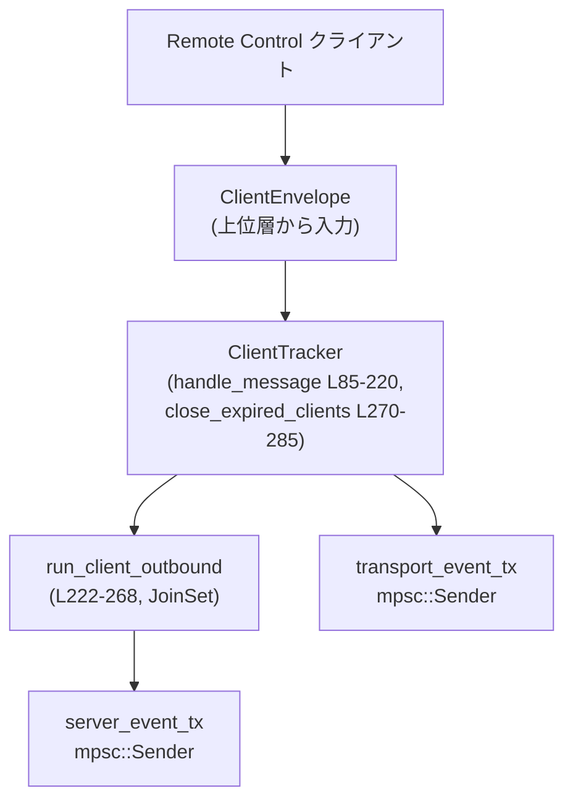

# app-server\src\transport\remote_control\client_tracker.rs

## 0. ざっくり一言

Remote Control クライアントごとに仮想的な「接続」を管理し、  
クライアントからの JSON-RPC メッセージを `TransportEvent` に変換しつつ、サーバーからの送信キューを `ServerEvent` として転送するトラッカーです（`ClientTracker`、`client_tracker.rs:L36-43,85-220,222-268`）。

---

## 1. このモジュールの役割

### 1.1 概要

- このモジュールは **Remote Control クライアントセッションの状態管理** を行います。
- クライアント ID と Stream ID の組 `(ClientId, StreamId)` をキーとして、接続 ID・アイドル状態・シーケンス番号などを追跡します（`ClientState`、`client_tracker.rs:L28-34,36-43`）。
- 入力側では `ClientEnvelope` を受け取り、出力側では
  - `TransportEvent::{ConnectionOpened, IncomingMessage, ConnectionClosed}` を発行してトランスポート層へ、
  - `ServerEvent::{ServerMessage, Pong}` を `QueuedServerEnvelope` 経由でアプリケーション側へ
  中継します（`client_tracker.rs:L40-41,85-220,222-262`）。
- アイドルタイムアウトと Ping/Pong によるヘルス管理、レガシークライアント（`stream_id` 省略）の互換処理を含みます（`client_tracker.rs:L22-23,96-117,183-185,270-285`）。

### 1.2 アーキテクチャ内での位置づけ

このファイル内の主要コンポーネントの依存関係は次の通りです。



- 上位モジュールはネットワーク I/O などから `ClientEnvelope` を構築し、`ClientTracker::handle_message` に渡す想定です（`client_tracker.rs:L85-95`）。
- `ClientTracker` は
  - 接続確立時に `TransportEvent::ConnectionOpened` を `transport_event_tx` に送信（`client_tracker.rs:L157-166`）
  - クライアントからの JSON-RPC メッセージを `TransportEvent::IncomingMessage` として送信（`client_tracker.rs:L145-149,190-194`）
  - 接続終了時に `TransportEvent::ConnectionClosed` を送信（`client_tracker.rs:L301-305`）
- 各クライアント毎のアウトバウンド処理は `run_client_outbound` を `JoinSet` で別タスクとして管理し、サーバーからの送信キュー/状態更新を `ServerEvent` として `server_event_tx` に中継します（`client_tracker.rs:L36-43,169-176,222-262`）。

### 1.3 設計上のポイント

コードから読み取れる特徴を列挙します。

- **状態管理の単位**
  - `clients: HashMap<(ClientId, StreamId), ClientState>` でクライアント ID と Stream ID の組ごとに状態を保持します（`client_tracker.rs:L36-38`）。
  - `legacy_stream_ids: HashMap<ClientId, StreamId>` で `stream_id` を送らないレガシークライアントをサポートしています（`client_tracker.rs:L38,96-117,187-189`）。

- **非同期・並行処理**
  - `ClientTracker` のメソッドは `&mut self` を要求し、通常は単一タスクから順次呼ばれる前提になっています（`client_tracker.rs:L45,61,71,81,85,270,287`）。
  - 各クライアントのアウトバウンド処理は `JoinSet` によってタスク単位で管理されます（`client_tracker.rs:L39,169-176,222-268`）。
  - キャンセル用に `CancellationToken` を多用し、
    - トラッカー全体用 `shutdown_token`（`client_tracker.rs:L42,57,71-78`）
    - クライアント毎の `disconnect_token`（`client_tracker.rs:L29-30,160-165,222-229,301-305`）
    を分離しています。

- **エラーハンドリング方針**
  - このモジュール内部の「致命的な停止」は、`mpsc::Sender` 経由の送信失敗時にのみ `Stopped` エラーとして表現されます（`client_tracker.rs:L25-26,308-313`）。
  - その他のケース（例えば Ping 送信先が存在しない、watch チャンネルの切断）はエラーとしては扱わず、単に処理を終了/無視する実装です（`client_tracker.rs:L196-217,244-247`）。

- **シーケンス番号と重複排除**
  - `last_inbound_seq_id: Option<u64>` を用いて、既に処理した（あるいはそれ以前の）シーケンス ID を持つメッセージを無視します（`client_tracker.rs:L32,124-131`）。
  - レガシークライアントの場合、初期化時に `last_inbound_seq_id` を `None` にリセットすることで、後続メッセージの `seq_id=0` を受け付ける設計です（`client_tracker.rs:L183-185,525-567`）。

- **アイドルタイムアウト**
  - `REMOTE_CONTROL_CLIENT_IDLE_TIMEOUT`（10 分）を閾値として、`last_activity_at` からの経過時間でクライアントを期限切れと判定します（`client_tracker.rs:L22,31-32,270-285,324-325`）。
  - スイープ間隔 `REMOTE_CONTROL_IDLE_SWEEP_INTERVAL`（30 秒）はこのファイルで公開されていますが、実際のスケジューリングは他ファイル側です（`client_tracker.rs:L23`）。

---

## 2. 主要な機能一覧

このモジュールが提供する主な機能を列挙します。

- クライアント接続管理: `(ClientId, StreamId)` 単位の接続確立・再利用・終了管理（`ClientTracker::handle_message`, `close_client`）。
- レガシークライアント対応: `stream_id` 未指定クライアントへのフォールバック処理と Ping 特別扱い（`client_tracker.rs:L96-117,187-189`）。
- 重複メッセージ排除: `seq_id` に基づく idempotent なメッセージ処理（`client_tracker.rs:L124-131`）。
- アイドルタイムアウト: アイドルクライアントの判定と自動クローズ（`close_expired_clients`, `remote_control_client_is_alive`）。
- Ping/Pong ステータス管理: `PongStatus` の watch チャンネル経由での配信（`client_tracker.rs:L32-33,168-176,196-217,222-250`）。
- アウトバウンド転送タスク: `QueuedOutgoingMessage` と `QueuedServerEnvelope` の橋渡し（`run_client_outbound`）。
- シャットダウン制御: 全クライアントとタスクのキャンセル・終了処理（`shutdown`, `drain_join_set`）。
- JoinSet 管理: 完了したクライアントタスクの回収とキーの取得（`bookkeep_join_set`）。

---

## 3. 公開 API と詳細解説

### 3.1 型一覧（構造体・列挙体・定数など）

| 名前 | 種別 | 役割 / 用途 | 行範囲 |
|------|------|-------------|--------|
| `REMOTE_CONTROL_CLIENT_IDLE_TIMEOUT` | `const Duration` | クライアントのアイドルタイムアウト（10 分） | `client_tracker.rs:L22` |
| `REMOTE_CONTROL_IDLE_SWEEP_INTERVAL` | `pub(crate) const Duration` | アイドルクライアント掃除の推奨間隔（30 秒） | `client_tracker.rs:L23` |
| `Stopped` | 構造体（ユニット） | トランスポートイベント送信失敗時など、「トラッカー停止」を表すエラー型 | `client_tracker.rs:L25-26` |
| `ClientState` | 構造体（モジュール内 private） | 個々の `(ClientId, StreamId)` 接続の状態（接続 ID、キャンセル、シーケンス、ヘルス） | `client_tracker.rs:L28-34` |
| `ClientTracker` | 構造体（`pub(crate)`） | このモジュールの中心。クライアント状態とタスク群を管理し、トランスポート/サーバーとの橋渡しを行う | `client_tracker.rs:L36-43` |
| `ClientEvent` | `pub use`（別モジュールの列挙体） | クライアントからのイベント種別（`ClientMessage`, `Ping`, `Ack`, `ClientClosed` など） | `client_tracker.rs:L5` |
| `ClientId` | `pub use`（別モジュールの新型） | Remote Control クライアントを識別するための ID | `client_tracker.rs:L6` |
| `StreamId` | 型（別モジュールの新型） | 1 クライアント内の論理ストリーム ID | `client_tracker.rs:L9` |
| `PongStatus` | 列挙体（別モジュール） | Ping への応答ステータス（`Active`, `Unknown` など） | `client_tracker.rs:L7` |
| `ServerEvent` | 列挙体（別モジュール） | サーバーから Remote Control クライアントに送るイベント（Pong, ServerMessage 等） | `client_tracker.rs:L8` |
| `JSONRPCMessage` | 列挙体（外部クレート） | JSON-RPC メッセージ（Request / Notification / Response など） | `client_tracker.rs:L13` |

> `ClientEvent`, `ClientId`, `StreamId`, `PongStatus`, `ServerEvent`, `JSONRPCMessage` の中身はこのチャンクには現れません。

---

### 3.2 関数詳細（主要 7 件）

#### 1. `ClientTracker::handle_message(&mut self, client_envelope: ClientEnvelope) -> Result<(), Stopped>`

**概要**

- Remote Control クライアントから届いた 1 つの `ClientEnvelope` を処理し、
  - 必要に応じて新しい接続を開き、
  - 既存接続にメッセージをルーティングし、
  - Ping/Pong・クローズを処理するメインエントリです（`client_tracker.rs:L85-220`）。

**引数**

| 引数名 | 型 | 説明 |
|--------|----|------|
| `client_envelope` | `ClientEnvelope` | クライアント ID・ストリーム ID・イベント種別・シーケンス ID を含むラッパー（`client_tracker.rs:L89-95`） |

**戻り値**

- `Ok(())`:
  - メッセージが適切に処理された、あるいは仕様通り安全に無視されたことを示します。
- `Err(Stopped)`:
  - 内部で `TransportEvent` を送信する `mpsc::Sender` が閉じているなど、トラッカーの継続が困難な状態を表します（`client_tracker.rs:L145-149,190-194,308-313`）。

**内部処理の流れ**

主なステップ（`client_tracker.rs:L89-219`）:

1. `ClientEnvelope` を分解して `client_id`, `event`, `stream_id`, `seq_id` を取得（`L89-95`）。
2. `stream_id` が `None` かどうかを `is_legacy_stream_id` として把握（`L96`）。
3. メッセージが「接続開始」かどうかを `remote_control_message_starts_connection` で判定し、`is_initialize` として保持（`L97,316-321`）。
4. 実際に使う `stream_id` を決定（`L98-117`）:
   - `Some(id)` ならそのまま使用。
   - `None` かつ `is_initialize` の場合:
     - `legacy_stream_ids` に既存マッピングがあればそれを `remove` して再利用。
     - なければ新しい `StreamId::new_random()` を生成（`L101-105`）。
   - それ以外（非 initialize の `None`）:
     - `legacy_stream_ids` にあればそれを `get` して使用。
     - なければ:
       - イベントが `Ping` なら新しい `StreamId::new_random()` を生成。
       - それ以外なら空文字列の `StreamId(String::new())` を生成（`L106-116`）。
5. `stream_id.0`（内部の文字列）が空文字なら、そのメッセージは無視して `Ok(())` を返す（`L118-120`）。
6. `(client_id.clone(), stream_id.clone())` をキーとして `client_key` を作成（`L121`）。
7. `event` の種別ごとに `match` で処理（`L122-219`）。

**`ClientEvent::ClientMessage { message }` の場合**

- **重複シーケンスのスキップ**（`L124-132`）:
  - `seq_id` が `Some` で、
  - `clients` に `client_key` が存在し、
  - その `last_inbound_seq_id` が現在の `seq_id` 以上かつ `is_initialize` でない場合、
  - そのメッセージは重複または巻き戻りと見なし、何もせず `Ok(())`。

- **同じストリームでの再 initialize**（`L134-136`）:
  - `is_initialize` かつ `clients` に `client_key` が既に存在する場合、
    - 古い接続を `close_client` で明示的に閉じてから新しい接続を開き直します。

- **既存接続へのルーティング**（`L138-150`）:
  - `clients.get_mut(&client_key)` がある場合:
    - `last_activity_at` を `Instant::now()` で更新。
    - `seq_id` が `Some` であれば `last_inbound_seq_id` も更新。
    - その `connection_id` へ向けた `TransportEvent::IncomingMessage` を送る。

- **新規接続の確立**（`L153-195`）:
  - `is_initialize` でない（初期化前）メッセージは無視（`L153-155`）。
  - 初期化メッセージの場合:
    1. 新しい `connection_id = next_connection_id()` を採番（`L157`）。
    2. アウトバウンド用の `writer_tx` / `writer_rx` チャンネルを `CHANNEL_CAPACITY` で作成（`L158-159`）。
    3. `shutdown_token` から子トークン `disconnect_token` を生成（`L160`）。
    4. `TransportEvent::ConnectionOpened { connection_id, writer, disconnect_sender: Some(disconnect_token.clone()) }` を送信（`L161-166`）。
    5. `PongStatus::Active` で watch チャンネル (`status_tx`, `status_rx`) を生成（`L168`）。
    6. `run_client_outbound` タスクを `join_set` に spawn（`L169-176`）。
    7. `clients` に `ClientState` を挿入（`connection_id`, `disconnect_token`, 現時刻, `last_inbound_seq_id`, `status_tx`）（`L177-185`）。
       - レガシーの場合 `last_inbound_seq_id` は `None` に設定（`L183-185`）。
    8. レガシークライアントなら `legacy_stream_ids` に `(ClientId -> StreamId)` を保存（`L187-189`）。
    9. 最後に `TransportEvent::IncomingMessage` として初期化メッセージを送信（`L190-194`）。

**`ClientEvent::Ack` の場合**

- 何もせず `Ok(())` を返します（`L196`）。

**`ClientEvent::Ping` の場合**

- `clients` に `client_key` が存在する場合（`L198-202`）:
  - `last_activity_at` を更新。
  - `status_tx.send(PongStatus::Active)` を試みます（watch チャンネルがすでに閉じている場合は失敗しますが、結果は無視しています）。
- 接続がない（未知のクライアント/ストリーム）の場合（`L204-215`）:
  - `PongStatus::Unknown` を含む `ServerEvent::Pong` を送る `QueuedServerEnvelope` を生成し、`tokio::spawn` で非同期に `server_event_tx` に送信します。
  - 送信結果は無視されます（`let _ = ...`）。

**`ClientEvent::ClientClosed` の場合**

- `close_client(&client_key)` を呼び出して接続を閉じます（`L218-219`）。

**Examples（使用例）**

テストコードと同様の初期化ハンドリングの例です（`client_tracker.rs:L371-383` を簡略化）。

```rust
use tokio_util::sync::CancellationToken;
use tokio::sync::mpsc;
use crate::transport::remote_control::client_tracker::ClientTracker;
use crate::transport::remote_control::protocol::{ClientEnvelope, ClientEvent, ClientId, StreamId};
use codex_app_server_protocol::{JSONRPCMessage, JSONRPCRequest, RequestId};
use serde_json::json;

// ClientTracker をセットアップする
let (server_event_tx, _server_event_rx) = mpsc::channel(CHANNEL_CAPACITY);
let (transport_event_tx, mut transport_event_rx) = mpsc::channel(CHANNEL_CAPACITY);
let shutdown_token = CancellationToken::new();
let mut tracker = ClientTracker::new(server_event_tx, transport_event_tx, &shutdown_token);

// initialize リクエストを構築する（tests 内の helper と同様）
let envelope = ClientEnvelope {
    event: ClientEvent::ClientMessage {
        message: JSONRPCMessage::Request(JSONRPCRequest {
            id: RequestId::Integer(1),
            method: "initialize".to_string(),
            params: Some(json!({ "clientInfo": { "name": "remote", "version": "0.1.0" } })),
            trace: None,
        }),
    },
    client_id: ClientId("client-1".into()),
    stream_id: None,             // レガシークライアントの例
    seq_id: Some(0),
    cursor: None,
};

// メッセージを処理する
tracker.handle_message(envelope).await?;

// ここで transport_event_rx から ConnectionOpened, IncomingMessage などが受信される
```

**Errors / Panics**

- `Err(Stopped)` になる条件：
  - 内部で `TransportEvent` を送信している `mpsc::Sender<TransportEvent>` がクローズされている場合（`send_transport_event` 経由、`client_tracker.rs:L308-313`）。
- panic を引き起こす可能性のある `unwrap` 等はこの関数内にはありません（`unwrap_or_else` のみ使用、`client_tracker.rs:L101-105,110-116`）。

**Edge cases（エッジケース）**

- `stream_id` が `None` かつ `initialize` 以外:
  - レガシーマッピングが見つからず、イベントが `Ping` 以外なら空の `StreamId` が生成され、即座に `Ok(())` で捨てられます（`client_tracker.rs:L106-120`）。
- `seq_id` が `None`:
  - 重複排除ロジックに引っかからず、常に新しいメッセージとして扱われます（`client_tracker.rs:L124-131`）。
- レガシークライアント（`stream_id: None`）の initialize 後に再び `seq_id = 0` のメッセージを送った場合:
  - `last_inbound_seq_id` が `None` にリセットされているため、重複扱いされず処理されます（`client_tracker.rs:L183-185,525-567`）。
- 未知のクライアント/ストリームからの `Ping`:
  - 新しい接続を作らず、`PongStatus::Unknown` を送信する一時的な `QueuedServerEnvelope` を生成します（`client_tracker.rs:L204-215`）。

**使用上の注意点**

- `ClientTracker` は `&mut self` を要求するため、同一インスタンスを複数タスクで同時に操作するには外側で `Mutex` などの同期が必要です。通常は 1 タスクで所有する設計に見えます。
- `ClientEvent::ClientMessage` の非 initialize メッセージは、該当クライアント/ストリームが未登録であれば黙って無視されます（`client_tracker.rs:L153-155`）。呼び出し側でログなどを行う場合は、トラッカーの前段で行う必要があります。
- `bookkeep_join_set` を呼ばないと、`run_client_outbound` の終了情報（クライアントキー）が回収されず、`close_client` が呼ばれません（`client_tracker.rs:L61-69,371-418`）。接続クローズイベントを確実に流したい場合は注意が必要です。

---

#### 2. `ClientTracker::run_client_outbound(...) -> (ClientId, StreamId)`

```rust
async fn run_client_outbound(
    client_id: ClientId,
    stream_id: StreamId,
    server_event_tx: mpsc::Sender<QueuedServerEnvelope>,
    mut writer_rx: mpsc::Receiver<QueuedOutgoingMessage>,
    mut status_rx: watch::Receiver<PongStatus>,
    disconnect_token: CancellationToken,
) -> (ClientId, StreamId)
```

**概要**

- 1 クライアントストリームに対する「アウトバウンド専用タスク」です。
- `writer_rx` からサーバー送信メッセージを受け取り `ServerEvent::ServerMessage` として送信し、`status_rx` からの Pong ステータス変化を `ServerEvent::Pong` として送信します（`client_tracker.rs:L222-262`）。
- 終了時に `(client_id, stream_id)` を返し、`bookkeep_join_set` がそれを受け取ります（`client_tracker.rs:L61-69,267-268`）。

**引数**

| 引数名 | 型 | 説明 |
|--------|----|------|
| `client_id` | `ClientId` | このタスクが担当するクライアント ID（所有権を持って受け取る） |
| `stream_id` | `StreamId` | このタスクが担当するストリーム ID |
| `server_event_tx` | `mpsc::Sender<QueuedServerEnvelope>` | サーバー側にイベントを送るチャンネル |
| `writer_rx` | `mpsc::Receiver<QueuedOutgoingMessage>` | 上位層からクライアントへ送るべきメッセージが流れてくる受信側 |
| `status_rx` | `watch::Receiver<PongStatus>` | Ping/Pong ステータス更新を購読する watch レシーバ |
| `disconnect_token` | `CancellationToken` | 外部からこのタスクをキャンセルするためのトークン |

**戻り値**

- `(ClientId, StreamId)`:
  - タスクが担当していたクライアント/ストリームキー。`JoinSet` 経由で `bookkeep_join_set` に渡され、`close_client` の呼び出しに使われます（`client_tracker.rs:L267-268,371-418`）。

**内部処理の流れ**

1. 無限ループで `tokio::select!` を実行（`client_tracker.rs:L230-251`）。
2. 第一の `select!` で以下のいずれかを待ちます（`L231-251`）。
   - `disconnect_token.cancelled()`:
     - キャンセルされたらループを `break`。
   - `writer_rx.recv()`:
     - `None`（送信側クローズ）なら `break`。
     - `Some(queued_message)` なら `ServerEvent::ServerMessage` を生成し、対応する `write_complete_tx` とともに次ステップへ（`L235-243`）。
   - `status_rx.changed()`:
     - エラー（送信側がいない）なら `break`。
     - 成功時は現在の `PongStatus` を読み取り `ServerEvent::Pong { status }` を生成（`L244-250`）。
3. 第二の `select!` で、生成した `event` を `server_event_tx.send(...)` するか、キャンセルを待つ（`L252-262`）。
   - 送信中に `disconnect_token` がキャンセルされた場合は `break`。
   - `send` が `Err`（チャンネルクローズ）なら `break`（`L263-265`）。
4. ループ終了後、担当していた `(client_id, stream_id)` を返す（`L267-268`）。

**Examples（使用例）**

この関数は直接呼び出すのではなく、`ClientTracker::handle_message` 内から spawn されます（`client_tracker.rs:L168-176`）。テストでは `bookkeep_join_set` を介して終了を観測しています（`client_tracker.rs:L371-418`）。

**Errors / Panics**

- この関数は `Result` ではなく、内部でエラーを検知すると静かにループを抜けて終了する設計です。
  - `writer_rx.recv()` が `None`（送信側終了）
  - `status_rx.changed()` がエラー（watch 送信側終了）
  - `server_event_tx.send(...)` が `Err`（送信先クローズ）
  - `disconnect_token` のキャンセル
- panic を起こす呼び出しはありません。

**Edge cases**

- `writer_rx` と `status_rx` の両方にイベントがある場合、`tokio::select!` のランダムなブランチ選択ルールに従います（公平性は tokio の仕様に依存）。
- `status_rx` が先に閉じられた場合、最初の `changed()` でエラーになりタスクは終了するため、その後の Pong は送られません（`client_tracker.rs:L244-247`）。
- `disconnect_token` がキャンセルされた瞬間、ちょうど send 中でもキャンセル分岐が優先されるため、未送信のイベントが 1 つ失われる可能性はありますが、そのまま終了します（`client_tracker.rs:L231-234,252-255`）。

**使用上の注意点**

- 実行は `ClientTracker::handle_message` が管理するため、外部から直接 spawn しない構成が前提です。
- `server_event_tx` が詰まっているとき、このタスクは send でブロックします。`shutdown` は `disconnect_token` によりキャンセルしてブロックを解除します（`client_tracker.rs:L71-78,222-229,431-486`）。

---

#### 3. `ClientTracker::close_expired_clients(&mut self) -> Result<Vec<(ClientId, StreamId)>, Stopped>`

**概要**

- 現在の時刻と各クライアントの `last_activity_at` を比較し、アイドルタイムアウトを超過したクライアント接続を自動的に閉じる関数です（`client_tracker.rs:L270-285`）。

**引数**

- なし（`&mut self` のみ）。

**戻り値**

- `Ok(Vec<(ClientId, StreamId)>)`:
  - 今回期限切れとして閉じたクライアントキーの一覧。
- `Err(Stopped)`:
  - 内部で `close_client` 経由の `TransportEvent::ConnectionClosed` 送信に失敗した場合（`client_tracker.rs:L281-283,287-306,308-313`）。

**内部処理の流れ**

1. `now = Instant::now()` を取得（`L273`）。
2. `clients.iter()` を走査し、`remote_control_client_is_alive(client, now)` が `false` のエントリのみ抽出（`L274-280,324-325`）。
3. 抽出した `(ClientId, StreamId)` を `expired_client_ids` としてベクタにまとめる（`L274-280`）。
4. `expired_client_ids` を順に `close_client` で閉じる（`L281-283`）。
5. `expired_client_ids` を返して終了（`L284`）。

**Errors / Panics**

- `close_client` 内で `TransportEvent::ConnectionClosed` の送信に失敗した場合のみ `Err(Stopped)` が返ります（`L301-305,308-313`）。

**Edge cases**

- `clients` が空の場合:
  - 単に空の `Vec` を返します。
- `close_client` が途中で `Err(Stopped)` を返した場合:
  - それ以降のクライアントは閉じられませんが、トラッカー全体が停止状態にあると解釈できます。

**使用上の注意点**

- この関数自体はタイマーを持たないため、`REMOTE_CONTROL_IDLE_SWEEP_INTERVAL` に従って定期的に呼び出すのは上位モジュールの責務です（`client_tracker.rs:L23`）。
- `last_activity_at` は
  - クライアントメッセージ受信時（`ClientEvent::ClientMessage`）、
  - `ClientEvent::Ping` 受信時
  のみ更新され、サーバーからのレスポンス送信では更新されません（`client_tracker.rs:L139-142,198-201`）。

---

#### 4. `ClientTracker::shutdown(&mut self)`

**概要**

- トラッカー全体のシャットダウンを行い、全てのクライアント接続を閉じ、アウトバウンドタスクを完了させます（`client_tracker.rs:L71-79`）。

**内部処理の流れ**

1. `shutdown_token.cancel()` を呼んで、全クライアントに共有されている親キャンセルトークンをキャンセル（`L72,57,160`）。
2. `clients` のキーを `while` で 1 つずつ取り出し、`close_client` でクローズ（`L74-76`）。
3. `drain_join_set()` で `JoinSet` 内の全タスクが終了するまで `join_next().await` を繰り返す（`L78,81-83`）。

**Errors / Panics**

- `shutdown` 自身は `Result` を返さず、`Stopped` を伝播しません。
- 内部で `close_client` を呼んでいますが、`Result` は無視しています（`let _ = ...`、`client_tracker.rs:L75`）。従って送信エラーは無視されます。

**使用上の注意点**

- テストでは `tokio::time::timeout` と組み合わせて、シャットダウンがハングしないことが確認されています（`client_tracker.rs:L431-486`）。
- `shutdown` 呼び出し後に `handle_message` などを継続して呼び出す前提はコードからは読み取れません。通常はライフサイクル終端として扱うべきです。

---

#### 5. `ClientTracker::bookkeep_join_set(&mut self) -> Option<(ClientId, StreamId)>`

**概要**

- `JoinSet` 内のタスク完了を待ち、そのタスクが担当していた `(ClientId, StreamId)` を 1 つ返すヘルパです（`client_tracker.rs:L61-69`）。
- 完了したタスクがない場合は、無期限に待ち続ける挙動になっています。

**戻り値**

- `Some((ClientId, StreamId))`:
  - 完了したアウトバウンドタスクから返されたクライアントキー。
- それ以外のケース:
  - `futures::future::pending().await` により永遠に待機し、`None` が返ることはありません（`client_tracker.rs:L68`）。

**内部処理の流れ**

1. `while let Some(join_result) = self.join_set.join_next().await` で、タスク完了を順次待つ（`L62`）。
2. 完了したタスクの戻り値 `join_result` が `Ok(client_key)` なら、それを `Some(client_key)` で返す（`L63-67`）。
3. ループを抜けた場合（`join_set` が空）は `pending().await` で永遠に待機（`L68`）。

**使用例（テストより）**

```rust
// disconnect_token をキャンセルした後に、完了したタスクのクライアントキーを取得
disconnect_sender.cancel();
let closed_client_id = timeout(Duration::from_secs(1), client_tracker.bookkeep_join_set())
    .await
    .expect("bookkeeping should process the closed task")
    .expect("closed task should return client id");
```

（`client_tracker.rs:L408-413`）

**使用上の注意点**

- 完了タスクが存在しない状態で直接呼ぶと、永遠にブロックします。テストのように `timeout` や別タスクからのキャンセルと組み合わせる必要があります。
- 戻り値を元に `close_client` を呼ぶのが典型的なパターンです（`client_tracker.rs:L371-418`）。

---

#### 6. `ClientTracker::close_client(&mut self, client_key: &(ClientId, StreamId)) -> Result<(), Stopped>`

**概要**

- 指定された `(ClientId, StreamId)` の接続エントリを `clients` から取り除き、関連するキャンセルトークンをキャンセルしてから、`TransportEvent::ConnectionClosed` を送信します（`client_tracker.rs:L287-306`）。

**引数**

| 引数名 | 型 | 説明 |
|--------|----|------|
| `client_key` | `&(ClientId, StreamId)` | 閉じる対象のクライアント/ストリームのキー |

**戻り値**

- `Ok(())`:
  - 成功（対象クライアントが存在しなかった場合も含む）。
- `Err(Stopped)`:
  - `TransportEvent::ConnectionClosed` の送信に失敗した場合（`client_tracker.rs:L301-305,308-313`）。

**内部処理の流れ**

1. `clients.remove(client_key)` でエントリを取り出す。存在しなければ `Ok(())` で終了（`L291-293`）。
2. レガシーストリーム ID マッピングをチェックし、もし `(client_key.0 -> client_key.1)` の組み合わせが登録されていれば削除（`L294-300`）。
3. `client.disconnect_token.cancel()` を呼び、そのクライアントのアウトバウンドタスクなどをキャンセル（`L301`）。
4. `TransportEvent::ConnectionClosed { connection_id }` を送信（`send_transport_event` 経由）（`L301-305,308-313`）。

**Edge cases**

- `clients` に存在しないキーを指定した場合も `Ok(())` で何も起こりません（`L291-293`）。
- レガシーマッピングの削除は「`ClientId` が同じで `StreamId` も一致する」場合にのみ行われます（`L294-300`）。

---

#### 7. 補助関数：`remote_control_message_starts_connection` / `remote_control_client_is_alive`

**`fn remote_control_message_starts_connection(message: &JSONRPCMessage) -> bool`**

- JSON-RPC メッセージが `method == "initialize"` の Request であるかを判定し、接続開始メッセージかどうかを返します（`client_tracker.rs:L316-321`）。
- `ClientTracker::handle_message` 内で `is_initialize` 判定に使用されます（`client_tracker.rs:L97`）。

**`fn remote_control_client_is_alive(client: &ClientState, now: Instant) -> bool`**

- `now.duration_since(client.last_activity_at) < REMOTE_CONTROL_CLIENT_IDLE_TIMEOUT` に基づき、クライアントがアイドルタイムアウト未満かどうかを返します（`client_tracker.rs:L324-325`）。
- `close_expired_clients` で使用されます（`client_tracker.rs:L274-280`）。

---

### 3.3 その他の関数・メソッド一覧

| 関数名 | 役割（1 行） | 行範囲 |
|--------|--------------|--------|
| `ClientTracker::new` | `ClientTracker` の初期化。内部マップと `JoinSet`、`shutdown_token` の子トークンを準備する | `client_tracker.rs:L45-59` |
| `ClientTracker::drain_join_set` | `JoinSet` 内の全タスクが終了するまで `join_next()` を繰り返す内部ヘルパ | `client_tracker.rs:L81-83` |
| `ClientTracker::send_transport_event` | `TransportEvent` を `transport_event_tx` に送り、失敗したら `Stopped` を返す | `client_tracker.rs:L308-313` |

#### テストコードの概要

| テスト名 | 検証内容 | 行範囲 |
|----------|----------|--------|
| `cancelled_outbound_task_emits_connection_closed` | `disconnect_token` キャンセル → `run_client_outbound` 終了 → `bookkeep_join_set` → `close_client` により `TransportEvent::ConnectionClosed` が送信されること | `client_tracker.rs:L371-429` |
| `shutdown_cancels_blocked_outbound_forwarding` | `server_event_tx` が詰まっている状況でも、`shutdown` が `disconnect_token` キャンセルによりハングせず完了すること | `client_tracker.rs:L431-486` |
| `initialize_with_new_stream_id_opens_new_connection_for_same_client` | 同一 `ClientId` でも新しい `StreamId` で initialize すると別の `ConnectionId` が割り当てられること | `client_tracker.rs:L488-522` |
| `legacy_initialize_without_stream_id_resets_inbound_seq_id` | レガシークライアント（`stream_id: None`）の initialize 後、`seq_id=0` の後続メッセージが重複扱いされず転送されること | `client_tracker.rs:L525-567` |

---

## 4. データフロー

ここでは「レガシークライアントが initialize を送り、その後メッセージを送り、最後に接続が閉じられる」という典型シナリオの流れを示します。

### 処理の要点

1. 上位層が `ClientEnvelope` を受け取り、`ClientTracker::handle_message` に渡す（`client_tracker.rs:L85-95`）。
2. `handle_message` が `is_initialize` を判定し、新しい `StreamId` と `ConnectionId` を割り当てて接続を開きます（`L96-117,157-166`）。
3. 同時に `run_client_outbound` タスクを spawn し、サーバーからの送信キューへのブリッジを作る（`L168-176,222-262`）。
4. `initialize` メッセージ自身は `TransportEvent::IncomingMessage` としてトランスポート層に渡されます（`L190-194`）。
5. 後続のクライアントメッセージは同じ `client_key` で `IncomingMessage` として流れます（`L138-150`）。
6. 上位層が `disconnect_token` をキャンセルすると、`run_client_outbound` が終了し、`bookkeep_join_set` によってキーが取得され、`close_client` を通じて `ConnectionClosed` が送信されます（`L222-268,61-69,287-306,371-418`）。

### シーケンス図

```mermaid
sequenceDiagram
    participant RC as Remote Client
    participant Upper as 上位層（ClientEnvelope生成）
    participant CT as ClientTracker::handle_message<br/>(L85-220)
    participant JT as run_client_outbound<br/>(L222-268)
    participant TT as transport_event_tx<br/>(TransportEvent)
    participant ST as server_event_tx<br/>(ServerEvent)

    RC->>Upper: JSON-RPC initialize
    Upper->>CT: ClientEnvelope{ClientMessage(initialize), stream_id=None}
    CT->>CT: is_initialize = true<br/>stream_id決定 (L96-117)
    CT->>TT: TransportEvent::ConnectionOpened<br/>(connection_id, writer, disconnect)(L161-166)
    CT->>JT: spawn run_client_outbound<br/>(writer_rx,status_rx,disconnect)(L168-176)
    CT->>TT: TransportEvent::IncomingMessage<br/>(initialize)(L190-194)
    CT-->>Upper: Ok(())

    RC->>Upper: 後続 ClientMessage(seq_id=1)
    Upper->>CT: handle_message(ClientMessage)
    CT->>CT: last_activity_at更新, last_inbound_seq_id更新(L138-142)
    CT->>TT: TransportEvent::IncomingMessage(seq_id=1)(L145-149)

    Note over JT,ST: サーバーからのアウトバウンド
    ST-->>JT: QueuedOutgoingMessage (writer_tx 経由で writer_rx に到達)
    JT->>ST: QueuedServerEnvelope{ServerMessage}(L235-243,256-262)

    Note over RC,CT: Ping / Pong
    RC->>Upper: ClientEvent::Ping
    Upper->>CT: handle_message(Ping)
    CT->>CT: last_activity_at更新, status_tx.send(Active)(L198-201)
    JT->>ST: QueuedServerEnvelope{Pong(Active)}(L244-250,256-262)

    Note over Upper,CT,JT: 接続終了
    Upper->>JT: disconnect_token.cancel()（他モジュールから）
    JT-->>CT: (client_id, stream_id) を返して終了 (JoinSet 内)
    Upper->>CT: bookkeep_join_set() でキー取得(L61-69)
    Upper->>CT: close_client(client_key)(L287-306)
    CT->>TT: TransportEvent::ConnectionClosed(connection_id)(L301-305)
```

---

## 5. 使い方（How to Use）

### 5.1 基本的な使用方法

典型的な利用フローを簡略化した例です。  
ここでは「1 つのタスクが `ClientTracker` を所有し、別のタスク群から `ClientEnvelope` を流し込む」構成を想定します。

```rust
use tokio::sync::mpsc;
use tokio_util::sync::CancellationToken;
use crate::transport::remote_control::{
    client_tracker::{ClientTracker, REMOTE_CONTROL_IDLE_SWEEP_INTERVAL},
    TransportEvent, QueuedServerEnvelope,
};
use crate::transport::remote_control::protocol::ClientEnvelope;

// セットアップ
let (server_event_tx, mut server_event_rx) =
    mpsc::channel::<QueuedServerEnvelope>(CHANNEL_CAPACITY);
let (transport_event_tx, mut transport_event_rx) =
    mpsc::channel::<TransportEvent>(CHANNEL_CAPACITY);
let shutdown_token = CancellationToken::new();

let mut tracker = ClientTracker::new(
    server_event_tx,
    transport_event_tx,
    &shutdown_token,
);

// 例: 上位層からの ClientEnvelope ストリーム（詳細はこのチャンクにはありません）
let mut client_envelope_rx: mpsc::Receiver<ClientEnvelope> = /* ... */;

// メインループ（1 タスクで tracker を所有）
tokio::spawn(async move {
    loop {
        tokio::select! {
            Some(env) = client_envelope_rx.recv() => {
                // 受信したクライアントイベントを処理
                if let Err(_stopped) = tracker.handle_message(env).await {
                    // transport_event_tx が閉じたなど、上位に伝える
                    break;
                }
            }
            // 定期的にアイドルクライアントをクローズ
            _ = tokio::time::sleep(REMOTE_CONTROL_IDLE_SWEEP_INTERVAL) => {
                let _ = tracker.close_expired_clients().await;
            }
        }
    }
});
```

- `server_event_rx` 側では、`ServerEvent::ServerMessage` や `ServerEvent::Pong` を受け取り、Remote Control クライアントへの送信や状態更新に利用します。
- `transport_event_rx` 側では、`ConnectionOpened` / `IncomingMessage` / `ConnectionClosed` を拾って、実際のネットワーク接続やライフサイクル制御を行う想定です。

### 5.2 よくある使用パターン

1. **複数ストリームを持つクライアント**

   - 同じ `ClientId` で異なる `StreamId` を指定した `initialize` を送ると、それぞれ別の `ConnectionId` が割り当てられます（`client_tracker.rs:L488-522`）。
   - 並列ストリームを解釈したい場合、トランスポート層側で `StreamId` を見て処理を分岐できます。

2. **レガシークライアントのサポート**

   - `stream_id: None` で `initialize` を送ると、新しいランダムな `StreamId` が自動割り当てされ、以降 `stream_id: None` のメッセージも同じ接続に紐付きます（`client_tracker.rs:L96-117,187-189,525-567`）。
   - これにより旧バージョンのクライアントでも新しいサーバーと通信できます。

3. **Ping/Pong による状態確認**

   - クライアント側から `ClientEvent::Ping` を定期的に送信すると、`PongStatus::Active` が watch チャンネルを通じて `run_client_outbound` に伝わり、`ServerEvent::Pong` として流れます（`client_tracker.rs:L196-217,222-250`）。
   - 未知のクライアントからの Ping に対しては `PongStatus::Unknown` が一度だけ送信されます（`client_tracker.rs:L204-215`）。

### 5.3 よくある間違い

コードから推測できる、起こり得る誤用パターンと正しい使い方です。

```rust
// 間違い例: ClientTracker を複数タスクで &mut self 共有しようとする
// let tracker = Arc::new(ClientTracker::new(...));
// tokio::spawn({
//     let tracker = tracker.clone();
//     async move {
//         tracker.handle_message(env).await; // コンパイルエラー: &mut self が必要
//     }
// });

// 正しい例: 1 タスクが tracker を所有し、他タスクとはメッセージチャネルで連携
let mut tracker = ClientTracker::new(server_event_tx, transport_event_tx, &shutdown_token);
let (env_tx, mut env_rx) = mpsc::channel(CHANNEL_CAPACITY);

tokio::spawn(async move {
    while let Some(env) = env_rx.recv().await {
        let _ = tracker.handle_message(env).await;
    }
});

// 他タスクは env_tx 経由で ClientEnvelope を送る
```

```rust
// 間違い例: 完了したタスクのクリーンアップをしない
// これだと、disconnect_token をキャンセルしても close_client が呼ばれない
disconnect_sender.cancel();
// bookkeep_join_set() を呼ばないと、ConnectionClosed が送信されない可能性がある

// 正しい例: bookkeep_join_set を待ってから close_client を呼ぶ（テストと同様）
disconnect_sender.cancel();
if let Ok(Some(client_key)) = tokio::time::timeout(
    Duration::from_secs(1),
    tracker.bookkeep_join_set(),
).await {
    let _ = tracker.close_client(&client_key).await;
}
```

### 5.4 使用上の注意点（まとめ）

- **前提条件**
  - `ClientTracker` のメソッドは `&mut self` を要求するため、1 つのインスタンスを同時に複数タスクから直接呼ぶ設計ではありません。
  - `handle_message` に渡す `ClientEnvelope` は、適切な `ClientId`, `StreamId`（または `None`）, `ClientEvent` を正しく設定する必要があります。

- **エラー・停止条件**
  - `Stopped` エラーは `transport_event_tx` のクローズなど、トラッカーがこれ以上 `TransportEvent` を送れない状態を意味します（`client_tracker.rs:L308-313`）。
  - `shutdown` や `close_client` では `Stopped` を無視している箇所があり、呼び出し側で停止を検知したい場合は `handle_message` / `close_expired_clients` 等の戻り値を確認する必要があります。

- **シーケンス番号の扱い**
  - 非レガシークライアントでは、`seq_id` は単調増加する前提になっており、古い `seq_id` のメッセージは無視されます（`client_tracker.rs:L124-131`）。
  - レガシークライアント（`stream_id: None`）の initialize では `last_inbound_seq_id` を `None` にしているため、その後の `seq_id = 0` メッセージを受け付けます（`client_tracker.rs:L183-185`）。

- **セキュリティ・堅牢性上の注意**
  - 未知のクライアントからの `Ping` に対しても `PongStatus::Unknown` を返す実装になっており、その挙動が望ましいかどうかはプロトコル側の仕様に依存します（`client_tracker.rs:L204-215`）。
  - レガシークライアントが `stream_id: None` かつ `initialize` 以外のメッセージを送った場合には、そのメッセージは空 `StreamId` として即座に破棄されます（`client_tracker.rs:L106-120`）。

---

## 6. 変更の仕方（How to Modify）

### 6.1 新しい機能を追加する場合

- **新しい `ClientEvent` バリアントの処理を追加する**
  - 対応箇所: `ClientTracker::handle_message` の `match event`（`client_tracker.rs:L122-219`）。
  - ここに新しい `ClientEvent::XXX` の分岐を追加し、必要なら
    - `clients` への状態追加・更新（`client_tracker.rs:L138-142,177-185`）
    - `TransportEvent` の送信（`send_transport_event`、`client_tracker.rs:L145-149,190-194`）
    - `QueuedServerEnvelope` の送信（`server_event_tx`、`client_tracker.rs:L204-215`）
    を行うことになります。

- **アイドル判定ロジックを拡張する**
  - 対応箇所:
    - `ClientState` に新しいフィールドを追加する（例: アイドル許可フラグ）（`client_tracker.rs:L28-34`）。
    - `remote_control_client_is_alive` の判定条件を変更・拡張する（`client_tracker.rs:L324-325`）。
    - 必要に応じて、`handle_message` 内で `last_activity_at` 更新タイミングを調整（`client_tracker.rs:L139-142,198-201`）。

### 6.2 既存の機能を変更する場合

- **影響範囲の確認方法**
  - `ClientTracker` の各メソッドに対するテストはこのファイル内の `#[cfg(test)] mod tests` にまとまっています（`client_tracker.rs:L328-567`）。挙動変更時にはこれらのテストを更新・追加する必要があります。
  - `TransportEvent` や `QueuedServerEnvelope` の利用箇所はこのチャンクには現れませんが、他モジュールでの受信処理が存在するはずなので、検索して確認する必要があります。

- **契約（前提条件・返り値）の注意**
  - `close_client` は存在しないキーに対しても成功扱い (`Ok(())`) であること（`client_tracker.rs:L291-293`）を前提にしている可能性があります。
  - `bookkeep_join_set` は空 `JoinSet` でも戻ってこないことが契約になっており、テストで `timeout` と組み合わせて使用されています（`client_tracker.rs:L371-418`）。

- **並行性関連**
  - `JoinSet` の管理（spawn と `bookkeep_join_set`）のバランスが崩れると、タスクリークや ConnectionClosed イベントの欠落につながる可能性があります。
  - `CancellationToken` の親子関係（`shutdown_token` → 各 `disconnect_token`）を変える場合は、`shutdown` の意味合いが変わるため、`shutdown_cancels_blocked_outbound_forwarding` テスト（`client_tracker.rs:L431-486`）の見直しが必要です。

---

## 7. 関連ファイル

このモジュールと密接に関係する型・モジュール（このチャンクから参照のみ判明しているもの）です。

| パス / モジュール | 役割 / 関係 |
|-------------------|------------|
| `super::protocol` | `ClientEnvelope`, `ClientEvent`, `ClientId`, `PongStatus`, `ServerEvent`, `StreamId` を定義。Remote Control プロトコルのメッセージ型群 | `client_tracker.rs:L4-9` |
| `super::TransportEvent` | `ConnectionOpened`, `IncomingMessage`, `ConnectionClosed` など、トランスポート層へのイベント型 | `client_tracker.rs:L2` |
| `super::next_connection_id` | 新しい `ConnectionId` を生成する関数 | `client_tracker.rs:L3,157` |
| `super::CHANNEL_CAPACITY` | mpsc チャンネルのバッファサイズ。`server_event_tx`, `transport_event_tx`, `writer_tx` で使用 | `client_tracker.rs:L1,158,371-375,431-435,488-492,525-528` |
| `crate::outgoing_message::{ConnectionId, QueuedOutgoingMessage, OutgoingMessage}` | 接続 ID と、サーバーからクライアントへの送信メッセージを表す型 | `client_tracker.rs:L10-11,331,470-479` |
| `crate::transport::remote_control::QueuedServerEnvelope` | `ServerEvent` と宛先情報をまとめた送信用ラッパー | `client_tracker.rs:L12,440-447` |
| `codex_app_server_protocol` | JSON-RPC プロトコル用の `JSONRPCMessage`, `JSONRPCRequest`, `ServerNotification` などを提供 | `client_tracker.rs:L13,335-337,352-362,471-478,548-550` |

> これらの型の詳細なフィールドや挙動は、このチャンクには含まれていないため不明です。
