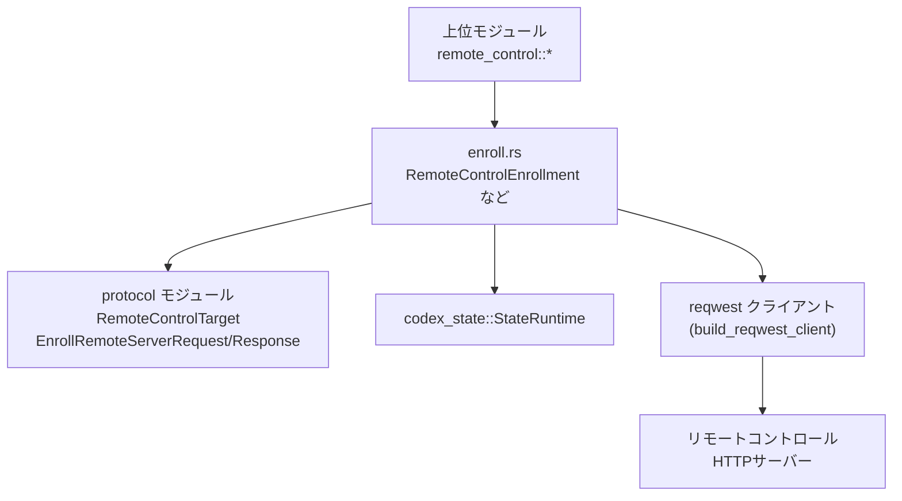
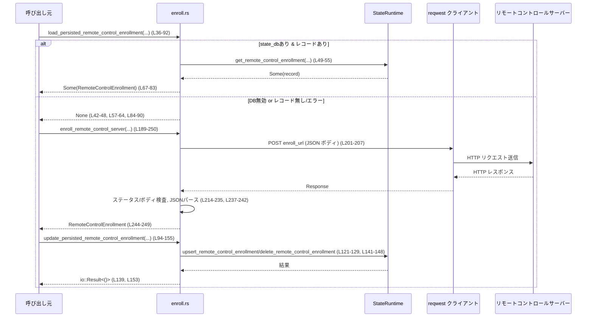

# app-server/src/transport/remote_control/enroll.rs コード解説

## 0. ざっくり一言

- リモートコントロール用バックエンドに対して「このアプリサーバーを登録（enroll）する」HTTP リクエストを送り、その結果をローカルの state DB にキャッシュするモジュールです（`RemoteControlEnrollment` と関連関数群）（app-server\src\transport\remote_control\enroll.rs:L22-28, L36-92, L94-155, L189-250）。

---

## 1. このモジュールの役割

### 1.1 概要

- このモジュールは **リモートコントロールサーバーとの登録状態（enrollment）を管理する** ために存在し、次の機能を提供します。
  - 登録情報をローカル DB（`StateRuntime`）から読み書きする（キャッシュ管理）（L36-92, L94-155）。
  - HTTP API（`EnrollRemoteServerRequest`/`EnrollRemoteServerResponse`）を通じて、リモートコントロールサーバーへの新規登録を行う（L189-250）。
  - エラー時にレスポンスボディや重要ヘッダーを安全かつコンパクトにログメッセージへ埋め込むユーティリティを提供する（L157-187, L221-241）。

### 1.2 アーキテクチャ内での位置づけ

- 依存関係の概略は次の通りです。



- 主に対象となる関数と行範囲:
  - `load_persisted_remote_control_enrollment`（L36-92）
  - `update_persisted_remote_control_enrollment`（L94-155）
  - `enroll_remote_control_server`（L189-250）

### 1.3 設計上のポイント

- **state DB の有無をオプションで扱う**
  - `state_db: Option<&StateRuntime>` が `None` の場合は DB アクセスをスキップし、`info!` ログを出して処理を継続します（L42-48, L101-110）。  
    → DB を無効化した構成でも機能自体は動作します（キャッシュなし）。
- **登録情報の共通表現**
  - `RemoteControlEnrollment` 構造体で「アカウント・環境・サーバー ID・サーバー名」を一箇所にまとめています（L22-28）。  
    - DB から読み出したレコードをこの型に詰め直す（L77-82）。
    - HTTP レスポンスからのデータでも同じ型を返します（L244-249）。
- **エラーを `io::Result` に統一**
  - HTTP 通信や JSON パースエラーは `io::Error::other` でラップし、文脈付きメッセージとして返却します（L209-213, L216-220, L237-241）。
  - HTTP ステータス 401/403 は `ErrorKind::PermissionDenied` にマッピングし、それ以外は `ErrorKind::Other` としています（L222-228）。
- **レスポンスボディのプレビュー制御**
  - ログ用にレスポンスボディを最大 4096 バイトに切り詰め、UTF-8 の境界で安全に切ることで、ログ肥大化や途中での文字化けを防ぎます（L14-15, L157-174, L221-223, L237-241）。
- **非同期・並行性**
  - 外部 I/O（DB, HTTP）はすべて `async fn` に閉じ込め、Tokio ベースでの非同期実行を前提としたインターフェースになっています（L36, L94, L189, テストの `#[tokio::test]` L275, L348, L421）。

---

## 2. 主要な機能一覧（コンポーネントインベントリー）

### 2.1 型・関数・定数の一覧

| 名前 | 種別 | 公開範囲 | 役割 / 用途 | 定義位置 |
|------|------|----------|------------|----------|
| `REMOTE_CONTROL_ENROLL_TIMEOUT` | `Duration` 定数 | private | HTTP enroll リクエストのタイムアウト（30秒） | L14 |
| `REMOTE_CONTROL_RESPONSE_BODY_MAX_BYTES` | `usize` 定数 | private | エラーログに埋め込むレスポンスボディの最大バイト数（4096） | L15 |
| `REQUEST_ID_HEADER` | `&'static str` | private | リクエスト ID 用ヘッダー名 `"x-request-id"` | L17 |
| `OAI_REQUEST_ID_HEADER` | `&'static str` | private | 代替リクエスト ID ヘッダー `"x-oai-request-id"` | L18 |
| `CF_RAY_HEADER` | `&'static str` | private | Cloudflare トレース ID ヘッダー `"cf-ray"` | L19 |
| `REMOTE_CONTROL_ACCOUNT_ID_HEADER` | `&'static str` | `pub(super)` | アカウント ID を渡す HTTP ヘッダー名 `"chatgpt-account-id"` | L20 |
| `RemoteControlEnrollment` | 構造体 | `pub(super)` | アカウントごとのリモートコントロール登録情報 | L22-28 |
| `RemoteControlConnectionAuth` | 構造体 | `pub(super)` | enroll HTTP リクエスト用の認証情報（Bearer トークン＋アカウント ID） | L30-34 |
| `load_persisted_remote_control_enrollment` | `async fn` | `pub(super)` | state DB から登録情報を読み出す | L36-92 |
| `update_persisted_remote_control_enrollment` | `async fn` | `pub(super)` | state DB の登録情報を追加・更新・削除する | L94-155 |
| `preview_remote_control_response_body` | `fn` | `pub(crate)` | レスポンスボディをログ用に整形して短くする | L157-174 |
| `format_headers` | `fn` | `pub(crate)` | レスポンスヘッダーから request-id / cf-ray を取り出して整形する | L176-187 |
| `enroll_remote_control_server` | `async fn` | `pub(super)` | リモートコントロールサーバーへの登録 HTTP リクエストを実行し、`RemoteControlEnrollment` を生成 | L189-250 |

### 2.2 主要機能（箇条書き）

- 登録情報の読み込み: `load_persisted_remote_control_enrollment` で `(websocket_url, account_id, app_server_client_name)` キーのキャッシュを取得します（L36-55, L67-83）。
- 登録情報の更新/削除: `update_persisted_remote_control_enrollment` で DB に `upsert` または `delete` を行います（L119-129, L141-148）。
- HTTP 登録処理: `enroll_remote_control_server` が `POST enroll_url` を実行し、JSON レスポンスを `RemoteControlEnrollment` に変換します（L189-207, L209-213, L215-242, L244-249）。
- エラーログ整形: `preview_remote_control_response_body` と `format_headers` により、エラーにレスポンスヘッダーと（切り詰めた）ボディを含めた詳細なメッセージを生成します（L157-187, L221-223, L237-241）。

---

## 3. 公開 API と詳細解説

### 3.1 型一覧（構造体）

| 名前 | 種別 | フィールド | 役割 / 用途 | 根拠 |
|------|------|-----------|------------|------|
| `RemoteControlEnrollment` | 構造体 (`pub(super)`) | `account_id: String`, `environment_id: String`, `server_id: String`, `server_name: String` | 1 アカウントに紐づくリモートコントロール登録状態を表現します。DB から復元する際と、HTTP 登録結果として返す際に用いられます。 | 定義 L22-28、利用 L77-82, L119-128, L244-249 |
| `RemoteControlConnectionAuth` | 構造体 (`pub(super)`) | `bearer_token: String`, `account_id: String` | enroll HTTP リクエストに必要な認証情報（Authorization ヘッダーとアカウント ID ヘッダー）をまとめたものです。 | L30-34, L205-207, L244-246 |

### 3.2 関数詳細

#### `load_persisted_remote_control_enrollment(...) -> Option<RemoteControlEnrollment>` （L36-92）

**シグネチャ**

```rust
pub(super) async fn load_persisted_remote_control_enrollment(
    state_db: Option<&StateRuntime>,
    remote_control_target: &RemoteControlTarget,
    account_id: &str,
    app_server_client_name: Option<&str>,
) -> Option<RemoteControlEnrollment>
```

**概要**

- ローカル state DB（`StateRuntime`）に保存されたリモートコントロール登録情報を読み出し、存在すれば `RemoteControlEnrollment` として返します（L49-55, L67-83）。
- DB 無効時や読み出しエラー時・該当レコードなしの場合は `None` を返し、ログに詳細を出力します（L42-48, L57-64, L84-90）。

**引数**

| 引数名 | 型 | 説明 |
|--------|----|------|
| `state_db` | `Option<&StateRuntime>` | ローカル state DB への参照。`None` の場合はキャッシュ読み出しを行わず、ログだけ出して `None` を返します（L42-48）。 |
| `remote_control_target` | `&RemoteControlTarget` | 対象のリモートコントロールエンドポイント。`websocket_url` をキーに DB を検索します（L36-39, L51-52）。 |
| `account_id` | `&str` | アカウント ID。DB の検索キーの一部になります（L52）。 |
| `app_server_client_name` | `Option<&str>` | デスクトップクライアント等、クライアント名。これも検索キーに含まれます（L53）。 |

**戻り値**

- `Some(RemoteControlEnrollment)`  
  - 指定された `(websocket_url, account_id, app_server_client_name)` に対応する登録情報が存在し、正常に読み出せた場合（L67-83）。
- `None`  
  - DB が無効 (`state_db == None`)、読み出し時にエラーが起きた、またはレコードが存在しない場合（L42-48, L57-64, L84-90）。

**内部処理の流れ**

1. `state_db` が `None` なら、理由を `info!` ログに出力して `None` を返す（L42-48）。
2. `state_db.get_remote_control_enrollment(websocket_url, account_id, app_server_client_name).await` を呼び出し、結果を `match` で分岐（L49-56）。
3. `Ok(enrollment)` の場合、その値（`Option<RemoteControlEnrollmentRecord>` と推定される）を `enrollment` 変数に格納（L57）。
4. `Err(err)` の場合、`warn!` ログにエラー内容を含めて出力し、`None` を返す（L58-64）。
5. `enrollment` が `Some(record)` の場合、情報をログ出力した上で `RemoteControlEnrollment` に詰め直し `Some(...)` を返す（L67-83）。
6. `enrollment` が `None` の場合、「見つからなかった」ことを `info!` でログ出力し `None` を返す（L84-90）。

**Examples（使用例）**

DB キャッシュがあればそれを使い、なければ HTTP enroll へ進む典型的なパターンです。

```rust
// state_db は StateRuntime への Option<&StateRuntime>
// target は RemoteControlTarget
// account_id, client_name は &str

if let Some(enrollment) = load_persisted_remote_control_enrollment(
    state_db,
    &target,
    account_id,
    Some(client_name),
).await {
    // キャッシュされた enrollment をそのまま利用する
    // ここでは HTTP enroll を行わない
    use_enrollment(enrollment);
} else {
    // キャッシュがない/エラーだったので HTTP 経由で enroll する
    let auth = RemoteControlConnectionAuth {
        bearer_token: bearer.to_string(),
        account_id: account_id.to_string(),
    };
    let enrollment = enroll_remote_control_server(&target, &auth).await?;
    // 必要に応じて update_persisted_remote_control_enrollment で永続化する
}
```

**Errors / Panics**

- 戻り値が `Option` であり、`Result` ではないため、エラーは呼び出し側からは区別できません。
  - DB エラーとレコード未存在は、ともに `None` として扱われます（L57-64, L84-90）。
  - エラー情報は `warn!` ログにのみ現れます（L59-63）。
- 関数内ではパニックの可能性は見当たりません（標準ライブラリ API はすべてエラーハンドリングまたは `?` を通して使用していません）。

**Edge cases（エッジケース）**

- `state_db == None` の場合: 「DB が無効」というログを出しつつ `None` を返します（L42-48）。
- DB が論理的に存在するが、対象レコードが存在しない場合: `info!` ログを出しつつ `None` を返します（L84-90）。
- DB アクセスエラー（I/O, スキーマ不整合等）が発生した場合: `warn!` ログを出しつつ `None` を返します（L57-64）。

**使用上の注意点**

- **エラーと未登録状態を区別したい場合**  
  - 本 API の戻り値だけでは区別できません。ログを参照するか、必要であれば別途 `Result<Option<...>>` 型のラッパーを用意する設計が必要になります（コードから分かるのは `None` にまとめられていることのみです）。
- **並行性**  
  - 関数は `&StateRuntime` を借用し、所有権を移動しません（L36-38）。`StateRuntime` がスレッドセーフかどうかはこのチャンクからは分かりませんが、少なくともこの関数自体は共有参照のみを扱っています。

---

#### `update_persisted_remote_control_enrollment(...) -> io::Result<()>`（L94-155）

**シグネチャ**

```rust
pub(super) async fn update_persisted_remote_control_enrollment(
    state_db: Option<&StateRuntime>,
    remote_control_target: &RemoteControlTarget,
    account_id: &str,
    app_server_client_name: Option<&str>,
    enrollment: Option<&RemoteControlEnrollment>,
) -> io::Result<()>
```

**概要**

- ローカル state DB にリモートコントロール登録情報を保存 (`upsert`) するか、`None` が渡された場合は該当レコードを削除します（L119-129, L141-148）。
- 渡された `enrollment` の `account_id` が引数 `account_id` に一致しない場合は `io::Error` を返して処理を中止します（L111-117）。
- DB 無効時は処理をスキップし、ログを出した上で成功 (`Ok(())`) を返します（L101-110）。

**引数**

| 引数名 | 型 | 説明 |
|--------|----|------|
| `state_db` | `Option<&StateRuntime>` | ローカル state DB への参照。`None` の場合は永続化を行わずにログだけ出して成功扱いとします（L101-110）。 |
| `remote_control_target` | `&RemoteControlTarget` | 対象のリモートコントロールサーバー（`websocket_url` を永続化キーに利用）（L96-97, L122-123, L142-144）。 |
| `account_id` | `&str` | 永続化対象のアカウント ID（キー、およびレコードにも保存）（L97, L123）。 |
| `app_server_client_name` | `Option<&str>` | クライアント名（存在すればキーおよびレコードに保存）（L98, L124）。 |
| `enrollment` | `Option<&RemoteControlEnrollment>` | 保存する内容。`Some` であれば `upsert`、`None` であれば削除を意味します（L99, L119-128, L141-148）。 |

**戻り値**

- `Ok(())`
  - DB 無効だった場合（L101-110）。
  - `upsert_remote_control_enrollment` が成功した場合（L119-131, L139）。
  - `delete_remote_control_enrollment` が成功した場合（L141-148, L153）。
- `Err(io::Error)`
  - `enrollment.account_id != account_id` の場合（L111-117）。
  - `upsert_remote_control_enrollment` あるいは `delete_remote_control_enrollment` が `Err` を返した場合。どちらも `io::Error::other` でラップされます（L120-131, L141-148）。

**内部処理の流れ**

1. `state_db` が `None` の場合、「永続化をスキップする」旨を `info!` でログ出力し、`Ok(())` を返す（L101-110）。
2. `enrollment` が `Some(e)` で、その `account_id` が引数 `account_id` と異なる場合は、整形したメッセージで `io::Error::other` を返す（L111-117）。
3. `enrollment` が `Some(e)` か `None` かで分岐（L119-120, L140-141）:
   - `Some(e)` の場合:
     - `RemoteControlEnrollmentRecord` を構築して `state_db.upsert_remote_control_enrollment` を `await`（L121-129）。
     - 成功後、内容を含む `info!` ログを出して `Ok(())`（L131-139）。
   - `None` の場合:
     - `state_db.delete_remote_control_enrollment(...)` を `await`（L141-147）。
     - 削除された行数 `rows_affected` をログ出力し `Ok(())`（L149-153）。

**Examples（使用例）**

登録成功後に永続化する例です。

```rust
// enrollment は HTTP 登録で取得した RemoteControlEnrollment
update_persisted_remote_control_enrollment(
    state_db,
    &target,
    &enrollment.account_id,
    Some("desktop-client"),
    Some(&enrollment),
).await?; // エラー時は io::Error で返る
```

登録情報を削除する例（ログアウトや構成変更など）。

```rust
update_persisted_remote_control_enrollment(
    state_db,
    &target,
    "account-a",
    None,
    None, // None にすると削除
).await?;
```

**Errors / Panics**

- エラー条件:
  - `enrollment` の `account_id` と引数 `account_id` が異なる場合（アカウント不整合）にエラー（L111-117）。
  - `StateRuntime` 側の `upsert_remote_control_enrollment` / `delete_remote_control_enrollment` がエラーを返した場合、それを `io::Error::other` でラップします（L120-131, L141-148）。
- パニック要因は見当たりません。エラーはすべて `Result` 経由で伝播しています。

**Edge cases（エッジケース）**

- `state_db == None` の場合: 永続化は行わず、`Ok(())` を返します（L101-110）。
- `enrollment == None` かつ対象レコードが存在しない場合:
  - `delete_remote_control_enrollment` の戻り値 `rows_affected` が 0 になる可能性がありますが、ログに値を出しつつ `Ok(())` としています（L141-153）。
- `enrollment.account_id` と `account_id` の不一致:
  - 例外的ケースとして検出し、永続化を実行せずにエラーを返します（L111-117）。

**使用上の注意点**

- 呼び出し側は、`enrollment` の `account_id` と渡す `account_id` が一致するようにしておく必要があります。  
  不一致の場合、永続化は行われず `Err` になります（L111-117）。
- DB 無効時に「保存されていると思い込む」と、実際には永続化されていないというギャップが生じます。ログメッセージ（L103-108）で判別できます。

---

#### `preview_remote_control_response_body(body: &[u8]) -> String`（L157-174）

**概要**

- HTTP レスポンスボディ（バイト列）をログ用文字列に変換し、最大 4096 バイトまでに切り詰めて返します（L14-15, L157-174）。
- 空または空白のみの場合は `"<empty>"` を返し、長い場合は `"...“` を末尾に追加します（L160-162, L167-173）。

**引数**

| 引数名 | 型 | 説明 |
|--------|----|------|
| `body` | `&[u8]` | HTTP レスポンスボディの生バイト列（L157）。 |

**戻り値**

- ログ出力向けに整形された `String`。
  - 空/空白のみ → `"<empty>"`（L160-162）
  - 長さ ≤ 4096 バイト → `trim()` 済み文字列そのまま（L163-165）
  - 長さ > 4096 バイト → 先頭から 4096 バイトを UTF-8 境界で丸めて `...` を付加（L167-173）。

**内部処理の流れ**

1. `String::from_utf8_lossy(body)` で UTF-8 として解釈し、無効なバイトは U+FFFD 置換付きで `Cow<str>` に変換（L158）。
2. `.trim()` で前後の空白を削除（L159）。
3. 空文字列なら `"<empty>"` を返す（L160-162）。
4. `len()` が `REMOTE_CONTROL_RESPONSE_BODY_MAX_BYTES` 以下ならそのまま `String` 化して返す（L163-165）。
5. それ以上なら `cut` を `REMOTE_CONTROL_RESPONSE_BODY_MAX_BYTES` で初期化（L167）。
6. `while !trimmed.is_char_boundary(cut)` で UTF-8 の文字境界になるまで `cut` を 1 ずつ減らす（L168-170）。`saturating_sub` により 0 未満になりません。
7. `&trimmed[..cut]` を `String` 化し、末尾に `"..."` を付けて返す（L171-173）。

**Examples（使用例）**

```rust
let body = br#"  {"error": "invalid token", "details": "..."}  "#;
let preview = preview_remote_control_response_body(body);
// preview は両端の空白を除いた JSON 文字列になります（長さが閾値以下であればそのまま）
```

**Errors / Panics**

- `String::from_utf8_lossy` はパニックせず、無効な UTF-8 バイトを自動的に置換します（L158）。
- `is_char_boundary` と `[..cut]` は、`cut` を境界に調整しているためインデックスエラーの可能性は低いと考えられます（L167-173）。
- 関数は `Result` を返さず、パニックを起こす操作も使用していません。

**Edge cases（エッジケース）**

- 空・空白だけのボディ: `"<empty>"` 返却（L160-162）。
- 非 UTF-8 バイトを含むボディ: 置換済み文字列を元に処理されます（L158）。
- 1 文字が 4 バイトのようなマルチバイト文字列: UTF-8 境界に合わせて切り詰めるため、途中で文字が分断されることはありません（L167-173）。

**使用上の注意点**

- ログ用途を前提とした関数であり、「元のボディを完全に再現する」用途には向きません（最大長や `trim()` による空白削除が行われるため）。

---

#### `format_headers(headers: &HeaderMap) -> String`（L176-187）

**概要**

- HTTP レスポンスヘッダーから `x-request-id` / `x-oai-request-id` / `cf-ray` を抽出し、`"request-id: ..., cf-ray: ..."` 形式の文字列を返します（L176-187）。
- ヘッダー値が存在しない、あるいは UTF-8 でない場合は `<none>` または `<invalid utf-8>` を使います（L177-181, L182-185）。

**引数**

| 引数名 | 型 | 説明 |
|--------|----|------|
| `headers` | `&HeaderMap` | HTTP レスポンスヘッダー（axum / hyper 由来のヘッダーマップ）（L176）。 |

**戻り値**

- `String` 形式の `"request-id: {request_id_str}, cf-ray: {cf_ray_str}"`（L186）。

**内部処理の流れ**

1. `REQUEST_ID_HEADER` (`x-request-id`) を取得し、存在しなければ `OAI_REQUEST_ID_HEADER` (`x-oai-request-id`) を代わりに参照（L177-179）。
2. 見つかった値に対して `to_str()` を呼び、UTF-8 として解釈できなければ `<invalid utf-8>` を使用（L180-181）。
3. 見つからなければ `<none>`（L180-181）。
4. 同様に `CF_RAY_HEADER` (`cf-ray`) についても取得と変換を行う（L182-185）。
5. フォーマットした文字列を返す（L186）。

**Examples（使用例）**

```rust
let headers_str = format_headers(response.headers());
// "request-id: ..., cf-ray: ..." のような文字列が得られる
```

**Errors / Panics**

- `to_str()` の結果は `unwrap_or("<invalid utf-8>")` で処理されており、パニックは発生しません（L180-181, L184-185）。
- `HeaderMap::get` は存在しない場合 `None` を返すだけです。

**Edge cases（エッジケース）**

- 指定ヘッダーがすべて存在しない: `"request-id: <none>, cf-ray: <none>"` となります（L177-181, L182-186）。
- バイト列が UTF-8 でない: `<invalid utf-8>` に置き換え（L180-181, L184-185）。

**使用上の注意点**

- セキュリティ的には、これらヘッダー値はリクエストトレース ID であることが多く、ログに出しても重大な秘密情報にはならないケースが多いですが、運用ポリシーに応じて扱いを確認する必要があります（ヘッダー名と使い方のみがコードから読み取れる事実です）。

---

#### `enroll_remote_control_server(...) -> io::Result<RemoteControlEnrollment>`（L189-250）

**シグネチャ**

```rust
pub(super) async fn enroll_remote_control_server(
    remote_control_target: &RemoteControlTarget,
    auth: &RemoteControlConnectionAuth,
) -> io::Result<RemoteControlEnrollment>
```

**概要**

- `remote_control_target.enroll_url` に対して HTTP `POST` を送り、レスポンス JSON を `RemoteControlEnrollment` に変換して返します（L189-207, L237-242, L244-249）。
- HTTP エラーや JSON パースエラー時には、ステータスコード・トレース用ヘッダー・レスポンスボディを含んだ詳細な `io::Error` を返します（L209-213, L216-220, L222-235, L237-241）。
- 認証は Bearer トークン＋カスタムヘッダー `chatgpt-account-id` で行われます（L205-207）。

**引数**

| 引数名 | 型 | 説明 |
|--------|----|------|
| `remote_control_target` | `&RemoteControlTarget` | enroll 用 URL (`enroll_url`) を含むターゲット情報（L190, L193）。 |
| `auth` | `&RemoteControlConnectionAuth` | Bearer トークンとアカウント ID。HTTP リクエストの Authorization ヘッダーと `chatgpt-account-id` ヘッダーに使用されます（L191, L205-207, L244-246）。 |

**戻り値**

- `Ok(RemoteControlEnrollment)`
  - HTTP ステータスが成功（`status.is_success() == true`）で、レスポンスボディが `EnrollRemoteServerResponse` として正しく JSON デコードできた場合（L222-223, L237-242, L244-249）。
- `Err(io::Error)`
  - HTTP 送信エラー、レスポンスボディ読み込みエラー、HTTP ステータス非成功（4xx/5xx 等）、JSON デコードエラーのいずれかが発生した場合（L209-213, L216-220, L222-235, L237-241）。

**内部処理の流れ**

1. `let enroll_url = &remote_control_target.enroll_url;` で URL を決定（L193）。
2. `gethostname()` でホスト名を取得し、`trim()` した文字列をサーバー名として使用（L194）。
3. `EnrollRemoteServerRequest` を構築（サーバー名、OS、アーキテクチャ、アプリサーバーバージョンを含む）（L195-200）。
4. `build_reqwest_client()` で HTTP クライアントを構築（L201）。
5. `client.post(enroll_url)` に `timeout(30秒)`, `bearer_auth`, `header(REMOTE_CONTROL_ACCOUNT_ID_HEADER, ...)`, `.json(&request)` を適用して HTTP リクエストを構成（L202-207, L14, L20）。
6. `.send().await` を実行し、エラー時は `"failed to enroll ...: {err}"` という文脈付き `io::Error` に変換（L209-213）。
7. レスポンスヘッダーとステータスコードを取得し、ボディを `.bytes().await` で読み込む。読み込みエラー時も文脈付き `io::Error` を返す（L214-220）。
8. `preview_remote_control_response_body` でボディのプレビュー文字列を生成（L221）。
9. ステータスコードが成功でない場合:
   - `format_headers` でヘッダー文字列を生成し（L223-224）。
   - ステータスが 401 または 403 なら `ErrorKind::PermissionDenied`、それ以外は `ErrorKind::Other` として `io::Error::new` を返す（L222-228, L229-235）。
10. ステータス成功の場合:
    - `serde_json::from_slice::<EnrollRemoteServerResponse>(&body)` で JSON デコードし、エラー時はヘッダー・ボディ・デコードエラー内容を含む `io::Error::other` を返す（L237-241）。
    - デコード成功時には `RemoteControlEnrollment` を構築し、`auth.account_id` とレスポンスの `environment_id` / `server_id`、先に決めた `server_name` を設定して返す（L244-249）。

**Examples（使用例）**

```rust
// auth と remote_control_target は既に構築されているものとする
let enrollment = enroll_remote_control_server(&remote_control_target, &auth).await?;
// enrollment.account_id, environment_id, server_id, server_name が取得できる
```

**Errors / Panics（詳細）**

- HTTP 送信エラー:
  - ネットワーク不通・DNS 失敗・タイムアウト等により `send().await` が失敗すると、
    `"failed to enroll remote control server at`{enroll_url}`: {err}`" という `io::Error::other` を返します（L209-213）。
- レスポンスボディ読み込みエラー:
  - `response.bytes().await` が失敗した場合、
    `"failed to read remote control enrollment response from`{enroll_url}`: {err}`" という `io::Error::other` を返します（L216-220）。
- HTTP ステータス非成功:
  - 401 / 403 → `ErrorKind::PermissionDenied`（認可エラー扱い）（L222-226）。
  - それ以外 → `ErrorKind::Other`（L227-228）。
  - エラーメッセージには HTTP ステータス、`format_headers` の結果、`preview_remote_control_response_body` の結果が含まれます（L229-235）。
- JSON デコードエラー:
  - ステータスが OK でも、期待する `EnrollRemoteServerResponse` のフィールドが欠けている場合などは
    `"failed to parse remote control enrollment response from`{enroll_url}`: HTTP {status}, ..., body: {body_preview}, decode error: {err}"`  
    というメッセージの `io::Error::other` が返ります（L237-241）。
  - テスト `enroll_remote_control_server_parse_failure_includes_response_body` が、エラーメッセージにレスポンスボディ全文と `serde_json` のエラーメッセージが含まれることを検証しています（L421-463）。

**Edge cases（エッジケース）**

- **タイムアウト**:
  - 30 秒以内にレスポンスが返らない場合、`timeout(REMOTE_CONTROL_ENROLL_TIMEOUT)` により `reqwest` エラーとなり、`failed to enroll ...` メッセージで包まれます（L14, L203-205, L209-213）。
- **レスポンスボディが非常に長い・バイナリ**:
  - ログに含めるボディは `preview_remote_control_response_body` によって 4096 バイトまで、UTF-8 境界で切り詰められます（L157-174, L221）。
- **ヘッダーの欠如 / 文字化け**:
  - `format_headers` により `<none>` / `<invalid utf-8>` で代替され、パニックにはなりません（L176-187, L223-224）。

**使用上の注意点**

- **認証エラーの判定**:
  - 呼び出し側で `io::ErrorKind::PermissionDenied` を見て、認証情報不備（トークン切れなど）とその他エラーを分けることが可能です（L222-228）。
- **ログ上の情報量**:
  - エラーメッセージにはレスポンスボディがそのまま（切り詰めとはいえ）含まれるため、バックエンドが機密情報を返す場合にはログの扱いに注意が必要です（L221-223, L237-241）。
- **非同期実行の前提**:
  - `async fn` であり、Tokio などのランタイム上から `.await` されることを前提としています。テストでも `#[tokio::test]` が使用されています（L275, L348, L421）。

---

### 3.3 その他の関数（テスト用・補助）

| 関数名 | 役割（1 行） | 定義位置 |
|--------|--------------|----------|
| `remote_control_state_runtime` | 一時ディレクトリを基に `StateRuntime` を初期化するテスト用ヘルパー | L269-273 |
| `persisted_remote_control_enrollment_round_trips_by_target_and_account` | 複数ターゲット・アカウントで enrollment が正しくラウンドトリップすることを確認するテスト | L275-346 |
| `clearing_persisted_remote_control_enrollment_removes_only_matching_entry` | 削除操作が指定されたエントリのみを削除し、他を残すことを確認するテスト | L348-419 |
| `enroll_remote_control_server_parse_failure_includes_response_body` | JSON パース失敗時のエラーメッセージにレスポンスボディと詳細が含まれることを確認するテスト | L421-463 |
| `accept_http_request` | 簡易 HTTP サーバーとして接続を受け付け、リクエストヘッダーを読み飛ばしてソケットを返すテスト用関数 | L465-489 |
| `respond_with_json` | 引数の JSON を HTTP 200 応答として書き出すテスト用関数 | L491-502 |

---

## 4. データフロー

リモートコントロール登録情報の取得～HTTP 登録～永続化までの全体の流れです。



- ※ 図は主に `load_persisted_remote_control_enrollment`（L36-92）、`enroll_remote_control_server`（L189-250）、`update_persisted_remote_control_enrollment`（L94-155）のデータフローを表しています。

---

## 5. 使い方（How to Use）

### 5.1 基本的な使用方法

典型的には、次のような「確実に enrollment を得る」ラッパー関数として使えます。

```rust
use std::io;
use codex_state::StateRuntime;
use crate::transport::remote_control::protocol::RemoteControlTarget;
// enroll.rs と同一モジュール、または適切に use されていると仮定

async fn ensure_remote_control_enrollment(
    state_db: Option<&StateRuntime>,
    target: &RemoteControlTarget,
    account_id: &str,
    bearer_token: String,
    app_server_client_name: Option<&str>,
) -> io::Result<RemoteControlEnrollment> {
    // 1. まずはローカル DB から登録情報を探す
    if let Some(enrollment) = load_persisted_remote_control_enrollment(
        state_db,
        target,
        account_id,
        app_server_client_name,
    ).await {
        return Ok(enrollment); // 見つかればそれを返して終了
    }

    // 2. 見つからなければ HTTP 経由で enroll する
    let auth = RemoteControlConnectionAuth {
        bearer_token,
        account_id: account_id.to_string(),
    };

    let enrollment = enroll_remote_control_server(target, &auth).await?;

    // 3. 成功したら DB に永続化（state_db が None なら内部でスキップ）
    update_persisted_remote_control_enrollment(
        state_db,
        target,
        account_id,
        app_server_client_name,
        Some(&enrollment),
    ).await?;

    Ok(enrollment)
}
```

- エラー時には `enroll_remote_control_server` が返す詳細な `io::Error` をそのまま上位へ伝播する設計になっています（L209-213, L216-220, L222-235, L237-241）。

### 5.2 よくある使用パターン

- **state DB あり / なしの切り替え**
  - `state_db: Option<&StateRuntime>` を `Some(&runtime)` にすると永続化付き、`None` にすると永続化なしのモードとして動作します（L42-48, L101-110）。
- **クライアント別の enrollment**
  - `app_server_client_name` を `Some("desktop-client")` のように指定することで、同じアカウントでもクライアント名ごとに別の enrollment を保持できます（L50-54, L124-125, L297-312）。

### 5.3 よくある間違いと注意点

```rust
// 間違い例: enrollment の account_id と引数 account_id が一致していない
let enrollment = RemoteControlEnrollment {
    account_id: "account-a".to_string(),
    // ...
};
let result = update_persisted_remote_control_enrollment(
    state_db,
    &target,
    "account-b", // ← ここが不一致
    None,
    Some(&enrollment),
).await;
// result は Err(io::Error) になる（L111-117）
```

```rust
// 正しい例: enrollment.account_id と account_id を一致させる
let enrollment = RemoteControlEnrollment {
    account_id: "account-a".to_string(),
    // ...
};
update_persisted_remote_control_enrollment(
    state_db,
    &target,
    "account-a",
    None,
    Some(&enrollment),
).await?;
```

- **間違いの影響**  
  - アカウント ID 不一致があると永続化が行われず、`io::Error` が返ります（L111-117）。  
    例外的条件として明示されているため、呼び出し側で適切にハンドリングする必要があります。

### 5.4 使用上の注意点（まとめ）

- **エラー分類**
  - HTTP ステータス 401/403 は `ErrorKind::PermissionDenied` として扱われます。トークン切れ等の認証系エラーの判別に利用できます（L222-228）。
- **ログとプライバシー**
  - HTTP エラーや JSON パースエラー時には、レスポンスボディ全文（4096 バイトまで）とトレース用ヘッダーがエラーメッセージに含まれます（L221-223, L237-241, L421-463）。  
    バックエンドが機密情報を返す可能性がある場合は、そのログの扱いに注意が必要です。
- **非同期実行コンテキスト**
  - すべての I/O 関数は `async fn` であり、Tokio などのランタイム内で実行されることが前提です（L36, L94, L189, L275, L348, L421）。

---

## 6. 変更の仕方（How to Modify）

### 6.1 新しい機能を追加する場合

- **enrollment 情報にフィールドを追加したい場合**
  1. `RemoteControlEnrollment` に新しいフィールド（例: `region`）を追加する（L22-28）。
  2. DB へ書き込む `RemoteControlEnrollmentRecord` 構築部分に、そのフィールドを渡す（L121-128）。
  3. DB スキーマおよび `RemoteControlEnrollmentRecord` 定義側も対応させる必要があります（このチャンクには定義がないため詳細は不明です）。
  4. HTTP レスポンスの `EnrollRemoteServerResponse` にも該当フィールドが追加されるなら、`enroll_remote_control_server` の `RemoteControlEnrollment` 構築時にその値をセットします（L244-249）。

- **エラー分類の拡張 (例: 429 をレート制限として扱う)**
  - `enroll_remote_control_server` 内の `error_kind` 判定ロジックを拡張し、追加のステータスコードに対して別の `ErrorKind` を割り当てることが可能です（L222-228）。

### 6.2 既存の機能を変更する場合の注意点

- **エラーメッセージ形式の変更**
  - テスト `enroll_remote_control_server_parse_failure_includes_response_body` は `err.to_string()` の全文を `assert_eq!` で比較しています（L455-461）。  
    → `enroll_remote_control_server` のエラーメッセージフォーマット（特に順序や文言）を変更するとテストが壊れるため、変更時にはテストの期待値も合わせて更新する必要があります。
- **DB キーの変更**
  - `load_persisted_remote_control_enrollment` と `update_persisted_remote_control_enrollment` は `(websocket_url, account_id, app_server_client_name)` をキーとしていると読み取れます（L51-54, L122-125, L142-145, L275-345, L348-418）。  
    これを変更する場合は、`get_remote_control_enrollment` / `upsert_remote_control_enrollment` / `delete_remote_control_enrollment` の実装および関連テストも含めて一貫して修正する必要があります。
- **タイムアウト値の調整**
  - タイムアウトは `REMOTE_CONTROL_ENROLL_TIMEOUT` 定数で一元管理されています（L14, L203-205）。値を変える場合はこの定数を変更すればよいですが、その影響（ユーザー体験やバックエンドの期待するタイムアウト）については別途検証が必要です。

---

## 7. 関連ファイル

| パス / モジュール | 役割 / 関係 |
|-------------------|------------|
| `super::protocol`（例: `app-server/src/transport/remote_control/protocol.rs`） | `RemoteControlTarget`, `EnrollRemoteServerRequest`, `EnrollRemoteServerResponse`, `normalize_remote_control_url` などを定義するプロトコル層。`enroll.rs` はここから型をインポートしています（L1-3, L255, L279-283, L352-356, L433-435）。 |
| `codex_state::StateRuntime` | ローカル state DB のランタイム。登録情報の `get_remote_control_enrollment` / `upsert_remote_control_enrollment` / `delete_remote_control_enrollment` を提供します（L7, L49-55, L121-129, L141-148, L269-273）。 |
| `codex_state::RemoteControlEnrollmentRecord` | DB に保存するためのレコード構造体。`update_persisted_remote_control_enrollment` から `upsert` 時に構築されます（L6, L121-128）。 |
| `codex_login::default_client::build_reqwest_client` | 認証設定済み（と推測される）`reqwest::Client` を構築するヘルパー。`enroll_remote_control_server` で利用されます（L5, L201）。 |
| `gethostname`（crate: `gethostname`） | ホスト名取得に使用され、`EnrollRemoteServerRequest.name` と `RemoteControlEnrollment.server_name` に反映されます（L8, L194-197, L244-249）。 |
| テスト用: `tempfile`, `tokio`, `serde_json`, `pretty_assertions` | テストで一時ディレクトリ、非同期実行、JSON 構築、アサーション拡張を提供します（L258-267, L275-346, L348-419, L421-463）。 |

---

### バグ・セキュリティ・性能観点（まとめ）

- **バグの可能性**
  - `load_persisted_remote_control_enrollment` が DB エラーと「レコードなし」を同じ `None` にまとめているため、呼び出し側からは両者を区別できません（L57-64, L84-90）。  
    設計としては「キャッシュ読み出しの失敗は致命的でない」という方針に沿っていると解釈できます。
- **セキュリティ**
  - 認証情報そのもの（トークン）はエラーメッセージには含まれませんが、サーバーから返される JSON ボディがそのままログに出る点は運用上の注意が必要です（L221-223, L237-241, L421-463）。
  - `format_headers` によるヘッダー出力は主にトレーサビリティ向けであり、攻撃につながる情報ではないと考えられますが、組織のログポリシーに依存します（L176-187）。
- **性能・スケーラビリティ**
  - enroll リクエストごとに `build_reqwest_client()` を呼び出しているため、HTTP クライアントを毎回新規作成している可能性があります（L201）。  
    実際のコストは `build_reqwest_client` の実装次第ですが、高頻度で呼び出す場合には共有クライアントを用いる設計も考えられます（このチャンクには詳細がないため、事実として言えるのは「毎回呼んでいる」点のみです）。
  - レスポンスボディのログ出力は最大 4096 バイトに制限されており、極端なログ膨張は避けられています（L14-15, L157-174）。

このモジュールは、リモートコントロール登録の **I/O 周り（DB と HTTP）・エラー情報の可視化・キャッシュの扱い** を一箇所にまとめており、上位層からはシンプルな非同期関数として利用できる構造になっています。
