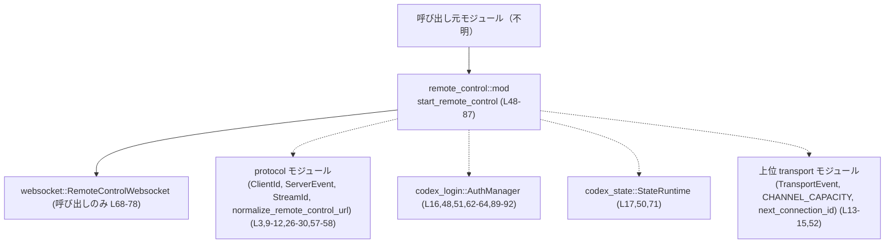

# app-server/src/transport/remote_control/mod.rs

## 0. ざっくり一言

リモートコントロール機能用の WebSocket クライアントを立ち上げ、その有効/無効フラグを `watch` チャネルで制御するエントリポイントと、認証情報の事前検証をまとめたモジュールです。  
あわせて、サーバ側イベント送信用のエンベロープ型と `ClientId` の再エクスポートも行っています。  
(app-server/src/transport/remote_control/mod.rs:L1-4,9,26-36,48-87,89-96)

---

## 1. このモジュールの役割

### 1.1 概要

- リモートコントロール用 WebSocket クライアント (`RemoteControlWebsocket`) を起動する非同期関数 `start_remote_control` を提供します。  
  (app-server/src/transport/remote_control/mod.rs:L6,48-87)
- リモートコントロール機能の有効/無効を切り替えるためのハンドル `RemoteControlHandle` を定義し、`watch::Sender<bool>` を通じてバックグラウンドタスクに通知します。  
  (同:L33-36,38-45,66-67,68-78)
- 認証情報の読み込みを行う `validate_remote_control_auth` を通じて、リモートコントロール有効化時の認証チェックをラップします。  
  (同:L7,62-64,89-96)
- サーバからクライアントへのイベント送信用のコンテナ `QueuedServerEnvelope` を定義します（具体的な利用箇所はこのチャンクには現れません）。  
  (同:L26-31)

### 1.2 アーキテクチャ内での位置づけ

このモジュールは `transport` モジュール配下の `remote_control` サブモジュールであり、同ディレクトリ内の `client_tracker`, `enroll`, `protocol`, `websocket` サブモジュールを束ねる位置にあります。  
(app-server/src/transport/remote_control/mod.rs:L1-4,13-15)

主要な依存関係を図にすると次のようになります。



呼び出し元（アプリケーションサーバ本体など）が `start_remote_control` を呼び出し、内部で `RemoteControlWebsocket` が生成・起動される構造になっています。  
`QueuedServerEnvelope` や各サブモジュールの詳細な連携は、このチャンクには現れません。

### 1.3 設計上のポイント

- **有効フラグのブロードキャスト**  
  `RemoteControlHandle` が `Arc<watch::Sender<bool>>` を保持し、`send_if_modified` により値が変化した場合のみ通知します。  
  (app-server/src/transport/remote_control/mod.rs:L33-36,38-45,66-67)
- **非同期タスクによるバックグラウンド処理**  
  WebSocket クライアントは `tokio::spawn` でバックグラウンドタスクとして起動され、`JoinHandle<()>` 経由で管理されます。  
  (同:L23,67-79)
- **認証の事前チェック**  
  `initial_enabled` が `true` の場合のみ、起動前に `validate_remote_control_auth` を呼び出して認証情報読み込みを試みます。  
  (同:L55-56,62-64)
- **イベント送信エンベロープ**  
  `QueuedServerEnvelope` には送信対象の `ClientId`, `StreamId`, 送信イベント `ServerEvent` に加えて、書き込み完了を通知するための `oneshot::Sender<()>` が含まれます。  
  (同:L26-31)
- **エラー処理方針**  
  - URL 正規化や認証読み込みは `io::Result` ベースでエラーを返却します。  
    (同:L48-59,89-96)
  - 認証読み込みにおいては `io::ErrorKind::WouldBlock` を成功扱いとし、それ以外のエラーのみを呼び出し元に伝播させます。  
    (同:L93-95)

---

## 2. 主要な機能一覧（コンポーネントインベントリ）

このチャンクに現れる主要な構造体・関数・再エクスポートの一覧です。

| 名前 | 種別 | 可視性 | 役割 / 用途 | 根拠 |
|------|------|--------|-------------|------|
| `QueuedServerEnvelope` | 構造体 | `pub(super)` | サーバからクライアントに送信するイベントと、その宛先や完了通知チャネルをまとめたコンテナ。実際の利用先はこのチャンクには現れません。 | app-server/src/transport/remote_control/mod.rs:L26-31 |
| `RemoteControlHandle` | 構造体 | `pub(crate)` | リモートコントロール機能の有効/無効を切り替えるためのハンドル。内部で `watch::Sender<bool>` を保持します。 | 同:L33-36,83-85 |
| `RemoteControlHandle::set_enabled` | メソッド | `pub(crate)` | 有効フラグを書き換え、値が変わったときだけ `watch` チャネル経由で通知します。 | 同:L38-45 |
| `start_remote_control` | 非同期関数 | `pub(crate)` | リモートコントロール用 WebSocket クライアントを起動し、そのタスクの `JoinHandle` と制御用ハンドル `RemoteControlHandle` を返します。 | 同:L48-87 |
| `validate_remote_control_auth` | 非同期関数 | `pub(crate)` | `AuthManager` を使ってリモートコントロール用の認証情報を読み込み、`WouldBlock` 以外の I/O エラーのみを呼び出し元に返します。 | 同:L89-96 |
| `ClientId` | 型（詳細不明） | `pub`（再エクスポート） | クライアントを識別する ID。`protocol` モジュールから再エクスポートされており、外部から `remote_control::ClientId` として利用できます。 | 同:L3,9 |

補助的な内部依存（`ServerEvent`, `StreamId`, `normalize_remote_control_url`, `RemoteControlWebsocket`, `load_remote_control_auth` など）は、次節以降で必要に応じて触れます。

---

## 3. 公開 API と詳細解説

### 3.1 型一覧（構造体・列挙体など）

| 名前 | 種別 | 可視性 | 役割 / 用途 | フィールド概要 | 根拠 |
|------|------|--------|-------------|----------------|------|
| `QueuedServerEnvelope` | 構造体 | `pub(super)` | サーバからクライアントへの送信イベントを 1 件分表すコンテナ。 | `event: ServerEvent`（送信するイベント）, `client_id: ClientId`（宛先クライアント）, `stream_id: StreamId`（ストリーム単位の識別子）, `write_complete_tx: Option<oneshot::Sender<()>>`（送信完了通知用のワンショットチャネル） | app-server/src/transport/remote_control/mod.rs:L26-31 |
| `RemoteControlHandle` | 構造体 | `pub(crate)` | リモートコントロール機能の有効/無効を切り替えるハンドル。アプリケーション側に返されます。 | `enabled_tx: Arc<watch::Sender<bool>>`（有効フラグ更新のブロードキャスト用） | 同:L33-36,83-85 |
| `ClientId` | 型（定義は別モジュール） | `pub`（再エクスポート） | リモートコントロールにおけるクライアント ID。実体は `protocol` モジュール側に定義されます。 | 不明（このチャンクには定義が現れません） | 同:L3,9 |

### 3.2 関数詳細

#### `RemoteControlHandle::set_enabled(&self, enabled: bool)`

**概要**

`RemoteControlHandle` が保持する `watch::Sender<bool>` に対して、有効フラグを書き込みます。値が変化した場合のみ購読側に通知が飛ぶように、`send_if_modified` を利用しています。  
(app-server/src/transport/remote_control/mod.rs:L33-36,38-45)

**引数**

| 引数名 | 型 | 説明 |
|--------|----|------|
| `self` | `&RemoteControlHandle` | 有効フラグの送信元ハンドルの参照です。 |
| `enabled` | `bool` | 新しく設定したい有効フラグ (`true` で有効、`false` で無効)。 |

**戻り値**

- 戻り値はなく、`()` を暗黙に返します。  
  (同:L39-45)

**内部処理の流れ**

1. `enabled_tx` に対して `send_if_modified` を呼び出し、クロージャに現在値の可変参照を渡します。  
   (同:L39-40)
2. クロージャ内で `changed` を `*state != enabled` により計算し、現在値と新しい値が異なるかを判定します。  
   (同:L41)
3. 現在値 `*state` を新しい値 `enabled` に更新します。  
   (同:L42)
4. `changed` をクロージャの戻り値として返し、値が変わったときだけ購読側に通知されます。  
   (同:L43-44)

**Examples（使用例）**

このメソッドは、`start_remote_control` から取得したハンドルに対して用いる想定です。

```rust
use std::sync::Arc;
use tokio::sync::mpsc;
use tokio_util::sync::CancellationToken;

// このモジュール内にある型・関数を利用する例です。
async fn example_toggle_remote_control(
    state_db: Option<Arc<StateRuntime>>,           // StateRuntime の実体は省略
    auth_manager: Arc<AuthManager>,               // 既存の AuthManager を想定
    transport_event_tx: mpsc::Sender<TransportEvent>,
) -> std::io::Result<()> {
    let shutdown_token = CancellationToken::new(); // シャットダウン用トークンを作成
    let app_server_client_name_rx = None;          // この例ではクライアント名は利用しない

    // リモートコントロールを初期有効状態で起動する
    let (_join_handle, handle) = start_remote_control(
        "wss://example.com/remote".to_string(),
        state_db,
        auth_manager,
        transport_event_tx,
        shutdown_token,
        app_server_client_name_rx,
        true,                                       // initial_enabled
    ).await?;                                       // エラー時は呼び出し元に伝播

    // 後から無効化する
    handle.set_enabled(false);                      // watch 経由でバックグラウンドタスクに通知

    Ok(())
}
```

**Errors / Panics**

- このメソッド自身は `Result` を返さず、明示的なエラー処理や `panic!` は含まれていません。  
  (app-server/src/transport/remote_control/mod.rs:L39-45)
- `watch::Sender::send_if_modified` は、購読者が 0 でもエラーにならない設計のため、ここから I/O エラーが発生することはありません（Tokio の仕様に基づく一般的知識）。

**Edge cases（エッジケース）**

- `enabled` がすでに現在値と同じ場合  
  - クロージャ内で `changed` が `false` になり、`send_if_modified` は購読側に通知しません。  
    (同:L41-44)
- すべての購読者がドロップされている場合  
  - `watch::Sender` は問題なく送信を完了しますが、受け取る側がいないため通知は消費されません（Tokio の仕様による）。

**使用上の注意点**

- 「同じ値を再送して再通知させる」といった用途には使えません。再通知が必要な場合は、`enabled` の値を一度反転させるなど別の設計が必要です。
- `RemoteControlHandle` 自体は `Clone` 可能であり、`Arc<watch::Sender<bool>>` を保持しているため、複数タスクから並行して `set_enabled` を呼んでもデータ競合は発生しない設計です。  
  (同:L33-36,38-45)

---

#### `start_remote_control(...) -> io::Result<(JoinHandle<()>, RemoteControlHandle)>`

```rust
pub(crate) async fn start_remote_control(
    remote_control_url: String,
    state_db: Option<Arc<StateRuntime>>,
    auth_manager: Arc<AuthManager>,
    transport_event_tx: mpsc::Sender<TransportEvent>,
    shutdown_token: CancellationToken,
    app_server_client_name_rx: Option<oneshot::Receiver<String>>,
    initial_enabled: bool,
) -> io::Result<(JoinHandle<()>, RemoteControlHandle)>
```

**概要**

リモートコントロール用 WebSocket クライアントを起動するメインのエントリポイントです。  
URL の正規化と認証情報の検証を行った上で、バックグラウンドタスクを `tokio::spawn` し、その `JoinHandle` と有効フラグ制御用の `RemoteControlHandle` を返します。  
(app-server/src/transport/remote_control/mod.rs:L48-87)

**引数**

| 引数名 | 型 | 説明 |
|--------|----|------|
| `remote_control_url` | `String` | リモートコントロール先を指す URL 文字列。正規化前の値です。 (L48-49) |
| `state_db` | `Option<Arc<StateRuntime>>` | アプリケーションの状態を扱う `StateRuntime` への参照。`None` の場合は状態 DB を利用しない想定です。 (L50,71) |
| `auth_manager` | `Arc<AuthManager>` | 認証情報の管理を行う `AuthManager` の共有ポインタ。WebSocket クライアントや認証検証で共有して使われます。 (L51,62-64,68-73) |
| `transport_event_tx` | `mpsc::Sender<TransportEvent>` | 上位のトランスポート層へイベントを報告するための非同期送信チャネル。 (L52,73) |
| `shutdown_token` | `CancellationToken` | シャットダウン要求を伝えるためのトークン。WebSocket タスクに渡されます。 (L53,74) |
| `app_server_client_name_rx` | `Option<oneshot::Receiver<String>>` | アプリケーションサーバ側のクライアント名を一度だけ受け取るためのワンショット受信チャネル。`None` なら利用しない想定です。 (L54,77) |
| `initial_enabled` | `bool` | リモートコントロール機能を起動時に有効にするかどうか。`true` なら URL 正規化と認証検証が行われます。 (L55-56,57-64,66) |

**戻り値**

- `Ok((join_handle, handle))`  
  - `join_handle: JoinHandle<()>` — バックグラウンドの WebSocket タスクを表すハンドル。`await` することで終了待ちができます。 (L67-79,81-83)  
  - `handle: RemoteControlHandle` — 有効/無効を切り替えるためのハンドル。 (L83-86)
- `Err(io::Error)`  
  - URL の正規化や認証情報読み込みで発生した I/O エラー。 (L57-59,62-64)

**内部処理の流れ**

1. **リモートコントロールターゲットの決定**  
   - `initial_enabled` が `true` なら、`normalize_remote_control_url(&remote_control_url)?` を呼び出し、その結果を `Some(...)` として `remote_control_target` に格納します。  
     ここでエラーが発生すると即座に `Err(io::Error)` を返します。  
     (L57-59)
   - `initial_enabled` が `false` なら、`remote_control_target` は `None` になります。  
     (L57-61)

2. **認証情報の検証（初期有効時のみ）**  
   - `initial_enabled` が `true` の場合、`validate_remote_control_auth(&auth_manager).await?` を呼びます。  
   - この呼び出しが `Err(io::Error)` を返した場合、関数全体もそのエラーを返して終了します。  
   (L62-64,89-96)

3. **有効フラグ用 `watch` チャネルの作成**  
   - `let (enabled_tx, enabled_rx) = watch::channel(initial_enabled);` で、有効フラグを `initial_enabled` に初期化した `watch` チャネルを生成します。  
   (L66)

4. **WebSocket タスクの起動**  
   - `tokio::spawn(async move { ... })` でバックグラウンドタスクを生成します。  
   - タスク内では `RemoteControlWebsocket::new(...)` を呼び、URL、ターゲット、状態 DB、認証管理、トランスポートイベント送信、シャットダウン用トークン、有効フラグの受信側 (`enabled_rx`) を渡しています。  
     (L67-76)
   - その後 `run(app_server_client_name_rx).await` を呼び出し、WebSocket クライアントのメインループを実行します。  
     (L77-78)

5. **ハンドルの返却**  
   - 上記で取得した `join_handle` と、`enabled_tx` を `Arc` に包んだ `RemoteControlHandle` をタプルで `Ok` として返します。  
     (L81-86)

**Examples（使用例）**

このモジュール内から `start_remote_control` を呼び出す簡単な例です（外部コンポーネントの生成方法は省略しています）。

```rust
use std::sync::Arc;
use tokio::sync::mpsc;
use tokio_util::sync::CancellationToken;

async fn example_start_remote_control(
    state_db: Option<Arc<StateRuntime>>,           // 既存の StateRuntime を渡す想定
    auth_manager: Arc<AuthManager>,               // 既存の AuthManager
    transport_event_tx: mpsc::Sender<TransportEvent>,
) -> std::io::Result<()> {
    let shutdown_token = CancellationToken::new();
    let app_server_client_name_rx = None;          // クライアント名が不要なら None

    // 初期有効状態でリモートコントロールを起動
    let (join_handle, handle) = start_remote_control(
        "wss://example.com/remote".to_string(),
        state_db,
        auth_manager,
        transport_event_tx,
        shutdown_token,
        app_server_client_name_rx,
        true,                                       // initial_enabled
    ).await?;                                       // URL 正規化や認証エラーがあればここで Err

    // 状況に応じて有効/無効を切り替え
    handle.set_enabled(false);

    // 必要ならどこかで join_handle.await して終了待ちを行う
    // join_handle.await.ok();

    Ok(())
}
```

**Errors / Panics**

- **`normalize_remote_control_url` のエラー**  
  - `initial_enabled == true` の場合にのみ呼ばれ、ここで I/O エラーが発生すると `start_remote_control` からそのまま `Err(io::Error)` が返されます。  
    (L57-59)
- **`validate_remote_control_auth` のエラー**  
  - 認証情報読み込みエラーのうち、`io::ErrorKind::WouldBlock` 以外のエラーが発生すると、やはり `Err(io::Error)` として返されます。  
    (L62-64,89-96)
- タスク起動 (`tokio::spawn`) や `watch::channel` の生成に伴う明示的なエラー処理やパニックは、このコードには含まれていません。  
  (L66-79)

**Edge cases（エッジケース）**

- `initial_enabled == false` の場合  
  - URL の正規化も `validate_remote_control_auth` も実行されません。  
    `remote_control_target` は `None` のまま `RemoteControlWebsocket::new` に渡されます。  
    (L57-64,68-71)  
  - 無効状態から有効化する際の URL や認証の扱いは `RemoteControlWebsocket` 側の実装に依存し、このチャンクからは分かりません。
- `state_db == None` の場合  
  - `RemoteControlWebsocket::new` に `None` として渡されますが、どのように扱われるかは `websocket` モジュール側の実装に依存します。  
    (L50,71)
- `app_server_client_name_rx == None` の場合  
  - `run(None)` に渡されるだけであり、クライアント名をどう扱うかは `RemoteControlWebsocket::run` の実装次第です。  
    (L54,77-78)

**使用上の注意点**

- **非同期コンテキスト必須**  
  - `async fn` であり、Tokio ランタイム上から `await` して呼び出す必要があります。  
- **起動前エラーの取り扱い**  
  - URL 正規化や認証読み込みに失敗すると、バックグラウンドタスクは起動されずに `Err(io::Error)` が返ります。そのため、呼び出し側で `Result` を適切に処理する必要があります。  
- **URL 正規化のタイミング**  
  - この関数からは「起動時に有効な場合」にしか URL 正規化が行われません。起動時に無効で、後から有効化するケースの挙動は `RemoteControlWebsocket` に依存し、このチャンクからは確認できません。  
  - 設計として「URL は事前に妥当である」という前提を置く場合は、呼び出し側で別途検証することも考えられます。
- **JoinHandle の管理**  
  - 戻り値の `JoinHandle<()>` を無視すると、バックグラウンドタスクの異常終了などを検知しづらくなります。必要に応じてどこかで `await` し、終了やエラーを監視する前提になります。

---

#### `validate_remote_control_auth(auth_manager: &Arc<AuthManager>) -> io::Result<()>`

**概要**

`AuthManager` を用いてリモートコントロール専用の認証情報を読み込み、その結果に応じて I/O エラーを返すかどうかを判定します。  
`io::ErrorKind::WouldBlock` の場合は「一時的に完了していない」と見なして成功扱いにする点が特徴です。  
(app-server/src/transport/remote_control/mod.rs:L7,89-96)

**引数**

| 引数名 | 型 | 説明 |
|--------|----|------|
| `auth_manager` | `&Arc<AuthManager>` | 認証情報を管理する `AuthManager` を共有する `Arc` への参照。 `load_remote_control_auth` にそのまま渡されます。 |

**戻り値**

- `Ok(())`  
  - 認証情報が正常に読み込まれた場合、または `io::ErrorKind::WouldBlock` によるエラーだった場合。  
- `Err(io::Error)`  
  - 上記以外の I/O エラーが発生した場合。  
(app-server/src/transport/remote_control/mod.rs:L92-96)

**内部処理の流れ**

1. `load_remote_control_auth(auth_manager).await` を呼び出し、結果を `match` で分岐します。  
   (L92)
2. `Ok(_)` の場合  
   - 認証情報の読み込みに成功したと見なし、`Ok(())` を返します。  
     (L93)
3. `Err(err)` かつ `err.kind() == io::ErrorKind::WouldBlock` の場合  
   - 一時的に完了していない、あるいは非同期的に処理されるべき状況と見なし、成功扱いで `Ok(())` を返します。  
     (L94)
4. それ以外の `Err(err)` の場合  
   - そのまま `Err(err)` を返します。  
     (L95)

**Examples（使用例）**

`start_remote_control` の外で単独に認証チェックを行う例です。

```rust
use std::sync::Arc;

async fn example_validate_only(auth_manager: Arc<AuthManager>) -> std::io::Result<()> {
    // Arc への参照を渡す
    validate_remote_control_auth(&auth_manager).await?;

    // この時点で致命的な I/O エラーは発生していないことが保証される
    Ok(())
}
```

**Errors / Panics**

- `load_remote_control_auth` が返す I/O エラーのうち、`io::ErrorKind::WouldBlock` 以外はそのまま呼び出し元に返されます。  
  (app-server/src/transport/remote_control/mod.rs:L92-96)
- パニックを明示的に発生させるコードは含まれていません。

**Edge cases（エッジケース）**

- 認証情報の永続化がまだ完了していないケースなどで `WouldBlock` が返る場合  
  - この関数は成功 (`Ok(())`) とみなすため、「この時点で認証情報は完全には整っていないが、起動を続行する」パターンを許容する設計になっています。  
    (L94)
- 認証情報ファイルが存在しない、フォーマット不正など、`WouldBlock` 以外のエラーの場合  
  - そのまま `Err(io::Error)` となり、`start_remote_control` の呼び出しは失敗します。  
    (L92-93,95)

**使用上の注意点**

- この関数は「**致命的な I/O エラーがないこと**」のみを保証します。実際にどのような認証方式が用いられ、どのようなセキュリティ特性を持つかは `load_remote_control_auth` の実装に依存し、このチャンクからは判断できません。
- `AuthManager` を `Arc` で共有する設計により、複数のタスクやコンポーネントが同じ認証状態を利用できますが、`AuthManager` 自体のスレッド安全性については外部クレートの実装に依存します。  
  (L16,51,62-64,89-92)

---

### 3.3 その他の関数

このチャンクに現れる関数は上記 3 つのみです。補助的な関数やラッパー関数は定義されていません。  
(app-server/src/transport/remote_control/mod.rs:L38-45,48-87,89-96)

---

## 4. データフロー

`start_remote_control` を起点とした典型的な処理シナリオを示します。

1. 呼び出し元が `start_remote_control` を `await` して呼び出す。  
2. `initial_enabled` が `true` の場合、URL 正規化と認証検証が行われる。  
3. `watch::channel` による有効フラグのブロードキャスト設定が行われる。  
4. `RemoteControlWebsocket::new(...).run(...)` を行うバックグラウンドタスクが `tokio::spawn` で起動される。  
5. 呼び出し元は `RemoteControlHandle` を通じて有効/無効状態を切り替え、それが `enabled_rx` 経由で WebSocket タスクに伝わる。  

(app-server/src/transport/remote_control/mod.rs:L48-79)

```mermaid
sequenceDiagram
    participant Caller as "呼び出し元 (不明)"
    participant RC as "start_remote_control (L48-87)"
    participant Auth as "validate_remote_control_auth (L89-96)"
    participant WS as "RemoteControlWebsocket::new().run() 呼び出し部 (L68-78)"

    Caller->>RC: start_remote_control(remote_control_url, ..., initial_enabled)
    alt initial_enabled == true
        RC->>Auth: validate_remote_control_auth(&auth_manager)
        AltOk: Auth-->>RC: Ok(())
        else Err
            Auth-->>RC: Err(io::Error)
            RC-->>Caller: Err(io::Error)
            note right of RC: URL 正規化や認証が失敗すると<br/>ここで処理終了 (L57-59,62-64)
        end
    else initial_enabled == false
        note over RC: URL 正規化と認証検証はスキップ (L57-64)
    end

    RC->>WS: tokio::spawn(async move {<br/>RemoteControlWebsocket::new(...).run(app_server_client_name_rx).await<br/>}) (L67-78)
    RC-->>Caller: Ok((JoinHandle, RemoteControlHandle)) (L81-86)

    Caller->>RC: handle.set_enabled(true/false) (L38-45)
    RC->>WS: enabled_rx 経由で有効フラグを通知 (L66-67,75-76)
```

`RemoteControlWebsocket` やその内部のデータフロー（`QueuedServerEnvelope` の利用など）は `websocket` モジュールの実装に依存し、このチャンクには現れません。

---

## 5. 使い方（How to Use）

### 5.1 基本的な使用方法

このモジュール内に補助関数を定義し、リモートコントロールを初期有効状態で起動する例です。

```rust
use std::sync::Arc;
use tokio::sync::mpsc;
use tokio_util::sync::CancellationToken;

async fn init_remote_control(
    state_db: Option<Arc<StateRuntime>>,
    auth_manager: Arc<AuthManager>,
    transport_event_tx: mpsc::Sender<TransportEvent>,
) -> std::io::Result<(tokio::task::JoinHandle<()>, RemoteControlHandle)> {
    // シャットダウントークンの生成
    let shutdown_token = CancellationToken::new();

    // アプリケーションサーバ側クライアント名はここでは取得しない
    let app_server_client_name_rx = None;

    // リモートコントロールを有効状態で開始する
    let (join_handle, handle) = start_remote_control(
        "wss://example.com/remote".to_string(), // 接続先 URL
        state_db,                               // 状態 DB（不要なら None）
        auth_manager,                           // 認証管理
        transport_event_tx,                     // トランスポートイベント送信
        shutdown_token,                         // シャットダウン制御
        app_server_client_name_rx,              // クライアント名受信（不要なら None）
        true,                                   // initial_enabled
    ).await?;                                   // URL 正規化・認証エラー時は Err

    Ok((join_handle, handle))
}
```

このコードでは、`start_remote_control` に必要な依存（`StateRuntime`, `AuthManager`, `TransportEvent` 送信チャネルなど）は既存のものをそのまま渡す前提です。生成方法はこのチャンクには現れません。

### 5.2 よくある使用パターン

1. **起動時は無効にしておき、後から有効化する**

```rust
async fn start_disabled_then_enable_later(
    state_db: Option<Arc<StateRuntime>>,
    auth_manager: Arc<AuthManager>,
    transport_event_tx: mpsc::Sender<TransportEvent>,
) -> std::io::Result<RemoteControlHandle> {
    let shutdown_token = CancellationToken::new();

    // initial_enabled = false なので、URL 正規化と認証検証はこの時点では行われない
    let (_join_handle, handle) = start_remote_control(
        "wss://example.com/remote".to_string(),
        state_db,
        auth_manager,
        transport_event_tx,
        shutdown_token,
        None,
        false,                                     // initial_enabled
    ).await?;

    // 必要なタイミングで有効化
    handle.set_enabled(true);

    Ok(handle)
}
```

1. **認証のみ事前チェックしてから起動する**

```rust
async fn validate_and_start(
    state_db: Option<Arc<StateRuntime>>,
    auth_manager: Arc<AuthManager>,
    transport_event_tx: mpsc::Sender<TransportEvent>,
) -> std::io::Result<()> {
    // 事前に認証情報をチェック
    validate_remote_control_auth(&auth_manager).await?;

    // チェック後にinitial_enabled = true で起動
    let _ = start_remote_control(
        "wss://example.com/remote".to_string(),
        state_db,
        auth_manager,
        transport_event_tx,
        CancellationToken::new(),
        None,
        true,
    ).await?;

    Ok(())
}
```

### 5.3 よくある間違い

```rust
// 間違い例 1: Result を無視して起動を試みる
async fn bad_ignore_errors(
    state_db: Option<Arc<StateRuntime>>,
    auth_manager: Arc<AuthManager>,
    transport_event_tx: mpsc::Sender<TransportEvent>,
) {
    // エラーを捨ててしまうと、URL や認証の問題に気付きにくい
    let _ = start_remote_control(
        "invalid url".to_string(),
        state_db,
        auth_manager,
        transport_event_tx,
        CancellationToken::new(),
        None,
        true,
    ).await;
}

// 正しい例: ? や match でエラーを扱う
async fn good_handle_errors(
    state_db: Option<Arc<StateRuntime>>,
    auth_manager: Arc<AuthManager>,
    transport_event_tx: mpsc::Sender<TransportEvent>,
) -> std::io::Result<()> {
    let result = start_remote_control(
        "invalid url".to_string(),
        state_db,
        auth_manager,
        transport_event_tx,
        CancellationToken::new(),
        None,
        true,
    ).await;

    match result {
        Ok((_join_handle, handle)) => {
            handle.set_enabled(true);
            Ok(())
        }
        Err(e) => {
            // ログ出力やユーザーへの通知など
            Err(e)
        }
    }
}
```

```rust
// 間違い例 2: set_enabled で再通知を期待する
async fn bad_expect_retrigger(handle: RemoteControlHandle) {
    // すでに true の状態だと仮定
    handle.set_enabled(true); // send_if_modified により通知されない可能性がある
}
```

### 5.4 使用上の注意点（まとめ）

- **非同期ランタイムへの依存**  
  - `start_remote_control` と `validate_remote_control_auth` はどちらも `async fn` であり、Tokio ランタイム上で `await` されることを前提としています。  
    (app-server/src/transport/remote_control/mod.rs:L48,89)
- **エラー処理の明示性**  
  - URL 正規化や認証読み込みエラーは `io::Result` を通じて明示的に返されます。呼び出し側は必ず `Result` を処理する必要があります。  
    (L57-59,62-64,89-96)
- **セキュリティ上の観点（このチャンクから分かる範囲）**  
  - 認証情報の実際の内容や検証ロジックは `load_remote_control_auth` の実装に依存し、このチャンクだけでは評価できません。  
  - `io::ErrorKind::WouldBlock` を成功扱いにするため、「認証情報がまだ準備中」の場合でも処理を続行しうる点に注意が必要です。  
    (L92-95)
- **並行性とスレッド安全性**  
  - `AuthManager`, `StateRuntime` は `Arc` で共有され、`watch::Sender<bool>` もスレッド安全な送信を提供するため、複数タスク間での共有を前提とした設計になっています。  
    (L16-17,33-36,48-53,66-67)
  - バックグラウンドの WebSocket タスクは `JoinHandle<()>` のみが唯一の制御手段であり、キャンセルは `CancellationToken` を通じて行われます（具体的なキャンセル処理は `RemoteControlWebsocket` の実装に依存）。  
    (L53,67-79)
- **観測性（このチャンクからの情報）**  
  - このファイル内ではログ出力やメトリクス送出は行っていません。実際の観測性は `websocket` モジュールや上位モジュール側の実装に依存します。

---

## 6. 変更の仕方（How to Modify）

### 6.1 新しい機能を追加する場合

- **有効状態の読み取り API を追加したい場合**  
  - `RemoteControlHandle` に `is_enabled(&self) -> bool` のようなメソッドを追加し、`watch::Sender<bool>` から現在値を取得する形が考えられます。  
    追加場所は既存の `impl RemoteControlHandle` ブロックです。  
    (app-server/src/transport/remote_control/mod.rs:L38-45)
- **起動時に追加の設定を渡したい場合**  
  - `start_remote_control` の引数に新しい設定値を追加し、そのまま `RemoteControlWebsocket::new` へ引き渡す形になります。  
    既存のパラメータの渡し方と同様に、`tokio::spawn` 内の `new(...)` の呼び出しを拡張します。  
    (L68-76)
- **認証ロジックを拡張したい場合**  
  - `validate_remote_control_auth` の内部で `load_remote_control_auth` の結果に対して追加のチェックを行う、あるいは別のヘルパー関数を呼び出すように変更します。  
    (L92-96)

### 6.2 既存の機能を変更する場合

- **`QueuedServerEnvelope` のフィールドを変更する場合**  
  - この構造体は `pub(super)` であり、同一モジュール階層（`remote_control` 以下）から利用されている可能性があります。  
    変更時には `client_tracker`, `websocket` などのサブモジュールにおける利用箇所を検索して、影響範囲を確認する必要があります。  
    (L1-4,26-31)
- **`start_remote_control` のインターフェース変更**  
  - 戻り値のタプル構成や `io::Result` の扱いを変えると、アプリケーション本体側の呼び出しコードに影響します。シグネチャやエラー条件は事実上の「契約」として扱われていると考えられます。  
    (L48-56,81-86)
- **エラー条件（Contracts / Edge Cases）を変える場合**  
  - 例えば `io::ErrorKind::WouldBlock` をエラー扱いに変更すると、`start_remote_control` からの失敗パターンが増えます。  
    その場合は呼び出し側でのエラー処理を見直す必要があります。  
    (L92-96)
- **テストとの関係**  
  - このファイルには `#[cfg(test)] mod tests;` が定義されていますが、その中身はこのチャンクには現れません。  
    仕様変更の際には、このテストモジュール内のテストケースを確認・更新する必要があります。  
    (L99-100)

---

## 7. 関連ファイル

このモジュールと密接に関係するモジュール・外部クレートを、分かる範囲で一覧にします。

| パス / モジュール名 | 役割 / 関係 | 根拠 |
|---------------------|------------|------|
| `client_tracker` モジュール | リモートコントロールクライアントのトラッキングに関わるモジュール名と推測されますが、具体的な実装はこのチャンクには現れません。 | app-server/src/transport/remote_control/mod.rs:L1 |
| `enroll` モジュール | リモートコントロールクライアントの登録処理に関わると推測されるモジュール名ですが、詳細は不明です。 | 同:L2 |
| `protocol` モジュール | `ClientId`, `ServerEvent`, `StreamId`, `normalize_remote_control_url` の定義を提供します。 | 同:L3,9-12,26-30,57-58 |
| `websocket` モジュール | `RemoteControlWebsocket`, `load_remote_control_auth` の実装を提供し、WebSocket 通信・認証読み込みのコアロジックを担当します。 | 同:L4,6-7,68-78,92 |
| 親モジュール `transport` | `CHANNEL_CAPACITY`, `TransportEvent`, `next_connection_id` などを定義し、トランスポート層全体の設定とイベント型を提供します。 | 同:L13-15,52 |
| 外部クレート `codex_login::AuthManager` | 認証情報の管理コンポーネント。リモートコントロール認証にも利用されます。 | 同:L16,51,62-64,89-92 |
| 外部クレート `codex_state::StateRuntime` | アプリケーション状態の管理コンポーネント。リモートコントロール機能が状態にアクセスする際に利用されます。 | 同:L17,50,71 |
| `tests` モジュール | このモジュール専用のテストコードを含むと考えられますが、中身はこのチャンクには現れません。 | 同:L99-100 |

このチャンクには `unsafe` ブロックや低レベルなメモリ操作は現れず、Tokio の非同期プリミティブ（`mpsc`, `oneshot`, `watch`, `tokio::spawn`, `CancellationToken`）を利用した高レベルな並行処理で構成されている点が特徴です。
