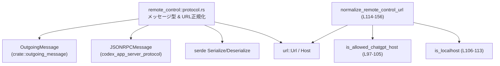
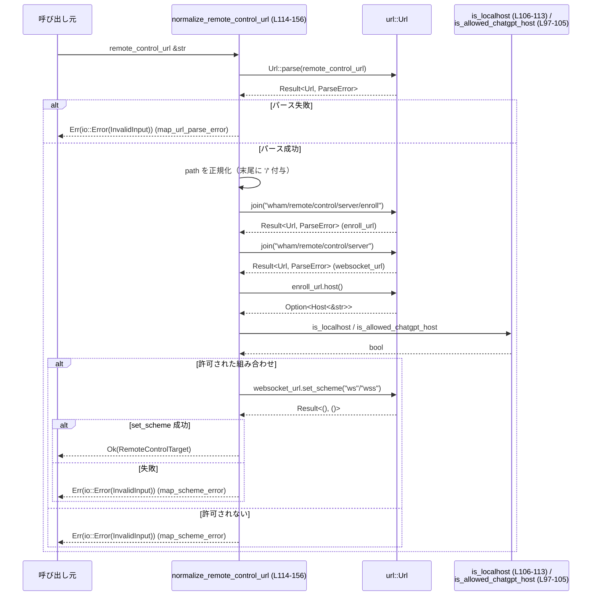

# app-server/src/transport/remote_control/protocol.rs

## 0. ざっくり一言

リモート制御機能のための **クライアント／サーバ間メッセージの型定義** と、リモート制御サーバの **URL正規化（バリデーション＋WebSocket URL生成）** を行うモジュールです（protocol.rs:L9-13, L37-96, L114-156）。

---

## 1. このモジュールの役割

### 1.1 概要

- リモート制御プロトコルで用いる ID・イベント・エンベロープ型を定義し、JSON シリアライズ／デシリアライズに必要な `serde` 属性を付与しています（protocol.rs:L26-96）。
- リモート制御サーバへの接続 URL を受け取り、**許可されたホスト／スキームのみを受理**しつつ、HTTP(S) と WS(S) のペア URL を生成します（protocol.rs:L114-156）。
- これにより、アプリケーションサーバは安全な接続先に対して、統一された形式で WebSocket 接続と enroll エンドポイントを扱うことができます。

### 1.2 アーキテクチャ内での位置づけ

このモジュールは「リモート制御トランスポート層」の一部として、メッセージ表現と URL 正規化を提供します。

- 外部依存:
  - `OutgoingMessage`（アプリ側からリモートクライアントへ送るメッセージ型）（protocol.rs:L1）
  - `JSONRPCMessage`（リモートクライアントからの JSON-RPC メッセージ）（protocol.rs:L2）
  - `url` クレートの `Url` / `Host`（URL 解析とホスト判定）（protocol.rs:L7-8）
  - `serde` による JSON シリアライズ／デシリアライズ（protocol.rs:L3-4, L26-31, L37-96）
- 内部依存:
  - `normalize_remote_control_url` が `is_allowed_chatgpt_host` と `is_localhost` を利用して URL を検証します（protocol.rs:L136-151, L97-113）。



### 1.3 設計上のポイント

- **新しい型での識別子表現**  
  `ClientId` と `StreamId` を `String` の newtype として定義し、型レベルで ID の取り違えを防いでいます（protocol.rs:L26-31）。
- **メッセージのラップ構造**  
  `ClientEvent` / `ServerEvent` と、それらをラップする `ClientEnvelope` / `ServerEnvelope` を分離することで、イベント内容とルーティング情報（client_id, stream_id, seq_id）を明確に分けています（protocol.rs:L37-96）。
- **序数ベースの ACK カーソル**  
  `ClientEvent::Ack` と `ClientEnvelope.seq_id` のコメントで、「seq_id はクライアント単位のカーソルであり、ストリーム単位ではない」という契約を明示しています（protocol.rs:L43-46, L60-63）。
- **ホワイトリストベースの URL 検証**  
  `normalize_remote_control_url` は chatgpt.com / chatgpt-staging.com / localhost (+ ループバック IP) への接続のみを受理し、他のホストやスキームをすべて `InvalidInput` エラーとして拒否します（protocol.rs:L97-113, L143-151, L210-227）。
- **エラー処理の一元化**  
  URL パースエラー (`url::ParseError`) とスキームエラー（独自条件違反）を、それぞれ専用のクロージャで `io::Error` に変換しています（protocol.rs:L117-130）。

---

## 2. 主要な機能一覧

- クライアント ID／ストリーム ID の型定義とランダム生成
- クライアントからサーバへのイベント (`ClientEvent`) とエンベロープ (`ClientEnvelope`) の表現
- サーバからクライアントへのイベント (`ServerEvent`) とエンベロープ (`ServerEnvelope`) の表現
- サーバ登録リクエスト／レスポンス (`EnrollRemoteServerRequest`, `EnrollRemoteServerResponse`) の表現
- リモート制御サーバ URL の正規化と安全な WebSocket URL の生成 (`normalize_remote_control_url`)
- chatgpt.com / chatgpt-staging.com / localhost のホスト判定ユーティリティ（`is_allowed_chatgpt_host`, `is_localhost`）

---

## 3. 公開 API と詳細解説

### 3.1 型一覧（構造体・列挙体など）

> 「定義位置」は `protocol.rs:L開始-終了` 形式です。

| 名前 | 種別 | 公開範囲 | 役割 / 用途 | 定義位置 |
|------|------|----------|-------------|----------|
| `RemoteControlTarget` | 構造体 | `pub(super)` | 正規化されたリモート制御サーバの `websocket_url` と `enroll_url` をまとめたターゲット情報（protocol.rs:L9-13） | protocol.rs:L9-13 |
| `EnrollRemoteServerRequest` | 構造体 | `pub(super)` | リモートサーバを enroll する際のリクエストボディ。サーバ名・OS・アーキテクチャ・アプリバージョンを保持（protocol.rs:L14-20） | protocol.rs:L14-20 |
| `EnrollRemoteServerResponse` | 構造体 | `pub(super)` | enroll API から返される `server_id` / `environment_id` を保持（protocol.rs:L21-25） | protocol.rs:L21-25 |
| `ClientId` | newtype 構造体 | `pub` | クライアントを一意に識別する ID のラッパー。JSON 上は単なる文字列（`#[serde(transparent)]`）（protocol.rs:L26-28） | protocol.rs:L26-28 |
| `StreamId` | newtype 構造体 | `pub` | クライアント内のストリームを識別する ID のラッパー。`new_random` により UUID v7 ベースで生成（protocol.rs:L29-35） | protocol.rs:L29-35 |
| `ClientEvent` | enum | `pub` | クライアント → サーバのイベント。JSON-RPC メッセージ、ACK、Ping、ClientClosed を表現（protocol.rs:L37-49） | protocol.rs:L37-49 |
| `ClientEnvelope` | 構造体 | `pub(crate)` | `ClientEvent` に `client_id` / `stream_id` / `seq_id` / `cursor` を付与したラッパー。シリアライズ時にフラットな JSON になる（protocol.rs:L51-65） | protocol.rs:L51-65 |
| `PongStatus` | enum | `pub` | サーバ → クライアント Ping/Pong のステータス（Active / Unknown）（protocol.rs:L67-72） | protocol.rs:L67-72 |
| `ServerEvent` | enum | `pub` | サーバ → クライアントのイベント。`OutgoingMessage` ラップ、Ack、Pong を表現（protocol.rs:L73-83） | protocol.rs:L73-83 |
| `ServerEnvelope` | 構造体 | `pub(crate)` | `ServerEvent` に `client_id` / `stream_id` / `seq_id` を付与したラッパー。サーバからのメッセージ配送単位（protocol.rs:L85-95） | protocol.rs:L85-95 |

### 3.2 関数詳細

#### `StreamId::new_random() -> StreamId`

**概要**

- 新しい `StreamId` を UUID v7 文字列から生成します（protocol.rs:L32-35）。
- ストリームごとの一意な識別子を簡便に作成するためのユーティリティです。

**引数**

なし（関連関数）。

**戻り値**

- `StreamId`  
  - 内部の `String` は `uuid::Uuid::now_v7().to_string()` の結果です（protocol.rs:L34）。

**内部処理の流れ**

1. `uuid::Uuid::now_v7()` を呼び出して UUID v7 を生成する（protocol.rs:L34）。
2. それを `to_string()` で文字列化する。
3. 生成した文字列をラップして `StreamId` として返す（protocol.rs:L34）。

**Examples（使用例）**

```rust
use crate::transport::remote_control::protocol::StreamId;

fn start_new_stream() {
    // 新しいストリームごとに一意の ID を生成する                         // protocol.rs:L32-35 に対応
    let stream_id = StreamId::new_random();
    println!("new stream id: {}", stream_id.0); // .0 で内部の String にアクセス
}
```

**Errors / Panics**

- この関数内で `Result` や `Option` を扱っておらず、明示的なエラーや panic を発生させるコードはありません（protocol.rs:L32-35）。
- `uuid::Uuid::now_v7()` が panic する可能性は、このファイルだけからは判断できません。

**Edge cases（エッジケース）**

- エッジケースに対する特別な分岐はなく、常に UUID v7 ベースの ID を生成します。
- 連続呼び出し時の一意性保証の度合いは UUID 実装依存であり、このファイルからは詳細不明です。

**使用上の注意点**

- `StreamId` は単なるラッパーなので、ID の比較には `==` が使えます（`PartialEq, Eq, Hash` を derive、protocol.rs:L29）。
- 表示やログ出力時には `stream_id.0` にアクセスする必要があります（`#[serde(transparent)]` ではないため、JSON シリアライズ時は自動で文字列になりますが、Rust コードからはフィールド）が必要です。

---

#### `fn is_allowed_chatgpt_host(host: &Option<Host<&str>>) -> bool`

**概要**

- 与えられた `Host` が `chatgpt.com` または `chatgpt-staging.com`（およびそのサブドメイン）であるかどうかを判定します（protocol.rs:L97-105）。
- `normalize_remote_control_url` の内部で、chatgpt 系ホストの許可判定に利用されます（protocol.rs:L144）。

**引数**

| 引数名 | 型 | 説明 |
|--------|----|------|
| `host` | `&Option<Host<&str>>` | `Url::host()` の結果。`None` や IP アドレスの可能性もあります（protocol.rs:L142）。 |

**戻り値**

- `bool`  
  - 許可された chatgpt 系ドメインなら `true`、それ以外は `false`（protocol.rs:L101-104）。

**内部処理の流れ**

1. `let Some(Host::Domain(host)) = *host else { return false; };` により、`Some(Host::Domain(...))` の場合だけ中身のドメイン名文字列を取得し、それ以外（`None`・IP アドレスなど）は即 `false` を返します（protocol.rs:L97-100）。
2. ドメイン文字列が以下のいずれかに該当するかを判定します（protocol.rs:L101-104）。
   - `"chatgpt.com"`
   - `"chatgpt-staging.com"`
   - `".chatgpt.com"` で終わる（サブドメイン）
   - `".chatgpt-staging.com"` で終わる（サブドメイン）

**Examples（使用例）**

```rust
use url::{Url, Host};

fn is_chatgpt(url: &str) -> bool {
    let url = Url::parse(url).expect("valid URL");                // URL をパース
    let host = url.host();                                        // Option<Host<&str>>
    super::is_allowed_chatgpt_host(&host)                         // protocol.rs:L97-105 を利用
}

assert!(is_chatgpt("https://chatgpt.com/backend-api"));
assert!(is_chatgpt("https://api.chatgpt-staging.com/backend-api"));
assert!(!is_chatgpt("https://chatgpt.com.evil.com/backend-api")); // テストで検証済み, protocol.rs:L215
```

**Errors / Panics**

- `is_allowed_chatgpt_host` 自体は panic しません（`match` ではなく `let-else` による分岐のみ、protocol.rs:L97-100）。
- 呼び出し側の `Url::parse` などは別途エラーを返すことがありますが、この関数の外側の話です。

**Edge cases（エッジケース）**

- `host` が `None` の場合、`false` を返します（protocol.rs:L97-100）。
- IP アドレス（`Host::Ipv4` / `Host::Ipv6`）の場合も `false` です（同上）。
- `chatgpt.com.evil.com` のような文字列は、`.chatgpt.com` で終わらないため `false` になります（テストで検証、protocol.rs:L215-217, L210-227）。

**使用上の注意点**

- chatgpt 系以外の許可ドメインを追加したい場合は、この関数に判定ロジックを追加する必要があります。
- サブドメイン判定は単純な `ends_with` に基づいているため、ドット区切りを前提とした仕様です（protocol.rs:L103-104）。

---

#### `fn is_localhost(host: &Option<Host<&str>>) -> bool`

**概要**

- 与えられた `Host` がローカルホスト（`localhost` ドメインまたはループバック IP アドレス）であるかを判定します（protocol.rs:L106-113）。
- `normalize_remote_control_url` 内で、localhost 許可判定に利用されます（protocol.rs:L143-148）。

**引数**

| 引数名 | 型 | 説明 |
|--------|----|------|
| `host` | `&Option<Host<&str>>` | `Url::host()` の結果。`None` やドメイン名、IP アドレスが含まれます。 |

**戻り値**

- `bool`  
  - `localhost` もしくはループバック IP の場合 `true`、それ以外では `false`（protocol.rs:L106-112）。

**内部処理の流れ**

1. `match host { ... }` で `host` のパターンを判定します（protocol.rs:L107-112）。
2. 次のいずれかに該当すれば `true` を返します。
   - `Some(Host::Domain("localhost"))`
   - `Some(Host::Ipv4(ip))` かつ `ip.is_loopback()`（127.0.0.0/8）
   - `Some(Host::Ipv6(ip))` かつ `ip.is_loopback()`（`::1` など）
3. 上記以外は `_ => false` として `false` を返します。

**Examples（使用例）**

```rust
use url::Url;

fn is_local(url: &str) -> bool {
    let url = Url::parse(url).expect("valid URL");
    let host = url.host();
    super::is_localhost(&host)                                  // protocol.rs:L106-113 を利用
}

assert!(is_local("http://localhost:8080/backend-api"));
assert!(is_local("http://127.0.0.1:8080/backend-api"));
assert!(!is_local("http://foo.localhost:8080/backend-api"));   // テストで拒否, protocol.rs:L217
```

**Errors / Panics**

- この関数自体は panic を発生させません。`match` で全パターンを網羅しているためです（protocol.rs:L107-112）。

**Edge cases（エッジケース）**

- `foo.localhost` のような「.localhost」サフィックスを持つドメインは対象外です（`Host::Domain("localhost")` にしかマッチしない、protocol.rs:L108 & L217）。
- `host` が `None` の場合、`false` を返します（`_ => false`、protocol.rs:L112）。

**使用上の注意点**

- `localhost` 以外の開発用ホスト名（例: `dev.local`）を許可したい場合は、この関数にパターンを追加する必要があります。
- ループバックアドレス判定は `ip.is_loopback()` に依存しており、OS の定義に従います。

---

#### `pub(super) fn normalize_remote_control_url(remote_control_url: &str) -> io::Result<RemoteControlTarget>`

**概要**

- リモート制御サーバのベース URL 文字列を受け取り、以下を行います（protocol.rs:L114-156）。
  - URL 文字列のパースと正規化（末尾 `/` の付与）。
  - enroll 用 URL (`.../wham/remote/control/server/enroll`) の構築。
  - WebSocket 用 URL (`ws`/`wss`) の構築とスキーム変換。
  - ホスト／スキームが許可される組み合わせかを判定し、違反していれば `InvalidInput` エラーを返す。
- 成功すると、`websocket_url` と `enroll_url` を持つ `RemoteControlTarget` を返します（protocol.rs:L152-155）。

**引数**

| 引数名 | 型 | 説明 |
|--------|----|------|
| `remote_control_url` | `&str` | ベースとなる HTTP(S) URL 文字列。末尾 `/` の有無はどちらでもよく、関数内で正規化されます（protocol.rs:L114-116, L132-135）。 |

**戻り値**

- `io::Result<RemoteControlTarget>`  
  - `Ok(RemoteControlTarget)`：正規化と検証に成功した場合（protocol.rs:L152-155）。  
  - `Err(io::Error)`：入力が不正な URL 形式、または許可されないホスト／スキームの組み合わせである場合（protocol.rs:L117-130, L150）。

**内部処理の流れ（アルゴリズム）**

1. **エラーマッパの定義**  
   - `map_url_parse_error`: `url::ParseError` を `io::ErrorKind::InvalidInput` でラップし、メッセージに元の URL とエラー内容を含めます（protocol.rs:L117-122）。
   - `map_scheme_error`: スキームやホスト条件違反時に使う共通エラー。入力 URL を含めつつ、「chatgpt.com / chatgpt-staging.com の HTTPS または localhost の HTTP/HTTPS であるべき」と説明します（protocol.rs:L123-130）。

2. **URL のパースとパス正規化**  
   - `Url::parse(remote_control_url)` を実行し、失敗した場合は `map_url_parse_error` で `Err` を返します（protocol.rs:L131）。
   - パス末尾が `/` でない場合は、`"{path}/"` をセットし直して末尾に `/` を付与します（protocol.rs:L132-135）。

3. **enroll URL と WebSocket URL の構築**  
   - `remote_control_url.join("wham/remote/control/server/enroll")` で enroll URL を生成（protocol.rs:L136-138）。
   - `remote_control_url.join("wham/remote/control/server")` で WebSocket URL のベースを生成（protocol.rs:L139-141）。
   - いずれも `map_url_parse_error` でエラーを `io::Error` に変換します。

4. **ホストとスキームに基づく判定・変換**  
   - `let host = enroll_url.host();` でホストを取得（protocol.rs:L142）。
   - `match enroll_url.scheme()` でスキームごとに分岐（protocol.rs:L143-151）:
     - `"https"` かつ `is_localhost(&host)` または `is_allowed_chatgpt_host(&host)` → WebSocket URL のスキームを `"wss"` に変更（`set_scheme("wss")`）し、失敗時は `map_scheme_error` でエラー化（protocol.rs:L144-146）。
     - `"http"` かつ `is_localhost(&host)` → WebSocket URL のスキームを `"ws"` に変更（`set_scheme("ws")`）し、失敗時は `map_scheme_error` でエラー化（protocol.rs:L147-149）。
     - その他 → 即座に `Err(map_scheme_error(()))` を返却（protocol.rs:L150）。

5. **`RemoteControlTarget` の構築**  
   - `websocket_url.to_string()` と `enroll_url.to_string()` をフィールドに持つ `RemoteControlTarget` を返します（protocol.rs:L152-155）。

**Examples（使用例）**

1. **本番環境（chatgpt.com）での利用**

```rust
use std::io;
use crate::transport::remote_control::protocol::normalize_remote_control_url;

fn setup_remote_control() -> io::Result<()> {
    // chatgpt.com の HTTPS URL をベースとして与える                  // テストと対応, protocol.rs:L162-172
    let target = normalize_remote_control_url("https://chatgpt.com/backend-api")?;

    // WebSocket 接続先
    assert_eq!(
        target.websocket_url,
        "wss://chatgpt.com/backend-api/wham/remote/control/server"
    );
    // enroll 用 HTTPS エンドポイント
    assert_eq!(
        target.enroll_url,
        "https://chatgpt.com/backend-api/wham/remote/control/server/enroll"
    );

    Ok(())
}
```

1. **ローカル開発環境（localhost HTTP）の利用**

```rust
use std::io;
use crate::transport::remote_control::protocol::normalize_remote_control_url;

fn setup_local_remote_control() -> io::Result<()> {
    // localhost HTTP URL を与える                                   // テストと対応, protocol.rs:L187-197
    let target = normalize_remote_control_url("http://localhost:8080/backend-api")?;

    assert_eq!(
        target.websocket_url,
        "ws://localhost:8080/backend-api/wham/remote/control/server"
    );
    assert_eq!(
        target.enroll_url,
        "http://localhost:8080/backend-api/wham/remote/control/server/enroll"
    );

    Ok(())
}
```

1. **許可されない URL の例**

```rust
use std::io::{self, ErrorKind};
use crate::transport::remote_control::protocol::normalize_remote_control_url;

fn try_unsupported() {
    let err = normalize_remote_control_url("https://example.com/backend-api")
        .expect_err("unsupported URL should be rejected");    // protocol.rs:L210-227

    assert_eq!(err.kind(), ErrorKind::InvalidInput);
    // エラーメッセージはテストが期待する形式と一致する
}
```

**Errors / Panics**

- **エラー条件**
  - `Url::parse(remote_control_url)` が失敗した場合  
    → `ErrorKind::InvalidInput` で `"invalid remote control URL`{...}`: {err}`" というメッセージの `io::Error` を返します（protocol.rs:L117-122, L131）。
  - `join(...)` に失敗した場合（通常は異常な URL 構造時）  
    → 同じく `map_url_parse_error` で `InvalidInput` エラー（protocol.rs:L136-141）。
  - ホスト／スキーム組み合わせが許可されていない場合  
    → `"invalid remote control URL`{...}`; expected HTTPS URL for chatgpt.com or chatgpt-staging.com, or HTTP/HTTPS URL for localhost"` という `InvalidInput` エラー（protocol.rs:L123-130, L143-151）。
- **panic**
  - この関数内で `unwrap` / `expect` は使用されておらず、想定されるエラーはすべて `Result` で返されています（protocol.rs:L114-156）。
  - テストコードでは `expect` を使用していますが、本番コードパスには含まれません（protocol.rs:L164-165, L175-176, L189-190, L199-200）。

**Edge cases（エッジケース）**

- **末尾 `/` の有無**  
  - `https://chatgpt.com/backend-api` と `https://chatgpt.com/backend-api/` はどちらも `/backend-api/` に正規化され、結果の URL は同一形式になります（protocol.rs:L132-135）。
- **ホスト値**
  - `localhost`（ドメイン）とループバック IP は許可されます（`is_localhost`、protocol.rs:L106-113）。
  - `chatgpt.com` および `*.chatgpt.com`、`chatgpt-staging.com` および `*.chatgpt-staging.com` は HTTPS のみ許可されます（protocol.rs:L97-105, L143-146）。
  - `foo.localhost` のようなサブドメインは拒否されるようテストされています（protocol.rs:L217）。
- **スキーム**
  - chatgpt 系ホストでは `https` のみ許可（`http://chatgpt.com` はテストで拒否、protocol.rs:L212）。
  - localhost では `http` / `https` の両方を許可し、それぞれ `ws` / `wss` に対応させています（protocol.rs:L144-149, L187-207）。
- **ポート番号**
  - ポート番号は URL に含まれるものがそのまま使用されます。特別な制限や変換はありません（protocol.rs:L136-155）。

**使用上の注意点**

- 許可される URL は **限定的** です。新たなホストや環境をサポートする場合は、`is_allowed_chatgpt_host` / `is_localhost` と `normalize_remote_control_url` のロジック・テストを一貫して更新する必要があります。
- エラーはすべて `ErrorKind::InvalidInput` になります。どの条件で失敗したかを区別したい場合は、エラーメッセージ文字列で判別する必要があります（protocol.rs:L117-121, L123-130）。
- この関数は純粋（外部状態を持たない）であり、並行呼び出しによる競合はありません。`Url` や `String` はスレッドローカルに扱われます。

---

### 3.3 その他の関数

テストを除く補助関数の一覧です。

| 関数名 | 役割（1 行） | 定義位置 |
|--------|--------------|----------|
| `is_allowed_chatgpt_host` | `Host` が chatgpt.com / chatgpt-staging.com およびそのサブドメインかどうかを判定するヘルパー | protocol.rs:L97-105 |
| `is_localhost` | `Host` が `localhost` ドメインまたはループバック IP かどうかを判定するヘルパー | protocol.rs:L106-113 |

テストモジュール内の `normalize_remote_control_url_*` 関数（`#[test]`）は、`normalize_remote_control_url` の仕様検証専用であり、公開 API ではありません（protocol.rs:L161-229）。

---

## 4. データフロー

ここでは、リモート制御 URL 正規化の代表的なデータフローを示します。

### URL 正規化と WebSocket URL 生成のフロー

入力として一つの文字列 URL を受け取り、検証・変換を経て `RemoteControlTarget` を返す流れです（protocol.rs:L114-156）。



要点:

- エラーはすべて `InvalidInput` として集約され、呼び出し側はユーザ入力の不正として扱うことができます（protocol.rs:L117-130）。
- ホスト／スキームの組み合わせ判定には `is_localhost` と `is_allowed_chatgpt_host` が使われ、セキュリティ上許可された範囲に接続先を制限しています（protocol.rs:L143-149）。

---

## 5. 使い方（How to Use）

### 5.1 基本的な使用方法

1. **URL 正規化でターゲットを取得**
2. **メッセージ送受信時に `ClientId` / `StreamId` とイベント型を利用**
3. **シリアライズ／デシリアライズには `serde` を利用**

```rust
use std::io;
use serde_json;
use crate::transport::remote_control::protocol::{
    normalize_remote_control_url,
    ClientId, StreamId,
    ServerEvent, ServerEnvelope,
};

fn setup_and_send_message() -> io::Result<()> {
    // 1. リモート制御サーバの URL を正規化                            // protocol.rs:L114-156
    let target = normalize_remote_control_url("https://chatgpt.com/backend-api")?;

    println!("WebSocket URL: {}", target.websocket_url);
    println!("Enroll URL: {}", target.enroll_url);

    // 2. クライアント ID / ストリーム ID を用意
    let client_id = ClientId("client-123".to_string());          // protocol.rs:L26-28
    let stream_id = StreamId::new_random();                      // protocol.rs:L32-35

    // 3. サーバからクライアントへのメッセージを組み立てる
    let outgoing: crate::outgoing_message::OutgoingMessage = /* 送信したいメッセージを構築 */ unimplemented!();

    let event = ServerEvent::ServerMessage {
        message: Box::new(outgoing),
    };                                                           // protocol.rs:L75-78

    let envelope = ServerEnvelope {
        event,
        client_id,
        stream_id,
        seq_id: 1,                                               // メッセージシーケンス番号
    };                                                           // protocol.rs:L85-95

    // 4. JSON にシリアライズして WebSocket 等で送信
    let json = serde_json::to_string(&envelope).unwrap();
    println!("sending: {}", json);

    Ok(())
}
```

### 5.2 よくある使用パターン

1. **本番環境 vs ローカル環境での URL 切り替え**

- 本番: `https://chatgpt.com/...` や `https://api.chatgpt-staging.com/...` を渡す（protocol.rs:L162-184）。
- ローカル: `http://localhost:8080/...` や `https://localhost:8443/...` を渡す（protocol.rs:L187-207）。

```rust
fn normalize_for_env(env: &str, base: &str) -> std::io::Result<RemoteControlTarget> {
    match env {
        "prod" => normalize_remote_control_url(&format!("https://chatgpt.com/{base}")),
        "staging" => normalize_remote_control_url(&format!("https://api.chatgpt-staging.com/{base}")),
        "local" => normalize_remote_control_url(&format!("http://localhost:8080/{base}")),
        _ => Err(std::io::Error::new(
            std::io::ErrorKind::InvalidInput,
            "unsupported environment",
        )),
    }
}
```

1. **ACK の利用**

- `ClientEvent::Ack` と `ClientEnvelope.seq_id` を組み合わせて、特定クライアントに対するサーバメッセージの既読カーソルを表現します（protocol.rs:L43-47, L60-63）。

```rust
use crate::transport::remote_control::protocol::{ClientEvent, ClientEnvelope, ClientId};

fn build_ack(client_id: ClientId, seq_id: u64) -> ClientEnvelope {
    ClientEnvelope {
        event: ClientEvent::Ack,                                // protocol.rs:L47
        client_id,
        stream_id: None,                                        // Ack はクライアント単位, protocol.rs:L43-46
        seq_id: Some(seq_id),
        cursor: None,
    }
}
```

### 5.3 よくある間違い

1. **許可されない URL を渡す**

```rust
use crate::transport::remote_control::protocol::normalize_remote_control_url;
use std::io::ErrorKind;

// 間違い例: chatgpt.com への HTTP 接続を指定している
let result = normalize_remote_control_url("http://chatgpt.com/backend-api");
assert!(result.is_err());
assert_eq!(result.unwrap_err().kind(), ErrorKind::InvalidInput); // protocol.rs:L210-227

// 正しい例: chatgpt.com には HTTPS で接続する
let ok = normalize_remote_control_url("https://chatgpt.com/backend-api");
assert!(ok.is_ok());
```

1. **`ClientId` と `StreamId` を文字列のまま扱う**

```rust
// 間違い例: String で ID を扱い、クライアント ID とストリーム ID を混同しやすい
let client_id = "client-123".to_string();
let stream_id = "stream-xyz".to_string();

// 正しい例: 型安全のため newtype を使う
use crate::transport::remote_control::protocol::{ClientId, StreamId};

let client_id = ClientId("client-123".to_string());   // protocol.rs:L26-28
let stream_id = StreamId("stream-xyz".to_string());   // protocol.rs:L29-31
```

### 5.4 使用上の注意点（まとめ）

- **URL の制約**  
  - chatgpt 系ホストは HTTPS のみ許可されます（protocol.rs:L143-146）。
  - localhost は HTTP/HTTPS 両方許可されますが、他のホスト名（例: `example.com` や `foo.localhost`）は拒否されます（protocol.rs:L147-151, L210-227）。
- **ACK の解釈**  
  - `ClientEvent::Ack` の `seq_id` はクライアント単位のカーソルであり、`stream_id` に依存しないことがコメントで明示されています（protocol.rs:L43-46）。  
    受信側は、ストリーム別ではなくクライアント全体の既読位置として扱う必要があります。
- **並行性**  
  - このモジュールの型は基本的に `String` や `u64` のラッパーであり、内部に共有可変状態を持ちません（protocol.rs:L9-96）。
  - `normalize_remote_control_url` は純粋関数であり、副作用がないため、マルチスレッド環境から並行に呼び出しても競合しません（protocol.rs:L114-156）。

---

## 6. 変更の仕方（How to Modify）

### 6.1 新しい機能を追加する場合

1. **新しいイベント種別を追加する**

   - 例: クライアント → サーバの新種別イベントを追加したい場合は、`ClientEvent` に新しいバリアントを定義します（protocol.rs:L39-49）。
   - 必要に応じて `ClientEnvelope` に対応するフィールドを追加し、`serde` 属性（`rename`, `skip_serializing_if` など）を整えます（protocol.rs:L51-65）。

2. **追加の Pong ステータスを定義する**

   - `PongStatus` に新しいバリアント（例: `Stale`）を追加します（protocol.rs:L69-72）。
   - それに伴い、`ServerEvent::Pong` のハンドリング側コードを更新する必要があります（protocol.rs:L81-83）。

3. **新たな許可ホストを追加する**

   - chatgpt 以外のホストを許可したい場合は、`is_allowed_chatgpt_host` か、別のヘルパー関数を追加します（protocol.rs:L97-105）。
   - `normalize_remote_control_url` の `match enroll_url.scheme()` でそのホスト判定を組み込みます（protocol.rs:L143-151）。
   - テストモジュールに新しいテストケースを追加し、既存ホストとの挙動が崩れていないことを検証します（protocol.rs:L161-229）。

### 6.2 既存の機能を変更する場合

- **URL 形式の変更**

  - `RemoteControlTarget` のフィールド名や構造を変える場合は、構造体定義（protocol.rs:L9-13）とそれを生成する `normalize_remote_control_url`（protocol.rs:L152-155）を同時に更新する必要があります。
  - 変更内容によっては、モジュール外で `RemoteControlTarget` を使っているコードも影響を受けるため、シグネチャの互換性に注意します。

- **エラーメッセージやエラー種別の変更**

  - `map_url_parse_error` / `map_scheme_error` のメッセージや `ErrorKind` を変更すると、テストコードが依存しているため（`assert_eq!(err.to_string(), ...)`、protocol.rs:L221-227）、テストも合わせて更新する必要があります。
  - エラー種別を変えると呼び出し側のエラーハンドリングにも影響するため、変更前後の契約を明確にしておくことが重要です。

- **ACK の意味変更**

  - `ClientEvent::Ack` のドキュメントコメントで「クライアント単位のカーソル」だと明示されているため（protocol.rs:L43-46）、挙動や解釈を変更する場合はコメントも更新し、関連コードのロジックを全て見直す必要があります。

---

## 7. 関連ファイル

| パス / モジュール | 役割 / 関係 |
|-------------------|------------|
| `crate::outgoing_message::OutgoingMessage` | サーバ → クライアントに送信するアプリケーションレベルのメッセージ型。`ServerEvent::ServerMessage` のペイロードとして利用されます（protocol.rs:L1, L75-78）。実際のファイルパスはこのチャンクからは分かりません。 |
| `codex_app_server_protocol::JSONRPCMessage` | クライアント → サーバの JSON-RPC メッセージ表現。`ClientEvent::ClientMessage` のペイロードとして利用されます（protocol.rs:L2, L40-42）。 |
| `url` クレート | `Url` / `Host` 型を提供し、URL 解析とホスト判定に使用されます（protocol.rs:L7-8, L97-113, L131-143）。 |
| `serde` / `serde_json` | `Serialize` / `Deserialize` により、イベントやエンベロープの JSON 表現を制御します（protocol.rs:L3-4, L26-31, L37-96）。`serde_json` 自体はこのファイルには出てきませんが、利用は想定されます。 |
| `uuid` クレート | `uuid::Uuid::now_v7()` によりストリーム ID 生成に利用されます（protocol.rs:L34）。 |
| `tests` モジュール（本ファイル内） | `normalize_remote_control_url` のホスト／スキーム判定や URL 生成ロジックを検証するユニットテストを含みます（protocol.rs:L157-229）。 |

このファイル単体では、リモート制御の実際の接続処理（WebSocket 接続の確立やメッセージの送受信）は定義されていません。それらは別モジュール（例: トランスポート層の別ファイル）で実装されていると推測されますが、このチャンクからは具体的な場所は分かりません。
