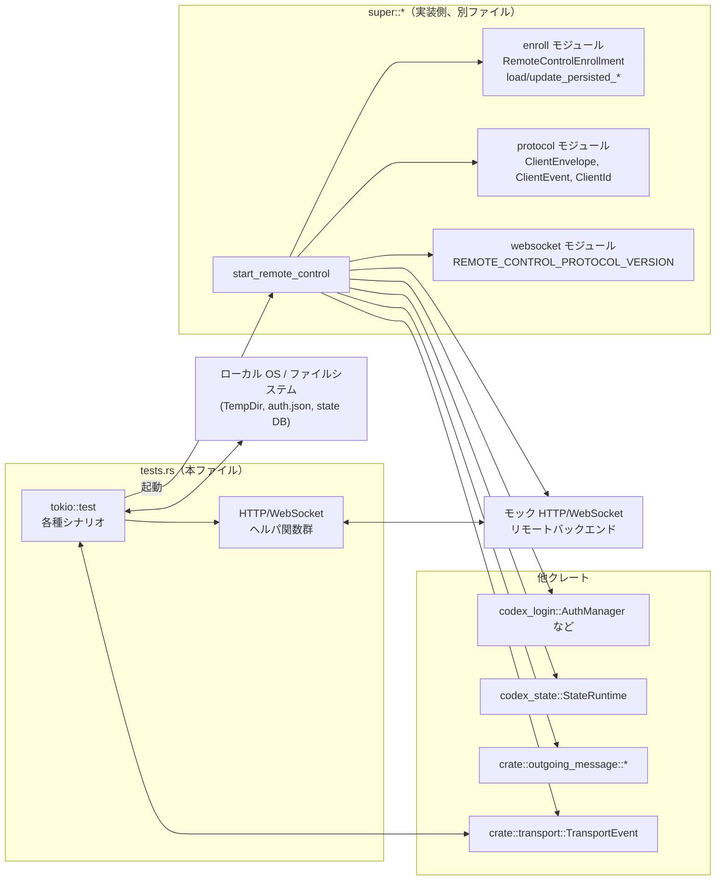
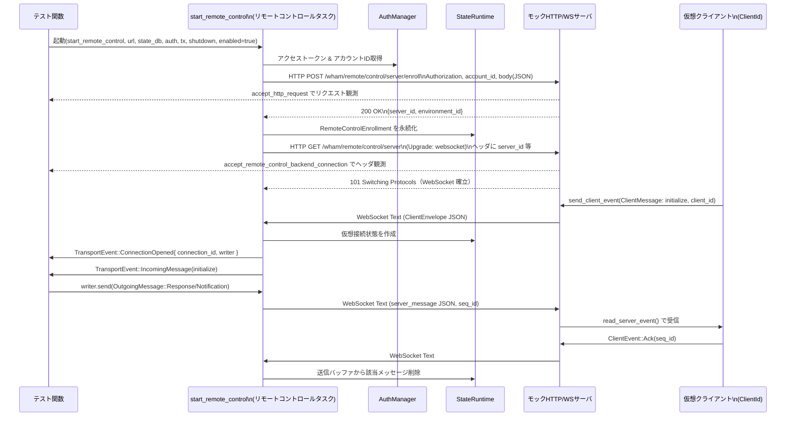

# app-server/src/transport/remote_control/tests.rs コード解説

> 注: 提供されたコードチャンクには行番号情報が含まれていないため、厳密な `tests.rs:L開始-終了` 形式の行番号は付与できません。根拠の示し方は「関数名・構造体名・処理内容」による記述にとどめます。

---

## 0. ざっくり一言

- リモートコントロール用トランスポート (`start_remote_control`) の **挙動を統合的に検証するテスト群** と、
  そのための **簡易 HTTP / WebSocket モックサーバ** の実装です。

---

## 1. このモジュールの役割

### 1.1 概要

- このテストモジュールは、`start_remote_control` で起動される「リモートコントロール・トランスポート」が、
  リモートバックエンドと正しく通信し、認証・エンロール・再接続・バッファ管理などを正しく行うことを検証します。
- WebSocket のクライアント側・サーバ側をテスト内で立て、`TransportEvent` という内部イベントとの対応関係をチェックすることで、
  実際の運用時のデータフローを再現しています。

### 1.2 アーキテクチャ内での位置づけ

このテストモジュールが関わる主なコンポーネントを図にすると次のようになります。



- 本ファイルはあくまで **テストハーネス** であり、実際のリモートコントロール実装は `super::*` 側にあります。
- テストは `TcpListener` を立てて「簡易な HTTP サーバ／WebSocket サーバ」を実装し、
  そこに `start_remote_control` が接続してくる、という構図になっています。

### 1.3 設計上のポイント

コードから読み取れる特徴を挙げます。

- **疎結合なテストハーネス**
  - 実装側とは `start_remote_control` と `TransportEvent` 経由でやり取りし、
    それ以外は HTTP / WebSocket レベルのプロトコルで検証しています。
- **状態と永続化の検証**
  - `RemoteControlEnrollment` を state DB に保存・読み出しする関数
    `update_persisted_remote_control_enrollment` / `load_persisted_remote_control_enrollment`
    を利用し、**再起動や 404 応答時の永続化リセット** をテストしています。
- **非同期・並行性**
  - すべて `#[tokio::test]` の非同期テストとして実装され、
    - WebSocket
    - mpsc チャネル (`TransportEvent`)
    - oneshot チャネル（標準入出力クライアント名の受信）
    - `CancellationToken`
    を組み合わせて、実際の並行動作に近いシナリオを再現しています。
- **テストの健全性**
  - あらゆる「期待されるイベント」に対して `tokio::time::timeout` を用いており、
    どこかでハングした場合でもテストが無限待ちにならないよう配慮されています。
- **プロトコル仕様の確認**
  - HTTP エンロールリクエストのヘッダ・ボディ、
    WebSocket ハンドシェイクのヘッダ（`x-codex-server-id` など）、
    Ping/Pong、Ack、JSON-RPC メッセージのフォーマットなど、
    かなり詳細なプロトコル仕様がテストで明文化されています。

---

## 2. 主要な機能一覧（シナリオ単位）

このテストモジュールが検証している主な「機能」（振る舞い）を列挙します。

- 仮想クライアントとメッセージルーティング:
  - リモート側の `client_id` ごとに仮想的な接続を確立し、
    - `ClientEvent::ClientMessage` → `TransportEvent::IncomingMessage`
    - `TransportEvent::ConnectionOpened` / `ConnectionClosed`
    が期待どおり発生することを検証します。
- Ping/Pong とクライアント状態管理:
  - `ClientEvent::Ping` に対するサーバの JSON 応答（`type: "pong"`）と、
    その `status` が `unknown` / `active` / `unknown` と遷移することを確認します。
- 再接続処理:
  - WebSocket が切断された後に自動的に再接続し、
    新しい接続でも `initialize` リクエストに応じて `TransportEvent::ConnectionOpened` が発火することを検証します。
- 有効化／無効化（set_enabled）の制御:
  - 起動後に「無効化」すると既存接続がクローズされ、再接続が行われないこと、
    再度「有効化」すると接続が再開されることを確認します。
- HTTP モードでのエンロール順序:
  - WebSocket 接続より **先に** HTTP POST `/server/enroll` を行い、
    得られた `server_id` / `environment_id` を使って WebSocket を張ることを検証します。
- 永続化されたエンロール情報の利用・更新:
  - 永続化済み `RemoteControlEnrollment` がある場合はそれを再利用し、
    404 応答を受けた場合には古いエントリをクリアして再エンロールすることをテストします。
- アカウント ID / クライアント名の待機:
  - `auth.json` にアカウント ID が入っていない場合は、利用可能になるまでエンロールを開始しないこと。
  - stdio モードでは `app_server_client_name` が渡されるまで接続を開始しないこと。
- 送信バッファと Ack 処理:
  - リモートクライアントから Ack (`ClientEvent::Ack`) を受け取ることで、
    送信バッファ中の古い通知がクリアされ、再接続時に再送されないことを検証します。

---

## 3. 公開 API と詳細解説

このファイル自体はテスト専用であり `pub` な API はありませんが、
「リモートコントロール実装の仕様を規定している」という意味で重要な関数（テストケース）を中心に解説します。

### 3.1 型一覧（構造体・列挙体など）

本ファイル内で定義される構造体は次の 2 つです。

| 名前 | 種別 | フィールド | 役割 / 用途 |
|------|------|------------|-------------|
| `CapturedHttpRequest` | 構造体 | `stream: TcpStream`,<br>`request_line: String`,<br>`headers: BTreeMap<String, String>`,<br>`body: String` | テスト用の簡易 HTTP サーバで受け取ったリクエストを表現します。行頭行（メソッド・パス・HTTP バージョン）、ヘッダ（小文字キーのマップ）、ボディを保持します。 |
| `CapturedWebSocketRequest` | 構造体 | `path: String`,<br>`headers: BTreeMap<String, String>` | WebSocket ハンドシェイク時の要求 URI とヘッダを保存するための型です。`accept_hdr_async` のコールバックから設定されます。 |

> 補足: `RemoteControlEnrollment` も使用されていますが、これは `super::enroll` モジュール側の型です。テストコード中からは `account_id`, `environment_id`, `server_id`, `server_name` の 4 フィールドを持つことが読み取れます。

### 3.2 関数詳細（主要 7 件）

ここではリモートコントロール実装の仕様を最もよく表している 7 つのテスト関数を詳しく説明します。

---

#### `remote_control_transport_manages_virtual_clients_and_routes_messages()`

**概要**

- 単一の WebSocket 接続上で、`client_id` ごとに仮想接続を管理し、
  JSON-RPC の `initialize`/`initialized` メッセージを `TransportEvent` に正しく変換しているかを検証します。
- また、Ping/Pong のステータス遷移や、クライアントクローズ時の `ConnectionClosed` イベントも確認します。

**引数**

- なし（`#[tokio::test]`）

**戻り値**

- `()`（テストなので値は返さず、アサーションに失敗した場合は panic します）

**内部処理の流れ**

1. `TcpListener` を `127.0.0.1:0` でバインドし、`remote_control_url_for_listener` で
   `http://<addr>/backend-api/` 形式の URL を生成します。
2. 一時ディレクトリと `StateRuntime`、`AuthManager` を生成し、
   `mpsc::channel<TransportEvent>` と `CancellationToken` を用意します。
3. `start_remote_control` を起動し、HTTP モードでのリモートコントロールタスクを立ち上げます。
4. テスト側で `accept_http_request` を使い、`POST /backend-api/wham/remote/control/server/enroll` を受信し、
   JSON で `server_id` / `environment_id` を返します。
5. その後 `accept_remote_control_connection` で WebSocket 接続を受け入れます。
6. 仮想クライアント `client-1` として:
   - `ClientEvent::Ping` を送信 → サーバから `{"type":"pong","status":"unknown","seq_id":0}` を受信。
   - `initialized` **通知** を送信（`ClientMessage` / Notification）。  
     100ms 以内に `TransportEvent` が発火しないことを確認  
     → **initialize 前のメッセージは無視される** ことの仕様。
   - `initialize` **リクエスト** を送信。  
     → `TransportEvent::ConnectionOpened { connection_id, writer, .. }` を受信。  
     → 続いて `TransportEvent::IncomingMessage` が `initialize` リクエストであることを確認。
   - 続く `initialized` 通知は `TransportEvent::IncomingMessage` として届くことを確認。
   - 再度 `Ping` を送信 → 今度は `status:"active"` かつ `seq_id:1` の `pong` を受信。
7. `writer` を用いて `OutgoingMessage::AppServerNotification(ServerNotification::ConfigWarning)` を送信し、
   クライアント側で `server_message` として受信されることを確認します（`seq_id:2`）。
8. `ClientEvent::ClientClosed` を送信 → `TransportEvent::ConnectionClosed` が発火し、
   `connection_id` が最初に開いたものと一致することを検証します。
9. 再度 `Ping` を送信すると、`status:"unknown"` かつ `seq_id:3` の `pong` が返ることを確認します
   （接続が閉じられたため状態が unknown に戻る）。

**Errors / Panics**

- 失敗条件はすべて `assert_eq!` / `assert!` / `expect` による panic として表現されています。
- 主な panic 条件:
  - エンロール HTTP リクエストが想定した形で来ない。
  - `TransportEvent` が想定どおりの種類・順番で発火しない。
  - WebSocket で受け取った JSON が期待と一致しない。
- 非同期のハングを防ぐため、`timeout` を多用しており、イベントが時間内に来ない場合も panic します。

**Edge cases（エッジケース）**

- **initialize 前の通知**:
  - `initialized` 通知を `initialize` リクエストより先に送っても、`TransportEvent` が発火しないことを確認しており、
    実装側では「接続が確立される（initialize 済み）まではクライアントメッセージを無視する」契約になっています。
- **クライアントクローズ後の Ping**:
  - `ClientClosed` 後の `Ping` で `status:"unknown"` が返ることから、
    クライアント状態はクローズをもって「みなし未接続」状態に戻ると解釈できます。
- **seq_id の扱い**:
  - `Ping` や `server_message` の `seq_id` が単調増加することを検証しており、
    サーバ側で per-client のシーケンス番号が管理されていることが読み取れます。

**使用上の注意点（仕様としての読み取り）**

- 実装側から見ると:
  - **initialize リクエストが来るまでは**、クライアントを本格的に接続済みとは見なさず、
    通知などを `TransportEvent` に流さないようにする必要があります。
  - `ClientClosed` を受けたら `TransportEvent::ConnectionClosed` を発火し、
    内部状態を「未接続」に戻すべきです。
  - `writer` に送った `OutgoingMessage` は、`client_id` ごとのシーケンス番号付きで WebSocket に出力される必要があります。

---

#### `remote_control_transport_reconnects_after_disconnect()`

**概要**

- WebSocket 接続がクライアント側からクローズされた後、リモートコントロール側が **自動的に再接続** を試みることを確認します。
- 再接続後も通常通り `initialize` リクエストに対して `ConnectionOpened` が発火することを検証します。

**内部処理（要点）**

1. `start_remote_control` を起動し、エンロール HTTP リクエストに 200 応答を返します。
2. 最初の WebSocket 接続 (`first_websocket`) を受け入れてすぐに `close()` し、ドロップします。
3. すぐ後に 2 本目の WebSocket 接続 (`second_websocket`) を `accept_remote_control_connection` で待ち受けると、
   リモートコントロール側が自動的に再接続してくることを確認できます。
4. `second_websocket` から `initialize` リクエストを送信すると、
   `TransportEvent::ConnectionOpened` が 5 秒以内に届くことを検証します。

**Errors / Panics**

- 再接続が行われない場合（`listener.accept()` が `timeout` する場合）や、
  `TransportEvent` が `ConnectionOpened` 以外だった場合は panic します。

**Edge cases**

- **再接続タイミング**:
  - テストでは `first_websocket` を閉じた直後に 2 本目の接続を待っています。
    つまりリモートコントロール側は「ほぼ即座に」再接続を開始することが期待されています。
- **再エンロール**:
  - このテストでは再エンロール（再度の `/enroll`）が行われるかどうかは検証していません。
    （再接続のみが関心対象）

**使用上の注意点**

- 実装側は、WebSocket 切断時にリトライループを持ち、一定のバックオフ（このテストからは読み取れませんが）を行いながら再接続を試みる必要があります。
- 再接続後も `TransportEvent::ConnectionOpened` を新しい接続に対して発行する責務があります。

---

#### `remote_control_handle_set_enabled_stops_and_restarts_connections()`

**概要**

- `start_remote_control` が返す「制御ハンドル」の `set_enabled(false/true)` によって、
  WebSocket 接続が停止・再開されることを検証します。

**内部処理の流れ**

1. 通常どおり `start_remote_control` を起動し、エンロール HTTP POST に応答したのち、
   最初の WebSocket 接続 (`first_websocket`) を受け入れます。
2. `remote_handle.set_enabled(false)` を呼び出します。
   - その後 `first_websocket.next()` を `timeout` 付きで待ち、
     1 秒以内にストリームが終了する（= WebSocket が閉じられる）ことを確認します。
   - 続いて `listener.accept()` を 100ms だけ待ち、**新たな接続要求が来ない** ことを確認します。
3. 次に `remote_handle.set_enabled(true)` を呼び出します。
   - すると再度 WebSocket 接続要求が来るはずなので、
     `accept_remote_control_connection` で `second_websocket` を受け入れます。
   - 最後に `second_websocket.close()` を行い、正常にクローズできることを確認します。

**Errors / Panics**

- 非有効化状態で新規接続を受け付けてしまったり、
  有効化状態で接続が張られない場合など、期待するタイミングで `accept()` できない場合に panic します。

**Edge cases**

- **状態遷移**:
  - 有効 → 無効 → 有効 という 1 回のトグルしかテストしていませんが、
    少なくともこのパターンが問題なく動作することを保証しています。
- **既存接続の扱い**:
  - `set_enabled(false)` を呼ぶと、**既存の WebSocket 接続がクローズされる**ことを明示的に確認しています。

**使用上の注意点**

- 実装側で `set_enabled` を実装する場合、次の契約がテストによって課されています:
  - `false` にされた時点で、既存接続を切断し、その後は再接続しない。
  - `true` に戻された時点で、接続ループを再開し、新規 WebSocket を張りに行く。
- アプリケーション側の UI などから「リモートコントロールの ON/OFF」を切り替える場合、
  このハンドルを通して制御することが想定されていると解釈できます。

---

#### `remote_control_transport_clears_outgoing_buffer_when_backend_acks()`

**概要**

- リモートクライアントが `ClientEvent::Ack` を送ることで、サーバ側の **送信バッファがクリアされる** ことを検証するテストです。
- Ack された通知が再接続後に再送されないことを確認します。

**内部処理の流れ**

1. 通常どおり `initialize` リクエストで接続を開き、
   `TransportEvent::ConnectionOpened` から `writer` を取得します。
2. `writer.send(QueuedOutgoingMessage::new(OutgoingMessage::AppServerNotification(...)))` で
   `ConfigWarningNotification { summary: "stale", .. }` を送信します。
3. WebSocket 側で `server_message` として `seq_id:0` の通知を受信します。
4. クライアント側から `ClientEvent::Ack`（`seq_id:0`）を送ります。
5. 続いて `ClientEvent::ClientClosed` を送信し、
   `TransportEvent::ConnectionClosed` が届くことを確認します。
6. WebSocket をクローズ・破棄した後、再接続を受け入れます。
7. 再接続後、`ClientEvent::Ping` を送ると、
   `{"type":"pong","seq_id":1,"status":"unknown"}` のみが返り、  
   **古い "stale" 通知が再送されない** ことを確認します。

**Errors / Panics**

- Ack 後に「stale」通知が再送されてしまう実装の場合、
  `read_server_event` で読み出されるイベントが `pong` ではなく `server_message` になり、
  `assert_eq!` に失敗して panic します。

**Edge cases**

- **Ack が送られなかった場合**の挙動は、このテストからは分かりません（別テストがないため）。
  ただし「Ack によってバッファがクリアされる」という片側の契約は明確です。
- `seq_id` が 0 から始まり、Ack 後に次の `pong` が `seq_id:1` であることから、
  シーケンス番号もバッファ管理に関わっていると考えられます。

**使用上の注意点**

- 実装側は「少なくとも一度はリモートに届けたい通知」をバッファし、
  接続再確立時に未 Ack のものを再送する責務があると推測できます。
- 逆にクライアント側は、通知を正常に処理したタイミングで適切に `ClientEvent::Ack` を返す必要があります。

---

#### `remote_control_http_mode_enrolls_before_connecting()`

**概要**

- HTTP モードにおいて、リモートコントロールが **WebSocket 接続前に必ず HTTP エンロールを行う** こと、
  およびその際のリクエスト内容（ヘッダ／ボディ）が仕様どおりであることを検証します。

**内部処理の流れ**

1. `start_remote_control` を通常どおり起動します。
2. `accept_http_request` で最初の HTTP リクエストを受信し、
   - リクエストライン: `POST /backend-api/wham/remote/control/server/enroll HTTP/1.1`
   - ヘッダ:
     - `authorization: Bearer Access Token`
     - `REMOTE_CONTROL_ACCOUNT_ID_HEADER: account_id`
   - ボディ JSON:

     ```json
     {
       "name": "<ホスト名>",
       "os": "<std::env::consts::OS>",
       "arch": "<std::env::consts::ARCH>",
       "app_server_version": "<CARGO_PKG_VERSION>"
     }
     ```

   であることを検証します。
3. このエンロールリクエストに対して `server_id: "srv_e_test"`, `environment_id: "env_test"` を返します。
4. 次に `accept_remote_control_backend_connection` で WebSocket のハンドシェイクを受け入れ、
   - パス: `/backend-api/wham/remote/control/server`
   - ヘッダ:
     - `authorization: Bearer Access Token`
     - `REMOTE_CONTROL_ACCOUNT_ID_HEADER: account_id`
     - `x-codex-server-id: srv_e_test`
     - `x-codex-name: <expected_server_name の Base64>`
     - `x-codex-protocol-version: REMOTE_CONTROL_PROTOCOL_VERSION`
   を確認します。
5. WebSocket 経由で `initialize` リクエストを送信し、
   `TransportEvent::ConnectionOpened` / `IncomingMessage` の到着を確認したのち、
   - `OutgoingMessage::Response` の送信 → `server_message` としての JSON 応答
   - `ConfigWarningNotification` の送信 → `server_message`/`configWarning` としての通知
   を検証します。

**Errors / Panics**

- エンロール HTTP のリクエストライン・ヘッダ・ボディが期待と違う場合に panic します。
- WebSocket ハンドシェイクのヘッダが期待と違う場合も panic します。

**Edge cases**

- **認証情報の取得**:
  - `Bearer Access Token` および `account_id` は、`remote_control_auth_manager` (~ dummy ChatGPT auth) から取得されていることが分かります。
  - アカウント ID が存在しない場合の挙動は別テスト（`remote_control_waits_for_account_id_before_enrolling`）で検証されています。
- **サーバ名のエンコード**:
  - `x-codex-name` はホスト名を Base64（STANDARD）でエンコードした値であることが必須です。

**使用上の注意点**

- リモートコントロール実装では、**WebSocket 接続前に必ずエンロール**し、
  そのレスポンスを用いて WebSocket ハンドシェイクのヘッダを構成する必要があります。
- エンロールリクエストには OS やアーキテクチャ、アプリバージョン情報を含める契約になっています。

---

#### `remote_control_http_mode_reuses_persisted_enrollment_before_reenrolling()`

**概要**

- 永続化済みの `RemoteControlEnrollment` が存在する場合、
  HTTP エンロールを再度行うのではなく、まずはその情報を用いて WebSocket 接続を試みることを検証します。

**内部処理の流れ**

1. `remote_control_state_runtime` で state DB を初期化し、
   `remote_control_target = normalize_remote_control_url(remote_control_url)` を計算します。
2. `RemoteControlEnrollment { account_id:"account_id", environment_id:"env_persisted", server_id:"srv_e_persisted", server_name:"persisted-server" }`
   を `update_persisted_remote_control_enrollment` を用いて保存します。
3. `start_remote_control` を起動します（`AuthManager` は `remote_control_auth_manager_with_home`）。
4. 最初に到着するのは WebSocket ハンドシェイクであり、パスが `/backend-api/wham/remote/control/server`、  
   `x-codex-server-id` が `"srv_e_persisted"` であることを確認します。
5. その後 `load_persisted_remote_control_enrollment` で再度読み出すと、
   保存した `persisted_enrollment` と同一であることを確認します  
   → つまり、この接続試行の段階では永続化内容が変更されていないことが分かります。

**使用上の注意点**

- 実装は、起動時に
  1. 永続化済みエンロールがあるかを確認
  2. あればそれをそのまま使って WebSocket に接続
  3. 接続が通らない／404 などのエラーがあった場合のみ再エンロールする
  という段階的な挙動をとる必要があります（3. は次のテスト `*_clears_stale_*` が担保）。

---

#### `remote_control_waits_for_account_id_before_enrolling()`

**概要**

- `auth.json` にアカウント ID が存在しない状態で起動した場合、
  リモートコントロールが **アカウント ID の出現を待ってから** エンロールを開始することを検証します。

**内部処理の流れ**

1. `remote_control_auth_dot_json(None)` で `account_id: None` の `AuthDotJson` を生成し、
   `save_auth` でファイルに保存します。
2. `AuthManager::shared` を用いて `AuthManager` を作成し、
   `start_remote_control` を起動します。
3. 100ms の間 `listener.accept()` を待っても HTTP リクエストが来ないことを確認します  
   → アカウント ID がないためエンロールを開始していない。
4. 次に `remote_control_auth_dot_json(Some("account_id"))` を生成して再度 `save_auth` します。
5. すると HTTP エンロールリクエストが到着し、  
   レスポンスとして `server_id` / `environment_id` を返します。
6. その後の WebSocket ハンドシェイクでは `x-codex-server-id` がこの新しい `server_id` になっていることを確認します。

**使用上の注意点**

- 実装は **認証情報の完全性** を確認する責任があります。
  - 少なくとも `account_id` が存在しないうちはリモートコントロールを開始してはいけない、という契約がテストで定められています。
- 認証情報はファイルベースで更新されることが想定されており、
  `AuthManager` はその変更を検出して `start_remote_control` 側に伝える仕組みを持っていると考えられます（詳細は別モジュール）。

---

#### `remote_control_http_mode_clears_stale_persisted_enrollment_after_404()`

**概要**

- 永続化済みエンロール情報が **サーバ側から見て無効（stale）** になっている場合、
  WebSocket GET が 404 を返すことをトリガに、  
  クライアント側がエンロール情報をクリアして再エンロールすることを検証します。

**内部処理の流れ**

1. `RemoteControlEnrollment { server_id:"srv_e_stale", environment_id:"env_stale", server_name:"stale-server", account_id:"account_id" }`
   を state DB に保存します。
2. `start_remote_control` を起動します。
3. 最初のリクエストとして `GET /backend-api/wham/remote/control/server HTTP/1.1` が到着し、
   ヘッダ `x-codex-server-id: srv_e_stale` を含むことを確認します。
4. このリクエストに対して `404 Not Found` を返します。
5. 次に `POST /backend-api/wham/remote/control/server/enroll` が到着し、
   新しい `server_id:"srv_e_refreshed"` / `environment_id:"env_refreshed"` を返します。
6. その後の WebSocket ハンドシェイクでは `x-codex-server-id: srv_e_refreshed` になっていることを確認します。
7. 最後に `load_persisted_remote_control_enrollment` を呼び出すと、
   永続化されたエントリも `refreshed_enrollment` に更新されていることを確認します。

**使用上の注意点**

- 実装は、永続化済みエンロールがサーバから 404 を返された場合に、
  - そのエントリをクリア
  - `POST /server/enroll` で再度登録
  - 新しいエントリを再度永続化
  という一連の回復処理を行う必要があります。

---

### 3.3 その他の関数（ヘルパ・補助テスト）

#### コンポーネントインベントリ（関数）

テスト全体で定義されている関数一覧です。

| 名前 | 種別 | 役割（1 行） |
|------|------|--------------|
| `remote_control_auth_manager()` | ヘルパ | ダミーの ChatGPT 認証情報を持つ `AuthManager`（`Arc`）を作成します。 |
| `remote_control_auth_manager_with_home(codex_home: &TempDir)` | ヘルパ | 上記に加え、ホームディレクトリを指定して `AuthManager` を作成します。 |
| `remote_control_auth_dot_json(account_id: Option<&str>)` | ヘルパ | ダミーの JWT を含む `AuthDotJson` を生成します。 |
| `remote_control_state_runtime(codex_home: &TempDir)` | ヘルパ (async) | `StateRuntime::init` を呼んで state DB を初期化します。 |
| `remote_control_url_for_listener(listener: &TcpListener)` | ヘルパ | `TcpListener` のアドレスから `http://<addr>/backend-api/` の URL を構成します。 |
| `remote_control_start_allows_remote_control_invalid_url_when_disabled()` | テスト | `initial_enabled = false` の場合、URL が外部向けでなくても起動に失敗しないことを確認します。 |
| `remote_control_stdio_mode_waits_for_client_name_before_connecting()` | テスト | stdio モードでは `app_server_client_name` が届くまで接続しないことを確認します。 |
| `accept_remote_control_connection(listener: &TcpListener)` | ヘルパ (async) | `TcpListener` から WebSocket 接続を 1 本受け入れます。 |
| `accept_http_request(listener: &TcpListener)` | ヘルパ (async) | 生の TCP コネクションから HTTP リクエストライン・ヘッダ・ボディを読み取り `CapturedHttpRequest` に詰めます。 |
| `respond_with_json(stream: TcpStream, body: serde_json::Value)` | ヘルパ (async) | HTTP/1.1 200 OK + JSON ボディのレスポンスを返します。 |
| `respond_with_status(stream: TcpStream, status: &str, body: &str)` | ヘルパ (async) | 任意のステータス行とテキストボディで HTTP 応答を返します。 |
| `respond_with_status_and_headers(stream: TcpStream, status: &str, headers: &[(&str,&str)], body: &str)` | ヘルパ (async) | 任意のヘッダを追加できる HTTP 応答送信ヘルパです。 |
| `accept_remote_control_backend_connection(listener: &TcpListener)` | ヘルパ (async) | WebSocket ハンドシェイク時の要求行・ヘッダをキャプチャしつつ接続を受け入れます。 |
| `send_client_event(websocket: &mut WebSocketStream<TcpStream>, client_envelope: ClientEnvelope)` | ヘルパ (async) | `ClientEnvelope` を JSON にシリアライズし、WebSocket Text フレームとして送信します。 |
| `read_server_event(websocket: &mut WebSocketStream<TcpStream>) -> serde_json::Value` | ヘルパ (async) | サーバからの WebSocket Text フレームを受信し、JSON にデシリアライズします（Ping/Pong を処理しつつ Text だけ返す）。 |

---

## 4. データフロー

### 4.1 代表的シナリオ: HTTP エンロール → WebSocket → JSON-RPC メッセージ

`remote_control_http_mode_enrolls_before_connecting` のテストをベースに、
典型的なデータフローをシーケンス図で表します。



この図から分かる要点:

- リモートコントロールタスクは
  - 認証情報 (`AuthManager`)
  - 状態永続化 (`StateRuntime`)
  の両方に依存しつつ、HTTP → WebSocket と段階的に接続を確立しています。
- WebSocket 上では、`ClientEnvelope`/`server_message` という JSON 形式でメッセージが往復し、
  内部では `TransportEvent` と `OutgoingMessage` に変換されています。
- Ack の処理が送信バッファに反映されることもテストで確認されています。

---

## 5. 使い方（How to Use）

このファイル自体はテストコードですが、
`start_remote_control` と `TransportEvent` を利用する側の「使い方」として参考になるパターンを簡単にまとめます。

### 5.1 基本的な使用方法（テストから抽出したパターン）

以下はテストコードのパターンを簡略化した擬似コードです。

```rust
use std::sync::Arc;
use tokio::sync::mpsc;
use tokio_util::sync::CancellationToken;
use crate::transport::{TransportEvent, CHANNEL_CAPACITY};
use crate::transport::remote_control::start_remote_control;
use codex_login::AuthManager;
use codex_state::StateRuntime;

#[tokio::main]
async fn main() -> anyhow::Result<()> {
    // 1. 設定や依存オブジェクトを用意する --------------------------
    let remote_control_url = "https://example.com/backend-api/".to_string(); // リモートコントロールのベースURL

    let codex_home = std::path::PathBuf::from("/path/to/codex_home"); // 状態・認証の保存ディレクトリ
    let auth_manager = AuthManager::shared(
        codex_home.clone(),
        /*enable_codex_api_key_env*/ false,
        codex_config::types::AuthCredentialsStoreMode::File,
    );

    let state_db: Arc<StateRuntime> =
        StateRuntime::init(codex_home.clone(), "provider-name".to_string())
            .await
            .expect("state runtime init failed");

    let (transport_event_tx, mut transport_event_rx) =
        mpsc::channel::<TransportEvent>(CHANNEL_CAPACITY);
    let shutdown_token = CancellationToken::new();

    // 2. モジュールの主要な型を初期化する --------------------------
    let (remote_task, remote_handle) = start_remote_control(
        remote_control_url,
        Some(state_db),
        auth_manager,
        transport_event_tx,
        shutdown_token.clone(),
        /*app_server_client_name_rx*/ None,
        /*initial_enabled*/ true,
    )
    .await
    .expect("failed to start remote control");

    // 3. TransportEvent を処理するループ ---------------------------
    tokio::spawn(async move {
        while let Some(event) = transport_event_rx.recv().await {
            match event {
                TransportEvent::ConnectionOpened { connection_id, writer, .. } => {
                    println!("remote client connected: {connection_id}");

                    // 必要に応じて初期メッセージを送る
                    let msg = crate::outgoing_message::OutgoingMessage::AppServerNotification(
                        codex_app_server_protocol::ServerNotification::ConfigWarning(
                            codex_app_server_protocol::ConfigWarningNotification {
                                summary: "welcome".into(),
                                details: None,
                                path: None,
                                range: None,
                            },
                        ),
                    );
                    let _ = writer.send(
                        crate::outgoing_message::QueuedOutgoingMessage::new(msg)
                    ).await;
                }
                TransportEvent::IncomingMessage { connection_id, message } => {
                    println!("message from {connection_id}: {:?}", message);
                    // JSONRPCMessage に応じた処理を実装する
                }
                TransportEvent::ConnectionClosed { connection_id } => {
                    println!("remote client closed: {connection_id}");
                }
            }
        }
    });

    // ... アプリケーション本体の処理 ...

    // 4. 終了時のクリーンアップ -----------------------------------
    shutdown_token.cancel();
    remote_task.await.expect("remote task join failed");

    Ok(())
}
```

### 5.2 よくある使用パターン（テストから読み取れるもの）

- **リモートコントロールの ON/OFF 切り替え**
  - `remote_handle.set_enabled(false)` で一時停止し、
    再度 `set_enabled(true)` で再開するパターンは `remote_control_handle_set_enabled_stops_and_restarts_connections` テストに対応します。
- **バックグラウンドでの TransportEvent 処理**
  - テストでは `transport_event_rx.recv()` を使って `ConnectionOpened` → `IncomingMessage` → `ConnectionClosed` の順で処理しています。
  - 実装側でも同様に、専用タスクで `TransportEvent` を読み続ける設計が自然です。
- **永続化されたエンロールの利用**
  - 起動前に `RemoteControlEnrollment` を state DB に保存しておけば、
    エンロールを省略してすぐに WebSocket 接続に進むことができます（`*_reuses_persisted_enrollment*` テスト）。

### 5.3 よくある間違い（テストから推測される NG パターン）

```rust
// 間違い例: initialize 前に任意の通知を送っても届くと期待している
// → 実装側は initialize 完了前のメッセージを無視する仕様
send_client_event(
    &mut websocket,
    ClientEnvelope {
        event: ClientEvent::ClientMessage {
            message: JSONRPCMessage::Notification(/* ... */),
        },
        client_id: client_id.clone(),
        stream_id: None,
        seq_id: Some(0),
        cursor: None,
    },
).await;

// 正しい例: まず initialize リクエストを送信して仮想接続を確立し、その後に通知を送る
send_client_event(
    &mut websocket,
    ClientEnvelope {
        event: ClientEvent::ClientMessage {
            message: JSONRPCMessage::Request(/* method: "initialize" */),
        },
        client_id: client_id.clone(),
        stream_id: None,
        seq_id: Some(0),
        cursor: None,
    },
).await;
// ConnectionOpened / IncomingMessage(initialize) を受信してから通知を送る
```

### 5.4 使用上の注意点（まとめ）

テストから読み取れる、モジュール全体の共通注意点です。

- **前提条件**
  - `AuthManager` からアクセストークンとアカウントIDが取得できること。
  - 必要に応じて `AuthManager` が `auth.json` の更新を検知できること。
  - `StateRuntime` が正しく初期化されていること。
- **禁止事項（契約違反になる可能性がある挙動）**
  - initialize 前に任意の通知を送っても届くと期待しない。
  - Ack を送らずに古い通知が再送されないことを期待しない（Ack でバッファがクリアされる仕様）。
- **並行性**
  - `start_remote_control` は内部で非同期タスクを起動し、
    `CancellationToken` によって停止する設計です。  
    シャットダウン時は `shutdown_token.cancel()` → タスクの `.await` という流れを守る必要があります。
- **パフォーマンス上の注意**
  - テストコードでは短い `timeout` 値（100ms など）を使っていますが、
    実運用ではより大きなタイムアウト・再接続バックオフなどが必要になります（テストからは具体値は分かりません）。

---

## 6. 変更の仕方（How to Modify）

### 6.1 新しい機能を追加する場合（テスト追加）

- **新しいリモートコントロール機能の仕様を追加したいとき**
  1. このファイルに新しい `#[tokio::test]` 関数を追加します。
  2. 既存のヘルパ関数（`accept_http_request`, `accept_remote_control_backend_connection`, `send_client_event`, `read_server_event`）
     を活用して、HTTP / WebSocket トラフィックをモックします。
  3. 期待される `TransportEvent` のシーケンスと、WebSocket 上の JSON メッセージを `assert_eq!` で検証します。
- **永続化や状態遷移のテスト**
  - `RemoteControlEnrollment` の新しいフィールドや振る舞いが追加される場合、
    - `update_persisted_remote_control_enrollment`
    - `load_persisted_remote_control_enrollment`
    を利用する既存テスト（`*_reuses_persisted_*`, `*_clears_stale_*`）を参考に、
    事前に DB を書き換え → 起動 → 接続 → 再読込、という流れのテストを追加するのが自然です。

### 6.2 既存の機能を変更する場合（実装変更時のテスト確認）

- **影響範囲の確認**
  - URL やヘッダ名、JSON フォーマットを変更する場合、
    - `remote_control_http_mode_enrolls_before_connecting`
    - `remote_control_http_mode_reuses_persisted_enrollment_before_reenrolling`
    - `remote_control_http_mode_clears_stale_persisted_enrollment_after_404`
    などのテストが壊れる可能性があります。
  - 仮想クライアントの状態管理ロジックを変更する場合は、
    - `remote_control_transport_manages_virtual_clients_and_routes_messages`
    - `remote_control_transport_clears_outgoing_buffer_when_backend_acks`
    を確認する必要があります。
- **契約の維持**
  - テスト内容は実質的に「プロトコル仕様書」として機能しているため、
    仕様変更でない限りテストを壊さないよう注意します。
  - 仕様変更がある場合は、テストの期待値を変更する前に、仕様として何が変わるかを明文化することが望ましいです。
- **テストの安定性**
  - 新たに `timeout` を追加する場合は、CI 環境の遅さも考慮した十分な猶予を取る必要があります
    （既存テストではポジティブケースに 5 秒、ネガティブ確認に 100ms〜1秒程度を使用）。

---

## 7. 関連ファイル

本テストモジュールが依存している主なモジュール・クレートです（ファイルパスはコードからは直接分かりません）。

| モジュール / クレート | 役割 / 関係 |
|-----------------------|------------|
| `super::enroll` | `RemoteControlEnrollment` 型および `load_persisted_remote_control_enrollment` / `update_persisted_remote_control_enrollment` 関数を提供し、エンロール情報の永続化を担当します。 |
| `super::protocol` | `ClientEnvelope`, `ClientEvent`, `ClientId`, `normalize_remote_control_url` などを提供し、WebSocket 上のメッセージフォーマット（クライアント側プロトコル）を定義します。 |
| `super::websocket` | `REMOTE_CONTROL_PROTOCOL_VERSION` を提供し、WebSocket ハンドシェイク時のプロトコルバージョンヘッダを定義します。 |
| `super::*` | `start_remote_control` を含むリモートコントロール実装本体のモジュールです。本テストはこの API を通じて実装を検証しています。 |
| `crate::transport` | `TransportEvent` 列挙体と `CHANNEL_CAPACITY` の定義があり、リモートコントロールとアプリケーション本体の間のイベント伝達チャネルを提供します。 |
| `crate::outgoing_message` | `OutgoingMessage`, `QueuedOutgoingMessage`, `OutgoingResponse` 等を定義し、アプリケーションからリモートクライアントへの送信メッセージのラッパーを提供します。 |
| `codex_login` | `AuthDotJson`, `AuthManager`, `CodexAuth`, `save_auth`, `TokenData`, `parse_chatgpt_jwt_claims` を通じて、認証情報の管理とテスト用ダミー認証の生成を提供します。 |
| `codex_state` | `StateRuntime` を提供し、リモートコントロールの永続化状態（エンロール情報など）を格納する DB を管理します。 |
| `codex_app_server_protocol` | `AuthMode`, `JSONRPCMessage`, `ServerNotification`, `ConfigWarningNotification` など、アプリケーションサーバとクライアント間の JSON-RPC プロトコル定義を提供します。 |

このテストファイルを読むことで、リモートコントロール機能が **どのようなプロトコルで後段のバックエンドと通信し、どのような契約でアプリケーション本体とメッセージをやり取りするか** を把握することができます。
