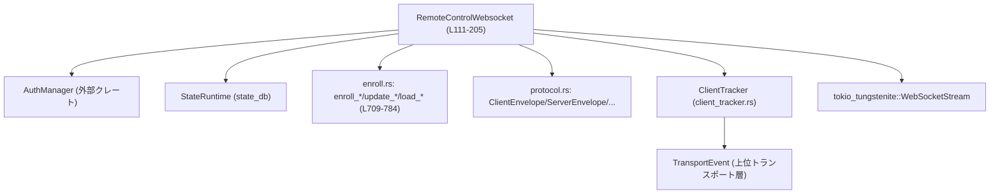
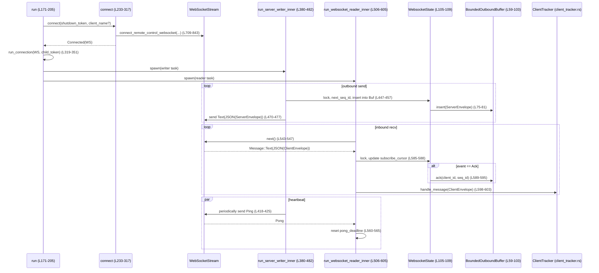

# app-server/src/transport/remote_control/websocket.rs コード解説

## 0. ざっくり一言

- App Server の「リモートコントロール」機能のために、バックエンドとの WebSocket 接続を張り、再接続・認証・エンロールメント・メッセージ再送制御（ACK ベース）などを行うモジュールです（根拠: `RemoteControlWebsocket` 全体のフィールドとメソッド構成  
  app-server/src/transport/remote_control/websocket.rs:L111-125, L133-205, L233-317）。

---

## 1. このモジュールの役割

### 1.1 概要

- このモジュールは **App Server のリモートコントロールチャネルを WebSocket で維持する**ために存在し、次の機能を提供します。
  - ChatGPT 認証情報の取得と検証、エンロールメント（サーバ登録）と永続化（sqlite state DB）（根拠: `load_remote_control_auth`, `connect_remote_control_websocket` 内の enroll/persist 呼び出し  
    L664-707, L709-784）。
  - WebSocket 接続の確立・再接続・バックオフ制御、account_id 未確定時の特別リトライ（根拠: `RemoteControlWebsocket::connect` と `REMOTE_CONTROL_ACCOUNT_ID_RETRY_INTERVAL`  
    L233-317, L56-57, L698-705）。
  - サーバ→クライアント方向メッセージのシーケンス ID 付与と ACK による再送バッファ管理（根拠: `BoundedOutboundBuffer`, `WebsocketState.next_seq_id`, writer/reader 内の ack 更新  
    L59-103, L105-109, L380-482, L585-595）。
  - ping/pong による死活監視と、pong タイムアウトによる切断検出（根拠: `REMOTE_CONTROL_WEBSOCKET_PING_INTERVAL`, `REMOTE_CONTROL_WEBSOCKET_PONG_TIMEOUT`, writer/reader 内の処理  
    L52-55, L380-482, L506-527, L560-565）。

### 1.2 アーキテクチャ内での位置づけ

主な依存関係を簡略化すると次のようになります。



- `RemoteControlWebsocket` はトランスポート層から生成され、`ClientTracker` とチャネル (`mpsc`) を介して App Server 内部のクライアントとのメッセージ送受信を仲介します（根拠: フィールド `client_tracker`, `server_event_rx`, コンストラクタ内での `ClientTracker::new` 呼び出し  
  L111-125, L133-169, L145-147）。
- 認証・エンロールメントとその永続化は `enroll` モジュール群に委譲されます（根拠: `load_persisted_remote_control_enrollment`, `enroll_remote_control_server`, `update_persisted_remote_control_enrollment` の利用  
  L738-772）。
- 実際の WebSocket I/O は `tokio_tungstenite` を使用し、Tokio 上で非同期に動作します（根拠: `connect_async`, `WebSocketStream`, `SplitSink/SplitStream` の使用  
  L39-43, L319-341, L380-482, L506-605）。

### 1.3 設計上のポイント

- **状態管理の分離**
  - 接続ごとの動的状態（シーケンス ID、アウトバウンドバッファ、subscribe cursor）は `WebsocketState` にまとめられ、`Arc<Mutex<...>>` で共有されます（根拠: L105-109, L160-164）。
  - 認証・エンロールメントの状態は `RemoteControlWebsocket` 自身のフィールド（`enrollment`, `auth_recovery`）として保持されます（根拠: L111-125）。
- **ACK ベース再送**
  - クライアントごとに `seq_id` 昇順の `BTreeMap` を持つ `BoundedOutboundBuffer` で、ACK されたシーケンスまでを削除、それより先は保持する設計になっています（根拠: L59-63, L83-96, テスト `outbound_buffer_*`  
    L1285-1367）。
- **エラーハンドリング方針**
  - I/O 系はほぼすべて `io::Result` または `Err(io::Error::other(...))` で失敗を伝搬します（根拠: `run_server_writer_inner`, `run_websocket_reader_inner`, `connect_remote_control_websocket`  
    L380-482, L506-605, L709-843）。
  - 認証エラーや HTTP エラーは、ログと詳細なメッセージを残しつつ、上位での再試行・バックオフを許すよう設計されています（根拠: L693-705, L752-763, L799-842, L867-885）。
- **並行性**
  - WebSocket 1 接続につき writer タスクと reader タスクを `JoinSet` で並列実行し、どちらかが終了したらキャンセルするモデルです（根拠: `run_connection` 内の `JoinSet` 利用  
    L319-351）。
  - キャンセルは `CancellationToken` を通じて伝播され、`tokio::select!` で各ループの中断条件として扱われます（根拠: L143-144, L191-199, L260-279, L399-406, L417-445, L521-528）。

---

## 2. 主要な機能一覧（コンポーネントインベントリー）

### 2.1 型（構造体・列挙体・定数）

| 名前 | 種別 | 概要 | 定義位置 |
|------|------|------|----------|
| `REMOTE_CONTROL_PROTOCOL_VERSION` | 定数 `&'static str` | プロトコルバージョン `"2"` を示す | websocket.rs:L49 |
| `REMOTE_CONTROL_ACCOUNT_ID_HEADER` | 定数 | Account ID ヘッダ名 `"chatgpt-account-id"` | L50 |
| `REMOTE_CONTROL_SUBSCRIBE_CURSOR_HEADER` | 定数 | subscribe cursor 用ヘッダ名 `"x-codex-subscribe-cursor"` | L51 |
| `REMOTE_CONTROL_WEBSOCKET_PING_INTERVAL` | 定数 `Duration` | WebSocket Ping 送信間隔 (10s) | L52-53 |
| `REMOTE_CONTROL_WEBSOCKET_PONG_TIMEOUT` | 定数 `Duration` | Pong タイムアウト (60s) | L54-55 |
| `REMOTE_CONTROL_ACCOUNT_ID_RETRY_INTERVAL` | 定数 `Duration` | account_id 未取得時の再試行間隔 (1s) | L56-57 |
| `BoundedOutboundBuffer` | 構造体 | クライアントごとに未 ACK の `ServerEnvelope` を保持し、ACK を反映して縮退させるバッファ | L59-63, L65-103 |
| `WebsocketState` | 構造体 | `BoundedOutboundBuffer`, `subscribe_cursor`, `next_seq_id` をまとめた WebSocket 接続状態 | L105-109 |
| `RemoteControlWebsocket` | 構造体 | WebSocket 接続全体のライフサイクル、認証・エンロール、I/O タスクの管理 | L111-125, L133-205 |
| `ConnectOutcome` | enum | `connect` の結果（`Connected`, `Disabled`, `Shutdown`）を表す | L127-131 |

### 2.2 関数一覧（本体 + テスト）

**本体側**

| 関数名 | 所属 | 役割 | 位置 |
|--------|------|------|------|
| `BoundedOutboundBuffer::new` | impl | バッファと `used_rx` watch チャネルを生成 | L66-73 |
| `BoundedOutboundBuffer::insert` | impl | バッファに新しい `ServerEnvelope` を追加、使用量をインクリメント | L75-81 |
| `BoundedOutboundBuffer::ack` | impl | 指定クライアントの `acked_seq_id` 以下を削除し、使用量をデクリメント | L83-96 |
| `BoundedOutboundBuffer::server_envelopes` | impl | 全クライアントの未 ACK `ServerEnvelope` イテレータを返す | L98-102 |
| `RemoteControlWebsocket::new` | impl | 依存オブジェクトとチャネルを初期化し、構造体を生成 | L133-169 |
| `RemoteControlWebsocket::run` | impl | 有効化待ち → 接続 → 接続ループ → シャットダウン までの無限ループ | L171-205 |
| `RemoteControlWebsocket::wait_for_app_server_client_name` | impl | `oneshot` からクライアント名を受信、もしくは省略 | L208-224 |
| `RemoteControlWebsocket::wait_until_enabled` | impl | enabled watch が true になるまで待機、またはシャットダウン検知 | L226-231 |
| `RemoteControlWebsocket::connect` | impl | `RemoteControlTarget` 解決、`connect_remote_control_websocket` を呼び出しつつ再接続・バックオフ | L233-317 |
| `RemoteControlWebsocket::run_connection` | impl | WebSocket を writer/readers に分割し、タスクを並列実行 | L319-351 |
| `RemoteControlWebsocket::run_server_writer` | impl | writer タスクのラッパー（ログ付き） | L353-378 |
| `RemoteControlWebsocket::run_server_writer_inner` | impl | アウトバウンドバッファ再送、Ping 送信、キューからの送信処理 | L380-482 |
| `RemoteControlWebsocket::run_websocket_reader` | impl | reader タスクのラッパー（ログ付き） | L484-504 |
| `RemoteControlWebsocket::run_websocket_reader_inner` | impl | Pong 監視・クライアント接続管理・受信メッセージ処理 | L506-605 |
| `set_remote_control_header` | free | HTTP ヘッダ名/値を検証してリクエストに設定 | L609-622 |
| `build_remote_control_websocket_request` | free | エンロールメント・認証情報・subscribe cursor をヘッダに埋め込んだ WS リクエスト生成 | L624-662 |
| `load_remote_control_auth` | free | `AuthManager` から ChatGPT 認証情報を取得し、account_id の準備ができるまでリロードを試行 | L664-707 |
| `connect_remote_control_websocket` | free | 認証・エンロールメント・永続化を統合して WebSocket 接続を張る | L709-843 |
| `recover_remote_control_auth` | free | `UnauthorizedRecovery` を 1 ステップ進め、成功/失敗をログとともに返す | L845-864 |
| `format_remote_control_websocket_connect_error` | free | HTTP レスポンスヘッダとボディプレビューを含んだエラーメッセージ文字列を構築 | L867-885 |

**テスト・補助関数**

テストモジュール内の主な関数のみ列挙します。

| 関数名 | 種別 | 役割 | 位置 |
|--------|------|------|------|
| `remote_control_state_runtime` | async fn | 一時ディレクトリ上に `StateRuntime` を初期化 | L921-925 |
| `remote_control_auth_manager` | fn | ダミー ChatGPT 認証付きの `AuthManager` を返す | L927-929 |
| `remote_control_url_for_listener` | fn | `TcpListener` から `http://…/backend-api/` URL を生成 | L931-937 |
| `remote_control_auth_dot_json` | fn | テスト用の `AuthDotJson` を組み立て保存するヘルパー | L937-972 |
| 3 つの `connect_remote_control_websocket_*` テスト | #[tokio::test] | HTTP エラー／401 認証失敗時のエラーメッセージと auth 更新を検証 | L974-1169 |
| `run_remote_control_websocket_loop_shutdown_cancels_reconnect_backoff` | #[tokio::test] | shutdown が再接続バックオフを中断することを検証 | L1171-1209 |
| `run_server_writer_inner_sends_periodic_ping_frames` | #[tokio::test] | writer が定期的に Ping フレームを送ることを検証 | L1211-1245 |
| `run_websocket_reader_inner_times_out_without_pong_frames` | #[tokio::test] | Pong が来ない場合にタイムアウトすることを検証 | L1247-1283 |
| `outbound_buffer_acks_by_client_id_across_stream_ids` | #[test] | ACK がクライアント単位で stream をまたいで適用されることを検証 | L1285-1325 |
| `outbound_buffer_retains_unacked_messages_until_ack_advances` | #[test] | ACK されていない seq が残り続けることを検証 | L1327-1367 |
| `server_envelope` | fn | テスト用 `ServerEnvelope` を生成 | L1369-1390 |
| `accept_http_request` | async fn | 生 HTTP リクエストを 1 本読み出し、リクエストラインを返す | L1392-1419 |
| `connected_websocket_pair` | async fn | クライアント/サーバ WebSocket ペアを構成 | L1421-1447 |
| `respond_with_status_and_headers` | async fn | 任意のステータス・ヘッダ・ボディで HTTP 応答を送信 | L1449-1468 |

---

## 3. 公開 API と詳細解説

### 3.1 型一覧（主要な型）

| 名前 | 種別 | 役割 / 用途 | 位置 |
|------|------|-------------|------|
| `RemoteControlWebsocket` | 構造体（`pub(crate)`） | WebSocket の確立・維持・再接続を管理し、`ClientTracker` と連携してメッセージ入出力を行う | L111-125, L133-205 |
| `BoundedOutboundBuffer` | 構造体（private） | 再送対象となる `ServerEnvelope` をクライアントごとに保持し、ACK に応じて削除する | L59-63, L65-103 |
| `WebsocketState` | 構造体（private） | 1 接続の状態（outbound buffer、subscribe cursor、次の seq ID）をまとめる | L105-109 |
| `ConnectOutcome` | enum（private） | `connect` による接続試行の結果（成功/無効化/シャットダウン） | L127-131 |
| `RemoteControlConnectionAuth` | 構造体（別モジュール） | bearer token と account_id を保持（本ファイルでは生成のみ） | 使用: L698-706 |
| `RemoteControlEnrollment` | 構造体（別モジュール） | account_id / server_id / environment_id などリモート制御の登録情報 | 使用: L4-10, L724-735, L747-784 |

### 3.2 重要関数の詳細

#### `RemoteControlWebsocket::run(mut self, app_server_client_name_rx: Option<oneshot::Receiver<String>>)`

**概要**

- リモートコントロール WebSocket のメインループです。必要ならクライアント名を受信し、機能が有効化されるのを待ち、接続・接続処理ループ・再接続を行い、シャットダウン時に `ClientTracker` を終了させます（根拠: L171-205）。

**引数**

| 引数名 | 型 | 説明 |
|--------|----|------|
| `self` | `RemoteControlWebsocket`（所有権） | 構造体全体の所有権を取り、ライフサイクル全体を管理 |
| `app_server_client_name_rx` | `Option<oneshot::Receiver<String>>` | App Server に紐づくクライアント名を外部から 1 度だけ受け取るチャネル。`None` ならクライアント名なしで動作 |

**戻り値**

- なし（`()`）。完了時には WebSocket 接続はすべてクローズされ、`ClientTracker` も `shutdown()` 済みです（根拠: L205）。

**内部処理フロー**

1. `wait_for_app_server_client_name` でクライアント名を待ち受け。シャットダウンまたはエラーなら即座に `ClientTracker::shutdown` を呼んで戻る（L175-183, L208-224）。
2. 無限ループの中で `wait_until_enabled` を呼び、有効化（enabled=true）になるまで待機。シャットダウン時は false を返しループ終了（L186-190, L226-231）。
3. 子 `CancellationToken` を作成し（L191-192）、`connect` を呼び出して WebSocket に接続。
   - `ConnectOutcome::Connected` なら接続を得て `run_connection` に渡す（L193-201）。
   - `Disabled` なら enabled が false になるまでブロックされていた → 再度ループに戻る（L196-198）。
   - `Shutdown` なら全体を終了（L196-199）。
4. ループを抜けた後、`ClientTracker` をシャットダウン（L205）。

**Errors / Panics**

- この関数自体は `Result` を返さず、内部で起きたエラーは `connect` や `run_connection` 内のログに任されています。

**Edge cases**

- `app_server_client_name_rx` が `None` の場合でも問題なく動作し、その場合は名前なしで接続処理を行います（L221-223）。
- `wait_for_app_server_client_name` が shutdown で中断された場合は、接続処理は一切走らず `ClientTracker` を閉じて終了します（L175-183, L215-220）。

**使用上の注意点**

- このメソッドは **戻るまでブロックする長寿命タスク** であり、通常は Tokio タスクとして `spawn` して使う想定です（他コードからの参照はこのファイルには現れませんが、フィールド構成から推測可能）。
- shutdown トークン（コンストラクタ引数）がキャンセルされるまでは再接続を繰り返すため、外部でのキャンセル制御が重要です（L139-141, L191-199）。

---

#### `RemoteControlWebsocket::connect(&mut self, shutdown_token: &CancellationToken, app_server_client_name: Option<&str>) -> ConnectOutcome`

**概要**

- `RemoteControlTarget` を決定したうえで、`connect_remote_control_websocket` を呼び出し、HTTP/認証/エンロールメント込みの WebSocket 接続を行います。失敗時は指数バックオフで再試行し、enabled/shutdown 状態を尊重します（根拠: L233-317）。

**引数**

| 引数名 | 型 | 説明 |
|--------|----|------|
| `self` | `&mut RemoteControlWebsocket` | 再接続回数や `remote_control_target` フィールドを更新 |
| `shutdown_token` | `&CancellationToken` | シャットダウン指示用。キャンセルされると `ConnectOutcome::Shutdown` を返す |
| `app_server_client_name` | `Option<&str>` | WebSocket 接続時にヘッダとして渡すクライアント名（必要に応じて） |

**戻り値**

- `ConnectOutcome`:
  - `Connected(Box<WebSocketStream<...>>)` : 接続成功。
  - `Disabled` : enabled フラグが false になったため接続ループを抜けるべき状態。
  - `Shutdown` : シャットダウン指示を受けて接続をあきらめる状態。

**内部処理の流れ**

1. `self.remote_control_target` が未設定なら `normalize_remote_control_url` で解析し、失敗した場合は URL 不正として warn ログ出力の後、shutdown または disabled になるまで待機して終了（L238-257）。
2. 無限ループで次の `tokio::select!` を実行（L260-279）。
   - shutdown → `Shutdown` を返す（L263）。
   - enabled=false になる変化 → `Disabled` を返す（L264-269）。
   - `connect_remote_control_websocket(...)` を実行し、結果を `connect_result` に受け取る。
3. `connect_result` が `Ok` のとき:
   - `reconnect_attempt` を 0 にリセットし、新しい `UnauthorizedRecovery` を用意（L283-285）。
   - 成功ログ出力後、`ConnectOutcome::Connected` を返す（L286-290）。
4. `Err` のとき:
   - `err.kind() == ErrorKind::WouldBlock`（account_id 未取得）なら 1 秒固定のリトライ間隔を使用（L293-295, L56-57）。
   - それ以外は warn ログを出し、`backoff(self.reconnect_attempt)` により指数バックオフを計算、カウンタをインクリメント（L296-303）。
   - `tokio::select!` で shutdown / disabled / sleep 完了のいずれかまで待つ（L304-313）。

**Errors / Panics**

- `connect_remote_control_websocket` からのエラーをそのまま扱い、ログとバックオフにのみ利用します。`connect` 自体は `Result` を返さず、`ConnectOutcome` で状態を表現します。

**Edge cases**

- URL 不正（`normalize_remote_control_url` エラー）の場合は、ログを出力した上で **接続試行は行わず**、enabled=false もしくは shutdown を待ちます（L245-255）。
- account_id 未取得 (`ErrorKind::WouldBlock`) の場合だけ 1 秒固定間隔でリトライし、それ以外は指数バックオフに乗る点が特異ケースです（L293-303）。

**使用上の注意点**

- `self` を可変参照で受け取り `reconnect_attempt` を更新するため、同時に複数箇所から呼ぶことは想定されていません（このファイルでも `run` からのみ呼び出されます）。
- 長時間ブロックするため、必ず `shutdown_token` と `enabled_rx` の状態変化を前提に設計する必要があります。

---

#### `RemoteControlWebsocket::run_server_writer_inner(...) -> io::Result<()>`

**概要**

- WebSocket writer タスクの本体です。再接続時の未送信バッファの再送出、`server_event_rx` からの新規イベント送信、定期 Ping 送信、アウトバウンドバッファの容量制御を行います（根拠: L380-482）。

**引数**

| 引数名 | 型 | 説明 |
|--------|----|------|
| `state` | `Arc<Mutex<WebsocketState>>` | 再送バッファと `next_seq_id` を共有する状態 |
| `server_event_rx` | `Arc<Mutex<mpsc::Receiver<QueuedServerEnvelope>>>` | 上位層からの送信待ちサーバイベントキュー |
| `used_rx` | `watch::Receiver<usize>` | バッファ使用量を監視し、CH 容量を制御する |
| `websocket_writer` | `SplitSink<WebSocketStream<...>, tungstenite::Message>` | 実際の WebSocket 送信用 sink |
| `ping_interval` | `Duration` | Ping 送信間隔 |
| `shutdown_token` | `CancellationToken` | シャットダウン指示 |

**戻り値**

- `Ok(())` : シャットダウン等で正常停止。
- `Err(io::Error)` : WebSocket 送信エラー等で停止。

**内部処理の流れ**

1. 再接続後に `state.outbound_buffer` 内の全 `ServerEnvelope` を JSON シリアライズ＋ Text フレームで再送信（L391-407）。
2. `interval_at` で Ping 用タイマーをセット（L409-411）。
3. `server_event_rx` をロックしてループ開始（L413-414）。
4. 各ループで `tokio::select!`（L415-445）:
   - shutdown → `Ok(())` で終了（L417）。
   - Ping タイマー → Ping フレーム送信。失敗なら `Err` で終了（L418-425）。
   - バッファ満杯時（`outbound_has_capacity` false）には `used_rx.changed()` を待つ。チャネルクローズ時は `UnexpectedEof` エラー（L427-436）。
   - バッファに空きがあれば `server_event_rx.recv()` から次の `QueuedServerEnvelope` を受信。チャネルクローズ時は `UnexpectedEof` エラー（L437-444）。
5. 受信した `QueuedServerEnvelope` に対し:
   - `state` ロック下で `seq_id` を採番し、`ServerEnvelope` を構築・バッファに insert（L447-457）。
   - JSON シリアライズして送信。エラー時は `Err(io::Error::other(...))` で終了（L462-477）。
   - `write_complete_tx` があれば `send(())` して送信完了通知（L478-480）。

**Errors / Panics**

- シリアライズ失敗時はログを出すのみで、そのメッセージは破棄されますが、ループは継続します（L392-397, L462-467）。
- WebSocket 送信エラー、チャネルクローズなどの場合は `Err` を返し、呼び出し元でログされます（L401-404, L441-442, L474-475, L373-377）。

**Edge cases**

- 再接続時に `outbound_buffer.server_envelopes()` の内容を先に再送するため、再接続前に送信済みで ACK 済みのものがここに残っていると二重送信になる可能性がありますが、通常は reader 側の ACK 処理で再接続前に掃除される設計です（L391-407, L585-595）。
- バッファ容量は `super::CHANNEL_CAPACITY` に対して監視されていますが、`BoundedOutboundBuffer` 自体の容量制限はファイル内には見当たりません（このチャンクには上限値ロジックは現れません）。

**使用上の注意点**

- `state` や `server_event_rx` は `Arc<Mutex<...>>` で共有されており、長時間ロックを保持しない実装になっています（`state` ロックは短いクリティカルセクション内のみ、`server_event_rx` ロックはループ全体ですが `recv().await` は `MutexGuard` を保持したままの形です）。他から同じレシーバにアクセスしない前提です（根拠: L413-445）。
- Ping 間隔や capacity チェック条件を変更する場合は、テスト `run_server_writer_inner_sends_periodic_ping_frames` の期待も確認する必要があります（L1211-1245）。

---

#### `RemoteControlWebsocket::run_websocket_reader_inner(...) -> io::Result<()>`

**概要**

- WebSocket reader タスクの本体です。Pong タイムアウトを監視しつつ、`ClientTracker` を通じてクライアントのライフサイクル管理と受信メッセージの処理、ACK による outbound バッファ更新を行います（根拠: L506-605）。

**引数**

| 引数名 | 型 | 説明 |
|--------|----|------|
| `client_tracker` | `Arc<Mutex<ClientTracker>>` | クライアントごとの状態管理・メッセージルーティング担当 |
| `state` | `Arc<Mutex<WebsocketState>>` | subscribe cursor と outbound バッファのために使用 |
| `websocket_reader` | `SplitStream<WebSocketStream<...>>` | WebSocket から受信するストリーム |
| `pong_timeout` | `Duration` | Pong を待つ最大時間 |
| `shutdown_token` | `CancellationToken` | シャットダウン指示 |

**戻り値**

- `Ok(())` : シャットダウン等で正常終了、あるいは `ClientTracker` 内部でのエラーにより早期終了（L521-522, L532-535, L538-541, L603-604）。
- `Err(io::Error)` : Pong タイムアウト、WebSocket 終了、読み取りエラーなどの異常終了。

**内部処理フロー**

1. `client_tracker.lock().await` で `MutexGuard` を取得し、以降のループで同一インスタンスを使い続ける（L513-514）。
2. `REMOTE_CONTROL_IDLE_SWEEP_INTERVAL` で idle クライアント掃除用 interval を作成（L514-515）。
3. `pong_timeout` の sleep を `pong_deadline` として pin し、`tokio::select!` 内で監視（L516-517）。
4. ループ内 `tokio::select!`（L520-549）:
   - shutdown → `Ok(())`（L521）。
   - `pong_deadline` 完了 → `TimedOut` エラーを返す（L522-527）。
   - `client_tracker.bookkeep_join_set()` からクライアントキーを受け取り、必要に応じて `close_client`。エラー時は `Ok(())` で終了（L528-535）。
   - idle sweep interval tick → `close_expired_clients` を呼び、エラーなら `Ok(())` で終了（L537-541）。
   - `websocket_reader.next()` → メッセージを 1 つ読み込む。ストリーム終了時は `UnexpectedEof` エラー（L542-547）。
5. 受信メッセージの種類ごとに処理（L550-583）。
   - `Text` → `serde_json::from_str::<ClientEnvelope>` でパース。失敗時は warn ログを出してスキップ（L551-558）。
   - `Pong` → `pong_deadline.reset` でタイマーを延長（L560-565）。
   - `Ping`/`Frame` → 無視（L566）。
   - `Binary` → warn ログを出して無視（L567-570）。
   - `Close` → `ConnectionAborted` エラーで終了（L571-575）。
   - `Err` → `InvalidData` エラーラップで終了（L577-582）。
6. `ClientEnvelope` を受け取ったら:
   - `state` ロック下で `cursor` があれば `subscribe_cursor` を更新（L585-588）。
   - イベントが `ClientEvent::Ack` かつ `seq_id` が Some なら outbound バッファの `ack` を呼ぶ（L589-595）。
7. `client_tracker.handle_message(client_envelope).await` を呼び、`Err` なら `Ok(())` を返して終了（L598-604）。

**Errors / Panics**

- Pong レスポンスが来ない場合は `TimedOut` エラー `"remote control websocket pong timeout"` が返ります（L522-527）。これはテストで検証されています（L1247-1283）。
- WebSocket ストリームが突然終了した場合は `UnexpectedEof` エラーになります（L542-547）。

**Edge cases**

- `client_tracker` の `Mutex` ガードをループ中ずっと保持したまま、`await` を含むメソッドを呼んでいます（L513, L528-535, L537-541, L598-603）。これは「同時に他のタスクから `client_tracker` を叩かない」という前提の設計です（このファイル内では run 終了時の `shutdown()` だけ別の場所から lock しますが、`run_connection` の終了後です: L205, L319-351）。
- パース不能な JSON メッセージは単に warn ログを出して無視されます。再送はされません（L551-558）。

**使用上の注意点**

- Pong タイムアウトは `pong_timeout` 引数で決まり、呼び出し元 (`run_connection`) では定数 `REMOTE_CONTROL_WEBSOCKET_PONG_TIMEOUT` を使用しているため、変更にはその定数も見直す必要があります（L339-340, L54-55）。
- `ClientTracker` 実装次第で、この reader タスクがブロッキング的な重い処理を行う可能性があるため、`ClientTracker` のメソッドはなるべく軽量に保つことが望まれます（設計上の注意であり、このファイルからは重さは分かりません）。

---

#### `BoundedOutboundBuffer::ack(&mut self, client_id: &ClientId, acked_seq_id: u64)`

**概要**

- 指定クライアントのバッファに対して、`acked_seq_id` 以下のシーケンスをすべて削除し、保持メッセージ数（`used_tx`）を減らします。クライアントのバッファが空になった場合はエントリごと削除します（根拠: L83-96）。

**引数**

| 引数名 | 型 | 説明 |
|--------|----|------|
| `client_id` | `&ClientId` | 対象クライアント ID |
| `acked_seq_id` | `u64` | ACK 済みとみなす最大 seq ID |

**戻り値**

- なし（内部状態を更新するのみ）。

**内部処理の流れ**

1. `buffer_by_client.get_mut(client_id)` でクライアントの `BTreeMap<u64, ServerEnvelope>` を取得。存在しなければ何もせず return（L84-86）。
2. `buffer.first_key_value()` で最小 seq を取得し、それが `acked_seq_id` 以下である限りループして `pop_first()` で削除、`used_tx` を 1 つ減らす（L87-92）。
3. 削除後にバッファが空であれば `buffer_by_client` からクライアントエントリを削除（L93-95）。

**Errors / Panics**

- 自身ではエラーを返さず、パニックも起こしません。`used_tx.send_modify` が `watch::Sender` の API であり、送信側が落ちてもパニックにはなりません（Tokio の仕様に依存しますが、このファイルではエラー処理していません: L80-81, L91-92）。

**Edge cases**

- `acked_seq_id` が最小 seq より小さい場合は何も削除されません。
- `acked_seq_id` が存在しない大きな値でも、バッファ内の全てが削除されます。
- テストでは、異なる stream_id を持つメッセージでも同一クライアント ID であればまとめて ACK されることが確認されています（根拠: L1285-1325）。

**使用上の注意点**

- `BTreeMap` を使っているため、`ack` は常に最小の seq から順に削除され、中間のギャップが残ることはありません。
- `used_tx` はバッファ総数を表しており、writer 側の容量判定に使われるため、insert/ack どちらかでカウント不整合を生じさせないように実装されていることが重要です（L75-81, L91-92, L415-416）。

---

#### `load_remote_control_auth(auth_manager: &Arc<AuthManager>) -> io::Result<RemoteControlConnectionAuth>`

**概要**

- `AuthManager` から ChatGPT 認証 (`CodexAuth`) を取得し、account_id がまだ付与されていない場合は一度だけ `reload()` を試みます。最終的に ChatGPT auth かつ account_id が存在する場合に `RemoteControlConnectionAuth` を返します（根拠: L664-707）。

**引数**

| 引数名 | 型 | 説明 |
|--------|----|------|
| `auth_manager` | `&Arc<AuthManager>` | 認証情報の取得・リロード API を提供するマネージャ |

**戻り値**

- `Ok(RemoteControlConnectionAuth)` : bearer token と account_id の両方が取得できた場合。
- `Err(io::Error)` :
  - `ErrorKind::PermissionDenied` : ChatGPT 認証が得られない、または auth モードが ChatGPT でない場合（L671-675, L691-695）。
  - `ErrorKind::WouldBlock` : ChatGPT auth だが account_id がまだ設定されていない場合（L698-705）。

**内部処理の流れ**

1. `reloaded = false` で開始し、ループする（L667-668）。
2. `auth_manager.auth().await` で現在の認証情報を取得。
   - `None` の場合: すでにリロード済みなら PermissionDenied でエラー（L669-675）。未リロードなら `reload()` して `reloaded = true` にし、`continue`（L676-678）。
3. Some(auth) の場合:
   - `!auth.is_chatgpt_auth()` なら即座に `break auth`（ChatGPT 以外でも一旦抜ける）。（L680-681）
   - ChatGPT auth で `account_id` が `None` かつ `!reloaded` の場合は `reload()` して `continue`（L682-686）。
   - それ以外は `break auth`（L688-689）。
4. ループを抜けた後、`if !auth.is_chatgpt_auth()` なら PermissionDenied エラー（L691-695）。
5. `RemoteControlConnectionAuth` を構築:
   - `bearer_token` は `auth.get_token().map_err(io::Error::other)?`（L699-700）。
   - `account_id` は `auth.get_account_id().ok_or_else(|| ErrorKind::WouldBlock ..)`（L701-705）。

**Edge cases**

- `auth.is_chatgpt_auth()` が false の場合、account_id の有無に関係なく `PermissionDenied` として扱われます。
- account_id が永遠に `None` の場合、1 回の `reload()` 後に `WouldBlock` エラーとなり、`connect` 側で短い間隔のリトライ対象となります（L293-295, L698-705）。

**使用上の注意点**

- `ErrorKind::WouldBlock` は「致命的エラー」ではなく、「まだ account_id が準備できていない」状態表現として利用されています。呼び出し側（`connect`/`connect_remote_control_websocket`）では特別扱いされます（L293-295, L709-724）。
- API キー認証ではリモートコントロールが使用できない設計であることが、エラーメッセージに明示されています（L691-695）。

---

#### `connect_remote_control_websocket(...) -> io::Result<(WebSocketStream<...>, Response<()>)>`

**概要**

- TLS プロバイダの初期化、認証情報取得、エンロールメントの読み込み/再作成/永続化、そして最終的に WebSocket 接続の確立を行う高レベル関数です（根拠: L709-843）。

**引数（主なもの）**

| 引数名 | 型 | 説明 |
|--------|----|------|
| `remote_control_target` | `&RemoteControlTarget` | websocket URL と enroll URL を含むターゲット情報 |
| `state_db` | `Option<&StateRuntime>` | エンロールメントの永続化に使用する state DB |
| `auth_manager` | `&Arc<AuthManager>` | 認証情報供給源 |
| `auth_recovery` | `&mut UnauthorizedRecovery` | 401/403 からの自動リカバリを行うステートマシン |
| `enrollment` | `&mut Option<RemoteControlEnrollment>` | 現在のエンロールメント情報（in-memory キャッシュ） |
| `subscribe_cursor` | `Option<&str>` | 再接続時に送る subscribe cursor |
| `app_server_client_name` | `Option<&str>` | エンロールメント永続化時のキーに含めるクライアント名 |

**戻り値**

- `Ok((WebSocketStream<...>, Response<()>>)` : WebSocket 接続成功。HTTP Upgrade 応答のヘッダは `Response<()>` に変換して返されます（L717-720, L797-798）。
- `Err(io::Error)` : 認証・エンロールメント・接続いずれかの段階でのエラー。HTTP エラーの場合、ヘッダとボディプレビューを含んだメッセージになります（L752-763, L799-842, L867-885）。

**内部処理の流れ（要約）**

1. `ensure_rustls_crypto_provider()` で Rustls の crypto provider を準備（L721）。
2. `load_remote_control_auth` を呼び、`RemoteControlConnectionAuth` を取得（L723-724）。
3. すでに保持している `enrollment` の `account_id` が認証側のものと異なる場合は in-memory enrollment をクリアし、ログを出力（L725-735）。
4. `enrollment` が `None` なら `load_persisted_remote_control_enrollment` で DB からロード（L737-745）。
5. それでも `enrollment` が `None` なら、新規エンロールメントを行う（L747-784）。
   - `enroll_remote_control_server` を呼び出し、PermissionDenied + `recover_remote_control_auth` true の場合は `"…; retrying after auth recovery"` で `Err(other)` を返す（L752-763）。
   - 正常終了時は `update_persisted_remote_control_enrollment` を呼び出し、永続化エラーは warn ログ（L765-775）。
6. `enrollment` が Some であることを確認し、なければ `Err(other("missing remote control enrollment ..."))`（L786-788）。
7. `build_remote_control_websocket_request` を呼び、WebSocket HTTP リクエストを生成（L789-794）。
8. `connect_async(request).await` を実行し結果をマッチ（L796-842）。
   - 成功時: `(websocket_stream, response.map(|_| ()))` を返す（L797-798）。
   - エラー時: 型が `tungstenite::Error::Http(response)` かどうかで場合分け（L799-835）。
     - 404: stale enrollment とみなし、DB 上の enrollment を削除し、ログ出力の上で `*enrollment = None` にセット（L800-822）。
     - 401 / 403: `recover_remote_control_auth` が true を返した場合、`Err(other("remote control websocket auth failed with HTTP …; retrying after auth recovery"))` を返す（L823-831）。
     - その他: 何もしない。
   - 最終的に `format_remote_control_websocket_connect_error` を使って詳細なエラーメッセージを `Err(other(...))` として返す（L835-841）。

**Edge cases**

- enrollment の `account_id` が変わった場合、自動的に in-memory enrollment がクリアされ、persisted enrollment は再読み込みされます（L725-735, L737-745）。
- HTTP 404 の場合には stale enrollment とみなして DB からも削除し、新規エンロールメントの余地を作ります（L800-822）。
- HTTP 401/403 の場合は、auth recovery が成功した場合に「再試行を促すエラー」を返しますが、実際の再試行は上位の `connect` が行います（L823-831, L233-317）。
- 具体的な HTTP エラーメッセージと body preview が `err.to_string()` に含まれることはテストで検証されています（L974-1028, L867-885）。

**使用上の注意点**

- `auth_recovery`・`enrollment` 引数は **可変参照** であり、この関数はそれらの状態を更新します。呼び出し側は同じインスタンスを再利用して再接続を行う想定です（L713-715, L725-735, L800-822）。
- `state_db` が `None` の場合、エンロールメントの永続化はスキップされますが、それによる動作影響はこのファイルからは読み取れません（外部仕様依存）。

---

### 3.3 その他の関数（簡易一覧）

| 関数名 | 役割（1 行） | 位置 |
|--------|--------------|------|
| `RemoteControlWebsocket::wait_for_app_server_client_name` | oneshot 経由でクライアント名を受信し、shutdown と競合する | L208-224 |
| `RemoteControlWebsocket::wait_until_enabled` | enabled フラグが true になるまで待機し、shutdown で false を返す | L226-231 |
| `RemoteControlWebsocket::run_connection` | 1 WebSocket 接続の writer/reader タスクを起動し、終了条件を監視 | L319-351 |
| `RemoteControlWebsocket::run_server_writer` | writer 本体のラッパー。結果に応じて warn ログ | L353-378 |
| `RemoteControlWebsocket::run_websocket_reader` | reader 本体のラッパー。結果に応じて warn ログ | L484-504 |
| `set_remote_control_header` | 指定ヘッダ名/値を検証し、HTTP リクエストに追加。値不正時は `InvalidInput` エラー | L609-622 |
| `build_remote_control_websocket_request` | WebSocket URL 文字列からリクエストを生成し、必要なヘッダをセット | L624-662 |
| `recover_remote_control_auth` | `UnauthorizedRecovery` の 1 ステップを実行し、ログと bool を返す | L845-864 |
| `format_remote_control_websocket_connect_error` | HTTP エラー時のヘッダ/ボディを含んだ詳細なエラーメッセージを生成 | L867-885 |

---

## 4. データフロー

### 4.1 代表的な処理シナリオ：接続確立〜メッセージ送受信

接続確立後、Outbound（サーバ→クライアント）と Inbound（クライアント→サーバ）の流れは以下のようになっています。



- Subscribe cursor は `ClientEnvelope.cursor` としてクライアントから渡され、それを `WebsocketState.subscribe_cursor` に保存し、次回接続時のリクエストヘッダ `x-codex-subscribe-cursor` に使用します（根拠: L105-109, L261-262, L585-588, L654-660）。
- ACK (`ClientEvent::Ack`) は outbound バッファから古いメッセージを削除し、`used_rx` を通じて writer 側の容量制御に反映されます（根拠: L589-595, L75-81, L415-417）。

---

## 5. 使い方（How to Use）

### 5.1 基本的な使用方法の流れ（擬似コード）

このファイル単体からは呼び出し元は見えませんが、フィールドとテストから、典型的な利用フローは次のように構成できます。

```rust
use std::sync::Arc;
use tokio::sync::{mpsc, watch};
use tokio_util::sync::CancellationToken;
use crate::transport::remote_control::websocket::RemoteControlWebsocket;
use crate::transport::remote_control::protocol::normalize_remote_control_url;
use crate::transport::TransportEvent;
use codex_login::AuthManager;

// 依存の初期化（簡略化）
let remote_control_url = "https://example.com/backend-api/".to_string();
let remote_control_target =
    normalize_remote_control_url(&remote_control_url).expect("valid URL");

let state_db = None; // 省略する場合
let auth_manager: Arc<AuthManager> = /* AuthManager 初期化 */;
let (transport_event_tx, _transport_event_rx) = mpsc::channel::<TransportEvent>(16);
let shutdown_token = CancellationToken::new();
let (_enabled_tx, enabled_rx) = watch::channel(true);

// RemoteControlWebsocket を生成
let websocket = RemoteControlWebsocket::new(
    remote_control_url,
    Some(remote_control_target),
    state_db,
    auth_manager,
    transport_event_tx,
    shutdown_token.clone(),
    enabled_rx,
);

// Tokio タスクとして run を起動
tokio::spawn(async move {
    websocket.run(/* app_server_client_name_rx */ None).await;
});

// shutdown したいとき
shutdown_token.cancel();
```

- 実際には `state_db` には `StateRuntime` の `Arc` を渡すことでエンロールメントが永続化されます（根拠: `remote_control_state_runtime` テストヘルパー  
  L921-925）。
- enabled フラグを false に切り替えることで、接続ループを中断することもできます（根拠: `wait_until_enabled` と `run_connection` 内の select  
  L226-231, L343-347）。

### 5.2 よくある使用パターン

1. **起動時にリモートコントロールを有効にし、shutdown まで維持する**
   - `enabled_rx` を true のままにし、`shutdown_token` のキャンセルで終了。
2. **ランタイム設定でリモートコントロールを ON/OFF**
   - 外部で `watch::Sender<bool>` を保持し、false を送ることで現在の接続を閉じ、後続の `connect` ループを停止できます（`ConnectOutcome::Disabled` 経由; 根拠: L260-269, L343-347）。

### 5.3 よくある間違いと正しい使い方

```rust
// 間違い例: AuthManager が ChatGPT 以外の auth のまま
let auth_manager = /* ChatGPT 以外のモード */;
let auth = load_remote_control_auth(&auth_manager).await?;
// -> ErrorKind::PermissionDenied が返る（L691-695）

// 正しい例: ChatGPT auth を用意する（テストと同様）
use codex_core::test_support::auth_manager_from_auth;
use codex_login::CodexAuth;

let auth_manager = auth_manager_from_auth(
    CodexAuth::create_dummy_chatgpt_auth_for_testing()
);
let auth = load_remote_control_auth(&auth_manager).await?; // OK
```

### 5.4 使用上の注意点（まとめ）

- **認証モードの制約**: ChatGPT 認証のみサポートし、API キー認証では PermissionDenied になります（L691-695）。
- **Pong 必須**: リモート側が Pong を返さないと `REMOTE_CONTROL_WEBSOCKET_PONG_TIMEOUT` 後に接続が切断されます（L522-527, L1247-1283）。
- **バッファ容量**: outbound バッファが `CHANNEL_CAPACITY` に達すると新規イベント送信がブロックされます。大量の未 ACK メッセージが溜まらないよう設計する必要があります（L415-417）。
- **エラーの再試行**:
  - account_id 未確定 (`ErrorKind::WouldBlock`) は 1 秒間隔で再試行（L293-295, L698-705）。
  - 認証エラー（401/403）は `UnauthorizedRecovery` によりトークン更新後に再試行されます（L752-763, L823-831, テスト L1030-1169）。

---

## 6. 変更の仕方（How to Modify）

### 6.1 新しい機能を追加する場合

例: 送信メッセージの種類を増やしたい場合

1. **プロトコル定義の追加**
   - `super::protocol::ServerEnvelope` / `ClientEnvelope` に新しいイベントタイプを追加する（このファイル外）。
2. **ClientTracker 側の処理追加**
   - `ClientTracker::handle_message` で新イベントへの対応を実装（client_tracker.rs 内）。
3. **必要に応じて outbound バッファの扱い変更**
   - ACK 対象に含める必要がある場合は、`BoundedOutboundBuffer` に特別な処理を追加するか、`ServerEnvelope` の設計側で対応（現状はイベント種別に依存せず保存: L75-81）。
4. **テストの追加**
   - `tests` モジュールに WebSocket ペアを使った統合テストを追加すると、このファイルの既存テストと同等レベルで検証できます（L1421-1447）。

### 6.2 既存の機能を変更する場合の注意点

- **エラー契約**
  - `load_remote_control_auth` の `ErrorKind::WouldBlock` と `ErrorKind::PermissionDenied` は、`connect`/`connect_remote_control_websocket` の挙動に直結しているため、意味を変える場合はそれら関数とテストも併せて更新する必要があります（L293-295, L671-675, L691-705）。
- **ACK セマンティクス**
  - `BoundedOutboundBuffer::ack` は「クライアント ID 単位で全 stream_id に跨って ACK する」設計であり、テストで固定化されています（L1285-1325）。変更するとサーバ/クライアント間のプロトコル契約が変わるため慎重に扱う必要があります。
- **並行性とキャンセル**
  - `CancellationToken` を通じたキャンセル伝播（`run` → `run_connection` → writer/reader）を維持しないと、テスト `run_remote_control_websocket_loop_shutdown_cancels_reconnect_backoff` が失敗する可能性があります（L1171-1209）。
- **セキュリティ的観点**
  - HTTP エラー時に `format_remote_control_websocket_connect_error` でヘッダと body preview をログ等に出す仕様になっているため、機密情報を含むボディが返るような API に対しては注意が必要です（L867-885, L974-1028）。現在のテストでは一般的なエラーメッセージのみです。

---

## 7. 関連ファイル

| パス | 役割 / 関係 |
|------|------------|
| `app-server/src/transport/remote_control/protocol.rs` | `ClientEnvelope`, `ServerEnvelope`, `ClientId`, `StreamId`, `RemoteControlTarget` を定義し、本モジュールのシリアライズ／ヘッダ生成で利用されます（根拠: インポート L12-16）。 |
| `app-server/src/transport/remote_control/client_tracker.rs` | `ClientTracker` により、WebSocket 経由で届いた `ClientEnvelope` を上位トランスポートレイヤへ伝えるロジックを提供します（根拠: インポートと使用 L2-3, L145-147, L513-604）。 |
| `app-server/src/transport/remote_control/enroll.rs` | `RemoteControlEnrollment` 構造体と enroll/load/update/format_headers/preview_remote_control_response_body などエンロール関連ユーティリティを提供します（根拠: インポート L4-10, 使用 L737-784, L867-885）。 |
| `app-server/src/transport/mod.rs` 等 | `TransportEvent` を定義し、`ClientTracker` からのイベントをアプリ全体に伝搬します（根拠: インポート L1）。 |
| 外部クレート `codex_login` | `AuthManager`, `UnauthorizedRecovery`, `CodexAuth` 等、認証状態・トークン管理を提供し、本モジュールの `load_remote_control_auth` や auth recovery に利用されます（根拠: L20-21, L664-707, L845-864, テスト L897-903）。 |
| 外部クレート `tokio_tungstenite` | WebSocket クライアント/サーバ実装として使用されます（根拠: L39-43, L796-842, テスト L1421-1447）。 |

この情報を基に、リモートコントロール WebSocket の動作・エラー条件・並行実行モデルを把握し、必要な変更や拡張を安全に行うことが可能になります。
