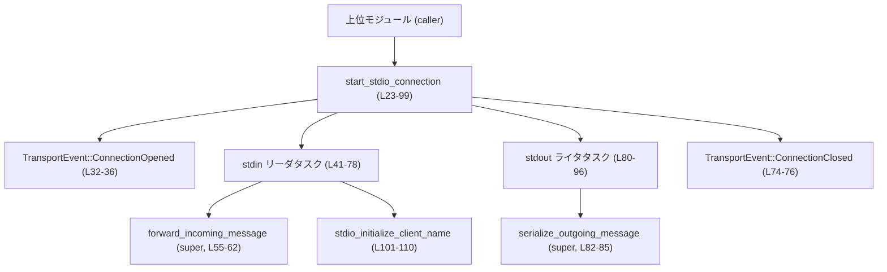
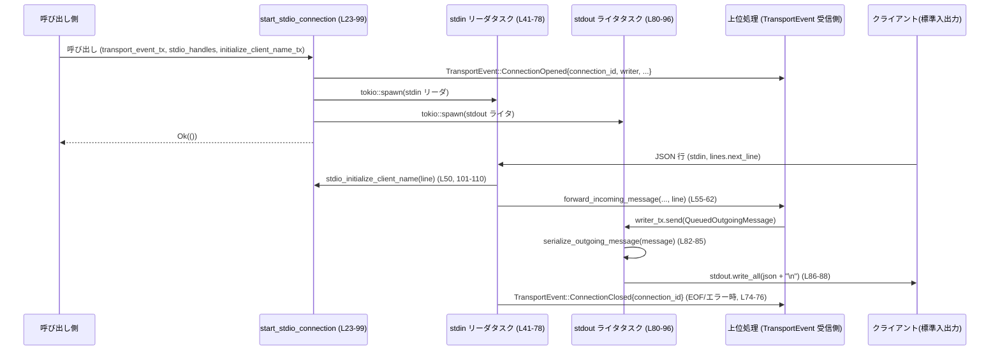

# app-server/src/transport/stdio.rs コード解説

---

## 0. ざっくり一言

標準入出力（stdin/stdout）を Tokio の非同期 I/O とチャネルでラップし、JSON-RPC ベースのクライアントとの通信を `TransportEvent` に変換するトランスポート実装です。[根拠: app-server/src/transport/stdio.rs:L23-99]

---

## 1. このモジュールの役割

### 1.1 概要

- 標準入出力を通じた 1 つの論理接続を確立し、その接続に一意な `connection_id` を割り当てます。[根拠:L23-29]
- 上位レイヤに対して `TransportEvent::ConnectionOpened` / `ConnectionClosed` を通知し、受信メッセージを `forward_incoming_message` に橋渡しします。[根拠:L31-38, L55-62, L74-76]
- 上位レイヤから送られてくる `QueuedOutgoingMessage` を JSON 文字列にシリアライズして stdout に書き出します。[根拠:L29-30, L80-95]
- 最初の `initialize` リクエストからクライアント名を取り出し、`oneshot::Sender<String>` 経由で別コンポーネントに渡します。[根拠:L26, L45, L50-54, L101-110]

### 1.2 アーキテクチャ内での位置づけ

このファイルは `transport` モジュール配下にあり、標準入出力を使うトランスポート層の 1 実装として配置されていると解釈できます（`super::CHANNEL_CAPACITY` などを利用）。[根拠:L1-5]

外部コンポーネントとの主な依存関係:

- `super::TransportEvent`  
  - `ConnectionOpened` / `ConnectionClosed` 変種を持つ列挙体と推測できますが、定義はこのチャンクには現れません。[根拠:L2, L32-36, L75-76]
- `super::forward_incoming_message`  
  - stdin から読んだ 1 行の JSON-RPC メッセージを上位に転送し、継続可否（bool）を返します。[根拠:L3, L55-63]
- `super::next_connection_id`  
  - 接続ごとの識別子を生成します（型はこのチャンクには現れません）。[根拠:L4, L28, L32, L75]
- `super::serialize_outgoing_message`  
  - `QueuedOutgoingMessage.message` を JSON 文字列に変換し、失敗時は `None` を返します。[根拠:L5, L82-85]
- `crate::outgoing_message::QueuedOutgoingMessage`  
  - 送信するメッセージと、書き込み完了通知用チャネル `write_complete_tx` を持つ構造体です。[根拠:L6, L29, L82-93]

これらの関係を簡略化した依存関係図は次のとおりです。



### 1.3 設計上のポイント

- **コネクション単位の分離**  
  - 1 接続につき `start_stdio_connection` 1 回、`connection_id` 1 個、stdin/ stdout の 2 タスクという構成になっています。[根拠:L23-29, L41-78, L80-96]
- **非同期・ノンブロッキング I/O**  
  - `tokio::io::stdin`, `stdout` と `AsyncBufReadExt::lines` / `AsyncWriteExt::write_all` を利用し、イベント駆動で I/O を処理します。[根拠:L12-15, L41-44, L80-88]
- **チャネルを用いたスレッド安全な通信**  
  - 上位レイヤとの制御情報は `mpsc::Sender<TransportEvent>` で送信し、下りメッセージは `mpsc::channel<QueuedOutgoingMessage>` でキューイングします。[根拠:L16, L23-25, L29-30, L31-38]
  - クライアント名の初期化は `oneshot::Sender<String>` で 1 度だけ通知されます。[根拠:L17, L26, L45, L50-54]
- **エラー処理の方針**  
  - 上位への接続オープン通知が失敗した場合のみ `IoResult` の `Err` として呼び出し元に伝播し、それ以外の I/O エラーはログ出力後にタスクを終了します。[根拠:L31-38, L66-70, L87-89]
- **JSON-RPC 初期化メッセージの特別扱い**  
  - `initialize` メソッドのリクエストだけをパースして `client_info.name` を抽出し、1 回限りで通知します。[根拠:L26, L45, L50-54, L101-110]

---

## 2. 主要な機能一覧

- 標準入出力を使ったトランスポート接続の開始 (`start_stdio_connection`)  
  [根拠:L23-29, L31-38, L80-98]
- stdin からの行単位読み取りと、上位レイヤへのメッセージ転送 (`forward_incoming_message` 呼び出し)  
  [根拠:L41-48, L55-62]
- 上位レイヤからの送信要求を JSON にシリアライズし、stdout に書き出すライタタスク  
  [根拠:L29-30, L80-95]
- JSON-RPC `initialize` リクエストからのクライアント名抽出 (`stdio_initialize_client_name`)  
  [根拠:L26, L45, L50-54, L101-110]
- 接続の開始・終了を `TransportEvent` として通知  
  [根拠:L31-38, L74-76]

---

## 3. 公開 API と詳細解説

### 3.1 型一覧 / コンポーネントインベントリー

このファイル内で新たに定義される型はありませんが、関数・タスク・チャネルをコンポーネントとして整理します。

#### 関数・タスク一覧

| 名前 | 種別 | 可視性 | 役割 / 用途 | 行範囲 |
|------|------|--------|------------|--------|
| `start_stdio_connection` | 非同期関数 | `pub(crate)` | 標準入出力を使った 1 接続を構成し、stdin リーダと stdout ライタの 2 タスクを起動するエントリポイント | L23-99 |
| `stdio_initialize_client_name` | 関数 | `fn` (モジュール内 private) | 1 行の JSON テキストから `initialize` リクエストかどうかを判定し、クライアント名を抽出する | L101-110 |
| `stdin` リーダタスク | 無名 async クロージャ | モジュール外からは非公開 | stdin を 1 行ずつ読み、`forward_incoming_message` 呼び出しとクライアント名通知を行う | L41-78 |
| `stdout` ライタタスク | 無名 async クロージャ | モジュール外からは非公開 | `QueuedOutgoingMessage` を受信し、JSON にシリアライズして stdout に書き込む | L80-96 |

#### 主要な外部型（このファイルで使用）

| 名前 | 所属 | 推定種別 | このファイルでの利用 | 行範囲 |
|------|------|----------|----------------------|--------|
| `TransportEvent` | `super` | 列挙体と推測 | `ConnectionOpened` / `ConnectionClosed` イベントの送信に使用 | L2, L31-38, L74-76 |
| `QueuedOutgoingMessage` | `crate::outgoing_message` | 構造体 | 下りメッセージと書き込み完了通知をまとめた要素 | L6, L29-30, L82-93 |
| `JSONRPCMessage` | `codex_app_server_protocol` | 列挙体 | 1 行の JSON を JSON-RPC メッセージとしてパースするために使用 | L8, L101-103 |
| `JSONRPCRequest` | 同上 | 構造体 | Request メッセージから `method` と `params` を取り出す | L9, L103-107 |
| `InitializeParams` | 同上 | 構造体 | `initialize` リクエストの `params` を構造化する際に使用 | L7, L109-110 |

### 3.2 関数詳細

#### `start_stdio_connection(transport_event_tx, stdio_handles, initialize_client_name_tx) -> IoResult<()>`

**シグネチャ**

```rust
pub(crate) async fn start_stdio_connection(
    transport_event_tx: mpsc::Sender<TransportEvent>,
    stdio_handles: &mut Vec<JoinHandle<()>>,
    initialize_client_name_tx: oneshot::Sender<String>,
) -> IoResult<()> { /* ... */ }
```

[根拠:L23-27]

**概要**

標準入出力を介した 1 つの JSON-RPC 接続を初期化し、次の処理を行います。[根拠:L23-29, L31-38, L41-78, L80-96]

- 新しい `connection_id` を付与して `TransportEvent::ConnectionOpened` を送信。
- stdin からの入力を処理するタスクと、stdout に出力を書くタスクを生成・起動。
- 最初の `initialize` リクエストからクライアント名を抽出して oneshot チャネルに送信。

**引数**

| 引数名 | 型 | 説明 |
|--------|----|------|
| `transport_event_tx` | `mpsc::Sender<TransportEvent>` | 上位レイヤに対して接続の開始/終了や受信メッセージ（間接的に）を通知する送信専用チャネル。[根拠:L23-25, L31-38, L55-57, L74-76] |
| `stdio_handles` | `&mut Vec<JoinHandle<()>>` | 起動した stdin リーダタスク・stdout ライタタスクのハンドルを格納するベクタ。呼び出し側が後から join する前提と考えられますが、具体的な利用はこのチャンクには現れません。[根拠:L25, L41, L80] |
| `initialize_client_name_tx` | `oneshot::Sender<String>` | 最初の `initialize` リクエストから抽出したクライアント名を 1 回だけ送信するための oneshot チャネルの送信側。[根拠:L26, L45, L50-54] |

**戻り値**

- `IoResult<()>` (`std::io::Result<()>` の別名)。  
  - `Ok(())`: `TransportEvent::ConnectionOpened` を通知し、2 つのタスクを正常に起動できた場合。[根拠:L23-27, L31-38, L41-78, L80-96, L98]
  - `Err(std::io::Error)`: `TransportEvent::ConnectionOpened` の送信に失敗した場合（後述）。[根拠:L31-38]

**内部処理の流れ（アルゴリズム）**

1. **接続 ID と書き込みチャネルの準備**  
   - `next_connection_id()` で新しい `connection_id` を取得。[根拠:L28]
   - `mpsc::channel::<QueuedOutgoingMessage>(CHANNEL_CAPACITY)` で出力メッセージ用チャネル（`writer_tx`, `writer_rx`）を生成。[根拠:L29]
   - stdin リーダタスク内で利用するために `writer_tx` を `clone` して `writer_tx_for_reader` とする。[根拠:L30]

2. **接続オープンイベントの送信**  
   - `TransportEvent::ConnectionOpened { connection_id, writer: writer_tx, disconnect_sender: None }` を構築し、`transport_event_tx.send(...).await` で上位に通知。[根拠:L31-36]
   - 送信に失敗した場合は `ErrorKind::BrokenPipe` の `std::io::Error` に変換して即座に `Err` を返す。[根拠:L37-38]

3. **stdin リーダタスクの生成**  
   - `transport_event_tx` を `clone` してリーダタスク専用の `transport_event_tx_for_reader` を作成。[根拠:L40]
   - `tokio::spawn(async move { ... })` で次の処理を行うタスクを生成し、その `JoinHandle` を `stdio_handles` に push。[根拠:L41, L78]
   - タスク内部では:
     - `io::stdin()` を `BufReader` でラップし、`reader.lines()` で行単位の `Stream` を生成。[根拠:L42-44]
     - `initialize_client_name_tx` を `Option` でラップし、初回のみ送信できるようにする。[根拠:L45, L50-54]
     - 無限ループで `lines.next_line().await` を呼び出し:  
       - `Ok(Some(line))` の場合:
         - `stdio_initialize_client_name(&line)` で `initialize` リクエストならクライアント名を抽出し、まだ `initialize_client_name_tx` が残っていれば `send`。[根拠:L48-54, L101-110]
         - `forward_incoming_message(&transport_event_tx_for_reader, &writer_tx_for_reader, connection_id, &line).await` を呼び、`false` が返れば `break`。[根拠:L55-63]
       - `Ok(None)`（EOF）なら `break`。[根拠:L66]
       - `Err(err)` ならログにエラーを出力して `break`。[根拠:L67-70]
     - ループ終了後、`TransportEvent::ConnectionClosed { connection_id }` を送信し、`debug!` ログを出力。[根拠:L74-77]

4. **stdout ライタタスクの生成**  
   - `tokio::spawn(async move { ... })` で次の処理を行うタスクを生成し、その `JoinHandle` を `stdio_handles` に push。[根拠:L80, L96]
   - タスク内部では:
     - `io::stdout()` を取得し、ループで `writer_rx.recv().await` を呼び続ける。[根拠:L81-82]
     - 受信した `queued_message` ごとに:
       - `serialize_outgoing_message(queued_message.message)` で JSON 文字列を生成。`None` の場合は `continue`。[根拠:L82-85]
       - 末尾に改行文字 `\n` を追加し、`stdout.write_all(json.as_bytes()).await` で書き出し。[根拠:L86-88]
       - 書き込みエラー時は `error!` ログを出力して `break`。[根拠:L87-89]
       - `queued_message.write_complete_tx` が `Some` なら、`send(())` で書き込み完了を通知。[根拠:L91-93]
     - チャネルが閉じられて `recv()` が `None` を返したらループを抜け、`info!` ログを出力して終了。[根拠:L82, L95]

5. **関数の終了**  
   - 2 つのタスクの `JoinHandle` を `stdio_handles` に登録したあと `Ok(())` を返す。[根拠:L80-98]

**Examples（使用例）**

`start_stdio_connection` を呼び出して標準入出力トランスポートを初期化する基本的な例です。`TransportEvent` や `QueuedOutgoingMessage` の中身はこのチャンクにはないため、概念的な例となります。

```rust
use tokio::sync::{mpsc, oneshot};
use tokio::task::JoinHandle;
use std::io::Result as IoResult;
use app_server::transport::{TransportEvent, CHANNEL_CAPACITY};
use app_server::transport::stdio::start_stdio_connection;

#[tokio::main]
async fn main() -> IoResult<()> {
    // TransportEvent を受信する側とのチャネルを用意する
    let (transport_event_tx, mut transport_event_rx) =
        mpsc::channel::<TransportEvent>(CHANNEL_CAPACITY); // capacity は super から

    // クライアント名を 1 回だけ受け取る oneshot チャネル
    let (initialize_client_name_tx, initialize_client_name_rx) =
        oneshot::channel::<String>();

    // 起動したタスクの JoinHandle を保持するベクタ
    let mut stdio_handles: Vec<JoinHandle<()>> = Vec::new();

    // 標準入出力トランスポートを開始
    start_stdio_connection(
        transport_event_tx,
        &mut stdio_handles,
        initialize_client_name_tx,
    ).await?;

    // 以降は transport_event_rx や initialize_client_name_rx を別タスクで処理する…
    // （具体的な使い方はこのチャンクには現れません）

    Ok(())
}
```

**Errors / Panics**

- **`Err` となる条件**  
  - `TransportEvent::ConnectionOpened` の送信に失敗した場合のみ、`ErrorKind::BrokenPipe` を持つ `std::io::Error` に変換されて `Err` が返されます。[根拠:L31-38]
    - これは受信側（イベントプロセッサ）が既にドロップされているなど、「processor unavailable」である状態を表していると解釈できます。
- **タスク内の I/O エラー**  
  - stdin 読み取りエラー時: `error!("Failed reading stdin: {err}")` を出力し、リーダタスクだけが終了します。関数の戻り値には影響しません。[根拠:L67-70]
  - stdout 書き込みエラー時: `error!("Failed to write to stdout: {err}")` を出力し、ライタタスクだけが終了します。[根拠:L87-89]
- **panic の可能性**  
  - この関数内には `unwrap`, `expect`, 明示的な `panic!` 呼び出しは存在せず、`?` 演算子も `IoResult` 変換部分のみで使用されています。[根拠:L23-99]
  - したがって、この関数のロジック自体が panic を起こすことは想定されていません（ただし、Tokio や他のライブラリ内部の panic まではこのチャンクからは分かりません）。

**Edge cases（エッジケース）**

- **イベントプロセッサ未起動**  
  - `transport_event_tx.send(...)` が直ちに失敗した場合、接続は開始されず `Err` が返ります。[根拠:L31-38]
- **stdin が即 EOF**  
  - `lines.next_line().await` が最初から `Ok(None)` を返した場合、接続オープンイベントは既に送られた後ですが、リーダタスクはすぐに `ConnectionClosed` を送信して終了します。[根拠:L48-49, L66, L74-76]
- **無効な／壊れた JSON 行**  
  - `stdio_initialize_client_name` は `Ok(Some(line))` のときだけ呼ばれ、その中で JSON パースに失敗した場合は単に `None` を返します。クライアント名は通知されませんが、`forward_incoming_message` には行テキストがそのまま渡されます。[根拠:L50, L55-60, L101-103]
- **`initialize` が送られない**  
  - `initialize_client_name_tx` は `Option` に包まれたままタスク終了まで使われない可能性があります。その場合、送信側がドロップされることで受信側はエラー（`oneshot::error::RecvError`）になる点に注意が必要です。[根拠:L45, L50-54]
- **送信メッセージがシリアライズできない**  
  - `serialize_outgoing_message` が `None` を返した場合、そのメッセージは stdout には書き込まれずスキップされ、`write_complete_tx` も呼ばれません。[根拠:L82-85, L91-93]

**使用上の注意点**

- **イベントプロセッサの起動順序**  
  - `start_stdio_connection` を呼ぶ前に、`transport_event_tx` の受信側が有効な状態である必要があります。そうでないと `ConnectionOpened` の送信で即座に `Err` になります。[根拠:L31-38]
- **クライアント名の通知は 1 回限り**  
  - `initialize_client_name_tx` は最初の `initialize` リクエストでしか使用されません。2 回目以降の `initialize` は通知されない設計になっています。[根拠:L45, L50-54]
- **`write_complete_tx` とシリアライズ失敗**  
  - シリアライズに失敗した場合、そのメッセージに対応する `write_complete_tx` は決して `send` されません。呼び出し側が「必ず通知が来る」と期待して待っているとハングの原因になります。[根拠:L82-85, L91-93]
- **スレッド安全性**  
  - 共有状態のやり取りには Tokio の `mpsc` / `oneshot` チャネルと、`clone` した `Sender` のみが使われており、共有可変データ構造は登場しません。Rust の所有権・借用規則とチャネルにより、データ競合が発生しない構造になっています。[根拠:L16-17, L23-26, L29-30, L40, L45, L55-57, L82-83]

---

#### `stdio_initialize_client_name(line: &str) -> Option<String>`

**シグネチャ**

```rust
fn stdio_initialize_client_name(line: &str) -> Option<String> { /* ... */ }
```

[根拠:L101-101]

**概要**

1 行のテキスト `line` を JSON としてパースし、JSON-RPC の `initialize` リクエストであれば `params.client_info.name` を抽出して返します。それ以外の場合は `None` を返します。[根拠:L101-110]

**引数**

| 引数名 | 型 | 説明 |
|--------|----|------|
| `line` | `&str` | stdin から読み取った 1 行分の文字列。改行は `lines()` により除去済みです。[根拠:L48-50, L101]

**戻り値**

- `Some(String)`  
  - `line` が JSON-RPC `Request` で、`method == "initialize"` であり、`params` が `InitializeParams` として正常にパースできた場合の `client_info.name`。[根拠:L101-110]
- `None`  
  - JSON パースに失敗した場合、`Request` 以外のメッセージの場合、`method != "initialize"` の場合、または `params` のパースに失敗した場合。[根拠:L101-109]

**内部処理の流れ（アルゴリズム）**

1. `serde_json::from_str::<JSONRPCMessage>(line)` で JSON を `JSONRPCMessage` としてパースし、失敗したら `None`。[根拠:L101-102]
2. `JSONRPCMessage::Request(JSONRPCRequest { method, params, .. })` で Request 変種かどうかをパターンマッチし、そうでなければ `None`。[根拠:L103-105]
3. `method != "initialize"` の場合は `None`。[根拠:L106-107]
4. `params?` で `Option` をアンラップし、`serde_json::from_value::<InitializeParams>(...)` で `InitializeParams` にパース。どこかで失敗すれば `None`。[根拠:L109]
5. 成功した場合に `params.client_info.name` を `Some(...)` で返す。[根拠:L109-110]

**Examples（使用例）**

```rust
// JSON-RPC initialize メッセージの例
let line = r#"{
    "jsonrpc": "2.0",
    "id": 1,
    "method": "initialize",
    "params": {
        "client_info": { "name": "my-client" }
    }
}"#;

let client_name = stdio_initialize_client_name(line);
assert_eq!(client_name.as_deref(), Some("my-client"));
```

```rust
// initialize 以外のメソッドの場合
let line = r#"{
    "jsonrpc": "2.0",
    "id": 2,
    "method": "shutdown",
    "params": {}
}"#;

assert!(stdio_initialize_client_name(line).is_none());
```

**Errors / Panics**

- 内部で `serde_json::from_str` / `serde_json::from_value` を使用していますが、いずれも `Result` を `ok()?` で `Option` に変換しており、失敗しても panic にはなりません。[根拠:L101-102, L109]
- `params?` による `?` も `Option` に対して使われており、`None` を返すだけです。[根拠:L109]
- この関数自身が `Result` を返さない設計のため、エラーはすべて「クライアント名は取得できない」という扱いになります。

**Edge cases（エッジケース）**

- **JSON でない文字列**  
  - `serde_json::from_str` が失敗し、即 `None` となります。[根拠:L101-102]
- **JSON-RPC Request 以外**  
  - Notification や Response など Request 以外のメッセージは `match` 式で弾かれ、`None` になります。[根拠:L103-105]
- **`method` が `"initialize"` 以外**  
  - `method != "initialize"` の場合は `None`。[根拠:L106-107]
- **`params` が欠損している場合**  
  - `params?` により `None` が返り、関数全体として `None` となります。[根拠:L109]
- **`InitializeParams` のスキーマ不一致**  
  - フィールドが足りない/型が異なる場合は `serde_json::from_value` が失敗して `None`。[根拠:L109]

**使用上の注意点**

- この関数は「クライアント名を取得できるかどうか」だけを判定するための補助関数であり、エラーの詳細は呼び出し元には伝わりません。そのためログなどもありません。[根拠:L101-110]
- JSON パースに失敗しても元のメッセージ自体は `forward_incoming_message` 経由で処理されるため、「クライアント名が取れない＝メッセージが無効」というわけではありません。[根拠:L50, L55-60, L101-110]

### 3.3 その他の関数

このファイルには補助的なラッパー関数は存在せず、上記 2 関数のみが定義されています。[根拠:L23-99, L101-110]

---

## 4. データフロー

ここでは、典型的な 1 メッセージの往復（クライアント → サーバ → クライアント）におけるデータフローを示します。

1. 呼び出し側が `start_stdio_connection` を実行し、`TransportEvent::ConnectionOpened` が送信される。[根拠:L23-38]
2. stdin リーダタスクがクライアントからの JSON 行を受信し、`stdio_initialize_client_name` でクライアント名を抽出しつつ、`forward_incoming_message` で上位レイヤへ転送する。[根拠:L41-55, L50-54, L101-110]
3. 上位レイヤは `writer_tx` に `QueuedOutgoingMessage` を送信し、stdout ライタタスクが `serialize_outgoing_message` を経て JSON テキストを stdout に書き出す。[根拠:L29-30, L80-95]

これをシーケンス図で表すと次のようになります。



---

## 5. 使い方（How to Use）

### 5.1 基本的な使用方法

`start_stdio_connection` を使って標準入出力トランスポートを起動する典型的なフローは次のとおりです。

1. `mpsc::channel::<TransportEvent>` を作成し、受信側を別タスクで処理する。
2. クライアント名受信用の `oneshot::channel::<String>` を用意する。
3. `start_stdio_connection` を呼び出し、返ってきた `JoinHandle` 群を `stdio_handles` に蓄える。
4. アプリケーション終了時などに `JoinHandle` を `await` してタスク終了を待つ。

```rust
use tokio::sync::{mpsc, oneshot};
use tokio::task::JoinHandle;
use std::io::Result as IoResult;
use app_server::transport::{TransportEvent, CHANNEL_CAPACITY};
use app_server::transport::stdio::start_stdio_connection;

async fn run() -> IoResult<()> {
    let (transport_event_tx, mut transport_event_rx) =
        mpsc::channel::<TransportEvent>(CHANNEL_CAPACITY);

    let (client_name_tx, client_name_rx) = oneshot::channel::<String>();

    let mut stdio_handles: Vec<JoinHandle<()>> = Vec::new();

    // 標準入出力トランスポート開始
    start_stdio_connection(transport_event_tx, &mut stdio_handles, client_name_tx).await?;

    // 例: クライアント名を待つ（initialize が来なければ Err）
    let _client_name = client_name_rx.await.ok();

    // 例: TransportEvent を処理するループ（具体的な処理内容は他ファイル）
    tokio::spawn(async move {
        while let Some(event) = transport_event_rx.recv().await {
            // event を処理…
        }
    });

    Ok(())
}
```

### 5.2 よくある使用パターン

- **サーバ起動時に 1 回だけ stdio を開く**  
  LSP サーバなど「1 プロセス＝1 クライアント」の前提がある場合、サーバ起動時に `start_stdio_connection` を 1 回呼ぶだけで足ります。[根拠:L23-29]
- **複数接続を識別したい場合**  
  `next_connection_id()` により接続ごとに異なる ID が割り当てられるため、`TransportEvent` 側で `connection_id` に基づいてルーティングする設計が可能です（`TransportEvent` の詳細はこのチャンクには現れません）。[根拠:L28, L32-34, L75]

### 5.3 よくある間違い

```rust
// 誤り例: TransportEvent の受信側を用意せずに呼び出す
let (tx, _rx) = mpsc::channel::<TransportEvent>(CHANNEL_CAPACITY);
// _rx をすぐにドロップしてしまうと…
start_stdio_connection(tx, &mut stdio_handles, client_name_tx).await?;
// ↑ ConnectionOpened の send が失敗し、Err が返る可能性が高い
```

```rust
// 正しい例: 受信側を保持し、どこかで処理する
let (tx, rx) = mpsc::channel::<TransportEvent>(CHANNEL_CAPACITY);
// rx をタスクに渡すなどして保持しておく
tokio::spawn(async move {
    let mut rx = rx;
    while let Some(event) = rx.recv().await {
        // TransportEvent を処理…
    }
});

start_stdio_connection(tx, &mut stdio_handles, client_name_tx).await?;
```

### 5.4 使用上の注意点（まとめ）

- `start_stdio_connection` の戻り値は「接続開始時点の失敗（ConnectionOpened 送信失敗）」しか反映しないため、実行中の I/O エラーを検知したい場合は、`TransportEvent` やログを監視する必要があります。[根拠:L31-38, L67-70, L87-89]
- `stdio_handles` に格納された `JoinHandle<()>` をアプリケーション終了時などに `await` しないと、タスクの終了を待たずにプロセスが落ちる可能性があります（このファイルでは join は行っていません）。[根拠:L25, L41, L80]
- 入力サイズやメッセージ数に対する制限はこのファイルからは読み取れず、非常に大きな JSON 行や大量のメッセージでどう振る舞うかは、`CHANNEL_CAPACITY` や上位処理の実装に依存します。[根拠:L1, L29]

---

## 6. 変更の仕方（How to Modify）

### 6.1 新しい機能を追加する場合

例として、「標準エラー（stderr）へのログ出力強化」や「特定メソッドのフィルタリング」を追加する場合の観点です。

- **stdin 側のロジックを拡張する場合**  
  - 変更対象: stdin リーダタスク内部（`loop` ～ `match` 部分）。[根拠:L47-71]
  - たとえば特定メソッドをログに残したい場合、`stdio_initialize_client_name` と同様に `line` をパースする補助関数を追加し、`Ok(Some(line))` 分岐内にフックを追加するのが自然です。[根拠:L48-55, L101-110]
- **下りメッセージのフォーマットを変えたい場合**  
  - 変更対象: `serialize_outgoing_message` の実装（このチャンクには現れません）。`stdout` ライタタスクは `String` を受け取って書き出すだけの構造なので、シリアライズロジックは上位に閉じ込める方が影響範囲が限定されます。[根拠:L5, L82-88]
- **接続クローズの条件を追加したい場合**  
  - 変更対象: stdin リーダタスクのループ制御や、上位からの「切断要求」を受け取る仕組み（`disconnect_sender` など）です。`TransportEvent::ConnectionOpened` に `disconnect_sender: None` を渡しているため、ここに何らかのチャネルを渡す設計も考えられますが、具体的な仕様はこのチャンクには現れません。[根拠:L32-36]

### 6.2 既存の機能を変更する場合

- **`start_stdio_connection` の契約（前提条件）**  
  - `transport_event_tx` の受信側が有効であること。これが満たされないと、接続開始自体が失敗します。[根拠:L31-38]
  - `stdio_handles` に push される 2 つの `JoinHandle` は「1 接続につき 2 タスク」であるという前提になっており、この数を増減すると呼び出し側の管理ロジックにも影響します。[根拠:L41-78, L80-96]
- **クライアント名の取得タイミングを変える場合**  
  - 現状は「最初に到着した `initialize` Request だけ」を対象としています。[根拠:L45, L50-54]
  - 複数回の `initialize` を扱いたい場合、`initialize_client_name_tx` を `mpsc::Sender<String>` に変えるなど、関数シグネチャの変更が必要になります。
- **エラー報告方法を強化したい場合**  
  - stdin / stdout の I/O エラーは現在 `tracing::error!` ログのみで、呼び出し元には伝播しません。[根拠:L67-70, L87-89]
  - これをイベントとして上位に知らせたい場合は、新たな `TransportEvent` バリアントを追加し、対応する `send` をタスク内に組み込む必要があります（`TransportEvent` の定義はこのチャンクには現れません）。

---

## 7. 関連ファイル

このモジュールと密接に関係するファイル・コンポーネント（名称のみこのチャンクから読み取れるもの）を整理します。

| パス / シンボル | 役割 / 関係 |
|-----------------|------------|
| `super::CHANNEL_CAPACITY` | `QueuedOutgoingMessage` 用 mpsc チャネルのバッファサイズとして使用されます。[根拠:L1, L29] |
| `super::TransportEvent` | 接続の開始・終了、およびおそらくメッセージ転送を表すイベント型です。`ConnectionOpened` / `ConnectionClosed` を利用しています。[根拠:L2, L32-36, L75-76] |
| `super::forward_incoming_message` | stdin からのメッセージを上位レイヤに転送し、処理継続の可否（bool）を返す非同期関数です。[根拠:L3, L55-63] |
| `super::next_connection_id` | 新しい接続 ID を発行する関数です。[根拠:L4, L28, L32, L75] |
| `super::serialize_outgoing_message` | 下りメッセージを JSON 文字列に変換する関数で、失敗時は `None` を返します。[根拠:L5, L82-85] |
| `crate::outgoing_message::QueuedOutgoingMessage` | 下りメッセージと書き込み完了通知チャネルをまとめた構造体です。[根拠:L6, L29, L82-93] |
| `codex_app_server_protocol::*` | JSON-RPC メッセージと `initialize` パラメータのスキーマを定義するプロトコル層です。[根拠:L7-9, L101-110] |

このチャンクにはテストコード（例: `mod tests`）や、このモジュールを実際に呼び出しているコードは現れないため、具体的な動作検証や利用箇所については他ファイルを参照する必要があります。
