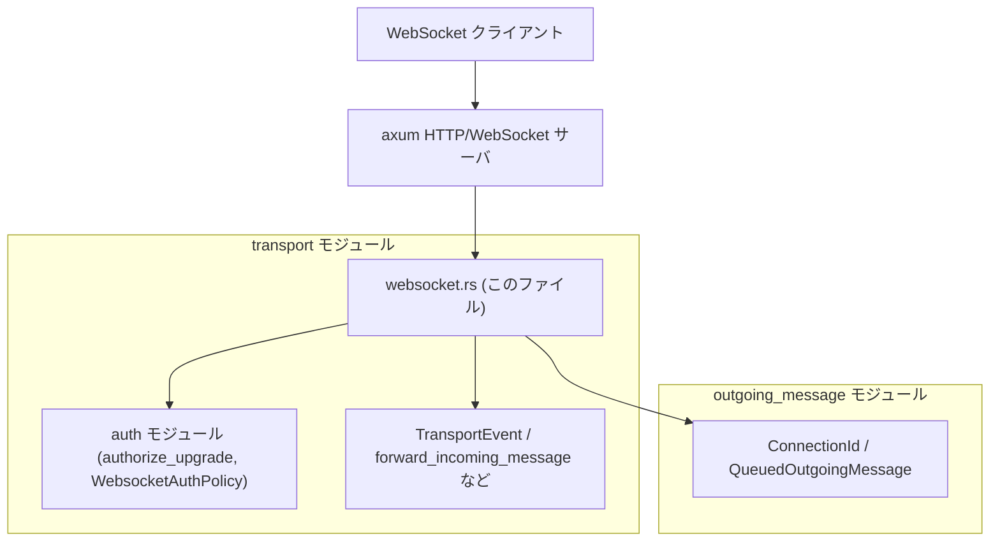
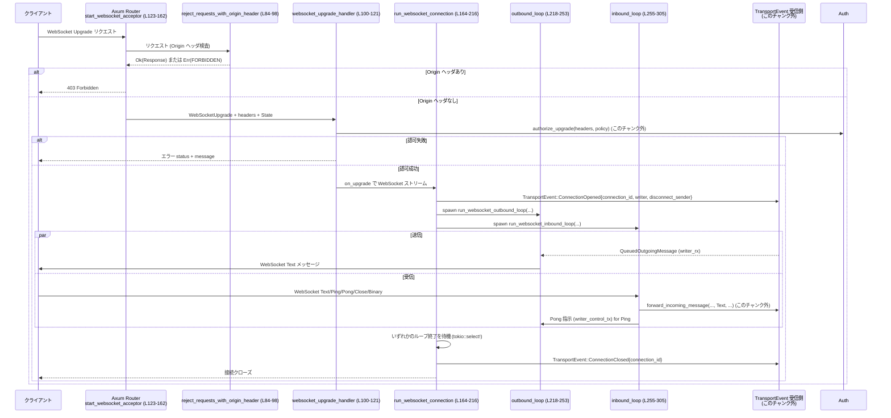

app-server/src/transport/websocket.rs

---

## 0. ざっくり一言

- Axum ベースで WebSocket リスナーを立ち上げ、各接続ごとに inbound/outbound ループを動かし、内部の `TransportEvent` ベースのトランスポート層と連携するモジュールです（`start_websocket_acceptor` 〜 各ループまでが一連の流れです）。  

---

## 1. このモジュールの役割

### 1.1 概要

- このモジュールは、アプリケーションサーバーの **WebSocket トランスポート**を実装しています。
- 具体的には、`TcpListener`→`axum::serve` を使って WebSocket 用リスナーを起動し、  
  - `/readyz` `/healthz` のヘルスチェックエンドポイントの提供（L80-82, L140-143）
  - WebSocket Upgrade 時の Origin ヘッダ拒否・認可（auth）チェック（L84-98, L100-121, L129-134）
  - 各 WebSocket 接続の inbound/outbound メッセージ処理と `TransportEvent` への橋渡し（L164-216, L218-253, L255-305）
  を行います。

### 1.2 アーキテクチャ内での位置づけ

このモジュールは「transport 層」の WebSocket 実装として、上位のトランスポートイベント処理と、外部クライアントとの間の橋渡しをします。

主な依存関係（このチャンクから読み取れる範囲）:

- 上位モジュール
  - `super::TransportEvent`（接続オープン/クローズやメッセージを通知するイベント型, L2）
  - `super::auth::{WebsocketAuthPolicy, authorize_upgrade, should_warn_about_unauthenticated_non_loopback_listener}`（認可ポリシーとチェック, L3-5）
  - `super::{forward_incoming_message, next_connection_id, serialize_outgoing_message}`（メッセージ転送・ID採番・シリアライズ, L6-8）
- 別モジュール
  - `crate::outgoing_message::{ConnectionId, QueuedOutgoingMessage}`（接続 ID と送信キューエントリ, L9-10）

外部ライブラリとしては `axum`（HTTP/WebSocket サーバ）, `tokio`（非同期ランタイム）, `tokio_util::sync::CancellationToken`（キャンセル連携）, `tracing`（ログ）などを利用しています（L11-42, L36-39）。

依存関係の概略図（このファイルに現れる範囲のみ）:



### 1.3 設計上のポイント

コードから読み取れる設計上の特徴です。

- **acceptor と per-connection の分離**  
  - リスナー起動と HTTP ルーティングは `start_websocket_acceptor`（L123-162）に集約。
  - 個々の WebSocket 接続処理は `run_websocket_connection` とその配下の inbound/outbound ループで行う（L164-216, L218-253, L255-305）。

- **非同期・並行処理の構成**  
  - 各接続ごとに 2 つの `tokio::spawn` タスク（inbound/outbound）を起動（L187-200）。
  - `CancellationToken` で接続単位のキャンセルを共有し、どちらかのタスク終了で他方を中止・キャンセル（L171-172, L202-211）。

- **イベント駆動の内部連携**  
  - 接続オープン時に `TransportEvent::ConnectionOpened` を送信し、`writer` と `disconnect_sender` を上位層に渡す（L172-177）。
  - 終了時には `TransportEvent::ConnectionClosed` を送信（L213-215）。
  - メッセージ到着時には `forward_incoming_message` 経由で上位層へ渡す（L271-276）。

- **キューと backpressure**  
  - 送信キュー（`mpsc::channel<QueuedOutgoingMessage>`）と制御フレーム用キュー（`mpsc::channel<WebSocketMessage>`）を分離（L169-171, L185-186）。
  - Origin ヘッダや Ping の応答で、キューが詰まった場合は警告を出しつつ接続を終了させる方針（L283-289）。

- **セキュリティ上の配慮**  
  - `Origin` ヘッダ付きリクエストをミドルウェアで一律拒否（L84-98, L140-145）。
  - Upgrade 前に `authorize_upgrade` を通して WebSocket 認可を行う（L100-113）。
  - 非 loopback かつ認証なしのリスナー起動時には警告ログ（L129-134）。

---

## 2. 主要な機能一覧（コンポーネントインベントリー：機能）

このファイル内の主な機能です（行番号は定義箇所）。

- WebSocket リスナー起動: `start_websocket_acceptor` — Axum/TcpListener を組み立て、`JoinHandle` を返す（L123-162）。
- ヘルスチェック HTTP エンドポイント: `health_check_handler` — `/readyz` `/healthz` 用に 200 OK を返す（L80-82）。
- Origin ヘッダ拒否ミドルウェア: `reject_requests_with_origin_header` — `Origin` ヘッダがあるリクエストを 403 で拒否（L84-98）。
- WebSocket Upgrade ハンドラ: `websocket_upgrade_handler` — Upgrade 認可を行い、接続ごとの処理を起動（L100-121）。
- 接続ごとの統括処理: `run_websocket_connection` — mpsc チャネルを用意し inbound/outbound ループを起動・管理（L164-216）。
- outbound ループ: `run_websocket_outbound_loop` — 上位からの送信キューを取り出し WebSocket テキストメッセージとして送信、完了通知を返す（L218-253）。
- inbound ループ: `run_websocket_inbound_loop` — WebSocket から受信し、テキストは `forward_incoming_message` へ、Ping/Pong/Close を適切に扱う（L255-305）。
- 起動バナー表示: `print_websocket_startup_banner` — 起動時にバナーと URL を stderr に表示（L49-72）。
- 色付けユーティリティ: `colorize` — OwoColors でテキストを着色（L44-47）。

---

## 3. 公開 API と詳細解説

### 3.1 型一覧（構造体・関連外部型）

このファイルで定義されている、または重要な外部型の一覧です。

| 名前 | 種別 | 役割 / 用途 | 定義位置 / 根拠 |
|------|------|-------------|-----------------|
| `WebSocketListenerState` | 構造体 | Axum の `State` として WebSocket リスナーに渡す共有状態。内部に `transport_event_tx` と `auth_policy` を保持する。 | 定義: `app-server/src/transport/websocket.rs:L74-78` |
| `TransportEvent` | 列挙体（推定） | 接続オープン/クローズやメッセージなど、トランスポートレイヤーのイベントを表す。`ConnectionOpened` / `ConnectionClosed` 変種があることがこのファイルから分かる。 | 参照のみ: `super::TransportEvent`（L2）、利用: L172-177, L213-215。定義本体はこのチャンクには現れない。 |
| `WebsocketAuthPolicy` | 構造体/列挙体（不明） | WebSocket Upgrade の認可ポリシー。`authorize_upgrade` と組み合わせて使用。 | 参照のみ: `super::auth::WebsocketAuthPolicy`（L3）, フィールド利用はなし。このチャンクには定義が現れない。 |
| `ConnectionId` | 型エイリアス/構造体（不明） | 接続を一意に識別する ID。`next_connection_id()` で採番され、`TransportEvent` や inbound/outbound ループで使用される。 | 参照のみ: `crate::outgoing_message::ConnectionId`（L9）, 使用: L114-115, L164-166, L213-215, L260。定義はこのチャンクには現れない。 |
| `QueuedOutgoingMessage` | 構造体（推定） | 送信キューに積まれるメッセージと、その完了通知チャンネルを保持する。`message` と `write_complete_tx` フィールドがあることが分かる。 | 参照のみ: `crate::outgoing_message::QueuedOutgoingMessage`（L10）, 使用: L169-170, L220-221, L237-249。定義はこのチャンクには現れない。 |
| `WebSocket` | 型（Axum） | Axum の WebSocket ストリーム型。`split()` により書き込み/読み込みに分割される。 | 参照: L16, L166, L184, L219, L255, L256。定義は axum による。 |
| `WebSocketMessage` | 列挙体（Axum） | WebSocket メッセージ型。`Text`, `Ping`, `Pong`, `Close`, `Binary` などのバリアントが存在する。 | 参照: L15, L185-186, L219-221, L230-236, L241-245, L270-300。 |

### 3.2 関数詳細（重要な 6 件）

#### `start_websocket_acceptor(bind_address, transport_event_tx, shutdown_token, auth_policy) -> IoResult<JoinHandle<()>>`

**シグネチャと位置**

```rust
pub(crate) async fn start_websocket_acceptor(
    bind_address: SocketAddr,
    transport_event_tx: mpsc::Sender<TransportEvent>,
    shutdown_token: CancellationToken,
    auth_policy: WebsocketAuthPolicy,
) -> IoResult<JoinHandle<()>> { /* ... */ }
```

- 定義: `app-server/src/transport/websocket.rs:L123-162`

**概要**

- 指定された `bind_address` で TCP リスナーを立ち上げ、Axum ルータを構成して WebSocket リスナーを起動します。
- `/readyz` `/healthz` のヘルスチェック、WebSocket Upgrade ハンドラ、Origin ヘッダ拒否ミドルウェアを登録します（L140-145）。
- 戻り値として、サーバータスクの `JoinHandle<()>` を `IoResult` で返します（L156-161）。

**引数**

| 引数名 | 型 | 説明 | 根拠 |
|--------|----|------|------|
| `bind_address` | `SocketAddr` | リッスンするアドレス（IP:ポート）。`TcpListener::bind` に渡される。 | L124, L135-137 |
| `transport_event_tx` | `mpsc::Sender<TransportEvent>` | 上位トランスポート層へイベントを送るための送信チャネル。`WebSocketListenerState` に保存される。 | L125, L145-147 |
| `shutdown_token` | `CancellationToken` | グレースフルシャットダウンのトリガ。キャンセルされると Axum サーバを終了させる。 | L126, L153-155 |
| `auth_policy` | `WebsocketAuthPolicy` | WebSocket 認可ポリシー。非 loopback ＋ 認証なしの警告や Upgrade 認証に使われる。 | L127, L129-134, L145-147 |

**戻り値**

- `IoResult<JoinHandle<()>>`  
  - 成功時: Axum サーバを実行する `tokio::spawn` の `JoinHandle<()>` を返します（L156-161）。
  - 失敗時: `TcpListener::bind` や `local_addr` 取得時などの I/O エラーを `Err` として返します（L135-137）。  

**内部処理の流れ**

1. 認証設定と bind アドレスに応じて、非 loopback かつ認証なしなら警告ログを出力（L129-134）。
2. `TcpListener::bind(bind_address).await?` でリスナーをバインド（L135）。
3. 実際の `local_addr` を取得し、起動バナーとリスニングログを表示（L136-138）。
4. `Router::new()` で Axum のルータを構築し、`/readyz` `/healthz` ルートと fallback の `websocket_upgrade_handler` を登録（L140-144）。
5. `middleware::from_fn(reject_requests_with_origin_header)` で Origin ヘッダ拒否ミドルウェアを適用（L144）。
6. `with_state(WebSocketListenerState { .. })` で `transport_event_tx` と `auth_policy` を状態として埋め込み（L145-148）。
7. `axum::serve(listener, router.into_make_service_with_connect_info::<SocketAddr>())` でサーバを作成し（L149-152）、`with_graceful_shutdown` で `shutdown_token.cancelled().await` を登録（L153-155）。
8. 最後にサーバを `tokio::spawn` でバックグラウンド実行し、エラー時にはログ `error!("websocket acceptor failed: {err}")` を出して終了ログを記録（L156-161）。

**Examples（使用例）**

> 注意: `TransportEvent` や `WebsocketAuthPolicy` の具体的な構築方法はこのチャンクには現れないため、コメントで示しています。

```rust
use std::net::SocketAddr;
use tokio::sync::mpsc;
use tokio_util::sync::CancellationToken;
use app_server::transport::{start_websocket_acceptor, TransportEvent};
use app_server::transport::auth::WebsocketAuthPolicy;

#[tokio::main]
async fn main() -> std::io::Result<()> {
    let bind_address: SocketAddr = "127.0.0.1:8080".parse().unwrap();

    // TransportEvent を受け取る側で Receiver を保持しておく
    let (transport_event_tx, _transport_event_rx) = mpsc::channel(1024); // 実 capacity は CHANNEL_CAPACITY を参照

    // 認可ポリシーはこのチャンクでは不明
    let auth_policy: WebsocketAuthPolicy = /* ポリシー構築 */;

    let shutdown_token = CancellationToken::new();

    let handle = start_websocket_acceptor(
        bind_address,
        transport_event_tx,
        shutdown_token.clone(),
        auth_policy,
    ).await?;

    // 何らかのタイミングで shutdown_token.cancel() を呼ぶとリスナーが終了する
    // shutdown_token.cancel();

    // サーバタスクの終了を待つ
    handle.await.unwrap();

    Ok(())
}
```

**Errors / Panics**

- `TcpListener::bind` 失敗, `local_addr` 取得失敗などの I/O エラーは `Err` として呼び出し元に返ります（`?` を使用, L135-137）。
- サーバ起動後の内部エラー（Axum サーバの `await` が `Err`）は `error!` ログで記録されますが、`JoinHandle` の `Result` としては `Ok(())` に包まれます（L156-161）。  
  → 呼び出し側は `JoinHandle` の `JoinError` のみを検知できますが、サーバ内部の I/O エラーはログを見る必要があります。
- panic を明示的に起こすコードはこのチャンクにはありません。

**Edge cases（エッジケース）**

- 非 loopback アドレスかつ認証なし: `should_warn_about_unauthenticated_non_loopback_listener` が `true` の場合、警告ログを出すだけでリスナー起動は継続します（L129-134）。  
  → セキュリティ上の警告は出ますが、強制的に起動を中止しません。
- `transport_event_tx` がすでにクローズされている場合: acceptor 自体は問題なく起動しますが、後続の接続処理で `TransportEvent` 送信が失敗し、接続が即時クローズされる可能性があります（詳細は `run_websocket_connection` 参照, L172-181）。

**使用上の注意点**

- `shutdown_token` は、アプリケーション側のシャットダウン手順と一貫した方法でキャンセルする必要があります。キャンセルされると Axum サーバはグレースフルに終了します（L153-155）。
- `transport_event_tx` の受信側が落ちる（Receiver が Drop される）と、後続の接続ハンドリングが無効化されます（`ConnectionOpened` 送信失敗時に接続処理が打ち切られる, L172-181）。
- 認証を必須にしたい場合は `auth_policy` の構成と `authorize_upgrade` の実装側で制御する必要があります。このチャンク単体では「警告ログのみ」で起動が継続する設計です。

---

#### `websocket_upgrade_handler(websocket, ConnectInfo(peer_addr), State(state), headers) -> impl IntoResponse`

**シグネチャと位置**

```rust
async fn websocket_upgrade_handler(
    websocket: WebSocketUpgrade,
    ConnectInfo(peer_addr): ConnectInfo<SocketAddr>,
    State(state): State<WebSocketListenerState>,
    headers: HeaderMap,
) -> impl IntoResponse { /* ... */ }
```

- 定義: `app-server/src/transport/websocket.rs:L100-121`

**概要**

- Axum の fallback ルートに登録される WebSocket Upgrade ハンドラです。
- Upgrade リクエストヘッダと `WebsocketAuthPolicy` に基づいて認可を行い、成功時に `run_websocket_connection` を起動します。
- 認可失敗時は HTTP ステータス＋メッセージをレスポンスとして返します。

**引数**

| 引数名 | 型 | 説明 | 根拠 |
|--------|----|------|------|
| `websocket` | `WebSocketUpgrade` | Axum がパースした WebSocket Upgrade 要求。`on_upgrade` で実際の WebSocket ストリームに変換される。 | L101, L116-119 |
| `peer_addr` | `SocketAddr` | 接続元クライアントのアドレス。ログ出力に利用。 | L102, L107-115 |
| `state` | `WebSocketListenerState` | `transport_event_tx` と `auth_policy` を保持する共有状態。 | L103, L145-148 |
| `headers` | `HeaderMap` | Upgrade HTTP リクエストのヘッダ全体。認証のため `authorize_upgrade` に渡される。 | L104, L106 |

**戻り値**

- `impl IntoResponse`  
  - 認可成功時: WebSocket Upgrade を完了し、接続処理を行うレスポンス。
  - 認可失敗時: `err.status_code()` と `err.message()` の組み合わせを `IntoResponse` で返す（L112）。

**内部処理の流れ**

1. `authorize_upgrade(&headers, state.auth_policy.as_ref())` を呼び出し、ヘッダとポリシーに基づいて Upgrade の認可を判定（L106）。
2. 認可が `Err(err)` のとき:
   - peer アドレス・エラーメッセージ付きで warning ログを出力（L107-111）。
   - `(err.status_code(), err.message()).into_response()` を返して終了（L112）。
3. 認可成功時:
   - `next_connection_id()` で一意の `connection_id` を採番（L114）。
   - 接続ログを info レベルで出力（L115）。
   - `websocket.on_upgrade(move |stream| async move { ... })` で Upgrade 完了後に `run_websocket_connection` を起動（L116-119）。
   - `into_response()` で Axum のレスポンスとして返却（L120）。

**Examples（使用例）**

この関数は `start_websocket_acceptor` 内で fallback ルートとして登録されるため（L140-144）、通常は明示的に呼び出すことはありません。

ルーティング部分の利用例（抜粋）:

```rust
let router = Router::new()
    .route("/readyz", get(health_check_handler))
    .route("/healthz", get(health_check_handler))
    .fallback(any(websocket_upgrade_handler)) // ここで登録
    .layer(middleware::from_fn(reject_requests_with_origin_header))
    .with_state(WebSocketListenerState {
        transport_event_tx,
        auth_policy: Arc::new(auth_policy),
    });
```

**Errors / Panics**

- 認可エラーは `authorize_upgrade` の戻り値 `Err(err)` を通じて検出され、HTTP レスポンスとしてクライアントに返されます（L106-112）。
- 内部の `on_upgrade` 関数内では `run_websocket_connection` が非同期に実行されます。ここでのエラーは `transport_event_tx` 側のエラーとして扱われます（L164-181）。

**Edge cases（エッジケース）**

- 認可エラーの詳細: `err.message()` や `err.status_code()` の意味・値は、このチャンクには定義が現れないため不明です（L106-112）。
- `state.transport_event_tx` がすでにクローズされている場合:
  - Upgrade 自体は成功し WebSocket 接続は確立されますが、`run_websocket_connection` 内の `TransportEvent::ConnectionOpened` 送信が失敗し、接続処理が即座に終了します（L172-181）。

**使用上の注意点**

- 認証・認可ロジックを変えたい場合は `authorize_upgrade` および `WebsocketAuthPolicy` の実装を変更することになります。このハンドラ自体は「成功／失敗の結果をログに出しレスポンスに反映する」役割に限定されています。
- Origin ヘッダ拒否は別ミドルウェア `reject_requests_with_origin_header` で行われており、本ハンドラに到達する前に Origin ヘッダ付きリクエストは 403 で弾かれます（L84-98, L144）。

---

#### `run_websocket_connection(connection_id, websocket_stream, transport_event_tx)`

**シグネチャと位置**

```rust
async fn run_websocket_connection(
    connection_id: ConnectionId,
    websocket_stream: WebSocket,
    transport_event_tx: mpsc::Sender<TransportEvent>,
) { /* ... */ }
```

- 定義: `app-server/src/transport/websocket.rs:L164-216`

**概要**

- 1 本の WebSocket 接続について、送信キュー／受信ループ／キャンセル連携をセットアップし、inbound/outbound の 2 タスクを起動して管理する関数です。
- 接続の開始と終了時に、それぞれ `TransportEvent::ConnectionOpened` と `TransportEvent::ConnectionClosed` を上位層へ通知します。

**引数**

| 引数名 | 型 | 説明 | 根拠 |
|--------|----|------|------|
| `connection_id` | `ConnectionId` | この接続に割り当てられた一意の ID。`TransportEvent` に含まれる。 | L165, L173-175, L213-215 |
| `websocket_stream` | `WebSocket` | Axum から渡される WebSocket ストリーム。`split()` で writer/reader に分割される。 | L166, L184-185 |
| `transport_event_tx` | `mpsc::Sender<TransportEvent>` | 接続オープン／クローズイベントを上位層へ送るためのチャネル。 | L167, L172-178, L213-215 |

**内部処理の流れ**

1. 接続ローカルの送信キュー `writer_tx` / `writer_rx` を `mpsc::channel<QueuedOutgoingMessage>(CHANNEL_CAPACITY)` で作成し、reader 用にもクローンを保持（L169-171）。
2. 接続単位の `disconnect_token` を新規に生成（L171-172）。
3. `TransportEvent::ConnectionOpened { connection_id, writer: writer_tx, disconnect_sender: Some(disconnect_token.clone()) }` を `transport_event_tx` で送信（L172-177）。
   - `send().await.is_err()` の場合、上位層の Receiver 側が落ちているとみなして早期 return（L178-181）。
4. `websocket_stream.split()` で `websocket_writer` / `websocket_reader` を得る（L184）。
5. Pong など制御フレーム用の `writer_control_tx` / `writer_control_rx` を作成（L185-186）。
6. outbound ループを `tokio::spawn(run_websocket_outbound_loop(...))` で起動（L187-192）。
7. inbound ループを `tokio::spawn(run_websocket_inbound_loop(...))` で起動（L193-200）。
8. `tokio::select!` で、どちらかのタスクが終了するのを待つ（L202-211）。
   - outbound 完了: `disconnect_token.cancel()` を呼んで inbound 側にキャンセルを伝え、`inbound_task.abort()` で強制中止（L203-206）。
   - inbound 完了: 同様に outbound をキャンセル＋ abort（L207-210）。
9. 最後に `TransportEvent::ConnectionClosed { connection_id }` を送信する（失敗しても無視）（L213-215）。

**並行性・キャンセルの挙動**

- inbound/outbound は別スレッドではなく tokio タスクですが、同時に実行されます。
- `disconnect_token` は以下の箇所で監視されています。
  - outbound ループの `tokio::select! { _ = disconnect_token.cancelled() => break; ... }`（L226-228）
  - inbound ループの `tokio::select! { _ = disconnect_token.cancelled() => break; ... }`（L265-267）
- どちらかのループが終了すると `disconnect_token.cancel()` が呼ばれ、もう片方は次のポーリングで終了します（L203-210）。

**Examples（使用例）**

この関数は `websocket_upgrade_handler` 内で `on_upgrade` のコールバックとして呼ばれるため（L116-119）、外部から直接呼び出すことは想定されていません。

**Errors / Panics**

- `TransportEvent::ConnectionOpened` 送信が失敗した場合（チャネルクローズ）、接続処理は何も行わず早期 return します（L172-181）。
- `TransportEvent::ConnectionClosed` 送信の失敗は無視されています（`let _ = ...`）（L213-215）。
- inbound/outbound ループ内でのエラーはそれぞれの関数（後述）で処理されます。

**Edge cases**

- `TransportEvent` の Receiver 側が既に Drop されている場合:
  - `ConnectionOpened` を送信できず、接続は即座に閉じられます（L178-181）。
- inbound/outbound のどちらかのみが異常終了するケース:
  - 先に終了した側に合わせて `disconnect_token` がキャンセルされ、もう一方は `abort()` により強制終了されます（L202-211）。

**使用上の注意点**

- `transport_event_tx` を共有する側は、`ConnectionOpened` で渡される `writer` と `disconnect_sender` を使って、アプリケーション都合で接続を切断したりメッセージを送信することができます（`TransportEvent` の定義は他ファイル）。
- この関数のライフサイクルに依存するリソース（例: アプリケーション側に保持している接続状態）も、`ConnectionClosed` イベントをトリガとしてクリーンアップする設計が自然です。

---

#### `run_websocket_outbound_loop(websocket_writer, writer_rx, writer_control_rx, disconnect_token)`

**シグネチャと位置**

```rust
async fn run_websocket_outbound_loop(
    mut websocket_writer: futures::stream::SplitSink<WebSocket, WebSocketMessage>,
    mut writer_rx: mpsc::Receiver<QueuedOutgoingMessage>,
    mut writer_control_rx: mpsc::Receiver<WebSocketMessage>,
    disconnect_token: CancellationToken,
) { /* ... */ }
```

- 定義: `app-server/src/transport/websocket.rs:L218-253`

**概要**

- 1 接続に対応する WebSocket の **送信方向**を処理するループです。
- 上位層から届いた `QueuedOutgoingMessage` をシリアライズして WebSocket テキストメッセージとして送信し、完了通知（`write_complete_tx`）を必要に応じて返します（L237-249）。
- Ping への応答など、制御フレーム用の `writer_control_rx` も同一ループで処理します（L229-236）。

**引数**

| 引数名 | 型 | 説明 | 根拠 |
|--------|----|------|------|
| `websocket_writer` | `SplitSink<WebSocket, WebSocketMessage>` | WebSocket への送信専用部分。`send` でメッセージを送信。 | L219, L233-235, L244-246 |
| `writer_rx` | `mpsc::Receiver<QueuedOutgoingMessage>` | アプリケーション層からの送信メッセージを受け取るキュー。 | L220, L237-250 |
| `writer_control_rx` | `mpsc::Receiver<WebSocketMessage>` | Ping 応答 (`Pong` など) の制御フレーム専用キュー。 | L221, L229-236 |
| `disconnect_token` | `CancellationToken` | 接続終了の合図。キャンセルされるとループを停止する。 | L222, L226-228 |

**内部処理の流れ**

1. `loop` 内で `tokio::select!` を使い、3 つのイベントを待ち受け（L224-251）:
   - `disconnect_token.cancelled()` → 即 break（L226-228）。
   - `writer_control_rx.recv()` → `Some(message)` なら `websocket_writer.send(message).await`、`None` なら break（L229-236）。
   - `writer_rx.recv()` → `Some(queued_message)` なら処理、`None` なら break（L237-240）。
2. `QueuedOutgoingMessage` 処理（L237-250）:
   - `serialize_outgoing_message(queued_message.message)` で JSON 文字列化を試みる（L241-242）。
   - `None`（シリアライズ不可）の場合は `continue` で次のメッセージへ（L241-243）。
   - 成功時は `WebSocketMessage::Text(json.into())` として送信（L244-246）。
   - エラー（`send` が `Err`）なら break（L244-246）。
   - `queued_message.write_complete_tx` が `Some` なら `write_complete_tx.send(())` を試み、成功／失敗にかかわらず無視（L247-249）。

**Errors / Panics**

- `websocket_writer.send(...)` が失敗した場合（送信エラーや接続クローズ）、ループは break します（L233-235, L244-246）。
- `serialize_outgoing_message` が `None` を返す場合は、そのメッセージだけスキップされます（L241-243）。  
  → この理由やログ出力はこのチャンクには現れません。
- panic を明示的に起こすコードはありません。

**Edge cases**

- `writer_control_rx` / `writer_rx` がクローズされた場合: `recv()` が `None` となり、その側のブランチで break します（L230-232, L238-240）。
- シリアライズ不可なメッセージ: `serialize_outgoing_message(...)` が `None` を返した場合、そのメッセージはクライアントに送られず、`write_complete_tx` も呼ばれません（L241-243, L247-249）。
- `write_complete_tx.send(())` が失敗しても無視されるため、送信完了を待機する側は `recv` に失敗する可能性があります（L247-249）。

**使用上の注意点**

- `QueuedOutgoingMessage` の `message` 内容は `serialize_outgoing_message` が処理できる形式である必要があります。そうでない場合はメッセージが silently drop されます（L241-243）。
- `write_complete_tx` を使って送信完了待ちをしたい場合、Receiver 側が Drop されていると送信成功・失敗の区別がつかなくなる点に注意が必要です（L247-249）。

---

#### `run_websocket_inbound_loop(websocket_reader, transport_event_tx, writer_tx_for_reader, writer_control_tx, connection_id, disconnect_token)`

**シグネチャと位置**

```rust
async fn run_websocket_inbound_loop(
    mut websocket_reader: futures::stream::SplitStream<WebSocket>,
    transport_event_tx: mpsc::Sender<TransportEvent>,
    writer_tx_for_reader: mpsc::Sender<QueuedOutgoingMessage>,
    writer_control_tx: mpsc::Sender<WebSocketMessage>,
    connection_id: ConnectionId,
    disconnect_token: CancellationToken,
) { /* ... */ }
```

- 定義: `app-server/src/transport/websocket.rs:L255-305`

**概要**

- 1 接続の **受信方向**を処理するループです。
- WebSocket からメッセージを読み取り、種別ごとに:
  - `Text`: `forward_incoming_message` で上位層に転送（L270-280）
  - `Ping`: 即座に `Pong` を `writer_control_tx` へ送信（L282-291）
  - `Pong`: 無視（L292）
  - `Close` / `None`: ループ終了（L293）
  - `Binary`: 警告ログを出して破棄（L294-296）
  - `Err`: 警告ログを出してループ終了（L297-300）
  という挙動をとります。

**引数**

| 引数名 | 型 | 説明 | 根拠 |
|--------|----|------|------|
| `websocket_reader` | `SplitStream<WebSocket>` | WebSocket からの受信専用部分。`next().await` で `Option<Result<WebSocketMessage, _>>` を得る。 | L256, L268-276 |
| `transport_event_tx` | `mpsc::Sender<TransportEvent>` | `forward_incoming_message` が利用するイベント送信チャネル。 | L257, L271-273 |
| `writer_tx_for_reader` | `mpsc::Sender<QueuedOutgoingMessage>` | inbound 側から outbound 側へメッセージを送るためのチャネル。`forward_incoming_message` に渡される。 | L258, L273-274 |
| `writer_control_tx` | `mpsc::Sender<WebSocketMessage>` | Ping 応答 (`Pong`) を outbound ループに指示するためのチャネル。 | L259, L283-291 |
| `connection_id` | `ConnectionId` | 現在の接続 ID。`forward_incoming_message` へ渡す。 | L260, L274 |
| `disconnect_token` | `CancellationToken` | 接続終了の合図。キャンセルされるとループを停止する。 | L261, L265-267 |

**内部処理の流れ**

1. `loop` 内で `tokio::select!` を使用（L263-303）:
   - `disconnect_token.cancelled()` → break（L265-267）。
   - `incoming_message = websocket_reader.next()` → `match incoming_message` で分岐（L268-301）。
2. `incoming_message` が `Some(Ok(WebSocketMessage::Text(text)))` の場合（L270-281）:
   - `forward_incoming_message(&transport_event_tx, &writer_tx_for_reader, connection_id, text.as_ref()).await` を呼ぶ（L271-277）。
   - 返り値が `false` の場合、ループを break（L278-280）。
3. `Some(Ok(WebSocketMessage::Ping(payload)))` の場合（L282-291）:
   - `writer_control_tx.try_send(WebSocketMessage::Pong(payload))` を実行（L283-288）。
   - 成功 (`Ok(())`) → 何もしない。
   - `TrySendError::Closed(_)` → break（L285）。
   - `TrySendError::Full(_)` → 警告をログに出し、break（L287-288）。
4. `Some(Ok(WebSocketMessage::Pong(_)))` の場合 → 何もしない（L292）。
5. `Some(Ok(WebSocketMessage::Close(_)))` または `None` の場合 → break（L293）。
6. `Some(Ok(WebSocketMessage::Binary(_)))` の場合 → 「unsupported binary websocket message」警告ログを出し、ループ継続（L294-296）。
7. `Some(Err(err))` の場合 → エラーログを出して break（L297-300）。

**Errors / Panics**

- `websocket_reader.next()` がエラー (`Some(Err(err))`) を返した場合、警告ログを出してループ終了（L297-300）。
- Ping 応答送信時に `writer_control_tx` がクローズまたはフルの場合、接続を閉じる（L283-289）。
- `forward_incoming_message` 自体のエラー型はこのチャンクには現れませんが、戻り値 `bool` によって継続／中断が制御されています（L271-280）。
- panic を明示的に起こすコードはありません。

**Edge cases**

- クライアントが `Binary` フレームを送ってきた場合:
  - 「dropping unsupported binary websocket message」と警告を出すだけで接続は維持されます（L294-296）。
- Ping の頻度が高く `writer_control_tx` が満杯になる場合:
  - 「websocket control queue full while replying to ping; closing connection」と警告を出して接続を終了します（L283-289）。
- `forward_incoming_message` が `false` を返す条件:
  - 具体的な条件は不明ですが、この値が `false` の場合は接続が閉じられます（L271-280）。  
    → 例えばクライアントからのメッセージフォーマットエラーなどが該当する可能性がありますが、このチャンクからは断定できません。

**使用上の注意点**

- `forward_incoming_message` の戻り値 `bool` が接続継続の可否を決めるため、その実装側で「どのようなメッセージで接続を切るか」を明確に設計する必要があります（L271-280）。
- `writer_control_tx` が `CHANNEL_CAPACITY` 以上に積まれないようにすることが望ましいです。Ping 応答の送り漏れを避けるためにも、Ping を起こす側（上位層 or クライアント）と容量設計を合わせる必要があります。

---

#### `reject_requests_with_origin_header(request, next) -> Result<Response, StatusCode>`

**シグネチャと位置**

```rust
async fn reject_requests_with_origin_header(
    request: Request<Body>,
    next: Next,
) -> Result<Response, StatusCode> { /* ... */ }
```

- 定義: `app-server/src/transport/websocket.rs:L84-98`

**概要**

- Axum ミドルウェアとして、`Origin` ヘッダを含むリクエストを一律に拒否します。
- `Origin` ヘッダがある場合は 403 Forbidden、ない場合は次のハンドラに処理を委譲します。

**引数**

| 引数名 | 型 | 説明 | 根拠 |
|--------|----|------|------|
| `request` | `Request<Body>` | 現在処理中の HTTP リクエスト。ヘッダを検査するために使用。 | L85, L88 |
| `next` | `Next` | Axum ミドルウェアチェインの次のハンドラ。`next.run(request).await` で委譲。 | L86, L96 |

**戻り値**

- `Result<Response, StatusCode>`  
  - `Ok(Response)`: `Origin` ヘッダがない場合に次のハンドラが返したレスポンス（L96-97）。
  - `Err(StatusCode::FORBIDDEN)`: `Origin` ヘッダが存在する場合（L94-95）。

**内部処理の流れ**

1. `request.headers().contains_key(ORIGIN)` で `Origin` ヘッダの存在をチェック（L88）。
2. 存在する場合:
   - HTTP メソッドと URI を含む warning ログを出す（L89-93）。
   - `Err(StatusCode::FORBIDDEN)` を返して処理終了（L94）。
3. 存在しない場合:
   - `next.run(request).await` を呼び、結果を `Ok` で包んで返す（L96-97）。

**Examples（使用例）**

`start_websocket_acceptor` 内で次のようにミドルウェアとして登録されています（L144）。

```rust
let router = Router::new()
    // ...
    .fallback(any(websocket_upgrade_handler))
    .layer(middleware::from_fn(reject_requests_with_origin_header))
    .with_state(...);
```

**Errors / Panics**

- `next.run` は `Response` を返す前提であり、`StatusCode` を `Err` として返すのはこのミドルウェア自身だけです。
- panic を明示的に起こすコードはありません。

**Edge cases**

- `Origin` ヘッダの値内容は検査しておらず、「あるかどうか」だけを見ています（L88）。  
  → ブラウザからの WebSocket/HTTP リクエストの多くは `Origin` を送るため、このミドルウェア適用下ではブラウザ起点のアクセスが原則禁止になります。

**使用上の注意点**

- このミドルウェアは `/readyz` `/healthz` を含むすべてのルートに適用されるため（L140-145）、監視ツールやブラウザからのヘルスチェックに `Origin` ヘッダが付く場合は 403 になります。
- CSRF やクロスサイト WebSocket を防ぐための措置と見なせますが、緩めたい場合はこのミドルウェアの適用をやめるか、条件を追加する必要があります。

---

#### `health_check_handler() -> StatusCode`

**位置**

- 定義: `app-server/src/transport/websocket.rs:L80-82`

**概要**

- シンプルに `StatusCode::OK` を返すだけのヘルスチェックハンドラです。
- `/readyz` `/healthz` の両方に使用されています（L140-143）。

**簡易解説**

- 返り値が `StatusCode` なので、Axum が 200 OK レスポンスを組み立てて返します。
- エラーや分岐は一切ありません。

---

#### `print_websocket_startup_banner(addr: SocketAddr)` / `colorize(text, style) -> String`

**位置**

- `colorize`: `app-server/src/transport/websocket.rs:L44-47`
- `print_websocket_startup_banner`: `app-server/src/transport/websocket.rs:L49-72`

**概要**

- 起動時に WebSocket リスナーのアドレスや `/readyz` `/healthz` の URL を、色付きで stderr に出力するためのユーティリティです（L51-71）。
- `addr` が loopback かどうかで注記メッセージを変えています（L63-71）。

---

### 3.3 その他の関数（一覧）

| 関数名 | 役割（1 行） | 定義位置 / 根拠 |
|--------|--------------|-----------------|
| `colorize(text: &str, style: Style) -> String` | OwoColors を使って stderr がカラー出力対応のときのみ色付けを行うヘルパー。 | `app-server/src/transport/websocket.rs:L44-47` |
| `print_websocket_startup_banner(addr: SocketAddr)` | WebSocket リスナーの URL とヘルスチェック URL を色付きで stderr に表示する。 | `app-server/src/transport/websocket.rs:L49-72` |
| `health_check_handler() -> StatusCode` | 常に 200 OK を返すヘルスチェック用 HTTP ハンドラ。 | `app-server/src/transport/websocket.rs:L80-82` |

---

## 4. データフロー

ここでは、1 つの WebSocket 接続がどのように処理されるかを、データフローと呼び出し関係で説明します。

### 4.1 全体の流れ（接続確立〜クローズ）

1. `start_websocket_acceptor` が TCP リスナーと Axum ルータを構成し、リクエストを受け始める（L123-162）。
2. クライアントが WebSocket Upgrade リクエストを送る。
3. ミドルウェア `reject_requests_with_origin_header` が `Origin` ヘッダの有無をチェック（L84-98, L140-145）。
4. `websocket_upgrade_handler` が Upgrade を受け取り、`authorize_upgrade` で認可し、`next_connection_id` で ID を採番（L100-121）。
5. Upgrade 成功後、Axum が WebSocket ストリーム `WebSocket` を `run_websocket_connection` に渡す（L116-119, L164-168）。
6. `run_websocket_connection` が:
   - 上位層へ `TransportEvent::ConnectionOpened` を送信（L172-177）。
   - outbound/inbound ループ用のチャネルとタスクを生成（L169-171, L184-200）。
7. outbound ループ (`run_websocket_outbound_loop`) は上位層からの `QueuedOutgoingMessage` を WebSocket テキストとして送信（L218-253）。
8. inbound ループ (`run_websocket_inbound_loop`) はクライアントからの `Text` メッセージを `forward_incoming_message` で上位層へ転送し、Ping/Pong/Close を処理（L255-305）。
9. どちらかのループが終了すると、`disconnect_token` がキャンセルされ両方のループが止まり、最後に `TransportEvent::ConnectionClosed` が上位層へ送信される（L202-211, L213-215）。

### 4.2 シーケンス図

Mermaid のシーケンス図で、主な関数とデータの流れを示します（行番号付き）。



---

## 5. 使い方（How to Use）

### 5.1 基本的な使用方法

このモジュールを利用する典型的なフローは:

1. アプリケーション起動時に `start_websocket_acceptor` を呼び出し、WebSocket リスナーをバックグラウンドで起動する。
2. `TransportEvent` の Receiver 側で接続オープン・メッセージ・クローズを処理する。
3. 必要に応じて `disconnect_sender` や `writer`（`QueuedOutgoingMessage`）経由でクライアントへメッセージを送る／切断する。

簡略化したイメージコード（外部型の詳細はこのチャンクにはないためコメントで補います）:

```rust
use std::net::SocketAddr;
use tokio::sync::mpsc;
use tokio_util::sync::CancellationToken;
use app_server::transport::{
    start_websocket_acceptor, TransportEvent, CHANNEL_CAPACITY,
};
use app_server::transport::auth::WebsocketAuthPolicy;

#[tokio::main]
async fn main() -> std::io::Result<()> {
    let bind_address: SocketAddr = "0.0.0.0:8080".parse().unwrap();

    // TransportEvent チャネル
    let (transport_event_tx, mut transport_event_rx) =
        mpsc::channel::<TransportEvent>(CHANNEL_CAPACITY);

    let auth_policy: WebsocketAuthPolicy = /* 認可ポリシー構築 */;

    let shutdown_token = CancellationToken::new();

    // WebSocket acceptor を起動
    let ws_handle = start_websocket_acceptor(
        bind_address,
        transport_event_tx.clone(),
        shutdown_token.clone(),
        auth_policy,
    ).await?;

    // 別タスクで TransportEvent を処理
    tokio::spawn(async move {
        while let Some(event) = transport_event_rx.recv().await {
            match event {
                TransportEvent::ConnectionOpened { connection_id, writer, disconnect_sender } => {
                    // writer 経由でメッセージ送信、disconnect_sender で切断指示 など
                }
                TransportEvent::ConnectionClosed { connection_id } => {
                    // 接続クローズのクリーンアップ
                }
                _ => {
                    // 他のイベント種別（このチャンクには現れない）
                }
            }
        }
    });

    // シャットダウンのトリガ発火タイミングで
    // shutdown_token.cancel();

    ws_handle.await.unwrap();
    Ok(())
}
```

### 5.2 よくある使用パターン

- **ローカル開発用**  
  - `bind_address` を `127.0.0.1:ポート` にし、`auth_policy` を緩めに構成。  
  - 起動バナーに「binds localhost only ...」の注記が出ます（L63-66）。

- **リモートからの接続を許可する場合**  
  - `bind_address` を `0.0.0.0:ポート` などに設定。
  - 認証なし (`auth_policy` が「認証不要」設定) の場合は、起動時に警告が出ます（L129-134）。

### 5.3 よくある間違い

```rust
// 間違い例: TransportEvent の Receiver をすぐ Drop してしまう
let (transport_event_tx, transport_event_rx) = mpsc::channel(CHANNEL_CAPACITY);
// transport_event_rx を保持せずスコープから外す

let handle = start_websocket_acceptor(
    bind_address,
    transport_event_tx,
    shutdown_token.clone(),
    auth_policy,
).await?;
// -> run_websocket_connection 内で ConnectionOpened 送信が失敗し、接続が即時切断される可能性がある (L172-181)

// 正しい例: Receiver をどこかで保持し、イベントを処理する
let (transport_event_tx, mut transport_event_rx) = mpsc::channel(CHANNEL_CAPACITY);
tokio::spawn(async move {
    while let Some(event) = transport_event_rx.recv().await {
        // イベント処理
    }
});
```

### 5.4 使用上の注意点（まとめ）

- **Origin ヘッダ**  
  - どのルートに対しても `Origin` ヘッダが付いたリクエストは 403 になります（L84-98, L140-145）。  
    → ブラウザから直接ヘルスチェックや WebSocket を叩く場合は注意が必要です。

- **認証・認可**  
  - リモートアクセス用途では `WebsocketAuthPolicy` と `authorize_upgrade` の設定が重要です。  
  - 現状のコードは「認証なし非 loopback 起動時には警告のみ」であり、強制ブロックはしません（L129-134）。

- **キュー容量と backpressure**  
  - `CHANNEL_CAPACITY` を超えるキューイングが発生すると、Ping 応答のキューが詰まり `writer_control_tx.try_send` が `Full` となり、接続が閉じられます（L283-289）。
  - outbound 送信側でもチャネルクローズ時にはループが終了します（L230-232, L238-240）。

- **メッセージ形式**  
  - inbound は Text メッセージのみを `forward_incoming_message` に渡します（L270-276）。
  - Binary メッセージは警告ログのみで破棄されます（L294-296）。

---

## 6. 変更の仕方（How to Modify）

### 6.1 新しい機能を追加する場合

- **追加の HTTP エンドポイントを増やしたい場合**
  1. `start_websocket_acceptor` 内の `Router::new()` チェーンに `.route("/path", get(handler))` などを追加します（L140-144）。
  2. ハンドラ関数はこのファイルか別モジュールに定義します。

- **特定種別の WebSocket メッセージを扱いたい場合**
  1. `run_websocket_inbound_loop` の `match incoming_message` に新しい分岐を追加します（L269-301）。
  2. 必要なら `forward_incoming_message` のインターフェースや `TransportEvent` に新たなイベント種別を追加します（これらはこのチャンクには現れません）。

- **メッセージフォーマットやシリアライザを変更したい場合**
  1. `serialize_outgoing_message` の実装を変更するか、新しい関数を `run_websocket_outbound_loop` から呼ぶように変更します（L241-243）。

### 6.2 既存の機能を変更する場合

- **Origin ヘッダ拒否ポリシーの変更**
  - 関連箇所: `reject_requests_with_origin_header`（L84-98）とそのミドルウェア登録（L144）。
  - `Origin` を許可したい場合は、条件を緩和するか `.layer(...)` を取り除きます。

- **接続ライフサイクルの変更**
  - 接続開始/終了の通知は `TransportEvent::ConnectionOpened` / `ConnectionClosed` に依存しています（L172-177, L213-215）。
  - これらのイベント仕様を変える場合、`TransportEvent` の定義と、その受信側ロジックも同時に変更する必要があります。

- **キャンセル・シャットダウンの挙動**
  - 接続単位: `disconnect_token` と `tokio::select!` の設定を変更（L171-172, L202-211, L226-228, L265-267）。
  - サーバ全体: `start_websocket_acceptor` の `with_graceful_shutdown` 部分（L153-155）。

---

## 7. 関連ファイル

このモジュールと密接に関係するが、このチャンクには定義が現れないファイル・モジュールです。

| パス / モジュール | 役割 / 関係 |
|-------------------|------------|
| `app-server/src/transport/mod.rs` など（推定） | `super::CHANNEL_CAPACITY`, `super::TransportEvent`, `super::forward_incoming_message`, `super::next_connection_id`, `super::serialize_outgoing_message` の定義元。具体的なパスはこのチャンクには現れませんが、同一 `transport` モジュール内であることが `super::` から分かります（L1-8）。 |
| `app-server/src/transport/auth.rs` など（推定） | `WebsocketAuthPolicy`, `authorize_upgrade`, `should_warn_about_unauthenticated_non_loopback_listener` の実装を含む認証・認可関連モジュール（L3-5）。 |
| `app-server/src/outgoing_message.rs` | `ConnectionId` と `QueuedOutgoingMessage` の定義元。`QueuedOutgoingMessage` のフィールド（`message`, `write_complete_tx`）はこのファイルから読み取れます（L169-170, L237-249）。 |
| テストコード（不明） | このチャンクにはテストコードや `#[cfg(test)]` セクションは存在しません。テストの場所・内容は不明です。 |

---

### Bugs / Security / Tests / 性能などに関する補足（まとめ）

- **潜在的なバグ・注意点**
  - `TransportEvent::ConnectionOpened` 送信失敗時に接続をそのまま閉じるため、`transport_event_tx` の破棄がすぐにクライアント切断につながる設計です（L172-181）。これは意図したフェイルファスト動作と考えられますが、把握しておく必要があります。
  - `serialize_outgoing_message` が `None` を返した場合にログが出ないため、送信されないメッセージが発生しても気付きにくい可能性があります（L241-243）。

- **セキュリティ**
  - Origin ヘッダ拒否（L84-98）と Upgrade 認可（L100-113）、非 loopback 無認証起動時の警告（L129-134）により、ある程度の防御線が張られていますが、「認証なしでも起動できる」点は運用上の判断に委ねられています。
  - Binary メッセージはログ出力の上で破棄されます（L294-296）。任意のバイナリ入力がアプリケーションロジックに渡らないようになっているのは安全性の面で有利です。

- **テスト**
  - このファイル内にはテストは存在せず（`#[cfg(test)]` などもなし）、どのようなテストがあるかはこのチャンクからは不明です。

- **性能・スケーラビリティ**
  - 各接続あたり 2 タスク（inbound/outbound）＋複数の mpsc チャネルを持つモデルのため、非常に多数の接続を扱う場合には `CHANNEL_CAPACITY` の設定やタスク数に注意が必要です（L169-171, L185-186, L187-200, L218-253, L255-305）。
  - backpressure は mpsc チャネルと WebSocket 送信エラーにより自然に発生しますが、キュー溢れ時には接続を閉じる挙動（特に Ping 応答）があるため、期待する QoS と合わせて設計する必要があります（L283-289）。

- **観測性**
  - `tracing::info!`, `warn!`, `error!` が適所に配置されており（L40-42, L89-93, L107-111, L129-134, L138, L157-160, L287-288, L295-299）、接続の開始・終了やエラー・不正入力はログから把握できます。
  - 追加でメトリクス等を取りたい場合は、`run_websocket_connection` の接続開始／終了、`run_websocket_inbound_loop` のメッセージ種別ごとの分岐などが挿入ポイントとして適しています（L172-177, L213-215, L269-301）。
