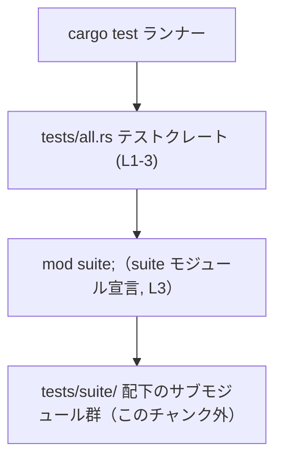

# app-server/tests/all.rs コード解説

## 0. ざっくり一言

`tests/all.rs` は、`suite` モジュール以下のすべてのテストモジュールを 1 つの統合テストバイナリとしてまとめるための「エントリーポイント」として機能するファイルです（`app-server/tests/all.rs:L1-3`）。

---

## 1. このモジュールの役割

### 1.1 概要

- コメントに「Single integration test binary that aggregates all test modules.」とあり、このファイルが全テストモジュールを 1 つの統合テストバイナリに集約する目的であることが分かります（`app-server/tests/all.rs:L1`）。
- `mod suite;` により `suite` モジュールが読み込まれ、実際のテストコードは `suite` モジュール以下に存在すると解釈できます（`app-server/tests/all.rs:L3`）。
- コメントから、`suite` のサブモジュール群は `tests/suite/` ディレクトリに置かれていることが分かります（`app-server/tests/all.rs:L2`）。

### 1.2 アーキテクチャ内での位置づけ

このファイルは Cargo の統合テスト用クレート（`cargo test --test all` で実行されるバイナリ）のルートであり、その中で `suite` モジュールを 1 つだけ読み込む構造になっています。



- `Cargo` は `cargo test` 実行時のテストランナーを表します（一般的な Rust の動作）。
- `All` が本ファイル `tests/all.rs` のテストクレートです（`app-server/tests/all.rs:L1-3`）。
- `Suite` は `mod suite;` により宣言されたモジュールです（`app-server/tests/all.rs:L3`）。
- `Submods` はコメントで言及される「submodules」（`tests/suite/`）であり、このチャンクには定義が現れません（`app-server/tests/all.rs:L2`）。

### 1.3 設計上のポイント

- **単一バイナリへの集約**  
  コメントから、このプロジェクトでは統合テストを 1 つのバイナリ（`all`）に集約する方針が採られていることが読み取れます（`app-server/tests/all.rs:L1`）。
- **責務の分離**  
  このファイルは「テストエントリーポイント」の宣言のみに責務を限定し、実際のテストロジックは `suite` モジュール以下に集約されています（`app-server/tests/all.rs:L1-3`）。
- **状態・エラー・並行性**  
  - このファイル内には状態（構造体フィールドなど）を持つ要素や関数は存在しません（`app-server/tests/all.rs:L1-3`）。
  - 例外処理・`Result`・`panic!` などのエラーハンドリングも登場しません（同上）。
  - スレッドや async/await、`unsafe` も使われておらず、本ファイル単体では並行性・安全性に関する特別な制御はありません（同上）。

---

## 2. 主要な機能一覧

このファイルが提供する「機能」は非常に限定的で、主にモジュール構成に関するものです。

- テストモジュール集約: `suite` モジュール経由で全テストモジュールを 1 つの統合テストクレートに集約する（`app-server/tests/all.rs:L1-3`）。
- テストスイートのエントリーポイント: Cargo の統合テストとして `cargo test --test all` で起動されるクレートルートを提供する（`app-server/tests/all.rs:L1-3`）。

### 2.1 コンポーネント一覧（このファイル内）

| 名前 | 種別 | 定義位置 | 役割 / 用途 | 根拠 |
|------|------|----------|-------------|------|
| `tests/all.rs` クレートルート | テストクレート | `L1-3` | 統合テスト用バイナリ `all` のエントリーポイント | `app-server/tests/all.rs:L1-3` |
| `suite` | モジュール宣言 | `L3` | 実際のテストコードを含む `suite` モジュールの読み込み。中身は別ファイルに定義 | `app-server/tests/all.rs:L3` |

このチャンクには `suite` の中身やサブモジュールの定義は含まれていません。

---

## 3. 公開 API と詳細解説

### 3.1 型一覧（構造体・列挙体など）

このファイルには構造体・列挙体などの **型定義は存在しません**。

| 名前 | 種別 | 役割 / 用途 |
|------|------|-------------|
| （なし） | - | このファイルには型定義がありません（コメントと `mod suite;` のみ） |

- 根拠: ファイル内容は 2 行のコメントと `mod suite;` の 1 行のみであり、`struct` や `enum` の宣言は見当たりません（`app-server/tests/all.rs:L1-3`）。

### 3.2 関数詳細（最大 7 件）

このファイルには関数（`fn`）定義が 1 つもありません。

- 根拠: コード部分は `mod suite;` のみであり、`fn` キーワードや `#[test]` 付き関数は存在しません（`app-server/tests/all.rs:L3`）。

そのため、詳細テンプレートに沿って説明すべき関数は **該当なし** です。

### 3.3 その他の関数

補助的な関数やラッパー関数も定義されていません（`app-server/tests/all.rs:L1-3`）。

---

## 4. データフロー

### 4.1 代表的な処理シナリオ

統合テスト実行時のおおまかな流れは次のようになります。

1. 開発者が `cargo test --test all` を実行する（一般的な Cargo の挙動）。
2. Cargo が `tests/all.rs` をテストクレートとしてコンパイルし、テストバイナリ `all` を生成する（`app-server/tests/all.rs:L1-3`）。
3. コンパイル時に `mod suite;` が解決され、`suite` モジュールの本体（`tests/suite.rs` または `tests/suite/mod.rs` など）が取り込まれる（`app-server/tests/all.rs:L3`）。
4. Rust のテストハーネスが、`suite` モジュール以下の `#[test]` 関数（このチャンク外）を検出して実行する。

このファイル自体にはテスト関数がないため、実際のデータ処理や I/O はすべて `suite` モジュール以下で行われます。

### 4.2 シーケンス図

```mermaid
sequenceDiagram
    participant Dev as 開発者
    participant Cargo as cargo test ランナー
    participant All as tests/all.rs クレート (L1-3)
    participant Suite as suite モジュール (宣言のみ, L3)
    participant Sub as tests/suite/ 配下（このチャンク外）

    Dev->>Cargo: cargo test --test all
    Cargo->>All: テストクレート all を起動
    All->>Suite: mod suite;（コンパイル時に解決）
    Suite->>Sub: サブモジュールを読み込み（tests/suite/）
    Note over Sub: #[test] 関数群がここで実装されていると解釈できるが、このチャンクには現れない
```

- `All` → `Suite` の関係は `mod suite;` が唯一のコード行であるため、直接読み取れます（`app-server/tests/all.rs:L3`）。
- `Sub` の存在とパス `tests/suite/` はコメントから分かりますが、具体的なモジュール名やテスト内容はこのチャンクには現れません（`app-server/tests/all.rs:L2`）。

---

## 5. 使い方（How to Use）

### 5.1 基本的な使用方法

統合テストを実行する基本的な方法は、Cargo の通常のテストコマンドを利用することです。

```bash
# 統合テストバイナリ all のみを実行
cargo test --test all

# all バイナリ内の特定のテスト名だけを実行（例）
cargo test --test all some_test_name
```

- `--test all` は `tests/all.rs` から生成されるテストバイナリを指定するオプションです（`app-server/tests/all.rs:L1-3`）。

`suite` モジュール側の実装例（あくまで一般的なイメージであり、このリポジトリの実コードとは限りません）:

```rust
// tests/suite/mod.rs（例）
// all.rs の `mod suite;` から参照される
mod user_tests;   // tests/suite/user_tests.rs にテストを書く
mod order_tests;  // tests/suite/order_tests.rs にテストを書く

// 各ファイル内で #[test] 関数を定義する
```

このような構成により、`tests/all.rs` からすべてのテストモジュールがたどれる形になります。  
※ Rust のモジュール規則上、`mod suite;` に対応する本体は `tests/suite.rs` または `tests/suite/mod.rs` などになりますが、このチャンクだけではどちらかは特定できません。

### 5.2 よくある使用パターン

一般的な Rust プロジェクトで、このような「統合テスト集約ファイル」を使うパターンとしては次のようなものがあります（本リポジトリが同じ方針かどうかは、このチャンクからは断定できません）。

- **テストを機能ごとのモジュールに分割**  
  `suite` 配下に `user_tests.rs`、`order_tests.rs` などを作り、機能別にテストを整理する。
- **共通ヘルパーの共有**  
  `suite` モジュール内にテスト用のヘルパー関数やフィクスチャを定義し、サブモジュールから共有する。

### 5.3 よくある間違い

一般的なモジュール構成で起こりやすい誤りを挙げます（実際にこのリポジトリで発生しているかどうかは、他ファイルを見ないと分かりません）。

```rust
// 間違い例: all.rs に suite を宣言していない
// ファイル: tests/all.rs
// mod suite; を書き忘れていると、suite のテストはこのバイナリに含まれない

// 正しい例: all.rs から suite を明示的に読み込む
mod suite; // app-server/tests/all.rs:L3
```

```rust
// 間違い例（概念的な例）: suite 配下にファイルを置いたが、mod 宣言を忘れる
// tests/suite/user_tests.rs を作っただけで mod user_tests; を書かない

// 正しい例（概念）:
mod user_tests; // tests/suite/mod.rs から読み込む
```

### 5.4 使用上の注意点（まとめ）

- **`suite` モジュールの存在が前提**  
  `mod suite;` に対応するファイルが存在しないと、コンパイルエラーになります（コンパイル時契約）（`app-server/tests/all.rs:L3`）。
- **テスト関数はこのファイルには書かれない**  
  実際の `#[test]` 関数は `suite` 以下で定義される前提の設計であり、このファイルに追加しても一貫性が低くなります（`app-server/tests/all.rs:L1-3`）。
- **並列実行の制御はここでは行わない**  
  テストの並列実行数などは `cargo test` のオプションや環境変数（`RUST_TEST_THREADS`）で制御され、本ファイルには並行性に関するコードはありません（`app-server/tests/all.rs:L1-3`）。

---

## 6. 変更の仕方（How to Modify）

### 6.1 新しい機能（テストスイート）を追加する場合

このファイルの役割は非常に限定されているため、多くの場合は `suite` モジュール側を変更することになります。このファイルに手を入れる必要があるケースは次のようなものです。

1. **別のトップレベルテストモジュールを追加したい場合**  
   - 例: `mod suite2;` のように別のテストスイートを追加する（あくまで一般的な案であり、本リポジトリがそうするかは不明）。
   - その場合、対応する `tests/suite2.rs` または `tests/suite2/mod.rs` を用意する必要があります。
2. **コメントの更新**  
   - テスト構成が変わった場合（例: ディレクトリ名変更など）、`tests/suite/` に関するコメント（`L2`）を更新する必要があります。

変更手順（一般的な流れ）:

- `suite` モジュール（おそらく `tests/suite.rs` または `tests/suite/mod.rs`）に新しいテストモジュールやテスト関数を追加する。
- 必要であれば、このファイルのコメントを実態に合わせて更新する（`app-server/tests/all.rs:L1-2`）。
- `cargo test --test all` で新しいテストが組み込まれていることを確認する。

### 6.2 既存の機能を変更する場合

このファイルに関して注意すべき点:

- **`mod suite;` を削除・変更する場合の影響**  
  - `mod suite;` を削除すると、`suite` 以下のテストはこのバイナリに含まれなくなります（`app-server/tests/all.rs:L3`）。
  - モジュール名を変更する場合、対応するファイル名（`suite.rs` / `suite/mod.rs`）も変更が必要です。
- **コンパイル時契約**  
  - Rust のモジュールシステム上、`mod suite;` に対応するファイルが存在しなければコンパイルエラーとなるため、リネームや移動の際は必ずペアを一致させる必要があります。

関連するテストや使用箇所:

- このファイル自体がテストクレートのエントリであるため、変更後は必ず `cargo test --test all` を実行して、クレート全体がコンパイル・実行できることを確認する必要があります。

---

## 7. 関連ファイル

このファイルと密接に関係すると考えられるファイル・ディレクトリをまとめます。

| パス | 役割 / 関係 | 根拠 |
|------|------------|------|
| `app-server/tests/all.rs` | 本レポート対象。`suite` モジュールを読み込む統合テストクレートルート | `app-server/tests/all.rs:L1-3` |
| `app-server/tests/suite.rs` または `app-server/tests/suite/mod.rs` | `mod suite;` の本体となるファイル。Rust のモジュール規則上、いずれかが存在する必要があると考えられるが、このチャンクにはどちらかは現れない | `app-server/tests/all.rs:L3` |
| `app-server/tests/suite/` ディレクトリ | コメントで「The submodules live in `tests/suite/`.」とされているサブモジュール配置ディレクトリ。`suite` モジュール配下のテストモジュール群がここに置かれていると解釈できる | `app-server/tests/all.rs:L2` |

このチャンクには `suite` モジュールやそのサブモジュールの具体的な実装は含まれていないため、テスト内容・ドメインロジック・外部サービスとの連携などは **不明** です。安全性・エラー処理・並行性の詳細は、それらのファイルを確認する必要があります。
