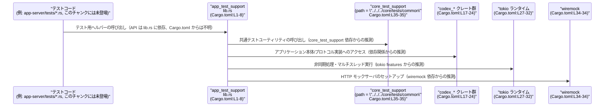

# app-server/tests/common/Cargo.toml コード解説

## 0. ざっくり一言

- `app_test_support` というテスト用ライブラリクレートの Cargo マニフェストであり、ライブラリのエントリポイントと、テストで利用可能な依存クレート群を定義しています（`[package]`, `[lib]`, `[dependencies]` セクションより。根拠: `app-server/tests/common/Cargo.toml:L1-8,L13-36`）。

---

## 1. このモジュールの役割

### 1.1 概要

- このファイルは、`app_test_support` クレートの **メタデータ** と **依存関係** を定義するために存在します（根拠: `name = "app_test_support"` `app-server/tests/common/Cargo.toml:L2-2`）。
- バージョン・エディション・ライセンス・Lints 設定は、ワークスペース共通の値を利用する構成になっています（根拠: `version.workspace`, `edition.workspace`, `license.workspace`, `lints.workspace`。`app-server/tests/common/Cargo.toml:L3-5,L10-11`）。
- 実際のテスト支援ロジックや公開 API 自体は `lib.rs` にあり、このファイルには含まれていません（根拠: `[lib]` セクション `path = "lib.rs"`。`app-server/tests/common/Cargo.toml:L7-8`）。

### 1.2 アーキテクチャ内での位置づけ

このファイルから読み取れる構造を、依存関係レベルで図示します。

```mermaid
graph TD
    T["app-server のテストコード<br/>（推定, このチャンクには未登場）"]
    ATS["app_test_support<br/>(app-server/tests/common/Cargo.toml:L1-8)"]
    CoreTS["core_test_support<br/>(path = \"../../../core/tests/common\"<br/>Cargo.toml:L35-35)"]
    Codex["codex_* ワークスペースクレート<br/>(app-server/tests/common/Cargo.toml:L17-23,24)"]
    Tokio["tokio (rt-multi-thread 他)<br/>(Cargo.toml:L27-32)"]
    Serde["serde / serde_json<br/>(Cargo.toml:L25-26)"]
    Anyhow["anyhow<br/>(Cargo.toml:L14-14)"]
    Misc["chrono, uuid, base64, shlex<br/>(Cargo.toml:L15-16,L33,36)"]
    Wiremock["wiremock<br/>(Cargo.toml:L34-34)"]

    T --> ATS
    ATS --> CoreTS
    ATS --> Codex
    ATS --> Tokio
    ATS --> Serde
    ATS --> Anyhow
    ATS --> Misc
    ATS --> Wiremock
```

- 上図で `T`（テストコード）が `ATS`（`app_test_support`）を利用することはパスと命名からの推測であり、このチャンクにはテストコード自体は現れていません。
- `ATS` がどの依存クレートを実際に呼び出すかは `lib.rs` 側の実装次第であり、このファイルからは分かりません。図は **依存可能なコンポーネントの関係** を示します。

### 1.3 設計上のポイント

コード（TOML）から読み取れる設計上の特徴は次のとおりです。

- **ワークスペース共通設定の活用**  
  - バージョン・エディション・ライセンス・Lints はすべて `workspace = true` によりワークスペースルートで一元管理されています（根拠: `app-server/tests/common/Cargo.toml:L3-5,L10-11`）。
- **ライブラリターゲットのみを定義**  
  - `[lib]` と `path = "lib.rs"` のみで、バイナリターゲットは定義されていません（根拠: `app-server/tests/common/Cargo.toml:L7-8`）。
  - つまり、このクレートはテストヘルパーを提供する **ライブラリ専用クレート** として構成されています。
- **テスト向け依存クレートの集約**  
  - 一般的なユーティリティ (`anyhow`, `chrono`, `uuid`, `base64`, `shlex`) やシリアライズ (`serde`, `serde_json`)、非同期ランタイム (`tokio`) に加え、HTTP モック用の `wiremock` に依存しています（根拠: `app-server/tests/common/Cargo.toml:L14-16,L25-27,L27-32,L33-36`）。
- **非同期・並行実行前提のテスト支援**  
  - `tokio` に `io-std`, `macros`, `process`, `rt-multi-thread` の機能を有効化しており、マルチスレッドな Tokio ランタイムや `#[tokio::test]` などのマクロを使った非同期テストを前提とした構成になっています（根拠: `features = ["io-std","macros","process","rt-multi-thread"]`。`app-server/tests/common/Cargo.toml:L27-32`）。
- **core 層とのテスト支援の共有**  
  - `core_test_support` というパス依存クレートが指定されており、`core/tests/common` 配下のテスト支援ロジックを再利用する構成になっています（根拠: `core_test_support = { path = "../../../core/tests/common" }`。`app-server/tests/common/Cargo.toml:L35-35`）。  
  - これにより、core レイヤと app-server レイヤで共通のテスト補助機能を持てるようになっていると解釈できますが、実際の機能内容はこのチャンクには現れません。

### 1.4 コンポーネント一覧（このファイルで定義・参照される要素）

> このファイルは Rust の関数や構造体を定義しません。その代わり、クレートと依存クレートというコンポーネントを定義しています。

| 名前 | 種別 | 役割 / 用途 | 根拠行 |
|------|------|-------------|--------|
| `app_test_support` | パッケージ（ライブラリクレート） | app-server のテスト共通処理をまとめるクレートであると解釈できます（名前とパスによる推測）。 | `app-server/tests/common/Cargo.toml:L1-5` |
| `[lib]` / `lib.rs` | ライブラリターゲット | このクレートの Rust コード本体（公開 API・コアロジック）は `lib.rs` に実装されます。 | `app-server/tests/common/Cargo.toml:L7-8` |
| `[lints]` | Lints 設定 | ワークスペース共通の Lints 設定を使う指定です。 | `app-server/tests/common/Cargo.toml:L10-11` |
| `anyhow` | 依存クレート | 汎用エラー型 `anyhow::Error` を提供するライブラリです（一般的な知識）。このクレートで利用可能な状態に設定されています。 | `app-server/tests/common/Cargo.toml:L14-14` |
| `base64` | 依存クレート | Base64 エンコード/デコード用ライブラリ（一般的な知識）。 | `app-server/tests/common/Cargo.toml:L15-15` |
| `chrono` | 依存クレート | 日付・時刻の扱いを提供するライブラリ（一般的な知識）。 | `app-server/tests/common/Cargo.toml:L16-16` |
| `codex-app-server-protocol` | ワークスペース依存クレート | codex 系ワークスペース内クレートの一つ。具体的な役割はこのチャンクには現れません。 | `app-server/tests/common/Cargo.toml:L17-17` |
| `codex-config` | ワークスペース依存クレート | codex 系の設定関連クレートと推測されますが、詳細は不明です。 | `app-server/tests/common/Cargo.toml:L18-18` |
| `codex-core` | ワークスペース依存クレート | codex のコアロジックを含むクレートと推測されますが、詳細は不明です。 | `app-server/tests/common/Cargo.toml:L19-19` |
| `codex-features` | ワークスペース依存クレート | 機能フラグや feature 管理に関係するクレートと推測されますが、詳細は不明です。 | `app-server/tests/common/Cargo.toml:L20-20` |
| `codex-login` | ワークスペース依存クレート | ログイン関連機能を提供するクレートと推測されますが、詳細は不明です。 | `app-server/tests/common/Cargo.toml:L21-21` |
| `codex-models-manager` | ワークスペース依存クレート | モデル管理関連クレートと推測されますが、詳細は不明です。 | `app-server/tests/common/Cargo.toml:L22-22` |
| `codex-protocol` | ワークスペース依存クレート | プロトコル関連クレートと推測されますが、詳細は不明です。 | `app-server/tests/common/Cargo.toml:L23-23` |
| `codex-utils-cargo-bin` | ワークスペース依存クレート | Cargo 実行ファイル関連のユーティリティと推測されますが、詳細は不明です。 | `app-server/tests/common/Cargo.toml:L24-24` |
| `serde` | 依存クレート | シリアライズ/デシリアライズ用の汎用ライブラリ（一般的な知識）。 | `app-server/tests/common/Cargo.toml:L25-25` |
| `serde_json` | 依存クレート | JSON 専用のシリアライズ/デシリアライズライブラリ（一般的な知識）。 | `app-server/tests/common/Cargo.toml:L26-26` |
| `tokio` | 依存クレート | 非同期・並行処理用ランタイム。`io-std`, `macros`, `process`, `rt-multi-thread` 機能を有効化しており、マルチスレッドの非同期テストをサポート可能な構成です。実際の利用状況はこのチャンクからは不明です。 | `app-server/tests/common/Cargo.toml:L27-32` |
| `uuid` | 依存クレート | UUID の生成・パースを提供するライブラリ（一般的な知識）。 | `app-server/tests/common/Cargo.toml:L33-33` |
| `wiremock` | 依存クレート | HTTP モックサーバを提供するテスト支援ライブラリ（一般的な知識）。テストで外部 HTTP 通信を模倣するために利用可能な状態です。 | `app-server/tests/common/Cargo.toml:L34-34` |
| `core_test_support` | パス依存クレート | `../../../core/tests/common` 以下にあるテスト支援クレート。core レイヤの共通テストロジックを再利用すると考えられますが、このチャンクにはコードは現れません。 | `app-server/tests/common/Cargo.toml:L35-35` |
| `shlex` | 依存クレート | シェル風のコマンドライン文字列をトークンに分割するユーティリティ（一般的な知識）。 | `app-server/tests/common/Cargo.toml:L36-36` |

---

## 2. 主要な機能一覧

このファイル自体はロジックを実装せず、**設定** のみを行います。その観点からの「機能」は次の 3 点に整理できます。

- クレート定義:  
  - `app_test_support` というライブラリクレートを定義し、テスト用の共通処理をまとめる入れ物を作っています（根拠: `app-server/tests/common/Cargo.toml:L1-2,L7-8`）。
- ワークスペース統合設定:  
  - バージョン・エディション・ライセンス・Lints をワークスペース共通設定に委ね、プロジェクト全体で一貫したコンパイル/スタイルポリシーを適用できるようにしています（根拠: `app-server/tests/common/Cargo.toml:L3-5,L10-11`）。
- テスト向け依存関係の宣言:  
  - 非同期テスト (`tokio`) や HTTP モック (`wiremock`)、シリアライズ (`serde` 系)、エラー処理 (`anyhow`)、uuid/日時などのユーティリティに依存し、`lib.rs` からそれらを利用可能な状態にしています（根拠: `app-server/tests/common/Cargo.toml:L14-16,L25-27,L27-32,L33-36`）。

---

## 3. 公開 API と詳細解説

### 3.1 型一覧（構造体・列挙体など）

- このファイルは Rust の型（構造体・列挙体など）を一切定義していません。
- 公開 API や主要な型は `lib.rs` で定義されているはずですが、その内容はこのチャンクには現れず、把握できません（根拠: `[lib] path = "lib.rs"` のみが記載。`app-server/tests/common/Cargo.toml:L7-8`）。

### 3.2 関数詳細

- このファイルには関数定義は存在しません。
- したがって、「関数詳細（テンプレート）」を適用できる対象はこのチャンクにはありません。
- 実際のテスト支援ロジック（非同期ヘルパー、モックセットアップ関数など）は `lib.rs` 側にあると考えられますが、その署名や処理内容は不明です。

### 3.3 その他の関数

- 補助的な関数やラッパー関数の存在も、このファイルからは判断できません。
- 関数に関するインベントリーは、このチャンクだけでは「不明」となります。

---

## 4. データフロー

このファイル自体は実行時のロジックを持ちませんが、**テスト実行時に想定されるコンポーネント間のデータ/制御フロー** を、Cargo.toml から分かる範囲で抽象的に整理します。



- 上記の矢印は、「この Cargo.toml に記載された依存関係を **どのように利用できるか**」を示した抽象図です。
- 実際にどの関数がどのクレートを呼び出しているか、どんなデータが流れているかは、`lib.rs` およびテストコード側を確認しないと分かりません。

---

## 5. 使い方（How to Use）

### 5.1 基本的な使用方法（Cargo レベル）

このファイルがどのように利用されるかは、主に **Cargo のビルド/テスト時の振る舞い**として理解できます。

1. ワークスペースルートで `cargo test` などを実行すると、Cargo は `app-server/tests/common/Cargo.toml` を読み取り、`app_test_support` クレートをテスト用にビルドします（一般的な Cargo の挙動）。
2. ビルドされた `app_test_support` の公開 API は、他のクレートから通常の依存クレートとして利用できます。

他クレートからこのテスト支援クレートを利用する場合の、概念的な `Cargo.toml` 記述例を示します（相対パスはプロジェクト構成に依存するためダミーです）。

```toml
# 例: app-server 本体クレートの Cargo.toml からテスト用に依存する場合（例示）
[dev-dependencies]
app_test_support = { path = "app-server/tests/common" }  # 実際のパスはワークスペース構成に合わせる
```

- 上記のように `dev-dependencies` に追加することで、そのクレートのテストコードから `app_test_support` の API を利用できるようになります。
- 実際の API 名（関数名・型名）は `lib.rs` を参照する必要があります。このチャンクからは不明です。

### 5.2 よくある使用パターン（設定レベル）

この Cargo.toml の設定から、次のような利用パターンが想定されます（いずれも一般的なパターンであり、実コードは未確認です）。

- **非同期テストサポート**  
  - `tokio` の `macros` と `rt-multi-thread` を有効化しているため、`#[tokio::test]` による非同期テストや、マルチスレッドランタイムを利用するテストが組める構成です（根拠: `app-server/tests/common/Cargo.toml:L27-32`）。
- **HTTP エンドポイントのモック**  
  - `wiremock` に依存しているため、HTTP サービスをモックし、外部依存を切り離したテストを `app_test_support` から提供できる構成です（根拠: `app-server/tests/common/Cargo.toml:L34-34`）。
- **core と app-server 間の共通テストコード利用**  
  - `core_test_support` を path 依存していることから、core レイヤのテスト共通関数を app-server 側のテストでも再利用するパターンが取れます（根拠: `app-server/tests/common/Cargo.toml:L35-35`）。

### 5.3 よくある間違い（想定される編集ミス）

Cargo.toml を編集する際に起きやすい誤りを、このファイルの構成に即して挙げます。

```toml
# 誤り例: features の配列表記を壊してしまう
tokio = { workspace = true, features = [
    "io-std",
    "macros"
    "process",        # ← カンマを消してしまうなど
    "rt-multi-thread",
] }
```

- 上記のように配列表記のカンマやクォートを壊すと、Cargo.toml のパースエラーになり、ビルド/テストが実行できなくなります。

```toml
# 誤り例: path 依存を相対パス編集で壊してしまう
core_test_support = { path = "../../core/tests/common" }  # 本来は "../../../core/tests/common"
```

- `core_test_support` の `path` は相対パスであるため、ディレクトリ構造の変更や誤編集により、Cargo がクレートを見つけられなくなります（根拠: 正しい設定は `app-server/tests/common/Cargo.toml:L35-35`）。

### 5.4 使用上の注意点（まとめ）

- **ワークスペース依存の前提**  
  - 多くの依存クレートが `workspace = true` となっているため、ワークスペースルート側でそれらが正しく定義されていることが前提です（根拠: `app-server/tests/common/Cargo.toml:L3-5,L14-16,L17-27,L33-36`）。  
  - ワークスペース側の定義を削除・変更すると、このクレートのビルドにも影響します。
- **相対パス依存の脆さ**  
  - `core_test_support` の `path` は相対パスであり、ディレクトリ構造を変更すると簡単に壊れます（根拠: `app-server/tests/common/Cargo.toml:L35-35`）。構成変更時にはこのパスの見直しが必要です。
- **非同期・並行性に関する前提**  
  - `tokio` の `rt-multi-thread` を有効化しているため、テストヘルパーがマルチスレッドランタイムの存在を前提にしている可能性があります（これは tokio の一般的な使い方からの推測であり、このチャンクからは実際の使用箇所は不明です）。  
  - `features` を安易に変更すると、その前提に依存したテストコードが動作しなくなる可能性があります。
- **セキュリティ面**  
  - このクレートは `tests/common` 配下にあり、通常は **テスト専用** と解釈されます（パスからの推測）。したがって `wiremock` などテスト専用ライブラリが本番バイナリに含まれる構成ではないと考えられますが、実際のワークスペース設定がこのチャンクには現れないため、最終成果物への影響は断定できません。

---

## 6. 変更の仕方（How to Modify）

### 6.1 新しい機能を追加する場合（テスト支援ロジック側の前準備）

`app_test_support` に新しいテストヘルパー機能を追加する際、この Cargo.toml の観点では主に次のステップが発生します。

1. **必要な依存クレートの追加**  
   - 追加するテストヘルパーが新しい外部クレートを必要とする場合、`[dependencies]` に追記します。  
   - ワークスペースすでに同じクレートを定義している場合は、他と揃えて `workspace = true` を使うのが一貫した構成になります（根拠: 既存の多くの依存が `workspace = true`。`app-server/tests/common/Cargo.toml:L14-16,L17-27,L33-36`）。

   ```toml
   # 例: workspace で既に定義済みの reqwest を追加する場合（あくまで構文例）
   reqwest = { workspace = true }
   ```

2. **core 側に置くか app 側に置くかの判断**  
   - core レイヤにも共通するテスト支援なら `core_test_support` 側に置く設計も考えられますが、この判断はワークスペース全体の方針に依存し、このチャンクだけからは結論は出せません。

3. **`lib.rs` での公開 API 追加**  
   - 実際の関数・型定義は `lib.rs` に追加します。このステップはこのファイルには現れませんが、`[lib] path = "lib.rs"` からそのファイルがエントリポイントであることは分かります（根拠: `app-server/tests/common/Cargo.toml:L7-8`）。

### 6.2 既存の機能を変更する場合（Cargo.toml 観点）

- **依存クレートの差し替え・バージョン変更**  
  - ワークスペース共通のバージョン設定を変更する場合は、ワークスペースルートの `Cargo.toml` の `workspace.dependencies` などを修正する必要があります。このファイル単体の編集では済まない点に注意が必要です（根拠: `version.workspace = true`, `workspace = true` の利用。`app-server/tests/common/Cargo.toml:L3-3,L14-16,L17-27,L33-36`）。
- **Tokio の feature を変更する場合**  
  - `rt-multi-thread` を外す、`process` を外すなどの変更は、`lib.rs` やテストコードがそれら機能に依存していないか事前に確認する必要があります（依存の有無はこのチャンクには現れません）。
- **core_test_support との関係変更**  
  - `core_test_support` の path を変更する、または依存を削除する場合、core 側のテスト共通機能に依存している API がないかを `lib.rs` 側で確認する必要があります（根拠: 現状は `core_test_support` に依存している。`app-server/tests/common/Cargo.toml:L35-35`）。

---

## 7. 関連ファイル

この Cargo.toml と密接に関係すると考えられるファイル・ディレクトリを列挙します。

| パス | 役割 / 関係 |
|------|------------|
| `app-server/tests/common/lib.rs` | `[lib] path = "lib.rs"` で指定されているこのクレートの本体ファイルです。`app_test_support` の公開 API やコアロジックはここに実装されていると考えられます（根拠: `app-server/tests/common/Cargo.toml:L7-8`）。 |
| `core/tests/common` ディレクトリ | `core_test_support = { path = "../../../core/tests/common" }` で指し示されているパスです。このディレクトリ配下に core 層向けのテスト共通クレートが存在すると考えられますが、具体的なファイル構成はこのチャンクには現れません（根拠: `app-server/tests/common/Cargo.toml:L35-35`）。 |
| ワークスペースルートの `Cargo.toml` | `version.workspace = true`, `edition.workspace = true`, `license.workspace = true`, `lints.workspace = true`, および各種依存の `workspace = true` を解決するための設定が記述されているファイルです。このファイル自体は提示されていませんが、構文上存在が前提とされています（根拠: `app-server/tests/common/Cargo.toml:L3-5,L10-11,L14-27,L33-36`）。 |

---

### このチャンクから分からないこと（明示）

- `app_test_support` の中にどのような関数・型・モジュール構成があるか（`lib.rs` が未提供のため不明）。
- 各 `codex-*` クレートの正確な役割および API。
- 実際のテストコード（どのクレートから、どのように `app_test_support` を利用しているか）。

これらについては、この Cargo.toml からは推測以上のことは言えず、詳細を知るには該当ファイル群の確認が必要です。
