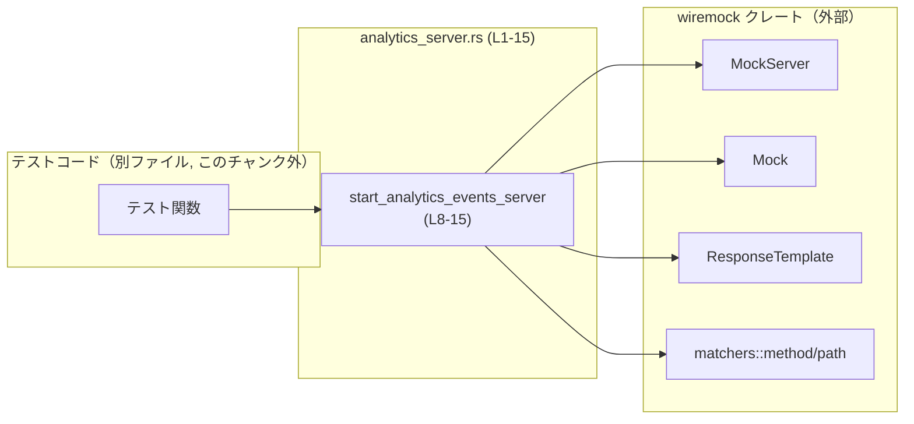
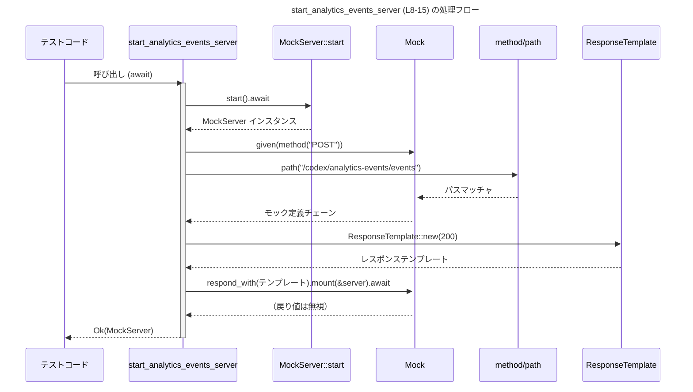
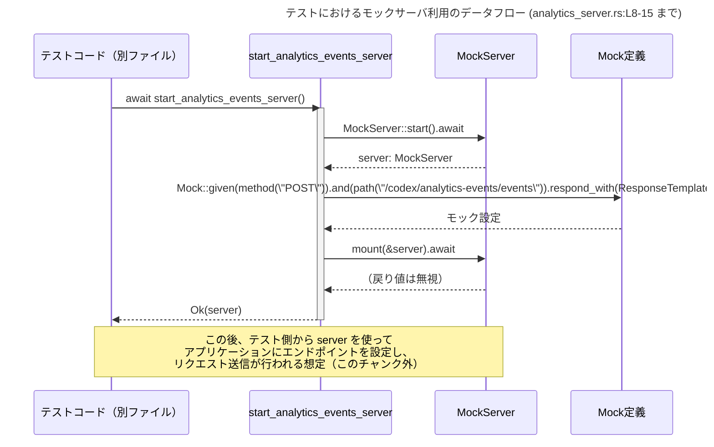

# app-server/tests/common/analytics_server.rs

## 0. ざっくり一言

`wiremock` を使って、分析イベント用の HTTP モックサーバを起動するテスト用ユーティリティです（`POST /codex/analytics-events/events` に 200 を返すサーバを立ち上げます）。  
（根拠: `MockServer::start` と `Mock::given(...).respond_with(ResponseTemplate::new(200))` を呼び出しているため `analytics_server.rs:L8-15`）

---

## 1. このモジュールの役割

### 1.1 概要

- このモジュールは、テストコードから簡単に利用できる **分析イベント用のダミー HTTP サーバ** を起動する関数を提供します。
- `wiremock` クレートを使用し、特定のパスへの `POST` リクエストに対してステータスコード `200` を返すように設定します。  
  （根拠: `use wiremock::MockServer`, `Mock::given(method("POST")).and(path("/codex/analytics-events/events")).respond_with(ResponseTemplate::new(200))` `analytics_server.rs:L2-5,L10-12`）

### 1.2 アーキテクチャ内での位置づけ

このファイル自体はテスト用ヘルパであり、実運用コードではなく **テスト環境での外部サービスの代役** として機能します。

想定される関係を簡単な依存関係図で示します。



- テストコードは `start_analytics_events_server` を呼び出してモックサーバを取得します。
- この関数は wiremock の `MockServer` を起動し、`Mock` によるレスポンス設定を行います。  
  （根拠: `pub async fn ... -> Result<MockServer>`, `MockServer::start().await`, `Mock::given(...).mount(&server).await` `analytics_server.rs:L8-14`）

### 1.3 設計上のポイント

- **非同期 API**  
  関数は `async fn` として定義されており、非同期ランタイム上で実行される前提になっています。  
  （根拠: `pub async fn start_analytics_events_server` `analytics_server.rs:L8`）

- **汎用的なエラー型 `anyhow::Result`**  
  戻り値に `anyhow::Result<MockServer>` を使用し、上位のテストコードからは `?` 演算子で扱いやすくしていますが、関数内部で `Err` を返す処理は書かれていません。  
  （根拠: `use anyhow::Result;`, 関数本体内に `?` や `return Err(...)` が存在しない `analytics_server.rs:L1,L8-15`）

- **責務の限定**  
  - 「サーバの起動」と「特定エンドポイントへの固定レスポンスの設定」にのみ責務を限定しています。  
    （根拠: `MockServer::start().await` と 1 つの `Mock::given(...).mount(...)` のみを呼んでいる `analytics_server.rs:L9-14`）
  - Request ボディやヘッダの検証は行っていません（このチャンクにはその設定がありません）。

- **状態の局所化**  
  - `MockServer` インスタンスはローカル変数 `server` にのみ格納され、呼び出し元へ返されます。グローバルな状態はありません。  
    （根拠: `let server = MockServer::start().await;` と `Ok(server)` `analytics_server.rs:L9,L15`）

---

## 2. 主要な機能一覧

このモジュールが提供する主要な機能は 1 つです。

- `start_analytics_events_server`: 分析イベント用のモック HTTP サーバを非同期に起動し、`POST /codex/analytics-events/events` に対して `200` を返すよう設定する。

---

## 3. 公開 API と詳細解説

### 3.1 型一覧（構造体・列挙体など）

このファイル内で **定義されている** 型はありません。  
ただし、外部クレートの型をインポートして利用しています。

| 名前 | 種別 | 定義位置 | 役割 / 用途 | 根拠 |
|------|------|----------|------------|------|
| `MockServer` | 構造体（外部） | `wiremock::MockServer` | HTTP モックサーバインスタンスを表し、起動したサーバをテストで操作するために用います。 | `use wiremock::MockServer;` `analytics_server.rs:L3` |
| `Mock` | 構造体（外部） | `wiremock::Mock` | リクエストマッチャとレスポンステンプレートを組み合わせたモック定義を表します。 | `use wiremock::Mock;` `analytics_server.rs:L2` |
| `ResponseTemplate` | 構造体（外部） | `wiremock::ResponseTemplate` | ステータスコードなどレスポンス内容を定義するテンプレートです。 | `use wiremock::ResponseTemplate;` `analytics_server.rs:L4` |
| `method` | 関数 / マッチャ（外部） | `wiremock::matchers::method` | HTTP メソッドに基づいてリクエストをマッチさせるためのヘルパです。 | `use wiremock::matchers::method;` `analytics_server.rs:L5` |
| `path` | 関数 / マッチャ（外部） | `wiremock::matchers::path` | リクエストパス（URL パス）に基づいてマッチングするためのヘルパです。 | `use wiremock::matchers::path;` `analytics_server.rs:L6` |

> 注: これら型・関数の内部実装や詳細な仕様は外部クレートに依存するため、このチャンクからは分かりません。

### 3.2 関数詳細

#### `start_analytics_events_server() -> Result<MockServer>`

**シグネチャ**

```rust
pub async fn start_analytics_events_server() -> Result<MockServer>   // analytics_server.rs:L8
```

**概要**

- 分析イベント用のモック HTTP サーバを起動し、  
  `POST /codex/analytics-events/events` へのリクエストに対してステータスコード `200` を返すように設定した上で、サーバインスタンスを返します。  
  （根拠: `MockServer::start().await;` と `Mock::given(method("POST")).and(path("/codex/analytics-events/events")).respond_with(ResponseTemplate::new(200))` `analytics_server.rs:L9-12`）

**引数**

- 引数はありません。

**戻り値**

- 型: `Result<MockServer>` (`anyhow::Result` の型エイリアス)  
  （根拠: 関数シグネチャ `-> Result<MockServer>` `analytics_server.rs:L8`）
- 意味:
  - `Ok(MockServer)`: モックサーバの起動と指定エンドポイントの設定が完了した状態のサーバインスタンス。
  - `Err(...)`: この関数の中には `Err` を生成するコードがないため、どのような条件で `Err` が返るかは、このチャンクだけからは分かりません。  
    実際には、内部で使用している外部クレートがパニックするかどうかなどに依存します。

**内部処理の流れ**

コードの処理をステップに分解します。

1. `MockServer` の起動  

   ```rust
   let server = MockServer::start().await;                  // analytics_server.rs:L9
   ```  

   非同期メソッド `MockServer::start()` を `await` し、新しいモックサーバを起動し、そのインスタンスをローカル変数 `server` に束縛します。

2. `POST` メソッドのリクエストに対するモック定義の作成  

   ```rust
   Mock::given(method("POST"))                              // analytics_server.rs:L10
   ```

   - `Mock::given(...)` によって、「どのようなリクエストに反応するか」を示す最初の条件として、HTTP メソッドが `POST` であることを指定します。

3. パス `/codex/analytics-events/events` のリクエストに限定  

   ```rust
       .and(path("/codex/analytics-events/events"))         // analytics_server.rs:L11
   ```  

   - `.and(...)` により、リクエストパスが `/codex/analytics-events/events` であることを追加条件として組み合わせます。

4. レスポンス内容の設定  

   ```rust
       .respond_with(ResponseTemplate::new(200))            // analytics_server.rs:L12
   ```  

   - ステータスコード `200` を返すレスポンステンプレートを作成し、それをこのモックに紐付けます。

5. モックをサーバにマウント  

   ```rust
       .mount(&server)                                      // analytics_server.rs:L13
       .await;                                              // analytics_server.rs:L14
   ```  

   - 上記で定義したモックを、起動した `server` に登録します。
   - 戻り値は無視されており、型はこのチャンクからは分かりません（`let` などで受けていないため）。

6. サーバインスタンスを返す  

   ```rust
   Ok(server)                                               // analytics_server.rs:L15
   ```  

   - 起動・設定済みのモックサーバを `Ok(...)` で呼び出し元に返します。

**処理フロー図**

この関数の処理の流れをシーケンス図で示します。



**Examples（使用例）**

以下は、この関数をテストから利用する典型的な例です。  
（テストフレームワークやランタイムはこのファイルには出てきませんが、一般的な `#[tokio::test]` を用いた例として示します）

```rust
use anyhow::Result;                                             // エラー型として anyhow::Result を使用
use app_server::tests::common::analytics_server::                // 実際のパスはプロジェクト構成に依存
    start_analytics_events_server;                               // 関数をインポート

#[tokio::test]                                                   // 非同期テスト（tokio ランタイムを使用する想定）
async fn sends_analytics_event() -> Result<()> {                 // anyhow::Result を返すテスト
    // モックサーバを起動し、テスト用のエンドポイントを用意する
    let server = start_analytics_events_server().await?;         // analytics_server.rs:L8-15 による処理

    // ここで、アプリケーションの「分析イベント送信」処理に対して
    // server のアドレスをエンドポイントとして渡すなどしてテストを行う。
    // （具体的なクライアントコードはこのチャンクには存在しない）

    Ok(())                                                       // テスト成功
}
```

> 注: 名前空間（`app_server::tests::common::analytics_server` など）はプロジェクト構成に依存し、このチャンクのみからは正確には分かりません。

**Errors / Panics**

- `Result` のエラー型は `anyhow::Error` ですが、関数本体には `Err(...)` を返すコードや `?` 演算子がありません。  
  （根拠: 関数本体 `analytics_server.rs:L9-15`）
- 従って、この関数が `Err` を返す条件は、このチャンク内のコードからは特定できません。
- ただし、以下の点は一般的な注意として挙げられます（コードから直接は分からないため推測扱いです）:
  - `MockServer::start().await` や `.mount(&server).await` 内部でパニックが発生すればテストプロセスごと落ちる可能性があります。
  - これらが `Result` を返すかどうかは、このチャンクには定義がないため不明です。

**Edge cases（エッジケース）**

この関数は引数を取らないため、主なエッジケースは以下のような **環境依存のケース** になります。コードから直接読み取れる範囲と、読み取れない範囲を分けて記述します。

- コードから読み取れること
  - 常に `POST` メソッド・パス `/codex/analytics-events/events` の組み合わせに対してのみモックが設定される。  
    （根拠: `method("POST")` と `path("/codex/analytics-events/events")` `analytics_server.rs:L10-11`）
  - その他のメソッドやパスについては、このモジュールでは何も設定していない。  
    （根拠: 他の `Mock::given` 呼び出しが存在しない `analytics_server.rs:L8-15`）

- コードからは分からないこと
  - その他のメソッド・パスへのリクエストがどう処理されるか（404 になるのか、何も応答しないのかなど）は、wiremock のデフォルト動作に依存し、このチャンクからは分かりません。
  - ポート競合などでサーバ起動に失敗するケースがあるかどうかも、このチャンクからは分かりません。

**使用上の注意点**

- **非同期コンテキスト必須**  
  関数は `async fn` であり、`await` で呼び出す必要があります。同期関数から直接呼び出す場合は、テストランタイムなどでラップする必要があります。  
  （根拠: `pub async fn ...` `analytics_server.rs:L8`）

- **特定のメソッド・パスのみモックされる**  
  - `POST /codex/analytics-events/events` 以外のリクエストについては、この関数ではモックが設定されません。  
    他のパスやメソッドもモックしたい場合は、この関数を拡張する必要があります。  
    （根拠: `method("POST")` と `path("/codex/analytics-events/events")` のみを指定 `analytics_server.rs:L10-11`）

- **エラー処理の一貫性**  
  - 呼び出し側（テストコード）は `anyhow::Result` を返すようにして `?` 演算子でエラーを伝播させると、統一したスタイルで書けます。
  - ただし、現状この関数は実質的に `Ok(MockServer)` しか返さないように見えるため、`unwrap()` などで即座に展開する使い方も考えられます。

### 3.3 その他の関数

このファイルには、補助的な関数やその他の公開関数は存在しません。  
（根拠: 関数定義が `start_analytics_events_server` の 1 つしかない `analytics_server.rs:L8-15`）

---

## 4. データフロー

### 4.1 代表的なシナリオ

代表的なシナリオは「テストコードがモックサーバを起動し、そのサーバに対してアプリケーションが HTTP リクエストを送る」という流れです。  
このファイルに現れる範囲では、以下のようなデータ・制御の流れになります。

1. テストコードが `start_analytics_events_server()` を `await` して呼び出す。
2. 関数が内部で `MockServer::start().await` を呼び、新しいモックサーバを起動する。  
   （根拠: `let server = MockServer::start().await;` `analytics_server.rs:L9`）
3. `Mock::given(...)` でリクエスト条件を設定し、`respond_with(...)` でレスポンス（ステータス 200）を設定し、`mount(&server).await` でサーバに登録する。  
   （根拠: `Mock::given(...).and(...).respond_with(...).mount(&server).await;` `analytics_server.rs:L10-14`）
4. 設定済みの `MockServer` を `Ok(server)` で呼び出し元に返す。  
   （根拠: `Ok(server)` `analytics_server.rs:L15`）

テスト中の HTTP リクエスト自体は別ファイルに存在すると考えられますが、このチャンクには現れません。

### 4.2 データフローのシーケンス図



---

## 5. 使い方（How to Use）

### 5.1 基本的な使用方法

一般的な非同期テストでの利用フローは、以下のようになります。

```rust
use anyhow::Result;                                             // 統一的なエラー型
use crate::tests::common::analytics_server::                    // 実際のパスはプロジェクト構成に依存
    start_analytics_events_server;

#[tokio::test]                                                   // tokio ランタイムで非同期テストを実行する例
async fn my_test() -> Result<()> {
    // 1. モックサーバを起動する
    let server = start_analytics_events_server().await?;         // analytics_server.rs:L8-15

    // 2. アプリケーション側に server のエンドポイントを設定し、
    //    分析イベント送信処理を実行する（この部分は別ファイル／コード）

    // 3. 必要であれば wiremock の機能を用いて、
    //    期待どおりにリクエストが送信されたかを検証する（このチャンクには現れない）

    Ok(())
}
```

### 5.2 よくある使用パターン

1. **単一テストでの一時的なモックサーバ**
   - 各テスト関数内で `start_analytics_events_server().await` を呼び、テストごとに新しいモックサーバを使うパターン。
   - テスト間で状態が共有されないため、テストの独立性が高まります。

2. **複数テストでの再利用（セットアップヘルパ）**
   - `#[tokio::test]` の `setup` 相当のヘルパ関数からこの関数を呼び出し、共通のモックサーバを使うパターン。
   - サーバを再利用するかどうかは、このファイルからは分かりませんが、ライフタイム管理に注意が必要になります。

### 5.3 よくある間違い

```rust
// 間違い例: 非同期コンテキスト外で直接呼び出そうとする
fn test_sync() {
    // コンパイルエラー: async 関数を直接呼び出している
    // let server = start_analytics_events_server(); // NG
}

// 正しい例: 非同期テスト or ランタイム上で await する
#[tokio::test]
async fn test_async() {
    let server = start_analytics_events_server().await.unwrap(); // OK: await 付き
}
```

```rust
// 間違い例: モックされていないパスをテストしてしまう
#[tokio::test]
async fn test_wrong_path() {
    let server = start_analytics_events_server().await.unwrap();

    // ここで、例えば "/other/path" にリクエストを送ると、
    // この関数ではモック設定していないため期待とは異なる挙動になる可能性がある。
    // （wiremock のデフォルト挙動はこのチャンクからは不明）

    // ...
}

// 正しい例: モックされたパスを使用する
#[tokio::test]
async fn test_correct_path() {
    let server = start_analytics_events_server().await.unwrap();

    // アプリケーションに、エンドポイントとして
    // "/codex/analytics-events/events" を指定してイベントを送る想定
    // （具体的なコードはこのチャンクには存在しない）

    // ...
}
```

### 5.4 使用上の注意点（まとめ）

- **非同期コンテキストで必ず `await` すること**  
  `async fn` であるため、`await` を忘れるとコンパイルエラーになります。  
  （根拠: `pub async fn` `analytics_server.rs:L8`）

- **モックされているのは 1 エンドポイントのみ**  
  `POST /codex/analytics-events/events` 以外を使うテストでは別途モック設定が必要です。  
  （根拠: `method("POST")`, `path("/codex/analytics-events/events")` `analytics_server.rs:L10-11`）

- **起動コスト**  
  テストごとに新しいサーバを起動する場合、テストスイート全体の実行時間に影響する可能性があります。  
  ただし、`MockServer::start` の実際のコストはこのチャンクからは分かりません。

---

## 6. 変更の仕方（How to Modify）

### 6.1 新しい機能を追加する場合

例: 別のエンドポイントや HTTP メソッドもモックしたい場合。

1. **追加したいエンドポイントを決める**
   - 例: `POST /codex/analytics-events/bulk-events` など。

2. **既存関数内に `Mock::given` チェーンを追加する**
   - 現在のチェーンの下または上に、追加のモックを定義します。

```rust
// 例: 追加モック（あくまでパターン例）
Mock::given(method("POST"))                                    // 既存
    .and(path("/codex/analytics-events/events"))
    .respond_with(ResponseTemplate::new(200))
    .mount(&server)
    .await;

// 新しいエンドポイント用のモック設定を追加
Mock::given(method("POST"))
    .and(path("/codex/analytics-events/bulk-events"))
    .respond_with(ResponseTemplate::new(202))                  // 例: 202 Accepted
    .mount(&server)
    .await;
```

> 上記はコード例であり、実際にそのパスやステータスコードが必要かどうかはこのチャンクからは分かりません。

1. **呼び出し側テストコードのエンドポイント設定も合わせて変更する必要があります**  
   （テストコードはこのチャンクには現れません）

### 6.2 既存の機能を変更する場合

- **パスやメソッドを変更する**
  - `method("POST")` や `path("/codex/analytics-events/events")` を変更すると、テスト対象アプリケーション側も同じように変更しない限りテストが失敗する可能性があります。  
    （根拠: `Mock::given(method("POST")).and(path(...))` `analytics_server.rs:L10-11`）

- **レスポンスステータスを変更する**
  - `ResponseTemplate::new(200)` を他のステータスコードに変更すると、アプリケーションのエラーハンドリングのテストなどに利用できます。  
    テストの期待値も合わせて変更する必要があります。  
    （根拠: `ResponseTemplate::new(200)` `analytics_server.rs:L12`）

- **影響範囲**
  - このヘルパを利用しているすべてのテストが影響を受けます。
  - 呼び出し箇所の探索には IDE の参照検索機能 (`Find Usages` など) を利用するのが一般的です（このチャンクには情報がありません）。

---

## 7. 関連ファイル

このチャンクから分かる範囲での関連をまとめます。

| パス / モジュール | 役割 / 関係 |
|-------------------|------------|
| `wiremock` クレート | `MockServer`, `Mock`, `ResponseTemplate`, `matchers::method/path` の定義元。モック HTTP サーバ機能を提供します。`analytics_server.rs:L2-6` |
| `anyhow` クレート | `Result` 型の定義元。エラーをラップして扱うためのユーティリティです。`analytics_server.rs:L1` |
| テストコード（例: `app-server/tests/*.rs`） | このヘルパ関数 `start_analytics_events_server` を実際に呼び出すテスト。本チャンクには具体的なファイル名・内容は現れません。 |

> プロジェクト内でこのモジュールをどのファイルが使用しているか、具体的な場所や個数については、このチャンクからは分かりません。
